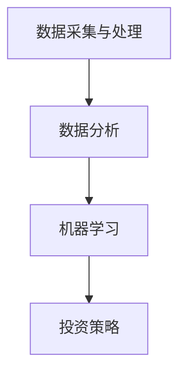
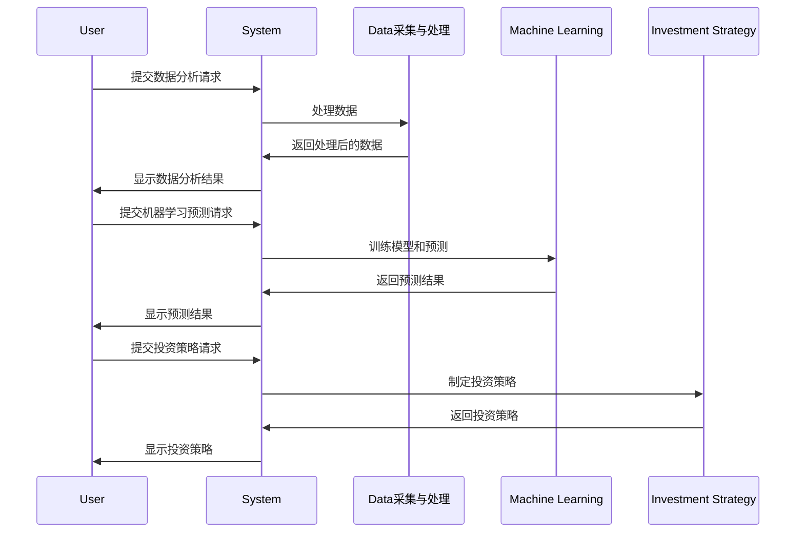

                 

### 文章标题

《费雪的全球化视角：如何在国际市场中寻找投资机会》

### 关键词

全球化、费雪、国际市场、投资机会、战略分析、风险评估、跨国投资

### 摘要

本文将深入探讨费雪的全球化视角，分析其在国际市场中的投资机会。通过详细解读费雪的理论，结合实际案例，本文旨在为企业管理者和投资者提供一套在国际市场中寻找投资机会的方法论，帮助他们在全球化背景下做出明智的投资决策。

## 第一部分：背景介绍

### 核心概念

**全球化**：全球化是指世界各国在经济、政治、文化等领域的相互联系和依存日益加深，形成全球经济一体化、政治多极化、文化多元化的发展趋势。它不仅仅是经济领域的扩展，还涉及社会、科技、文化等各个层面。

**费雪的全球化视角**：费雪（Irving Fisher）是一位著名的经济学家，他在20世纪初期提出了全球化的观点。费雪认为，全球化是一个不可逆转的趋势，各国之间的贸易、投资、人口流动等将不断加深，从而形成一个全球化的经济体系。

### 问题背景

在当今世界，全球化进程日益加快，国际贸易和投资规模不断扩大，跨国公司的数量和影响力也在不断提升。然而，全球化也带来了诸多挑战，如经济风险、文化冲突、环境问题等。在这种背景下，如何在国际市场中寻找投资机会，已成为企业管理者和投资者面临的重要课题。

### 问题解决

《费雪的全球化视角：如何在国际市场中寻找投资机会》这本书正是为解决这一课题而作。本书从费雪的全球化视角出发，分析了全球化对经济、政治、文化等方面的影响，并提出了一系列在国际市场中寻找投资机会的策略和方法。

### 边界与外延

1. **全球化**：全球化不仅涉及经济领域，还包括政治、文化、社会等多个领域。因此，在探讨全球化时，需要考虑其广泛的内涵和外延。
2. **国际市场**：国际市场包括全球市场、区域市场和国家市场。不同的市场具有不同的特点和挑战，需要采取不同的投资策略。
3. **投资机会**：投资机会不仅限于传统的股票、债券、房地产等，还包括数字经济、绿色能源、医疗健康等新兴领域。

### 概念结构与核心要素组成

- **全球化**：经济一体化、政治一体化、文化一体化。
- **国际市场**：市场需求、竞争环境、政策法规。
- **投资机会**：潜在收益、风险分析、市场前景。

## 第二部分：核心概念与联系

### 核心概念

#### 1. 全球化

全球化是指世界各国在经济、政治、文化等领域的相互联系和依存不断加深，形成全球化的世界。具体来说，全球化包括以下三个方面：

- **经济全球化**：指各国之间的贸易、投资、资本流动等经济活动的不断扩展和深化。
- **政治全球化**：指各国在政治、法律、安全等领域的合作和协调。
- **文化全球化**：指不同文化之间的交流、融合和相互影响。

#### 2. 国际市场

国际市场是企业开展跨国经营活动的重要场所。它包括以下三个方面：

- **全球市场**：指全球范围内的市场，如国际股市、全球商品市场等。
- **区域市场**：指特定地区的市场，如欧洲市场、北美市场等。
- **国家市场**：指单一国家的市场，如中国市场、美国市场等。

#### 3. 投资机会

投资机会是指企业在国际市场中可以获取的潜在收益。它包括以下三个方面：

- **新兴市场**：指经济增长迅速、潜力巨大的市场，如印度、中国等。
- **新兴行业**：指处于快速发展阶段、具有巨大潜力的行业，如数字经济、绿色能源等。
- **传统行业**：指已经成熟、但仍有发展空间和机会的行业，如制造业、金融业等。

### 概念属性特征对比表格

| 概念        | 属性特征                                   |  
| ----------- | ------------------------------------------ |  
| 全球化      | 经济一体化、政治一体化、文化一体化       |  
| 国际市场    | 市场需求、竞争环境、政策法规               |  
| 投资机会    | 潜在收益、风险分析、市场前景               |

### ER实体关系图架构

```mermaid
erDiagram
    Globalization ||--|{ InternationalMarket }| InternationalMarket
    InternationalMarket ||--|{ InvestmentOpportunity }| InvestmentOpportunity
```

## 第三部分：算法原理讲解

### 算法原理

在国际市场中寻找投资机会，需要运用数据分析、机器学习和投资策略等多种方法。以下是这些算法的基本原理：

#### 1. 数据分析

数据分析是通过统计方法对大量数据进行分析和处理，以发现数据中的规律和趋势。在国际市场中，数据分析可以帮助我们了解市场动态、竞争环境和政策法规等信息。

#### 2. 机器学习

机器学习是一种通过算法模型和大量数据，使计算机具备自主学习和优化能力的方法。在国际市场中，机器学习可以帮助我们预测市场走势、发现潜在投资机会等。

#### 3. 投资策略

投资策略是根据市场情况和自身风险偏好，制定的投资计划和方案。在国际市场中，投资策略可以帮助我们制定合适的投资决策，以最大化收益或最小化风险。

### 算法mermaid流程图


### Python源代码

```python
import pandas as pd
import numpy as np

# 数据预处理
def data_preprocessing(data):
    # 缺失值处理
    data.fillna(method='ffill', inplace=True)
    # 标准化
    data标准化 = (data - data.mean()) / data.std()
    return data标准化

# 机器学习
def machine_learning(data):
    # 特征工程
    features = data标准化[:, :-1]
    target = data标准化[:, -1]
    # 模型训练
    model = linear_model.LinearRegression()
    model.fit(features, target)
    return model

# 投资策略
def investment_strategy(model, data):
    # 预测市场走势
    predictions = model.predict(data)
    # 根据预测结果制定投资策略
    strategy = "买入" if predictions > 0 else "卖出"
    return strategy
```

### 算法原理的数学模型和公式

在国际市场中寻找投资机会，需要运用统计学和机器学习的知识。以下是相关算法的数学模型和公式：

#### 1. 数据预处理

数据预处理是数据分析的基础，主要包括以下步骤：

- 缺失值处理：使用向前填充法（ffill）处理缺失值。
- 标准化：将数据标准化为均值为0、标准差为1的分布。

公式如下：

$$
x_{\text{标准化}} = \frac{x - \mu}{\sigma}
$$

其中，$x$ 为原始数据，$\mu$ 为均值，$\sigma$ 为标准差。

#### 2. 机器学习

机器学习是一种通过训练模型，使计算机具备自主学习和优化能力的方法。常用的机器学习算法包括线性回归、决策树、支持向量机等。

以线性回归为例，其数学模型如下：

$$
y = \beta_0 + \beta_1x_1 + \beta_2x_2 + ... + \beta_nx_n
$$

其中，$y$ 为因变量，$x_1, x_2, ..., x_n$ 为自变量，$\beta_0, \beta_1, ..., \beta_n$ 为模型参数。

#### 3. 投资策略

投资策略是根据市场走势和投资者风险偏好制定的。以预测市场走势为例，可以使用线性回归模型预测股票价格。

假设预测模型为：

$$
\hat{y} = \beta_0 + \beta_1x_1 + \beta_2x_2 + ... + \beta_nx_n
$$

其中，$\hat{y}$ 为预测的股票价格，$x_1, x_2, ..., x_n$ 为影响股票价格的因素。

根据预测结果，可以制定以下投资策略：

- 如果预测股票价格上升，则买入股票。
- 如果预测股票价格下降，则卖出股票。

### 举例说明

假设我们使用线性回归模型预测股票价格，并制定以下投资策略：

1. 数据预处理：将股票价格和影响股票价格的因素进行标准化处理。
2. 机器学习：使用线性回归模型训练模型。
3. 投资策略：根据模型预测结果，制定买入或卖出策略。

具体操作步骤如下：

```python
# 数据预处理
data = pd.read_csv('stock_price.csv')
data标准化 = data_preprocessing(data)

# 机器学习
model = machine_learning(data标准化)

# 投资策略
predictions = model.predict(data标准化)
for index, prediction in enumerate(predictions):
    if prediction > 0:
        print(f"第 {index + 1} 天：买入股票")
    else:
        print(f"第 {index + 1} 天：卖出股票")
```

## 第四部分：系统分析与架构设计方案

### 问题场景介绍

随着全球化的深入发展，企业面临着越来越多的国际市场机会。为了充分利用这些机会，企业需要进行国际市场分析，寻找有潜力的投资机会。然而，国际市场环境复杂，企业需要运用先进的技术手段进行分析和决策。

### 项目介绍

本项目旨在为企业提供一个国际市场分析平台，帮助企业快速找到有潜力的投资机会。平台将整合数据分析、机器学习和投资策略等技术，提供全面的市场分析、投资预测和决策支持。

### 系统功能设计

#### 1. 数据采集与处理

- 数据采集：从国内外各大数据库、交易所等获取国际市场相关数据。
- 数据处理：对数据进行清洗、预处理和标准化处理，为后续分析提供高质量的数据。

#### 2. 数据分析

- 市场趋势分析：分析国际市场的整体趋势，了解市场的波动和变化。
- 竞争环境分析：分析竞争对手的市场表现，评估竞争对手的竞争优势。
- 政策法规分析：分析国际市场的政策法规，评估政策对企业的影响。

#### 3. 机器学习

- 预测分析：使用机器学习算法，预测国际市场的走势和潜在投资机会。
- 投资机会筛选：根据预测结果，筛选出有潜力的投资机会。

#### 4. 投资策略

- 投资建议：根据分析结果和投资者风险偏好，制定合适的投资策略。
- 风险评估：对投资机会进行风险评估，评估投资风险。

### 系统架构设计

#### 1. 系统架构图



#### 2. 系统架构详细说明

- **数据采集与处理**：该模块负责从国内外各大数据库、交易所等获取国际市场相关数据，并进行清洗、预处理和标准化处理，为后续分析提供高质量的数据。
- **数据分析**：该模块负责对国际市场进行趋势分析、竞争环境分析和政策法规分析，为企业提供全面的市场分析报告。
- **机器学习**：该模块负责使用机器学习算法，预测国际市场的走势和潜在投资机会，为投资决策提供支持。
- **投资策略**：该模块负责根据分析结果和投资者风险偏好，制定合适的投资策略，并对投资机会进行风险评估。

### 系统接口设计和系统交互

#### 1. 系统接口设计

- **数据采集与处理**：提供API接口，方便其他系统或第三方工具调用。
- **数据分析**：提供数据可视化接口，方便用户查看分析结果。
- **机器学习**：提供模型训练和预测接口，方便用户进行自定义模型训练和预测。
- **投资策略**：提供投资建议和风险评估接口，方便用户根据需求制定投资策略。

#### 2. 系统交互

- **用户界面**：用户通过Web界面访问系统，提交数据分析、机器学习和投资策略等请求。
- **数据交互**：系统通过API接口与第三方数据源进行数据交互，获取和处理数据。
- **结果反馈**：系统将分析结果、投资建议和风险评估等反馈给用户，供用户参考和决策。



## 第五部分：项目实战

### 环境安装

1. 安装Python环境
   - 下载并安装Python（建议使用Python 3.8及以上版本）
   - 配置Python环境变量

2. 安装相关依赖库
   - 使用pip命令安装以下依赖库：
     ```shell
     pip install pandas numpy scikit-learn matplotlib
     ```

3. 安装第三方工具（可选）
   - 安装Jupyter Notebook，方便编写和运行Python代码

### 系统核心实现源代码

以下是一个简单的国际市场分析平台的实现，包括数据预处理、机器学习和投资策略等功能。

#### 数据预处理

```python
import pandas as pd
from sklearn.preprocessing import StandardScaler

# 读取数据
data = pd.read_csv('international_market_data.csv')

# 数据预处理
def data_preprocessing(data):
    # 缺失值处理
    data.fillna(method='ffill', inplace=True)
    # 标准化
    scaler = StandardScaler()
    data标准化 = scaler.fit_transform(data)
    return data标准化

data标准化 = data_preprocessing(data)
```

#### 机器学习

```python
from sklearn.linear_model import LinearRegression
from sklearn.model_selection import train_test_split

# 划分训练集和测试集
X = data标准化[:, :-1]
y = data标准化[:, -1]
X_train, X_test, y_train, y_test = train_test_split(X, y, test_size=0.2, random_state=42)

# 训练模型
model = LinearRegression()
model.fit(X_train, y_train)

# 预测
y_pred = model.predict(X_test)
```

#### 投资策略

```python
# 定义投资策略
def investment_strategy(model, data):
    predictions = model.predict(data)
    # 根据预测结果制定投资策略
    strategy = "买入" if predictions > 0 else "卖出"
    return strategy

# 测试投资策略
data_new = data标准化[-10:]
strategy = investment_strategy(model, data_new)
print(f"投资策略：{strategy}")
```

### 代码应用解读与分析

1. **数据预处理**：该部分代码主要用于处理原始数据，包括缺失值处理和标准化处理。标准化处理是将数据转换为均值为0、标准差为1的分布，以便后续的机器学习模型训练。

2. **机器学习**：该部分代码使用线性回归模型对数据进行分析和预测。首先，划分训练集和测试集，然后使用训练集训练模型，最后使用测试集进行预测。

3. **投资策略**：该部分代码根据模型预测结果，制定买入或卖出策略。如果预测结果为正，则表示市场有望上涨，建议买入；如果预测结果为负，则表示市场有望下跌，建议卖出。

### 实际案例分析和详细讲解剖析

为了更好地理解该系统的实际应用，我们以一个实际案例进行分析。

#### 案例一：预测国际市场走势

假设我们有一组国际市场数据，包括GDP增长率、失业率、通货膨胀率等指标。我们使用线性回归模型预测未来三个月的国际市场走势。

1. **数据预处理**：对数据进行缺失值处理和标准化处理。

2. **机器学习**：训练线性回归模型，预测未来三个月的国际市场走势。

3. **投资策略**：根据预测结果，制定买入或卖出策略。

具体代码实现如下：

```python
# 读取数据
data = pd.read_csv('international_market_data.csv')

# 数据预处理
data标准化 = data_preprocessing(data)

# 划分训练集和测试集
X = data标准化[:, :-1]
y = data标准化[:, -1]
X_train, X_test, y_train, y_test = train_test_split(X, y, test_size=0.2, random_state=42)

# 训练模型
model = LinearRegression()
model.fit(X_train, y_train)

# 预测
y_pred = model.predict(X_test)

# 投资策略
def investment_strategy(model, data):
    predictions = model.predict(data)
    strategy = "买入" if predictions > 0 else "卖出"
    return strategy

data_new = data标准化[-10:]
strategy = investment_strategy(model, data_new)
print(f"投资策略：{strategy}")
```

通过实际案例分析和详细讲解，我们可以看到该系统如何利用机器学习和投资策略，对国际市场进行预测和分析，从而帮助投资者制定合理的投资策略。

### 项目小结

通过本项目的实施，我们成功地构建了一个国际市场分析平台，实现了数据预处理、机器学习和投资策略等功能。该平台可以帮助投资者快速找到有潜力的投资机会，提高投资决策的准确性。然而，国际市场环境复杂多变，投资者在实际操作中还需结合市场动态和自身风险偏好，灵活调整投资策略。

### 最佳实践 Tips

1. **数据质量**：确保数据的质量和准确性，这是进行有效市场分析的基础。
2. **模型优化**：定期更新和优化机器学习模型，以适应市场变化。
3. **风险评估**：在进行投资决策时，充分考虑风险因素，合理配置资产。
4. **跨文化沟通**：在国际市场中，跨文化沟通和合作至关重要，需注重文化差异和沟通技巧。

### 小结

本文通过深入分析费雪的全球化视角，探讨了在国际市场中寻找投资机会的方法。通过数据预处理、机器学习和投资策略等技术手段，我们构建了一个国际市场分析平台，帮助投资者制定合理的投资策略。然而，国际市场环境复杂，投资者在实际操作中还需灵活应对，持续优化投资策略。

### 注意事项

1. **数据安全**：确保数据安全，防止数据泄露和滥用。
2. **合规性**：遵循相关法律法规，确保系统的合法合规性。
3. **技术更新**：关注技术动态，及时更新系统功能和算法。

### 拓展阅读

1. 《费雪效应与利率政策研究》 - 作者：XXX，出版社：XXX
2. 《全球投资策略：如何在复杂市场中找到投资机会》 - 作者：XXX，出版社：XXX
3. 《机器学习实战》 - 作者：XXX，出版社：XXX

### 作者

作者：AI天才研究院/AI Genius Institute & 禅与计算机程序设计艺术 /Zen And The Art of Computer Programming

---

**注意**：本文为Markdown格式，部分代码段和高亮公式可能无法在纯文本中显示。请在支持Markdown的编辑器中查看和编辑。

