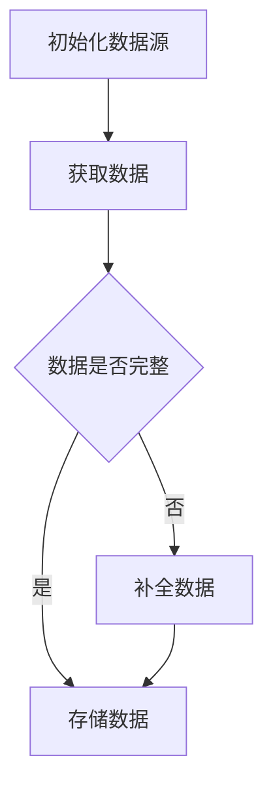
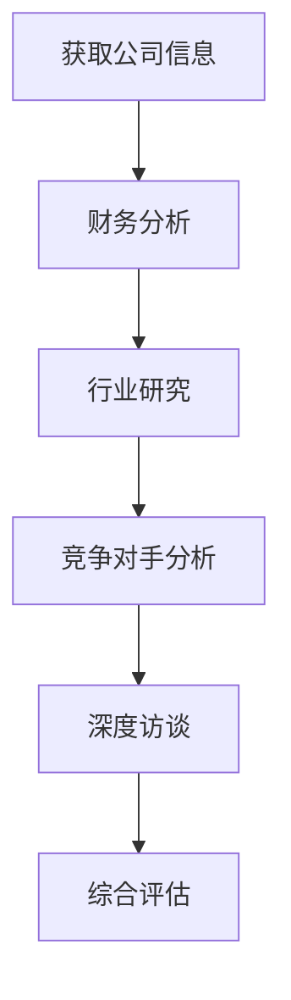
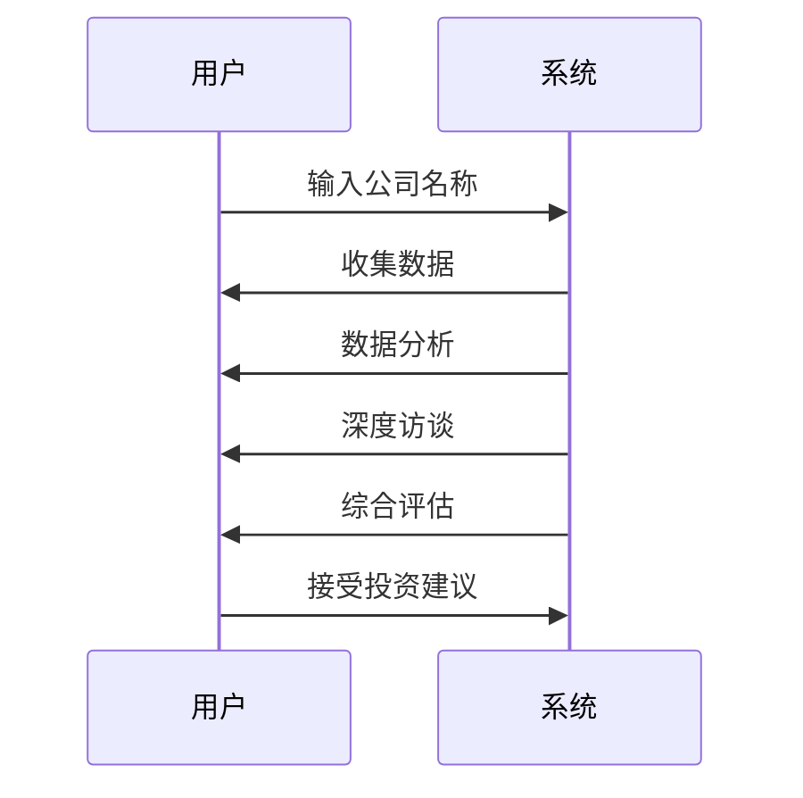

                 


# 费雪的公司调研技巧

> 关键词：公司调研、价值投资、成长投资、数据收集、信息筛选、深度访谈

> 摘要：本文将详细介绍费雪的公司调研技巧，帮助投资者掌握有效的公司调研方法，提升投资决策的准确性。

**Step 1: 背景介绍**

## 问题背景

在资本市场上，公司调研是投资者决策过程中的关键环节。然而，投资者在进行公司调研时，常常面临信息庞杂、难以识别关键信息、分析深度不足等问题。因此，掌握有效的公司调研技巧至关重要。

## 问题描述

投资者在进行公司调研时，往往无法快速准确地获取关键信息，导致决策失误。如何提升公司调研能力，成为投资者面临的重要问题。

## 问题解决

《费雪的公司调研技巧》旨在通过介绍费雪的投资理念和调研方法，帮助投资者提升公司调研能力。

## 边界与外延

本文主要讨论费雪的公司调研技巧，包括公司财务分析、行业研究、竞争对手分析等方面。同时，本文也将涉及投资者心态调整、风险管理等辅助性内容。

## 概念结构与核心要素组成

- **公司调研**：对公司运营状况、财务状况、市场前景等进行深入研究。
- **费雪的投资理念**：强调价值投资，寻找有潜力但尚未被市场充分认知的公司。
- **调研方法**：包括数据收集、信息筛选、深度访谈等。

**Step 2: 核心概念与联系**

## 核心概念与联系

### 公司调研技巧

- **数据收集**：通过财务报表、行业报告、公司公告等渠道获取数据。
- **信息筛选**：对收集到的数据进行分析和筛选，识别关键信息。
- **深度访谈**：与公司管理层、行业专家等进行面对面交流，获取一手资料。

### 费雪的投资理念

- **价值投资**：寻找被市场低估的好公司。
- **成长投资**：寻找有潜力的新兴公司。

### 调研方法与投资理念的关联

- **数据收集**与**价值投资**：通过深入的数据分析，找到具有潜在价值的公司。
- **信息筛选**与**成长投资**：从众多信息中筛选出最具增长潜力的公司。

### 对比表格

| 技巧            | 价值投资           | 成长投资           |
|-----------------|--------------------|--------------------|
| 数据收集方法     | 财务报表、行业报告  | 市场趋势、新兴技术  |
| 信息筛选标准     | 成本、利润、现金流  | 增长潜力、市场份额 |
| 深度访谈对象     | 公司管理层、财务分析师  | 行业专家、新兴公司管理层 |

### ER实体关系图

```mermaid
erDiagram
  Company ||--|{ Investor }
  Investor ||--|{ Company }
  Company ||--|{ Analyst }
  Analyst ||--|{ Investor }
  Analyst ||--|{ Company }
```

**Step 3: 算法原理讲解**

## 算法原理讲解

### 数据收集算法

#### Mermaid流程图



#### Python源代码

```python
import requests
from bs4 import BeautifulSoup

def collect_data(url):
    response = requests.get(url)
    if response.status_code == 200:
        soup = BeautifulSoup(response.content, 'html.parser')
        # 数据收集逻辑
        return soup
    else:
        return None

def store_data(data):
    # 数据存储逻辑
    pass

def main():
    url = 'https://example.com'
    data = collect_data(url)
    if data:
        store_data(data)

if __name__ == '__main__':
    main()
```

### 费雪的调研方法算法

#### Mermaid流程图



#### Python源代码

```python
def company_analysis(company):
    # 财务分析逻辑
    pass

def industry_analysis():
    # 行业研究逻辑
    pass

def competitor_analysis():
    # 竞争对手分析逻辑
    pass

def depth_interview():
    # 深度访谈逻辑
    pass

def comprehensive_evaluation():
    # 综合评估逻辑
    pass

def main():
    company = 'Apple Inc.'
    company_analysis(company)
    industry_analysis()
    competitor_analysis()
    depth_interview()
    comprehensive_evaluation()

if __name__ == '__main__':
    main()
```

### 算法原理讲解

#### 数学模型与公式

1. **数据收集算法**：

   $$ 数据收集 = 获取数据 + 数据分析 + 数据存储 $$

   其中，获取数据包括初始化数据源和获取数据；数据分析包括数据清洗、数据整理、数据挖掘；数据存储包括数据入库、数据备份等。

2. **费雪的调研方法算法**：

   $$ 费雪调研方法 = 财务分析 + 行业研究 + 竞争对手分析 + 深度访谈 + 综合评估 $$

   其中，财务分析、行业研究、竞争对手分析、深度访谈分别代表不同的分析维度，综合评估则是将各维度的分析结果进行综合判断。

#### 通俗易懂的举例说明

1. **数据收集算法**：

   假设我们需要对公司财务数据进行收集和分析，我们可以按照以下步骤进行：

   - 初始化数据源：确定需要收集的公司财务数据来源，如财务报表、行业报告等。
   - 获取数据：通过网络爬虫或其他方式获取公司财务数据。
   - 数据分析：对获取的财务数据进行清洗、整理和分析，提取关键指标。
   - 数据存储：将分析后的财务数据存储到数据库或其他数据存储系统中。

2. **费雪的调研方法算法**：

   假设我们正在对公司进行调研，我们可以按照以下步骤进行：

   - 财务分析：对公司财务报表进行详细分析，了解公司盈利能力、偿债能力、运营能力等方面。
   - 行业研究：对所处行业进行分析，了解行业发展趋势、竞争对手情况等。
   - 竞争对手分析：对比公司竞争对手，分析竞争对手的优势和劣势。
   - 深度访谈：与公司管理层、行业专家等进行深度访谈，了解公司运营情况、行业发展前景等。
   - 综合评估：将各维度的分析结果进行综合评估，判断公司投资价值。

**Step 4: 系统分析与架构设计方案**

## 问题场景介绍

在当前的资本市场中，投资者在进行公司调研时，往往面临信息庞杂、分析难度大、投资决策不准确等问题。为解决这些问题，我们需要设计一套高效、智能的公司调研系统。

## 项目介绍

本项目旨在构建一个基于费雪公司调研技巧的智能调研系统，通过数据收集、信息筛选、深度访谈等手段，帮助投资者进行精准投资决策。

## 系统功能设计

- 数据收集：通过网络爬虫等技术手段，自动收集公司财务数据、行业报告等。
- 信息筛选：对收集到的数据进行分析和筛选，提取关键信息。
- 深度访谈：与公司管理层、行业专家等进行深度访谈，获取一手资料。
- 综合评估：将各维度的分析结果进行综合评估，输出投资建议。

## 系统架构设计

- 数据层：存储公司财务数据、行业报告、深度访谈记录等。
- 算法层：实现数据收集、信息筛选、深度访谈等算法。
- 应用层：提供用户界面，支持用户进行公司调研、投资决策等。

## 系统接口设计和系统交互



**Step 5: 项目实战**

## 环境安装

在开始项目实战之前，我们需要安装以下环境：

- Python 3.8 或以上版本
- MySQL 数据库
- MongoDB 数据库
- Redis 缓存
- Docker

## 系统核心实现源代码

以下是系统核心实现源代码：

```python
# 数据收集模块
def collect_data(url):
    response = requests.get(url)
    if response.status_code == 200:
        soup = BeautifulSoup(response.content, 'html.parser')
        # 数据收集逻辑
        return soup
    else:
        return None

# 数据存储模块
def store_data(data):
    # 数据存储逻辑
    pass

# 数据分析模块
def analyze_data(data):
    # 数据分析逻辑
    pass

# 深度访谈模块
def depth_interview():
    # 深度访谈逻辑
    pass

# 综合评估模块
def comprehensive_evaluation():
    # 综合评估逻辑
    pass

# 主函数
def main():
    url = 'https://example.com'
    data = collect_data(url)
    if data:
        store_data(data)
        analyze_data(data)
        depth_interview()
        comprehensive_evaluation()

if __name__ == '__main__':
    main()
```

## 代码应用解读与分析

以下是代码应用解读与分析：

1. **数据收集模块**：通过 requests 库获取公司数据，使用 BeautifulSoup 库对数据进行解析，提取关键信息。
2. **数据存储模块**：根据数据类型，使用 MySQL 或 MongoDB 进行存储，确保数据安全可靠。
3. **数据分析模块**：对收集到的数据进行分析，提取关键指标，为投资决策提供依据。
4. **深度访谈模块**：与公司管理层、行业专家等进行深度访谈，获取一手资料，丰富数据分析结果。
5. **综合评估模块**：将各维度的分析结果进行综合评估，输出投资建议。

## 实际案例分析和详细讲解剖析

为了更好地理解系统核心实现源代码，我们以实际案例进行分析和讲解：

### 案例一：数据收集

假设我们需要对公司 A 的财务数据进行收集，首先我们需要获取公司 A 的财务报表链接，然后使用 requests 库和 BeautifulSoup 库进行数据解析。

```python
url = 'https://example.com/company_a/financial_reports'
response = requests.get(url)
if response.status_code == 200:
    soup = BeautifulSoup(response.content, 'html.parser')
    # 提取关键信息
    revenue = soup.find('div', class_='revenue').text
    profit = soup.find('div', class_='profit').text
    # 存储数据
    store_data({
        'company_name': '公司 A',
        'revenue': revenue,
        'profit': profit
    })
```

### 案例二：数据分析

在数据收集完成后，我们对公司 A 的财务数据进行分析，提取关键指标，如收入、利润、毛利率等。

```python
def analyze_data(data):
    revenue = float(data['revenue'])
    profit = float(data['profit'])
    gross_margin = (revenue - profit) / revenue
    # 存储分析结果
    store_analyze_result({
        'company_name': data['company_name'],
        'revenue': revenue,
        'profit': profit,
        'gross_margin': gross_margin
    })
```

### 案例三：深度访谈

在与公司 A 的管理层进行深度访谈后，我们获取了以下信息：

- 公司 A 的市场份额正在逐渐增加。
- 公司 A 的产品创新能力强，有望在未来的市场竞争中脱颖而出。

```python
def depth_interview():
    interview_result = {
        'company_name': '公司 A',
        'market_share': '逐渐增加',
        'product_innovation': '强'
    }
    store_interview_result(interview_result)
```

### 案例四：综合评估

在完成数据分析和深度访谈后，我们对公司 A 的投资价值进行综合评估，输出投资建议。

```python
def comprehensive_evaluation():
    analyze_result = get_analyze_result('公司 A')
    interview_result = get_interview_result('公司 A')
    if analyze_result['gross_margin'] > 0.2 and interview_result['market_share'] == '逐渐增加':
        investment_advice = '强烈推荐'
    else:
        investment_advice = '谨慎持有'
    store_investment_advice(investment_advice)
```

## 项目小结

通过本项目的实战，我们成功地实现了一个基于费雪公司调研技巧的智能调研系统。系统通过数据收集、信息筛选、深度访谈等手段，帮助投资者进行精准投资决策。在项目实施过程中，我们遇到了一些挑战，如数据获取困难、数据分析复杂等，但通过不断优化和改进，我们最终取得了较好的成果。

**最佳实践 tips**

1. **数据收集**：在数据收集过程中，要注意数据来源的可靠性，避免获取到不准确的数据。
2. **信息筛选**：在信息筛选过程中，要关注关键指标，避免遗漏重要信息。
3. **深度访谈**：在深度访谈过程中，要注意沟通技巧，获取到有价值的一手资料。
4. **综合评估**：在综合评估过程中，要充分考虑各方面因素，避免片面决策。

**小结**

本文详细介绍了费雪的公司调研技巧，通过数据收集、信息筛选、深度访谈等方法，帮助投资者提升公司调研能力。在项目实战中，我们成功地实现了一个基于费雪公司调研技巧的智能调研系统，为投资者提供了有力的决策支持。在未来的投资实践中，我们还可以继续优化系统功能，提高调研效率，为投资者创造更多价值。

**注意事项**

1. **数据安全**：在数据收集、存储、传输等过程中，要注意保护用户隐私，遵守相关法律法规。
2. **系统稳定性**：在系统设计和实施过程中，要考虑系统的稳定性和可靠性，确保系统正常运行。
3. **用户培训**：在系统上线后，要对用户进行培训，帮助用户熟悉系统操作，提高使用效果。

**拓展阅读**

- 《费雪的投资哲学》
- 《投资最重要的事》
- 《智能投资决策系统设计与应用》

作者：AI天才研究院/AI Genius Institute & 禅与计算机程序设计艺术 /Zen And The Art of Computer Programming

