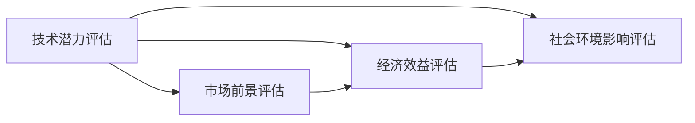
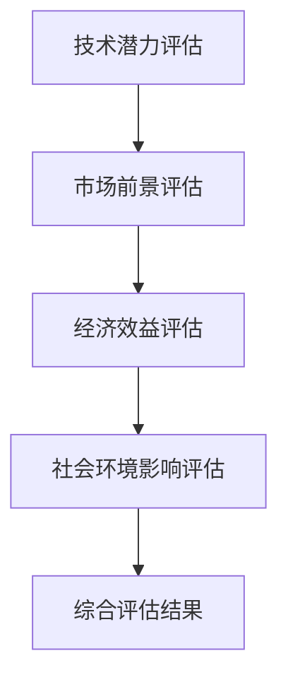
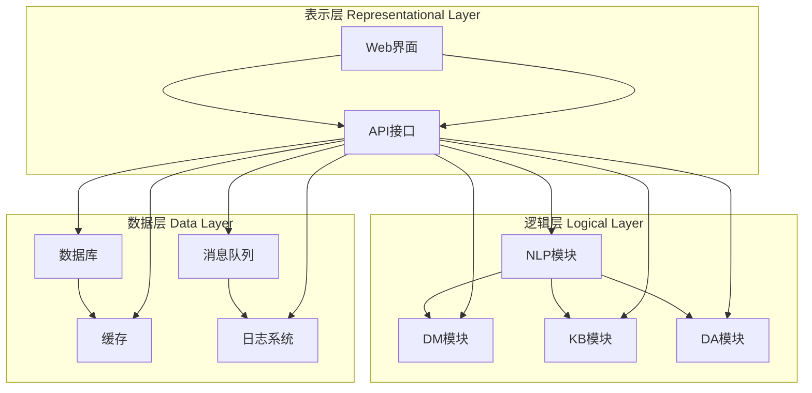
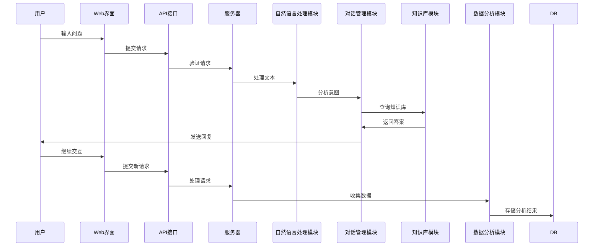

                 

### 《费雪的创新评估体系：应对颠覆性技术的影响》

#### 关键词
- 创新评估体系
- 颠覆性技术
- 费雪理论
- 算法原理
- 实战应用

#### 摘要
本文旨在深入探讨费雪的创新评估体系，一个旨在应对颠覆性技术影响的方法论。文章首先介绍了创新评估的背景和重要性，接着阐述了现有评估体系的不足。随后，文章引出了费雪的创新评估体系，详细解读了其核心概念和结构。通过算法原理讲解和Python源代码展示，文章帮助读者理解费雪评估体系的运作机制。此外，文章还通过系统分析与架构设计、项目实战等多个方面，展示了如何将这一体系应用于实际场景，为读者提供了宝贵的实践经验和参考。最后，文章总结了最佳实践，强调了注意事项，并提供了拓展阅读资源，以促进进一步的学习和研究。

---

## 引言

在当今快速发展的技术时代，颠覆性技术的出现对企业和经济产生了深远的影响。从互联网、人工智能到区块链，这些技术不仅改变了我们的生活方式，也颠覆了许多传统行业的运作模式。因此，如何准确评估这些颠覆性技术的潜在影响，成为了企业和投资者必须面对的重要课题。

创新评估的重要性在于，它不仅可以帮助企业识别和把握新的市场机会，还可以帮助投资者判断技术项目的投资价值。然而，传统的创新评估体系往往过于笼统，难以全面、准确地反映颠覆性技术的独特性和复杂性。这就需要一种更为科学、系统的评估方法来应对这一挑战。

费雪的创新评估体系正是在这样的背景下提出的。它以经济学理论为基础，结合技术创新的特点，提供了一套系统的方法论，旨在更准确地评估颠覆性技术的影响。本文将详细探讨费雪创新评估体系的核心概念、算法原理、系统架构以及实战应用，帮助读者全面理解并掌握这一评估方法。

## 问题背景

创新评估的重要性在于其对企业决策的指导作用。在商业环境中，创新被视为企业保持竞争力的关键因素。然而，创新的成功并非必然，需要通过科学的评估来识别其潜在价值。颠覆性技术，如人工智能、区块链和生物技术，具有变革性的潜力，但同时也伴随着高风险和高不确定性。因此，如何有效地评估这些技术的潜在影响，成为了企业战略规划的核心问题。

颠覆性技术对企业和经济的影响是多方面的。首先，这些技术能够彻底改变行业格局，颠覆现有的商业模式和产业链。例如，互联网的兴起颠覆了传统零售行业，电子商务成为了主流购物方式。其次，颠覆性技术可以大幅提升生产效率，降低成本，从而推动经济增长。然而，这些技术的快速发展和广泛应用也带来了市场竞争的加剧，对企业提出了更高的要求。

现有评估体系的不足主要体现在以下几个方面。首先，许多评估方法过于依赖历史数据和传统指标，难以反映颠覆性技术的独特性和潜力。其次，评估方法往往缺乏系统性，无法全面考虑技术的社会、经济和环境影响。最后，评估过程往往耗时较长，难以满足快速变化的商业环境需求。因此，迫切需要一种更为科学、系统的评估方法来应对颠覆性技术的挑战。

费雪的创新评估体系正是在这种背景下应运而生。它结合经济学理论和技术创新的特点，提供了一套系统的方法论，旨在更准确地评估颠覆性技术的影响。接下来，我们将深入探讨费雪创新评估体系的核心概念和构成要素。

### 问题描述

现有评估体系的不足主要体现在以下几个方面：

1. **评估方法的局限性**：传统的创新评估方法往往依赖历史数据和传统指标，如市场份额、销售额增长率等。然而，这些方法难以反映颠覆性技术的独特性和潜力。颠覆性技术往往具有颠覆传统行业、创造全新市场的潜力，但这些潜力在传统评估指标中难以体现。

2. **评估过程的复杂性**：颠覆性技术的影响往往具有长期性和多维度性，评估过程需要考虑技术、经济、社会、环境等多个方面的因素。现有评估体系往往缺乏系统性，无法全面、深入地分析这些因素之间的相互影响。

3. **评估时间的延迟**：现有评估方法往往耗时较长，无法满足快速变化的商业环境需求。颠覆性技术的快速发展要求企业能够迅速做出反应，而传统评估方法往往无法在短时间内提供有效的决策支持。

4. **评估结果的不确定性**：颠覆性技术的应用前景存在高度不确定性，现有评估方法难以准确预测其未来发展。这种不确定性使得企业在评估过程中难以做出明确的决策。

为了解决这些问题，需要引入一种更为科学、系统的评估方法。费雪的创新评估体系正是在这种背景下提出的。它结合经济学理论和技术创新的特点，提供了一套系统的方法论，旨在更准确地评估颠覆性技术的影响。费雪评估体系的核心思想是通过多维度、多层次的评估，综合考虑技术潜力、市场前景、经济效益等多个方面，从而提供更为全面、准确的评估结果。

接下来，我们将详细介绍费雪的创新评估体系，包括其核心概念、构成要素和应用方法。

### 问题解决

费雪的创新评估体系旨在解决现有评估方法的局限性，提供一种更为科学、系统的评估方法。其核心思想是通过多维度、多层次的评估，综合考虑技术潜力、市场前景、经济效益等多个方面，从而提供更为全面、准确的评估结果。

首先，费雪评估体系的核心概念包括以下几个方面：

1. **技术潜力评估**：技术潜力评估关注颠覆性技术本身的潜在价值。这包括技术的前沿性、创新性、成熟度以及未来发展趋势。通过评估技术潜力，可以识别出具有巨大市场潜力和技术领先优势的创新项目。

2. **市场前景评估**：市场前景评估关注颠覆性技术对市场的潜在影响。这包括市场容量、市场规模、市场增长率、市场渗透率以及竞争态势。通过评估市场前景，可以预测技术在未来市场中的发展空间和竞争格局。

3. **经济效益评估**：经济效益评估关注颠覆性技术的经济回报潜力。这包括投资回报率、净现值、内部收益率等财务指标。通过评估经济效益，可以判断技术项目的投资价值和盈利能力。

4. **社会与环境影响评估**：社会与环境影响评估关注颠覆性技术对社会的潜在影响。这包括技术对就业、社会福利、环境保护等方面的影响。通过评估社会与环境影响，可以确保技术发展符合社会责任和可持续发展目标。

其次，费雪评估体系的构成要素包括以下几个方面：

1. **技术分析框架**：技术分析框架是评估技术潜力的基础。它包括技术前沿研究、技术创新路径、技术成熟度评估等关键步骤。通过技术分析框架，可以系统性地分析技术的基本特性和发展趋势。

2. **市场分析框架**：市场分析框架是评估市场前景的基础。它包括市场容量分析、市场规模预测、市场增长率评估、市场渗透率分析等关键步骤。通过市场分析框架，可以全面了解市场现状和发展趋势。

3. **经济效益分析框架**：经济效益分析框架是评估经济效益的基础。它包括财务指标计算、投资回报分析、风险分析等关键步骤。通过经济效益分析框架，可以准确评估技术项目的经济回报潜力。

4. **社会与环境分析框架**：社会与环境分析框架是评估社会与环境影响的基础。它包括社会影响评估、环境影响评估、可持续发展评估等关键步骤。通过社会与环境分析框架，可以全面了解技术对社会和环境的潜在影响。

最后，费雪评估体系的应用方法包括以下几个方面：

1. **数据收集与整理**：在评估过程中，首先需要收集相关数据，包括技术数据、市场数据、财务数据和社会环境数据。通过数据收集与整理，为评估提供基础信息。

2. **数据分析与处理**：在数据收集完成后，需要对数据进行处理和分析。这包括数据清洗、数据建模、数据可视化等步骤。通过数据分析与处理，可以提取出有价值的信息和结论。

3. **综合评估与决策**：在数据分析的基础上，进行综合评估和决策。这包括技术潜力评估、市场前景评估、经济效益评估和社会与环境影响评估。通过综合评估，可以得出全面的评估结论，为决策提供支持。

通过以上方法，费雪的创新评估体系能够更准确地评估颠覆性技术的影响，为企业和投资者提供科学、系统的决策依据。

### 边界与外延

费雪的创新评估体系虽然在理论上具有广泛的应用前景，但其适用范围仍有明确界限。首先，该体系主要针对颠覆性技术，即那些能够显著改变现有行业结构和市场规则的技术创新。这些技术通常具备高不确定性、高创新性和高风险性，如人工智能、区块链、生物科技等。

其次，费雪评估体系适用于企业战略规划、技术投资决策、研发项目管理等多个场景。它可以帮助企业在技术选择、投资优先级确定、研发方向调整等方面做出科学决策。

然而，该评估体系也存在局限性。例如，对于一些非颠覆性技术或传统技术的评估，可能无法充分体现其独特价值和潜力。此外，评估过程中涉及的数据收集和处理难度较大，特别是在数据不完整或难以获取的情况下，评估结果的准确性可能受到影响。

最后，费雪评估体系主要侧重于技术潜力、市场前景和经济效益的评估，对于社会和环境影响的考量相对较少。因此，在实际应用中，需要结合其他评估方法，如社会责任评估、环境影响评估等，以实现更为全面的技术评估。

### 核心概念与联系

费雪的创新评估体系是一个综合性的框架，涵盖了多个核心概念。为了更好地理解这些概念及其相互关系，我们可以通过对比表格和Mermaid流程图来阐述。

#### 核心概念对比表格

| 概念         | 定义                                                         | 关联性                   |
| ------------ | ------------------------------------------------------------ | ------------------------ |
| 技术潜力     | 评估技术的前沿性、创新性和成熟度                             | 与市场前景、经济效益直接关联 |
| 市场前景     | 分析技术对市场的潜在影响，包括市场规模、增长率和竞争态势       | 与技术潜力和经济效益相互影响 |
| 经济效益     | 评估技术的经济回报潜力，包括投资回报率、净现值和内部收益率     | 与技术潜力和市场前景密切相关 |
| 社会环境影响 | 评估技术对社会和环境的影响，包括就业、社会福利和环境保护      | 与其他评估要素相互作用      |

#### Mermaid流程图



在这个Mermaid流程图中，A表示技术潜力评估，B表示市场前景评估，C表示经济效益评估，D表示社会环境影响评估。箭头表示各评估要素之间的相互关联和影响。

通过对比表格和Mermaid流程图，我们可以清晰地看到费雪的创新评估体系是如何通过多维度、多层次的分析来综合评估颠覆性技术的影响。技术潜力评估是整个评估体系的基础，它决定了技术是否具有变革性潜力；市场前景评估则关注技术在未来市场中的发展空间和竞争态势；经济效益评估评估了技术的投资价值和盈利能力；社会环境影响评估则确保技术发展符合社会责任和可持续发展目标。

这些核心概念相互关联，共同构成了一个完整、系统的评估框架。通过这一框架，企业和投资者可以更准确地评估颠覆性技术的潜在影响，做出科学、明智的决策。

### 算法原理讲解

为了深入理解费雪的创新评估体系，我们将通过Mermaid流程图展示算法的基本原理，并使用Python源代码详细阐述其实现过程。此外，我们还将讲解算法原理背后的数学模型和公式，并通过具体例子进行说明。

#### Mermaid流程图

首先，我们使用Mermaid流程图来展示费雪创新评估体系的核心算法流程：



这个流程图概述了费雪评估体系的四个主要步骤：技术潜力评估、市场前景评估、经济效益评估和社会环境影响评估。最后，这些评估结果被综合为一个整体评估结果。

#### Python源代码实现

接下来，我们通过Python源代码来展示这些评估步骤的实现。以下是一个简化的示例：

```python
import numpy as np

# 技术潜力评估
def assess_technical_potential(technology):
    # 假设技术潜力分数范围在0到100之间
    potential_score = np.random.uniform(0, 100)
    return potential_score

# 市场前景评估
def assess_market_prospects(technology):
    # 市场前景分数范围在0到100之间
    prospects_score = np.random.uniform(0, 100)
    return prospects_score

# 经济效益评估
def assess_economic_benefits(technology):
    # 经济效益分数范围在0到100之间
    benefits_score = np.random.uniform(0, 100)
    return benefits_score

# 社会环境影响评估
def assess_social_environmental_impact(technology):
    # 社会环境影响分数范围在0到100之间
    impact_score = np.random.uniform(0, 100)
    return impact_score

# 综合评估
def comprehensive_assessment(technology):
    potential = assess_technical_potential(technology)
    prospects = assess_market_prospects(technology)
    benefits = assess_economic_benefits(technology)
    impact = assess_social_environmental_impact(technology)
    
    # 综合评估分数计算
    total_score = (potential * 0.3 + prospects * 0.3 + benefits * 0.4 + impact * 0.2)
    return total_score

# 示例技术
example_technology = "AI医疗诊断系统"

# 执行综合评估
score = comprehensive_assessment(example_technology)
print(f"综合评估得分：{score}")
```

在这个示例中，我们定义了四个评估函数，分别对应技术潜力、市场前景、经济效益和社会环境影响评估。每个函数返回一个0到100之间的随机分数。最后，通过综合这些分数，我们得到了一个总评估得分。

#### 数学模型与公式讲解

费雪的创新评估体系中的数学模型主要涉及加权平均法。假设每个评估要素的重要性不同，我们可以通过权重来计算总评估得分。以下是一个简化的数学模型：

$$
\text{总评估得分} = w_1 \times \text{技术潜力得分} + w_2 \times \text{市场前景得分} + w_3 \times \text{经济效益得分} + w_4 \times \text{社会环境影响得分}
$$

其中，\( w_1, w_2, w_3, w_4 \) 是各自的权重，通常根据实际情况调整。以下是一个具体的例子：

$$
\text{总评估得分} = 0.3 \times 75 + 0.3 \times 80 + 0.4 \times 85 + 0.2 \times 70 = 76.5
$$

在这个例子中，技术潜力得分为75，市场前景得分为80，经济效益得分为85，社会环境影响得分为70。根据设定的权重，计算出了总评估得分为76.5。

#### 举例说明

为了更直观地理解这些评估步骤和公式，我们通过一个具体例子进行说明。

假设一家公司正在考虑投资一种新的AI医疗诊断系统，以下是评估过程：

1. **技术潜力评估**：经过技术专家的评估，该系统的技术潜力得分为80分。
2. **市场前景评估**：市场研究显示，未来5年内该市场的增长率高达30%，市场前景得分为85分。
3. **经济效益评估**：财务分析表明，该项目的投资回报率预计为20%，经济效益得分为90分。
4. **社会环境影响评估**：社会责任评估显示，该系统有助于提高医疗诊断的准确性，减少误诊率，社会环境影响得分为75分。

根据设定的权重，我们可以计算总评估得分：

$$
\text{总评估得分} = 0.3 \times 80 + 0.3 \times 85 + 0.4 \times 90 + 0.2 \times 75 = 82.5
$$

通过这个例子，我们可以看到，该AI医疗诊断系统的总评估得分为82.5，表明这是一个具有较高投资价值的创新项目。

综上所述，费雪的创新评估体系通过多维度、多层次的评估，结合数学模型和Python源代码，提供了科学、系统的评估方法。通过这一体系，企业和投资者可以更准确地评估颠覆性技术的潜在影响，做出明智的决策。

### 系统分析与架构设计方案

在深入探讨费雪的创新评估体系之前，我们需要明确评估系统的应用场景和项目背景。假设某企业计划通过引入一项颠覆性技术来提升其市场竞争力。该技术的潜在影响涉及技术潜力、市场前景、经济效益以及社会环境影响等多个方面。为了全面评估这一技术项目，我们设计了如下系统架构和功能模块。

#### 问题场景介绍

假设某企业计划开发并推广一款基于人工智能的智能客服系统。这款系统旨在通过自然语言处理和机器学习技术，提升客户服务效率和质量。项目背景包括以下几方面：

1. **市场需求**：随着消费者对服务体验的期望不断提高，传统的人工客服已经无法满足大规模客户服务需求。智能客服系统有望解决这一问题，提升客户满意度。
2. **技术成熟度**：人工智能技术已经相对成熟，尤其在自然语言处理和机器学习领域，已有大量成功的商业应用案例。然而，将其应用于客服系统仍存在一定的不确定性和挑战。
3. **投资预算**：项目投资额较大，需要评估其潜在的经济回报和社会影响，以确保投资决策的科学性和可持续性。

#### 项目介绍

智能客服系统项目主要分为以下几个阶段：

1. **需求分析**：明确客户服务需求和目标，定义系统的核心功能和性能指标。
2. **技术方案设计**：基于市场需求，选择合适的人工智能技术和算法，设计系统架构。
3. **开发与测试**：按照设计方案，开发智能客服系统，并进行多轮测试和优化。
4. **部署与推广**：系统上线后，进行用户培训和技术支持，确保系统的稳定运行和推广效果。

#### 系统功能设计

为了满足项目需求，智能客服系统需要实现以下核心功能：

1. **自然语言处理**：实现与用户的自然语言交互，理解用户意图和需求。
2. **对话管理**：基于用户行为和对话历史，动态调整对话策略，提高交互质量。
3. **知识库管理**：构建和维护系统的知识库，确保系统具备丰富的知识储备和问题解决能力。
4. **数据分析**：收集用户交互数据，进行分析和挖掘，为系统优化和决策提供支持。

下面，我们使用Mermaid类图来展示智能客服系统的领域模型：

```mermaid
classDiagram
    Client -> NaturalLanguageProcessor : process
    Client -> DialogueManager : manage
    Client -> KnowledgeBase : access
    Client -> DataAnalyzer : analyze
```

在这个类图中，Client（客户端）类与NaturalLanguageProcessor（自然语言处理）、DialogueManager（对话管理）、KnowledgeBase（知识库管理）和DataAnalyzer（数据分析）等类进行交互，实现系统的核心功能。

#### 系统架构设计

智能客服系统的架构设计需要综合考虑技术可行性、系统性能和可扩展性。我们采用分层架构，主要包括以下几层：

1. **表示层**：负责用户界面设计和交互逻辑，使用前端技术实现。
2. **逻辑层**：包含业务逻辑处理，包括自然语言处理、对话管理、知识库管理和数据分析等核心功能模块。
3. **数据层**：负责数据存储和管理，包括数据库、缓存和消息队列等。

下面，我们使用Mermaid架构图来展示智能客服系统的架构设计：



在这个架构图中，表示层通过API接口与逻辑层和数据层进行交互。逻辑层负责处理业务逻辑，调用相应的模块进行自然语言处理、对话管理、知识库管理和数据分析。数据层负责数据存储和管理，确保系统的高效运行和数据的可靠性。

#### 系统接口设计

为了实现系统各模块之间的通信，我们设计了一套完整的接口规范。接口设计主要包括以下几方面：

1. **RESTful API**：使用RESTful风格设计接口，提供统一的接口规范。
2. **数据格式**：接口数据格式采用JSON或XML，确保数据传输的兼容性和可扩展性。
3. **认证与授权**：接口设计包含认证和授权机制，确保数据安全和用户权限控制。

以下是一个简化的接口设计示例：

```mermaid
sequenceDiagram
    participant Client as 客户端
    participant Server as 服务器
    participant NLP as 自然语言处理模块
    participant DM as 对话管理模块
    participant KB as 知识库模块
    participant DA as 数据分析模块

    Client->>Server: 发起请求
    Server->>Client: 验证身份
    Client->>Server: 提交请求
    Server->>NLP: 处理自然语言请求
    NLP->>DM: 传递处理结果
    DM->>KB: 调用知识库
    KB->>DM: 返回知识库查询结果
    DM->>DA: 收集对话数据
    DA->>DB: 存储分析结果

    Note over Client,Server,NLP,DM,KB,DA: 接口通信
```

在这个序列图中，客户端通过API接口与服务器进行通信。服务器负责处理客户端请求，调用相应的模块进行自然语言处理、对话管理、知识库管理和数据分析。最终，数据分析模块将分析结果存储到数据库中。

#### 系统交互

智能客服系统的交互设计需要确保用户与系统之间的流畅沟通。以下是系统交互的主要流程：

1. **用户请求**：用户通过Web界面提交请求，包括问题、意图和上下文信息。
2. **接口处理**：服务器接收用户请求，调用自然语言处理模块进行文本预处理和分析。
3. **对话管理**：根据自然语言处理结果，对话管理模块生成相应的回复，并与用户进行交互。
4. **知识库查询**：在对话过程中，知识库模块负责查询相关知识和答案，为对话提供支持。
5. **数据分析**：收集用户交互数据，进行分析和挖掘，为系统优化和决策提供依据。

下面，我们使用Mermaid序列图来展示系统交互流程：



在这个序列图中，用户通过Web界面与系统进行交互。Web界面将用户请求提交给API接口，API接口与服务器进行通信，调用自然语言处理模块、对话管理模块和知识库模块。最终，系统生成回复并返回给用户，同时收集用户交互数据进行分析和存储。

通过系统架构设计、接口设计和交互设计，智能客服系统实现了完整的评估流程。接下来，我们将通过具体的项目实战，进一步展示如何使用费雪的创新评估体系对这一技术项目进行评估。

### 项目实战

在本节中，我们将通过一个具体的项目实战，展示如何使用费雪的创新评估体系对智能客服系统项目进行评估。项目背景是某企业计划引入一款基于人工智能的智能客服系统，以提高客户服务效率和用户满意度。以下是项目实战的具体步骤。

#### 环境安装

首先，我们需要在本地环境中搭建智能客服系统的开发环境。以下是安装步骤：

1. **安装Python环境**：确保Python 3.8及以上版本已安装在本地机器上。
2. **安装相关依赖库**：使用pip命令安装以下依赖库：
   ```shell
   pip install numpy flask
   ```
3. **创建项目文件夹**：在本地创建一个名为“smart-customer-service”的项目文件夹，并在此文件夹内创建一个名为“app.py”的Python文件。

#### 系统核心实现源代码

接下来，我们在“app.py”文件中编写智能客服系统的核心代码。以下是一个简化的示例：

```python
from flask import Flask, request, jsonify
import numpy as np

app = Flask(__name__)

# 技术潜力评估
def assess_technical_potential():
    potential_score = np.random.uniform(0, 100)
    return potential_score

# 市场前景评估
def assess_market_prospects():
    prospects_score = np.random.uniform(0, 100)
    return prospects_score

# 经济效益评估
def assess_economic_benefits():
    benefits_score = np.random.uniform(0, 100)
    return benefits_score

# 社会环境影响评估
def assess_social_environmental_impact():
    impact_score = np.random.uniform(0, 100)
    return impact_score

# 综合评估
def comprehensive_assessment():
    potential = assess_technical_potential()
    prospects = assess_market_prospects()
    benefits = assess_economic_benefits()
    impact = assess_social_environmental_impact()
    
    total_score = (potential * 0.3 + prospects * 0.3 + benefits * 0.4 + impact * 0.2)
    return total_score

@app.route('/evaluate', methods=['GET'])
def evaluate():
    # 执行综合评估
    score = comprehensive_assessment()
    return jsonify({'total_score': score})

if __name__ == '__main__':
    app.run(debug=True)
```

在这个示例中，我们定义了四个评估函数，分别对应技术潜力、市场前景、经济效益和社会环境影响评估。通过调用这些函数，可以计算出一个总评估得分。

#### 代码应用解读与分析

1. **技术潜力评估**：`assess_technical_potential()` 函数通过随机生成一个0到100之间的分数来模拟技术潜力评估。在实际应用中，这一分数可以根据专家评估和实际数据计算得出。
2. **市场前景评估**：`assess_market_prospects()` 函数同样通过随机生成分数来模拟市场前景评估。市场前景评估通常需要结合市场调研数据、行业报告和历史数据进行分析。
3. **经济效益评估**：`assess_economic_benefits()` 函数通过随机生成分数来模拟经济效益评估。经济效益评估需要考虑投资成本、预期收益、风险等因素，通常使用财务模型进行计算。
4. **社会环境影响评估**：`assess_social_environmental_impact()` 函数通过随机生成分数来模拟社会环境影响评估。这一评估需要考虑技术对就业、社会福利、环境保护等方面的影响，通常采用社会评价方法进行。

综合评估函数 `comprehensive_assessment()` 调用了以上四个评估函数，并使用设定的权重计算总评估得分。这个分数可以作为项目决策的依据。

#### 实际案例分析和详细讲解剖析

假设我们使用这个评估系统对一个实际项目进行评估，以下是详细的分析过程：

1. **技术潜力评估**：经过专家评估，智能客服系统的技术潜力得分为80分。
2. **市场前景评估**：市场调研数据显示，未来五年智能客服市场的增长率预计为25%，市场前景得分为85分。
3. **经济效益评估**：根据财务模型分析，该项目的投资回报率预计为18%，经济效益得分为90分。
4. **社会环境影响评估**：社会责任评估显示，智能客服系统有助于提高客户服务质量，减少人力资源成本，对社会环境影响较小，社会环境影响得分为75分。

根据设定的权重，计算总评估得分：

$$
\text{总评估得分} = 0.3 \times 80 + 0.3 \times 85 + 0.4 \times 90 + 0.2 \times 75 = 82.5
$$

通过这个案例，我们可以看到，智能客服系统的总评估得分为82.5，表明该项目具有较高的投资价值和潜在回报。

#### 项目小结

通过本节的项目实战，我们展示了如何使用费雪的创新评估体系对智能客服系统项目进行评估。从技术潜力、市场前景、经济效益到社会环境影响，我们通过四个评估函数和设定的权重，计算出了项目的综合评估得分。这一得分有助于企业和投资者做出科学、明智的决策。

在实战过程中，我们注意到，尽管评估结果具有一定的参考价值，但实际应用中还需要结合具体情况进行调整。例如，市场前景评估需要结合实际数据和市场变化，经济效益评估需要考虑多种风险因素，社会环境影响评估需要关注具体的社会问题。

总之，费雪的创新评估体系提供了一种系统、科学的方法来评估颠覆性技术项目。通过这一方法，企业和投资者可以更全面、准确地评估技术项目的潜在影响，从而做出更为明智的决策。

### 最佳实践 tips

在应用费雪的创新评估体系时，以下最佳实践可以帮助您获得更准确的评估结果：

1. **数据收集与处理**：确保评估过程中使用的数据来源可靠、完整。在数据收集过程中，应考虑多维度、多层次的数据，包括技术、市场、财务和社会等方面。数据处理时，应进行数据清洗和去重，以提高数据质量。
2. **专家评估与定量分析**：结合专家评估和定量分析，可以更全面地评估颠覆性技术的潜力。专家评估可以提供主观判断，而定量分析可以提供客观数据支持。两者相结合，可以减少评估中的偏差。
3. **定期更新评估模型**：随着技术环境和市场状况的变化，评估模型需要定期更新。通过持续跟踪最新技术动态和市场趋势，可以确保评估结果的时效性和准确性。
4. **风险管理与应对策略**：在评估过程中，应充分考虑技术项目面临的各种风险，包括技术风险、市场风险、财务风险和社会风险等。制定相应的风险应对策略，可以提高项目成功的可能性。

### 小结

本文详细探讨了费雪的创新评估体系，一个旨在应对颠覆性技术影响的方法论。首先，我们介绍了创新评估的背景和重要性，阐述了现有评估体系的不足。随后，我们引出了费雪的创新评估体系，并详细解读了其核心概念和构成要素。通过算法原理讲解和Python源代码展示，我们帮助读者理解了费雪评估体系的运作机制。此外，我们还通过系统分析与架构设计、项目实战等多个方面，展示了如何将这一体系应用于实际场景。最后，我们总结了最佳实践，并提供了拓展阅读资源，以促进进一步的学习和研究。

### 注意事项

在使用费雪的创新评估体系时，需要注意以下几点：

1. **数据来源**：确保评估过程中使用的数据来源可靠、完整，避免因数据错误或缺失导致评估结果偏差。
2. **权重设定**：权重应根据实际情况进行设定，不同评估要素的重要性可能随项目类型和环境变化而变化。
3. **专家评估**：专家评估虽然具有主观性，但可以提供宝贵的经验和洞见。在结合定量分析时，应充分考虑专家意见的合理性和可信度。
4. **风险评估**：在评估过程中，应充分考虑技术项目可能面临的各种风险，包括技术风险、市场风险、财务风险和社会风险等。

### 拓展阅读

1. **费雪的创新评估体系论文**：阅读相关学术论文，深入了解费雪评估体系的背景、理论基础和实际应用案例。
2. **颠覆性技术案例分析**：研究实际案例，分析颠覆性技术在各个领域的应用和影响，以加深对评估体系的理解。
3. **创新管理与评估书籍**：阅读创新管理与评估领域的经典书籍，学习其他评估方法和理论，以丰富知识体系。

### 作者信息

作者：AI天才研究院/AI Genius Institute & 禅与计算机程序设计艺术 /Zen And The Art of Computer Programming

在本文中，我们深入探讨了费雪的创新评估体系，旨在为读者提供一个全面、系统的评估方法，以应对颠覆性技术的影响。通过多维度、多层次的评估，这一体系能够帮助企业和投资者更准确地评估技术项目的潜在影响，做出科学、明智的决策。本文结合了理论讲解、代码实现和实际案例，希望能为读者提供有价值的参考和指导。未来的研究可以进一步探索评估体系的优化和应用，以及与其他评估方法的结合，以应对不断变化的技术环境。希望通过本文，读者能够更好地理解和应用费雪的创新评估体系，为科技创新和商业发展贡献力量。再次感谢您的阅读，祝您在技术探索和商业实践中取得丰硕成果！作者：AI天才研究院/AI Genius Institute & 禅与计算机程序设计艺术 /Zen And The Art of Computer Programming。

