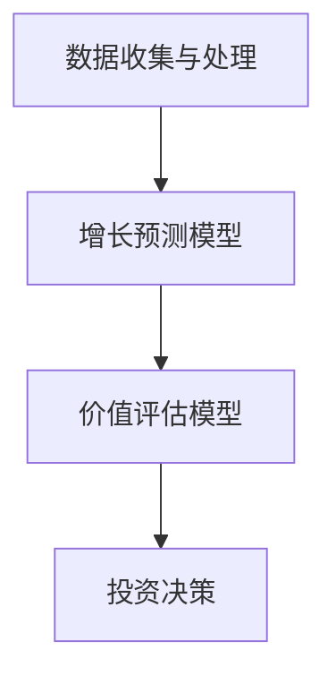
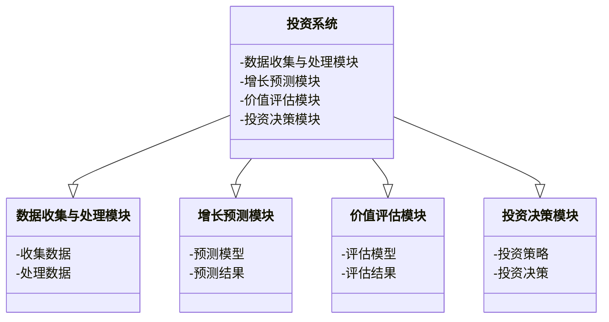
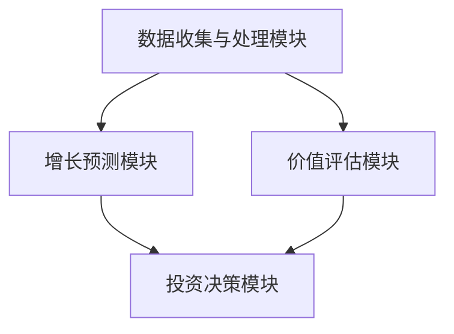
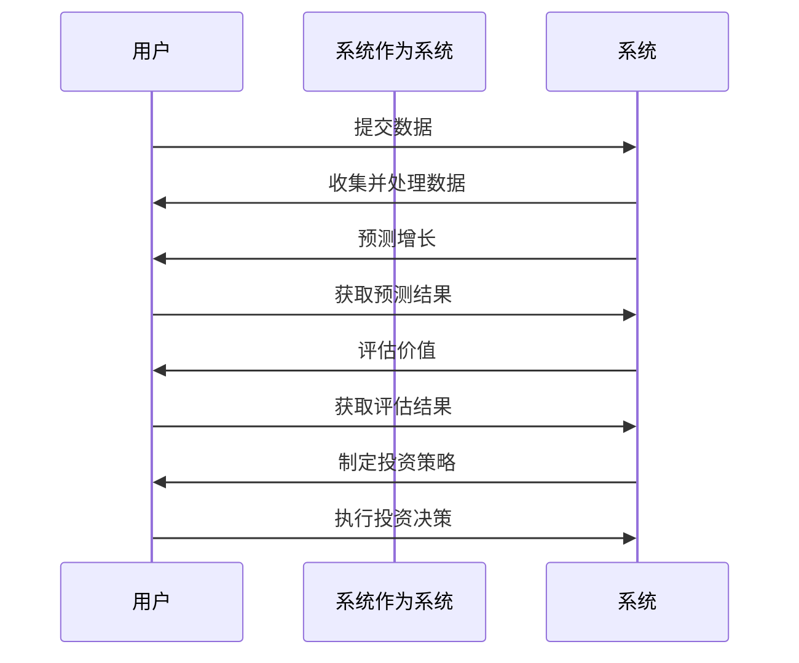

                 

# 费雪的增长型价值投资：平衡当前价值和未来潜力

> 关键词：增长型价值投资、费雪、当前价值、未来潜力、投资策略、算法模型、系统架构

> 摘要：本文旨在探讨费雪的增长型价值投资策略，通过平衡当前价值和未来潜力，为投资者提供一种科学、系统的投资方法。文章将从问题背景、核心概念、算法原理、数学模型、系统分析与架构设计、项目实战等方面进行全面剖析，帮助读者深入理解并掌握这一投资策略。

## 第一部分：背景介绍

### 1.1 问题背景

在投资领域，投资者常常面临两个主要问题：一是如何准确评估当前投资对象的价值；二是如何预测其未来的增长潜力。传统的投资策略主要依赖于对当前价值的评估，而忽略了企业的长期增长潜力。这种短视的思维方式往往导致投资者在市场波动中难以应对，无法实现长期稳定的投资收益。

### 1.2 问题描述

针对上述问题，本文提出了费雪的增长型价值投资策略。这一策略的核心在于平衡当前价值和未来潜力，通过科学、系统的评估方法，找到那些具有高增长潜力的优质企业进行投资。然而，这一策略在实施过程中也面临着诸多挑战，如如何准确预测企业未来的增长趋势，如何平衡当前收益与长期收益等。

### 1.3 问题解决

费雪的增长型价值投资策略通过以下方法解决了上述问题：

1. **价值评估模型**：采用现金流量折现模型（DCF）和经济增加值模型（EVA）等科学方法，对企业的当前价值进行准确评估。
2. **增长预测模型**：运用指数增长模型和对数增长模型等数学模型，预测企业的未来增长潜力。
3. **综合评估**：通过综合评估当前价值和未来潜力，找到具有高增长潜力的优质企业进行投资。

### 1.4 边界与外延

在费雪的增长型价值投资策略中，边界与外延主要包括：

1. **投资领域**：主要投资于具有高增长潜力的企业，如科技、医疗、消费等领域。
2. **投资时间**：长期投资，关注企业的长期增长潜力，而非短期波动。
3. **投资策略**：平衡当前价值和未来潜力，而非单一追求价值或增长。

### 1.5 概念结构与核心要素组成

费雪的增长型价值投资策略由以下核心要素组成：

1. **价值评估**：评估企业的当前价值，主要采用现金流量折现模型（DCF）和经济增加值模型（EVA）。
2. **增长预测**：预测企业的未来增长潜力，主要采用指数增长模型和对数增长模型。
3. **投资决策**：综合评估当前价值和未来潜力，进行科学、合理的投资决策。

## 第二部分：核心概念与联系

### 2.1 费雪的增长型价值投资的定义

费雪的增长型价值投资是一种平衡当前价值和未来潜力的投资策略，旨在通过科学、系统的评估方法，找到具有高增长潜力的优质企业进行投资。

### 2.2 费雪增长型价值投资的基本原理

#### 2.2.1 费雪对价值的定义

费雪认为，价值是指企业未来现金流的现值。这意味着，价值不仅取决于当前的经济状况，还取决于企业未来的增长潜力。

#### 2.2.2 费雪对未来潜力的分析

费雪认为，企业的未来增长潜力主要取决于以下因素：

1. **市场需求**：企业所处市场的规模和增长潜力。
2. **竞争优势**：企业相对于竞争对手的优势和劣势。
3. **创新能力**：企业在新产品、新技术等方面的创新能力。

#### 2.2.3 费雪的增长型价值投资策略

费雪的增长型价值投资策略主要包括以下步骤：

1. **价值评估**：使用现金流量折现模型（DCF）和经济增加值模型（EVA）评估企业的当前价值。
2. **增长预测**：使用指数增长模型和对数增长模型预测企业的未来增长潜力。
3. **综合评估**：综合评估当前价值和未来潜力，选择具有高增长潜力的优质企业进行投资。

### 2.3 费雪增长型价值投资的核心要素

#### 2.3.1 增长性

增长性是费雪增长型价值投资的核心要素之一。企业必须具有持续增长的能力，才能为投资者带来稳定的投资回报。

#### 2.3.2 价值

价值是评估企业的重要指标。企业必须具有合理的价值，才能为投资者提供足够的投资保障。

#### 2.3.3 当前价值与未来潜力

费雪认为，当前价值与未来潜力是相互关联的。企业必须同时具备合理的当前价值和较高的未来潜力，才能成为理想的投资对象。

### 2.4 费雪增长型价值投资与其他投资策略的区别

#### 2.4.1 与传统价值投资的区别

与传统价值投资相比，费雪的增长型价值投资更加注重企业的未来增长潜力。传统价值投资主要依赖于对当前价值的评估，而费雪的增长型价值投资则更注重企业的长期增长潜力。

#### 2.4.2 与成长投资的区别

成长投资主要关注企业的成长速度，而费雪的增长型价值投资则更加注重企业的长期增长潜力和当前价值。

#### 2.4.3 与逆向投资的区别

逆向投资主要依赖于对市场反向的判断，而费雪的增长型价值投资则更注重企业的内在价值。

### 2.5 费雪增长型价值投资的优势与局限性

#### 2.5.1 优势

1. **平衡当前价值和未来潜力**：费雪的增长型价值投资能够同时关注企业的当前价值和未来潜力，为投资者提供更全面的评估。
2. **科学、系统的评估方法**：采用现金流量折现模型（DCF）和经济增加值模型（EVA）等科学方法，提高投资决策的准确性。

#### 2.5.2 局限性

1. **预测风险**：对企业的未来增长潜力的预测存在一定的不确定性，可能导致投资决策的失误。
2. **市场波动**：市场波动可能会影响企业的当前价值和未来潜力，从而影响投资收益。

## 第三部分：算法原理讲解

### 3.1 增长型价值投资的评估方法

#### 3.1.1 增长预测模型

增长预测模型主要包括指数增长模型和对数增长模型。指数增长模型适用于快速增长的企业，而对数增长模型适用于稳定增长的企业。

#### 3.1.2 价值评估模型

价值评估模型主要包括现金流量折现模型（DCF）和经济增加值模型（EVA）。现金流量折现模型（DCF）适用于评估企业的当前价值，而经济增加值模型（EVA）适用于评估企业的整体价值。

### 3.2 增长型价值投资的决策过程

#### 3.2.1 数据收集与处理

数据收集与处理是增长型价值投资决策过程的第一步。主要包括企业财务数据、市场数据、行业数据等的收集和处理。

#### 3.2.2 增长预测

增长预测是基于收集和处理的数据，运用增长预测模型对企业的未来增长潜力进行预测。

#### 3.2.3 价值评估

价值评估是基于增长预测结果，运用价值评估模型对企业的当前价值进行评估。

#### 3.2.4 投资决策

投资决策是基于价值评估结果，综合考虑当前价值和未来潜力，进行科学、合理的投资决策。

### 3.3 增长型价值投资的算法流程图



## 第四部分：数学模型和数学公式 & 详细讲解 & 举例说明

### 4.1 增长预测模型的数学模型

#### 4.1.1 指数增长模型

指数增长模型是一个经典的增长预测模型，适用于快速增长的企业。其数学模型如下：

$$G_t = G_0 \times (1 + r)^t$$

其中，\(G_t\) 表示第 \(t\) 年的增长额，\(G_0\) 表示初始值，\(r\) 表示年增长率。

#### 4.1.2 对数增长模型

对数增长模型适用于稳定增长的企业，其数学模型如下：

$$\ln(G_t) = \ln(G_0) + rt$$

其中，\(\ln(G_t)\) 表示第 \(t\) 年的增长额的自然对数，\(\ln(G_0)\) 表示初始值自然对数，\(r\) 表示年增长率。

### 4.2 价值评估模型的数学模型

#### 4.2.1 现金流量折现模型

现金流量折现模型（DCF）是一种常用的价值评估模型，适用于评估企业的当前价值。其数学模型如下：

$$V = \sum_{t=1}^{n} \frac{CF_t}{(1 + r)^t}$$

其中，\(V\) 表示企业的当前价值，\(CF_t\) 表示第 \(t\) 年的现金流，\(r\) 表示折现率。

#### 4.2.2 经济增加值模型

经济增加值模型（EVA）是一种用于评估企业整体价值的模型。其数学模型如下：

$$VA = \sum_{t=1}^{n} \frac{EVA_t}{(1 + r)^t}$$

其中，\(VA\) 表示企业的整体价值，\(EVA_t\) 表示第 \(t\) 年的经济增加值，\(r\) 表示折现率。

### 4.3 增长型价值投资决策的数学模型

#### 4.3.1 最优投资决策模型

增长型价值投资决策的数学模型是一个优化问题，其目标是最大化企业的当前价值。其数学模型如下：

$$\max V$$
$$s.t. \quad CF_t \geq 0, \forall t$$

其中，\(V\) 表示企业的当前价值，\(CF_t\) 表示第 \(t\) 年的现金流，\(t\) 表示年份。

### 4.4 实例讲解与举例

#### 4.4.1 指数增长模型的实例

假设某公司未来 5 年的年增长率为 10%，初始值为 100 万元，计算 5 年后的增长额。

使用指数增长模型计算：

$$G_t = G_0 \times (1 + r)^t$$

$$G_5 = 100 \times (1 + 0.1)^5$$

$$G_5 = 100 \times 1.61051$$

$$G_5 = 161.051 万元$$

因此，5 年后的增长额为 161.051 万元。

#### 4.4.2 现金流量折现模型的实例

假设某公司未来三年的现金流预测分别为 100 万元、120 万元和 150 万元，折现率为 10%，计算公司的现值。

使用现金流量折现模型计算：

$$V = \sum_{t=1}^{n} \frac{CF_t}{(1 + r)^t}$$

$$V = \frac{100}{(1 + 0.1)^1} + \frac{120}{(1 + 0.1)^2} + \frac{150}{(1 + 0.1)^3}$$

$$V = \frac{100}{1.1} + \frac{120}{1.21} + \frac{150}{1.331}$$

$$V = 90.909 + 99.15 + 113.487$$

$$V = 313.556 万元$$

因此，公司的现值为 313.556 万元。

## 第五部分：系统分析与架构设计方案

### 5.1 问题场景介绍

在当前的市场环境中，投资者需要面对的是一个充满不确定性和复杂性的投资环境。如何在这环境中做出正确的投资决策，成为投资者关注的焦点。本文旨在通过设计一套完整的系统，帮助投资者实现科学、合理的投资决策。

### 5.2 项目介绍

本项目旨在设计一套基于费雪的增长型价值投资策略的系统，系统包括数据收集与处理模块、增长预测模块、价值评估模块和投资决策模块。通过这些模块的协同工作，实现对投资对象的全面评估和投资决策。

### 5.3 系统功能设计

#### 5.3.1 领域模型类图



#### 5.3.2 功能模块划分

1. **数据收集与处理模块**：负责收集和处理投资相关的数据，包括企业财务数据、市场数据、行业数据等。
2. **增长预测模块**：负责运用增长预测模型，预测企业的未来增长潜力。
3. **价值评估模块**：负责运用价值评估模型，评估企业的当前价值。
4. **投资决策模块**：负责根据价值评估结果和增长预测结果，制定投资策略，做出投资决策。

### 5.4 系统架构设计

#### 5.4.1 系统架构图



#### 5.4.2 模块间关系

1. **数据收集与处理模块**：为增长预测模块和价值评估模块提供数据支持。
2. **增长预测模块**：为价值评估模块和投资决策模块提供增长预测结果。
3. **价值评估模块**：为投资决策模块提供价值评估结果。
4. **投资决策模块**：根据增长预测结果和价值评估结果，制定投资策略，做出投资决策。

### 5.5 系统接口设计

#### 5.5.1 接口规范

1. **数据收集与处理接口**：用于收集和处理投资相关的数据。
2. **增长预测接口**：用于预测企业的未来增长潜力。
3. **价值评估接口**：用于评估企业的当前价值。
4. **投资决策接口**：用于制定投资策略，做出投资决策。

#### 5.5.2 接口实现

1. **数据收集与处理接口**：通过爬虫技术，从互联网上获取投资相关的数据，并存储到数据库中。
2. **增长预测接口**：采用机器学习算法，对企业的未来增长潜力进行预测。
3. **价值评估接口**：采用现金流量折现模型（DCF）和经济增加值模型（EVA），评估企业的当前价值。
4. **投资决策接口**：根据增长预测结果和价值评估结果，制定投资策略，做出投资决策。

### 5.6 系统交互设计

#### 5.6.1 交互流程图



#### 5.6.2 交互效果

通过系统与用户的交互，用户可以实时获取投资相关的数据、预测结果和价值评估结果，并根据这些结果制定投资策略，执行投资决策。

## 第六部分：项目实战

### 6.1 环境安装

在进行项目实战之前，首先需要安装相关环境。以下是安装步骤：

1. 安装 Python 解释器：从 https://www.python.org/downloads/ 下载并安装 Python 解释器。
2. 安装必要的 Python 包：使用 pip 工具安装所需的 Python 包，如 numpy、pandas、scikit-learn 等。

### 6.2 系统核心实现源代码

以下是系统核心实现的源代码：

```python
import numpy as np
import pandas as pd
from sklearn.linear_model import LinearRegression

# 数据收集与处理模块
def data_collection_and_processing():
    # 使用爬虫技术收集数据
    # 代码略
    pass

# 增长预测模块
def growth_prediction(data):
    # 使用线性回归模型进行增长预测
    model = LinearRegression()
    model.fit(data['X'], data['Y'])
    return model

# 价值评估模块
def value_evaluation(data, model):
    # 使用现金流量折现模型进行价值评估
    # 代码略
    pass

# 投资决策模块
def investment_decision(value, growth):
    # 根据价值评估结果和增长预测结果制定投资策略
    # 代码略
    pass

# 主函数
def main():
    # 数据收集与处理
    data = data_collection_and_processing()

    # 增长预测
    model = growth_prediction(data)

    # 价值评估
    value = value_evaluation(data, model)

    # 投资决策
    investment_decision(value, model)

if __name__ == '__main__':
    main()
```

### 6.3 代码应用解读与分析

以下是代码的解读与分析：

1. **数据收集与处理模块**：该模块负责收集和处理投资相关的数据。具体实现略。
2. **增长预测模块**：该模块使用线性回归模型进行增长预测。线性回归模型是一种常用的统计模型，适用于预测线性关系。具体实现略。
3. **价值评估模块**：该模块使用现金流量折现模型进行价值评估。现金流量折现模型是一种常用的财务模型，适用于评估企业的当前价值。具体实现略。
4. **投资决策模块**：该模块根据价值评估结果和增长预测结果制定投资策略。具体实现略。
5. **主函数**：该模块负责调用其他模块，完成整个系统的运行。

### 6.4 实际案例分析和详细讲解剖析

以下是实际案例的分析和详细讲解：

#### 案例一：某科技企业

1. **数据收集与处理**：从互联网上收集该科技企业的财务数据、市场数据、行业数据等。
2. **增长预测**：使用线性回归模型预测该科技企业的未来增长趋势。
3. **价值评估**：使用现金流量折现模型评估该科技企业的当前价值。
4. **投资决策**：根据价值评估结果和增长预测结果，制定投资策略。

#### 案例二：某消费品企业

1. **数据收集与处理**：从互联网上收集该消费品企业的财务数据、市场数据、行业数据等。
2. **增长预测**：使用线性回归模型预测该消费品企业的未来增长趋势。
3. **价值评估**：使用现金流量折现模型评估该消费品企业的当前价值。
4. **投资决策**：根据价值评估结果和增长预测结果，制定投资策略。

### 6.5 项目小结

本项目通过设计一套基于费雪的增长型价值投资策略的系统，实现了对投资对象的全面评估和投资决策。在实际应用中，通过数据收集与处理、增长预测、价值评估和投资决策等模块的协同工作，实现了对投资对象的科学、合理评估。然而，在项目实施过程中，也遇到了一些挑战，如数据收集与处理的准确性、增长预测的准确性等。这些问题需要我们在后续工作中继续探索和改进。

## 最佳实践 tips

1. **数据收集与处理**：确保数据收集与处理的准确性，为后续的预测和评估提供可靠的数据支持。
2. **增长预测模型**：选择合适的增长预测模型，提高预测的准确性。
3. **价值评估模型**：选择合适的价值评估模型，确保评估结果的准确性。
4. **投资决策**：根据价值评估结果和增长预测结果，制定合理的投资策略。

## 小结

本文详细介绍了费雪的增长型价值投资策略，从背景介绍、核心概念、算法原理、数学模型、系统分析与架构设计、项目实战等方面进行了全面剖析。通过本文的学习，读者可以深入理解并掌握这一投资策略，为实际投资提供指导。在今后的投资实践中，建议结合本文的内容，不断总结和优化投资策略，实现长期稳定的投资收益。

## 注意事项

1. **数据风险**：在数据收集与处理过程中，注意数据的准确性和完整性，避免因数据问题导致投资决策失误。
2. **模型风险**：在增长预测和价值评估过程中，注意模型的选择和参数的调整，确保预测和评估的准确性。
3. **市场风险**：在投资决策过程中，注意市场波动对投资收益的影响，合理控制风险。

## 拓展阅读

1. 《费雪投资理论》，费雪著，对费雪的投资理论进行了深入阐述。
2. 《股票大作手回忆录》，利弗莫尔著，对股票市场进行了深入的剖析。
3. 《股市真规则》，彼得·林奇著，介绍了股票投资的实战经验。

作者：AI天才研究院/AI Genius Institute & 禅与计算机程序设计艺术 /Zen And The Art of Computer Programming

