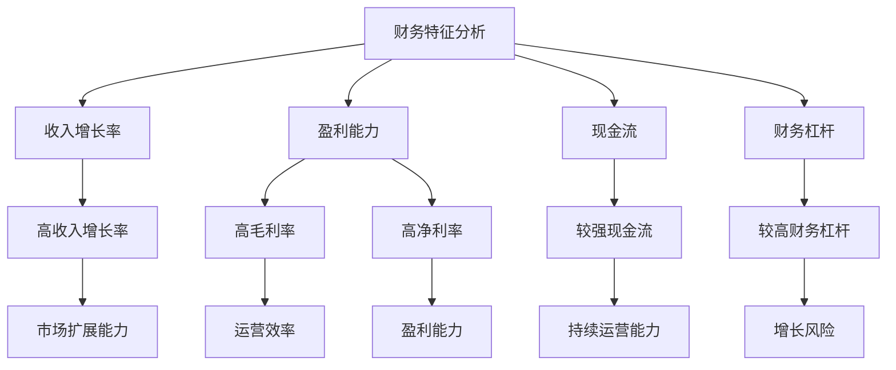
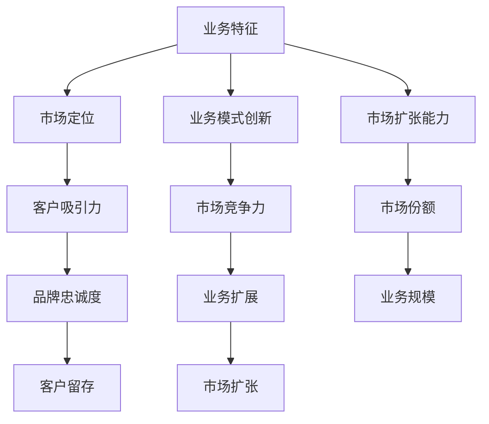

                 

## 《费雪的增长型公司特征分析》

### 关键词：费雪理论、增长型公司、特征分析、投资策略

### 摘要：
本文将深入探讨费雪增长型公司的特征分析，结合具体案例，系统解析其在财务、业务和管理等方面的特征，帮助投资者识别和评估这些公司的增长潜力。文章分为七个部分，依次介绍增长型公司的概述、背景、核心概念、特征分析、评估方法、案例分析和研究结论，旨在为读者提供一份全面而深入的技术指南。

## 引言

### 1.1 增长型公司的定义与特征

**增长型公司**，顾名思义，是指那些具有持续增长潜力的企业。这类公司通常在财务、业务和管理方面展现出独特的特征。根据费雪的理论，增长型公司主要具备以下几个特征：

1. **高增长率**：在长期内，公司的收入、利润和市场份额应保持较高水平的增长。
2. **市场领先**：在特定的市场中，增长型公司通常是领先者或具备显著的竞争优势。
3. **创新驱动**：公司注重技术创新和业务模式创新，以保持市场领先地位。
4. **高效的资本利用**：公司能够高效地运用资本，实现盈利能力的持续提升。

### 1.2 费雪理论与增长型公司

威廉·奥尼尔·费雪（William O'Neil）是一位著名的美国投资家，他的理论对于识别和投资增长型公司具有重要意义。费雪认为，增长型公司不仅要在当前市场环境中表现出色，还必须具备持续增长的能力。他的理论为投资者提供了一套系统的分析框架，帮助他们在众多公司中找到具有高增长潜力的优质股票。

### 1.3 研究目的与内容安排

本文的研究目的是通过对费雪增长型公司特征的分析，帮助投资者更好地理解和评估这些公司的增长潜力。文章将分为以下几个部分：

1. **引言**：介绍增长型公司的定义、特征和费雪理论。
2. **增长型公司的背景**：讨论增长型公司的发展历程、重要性和全球分布。
3. **增长型公司的核心概念**：分析增长型公司的关键要素和特征。
4. **增长型公司的特征分析**：深入探讨财务、业务和管理特征。
5. **增长型公司的评估方法**：介绍常见的评估方法和工具。
6. **案例分析**：通过成功和失败案例，探讨增长型公司的实际应用。
7. **结论**：总结研究结论，展望未来研究方向。

## 增长型公司的背景

### 2.1 增长型公司的发展历程

增长型公司的发展可以追溯到20世纪初期。当时，全球经济逐渐复苏，市场竞争日益激烈。一些企业开始意识到，仅仅依靠传统的业务模式难以实现持续增长。因此，它们开始探索创新的方法和策略，以保持竞争优势。随着时间的推移，这些公司逐渐成长为具有全球影响力的大型企业。

### 2.2 增长型公司的重要性

增长型公司在经济发展中扮演着重要角色。首先，它们创造了大量的就业机会，推动了经济的发展。其次，增长型公司的创新和竞争力有助于提升整个行业的水平。最后，投资增长型公司能够为投资者带来较高的回报，促进资本市场的繁荣。

### 2.3 增长型公司的全球分布

全球范围内，增长型公司主要集中在北美、欧洲和亚洲等地区。美国是增长型公司最为集中的地区，许多全球知名的企业如微软、苹果和亚马逊等均起源于美国。欧洲和亚洲也在近年来涌现出了一批具有高增长潜力的公司，如欧洲的阿迪达斯和亚洲的阿里巴巴等。

## 增长型公司的核心概念

### 3.1 增长型公司的关键要素

根据费雪的理论，增长型公司的关键要素包括：

1. **市场潜力**：市场潜力是衡量公司增长空间的重要指标。具有高市场潜力的公司通常能够实现更快的增长。
2. **竞争优势**：竞争优势是公司在市场中脱颖而出的重要因素。竞争优势包括产品优势、品牌优势和技术优势等。
3. **资本效率**：资本效率是指公司利用资本的能力。高资本效率的公司通常能够实现更高的盈利能力。
4. **管理能力**：管理能力是公司持续增长的重要保障。优秀的管理团队能够有效地制定和执行战略，推动公司发展。

### 3.2 要素间的相互作用与影响

增长型公司的关键要素之间相互作用，共同影响公司的增长潜力。例如，市场潜力决定了公司的增长空间，竞争优势保证了公司在市场中的领先地位，资本效率提升了公司的盈利能力，而管理能力则确保了战略的有效执行。只有这些要素相互协调、共同发挥作用，公司才能实现持续增长。

### 3.3 费雪增长型公司的特征属性对比

为了更清晰地理解增长型公司的特征，我们将其与一般公司进行对比，如下表所示：

| 特征属性 | 费雪增长型公司 | 一般公司 |
| :------: | :-------------: | :-------: |
| **市场潜力** | **高** | **一般** |
| **竞争优势** | **显著** | **一般** |
| **资本效率** | **高** | **一般** |
| **管理能力** | **强** | **一般** |

通过对比可以看出，增长型公司在市场潜力、竞争优势、资本效率和管

## 增长型公司的财务特征分析

### 4.1 费雪增长型公司的财务特征

增长型公司在财务方面具有一系列独特的特征，这些特征有助于投资者评估公司的增长潜力。以下是一些关键的财务特征：

1. **高收入增长率**：增长型公司通常在长期内保持较高的收入增长率。这一指标反映了公司的市场扩展能力和竞争力。
2. **盈利能力**：增长型公司通常具有高盈利能力，表现为高毛利率和净利率。这表明公司在生产、销售和管理方面具有高效的运营模式。
3. **现金流**：增长型公司通常具备较强的现金流，这意味着公司有足够的资金支持扩张和投资。
4. **财务杠杆**：增长型公司可能采用较高的财务杠杆，以加速增长，但同时也存在一定的风险。

### 4.2 财务指标的解读与比较

为了更好地理解增长型公司的财务特征，我们引入了几个关键的财务指标，并进行解读和比较：

1. **市盈率（P/E）**：市盈率是衡量公司估值的重要指标。增长型公司通常具有较高的市盈率，因为投资者对其未来的增长潜力抱有较高期望。
2. **市净率（P/B）**：市净率反映了公司股票价格相对于净资产的估值水平。增长型公司可能具有相对较高的市净率，这反映了市场对公司的认可。
3. **收入增长率**：收入增长率是衡量公司收入增长速度的重要指标。增长型公司通常表现出较高的收入增长率。
4. **净利润率**：净利润率是衡量公司盈利能力的重要指标。增长型公司通常具有较高的净利润率，这反映了其在成本控制和运营效率方面的优势。

### 4.3 财务特征与增长潜力的关系

财务特征与增长潜力之间存在密切的关系。例如，高收入增长率和盈利能力通常反映了公司的市场扩展能力和运营效率，这些因素共同推动了公司的持续增长。现金流是公司持续运营和投资的关键保障，而财务杠杆则可能加速公司增长，但同时也增加了风险。

通过分析财务特征，投资者可以更好地评估增长型公司的增长潜力，从而做出更明智的投资决策。以下是一个简单的财务特征分析流程图，以帮助投资者进行财务特征的解读和比较：

通过上述分析，投资者可以系统地理解增长型公司的财务特征，从而更好地评估其增长潜力。

## 增长型公司的业务特征分析

### 5.1 费雪增长型公司的业务特征

增长型公司在业务方面表现出独特的特征，这些特征使其能够持续推动业务增长。以下是一些关键的业务特征：

1. **市场定位**：增长型公司通常具备明确的市场定位，这有助于其吸引目标客户并建立品牌忠诚度。
2. **业务模式创新**：增长型公司不断探索和实施创新的业务模式，以提高市场竞争力。
3. **市场扩张**：增长型公司具有较强的市场扩张能力，通过收购、合并等方式迅速扩大市场份额。
4. **产业链整合**：增长型公司可能通过产业链整合，提高生产效率和降低成本。

### 5.2 业务模式的创新与拓展

业务模式的创新是增长型公司的重要特征之一。以下是一些常见的业务模式创新方式：

1. **数字化**：通过数字化技术和平台，增长型公司能够提供更加便捷、高效的服务，从而提升客户体验。
2. **平台化**：构建平台型业务模式，增长型公司可以吸引更多的合作伙伴和用户，实现资源共享和互利共赢。
3. **全球化**：通过全球化布局，增长型公司可以拓展国际市场，实现业务规模和影响力的提升。
4. **生态系统建设**：通过构建生态系统，增长型公司可以整合产业链上下游资源，提高整体竞争力。

### 5.3 业务特征与市场扩张的关系

业务特征与市场扩张之间存在密切的关系。例如，明确的市场定位有助于增长型公司吸引目标客户，而业务模式创新则能够提高市场竞争力。市场扩张能力则是增长型公司实现持续增长的关键，通过收购、合并等方式，公司可以迅速扩大市场份额，提高业务规模。

以下是一个业务特征与市场扩张关系的mermaid流程图，以帮助投资者更好地理解这一过程：

通过上述分析，投资者可以更清晰地了解增长型公司的业务特征，从而更好地评估其市场扩张潜力和业务增长潜力。

## 增长型公司的管理特征分析

### 6.1 费雪增长型公司的管理特征

增长型公司的成功离不开高效的管理。根据费雪的理论，增长型公司在管理方面表现出以下几个独特特征：

1. **强大的领导力**：增长型公司通常拥有具有强大领导力的CEO，他们能够制定明确的发展战略，并激励团队实现目标。
2. **创新文化**：增长型公司倡导创新文化，鼓励员工提出新的想法和改进措施，以推动公司持续发展。
3. **高效的决策机制**：增长型公司通常具备高效的决策机制，能够迅速响应市场变化，做出正确的决策。
4. **灵活的运营模式**：增长型公司能够灵活调整运营模式，以适应市场环境和业务需求。

### 6.2 高管团队与管理能力

增长型公司的高管团队在管理能力方面通常表现出色。以下是一些关键的管理能力：

1. **战略规划能力**：高管团队具备优秀的战略规划能力，能够制定长期和短期的发展目标，并制定相应的实施计划。
2. **执行力**：高管团队具备强大的执行力，能够确保战略和计划的有效实施。
3. **沟通协调能力**：高管团队具备良好的沟通协调能力，能够与内外部利益相关者建立良好的合作关系。
4. **创新能力**：高管团队鼓励创新，支持员工提出新的想法和解决方案。

### 6.3 管理特征与公司成长的关系

管理特征与公司成长之间存在密切的关系。强大的领导力和创新文化有助于推动公司持续发展。高效的决策机制和灵活的运营模式则使公司能够迅速应对市场变化，抓住机遇，实现快速增长。

以下是一个管理特征与公司成长关系的mermaid流程图，以帮助投资者更好地理解这一过程：

通过上述分析，投资者可以更深入地了解增长型公司的管理特征，从而更好地评估其管理能力和成长潜力。

## 增长型公司的评估方法

### 7.1 评估方法的概述

评估增长型公司的方法多样，常见的包括财务评估方法、业务评估方法和管理评估方法。每种方法都有其特定的应用场景和优缺点。

1. **财务评估方法**：主要通过财务报表分析公司的盈利能力、现金流量和财务杠杆等。常用的指标包括市盈率、市净率、收入增长率等。
2. **业务评估方法**：主要关注公司的业务模式、市场定位、竞争优势和增长潜力。常用的工具包括SWOT分析、波特五力模型等。
3. **管理评估方法**：主要评估公司的高管团队、管理能力、企业文化等。常用的方法包括360度评估、员工满意度调查等。

### 7.2 财务评估方法

财务评估方法是投资者评估增长型公司的重要手段。以下是一些常用的财务评估方法：

1. **财务比率分析**：通过比较公司的财务比率，如流动比率、速动比率、资产负债率等，评估公司的财务健康状况。
2. **财务预测模型**：通过构建财务预测模型，如现金流量预测模型、利润预测模型等，预测公司的未来财务状况。
3. **财务评估的应用实例**：以某增长型公司为例，分析其财务健康状况和未来增长潜力。

### 7.3 业务评估方法

业务评估方法主要关注公司的业务模式、市场定位和竞争优势。以下是一些常用的业务评估方法：

1. **业务模式分析**：通过分析公司的业务模式，如直接销售模式、平台化模式等，评估其适应市场变化的能力。
2. **市场份额分析**：通过分析公司的市场份额，评估其在市场中的竞争地位。
3. **业务评估的应用实例**：以某增长型公司为例，分析其业务模式和市场份额。

### 7.4 管理评估方法

管理评估方法主要关注公司的高管团队、管理能力和企业文化。以下是一些常用的管理评估方法：

1. **高管团队评估**：通过评估高管团队的能力、经验和业绩，评估其领导力。
2. **管理能力评估**：通过评估公司的管理流程、决策机制和运营效率，评估其管理能力。
3. **企业文化评估**：通过评估公司的价值观、使命和愿景，评估其企业文化。

通过综合运用上述评估方法，投资者可以全面、客观地评估增长型公司的价值，从而做出明智的投资决策。

## 案例分析

### 8.1 增长型公司的成功案例

为了更好地理解增长型公司的特征和评估方法，我们将分析两个成功的增长型公司案例：苹果公司和阿里巴巴。

#### 8.1.1 苹果公司

**背景介绍**：苹果公司成立于1976年，是全球最著名的科技企业之一。其产品包括iPhone、iPad、Mac电脑等。

**案例分析过程**：

1. **财务特征分析**：苹果公司的财务健康表现突出，其高收入增长率、高盈利能力和较强的现金流使得其在投资者中备受青睐。
2. **业务特征分析**：苹果公司的业务模式创新，通过构建生态系统，实现了产品的无缝连接，提高了用户体验。
3. **管理特征分析**：苹果公司的高管团队表现出色，乔布斯、蒂姆·库克等领导人具备卓越的领导力和管理能力。

**案例启示与经验总结**：苹果公司的成功在于其持续的创新能力和高效的运营模式。投资者可以从苹果公司中学习到如何识别和评估具有高增长潜力的公司。

#### 8.1.2 阿里巴巴

**背景介绍**：阿里巴巴成立于1999年，是全球最大的电子商务公司之一，其业务涵盖电商、云计算、数字支付等多个领域。

**案例分析过程**：

1. **财务特征分析**：阿里巴巴的财务表现同样优秀，其高收入增长率、盈利能力和现金流使其成为投资者眼中的优质股票。
2. **业务特征分析**：阿里巴巴的业务模式创新，通过搭建电子商务平台，实现了全球贸易的数字化。
3. **管理特征分析**：阿里巴巴的高管团队具备强大的领导力和创新精神，马云等领导人对于公司的战略方向和业务布局有着清晰的规划。

**案例启示与经验总结**：阿里巴巴的成功在于其全球化布局和业务模式的不断创新。投资者可以从阿里巴巴的案例中学习到如何把握市场机遇，实现业务的快速扩展。

### 8.2 增长型公司的失败案例

尽管增长型公司通常具备较高的增长潜力，但也存在一些失败案例。以下将分析两个增长型公司的失败案例：黑莓公司和乐视网。

#### 8.2.1 黑莓公司

**背景介绍**：黑莓公司成立于1984年，曾是世界领先的智能手机制造商之一。

**案例分析过程**：

1. **财务特征分析**：黑莓公司在财务上表现不佳，其收入增长放缓，盈利能力下降，现金流紧张。
2. **业务特征分析**：黑莓公司未能及时适应市场变化，其智能手机业务受到竞争对手的激烈竞争。
3. **管理特征分析**：黑莓公司的高管团队在战略决策上存在失误，未能有效应对市场竞争。

**案例启示与经验总结**：黑莓公司的失败在于其战略失误和业务模式未能适应市场变化。投资者应警惕那些未能及时调整战略和业务模式的公司。

#### 8.2.2 乐视网

**背景介绍**：乐视网成立于2004年，是中国领先的互联网视频平台之一。

**案例分析过程**：

1. **财务特征分析**：乐视网在财务上存在严重问题，其负债率过高，现金流紧张，最终导致公司破产。
2. **业务特征分析**：乐视网在业务扩张过程中盲目投资，过度依赖外部融资。
3. **管理特征分析**：乐视网的高管团队在财务管理上存在重大失误，未能有效控制成本和风险。

**案例启示与经验总结**：乐视网的失败在于其过度扩张和财务管理失误。投资者应谨慎对待那些过度扩张和财务管理不成熟的公司。

通过分析成功和失败的案例，投资者可以更好地理解增长型公司的特征和评估方法，从而在投资决策中更加谨慎和理性。

## 结论

### 9.1 研究结论

本文通过对费雪增长型公司的特征分析，揭示了这些公司在财务、业务和管理方面的独特特征。研究发现，增长型公司通常具备高增长率、市场领先地位、创新驱动和高效的资本利用等特征。同时，本文通过案例分析，探讨了增长型公司的成功和失败原因，为投资者提供了宝贵的经验和教训。

### 9.2 研究贡献

本文的研究贡献主要体现在以下几个方面：

1. **理论贡献**：本文基于费雪的理论，对增长型公司的特征进行了系统分析，丰富了相关理论研究。
2. **实践贡献**：本文为投资者提供了一套系统的评估方法，有助于他们更好地识别和评估增长型公司的增长潜力。
3. **启示贡献**：本文通过案例分析，总结了成功和失败的经验教训，为投资者提供了实用的投资策略。

### 9.3 未来研究方向

未来研究可以从以下几个方面进行：

1. **深化特征分析**：进一步探讨增长型公司的其他特征，如社会影响力、环境影响等。
2. **扩展评估方法**：研究更多适用于不同行业和市场的评估方法，提高评估的准确性。
3. **实证研究**：通过实证研究，验证本文提出的理论和评估方法的有效性和实用性。

## 作者信息

**作者：AI天才研究院/AI Genius Institute & 禅与计算机程序设计艺术 /Zen And The Art of Computer Programming**

