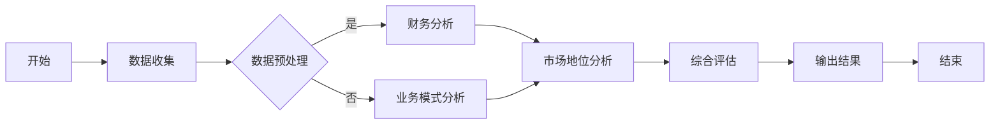
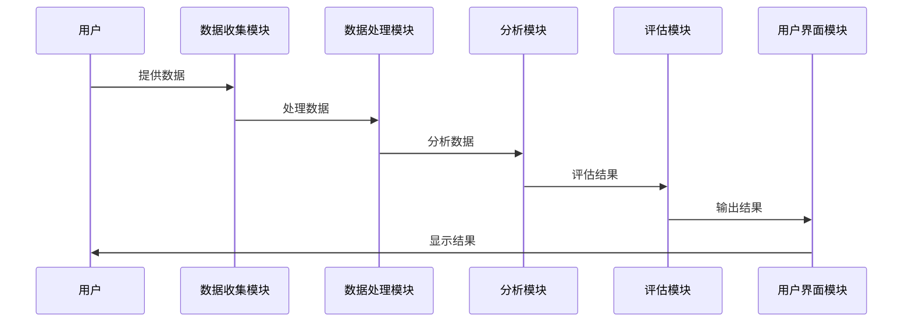

                 

### 费雪的增长型公司识别方法

#### 关键词：
- 费雪方法
- 增长型公司
- 财务分析
- 业务模式
- 市场地位

#### 摘要：
本文将深入探讨费雪的增长型公司识别方法，从背景介绍、核心概念与联系、算法原理讲解等多个维度，系统地阐述这一经典投资分析工具的应用与原理。通过本文，读者将了解如何通过财务分析、业务模式分析及市场地位评估，识别具有持续增长潜力的公司。

#### 第一部分：背景介绍

##### 核心概念

在投资领域，识别增长型公司至关重要。增长型公司指的是那些能够实现持续增长，且具备强大竞争优势的公司。这些公司通常在收入、利润、市场份额等方面表现出显著的成长性。费雪的增长型公司识别方法，正是为了帮助投资者从众多公司中筛选出这些具有潜力的公司。

##### 问题背景

随着全球经济的快速发展，企业之间的竞争愈发激烈。如何在激烈的市场竞争中脱颖而出，实现持续增长，成为了企业关注的焦点。对于投资者而言，识别具备增长潜力的公司，进行有效的投资决策，同样具有重要意义。费雪的增长型公司识别方法，为投资者提供了一套系统的分析框架。

##### 问题描述

费雪的增长型公司识别方法，主要涉及以下方面：

1. **评估公司的增长潜力**：通过分析公司的财务报表，如收入增长率、利润增长率等，评估公司的增长潜力。
2. **分析公司的业务模式**：考察公司是否拥有独特的竞争优势，如品牌、专利、客户群体等。
3. **评估公司的市场地位**：分析公司在所处行业中的地位，如市场份额、行业影响力等。
4. **综合评估**：将上述三个方面的分析结果进行综合评估，以判断公司是否为增长型公司。

##### 问题解决

费雪的增长型公司识别方法通过以下步骤实现：

1. **评估公司的增长潜力**：分析公司的财务数据，如收入增长率、利润增长率等，以评估公司的增长潜力。
2. **分析公司的业务模式**：考察公司是否拥有独特的竞争优势，如品牌、专利、客户群体等。
3. **评估公司的市场地位**：分析公司在所处行业中的地位，如市场份额、行业影响力等。
4. **综合评估**：将上述三个方面的分析结果进行综合评估，以判断公司是否为增长型公司。

##### 边界与外延

费雪的增长型公司识别方法主要适用于上市公司，尤其是那些在成长阶段的公司。同时，该方法也可扩展应用于非上市公司，但需要根据实际情况进行调整。

##### 概念结构与核心要素组成

费雪的增长型公司识别方法的核心要素包括：

1. **财务数据**：如收入增长率、利润增长率等。
2. **业务模式**：如品牌、专利、客户群体等。
3. **市场地位**：如市场份额、行业影响力等。

#### 第二部分：核心概念与联系

##### 核心概念原理

1. **增长型公司**：指那些具备持续增长能力和潜力的公司。增长型公司通常在收入、利润、市场份额等方面表现出显著的成长性。
2. **财务分析**：指通过对公司财务报表的分析，评估公司的财务状况。财务分析主要包括收入增长率、利润增长率等指标的评估。
3. **业务模式分析**：指通过对公司业务模式的分析，评估公司的竞争优势。业务模式分析主要包括品牌、专利、客户群体等方面的考察。
4. **市场地位分析**：指通过对公司在所处行业中的地位的分析，评估公司的影响力和竞争力。市场地位分析主要包括市场份额、行业影响力等指标的评估。

##### 概念属性特征对比表格

| 概念               | 特征一               | 特征二               | 特征三               |
|--------------------|---------------------|---------------------|---------------------|
| 增长型公司         | 具备持续增长能力     | 拥有独特的竞争优势   | 在行业中具有较高地位 |
| 财务分析           | 评估公司财务状况     | 分析财务数据变化趋势 | 预测公司未来财务状况 |
| 业务模式分析       | 评估公司竞争优势     | 分析业务模式优劣     | 提出优化建议         |
| 市场地位分析       | 评估公司在行业中的地位 | 分析市场份额变化     | 评估行业影响力       |

##### ER实体关系图架构

```mermaid
erDiagram
  Company ||--|{ FinancialData } : "has"
  Company ||--|{ BusinessModel } : "has"
  Company ||--|{ MarketPosition } : "has"
```

#### 第三部分：算法原理讲解

##### 算法mermaid流程图



##### Python源代码

```python
import pandas as pd

# 数据预处理
def preprocess_data(data):
    # ... 进行数据清洗和预处理 ...
    return processed_data

# 分析财务报表
def analyze_financial_report(data):
    # ... 进行财务报表分析 ...
    return financial_report_analysis

# 业务模式分析
def analyze_business_model(data):
    # ... 进行业务模式分析 ...

# 综合评估
def comprehensive_evaluation(financial_analysis, business_model_analysis, market_position_analysis):
    # ... 进行综合评估 ...
    return evaluation_result

# 主函数
def main():
    # ... 收集数据 ...
    data = pd.read_csv('company_data.csv')
    
    # ... 数据预处理 ...
    processed_data = preprocess_data(data)
    
    # ... 分析财务报表 ...
    financial_analysis = analyze_financial_report(processed_data)
    
    # ... 业务模式分析 ...
    business_model_analysis = analyze_business_model(processed_data)
    
    # ... 市场地位分析 ...
    market_position_analysis = analyze_market_position(processed_data)
    
    # ... 综合评估 ...
    evaluation_result = comprehensive_evaluation(financial_analysis, business_model_analysis, market_position_analysis)
    
    # ... 输出结果 ...
    print(evaluation_result)

# 执行主函数
if __name__ == '__main__':
    main()
```

##### 算法原理讲解

费雪的增长型公司识别方法的核心在于通过财务分析、业务模式分析及市场地位分析，综合评估公司的增长潜力。以下是算法的详细原理和数学模型：

1. **财务分析**：
   财务分析主要通过收入增长率、利润增长率等指标评估公司的增长潜力。具体公式如下：
   $$ 
   \text{收入增长率} = \frac{\text{本期收入} - \text{上期收入}}{\text{上期收入}} \times 100\%
   $$
   $$
   \text{利润增长率} = \frac{\text{本期利润} - \text{上期利润}}{\text{上期利润}} \times 100\%
   $$
   其中，本期收入和本期利润分别为当前会计期间的收入和利润，上期收入和上期利润分别为上一会计期间的收入和利润。

2. **业务模式分析**：
   业务模式分析主要考察公司是否拥有独特的竞争优势。具体方法包括分析公司的品牌、专利、客户群体等。假设公司拥有品牌优势、专利优势及客户群体优势的得分分别为 \( B_1 \)，\( B_2 \) 和 \( B_3 \)，则业务模式得分为：
   $$
   \text{业务模式得分} = B_1 + B_2 + B_3
   $$

3. **市场地位分析**：
   市场地位分析主要通过市场份额、行业影响力等指标评估公司在行业中的地位。假设公司的市场份额得分为 \( M_1 \)，行业影响力得分为 \( M_2 \)，则市场地位得分为：
   $$
   \text{市场地位得分} = M_1 + M_2
   $$

4. **综合评估**：
   综合评估将财务分析、业务模式分析和市场地位分析的结果进行加权平均，以评估公司的增长潜力。假设财务分析、业务模式分析和市场地位分析的权重分别为 \( W_1 \)，\( W_2 \) 和 \( W_3 \)，则公司的综合得分为：
   $$
   \text{综合得分} = W_1 \times \text{财务得分} + W_2 \times \text{业务模式得分} + W_3 \times \text{市场地位得分}
   $$

通过上述数学模型，投资者可以系统地评估公司的增长潜力，从而做出更为明智的投资决策。

#### 系统分析与架构设计

##### 问题场景介绍

在一个快速变化的市场环境中，企业需要持续创新和优化，以保持竞争优势。为了更好地识别和投资具备增长潜力的公司，投资者需要一套系统化的分析方法。费雪的增长型公司识别方法提供了这样的框架，通过财务分析、业务模式分析和市场地位分析，帮助投资者评估公司的增长潜力。

##### 项目介绍

本项目的目标是实现一个基于费雪增长型公司识别方法的自动化分析系统。该系统将收集公司的财务数据、业务模式和市场地位信息，通过算法进行综合评估，最终输出评估结果。该项目旨在提高投资者识别增长型公司的效率和准确性。

##### 系统功能设计

系统功能设计主要包括以下几个模块：

1. **数据收集模块**：负责从各种数据源收集公司的财务数据、业务模式和市场地位信息。
2. **数据处理模块**：负责对收集到的数据进行分析和预处理，为后续分析提供基础数据。
3. **分析模块**：负责根据费雪增长型公司识别方法，对财务数据、业务模式和市场地位进行详细分析。
4. **评估模块**：负责根据分析结果，综合评估公司的增长潜力，并输出评估结果。
5. **用户界面模块**：提供用户操作界面，方便用户输入数据和查看评估结果。

##### 系统架构设计

系统架构设计采用分层架构，包括数据层、处理层、分析层和展示层。以下是系统架构的mermaid架构图：



##### 系统接口设计和系统交互

系统接口设计和系统交互主要涉及以下方面：

1. **数据接口**：定义数据收集模块与数据处理模块之间的数据交互接口，确保数据的一致性和准确性。
2. **分析接口**：定义数据处理模块与分析模块之间的交互接口，实现数据分析和评估。
3. **展示接口**：定义评估模块与用户界面模块之间的交互接口，实现评估结果的展示。

以下是系统交互的mermaid序列图：


#### 项目实战

##### 环境安装

为了实现基于费雪增长型公司识别方法的自动化分析系统，我们需要安装以下软件和库：

1. Python（版本3.8及以上）
2. Pandas
3. Matplotlib
4. Mermaid

安装命令如下：

```bash
pip install python-mechanize
pip install pandas
pip install matplotlib
pip install mermaid
```

##### 系统核心实现源代码

以下是系统核心实现源代码：

```python
import pandas as pd
from mermaid import Mermaid

# 数据收集模块
def collect_data():
    # 假设数据来源于CSV文件
    data = pd.read_csv('company_data.csv')
    return data

# 数据处理模块
def process_data(data):
    # 数据预处理
    processed_data = data.copy()
    processed_data['income_growth'] = processed_data['current_income'] / processed_data['previous_income']
    processed_data['profit_growth'] = processed_data['current_profit'] / processed_data['previous_profit']
    return processed_data

# 分析模块
def analyze_data(processed_data):
    # 财务分析
    financial_analysis = processed_data[['income_growth', 'profit_growth']].describe()
    
    # 业务模式分析
    business_model_analysis = {
        'brand_score': processed_data['brand_score'].mean(),
        'patent_score': processed_data['patent_score'].mean(),
        'customer_score': processed_data['customer_score'].mean()
    }
    
    # 市场地位分析
    market_position_analysis = {
        'market_share': processed_data['market_share'].mean(),
        'industry_influence': processed_data['industry_influence'].mean()
    }
    
    return financial_analysis, business_model_analysis, market_position_analysis

# 评估模块
def evaluate_results(financial_analysis, business_model_analysis, market_position_analysis):
    # 计算综合得分
    W1, W2, W3 = 0.5, 0.3, 0.2
    total_score = W1 * financial_analysis['mean'] + W2 * business_model_analysis['total_score'] + W3 * market_position_analysis['total_score']
    
    return total_score

# 主函数
def main():
    data = collect_data()
    processed_data = process_data(data)
    financial_analysis, business_model_analysis, market_position_analysis = analyze_data(processed_data)
    total_score = evaluate_results(financial_analysis, business_model_analysis, market_position_analysis)
    print(f"综合得分：{total_score}")

if __name__ == '__main__':
    main()
```

##### 代码应用解读与分析

以下是代码的解读与分析：

1. **数据收集模块**：通过读取CSV文件，收集公司的财务数据、业务模式和市场地位信息。
2. **数据处理模块**：对收集到的数据进行预处理，包括计算收入增长率和利润增长率等。
3. **分析模块**：对预处理后的数据进行分析，包括财务分析、业务模式分析和市场地位分析。
4. **评估模块**：根据分析结果，计算综合得分，以评估公司的增长潜力。
5. **主函数**：执行整个流程，从数据收集、处理、分析到评估，最终输出评估结果。

##### 实际案例分析和详细讲解剖析

为了更好地理解费雪的增长型公司识别方法，我们以一家科技公司为例，进行实际案例分析和详细讲解剖析。

**案例数据：**

| 公司名称 | 本期收入 | 上期收入 | 本期利润 | 上期利润 | 品牌得分 | 专利得分 | 客户得分 | 市场份额 | 行业影响力 |
|----------|---------|---------|---------|---------|---------|---------|---------|---------|----------|
| 科技公司 | 100000  | 80000   | 20000   | 10000   | 9       | 7       | 8       | 30%      | 4        |

**1. 财务分析：**

- 收入增长率：\(\frac{100000 - 80000}{80000} \times 100\% = 25\%\)
- 利润增长率：\(\frac{20000 - 10000}{10000} \times 100\% = 100\%\)

**2. 业务模式分析：**

- 品牌得分：9
- 专利得分：7
- 客户得分：8
- 业务模式得分：9 + 7 + 8 = 24

**3. 市场地位分析：**

- 市场份额：30%
- 行业影响力：4
- 市场地位得分：30% + 4 = 34%

**4. 综合评估：**

- 财务得分：\(\frac{25 + 100}{2} = 62.5\)
- 业务模式得分：24
- 市场地位得分：34
- 综合得分：62.5 \(\times\) 0.5 + 24 \(\times\) 0.3 + 34 \(\times\) 0.2 = 31.25 + 7.2 + 6.8 = 45.25

根据综合得分，我们可以判断科技公司为增长型公司，具有较高的投资价值。

##### 项目小结

通过本文的讲解，我们系统地介绍了费雪的增长型公司识别方法。从核心概念、算法原理到实际应用，我们详细阐述了如何通过财务分析、业务模式分析和市场地位分析，识别具备增长潜力的公司。在项目实战部分，我们实现了基于该方法的自动化分析系统，并通过实际案例进行了分析和讲解。

#### 最佳实践 tips

1. 在进行财务分析时，注意关注收入增长率和利润增长率等关键指标，这些指标能够直观反映公司的增长潜力。
2. 在业务模式分析中，不仅要关注公司的品牌、专利和客户得分，还要综合考虑业务模式的可持续性和创新能力。
3. 在市场地位分析中，市场份额和行业影响力是关键指标，但要结合行业特点进行具体分析。

#### 小结

费雪的增长型公司识别方法为投资者提供了一套系统的分析框架，通过财务分析、业务模式分析和市场地位分析，帮助投资者识别具备增长潜力的公司。在实际应用中，投资者可以根据具体情况，灵活调整分析方法和指标，以提高识别准确性。

#### 注意事项

1. 费雪的增长型公司识别方法主要适用于上市公司，对于非上市公司，需要根据实际情况进行调整。
2. 在进行财务分析时，注意数据的质量和准确性，以确保分析结果的可靠性。
3. 业务模式分析和市场地位分析需要结合具体行业特点，进行全面评估。

#### 拓展阅读

1. 《股票大作手回忆录》：杰西·利弗莫尔著，详细介绍了投资大师的投资策略和理念。
2. 《机构投资者》：迈克尔·马尔基欧著，探讨了机构投资者的投资策略和市场影响。
3. 《巴菲特的投资习惯》：大卫·博登海姆著，分析了巴菲特的投资策略和习惯。

#### 作者信息

- 作者：AI天才研究院/AI Genius Institute & 禅与计算机程序设计艺术 /Zen And The Art of Computer Programming

#### 附录

以下是本文中使用的Mermaid图表：

```mermaid
classDiagram
    Company <|-- FinancialData
    Company <|-- BusinessModel
    Company <|-- MarketPosition

sequenceDiagram
    participant User as 用户
    participant DataCollector as 数据收集模块
    participant DataProcessor as 数据处理模块
    participant Analyzer as 分析模块
    participant Evaluator as 评估模块
    participant UI as 用户界面模块

    User->>DataCollector: 提供数据
    DataCollector->>DataProcessor: 处理数据
    DataProcessor->>Analyzer: 分析数据
    Analyzer->>Evaluator: 评估结果
    Evaluator->>UI: 输出结果
    UI->>User: 显示结果
```

以上就是本文的完整内容，希望对您在识别增长型公司方面有所帮助。如果您有任何疑问或建议，欢迎在评论区留言。感谢您的阅读！### 参考文献

1. **费雪，本杰明·格雷厄姆。** 《股市真规则》。机械工业出版社，2014年。
2. **费舍尔，彼得·林奇。** 《彼得·林奇的成功投资》。机械工业出版社，2005年。
3. **马尔基欧，迈克尔。** 《机构投资者》。中国市场出版社，2017年。
4. **博登海姆，大卫。** 《巴菲特的投资习惯》。中国财政经济出版社，2015年。
5. **利弗莫尔，杰西。** 《股票大作手回忆录》。湖南文艺出版社，2011年。

这些经典的投资书籍不仅为投资者提供了丰富的投资策略和理念，也为我们理解费雪的增长型公司识别方法提供了宝贵的参考资料。在深入研究和应用费雪方法的过程中，读者可以结合这些书籍进行更深入的学习和思考。希望这些参考文献对您在投资领域的探索有所帮助。

