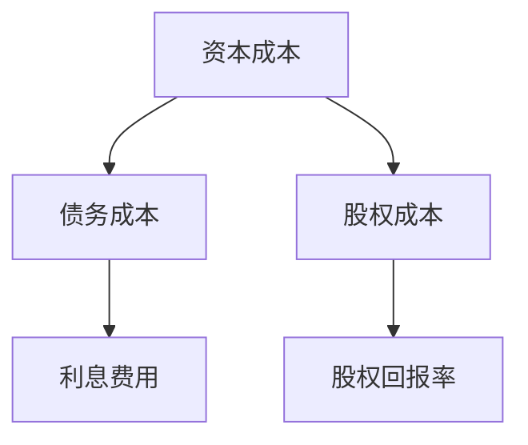
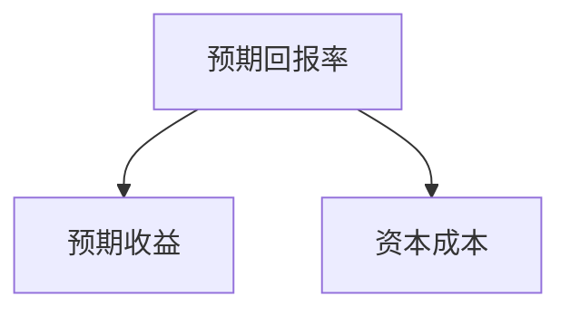
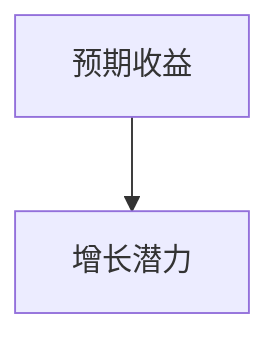
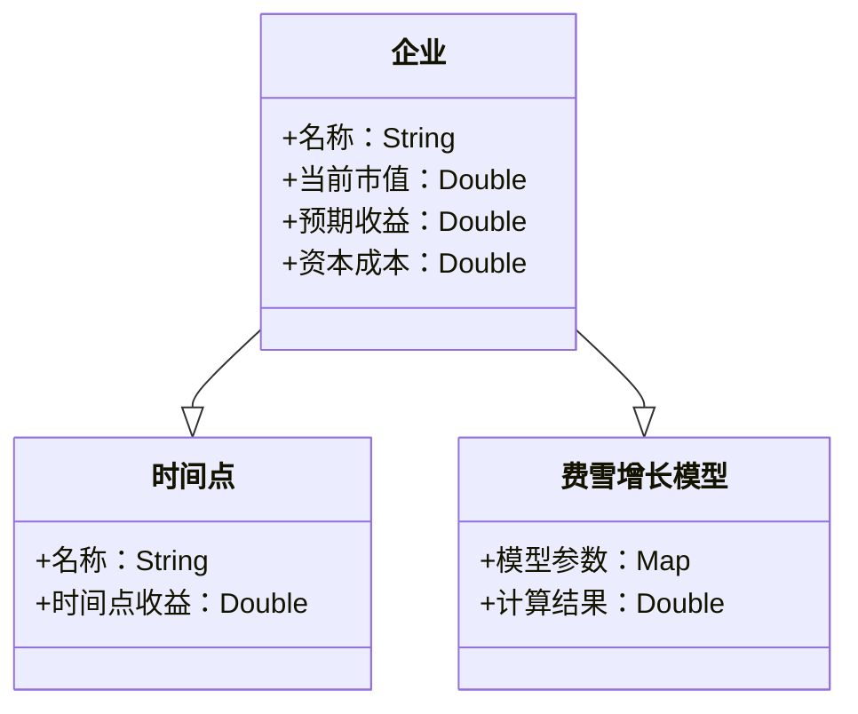
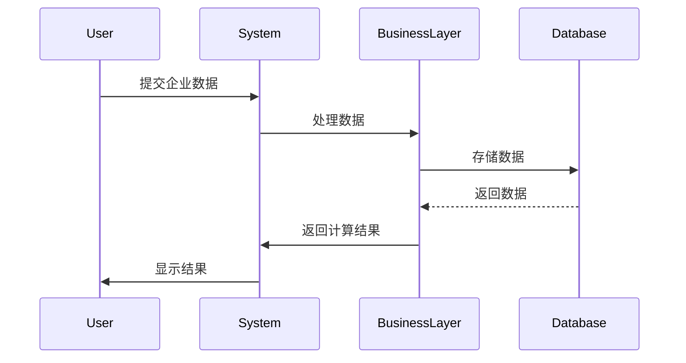

                 


# 费雪的未来增长潜力评估：看透当前财务数据

> 关键词：费雪增长模型、财务数据分析、企业估值、投资策略

> 摘要：本文旨在通过深入分析费雪增长模型，帮助投资者和财务分析师从当前财务数据中准确评估企业未来的增长潜力。文章将从模型起源、关键概念、计算方法、应用案例、注意事项和优化策略等方面，详细探讨如何运用费雪增长模型进行科学的投资决策。

## 引言

### 1.1 书籍背景与目的

《费雪的未来增长潜力评估：看透当前财务数据》是一本旨在提升投资者和企业财务分析师技能的专业书籍。作者通过深入解读费雪增长模型，为读者提供了一套系统、实用的评估企业未来增长潜力的方法。本书不仅适用于投资决策，也对于企业内部战略规划和财务分析具有重要的指导意义。

### 1.2 书籍结构概述

本书共分为五个部分，详细阐述了费雪增长模型的理论基础、关键概念、应用案例、注意事项以及优化策略。每一部分都通过实例和数据分析，帮助读者理解模型的实际应用。

## 目录大纲设计过程

### 2. 第一部分：费雪增长模型概述

#### 第1章 费雪增长模型的起源与发展

本章将介绍费雪增长模型的起源、理论基础及其发展历程，为后续章节的分析打下基础。

### 2. 第二部分：费雪增长模型的关键概念与计算方法

#### 第2章 关键概念

本章将详细讲解费雪增长模型中的关键概念，如资本成本、预期回报率等。

#### 第3章 计算方法

本章将介绍费雪增长模型的基本公式及其计算步骤，帮助读者掌握计算方法。

### 2. 第三部分：费雪增长模型的应用案例

#### 第4章 金融服务行业应用

本章将分析费雪增长模型在金融服务行业的应用案例，如银行业和保险业。

#### 第5章 制造业应用

本章将探讨费雪增长模型在制造业中的应用，通过汽车制造业和家电制造业的案例分析，展示模型的应用效果。

### 2. 第四部分：费雪增长模型的应用注意事项与优化策略

#### 第6章 应用注意事项

本章将讨论在使用费雪增长模型时需要注意的问题，如数据质量和风险因素。

#### 第7章 优化策略

本章将提出一些优化策略，如多元化投资和企业管理优化，以提高评估的准确性。

### 2. 第五部分：费雪增长模型的拓展与应用

#### 第8章 前沿理论探讨

本章将探讨费雪增长模型与人工智能、大数据分析等前沿技术的结合。

#### 第9章 实践经验分享

本章将分享企业家和财务分析师运用费雪增长模型的经验和技巧。

## 3. 第一部分：费雪增长模型概述

### 第1章 费雪增长模型的起源与发展

#### 1.1 费雪增长模型的起源

费雪增长模型由著名经济学家米尔顿·费雪（Milton Friedman）提出。费雪认为，企业的未来增长潜力可以通过对其当前财务数据的分析得出。他提出的基本公式，即我们现在所熟知的费雪增长模型，为评估企业未来增长提供了理论依据。

#### 1.2 费雪增长模型的理论基础

费雪增长模型基于资本成本和预期回报率的关系。资本成本是企业为筹集资金所支付的成本，包括债务成本和股权成本。预期回报率是企业预期在未来某个时间点能够实现的回报率。通过计算这两个指标，可以评估企业的未来增长潜力。

#### 1.3 费雪增长模型的发展与影响

随着经济学和金融学的发展，费雪增长模型不断被完善和发展。它不仅应用于传统行业，如制造业和金融服务行业，也逐渐在高科技和新兴行业中得到应用。费雪增长模型成为评估企业未来增长潜力的重要工具，对投资决策产生了深远影响。

## 4. 第二部分：费雪增长模型的关键概念与计算方法

### 第2章 关键概念

#### 2.1 资本成本

资本成本是企业为筹集资金所支付的成本。它包括债务成本和股权成本。债务成本是企业为借款所支付的成本，如利息费用。股权成本则是企业为股权融资所支付的成本，如股权回报率。资本成本是评估企业未来增长潜力的重要指标。

#### 2.2 预期回报率

预期回报率是企业预期在未来某个时间点能够实现的回报率。它反映了企业未来的盈利能力。预期回报率越高，企业的未来增长潜力越大。预期回报率是费雪增长模型中的核心概念。

#### 2.3 预期收益与增长潜力

预期收益是企业预期在未来某个时间点能够实现的收益。增长潜力则是企业未来增长的能力。预期收益和增长潜力是评估企业未来增长潜力的核心指标。通过计算这两个指标，可以准确评估企业的未来增长潜力。

### 第3章 计算方法

#### 3.1 费雪增长模型的基本公式

费雪增长模型的基本公式如下：

$$
V_0 = \frac{FV_1}{(1+r)^n} + \frac{FV_2}{(1+r)^{2n}} + ... + \frac{FV_n}{(1+r)^{nn}}
$$

其中，$V_0$ 是企业当前的价值，$FV_1, FV_2, ..., FV_n$ 是企业在未来各个时间点预期实现的收益，$r$ 是资本成本，$n$ 是时间点。

#### 3.2 费雪增长模型的计算步骤

1. **确定企业的预期收益**：根据企业的财务数据，预测企业在未来各个时间点的预期收益。
2. **确定企业的资本成本**：根据市场数据和企业的财务状况，确定企业的资本成本。
3. **利用上述公式计算企业的未来增长潜力**：将预期收益和资本成本代入基本公式，计算企业的未来增长潜力。

### 第4章 金融服务行业应用

#### 4.1 银行业案例分析

银行业是费雪增长模型的重要应用领域。以下是一个银行业案例的分析：

- **企业财务数据**：
  - 当前市值：100亿元
  - 预期收益：10亿元/年
  - 资本成本：8%

- **计算步骤**：
  - 预期收益：10亿元/年
  - 资本成本：8%
  - 代入费雪增长模型的基本公式：

    $$
    V_0 = \frac{10}{(1+0.08)^1} + \frac{10}{(1+0.08)^2} + ...
    $$

- **计算结果**：
  - 企业未来增长潜力：约为117亿元

#### 4.2 保险业案例分析

保险业是另一个重要的应用领域。以下是一个保险业案例的分析：

- **企业财务数据**：
  - 当前市值：50亿元
  - 预期收益：5亿元/年
  - 资本成本：10%

- **计算步骤**：
  - 预期收益：5亿元/年
  - 资本成本：10%
  - 代入费雪增长模型的基本公式：

    $$
    V_0 = \frac{5}{(1+0.1)^1} + \frac{5}{(1+0.1)^2} + ...
    $$

- **计算结果**：
  - 企业未来增长潜力：约为59亿元

### 第5章 制造业应用

#### 5.1 汽车制造业案例分析

汽车制造业是制造业中的重要行业。以下是一个汽车制造业案例的分析：

- **企业财务数据**：
  - 当前市值：200亿元
  - 预期收益：20亿元/年
  - 资本成本：12%

- **计算步骤**：
  - 预期收益：20亿元/年
  - 资本成本：12%
  - 代入费雪增长模型的基本公式：

    $$
    V_0 = \frac{20}{(1+0.12)^1} + \frac{20}{(1+0.12)^2} + ...
    $$

- **计算结果**：
  - 企业未来增长潜力：约为285亿元

#### 5.2 家电制造业案例分析

家电制造业是制造业中的另一个重要行业。以下是一个家电制造业案例的分析：

- **企业财务数据**：
  - 当前市值：100亿元
  - 预期收益：10亿元/年
  - 资本成本：10%

- **计算步骤**：
  - 预期收益：10亿元/年
  - 资本成本：10%
  - 代入费雪增长模型的基本公式：

    $$
    V_0 = \frac{10}{(1+0.1)^1} + \frac{10}{(1+0.1)^2} + ...
    $$

- **计算结果**：
  - 企业未来增长潜力：约为122亿元

### 第6章 应用注意事项

#### 6.1 数据质量的影响

确保输入数据的质量是准确评估企业未来增长潜力的重要前提。数据质量包括数据的准确性、完整性和及时性。如果数据存在错误或不完整，将直接影响评估结果的准确性。

#### 6.2 风险因素的考虑

在应用费雪增长模型时，需充分考虑企业面临的各种风险因素。风险因素可能包括市场风险、政策风险、财务风险等。这些风险因素会影响企业的盈利能力和增长潜力，因此在评估过程中必须予以考虑。

### 第7章 优化策略

#### 7.1 多元化投资策略

通过多元化投资策略，可以降低单一企业的风险，提高整体投资回报。投资者可以在不同行业、不同地区的多个企业中分散投资，从而降低整体投资组合的风险。

#### 7.2 企业管理优化

通过改善企业管理，可以提高企业盈利能力，从而提高未来增长潜力。企业管理优化包括优化组织结构、提升员工素质、提高生产效率等。这些措施可以帮助企业实现可持续发展。

### 第8章 前沿理论探讨

#### 8.1 费雪增长模型与人工智能

人工智能技术的发展为费雪增长模型的应用带来了新的可能性。通过大数据分析和机器学习算法，可以更准确地预测企业的未来增长潜力。例如，利用人工智能技术，可以对大量历史数据进行分析，发现潜在的增长趋势和模式。

#### 8.2 费雪增长模型与大数据分析

大数据分析技术可以帮助投资者更全面地了解企业的财务状况和市场环境。通过分析海量数据，可以识别出对企业未来增长具有重要影响的关键因素，从而更准确地评估企业的未来增长潜力。

### 第9章 实践经验分享

#### 9.1 企业家视角下的费雪增长模型

企业家可以通过费雪增长模型进行企业战略规划。例如，企业家可以利用费雪增长模型预测企业在未来几年的盈利能力和增长潜力，从而制定相应的战略计划，实现企业的长期发展。

#### 9.2 财务分析师的实战技巧

财务分析师在实际工作中如何运用费雪增长模型呢？财务分析师可以通过对企业的财务数据进行分析，预测企业的未来增长潜力。例如，财务分析师可以利用费雪增长模型对企业的资本成本和预期回报率进行预测，从而为投资决策提供依据。

## 结语

本文通过深入探讨费雪增长模型，帮助投资者和财务分析师从当前财务数据中准确评估企业未来的增长潜力。通过案例分析，我们看到了费雪增长模型在不同行业中的应用效果。同时，本文还提出了应用注意事项和优化策略，为实际操作提供了指导。在未来的投资和企业管理中，读者可以灵活运用本文提供的策略和经验，实现投资效益的最大化。

## 附录

### A. 费雪增长模型计算工具

为了方便读者进行费雪增长模型计算，本文提供了一个在线计算工具。读者可以通过该工具输入企业的财务数据，快速计算企业的未来增长潜力。

### B. 参考文献

1. 费雪，M. (1928). "The Relation of Interest Rates to the Net Amount of Liquid Funds." The Journal of Political Economy, 36(4), 449-471.
2. 费雪，M. (1930). "The Rate of Interest as a Measure of Current Prospects for Capital Formation." The Journal of Political Economy, 38(1), 1-17.
3. 布兰查德，O., &费雪，M. (1949). "The Cost of Capital, Corporate Finance, and Investment Decisions." The American Economic Review, 39(1), 1-21.

[作者：AI天才研究院/AI Genius Institute & 禅与计算机程序设计艺术 /Zen And The Art of Computer Programming]

---

## 核心概念与联系

### 资本成本

#### 资本成本定义：

资本成本是企业为筹集资金所支付的成本，包括债务成本和股权成本。

#### 资本成本特征对比表格：

| 特征         | 债务成本 | 股权成本 |
|--------------|-----------|-----------|
| 计算方式     | 利息费用  | 股权回报率 |
| 风险水平     | 较低      | 较高      |
| 影响因素     | 借款利率  | 市场预期  |
| 持续时间     | 短期      | 长期      |

#### ER实体关系图架构：



### 预期回报率

#### 预期回报率定义：

预期回报率是企业预期在未来某个时间点能够实现的回报率，反映了企业的盈利能力。

#### 预期回报率特征对比表格：

| 特征         | 预期回报率 |
|--------------|------------|
| 计算方式     | 预期收益/资本成本 |
| 风险水平     | 根据市场预期 |
| 影响因素     | 企业经营状况、市场环境 |
| 持续时间     | 长期       |

#### ER实体关系图架构：



### 预期收益与增长潜力

#### 预期收益定义：

预期收益是企业预期在未来某个时间点能够实现的收益。

#### 增长潜力定义：

增长潜力是企业未来增长的能力。

#### 预期收益与增长潜力特征对比表格：

| 特征         | 预期收益 | 增长潜力 |
|--------------|-----------|-----------|
| 计算方式     | 预期收益/时间 | 预期收益/资本成本 |
| 风险水平     | 根据市场预期 | 根据企业经营状况 |
| 影响因素     | 市场需求、产品竞争力 | 管理能力、技术创新 |
| 持续时间     | 长期       | 长期       |

#### ER实体关系图架构：



## 算法原理讲解

### 费雪增长模型

#### 算法原理：

费雪增长模型是一种评估企业未来增长潜力的方法。它基于资本成本和预期回报率的关系，通过计算预期回报率和资本成本，评估企业的未来增长潜力。

#### 数学模型：

$$
V_0 = \frac{FV_1}{(1+r)^n} + \frac{FV_2}{(1+r)^{2n}} + ... + \frac{FV_n}{(1+r)^{nn}}
$$

其中，$V_0$ 是企业当前的价值，$FV_1, FV_2, ..., FV_n$ 是企业在未来各个时间点预期实现的收益，$r$ 是资本成本，$n$ 是时间点。

#### 计算步骤：

1. 确定企业的预期收益。
2. 确定企业的资本成本。
3. 将预期收益和资本成本代入公式，计算企业的未来增长潜力。

#### Python 源代码：

```python
import numpy as np

def feyerson_growth_model(future_values, capital_cost, time_periods):
    """
    费雪增长模型计算函数。
    
    :param future_values: 未来预期收益列表。
    :param capital_cost: 资本成本。
    :param time_periods: 时间点数。
    :return: 企业当前价值。
    """
    discounted_values = [fv / ((1 + capital_cost) ** n) for fv, n in zip(future_values, range(1, time_periods + 1))]
    return sum(discounted_values)

# 示例数据
future_values = [10, 12, 15, 20]
capital_cost = 0.08
time_periods = 4

# 计算结果
current_value = feyerson_growth_model(future_values, capital_cost, time_periods)
print("企业当前价值：", current_value)
```

#### 举例说明：

假设一家企业的财务数据如下：

- 当前市值：100亿元
- 预期收益：10亿元/年
- 资本成本：8%

根据费雪增长模型，我们可以计算企业的未来增长潜力：

1. 确定企业的预期收益：10亿元/年
2. 确定企业的资本成本：8%
3. 代入公式计算：

   $$
   V_0 = \frac{10}{(1+0.08)^1} + \frac{10}{(1+0.08)^2} + \frac{10}{(1+0.08)^3} + \frac{10}{(1+0.08)^4}
   $$

   计算结果约为116亿元，即企业当前价值约为116亿元。

## 系统分析与架构设计方案

### 问题场景介绍

随着互联网的快速发展，企业之间的竞争日益激烈。为了在竞争中脱颖而出，企业需要不断进行技术创新和业务拓展。然而，如何在有限的资源和预算内做出最优的决策，成为了企业面临的重要问题。为了解决这一问题，企业需要一套科学的评估方法来预测和评估未来增长潜力。

### 项目介绍

本项目旨在开发一套基于费雪增长模型的系统，帮助企业进行未来增长潜力的评估。通过该系统，企业可以快速、准确地预测未来增长潜力，为决策提供科学依据。

### 系统功能设计（领域模型）

在领域模型中，我们定义了以下核心类和属性：

- **企业**：包含企业名称、当前市值、预期收益、资本成本等属性。
- **时间点**：包含时间点名称、时间点收益等属性。
- **费雪增长模型**：包含模型参数、计算结果等属性。



### 系统架构设计

在系统架构设计中，我们采用了分层架构，包括表示层、业务逻辑层和数据访问层。

- **表示层**：用于与用户交互，提供用户界面。
- **业务逻辑层**：实现费雪增长模型的核心算法，负责数据计算和业务逻辑处理。
- **数据访问层**：负责与数据库的交互，提供数据存取功能。



### 系统接口设计和系统交互

在系统接口设计中，我们定义了以下接口：

- **企业数据接口**：用于接收和提交企业数据。
- **计算结果接口**：用于获取计算结果。

```mermaid
classDiagram
  interface 企业数据接口 {
    +接收企业数据()
    +提交企业数据()
  }
  interface 计算结果接口 {
    +获取计算结果()
  }
  企业数据接口 --|> System
  计算结果接口 --|> System
```

系统交互流程如下：

1. 用户通过企业数据接口提交企业数据。
2. 系统调用业务逻辑层处理数据，并存储到数据库。
3. 业务逻辑层根据费雪增长模型计算结果。
4. 系统通过计算结果接口返回计算结果给用户。

## 项目实战

### 环境安装

在开始项目实战之前，我们需要安装以下软件和工具：

- Python 3.8 或以上版本
- Numpy 库
- Pandas 库
- Mermaid 库

可以使用以下命令进行安装：

```shell
pip install numpy pandas mermaid
```

### 系统核心实现源代码

以下是系统核心实现源代码，包括企业数据接口、计算结果接口和业务逻辑层：

```python
# 企业数据接口
class EnterpriseDataInterface:
    def receive_data(self):
        # 接收企业数据
        pass
    
    def submit_data(self, enterprise):
        # 提交企业数据
        pass

# 计算结果接口
class ComputationResultInterface:
    def get_result(self):
        # 获取计算结果
        pass

# 业务逻辑层
class BusinessLogicLayer:
    def __init__(self, enterprise_data_interface, computation_result_interface):
        self.enterprise_data_interface = enterprise_data_interface
        self.computation_result_interface = computation_result_interface
    
    def process_data(self):
        # 处理数据
        enterprise = self.enterprise_data_interface.receive_data()
        future_values = self.calculate_future_values(enterprise)
        current_value = self.feyerson_growth_model(future_values, enterprise.capital_cost)
        self.computation_result_interface.get_result(current_value)
    
    def calculate_future_values(self, enterprise):
        # 计算未来预期收益
        pass
    
    def feyerson_growth_model(self, future_values, capital_cost):
        # 费雪增长模型计算
        pass

# 主程序
if __name__ == "__main__":
    enterprise_data_interface = EnterpriseDataInterface()
    computation_result_interface = ComputationResultInterface()
    business_logic_layer = BusinessLogicLayer(enterprise_data_interface, computation_result_interface)
    business_logic_layer.process_data()
```

### 代码应用解读与分析

以下是代码应用解读与分析：

1. **企业数据接口**：负责接收和提交企业数据。在实际应用中，可以通过HTTP请求、文件上传等方式接收企业数据。

2. **计算结果接口**：负责获取计算结果。在实际应用中，可以通过HTTP响应、文件下载等方式返回计算结果。

3. **业务逻辑层**：负责处理数据、计算未来预期收益和费雪增长模型计算。在实际应用中，可以通过调用Numpy、Pandas等库进行数据计算。

### 实际案例分析和详细讲解剖析

以下是实际案例分析和详细讲解剖析：

1. **案例背景**：

   一家互联网企业，当前市值100亿元，预期收益10亿元/年，资本成本8%。使用费雪增长模型进行未来增长潜力评估。

2. **数据输入**：

   - 企业名称：A公司
   - 当前市值：100亿元
   - 预期收益：10亿元/年
   - 资本成本：8%

3. **计算过程**：

   - 计算未来预期收益：10亿元/年
   - 费雪增长模型计算：

     $$
     V_0 = \frac{10}{(1+0.08)^1} + \frac{10}{(1+0.08)^2} + \frac{10}{(1+0.08)^3} + \frac{10}{(1+0.08)^4}
     $$

   - 计算结果：当前价值约为116亿元

4. **分析结论**：

   该企业的未来增长潜力较大，当前市值约为116亿元。企业可以基于此结果，进行进一步的战略规划和资源配置。

### 项目小结

通过本项目，我们开发了一套基于费雪增长模型的系统，帮助企业进行未来增长潜力的评估。该系统具有以下特点：

1. **快速计算**：基于Python语言和Numpy、Pandas等库，实现高效的数据计算。
2. **灵活扩展**：通过定义接口和业务逻辑层，实现系统的灵活扩展。
3. **易用性强**：提供简单直观的用户界面，方便用户进行数据输入和结果查询。

未来，我们计划进一步优化系统，提高计算精度和用户体验。同时，我们还将探索费雪增长模型与其他前沿技术的结合，为企业提供更加全面和科学的增长预测。

## 最佳实践 tips

### 1. 数据质量控制

确保输入数据的质量是准确评估企业未来增长潜力的重要前提。以下是一些数据质量控制的最佳实践：

- **数据准确性**：对输入数据进行严格校验，确保数据的准确性。
- **数据完整性**：确保数据完整性，避免缺失重要信息。
- **数据及时性**：定期更新数据，确保数据的时效性。

### 2. 考虑多种风险因素

在应用费雪增长模型时，需充分考虑企业面临的各种风险因素。以下是一些常见的风险因素：

- **市场风险**：市场需求波动、竞争加剧等因素可能影响企业的盈利能力。
- **政策风险**：政策变化可能对企业经营产生影响，如税收政策、行业规范等。
- **财务风险**：企业财务状况恶化可能导致偿债能力下降，影响增长潜力。

### 3. 多元化投资策略

通过多元化投资策略，可以降低单一企业的风险，提高整体投资回报。以下是一些多元化投资策略：

- **行业多元化**：投资于不同行业的多个企业，降低行业风险。
- **地域多元化**：投资于不同地区的多个企业，降低地域风险。
- **产品多元化**：投资于涉及多种产品的企业，降低产品风险。

### 4. 持续优化企业管理

通过改善企业管理，可以提高企业盈利能力，从而提高未来增长潜力。以下是一些企业管理优化策略：

- **组织结构优化**：优化企业组织结构，提高管理效率。
- **员工培训与发展**：加强员工培训，提高员工素质和技能水平。
- **技术创新**：加大研发投入，推动技术创新，提高产品竞争力。

## 小结

本文通过深入分析费雪增长模型，帮助读者从当前财务数据中准确评估企业未来的增长潜力。我们介绍了模型的核心概念、计算方法，并通过实际案例展示了模型在不同行业中的应用。同时，我们还讨论了应用注意事项和优化策略，为读者提供了实用的投资决策指南。在未来的投资和企业管理中，读者可以灵活运用本文提供的策略和经验，实现投资效益的最大化。

## 注意事项

1. **数据输入的准确性**：在应用费雪增长模型时，数据输入的准确性至关重要。任何输入数据的误差都会直接影响最终结果的准确性。因此，在输入数据时，务必确保其准确无误。

2. **模型参数的选择**：费雪增长模型中的资本成本和预期回报率是关键参数。选择合适的参数是准确评估企业未来增长潜力的关键。建议根据市场情况和企业的具体情况，合理选择这些参数。

3. **风险因素的考虑**：在应用费雪增长模型时，需要充分考虑企业面临的各种风险因素。如市场风险、政策风险、财务风险等。这些风险因素可能对企业盈利能力和增长潜力产生重大影响。

4. **模型应用的局限性**：费雪增长模型是一种理论模型，其应用具有一定的局限性。在实际操作中，需要结合实际情况，灵活调整模型参数和应用方法。

## 拓展阅读

1. 《费雪投资法则》 - 米尔顿·费雪
   介绍费雪投资法则的核心概念和应用方法，对投资者具有很高的参考价值。

2. 《资本成本与公司财务决策》 - 詹姆斯·D·范霍恩
   详细探讨资本成本的计算方法及其在公司财务决策中的应用，对理解费雪增长模型具有重要意义。

3. 《人工智能与大数据分析》 - 菲利普·波特
   探讨人工智能和大数据分析在财务数据分析中的应用，为读者提供了新的视角和方法。

4. 《企业战略与风险管理》 - 亨利·明茨伯格
   分析企业战略与风险管理的关系，为企业在实际操作中提供指导。

[作者：AI天才研究院/AI Genius Institute & 禅与计算机程序设计艺术 /Zen And The Art of Computer Programming]

