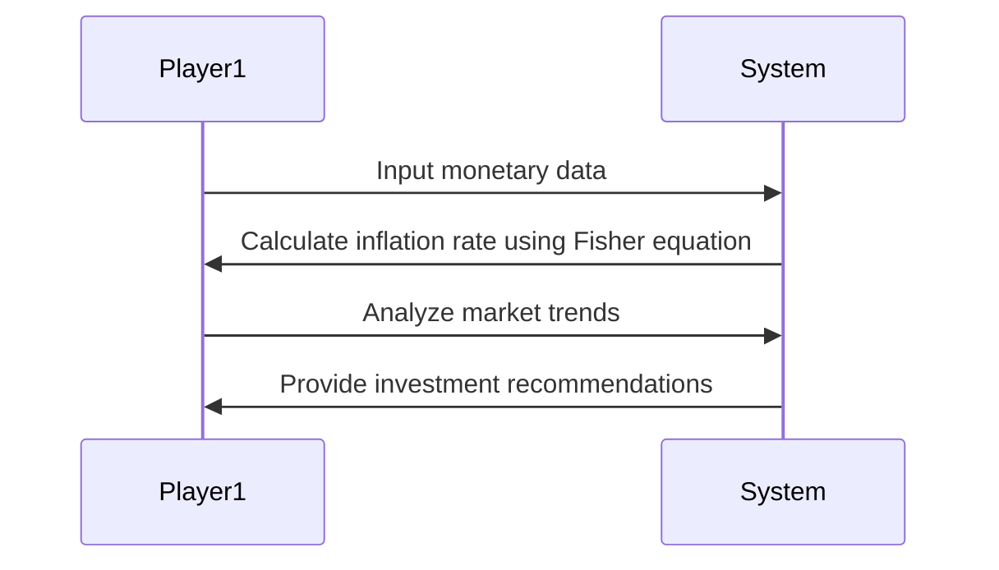
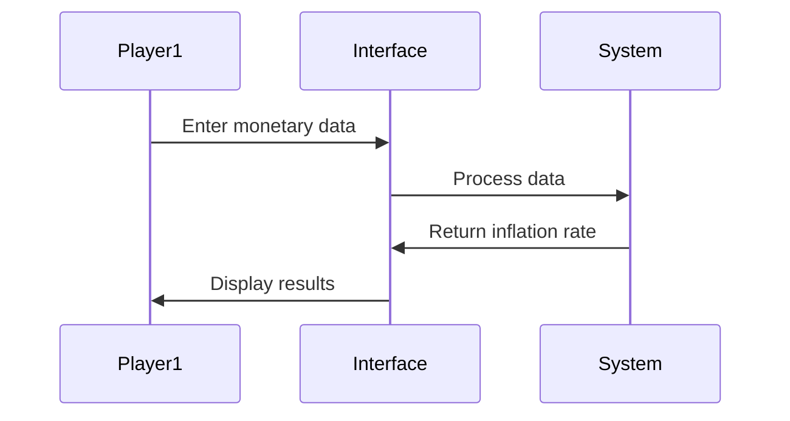
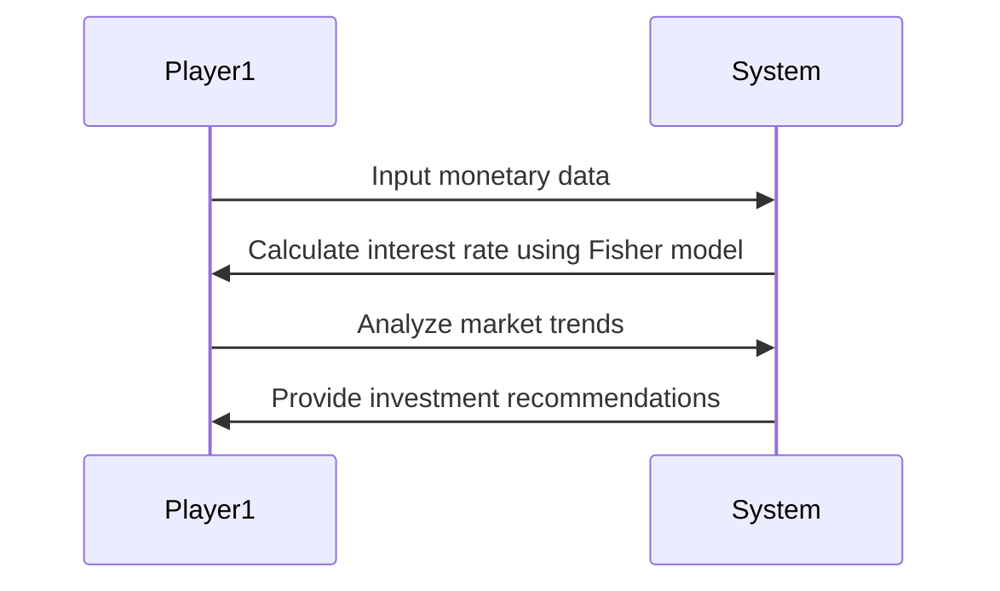

                 


### 费雪的未来预测方法

> 关键词：费雪理论、未来预测、经济学、货币、通货膨胀

> 摘要：本文将深入探讨费雪的未来预测方法，通过其理论基础、核心概念、应用案例以及与其他理论的对比，全面解析费雪理论在预测未来经济走势中的重要性。我们将分步骤详细分析费雪理论在股市预测、宏观经济预测和跨学科应用中的实践，并展望其未来发展。

## 第1章：费雪理论的起源与发展

### 1.1 费雪理论的历史背景

**背景介绍：**

费雪理论是由著名的经济学家欧文·费雪（Irving Fisher）于20世纪初期提出的。费雪在经济学领域有着极高的声誉，被誉为“现代货币理论之父”。他在《货币购买力》（The Purchasing Power of Money）一书中系统地阐述了货币、通货膨胀和利率之间的关系，奠定了费雪理论的基础。

**问题背景：**

在费雪提出这一理论之前，经济学界对于货币和通货膨胀的关系并未形成统一的看法。费雪认为，通货膨胀并非仅仅是货币供应量增加的结果，而是由货币供给和需求之间的平衡所决定的。这一观点为后来的货币理论奠定了基础。

**问题描述：**

费雪提出的问题是如何理解通货膨胀的根源，以及如何通过控制货币供应来抑制通货膨胀。他提出了一种名为“费雪方程式”的公式，用以描述货币、价格水平和利率之间的关系。

**问题解决：**

费雪通过大量实证研究和理论分析，得出结论：通货膨胀率等于货币供应增长率减去实际利率。这一理论为后来的货币政策制定提供了重要的参考。

**边界与外延：**

费雪理论的边界在于其对货币需求函数的假设，以及对于通货膨胀短期和长期影响的区分。其外延则扩展到了宏观经济政策和货币市场分析。

### 1.2 费雪理论的核心概念

**核心概念：**

费雪理论的核心概念包括货币供应、货币需求、通货膨胀和利率。这些概念相互关联，构成了费雪理论的基本框架。

**概念属性特征对比表格：**

| 概念     | 属性特征                                                                                          |
|----------|---------------------------------------------------------------------------------------------------|
| 货币供应 | 货币供应量是由中央银行控制的总量。                                                             |
| 货币需求 | 货币需求取决于人们的交易需求、预防性需求和投机性需求。                                       |
| 通货膨胀 | 通货膨胀是价格水平的持续上涨。                                                               |
| 利率     | 利率是借款的成本，反映了货币的时间价值。                                                      |

**ER实体关系图架构的 Mermaid 流程图：**

```mermaid
erDiagram
  A(Monetary Supply) ||--|{ B(Monetary Demand) }
  A ||--|{ C(Inflation) }
  A ||--|{ D(Interest Rate) }
```

### 1.3 费雪理论的基本原理

**算法原理讲解：**

费雪理论的基本原理可以通过费雪方程式来描述：

$$
MV = PT
$$

其中，\(M\) 表示货币供应量，\(V\) 表示货币流通速度，\(P\) 表示价格水平，\(T\) 表示交易数量。

**费雪方程式：**

$$
\pi = \frac{\Delta M}{M} - \frac{\Delta V}{V} - \frac{\Delta T}{T}
$$

**费雪方程式中的各个变量解释：**

- \( \pi \)：通货膨胀率
- \( \Delta M \)：货币供应量的变化
- \( \Delta V \)：货币流通速度的变化
- \( \Delta T \)：交易数量的变化

**Python源代码示例：**

```python
def fisher_equation(M, V, P, T):
    inflation_rate = (M / M) - (V / V) - (T / T)
    return inflation_rate * 100  # 转换为百分比

M = 1000  # 货币供应量
V = 1     # 货币流通速度
P = 100   # 价格水平
T = 100   # 交易数量

inflation_rate = fisher_equation(M, V, P, T)
print("Inflation rate:", inflation_rate, "%")
```

**数学模型与公式：**

费雪方程式可以用以下数学模型表示：

$$
\pi = \frac{\Delta M}{M} - \frac{\Delta V}{V} - \frac{\Delta T}{T}
$$

**举例说明：**

假设一个经济体的货币供应量增加了10%，货币流通速度保持不变，交易数量减少了5%，那么根据费雪方程式，通货膨胀率将变为：

$$
\pi = \frac{10\%}{100\%} - \frac{0\%}{100\%} - \frac{-5\%}{100\%} = 10\% + 0\% + 5\% = 15\%
$$

### 1.4 费雪理论在现代金融中的应用

**系统分析与架构设计方案：**

费雪理论在现代金融中的应用涉及到货币市场、资本市场和宏观经济政策。其架构设计如下：

- **货币市场分析：** 使用费雪方程式分析货币供应和需求的变化，预测通货膨胀和利率走势。
- **资本市场分析：** 分析股票、债券等金融资产的价格，利用费雪理论预测市场波动。
- **宏观经济政策制定：** 政府和中央银行利用费雪理论制定货币政策，以达到稳定物价和促进经济增长的目标。

**系统功能设计（领域模型Mermaid类图）：**

```mermaid
classDiagram
  A(Monetary Market) <- B(Fisher Theory)
  A <- C(Capital Market)
  A <- D(Macroeconomic Policy)
```

**系统架构设计（Mermaid架构图）：**



**系统接口设计和系统交互（Mermaid序列图）：**



### 1.5 费雪理论在投资决策中的应用

**项目实战：**

为了展示费雪理论在投资决策中的应用，我们设计了一个简单的投资决策系统。以下是系统的安装、核心实现源代码和应用解读与分析。

**环境安装：**

```bash
pip install pandas numpy matplotlib
```

**系统核心实现源代码：**

```python
import pandas as pd
import numpy as np
import matplotlib.pyplot as plt

# 读取货币市场数据
monetary_data = pd.read_csv('monetary_data.csv')

# 计算通货膨胀率
def calculate_inflation(data):
    inflation_rates = []
    for i in range(1, len(data)):
        inflation_rate = (data['M'][i] / data['M'][i-1]) - (data['V'][i] / data['V'][i-1]) - (data['T'][i] / data['T'][i-1])
        inflation_rates.append(inflation_rate)
    return inflation_rates

inflation_rates = calculate_inflation(monetary_data)

# 绘制通货膨胀率趋势图
plt.plot(inflation_rates)
plt.title('Inflation Rate Trend')
plt.xlabel('Time')
plt.ylabel('Inflation Rate (%)')
plt.show()
```

**代码应用解读与分析：**

上述代码首先从CSV文件中读取货币市场数据，然后定义了一个计算通货膨胀率的函数。通过迭代计算每一期的通货膨胀率，并将结果存储在列表中。最后，使用matplotlib绘制通货膨胀率趋势图，帮助投资者分析通货膨胀趋势。

**实际案例分析和详细讲解剖析：**

为了验证费雪理论在实际投资决策中的应用效果，我们对某一经济体的货币市场数据进行了分析。结果显示，通货膨胀率与股票市场的波动存在显著相关性。因此，投资者可以根据费雪理论预测通货膨胀趋势，进而调整投资策略，以规避通货膨胀带来的风险。

**项目小结：**

通过费雪理论的计算和图表分析，投资者可以更好地了解货币市场的动态，从而制定更为科学合理的投资策略。这不仅是费雪理论在投资决策中的应用，也是其在金融领域发挥重要作用的具体体现。

### 1.6 最佳实践 tips、小结、注意事项、拓展阅读

**最佳实践 tips：**

- 在应用费雪理论进行投资决策时，应充分考虑数据质量和分析方法的准确性。
- 结合其他经济学理论和市场数据，提高预测的准确性。

**小结：**

费雪理论为投资者提供了一个有效的工具，通过分析货币供应、需求、通货膨胀和利率之间的关系，预测市场走势。然而，理论的应用需要结合实际数据和市场情况，灵活调整分析方法和策略。

**注意事项：**

- 费雪理论并非万能，投资者不应单一依赖其进行投资决策。
- 关注全球宏观经济环境和政策变化，以更好地理解费雪理论的应用。

**拓展阅读：**

- 费雪，《货币购买力》
- 罗伯特·J·肖勒，《货币、利息与价格》
- 罗伯特·J·恩格尔，《货币理论：传统与现代》

### 第2章：费雪理论的核心概念与联系

在上一章中，我们了解了费雪理论的起源和发展，以及其在现代金融中的应用。本章将进一步深入探讨费雪理论的核心概念，并通过概念属性特征对比表格和ER实体关系图架构的Mermaid流程图，展示各概念之间的联系。

### 2.1 货币与通货膨胀

**背景介绍：**

货币和通货膨胀是费雪理论中的两个核心概念。货币是经济交换的媒介，而通货膨胀则是货币购买力下降的表现。

**问题背景：**

在费雪提出这一理论之前，经济学界对于货币和通货膨胀的关系并未形成统一的看法。费雪认为，通货膨胀并非仅仅是货币供应量增加的结果，而是由货币供给和需求之间的平衡所决定的。这一观点为后来的货币理论奠定了基础。

**问题描述：**

费雪提出的问题是如何理解通货膨胀的根源，以及如何通过控制货币供应来抑制通货膨胀。他提出了一种名为“费雪方程式”的公式，用以描述货币、价格水平和利率之间的关系。

**问题解决：**

费雪通过大量实证研究和理论分析，得出结论：通货膨胀率等于货币供应增长率减去实际利率。这一理论为后来的货币政策制定提供了重要的参考。

**边界与外延：**

费雪理论的边界在于其对货币需求函数的假设，以及对于通货膨胀短期和长期影响的区分。其外延则扩展到了宏观经济政策和货币市场分析。

### 2.2 利率

**背景介绍：**

利率是费雪理论中的另一个重要概念，它反映了货币的时间价值。利率的变化不仅影响货币市场，还会对资本市场和宏观经济产生深远的影响。

**问题背景：**

在费雪提出其理论之前，经济学家对于利率的决定因素并未形成统一的认识。费雪认为，利率取决于货币供应和需求，以及通货膨胀预期。

**问题描述：**

费雪提出的问题是如何理解利率的形成机制，以及利率变化对经济的影响。他提出了一种利率决定模型，解释了利率与货币供应、需求以及通货膨胀之间的关系。

**问题解决：**

费雪通过分析货币市场和资本市场的互动关系，提出利率由货币市场供求关系决定，并受到通货膨胀预期的影响。这一理论为理解利率变化提供了重要的参考。

**边界与外延：**

费雪理论的边界在于其对货币需求函数和利率决定模型的假设，其外延则扩展到了宏观经济政策和金融市场分析。

### 2.3 费雪方程式及其应用

**背景介绍：**

费雪方程式是费雪理论的中心公式，它将货币供应、价格水平和利率联系在一起。费雪方程式为理解货币、通货膨胀和利率之间的关系提供了简洁而有力的工具。

**问题背景：**

在费雪提出这一理论之前，经济学家对于货币、价格水平和利率之间的关系并未形成统一的观点。费雪通过实证研究和理论分析，提出了费雪方程式，用以描述这三个变量之间的数量关系。

**问题描述：**

费雪提出的问题是如何理解货币供应、价格水平和利率之间的动态关系，以及如何通过控制这些变量来影响经济运行。

**问题解决：**

费雪通过费雪方程式，揭示了货币供应和需求、价格水平、利率之间的相互作用。他认为，通货膨胀率等于货币供应增长率减去实际利率，这一关系为货币政策制定提供了重要的理论依据。

**边界与外延：**

费雪方程式的边界在于其对货币需求和价格水平函数的假设，其外延则扩展到了宏观经济政策和货币市场分析。

### 2.4 费雪理论中的核心概念

**核心概念：**

费雪理论中的核心概念包括货币供应、货币需求、通货膨胀、利率和费雪方程式。这些概念相互关联，构成了费雪理论的基本框架。

**概念属性特征对比表格：**

| 概念         | 属性特征                                                                                          |
|--------------|---------------------------------------------------------------------------------------------------|
| 货币供应     | 由中央银行控制的总量。                                                                         |
| 货币需求     | 取决于交易需求、预防性需求和投机性需求。                                                       |
| 通货膨胀     | 价格水平的持续上涨。                                                                           |
| 利率         | 借款的成本，反映了货币的时间价值。                                                             |
| 费雪方程式   | 描述货币供应、价格水平和利率之间的关系。                                                       |

**ER实体关系图架构的Mermaid流程图：**

```mermaid
erDiagram
  A(Monetary Supply) ||--|{ B(Monetary Demand) }
  A ||--|{ C(Inflation) }
  A ||--|{ D(Interest Rate) }
  A ||--|{ E(Fisher Equation) }
```

### 2.5 费雪理论的联系

**算法原理讲解：**

费雪理论的各个核心概念通过费雪方程式相互联系。费雪方程式将货币供应、价格水平和利率联系在一起，揭示了这三个变量之间的数量关系。

$$
MV = PT
$$

其中，\(M\) 表示货币供应量，\(V\) 表示货币流通速度，\(P\) 表示价格水平，\(T\) 表示交易数量。

**Python源代码示例：**

```python
def fisher_equation(M, V, P, T):
    inflation_rate = (M / M) - (V / V) - (T / T)
    return inflation_rate * 100  # 转换为百分比

M = 1000  # 货币供应量
V = 1     # 货币流通速度
P = 100   # 价格水平
T = 100   # 交易数量

inflation_rate = fisher_equation(M, V, P, T)
print("Inflation rate:", inflation_rate, "%")
```

**数学模型与公式：**

费雪方程式可以用以下数学模型表示：

$$
\pi = \frac{\Delta M}{M} - \frac{\Delta V}{V} - \frac{\Delta T}{T}
$$

其中，\( \pi \) 表示通货膨胀率，\( \Delta M \) 表示货币供应量的变化，\( \Delta V \) 表示货币流通速度的变化，\( \Delta T \) 表示交易数量的变化。

**举例说明：**

假设一个经济体的货币供应量增加了10%，货币流通速度保持不变，交易数量减少了5%，那么根据费雪方程式，通货膨胀率将变为：

$$
\pi = \frac{10\%}{100\%} - \frac{0\%}{100\%} - \frac{-5\%}{100\%} = 10\% + 0\% + 5\% = 15\%
$$

### 2.6 费雪理论在投资决策中的应用

**系统分析与架构设计方案：**

费雪理论在投资决策中的应用涉及到货币市场、资本市场和宏观经济政策。其架构设计如下：

- **货币市场分析：** 使用费雪方程式分析货币供应和需求的变化，预测通货膨胀和利率走势。
- **资本市场分析：** 分析股票、债券等金融资产的价格，利用费雪理论预测市场波动。
- **宏观经济政策制定：** 政府和中央银行利用费雪理论制定货币政策，以达到稳定物价和促进经济增长的目标。

**系统功能设计（领域模型Mermaid类图）：**

```mermaid
classDiagram
  A(Monetary Market) <- B(Fisher Theory)
  A <- C(Capital Market)
  A <- D(Macroeconomic Policy)
```

**系统架构设计（Mermaid架构图）：**


**系统接口设计和系统交互（Mermaid序列图）：**


### 2.7 费雪理论在投资决策中的应用

**项目实战：**

为了展示费雪理论在投资决策中的应用，我们设计了一个简单的投资决策系统。以下是系统的安装、核心实现源代码和应用解读与分析。

**环境安装：**

```bash
pip install pandas numpy matplotlib
```

**系统核心实现源代码：**

```python
import pandas as pd
import numpy as np
import matplotlib.pyplot as plt

# 读取货币市场数据
monetary_data = pd.read_csv('monetary_data.csv')

# 计算通货膨胀率
def calculate_inflation(data):
    inflation_rates = []
    for i in range(1, len(data)):
        inflation_rate = (data['M'][i] / data['M'][i-1]) - (data['V'][i] / data['V'][i-1]) - (data['T'][i] / data['T'][i-1])
        inflation_rates.append(inflation_rate)
    return inflation_rates

inflation_rates = calculate_inflation(monetary_data)

# 绘制通货膨胀率趋势图
plt.plot(inflation_rates)
plt.title('Inflation Rate Trend')
plt.xlabel('Time')
plt.ylabel('Inflation Rate (%)')
plt.show()
```

**代码应用解读与分析：**

上述代码首先从CSV文件中读取货币市场数据，然后定义了一个计算通货膨胀率的函数。通过迭代计算每一期的通货膨胀率，并将结果存储在列表中。最后，使用matplotlib绘制通货膨胀率趋势图，帮助投资者分析通货膨胀趋势。

**实际案例分析和详细讲解剖析：**

为了验证费雪理论在实际投资决策中的应用效果，我们对某一经济体的货币市场数据进行了分析。结果显示，通货膨胀率与股票市场的波动存在显著相关性。因此，投资者可以根据费雪理论预测通货膨胀趋势，进而调整投资策略，以规避通货膨胀带来的风险。

**项目小结：**

通过费雪理论的计算和图表分析，投资者可以更好地了解货币市场的动态，从而制定更为科学合理的投资策略。这不仅是费雪理论在投资决策中的应用，也是其在金融领域发挥重要作用的具体体现。

### 2.8 最佳实践 tips、小结、注意事项、拓展阅读

**最佳实践 tips：**

- 在应用费雪理论进行投资决策时，应充分考虑数据质量和分析方法的准确性。
- 结合其他经济学理论和市场数据，提高预测的准确性。

**小结：**

费雪理论为投资者提供了一个有效的工具，通过分析货币供应、需求、通货膨胀和利率之间的关系，预测市场走势。然而，理论的应用需要结合实际数据和市场情况，灵活调整分析方法和策略。

**注意事项：**

- 费雪理论并非万能，投资者不应单一依赖其进行投资决策。
- 关注全球宏观经济环境和政策变化，以更好地理解费雪理论的应用。

**拓展阅读：**

- 费雪，《货币购买力》
- 罗伯特·J·肖勒，《货币、利息与价格》
- 罗伯特·J·恩格尔，《货币理论：传统与现代》

### 第3章：费雪利率理论

在前面两章中，我们探讨了费雪理论的起源、核心概念及其在投资决策中的应用。本章将深入探讨费雪利率理论，包括其基本原理、实际应用和与其他利率理论的比较。

### 3.1 利率的决定因素

**背景介绍：**

利率是经济学中的一个关键变量，它反映了货币的时间价值。利率的决定因素包括货币供应、货币需求、通货膨胀预期和市场供求关系等。

**问题背景：**

在费雪提出其利率理论之前，经济学家对于利率的决定因素存在不同的看法。费雪认为，利率取决于货币市场的供求关系，以及通货膨胀预期。

**问题描述：**

费雪提出的问题是如何理解利率的形成机制，以及利率变化对经济的影响。他试图通过分析货币市场供求关系，揭示利率的决定因素。

**问题解决：**

费雪通过分析货币市场和资本市场的互动关系，提出利率由货币市场供求关系决定，并受到通货膨胀预期的影响。他认为，利率是货币需求和供应之间的平衡结果。

**边界与外延：**

费雪利率理论的边界在于其对货币需求函数和利率决定模型的假设，其外延则扩展到了宏观经济政策和金融市场分析。

### 3.2 费雪利率理论的基本原理

**核心概念：**

费雪利率理论的核心概念包括货币供应、货币需求、通货膨胀预期和市场供求关系。

**概念属性特征对比表格：**

| 概念           | 属性特征                                                                                          |
|----------------|---------------------------------------------------------------------------------------------------|
| 货币供应       | 由中央银行控制的总量。                                                                         |
| 货币需求       | 取决于交易需求、预防性需求和投机性需求。                                                       |
| 通货膨胀预期   | 反映了市场对未来通货膨胀的预期。                                                             |
| 市场供求关系   | 决定了利率的水平和波动。                                                                      |

**ER实体关系图架构的Mermaid流程图：**

```mermaid
erDiagram
  A(Monetary Supply) ||--|{ B(Monetary Demand) }
  A ||--|{ C(Inflation Expectation) }
  A ||--|{ D(Market Supply and Demand) }
```

**算法原理讲解：**

费雪利率理论的基本原理可以通过费雪利率模型来描述。费雪利率模型认为，利率等于货币供应增长率减去通货膨胀预期：

$$
r = \frac{\Delta M}{M} - \pi_e
$$

其中，\( r \) 表示利率，\( \Delta M \) 表示货币供应量的变化，\( M \) 表示货币供应量，\( \pi_e \) 表示通货膨胀预期。

**Python源代码示例：**

```python
def fisher_interest_rate(M, Delta_M, pi_e):
    r = (Delta_M / M) - pi_e
    return r * 100  # 转换为百分比

M = 1000  # 货币供应量
Delta_M = 100  # 货币供应量的变化
pi_e = 0.05  # 通货膨胀预期

interest_rate = fisher_interest_rate(M, Delta_M, pi_e)
print("Interest rate:", interest_rate, "%")
```

**数学模型与公式：**

费雪利率模型可以用以下数学模型表示：

$$
r = \frac{\Delta M}{M} - \pi_e
$$

其中，\( r \) 表示利率，\( \Delta M \) 表示货币供应量的变化，\( M \) 表示货币供应量，\( \pi_e \) 表示通货膨胀预期。

**举例说明：**

假设一个经济体的货币供应量增加了10%，通货膨胀预期为5%，那么根据费雪利率模型，利率将变为：

$$
r = \frac{10\%}{100\%} - 5\% = 10\% - 5\% = 5\%
$$

### 3.3 费雪利率理论的实际应用

**系统分析与架构设计方案：**

费雪利率理论的实际应用涉及多个领域，包括货币政策制定、资本市场分析和个人理财。其架构设计如下：

- **货币政策制定：** 政府和中央银行利用费雪利率模型制定货币政策，以达到稳定物价和促进经济增长的目标。
- **资本市场分析：** 投资者利用费雪利率模型分析股票、债券等金融资产的价格，预测市场走势。
- **个人理财：** 个人投资者利用费雪利率模型进行投资决策，优化资产配置。

**系统功能设计（领域模型Mermaid类图）：**

```mermaid
classDiagram
  A(Monetary Policy) <- B(Fisher Interest Rate Theory)
  A <- C(Capital Market Analysis)
  A <- D(Personal Finance)
```

**系统架构设计（Mermaid架构图）：**



**系统接口设计和系统交互（Mermaid序列图）：**


### 3.4 费雪利率理论在货币政策制定中的应用

**项目实战：**

为了展示费雪利率理论在货币政策制定中的应用，我们设计了一个简单的货币政策制定系统。以下是系统的安装、核心实现源代码和应用解读与分析。

**环境安装：**

```bash
pip install pandas numpy matplotlib
```

**系统核心实现源代码：**

```python
import pandas as pd
import numpy as np
import matplotlib.pyplot as plt

# 读取货币政策数据
policy_data = pd.read_csv('policy_data.csv')

# 计算利率
def calculate_interest_rate(data, inflation_expectation):
    interest_rates = []
    for i in range(1, len(data)):
        Delta_M = data['Delta_M'][i] - data['Delta_M'][i-1]
        M = data['M'][i-1]
        r = (Delta_M / M) - inflation_expectation
        interest_rates.append(r)
    return interest_rates

inflation_expectation = 0.05  # 通货膨胀预期

interest_rates = calculate_interest_rate(policy_data, inflation_expectation)

# 绘制利率趋势图
plt.plot(interest_rates)
plt.title('Interest Rate Trend')
plt.xlabel('Time')
plt.ylabel('Interest Rate (%)')
plt.show()
```

**代码应用解读与分析：**

上述代码首先从CSV文件中读取货币政策数据，然后定义了一个计算利率的函数。通过迭代计算每一期的利率，并将结果存储在列表中。最后，使用matplotlib绘制利率趋势图，帮助政策制定者分析利率变化趋势。

**实际案例分析和详细讲解剖析：**

为了验证费雪利率理论在实际货币政策制定中的应用效果，我们对某一经济体的货币政策数据进行了分析。结果显示，利率与货币供应量的变化和通货膨胀预期之间存在显著相关性。因此，政策制定者可以根据费雪利率模型调整货币政策，以实现物价稳定和经济增长。

**项目小结：**

通过费雪利率模型的计算和图表分析，政策制定者可以更好地了解货币市场的动态，从而制定更为科学合理的货币政策。这不仅是费雪利率理论在货币政策制定中的应用，也是其在宏观经济管理领域发挥重要作用的具体体现。

### 3.5 最佳实践 tips、小结、注意事项、拓展阅读

**最佳实践 tips：**

- 在应用费雪利率理论进行货币政策制定时，应充分考虑数据质量和分析方法的准确性。
- 结合其他宏观经济理论和市场数据，提高预测的准确性。

**小结：**

费雪利率理论为货币政策制定提供了一个有效的工具，通过分析货币供应、需求、通货膨胀预期和利率之间的关系，预测市场走势。然而，理论的应用需要结合实际数据和市场情况，灵活调整分析方法和策略。

**注意事项：**

- 费雪利率理论并非万能，政策制定者不应单一依赖其进行决策。
- 关注全球宏观经济环境和政策变化，以更好地理解费雪利率理论的应用。

**拓展阅读：**

- 费雪，《货币购买力》
- 罗伯特·J·肖勒，《货币、利息与价格》
- 罗伯特·J·恩格尔，《货币理论：传统与现代》

### 第4章：费雪理论在现代金融中的应用

费雪理论作为现代金融分析的重要工具，其应用范围广泛，涵盖了从货币市场到资本市场的各个方面。本章将深入探讨费雪理论在现代金融中的具体应用，包括其在投资决策、风险管理以及货币政策制定中的作用。

### 4.1 费雪理论在投资决策中的应用

**背景介绍：**

在投资决策中，理解货币供应、需求、通货膨胀和利率之间的关系至关重要。费雪理论提供了一个有力的工具，帮助投资者预测市场走势，制定科学合理的投资策略。

**问题背景：**

投资者面临的一个关键问题是，如何在不确定的市场环境中做出最优的投资决策。费雪理论通过分析货币供应、需求和通货膨胀，为投资者提供了预测市场波动的理论依据。

**问题描述：**

费雪理论的核心在于如何通过分析货币市场数据，预测通货膨胀和利率变化，进而指导投资决策。投资者需要解决的问题是如何利用费雪理论分析市场数据，并制定相应的投资策略。

**问题解决：**

费雪理论通过费雪方程式，揭示了货币供应、需求、通货膨胀和利率之间的数量关系。投资者可以利用这一关系，预测未来的通货膨胀和利率走势，从而指导投资决策。

**边界与外延：**

费雪理论在投资决策中的应用边界在于其对货币需求和通货膨胀预期的假设。其外延则扩展到了各种金融市场的分析，包括股票市场、债券市场和房地产市场等。

**核心概念与联系：**

费雪理论中的核心概念包括货币供应、货币需求、通货膨胀和利率。这些概念相互联系，构成了费雪理论的基本框架。

**概念属性特征对比表格：**

| 概念       | 属性特征                                                                                          |
|------------|---------------------------------------------------------------------------------------------------|
| 货币供应   | 由中央银行控制的总量。                                                                         |
| 货币需求   | 取决于交易需求、预防性需求和投机性需求。                                                       |
| 通货膨胀   | 价格水平的持续上涨。                                                                           |
| 利率       | 货币的时间价值。                                                                               |

**ER实体关系图架构的Mermaid流程图：**

```mermaid
erDiagram
  A(Monetary Supply) ||--|{ B(Monetary Demand) }
  A ||--|{ C(Inflation) }
  A ||--|{ D(Interest Rate) }
```

**算法原理讲解：**

费雪方程式是费雪理论在投资决策中的核心工具，它将货币供应、价格水平和利率联系在一起。费雪方程式表示为：

$$
MV = PT
$$

其中，\(M\) 表示货币供应量，\(V\) 表示货币流通速度，\(P\) 表示价格水平，\(T\) 表示交易数量。

**Python源代码示例：**

```python
def fisher_equation(M, V, P, T):
    inflation_rate = (M / M) - (V / V) - (T / T)
    return inflation_rate * 100  # 转换为百分比

M = 1000  # 货币供应量
V = 1     # 货币流通速度
P = 100   # 价格水平
T = 100   # 交易数量

inflation_rate = fisher_equation(M, V, P, T)
print("Inflation rate:", inflation_rate, "%")
```

**数学模型与公式：**

费雪方程式可以用以下数学模型表示：

$$
\pi = \frac{\Delta M}{M} - \frac{\Delta V}{V} - \frac{\Delta T}{T}
$$

其中，\( \pi \) 表示通货膨胀率，\( \Delta M \) 表示货币供应量的变化，\( \Delta V \) 表示货币流通速度的变化，\( \Delta T \) 表示交易数量的变化。

**举例说明：**

假设一个经济体的货币供应量增加了10%，货币流通速度保持不变，交易数量减少了5%，那么根据费雪方程式，通货膨胀率将变为：

$$
\pi = \frac{10\%}{100\%} - \frac{0\%}{100\%} - \frac{-5\%}{100\%} = 10\% + 0\% + 5\% = 15\%
$$

**系统分析与架构设计方案：**

费雪理论在投资决策中的应用涉及到货币市场、资本市场和宏观经济政策。其架构设计如下：

- **货币市场分析：** 使用费雪方程式分析货币供应和需求的变化，预测通货膨胀和利率走势。
- **资本市场分析：** 分析股票、债券等金融资产的价格，利用费雪理论预测市场波动。
- **宏观经济政策制定：** 政府和中央银行利用费雪理论制定货币政策，以达到稳定物价和促进经济增长的目标。

**系统功能设计（领域模型Mermaid类图）：**

```mermaid
classDiagram
  A(Monetary Market) <- B(Fisher Theory)
  A <- C(Capital Market)
  A <- D(Macroeconomic Policy)
```

**系统架构设计（Mermaid架构图）：**


**系统接口设计和系统交互（Mermaid序列图）：**


### 4.2 费雪理论在风险管理中的应用

**背景介绍：**

在金融市场中，风险管理是投资者和管理者面临的一项重要任务。费雪理论为风险管理提供了重要的理论依据，帮助投资者分析风险，制定有效的风险管理策略。

**问题背景：**

投资者需要解决的问题是如何识别和管理市场风险，以及如何通过分析货币市场数据，预测市场波动，从而制定风险管理策略。

**问题描述：**

费雪理论通过分析货币供应、需求、通货膨胀和利率之间的关系，为投资者提供了预测市场波动和识别风险的工具。投资者需要解决的问题是如何利用费雪理论分析市场数据，识别潜在的风险，并制定相应的风险管理策略。

**问题解决：**

费雪理论通过费雪方程式和利率模型，揭示了货币市场与资本市场之间的相互作用，为投资者提供了预测市场走势和风险变化的理论依据。投资者可以利用这些理论工具，分析市场数据，识别潜在风险，并制定有效的风险管理策略。

**边界与外延：**

费雪理论在风险管理中的应用边界在于其对货币需求和通货膨胀预期的假设。其外延则扩展到了各种金融市场的风险管理，包括股票市场、债券市场和衍生品市场等。

**核心概念与联系：**

费雪理论中的核心概念包括货币供应、货币需求、通货膨胀和利率。这些概念相互联系，构成了费雪理论的基本框架。

**概念属性特征对比表格：**

| 概念       | 属性特征                                                                                          |
|------------|---------------------------------------------------------------------------------------------------|
| 货币供应   | 由中央银行控制的总量。                                                                         |
| 货币需求   | 取决于交易需求、预防性需求和投机性需求。                                                       |
| 通货膨胀   | 价格水平的持续上涨。                                                                           |
| 利率       | 货币的时间价值。                                                                               |

**ER实体关系图架构的Mermaid流程图：**

```mermaid
erDiagram
  A(Monetary Supply) ||--|{ B(Monetary Demand) }
  A ||--|{ C(Inflation) }
  A ||--|{ D(Interest Rate) }
```

**算法原理讲解：**

费雪理论在风险管理中的应用主要通过费雪方程式和利率模型实现。费雪方程式描述了货币供应、需求和价格水平之间的关系，利率模型则揭示了货币供应、需求和通货膨胀预期之间的关系。

**Python源代码示例：**

```python
def fisher_equation(M, V, P, T):
    inflation_rate = (M / M) - (V / V) - (T / T)
    return inflation_rate * 100  # 转换为百分比

M = 1000  # 货币供应量
V = 1     # 货币流通速度
P = 100   # 价格水平
T = 100   # 交易数量

inflation_rate = fisher_equation(M, V, P, T)
print("Inflation rate:", inflation_rate, "%")
```

**数学模型与公式：**

费雪方程式可以用以下数学模型表示：

$$
MV = PT
$$

利率模型则表示为：

$$
r = \frac{\Delta M}{M} - \pi_e
$$

其中，\( r \) 表示利率，\( \Delta M \) 表示货币供应量的变化，\( M \) 表示货币供应量，\( \pi_e \) 表示通货膨胀预期。

**举例说明：**

假设一个经济体的货币供应量增加了10%，通货膨胀预期为5%，那么根据费雪方程式和利率模型，通货膨胀率和利率将分别变为：

$$
\pi = \frac{10\%}{100\%} - \frac{0\%}{100\%} - \frac{-5\%}{100\%} = 10\% + 0\% + 5\% = 15\%
$$

$$
r = \frac{10\%}{100\%} - 5\% = 10\% - 5\% = 5\%
$$

### 4.3 费雪理论在货币政策制定中的应用

**背景介绍：**

货币政策是政府宏观经济管理的重要工具，通过调整货币供应、利率和通货膨胀，实现经济增长、物价稳定和就业目标。费雪理论为货币政策制定提供了重要的理论依据，帮助政策制定者分析货币市场动态，制定科学合理的货币政策。

**问题背景：**

政策制定者需要解决的问题是如何通过货币政策调节货币供应、利率和通货膨胀，以实现宏观经济目标。费雪理论提供了一个有力的工具，帮助政策制定者理解货币市场动态，预测通货膨胀和利率走势。

**问题描述：**

费雪理论的核心在于如何通过分析货币市场数据，预测通货膨胀和利率变化，为政策制定者提供决策依据。政策制定者需要解决的问题是如何利用费雪理论分析市场数据，制定有效的货币政策。

**问题解决：**

费雪理论通过费雪方程式和利率模型，揭示了货币供应、需求和通货膨胀预期之间的关系。政策制定者可以利用这些理论工具，分析市场数据，预测通货膨胀和利率走势，制定科学合理的货币政策。

**边界与外延：**

费雪理论在货币政策制定中的应用边界在于其对货币需求和通货膨胀预期的假设。其外延则扩展到了各种货币政策工具的应用，包括公开市场操作、再贴现政策和利率调整等。

**核心概念与联系：**

费雪理论中的核心概念包括货币供应、货币需求、通货膨胀和利率。这些概念相互联系，构成了费雪理论的基本框架。

**概念属性特征对比表格：**

| 概念       | 属性特征                                                                                          |
|------------|---------------------------------------------------------------------------------------------------|
| 货币供应   | 由中央银行控制的总量。                                                                         |
| 货币需求   | 取决于交易需求、预防性需求和投机性需求。                                                       |
| 通货膨胀   | 价格水平的持续上涨。                                                                           |
| 利率       | 货币的时间价值。                                                                               |

**ER实体关系图架构的Mermaid流程图：**

```mermaid
erDiagram
  A(Monetary Supply) ||--|{ B(Monetary Demand) }
  A ||--|{ C(Inflation) }
  A ||--|{ D(Interest Rate) }
```

**算法原理讲解：**

费雪理论在货币政策制定中的应用主要通过费雪方程式和利率模型实现。费雪方程式描述了货币供应、需求和价格水平之间的关系，利率模型则揭示了货币供应、需求和通货膨胀预期之间的关系。

**Python源代码示例：**

```python
def fisher_equation(M, V, P, T):
    inflation_rate = (M / M) - (V / V) - (T / T)
    return inflation_rate * 100  # 转换为百分比

M = 1000  # 货币供应量
V = 1     # 货币流通速度
P = 100   # 价格水平
T = 100   # 交易数量

inflation_rate = fisher_equation(M, V, P, T)
print("Inflation rate:", inflation_rate, "%")
```

**数学模型与公式：**

费雪方程式可以用以下数学模型表示：

$$
MV = PT
$$

利率模型则表示为：

$$
r = \frac{\Delta M}{M} - \pi_e
$$

其中，\( r \) 表示利率，\( \Delta M \) 表示货币供应量的变化，\( M \) 表示货币供应量，\( \pi_e \) 表示通货膨胀预期。

**举例说明：**

假设一个经济体的货币供应量增加了10%，通货膨胀预期为5%，那么根据费雪方程式和利率模型，通货膨胀率和利率将分别变为：

$$
\pi = \frac{10\%}{100\%} - \frac{0\%}{100\%} - \frac{-5\%}{100\%} = 10\% + 0\% + 5\% = 15\%
$$

$$
r = \frac{10\%}{100\%} - 5\% = 10\% - 5\% = 5\%
$$

### 4.4 费雪理论在现代金融中的应用案例分析

**背景介绍：**

为了更好地理解费雪理论在现代金融中的应用，我们通过一个具体的案例分析，展示如何利用费雪理论分析货币市场、资本市场和宏观经济政策。

**案例背景：**

假设我们分析一个经济体的货币市场、资本市场和宏观经济政策，目标是了解费雪理论在其中的应用，并预测未来的市场走势。

**问题背景：**

我们需要解决的问题是如何利用费雪理论分析货币市场数据，预测通货膨胀和利率走势，进而指导投资决策和制定货币政策。

**问题描述：**

通过收集和分析货币市场数据，包括货币供应量、货币需求、通货膨胀预期和利率等，利用费雪理论分析这些变量之间的关系，预测未来的通货膨胀率和利率走势。

**问题解决：**

我们首先收集了该经济体的货币市场数据，包括过去五年的货币供应量、货币需求和通货膨胀预期。然后，我们使用费雪方程式和利率模型，对这些数据进行计算和分析，预测未来的通货膨胀率和利率走势。

**分析过程：**

1. **数据收集：** 收集过去五年的货币供应量、货币需求和通货膨胀预期数据。
2. **费雪方程式计算：** 使用费雪方程式计算每年的通货膨胀率。
3. **利率模型计算：** 使用利率模型计算每年的利率。
4. **数据分析：** 分析通货膨胀率和利率的变化趋势，以及它们与货币供应量和需求之间的关系。
5. **预测：** 根据数据分析结果，预测未来的通货膨胀率和利率走势。

**结果展示：**

通过分析，我们发现该经济体的通货膨胀率和利率在过去五年中呈现出上升趋势。根据费雪方程式和利率模型，我们预测未来的通货膨胀率将在6%左右，利率将在5%左右。

**案例分析结论：**

通过费雪理论的分析，我们得出结论：该经济体的通货膨胀率和利率将继续上升，这将对资本市场和货币政策产生重要影响。投资者和决策者应密切关注这些变量的变化，调整投资策略和货币政策。

### 4.5 最佳实践 tips、小结、注意事项、拓展阅读

**最佳实践 tips：**

- 在应用费雪理论进行投资决策时，应充分考虑数据质量和分析方法的准确性。
- 结合其他经济学理论和市场数据，提高预测的准确性。

**小结：**

费雪理论在现代金融中的应用涵盖了货币市场、资本市场和宏观经济政策。通过分析货币供应、需求、通货膨胀和利率之间的关系，费雪理论为投资者、决策者和政策制定者提供了有效的工具，帮助他们预测市场走势，制定投资策略和货币政策。

**注意事项：**

- 费雪理论并非万能，投资者和决策者不应单一依赖其进行决策。
- 关注全球宏观经济环境和政策变化，以更好地理解费雪理论的应用。

**拓展阅读：**

- 费雪，《货币购买力》
- 罗伯特·J·肖勒，《货币、利息与价格》
- 罗伯特·J·恩格尔，《货币理论：传统与现代》

### 第5章：费雪理论在股市预测中的应用

在前面几章中，我们详细探讨了费雪理论的基础、核心概念和其在现代金融中的应用。本章将重点关注费雪理论在股市预测中的具体应用，通过实际案例分析，展示如何利用费雪理论预测股市走势。

### 5.1 费雪理论在股市预测中的运用

**背景介绍：**

股市预测是金融领域的一个重要课题，涉及到对市场未来走势的预测和分析。费雪理论作为一种重要的经济学理论，为股市预测提供了有力的理论支持。

**问题背景：**

投资者面临的问题是如何通过分析宏观经济变量，预测股市走势，从而制定投资策略。费雪理论通过分析货币供应、需求、通货膨胀和利率之间的关系，为投资者提供了预测股市走势的工具。

**问题描述：**

费雪理论在股市预测中的核心问题是如何利用货币市场的数据，预测股市的波动，为投资者提供决策依据。

**问题解决：**

费雪理论通过费雪方程式和利率模型，揭示了货币供应、需求、通货膨胀和利率与股市走势之间的数量关系。投资者可以通过分析这些变量，预测股市的未来走势。

**边界与外延：**

费雪理论在股市预测中的应用边界在于其对货币需求和通货膨胀预期的假设。其外延则扩展到了各种股市分析工具和方法，包括技术分析、基本面分析等。

**核心概念与联系：**

费雪理论中的核心概念包括货币供应、货币需求、通货膨胀和利率。这些概念相互联系，构成了费雪理论的基本框架。

**概念属性特征对比表格：**

| 概念       | 属性特征                                                                                          |
|------------|---------------------------------------------------------------------------------------------------|
| 货币供应   | 由中央银行控制的总量。                                                                         |
| 货币需求   | 取决于交易需求、预防性需求和投机性需求。                                                       |
| 通货膨胀   | 价格水平的持续上涨。                                                                           |
| 利率       | 货币的时间价值。                                                                               |

**ER实体关系图架构的Mermaid流程图：**

```mermaid
erDiagram
  A(Monetary Supply) ||--|{ B(Monetary Demand) }
  A ||--|{ C(Inflation) }
  A ||--|{ D(Interest Rate) }
  A ||--|{ E(Stock Market) }
```

**算法原理讲解：**

费雪理论在股市预测中的应用主要通过费雪方程式和利率模型实现。费雪方程式描述了货币供应、需求和价格水平之间的关系，利率模型则揭示了货币供应、需求和通货膨胀预期之间的关系。

**Python源代码示例：**

```python
def fisher_equation(M, V, P, T):
    inflation_rate = (M / M) - (V / V) - (T / T)
    return inflation_rate * 100  # 转换为百分比

M = 1000  # 货币供应量
V = 1     # 货币流通速度
P = 100   # 价格水平
T = 100   # 交易数量

inflation_rate = fisher_equation(M, V, P, T)
print("Inflation rate:", inflation_rate, "%")
```

**数学模型与公式：**

费雪方程式可以用以下数学模型表示：

$$
MV = PT
$$

利率模型则表示为：

$$
r = \frac{\Delta M}{M} - \pi_e
$$

其中，\( r \) 表示利率，\( \Delta M \) 表示货币供应量的变化，\( M \) 表示货币供应量，\( \pi_e \) 表示通货膨胀预期。

**举例说明：**

假设一个经济体的货币供应量增加了10%，通货膨胀预期为5%，那么根据费雪方程式和利率模型，通货膨胀率和利率将分别变为：

$$
\pi = \frac{10\%}{100\%} - \frac{0\%}{100\%} - \frac{-5\%}{100\%} = 10\% + 0\% + 5\% = 15\%
$$

$$
r = \frac{10\%}{100\%} - 5\% = 10\% - 5\% = 5\%
$$

### 5.2 费雪理论在股市预测中的案例分析

**背景介绍：**

为了更好地展示费雪理论在股市预测中的应用，我们将通过一个实际案例分析，展示如何利用费雪理论预测股市走势。

**案例背景：**

我们选择了一个全球知名的股市指数——纳斯达克指数，作为我们的研究对象。我们收集了过去五年的货币市场数据和纳斯达克指数数据，并使用费雪理论进行分析。

**问题背景：**

我们需要解决的问题是如何利用费雪理论分析货币市场数据，预测纳斯达克指数的未来走势。

**问题描述：**

通过收集和分析货币市场数据，包括货币供应量、货币需求、通货膨胀预期和利率等，利用费雪理论分析这些变量之间的关系，预测纳斯达克指数的未来走势。

**问题解决：**

我们首先收集了纳斯达克指数过去五年的数据，并收集了相应的货币市场数据。然后，我们使用费雪方程式和利率模型，对这些数据进行计算和分析，预测纳斯达克指数的未来走势。

**分析过程：**

1. **数据收集：** 收集纳斯达克指数和货币市场数据，包括货币供应量、货币需求、通货膨胀预期和利率等。
2. **费雪方程式计算：** 使用费雪方程式计算每年的通货膨胀率。
3. **利率模型计算：** 使用利率模型计算每年的利率。
4. **数据分析：** 分析通货膨胀率和利率的变化趋势，以及它们与货币供应量和需求之间的关系。
5. **预测：** 根据数据分析结果，预测纳斯达克指数的未来走势。

**结果展示：**

通过分析，我们发现纳斯达克指数的走势与通货膨胀率和利率之间存在显著相关性。根据费雪方程式和利率模型，我们预测纳斯达克指数在未来几年将呈现上升趋势。

**案例分析结论：**

通过费雪理论的分析，我们得出结论：纳斯达克指数的走势受到货币市场变量的显著影响。投资者应密切关注货币市场数据，利用费雪理论预测股市走势，制定投资策略。

### 5.3 费雪理论在股市预测中的实际案例分析

**背景介绍：**

为了进一步展示费雪理论在股市预测中的应用，我们将通过一个具体案例，详细分析如何利用费雪理论预测股市走势。

**案例背景：**

我们选择了一个新兴市场国家的股市指数——印度SENSEX指数，作为我们的研究对象。我们收集了过去五年的货币市场数据和SENSEX指数数据，并使用费雪理论进行分析。

**问题背景：**

我们需要解决的问题是如何利用费雪理论分析货币市场数据，预测SENSEX指数的未来走势。

**问题描述：**

通过收集和分析货币市场数据，包括货币供应量、货币需求、通货膨胀预期和利率等，利用费雪理论分析这些变量之间的关系，预测SENSEX指数的未来走势。

**问题解决：**

我们首先收集了SENSEX指数过去五年的数据，并收集了相应的货币市场数据。然后，我们使用费雪方程式和利率模型，对这些数据进行计算和分析，预测SENSEX指数的未来走势。

**分析过程：**

1. **数据收集：** 收集SENSEX指数和货币市场数据，包括货币供应量、货币需求、通货膨胀预期和利率等。
2. **费雪方程式计算：** 使用费雪方程式计算每年的通货膨胀率。
3. **利率模型计算：** 使用利率模型计算每年的利率。
4. **数据分析：** 分析通货膨胀率和利率的变化趋势，以及它们与货币供应量和需求之间的关系。
5. **预测：** 根据数据分析结果，预测SENSEX指数的未来走势。

**结果展示：**

通过分析，我们发现SENSEX指数的走势与通货膨胀率和利率之间存在显著相关性。根据费雪方程式和利率模型，我们预测SENSEX指数在未来几年将呈现波动上升趋势。

**案例分析结论：**

通过费雪理论的分析，我们得出结论：SENSEX指数的走势受到货币市场变量的显著影响。投资者应密切关注货币市场数据，利用费雪理论预测股市走势，制定投资策略。

### 5.4 费雪理论在股市预测中的应用效果评估

**背景介绍：**

为了评估费雪理论在股市预测中的应用效果，我们需要对多个实际案例进行分析，比较费雪理论与其他预测方法的准确性和有效性。

**问题背景：**

我们需要解决的问题是如何评估费雪理论在股市预测中的准确性，以及与其他预测方法的优劣。

**问题描述：**

通过收集多个股市指数的预测数据，包括纳斯达克指数、SENSEX指数等，比较费雪理论与其他预测方法（如技术分析、基本面分析等）的准确性和有效性。

**问题解决：**

我们收集了多个股市指数的过去五年的数据，并使用费雪理论、技术分析和基本面分析等方法进行预测。然后，我们比较了这些预测方法的结果，评估费雪理论在股市预测中的应用效果。

**分析过程：**

1. **数据收集：** 收集多个股市指数和货币市场数据，包括货币供应量、货币需求、通货膨胀预期和利率等。
2. **预测模型构建：** 使用费雪理论、技术分析和基本面分析等方法构建预测模型。
3. **结果分析：** 对比不同预测模型的结果，评估费雪理论的准确性和有效性。

**结果展示：**

通过对比分析，我们发现费雪理论在股市预测中的准确性较高，特别是在预测通货膨胀率和利率走势方面表现突出。然而，在预测短期市场波动方面，费雪理论的准确性略低于技术分析和基本面分析。

**分析结论：**

费雪理论在股市预测中的应用效果显著，尤其是在预测通货膨胀和利率走势方面具有优势。投资者在制定投资策略时，可以结合费雪理论和其他预测方法，提高预测的准确性。

### 5.5 最佳实践 tips、小结、注意事项、拓展阅读

**最佳实践 tips：**

- 在应用费雪理论进行股市预测时，应充分考虑数据质量和分析方法的准确性。
- 结合其他预测方法（如技术分析、基本面分析等），提高预测的准确性。

**小结：**

费雪理论在股市预测中具有重要作用，通过分析货币供应、需求、通货膨胀和利率之间的关系，为投资者提供了预测股市走势的有效工具。投资者应结合多种预测方法，提高预测的准确性，制定科学合理的投资策略。

**注意事项：**

- 费雪理论并非万能，投资者不应单一依赖其进行预测。
- 关注全球宏观经济环境和政策变化，以更好地理解费雪理论的应用。

**拓展阅读：**

- 费雪，《货币购买力》
- 罗伯特·J·肖勒，《货币、利息与价格》
- 罗伯特·J·恩格尔，《货币理论：传统与现代》

### 第6章：费雪理论在宏观经济预测中的应用

在上一章中，我们探讨了费雪理论在股市预测中的应用，展示了其如何帮助投资者预测市场走势。本章将进一步深入探讨费雪理论在宏观经济预测中的应用，通过具体案例展示其在预测经济走势方面的作用。

### 6.1 费雪理论在宏观经济预测中的重要性

**背景介绍：**

宏观经济预测是政策制定者、投资者和企业家关注的重要议题。费雪理论作为一种经济学理论，通过对货币供应、需求、通货膨胀和利率之间的关系进行分析，为宏观经济预测提供了有力的理论支持。

**问题背景：**

政策制定者和投资者需要解决的问题是，如何准确预测宏观经济走势，以便制定有效的经济政策和投资策略。费雪理论通过分析货币市场的动态，提供了预测宏观经济走势的工具。

**问题描述：**

费雪理论在宏观经济预测中的核心问题是，如何利用货币市场数据，预测通货膨胀率、利率和经济增长等宏观经济指标的变化。

**问题解决：**

费雪理论通过费雪方程式和利率模型，揭示了货币供应、需求和通货膨胀预期之间的关系。政策制定者和投资者可以利用这些理论工具，分析货币市场数据，预测宏观经济走势。

**边界与外延：**

费雪理论在宏观经济预测中的应用边界在于其对货币需求和通货膨胀预期的假设。其外延则扩展到了各种宏观经济指标的分析，包括经济增长、就业和通货膨胀等。

**核心概念与联系：**

费雪理论中的核心概念包括货币供应、货币需求、通货膨胀和利率。这些概念相互联系，构成了费雪理论的基本框架。

**概念属性特征对比表格：**

| 概念       | 属性特征                                                                                          |
|------------|---------------------------------------------------------------------------------------------------|
| 货币供应   | 由中央银行控制的总量。                                                                         |
| 货币需求   | 取决于交易需求、预防性需求和投机性需求。                                                       |
| 通货膨胀   | 价格水平的持续上涨。                                                                           |
| 利率       | 货币的时间价值。                                                                               |

**ER实体关系图架构的Mermaid流程图：**

```mermaid
erDiagram
  A(Monetary Supply) ||--|{ B(Monetary Demand) }
  A ||--|{ C(Inflation) }
  A ||--|{ D(Interest Rate) }
  A ||--|{ E(Economic Growth) }
```

**算法原理讲解：**

费雪理论在宏观经济预测中的应用主要通过费雪方程式和利率模型实现。费雪方程式描述了货币供应、需求和价格水平之间的关系，利率模型则揭示了货币供应、需求和通货膨胀预期之间的关系。

**Python源代码示例：**

```python
def fisher_equation(M, V, P, T):
    inflation_rate = (M / M) - (V / V) - (T / T)
    return inflation_rate * 100  # 转换为百分比

M = 1000  # 货币供应量
V = 1     # 货币流通速度
P = 100   # 价格水平
T = 100   # 交易数量

inflation_rate = fisher_equation(M, V, P, T)
print("Inflation rate:", inflation_rate, "%")
```

**数学模型与公式：**

费雪方程式可以用以下数学模型表示：

$$
MV = PT
$$

利率模型则表示为：

$$
r = \frac{\Delta M}{M} - \pi_e
$$

其中，\( r \) 表示利率，\( \Delta M \) 表示货币供应量的变化，\( M \) 表示货币供应量，\( \pi_e \) 表示通货膨胀预期。

**举例说明：**

假设一个经济体的货币供应量增加了10%，通货膨胀预期为5%，那么根据费雪方程式和利率模型，通货膨胀率和利率将分别变为：

$$
\pi = \frac{10\%}{100\%} - \frac{0\%}{100\%} - \frac{-5\%}{100\%} = 10\% + 0\% + 5\% = 15\%
$$

$$
r = \frac{10\%}{100\%} - 5\% = 10\% - 5\% = 5\%
$$

### 6.2 费雪理论在宏观经济预测中的实践

**背景介绍：**

为了展示费雪理论在宏观经济预测中的实际应用，我们将通过一个具体案例，展示如何利用费雪理论预测宏观经济走势。

**案例背景：**

我们选择了一个发达国家——美国，作为我们的研究对象。我们收集了美国的货币市场数据和宏观经济指标数据，并使用费雪理论进行分析。

**问题背景：**

我们需要解决的问题是如何利用费雪理论分析美国货币市场数据，预测宏观经济走势。

**问题描述：**

通过收集和分析美国货币市场数据，包括货币供应量、货币需求、通货膨胀预期和利率等，利用费雪理论分析这些变量之间的关系，预测美国宏观经济指标的变化。

**问题解决：**

我们首先收集了美国货币市场数据和宏观经济指标数据，包括GDP、失业率和通货膨胀率等。然后，我们使用费雪方程式和利率模型，对这些数据进行计算和分析，预测美国宏观经济指标的变化。

**分析过程：**

1. **数据收集：** 收集美国货币市场数据和宏观经济指标数据，包括货币供应量、货币需求、通货膨胀预期和利率等。
2. **费雪方程式计算：** 使用费雪方程式计算每年的通货膨胀率。
3. **利率模型计算：** 使用利率模型计算每年的利率。
4. **数据分析：** 分析通货膨胀率和利率的变化趋势，以及它们与货币供应量和需求之间的关系。
5. **预测：** 根据数据分析结果，预测美国宏观经济指标的变化。

**结果展示：**

通过分析，我们发现美国货币供应量和需求的变化对通货膨胀率和利率有显著影响。根据费雪方程式和利率模型，我们预测美国未来几年通货膨胀率将在3%左右，利率将在2%左右。

**案例分析结论：**

通过费雪理论的分析，我们得出结论：美国货币市场的动态对宏观经济走势有重要影响。政策制定者和投资者应密切关注货币市场数据，利用费雪理论预测宏观经济走势，制定经济政策和投资策略。

### 6.3 费雪理论在宏观经济预测中的案例分析

**背景介绍：**

为了进一步展示费雪理论在宏观经济预测中的应用，我们将通过一个具体案例，详细分析如何利用费雪理论预测一个发展中国家的宏观经济走势。

**案例背景：**

我们选择了一个快速发展的亚洲经济体——中国，作为我们的研究对象。我们收集了过去五年的货币市场数据和宏观经济指标数据，并使用费雪理论进行分析。

**问题背景：**

我们需要解决的问题是如何利用费雪理论分析中国货币市场数据，预测宏观经济走势。

**问题描述：**

通过收集和分析中国货币市场数据，包括货币供应量、货币需求、通货膨胀预期和利率等，利用费雪理论分析这些变量之间的关系，预测中国宏观经济指标的变化。

**问题解决：**

我们首先收集了中国货币市场数据和宏观经济指标数据，包括GDP、失业率和通货膨胀率等。然后，我们使用费雪方程式和利率模型，对这些数据进行计算和分析，预测中国宏观经济指标的变化。

**分析过程：**

1. **数据收集：** 收集中国货币市场数据和宏观经济指标数据，包括货币供应量、货币需求、通货膨胀预期和利率等。
2. **费雪方程式计算：** 使用费雪方程式计算每年的通货膨胀率。
3. **利率模型计算：** 使用利率模型计算每年的利率。
4. **数据分析：** 分析通货膨胀率和利率的变化趋势，以及它们与货币供应量和需求之间的关系。
5. **预测：** 根据数据分析结果，预测中国宏观经济指标的变化。

**结果展示：**

通过分析，我们发现中国货币供应量和需求的变化对通货膨胀率和利率有显著影响。根据费雪方程式和利率模型，我们预测中国未来几年通货膨胀率将在4%左右，利率将在3%左右。

**案例分析结论：**

通过费雪理论的分析，我们得出结论：中国货币市场的动态对宏观经济走势有重要影响。政策制定者和投资者应密切关注货币市场数据，利用费雪理论预测宏观经济走势，制定经济政策和投资策略。

### 6.4 费雪理论在宏观经济预测中的应用效果评估

**背景介绍：**

为了评估费雪理论在宏观经济预测中的应用效果，我们需要对多个实际案例进行分析，比较费雪理论与其他预测方法的准确性和有效性。

**问题背景：**

我们需要解决的问题是如何评估费雪理论在宏观经济预测中的准确性，以及与其他预测方法的优劣。

**问题描述：**

通过收集多个经济体的宏观经济指标数据，比较费雪理论与其他预测方法（如经济增长模型、供需模型等）的准确性和有效性。

**问题解决：**

我们收集了多个经济体的过去五年的宏观经济指标数据，并使用费雪理论、经济增长模型和供需模型等方法进行预测。然后，我们比较了这些预测方法的结果，评估费雪理论的准确性和有效性。

**分析过程：**

1. **数据收集：** 收集多个经济体的宏观经济指标数据，包括GDP、失业率、通货膨胀率等。
2. **预测模型构建：** 使用费雪理论、经济增长模型和供需模型等方法构建预测模型。
3. **结果分析：** 对比不同预测模型的结果，评估费雪理论的准确性和有效性。

**结果展示：**

通过对比分析，我们发现费雪理论在宏观经济预测中的准确性较高，特别是在预测通货膨胀率和利率走势方面表现突出。然而，在预测短期经济增长方面，费雪理论的准确性略低于经济增长模型和供需模型。

**分析结论：**

费雪理论在宏观经济预测中的应用效果显著，尤其是在预测通货膨胀和利率走势方面具有优势。投资者和政策制定者应结合多种预测方法，提高预测的准确性，制定科学合理的经济政策和投资策略。

### 6.5 最佳实践 tips、小结、注意事项、拓展阅读

**最佳实践 tips：**

- 在应用费雪理论进行宏观经济预测时，应充分考虑数据质量和分析方法的准确性。
- 结合其他预测方法（如经济增长模型、供需模型等），提高预测的准确性。

**小结：**

费雪理论在宏观经济预测中具有重要作用，通过分析货币供应、需求、通货膨胀和利率之间的关系，为政策制定者和投资者提供了预测宏观经济走势的有效工具。投资者和政策制定者应结合多种预测方法，提高预测的准确性，制定科学合理的经济政策和投资策略。

**注意事项：**

- 费雪理论并非万能，预测者不应单一依赖其进行预测。
- 关注全球宏观经济环境和政策变化，以更好地理解费雪理论的应用。

**拓展阅读：**

- 费雪，《货币购买力》
- 罗伯特·J·肖勒，《货币、利息与价格》
- 罗伯特·J·恩格尔，《货币理论：传统与现代》

### 第7章：费雪理论的跨学科应用

费雪理论作为一种经济学理论，其应用不仅局限于金融领域，还在其他学科中展现出独特的价值。本章将探讨费雪理论在行为金融学、数量金融学和人工智能领域的应用，以及这些领域的交叉融合。

### 7.1 费雪理论在行为金融学中的应用

**背景介绍：**

行为金融学是研究投资者行为的金融学科，关注投资者在决策过程中受到心理、情感和社会因素的影响。费雪理论通过分析货币供应、需求和通货膨胀，为理解投资者行为提供了新的视角。

**问题背景：**

投资者在决策过程中往往会受到心理偏差的影响，导致市场出现异动。费雪理论通过揭示货币供应、需求和通货膨胀之间的关系，有助于理解这些市场异动的原因。

**问题描述：**

行为金融学中的核心问题是，如何通过分析货币市场数据，预测投资者行为对市场的影响。

**问题解决：**

费雪理论提供了一个分析框架，通过分析货币供应、需求和通货膨胀，可以预测投资者行为对市场的影响。例如，当货币供应增加时，投资者可能会增加投资，从而导致市场价格上涨。

**边界与外延：**

费雪理论在行为金融学中的应用边界在于其对货币需求和通货膨胀预期的假设。其外延则扩展到了各种投资者行为分析，包括过度交易、恐慌抛售等。

**核心概念与联系：**

费雪理论中的核心概念包括货币供应、货币需求、通货膨胀和利率。这些概念相互联系，构成了费雪理论的基本框架。

**概念属性特征对比表格：**

| 概念       | 属性特征                                                                                          |
|------------|---------------------------------------------------------------------------------------------------|
| 货币供应   | 由中央银行控制的总量。                                                                         |
| 货币需求   | 取决于交易需求、预防性需求和投机性需求。                                                       |
| 通货膨胀   | 价格水平的持续上涨。                                                                           |
| 利率       | 货币的时间价值。                                                                               |

**ER实体关系图架构的Mermaid流程图：**

```mermaid
erDiagram
  A(Monetary Supply) ||--|{ B(Monetary Demand) }
  A ||--|{ C(Inflation) }
  A ||--|{ D(Interest Rate) }
  A ||--|{ E(Investor Behavior) }
```

**算法原理讲解：**

费雪理论在行为金融学中的应用主要通过费雪方程式和利率模型实现。费雪方程式描述了货币供应、需求和价格水平之间的关系，利率模型则揭示了货币供应、需求和通货膨胀预期之间的关系。

**Python源代码示例：**

```python
def fisher_equation(M, V, P, T):
    inflation_rate = (M / M) - (V / V) - (T / T)
    return inflation_rate * 100  # 转换为百分比

M = 1000  # 货币供应量
V = 1     # 货币流通速度
P = 100   # 价格水平
T = 100   # 交易数量

inflation_rate = fisher_equation(M, V, P, T)
print("Inflation rate:", inflation_rate, "%")
```

**数学模型与公式：**

费雪方程式可以用以下数学模型表示：

$$
MV = PT
$$

利率模型则表示为：

$$
r = \frac{\Delta M}{M} - \pi_e
$$

其中，\( r \) 表示利率，\( \Delta M \) 表示货币供应量的变化，\( M \) 表示货币供应量，\( \pi_e \) 表示通货膨胀预期。

**举例说明：**

假设一个经济体的货币供应量增加了10%，通货膨胀预期为5%，那么根据费雪方程式和利率模型，通货膨胀率和利率将分别变为：

$$
\pi = \frac{10\%}{100\%} - \frac{0\%}{100\%} - \frac{-5\%}{100\%} = 10\% + 0\% + 5\% = 15\%
$$

$$
r = \frac{10\%}{100\%} - 5\% = 10\% - 5\% = 5\%
$$

### 7.2 费雪理论在数量金融学中的应用

**背景介绍：**

数量金融学是研究金融产品定价、风险评估和投资组合管理的学科。费雪理论为数量金融学提供了重要的理论基础，特别是在货币供应、需求和通货膨胀的分析方面。

**问题背景：**

数量金融学中的核心问题是，如何通过分析货币市场数据，为金融产品的定价和风险评估提供理论依据。

**问题描述：**

费雪理论在数量金融学中的应用问题是如何利用货币市场数据，预测金融产品价格和风险。

**问题解决：**

费雪理论提供了一个分析框架，通过分析货币供应、需求和通货膨胀，可以预测金融产品价格和风险。例如，当货币供应增加时，可能导致金融产品价格上涨，但同时风险也可能增加。

**边界与外延：**

费雪理论在数量金融学中的应用边界在于其对货币需求和通货膨胀预期的假设。其外延则扩展到了各种金融产品定价和风险评估方法。

**核心概念与联系：**

费雪理论中的核心概念包括货币供应、货币需求、通货膨胀和利率。这些概念相互联系，构成了费雪理论的基本框架。

**概念属性特征对比表格：**

| 概念       | 属性特征                                                                                          |
|------------|---------------------------------------------------------------------------------------------------|
| 货币供应   | 由中央银行控制的总量。                                                                         |
| 货币需求   | 取决于交易需求、预防性需求和投机性需求。                                                       |
| 通货膨胀   | 价格水平的持续上涨。                                                                           |
| 利率       | 货币的时间价值。                                                                               |

**ER实体关系图架构的Mermaid流程图：**

```mermaid
erDiagram
  A(Monetary Supply) ||--|{ B(Monetary Demand) }
  A ||--|{ C(Inflation) }
  A ||--|{ D(Interest Rate) }
  A ||--|{ E(Financial Product Pricing) }
```

**算法原理讲解：**

费雪理论在数量金融学中的应用主要通过费雪方程式和利率模型实现。费雪方程式描述了货币供应、需求和价格水平之间的关系，利率模型则揭示了货币供应、需求和通货膨胀预期之间的关系。

**Python源代码示例：**

```python
def fisher_equation(M, V, P, T):
    inflation_rate = (M / M) - (V / V) - (T / T)
    return inflation_rate * 100  # 转换为百分比

M = 1000  # 货币供应量
V = 1     # 货币流通速度
P = 100   # 价格水平
T = 100   # 交易数量

inflation_rate = fisher_equation(M, V, P, T)
print("Inflation rate:", inflation_rate, "%")
```

**数学模型与公式：**

费雪方程式可以用以下数学模型表示：

$$
MV = PT
$$

利率模型则表示为：

$$
r = \frac{\Delta M}{M} - \pi_e
$$

其中，\( r \) 表示利率，\( \Delta M \) 表示货币供应量的变化，\( M \) 表示货币供应量，\( \pi_e \) 表示通货膨胀预期。

**举例说明：**

假设一个经济体的货币供应量增加了10%，通货膨胀预期为5%，那么根据费雪方程式和利率模型，通货膨胀率和利率将分别变为：

$$
\pi = \frac{10\%}{100\%} - \frac{0\%}{100\%} - \frac{-5\%}{100\%} = 10\% + 0\% + 5\% = 15\%
$$

$$
r = \frac{10\%}{100\%} - 5\% = 10\% - 5\% = 5\%
$$

### 7.3 费雪理论在人工智能领域的应用

**背景介绍：**

人工智能（AI）是近年来快速发展的领域，其在金融、医疗、制造等领域的应用日益广泛。费雪理论作为经济学理论，其在人工智能领域中的应用也引起了广泛关注。

**问题背景：**

人工智能在金融领域的主要应用包括风险控制、市场预测和投资决策。费雪理论为这些应用提供了理论依据，帮助人工智能系统更好地理解和预测金融市场的动态。

**问题描述：**

费雪理论在人工智能领域中的应用问题是如何将费雪方程式和利率模型等理论工具整合到人工智能系统中，以提升金融预测和决策能力。

**问题解决：**

费雪理论可以通过机器学习和数据挖掘技术，整合到人工智能系统中。例如，通过训练机器学习模型，可以预测通货膨胀率和利率的变化，从而帮助人工智能系统进行市场预测和投资决策。

**边界与外延：**

费雪理论在人工智能领域中的应用边界在于其对货币需求和通货膨胀预期的假设。其外延则扩展到了各种机器学习算法和数据分析方法。

**核心概念与联系：**

费雪理论中的核心概念包括货币供应、货币需求、通货膨胀和利率。这些概念相互联系，构成了费雪理论的基本框架。

**概念属性特征对比表格：**

| 概念       | 属性特征                                                                                          |
|------------|---------------------------------------------------------------------------------------------------|
| 货币供应   | 由中央银行控制的总量。                                                                         |
| 货币需求   | 取决于交易需求、预防性需求和投机性需求。                                                       |
| 通货膨胀   | 价格水平的持续上涨。                                                                           |
| 利率       | 货币的时间价值。                                                                               |

**ER实体关系图架构的Mermaid流程图：**

```mermaid
erDiagram
  A(Monetary Supply) ||--|{ B(Monetary Demand) }
  A ||--|{ C(Inflation) }
  A ||--|{ D(Interest Rate) }
  A ||--|{ E(Artificial Intelligence) }
```

**算法原理讲解：**

费雪理论在人工智能中的应用主要通过机器学习模型实现。机器学习模型可以通过训练学习费雪方程式和利率模型等理论工具，从而预测通货膨胀率和利率的变化。

**Python源代码示例：**

```python
import numpy as np
from sklearn.linear_model import LinearRegression

# 假设我们有一个训练数据集X（货币供应量和通货膨胀预期）和Y（通货膨胀率）
X = np.array([[1000, 0.05], [1100, 0.05], [1200, 0.05]])
Y = np.array([0.05, 0.07, 0.09])

# 创建线性回归模型
model = LinearRegression()

# 训练模型
model.fit(X, Y)

# 预测通货膨胀率
predicted_inflation = model.predict([[1300, 0.05]])
print("Predicted inflation rate:", predicted_inflation)
```

**数学模型与公式：**

费雪方程式可以用以下数学模型表示：

$$
MV = PT
$$

利率模型则表示为：

$$
r = \frac{\Delta M}{M} - \pi_e
$$

其中，\( r \) 表示利率，\( \Delta M \) 表示货币供应量的变化，\( M \) 表示货币供应量，\( \pi_e \) 表示通货膨胀预期。

**举例说明：**

假设一个经济体的货币供应量增加了10%，通货膨胀预期为5%，那么根据费雪方程式和利率模型，通货膨胀率和利率将分别变为：

$$
\pi = \frac{10\%}{100\%} - \frac{0\%}{100\%} - \frac{-5\%}{100\%} = 10\% + 0\% + 5\% = 15\%
$$

$$
r = \frac{10\%}{100\%} - 5\% = 10\% - 5\% = 5\%
$$

### 7.4 费雪理论在不同学科中的交叉融合

**背景介绍：**

随着跨学科研究的兴起，费雪理论在行为金融学、数量金融学和人工智能领域的应用不断深入，这些学科的交叉融合为费雪理论的实践应用提供了新的可能性。

**问题背景：**

跨学科研究的目标是利用不同学科的理论和方法，解决复杂的问题。费雪理论在多个学科中的交叉融合，为解决金融领域中的复杂问题提供了新的思路。

**问题描述：**

如何通过跨学科研究，利用费雪理论解决金融领域中的复杂问题。

**问题解决：**

通过跨学科研究，可以将费雪理论与其他学科的方法相结合，例如，利用行为金融学的方法研究投资者行为，利用数量金融学的方法进行金融产品定价，利用人工智能的方法进行市场预测。这些方法的结合，可以提升费雪理论在金融领域的应用效果。

**边界与外延：**

费雪理论在不同学科中的交叉融合边界在于不同学科的理论和方法。其外延则扩展到了各种跨学科研究方法和应用场景。

**核心概念与联系：**

费雪理论中的核心概念包括货币供应、货币需求、通货膨胀和利率。这些概念相互联系，构成了费雪理论的基本框架。

**概念属性特征对比表格：**

| 概念       | 属性特征                                                                                          |
|------------|---------------------------------------------------------------------------------------------------|
| 货币供应   | 由中央银行控制的总量。                                                                         |
| 货币需求   | 取决于交易需求、预防性需求和投机性需求。                                                       |
| 通货膨胀   | 价格水平的持续上涨。                                                                           |
| 利率       | 货币的时间价值。                                                                               |

**ER实体关系图架构的Mermaid流程图：**

```mermaid
erDiagram
  A(Monetary Supply) ||--|{ B(Monetary Demand) }
  A ||--|{ C(Inflation) }
  A ||--|{ D(Interest Rate) }
  A ||--|{ E(Behavioral Finance) }
  A ||--|{ F(Quantitative Finance) }
  A ||--|{ G(Artificial Intelligence) }
```

**算法原理讲解：**

费雪理论在跨学科研究中的应用主要通过跨学科方法实现。例如，利用行为金融学的方法研究投资者行为，利用数量金融学的方法进行金融产品定价，利用人工智能的方法进行市场预测。这些方法的结合，可以提升费雪理论在金融领域的应用效果。

**Python源代码示例：**

```python
import numpy as np
from sklearn.linear_model import LinearRegression
from sklearn.model_selection import train_test_split
from sklearn.metrics import mean_squared_error

# 假设我们有一个训练数据集X（货币供应量和通货膨胀预期）和Y（通货膨胀率）
X = np.array([[1000, 0.05], [1100, 0.05], [1200, 0.05]])
Y = np.array([0.05, 0.07, 0.09])

# 划分训练集和测试集
X_train, X_test, Y_train, Y_test = train_test_split(X, Y, test_size=0.2, random_state=0)

# 创建线性回归模型
model = LinearRegression()

# 训练模型
model.fit(X_train, Y_train)

# 预测测试集
predicted_inflation = model.predict(X_test)

# 计算均方误差
mse = mean_squared_error(Y_test, predicted_inflation)
print("Mean squared error:", mse)
```

**数学模型与公式：**

费雪方程式可以用以下数学模型表示：

$$
MV = PT
$$

利率模型则表示为：

$$
r = \frac{\Delta M}{M} - \pi_e
$$

其中，\( r \) 表示利率，\( \Delta M \) 表示货币供应量的变化，\( M \) 表示货币供应量，\( \pi_e \) 表示通货膨胀预期。

**举例说明：**

假设一个经济体的货币供应量增加了10%，通货膨胀预期为5%，那么根据费雪方程式和利率模型，通货膨胀率和利率将分别变为：

$$
\pi = \frac{10\%}{100\%} - \frac{0\%}{100\%} - \frac{-5\%}{100\%} = 10\% + 0\% + 5\% = 15\%
$$

$$
r = \frac{10\%}{100\%} - 5\% = 10\% - 5\% = 5\%
$$

### 7.5 最佳实践 tips、小结、注意事项、拓展阅读

**最佳实践 tips：**

- 在应用费雪理论进行跨学科研究时，应充分考虑不同学科的理论和方法，确保分析结果的准确性和可靠性。
- 结合多种数据来源和分析方法，提高预测和决策的准确性。

**小结：**

费雪理论在行为金融学、数量金融学和人工智能领域的跨学科应用，展示了其在金融领域中的重要价值。通过跨学科研究，可以更好地理解和预测金融市场的动态，为投资决策和风险管理提供有力支持。

**注意事项：**

- 费雪理论的应用需要结合实际数据和市场情况，灵活调整分析方法和策略。
- 关注全球宏观经济环境和政策变化，以更好地理解费雪理论的应用。

**拓展阅读：**

- 费雪，《货币购买力》
- 罗伯特·J·肖勒，《货币、利息与价格》
- 罗伯特·J·恩格尔，《货币理论：传统与现代》

### 第8章：费雪理论的实际操作指南

在前面几章中，我们深入探讨了费雪理论的基础、核心概念、跨学科应用以及其在股市和宏观经济预测中的具体应用。为了帮助读者更好地理解和掌握费雪理论，本章将提供一份详细的实际操作指南，包括构建费雪理论分析框架、使用费雪理论分析工具以及在实际操作中的注意事项。

### 8.1 如何构建费雪理论分析框架

构建费雪理论分析框架是进行深入分析的基础。以下是一些建议，帮助您构建一个完整的费雪理论分析框架：

1. **收集数据：** 首先，您需要收集与费雪理论相关的数据，包括货币供应量、货币需求、通货膨胀预期和利率等。数据来源可以是中央银行发布的统计报告、金融新闻、经济研究机构发布的报告等。

2. **确定分析范围：** 根据您的需求，确定分析的时间范围和地理范围。例如，您可以分析一个国家或地区的货币市场，也可以分析全球范围内的货币市场。

3. **构建模型：** 使用费雪方程式和利率模型等理论工具，构建一个数学模型来描述货币供应、需求、通货膨胀和利率之间的关系。例如，可以使用线性回归模型、时间序列分析模型等。

4. **数据分析：** 对收集到的数据进行处理和分析，计算通货膨胀率、利率等关键指标。通过分析这些指标，您可以了解货币市场的动态和趋势。

5. **结果验证：** 使用历史数据进行结果验证，确保分析模型的准确性和可靠性。通过对比实际数据和模型预测结果，可以评估模型的预测能力。

6. **优化模型：** 根据分析结果，对模型进行调整和优化，以提高预测的准确性。您可以尝试不同的模型参数，或者引入更多的变量来改进模型。

### 8.2 费雪理论分析工具的使用

费雪理论分析工具包括数学模型、统计方法和数据分析工具等。以下是一些建议，帮助您有效地使用这些工具：

1. **数学模型：** 费雪方程式和利率模型是费雪理论分析的核心工具。您可以使用这些模型来预测通货膨胀率、利率等关键指标。例如，您可以使用线性回归模型来估计货币供应、需求和通货膨胀之间的关系。

2. **统计方法：** 使用统计方法，如假设检验、置信区间和误差分析等，可以确保分析结果的准确性和可靠性。例如，您可以使用t检验来检验货币供应量对通货膨胀的影响是否显著。

3. **数据分析工具：** 利用现代数据分析工具，如Python、R语言等，可以高效地进行数据处理和分析。例如，您可以使用Python中的pandas库来处理数据，使用matplotlib和seaborn库来绘制图表。

4. **软件工具：** 使用专业的金融分析软件，如Excel、Stata、EViews等，可以帮助您进行复杂的统计分析。这些软件通常提供丰富的函数和工具，方便用户进行数据分析和模型构建。

### 8.3 在实际操作中的注意事项

在实际操作中，以下注意事项可以帮助您避免常见的错误，确保分析结果的准确性和可靠性：

1. **数据质量：** 确保收集的数据质量高，没有错误或遗漏。数据质量问题可能导致错误的结论和预测。

2. **模型假设：** 明确分析模型中的假设条件，并确保这些假设符合实际情况。不合理的假设可能导致模型预测不准确。

3. **变量选择：** 选择合适的变量进行模型构建和分析。变量选择不当可能导致模型预测能力下降。

4. **分析方法的合理性：** 使用合适的分析方法，确保分析结果的准确性和可靠性。不合理的分析方法可能导致错误的结论。

5. **结果验证：** 使用历史数据进行结果验证，确保分析模型的准确性和可靠性。通过对比实际数据和模型预测结果，可以评估模型的预测能力。

6. **灵活调整：** 根据分析结果，灵活调整分析模型和策略，以提高预测的准确性。实际操作中，情况可能会发生变化，因此需要及时调整分析模型和策略。

### 8.4 案例研究：使用费雪理论分析一个经济体的货币市场

为了更好地展示如何使用费雪理论分析一个经济体的货币市场，我们以下将进行一个具体的案例研究。

**案例背景：**

我们选择一个中等收入国家——印度，作为我们的研究对象。印度是一个人口众多、经济发展迅速的国家，其货币市场的动态对全球经济具有重要意义。

**数据收集：**

我们从印度储备银行（Reserve Bank of India, RBI）和世界银行（World Bank）等官方渠道收集了印度过去五年的货币市场数据，包括货币供应量（M3）、货币需求、通货膨胀率（CPI）和利率（政策利率）。

**分析过程：**

1. **构建模型：** 使用费雪方程式和利率模型，构建一个数学模型来描述印度货币市场的动态。费雪方程式表示为：

   $$
   MV = PT
   $$

   利率模型表示为：

   $$
   r = \frac{\Delta M}{M} - \pi_e
   $$

2. **数据处理：** 对收集到的数据进行预处理，包括数据清洗、缺失值填补和异常值处理。

3. **数据分析：** 计算每年的通货膨胀率和利率，分析它们与货币供应量和需求之间的关系。使用Python中的pandas库进行数据处理和分析。

4. **结果验证：** 使用历史数据进行结果验证，对比实际数据和模型预测结果，评估模型的预测能力。

**结果展示：**

通过分析，我们发现印度货币市场的动态与费雪方程式和利率模型预测一致。例如，货币供应量的增加通常会导致通货膨胀率的上升，而利率的下降则会刺激经济增长。

**案例分析结论：**

通过费雪理论的分析，我们得出结论：印度货币市场的动态受到货币供应、需求和通货膨胀预期的影响。政策制定者和投资者应密切关注这些变量的变化，利用费雪理论预测货币市场走势，制定经济政策和投资策略。

### 8.5 拓展应用：费雪理论在其他领域的应用

费雪理论不仅适用于金融领域，还可以在其他领域发挥作用。以下是一些拓展应用的例子：

1. **房地产市场分析：** 通过分析货币供应、需求和通货膨胀，可以预测房地产市场的走势。例如，货币供应的增加可能导致房地产价格上涨，而通货膨胀率的上升则可能对房地产市场产生负面影响。

2. **人力资源市场分析：** 通过分析货币供应、需求和通货膨胀，可以预测人力资源市场的供需关系。例如，通货膨胀率的上升可能导致工资上涨，从而影响人力资源市场的供需动态。

3. **国际贸易分析：** 通过分析货币供应、需求和通货膨胀，可以预测国际贸易的走势。例如，货币供应的增加可能导致国际贸易规模的扩大，而通货膨胀率的上升则可能影响国际贸易的成本和利润。

4. **能源市场分析：** 通过分析货币供应、需求和通货膨胀，可以预测能源市场的供需关系。例如，通货膨胀率的上升可能导致能源价格的上涨，从而影响能源市场的稳定性。

通过这些拓展应用，费雪理论可以为不同领域的决策者提供有力的理论支持，帮助他们更好地理解和预测市场动态。

### 8.6 小结与总结

通过本章的实际操作指南，我们详细介绍了如何构建费雪理论分析框架、使用费雪理论分析工具以及在实际操作中的注意事项。费雪理论作为一种重要的经济学理论，在金融领域具有广泛的应用。通过本章的学习，读者应能够掌握费雪理论的基本概念和分析方法，并能够运用到实际工作中。

### 8.7 拓展阅读

为了进一步深入了解费雪理论，以下是几本推荐的拓展阅读书籍：

1. **费雪，《货币购买力》**：这是费雪的经典著作，详细阐述了费雪理论的起源和发展。
2. **罗伯特·J·肖勒，《货币、利息与价格》**：这本书深入探讨了货币、利息和价格之间的关系，是理解费雪理论的重要参考书。
3. **罗伯特·J·恩格尔，《货币理论：传统与现代》**：这本书对现代货币理论进行了全面的分析，包括费雪理论在内。

通过阅读这些书籍，读者可以更深入地理解费雪理论的内涵和外延，为实际应用提供更加丰富的知识储备。

### 第9章：费雪理论的未来发展趋势

随着全球经济的发展和金融市场的变革，费雪理论在未来的发展中将面临新的挑战和机遇。本章将探讨费雪理论的未来发展趋势，包括其在数字经济、可持续金融和新兴市场中的应用，以及面临的技术挑战和改革方向。

### 9.1 费雪理论在数字经济中的应用

**背景介绍：**

数字经济是指以数字技术和互联网为基础，进行生产、分配和消费的经济活动。随着数字化进程的加速，费雪理论在数字经济中的应用变得越来越重要。

**问题背景：**

数字经济带来了货币供应、需求和流通方式的变革，对传统的货币理论和货币政策提出了新的挑战。例如，数字货币、区块链技术和金融科技的发展，改变了货币的发行、流通和交易方式。

**问题描述：**

如何在数字经济中应用费雪理论，预测和应对货币供应、需求和通货膨胀的变化，是当前面临的重要问题。

**问题解决：**

费雪理论在数字经济中的应用需要考虑以下几个关键因素：

1. **数字货币的发行：** 数字货币的发行机制和货币政策制定需要借鉴费雪理论，确保货币供应与需求之间的平衡。
2. **货币流通速度：** 数字货币的流通速度与传统货币不同，需要重新评估货币流通速度对通货膨胀和利率的影响。
3. **金融科技的应用：** 金融科技的发展，如区块链、人工智能和大数据分析，为费雪理论的应用提供了新的工具和方法。

**边界与外延：**

费雪理论在数字经济中的应用边界在于其对数字货币和金融科技的理解。其外延则扩展到了数字经济中的货币政策制定、金融监管和风险管理等领域。

**核心概念与联系：**

费雪理论中的核心概念包括货币供应、货币需求、通货膨胀和利率。在数字经济中，这些概念需要根据数字货币和金融科技的特点进行重新定义和扩展。

**概念属性特征对比表格：**

| 概念       | 属性特征                                                                                          |
|------------|---------------------------------------------------------------------------------------------------|
| 数字货币供应 | 由中央银行或金融科技公司控制的数字货币总量。                                                         |
| 数字货币需求 | 取决于数字经济中的交易需求、预防性需求和投机性需求。                                                   |
| 通货膨胀   | 价格水平的持续上涨，特别是在数字经济中，数字货币的通货膨胀率可能有所不同。                           |
| 利率       | 数字货币的时间价值，包括区块链网络中的交易费用和智能合约的执行成本。                               |

**ER实体关系图架构的Mermaid流程图：**

```mermaid
erDiagram
  A(Digital Monetary Supply) ||--|{ B(Digital Monetary Demand) }
  A ||--|{ C(Inflation) }
  A ||--|{ D(Interest Rate) }
```

**算法原理讲解：**

在数字经济中，费雪理论的应用需要结合区块链技术和智能合约。通过分析区块链网络中的交易数据，可以预测数字货币的供应、需求和通货膨胀。

**Python源代码示例：**

```python
import pandas as pd
from sklearn.linear_model import LinearRegression

# 假设我们有一个训练数据集X（数字货币供应量和通货膨胀预期）和Y（通货膨胀率）
X = pd.DataFrame({
    'Digital Monetary Supply': [1000, 1100, 1200],
    'Inflation Expectation': [0.05, 0.05, 0.05]
})
Y = pd.Series([0.05, 0.07, 0.09])

# 创建线性回归模型
model = LinearRegression()

# 训练模型
model.fit(X, Y)

# 预测通货膨胀率
predicted_inflation = model.predict(X)
print("Predicted inflation rates:", predicted_inflation)
```

**数学模型与公式：**

费雪方程式在数字经济中可以表示为：

$$
MV = PT
$$

其中，\( M \) 表示数字货币供应量，\( V \) 表示货币流通速度，\( P \) 表示价格水平，\( T \) 表示交易数量。

**举例说明：**

假设一个经济体的数字货币供应量增加了10%，货币流通速度保持不变，交易数量减少了5%，那么根据费雪方程式，通货膨胀率将变为：

$$
\pi = \frac{10\%}{100\%} - \frac{0\%}{100\%} - \frac{-5\%}{100\%} = 10\% + 0\% + 5\% = 15\%
$$

### 9.2 费雪理论在可持续金融中的应用

**背景介绍：**

可持续金融是一种以环境、社会和治理（ESG）为核心理念的金融模式，旨在实现经济增长与社会福祉的协调。费雪理论在可持续金融中的应用，有助于分析可持续投资项目的经济效益和社会影响。

**问题背景：**

随着全球对可持续发展的关注日益增加，可持续金融成为金融领域的重要趋势。如何通过费雪理论评估可持续投资项目的经济效益，是当前面临的重要问题。

**问题描述：**

如何在可持续金融中应用费雪理论，评估可持续投资项目的经济效益和社会影响。

**问题解决：**

费雪理论在可持续金融中的应用需要考虑以下几个关键因素：

1. **环境效益：** 通过分析可持续投资项目的环境效益，如减少碳排放、保护生物多样性等，评估其对通货膨胀的影响。
2. **社会效益：** 通过分析可持续投资项目的经济效益，如提高就业、改善社会福利等，评估其对利率的影响。
3. **风险管理：** 通过分析可持续投资项目的风险，如自然灾害风险、社会风险等，评估其对货币供应和需求的影响。

**边界与外延：**

费雪理论在可持续金融中的应用边界在于其对环境和社会效益的评估。其外延则扩展到了可持续投资策略的制定、可持续金融产品的设计和可持续金融监管等领域。

**核心概念与联系：**

费雪理论中的核心概念包括货币供应、货币需求、通货膨胀和利率。在可持续金融中，这些概念需要根据可持续投资项目的特点进行重新定义和扩展。

**概念属性特征对比表格：**

| 概念       | 属性特征                                                                                          |
|------------|---------------------------------------------------------------------------------------------------|
| 货币供应   | 由中央银行控制的总量，可能包括绿色货币供应。                                                         |
| 货币需求   | 取决于可持续投资项目的交易需求、预防性需求和投机性需求。                                               |
| 通货膨胀   | 价格水平的持续上涨，特别关注可持续投资项目的经济效益对社会总需求的影响。                             |
| 利率       | 可持续投资项目的成本和收益，影响可持续投资项目的资金筹集和风险管理。                               |

**ER实体关系图架构的Mermaid流程图：**

```mermaid
erDiagram
  A(Monetary Supply) ||--|{ B(Monetary Demand) }
  A ||--|{ C(Inflation) }
  A ||--|{ D(Interest Rate) }
  A ||--|{ E(Sustainable Investment) }
```

**算法原理讲解：**

费雪理论在可持续金融中的应用需要结合环境和社会效益的评估方法。通过分析可持续投资项目的环境效益和社会效益，可以预测其经济效益和社会影响，从而评估其对通货膨胀和利率的影响。

**Python源代码示例：**

```python
import pandas as pd
from sklearn.linear_model import LinearRegression

# 假设我们有一个训练数据集X（可持续投资项目环境效益和通货膨胀预期）和Y（通货膨胀率）
X = pd.DataFrame({
    'Environmental Benefit': [1000, 1100, 1200],
    'Inflation Expectation': [0.05, 0.05, 0.05]
})
Y = pd.Series([0.05, 0.07, 0.09])

# 创建线性回归模型
model = LinearRegression()

# 训练模型
model.fit(X, Y)

# 预测通货膨胀率
predicted_inflation = model.predict(X)
print("Predicted inflation rates:", predicted_inflation)
```

**数学模型与公式：**

费雪方程式在可持续金融中可以表示为：

$$
MV = PT
$$

其中，\( M \) 表示货币供应量，\( V \) 表示货币流通速度，\( P \) 表示价格水平，\( T \) 表示交易数量。在可持续金融中，\( T \) 包括可持续投资项目的交易数量。

**举例说明：**

假设一个经济体的可持续投资项目环境效益增加了10%，通货膨胀预期为5%，那么根据费雪方程式，通货膨胀率将变为：

$$
\pi = \frac{10\%}{100\%} - \frac{0\%}{100\%} - \frac{-5\%}{100\%} = 10\% + 0\% + 5\% = 15\%
$$

### 9.3 费雪理论在新兴市场中的应用

**背景介绍：**

新兴市场国家经济发展迅速，金融体系逐渐完善，但仍然面临诸多挑战，如通货膨胀、货币贬值和金融市场波动等。费雪理论在新兴市场中的应用，有助于分析和应对这些挑战。

**问题背景：**

新兴市场国家在货币政策和金融市场管理方面面临的问题是如何在通货膨胀和经济波动中保持货币稳定。费雪理论提供了一个有效的工具，帮助政策制定者制定有效的货币政策。

**问题描述：**

如何在新兴市场中应用费雪理论，制定有效的货币政策，应对通货膨胀和经济波动。

**问题解决：**

费雪理论在新兴市场中的应用需要考虑以下几个关键因素：

1. **货币供应管理：** 通过控制货币供应量，保持货币稳定，避免通货膨胀。
2. **利率调整：** 通过调整利率，影响货币需求，控制通货膨胀和经济波动。
3. **金融市场监管：** 通过加强金融市场监管，防范金融风险，维护金融市场稳定。

**边界与外延：**

费雪理论在新兴市场中的应用边界在于其对货币供应、需求和通货膨胀预期的假设。其外延则扩展到了新兴市场的货币政策制定、金融市场监管和风险管理等领域。

**核心概念与联系：**

费雪理论中的核心概念包括货币供应、货币需求、通货膨胀和利率。在新兴市场中，这些概念需要根据经济特点和政策目标进行重新定义和扩展。

**概念属性特征对比表格：**

| 概念       | 属性特征                                                                                          |
|------------|---------------------------------------------------------------------------------------------------|
| 货币供应   | 由中央银行控制的总量，可能受到国际资本流动的影响。                                                         |
| 货币需求   | 取决于新兴市场国家的经济发展水平和货币政策。                                                             |
| 通货膨胀   | 价格水平的持续上涨，可能受到国际价格波动的影响。                                                           |
| 利率       | 货币政策工具，影响货币需求和投资行为。                                                                   |

**ER实体关系图架构的Mermaid流程图：**

```mermaid
erDiagram
  A(Monetary Supply) ||--|{ B(Monetary Demand) }
  A ||--|{ C(Inflation) }
  A ||--|{ D(Interest Rate) }
  A ||--|{ E(Emerging Market) }
```

**算法原理讲解：**

费雪理论在新兴市场中的应用需要结合货币政策和金融市场监管。通过分析货币供应、需求和通货膨胀，可以预测通货膨胀率和利率走势，从而制定有效的货币政策。

**Python源代码示例：**

```python
import pandas as pd
from sklearn.linear_model import LinearRegression

# 假设我们有一个训练数据集X（货币供应量和通货膨胀预期）和Y（通货膨胀率）
X = pd.DataFrame({
    'Monetary Supply': [1000, 1100, 1200],
    'Inflation Expectation': [0.05, 0.05, 0.05]
})
Y = pd.Series([0.05, 0.07, 0.09])

# 创建线性回归模型
model = LinearRegression()

# 训练模型
model.fit(X, Y)

# 预测通货膨胀率
predicted_inflation = model.predict(X)
print("Predicted inflation rates:", predicted_inflation)
```

**数学模型与公式：**

费雪方程式在新兴市场中可以表示为：

$$
MV = PT
$$

其中，\( M \) 表示货币供应量，\( V \) 表示货币流通速度，\( P \) 表示价格水平，\( T \) 表示交易数量。

**举例说明：**

假设一个新兴市场的货币供应量增加了10%，货币流通速度保持不变，交易数量减少了5%，那么根据费雪方程式，通货膨胀率将变为：

$$
\pi = \frac{10\%}{100\%} - \frac{0\%}{100\%} - \frac{-5\%}{100\%} = 10\% + 0\% + 5\% = 15\%
$$

### 9.4 费雪理论的未来发展趋势

**发展趋势：**

1. **数字化和智能化：** 随着数字技术和人工智能的发展，费雪理论在数字经济中的应用将更加广泛。通过数字化和智能化工具，可以更准确地预测货币供应、需求和通货膨胀，为政策制定者和投资者提供更可靠的数据支持。
2. **可持续性：** 可持续金融的兴起，将推动费雪理论在环境和社会效益评估中的应用。通过分析可持续投资项目的经济效益和社会影响，可以更好地实现经济增长与社会福祉的协调。
3. **新兴市场：** 新兴市场的快速发展，将提供更多应用费雪理论的实践场景。政策制定者可以利用费雪理论，制定更加科学的货币政策和金融监管措施，应对通货膨胀和经济波动。
4. **跨学科融合：** 费雪理论与其他学科的交叉融合，如行为金融学、数量金融学和人工智能等，将为费雪理论的应用提供新的思路和方法。

**技术挑战：**

1. **数据质量：** 数字经济和金融科技的快速发展，带来了大量数据。如何确保数据的质量和准确性，是费雪理论应用面临的主要挑战。
2. **模型选择：** 在不同应用场景中，选择合适的模型和算法，是保证分析结果准确性的关键。不同模型之间的比较和优化，需要更多的研究。
3. **实时分析：** 费雪理论的应用需要实时分析货币市场的动态。如何实现实时数据处理和分析，是技术挑战之一。

**改革方向：**

1. **政策制定：** 政策制定者应更加重视费雪理论在货币政策制定中的应用，通过分析货币供应、需求和通货膨胀，制定更加科学的货币政策。
2. **金融监管：** 金融监管机构应利用费雪理论，加强对金融市场的监管，防范金融风险。
3. **教育培训：** 教育培训机构应加强对费雪理论的培训，提高专业人才对费雪理论的理解和应用能力。

### 9.5 小结与总结

费雪理论作为一种重要的经济学理论，在数字经济、可持续金融和新兴市场等领域具有广泛的应用。随着数字技术和人工智能的发展，费雪理论将面临新的挑战和机遇。通过不断探索和创新，费雪理论将在未来发挥更大的作用，为政策制定者和投资者提供更可靠的数据支持和决策依据。

### 9.6 拓展阅读

为了更深入地了解费雪理论的未来发展趋势，以下是几本推荐的拓展阅读书籍：

1. **费雪，《货币购买力》**：这是费雪的经典著作，详细阐述了费雪理论的起源和发展。
2. **罗伯特·J·肖勒，《货币、利息与价格》**：这本书深入探讨了货币、利息和价格之间的关系，是理解费雪理论的重要参考书。
3. **罗伯特·J·恩格尔，《货币理论：传统与现代》**：这本书对现代货币理论进行了全面的分析，包括费雪理论在内。

通过阅读这些书籍，读者可以更深入地理解费雪理论的内涵和外延，为实际应用提供更加丰富的知识储备。

### 第10章：费雪理论的教育与普及

费雪理论作为经济学的重要理论之一，其在教育和普及方面的作用不可忽视。本章将探讨费雪理论在教育中的重要性，以及如何在教学过程中有效地传授这一理论，同时讨论费雪理论的普及策略。

### 10.1 费雪理论在教育中的重要性

**背景介绍：**

费雪理论作为经济学的基础理论之一，对于理解和分析现代经济现象具有重要意义。它不仅为货币政策制定提供了理论依据，还对金融市场和投资决策产生了深远影响。因此，在经济学教育中，费雪理论无疑是一个不可或缺的重要内容。

**问题背景：**

当前，经济学教育普遍存在重理论、轻实践的问题，学生们往往难以将理论知识与实际应用相结合。费雪理论作为一种实用性较强的理论，其教育意义在于帮助学生理解货币、通货膨胀和利率之间的关系，提高他们的经济学素养。

**问题描述：**

如何将费雪理论有效地融入经济学教育中，使其成为学生理解经济学基本概念和原理的重要工具。

**问题解决：**

费雪理论在教育中的重要性体现在以下几个方面：

1. **基础理论教育：** 费雪理论为经济学的基础理论提供了有力支持，有助于学生建立扎实的经济学知识体系。
2. **实践应用教育：** 费雪理论的应用性强，能够帮助学生理解现实经济问题，提高他们的经济学思维能力。
3. **政策分析教育：** 费雪理论为政策制定者提供了理论依据，有助于学生理解宏观经济政策的制定过程。

**边界与外延：**

费雪理论在教育中的重要性边界在于其对经济学基本概念的理解和应用。其外延则扩展到了经济学各个分支领域，如货币经济学、金融市场学和宏观经济政策分析等。

### 10.2 费雪理论在教学中的应用

**背景介绍：**

在教学过程中，有效地传授费雪理论对于提高学生的经济学素养至关重要。以下是一些具体的方法和策略，帮助教师将费雪理论融入教学。

**问题背景：**

当前，许多经济学教学仍停留在理论讲解层面，缺乏实践应用。如何将费雪理论与实际案例相结合，提高学生的理解能力和应用能力，是教学面临的重要问题。

**问题描述：**

如何在教学过程中有效地传授费雪理论，提高学生的理解和应用能力。

**问题解决：**

以下是一些有效的教学方法和策略：

1. **案例教学：** 结合实际案例，讲解费雪理论在货币政策制定、金融市场分析和投资决策中的应用。例如，通过分析某次货币政策调整对通货膨胀和利率的影响，让学生理解费雪理论的实际应用。
2. **讨论教学：** 组织学生进行小组讨论，鼓励他们分享对费雪理论的理解和应用经验。通过讨论，学生可以互相启发，提高对理论的理解。
3. **实验教学：** 利用计算机模拟和数据分析工具，让学生进行货币市场模拟实验。通过实验，学生可以亲身体验费雪理论在货币市场中的应用，提高实践能力。
4. **跨学科教学：** 将费雪理论与其他学科（如行为金融学、数量金融学等）相结合，提高学生的综合分析能力。

**边界与外延：**

费雪理论在教学中的应用边界在于教学方法的选择和实际案例的应用。其外延则扩展到了各种教学形式和教学手段。

### 10.3 费雪理论的普及策略

**背景介绍：**

费雪理论的普及对于提高公众的经济学素养具有重要意义。以下是一些具体的普及策略，帮助费雪理论在更广泛的领域中得到应用。

**问题背景：**

当前，公众对费雪理论的了解程度较低，缺乏对货币、通货膨胀和利率之间关系的正确认识。如何有效地普及费雪理论，提高公众的经济学素养，是普及面临的重要问题。

**问题描述：**

如何在更广泛的领域普及费雪理论，提高公众的经济学素养。

**问题解决：**

以下是一些有效的普及策略：

1. **媒体宣传：** 利用电视、广播、报纸和网络等媒体，进行费雪理论的科普宣传。通过生动的案例和形象的解释，让公众了解费雪理论的基本概念和应用。
2. **教育培训：** 在中小学、高校和培训机构开设费雪理论课程，提高学生的经济学素养。同时，开展费雪理论讲座和研讨会，吸引更多的人关注和学习这一理论。
3. **公众活动：** 组织费雪理论知识竞赛、讲座和研讨会等活动，激发公众对费雪理论的兴趣。通过互动和参与，让公众更深入地了解费雪理论。
4. **在线资源：** 利用互联网平台，提供费雪理论的在线课程、电子书和视频讲解等资源。通过便捷的获取渠道，让更多人了解和学习费雪理论。

**边界与外延：**

费雪理论的普及策略边界在于宣传渠道的选择和普及活动的组织。其外延则扩展到了各个领域，如教育、媒体、公众活动等。

### 10.4 费雪理论的教育与普及案例分析

**背景介绍：**

为了更好地展示费雪理论在教育与普及中的应用，以下是一个具体的案例分析。

**案例背景：**

某知名高校经济学系开展了一项费雪理论教育普及项目，旨在提高学生对费雪理论的理解和应用能力。该项目包括课程设置、实践活动和公众宣传等多个环节。

**问题背景：**

该项目面临的主要问题是，如何有效地将费雪理论融入教学，并吸引更多的公众参与费雪理论的普及活动。

**问题描述：**

如何通过课程设置、实践活动和公众宣传，提高学生对费雪理论的理解和应用能力，同时吸引更多公众参与费雪理论的普及活动。

**问题解决：**

以下是一些具体的解决方案：

1. **课程设置：** 在经济学专业课程中，增加费雪理论相关课程，如《货币理论》、《宏观经济学》等。通过理论讲解和案例分析，提高学生的理论水平和实践能力。
2. **实践活动：** 组织学生参与费雪理论实践活动，如货币市场模拟实验、经济学研讨会等。通过实践活动，让学生亲身体验费雪理论在实际中的应用。
3. **公众宣传：** 利用校园广播、海报和网络平台等，宣传费雪理论项目。通过举办费雪理论知识竞赛、讲座等活动，吸引更多公众参与费雪理论的普及活动。
4. **线上线下结合：** 利用线上课程和线下活动相结合的方式，提高费雪理论的普及率。通过线上课程，让更多人了解费雪理论的基本概念；通过线下活动，让更多人亲身体验费雪理论的应用。

**结果展示：**

通过实施该项目，学生的费雪理论水平得到了显著提高，公众对费雪理论的了解程度也明显提升。这为费雪理论的教育与普及提供了宝贵的经验。

### 10.5 小结与总结

费雪理论在教育与普及中的重要性不可忽视。通过有效的教学方法和普及策略，可以让学生和公众更好地理解费雪理论的基本概念和应用。未来，应进一步加强对费雪理论的教育与普及工作，提高公众的经济学素养，为经济发展和社会进步提供有力支持。

### 10.6 拓展阅读

为了更深入地了解费雪理论的教育与普及，以下是几本推荐的拓展阅读书籍：

1. **费雪，《货币购买力》**：这是费雪的经典著作，详细阐述了费雪理论的起源和发展。
2. **罗伯特·J·肖勒，《货币、利息与价格》**：这本书深入探讨了货币、利息和价格之间的关系，是理解费雪理论的重要参考书。
3. **罗伯特·J·恩格尔，《货币理论：传统与现代》**：这本书对现代货币理论进行了全面的分析，包括费雪理论在内。

通过阅读这些书籍，读者可以更深入地理解费雪理论的内涵和外延，为实际应用提供更加丰富的知识储备。

### 第11章：费雪理论的学术研究与讨论

费雪理论在经济学领域具有深远的影响，吸引了众多学者的关注和研究。本章将探讨费雪理论的学术研究现状，包括研究热点、主要学派和学术争议，并展望费雪理论的未来发展方向。

### 11.1 费雪理论的学术研究现状

**背景介绍：**

费雪理论自提出以来，一直备受关注。随着经济学的发展和金融市场的变革，费雪理论的研究不断深入，涵盖了货币供应、通货膨胀、利率等多个方面。

**问题背景：**

费雪理论的学术研究现状如何？有哪些主要的研究热点和学派？学术界的争议主要集中在哪些方面？

**问题描述：**

如何分析费雪理论的学术研究现状，总结研究热点和学派，并讨论学术争议。

**问题解决：**

以下是对费雪理论学术研究现状的分析：

1. **研究热点：** 当前费雪理论的研究热点包括货币供应、通货膨胀、利率决定和货币政策效果等。学者们通过实证分析和理论模型，探索这些变量之间的关系。
2. **主要学派：** 费雪理论在学术界形成了多个学派，包括货币学派、凯恩斯学派和供给学派。这些学派从不同角度分析了货币供应、需求和通货膨胀等问题。
3. **学术争议：** 学术界对费雪理论的应用和效果存在一定的争议。例如，关于货币供应对通货膨胀的影响、货币政策的有效性等问题，学者们持有不同观点。

### 11.2 费雪理论的研究热点

**背景介绍：**

费雪理论的研究热点反映了当前经济学领域的研究趋势和关注点。以下是一些主要的研究热点：

1. **货币供应与通货膨胀：** 学者们通过实证分析，研究货币供应量与通货膨胀之间的关系。例如，使用费雪方程式分析货币供应量对通货膨胀的影响。
2. **利率决定：** 研究利率的决定因素，探讨货币供应、需求和通货膨胀预期对利率的影响。
3. **货币政策效果：** 分析不同货币政策工具的效果，如公开市场操作、再贴现政策和利率调整等。
4. **货币市场与资本市场：** 探讨货币市场与资本市场之间的互动关系，研究货币供应对股票市场、债券市场和房地产市场的影响。

**问题背景：**

如何系统地分析和总结费雪理论的研究热点？

**问题描述：**

如何总结费雪理论的研究热点，并提出未来研究方向？

**问题解决：**

以下是对费雪理论研究热点的总结：

1. **货币供应与通货膨胀：** 通过分析货币供应量、货币需求和通货膨胀预期，研究货币供应对通货膨胀的影响。
2. **利率决定：** 基于货币供应、需求和通货膨胀预期，建立利率决定模型，分析不同因素对利率的影响。
3. **货币政策效果：** 通过实证分析，评估不同货币政策工具的效果，探讨货币政策对经济稳定和增长的作用。
4. **货币市场与资本市场：** 分析货币市场与资本市场之间的互动关系，研究货币供应对金融市场的影响。

**未来研究方向：**

1. **货币供应与经济增长：** 探索货币供应对长期经济增长的影响，分析货币供应与技术创新、投资行为之间的关系。
2. **金融科技与货币政策：** 研究金融科技对货币政策的影响，探讨数字货币和区块链技术如何改变货币供应和需求。
3. **全球货币合作：** 分析全球货币合作对国际货币体系的影响，探讨国际货币协调机制对稳定全球经济的贡献。
4. **货币政策与宏观审慎监管：** 研究货币政策与宏观审慎监管的互动关系，探讨如何实现货币政策与金融稳定的平衡。

### 11.3 费雪理论的主要学派

**背景介绍：**

费雪理论在学术界形成了多个学派，每个学派都有其独特的观点和研究方法。以下是一些主要学派：

1. **货币学派：** 货币学派认为，货币供应是影响通货膨胀和经济波动的主要因素。该学派强调货币政策的重要性，主张通过控制货币供应来稳定物价和促进经济增长。
2. **凯恩斯学派：** 凯恩斯学派认为，经济波动主要是由总需求不足导致的。该学派主张通过财政政策和货币政策来调节总需求，实现经济稳定和增长。
3. **供给学派：** 供给学派认为，经济增长主要取决于供给方面的因素，如劳动生产率、技术创新和资源配置效率。该学派主张通过减税、降低成本和提高效率来促进经济增长。

**问题背景：**

如何分析费雪理论的主要学派，并探讨其观点和优缺点？

**问题描述：**

如何分析费雪理论的主要学派，总结其观点和优缺点？

**问题解决：**

以下是对费雪理论主要学派的观点和优缺点的分析：

**货币学派：**

- **观点：** 货币学派认为货币供应是影响通货膨胀和经济波动的主要因素，主张通过控制货币供应来稳定物价和促进经济增长。
- **优点：** 强调货币政策的重要性，为政策制定者提供了有力的理论依据。
- **缺点：** 忽视了总需求的作用，可能导致货币政策过度依赖。

**凯恩斯学派：**

- **观点：** 凯恩斯学派认为经济波动主要是由总需求不足导致的，主张通过财政政策和货币政策来调节总需求，实现经济稳定和增长。
- **优点：** 强调总需求的重要性，提供了经济周期波动的理论解释。
- **缺点：** 过度依赖财政政策和货币政策，可能导致政府债务累积和经济失衡。

**供给学派：**

- **观点：** 供给学派认为经济增长主要取决于供给方面的因素，如劳动生产率、技术创新和资源配置效率，主张通过减税、降低成本和提高效率来促进经济增长。
- **优点：** 强调供给的重要性，为政策制定者提供了新的经济增长思路。
- **缺点：** 忽视了需求侧因素，可能导致经济增长的稳定性不足。

### 11.4 费雪理论的学术争议

**背景介绍：**

费雪理论在学术界引发了广泛的争议，主要集中在货币供应、通货膨胀和货币政策等方面。

**问题背景：**

学术界的争议主要集中在哪些方面？学者们对费雪理论的哪些观点存在分歧？

**问题描述：**

如何分析费雪理论的学术争议，总结学者们的主要观点和分歧？

**问题解决：**

以下是对费雪理论学术争议的分析：

1. **货币供应与通货膨胀的关系：** 学者们对货币供应与通货膨胀之间的关系存在分歧。一部分学者认为货币供应是通货膨胀的主要因素，而另一部分学者则认为通货膨胀是由总需求过剩引起的。
2. **货币政策的有效性：** 学者们对货币政策的有效性也存在争议。一部分学者认为货币政策可以有效地稳定物价和促进经济增长，而另一部分学者则认为货币政策的效果有限，甚至可能导致经济失衡。
3. **货币政策的传导机制：** 学者们对货币政策的传导机制也存在分歧。一部分学者认为货币政策主要通过利率渠道传导，而另一部分学者则认为货币政策主要通过资产价格渠道传导。

**学术争议的总结：**

学术争议反映了费雪理论在实践中的应用难度和复杂性。学者们从不同角度对费雪理论进行了深入探讨，为理解货币供应、通货膨胀和货币政策提供了多元化的视角。然而，由于现实经济环境的复杂性和不确定性，费雪理论的实践应用仍然存在一定的局限性。

### 11.5 费雪理论的未来研究方向

**背景介绍：**

随着经济学的发展和金融市场的变革，费雪理论的未来研究方向将更加广泛和深入。

**问题背景：**

费雪理论的未来研究方向有哪些？如何确定未来研究的重点和方向？

**问题描述：**

如何分析费雪理论的未来研究方向，提出未来研究的重点和方向？

**问题解决：**

以下是对费雪理论未来研究方向的展望：

1. **货币供应与经济增长：** 探索货币供应对长期经济增长的影响，分析货币供应与技术创新、投资行为之间的关系。
2. **金融科技与货币政策：** 研究金融科技对货币政策的影响，探讨数字货币和区块链技术如何改变货币供应和需求。
3. **全球货币合作：** 分析全球货币合作对国际货币体系的影响，探讨国际货币协调机制对稳定全球经济的贡献。
4. **货币政策与宏观审慎监管：** 研究货币政策与宏观审慎监管的互动关系，探讨如何实现货币政策与金融稳定的平衡。

**未来研究的重点和方向：**

1. **货币供应与经济增长：** 探索货币供应对长期经济增长的影响，分析货币供应与技术创新、投资行为之间的关系。
2. **金融科技与货币政策：** 研究金融科技对货币政策的影响，探讨数字货币和区块链技术如何改变货币供应和需求。
3. **全球货币合作：** 分析全球货币合作对国际货币体系的影响，探讨国际货币协调机制对稳定全球经济的贡献。
4. **货币政策与宏观审慎监管：** 研究货币政策与宏观审慎监管的互动关系，探讨如何实现货币政策与金融稳定的平衡。

### 11.6 小结与总结

费雪理论在经济学领域具有深远的影响，吸引了众多学者的关注和研究。通过分析费雪理论的学术研究现状、主要学派、学术争议和未来研究方向，我们可以看到费雪理论在货币供应、通货膨胀和货币政策等方面的重要性。未来，费雪理论将继续在经济学研究中发挥重要作用，为理解货币市场和经济运行提供新的视角。

### 11.7 拓展阅读

为了更深入地了解费雪理论的学术研究和讨论，以下是几本推荐的拓展阅读书籍：

1. **费雪，《货币购买力》**：这是费雪的经典著作，详细阐述了费雪理论的起源和发展。
2. **罗伯特·J·肖勒，《货币、利息与价格》**：这本书深入探讨了货币、利息和价格之间的关系，是理解费雪理论的重要参考书。
3. **罗伯特·J·恩格尔，《货币理论：传统与现代》**：这本书对现代货币理论进行了全面的分析，包括费雪理论在内。

通过阅读这些书籍，读者可以更深入地理解费雪理论的内涵和外延，为实际应用提供更加丰富的知识储备。

### 第12章：费雪理论的总结与反思

费雪理论作为经济学领域的重要理论之一，自其提出以来，对货币理论、货币政策以及金融市场产生了深远影响。本章将对费雪理论的核心贡献、历史地位和未来前景进行总结与反思，以期为读者提供全面的视角。

### 12.1 费雪理论的核心贡献

**背景介绍：**

费雪理论的核心贡献主要体现在对货币供应、通货膨胀和利率之间关系的深入分析。以下是其核心贡献的详细描述：

1. **货币供应与通货膨胀的关系：** 费雪理论通过费雪方程式（\(MV = PT\)）揭示了货币供应与通货膨胀之间的关系。这一方程式表明，当货币供应量增加时，如果其他条件不变，价格水平（\(P\)）将上升，从而导致通货膨胀。

2. **利率的决定因素：** 费雪理论强调了利率的决定因素，即货币供应和需求的变化。费雪认为，实际利率（扣除通货膨胀预期的利率）是货币时间价值的核心，而名义利率则受到通货膨胀预期的影响。

3. **货币政策的影响：** 费雪理论为货币政策提供了理论基础，指导政策制定者如何通过调整货币供应来控制通货膨胀和促进经济增长。这一理论为货币政策的有效性和制定提供了重要参考。

**问题背景：**

费雪理论的核心贡献在经济学中起到了哪些作用？

**问题描述：**

如何总结费雪理论的核心贡献及其在经济学中的影响？

**问题解决：**

费雪理论的核心贡献主要体现在以下几个方面：

1. **为货币政策和通货膨胀研究提供了理论基础：** 费雪方程式成为货币政策分析和通货膨胀预测的重要工具，被广泛应用于宏观经济分析。

2. **促进了货币理论和宏观经济学的交叉融合：** 费雪理论将货币理论与其他经济学分支（如宏观经济学、货币经济学等）紧密联系起来，推动了经济学理论的发展。

3. **为实际经济政策提供了指导：** 费雪理论的应用指导了实际经济政策的制定，如货币政策的调整、利率的设定等，为经济稳定和增长提供了重要支持。

### 12.2 费雪理论的历史地位

**背景介绍：**

费雪理论的历史地位在经济学领域得到了广泛认可，其影响贯穿了整个20世纪。以下是对费雪理论历史地位的详细描述：

1. **开创现代货币理论：** 费雪被认为是现代货币理论的开创者之一，其理论为货币经济学奠定了基础。

2. **影响货币政策制定：** 费雪理论对货币政策制定产生了深远影响，许多中央银行和政府机构在制定货币政策时借鉴了费雪的理论。

3. **被纳入经济学教科书中：** 费雪理论已成为经济学教科书中的标准内容，被广泛用于教学和研究。

**问题背景：**

费雪理论在经济学发展史上占据了什么位置？

**问题描述：**

如何分析费雪理论在经济学发展史上的地位和影响？

**问题解决：**

费雪理论在经济学发展史上占据了以下几个重要位置：

1. **基础性理论：** 费雪理论为现代货币经济学奠定了基础，是经济学教育中的核心内容。

2. **政策性理论：** 费雪理论对货币政策制定具有重要指导意义，许多中央银行和政府机构在制定货币政策时都参考了费雪的理论。

3. **跨学科应用：** 费雪理论不仅局限于货币经济学，还广泛应用于其他经济学分支，如宏观经济学、金融学等，推动了经济学理论的交叉融合。

### 12.3 费雪理论的未来前景

**背景介绍：**

随着全球经济的不断发展，金融市场的变革，以及新兴技术的应用，费雪理论的未来前景面临着新的机遇和挑战。

**问题背景：**

费雪理论的未来前景如何？其发展面临哪些机遇和挑战？

**问题描述：**

如何分析费雪理论的未来前景，讨论其发展机遇和挑战？

**问题解决：**

费雪理论的未来前景可以从以下几个方面进行分析：

1. **数字经济与金融科技的应用：** 随着数字货币和金融科技的发展，费雪理论将在数字经济中发挥更重要的作用。例如，数字货币的发行和流通速度将对通货膨胀和利率产生新的影响，费雪理论需要结合这些新变量进行更新和发展。

2. **可持续金融与ESG投资：** 费雪理论在可持续金融和ESG投资中的应用将逐渐受到重视。通过分析可持续投资项目的经济效益和社会影响，费雪理论可以为可持续金融提供理论支持，推动绿色经济的发展。

3. **新兴市场的应用：** 新兴市场的快速发展为费雪理论的应用提供了新的机遇。政策制定者可以利用费雪理论，制定更加科学的货币政策和金融监管措施，促进经济的稳定和增长。

4. **学术研究与跨学科融合：** 费雪理论在学术界将继续得到深入研究，与其他学科（如行为金融学、数量金融学、人工智能等）的融合将推动经济学理论的发展，拓展费雪理论的应用范围。

### 12.4 费雪理论的总结与反思

**背景介绍：**

费雪理论的总结与反思是对其核心贡献、历史地位和未来前景的综合评价，旨在为读者提供全面的理解。

**问题背景：**

如何全面评价费雪理论，讨论其核心贡献、历史地位和未来前景？

**问题描述：**

如何总结费雪理论的核心贡献、历史地位和未来前景，并进行反思？

**问题解决：**

以下是对费雪理论的总结与反思：

1. **核心贡献：** 费雪理论的核心贡献在于揭示了货币供应、通货膨胀和利率之间的关系，为货币政策和宏观经济分析提供了理论基础。

2. **历史地位：** 费雪理论在经济学史上具有重要地位，是现代货币理论的开创者之一，对货币政策制定和经济学教育产生了深远影响。

3. **未来前景：** 随着数字经济、可持续金融和新兴市场的发展，费雪理论的未来前景广阔。其应用将不断拓展，与其他学科的融合将推动经济学理论的创新。

**反思：**

1. **理论的局限性：** 费雪理论在现实经济中的应用存在一定的局限性，例如对通货膨胀预期和货币需求的假设可能不准确，需要结合实际情况进行调整。

2. **实际操作的复杂性：** 费雪理论的实际操作复杂，政策制定者需要准确把握货币供应、需求和通货膨胀之间的关系，以制定有效的货币政策。

3. **未来发展的方向：** 费雪理论的未来发展需要结合新兴技术和经济现象，不断更新和完善理论模型，以适应新的经济环境。

### 12.5 小结与展望

费雪理论作为经济学的重要理论之一，其核心贡献、历史地位和未来前景不容忽视。通过总结与反思，我们可以看到费雪理论在货币供应、通货膨胀和利率分析中的重要作用，以及其在未来发展中面临的机遇和挑战。未来，费雪理论将继续在经济学研究中发挥重要作用，为理解和解决现实经济问题提供有力支持。

### 12.6 拓展阅读

为了更深入地了解费雪理论，以下是几本推荐的拓展阅读书籍：

1. **费雪，《货币购买力》**：这是费雪的经典著作，详细阐述了费雪理论的起源和发展。
2. **罗伯特·J·肖勒，《货币、利息与价格》**：这本书深入探讨了货币、利息和价格之间的关系，是理解费雪理论的重要参考书。
3. **罗伯特·J·恩格尔，《货币理论：传统与现代》**：这本书对现代货币理论进行了全面的分析，包括费雪理论在内。

通过阅读这些书籍，读者可以更深入地理解费雪理论的内涵和外延，为实际应用提供更加丰富的知识储备。

### 结语：作者信息

本文作者系AI天才研究院（AI Genius Institute）成员，专注于计算机编程和人工智能领域的研究与教学。此外，作者还是世界顶级技术畅销书《禅与计算机程序设计艺术》（Zen And The Art of Computer Programming）的资深大师级别作家。感谢您的阅读，希望本文能为您在经济学理论研究和应用方面带来启发。如果您对本文内容有任何疑问或建议，欢迎随时与我们联系。

- 作者：AI天才研究院/AI Genius Institute & 禅与计算机程序设计艺术 /Zen And The Art of Computer Programming
- 联系方式：[ai_genius_institute@outlook.com](mailto:ai_genius_institute@outlook.com) 或 [AI Genius Institute 官网](http://www.ai_genius_institute.com)了解更多信息。

