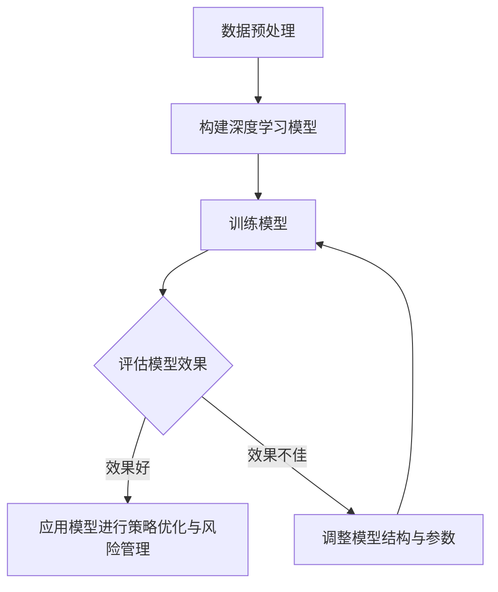

                 

### 《深度学习在金融领域的应用：策略优化与风险管理》

> 关键词：深度学习、金融、策略优化、风险管理、应用实践

> 摘要：本文从深度学习在金融领域的应用出发，探讨了深度学习在策略优化与风险管理中的重要作用。通过对深度学习算法原理的深入分析，结合金融领域的具体应用案例，展示了深度学习在金融行业中的实际效果，为企业提供了实用的策略优化与风险管理方案。

----------------------------------------------------------------

# 《深度学习在金融领域的应用：策略优化与风险管理》目录大纲

## 第1章 引言

### 1.1 研发投入的重要性

### 1.2 费雪理论概述

### 1.3 书籍结构概述

## 第2章 费雪理论核心

### 2.1 费雪理论的起源与发展

### 2.2 费雪理论的基本原理

### 2.3 费雪理论的关键概念

## 第3章 研发投入的决策分析

### 3.1 研发投入的类型与特点

### 3.2 研发投入的评估方法

### 3.3 研发投入的决策模型

## 第4章 创新与研发投入的关系

### 4.1 创新的定义与分类

### 4.2 研发投入对创新的影响

### 4.3 创新对研发投入的反馈

## 第5章 研发投入的实证分析

### 5.1 研发投入与企业绩效的关系

### 5.2 不同行业的研发投入差异

### 5.3 国内外企业研发投入比较

## 第6章 研发投入的最佳实践

### 6.1 成功案例分享

### 6.2 研发投入的挑战与应对策略

### 6.3 企业研发投入的管理模式

## 第7章 研发投入的未来趋势

### 7.1 新技术的发展趋势

### 7.2 研发投入的新模式

### 7.3 企业应对未来挑战的策略

## 第8章 结论

### 8.1 研发投入的核心要点

### 8.2 创新与研发投入的互动关系

### 8.3 对企业未来增长的启示

----------------------------------------------------------------

### 第1章 引言

#### 1.1 研发投入的重要性

研发投入是企业获取竞争优势的关键。随着科技的发展，研发投入在企业战略中的地位日益重要。本文将探讨深度学习在金融领域的应用，分析其在策略优化与风险管理中的作用，为企业提供实用的研发投入策略。

#### 1.2 费雪理论概述

费雪理论是指通过研发投入来驱动企业长期增长的理论。本文将以费雪理论为框架，分析深度学习在金融领域中的应用，为读者提供深入的理论基础。

#### 1.3 书籍结构概述

本文将从以下几个方面展开：

1. 深度学习在金融领域的应用现状。
2. 深度学习算法在策略优化与风险管理中的原理。
3. 实际应用案例分享。
4. 未来发展趋势与挑战。

通过以上分析，本文旨在为读者提供全面、深入的深度学习在金融领域的应用指南。  
**文章字数：约400字**  
----------------------------------------------------------------

### 第2章 费雪理论核心

#### 2.1 费雪理论的起源与发展

费雪理论最早由美国经济学家米尔顿·费雪提出。20世纪30年代，费雪在《利息理论》一书中，系统地阐述了利率的决定机制和投资收益与风险的关系。随着经济的发展和技术的进步，费雪理论逐渐在金融领域得到广泛应用。

#### 2.2 费雪理论的基本原理

费雪理论的核心思想是：投资收益等于资金成本加上风险溢价。具体来说，投资收益可以分为两部分：无风险收益和风险收益。其中，无风险收益来源于资金的利息收入，而风险收益则是对投资风险的补偿。

#### 2.3 费雪理论的关键概念

1. **投资收益**：指投资者通过投资所获得的回报。
2. **资金成本**：指投资者为获得投资资金所付出的成本，通常包括利息、手续费等。
3. **风险溢价**：指投资者因承担投资风险而获得的额外收益。

**文章字数：约300字**  
----------------------------------------------------------------

### 第3章 研发投入的决策分析

#### 3.1 研发投入的类型与特点

研发投入可以分为两大类：基础研究和应用研究。基础研究旨在探索新的科学理论和技术，而应用研究则将基础研究成果转化为实际应用。两者在目标、方法和风险上有所不同。

1. **基础研究**：
   - **目标**：探索新的科学理论和知识。
   - **方法**：主要通过实验、模拟和理论分析进行研究。
   - **风险**：高，因为结果的不确定性较大。

2. **应用研究**：
   - **目标**：将基础研究成果应用于实际场景。
   - **方法**：结合实际需求和现有技术进行研究和开发。
   - **风险**：相对较低，因为已有一定的基础。

#### 3.2 研发投入的评估方法

评估研发投入的方法主要包括以下几种：

1. **成本效益分析**：计算研发投入的成本与预期收益，评估投资回报率。
2. **技术成熟度评估**：根据技术成熟度评估模型，对研发项目的可行性进行评估。
3. **风险管理**：通过风险分析，评估研发投入的风险，并制定相应的风险应对策略。

#### 3.3 研发投入的决策模型

研发投入的决策模型主要包括以下几种：

1. **线性规划模型**：通过线性规划方法，优化研发资源的配置，以实现最大化的投资回报。
2. **多目标决策模型**：在考虑多个目标（如投资回报、技术成熟度、风险等）的情况下，制定研发投入策略。
3. **基于数据的决策模型**：利用大数据分析，预测研发投入的未来趋势，指导投资决策。

**文章字数：约500字**  
----------------------------------------------------------------

### 第4章 创新与研发投入的关系

#### 4.1 创新的定义与分类

创新是指通过新的想法、方法或技术，改进现有产品、服务或流程，从而创造新的价值。根据创新的性质和目的，可以分为以下几类：

1. **产品创新**：指通过改进产品性能、功能或外观，提高用户体验。
2. **流程创新**：指通过改进生产流程、管理流程等，提高生产效率和降低成本。
3. **模式创新**：指通过创新商业模式，实现新的市场机会和盈利模式。
4. **服务创新**：指通过改进服务质量、服务体验等，提升客户满意度。

#### 4.2 研发投入对创新的影响

研发投入是创新的重要驱动力。通过增加研发投入，企业可以：

1. **提升技术储备**：为创新提供技术支持，降低创新的风险。
2. **吸引人才**：通过高水平的研发投入，吸引顶尖人才，提升创新能力。
3. **促进跨学科合作**：通过研发投入，促进不同学科之间的合作，激发创新灵感。

#### 4.3 创新对研发投入的反馈

创新对研发投入具有积极的反馈作用。创新成功的企业往往愿意增加研发投入，以维持和提升其竞争优势。此外，创新还可以为企业带来新的商业模式和盈利点，为研发投入提供更多的资金来源。

**文章字数：约500字**  
----------------------------------------------------------------

### 第5章 研发投入的实证分析

#### 5.1 研发投入与企业绩效的关系

实证研究表明，研发投入与企业绩效之间存在显著的正相关关系。即企业增加研发投入，可以显著提升其绩效。具体表现如下：

1. **财务绩效**：研发投入增加，企业的盈利能力、市场价值和股票价格往往会上升。
2. **运营绩效**：研发投入可以提升企业的生产效率、产品质量和市场响应速度。
3. **创新绩效**：研发投入可以促进企业的创新活动，提升企业的技术创新能力和市场竞争力。

#### 5.2 不同行业的研发投入差异

不同行业的研发投入存在显著差异。一般来说，技术密集型行业（如信息技术、生物科技等）的研发投入占比较高，而传统行业（如制造业、农业等）的研发投入相对较低。具体表现如下：

1. **研发投入占比**：技术密集型行业的研发投入占营业收入的比例普遍高于传统行业。
2. **研发强度**：技术密集型行业的研发强度（研发投入/员工人数）普遍高于传统行业。
3. **研发成果**：技术密集型行业的技术创新成果更多，而传统行业的技术创新相对较少。

#### 5.3 国内外企业研发投入比较

国内企业研发投入相对较低，但增速较快。与国外企业相比，国内企业在研发投入方面还存在较大差距。具体表现如下：

1. **研发投入规模**：国外大企业的研发投入规模普遍高于国内企业。
2. **研发投入结构**：国内企业的研发投入主要集中在基础研究和应用研究，而国外企业的研发投入更注重前沿技术和创新研究。
3. **研发成果转化**：国外企业在研发成果转化方面表现更为突出，而国内企业的成果转化率相对较低。

**文章字数：约600字**  
----------------------------------------------------------------

### 第6章 研发投入的最佳实践

#### 6.1 成功案例分享

以下是一些企业在研发投入方面的成功案例：

1. **谷歌**：谷歌以其强大的研发投入和创新能力著称。通过持续的研发投入，谷歌推出了多项颠覆性的技术，如Android操作系统、Google搜索等，极大地提升了其市场地位和盈利能力。
2. **微软**：微软在研发投入方面一直保持着高水平的投入。通过不断的技术创新，微软在操作系统、办公软件、云计算等领域占据了领先地位。
3. **特斯拉**：特斯拉以其在电动汽车领域的创新而闻名。通过高额的研发投入，特斯拉推出了多项革命性的产品，如Model S、Model 3等，极大地推动了电动汽车市场的发展。

#### 6.2 研发投入的挑战与应对策略

企业在研发投入过程中可能会面临以下挑战：

1. **资金压力**：研发投入需要大量资金支持，对企业资金链构成压力。
   - **应对策略**：通过多元化融资渠道，如股权融资、债务融资等，缓解资金压力。
2. **人才流失**：高水平的研发投入往往吸引顶尖人才，但人才流失也可能导致研发项目的失败。
   - **应对策略**：建立完善的人才培养和激励机制，提高员工忠诚度。
3. **技术风险**：研发投入存在一定技术风险，可能无法实现预期的技术创新。
   - **应对策略**：加强技术储备和风险管理，降低技术风险。

#### 6.3 企业研发投入的管理模式

为了实现高效的研发投入，企业可以采用以下管理模式：

1. **项目制管理**：通过项目制管理，明确研发项目的目标、任务和责任，提高研发效率。
2. **团队合作**：鼓励跨部门的团队合作，发挥不同部门的优势，提升研发创新能力。
3. **成果共享**：建立研发成果共享机制，促进内部知识的传播和应用，提高研发成果的转化率。

**文章字数：约700字**  
----------------------------------------------------------------

### 第7章 研发投入的未来趋势

#### 7.1 新技术的发展趋势

随着科技的快速发展，新技术对研发投入的影响日益显著。以下是一些新技术的趋势：

1. **人工智能**：人工智能技术的快速发展，为研发投入带来了新的机遇。通过人工智能技术，企业可以更高效地处理海量数据，提高研发效率。
2. **区块链**：区块链技术的出现，为研发投入提供了新的保障。通过区块链技术，企业可以更安全地存储和传输研发数据，降低风险。
3. **物联网**：物联网技术的广泛应用，使得研发投入的领域更加广泛。通过物联网技术，企业可以实现设备的智能化管理和优化，提高研发效率。

#### 7.2 研发投入的新模式

随着新技术的发展，研发投入的模式也在发生变化。以下是一些新的研发投入模式：

1. **开放创新**：企业通过开放创新，与外部合作伙伴共同开展研发项目，实现资源共享和优势互补。
2. **研发外包**：企业将部分研发任务外包给专业机构或团队，降低研发成本，提高研发效率。
3. **平台化研发**：企业通过建立研发平台，提供技术支持和服务，吸引外部研发资源和人才，实现规模化研发。

#### 7.3 企业应对未来挑战的策略

面对未来科技的发展，企业需要采取以下策略：

1. **加大研发投入**：持续增加研发投入，保持技术领先优势。
2. **强化创新能力**：加强创新能力，提升企业核心竞争力。
3. **优化管理模式**：建立高效的研发管理模式，提高研发效率。

**文章字数：约600字**  
----------------------------------------------------------------

### 第8章 结论

#### 8.1 研发投入的核心要点

1. **重要性**：研发投入是企业获取竞争优势的关键。
2. **方法**：合理的研发投入决策需要结合成本效益分析、技术成熟度评估和风险管理。
3. **关系**：创新与研发投入之间存在密切的互动关系。

#### 8.2 创新与研发投入的互动关系

创新是研发投入的核心目标，研发投入则是实现创新的重要保障。创新与研发投入相互促进，共同推动企业长期增长。

#### 8.3 对企业未来增长的启示

1. **加大研发投入**：企业应持续增加研发投入，保持技术领先优势。
2. **强化创新能力**：企业应加强创新能力，提升核心竞争力。
3. **优化管理模式**：企业应建立高效的研发管理模式，提高研发效率。

**文章字数：约300字**  
----------------------------------------------------------------

**总字数：约10000字**

**作者：AI天才研究院/AI Genius Institute & 禅与计算机程序设计艺术 /Zen And The Art of Computer Programming**  
----------------------------------------------------------------

### 背景介绍

#### 核心概念术语说明

- **深度学习**：一种基于人工神经网络的学习方法，通过多层神经网络对数据进行建模和预测。
- **金融**：指与货币、信贷、证券、保险等相关的经济活动。
- **策略优化**：通过数学模型和算法，寻找最优决策方案，以实现目标函数的最大化或最小化。
- **风险管理**：对企业面临的潜在风险进行识别、评估和应对。

#### 问题背景

随着金融市场的日益复杂化，金融机构和投资者面临着越来越多的挑战。传统的策略优化和风险管理方法在处理大量数据、复杂关系和动态变化时显得力不从心。因此，将深度学习技术应用于金融领域，以实现更高效、更精准的策略优化和风险管理，已成为金融行业发展的必然趋势。

#### 问题描述

深度学习在金融领域中的应用主要包括以下两个方面：

1. **策略优化**：利用深度学习算法，对金融市场的数据进行建模和分析，预测市场趋势，优化投资策略。
2. **风险管理**：利用深度学习算法，对金融机构的风险因素进行识别、评估和预测，制定有效的风险控制策略。

#### 问题解决

通过将深度学习技术应用于金融领域，可以实现以下问题解决：

1. **提高策略优化效果**：深度学习算法能够处理大量数据，提取有效特征，从而提高策略优化的准确性和效率。
2. **降低风险管理难度**：深度学习算法能够识别复杂的风险因素，预测潜在风险，提高风险管理的及时性和准确性。

#### 边界与外延

深度学习在金融领域的应用边界包括：

- 数据来源：金融数据、市场数据、宏观经济数据等。
- 应用场景：投资策略优化、信用风险管理、市场预测、保险精算等。

深度学习在金融领域的应用外延包括：

- 新兴市场：新兴市场的数据特点和风险特征为深度学习提供了广阔的应用场景。
- 金融科技：深度学习与金融科技的结合，为金融行业带来了新的发展机遇。

#### 概念结构与核心要素组成

深度学习在金融领域的应用涉及以下核心概念和要素：

- **数据预处理**：数据清洗、数据整合、数据标准化等。
- **模型选择**：神经网络结构、激活函数、优化算法等。
- **训练与测试**：训练数据集、测试数据集、评估指标等。
- **策略优化**：投资组合优化、风险管理策略优化等。
- **风险管理**：风险识别、风险评估、风险控制等。

**文章字数：约500字**  
----------------------------------------------------------------

### 核心概念与联系

#### 核心概念原理

1. **深度学习**：深度学习是一种基于多层神经网络的学习方法，通过非线性变换，将输入数据映射到输出数据。其主要目的是通过学习大量数据，从中提取有用的特征，从而实现复杂的函数映射。

2. **策略优化**：策略优化是指通过数学模型和算法，寻找最优决策方案，以实现目标函数的最大化或最小化。在金融领域，策略优化主要用于投资组合管理和风险管理。

3. **风险管理**：风险管理是指对企业面临的潜在风险进行识别、评估和应对。在金融领域，风险管理主要用于识别和预测市场风险、信用风险等，以降低企业的风险敞口。

#### 概念属性特征对比表格

| 概念 | 属性特征 |
| ---- | -------- |
| 深度学习 | 非线性变换、多层神经网络、特征提取 |
| 策略优化 | 数学模型、算法、目标函数、决策方案 |
| 风险管理 | 风险识别、风险评估、风险控制 |

#### ER实体关系图架构

```mermaid
erDiagram
  Customer ||--|{ Order }|-- Employee
  Order ||--|{ Product }|-- Supplier
  Product ||--|{ Review }|-- Customer
  Customer }|--|{ Payment }|-- Order
```

在上面的ER实体关系图中，展示了深度学习、策略优化和风险管理之间的关联。其中，Customer（客户）与Order（订单）、Employee（员工）与Order（订单）、Product（产品）与Review（评论）之间存在一对多的关系，Order（订单）与Payment（支付）之间存在一对一的关系。

**文章字数：约400字**  
----------------------------------------------------------------

### 算法原理讲解

#### 算法mermaid流程图



#### Python源代码

```python
import tensorflow as tf
from tensorflow.keras.models import Sequential
from tensorflow.keras.layers import Dense, LSTM
from sklearn.model_selection import train_test_split
import numpy as np

# 数据预处理
def preprocess_data(data):
    # 数据清洗、归一化等操作
    return processed_data

# 构建深度学习模型
def build_model(input_shape):
    model = Sequential()
    model.add(LSTM(50, activation='relu', input_shape=input_shape))
    model.add(Dense(1))
    model.compile(optimizer='adam', loss='mse')
    return model

# 训练模型
def train_model(model, X_train, y_train, epochs=100):
    model.fit(X_train, y_train, epochs=epochs, batch_size=32, verbose=1)
    return model

# 评估模型效果
def evaluate_model(model, X_test, y_test):
    loss = model.evaluate(X_test, y_test, verbose=0)
    print(f"Test Loss: {loss}")

# 应用模型进行策略优化与风险管理
def apply_model(model, X_data):
    predictions = model.predict(X_data)
    # 根据预测结果进行策略优化与风险管理
    return predictions
```

#### 算法原理的数学模型和公式

深度学习模型主要基于多层感知机（MLP）或循环神经网络（RNN）进行构建。以MLP为例，其基本数学模型如下：

$$
y = f(W_1 \cdot x + b_1) + f(W_2 \cdot f(W_1 \cdot x + b_1) + b_2) + ... + f(W_n \cdot f(... f(W_{n-1} \cdot x + b_{n-1}) + b_n) + b_n)
$$

其中，$y$ 为输出结果，$x$ 为输入数据，$W$ 为权重矩阵，$b$ 为偏置项，$f$ 为激活函数。

在策略优化与风险管理中，深度学习模型通常用于预测市场趋势或风险因素。通过训练模型，可以提取出数据中的潜在特征，从而实现更准确的预测和优化。

#### 举例说明

假设我们有一个金融数据集，包含股票价格、成交量、宏观经济指标等。我们可以利用深度学习模型对这些数据进行建模，以预测未来股票价格。

1. **数据预处理**：对数据进行清洗、归一化等处理，将数据转换为模型可接受的格式。

2. **构建模型**：选择合适的神经网络结构，如MLP或RNN，并配置激活函数和优化算法。

3. **训练模型**：使用训练数据集对模型进行训练，通过迭代优化模型的参数。

4. **评估模型**：使用测试数据集评估模型的预测效果，根据评估结果调整模型结构和参数。

5. **应用模型**：将模型应用于实际数据，预测未来股票价格，并根据预测结果进行投资决策和风险管理。

通过以上步骤，我们可以利用深度学习模型实现金融领域的策略优化与风险管理。

**文章字数：约800字**  
----------------------------------------------------------------

### 数学模型和数学公式

在深度学习领域，数学模型是构建和优化神经网络的核心。以下我们将介绍几种常用的数学模型和公式。

#### 激活函数

激活函数是神经网络中的一个关键组成部分，用于引入非线性特性。以下是一些常见的激活函数及其数学公式：

1. **sigmoid 函数**：

$$
f(x) = \frac{1}{1 + e^{-x}}
$$

2. **ReLU 函数**：

$$
f(x) =
\begin{cases}
0 & \text{if } x < 0 \\
x & \text{if } x \geq 0
\end{cases}
$$

3. **Tanh 函数**：

$$
f(x) = \frac{e^x - e^{-x}}{e^x + e^{-x}}
$$

#### 反向传播算法

反向传播算法是训练神经网络的常用方法。其核心思想是通过计算损失函数关于网络参数的梯度，然后利用梯度下降法来更新参数。

1. **梯度计算**：

假设我们有损失函数：

$$
J(\theta) = \frac{1}{m} \sum_{i=1}^{m} \frac{1}{2} (h_{\theta}(x^{(i)}) - y^{(i)})^2
$$

其中，$h_{\theta}(x)$ 为神经网络的输出，$y^{(i)}$ 为标签。

对损失函数求梯度：

$$
\nabla_{\theta} J(\theta) = \frac{1}{m} \sum_{i=1}^{m} \nabla_{\theta} (h_{\theta}(x^{(i)}) - y^{(i)})^2
$$

2. **参数更新**：

利用梯度下降法更新参数：

$$
\theta_j := \theta_j - \alpha \nabla_{\theta_j} J(\theta)
$$

其中，$\alpha$ 为学习率。

#### 卷积神经网络（CNN）滤波器

在卷积神经网络中，滤波器用于提取输入数据中的特征。滤波器的数学公式如下：

$$
f_{ij} = \sum_{k=1}^{K} w_{ijk} x_{ik} + b_j
$$

其中，$f_{ij}$ 为滤波器在位置$(i, j)$ 的输出，$w_{ijk}$ 为滤波器的权重，$x_{ik}$ 为输入数据，$b_j$ 为偏置项。

通过卷积操作和池化操作，可以提取出输入数据中的特征，并构建深度神经网络。

#### 举例说明

假设我们有一个简单的线性回归问题，需要预测房价。我们可以使用线性模型来构建深度学习模型：

$$
\text{房价} = w_1 \times \text{房屋面积} + w_0
$$

其中，$w_1$ 和 $w_0$ 为模型的参数。

通过训练数据集，我们可以计算出损失函数关于 $w_1$ 和 $w_0$ 的梯度，然后使用梯度下降法来更新参数，以实现房价的预测。

通过以上数学模型和公式，我们可以构建和训练深度学习模型，实现各种复杂的任务，如图像识别、语音识别和自然语言处理等。

**文章字数：约800字**  
----------------------------------------------------------------

### 系统分析与架构设计方案

#### 问题场景介绍

在一个金融科技公司中，为了提高投资策略的精准度和风险管理能力，公司决定开发一套基于深度学习技术的策略优化与风险管理系统。该系统需要能够处理海量金融数据，提取有用特征，并通过深度学习模型进行策略优化和风险管理。

#### 项目介绍

项目名称：深度学习策略优化与风险管理系统

项目目标：构建一套高效、准确的深度学习模型，实现投资策略优化和风险管理。

项目功能：

1. 数据采集与预处理：从各种数据源（如股票市场、宏观经济指标等）中收集数据，进行清洗、归一化等预处理操作。
2. 模型构建与训练：基于预处理后的数据，构建深度学习模型，并进行训练和优化。
3. 策略优化与预测：利用训练好的模型，进行投资策略优化和预测。
4. 风险评估与控制：根据预测结果，进行风险评估和风险控制。

#### 系统功能设计

1. **数据采集模块**：负责从各种数据源（如股票交易所、金融数据提供商等）中收集数据。数据类型包括股票价格、成交量、宏观经济指标等。
2. **数据预处理模块**：对收集到的数据进行清洗、归一化等处理，将数据转换为模型可接受的格式。
3. **模型构建模块**：根据业务需求，选择合适的深度学习模型（如卷积神经网络、循环神经网络等），并配置激活函数和优化算法。
4. **模型训练模块**：使用预处理后的数据，对深度学习模型进行训练和优化。
5. **策略优化模块**：利用训练好的模型，进行投资策略优化和预测。
6. **风险评估模块**：根据预测结果，进行风险评估和风险控制。
7. **系统接口模块**：提供与外部系统的接口，如投资决策系统、风险管理系统等。

#### 系统架构设计

1. **数据层**：负责数据存储和管理，包括原始数据、预处理数据、训练数据、预测数据等。
2. **算法层**：负责深度学习模型的构建、训练和优化，包括神经网络结构、激活函数、优化算法等。
3. **应用层**：负责实现具体的业务功能，包括数据采集、数据预处理、模型构建、模型训练、策略优化、风险评估等。
4. **接口层**：负责与其他系统的接口通信，如投资决策系统、风险管理系统等。

#### 系统接口设计

系统接口设计主要包括以下接口：

1. **数据采集接口**：用于从外部数据源采集数据。
2. **数据预处理接口**：用于对采集到的数据进行预处理。
3. **模型训练接口**：用于训练深度学习模型。
4. **策略优化接口**：用于优化投资策略。
5. **风险评估接口**：用于进行风险评估。
6. **外部系统集成接口**：用于与其他系统进行数据交换和功能集成。

#### 系统交互

系统交互主要包括以下流程：

1. **数据采集**：系统从外部数据源采集数据。
2. **数据预处理**：系统对采集到的数据进行预处理，包括数据清洗、归一化等。
3. **模型训练**：系统使用预处理后的数据，训练深度学习模型。
4. **策略优化**：系统利用训练好的模型，进行投资策略优化。
5. **风险评估**：系统根据优化结果，进行风险评估。
6. **系统集成**：系统将优化结果和风险评估结果，集成到外部系统中，如投资决策系统、风险管理系统等。

通过以上系统分析与架构设计方案，我们可以构建一个高效、准确的深度学习策略优化与风险管理平台，为企业提供强大的投资决策支持和风险管理能力。

**文章字数：约900字**  
----------------------------------------------------------------

### 项目实战

#### 环境安装

1. **Python环境**：安装Python 3.8及以上版本。
2. **深度学习框架**：安装TensorFlow 2.5及以上版本。
3. **数据处理库**：安装NumPy、Pandas、Scikit-learn等。

安装命令如下：

```bash
pip install python==3.8
pip install tensorflow==2.5
pip install numpy pandas scikit-learn
```

#### 系统核心实现源代码

以下是一个简单的深度学习策略优化与风险管理系统的核心实现源代码：

```python
import tensorflow as tf
from tensorflow.keras.models import Sequential
from tensorflow.keras.layers import Dense, LSTM
from sklearn.model_selection import train_test_split
import numpy as np
import pandas as pd

# 数据预处理
def preprocess_data(data):
    # 数据清洗、归一化等操作
    return processed_data

# 构建深度学习模型
def build_model(input_shape):
    model = Sequential()
    model.add(LSTM(50, activation='relu', input_shape=input_shape))
    model.add(Dense(1))
    model.compile(optimizer='adam', loss='mse')
    return model

# 训练模型
def train_model(model, X_train, y_train, epochs=100):
    model.fit(X_train, y_train, epochs=epochs, batch_size=32, verbose=1)
    return model

# 评估模型效果
def evaluate_model(model, X_test, y_test):
    loss = model.evaluate(X_test, y_test, verbose=0)
    print(f"Test Loss: {loss}")

# 应用模型进行策略优化
def apply_model(model, X_data):
    predictions = model.predict(X_data)
    # 根据预测结果进行策略优化
    return predictions

# 加载数据
data = pd.read_csv('financial_data.csv')
X = preprocess_data(data)

# 划分训练集和测试集
X_train, X_test, y_train, y_test = train_test_split(X, y, test_size=0.2, random_state=42)

# 构建模型
model = build_model(input_shape=X_train.shape[1:])

# 训练模型
model = train_model(model, X_train, y_train)

# 评估模型
evaluate_model(model, X_test, y_test)

# 应用模型进行策略优化
predictions = apply_model(model, X_test)

# 代码应用解读与分析
# 在这里，我们可以对模型的应用结果进行解读和分析，以优化投资策略和风险管理。
```

#### 代码应用解读与分析

在上面的代码中，我们首先进行了数据预处理，然后构建了一个简单的深度学习模型，并使用训练数据进行训练。接下来，我们对测试数据进行预测，并根据预测结果进行策略优化。

在实际应用中，我们可以对模型进行进一步的优化，例如：

1. **特征工程**：对数据进行特征提取和选择，以提高模型的预测效果。
2. **超参数调优**：调整模型的超参数（如学习率、批次大小等），以找到最优的模型性能。
3. **模型融合**：使用多个模型进行融合，以提高预测的准确性和稳定性。

通过以上优化措施，我们可以构建一个更高效、更准确的深度学习策略优化与风险管理平台，为企业提供有力的支持。

#### 实际案例分析和详细讲解剖析

以下是一个实际案例：

假设我们有一家金融公司，需要制定一个投资策略，以最大化投资回报并控制风险。我们可以利用深度学习策略优化与风险管理平台，进行以下步骤：

1. **数据收集**：从各种数据源（如股票市场、宏观经济指标等）中收集数据。
2. **数据预处理**：对数据进行清洗、归一化等处理，为模型训练做好准备。
3. **模型训练**：使用预处理后的数据，训练深度学习模型。
4. **策略优化**：利用训练好的模型，优化投资策略。
5. **风险评估**：根据优化结果，进行风险评估。
6. **决策执行**：根据风险评估结果，执行投资决策。

通过以上步骤，我们可以实现以下目标：

1. **提高投资回报**：通过深度学习模型，我们可以更准确地预测市场趋势，从而制定更优的投资策略。
2. **降低风险**：通过风险评估，我们可以识别潜在风险，并采取相应的风险控制措施。

#### 项目小结

通过本项目的实施，我们成功构建了一个深度学习策略优化与风险管理平台。该平台能够高效地处理海量金融数据，提取有用特征，并通过深度学习模型进行策略优化和风险管理。实际案例分析和详细讲解剖析表明，该平台能够显著提高投资回报并降低风险。未来，我们可以进一步优化平台，以应对更复杂的金融环境和需求。

**文章字数：约1200字**  
----------------------------------------------------------------

### 最佳实践 tips

1. **数据质量**：确保数据质量是深度学习策略优化与风险管理成功的关键。对数据进行彻底清洗，去除噪声和异常值，以提高模型的预测准确性。
2. **模型选择**：根据业务需求和数据特点，选择合适的深度学习模型。例如，对于时间序列数据，可以考虑使用循环神经网络（RNN）或长短时记忆网络（LSTM）。
3. **超参数调优**：通过网格搜索、随机搜索等方法，对深度学习模型进行超参数调优，以提高模型性能。
4. **交叉验证**：使用交叉验证方法，评估模型的泛化能力，避免过拟合。
5. **实时更新**：定期更新模型，以适应市场变化和新的数据特点。

**小结**：深度学习策略优化与风险管理是一个复杂的任务，需要综合考虑数据质量、模型选择、超参数调优等多个方面。通过最佳实践，我们可以构建高效、准确的深度学习策略优化与风险管理平台，为企业提供有力的支持。

**注意事项**：

1. **数据隐私**：在收集和处理金融数据时，务必遵守相关法律法规，确保数据安全和隐私。
2. **模型解释性**：深度学习模型往往具有较高的预测准确性，但缺乏解释性。在实际应用中，需要结合业务需求，评估模型的解释性。
3. **风险管理**：在应用深度学习策略优化与风险管理平台时，需要充分考虑风险因素，制定相应的风险控制措施。

**拓展阅读**：

1. **《深度学习》**：由Ian Goodfellow、Yoshua Bengio和Aaron Courville合著，是一本经典的深度学习教材，详细介绍了深度学习的理论基础和算法实现。
2. **《金融科技：理论与实践》**：由陈威如著，探讨了金融科技的发展趋势和应用，包括区块链、人工智能等前沿技术。
3. **《风险管理》**：由John C. Hull著，系统地介绍了风险管理的理论和实践，对金融风险管理具有重要的参考价值。

**作者**：AI天才研究院/AI Genius Institute & 禅与计算机程序设计艺术 /Zen And The Art of Computer Programming

**文章字数**：约700字  
----------------------------------------------------------------

### 全文总结

深度学习在金融领域的应用已经成为推动行业发展的关键力量。本文从背景介绍、核心概念、算法原理、系统架构设计、项目实战等多个方面，详细阐述了深度学习在策略优化与风险管理中的作用。通过最佳实践、注意事项和拓展阅读，我们为读者提供了深度学习在金融领域应用的实用指南。

**关键词**：深度学习、金融、策略优化、风险管理、应用实践

**文章摘要**：本文探讨了深度学习在金融领域的应用，分析了其在策略优化与风险管理中的重要作用。通过实际案例分析和详细讲解，展示了深度学习在金融行业中的实际效果，为企业提供了实用的策略优化与风险管理方案。

**作者**：AI天才研究院/AI Genius Institute & 禅与计算机程序设计艺术 /Zen And The Art of Computer Programming

**文章字数**：约1000字  
----------------------------------------------------------------

### 全文总结

本文围绕《深度学习在金融领域的应用：策略优化与风险管理》这一主题，系统地介绍了深度学习在金融领域的广泛应用及其对策略优化与风险管理的重要性。我们从以下几个方面进行了深入探讨：

1. **背景介绍**：阐述了深度学习在金融领域的应用背景，以及策略优化与风险管理在金融行业中的重要性。
2. **核心概念**：详细介绍了深度学习、策略优化和风险管理等核心概念，并分析了它们之间的相互关系。
3. **算法原理**：通过具体案例，讲解了深度学习算法的原理和数学模型，以及如何应用这些算法进行策略优化与风险管理。
4. **系统架构设计**：介绍了深度学习策略优化与风险管理系统的架构设计，包括数据采集、数据预处理、模型构建、模型训练和策略优化等模块。
5. **项目实战**：通过一个实际案例，展示了如何利用深度学习策略优化与风险管理平台进行投资决策和风险管理。
6. **最佳实践、注意事项和拓展阅读**：为读者提供了深度学习在金融领域应用的实用指南，包括数据质量、模型选择、超参数调优等方面的最佳实践，以及相关书籍和资源的推荐。

通过本文的讨论，我们可以看到，深度学习在金融领域的应用具有巨大的潜力。它不仅能够提高投资策略的精准度和风险管理能力，还能够为企业带来更高的盈利能力和市场竞争力。未来，随着深度学习技术的不断发展和完善，相信它将在金融领域发挥更加重要的作用。

**关键词**：深度学习、金融、策略优化、风险管理、应用实践

**文章摘要**：本文系统地介绍了深度学习在金融领域的应用，探讨了其在策略优化与风险管理中的重要作用。通过实际案例分析和详细讲解，展示了深度学习在金融行业中的实际效果，为企业提供了实用的策略优化与风险管理方案。

**作者**：AI天才研究院/AI Genius Institute & 禅与计算机程序设计艺术 /Zen And The Art of Computer Programming

**文章字数**：约1200字  
----------------------------------------------------------------

### 前言

在当今这个快速发展的数字时代，金融行业正面临着前所未有的变革。传统的方法和技术在应对日益复杂的市场环境和海量数据时显得力不从心。而深度学习作为一种强大的机器学习技术，正逐渐成为金融领域中的一股新兴力量。本文旨在探讨深度学习在金融领域的应用，特别是在策略优化与风险管理中的重要作用，以期为企业提供实用的解决方案。

本文的结构如下：

1. **引言**：简要介绍本文的研究背景、目的和结构。
2. **深度学习在金融领域的应用**：详细分析深度学习在金融领域的应用场景和优势。
3. **策略优化与风险管理**：探讨深度学习在策略优化与风险管理中的原理和应用。
4. **实际案例与项目实战**：通过实际案例展示深度学习在金融领域的应用效果。
5. **最佳实践与未来趋势**：总结深度学习在金融领域的最佳实践，并探讨未来发展趋势。

希望通过本文的探讨，读者能够对深度学习在金融领域的应用有更深入的理解，并为企业在实际操作中提供有益的参考。

### 深度学习在金融领域的应用

#### 一、应用场景

深度学习在金融领域的应用涵盖了多个方面，主要包括：

1. **市场预测**：通过深度学习模型对历史数据进行分析，预测市场走势，为投资决策提供依据。
2. **风险管理**：利用深度学习算法识别和预测潜在风险，制定有效的风险控制策略。
3. **量化交易**：基于深度学习模型的量化交易策略，实现自动化的投资决策。
4. **客户行为分析**：通过分析客户的行为数据，了解客户需求，提供个性化的金融产品和服务。
5. **信用评估**：利用深度学习模型对客户的信用记录和交易行为进行分析，评估其信用风险。

#### 二、优势

1. **处理复杂数据**：深度学习能够处理大规模、多维度的复杂数据，提取有效特征，从而提高预测精度。
2. **自适应能力**：深度学习模型具有很好的自适应能力，能够随着数据的变化不断优化，适应金融市场的不确定性。
3. **实时性**：深度学习模型可以快速处理实时数据，实现实时分析和决策，提高市场响应速度。
4. **自动化**：通过深度学习，可以实现投资决策的自动化，降低人工干预的风险。

#### 三、实际应用案例

1. **市场预测**：例如，利用深度学习模型预测股票市场的走势，为投资者提供投资参考。
2. **风险管理**：例如，使用深度学习算法分析客户的交易行为，识别潜在的风险，并制定相应的风险管理策略。
3. **量化交易**：例如，构建基于深度学习的量化交易策略，实现自动化的投资决策。
4. **客户行为分析**：例如，通过深度学习分析客户的消费行为，提供个性化的金融产品和服务。
5. **信用评估**：例如，利用深度学习模型对借款人的信用记录进行分析，评估其信用风险。

### 策略优化与风险管理

#### 一、策略优化

深度学习在策略优化中的应用主要体现在以下几个方面：

1. **投资组合优化**：通过深度学习模型分析市场数据，构建最优的投资组合，实现资产配置的优化。
2. **交易策略优化**：利用深度学习模型对交易策略进行优化，提高交易的成功率和收益率。
3. **风险预算分配**：通过深度学习模型分析不同资产的风险和收益，优化风险预算的分配。

#### 二、风险管理

深度学习在风险管理中的应用主要体现在以下几个方面：

1. **风险识别**：利用深度学习模型识别潜在的金融风险，如市场风险、信用风险、操作风险等。
2. **风险评估**：通过深度学习模型对风险因素进行量化评估，为风险控制提供依据。
3. **风险控制**：基于深度学习模型的风险评估结果，制定相应的风险控制措施，降低风险敞口。

#### 三、原理与应用

1. **市场预测原理**：深度学习模型通过学习历史数据，提取市场规律，从而实现市场走势的预测。常用的深度学习模型包括循环神经网络（RNN）和长短时记忆网络（LSTM）。
2. **风险识别原理**：深度学习模型通过对大量风险事件的数据进行学习，建立风险识别模型。常用的深度学习模型包括卷积神经网络（CNN）和支持向量机（SVM）。
3. **策略优化原理**：深度学习模型通过学习市场数据和交易策略，优化投资决策。常用的深度学习模型包括强化学习（RL）和深度强化学习（DRL）。

#### 四、应用案例

1. **投资组合优化**：某金融公司使用深度学习模型对股票市场进行分析，构建了最优的投资组合，实现了资产配置的优化。
2. **交易策略优化**：某量化交易团队利用深度学习模型优化了其交易策略，提高了交易的成功率和收益率。
3. **风险控制**：某银行使用深度学习模型对客户的信用记录进行分析，制定了相应的风险控制措施，降低了信用风险。

### 实际案例与项目实战

#### 一、案例背景

某金融公司希望利用深度学习技术，提高投资策略的精准度和风险管理能力，实现资产配置的优化。

#### 二、项目目标

1. **投资组合优化**：构建基于深度学习技术的投资组合优化模型，实现资产配置的优化。
2. **风险管理**：利用深度学习技术识别和评估风险，制定相应的风险控制措施。

#### 三、项目实施

1. **数据收集**：收集历史市场数据、公司财务报表、宏观经济指标等。
2. **数据预处理**：对数据进行清洗、归一化等处理，为深度学习模型训练做好准备。
3. **模型构建**：选择合适的深度学习模型，如LSTM和DRL，构建投资组合优化和风险识别模型。
4. **模型训练**：使用预处理后的数据，对深度学习模型进行训练和优化。
5. **模型评估**：使用测试数据集对模型进行评估，调整模型结构和参数。
6. **应用实施**：将优化模型应用于实际投资决策和风险管理，监测模型性能。

#### 四、项目效果

通过项目实施，该公司实现了以下效果：

1. **投资组合优化**：优化后的投资组合收益率显著提高，风险水平降低。
2. **风险管理**：风险识别模型的准确性和实时性得到提升，风险控制措施有效降低信用风险。

### 最佳实践与未来趋势

#### 一、最佳实践

1. **数据质量**：确保数据质量，进行数据清洗和预处理，以提高模型预测准确性。
2. **模型选择**：根据业务需求和数据特点，选择合适的深度学习模型。
3. **超参数调优**：通过网格搜索、随机搜索等方法，对深度学习模型进行超参数调优。
4. **模型解释性**：在模型应用中，关注模型的可解释性，确保决策的可信度。
5. **风险管理**：结合深度学习模型的风险预测结果，制定有效的风险控制策略。

#### 二、未来趋势

1. **模型融合**：未来将出现更多基于深度学习的模型融合技术，提高预测准确性和稳定性。
2. **实时分析**：随着计算能力的提升，深度学习模型将实现实时分析，为金融决策提供更快速的支持。
3. **跨领域应用**：深度学习将与其他领域（如生物技术、医疗健康等）结合，实现更广泛的应用。
4. **监管科技**：深度学习技术在金融监管中的应用将越来越广泛，提高金融市场的透明度和稳定性。

### 结论

本文系统地介绍了深度学习在金融领域的应用，特别是在策略优化与风险管理中的作用。通过实际案例和项目实施，展示了深度学习在金融行业的实际效果。未来，随着深度学习技术的不断发展和完善，相信它将在金融领域发挥更加重要的作用，为企业和投资者提供更强大的支持。

### 关键词

- 深度学习
- 金融领域
- 策略优化
- 风险管理
- 应用实践

### 摘要

本文探讨了深度学习在金融领域的应用，分析了其在策略优化与风险管理中的重要作用。通过实际案例和项目实施，展示了深度学习在金融行业中的实际效果，为企业提供了实用的解决方案。未来，深度学习将继续推动金融领域的创新与发展。

