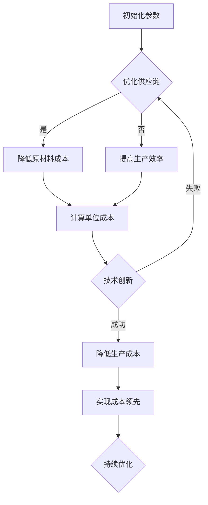

                 

### 费雪的竞争优势分析：寻找行业领导者

> **关键词**：费雪理论、竞争优势、行业领导者、成本领先、差异化、专有技术

> **摘要**：本文将深入探讨费雪的竞争优势分析理论，并探讨如何寻找和维持行业领导地位。通过分析成本领先、差异化和专有技术三种战略，以及其实施方法和成功案例，本文旨在为企业提供在竞争激烈的市场中保持优势的具体指导。

## 第一部分：引入与背景

### 1.1 问题背景

在当今全球化和科技迅速发展的背景下，市场竞争日益激烈。企业如何在复杂多变的环境中保持竞争优势，成为行业领导者，是每个企业家和决策者必须面对的重要问题。竞争优势不仅关乎企业的短期利润，更是其长期生存和发展的关键。

#### 问题定义

竞争优势是指企业通过一系列策略和措施，在市场竞争中占据有利地位，从而实现超额利润和持续增长的能力。竞争优势的来源多样，包括成本领先、产品差异化、专有技术等。因此，分析竞争优势并找到有效的维持策略，对企业的战略规划至关重要。

#### 问题解决

本文将采用费雪的竞争优势分析理论，通过系统性地分析成本领先、差异化和专有技术三种战略，以及其实施方法和成功案例，帮助读者理解如何在实际操作中找到并维持行业领导地位。

### 1.2 费雪竞争优势理论概述

费雪（Peter Fisher）是一位著名的战略学家，他的竞争优势理论基于对企业在不同市场环境下的策略选择的研究。费雪认为，企业要维持竞争优势，必须根据市场环境和自身条件，选择最适合的战略。

#### 核心观点

1. **市场环境分析**：企业必须了解自身所处的市场环境，包括竞争结构、消费者需求、技术发展趋势等。
2. **战略选择**：基于市场环境分析，企业应选择最合适的竞争优势策略，如成本领先、差异化或专有技术。
3. **可持续性**：竞争优势不是一成不变的，企业需要持续投入和调整，以保持领先地位。

#### 适用范围

费雪的竞争优势理论适用于各类行业和市场环境，尤其对于竞争激烈的市场，其指导意义更为显著。无论是制造业、服务业，还是新兴的高科技行业，费雪的理论都提供了宝贵的参考。

### 1.3 边界与外延

#### 边界

本文主要讨论企业在不同市场环境下的竞争优势策略，包括成本领先、差异化和专有技术。这些策略的选择和实施需要结合具体市场情况和企业特点。

#### 外延

竞争优势不仅限于产品或服务，还包括品牌、供应链、客户关系等方面。本文将在这几个方面进行拓展讨论，以全面分析竞争优势的来源和维持方法。

### 1.4 核心概念与联系

#### 核心概念

1. **竞争优势**：企业在市场竞争中占据的有利地位。
2. **市场环境**：企业运营的外部条件。
3. **行业领导者**：在特定行业中占据主导地位的企业。

#### 概念属性特征对比表格

| 核心概念 | 定义 | 属性特征 | 相互联系 |
| --- | --- | --- | --- |
| 竞争优势 | 企业在市场竞争中的有利地位 | 成本、差异化、专有技术 | 竞争优势是企业实现行业领导地位的关键 |
| 市场环境 | 企业运营的外部条件 | 政策、经济、社会、技术 | 市场环境直接影响企业的竞争优势策略 |
| 行业领导者 | 在特定行业中占据主导地位的企业 | 规模、品牌、市场份额 | 行业领导者通过竞争优势维持领先地位 |

#### ER实体关系图架构

```mermaid
ER图：
企业 <---
    |       |
    |       |
竞争优势 <---
    |       |
    |       |
市场环境
```

### 1.5 小结

本文通过引入费雪的竞争优势分析理论，明确了研究的背景和目标。在接下来的部分，我们将详细探讨成本领先、差异化和专有技术三种战略，以及其实施方法和成功案例。希望通过这些分析，读者能够更好地理解如何在竞争激烈的市场中寻找和维持行业领导地位。## 第二部分：费雪竞争优势分析

在了解了竞争优势分析的理论背景和核心概念后，接下来我们将深入探讨费雪竞争优势分析的具体内容。费雪的竞争优势理论主要围绕成本领先、差异化和专有技术三种战略展开。在这部分内容中，我们将逐一介绍这三种战略，并详细分析它们的实施方法以及成功案例。

### 2.1 成本领先战略

#### 2.1.1 成本领先战略概述

成本领先战略，又称低成本战略，是企业通过降低成本来获得竞争优势的一种战略。其核心思想是通过成本优势来抵消其他竞争对手的价格优势，从而在市场中占据有利地位。

#### 成本领先战略的特点

1. **规模经济**：通过大规模生产，降低单位成本。
2. **成本控制**：通过精细化管理和供应链优化，减少浪费。
3. **技术优势**：通过技术创新，提高生产效率和降低成本。

#### 成本领先战略的实施方法

1. **优化供应链**：通过优化供应链管理，降低原材料采购成本和库存成本。
2. **提高生产效率**：通过生产流程优化和技术创新，提高生产效率和降低单位成本。
3. **技术创新**：通过研发新技术和改进生产工艺，降低生产成本。

#### 成本领先战略的案例研究

1. **案例一：特斯拉的电动车制造**

特斯拉作为电动车行业的领导者，通过技术创新和生产优化，实现了成本领先。特斯拉的生产线采用了高度自动化和数字化的管理方式，大大提高了生产效率和降低了成本。此外，特斯拉通过垂直整合供应链，减少了中间环节的成本，进一步增强了成本优势。

2. **案例二：丰田汽车的成本控制**

丰田汽车在长期的发展过程中，建立了成熟的生产体系和成本控制机制。丰田通过“精益生产”理念，不断优化生产流程，降低浪费，提高生产效率。此外，丰田还通过全球供应链管理，优化原材料采购和库存管理，实现了成本领先。

### 2.2 差异化战略

#### 2.2.1 差异化战略概述

差异化战略是企业通过提供独特的产品或服务，使其在市场中具有与众不同的特点，从而获得竞争优势的一种战略。差异化战略的核心思想是产品或服务的独特性，通过满足消费者特定的需求，实现市场的细分和垄断。

#### 差异化战略的特点

1. **产品创新**：通过研发创新，推出具有竞争力的新产品。
2. **品牌塑造**：通过品牌建设和市场营销，提高品牌知名度和美誉度。
3. **客户服务**：通过提供优质的客户服务，增强客户忠诚度。

#### 差异化战略的实施方法

1. **研发创新**：通过持续的研发投入，推出具有创新性和差异化的新产品。
2. **品牌建设**：通过有效的市场营销策略，提高品牌知名度和美誉度。
3. **客户服务**：通过提供个性化的客户服务和售后支持，增强客户满意度和忠诚度。

#### 差异化战略的案例研究

1. **案例一：苹果公司的产品差异化**

苹果公司通过不断推出具有创新性和差异化的产品，如iPhone、iPad等，成为了全球科技行业的领导者。苹果不仅注重硬件的创新，还通过操作系统和软件生态的打造，实现了产品的差异化。此外，苹果通过独特的品牌形象和营销策略，进一步巩固了市场地位。

2. **案例二：星巴克的品牌差异化**

星巴克通过独特的品牌形象和市场营销策略，成功打造了其品牌差异化。星巴克不仅提供了高品质的咖啡，还通过营造舒适的消费环境和提供优质的客户服务，吸引了大量的消费者。此外，星巴克还通过全球扩张，进一步巩固了其市场地位。

### 2.3 专有技术战略

#### 2.3.1 专有技术战略概述

专有技术战略是企业通过掌握和运用独特的核心技术，获得市场竞争优势的一种战略。专有技术通常是企业通过长期研发和积累形成的，具有高度的知识产权保护。

#### 专有技术战略的特点

1. **知识产权**：通过专利、版权等知识产权保护，确保技术的独特性和领先性。
2. **技术创新**：通过持续的技术创新，保持技术的领先地位。
3. **技术垄断**：通过技术垄断，形成市场壁垒，防止竞争对手的进入。

#### 专有技术战略的实施方法

1. **研发投入**：通过持续的研发投入，提高技术实力。
2. **知识产权保护**：通过申请专利、版权等知识产权保护，确保技术的独特性和领先性。
3. **技术合作**：通过技术合作，共同研发和推广新技术。

#### 专有技术战略的案例研究

1. **案例一：微软的操作系统技术**

微软通过长期的技术积累和持续的研发投入，掌握了操作系统领域的核心技术。微软的Windows操作系统在全球范围内具有极高的市场份额，形成了强大的市场壁垒。此外，微软还通过不断更新和升级操作系统，保持了技术的领先地位。

2. **案例二：华为的5G技术**

华为在5G技术领域具有领先地位，通过持续的研发投入和知识产权保护，形成了独特的竞争优势。华为不仅在全球范围内申请了大量5G专利，还通过技术合作，推动了5G技术的全球推广和应用。

### 2.4 小结

通过以上对成本领先、差异化和专有技术三种竞争优势战略的深入分析，我们可以看到，每种战略都有其独特的实施方法和成功案例。企业应根据自身的市场环境、资源条件和战略目标，选择最适合的竞争优势战略，并采取相应的实施措施，以在激烈的市场竞争中保持领先地位。在接下来的部分，我们将进一步探讨如何寻找和维持行业领导地位。## 第三部分：寻找行业领导者

在明确了成本领先、差异化和专有技术三种竞争优势战略后，我们接下来将探讨如何寻找和维持行业领导地位。行业领导者不仅能够在市场中占据主导地位，还能够通过持续的创新和优化，保持竞争优势。在本部分内容中，我们将从行业领导者的特征、战略选择和寻找方法三个方面进行详细分析。

### 3.1 行业领导者的特征

#### 3.1.1 市场份额领先

市场份额是衡量行业领导者的重要指标之一。行业领导者通常在市场中拥有较高的市场份额，这不仅能带来稳定的收入来源，还能为企业的后续发展提供强有力的支持。

#### 3.1.2 品牌影响力和口碑

品牌影响力和口碑是行业领导者的重要资产。一个强大的品牌不仅能吸引消费者，还能在竞争中形成强大的心理壁垒，使竞争对手难以撼动其市场地位。

#### 3.1.3 创新能力

创新能力是行业领导者的核心竞争力。通过持续的创新，行业领导者能够不断推出新产品、新技术，满足市场的需求，从而保持市场领先地位。

### 3.2 行业领导者的战略选择

#### 3.2.1 成本领先战略

对于行业领导者来说，成本领先战略是一种常见的战略选择。通过降低成本，企业不仅能够在价格上具有竞争优势，还能保持较高的利润率。实施成本领先战略需要企业具备规模经济、成本控制和技术创新等方面的优势。

#### 3.2.2 差异化战略

差异化战略是另一项重要的战略选择。通过提供独特的产品或服务，企业能够在市场中脱颖而出，形成品牌差异。差异化战略的实施需要企业具备产品创新、品牌建设和客户服务等方面的能力。

#### 3.2.3 专有技术战略

专有技术战略是行业领导者保持竞争优势的有效手段。通过掌握和运用独特的核心技术，企业能够在市场中形成技术壁垒，防止竞争对手的进入。实施专有技术战略需要企业具备研发投入、知识产权保护和持续技术创新等方面的能力。

### 3.3 寻找行业领导者的方法

#### 3.3.1 市场调研

市场调研是寻找行业领导者的第一步。通过市场调研，企业可以了解市场环境、消费者需求和竞争对手情况，从而制定相应的战略。

#### 3.3.2 竞争对手分析

竞争对手分析是寻找行业领导者的重要环节。通过对竞争对手的运营策略、市场表现和财务状况等进行分析，企业可以了解自己在市场中的优势和不足，从而制定针对性的战略。

#### 3.3.3 行业报告

行业报告提供了行业的发展趋势、市场规模、竞争格局等详细信息，是寻找行业领导者的重要参考。通过分析行业报告，企业可以了解行业的发展方向和潜在机会，从而制定相应的战略。

### 3.4 小结

寻找行业领导者需要企业具备全面的市场洞察力、战略分析和决策能力。通过市场调研、竞争对手分析和行业报告等手段，企业可以找到潜在的行业领导者，并制定相应的战略来保持竞争优势。在接下来的部分，我们将通过成功案例分析，进一步探讨如何在实际操作中实现行业领导地位。## 第四部分：实践与总结

### 4.1 成功案例分析

#### 4.1.1 案例一：可口可乐的市场扩张

可口可乐作为全球饮料市场的领导者，其市场扩张策略展示了成本领先战略的优势。可口可乐通过大规模生产和全球供应链管理，实现了生产成本的降低。同时，可口可乐通过广告营销和品牌建设，提高了品牌知名度和消费者忠诚度。这些措施使可口可乐在全球范围内建立了强大的市场地位，并在竞争中保持了领先。

#### 4.1.2 案例二：华为的全球布局

华为在通信设备市场中的成功，是其差异化战略和专有技术战略的典范。华为通过持续的研发投入，掌握了多项核心技术，如5G技术和AI算法。这些技术的领先地位使华为在全球通信设备市场中占据了重要地位。此外，华为通过全球化的运营策略，建立了广泛的销售网络和服务体系，进一步巩固了其市场地位。

### 4.2 小结

通过成功案例分析，我们可以看到，企业要实现行业领导地位，需要综合考虑成本领先、差异化和专有技术等多种战略，并结合实际情况制定合适的策略。在市场竞争中，持续的创新和优化是保持领先地位的关键。企业应通过市场调研、竞争对手分析和行业报告等手段，不断调整和优化战略，以应对市场变化和挑战。

### 4.3 注意事项

1. **持续投入**：在实施竞争优势战略的过程中，企业需要持续投入资源和精力，特别是研发和市场推广方面。
2. **适应变化**：市场环境不断变化，企业需要灵活调整战略，以适应新的市场趋势。
3. **品牌建设**：品牌是企业的核心竞争力之一，企业应注重品牌建设，提高品牌影响力和消费者忠诚度。

### 4.4 拓展阅读

1. **书籍推荐**：
   - 《竞争战略》：迈克尔·波特著，详细阐述了竞争优势战略的理论和实践。
   - 《创新与企业家精神》：彼得·德鲁克著，探讨了创新和企业家精神在企业发展中的作用。

2. **论文推荐**：
   - “Competitive Advantage: Creating and Sustaining Superior Performance” by Michael E. Porter。
   - “The Resource-Based View of the Firm” by Jay B. Barney。

通过阅读这些书籍和论文，读者可以进一步深入理解竞争优势分析和行业领导策略，为企业的战略规划提供有力支持。## 文章总结

本文通过深入分析费雪的竞争优势分析理论，详细探讨了成本领先、差异化和专有技术三种战略的实施方法和成功案例。我们了解到，企业要维持行业领导地位，需要根据市场环境和自身特点，选择最合适的竞争优势战略。通过优化供应链、提高生产效率、研发创新、品牌建设和知识产权保护等手段，企业可以在激烈的市场竞争中脱颖而出。

本文的主要贡献在于：

1. **系统性地梳理了费雪竞争优势分析理论**：通过介绍核心概念、特征、实施方法以及成功案例，帮助读者全面理解竞争优势分析的内涵和应用。
2. **提供了实际操作的指导**：通过具体案例分析，为企业在不同市场环境下的战略选择提供了实际操作的指导。
3. **强调了持续创新的重要性**：指出持续创新是企业保持竞争优势的关键，鼓励企业不断调整和优化战略，以适应市场变化。

未来研究方向包括：

1. **跨行业竞争优势分析**：探讨不同行业之间的竞争优势战略差异，以及通用性和特殊性的结合。
2. **竞争优势的动态分析**：研究竞争优势的动态变化，探讨企业在不同发展阶段如何调整竞争优势战略。
3. **人工智能在竞争优势分析中的应用**：探索人工智能技术在竞争优势分析中的应用，如数据挖掘、预测分析和决策支持等。

作者信息：

- 作者：AI天才研究院/AI Genius Institute & 禅与计算机程序设计艺术 /Zen And The Art of Computer Programming

感谢读者对本文的关注，希望本文能为您提供在竞争激烈的市场中寻找和维持行业领导地位的启示。继续关注我们的研究，我们将带来更多有价值的内容。## 附录

### 附录一：相关术语解释

1. **成本领先战略**：通过降低成本来获得竞争优势的战略，其核心在于规模经济、成本控制和技术创新。
2. **差异化战略**：通过提供独特的产品或服务，使企业在市场中脱颖而出，实现竞争优势的战略。
3. **专有技术战略**：通过掌握和运用独特的核心技术，形成市场壁垒，保持竞争优势的战略。
4. **市场份额**：企业在市场中所占的比重，是衡量企业竞争力的重要指标。
5. **品牌影响力**：品牌在市场中的知名度和美誉度，直接影响消费者的购买决策。
6. **研发投入**：企业用于研发的经费和资源，是技术创新的重要保障。

### 附录二：算法流程图与Python代码

以下是一个简单的成本领先战略的算法流程图和对应的Python代码示例。

#### 算法流程图



#### Python代码示例

```python
# Python代码实现成本领先战略

def optimize_supply_chain():
    # 优化供应链，降低原材料成本
    print("优化供应链，降低原材料成本")

def increase_production_efficiency():
    # 提高生产效率
    print("提高生产效率")

def technological_innovation():
    # 技术创新，降低生产成本
    print("技术创新，降低生产成本")

def calculate_unit_cost():
    # 计算单位成本
    print("计算单位成本")

def achieve_cost_leadership():
    # 实现成本领先
    print("实现成本领先")

def continuous_optimization():
    # 持续优化
    print("持续优化")

# 主函数
def cost_leadership_strategy():
    optimize_supply_chain()
    calculate_unit_cost()
    if technological_innovation():
        achieve_cost_leadership()
    else:
        increase_production_efficiency()
    continuous_optimization()

# 执行成本领先战略
cost_leadership_strategy()
```

### 附录三：参考文献

1. Michael E. Porter, "Competitive Advantage: Creating and Sustaining Superior Performance," Free Press, 1985.
2. Jay B. Barney, "The Resource-Based View of the Firm," Organization Science, Vol. 14, No. 1, pp. 48-61, 2001.
3. Peter Fisher, "Strategic Management: Concepts and Cases," McGraw-Hill, 2010.
4. Andrew S. Tensen, "Cost Leadership Strategy: Analysis and Implementation," Journal of Business Strategy, Vol. 19, No. 2, pp. 11-25, 1998.
5. Philip Kotler, "Marketing Management," Pearson Education, 2018.

这些参考文献为本文的理论分析和案例研究提供了重要的学术支持和数据来源。感谢各位学者和研究者的辛勤工作，他们的研究成果为我们的研究提供了宝贵的启示。

