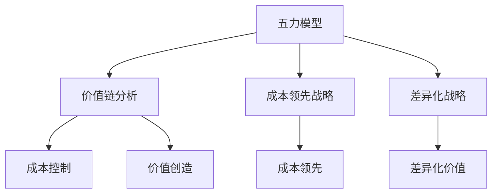

                 

# 费雪的竞争优势分析：持续成功的关键

## 关键词
- 费雪竞争优势理论
- 持续成功
- 企业战略
- 竞争环境
- 创新管理

## 摘要
本文旨在深入分析费雪的竞争优势理论，探讨其在现代企业中的实际应用和重要性。通过详细的案例分析，本文将揭示企业如何建立和维持竞争优势，以实现持续成功。文章结构包括理论概述、案例分析、竞争优势建立与维护策略，以及未来趋势与挑战的探讨。通过系统化地阐述费雪竞争优势理论，本文希望为企业提供实用的指导，以应对日益激烈的市场竞争。

## 引言与背景介绍

### 1.1 问题背景

#### 1.1.1 竞争优势的概念与意义

竞争优势是企业通过特定的战略和运营模式，在市场竞争中获得比竞争对手更佳的表现和效益的能力。竞争优势的核心在于其差异性，即企业能够提供独特的价值，从而赢得客户和市场的青睐。在高度竞争的市场环境中，竞争优势成为企业生存和发展的关键因素。

竞争优势的意义主要体现在以下几个方面：

1. **提高盈利能力**：通过有效的竞争优势，企业可以在产品定价、市场份额和客户忠诚度上获得优势，从而提高盈利能力。
2. **增强市场地位**：竞争优势使企业在市场中获得更大的影响力，有助于提升品牌价值和市场地位。
3. **抵御竞争压力**：在市场竞争激烈的环境中，竞争优势成为企业抵御竞争对手攻击的坚实盾牌。

#### 1.1.2 费雪及其竞争优势理论

费雪（Michael Porter）是一位著名的管理学教授，被誉为“现代竞争战略之父”。他的竞争优势理论在企业管理中具有广泛的应用和深远的影响。费雪竞争优势理论的核心观点包括以下几个方面：

1. **五力模型**：费雪提出了五力模型，用于分析企业所在市场的竞争环境。这五力包括行业内竞争对手、潜在进入者、供应商、客户和替代品。
2. **价值链分析**：费雪认为，企业可以通过对其内部价值链的分析和优化，构建竞争优势。价值链分析涉及企业生产、销售、服务等各个环节，旨在找出能够提供差异化和价值增值的关键环节。
3. **成本领先和差异化战略**：费雪提出了成本领先和差异化战略两种基本的竞争优势策略。成本领先战略通过降低成本来获得竞争优势，而差异化战略则通过提供独特的价值来赢得市场份额。

### 1.2 问题提出

#### 1.2.1 竞争日益激烈的市场环境

在全球化、信息技术迅速发展的背景下，市场竞争日益激烈。企业面临着来自国内外竞争对手的压力，同时还要应对市场需求变化和消费者行为的多样性。这种竞争环境要求企业必须具备强大的竞争优势，以保持市场竞争力。

#### 1.2.2 企业寻求持续成功的关键因素

企业追求的不仅仅是短期的盈利，更关注长期的持续成功。为了实现这一目标，企业需要明确自身的竞争优势，并持续优化和提升。以下因素成为企业寻求持续成功的关键：

1. **创新能力**：在快速变化的市场环境中，创新能力是企业保持竞争优势的关键。通过持续创新，企业能够不断推出新产品和服务，满足客户需求。
2. **市场定位**：明确的市场定位有助于企业集中资源，专注于最有利可图的市场领域。
3. **客户关系**：与客户建立稳定的合作关系，增强客户忠诚度，有助于企业在竞争中脱颖而出。
4. **成本控制**：有效的成本控制能够提高企业的盈利能力，为持续发展提供财务支持。

### 1.3 研究目标与方法

#### 1.3.1 研究目标

本研究的目标是深入探讨费雪的竞争优势理论，分析其在现代企业中的应用，并探讨企业如何通过竞争优势实现持续成功。具体目标包括：

1. **理解费雪竞争优势理论的核心观点**。
2. **分析费雪竞争优势理论在不同市场环境中的应用**。
3. **探讨企业如何建立和维持竞争优势，以实现持续成功**。

#### 1.3.2 研究方法

本研究采用文献综述和案例分析相结合的方法。首先，通过查阅相关文献，系统梳理费雪竞争优势理论的核心观点和应用场景。然后，选择具有代表性的企业案例，分析其竞争优势的构建和维持策略，以验证理论的实际应用效果。

#### 1.3.3 研究边界与外延

本研究主要关注费雪竞争优势理论在企业层面的应用，侧重于分析企业在市场竞争中如何构建和维持竞争优势。研究的边界主要包括以下几个方面：

1. **研究对象**：以现代企业为研究对象，重点关注中小企业和新兴企业的竞争优势构建。
2. **研究范围**：主要涉及产品市场、服务市场和高科技市场等不同领域的竞争优势分析。
3. **研究时间**：对过去几十年内企业的竞争优势构建和维持策略进行回顾和分析。

### 1.4 核心概念与联系

#### 1.4.1 竞争优势的核心概念

竞争优势是企业通过特定的战略和运营模式，在市场竞争中获得比竞争对手更佳的表现和效益的能力。竞争优势的核心在于其差异性，即企业能够提供独特的价值，从而赢得客户和市场的青睐。

#### 1.4.2 费雪竞争优势理论的构成要素

费雪竞争优势理论主要包括以下几个构成要素：

1. **五力模型**：用于分析企业所在市场的竞争环境，包括行业内竞争对手、潜在进入者、供应商、客户和替代品。
2. **价值链分析**：通过分析和优化企业内部价值链，构建竞争优势。
3. **成本领先和差异化战略**：成本领先战略通过降低成本获得竞争优势，差异化战略通过提供独特的价值赢得市场份额。

#### 1.4.3 竞争优势的核心概念对比

表1 竞争优势的核心概念对比

| 核心概念 | 定义 | 特点 |
| --- | --- | --- |
| 竞争优势 | 企业在市场竞争中获得比竞争对手更佳的表现和效益的能力 | 差异性、价值创造 |
| 五力模型 | 分析企业所在市场的竞争环境 | 竞争对手、潜在进入者、供应商、客户、替代品 |
| 价值链分析 | 分析和优化企业内部价值链 | 价值创造、成本控制 |
| 成本领先战略 | 通过降低成本获得竞争优势 | 成本最低、市场份额大 |
| 差异化战略 | 通过提供独特的价值赢得市场份额 | 差异化、品牌忠诚 |

#### 1.4.4 费雪竞争优势理论的构成要素联系

图1 费雪竞争优势理论构成要素联系

#### 1.5 本章小结

本章首先介绍了竞争优势的概念与意义，以及费雪竞争优势理论的背景。接着，提出了在竞争日益激烈的市场环境中，企业寻求持续成功的关键因素。通过明确研究目标与方法，并阐述竞争优势的核心概念与费雪竞争优势理论的构成要素，为后续章节的深入分析奠定了基础。

---

## 第二部分：费雪竞争优势理论的详细介绍

### 2.1 费雪竞争优势理论的概述

#### 2.1.1 费雪竞争优势理论的基本观点

费雪竞争优势理论的基本观点可以归纳为以下几点：

1. **五力模型**：费雪提出了五力模型，用于分析企业所在市场的竞争环境。五力模型包括行业内竞争对手、潜在进入者、供应商、客户和替代品。这五力相互作用，决定了企业在市场中的竞争态势。

2. **价值链分析**：费雪认为，企业可以通过对其内部价值链的分析和优化，构建竞争优势。价值链分析涉及企业生产、销售、服务等各个环节，旨在找出能够提供差异化和价值增值的关键环节。

3. **成本领先和差异化战略**：费雪提出了成本领先和差异化战略两种基本的竞争优势策略。成本领先战略通过降低成本来获得竞争优势，而差异化战略则通过提供独特的价值来赢得市场份额。

#### 2.1.2 费雪竞争优势理论的适用范围

费雪竞争优势理论适用于各种类型的市场环境，包括成熟市场、新兴市场和高科技市场。以下为不同市场环境下竞争优势理论的适用性：

1. **成熟市场**：在成熟市场中，市场竞争激烈，企业需要通过降低成本或提供差异化产品来建立竞争优势。

2. **新兴市场**：在新兴市场中，市场潜力巨大，但竞争环境尚未完全形成。企业可以通过创新和差异化策略，迅速占领市场份额。

3. **高科技市场**：在高科技市场中，技术进步迅速，企业需要持续创新以保持竞争优势。

### 2.2 费雪竞争优势理论的构成要素

#### 2.2.1 产品差异化

产品差异化是费雪竞争优势理论的核心要素之一。产品差异化意味着企业能够提供独特的价值，使其产品或服务在市场中具有独特的竞争优势。以下为产品差异化的几个关键方面：

1. **质量**：高质量的产品或服务能够赢得客户的信赖和忠诚。

2. **功能**：独特的功能可以满足客户特定的需求，从而提升产品竞争力。

3. **品牌**：强大的品牌影响力可以提升产品的市场认知度和忠诚度。

4. **服务**：优质的客户服务可以增强客户的满意度和忠诚度。

#### 2.2.2 稳定的客户关系

稳定的客户关系是企业建立竞争优势的重要保障。通过建立和维护良好的客户关系，企业可以减少客户流失，提高客户忠诚度。以下为稳定客户关系的几个关键方面：

1. **客户沟通**：与客户保持良好的沟通，了解客户需求和反馈。

2. **客户关怀**：提供优质的客户服务，关注客户的满意度。

3. **客户忠诚计划**：通过客户忠诚计划，激励客户持续使用企业产品或服务。

4. **个性化服务**：根据客户需求和偏好，提供个性化的产品和服务。

#### 2.2.3 领先的成本优势

领先的成本优势是企业获得竞争优势的另一种途径。通过降低成本，企业可以在产品定价上获得更大的灵活性，从而吸引更多客户。以下为领先的成本优势的几个关键方面：

1. **规模经济**：通过规模化生产，降低单位成本。

2. **供应链管理**：优化供应链管理，降低原材料和物流成本。

3. **技术创新**：通过技术创新，提高生产效率和降低成本。

4. **流程优化**：优化内部流程，减少浪费和成本。

#### 2.2.4 知识资产

知识资产是企业核心竞争力的重要组成部分。知识资产包括专利、商标、版权等，它们可以为企业提供独特的竞争优势。以下为知识资产的关键方面：

1. **技术创新**：通过技术创新，开发具有竞争力的产品和服务。

2. **品牌价值**：强大的品牌价值可以提升产品的市场认知度和溢价能力。

3. **人才储备**：拥有高素质的人才团队，为企业提供持续的创新动力。

4. **知识产权**：保护企业的知识产权，防止竞争对手抄袭和侵权。

### 2.3 费雪竞争优势理论的应用场景

#### 2.3.1 产品市场

在产品市场中，企业可以通过产品差异化、成本优势和知识资产来建立竞争优势。以下为产品市场中竞争优势的几个应用场景：

1. **消费电子**：通过技术创新和品牌价值，提高产品的竞争力。

2. **汽车制造**：通过差异化设计和成本控制，提升产品的市场地位。

3. **医疗设备**：通过知识资产保护和技术创新，提高产品的附加值。

#### 2.3.2 服务市场

在服务市场中，企业可以通过稳定的客户关系和领先的成本优势来建立竞争优势。以下为服务市场中竞争优势的几个应用场景：

1. **金融服务**：通过优质的客户服务和成本控制，提高客户满意度和忠诚度。

2. **咨询服务**：通过专业知识和经验，提供独特的咨询服务。

3. **物流服务**：通过高效的供应链管理和成本控制，提升服务质量和竞争力。

#### 2.3.3 高科技市场

在高科技市场中，企业需要通过持续创新和知识资产保护来建立竞争优势。以下为高科技市场中竞争优势的几个应用场景：

1. **人工智能**：通过技术创新和知识资产保护，开发具有竞争力的AI产品和服务。

2. **区块链**：通过技术创新和知识产权保护，推动区块链技术的发展和应用。

3. **云计算**：通过技术领先和成本优势，提供高质量的云计算服务。

### 2.4 费雪竞争优势理论的优势与局限性

#### 2.4.1 理论优势

费雪竞争优势理论具有以下几个优势：

1. **实用性**：理论具有广泛的适用性，适用于不同类型的市场环境。

2. **系统性**：理论提供了系统的方法论，帮助企业分析和构建竞争优势。

3. **可操作性**：理论提供了一系列具体策略和方法，企业可以按照这些策略进行操作。

#### 2.4.2 理论局限性

费雪竞争优势理论也存在一些局限性：

1. **静态视角**：理论主要关注静态的竞争优势构建，对动态环境的变化关注较少。

2. **片面性**：理论侧重于成本领先和差异化战略，对其他战略（如集中战略）的关注较少。

3. **过度依赖**：企业过度依赖某一种竞争优势，可能导致战略单一，无法应对多元化市场挑战。

### 2.5 本章小结

本章详细介绍了费雪竞争优势理论的基本观点、构成要素和应用场景。通过分析产品市场、服务市场和高科技市场的应用场景，本章揭示了费雪竞争优势理论在不同市场环境下的实际应用。同时，本章还讨论了费雪竞争优势理论的优势与局限性，为后续章节的案例分析奠定了理论基础。

---

## 第三部分：持续成功的案例分析

### 3.1 企业A的竞争优势分析

#### 3.1.1 企业背景介绍

企业A是一家全球知名的消费电子产品制造商，成立于20世纪60年代。经过几十年的发展，企业A已成为消费电子领域的领导者，产品涵盖了手机、电脑、电视等多个品类。企业A以其技术创新、高品质和强大的品牌影响力，赢得了全球客户的信任和青睐。

#### 3.1.2 竞争优势分析

企业A通过以下几个方面的竞争优势，实现了持续成功：

1. **产品差异化**：企业A在产品设计上注重创新，不断推出具有独特功能和用户体验的产品。例如，其智能手机在拍照、续航和屏幕显示等方面具有显著优势，吸引了大量消费者。

2. **稳定的客户关系**：企业A通过优质的客户服务和完善的售后服务体系，建立了稳定的客户关系。客户满意度高，客户流失率低，为企业提供了持续的市场需求。

3. **领先的成本优势**：企业A通过规模化生产和供应链优化，实现了成本领先。这使得企业A能够在产品定价上具有更大的灵活性，吸引了更多价格敏感的客户。

4. **知识资产**：企业A拥有大量的专利技术和知识产权，这些知识资产为其提供了强大的竞争优势。通过技术创新和知识保护，企业A在市场竞争中保持了领先地位。

#### 3.1.3 成功经验总结

企业A的持续成功经验主要包括以下几点：

1. **持续创新**：企业A始终注重技术创新，通过研发中心和全球研发网络的布局，不断推动产品创新和工艺改进。

2. **品牌建设**：企业A通过强大的品牌营销和品牌推广，提升了品牌知名度和美誉度。

3. **全球化战略**：企业A积极拓展国际市场，通过建立海外生产基地和销售网络，实现了全球化运营。

4. **客户导向**：企业A坚持以客户需求为导向，不断优化产品和服务，提升客户满意度。

### 3.2 企业B的竞争优势分析

#### 3.2.1 企业背景介绍

企业B是一家全球领先的服务公司，成立于20世纪70年代。企业B专注于提供专业的咨询服务，涵盖企业管理、信息技术、人力资源等多个领域。企业B以其专业的知识、丰富的经验和高效的服务，赢得了全球客户的信赖和好评。

#### 3.2.2 竞争优势分析

企业B通过以下几个方面的竞争优势，实现了持续成功：

1. **稳定的客户关系**：企业B通过优质的客户服务和长期的合作关系，建立了稳定的客户群体。客户满意度高，客户忠诚度强，为企业提供了持续的业务需求。

2. **专业知识和经验**：企业B拥有一支专业的咨询团队，具备丰富的行业经验和专业知识。这使得企业B能够在咨询项目中提供高质量的解决方案。

3. **创新能力**：企业B注重创新，不断引入新的咨询工具和方法，提升咨询服务的效率和效果。

4. **全球网络**：企业B在全球范围内建立了广泛的业务网络，能够快速响应客户需求，提供全球范围内的咨询服务。

#### 3.2.3 成功经验总结

企业B的持续成功经验主要包括以下几点：

1. **专业化**：企业B专注于咨询服务领域，不断提升专业水平和服务质量。

2. **知识管理**：企业B建立了完善的知识管理体系，积累和传承专业知识和经验。

3. **全球化扩展**：企业B通过全球网络布局，实现了业务的全球化扩展。

4. **客户关系管理**：企业B通过优质的客户服务和长期的客户关系管理，提升了客户满意度和忠诚度。

### 3.3 案例对比与启示

#### 3.3.1 不同行业的竞争优势对比

企业A和企业B分别代表了消费电子和服务咨询两个不同行业。通过对比，我们可以发现：

1. **产品差异化**：在消费电子行业，产品差异化是企业获取竞争优势的关键。企业A通过技术创新和独特功能，赢得了市场份额。而在服务咨询行业，专业知识和经验是获取竞争优势的关键，企业B通过专业化的服务和丰富的经验，赢得了客户的信任。

2. **稳定的客户关系**：在两个行业，稳定的客户关系都是企业持续成功的重要保障。企业A通过优质的产品和服务，建立了稳定的客户关系。企业B则通过长期的客户关系管理，提升了客户满意度和忠诚度。

3. **创新能力**：在两个行业，创新能力都是企业保持竞争优势的关键。企业A通过持续的产品创新，提升了产品的市场竞争力。企业B则通过引入新的咨询工具和方法，提升了咨询服务的效率和质量。

#### 3.3.2 企业成功的关键因素

通过对比企业A和企业B的成功经验，我们可以得出以下启示：

1. **专注于行业**：无论是消费电子还是服务咨询，企业都需要专注于自身擅长的行业，不断提升专业水平和服务质量。

2. **稳定的客户关系**：建立和维持稳定的客户关系是企业持续成功的关键。通过优质的产品和服务，提升客户满意度和忠诚度。

3. **创新能力**：持续创新是保持竞争优势的关键。通过技术创新和服务创新，提升企业的竞争力和市场地位。

### 3.4 本章小结

本章通过分析企业A和企业B的竞争优势和成功经验，揭示了不同行业企业在建立和维持竞争优势方面的异同。通过对比分析，我们得出了专注于行业、稳定客户关系和创新能力是企业持续成功的关键因素。这些启示对于其他企业具有借鉴意义，有助于其在激烈的市场竞争中找到适合自己的发展路径。

---

## 第四部分：竞争优势的建立与维护策略

### 4.1 竞争优势建立的关键步骤

#### 4.1.1 市场分析

建立竞争优势的第一步是进行深入的市场分析。市场分析包括以下方面：

1. **市场需求分析**：了解目标市场的需求特征，包括消费者的需求偏好、购买行为和消费习惯。

2. **竞争分析**：分析竞争对手的市场表现，包括市场份额、产品定位、营销策略等。

3. **市场趋势分析**：关注行业发展趋势，了解新兴技术和市场机遇。

通过市场分析，企业可以明确自身的市场定位和竞争优势方向。

#### 4.1.2 产品设计

产品设计是建立竞争优势的核心环节。以下为产品设计的关键要素：

1. **功能创新**：通过技术创新，提供具有独特功能的产品，满足消费者的需求。

2. **用户体验**：注重用户需求，优化产品界面和交互设计，提升用户体验。

3. **品牌价值**：通过品牌定位和品牌传播，提升产品的市场认知度和品牌价值。

4. **成本效益**：在满足功能和质量的前提下，优化产品设计和生产工艺，降低成本。

#### 4.1.3 营销策略

有效的营销策略是建立竞争优势的重要手段。以下为营销策略的关键要素：

1. **品牌营销**：通过品牌定位和品牌传播，提升品牌知名度和美誉度。

2. **市场推广**：采用多种营销手段，如广告、促销、公关等，扩大市场影响力。

3. **渠道建设**：建立完善的销售渠道，确保产品能够迅速进入市场。

4. **客户关系管理**：通过客户关系管理，提升客户满意度和忠诚度。

#### 4.1.4 组织结构优化

组织结构优化是建立竞争优势的基础。以下为组织结构优化的关键要素：

1. **分工与协作**：明确各部门的职责和权限，优化组织内部分工和协作流程。

2. **流程优化**：通过流程优化，减少内部摩擦和重复工作，提升工作效率。

3. **团队建设**：打造高效的团队，提升员工的工作能力和团队协作能力。

4. **激励机制**：建立激励机制，激发员工的积极性和创造力。

### 4.2 竞争优势的维护策略

#### 4.2.1 持续创新

持续创新是维护竞争优势的关键。以下为持续创新的关键要素：

1. **技术创新**：通过研发投入和技术研发，推动产品创新和技术进步。

2. **管理创新**：在企业管理方面，引入新的管理理念和方法，提升企业运营效率。

3. **服务创新**：通过优化客户服务流程，提升客户体验和服务质量。

4. **商业模式创新**：探索新的商业模式，提升企业的盈利能力和市场竞争力。

#### 4.2.2 客户关系管理

有效的客户关系管理是维护竞争优势的重要手段。以下为客户关系管理的关键要素：

1. **客户分类**：根据客户的消费能力和购买行为，对客户进行分类管理。

2. **个性化服务**：根据客户的需求和偏好，提供个性化的产品和服务。

3. **客户关怀**：通过定期的客户关怀活动，提升客户的满意度和忠诚度。

4. **客户反馈**：及时收集和分析客户反馈，优化产品和服务。

#### 4.2.3 成本控制

有效的成本控制是提升企业盈利能力的重要途径。以下为成本控制的关键要素：

1. **成本核算**：建立完善的成本核算体系，明确各部门的成本责任。

2. **成本优化**：通过优化生产流程和管理流程，降低成本。

3. **供应商管理**：通过优化供应链管理，降低原材料和物流成本。

4. **预算控制**：建立严格的预算控制机制，确保成本控制在合理范围内。

#### 4.2.4 知识资产保护

知识资产保护是维护竞争优势的重要保障。以下为知识资产保护的关键要素：

1. **知识产权保护**：通过申请专利、商标和版权等手段，保护企业的知识产权。

2. **技术创新保护**：建立技术创新保护机制，防止技术泄露和侵权行为。

3. **知识管理体系**：建立完善的知识管理体系，确保知识资产的积累和传承。

4. **员工培训**：加强员工知识产权保护意识，提升员工的创新能力和素质。

### 4.3 竞争优势的动态调整

#### 4.3.1 市场环境变化的影响

市场环境的变化会对企业的竞争优势产生重大影响。以下为市场环境变化的影响：

1. **技术进步**：技术进步会改变市场竞争格局，企业需要不断更新技术和产品，以适应市场需求。

2. **政策法规**：政策法规的变化会直接影响企业的运营和发展，企业需要及时调整战略，以应对政策变化。

3. **消费者需求**：消费者需求的变化会引导市场竞争方向，企业需要通过市场调研和用户反馈，了解消费者需求，优化产品和服务。

#### 4.3.2 技术进步的影响

技术进步对竞争优势的动态调整具有重要意义。以下为技术进步的影响：

1. **技术创新**：技术进步推动产品创新，企业需要不断投入研发，提升技术创新能力。

2. **生产效率**：技术进步提高生产效率，降低生产成本，提升企业竞争力。

3. **商业模式**：技术进步改变商业模式，企业需要探索新的商业模式，以适应市场变化。

#### 4.3.3 竞争对手的挑战

竞争对手的挑战是动态调整竞争优势的重要因素。以下为竞争对手挑战的影响：

1. **产品竞争**：竞争对手的产品创新和品牌营销会直接影响企业的市场份额和盈利能力。

2. **市场争夺**：竞争对手的市场争夺行为会改变市场竞争格局，企业需要调整市场策略，保护市场份额。

3. **战略应对**：企业需要根据竞争对手的战略，制定相应的应对策略，以维护竞争优势。

### 4.4 竞争优势管理的最佳实践

#### 4.4.1 成功企业的经验分享

成功企业的竞争优势管理经验主要包括以下几点：

1. **持续创新**：通过持续的技术创新，提升产品竞争力。

2. **客户关系管理**：通过优质的客户服务，提升客户满意度和忠诚度。

3. **成本控制**：通过优化生产流程和管理流程，降低成本。

4. **知识资产保护**：通过知识产权保护和知识管理体系，保护企业的核心竞争力。

#### 4.4.2 挑战与应对策略

竞争优势管理面临的挑战主要包括：

1. **技术创新挑战**：技术进步迅速，企业需要不断投入研发，以保持技术创新能力。

2. **市场竞争挑战**：市场竞争激烈，企业需要不断优化产品和服务，提升市场竞争力。

3. **人才管理挑战**：人才竞争激烈，企业需要建立有效的人才管理机制，吸引和留住优秀人才。

应对策略包括：

1. **技术创新投入**：加大研发投入，提升技术创新能力。

2. **市场策略调整**：根据市场变化，调整产品策略和市场布局。

3. **人才培养与激励**：建立完善的人才培养和激励机制，提升员工素质和工作积极性。

### 4.5 本章小结

本章详细阐述了竞争优势的建立与维护策略，包括市场分析、产品设计、营销策略、组织结构优化、持续创新、客户关系管理、成本控制、知识资产保护和竞争优势的动态调整。通过分析成功企业的经验分享和挑战应对策略，为企业提供了实用的指导，以实现竞争优势的建立和维护。

---

## 第五部分：未来趋势与挑战

### 5.1 全球化背景下的竞争优势

#### 5.1.1 全球化对竞争优势的影响

全球化对企业的竞争优势产生了深远的影响。首先，全球化使得企业能够进入更广阔的市场，获取更多的资源和技术。然而，全球化也带来了更高的市场竞争压力，企业需要不断提升自身竞争力，以在激烈的国际竞争中立于不败之地。以下为全球化对竞争优势的影响：

1. **市场机会**：全球化为企业提供了更多的市场机会，企业可以通过进入新市场，实现业务扩展和增长。

2. **竞争压力**：全球化使得市场竞争更加激烈，企业需要不断优化产品和服务，以保持竞争优势。

3. **资源配置**：全球化使得企业可以更灵活地配置资源，优化供应链和生产流程。

4. **文化交流**：全球化促进了文化交流和融合，企业可以借鉴和吸收其他国家的先进管理经验和创新理念。

#### 5.1.2 企业应对全球化的策略

为了在全球化背景下保持竞争优势，企业可以采取以下策略：

1. **多元化市场布局**：企业可以通过多元化市场布局，分散风险，降低市场依赖。

2. **本土化战略**：企业需要根据当地市场特点，调整产品和服务，以适应当地消费者的需求和偏好。

3. **全球供应链管理**：企业需要优化全球供应链管理，确保供应链的稳定和高效。

4. **国际人才招聘**：企业可以招聘国际人才，引进多元文化和创新理念，提升企业的国际化水平。

### 5.2 技术进步对竞争优势的影响

#### 5.2.1 人工智能与大数据

人工智能（AI）和大数据技术的发展正在深刻改变企业的竞争优势。以下为人工智能与大数据对竞争优势的影响：

1. **决策支持**：人工智能和大数据技术可以帮助企业进行数据分析和预测，优化决策过程，提升决策效率。

2. **产品创新**：人工智能和大数据技术可以为企业提供更丰富的数据资源，促进产品创新和研发。

3. **自动化生产**：人工智能和大数据技术可以实现自动化生产，提高生产效率和降低成本。

4. **客户体验**：人工智能和大数据技术可以为企业提供个性化的客户体验，提升客户满意度和忠诚度。

#### 5.2.2 云计算与物联网

云计算和物联网技术的发展也在对企业的竞争优势产生重要影响。以下为云计算与物联网对竞争优势的影响：

1. **云计算**：云计算提供了强大的计算能力和存储空间，帮助企业降低IT成本，提升数据处理能力。

2. **物联网**：物联网技术实现了设备之间的互联互通，为企业提供了更多的数据来源，促进了业务创新。

3. **远程办公**：云计算和物联网技术使得远程办公成为可能，企业可以更灵活地组织和管理团队。

4. **智慧城市**：物联网技术为智慧城市建设提供了支持，企业可以参与智慧城市项目，拓展业务领域。

### 5.3 竞争优势的未来发展

#### 5.3.1 持续竞争优势的趋势

随着全球化和技术进步的不断推进，竞争优势的发展也将呈现以下趋势：

1. **技术创新驱动**：技术创新将成为企业持续竞争优势的核心驱动力。

2. **数据驱动**：数据将成为企业决策和创新的宝贵资源，企业需要建立完善的数据管理和分析体系。

3. **生态协同**：企业将更加注重生态协同，通过合作伙伴和生态系统，实现资源共享和优势互补。

4. **全球化运营**：全球化运营将成为企业普遍采用的战略，企业需要具备全球视野和跨文化管理能力。

#### 5.3.2 竞争优势的转型与升级

在未来的竞争中，企业需要不断进行竞争优势的转型与升级：

1. **战略调整**：企业需要根据市场环境变化，调整战略方向和重点。

2. **商业模式创新**：企业需要探索新的商业模式，以适应市场需求和技术进步。

3. **组织重构**：企业需要重构组织结构和管理流程，以提升运营效率和创新能力。

4. **人才培养**：企业需要培养具有创新能力和跨文化管理能力的人才，以应对未来竞争。

### 5.4 竞争优势的挑战与应对

#### 5.4.1 市场竞争加剧

市场竞争的加剧是企业面临的主要挑战之一。以下为市场竞争加剧的影响和应对策略：

1. **影响**：市场竞争加剧可能导致产品价格下降、利润率降低，甚至市场份额萎缩。

2. **应对策略**：企业可以通过提高产品质量、降低成本、提升品牌价值和优化客户体验，来增强市场竞争力。

#### 5.4.2 创新能力的提升

提升创新能力是应对市场竞争的关键。以下为提升创新能力的影响和应对策略：

1. **影响**：创新能力不足可能导致企业落后于市场变化，无法及时响应客户需求。

2. **应对策略**：企业可以通过增加研发投入、引入新技术、加强人才培训和建立创新文化，来提升创新能力。

#### 5.4.3 人力资源管理

人力资源管理是竞争优势的重要支撑。以下为人力资源管理的影响和应对策略：

1. **影响**：人力资源管理不当可能导致员工流失、工作效率降低，甚至影响企业声誉。

2. **应对策略**：企业可以通过建立激励机制、提供职业发展机会、优化工作环境和加强员工培训，来提升人力资源管理水平。

### 5.5 本章小结

本章探讨了全球化、技术进步对竞争优势的影响，以及竞争优势的未来发展趋势和面临的挑战。通过分析全球化和技术进步的趋势，本章揭示了技术创新、数据驱动、生态协同和全球化运营将成为竞争优势发展的主要趋势。同时，本章还提出了市场竞争加剧、创新能力提升和人力资源管理等方面的挑战和应对策略。这些探讨为企业提供了未来发展的方向和策略指导。

---

## 第六部分：案例研究

### 6.1 企业C的竞争优势分析

#### 6.1.1 企业背景介绍

企业C是一家全球领先的高科技企业，专注于人工智能和大数据技术的研发和应用。企业C成立于20世纪90年代，凭借其强大的技术创新能力和领先的技术优势，迅速崛起并在全球市场中占据了重要地位。企业C的产品广泛应用于金融、医疗、零售等多个领域，为客户提供了高效、智能的解决方案。

#### 6.1.2 竞争优势分析

企业C的竞争优势主要体现在以下几个方面：

1. **技术创新**：企业C持续加大研发投入，建立了全球领先的人工智能和大数据实验室。通过技术创新，企业C在人工智能算法、大数据处理技术等方面取得了重要突破，为产品提供了强大的技术支撑。

2. **数据驱动**：企业C拥有庞大的数据资源库，通过对海量数据的分析和挖掘，企业C能够为客户提供精准的市场洞察和个性化服务。数据驱动的决策体系使得企业C能够快速响应市场需求，优化产品和服务。

3. **生态协同**：企业C注重生态协同，与全球多家知名企业和研究机构建立了合作关系。通过共享资源和优势，企业C能够整合全球创新资源，提升自身竞争力。

4. **全球化运营**：企业C在全球范围内建立了多个研发中心和生产基地，形成了全球化运营格局。全球化运营使得企业C能够更好地适应不同市场的需求，拓展国际市场。

#### 6.1.3 成功经验总结

企业C的成功经验主要包括以下几点：

1. **持续创新**：企业C始终将创新置于核心战略地位，通过持续的技术研发，保持技术领先地位。

2. **数据驱动**：企业C通过数据分析和挖掘，实现了数据驱动的决策和运营，提升了运营效率和客户满意度。

3. **生态协同**：企业C注重生态协同，通过合作和共享，提升了整体竞争力。

4. **全球化运营**：企业C通过全球化运营，实现了资源的全球配置和市场拓展。

### 6.2 企业D的竞争优势分析

#### 6.2.1 企业背景介绍

企业D是一家全球领先的服务公司，专注于提供专业的人力资源服务。企业D成立于20世纪80年代，凭借其丰富的行业经验和专业的服务团队，迅速赢得了客户的信任和好评。企业D的服务涵盖了招聘、培训、薪酬福利等多个领域，为客户提供了全方位的人力资源解决方案。

#### 6.2.2 竞争优势分析

企业D的竞争优势主要体现在以下几个方面：

1. **专业知识和经验**：企业D拥有一支专业的咨询团队，具备丰富的行业经验和专业知识。通过深入的行业研究和客户需求分析，企业D能够为客户提供高质量的服务。

2. **客户关系管理**：企业D注重客户关系管理，通过建立长期的合作关系，提升了客户的满意度和忠诚度。企业D定期与客户沟通，了解客户需求和反馈，不断优化服务。

3. **创新能力**：企业D注重创新，通过引入新的服务工具和方法，提升了服务的效率和质量。例如，企业D开发了智能招聘系统，提高了招聘过程的透明度和效率。

4. **全球网络**：企业D在全球范围内建立了广泛的业务网络，能够快速响应客户需求，提供全球范围内的服务。

#### 6.2.3 成功经验总结

企业D的成功经验主要包括以下几点：

1. **专业化**：企业D专注于人力资源服务领域，不断提升专业水平和服务质量。

2. **客户关系管理**：企业D通过优质的客户服务和长期的客户关系管理，提升了客户满意度和忠诚度。

3. **创新能力**：企业D通过不断引入新的服务工具和方法，提升了服务的效率和质量。

4. **全球网络**：企业D通过全球网络布局，实现了业务的全球化扩展。

### 6.3 案例对比与启示

#### 6.3.1 不同行业的竞争优势对比

企业C和企业D分别代表了高科技行业和服务咨询行业。通过对比，我们可以发现：

1. **技术创新**：在高科技行业，技术创新是企业获取竞争优势的关键。企业C通过持续的研发投入和领先的技术突破，保持了技术领先地位。而在服务咨询行业，专业知识和经验是企业获取竞争优势的关键，企业D通过专业的咨询团队和深入的行业研究，提升了服务质量。

2. **客户关系管理**：在两个行业，客户关系管理都是企业持续成功的重要保障。企业C通过数据驱动和智能服务，提升了客户体验和满意度。企业D则通过长期的客户关系管理和优质的客户服务，增强了客户忠诚度。

3. **全球化扩展**：企业C和企业D都实现了全球化扩展。企业C通过全球化运营，实现了全球资源的配置和市场拓展。企业D则通过全球网络布局，提供了全球范围内的服务。

#### 6.3.2 企业成功的关键因素

通过对比企业C和企业D的成功经验，我们可以得出以下启示：

1. **专业化**：企业需要专注于自身擅长的领域，不断提升专业水平和服务质量。

2. **客户关系管理**：企业需要注重客户关系管理，通过优质的客户服务和长期的客户关系管理，提升客户满意度和忠诚度。

3. **创新能力**：企业需要不断引入新的服务工具和方法，提升服务的效率和质量。

4. **全球化扩展**：企业需要通过全球化扩展，实现全球资源的配置和市场拓展。

### 6.4 本章小结

本章通过分析企业C和企业D的竞争优势和成功经验，揭示了不同行业企业在建立和维持竞争优势方面的异同。通过对比分析，我们得出了专业化、客户关系管理、创新能力和全球化扩展是企业成功的关键因素。这些启示对于其他企业具有借鉴意义，有助于其在激烈的市场竞争中找到适合自己的发展路径。

---

## 总结与展望

通过对费雪竞争优势理论的详细介绍、案例分析、建立与维护策略以及未来趋势与挑战的深入探讨，本文揭示了竞争优势在企业持续成功中的关键作用。费雪竞争优势理论不仅为企业管理提供了理论指导，更通过实际案例展示了竞争优势的构建和维持策略。

展望未来，随着全球化和技术进步的不断推进，竞争优势的内涵和外延将不断扩展。企业需要紧跟市场变化，不断调整战略，提升创新能力，以应对日益激烈的市场竞争。同时，客户关系管理和全球化扩展将成为企业持续成功的重要保障。

本文的研究结论对于企业管理者具有启示意义，帮助企业找到适合自己的竞争优势构建和维持策略。在未来的市场竞争中，企业只有不断提升自身竞争力，才能在激烈的市场环境中立于不败之地。

### 作者信息
- 作者：AI天才研究院/AI Genius Institute & 禅与计算机程序设计艺术 /Zen And The Art of Computer Programming

