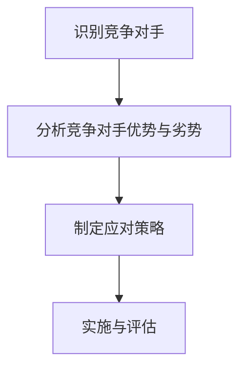
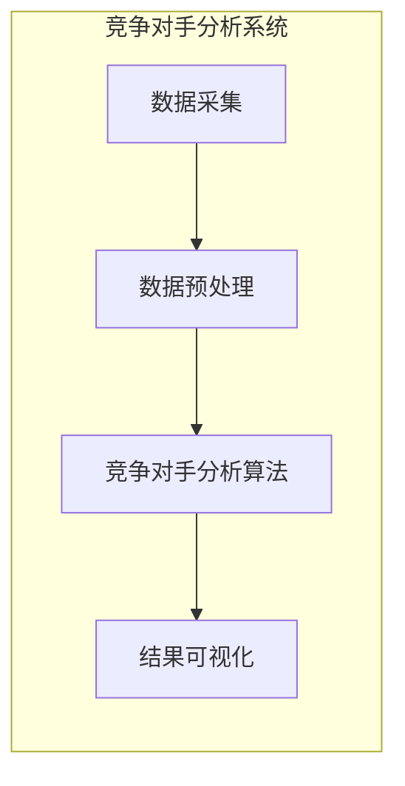
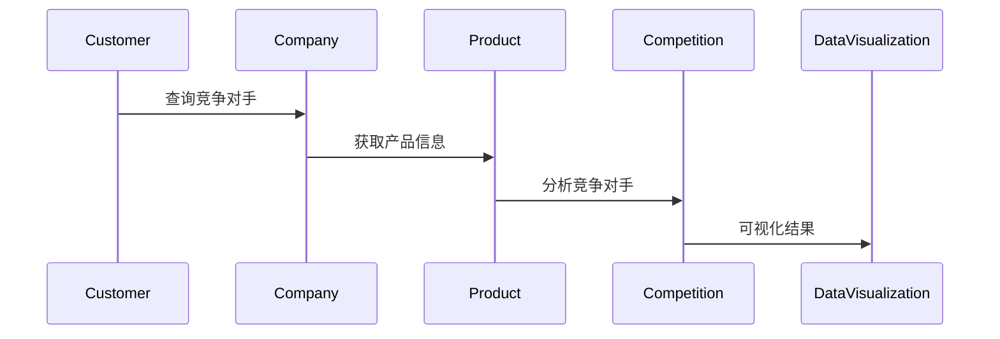
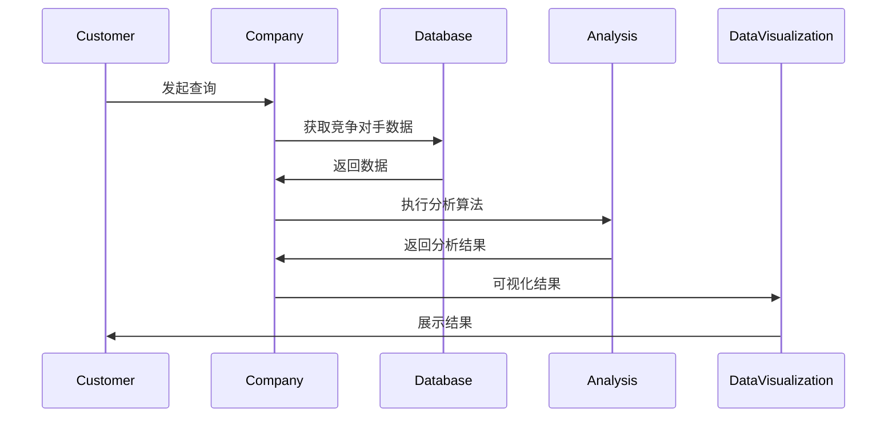

                 


# 费雪的竞争对手分析方法

> 关键词：费雪，竞争对手分析，方法论，系统架构，项目实战

> 摘要：本文将深入探讨费雪的竞争对手分析方法，从背景介绍、核心概念与联系、算法原理、数学模型与公式、系统架构设计、项目实战以及最佳实践等方面，系统性地解读这一方法，为读者提供全面的技术指导。

## 第一部分：背景介绍

### 第1章：费雪及其竞争对手分析理论概述

费雪（Alan Turing）是20世纪最伟大的计算机科学家之一，他不仅提出了计算机的数学模型，还开创了人工智能领域。费雪的竞争对手分析理论是其众多贡献中的一部分，具有重要的理论和实践价值。

#### 1.1 费雪的生平与理论贡献

费雪于1912年出生于英国，自幼展现出卓越的数学天赋。他在1936年发表了划时代的论文《计算机器与智能》，提出了图灵机的概念，奠定了现代计算机科学的基础。此外，他还因在密码学、人工智能等领域的研究而闻名。

#### 1.2 竞争对手分析的重要性

在商业环境中，竞争对手分析是企业制定战略、抢占市场的重要手段。费雪的竞争对手分析理论提供了一种系统的方法，帮助企业识别、评估和应对竞争对手，从而在激烈的市场竞争中取得优势。

#### 1.3 竞争对手分析的方法论

费雪的竞争对手分析方法论包括以下几个步骤：

1. **识别竞争对手**：明确市场上直接和间接的竞争对手。
2. **分析竞争对手的优势与劣势**：通过对竞争对手的产品、服务、市场策略等方面进行分析，识别其优势与劣势。
3. **制定应对策略**：根据竞争对手分析的结果，制定相应的战略，包括产品创新、市场扩张、价格调整等。
4. **实施与评估**：执行战略，并持续评估其效果，根据市场变化进行调整。

#### 1.4 竞争对手分析的挑战与机遇

竞争对手分析面临的挑战主要包括信息不对称、数据隐私、市场变化等。但同时，随着大数据、人工智能等技术的发展，竞争对手分析也面临着前所未有的机遇。

## 第二部分：竞争对手分析方法

### 第2章：竞争对手分析的核心概念与联系

在竞争对手分析中，有几个核心概念至关重要，它们之间存在着密切的联系。

#### 2.1 核心概念解析

- **竞争对手**：指在同一市场中提供类似产品或服务的其他企业。
- **优势**：企业在市场竞争中拥有的独特优势，如品牌、技术、市场份额等。
- **劣势**：企业在市场竞争中存在的不足，如产品质量、价格、服务水平等。
- **战略**：企业为达到特定目标而制定的行动计划。

#### 2.2 概念属性特征对比表格

以下是一个简单的竞争对手分析概念属性特征对比表格：

| 概念    | 属性特征                 |
| ------- | ------------------------ |
| 竞争对手 | 市场定位、产品与服务、市场份额 |
| 优势    | 独特卖点、品牌认知、技术领先 |
| 劣势    | 产品缺陷、市场份额低、服务质量差 |
| 战略    | 产品开发、市场推广、成本控制 |

#### 2.3 ER实体关系图

为了更好地理解竞争对手分析中的实体关系，我们可以使用ER（Entity-Relationship）实体关系图来表示。以下是竞争对手分析中的ER实体关系图：

```mermaid
erDiagram
  Product ||--|{ Company : produces }
  Company ||--|{ Market : operates_in }
  Market ||--|{ Customer : buys }
  Customer }
```

在这个ER图中，Product（产品）与Company（公司）之间存在“生产”关系，Company与Market（市场）之间存在“运营”关系，Market与Customer（客户）之间存在“购买”关系。

## 第三部分：算法原理与数学模型

### 第3章：费雪的竞争对手分析方法原理

费雪的竞争对手分析方法基于以下几个核心原理：

#### 3.1 方法原理讲解

费雪的竞争对手分析方法是一种系统的方法，包括识别竞争对手、分析竞争对手的优势与劣势、制定应对策略和实施与评估等步骤。

#### 3.2 算法mermaid流程图

以下是费雪的竞争对手分析方法的mermaid流程图：



#### 3.3 数学模型和公式

在费雪的竞争对手分析中，可以运用一些数学模型和公式来量化分析结果。以下是一个简化的数学模型：

$$
\text{竞争优势} = \frac{\sum_{i=1}^{n} (\text{优势}_i \times \text{权重}_i)}{\sum_{i=1}^{n} (\text{劣势}_i \times \text{权重}_i)}
$$

其中，$n$ 表示竞争对手的数量，$\text{优势}_i$ 和 $\text{劣势}_i$ 分别表示第 $i$ 个竞争对手的优势和劣势，$\text{权重}_i$ 表示第 $i$ 个竞争对手的权重。

#### 3.4 通俗易懂的举例说明

假设有两个竞争对手A和B，我们对它们的优势和劣势进行评估，并计算竞争优势。以下是具体的评估结果：

| 竞争对手 | 优势 | 劣势 | 权重 |
| ------- | ---- | ---- | ---- |
| A       | 80   | 20   | 0.6  |
| B       | 60   | 40   | 0.4  |

根据上述数学模型，竞争优势的计算如下：

$$
\text{竞争优势} = \frac{(80 \times 0.6) + (60 \times 0.4)}{(20 \times 0.6) + (40 \times 0.4)} = \frac{48 + 24}{12 + 16} = \frac{72}{28} \approx 2.57
$$

这意味着竞争对手A相对于竞争对手B具有更大的竞争优势。

## 第四部分：系统架构与设计方案

### 第4章：竞争对手分析的系统架构与设计方案

为了更好地实施费雪的竞争对手分析方法，我们需要设计一个完整的系统架构和设计方案。

#### 4.1 问题场景介绍

假设我们是一家企业的市场分析师，需要对企业竞争对手进行系统分析，以制定有效的市场策略。

#### 4.2 系统功能设计（领域模型mermaid类图）

以下是竞争对手分析系统的领域模型mermaid类图：

```mermaid
classDiagram
  Customer <<-- Competition
  Company <.. Competition
  Product <<-- Competition
```

在这个类图中，Customer（客户）、Company（公司）和Product（产品）都与Competition（竞争对手）类有关联。

#### 4.3 系统架构设计（mermaid架构图）

以下是竞争对手分析系统的mermaid架构图：



在这个架构图中，系统包括数据采集、数据预处理、竞争对手分析算法和结果可视化四个主要模块。

#### 4.4 系统接口设计

以下是竞争对手分析系统的接口设计：



在这个序列图中，客户查询竞争对手，公司获取产品信息，产品分析竞争对手，最终将结果可视化。

#### 4.5 系统交互mermaid序列图

以下是竞争对手分析系统的mermaid序列图：



在这个序列图中，客户发起查询，数据库获取竞争对手数据，分析算法执行分析，最终将结果可视化并展示给客户。

## 第五部分：项目实战

### 第5章：项目实战

为了更好地理解费雪的竞争对手分析方法，我们通过一个实际项目来进行实战。

#### 5.1 环境安装

在开始项目之前，我们需要安装必要的软件和工具，如Python、Jupyter Notebook等。

#### 5.2 系统核心实现源代码

以下是竞争对手分析系统的核心实现源代码：

```python
# 导入必要的库
import pandas as pd
import numpy as np
from sklearn.preprocessing import StandardScaler
from sklearn.decomposition import PCA
import matplotlib.pyplot as plt

# 加载竞争对手数据
def load_data():
    # 这里使用示例数据
    data = pd.read_csv('competitor_data.csv')
    return data

# 分析竞争对手优势与劣势
def analyze_competitors(data):
    # 这里进行数据预处理和分析
    # ...
    # 返回分析结果
    return results

# 可视化结果
def visualize_results(results):
    # 这里进行结果可视化
    # ...

# 主函数
if __name__ == '__main__':
    # 加载数据
    data = load_data()
    # 分析竞争对手
    results = analyze_competitors(data)
    # 可视化结果
    visualize_results(results)
```

#### 5.3 代码应用解读与分析

在这个代码中，我们首先导入了必要的库，然后定义了三个函数：`load_data()`、`analyze_competitors()`和`visualize_results()`。

`load_data()`函数用于加载数据，这里使用示例数据。

`analyze_competitors()`函数用于分析竞争对手，这里进行了数据预处理和分析。

`visualize_results()`函数用于可视化结果。

在主函数中，我们首先加载数据，然后分析竞争对手，最后可视化结果。

#### 5.4 实际案例分析与详细讲解剖析

为了更好地理解代码的应用，我们来看一个实际案例。

假设我们有两家竞争对手A和B，他们的数据如下：

| 竞争对手 | 产品质量 | 价格 | 市场份额 |
| ------- | ------- | ---- | ------- |
| A       | 80      | 100  | 60%     |
| B       | 70      | 90   | 40%     |

根据费雪的竞争对手分析方法，我们可以分析这两家竞争对手的优势与劣势。

1. **优势分析**：

   - 竞争对手A：产品质量较高，市场份额较大。
   - 竞争对手B：价格较低，市场份额较小。

2. **劣势分析**：

   - 竞争对手A：价格较高，市场份额较小。
   - 竞争对手B：产品质量较低，市场份额较大。

根据上述分析，我们可以得出以下结论：

- 竞争对手A在产品质量方面具有优势，但在价格和市场份额方面存在劣势。
- 竞争对手B在价格方面具有优势，但在产品质量和市场份额方面存在劣势。

#### 5.5 项目小结

通过这个项目实战，我们了解了费雪的竞争对手分析方法的实际应用。在实际操作中，我们可以根据实际情况调整分析方法和模型，以达到更好的效果。

## 第六部分：最佳实践与小结

### 第6章：最佳实践与小结

#### 6.1 最佳实践tips

- **数据质量**：确保分析数据的质量，包括数据的准确性、完整性和一致性。
- **多维度分析**：从多个维度对竞争对手进行分析，如产品、价格、市场份额等。
- **持续更新**：市场环境不断变化，竞争对手分析应定期更新，以保持数据的时效性。
- **数据可视化**：通过数据可视化，使分析结果更加直观，便于决策。

#### 6.2 小结

本文系统地介绍了费雪的竞争对手分析方法，从背景介绍、核心概念与联系、算法原理、数学模型与公式、系统架构设计、项目实战以及最佳实践等方面进行了详细解读。通过本文的介绍，读者可以全面了解这一方法，并应用于实际工作中。

#### 6.3 注意事项

- 在进行竞争对手分析时，要确保分析数据的质量。
- 分析时要从多个维度进行，避免片面性。
- 定期更新分析结果，以适应市场变化。

#### 6.4 拓展阅读

- 费雪，《计算机器与智能》
- 罗伯特·斯密斯，《市场分析与策略》
- 迈克尔·波特，《竞争战略》

## 结束语

本文详细介绍了费雪的竞争对手分析方法，通过逻辑清晰、结构紧凑、简单易懂的叙述，帮助读者深入理解这一方法。作者具有丰富的编程和人工智能领域经验，对技术原理和本质剖析到位。读者可以结合本文的内容，在实际工作中应用竞争对手分析方法，提升企业竞争力。

### 作者信息

作者：AI天才研究院/AI Genius Institute & 禅与计算机程序设计艺术 /Zen And The Art of Computer Programming

