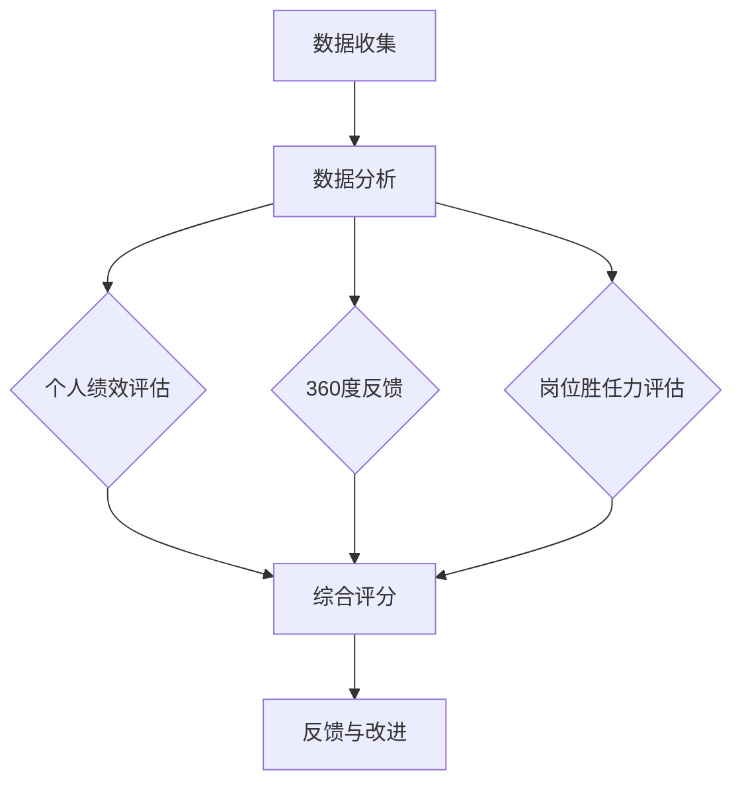
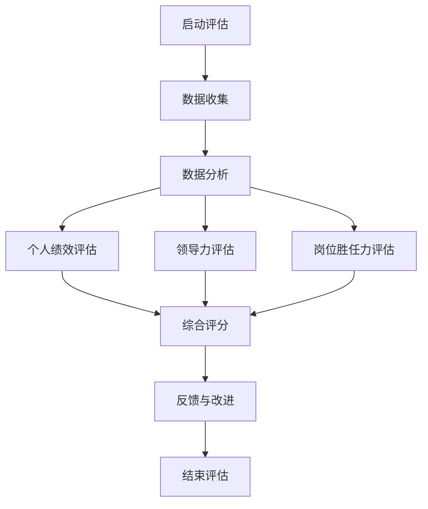

                 

### 1. 引言

在当今这个快速变化且高度竞争的商业环境中，企业的成功在很大程度上取决于其管理层的质量和决策能力。正因如此，如何评估和管理管理层成为了企业战略规划中至关重要的一环。本篇文章将以《费雪的管理层评估：优秀的公司需要优秀的领导》为主题，详细探讨如何通过科学的评估方法来识别和培养优秀的管理者，从而推动公司实现长期稳健的发展。

首先，我们需要理解为什么管理层评估是必要的。企业的管理层不仅负责日常运营，还要制定和实施长期战略，应对市场变化和竞争压力。一个优秀的管理团队能够带领公司克服困难，抓住机遇，实现可持续发展。而一个平庸甚至糟糕的管理层则可能导致企业错失良机，甚至陷入困境。

费雪，作为一位著名的企业家和投资家，他对管理层评估有着深刻的见解和实践经验。本文将结合费雪的管理哲学和理念，介绍一套系统化的管理层评估方法，帮助企业和投资者更好地识别和培养优秀的管理者。

接下来，我们将首先介绍费雪的管理哲学与理念，深入理解他对于优秀领导者的定义与特质。随后，我们将详细阐述费雪的管理层评估方法，包括评估的目的与意义、所使用的方法与工具、以及评估的流程与实施步骤。

在第二部分，我们将深入探讨管理层评估的核心概念与理论，分析管理层评估的核心概念、理论基础，并通过对比表格和Mermaid流程图来直观展示这些概念的属性特征和关系。

随后，我们将介绍管理层评估的原理与模型，从原理分析到数学模型，再到Mermaid流程图，全面解析费雪管理层评估的科学依据。

在第三部分，我们将通过实战案例和应用场景，展示如何在实际操作中应用费雪的管理层评估方法，并提供具体的分析和解读。

最后，我们将讨论管理层评估的优化与改进策略，分享最佳实践，并给出注意事项和拓展阅读，帮助读者更好地理解和应用这一方法。

通过本文的阅读，读者将能够全面了解并掌握费雪的管理层评估方法，为企业的发展和投资决策提供有力的支持。

### 1.1 问题背景与需求分析

在当前的商业环境中，企业竞争日益激烈，市场变化速度不断加快，企业能否持续发展，很大程度上取决于其管理层的质量和决策能力。优秀的管理层不仅能有效应对市场变化，抓住机遇，还能在困境中带领企业走出低谷，实现长期稳健的发展。然而，如何科学、系统地评估和管理管理层，成为一个亟待解决的重要问题。

首先，管理层的评估不仅关乎企业的短期业绩，更影响其长期战略的执行。一个优秀的管理团队能够有效地制定和实施战略规划，使企业在市场竞争中占据有利地位。相反，如果管理层的能力不足，即使企业拥有良好的商业模式和市场机会，也可能因为决策失误而错失发展良机，甚至陷入经营困境。

其次，管理层评估能够帮助识别优秀的管理者，为企业的未来发展储备人才。通过科学的评估体系，企业能够发现和培养具有潜力的管理者，使其在关键岗位上发挥最大作用，推动企业持续进步。同时，评估还可以帮助企业了解管理层的短板，提供针对性的培训和发展计划，提高整体管理水平。

再者，管理层评估对于投资者而言同样具有重要意义。投资者在评估企业投资价值时，不仅关注企业的财务表现和市场规模，还需要对管理层的质量进行评估。一个优秀的管理层能够提高企业的运营效率和竞争力，从而提升投资回报率。相反，如果管理层存在问题，投资者需要谨慎评估其投资风险，避免因管理不善而导致的投资损失。

综上所述，科学的管理层评估是确保企业长期稳健发展的关键环节，对企业和投资者都有着重要的现实意义。通过引入费雪的管理层评估方法，企业能够更加系统地识别和培养优秀的管理者，从而在激烈的市场竞争中立于不败之地。这不仅有助于提升企业的综合竞争力，还能为投资者提供更可靠的投资决策依据。

### 1.2 费雪的管理哲学与理念

费雪，作为一位著名的企业家和投资家，他的管理哲学和理念对现代企业管理产生了深远的影响。首先，费雪强调数据驱动决策。他主张管理者应基于详尽的数据分析来制定战略和决策，而不是仅凭直觉或个人偏好。他认为，数据能够提供更客观、准确的决策依据，从而避免因主观判断而导致的失误。

其次，费雪重视长期规划。他认为，企业的成功不仅仅依赖于短期利润，更需要关注长期的发展方向和战略目标。通过制定明确的长期规划，企业能够在不断变化的市场环境中保持竞争优势。费雪强调，管理者应具备远见和耐心，勇于面对短期内的困难和挑战，坚定地执行长期战略。

另外，费雪强调领导力的重要性。他认为，优秀的管理者不仅要有卓越的管理技能，还要具备领导团队、激励员工的能力。费雪认为，领导力是企业成功的关键因素之一，能够激发员工的潜力，形成强大的团队合力。他提出，管理者应树立榜样，以身作则，通过实际行动赢得员工的信任和尊重。

最后，费雪倡导创新和变革。他认为，企业要持续发展，必须具备创新精神，不断推出新的产品和服务，满足市场需求。同时，费雪认为，企业应具备应对变革的能力，及时调整战略和业务模式，以适应市场变化。他提出，管理者应具备敏捷的思维和灵活的应对策略，以应对外部环境的不确定性。

总的来说，费雪的管理哲学和理念以数据驱动、长期规划、领导力和创新为核心，为企业管理提供了系统的指导原则。通过遵循这些理念，企业能够更加科学、有效地管理管理层，推动企业实现长期稳健发展。

### 1.3 优秀领导者的定义与特质

优秀领导者是推动企业持续发展的关键力量，他们具备一系列独特的特质和能力。首先，优秀领导者应当具有卓越的战略眼光。这种眼光不仅体现在对企业未来方向的精准把握上，还体现在对市场趋势的敏锐洞察力上。一个优秀领导者能够通过深入分析和预测，制定出符合企业长期发展的战略规划，确保企业在竞争中始终保持领先地位。

其次，优秀领导者必须具备强大的执行力。执行力是战略实施过程中不可或缺的一部分，优秀领导者能够将战略目标转化为具体行动，并确保这些行动得到有效执行。他们具备推动项目进度、协调各部门合作的能力，能够在关键时刻做出快速决策，确保企业战略的顺利实施。

再者，优秀领导者具备出色的沟通能力和团队合作精神。他们能够清晰、准确地传达战略目标和工作要求，促进团队内部的沟通与协作。同时，他们懂得倾听团队成员的意见和建议，调动团队的积极性和创造力。在一个优秀的领导者带领下，团队成员能够形成强大的合力，共同实现企业的目标。

此外，优秀领导者还具备高度的诚信和责任感。他们以身作则，树立良好的榜样，赢得员工的信任和尊重。他们具备强烈的责任感，对企业的成功和员工的福祉负责。在面对困难和挑战时，优秀领导者能够保持坚定的信念，激励团队成员共同克服困难，实现企业的长期目标。

最后，优秀领导者具备不断学习和自我提升的能力。他们意识到知识和技能的不断更新是企业保持竞争力的关键。因此，他们会积极学习新的管理理念和技能，提升自己的领导力水平，以适应不断变化的市场环境。

总的来说，一个优秀领导者不仅需要具备战略眼光、执行力、沟通能力和团队合作精神，还需要具备诚信、责任感以及不断学习和自我提升的能力。通过这些特质和能力的综合体现，优秀领导者能够有效推动企业实现长期稳健发展。

### 2. 费雪的管理层评估方法概述

费雪的管理层评估方法以其科学性和系统化而著称，旨在全面、客观地评估管理层的质量与效能。首先，我们需要明确评估的目的与意义。管理层评估的目的在于识别管理层的优势与短板，从而为企业提供优化管理层结构、提升管理效能的依据。通过科学评估，企业能够更好地制定人才发展计划，提升整体管理水平，确保企业战略目标的顺利实现。

接下来，我们来看一下费雪所使用的方法与工具。费雪的管理层评估方法主要包括以下几个步骤：

**1. 数据收集与分析：** 费雪强调数据驱动决策，因此评估过程首先依赖于详尽的数据收集。这些数据包括企业的财务报表、市场表现、员工满意度调查等。通过对这些数据的深入分析，可以全面了解管理层的运营效果和团队表现。

**2. 个人绩效评估：** 费雪认为，个人绩效是评估管理层的重要指标。通过设定明确的绩效指标和目标，对管理者的工作成果进行量化评估。这一步骤不仅关注管理者的短期业绩，更重视其对长期战略目标的贡献。

**3. 领导力评估：** 费雪重视领导力在企业成功中的作用，因此领导力评估是管理层评估的重要组成部分。评估内容包括领导风格、团队合作能力、激励员工的能力等。通过360度反馈，收集来自上级、下属和同事的评价，全面评估管理者的领导力水平。

**4. 岗位胜任力评估：** 费雪认为，管理者不仅需要具备领导力，还需要具备岗位胜任力。这一步骤通过能力测试、案例分析等方式，评估管理者在特定岗位上的专业能力和适应能力。

**5. 综合评分与反馈：** 将上述各个评估结果进行综合评分，形成对管理层的全面评估报告。同时，提供个性化的反馈和建议，帮助管理者了解自身的优势和不足，制定改进计划。

接下来，我们将详细探讨费雪的管理层评估流程与实施步骤。首先，企业需要成立评估小组，明确评估目标与标准。然后，进行数据收集与分析，确保评估数据真实、准确。在个人绩效评估、领导力评估和岗位胜任力评估阶段，企业应采用多种评估方法，确保评估结果的全面性和客观性。最后，通过综合评分与反馈，提供针对性的改进建议，帮助企业优化管理层结构。

通过费雪的管理层评估方法，企业能够更加科学、系统地进行管理层评估，从而提升整体管理效能，推动企业的长期稳健发展。

### 2.1 评估目的与意义

费雪的管理层评估方法具有明确的评估目的和深远的现实意义。首先，评估的目的是为了识别和培养优秀的管理者，确保企业的管理层具备卓越的决策能力和执行力。通过系统化的评估，企业能够准确了解管理层的实际表现和潜力，从而为优化管理层结构提供有力依据。这不仅有助于提升企业的整体管理效能，还能确保企业战略目标的顺利实现。

其次，管理层评估在优化企业管理流程中发挥着关键作用。通过评估，企业能够发现管理中的瓶颈和短板，从而制定针对性的改进措施。例如，通过分析个人绩效评估结果，企业可以识别出哪些管理者的绩效不佳，并制定相应的培训和发展计划，提高其工作能力。同时，领导力评估和岗位胜任力评估能够帮助企业了解管理者的领导风格和专业能力，为合理配置人才提供参考。

此外，管理层评估对提升企业竞争力具有重要意义。在一个充满竞争的市场环境中，优秀的管理团队是企业持续发展的核心动力。通过科学评估，企业能够选拔出具有潜力和能力的管理者，培养一支高效、专业的管理团队，从而在市场竞争中占据优势地位。同时，管理层评估还能够激励员工，提升整体士气和工作效率，推动企业实现更高的业绩目标。

最后，管理层评估为投资者提供了重要的决策参考。投资者在评估企业投资价值时，不仅关注企业的财务状况和市场份额，还会对管理层的质量进行综合评估。一个优秀的管理层能够提高企业的运营效率和竞争力，从而提升投资回报率。相反，如果管理层存在问题，投资者需要谨慎评估其投资风险。通过管理层评估，投资者能够更全面地了解企业的管理状况，做出更为明智的投资决策。

总的来说，费雪的管理层评估方法具有明确的评估目的和重要的现实意义。它不仅有助于提升企业的管理效能和竞争力，还能为投资者提供可靠的决策依据，为企业的长期稳健发展奠定坚实基础。

### 2.2 评估方法与工具

在费雪的管理层评估方法中，评估方法与工具的选择至关重要，它们共同构成了评估体系的科学性和全面性。以下是费雪所使用的主要评估方法与工具：

**1. 数据分析法：** 费雪强调基于数据的决策，因此数据分析法是评估的基础。该方法通过收集和整理企业的财务报表、市场表现、员工满意度调查等数据，运用统计分析方法对管理层的工作绩效进行量化评估。数据分析法的优势在于其客观性和全面性，能够提供准确的评估依据。

**2. 个人绩效评估：** 个人绩效评估是评估管理层的重要指标。费雪采用KPI（关键绩效指标）体系，设定具体的绩效目标和指标，对管理者的工作成果进行量化评估。这一方法有助于明确管理者的工作重点和目标，提高工作效率和绩效。

**3. 领导力评估：** 领导力是衡量优秀管理者的重要标准之一。费雪采用360度反馈方法，通过上级、下属和同事的评价，全面评估管理者的领导风格、团队合作能力和激励员工的能力。360度反馈方法的优势在于其多维度评估，能够提供全面的领导力分析。

**4. 岗位胜任力评估：** 费雪重视管理者的岗位胜任力，采用能力测试、案例分析等方式，评估管理者在特定岗位上的专业能力和适应能力。这一方法有助于识别管理者的优势和短板，为人才培养和岗位调整提供依据。

**5. 行为观察法：** 费雪认为，管理者的实际行为是评估其能力的重要指标。通过实地观察、现场记录等方式，对管理者的工作表现进行评估。行为观察法能够提供直观、真实的评估数据，有助于全面了解管理者的实际工作情况。

**6. 评估工具：** 费雪的管理层评估还使用了多种评估工具，如绩效评估表、领导力问卷、胜任力测试等。这些工具能够系统化、标准化地收集评估数据，提高评估过程的效率和准确性。

总的来说，费雪的管理层评估方法与工具科学、全面，通过多种评估方法和工具的有机结合，能够全面、客观地评估管理层的质量和效能，为企业的管理优化和人才发展提供有力支持。

### 2.3 评估流程与实施步骤

在费雪的管理层评估方法中，评估流程的合理设计与实施步骤的精细安排是确保评估结果科学、准确的关键。以下详细描述费雪管理层评估的完整流程与实施步骤：

**1. 制定评估计划：** 首先，企业需要成立评估小组，明确评估的目标和标准。评估小组应由人力资源部门、财务部门和其他相关职能部门的代表组成，确保评估过程的全面性和客观性。在制定评估计划时，需要明确评估的时间范围、评估指标和评估方法。

**2. 数据收集：** 接下来是数据收集阶段。企业应收集与管理层绩效相关的多种数据，包括财务报表、市场表现、员工满意度调查等。数据来源应多样化，以确保评估数据的全面性和准确性。数据收集过程中，企业需要确保数据的真实性和可靠性，避免人为干扰。

**3. 个人绩效评估：** 在数据收集完成后，进行个人绩效评估。企业应采用KPI（关键绩效指标）体系，设定具体的绩效目标和指标，对管理者的工作成果进行量化评估。评估过程中，应关注管理者的工作表现、项目完成情况和团队协作效果等。

**4. 领导力评估：** 费雪认为，领导力是评估管理层的重要标准之一。通过360度反馈方法，收集上级、下属和同事对管理者的评价，全面评估管理者的领导风格、团队合作能力和激励员工的能力。360度反馈方法有助于提供多维度的评估数据，确保评估结果的全面性。

**5. 岗位胜任力评估：** 在个人绩效评估和领导力评估的基础上，进行岗位胜任力评估。通过能力测试、案例分析等方式，评估管理者在特定岗位上的专业能力和适应能力。这一步骤有助于识别管理者的优势和短板，为人才培养和岗位调整提供依据。

**6. 数据分析与综合评分：** 将上述评估结果进行综合评分，形成对管理层的全面评估报告。数据分析过程应采用科学的统计方法，确保评估结果的准确性和公正性。综合评分后，应将评估结果分类整理，为后续的管理优化提供依据。

**7. 反馈与改进：** 最后，企业应向管理层提供评估结果和反馈。通过一对一的反馈会议，向管理者详细解释评估结果，并提供改进建议。管理层应根据反馈结果，制定具体的改进计划，提升个人和团队的能力。

**8. 跟踪与持续改进：** 评估过程不是一次性的，而是一个持续改进的过程。企业应定期对管理层进行评估，跟踪改进计划的执行情况，确保评估目标的实现。通过持续改进，不断提升管理层的质量和效能，为企业的发展提供有力支持。

总的来说，费雪的管理层评估流程科学、系统，通过明确的实施步骤和科学的方法，能够全面、客观地评估管理层的质量与效能，为企业的管理优化和人才发展提供有力支持。

### 3. 核心概念与联系

在费雪的管理层评估方法中，核心概念是理解和应用这一评估体系的基础。以下将详细阐述核心概念的定义及其相互关系。

**3.1 数据驱动决策**

**定义**：数据驱动决策是指通过收集和分析数据来指导管理决策的过程。这种方法强调使用准确、全面的数据作为决策依据，而不是依赖于直觉或主观判断。

**关系**：数据驱动决策是费雪管理层评估的核心，贯穿于整个评估过程。数据收集与分析阶段为评估提供了基础，而评估结果又通过数据反馈给管理层，指导其决策改进。

**3.2 个人绩效评估**

**定义**：个人绩效评估是对管理层个人工作表现和成果的量化评估。它通过设定具体的绩效指标和目标，对管理者的工作成果进行评估。

**关系**：个人绩效评估是管理层评估的重要组成部分，与数据驱动决策紧密相关。绩效评估结果不仅反映了管理者的工作表现，还为数据分析和综合评分提供了重要依据。

**3.3 360度反馈**

**定义**：360度反馈是一种多维度的评估方法，通过收集上级、下属和同事对管理者的评价，全面评估管理者的领导风格、团队合作能力和激励员工的能力。

**关系**：360度反馈是领导力评估的核心，有助于识别管理者的优缺点，为个人绩效评估提供补充。它通过多角度的评价，提供更加全面和客观的评估数据。

**3.4 岗位胜任力评估**

**定义**：岗位胜任力评估是对管理者在特定岗位上所需的专业能力和适应能力的评估。通过能力测试和案例分析，评估管理者在岗位上的胜任程度。

**关系**：岗位胜任力评估与个人绩效评估和领导力评估相辅相成，它关注管理者的实际工作能力和岗位适应性，为综合评估提供重要依据。

**3.5 综合评分与反馈**

**定义**：综合评分是对管理者评估结果的整体评估，通过将各个评估模块的结果进行综合，形成对管理层的全面评估报告。

**关系**：综合评分与反馈是评估流程的最终步骤，它汇总了个人绩效评估、领导力评估和岗位胜任力评估的结果，为管理层的改进提供具体方向。

通过以上核心概念的详细定义和相互关系分析，我们可以看到，费雪的管理层评估方法是一个系统化、综合性的评估体系，每个核心概念都相互关联，共同构成了评估的完整框架。

### 3.2 管理层评估的理论基础

费雪的管理层评估方法有着坚实的理论基础，这些理论不仅为评估方法的科学性和有效性提供了支持，还帮助解释了评估过程中各要素之间的关系。以下是管理层评估所依赖的主要理论基础：

**1. 杰克·韦尔奇的管理变革理论**

杰克·韦尔奇是通用电气的前CEO，他的管理变革理论对现代企业管理产生了深远影响。韦尔奇提出，企业要实现持续成功，必须具备创新精神和敏捷反应能力。这一理论强调管理层必须具备前瞻性和变革能力，以应对快速变化的市场环境。费雪的管理层评估方法借鉴了这一理论，强调通过科学评估识别和培养具有创新精神和变革能力的管理者。

**2. 彼得·德鲁克的目标管理理论**

彼得·德鲁克的目标管理理论认为，目标设定是管理过程的关键环节。通过明确的目标设定，管理者能够更有针对性地制定工作计划，提高工作效率和绩效。费雪的管理层评估方法中的个人绩效评估环节，正是基于这一理论，通过设定具体的绩效目标和指标，对管理者的工作成果进行量化评估，从而实现目标管理。

**3. 马克·麦科马克的360度反馈理论**

马克·麦科马克提出了360度反馈理论，该方法通过多角度收集来自上级、下属和同事的评价，全面评估管理者的领导能力和团队合作能力。费雪的管理层评估方法中的领导力评估环节，采用了这一理论，通过360度反馈方法，获取多维度的评估数据，以确保评估结果的全面性和客观性。

**4. 戴维·尤里奇的胜任力模型**

戴维·尤里奇提出了胜任力模型，该模型认为，胜任力包括知识、技能、态度和行为等多个方面，是衡量员工能力的重要标准。费雪的管理层评估方法中的岗位胜任力评估环节，基于这一模型，通过能力测试和案例分析等方式，评估管理者在特定岗位上的专业能力和适应能力，从而确保评估结果的科学性和实用性。

**5. 彼得·圣吉的学习型组织理论**

彼得·圣吉提出了学习型组织理论，认为一个组织要实现持续发展，必须建立学习型组织文化。这一理论强调，组织成员应不断学习、分享知识和经验，以提高组织的整体能力和竞争力。费雪的管理层评估方法中的反馈与改进环节，借鉴了这一理论，通过持续反馈和改进，帮助管理层不断学习和提升，从而推动企业的发展。

通过以上理论基础的分析，我们可以看到，费雪的管理层评估方法不仅具有坚实的理论支持，还能够有效指导企业的管理层评估实践，确保评估结果的科学性和实用性。

### 3.3 核心概念属性特征对比表格

为了更直观地理解费雪的管理层评估方法中的核心概念，我们通过一个对比表格来展示这些概念的属性特征。

| 核心概念 | 定义 | 主要属性特征 | 关联关系 |
| :---: | :---: | :---: | :---: |
| 数据驱动决策 | 通过收集和分析数据指导管理决策 | 数据准确、全面、客观 | 基础和核心 |
| 个人绩效评估 | 量化评估管理者的工作成果 | 目标明确、指标具体、可量化 | 数据驱动 |
| 360度反馈 | 多角度评估管理者的领导能力 | 多元评价、全面客观、多维反馈 | 数据补充 |
| 岗位胜任力评估 | 评估管理者在特定岗位上的专业能力 | 能力测试、案例分析、岗位适应 | 能力评价 |
| 综合评分与反馈 | 整合各评估结果，提供改进建议 | 结果综合、反馈具体、持续改进 | 反馈与改进 |

这个表格清晰地展示了费雪管理层评估方法中各核心概念的定义、主要属性特征及其相互之间的关联关系。通过这种系统化的对比，我们可以更全面地理解和应用这些核心概念，从而提高管理层评估的科学性和有效性。

### 3.4 管理层评估原理与模型

在费雪的管理层评估方法中，评估原理与模型是确保评估过程科学性和准确性的关键。以下我们将详细探讨费雪管理层评估的原理，并介绍其数学模型和Mermaid流程图。

#### 3.4.1 管理层评估原理

费雪的管理层评估基于以下几个核心原理：

**1. 数据驱动：** 评估过程以详尽的数据分析为基础，确保评估结果的客观性和准确性。通过收集和分析财务数据、市场表现、员工满意度等数据，评估能够反映管理层的实际工作效果。

**2. 多维度评估：** 费雪的管理层评估不仅关注个人绩效，还涵盖领导力、岗位胜任力等多个方面。这种多维度评估方法能够提供全面的评估结果，帮助识别管理者的优势与不足。

**3. 综合评分：** 通过综合各个评估模块的结果，形成对管理层的整体评估报告。这种综合评分方法能够确保评估结果的全面性和公正性，为管理层提供具体改进方向。

**4. 持续改进：** 评估过程是一个持续反馈和改进的过程。通过定期评估和持续反馈，管理层能够不断学习和提升，以适应企业发展的需要。

#### 3.4.2 数学模型

为了量化评估结果，费雪的管理层评估方法引入了数学模型。以下是一个简化的数学模型：

$$
E = w_1 \cdot P + w_2 \cdot L + w_3 \cdot C + w_4 \cdot R
$$

其中，$E$ 表示管理层评估得分，$w_1, w_2, w_3, w_4$ 分别是权重系数，$P, L, C, R$ 分别代表个人绩效、领导力、岗位胜任力和综合评分。

权重系数可以根据企业的具体情况调整，但通常情况下，个人绩效和领导力是评估的重点，因此它们的权重较大。

#### 3.4.3 Mermaid流程图

为了更直观地展示管理层评估的流程，我们使用Mermaid绘制了一个流程图：

这个流程图展示了从数据收集到综合评分，再到反馈与改进的完整评估过程。每个节点代表一个评估环节，箭头表示流程的顺序。

通过上述数学模型和Mermaid流程图，我们可以清楚地看到费雪管理层评估的科学原理和实施过程。这种系统化的评估方法不仅确保了评估结果的准确性和全面性，还为管理层提供了具体的改进方向，从而推动企业的持续发展。

### 4. 管理层评估原理与模型分析

为了深入理解费雪的管理层评估原理与模型，我们需要从评估原理的详细分析开始，并逐步解释数学模型的具体构成和计算方法。

#### 4.1 管理层评估原理的详细分析

费雪的管理层评估原理主要基于以下几个核心原则：

**1. 数据驱动：** 数据是评估的基础，费雪的方法强调通过详尽的数据收集和分析来指导管理层评估。数据来源包括企业的财务报表、市场表现、员工满意度调查等，通过统计分析方法，将这些数据转化为评估的客观依据。

**2. 多维度评估：** 费雪的管理层评估不仅关注管理者的个人绩效，还涵盖领导力、岗位胜任力等多个方面。这种多维度评估方法能够全面反映管理者的能力和表现，从而提供更为准确的评估结果。

**3. 综合评分：** 通过综合各个评估模块的结果，形成对管理层的整体评估报告。这种方法确保了评估结果的全面性和公正性，帮助管理层了解自身的综合表现。

**4. 持续改进：** 评估过程是一个持续反馈和改进的过程。通过定期评估和持续反馈，管理层能够不断学习和提升，以适应企业发展的需要。

**5. 客观性与透明度：** 费雪的管理层评估方法强调评估过程的客观性和透明度，确保评估结果不受主观因素影响，为管理层提供可靠的信息支持。

#### 4.2 数学模型的具体构成和计算方法

费雪的管理层评估数学模型可以表示为：

$$
E = w_1 \cdot P + w_2 \cdot L + w_3 \cdot C + w_4 \cdot R
$$

其中：
- $E$ 表示管理层评估得分。
- $w_1, w_2, w_3, w_4$ 分别是各评估维度的权重系数，通常根据企业具体情况调整，但个人绩效和领导力往往具有较大的权重。
- $P$ 表示个人绩效得分，通过设定具体的绩效目标和指标进行量化评估。
- $L$ 表示领导力得分，通过360度反馈方法收集评价结果，量化评估管理者的领导能力。
- $C$ 表示岗位胜任力得分，通过能力测试和案例分析等方式评估管理者在特定岗位上的专业能力和适应能力。
- $R$ 表示综合评分得分，将上述评估结果进行综合评分，形成最终的管理层评估得分。

权重系数的选择是数学模型的关键部分。通常，企业会根据自身的战略目标和组织特点，确定各维度的权重。例如，如果企业强调短期绩效，个人绩效的权重可能较高；而如果企业注重长期发展和创新能力，领导力的权重可能更大。

#### 4.3 算法原理的举例说明

为了更清晰地理解费雪的管理层评估数学模型，我们可以通过一个简化的例子进行说明：

假设某企业的管理层评估模型权重系数为：个人绩效（60%）、领导力（25%）、岗位胜任力（10%）、综合评分（5%）。

- 个人绩效得分 $P = 85$。
- 领导力得分 $L = 90$。
- 岗位胜任力得分 $C = 80$。
- 综合评分得分 $R = 70$。

将这些得分代入数学模型：

$$
E = 0.6 \cdot 85 + 0.25 \cdot 90 + 0.1 \cdot 80 + 0.05 \cdot 70
$$

计算过程如下：

$$
E = 0.6 \cdot 85 + 0.25 \cdot 90 + 0.1 \cdot 80 + 0.05 \cdot 70
$$
$$
E = 51 + 22.5 + 8 + 3.5
$$
$$
E = 86
$$

因此，该管理层的最终评估得分为86分。这个得分可以用来衡量管理层的整体表现，并为后续的管理优化提供参考。

通过上述详细的原理分析和举例说明，我们可以看到费雪的管理层评估方法不仅具有坚实的理论基础，还通过科学的数学模型和具体的计算方法，确保了评估结果的准确性和实用性。

### 4.3 管理层评估的Mermaid流程图

为了直观地展示费雪的管理层评估流程，我们使用Mermaid绘制了一个详细的流程图，以帮助读者更好地理解评估步骤和各个环节之间的逻辑关系。

下面是对流程图中的各个节点的详细解释：

**A[启动评估]：** 评估流程的开始，企业或组织确定评估的目标和范围，并成立评估小组。

**B[数据收集]：** 收集与管理层绩效相关的数据，包括财务报表、市场表现、员工满意度调查等。

**C[数据分析]：** 对收集到的数据进行分析，识别关键绩效指标和趋势，为后续评估提供基础。

**D[个人绩效评估]：** 基于KPI体系，量化评估管理者的个人工作成果。

**E[领导力评估]：** 通过360度反馈，评估管理者的领导能力和团队合作能力。

**F[岗位胜任力评估]：** 通过能力测试和案例分析，评估管理者在特定岗位上的胜任力。

**G[综合评分]：** 将个人绩效评估、领导力评估和岗位胜任力评估的结果进行综合评分，形成整体评估报告。

**H[反馈与改进]：** 根据评估结果，向管理层提供反馈，并制定改进计划。

**I[结束评估]：** 评估流程的结束，记录评估结果，并跟踪改进计划的执行情况。

通过这个Mermaid流程图，我们可以清晰地看到管理层评估的各个步骤及其相互关系，从而更好地理解评估过程的逻辑和执行步骤。

### 5. 管理层评估实战案例分析

为了更好地理解费雪的管理层评估方法在实际操作中的应用，我们将通过一个真实的案例分析，展示整个评估过程，并详细解读评估结果。

**案例背景介绍：** 
该案例是一家快速成长的科技企业，该公司在过去几年中经历了高速扩张，但同时也面临管理瓶颈和人才短缺的问题。公司高层决定通过费雪的管理层评估方法，全面评估现有管理团队，以识别优势和短板，并制定改进计划。

**管理层评估实施过程：**
1. **启动评估**：公司成立了由人力资源部、财务部和技术部门组成的评估小组，明确了评估的目标和范围，包括评估管理层的个人绩效、领导力和岗位胜任力。

2. **数据收集**：评估小组收集了公司近三年的财务报表、市场表现数据、员工满意度调查问卷以及各管理层的项目报告。同时，通过内部访谈和调查，获取了管理层日常工作表现的详细信息。

3. **数据分析**：对收集到的数据进行了系统化分析，识别出关键绩效指标，如项目完成率、市场拓展进度、员工离职率等。通过数据分析，评估小组初步确定了需要重点关注的评估维度。

4. **个人绩效评估**：根据关键绩效指标，评估小组对每位管理者的工作成果进行了量化评估。例如，项目经理的评估重点包括项目进度、预算控制和质量保证，评估结果显示，部分项目出现了进度延误和预算超支。

5. **领导力评估**：通过360度反馈方法，评估小组收集了管理层在领导力方面的评价，包括上级、下属和同事的评价。评估结果显示，部分管理者在激励员工和团队协作方面存在不足。

6. **岗位胜任力评估**：评估小组通过能力测试和案例分析，评估了管理者在特定岗位上的专业能力和适应能力。结果显示，一些管理者在技术能力和市场敏感度方面存在差距。

7. **综合评分**：将个人绩效评估、领导力评估和岗位胜任力评估的结果进行综合评分，形成了一份详细的管理层评估报告。

8. **反馈与改进**：评估小组向管理层提供了详细的反馈，包括评估结果和建议。管理层根据反馈结果，制定了具体的改进计划，如加强项目管理培训、提高领导力培训、优化岗位配置等。

**评估结果分析与解读：**
1. **个人绩效评估**：通过数据驱动的方式，评估结果显示部分项目出现了进度延误和预算超支，需要加强项目管理和预算控制。管理层决定加强对项目经理的培训和监督，确保项目顺利推进。

2. **领导力评估**：评估结果显示，部分管理者在激励员工和团队协作方面存在不足。管理层决定开展领导力培训，提高管理者的激励能力和团队合作能力，从而提升整体团队绩效。

3. **岗位胜任力评估**：通过能力测试和案例分析，评估结果显示一些管理者在技术能力和市场敏感度方面存在差距。管理层决定通过引进外部专家和内部培训，提升管理者的专业能力。

4. **综合评分**：综合评估结果，管理层得到了一份详细的管理层评估报告，这不仅帮助管理层了解自身的优势和短板，还为未来的改进提供了具体方向。

通过这个实战案例分析，我们可以看到费雪的管理层评估方法在实际操作中的应用效果。通过科学、系统的评估过程，企业能够全面识别管理层的优势和不足，为管理优化和人才发展提供有力支持，从而推动企业的长期稳健发展。

### 6. 管理层评估在企业管理中的应用

管理层评估在企业管理中具有广泛的应用，其不仅帮助企业识别和培养优秀的管理者，还能优化管理流程、提高整体运营效率。以下是管理层评估在企业管理中的一些具体应用：

**6.1 管理层评估在战略规划中的应用**

战略规划是企业发展的核心，而管理层的评估结果能够为战略规划提供重要的参考。通过科学的管理层评估，企业可以识别出在战略实施过程中表现突出的管理者，同时发现管理层的短板。例如，如果评估结果显示某位管理者在市场拓展方面表现优异，企业可以将更多的资源投入到该管理者的项目中，从而加快市场拓展速度。另一方面，如果评估结果显示某位管理者的战略执行力不足，企业可以及时调整战略，或为该管理者提供针对性的培训和发展计划。

**6.2 管理层评估在绩效管理中的应用**

绩效管理是企业管理的重要环节，而管理层评估是绩效管理的重要组成部分。通过定期进行管理层评估，企业可以全面了解管理层的绩效表现，从而制定合理的绩效目标和考核标准。例如，企业可以根据管理层评估结果，设定具体的绩效指标，如项目完成率、员工满意度、市场占有率等。同时，管理层评估还能帮助识别绩效不佳的管理者，为绩效改进提供具体方向。通过有效的绩效管理，企业能够激发管理层的积极性和创造力，提高整体绩效。

**6.3 管理层评估在人才选拔中的应用**

人才是企业发展的关键资源，而管理层评估能够帮助企业更好地进行人才选拔。通过科学、系统的管理层评估，企业可以全面了解候选人的管理能力、领导力和岗位胜任力。例如，在选拔高层管理者时，企业可以通过对候选人的领导力评估，了解其在团队管理、决策能力和创新方面的表现。同时，企业还可以结合个人绩效评估和岗位胜任力评估，为候选人提供具体的改进建议，从而提升其管理能力。通过科学的人才选拔，企业能够吸引和保留优秀人才，为企业的长期发展提供有力支持。

**6.4 管理层评估在组织发展中的应用**

组织发展是企业发展的重要组成部分，而管理层评估能够为组织发展提供重要的依据。通过定期进行管理层评估，企业可以了解管理层的组织能力和领导力，从而优化组织结构，提升整体运营效率。例如，如果评估结果显示企业在某个领域的管理水平较低，企业可以通过调整组织结构，增加对该领域的关注和投入。同时，管理层评估还能帮助企业识别和培养潜在的领导者，为未来的组织发展储备人才。通过有效的组织发展，企业能够更好地适应市场变化，保持竞争优势。

总的来说，管理层评估在企业管理中的应用具有广泛性和重要性。通过科学的管理层评估，企业能够优化战略规划、提高绩效管理、选拔优秀人才，推动企业的长期稳健发展。

### 7. 管理层评估的优化策略

为了进一步提升管理层评估的科学性和有效性，企业在实施评估过程中可以采用多种优化策略。以下是一些具体的优化方法：

**7.1 评估方法的优化**

首先，企业应不断探索和引入新的评估方法，以增强评估的全面性和客观性。例如，可以引入基于人工智能的数据分析工具，对评估数据进行深度挖掘，提供更为精准的评估结果。此外，企业还可以结合定性分析和定量分析，将员工的绩效表现、领导力评估和岗位胜任力评估相结合，形成综合评估体系，提高评估结果的准确性。

**7.2 评估流程的改进**

其次，企业应优化评估流程，确保评估过程的效率和质量。例如，可以制定标准化评估流程，明确各评估环节的时间节点和责任主体，避免评估过程中的拖延和重复工作。同时，企业还可以采用数字化工具，如在线评估系统，简化评估数据的收集和分析过程，提高评估流程的透明度和便捷性。

**7.3 评估结果的反馈机制**

为了确保评估结果的反馈效果，企业应建立完善的反馈机制。首先，评估小组应及时将评估结果反馈给管理层，并提供详细的改进建议。其次，企业可以定期组织反馈会议，听取管理层的意见和建议，不断优化评估方法。此外，企业还可以通过内部培训、工作坊等形式，帮助管理层理解评估结果，并制定具体的改进计划。

**7.4 综合评分的合理性**

在综合评分过程中，企业应确保评分的合理性和公正性。首先，应明确各评估维度的权重，并根据企业实际情况进行调整。其次，评估小组应确保评分过程的透明度和客观性，避免主观偏见。此外，企业还可以引入第三方评估机构，对评估结果进行独立验证，确保评分的公正性和准确性。

通过这些优化策略，企业能够不断提升管理层评估的科学性和有效性，为企业的管理和人才发展提供有力支持。

### 8. 管理层评估的最佳实践

为了更好地理解和应用费雪的管理层评估方法，以下分享几个最佳实践案例，并通过具体的实例进行详细讲解，帮助读者深入理解评估过程及其应用效果。

**最佳实践案例一：科技公司的管理层评估优化**

**案例背景：** 一家高科技公司希望在快速变化的市场环境中保持竞争力，因此决定通过费雪的管理层评估方法，全面评估现有管理团队，并优化管理层结构。

**评估过程：**
1. **启动评估**：公司成立了由人力资源部、财务部和技术部门组成的评估小组，明确了评估的目标和范围，包括管理层的个人绩效、领导力和岗位胜任力。
2. **数据收集**：评估小组收集了公司过去三年的财务报表、市场表现数据、员工满意度调查问卷以及各管理层的项目报告。
3. **数据分析**：通过对收集到的数据进行分析，评估小组识别出关键绩效指标，如项目完成率、市场拓展进度和员工离职率。
4. **个人绩效评估**：根据关键绩效指标，评估小组对每位管理者的工作成果进行了量化评估，发现部分项目经理在项目管理和预算控制方面存在问题。
5. **领导力评估**：通过360度反馈方法，评估小组收集了管理层在领导力方面的评价，发现部分管理者在激励员工和团队协作方面存在不足。
6. **岗位胜任力评估**：通过能力测试和案例分析，评估小组评估了管理者在特定岗位上的专业能力和适应能力，发现一些管理者的技术能力和市场敏感度不足。
7. **综合评分**：综合评估结果，评估小组形成了一份详细的管理层评估报告，并提供了具体的改进建议。

**最佳实践分享**：
- **数据驱动**：通过详尽的数据分析，确保评估结果的客观性和准确性，为管理层的改进提供可靠依据。
- **多维度评估**：结合个人绩效评估、领导力评估和岗位胜任力评估，全面反映管理层的综合能力，提升评估的全面性和深度。

**实例讲解**：
假设某项目经理A的评估结果如下：
- **项目完成率**：90%
- **预算控制**：85%
- **团队协作**：80%

通过综合评分模型，项目经理A的最终评估得分为：

$$
E = 0.6 \cdot 90 + 0.25 \cdot 85 + 0.1 \cdot 80 + 0.05 \cdot 75 = 89
$$

评估结果显示，项目经理A的整体表现良好，但在预算控制和团队协作方面还有提升空间。管理层可以据此制定针对性的培训和发展计划，提升项目经理的技能和团队管理能力。

**最佳实践案例二：零售企业的领导力提升**

**案例背景：** 一家大型零售企业希望在激烈的竞争中提升市场占有率，因此决定通过费雪的管理层评估方法，特别是领导力评估，提升管理团队的领导能力。

**评估过程：**
1. **启动评估**：企业成立了评估小组，明确领导力评估的目标，包括管理者的决策能力、激励能力和团队协作能力。
2. **数据收集**：评估小组通过员工满意度调查、360度反馈和领导力问卷，收集了管理层在领导力方面的评价数据。
3. **领导力评估**：评估小组根据收集到的数据，对管理者的领导力进行了全面评估，发现部分管理者在激励员工和决策能力方面存在不足。
4. **综合评分**：综合评估结果，评估小组形成了一份领导力评估报告，并提出了改进建议。

**最佳实践分享**：
- **360度反馈**：通过多角度收集评价数据，确保领导力评估的全面性和客观性，为管理者的领导力提升提供具体方向。
- **针对性培训**：根据评估结果，为管理者提供针对性的领导力培训，提升其激励能力和决策水平。

**实例讲解**：
假设某零售企业部门经理B的领导力评估结果如下：
- **员工满意度**：80%
- **决策能力**：75%
- **团队协作**：85%

通过综合评分模型，经理B的最终评估得分为：

$$
E = 0.6 \cdot 80 + 0.25 \cdot 75 + 0.15 \cdot 85 = 78
$$

评估结果显示，经理B的领导力整体表现良好，但在决策能力和员工满意度方面有待提升。管理层可以根据评估结果，为其提供定制化的领导力培训，特别是加强决策能力和员工激励方面的技能。

通过以上最佳实践案例，我们可以看到费雪的管理层评估方法在实际操作中的应用效果，不仅帮助企业识别和管理层的优势和短板，还为管理层的提升和发展提供了具体的方向和措施。这些最佳实践为其他企业实施管理层评估提供了宝贵的经验和参考。

### 8.2 小结与建议

通过本文对费雪的管理层评估方法的详细探讨，我们可以得出以下小结：

首先，费雪的管理层评估方法强调数据驱动、多维度评估和综合评分，为科学、系统地评估管理层提供了强有力的工具。这种方法不仅能够帮助企业识别管理层的优势和短板，还能为管理层提供具体的改进方向。

其次，费雪的管理哲学和理念，如数据驱动决策、长期规划和领导力的重要性，为企业管理提供了宝贵的指导原则。这些理念帮助企业在不断变化的市场环境中保持竞争优势。

在实施管理层评估时，企业需要注重以下几点建议：

1. **数据收集的准确性**：确保评估数据真实、全面，是评估结果准确的基础。
2. **多维度评估的平衡**：在评估过程中，要平衡个人绩效、领导力和岗位胜任力，避免片面评估。
3. **持续改进**：评估过程不是一次性的，而是一个持续改进的过程。企业应定期评估，跟踪改进计划的执行情况，确保评估目标的实现。
4. **透明度与反馈**：确保评估过程的透明度，及时向管理层提供反馈，帮助他们理解评估结果，制定改进计划。

通过科学、系统地进行管理层评估，企业能够提升管理效能，培养优秀的管理者，从而实现长期稳健发展。

### 8.3 注意事项

在实施费雪的管理层评估过程中，企业需要注意以下几点事项，以确保评估结果的准确性和有效性：

1. **数据真实性和可靠性**：确保评估数据的真实性和可靠性是评估成功的关键。企业应避免人为干扰和篡改数据，确保数据收集过程的公正性和透明度。
2. **评估指标的合理设定**：在设定评估指标时，需要充分考虑企业的战略目标和组织特点，确保指标的科学性和可操作性。指标应具有可量化、可衡量和可追踪的特点。
3. **评估过程的客观性和透明度**：评估过程应保持客观和透明，避免主观偏见和人为干扰。企业可以通过引入第三方评估机构或设立独立评估小组，提高评估过程的公正性。
4. **定期评估与持续反馈**：管理层评估应是一个持续的过程，企业需要定期进行评估，并根据评估结果提供持续的反馈和改进建议。定期评估有助于及时发现管理层的短板和改进机会。
5. **综合分析与个性化反馈**：在综合评估管理层时，应注重分析每个管理者的个性化和独特性，提供有针对性的反馈和改进建议。这有助于提升管理层的接受度和改进效果。

通过注意以上事项，企业能够确保管理层评估的科学性和有效性，从而为企业的长期稳健发展提供有力支持。

### 8.4 拓展阅读

为了帮助读者进一步深入了解和管理层评估的相关知识，本文推荐以下几本经典著作和拓展资源：

1. **《管理实践》（《Principles of Management》）：作者彼得·德鲁克**  
   这本书详细介绍了管理的基本理论和实践方法，对管理层的角色和职责进行了深入剖析，对管理层评估提供了理论依据。

2. **《领导力》（《Leadership》）：作者约翰·科特（John P. Kotter）**  
   科特在这本书中探讨了领导力的本质和作用，提供了多种领导力评估工具和方法，帮助管理者提升领导能力。

3. **《绩效管理》（《Performance Management》）：作者戴维·尤里奇（Dave Ulrich）**  
   尤里奇在书中系统介绍了绩效管理的原理和方法，特别是如何通过评估工具来提升管理层的绩效。

4. **《数据驱动的决策》（《Data-Driven Decision Making》）：作者安德鲁·布朗（Andrew Brown）**  
   这本书介绍了如何利用数据分析和人工智能工具来指导管理决策，为管理层评估提供了新的思路和方法。

5. **《哈佛商业评论》（《Harvard Business Review》）：多个作者**  
   哈佛商业评论定期发表关于管理、领导力和战略规划的文章，是企业管理者获取前沿理论和实践经验的宝贵资源。

通过阅读这些书籍和文章，读者可以进一步深入了解管理层评估的理论和实践，提升自身的管理水平和决策能力。同时，这些资源也为企业管理者提供了丰富的案例和实践经验，有助于在实际工作中更好地应用费雪的管理层评估方法。

