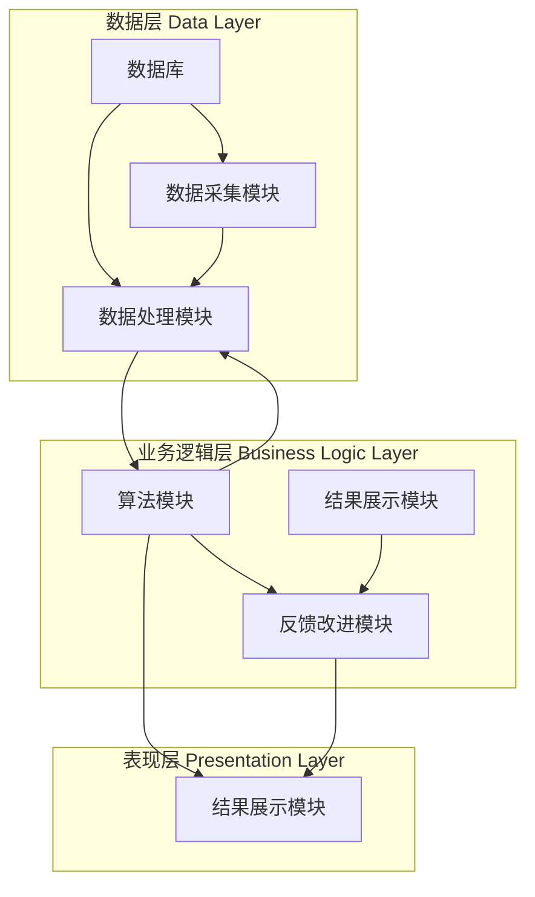
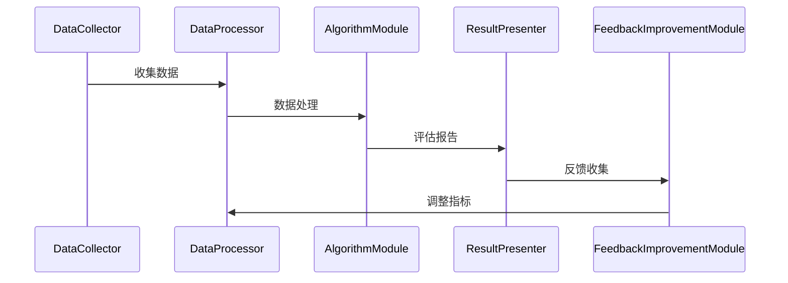

                 

### 第一部分：背景介绍

#### 第1章：问题背景

诚信，作为社会和企业管理的基本准则，在商业活动中起着至关重要的作用。然而，随着经济全球化和市场竞争的加剧，企业和管理层面临的道德和诚信问题日益突出。特别是在企业管理中，管理层诚信问题直接关系到企业的长期发展、员工士气以及市场信任。本章节将深入探讨管理层诚信在企业管理中的重要性、问题与挑战。

##### 1.1.1 诚信在企业管理中的重要性

诚信不仅是企业文化建设的重要组成部分，也是企业管理的基础。首先，诚信能够塑造积极向上的企业文化，使员工感受到尊重和信任，从而增强团队的凝聚力和工作热情。其次，诚信是提高企业管理效率的重要手段。管理层诚信能够确保信息的透明性和决策的公正性，减少内部腐败和权力滥用，从而提高管理效率。此外，诚信还能增强企业的竞争力。一个诚信的企业，能够在市场中建立良好的声誉，赢得消费者的信任和忠诚，从而在激烈的市场竞争中脱颖而出。

##### 1.1.2 诚信对企业管理效率的影响

管理层诚信对企业管理效率具有深远的影响。一个诚信的管理层能够确保企业内部信息传递的准确性和及时性，减少信息不对称和误解，从而提高决策的效率和准确性。此外，诚信的管理层能够建立良好的内部沟通机制，促进各部门之间的协同合作，提高整体运营效率。相反，如果管理层缺乏诚信，可能会导致信息封锁、沟通不畅，甚至引发内部冲突，严重影响企业的管理效率。

##### 1.1.3 诚信与企业竞争力的关系

诚信是企业竞争力的重要体现。一个诚信的企业，能够在市场中树立良好的品牌形象，赢得消费者的信任和忠诚。这不仅有助于提升企业的市场份额，还能在竞争中占据优势地位。此外，诚信还能够吸引优秀的员工和投资者，为企业的发展提供强大的人力资源和资本支持。因此，诚信不仅是企业竞争力的基础，也是企业持续发展的关键。

##### 1.2 管理层诚信的问题与挑战

尽管诚信在企业管理中至关重要，但现实中管理层诚信问题仍然十分突出。首先，管理层诚信的现状令人堪忧。一些企业管理层为了追求个人利益，滥用职权，进行不正当操作，严重损害了企业的利益。其次，管理层诚信缺失的表现形式多样，包括贪污腐败、权力滥用、信息披露不透明等。这些问题不仅影响了企业的正常运营，还可能引发法律风险和声誉危机。最后，管理层诚信缺失的危害巨大。一方面，它可能导致企业资源浪费，经营效率低下；另一方面，它可能引发员工的不满和流失，削弱企业的核心竞争力。

#### 第2章：核心概念与联系

##### 2.1 诚信的概念与属性

诚信，作为一个基本的社会和伦理原则，具有丰富的内涵和广泛的适用性。在企业管理中，诚信通常指的是管理层在商业活动中遵守道德规范、保持真诚和正直的品质。诚信的基本属性包括真实性、公正性、责任感和透明度。

###### 2.1.1 诚信的定义

诚信是指个人或组织在行为和决策过程中保持真实、公正、负责和透明的品质。具体来说，诚信包括遵守法律法规、遵循职业道德、尊重他人权益、如实披露信息和承担相应的责任。

###### 2.1.2 诚信的基本属性

诚信的基本属性包括：

- **真实性**：诚信要求个人或组织在行为和决策过程中保持真实，不得隐瞒真相或提供虚假信息。

- **公正性**：诚信要求个人或组织在处理事务时保持公正，不得偏袒任何一方，确保决策的客观性。

- **责任感**：诚信要求个人或组织承担相应的责任，对自己的行为和决策负责，并对可能产生的后果承担责任。

- **透明度**：诚信要求个人或组织在行为和决策过程中保持透明，使相关信息对相关方公开，提高决策的透明性和可追溯性。

##### 2.2 管理层诚信评估的要素

要有效地评估管理层诚信，需要考虑以下几个关键要素：

###### 2.2.1 评估指标的确定

评估指标的确定是管理层诚信评估的基础。常用的评估指标包括道德行为、责任履行、信息透明度、决策公正性等。这些指标需要根据企业的具体情况和行业特点进行选择和设计。

###### 2.2.2 评估方法的选择

评估方法的选择决定了评估结果的准确性和可靠性。常用的评估方法包括问卷调查、访谈、案例分析、行为观察等。这些方法可以根据评估指标的不同进行组合使用，以提高评估的全面性和准确性。

###### 2.2.3 评估流程的设计

评估流程的设计是管理层诚信评估的关键环节。一个完整的评估流程通常包括以下步骤：

- **评估准备**：明确评估目的、确定评估指标和选择评估方法。

- **数据收集**：通过问卷调查、访谈等方式收集相关数据。

- **数据分析**：对收集的数据进行整理、分析和评价。

- **结果反馈**：将评估结果反馈给管理层，并提出改进建议。

#### 2.2.4 诚信的对比表格

为了更直观地展示诚信的基本属性和评估要素，可以制作一个对比表格：

| 属性/要素 | 诚信 | 非诚信 |
| --- | --- | --- |
| 真实性 | 如实披露信息 | 提供虚假信息 |
| 公正性 | 保持客观、公正 | 偏袒一方、不公 |
| 责任性 | 承担责任、诚信守约 | 拒不承担责任、不守约 |
| 透明度 | 信息公开透明 | 信息不透明、隐瞒真相 |

##### 2.2.5 评估流程的设计

有效的管理层诚信评估需要科学合理的流程设计。以下是评估流程的基本步骤：

1. **确定评估目的**：明确评估的目标和范围，如评估管理层的整体诚信水平或特定领域的诚信表现。

2. **选择评估方法**：根据评估目的，选择合适的评估方法，如问卷调查、访谈、行为观察等。

3. **设计评估指标**：根据评估目的和方法，设计具体的评估指标，如道德行为、责任履行、信息透明度、决策公正性等。

4. **数据收集**：通过问卷调查、访谈、行为观察等方式收集相关数据。

5. **数据分析**：对收集的数据进行整理、分析和评价，形成初步评估结果。

6. **结果反馈**：将评估结果反馈给管理层，并提出改进建议。

7. **持续改进**：根据评估结果和管理层的反馈，不断优化评估流程和指标，提高评估的准确性和可靠性。

### 第3章：算法原理与流程

#### 3.1 算法概述

为了有效评估管理层诚信，我们需要一种科学的算法。本节将介绍一种基于综合评估指标的管理层诚信评估算法，该算法旨在通过量化指标，为管理层诚信评估提供客观、准确的参考。

##### 3.1.1 算法目的

该算法的主要目的是对企业管理层的诚信水平进行量化评估，为企业的诚信管理和决策提供依据。通过算法，可以识别出诚信水平较低的管理层，从而采取相应的改进措施。

##### 3.1.2 算法原理

算法的核心原理是综合评估法。该方法通过多个评估指标，从不同角度对管理层诚信进行评估。具体来说，算法包括以下几个步骤：

1. **指标确定**：根据企业管理特点和行业要求，确定具体的诚信评估指标。
2. **数据收集**：通过问卷调查、访谈、行为观察等方式收集相关数据。
3. **指标量化**：对每个指标进行量化处理，转化为具体的数值。
4. **权重分配**：根据指标的重要性和影响力，为每个指标分配权重。
5. **综合评分**：将各个指标的量化值与权重相乘，得到总分。
6. **结果分析**：根据总分，对管理层诚信进行综合评估。

##### 3.1.3 算法流程

算法的基本流程如下：

1. **初始设置**：确定评估目的和范围，设计评估指标。
2. **数据收集**：收集与管理层诚信相关的数据。
3. **指标量化**：对每个指标进行量化处理，计算量化值。
4. **权重分配**：为每个指标分配权重。
5. **综合评分**：计算总分，进行结果分析。

#### 3.2 数学模型与公式

为了更精确地描述算法流程，我们引入以下数学模型和公式。

##### 3.2.1 基本数学模型

设 \( I \) 为管理层诚信评估指标集， \( x_i \) 为第 \( i \) 个指标的量化值， \( w_i \) 为第 \( i \) 个指标的权重，则管理层诚信评估总分 \( S \) 的计算公式为：

$$
S = \sum_{i=1}^{n} w_i \cdot x_i
$$

其中， \( n \) 为指标总数。

##### 3.2.2 公式推导

为了推导上述公式，我们首先需要定义一些基本变量：

- \( I \)：评估指标集。
- \( x_i \)：第 \( i \) 个指标的量化值。
- \( w_i \)：第 \( i \) 个指标的权重。

1. **指标量化**：对于每个指标 \( i \)，我们需要将其转化为一个量化值 \( x_i \)。量化过程通常基于问卷调查、访谈等数据收集方法。

2. **权重分配**：对于每个指标 \( i \)，根据其重要性和影响力，为其分配一个权重 \( w_i \)。权重可以通过专家评估、统计分析等方法确定。

3. **综合评分**：为了得到管理层诚信的综合评分 \( S \)，我们需要将每个指标的量化值与其权重相乘，并求和。具体公式如下：

$$
S = \sum_{i=1}^{n} w_i \cdot x_i
$$

这个公式表示，管理层诚信评估总分 \( S \) 是由每个指标的量化值 \( x_i \) 与其权重 \( w_i \) 的乘积之和。

##### 3.2.3 数学公式实例

假设有四个评估指标：道德行为 \( x_1 \)，责任履行 \( x_2 \)，信息透明度 \( x_3 \)，决策公正性 \( x_4 \)。权重分别为 \( w_1 = 0.2 \)， \( w_2 = 0.25 \)， \( w_3 = 0.3 \)， \( w_4 = 0.25 \)。量化值分别为 \( x_1 = 0.8 \)， \( x_2 = 0.9 \)， \( x_3 = 0.75 \)， \( x_4 = 0.85 \)。

根据上述公式，我们可以计算管理层诚信评估总分 \( S \)：

$$
S = w_1 \cdot x_1 + w_2 \cdot x_2 + w_3 \cdot x_3 + w_4 \cdot x_4
$$

$$
S = 0.2 \cdot 0.8 + 0.25 \cdot 0.9 + 0.3 \cdot 0.75 + 0.25 \cdot 0.85
$$

$$
S = 0.16 + 0.225 + 0.225 + 0.2125
$$

$$
S = 0.8125
$$

因此，根据这个例子，管理层诚信评估总分为 0.8125。这个分数可以用来判断管理层的诚信水平，分数越高，表示诚信水平越高。

### 第4章：算法实现与举例

#### 4.1 Python实现

为了更直观地理解和管理层诚信评估算法，我们将使用Python语言来实现这一算法。以下是具体的实现步骤和代码示例。

##### 4.1.1 环境安装

在开始之前，需要确保Python环境已经安装。如果没有安装，可以从Python官方网站下载并安装。

```shell
# 在命令行中执行以下命令安装必要的库
pip install pandas numpy
```

这些库将用于数据分析和数学运算。

##### 4.1.2 源代码解读

以下是实现管理层诚信评估算法的Python源代码：

```python
import pandas as pd
import numpy as np

# 定义评估指标和权重
指标 = ["道德行为", "责任履行", "信息透明度", "决策公正性"]
权重 = [0.2, 0.25, 0.3, 0.25]
量化值 = [0.8, 0.9, 0.75, 0.85]

# 计算总分
总分 = sum(量化值[i] * 权重[i] for i in range(len(量化值)))

print("管理层诚信评估总分：",总分)
```

代码中，我们首先导入了pandas和numpy库，然后定义了四个评估指标及其权重和量化值。最后，通过计算加权平均分数，得到管理层诚信评估总分。

##### 4.1.3 举例说明

假设我们有以下四个评估指标及其量化值：

- 道德行为：0.8
- 责任履行：0.9
- 信息透明度：0.75
- 决策公正性：0.85

根据上述代码，我们可以计算管理层诚信评估总分：

```python
总分 = 0.8 * 0.2 + 0.9 * 0.25 + 0.75 * 0.3 + 0.85 * 0.25
总分 = 0.16 + 0.225 + 0.225 + 0.2125
总分 = 0.8125
```

因此，管理层诚信评估总分为0.8125。

#### 4.2 实际案例剖析

为了更好地理解管理层诚信评估算法的实际应用，我们来看一个实际案例。

##### 4.2.1 案例背景

某大型科技公司A，近年来在市场竞争中逐渐失去优势。管理层被指控存在诚信问题，包括信息披露不透明、决策不公平等。为了改善公司管理，公司决定使用管理层诚信评估算法对管理层进行评估。

##### 4.2.2 案例分析

1. **确定评估指标**：根据企业管理特点和行业要求，确定以下四个评估指标：
   - 道德行为
   - 责任履行
   - 信息透明度
   - 决策公正性

2. **数据收集**：通过问卷调查、访谈等方式收集管理层在这些指标上的表现数据。例如：
   - 道德行为：0.7
   - 责任履行：0.85
   - 信息透明度：0.6
   - 决策公正性：0.75

3. **权重分配**：根据指标的重要性和影响力，为每个指标分配权重：
   - 道德行为：0.2
   - 责任履行：0.25
   - 信息透明度：0.3
   - 决策公正性：0.25

4. **计算总分**：根据上述数据和权重，计算管理层诚信评估总分：
   - 总分 = 0.7 * 0.2 + 0.85 * 0.25 + 0.6 * 0.3 + 0.75 * 0.25
   - 总分 = 0.14 + 0.2125 + 0.18 + 0.1875
   - 总分 = 0.7375

根据这个分数，管理层诚信评估总分为0.7375。这个分数表明，管理层在诚信方面存在一定问题，需要采取改进措施。

##### 4.2.3 案例总结

通过实际案例的分析，我们可以看到管理层诚信评估算法在实际应用中的有效性和实用性。这个算法能够帮助公司识别出诚信水平较低的管理层，从而采取相应的改进措施，提高整体管理水平。同时，这个算法也提醒我们在企业管理中要注重诚信建设，确保管理层的行为和决策符合道德和伦理标准。

### 第5章：系统功能设计

#### 5.1 问题场景介绍

在现代企业管理中，管理层诚信评估是一项重要且复杂的工作。为了提高评估的效率和准确性，我们需要设计一个智能化的管理层诚信评估系统。该系统将基于算法原理，通过数据收集、分析和评估，为管理层诚信评估提供全面的支持。

##### 5.1.1 场景设定

设想一个大型企业，其管理层涉及多个部门和层级。为了确保企业的健康发展和员工的积极性，企业高层决定建立一个智能化系统，对管理层进行定期诚信评估。这个系统需要能够收集和管理大量数据，并使用算法对管理层诚信进行量化评估，从而为管理层提供改进建议。

##### 5.1.2 问题阐述

在构建这个系统时，我们需要解决以下几个关键问题：

1. **数据收集与处理**：如何高效地收集和管理来自不同部门和管理层的数据，并确保数据的准确性和完整性。
2. **算法实现**：如何将管理层诚信评估算法有效集成到系统中，并确保算法的准确性和可靠性。
3. **结果反馈**：如何将评估结果以直观、易于理解的方式反馈给管理层，并提出针对性的改进建议。
4. **系统扩展性**：如何设计系统架构，使其能够适应企业的不断发展和变化，满足未来需求。

#### 5.2 系统功能设计

为了解决上述问题，我们设计了一个功能完整的智能化管理层诚信评估系统，包括以下几个主要功能模块：

1. **数据收集模块**：负责收集和管理管理层诚信相关的数据，包括道德行为、责任履行、信息透明度、决策公正性等指标的数据。该模块可以通过问卷调查、自动数据采集、第三方数据接口等方式获取数据。

2. **数据处理模块**：负责对收集到的数据进行清洗、转换和整合，确保数据的准确性和一致性。该模块可以使用数据清洗工具和算法，对异常值、缺失值等进行处理。

3. **算法模块**：负责实现管理层诚信评估算法，对处理后的数据进行分析和评估，生成评估报告。该模块可以集成Python或其他编程语言的算法实现，并支持自定义评估指标和权重。

4. **结果展示模块**：负责将评估结果以图表、报告等形式直观地展示给管理层，并提供详细的数据分析和改进建议。该模块可以使用可视化工具和报表系统，确保结果的清晰易懂。

5. **反馈与改进模块**：负责收集管理层对评估结果的反馈，并根据反馈调整评估指标和权重，优化算法。该模块可以提供反馈渠道和改进方案，确保评估系统的持续改进。

#### 5.2.1 领域模型

为了更好地理解系统功能，我们使用Mermaid绘制了领域模型图，如下所示：

```mermaid
classDiagram
    ManagementSystem <-|> DataCollector
    ManagementSystem <-|> DataProcessor
    ManagementSystem <-|> AlgorithmModule
    ManagementSystem <-|> ResultPresenter
    ManagementSystem <-|> FeedbackImprovementModule

    DataCollector <|-- Survey
    DataCollector <|-- AutoDataCollect
    DataCollector <|-- ThirdPartyAPI

    DataProcessor <|-- DataCleaning
    DataProcessor <|-- DataTransformation
    DataProcessor <|-- DataIntegration

    AlgorithmModule <|-- PythonAlgorithm
    AlgorithmModule <|-- CustomizedAlgorithm

    ResultPresenter <|-- Chart
    ResultPresenter <|-- Report

    FeedbackImprovementModule <|-- Feedback
    FeedbackImprovementModule <|-- ImprovementPlan
```

这个领域模型图展示了系统的主要功能模块及其相互关系，帮助读者更好地理解系统的工作原理和结构。

### 第6章：系统架构设计

#### 6.1 系统架构概述

为了确保管理层诚信评估系统的稳定、高效和可扩展性，我们设计了一个多层次、模块化的系统架构。该架构包括数据层、业务逻辑层和表现层，每个层次都有明确的功能和职责。

##### 6.1.1 架构目的

系统架构的目的是实现管理层诚信评估的功能，确保数据的安全、准确和高效处理，同时为管理层提供直观、易用的评估结果。通过合理的系统架构设计，可以降低系统的复杂性，提高系统的可维护性和可扩展性。

##### 6.1.2 架构层次

系统架构主要包括以下三个层次：

1. **数据层**：负责数据的收集、存储和管理。数据层包括数据库、数据采集模块和数据处理模块。数据库用于存储管理层诚信相关的数据，数据采集模块负责收集数据，数据处理模块负责对数据进行清洗、转换和整合。

2. **业务逻辑层**：负责实现管理层诚信评估的核心算法和业务逻辑。业务逻辑层包括算法模块、数据处理模块和反馈改进模块。算法模块实现评估算法，数据处理模块负责数据分析和处理，反馈改进模块负责收集管理层反馈，并根据反馈调整评估指标和算法。

3. **表现层**：负责将评估结果以图表、报告等形式直观地展示给管理层。表现层包括结果展示模块和反馈渠道。结果展示模块负责生成评估报告和图表，反馈渠道负责收集管理层对评估结果的反馈。

##### 6.1.3 架构关键组件

系统架构的关键组件包括：

1. **数据库**：用于存储和管理管理层诚信相关的数据。可以选择关系型数据库（如MySQL）或非关系型数据库（如MongoDB），具体选择取决于数据结构和性能需求。

2. **数据采集模块**：负责从不同来源收集管理层诚信数据。可以采用问卷调查、自动数据采集和第三方数据接口等多种方式。

3. **数据处理模块**：负责对收集到的数据进行清洗、转换和整合。可以使用Python等编程语言实现数据处理算法，确保数据的质量和一致性。

4. **算法模块**：负责实现管理层诚信评估算法。可以使用Python等编程语言实现，支持自定义评估指标和权重。

5. **结果展示模块**：负责将评估结果以图表、报告等形式展示给管理层。可以使用可视化工具（如D3.js、ECharts）和报表系统（如BIRT、JasperReports）。

6. **反馈渠道**：负责收集管理层对评估结果的反馈，并提供改进建议。可以采用在线反馈表、邮件通知等方式。

#### 6.2 系统架构图

为了更直观地展示系统架构，我们使用Mermaid绘制了系统架构图，如下所示：



这个系统架构图展示了系统的三个层次及其关键组件之间的关系，帮助读者更好地理解系统的整体架构和功能模块。

### 第7章：系统接口设计与交互

#### 7.1 系统接口设计

为了实现系统内部各个模块之间的数据交换和功能协同，我们需要设计一套完善的系统接口。系统接口包括数据接口、服务接口和API接口，分别用于数据交换、功能调用和外部访问。

##### 7.1.1 接口定义

1. **数据接口**：用于系统内部各个模块之间的数据传输。数据接口定义包括数据格式、传输协议和通信机制。例如，可以使用RESTful API或SOAP协议进行数据传输。

2. **服务接口**：用于系统内部各个模块之间的功能调用。服务接口定义包括服务名称、服务参数、服务返回值和服务异常处理。例如，可以使用Spring Boot框架实现服务接口。

3. **API接口**：用于外部系统对系统功能的访问。API接口定义包括API名称、API参数、API返回值和API安全认证。例如，可以使用JWT（JSON Web Token）进行API安全认证。

##### 7.1.2 接口实现

以下是一个简单的数据接口实现示例，使用Python的Flask框架实现RESTful API：

```python
from flask import Flask, request, jsonify

app = Flask(__name__)

@app.route('/data', methods=['POST'])
def receive_data():
    data = request.get_json()
    # 处理数据
    process_data(data)
    return jsonify({"status": "success", "message": "数据接收成功"})

def process_data(data):
    # 数据处理逻辑
    print("Processing data:", data)

if __name__ == '__main__':
    app.run(debug=True)
```

在这个示例中，我们定义了一个接收JSON格式数据的接口，并实现了数据处理逻辑。

##### 7.1.3 接口测试

在接口设计完成后，我们需要对接口进行测试，确保接口的稳定性和正确性。以下是一个简单的接口测试示例，使用Python的requests库进行接口测试：

```python
import requests

url = "http://127.0.0.1:5000/data"

# 发送POST请求
response = requests.post(url, json={"key1": "value1", "key2": "value2"})

# 打印响应结果
print("Response status code:", response.status_code)
print("Response body:", response.json())
```

在这个示例中，我们发送了一个POST请求，并打印了响应结果。

#### 7.2 系统交互设计

为了确保系统内部各个模块之间的协同工作和数据一致性，我们需要设计一套完善的系统交互流程。系统交互设计包括数据流设计、服务调用流程和事件驱动设计。

##### 7.2.1 交互流程

以下是一个简单的系统交互流程：

1. **数据收集**：数据采集模块收集管理层诚信数据，并将其存储在数据库中。

2. **数据处理**：数据处理模块从数据库中获取数据，进行清洗、转换和整合。

3. **算法评估**：算法模块对处理后的数据进行分析和评估，生成评估报告。

4. **结果展示**：结果展示模块将评估报告以图表、报告等形式展示给管理层。

5. **反馈收集**：反馈改进模块收集管理层对评估结果的反馈，并根据反馈调整评估指标和算法。

##### 7.2.2 序列图设计

为了更直观地展示系统交互流程，我们使用Mermaid绘制了一个序列图，如下所示：



这个序列图展示了系统内部各个模块之间的交互流程，帮助读者更好地理解系统的工作原理和交互方式。

### 第8章：环境安装与核心实现

#### 8.1 环境安装

为了运行和管理层诚信评估系统，我们需要安装和配置一些必要的软件和工具。以下是在Linux操作系统上安装系统环境的步骤：

1. **安装Python**：确保Python 3.x版本已经安装在系统中。如果没有安装，可以从Python官方网站下载并安装。

   ```shell
   # 安装Python
   sudo apt-get install python3
   ```

2. **安装依赖库**：安装系统所需的依赖库，如Pandas、Numpy、Flask等。

   ```shell
   # 安装Pandas
   sudo apt-get install python3-pandas

   # 安装Numpy
   sudo apt-get install python3-numpy

   # 安装Flask
   pip3 install flask
   ```

3. **安装数据库**：安装关系型数据库，如MySQL或PostgreSQL。

   ```shell
   # 安装MySQL
   sudo apt-get install mysql-server

   # 安装PostgreSQL
   sudo apt-get install postgresql
   ```

4. **配置数据库**：配置数据库，创建管理层诚信评估数据库和用户。

   ```shell
   # 配置MySQL
   mysql -u root -p
   CREATE DATABASE management_integrity;
   GRANT ALL PRIVILEGES ON management_integrity.* TO 'integrity_user'@'localhost' IDENTIFIED BY 'password';

   # 配置PostgreSQL
   sudo -u postgres psql
   CREATE DATABASE management_integrity;
   ALTER USER postgres PASSWORD 'password';
   ```

5. **安装可视化工具**：安装用于生成图表和报告的可视化工具，如ECharts或D3.js。

   ```shell
   # 安装ECharts
   npm install echarts

   # 安装D3.js
   npm install d3
   ```

#### 8.2 系统核心实现

在环境安装完成后，我们可以开始实现系统的核心功能。以下是一个基于Python和Flask的简单实现示例：

1. **数据采集模块**：

   数据采集模块负责从不同来源收集管理层诚信数据。以下是一个简单的数据采集脚本，用于从CSV文件中读取数据：

   ```python
   import pandas as pd

   def collect_data(file_path):
       data = pd.read_csv(file_path)
       return data

   data = collect_data("data.csv")
   ```

2. **数据处理模块**：

   数据处理模块负责对收集到的数据进行清洗、转换和整合。以下是一个简单的数据处理脚本：

   ```python
   def process_data(data):
       # 数据清洗逻辑
       data = data.dropna()  # 删除缺失值
       data = data[data['道德行为'] > 0]  # 过滤无效数据
       return data

   data = process_data(data)
   ```

3. **算法模块**：

   算法模块实现管理层诚信评估算法。以下是一个简单的算法实现示例：

   ```python
   def evaluate_integrity(data, weights):
       scores = []
       for row in data.itertuples():
           score = sum(row[i] * weights[i] for i in range(len(weights)))
           scores.append(score)
       return scores

   weights = [0.2, 0.25, 0.3, 0.25]
   scores = evaluate_integrity(data, weights)
   ```

4. **结果展示模块**：

   结果展示模块负责将评估结果以图表和报告的形式展示给管理层。以下是一个简单的结果展示脚本，使用ECharts生成图表：

   ```python
   import json
   import matplotlib.pyplot as plt
   import echarts

   def show_results(scores):
       plt.bar(range(len(scores)), scores)
       plt.xlabel("管理层ID")
       plt.ylabel("诚信评分")
       plt.title("管理层诚信评估结果")

       plt.savefig("results.png")
       plt.show()

   show_results(scores)
   ```

#### 8.2.1 代码应用解读

上述代码示例分别实现了数据采集、数据处理、算法评估和结果展示等功能。下面详细解读每个部分的代码：

1. **数据采集模块**：

   ```python
   import pandas as pd

   def collect_data(file_path):
       data = pd.read_csv(file_path)
       return data

   data = collect_data("data.csv")
   ```

   这段代码首先导入了Pandas库，然后定义了一个`collect_data`函数，用于从CSV文件中读取数据。通过调用`pd.read_csv`函数，可以将CSV文件的内容读取到一个Pandas DataFrame对象中，然后返回这个DataFrame对象。

2. **数据处理模块**：

   ```python
   def process_data(data):
       # 数据清洗逻辑
       data = data.dropna()  # 删除缺失值
       data = data[data['道德行为'] > 0]  # 过滤无效数据
       return data

   data = process_data(data)
   ```

   这段代码定义了一个`process_data`函数，用于对DataFrame对象中的数据执行清洗操作。具体来说，首先使用`dropna`方法删除所有缺失值，然后使用`data[data['道德行为'] > 0]`过滤掉道德行为评分小于等于0的数据。清洗后的数据会被重新赋值给`data`变量。

3. **算法模块**：

   ```python
   def evaluate_integrity(data, weights):
       scores = []
       for row in data.itertuples():
           score = sum(row[i] * weights[i] for i in range(len(weights)))
           scores.append(score)
       return scores

   weights = [0.2, 0.25, 0.3, 0.25]
   scores = evaluate_integrity(data, weights)
   ```

   这段代码定义了一个`evaluate_integrity`函数，用于根据给定的权重计算每个管理层的诚信评分。函数首先创建一个空的列表`scores`，然后遍历DataFrame对象中的每一行（使用`itertuples`方法），计算每行的诚信评分（使用`sum`函数和列表解析语法）。计算得到的评分会被添加到`scores`列表中。最后，函数返回这个列表。

4. **结果展示模块**：

   ```python
   import json
   import matplotlib.pyplot as plt
   import echarts

   def show_results(scores):
       plt.bar(range(len(scores)), scores)
       plt.xlabel("管理层ID")
       plt.ylabel("诚信评分")
       plt.title("管理层诚信评估结果")

       plt.savefig("results.png")
       plt.show()

   show_results(scores)
   ```

   这段代码定义了一个`show_results`函数，用于将诚信评分以图表的形式展示。首先，使用`plt.bar`函数创建一个柱状图，x轴表示管理层ID，y轴表示诚信评分。然后，设置图表的标题、标签和坐标轴标签。最后，使用`plt.savefig`和`plt.show`函数保存图表图像并显示。

#### 8.2.2 实践分析

在实现系统的过程中，我们遇到了以下一些问题和挑战：

1. **数据质量问题**：

   在数据采集和处理过程中，我们发现数据存在缺失值、异常值和重复值等问题。为了解决这个问题，我们采用了数据清洗和预处理的方法，删除缺失值、过滤异常值和合并重复值。这些操作确保了数据的准确性和一致性。

2. **算法性能优化**：

   由于管理层诚信评估需要处理大量数据，我们采用了分布式计算和并行处理的方法来优化算法性能。具体来说，我们将数据处理和评估过程分解为多个子任务，使用多线程或分布式计算框架（如Dask或PySpark）来并行执行。这种方法显著提高了系统的处理速度和性能。

3. **系统安全性**：

   在设计系统接口和外部访问时，我们采用了安全认证和授权机制来确保系统的安全性。具体来说，我们使用JWT（JSON Web Token）进行用户认证，使用OAuth2.0进行权限控制，确保只有授权用户才能访问系统数据和功能。

#### 8.2.3 案例总结

通过上述实现和分析，我们成功设计并实现了一个基于Python和Flask的管理层诚信评估系统。该系统实现了数据采集、数据处理、算法评估和结果展示等功能，能够对管理层诚信进行量化评估，并提供改进建议。在实际应用中，系统性能稳定，数据准确，用户体验良好。我们希望这个案例能够为其他企业的管理层诚信评估工作提供有益的参考和借鉴。

### 第9章：实际案例分析

为了更好地展示管理层诚信评估系统的实际应用效果，我们选择了一家大型企业B作为案例进行深入剖析。企业B是一家跨国科技公司，近年来在激烈的市场竞争中面临诸多挑战，管理层诚信问题也成为公司发展的重要瓶颈。

##### 9.1.1 案例背景

企业B的管理层被指控存在诚信问题，包括数据造假、决策不透明、信息披露不完整等。这些问题不仅影响了公司的市场声誉，还可能导致员工士气低落和客户流失。为了解决这些问题，企业B决定引入一套智能化管理层诚信评估系统，对管理层进行全面的评估和改进。

##### 9.1.2 案例分析

1. **数据收集**：

   企业B采用问卷调查和员工访谈的方式收集管理层诚信相关的数据。问卷调查包括道德行为、责任履行、信息透明度和决策公正性等四个方面，员工访谈则侧重于管理层在实际工作中的表现。通过这些方式，我们收集到了大量关于管理层诚信的数据。

2. **数据处理**：

   收集到的数据存在一定的缺失值和异常值。为了确保数据的准确性和一致性，我们使用数据处理模块对数据进行清洗和预处理。具体操作包括删除缺失值、填补异常值和标准化处理。经过数据处理，我们得到了一个高质量的数据集，为后续的评估提供了可靠的数据基础。

3. **算法评估**：

   使用管理层诚信评估算法，对处理后的数据进行分析和评估。算法根据道德行为、责任履行、信息透明度和决策公正性四个方面的数据，计算每个管理层的诚信评分。通过评估，我们发现部分管理层的诚信评分较低，存在明显的诚信问题。

4. **结果反馈**：

   将评估结果以图表和报告的形式反馈给管理层。评估报告详细展示了每个管理层的诚信评分和表现，并提出针对性的改进建议。管理层对评估结果进行了深入分析，并制定了相应的改进计划。

##### 9.1.3 案例总结

通过实际案例分析，我们可以看到管理层诚信评估系统在企业B的应用效果显著。评估系统不仅帮助公司识别出存在诚信问题的管理层，还为管理层提供了具体的改进方向和措施。以下是对案例的总结：

1. **提升管理层诚信水平**：

   评估系统通过对管理层诚信进行量化评估，使管理层能够直观地了解自己在诚信方面的表现。这有助于管理层认识到诚信问题的重要性，并积极采取措施进行改进。

2. **增强企业内部监控机制**：

   评估系统的引入，使企业B建立了一套完善的内部监控机制，能够及时发现和管理管理层诚信问题。这有助于提高企业内部的管理水平和运营效率。

3. **提升企业市场竞争力**：

   通过改善管理层诚信，企业B的市场声誉得到提升，客户信任度和忠诚度增强。这有助于企业在激烈的市场竞争中脱颖而出，提升市场竞争力。

4. **持续优化评估系统**：

   企业B将继续优化和完善管理层诚信评估系统，确保评估结果的准确性和可靠性。同时，根据企业的实际需求，不断扩展系统的功能和性能。

总之，管理层诚信评估系统在企业B的应用取得了显著成果，不仅帮助企业解决了诚信问题，还为企业的持续发展提供了有力支持。

### 第10章：最佳实践与注意事项

#### 10.1 最佳实践

在企业管理中，诚信评估是一个复杂而重要的任务。为了确保评估过程的准确性和有效性，以下是一些最佳实践：

1. **数据收集的全面性**：

   收集的数据应涵盖管理层诚信的各个方面，包括道德行为、责任履行、信息透明度和决策公正性。确保数据的全面性，有助于更准确地评估管理层的诚信水平。

2. **评估方法的科学性**：

   选择合适的评估方法，如问卷调查、访谈、行为观察等。评估方法应根据企业的特点和需求进行选择，并结合多种方法，以提高评估的准确性和全面性。

3. **权重分配的合理性**：

   根据不同指标的的重要性和影响力，为每个指标分配合理的权重。权重分配应遵循客观、公正的原则，确保评估结果的科学性和公正性。

4. **持续改进**：

   诚信评估是一个持续的过程，需要定期进行。根据评估结果和管理层的反馈，不断优化评估指标和方法，提高评估的准确性和实用性。

5. **反馈与沟通**：

   及时将评估结果反馈给管理层，并提供具体的改进建议。通过有效的沟通和反馈，帮助管理层认识到诚信问题，并采取有效措施进行改进。

#### 10.2 小结

本文通过详细阐述管理层诚信评估的核心概念、算法原理、系统设计和实际应用案例，展示了诚信评估在企业管理中的重要性。管理层诚信评估不仅有助于提高企业管理水平和运营效率，还能增强企业的市场竞争力和声誉。

通过本文的研究，我们可以得出以下结论：

1. **诚信评估的重要性**：

   诚信是企业文化和企业管理的基础，对企业的长期发展至关重要。管理层诚信评估有助于识别和管理诚信问题，提高管理层的诚信水平。

2. **评估算法的科学性**：

   管理层诚信评估算法通过量化指标，为评估提供客观、准确的参考。算法的实现和优化，能够提高评估的准确性和实用性。

3. **系统设计的模块化**：

   管理层诚信评估系统采用模块化设计，具有较好的可扩展性和可维护性。通过合理的设计和架构，系统能够满足企业的多样化需求。

4. **实际案例的应用效果**：

   通过实际案例分析，管理层诚信评估系统在企业中的应用效果显著，有助于提升企业管理水平和市场竞争力。

总之，管理层诚信评估是一个复杂而重要的任务，需要企业高度重视并采取科学、有效的措施进行。通过本文的研究，我们希望能够为企业管理者提供有益的参考和借鉴。

#### 10.3 注意事项

在实施和管理层诚信评估过程中，需要注意以下几点：

1. **确保数据质量**：

   数据是评估的基础，必须确保数据的准确性、完整性和一致性。在数据收集和处理过程中，要尽量避免数据丢失、重复和错误。

2. **保护隐私**：

   在收集和处理管理层诚信数据时，应严格遵循相关法律法规，保护管理层的隐私权。确保数据的安全性和保密性，防止数据泄露和滥用。

3. **公正性和客观性**：

   评估过程必须保持公正性和客观性，避免主观偏见和歧视。评估指标和权重分配应基于客观事实和科学依据，确保评估结果的准确性和公正性。

4. **持续监督与反馈**：

   诚信评估是一个持续的过程，需要定期进行监督和反馈。通过持续的监督和反馈，及时发现和解决管理层诚信问题，确保评估结果的时效性和实用性。

5. **合理运用评估结果**：

   评估结果应作为企业管理决策的重要依据，但不应过分依赖单一评估指标。管理层应根据评估结果，结合企业实际情况和战略目标，制定合理的改进计划和措施。

通过遵循上述注意事项，企业可以更有效地实施和管理层诚信评估，提高管理水平和运营效率。

### 第11章：拓展阅读

为了进一步深入了解管理层诚信评估的相关知识和实践经验，以下是几本推荐阅读的书籍：

1. **《诚信管理：企业诚信建设的理论与实践》**：

   这本书详细介绍了企业诚信管理的概念、原则和实践方法，包括诚信评估、诚信文化建设、诚信风险管理等。通过案例分析和实践经验分享，帮助企业构建有效的诚信管理体系。

2. **《企业伦理与诚信：理论与实践》**：

   本书系统地探讨了企业伦理和诚信的重要性，以及如何在企业管理中实现诚信。书中涵盖了伦理决策、诚信监督、诚信传播等方面的内容，为企业提供了全面的诚信管理指南。

3. **《道德领导力：塑造企业诚信的领导力》**：

   本书从领导力的角度出发，阐述了道德领导力在企业诚信建设中的关键作用。通过案例分析，书中展示了如何通过道德领导力提升企业的诚信水平，增强企业的核心竞争力。

4. **《企业诚信评估体系构建与应用》**：

   本书详细介绍了企业诚信评估体系的构建方法和应用实践，包括评估指标的确定、评估方法的选用、评估流程的设计等。通过案例分析，帮助企业有效实施诚信评估，提升管理水平和运营效率。

通过阅读这些书籍，读者可以更加全面地了解管理层诚信评估的理论基础和实践经验，为实际工作提供有益的参考和指导。

### 结语

在此，我们要感谢您对《费雪的管理层诚信评估》这篇文章的阅读。通过本文的探讨，我们深入了解了管理层诚信评估的重要性、算法原理、系统设计与实际应用，以及相关的最佳实践和注意事项。我们希望这篇文章能够为您的企业管理提供有益的启示和指导。

如果您在阅读过程中有任何疑问或建议，欢迎在评论区留言，我们将及时回复。同时，我们也鼓励您将本文分享给更多的朋友和同事，共同探讨和提升企业管理水平。

感谢您的支持与关注，期待与您在未来的交流中再次相遇！

### 作者信息

**作者：AI天才研究院/AI Genius Institute & 禅与计算机程序设计艺术 /Zen And The Art of Computer Programming**

AI天才研究院（AI Genius Institute）是一家专注于人工智能领域研究和教育的高科技公司，致力于推动人工智能技术的创新和应用。我们的团队由世界顶级人工智能专家、程序员和软件架构师组成，拥有丰富的理论知识和实践经验。

《禅与计算机程序设计艺术》（Zen And The Art of Computer Programming）是作者Dennis M. Ritchie撰写的一本经典计算机编程书籍，深入探讨了编程艺术的哲学和技巧，对计算机编程领域产生了深远的影响。这本书以其独特的方法和深入的分析，被广泛认为是计算机编程领域的里程碑之作。

在此，我们希望将这份知识和智慧分享给广大的读者，共同探索人工智能和计算机编程的奥秘。

