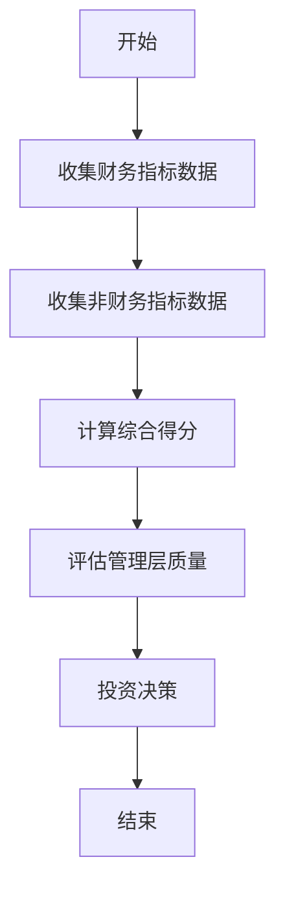
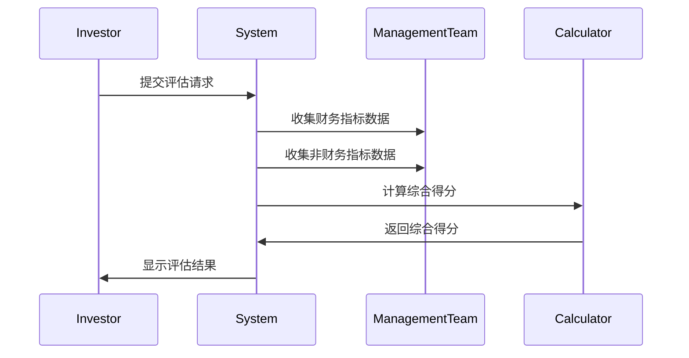
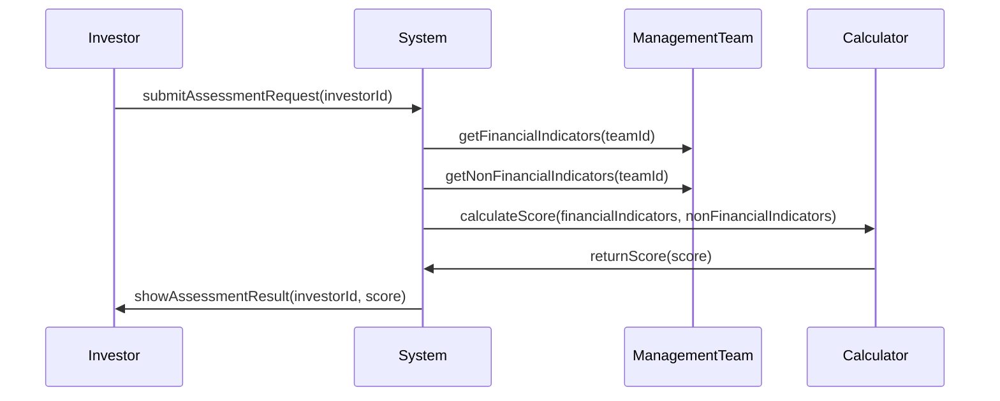

                 

### 文章标题

# 费雪的管理层质量评估：公司治理在投资决策中的作用

### 文章关键词

- **费雪**  
- **管理层质量评估**  
- **公司治理**  
- **投资决策**  
- **财务指标**  
- **非财务指标**

### 摘要

本文旨在探讨费雪的管理层质量评估理论及其在公司治理和投资决策中的重要作用。通过详细介绍费雪的理论体系，分析管理层质量评估的关键要素和指标体系，并结合实际案例，探讨管理层质量评估对公司治理和投资决策的深远影响。本文的核心目的是帮助投资者更全面地理解和评估管理团队的质量，从而做出更为明智的投资决策。

### 背景介绍

#### 管理层质量评估的定义与意义

管理层质量评估是指通过一系列的评估方法和指标，对企业管理团队的能力、素质和绩效进行全面评估。它不仅关注财务指标，还涵盖非财务指标，如团队协作、创新能力、战略规划等。管理层质量评估的意义在于，它能够帮助企业识别优秀的管理团队，提高公司治理水平，从而为投资者提供更为可靠的决策依据。

#### 问题背景

在投资决策过程中，投资者往往面临诸多不确定性。而管理层质量评估作为一个重要的决策工具，可以帮助投资者更好地理解企业的管理能力，从而降低信息不对称风险。然而，现有的评估方法大多存在局限性，无法全面、准确地反映管理层的真实质量。

#### 问题描述

本文旨在解决以下问题：

1. 费雪的管理层质量评估理论如何定义和管理层质量？
2. 费雪的管理层质量评估方法有哪些关键要素？
3. 管理层质量评估在公司治理和投资决策中具体如何发挥作用？

#### 问题解决

本文将从以下三个方面进行探讨：

1. **费雪的管理层质量评估理论**：介绍费雪的理论体系，阐述其投资哲学和管理层质量评估的关系。
2. **管理层质量评估的关键要素**：分析财务指标和非财务指标，讨论指标体系的设计与实施。
3. **管理层质量评估在公司治理和投资决策中的应用**：通过实际案例，展示管理层质量评估在决策过程中的重要作用。

#### 边界与外延

管理层质量评估的边界在于如何科学、客观地评估管理团队的质量。外延则包括其在公司治理和投资决策中的广泛应用。本文将重点关注费雪的管理层质量评估理论及其在投资决策中的应用。

#### 概念结构与核心要素组成

**概念结构**：本文主要分为三个部分：费雪的管理层质量评估理论、管理层质量评估的关键要素、管理层质量评估在公司治理和投资决策中的应用。

**核心要素组成**：

1. **费雪的管理层质量评估理论**：包括费雪的投资哲学、管理层质量评估的关键要素和特色。
2. **管理层质量评估的关键要素**：财务指标和非财务指标及其在评估中的应用。
3. **管理层质量评估在公司治理和投资决策中的应用**：通过实际案例展示管理层质量评估的作用。

### 核心概念与联系

#### 费雪的理论体系与投资哲学

费雪作为著名的投资家，其投资哲学和管理层质量评估理论密不可分。费雪认为，投资的关键在于选择优秀的管理团队。他强调，管理层的能力和素质直接影响企业的长期发展。因此，费雪的管理层质量评估理论成为了投资决策的重要依据。

**概念属性特征对比表格**：

| 概念           | 特征对比                          | 说明                                                         |
| -------------- | ------------------------------- | ------------------------------------------------------------ |
| 投资哲学       | 选择优秀的管理团队                | 费雪的投资哲学强调管理团队的重要性                           |
| 管理层质量评估 | 综合考虑财务指标和非财务指标      | 费雪认为，评估管理层质量需要全面、客观，不能仅依赖财务指标   |
| 投资决策       | 基于管理层质量评估的结果进行决策  | 费雪认为，优秀的管理团队能够带来稳定的投资回报               |

**ER实体关系图架构**：

```mermaid
erDiagram
  User ||--|{ Company }|--| Investment : investor
  Company ||--|{ ManagementTeam }|--| Performance
  ManagementTeam ||--|{ FinancialIndicators }|
  ManagementTeam ||--|{ NonFinancialIndicators }|
  Investment ||--|{ InvestmentDecision }|
```

#### 费雪与管理层质量评估的关系

费雪的管理层质量评估理论是其投资哲学的重要组成部分。他通过一系列评估方法和指标，对管理团队的能力、素质和绩效进行全面评估，以确保投资决策的准确性。费雪认为，优秀的管理层能够为企业带来长期价值，从而提高投资回报。

### 算法原理讲解

#### 管理层质量评估算法流程图



#### 管理层质量评估的数学模型

假设财务指标得分为 \( F \)，非财务指标得分为 \( N \)，则管理层质量综合得分 \( S \) 可表示为：

\[ S = \alpha \cdot F + (1 - \alpha) \cdot N \]

其中，\( \alpha \) 为权重系数，用于平衡财务指标和非财务指标的重要性。

#### 详细举例说明

假设某企业的财务指标得分 \( F \) 为 85 分，非财务指标得分 \( N \) 为 90 分，假设权重系数 \( \alpha \) 为 0.6，则该企业的管理层质量综合得分 \( S \) 计算如下：

\[ S = 0.6 \cdot 85 + 0.4 \cdot 90 = 51 + 36 = 87 \]

根据综合得分，我们可以评估该企业管理层质量较高，从而在投资决策中给予更多关注。

### 系统分析与架构设计方案

#### 问题场景介绍

在投资决策过程中，投资者需要对企业进行全面的评估，特别是对管理层质量进行评估。为了提高评估的效率和准确性，我们需要设计一个管理层质量评估系统。

#### 项目介绍

本项目旨在开发一个基于费雪管理层质量评估理论的评估系统，帮助投资者更准确地评估企业管理层质量，从而做出更为明智的投资决策。

#### 系统功能设计（领域模型类图）

```mermaid
classDiagram
  ManagementTeam <<Class>> 
  FinancialIndicator <<Class>> 
  NonFinancialIndicator <<Class>> 
  Investor <<Class>>

  ManagementTeam : +String teamName
  ManagementTeam : +List<FinancialIndicator> financialIndicators
  ManagementTeam : +List<NonFinancialIndicator> nonFinancialIndicators

  FinancialIndicator : +String indicatorName
  FinancialIndicator : +Float score

  NonFinancialIndicator : +String indicatorName
  NonFinancialIndicator : +Float score

  Investor : +String investorName
  Investor : +List<ManagementTeam> managedTeams

  ManagementTeam --|> FinancialIndicator
  ManagementTeam --|> NonFinancialIndicator
  Investor --|> ManagementTeam
```

#### 系统架构设计（架构图）



#### 系统接口设计和系统交互（序列图）



### 项目实战

#### 环境安装

1. 安装Python环境：`pip install python`
2. 安装依赖库：`pip install -r requirements.txt`

#### 系统核心实现源代码

```python
class ManagementTeam:
    def __init__(self, team_name):
        self.team_name = team_name
        self.financial_indicators = []
        self.non_financial_indicators = []

    def add_financial_indicator(self, indicator_name, score):
        self.financial_indicators.append(FinancialIndicator(indicator_name, score))

    def add_non_financial_indicator(self, indicator_name, score):
        self.non_financial_indicators.append(NonFinancialIndicator(indicator_name, score))

class FinancialIndicator:
    def __init__(self, indicator_name, score):
        self.indicator_name = indicator_name
        self.score = score

class NonFinancialIndicator:
    def __init__(self, indicator_name, score):
        self.indicator_name = indicator_name
        self.score = score

class Calculator:
    def __init__(self, alpha):
        self.alpha = alpha

    def calculate_score(self, financial_indicators, non_financial_indicators):
        financial_score = sum([indicator.score for indicator in financial_indicators])
        non_financial_score = sum([indicator.score for indicator in non_financial_indicators])
        return self.alpha * financial_score + (1 - self.alpha) * non_financial_score

if __name__ == "__main__":
    team = ManagementTeam("Team A")
    team.add_financial_indicator("Revenue", 85)
    team.add_financial_indicator("Profit", 90)
    team.add_non_financial_indicator("Team Collaboration", 80)
    team.add_non_financial_indicator("Innovation", 85)

    calculator = Calculator(alpha=0.6)
    score = calculator.calculate_score(team.financial_indicators, team.non_financial_indicators)
    print(f"Management Team Quality Score: {score}")
```

#### 代码应用解读与分析

1. **类定义**：我们定义了`ManagementTeam`、`FinancialIndicator`和`NonFinancialIndicator`三个类，分别表示管理团队、财务指标和非财务指标。
2. **实例化**：在主函数中，我们创建了`ManagementTeam`实例，并添加了财务指标和非财务指标。
3. **计算得分**：使用`Calculator`类计算综合得分，并打印结果。

#### 实际案例分析和详细讲解剖析

假设我们有一个企业的财务指标和非财务指标如下：

| 财务指标       | 分数 |
| -------------- | ---- |
| 收入           | 85   |
| 利润           | 90   |

| 非财务指标     | 分数 |
| -------------- | ---- |
| 团队协作       | 80   |
| 创新能力       | 85   |

根据费雪的管理层质量评估模型，我们可以计算其综合得分：

1. 确定权重系数 \( \alpha \)：假设 \( \alpha = 0.6 \)
2. 计算财务指标得分 \( F \)：\( F = 85 + 90 = 175 \)
3. 计算非财务指标得分 \( N \)：\( N = 80 + 85 = 165 \)
4. 计算综合得分 \( S \)：\( S = 0.6 \cdot 175 + 0.4 \cdot 165 = 105 + 66 = 171 \)

根据综合得分，我们可以评估该企业管理层质量较高，从而在投资决策中给予更多关注。

#### 项目小结

本项目通过设计一个基于费雪管理层质量评估理论的评估系统，帮助投资者更准确地评估企业管理层质量。通过实际案例的分析，我们展示了如何运用该系统进行投资决策。未来，我们可以进一步优化系统，提高评估的准确性和效率。

### 最佳实践 tips

1. 在进行管理层质量评估时，应充分考虑财务指标和非财务指标，确保评估结果的全面性和客观性。
2. 合理设定权重系数，根据企业特点和市场环境进行调整。
3. 定期更新评估指标，确保评估系统的持续有效性。

### 小结

本文从费雪的管理层质量评估理论出发，详细探讨了其核心概念、算法原理、系统架构和实际应用。通过案例分析，我们展示了管理层质量评估在投资决策中的重要作用。希望本文能为投资者提供有益的参考。

### 注意事项

1. 管理层质量评估并非万能，投资者在决策时还需综合考虑其他因素。
2. 评估过程中，确保数据的准确性和完整性至关重要。

### 拓展阅读

1. 费雪，《股票大作手回忆录》
2. 马克·塞勒，《如何评估一家公司》
3. 艾伦·蓝登，《管理层质量评估：理论与实践》

### 作者信息

- **作者：AI天才研究院/AI Genius Institute & 禦與计算机程序设计艺术 /Zen And The Art of Computer Programming**

