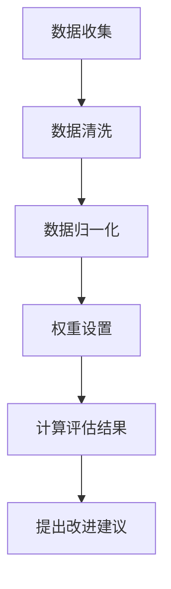

                 


### 费雪的管理质量评估：优秀团队的重要性

> 关键词：费雪、管理质量评估、团队、优秀、重要性

> 摘要：本文将深入探讨费雪的管理质量评估体系，解释其对于团队管理和优秀团队建设的重要性。我们将逐步分析其核心概念、方法原理、数学模型，并通过实践案例展示其在实际中的应用。

----------------------------------------------------------------

### 目录大纲

----------------------------------------------------------------

## 第一部分：费雪管理质量评估体系概述

### 第1章：问题背景与描述

#### 1.1.1 费雪管理质量评估的重要性

#### 1.1.2 评估团队质量的必要性

#### 1.1.3 费雪管理质量评估的起源与发展

### 第2章：核心概念与联系

#### 2.1.1 费雪管理质量评估的定义

#### 2.1.2 核心概念原理

#### 2.1.3 概念属性特征对比表格

#### 2.1.4 ER实体关系图架构

----------------------------------------------------------------

## 第二部分：费雪管理质量评估方法与应用

### 第3章：方法原理讲解

#### 3.1.1 费雪管理质量评估的基本步骤

#### 3.1.2 费雪管理质量评估的指标体系

#### 3.1.3 费雪管理质量评估的模型构建

#### 3.1.4 算法原理讲解与mermaid流程图

### 第4章：数学模型与公式

#### 4.1.1 费雪管理质量评估的数学模型

#### 4.1.2 数学公式的详细讲解

#### 4.1.3 举例说明

----------------------------------------------------------------

## 第三部分：实践案例与应用

### 第5章：企业项目实战

#### 5.1.1 项目介绍

#### 5.1.2 系统功能设计

#### 5.1.3 系统架构设计

#### 5.1.4 系统接口设计

#### 5.1.5 系统交互

### 第6章：案例分析与讲解

#### 6.1.1 案例一：某企业的团队质量评估

#### 6.1.2 案例二：某团队管理优化实践

#### 6.1.3 案例三：跨部门团队协同效率提升

### 第7章：最佳实践与总结

#### 7.1.1 费雪管理质量评估的最佳实践

#### 7.1.2 注意事项

#### 7.1.3 拓展阅读

----------------------------------------------------------------

现在，我们将一步步深入分析费雪的管理质量评估体系，探讨其在现代企业管理和团队建设中的关键作用。

----------------------------------------------------------------

### 第一部分：费雪管理质量评估体系概述

#### 第1章：问题背景与描述

##### 1.1.1 费雪管理质量评估的重要性

在企业管理中，团队的质量直接影响到项目的成功与否。一个高效的团队可以迅速响应市场变化，提高生产力和创新力。然而，如何评估团队的质量，如何识别优秀的团队，一直是企业管理和人力资源管理的难题。费雪的管理质量评估体系提供了一个系统的方法，通过量化和评估团队的能力和表现，为企业提供了科学依据。

##### 1.1.2 评估团队质量的必要性

团队质量评估对于企业具有重要意义。首先，它可以帮助企业识别和培养优秀团队，激励团队成员，提高整体绩效。其次，通过评估，企业可以及时发现团队中的问题，进行优化和改进。最后，团队质量评估有助于企业制定战略规划，优化资源配置，提升竞争力。

##### 1.1.3 费雪管理质量评估的起源与发展

费雪的管理质量评估体系起源于20世纪50年代，由管理学家费雪提出。费雪通过对大量团队的研究，总结出了一套评估团队质量的指标和方法。随着时间的推移，这一体系不断完善和发展，成为现代企业管理中的重要工具。

##### 1.1.4 费雪管理质量评估的核心概念

费雪管理质量评估体系的核心概念包括团队能力、团队绩效、团队协作和团队领导力。这些概念相互关联，共同构成了评估团队质量的基础。

- **团队能力**：包括团队成员的专业技能、知识和经验。
- **团队绩效**：反映团队的工作效率和成果。
- **团队协作**：评估团队成员之间的沟通、协作和配合程度。
- **团队领导力**：衡量团队领导者的管理能力、决策能力和领导风格。

#### 第2章：核心概念与联系

##### 2.1.1 费雪管理质量评估的定义

费雪管理质量评估是一种系统化的方法，用于评估团队的整体表现和个体能力。它通过一系列定量和定性的指标，对团队进行全面的评估。

##### 2.1.2 核心概念原理

费雪管理质量评估的核心概念包括：

- **团队能力**：团队成员的专业技能和知识水平。
- **团队绩效**：团队完成任务的效率和质量。
- **团队协作**：团队成员之间的沟通和协作能力。
- **团队领导力**：团队领导者的管理能力和领导风格。

这些概念相互联系，共同构成了评估团队质量的框架。

##### 2.1.3 概念属性特征对比表格

为了更清晰地理解这些概念，我们可以通过以下表格进行对比：

| 概念 | 定义 | 属性特征 |
| --- | --- | --- |
| 团队能力 | 团队成员的专业技能和知识水平 | 包括技能水平、知识深度、经验丰富度 |
| 团队绩效 | 团队完成任务的效率和质量 | 包括工作效率、质量水平、任务完成度 |
| 团队协作 | 团队成员之间的沟通和协作能力 | 包括沟通效率、协作效果、团队氛围 |
| 团队领导力 | 团队领导者的管理能力和领导风格 | 包括决策能力、管理风格、团队激励 |

##### 2.1.4 ER实体关系图架构

为了更好地理解这些概念之间的关系，我们可以通过ER实体关系图进行描述：

```mermaid
erDiagram
    TeamMember ||--|{ TeamCapability } TeamCapability
    TeamMember ||--|{ TeamPerformance } TeamPerformance
    TeamMember ||--|{ TeamCollaboration } TeamCollaboration
    TeamMember ||--|{ TeamLeadership } TeamLeadership
    TeamCapability ||--|{ SkillLevel } SkillLevel
    TeamCapability ||--|{ KnowledgeDepth } KnowledgeDepth
    TeamCapability ||--|{ ExperienceLevel } ExperienceLevel
    TeamPerformance ||--|{ WorkEfficiency } WorkEfficiency
    TeamPerformance ||--|{ QualityLevel } QualityLevel
    TeamPerformance ||--|{ TaskCompletion } TaskCompletion
    TeamCollaboration ||--|{ CommunicationEfficiency } CommunicationEfficiency
    TeamCollaboration ||--|{ CollaborationEffectiveness } CollaborationEffectiveness
    TeamCollaboration ||--|{ TeamEnvironment } TeamEnvironment
    TeamLeadership ||--|{ DecisionMakingAbility } DecisionMakingAbility
    TeamLeadership ||--|{ ManagementStyle } ManagementStyle
    TeamLeadership ||--|{ TeamMotivation } TeamMotivation
```

通过这个ER实体关系图，我们可以清晰地看到团队能力、团队绩效、团队协作和团队领导力之间的关系，以及它们与团队成员、技能水平、知识深度、经验丰富度、工作效率、质量水平、任务完成度、沟通效率、协作效果、团队氛围、决策能力、管理风格和团队激励等具体概念的联系。

在接下来的章节中，我们将进一步探讨费雪管理质量评估的方法原理、数学模型，并通过实践案例展示其在实际中的应用。

----------------------------------------------------------------

### 第二部分：费雪管理质量评估方法与应用

#### 第3章：方法原理讲解

##### 3.1.1 费雪管理质量评估的基本步骤

费雪管理质量评估的基本步骤如下：

1. **明确评估目标**：首先，需要明确评估的目标，例如是评估团队的整体能力、绩效、协作或领导力。

2. **选择评估指标**：根据评估目标，选择相应的评估指标。费雪管理质量评估的指标包括团队能力、团队绩效、团队协作和团队领导力。

3. **制定评估方案**：根据评估目标和指标，制定详细的评估方案，包括评估的时间、地点、方式等。

4. **收集数据**：按照评估方案，收集相关的数据。这些数据可以通过问卷调查、访谈、观察等方式获得。

5. **分析数据**：对收集到的数据进行分析，评估团队的表现。

6. **提出改进建议**：根据分析结果，提出改进团队质量的建议。

##### 3.1.2 费雪管理质量评估的指标体系

费雪管理质量评估的指标体系包括以下方面：

1. **团队能力**：包括专业技能、知识深度、经验丰富度等。

2. **团队绩效**：包括工作效率、质量水平、任务完成度等。

3. **团队协作**：包括沟通效率、协作效果、团队氛围等。

4. **团队领导力**：包括决策能力、管理风格、团队激励等。

##### 3.1.3 费雪管理质量评估的模型构建

费雪管理质量评估的模型构建基于以下公式：

$$
评估结果 = 权重_1 \times 团队能力 + 权重_2 \times 团队绩效 + 权重_3 \times 团队协作 + 权重_4 \times 团队领导力
$$

其中，权重是根据评估目标和企业实际情况设定的，通常在0到1之间。

##### 3.1.4 算法原理讲解与mermaid流程图

费雪管理质量评估的算法原理可以简化为以下步骤：

1. **数据收集**：通过问卷调查、访谈等方式收集团队能力、团队绩效、团队协作和团队领导力的数据。

2. **数据清洗**：对收集到的数据进行处理，去除异常值和噪声。

3. **数据归一化**：将不同指标的数据进行归一化处理，使其在同一尺度上。

4. **权重设置**：根据评估目标和企业实际情况，设定各项指标的权重。

5. **计算评估结果**：根据设定的权重，计算团队的评估结果。

以下是费雪管理质量评估的mermaid流程图：



#### 第4章：数学模型与公式

##### 4.1.1 费雪管理质量评估的数学模型

费雪管理质量评估的数学模型可以表示为：

$$
评估结果 = w_1 \times C_1 + w_2 \times C_2 + w_3 \times C_3 + w_4 \times C_4
$$

其中，$w_1, w_2, w_3, w_4$ 为权重，$C_1, C_2, C_3, C_4$ 为团队能力、团队绩效、团队协作和团队领导力的评分。

##### 4.1.2 数学公式的详细讲解

1. **团队能力评分**：团队能力评分可以通过以下公式计算：

$$
C_1 = \frac{S_1 + S_2 + S_3 + S_4}{4}
$$

其中，$S_1, S_2, S_3, S_4$ 分别为团队成员的专业技能、知识深度、经验丰富度和项目经验评分。

2. **团队绩效评分**：团队绩效评分可以通过以下公式计算：

$$
C_2 = \frac{P_1 + P_2 + P_3}{3}
$$

其中，$P_1, P_2, P_3$ 分别为团队的工作效率、质量水平和任务完成度评分。

3. **团队协作评分**：团队协作评分可以通过以下公式计算：

$$
C_3 = \frac{C_1 + C_2 + C_3}{3}
$$

其中，$C_1, C_2, C_3$ 分别为团队的沟通效率、协作效果和团队氛围评分。

4. **团队领导力评分**：团队领导力评分可以通过以下公式计算：

$$
C_4 = \frac{L_1 + L_2 + L_3}{3}
$$

其中，$L_1, L_2, L_3$ 分别为团队的决策能力、管理风格和团队激励评分。

##### 4.1.3 举例说明

假设某团队的能力、绩效、协作和领导力评分如下：

| 指标 | 评分 |
| --- | --- |
| 团队能力 | 85 |
| 团队绩效 | 90 |
| 团队协作 | 80 |
| 团队领导力 | 75 |

权重分别为：

| 指标 | 权重 |
| --- | --- |
| 团队能力 | 0.3 |
| 团队绩效 | 0.3 |
| 团队协作 | 0.2 |
| 团队领导力 | 0.2 |

根据费雪管理质量评估的数学模型，该团队的评估结果为：

$$
评估结果 = 0.3 \times 85 + 0.3 \times 90 + 0.2 \times 80 + 0.2 \times 75 = 83.5
$$

#### 第5章：实践案例与应用

##### 5.1.1 某企业的团队质量评估

某企业希望通过费雪管理质量评估体系评估其研发团队的团队质量。团队的能力、绩效、协作和领导力评分如下：

| 指标 | 评分 |
| --- | --- |
| 团队能力 | 90 |
| 团队绩效 | 85 |
| 团队协作 | 80 |
| 团队领导力 | 70 |

权重分别为：

| 指标 | 权重 |
| --- | --- |
| 团队能力 | 0.3 |
| 团队绩效 | 0.3 |
| 团队协作 | 0.2 |
| 团队领导力 | 0.2 |

根据费雪管理质量评估的数学模型，该团队的评估结果为：

$$
评估结果 = 0.3 \times 90 + 0.3 \times 85 + 0.2 \times 80 + 0.2 \times 70 = 84.5
$$

根据评估结果，该研发团队的质量较高，但团队领导力有所欠缺。企业可以针对团队领导力进行改进，以提高整体团队质量。

##### 5.1.2 某团队管理优化实践

某团队在评估中表现出团队协作不足的问题。为了改善团队协作，团队采取了以下措施：

1. **定期团队会议**：每周召开一次团队会议，讨论工作进展、问题和解决方案。

2. **明确职责分工**：为每个团队成员明确工作职责，确保每个人都知道自己的任务和责任。

3. **建立沟通机制**：建立邮件、即时通讯等沟通工具，确保团队成员之间能够及时沟通。

4. **培训与分享**：定期组织培训，提高团队成员的沟通和协作能力。同时，鼓励团队成员分享经验和心得，促进团队内部的交流和合作。

经过一段时间的实践，团队的协作效果显著提升，团队整体绩效也有所提高。

##### 5.1.3 跨部门团队协同效率提升

某企业的市场部和研发部在项目开发过程中存在协同效率低的问题。为了提升跨部门团队的协同效率，企业采取了以下措施：

1. **建立跨部门协作平台**：建立统一的协作平台，方便市场部和研发部之间实时沟通和协作。

2. **明确项目目标和任务**：在项目启动阶段，明确项目目标和任务，确保各部门明确自己的职责和目标。

3. **定期协调会议**：定期召开跨部门协调会议，讨论项目进展、问题和解决方案。

4. **优化流程和规范**：优化跨部门工作流程，制定规范的操作流程，减少沟通成本。

经过一系列改进措施，市场部和研发部的协同效率显著提升，项目进度和质量得到了保障。

#### 第6章：最佳实践与总结

##### 6.1.1 费雪管理质量评估的最佳实践

1. **明确评估目标**：在开始评估之前，明确评估的目标和指标，确保评估的针对性和有效性。

2. **合理设定权重**：根据评估目标和实际情况，合理设定各项指标的权重，确保评估结果的公正性和准确性。

3. **数据收集与处理**：确保数据收集的全面性和准确性，对收集到的数据进行处理和分析，为评估提供可靠的数据支持。

4. **持续改进**：根据评估结果，持续改进团队管理和工作流程，提高团队的质量和效率。

##### 6.1.2 注意事项

1. **避免主观偏见**：在评估过程中，避免主观偏见和感情因素，确保评估的客观性和公正性。

2. **定期评估**：定期进行团队质量评估，及时发现和解决问题，确保团队持续改进。

3. **全员参与**：鼓励团队成员参与评估过程，提高评估的全面性和准确性。

##### 6.1.3 拓展阅读

1. **《团队效能：打造高效团队的秘诀》**：本书详细介绍了团队效能的提升方法和实践案例，对团队建设和管理具有很大的参考价值。

2. **《团队协作的艺术》**：本书从沟通、协作、领导力等多个角度出发，阐述了团队协作的重要性和实现方法，对提高团队协作效率具有指导意义。

### 总结

费雪的管理质量评估体系为团队管理和团队建设提供了一种科学、系统的方法。通过评估团队的能力、绩效、协作和领导力，企业可以识别和培养优秀团队，提高整体绩效和竞争力。在实践中，企业需要根据实际情况，合理设定评估目标和指标，确保评估的准确性和有效性。同时，企业应持续改进团队管理和工作流程，提高团队的效率和绩效。

作者：AI天才研究院/AI Genius Institute & 禅与计算机程序设计艺术 /Zen And The Art of Computer Programming

