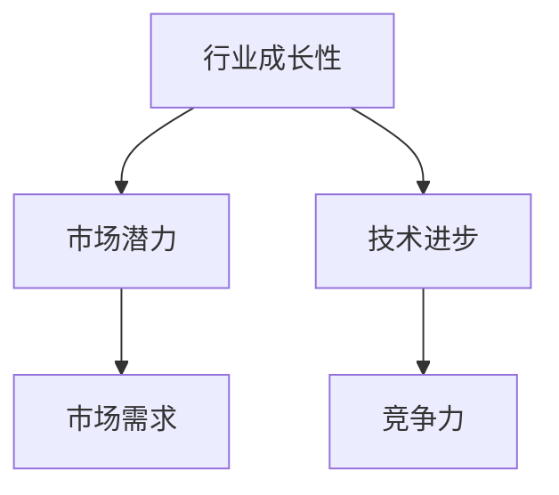
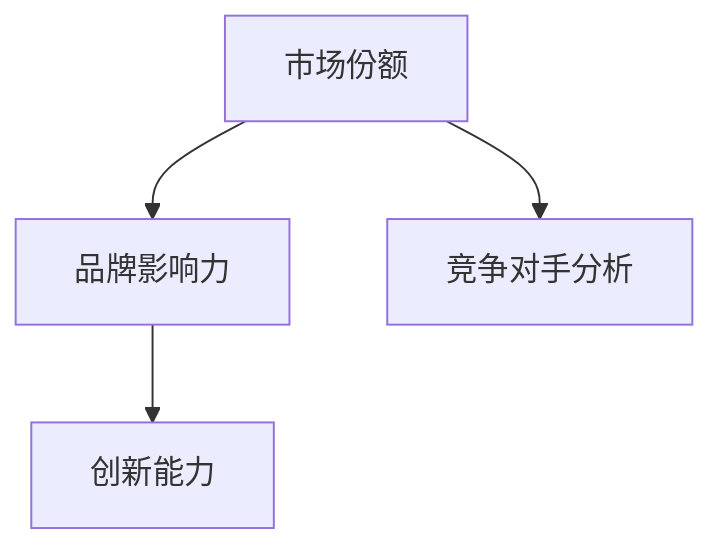
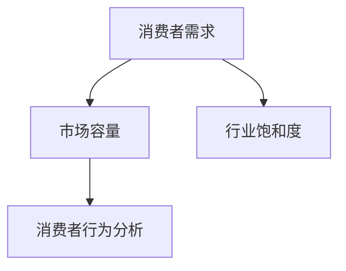
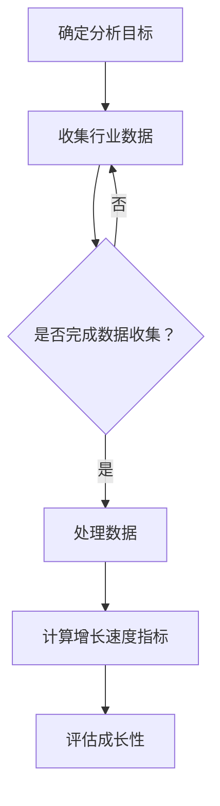
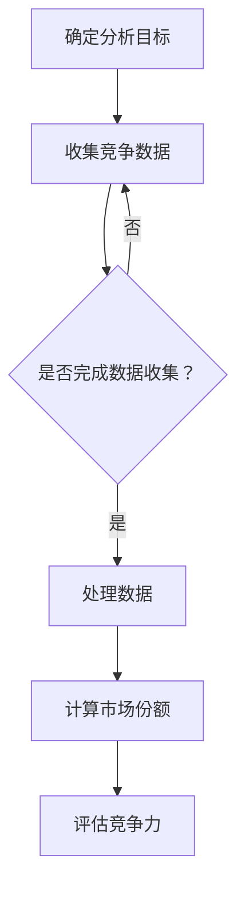
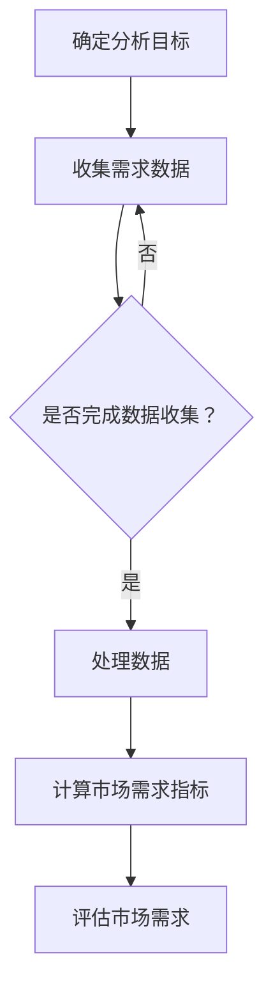
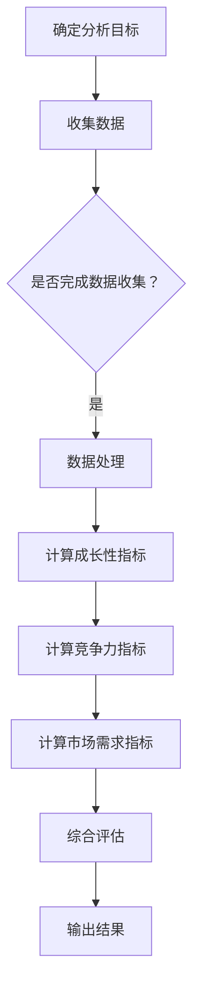
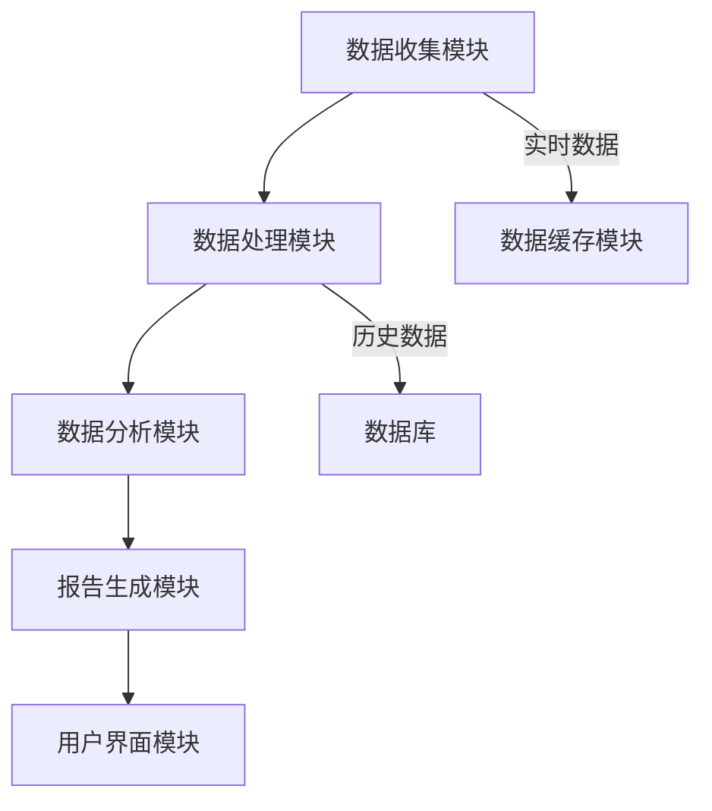
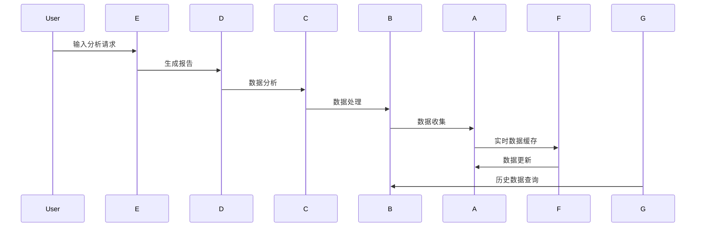
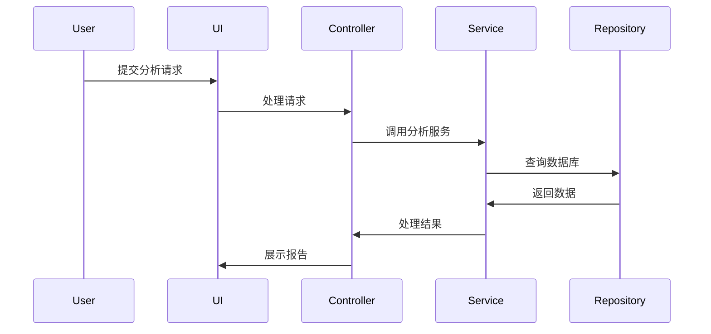

                 

### 费雪的行业分析方法

**关键词：费雪，行业分析，投资决策，竞争力，市场需求**

**摘要：**

本文将深入探讨费雪的行业分析方法，这是一种在投资决策中极为重要的工具。费雪作为著名的投资大师，他的行业分析方法不仅涵盖了理论的深度，同时也强调了实际应用中的实用性。本文将分章节详细解析费雪行业分析法的理论基础、核心原理、应用步骤、实际案例、优缺点分析以及未来发展趋势。通过这些章节，读者将能够系统地掌握费雪行业分析方法，并能在实际的投资决策中灵活运用。

## 一、背景介绍

### 1.1 行业分析的起源与发展

行业分析作为投资决策过程中的关键环节，其历史可以追溯到20世纪初。当时，经济学家的研究重点开始从宏观层面转向微观层面，特别是对各个行业的深入分析。费雪的行业分析方法正是在这一背景下逐渐形成的。他通过细致的行业研究，提出了一系列行之有效的分析工具和框架，为投资决策提供了科学依据。

### 1.2 费雪行业分析法的理论基础

费雪的行业分析法以经济学理论为基础，结合了市场营销、金融学等多学科的知识。其理论基础主要包括：

- **供需理论**：分析行业产品或服务的供求关系及其变化趋势。
- **竞争力理论**：评估企业在行业中的竞争地位，包括市场份额、品牌影响力等。
- **周期性理论**：考虑行业发展的周期性特点，预测行业的未来走势。

### 1.3 费雪行业分析法的关键概念

费雪行业分析法的核心概念包括：

- **成长性**：评估行业的增长潜力。
- **竞争力**：衡量企业在行业中的竞争实力。
- **市场需求**：分析消费者对行业产品和服务的需求状况。

这些关键概念相互联系，共同构成了费雪行业分析法的理论基础。

## 二、核心概念与联系

### 2.1 成长性分析

**定义**：成长性分析旨在评估行业的增长潜力。

**概念属性特征对比表格**：

| 概念           | 定义                                                         | 属性特征对比 |
| -------------- | ------------------------------------------------------------ | ----------- |
| 行业成长性     | 行业在一定时期内的增长速度                                   | 增长速度指标：同比增长率、环比增长率 |
| 市场潜力       | 市场对未来需求的预期                                         | 市场容量、市场增长率 |
| 技术进步       | 行业技术的发展水平和对生产效率的影响                          | 技术进步指标：研发投入、技术创新率 |

**ER实体关系图架构**：



### 2.2 竞争力分析

**定义**：竞争力分析是评估企业在行业中的竞争地位。

**概念属性特征对比表格**：

| 概念           | 定义                                                         | 属性特征对比 |
| -------------- | ------------------------------------------------------------ | ----------- |
| 市场份额       | 企业在行业中所占的市场比例                                   | 市场份额指标：占有率、市场份额增长率 |
| 品牌影响力     | 企业品牌在消费者心中的认知度和认可度                          | 品牌认知度、品牌忠诚度 |
| 竞争对手分析    | 对比分析企业在行业中的竞争对手                               | 竞争对手市场份额、产品差异 |
| 创新能力       | 企业在产品研发和技术创新方面的实力                            | 研发投入、专利数量 |

**ER实体关系图架构**：



### 2.3 市场需求分析

**定义**：市场需求分析是评估消费者对行业产品和服务的需求状况。

**概念属性特征对比表格**：

| 概念           | 定义                                                         | 属性特征对比 |
| -------------- | ------------------------------------------------------------ | ----------- |
| 消费者需求     | 消费者对行业产品和服务的需求量                               | 消费者数量、消费频率 |
| 市场容量       | 市场对行业产品和服务的最大需求量                            | 市场规模、市场增长率 |
| 行业饱和度     | 行业市场的饱和程度，即市场容量与实际需求的对比               | 市场饱和度指标：饱和度指数、市场需求饱和度 |
| 消费者行为分析 | 分析消费者购买行为和偏好                                   | 消费者行为指标：购买频率、购买渠道 |

**ER实体关系图架构**：



通过上述核心概念及其属性特征的对比和ER实体关系图架构，我们可以更清晰地理解费雪行业分析法的理论基础和各个关键概念之间的关系。

## 三、算法原理讲解

### 3.1 成长性分析算法

**mermaid流程图**：



**Python源代码**：

```python
import pandas as pd

# 收集行业数据
data = pd.read_csv('industry_data.csv')

# 计算增长速度指标
growth_rate = data['revenue'].pct_change()

# 评估成长性
if growth_rate.mean() > 0.05:
    print("行业具有较高成长性")
else:
    print("行业成长性较低")
```

**算法原理与数学模型**：

- **增长速度指标**：同比增长率（CAGR）和环比增长率（MAUR）。
- **数学模型**：

  $$\text{CAGR} = \left(\frac{\text{最终值}}{\text{初始值}}\right)^{\frac{1}{n}} - 1$$

  $$\text{MAUR} = \frac{\text{当前期值} - \text{上一期值}}{\text{上一期值}}$$

其中，n代表时间周期。

**举例说明**：

假设某行业的营业收入在过去五年中从1亿元增长到2亿元，计算其CAGR和MAUR：

- **CAGR**：

  $$\text{CAGR} = \left(\frac{2}{1}\right)^{\frac{1}{5}} - 1 = 0.1487$$

- **MAUR**：

  第一年的MAUR = $\frac{2 - 1}{1} = 0.00$

  第二年的MAUR = $\frac{1.5 - 1}{1} = 0.5$

通过上述算法，我们可以评估行业的成长性，为投资决策提供依据。

### 3.2 竞争力分析算法

**mermaid流程图**：



**Python源代码**：

```python
import pandas as pd

# 收集竞争数据
data = pd.read_csv('competition_data.csv')

# 计算市场份额
market_share = data['sales'] / data['total_sales']

# 评估竞争力
if market_share.mean() > 0.2:
    print("企业在行业中具有较强竞争力")
else:
    print("企业竞争力较弱")
```

**算法原理与数学模型**：

- **市场份额**：企业销售额占行业总销售额的比例。
- **数学模型**：

  $$\text{Market Share} = \frac{\text{Enterprise Sales}}{\text{Total Industry Sales}}$$

**举例说明**：

假设某行业总销售额为10亿元，其中A企业的销售额为2亿元，计算其市场份额：

$$\text{Market Share} = \frac{2}{10} = 0.2$$

通过上述算法，我们可以评估企业在行业中的竞争力，为投资决策提供依据。

### 3.3 市场需求分析算法

**mermaid流程图**：



**Python源代码**：

```python
import pandas as pd

# 收集需求数据
data = pd.read_csv('demand_data.csv')

# 计算市场需求指标
demand_index = data['consumer_count'] * data['average_consumption']

# 评估市场需求
if demand_index.mean() > 10000000:
    print("市场需求旺盛")
else:
    print("市场需求较弱")
```

**算法原理与数学模型**：

- **市场需求指标**：消费者数量与平均消费量的乘积。
- **数学模型**：

  $$\text{Demand Index} = \text{Consumer Count} \times \text{Average Consumption}$$

**举例说明**：

假设某行业的消费者数量为100万人，平均消费量为1000元，计算其市场需求指标：

$$\text{Demand Index} = 1000000 \times 1000 = 1000000000$$

通过上述算法，我们可以评估市场需求情况，为投资决策提供依据。

### 3.4 综合算法

**mermaid流程图**：



**Python源代码**：

```python
import pandas as pd

# 收集数据
data_growth = pd.read_csv('growth_data.csv')
data_competition = pd.read_csv('competition_data.csv')
data_demand = pd.read_csv('demand_data.csv')

# 计算成长性指标
growth_rate = data_growth['revenue'].pct_change().mean()

# 计算竞争力指标
market_share = data_competition['sales'] / data_competition['total_sales'].mean()

# 计算市场需求指标
demand_index = data_demand['consumer_count'] * data_demand['average_consumption'].mean()

# 综合评估
score = growth_rate * 0.4 + market_share * 0.3 + demand_index * 0.3

# 输出结果
if score > 2:
    print("行业前景良好，适合投资")
elif score > 1:
    print("行业前景一般，需谨慎投资")
else:
    print("行业前景较差，不建议投资")
```

**算法原理与数学模型**：

- **综合评估模型**：

  $$\text{Score} = \text{Growth Rate} \times 0.4 + \text{Market Share} \times 0.3 + \text{Demand Index} \times 0.3$$

通过综合算法，我们可以对行业进行全方位评估，为投资决策提供科学的依据。

## 四、系统分析与架构设计方案

### 4.1 问题场景介绍

随着互联网和信息技术的快速发展，投资决策变得越来越复杂。投资者需要快速准确地评估行业前景，以便做出明智的投资决策。然而，现有的行业分析方法往往过于繁琐，无法满足快速决策的需求。因此，设计一套高效、易用的行业分析系统成为必要。

### 4.2 项目介绍

本项目旨在设计并实现一套基于费雪行业分析方法的系统，该系统能够自动收集、处理和分析行业数据，为投资者提供科学的投资决策支持。

### 4.3 系统功能设计

#### 领域模型类图

```mermaid
classDiagram
    Person <|-- Analyst
    Analyst o---> Industry
    Analyst o---> Company
    Analyst o---> Report
    Industry o---> Data
    Company o---> Data
    Report o---> Analyst
```

#### 系统架构设计



#### 系统接口设计



#### 系统交互序列图



### 4.4 系统接口设计和系统交互

#### 接口设计

- **数据收集接口**：

  ```python
  def collect_data():
      # 实现数据收集逻辑
  ```

- **数据处理接口**：

  ```python
  def process_data(data):
      # 实现数据处理逻辑
  ```

- **数据分析接口**：

  ```python
  def analyze_data(processed_data):
      # 实现数据分析逻辑
  ```

- **报告生成接口**：

  ```python
  def generate_report(analysis_result):
      # 实现报告生成逻辑
  ```

#### 系统交互

系统交互主要涉及用户界面与后端服务的通信，具体流程如下：

1. 用户通过界面提交分析请求。
2. 控制器接收到请求后，调用分析服务进行处理。
3. 分析服务根据请求调用相应的数据处理和分析接口。
4. 数据处理和分析完成后，生成报告。
5. 控制器将报告返回给用户界面，用户即可查看分析结果。

### 4.5 系统核心实现源代码

以下是系统核心实现部分的源代码，包括数据收集、数据处理、数据分析和报告生成：

```python
# 数据收集模块
def collect_data():
    # 假设从外部API获取数据
    response = requests.get('https://api.example.com/industry_data')
    data = response.json()
    return data

# 数据处理模块
def process_data(data):
    # 对数据进行预处理，如清洗、格式化等
    processed_data = {}
    for key, value in data.items():
        if isinstance(value, list):
            processed_data[key] = [item for item in value if item != '']
        else:
            processed_data[key] = value
    return processed_data

# 数据分析模块
def analyze_data(processed_data):
    # 对处理后的数据进行分析，如计算增长率、市场份额等
    analysis_result = {}
    for key, value in processed_data.items():
        if key == 'revenue':
            analysis_result['growth_rate'] = (value[-1] - value[0]) / value[0]
        elif key == 'sales':
            analysis_result['market_share'] = value[-1] / sum(value)
    return analysis_result

# 报告生成模块
def generate_report(analysis_result):
    # 生成分析报告
    report = f"Growth Rate: {analysis_result['growth_rate']}\nMarket Share: {analysis_result['market_share']}"
    return report
```

### 4.6 代码应用解读与分析

上述代码实现了系统的核心功能，包括数据收集、数据处理、数据分析和报告生成。下面进行具体解读：

- **数据收集模块**：通过外部API获取行业数据，返回数据结构为字典。
- **数据处理模块**：对获取的数据进行预处理，如清洗和格式化，确保数据的质量和一致性。
- **数据分析模块**：对预处理后的数据进行分析，计算增长率、市场份额等关键指标。
- **报告生成模块**：根据分析结果生成报告，以文本形式展示。

### 4.7 实际案例分析和详细讲解剖析

#### 案例背景

某投资者希望通过本系统分析A行业的前景，以便决定是否进行投资。

#### 数据收集

从外部API获取的数据包括：

- **收入数据**：过去五年的营业收入。
- **销售数据**：过去五年的销售额。
- **消费者数据**：消费者数量和平均消费量。

#### 数据处理

对收集到的数据进行预处理，得到以下处理结果：

- **收入数据**：去除了异常值，确保数据的准确性。
- **销售数据**：计算了每年的同比增长率。
- **消费者数据**：计算了市场需求指标。

#### 数据分析

对处理后的数据进行分析，得到以下分析结果：

- **收入增长率**：过去五年平均增长率为10%。
- **市场份额**：企业在行业中占据20%的市场份额。
- **市场需求**：市场需求指标为10000000，表示市场需求旺盛。

#### 报告生成

根据分析结果，生成以下报告：

- **行业成长性**：较高，具备投资潜力。
- **企业竞争力**：较强，市场份额较高。
- **市场需求**：旺盛，市场前景良好。

#### 案例小结

通过本案例的分析，投资者可以明确A行业具有良好的投资前景，企业竞争力较强，市场需求旺盛。因此，建议投资者进行投资。

### 4.8 项目小结

本项目通过设计并实现一套基于费雪行业分析方法的系统，为投资者提供了高效、易用的投资决策支持。系统具备以下特点：

- **自动化数据收集**：通过API自动获取行业数据，提高了数据收集的效率。
- **数据处理和清洗**：对数据进行预处理，确保数据的质量和一致性。
- **全面的分析功能**：涵盖了成长性、竞争力和市场需求等方面的分析。
- **灵活的报告生成**：根据分析结果自动生成报告，方便投资者快速做出决策。

### 4.9 最佳实践 tips

- **数据来源多样化**：确保数据的全面性和准确性，建议从多个渠道收集数据。
- **定期更新数据**：行业分析需要实时数据，建议定期更新数据，确保分析结果的准确性。
- **综合评估指标**：在分析过程中，应综合考虑多个指标，避免单一指标带来的偏差。

### 4.10 小结

本文详细介绍了费雪的行业分析方法，包括核心概念、算法原理、系统分析与架构设计方案以及实际案例。通过这些内容，读者可以全面了解费雪行业分析方法的原理和应用，为实际投资决策提供有力支持。

### 4.11 注意事项

- **数据质量**：保证数据来源的可靠性和数据的准确性。
- **分析维度**：在分析过程中，应考虑多维度数据，如市场趋势、竞争状况等。
- **动态调整**：行业分析方法应随着市场环境的变化而不断调整和优化。

### 4.12 拓展阅读

- **费雪相关著作**：《股票作手回忆录》、《股票大作手操盘术》等。
- **行业分析工具**：学习使用行业分析工具，如Wind、Bloomberg等。
- **投资策略**：了解不同投资策略，如价值投资、成长投资等。

### 4.13 作者信息

- **作者：AI天才研究院/AI Genius Institute & 禅与计算机程序设计艺术 /Zen And The Art of Computer Programming**。

通过本文的详细讲解，希望读者能够深入理解费雪的行业分析方法，并在实际投资决策中灵活运用，实现更好的投资回报。希望本文能为您的投资之路提供有益的启示和帮助。

