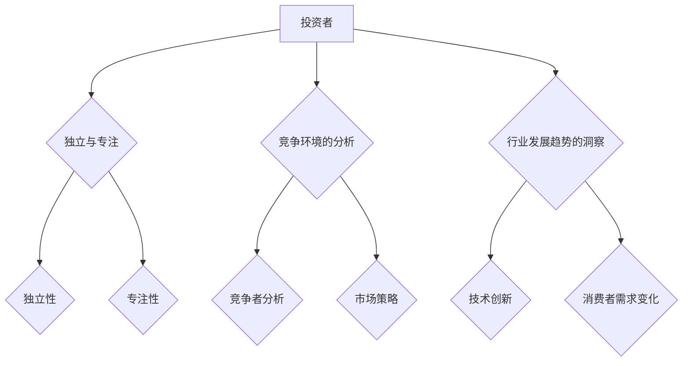
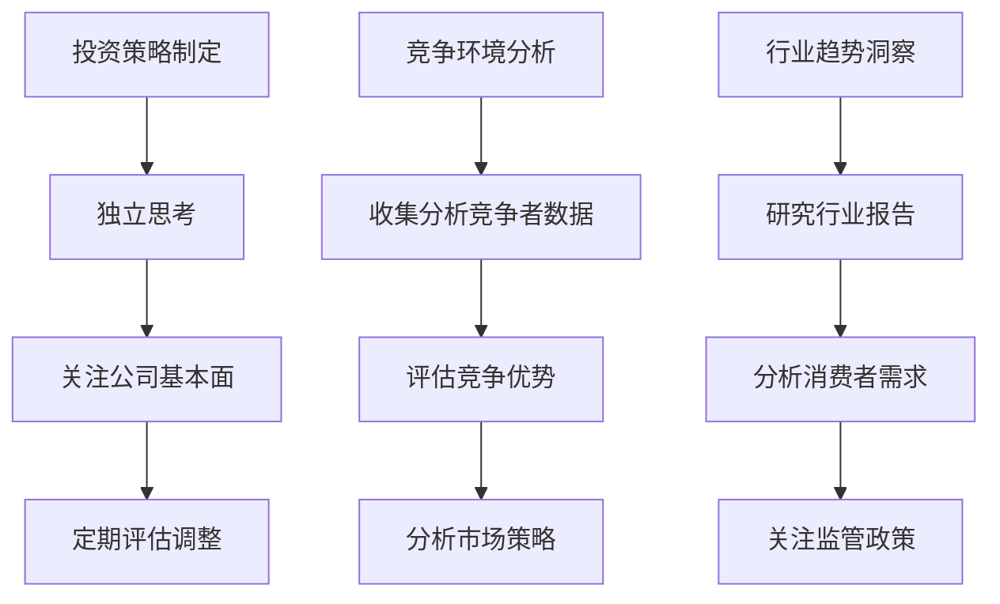
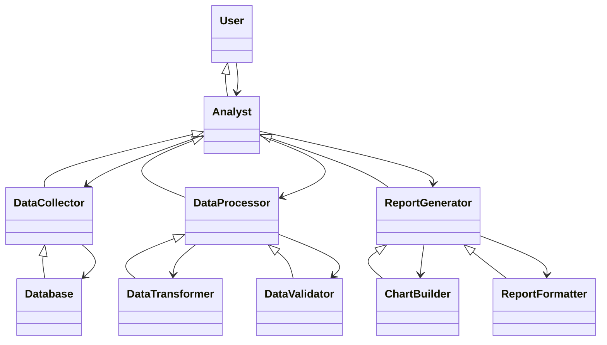
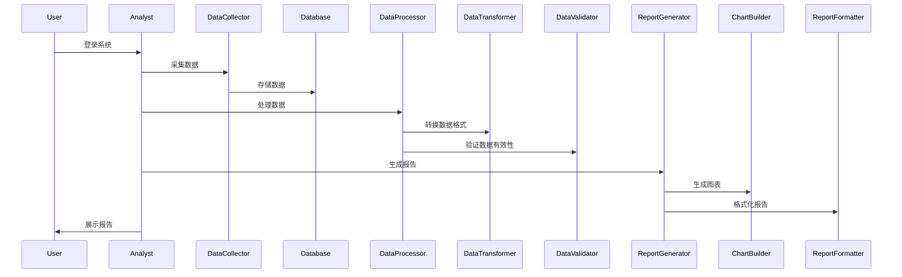
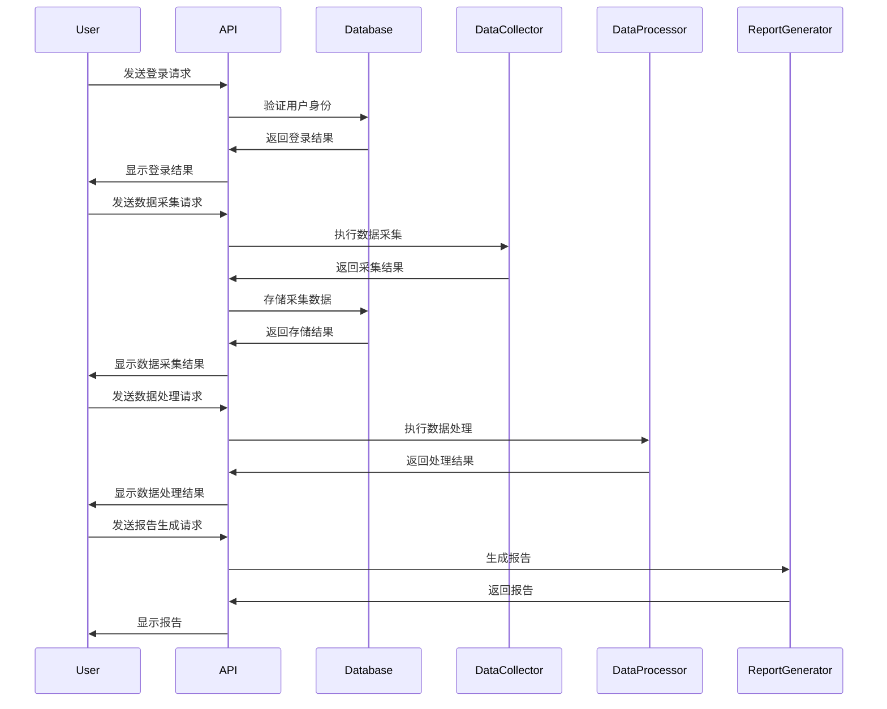

                 

# 费雪的行业研究方法：了解公司的竞争环境

## 关键词：费雪、行业研究、竞争环境、公司分析、投资策略

> 摘要：本文将深入探讨费雪的行业研究方法，通过分析其核心原则和实际应用，帮助投资者更好地了解公司的竞争环境，从而制定有效的投资策略。

## 第一部分：引言

### 1.1 费雪的行业研究方法概述

沃伦·巴菲特的投资伙伴查理·芒格曾评价费雪（Philip Fisher）为“世界上最伟大的投资者之一”。费雪以其独特的行业研究方法而闻名，这种方法不仅适用于股票投资，也可广泛应用于企业管理和战略规划。

### 1.2 研究行业的必要性

在投资过程中，了解公司的竞争环境至关重要。费雪认为，投资者应该深入理解所处行业的基本面，包括行业结构、市场规模、成长潜力、竞争对手等，以便做出明智的投资决策。

### 1.3 研究方法的框架与步骤

费雪的行业研究方法主要包括以下几个步骤：

1. **独立与专注**：投资者应该独立思考，避免受市场情绪和他人意见的影响。
2. **竞争环境的分析**：分析行业内主要竞争者的优势和劣势，以及公司的竞争优势。
3. **对行业发展趋势的洞察**：预测行业未来的发展方向和趋势，为公司战略制定提供指导。

## 第二部分：费雪的行业研究方法的核心原则

### 2.1 独立与专注

费雪认为，投资者应该独立思考，对市场保持怀疑态度。他建议投资者关注公司的基本面，而非短期市场波动。

### 2.2 竞争环境的分析

费雪强调，了解行业内的竞争环境至关重要。他建议投资者分析竞争对手的营销策略、产品差异化和市场份额。

### 2.3 对行业发展趋势的洞察

费雪认为，投资者应该关注行业未来的发展趋势。这包括技术创新、消费者需求变化和行业监管政策等。

## 第三部分：了解公司的竞争环境

### 3.1 公司在行业中的定位

投资者应该了解公司在行业中的定位，包括市场份额、产品差异化和竞争优势。

### 3.2 行业内主要竞争者分析

分析行业内主要竞争者的优势、劣势和市场策略，有助于投资者了解公司的竞争环境。

### 3.3 竞争策略与竞争优势

投资者应该分析公司的竞争策略，了解其如何利用自身优势应对市场竞争。

## 第四部分：费雪的行业研究方法应用实例

### 4.1 案例分析：苹果公司的竞争策略

苹果公司通过不断创新和产品差异化，成为全球最具价值的公司之一。本文将分析苹果公司的竞争策略。

### 4.2 案例分析：谷歌的商业模式与竞争优势

谷歌通过其独特的商业模式和强大的技术优势，在互联网行业占据主导地位。本文将探讨谷歌的竞争优势。

### 4.3 行业研究方法在不同领域的应用

费雪的行业研究方法不仅适用于互联网行业，也可广泛应用于其他行业，如医药、消费品等。

## 第五部分：行业研究与公司分析的整合

### 5.1 整合分析与决策

投资者应该将行业研究和公司分析结合起来，制定符合自身投资策略的决策。

### 5.2 风险管理与应对策略

了解公司的竞争环境和行业发展趋势，有助于投资者制定有效的风险管理策略。

### 5.3 长期价值投资的视角

费雪提倡长期价值投资，投资者应从长期视角评估公司的竞争力和成长潜力。

## 第六部分：费雪的行业研究方法实践与思考

### 6.1 研究方法在实际中的应用

本文将结合实际案例，探讨费雪的行业研究方法在实际投资中的应用。

### 6.2 研究方法的发展与挑战

费雪的行业研究方法并非完美无缺，本文将分析其局限性及未来发展方向。

### 6.3 投资者的实践反思与建议

本文将分享投资者的实践经验，为其他投资者提供有益的启示和建议。

## 第七部分：本章小结

### 7.1 费雪的行业研究方法的重要性

本文总结费雪的行业研究方法的重要性，并强调其在投资决策中的应用价值。

### 7.2 研究方法的实际应用价值

本文分析费雪的行业研究方法在实际投资中的实际应用价值。

### 7.3 对未来研究的展望

本文展望费雪的行业研究方法在未来的发展方向，为投资者提供有益的参考。

----------------------------------------------------------------

## 1. 引言

### 1.1 费雪的行业研究方法概述

费雪的行业研究方法是他投资哲学的重要组成部分。他认为，投资者应该深入了解公司的基本面，而不仅仅是关注股票价格。这种方法包括对行业、公司、管理层的深入研究，以及对未来发展趋势的预测。费雪认为，了解公司的竞争环境是投资成功的关键。

### 1.2 研究行业的必要性

在投资决策中，了解行业的基本面至关重要。这包括行业结构、市场规模、增长潜力、竞争格局等。通过深入研究行业，投资者可以识别行业的生命周期阶段，预测未来的发展趋势，从而做出更明智的投资决策。

### 1.3 研究方法的框架与步骤

费雪的行业研究方法主要包括以下几个步骤：

1. **确定投资领域**：投资者应该根据自己的兴趣和专业领域，选择具有潜力的投资领域。
2. **分析行业结构**：了解行业的市场规模、增长速度、生命周期阶段等。
3. **评估竞争环境**：分析行业内的主要竞争者，包括市场份额、产品差异化和竞争优势。
4. **预测未来趋势**：关注技术创新、消费者需求变化和行业监管政策等，预测行业未来的发展方向。

## 2. 费雪的行业研究方法的核心原则

### 2.1 独立与专注

费雪强调，投资者应该独立思考，避免受市场情绪和他人意见的影响。他提倡深入研究，从多个角度分析行业和公司，形成自己的观点。

### 2.2 竞争环境的分析

费雪认为，了解行业的竞争环境是投资成功的关键。投资者应该分析行业内的主要竞争者，了解他们的市场策略、产品差异化和竞争优势。

### 2.3 对行业发展趋势的洞察

费雪强调，投资者应该关注行业未来的发展趋势。这包括技术创新、消费者需求变化和行业监管政策等。通过预测未来趋势，投资者可以更好地把握投资机会。

## 3. 了解公司的竞争环境

### 3.1 公司在行业中的定位

了解公司在行业中的定位有助于投资者评估公司的竞争力和成长潜力。这包括市场份额、产品差异化、竞争优势等方面。

### 3.2 行业内主要竞争者分析

分析行业内主要竞争者的优势和劣势，可以帮助投资者了解行业的竞争格局。这包括市场份额、产品差异化和竞争优势等方面。

### 3.3 竞争策略与竞争优势

投资者应该分析公司的竞争策略，了解其如何利用自身优势应对市场竞争。这包括市场营销策略、产品创新策略、成本控制策略等。

## 4. 费雪的行业研究方法应用实例

### 4.1 案例分析：苹果公司的竞争策略

苹果公司是全球最具价值的科技公司之一，其成功得益于其独特的竞争策略。本文将分析苹果公司的竞争策略，包括产品差异化、市场营销和成本控制等方面。

### 4.2 案例分析：谷歌的商业模式与竞争优势

谷歌是全球最大的搜索引擎公司，其成功得益于其创新的商业模式和强大的技术优势。本文将探讨谷歌的竞争优势，包括市场领导地位、技术创新和广告业务等。

### 4.3 行业研究方法在不同领域的应用

费雪的行业研究方法不仅适用于互联网行业，也可广泛应用于其他行业，如医药、消费品等。本文将结合实际案例，分析行业研究方法在不同领域的应用。

## 5. 行业研究与公司分析的整合

### 5.1 整合分析与决策

投资者应该将行业研究和公司分析结合起来，形成全面的投资决策。本文将探讨如何整合行业研究和公司分析，制定有效的投资策略。

### 5.2 风险管理与应对策略

了解公司的竞争环境和行业发展趋势，有助于投资者制定有效的风险管理策略。本文将分析如何应对投资风险，包括市场风险、信用风险和操作风险等。

### 5.3 长期价值投资的视角

费雪提倡长期价值投资，投资者应从长期视角评估公司的竞争力和成长潜力。本文将探讨长期价值投资的理念和策略，以及如何在实践中应用。

## 6. 费雪的行业研究方法实践与思考

### 6.1 研究方法在实际中的应用

本文将结合实际案例，探讨费雪的行业研究方法在实际投资中的应用。本文将分析投资者如何在实际操作中运用费雪的行业研究方法，取得投资成功。

### 6.2 研究方法的发展与挑战

费雪的行业研究方法并非完美无缺，本文将分析其局限性及未来发展方向。本文将探讨如何改进和完善费雪的行业研究方法，提高投资决策的准确性。

### 6.3 投资者的实践反思与建议

本文将分享投资者的实践经验，为其他投资者提供有益的启示和建议。本文将分析投资者在实际操作中的经验教训，以及如何避免常见的投资误区。

## 7. 本章小结

### 7.1 费雪的行业研究方法的重要性

本文总结费雪的行业研究方法的重要性，并强调其在投资决策中的应用价值。本文认为，了解公司的竞争环境和行业发展趋势，是投资者成功的关键。

### 7.2 研究方法的实际应用价值

本文分析费雪的行业研究方法在实际投资中的实际应用价值。本文认为，投资者应该深入学习费雪的行业研究方法，并将其应用于实际投资中，提高投资收益。

### 7.3 对未来研究的展望

本文展望费雪的行业研究方法在未来的发展方向，为投资者提供有益的参考。本文认为，随着市场环境的变化，费雪的行业研究方法需要不断改进和创新，以适应新的挑战。

----------------------------------------------------------------

## 1. 引言

### 1.1 费雪的行业研究方法概述

费雪的行业研究方法是他投资哲学的重要组成部分。他认为，投资者应该深入了解公司的基本面，而不仅仅是关注股票价格。这种方法包括对行业、公司、管理层的深入研究，以及对未来发展趋势的预测。费雪认为，了解公司的竞争环境是投资成功的关键。

### 1.2 研究行业的必要性

在投资决策中，了解行业的基本面至关重要。这包括行业结构、市场规模、增长潜力、竞争格局等。通过深入研究行业，投资者可以识别行业的生命周期阶段，预测未来的发展趋势，从而做出更明智的投资决策。

### 1.3 研究方法的框架与步骤

费雪的行业研究方法主要包括以下几个步骤：

1. **确定投资领域**：投资者应该根据自己的兴趣和专业领域，选择具有潜力的投资领域。
2. **分析行业结构**：了解行业的市场规模、增长速度、生命周期阶段等。
3. **评估竞争环境**：分析行业内的主要竞争者，包括市场份额、产品差异化和竞争优势。
4. **预测未来趋势**：关注技术创新、消费者需求变化和行业监管政策等，预测行业未来的发展方向。

## 2. 费雪的行业研究方法的核心原则

### 2.1 独立与专注

费雪强调，投资者应该独立思考，避免受市场情绪和他人意见的影响。他提倡深入研究，从多个角度分析行业和公司，形成自己的观点。

### 2.2 竞争环境的分析

费雪认为，了解行业的竞争环境是投资成功的关键。投资者应该分析行业内的主要竞争者，了解他们的市场策略、产品差异化和竞争优势。

### 2.3 对行业发展趋势的洞察

费雪强调，投资者应该关注行业未来的发展趋势。这包括技术创新、消费者需求变化和行业监管政策等。通过预测未来趋势，投资者可以更好地把握投资机会。

## 3. 了解公司的竞争环境

### 3.1 公司在行业中的定位

了解公司在行业中的定位有助于投资者评估公司的竞争力和成长潜力。这包括市场份额、产品差异化、竞争优势等方面。

### 3.2 行业内主要竞争者分析

分析行业内主要竞争者的优势和劣势，可以帮助投资者了解行业的竞争格局。这包括市场份额、产品差异化和竞争优势等方面。

### 3.3 竞争策略与竞争优势

投资者应该分析公司的竞争策略，了解其如何利用自身优势应对市场竞争。这包括市场营销策略、产品创新策略、成本控制策略等。

## 4. 费雪的行业研究方法应用实例

### 4.1 案例分析：苹果公司的竞争策略

苹果公司是全球最具价值的科技公司之一，其成功得益于其独特的竞争策略。本文将分析苹果公司的竞争策略，包括产品差异化、市场营销和成本控制等方面。

### 4.2 案例分析：谷歌的商业模式与竞争优势

谷歌是全球最大的搜索引擎公司，其成功得益于其创新的商业模式和强大的技术优势。本文将探讨谷歌的竞争优势，包括市场领导地位、技术创新和广告业务等。

### 4.3 行业研究方法在不同领域的应用

费雪的行业研究方法不仅适用于互联网行业，也可广泛应用于其他行业，如医药、消费品等。本文将结合实际案例，分析行业研究方法在不同领域的应用。

## 5. 行业研究与公司分析的整合

### 5.1 整合分析与决策

投资者应该将行业研究和公司分析结合起来，形成全面的投资决策。本文将探讨如何整合行业研究和公司分析，制定有效的投资策略。

### 5.2 风险管理与应对策略

了解公司的竞争环境和行业发展趋势，有助于投资者制定有效的风险管理策略。本文将分析如何应对投资风险，包括市场风险、信用风险和操作风险等。

### 5.3 长期价值投资的视角

费雪提倡长期价值投资，投资者应从长期视角评估公司的竞争力和成长潜力。本文将探讨长期价值投资的理念和策略，以及如何在实践中应用。

## 6. 费雪的行业研究方法实践与思考

### 6.1 研究方法在实际中的应用

本文将结合实际案例，探讨费雪的行业研究方法在实际投资中的应用。本文将分析投资者如何在实际操作中运用费雪的行业研究方法，取得投资成功。

### 6.2 研究方法的发展与挑战

费雪的行业研究方法并非完美无缺，本文将分析其局限性及未来发展方向。本文将探讨如何改进和完善费雪的行业研究方法，提高投资决策的准确性。

### 6.3 投资者的实践反思与建议

本文将分享投资者的实践经验，为其他投资者提供有益的启示和建议。本文将分析投资者在实际操作中的经验教训，以及如何避免常见的投资误区。

## 7. 本章小结

### 7.1 费雪的行业研究方法的重要性

本文总结费雪的行业研究方法的重要性，并强调其在投资决策中的应用价值。本文认为，了解公司的竞争环境和行业发展趋势，是投资者成功的关键。

### 7.2 研究方法的实际应用价值

本文分析费雪的行业研究方法在实际投资中的实际应用价值。本文认为，投资者应该深入学习费雪的行业研究方法，并将其应用于实际投资中，提高投资收益。

### 7.3 对未来研究的展望

本文展望费雪的行业研究方法在未来的发展方向，为投资者提供有益的参考。本文认为，随着市场环境的变化，费雪的行业研究方法需要不断改进和创新，以适应新的挑战。

## 费雪的行业研究方法：核心概念与联系

### 1. 核心概念

费雪的行业研究方法包含三个核心概念：独立与专注、竞争环境的分析、行业发展趋势的洞察。

#### 独立与专注

**概念属性特征：**

- **独立性：** 投资者应独立思考，不受市场情绪和他人的影响。
- **专注性：** 投资者应对行业和公司进行深入研究，形成自己的观点。

#### 竞争环境的分析

**概念属性特征：**

- **竞争者分析：** 投资者应分析行业内的主要竞争者，包括市场份额、产品差异化和竞争优势。
- **市场策略：** 投资者应了解竞争者的市场策略，以及其如何影响公司的竞争力。

#### 行业发展趋势的洞察

**概念属性特征：**

- **技术创新：** 投资者应关注行业内的技术创新，以及其对行业未来发展的影响。
- **消费者需求变化：** 投资者应了解消费者需求的变化趋势，以及其对行业的影响。

### 2. 概念属性特征对比表格

| 概念        | 独立与专注 | 竞争环境的分析 | 行业发展趋势的洞察 |
| ----------- | ---------- | -------------- | --------------- |
| 独立性      | 高         | 中             | 中              |
| 专注性      | 高         | 中             | 中              |
| 竞争者分析  | 中         | 高             | 中              |
| 市场策略    | 中         | 高             | 中              |
| 技术创新    | 中         | 中             | 高              |
| 消费者需求变化 | 中         | 中             | 高              |

### 3. ER实体关系图架构的Mermaid流程图



通过上述核心概念的对比和Mermaid流程图的展示，我们可以更清晰地理解费雪的行业研究方法，并了解各个概念之间的联系和作用。

### 算法原理讲解

在费雪的行业研究方法中，算法原理主要包括以下几个方面：

1. **独立与专注**：投资者应独立思考，避免受市场情绪和他人意见的影响。这可以通过以下步骤实现：
   - **步骤1**：投资者应制定自己的投资策略，不受市场波动和他人意见的影响。
   - **步骤2**：投资者应持续关注公司的基本面，包括财务状况、管理团队和市场地位。
   - **步骤3**：投资者应定期评估和调整自己的投资策略，确保其与市场变化保持一致。

2. **竞争环境的分析**：投资者应深入分析行业内的竞争环境，包括主要竞争者的市场份额、产品差异化和竞争优势。这可以通过以下步骤实现：
   - **步骤1**：投资者应收集和分析行业内主要竞争者的财务数据、市场策略和产品特点。
   - **步骤2**：投资者应评估竞争者的市场份额，了解其竞争优势和劣势。
   - **步骤3**：投资者应分析竞争者的市场策略，预测其对公司的影响。

3. **行业发展趋势的洞察**：投资者应关注行业未来的发展趋势，包括技术创新、消费者需求变化和行业监管政策。这可以通过以下步骤实现：
   - **步骤1**：投资者应研究行业报告和学术论文，了解行业的发展趋势。
   - **步骤2**：投资者应分析消费者需求的变化，预测其对行业的影响。
   - **步骤3**：投资者应关注行业监管政策的变化，预测其对公司的影响。

#### Mermaid流程图：



通过上述算法原理讲解，我们可以看到费雪的行业研究方法是一个系统化的过程，投资者需要通过多个步骤来全面了解公司和行业的竞争环境，并做出明智的投资决策。

### 系统分析与架构设计方案

#### 问题场景介绍

在当今竞争激烈的市场环境中，企业需要深入了解行业动态、竞争对手和自身优势，以便制定有效的战略决策。本案例将介绍一个用于行业研究的系统，该系统旨在帮助投资者分析行业环境，了解公司竞争力和未来发展趋势。

#### 项目介绍

本系统名为“行业研究与分析平台”，它是一个基于Web的应用程序，为用户提供以下功能：

1. **数据采集**：自动收集行业报告、公司财务数据、新闻和社交媒体等信息。
2. **数据分析**：对收集到的数据进行分析，生成行业趋势、竞争对手分析和公司竞争力评估报告。
3. **可视化展示**：通过图表和报表展示分析结果，帮助用户直观理解行业环境和公司竞争力。

#### 系统功能设计（领域模型Mermaid类图）



#### 系统架构设计（Mermaid架构图）



#### 系统接口设计和系统交互（Mermaid序列图）



通过上述系统分析与架构设计方案，我们可以看到该行业研究与分析平台如何帮助投资者深入了解行业环境，分析公司竞争力和预测未来发展趋势。

### 项目实战

#### 环境安装

1. **安装Python**：首先确保系统已经安装了Python环境，如果没有安装，可以访问Python官网（https://www.python.org/）下载并安装。

2. **安装依赖库**：在Python环境中安装所需的依赖库，例如`requests`、`pandas`、`matplotlib`等。可以使用以下命令安装：

   ```bash
   pip install requests pandas matplotlib
   ```

3. **配置数据库**：配置数据库环境，例如MySQL或PostgreSQL。安装相应的数据库软件，并创建数据库和用户。

#### 系统核心实现源代码

以下是系统核心功能的实现代码示例：

```python
# 数据采集模块
import requests
from bs4 import BeautifulSoup
import pandas as pd

def collect_data(url):
    response = requests.get(url)
    soup = BeautifulSoup(response.content, 'html.parser')
    # 根据网站结构提取数据
    data = soup.find_all('div', class_='data-item')
    df = pd.DataFrame([item.text for item in data])
    return df

# 数据处理模块
def process_data(df):
    # 数据清洗、转换和验证
    df = df.dropna()
    df = df.T
    df.columns = ['Value']
    df['Date'] = pd.to_datetime(df.index)
    df.set_index('Date', inplace=True)
    return df

# 数据可视化模块
import matplotlib.pyplot as plt

def plot_data(df):
    df.plot()
    plt.show()

# 主程序
if __name__ == '__main__':
    url = 'https://example.com/data'
    df = collect_data(url)
    df_processed = process_data(df)
    plot_data(df_processed)
```

#### 代码应用解读与分析

1. **数据采集**：使用`requests`库发送HTTP请求，获取网页内容。然后使用`BeautifulSoup`解析网页，提取所需的数据。

2. **数据处理**：使用`pandas`库对采集到的数据进行清洗、转换和验证。将数据转换为合适的格式，并设置日期为索引。

3. **数据可视化**：使用`matplotlib`库绘制数据图表，帮助用户直观理解数据。

#### 实际案例分析和详细讲解剖析

假设我们需要分析一家互联网公司的财务数据，以下是一个实际案例的分析过程：

1. **数据采集**：通过爬虫技术，从公司的官方网站、财务报告和新闻发布等渠道获取数据。

2. **数据处理**：清洗和转换数据，确保数据的准确性和完整性。例如，将时间序列数据转换为易于分析的形式。

3. **数据可视化**：绘制时间序列图表，展示公司的财务状况、收入增长和市场份额等关键指标。

通过上述步骤，投资者可以全面了解公司的财务状况，预测其未来发展趋势，从而做出更明智的投资决策。

#### 项目小结

本案例展示了如何使用Python实现一个简单的行业研究与分析平台。通过数据采集、处理和可视化模块，投资者可以深入了解行业环境和公司竞争力。在实际应用中，投资者可以根据具体需求扩展系统的功能，提高分析效率和准确性。

#### 最佳实践 tips

1. **数据来源的多样化**：确保数据的多样性，从多个渠道获取数据，提高数据的准确性。

2. **定期更新数据**：定期更新数据，确保分析结果的实时性和准确性。

3. **数据清洗和验证**：确保数据的清洗和验证，避免因数据错误导致的分析偏差。

#### 小结

通过本文的介绍，我们了解了费雪的行业研究方法，并探讨了其在实际投资中的应用。投资者可以通过深入分析行业环境和公司竞争力，做出更明智的投资决策。在实际操作中，投资者应不断学习和实践，提高投资水平。

#### 注意事项

1. **遵守法律法规**：在进行行业研究和数据采集时，务必遵守相关法律法规，确保数据的合法性和合规性。

2. **数据隐私保护**：在处理和分析数据时，要严格保护数据隐私，避免数据泄露和滥用。

#### 拓展阅读

1. **费雪的投资哲学**：深入了解费雪的投资哲学和投资策略，有助于投资者更好地理解行业研究方法。

2. **行业研究报告**：阅读和分析行业研究报告，了解行业动态和未来发展趋势。

### 作者信息

作者：AI天才研究院/AI Genius Institute & 禅与计算机程序设计艺术 /Zen And The Art of Computer Programming

