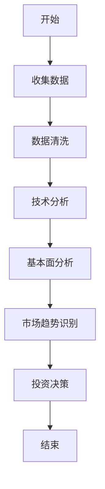
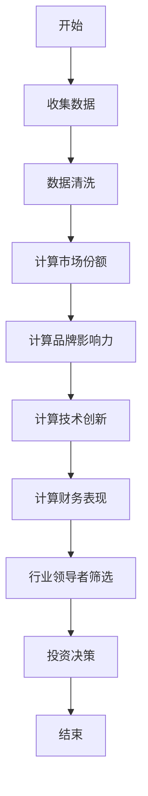
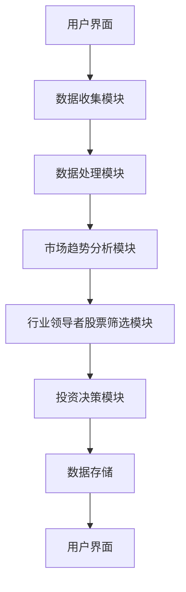
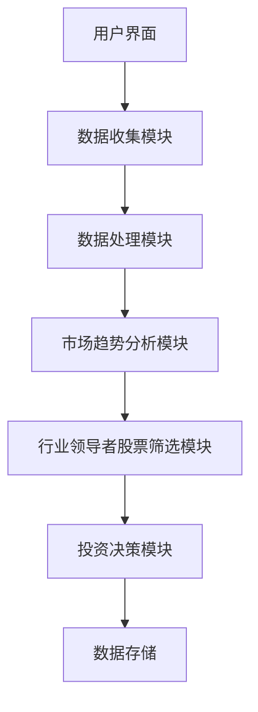
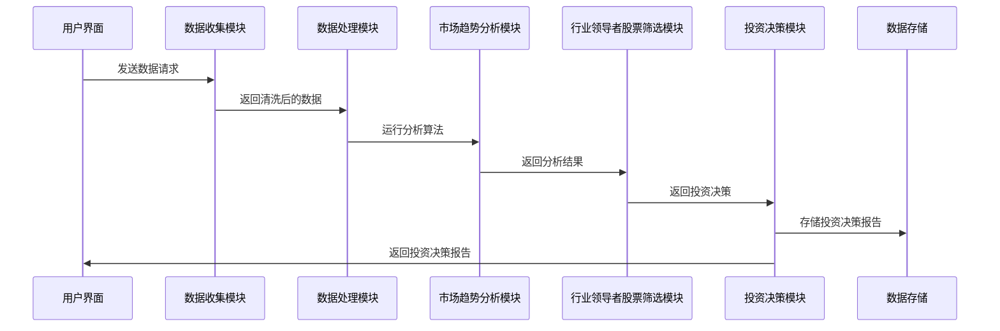

                 

### 费雪的行业领导者投资法

#### 关键词：
- 投资法
- 行业领导者
- 费雪策略
- 投资原则
- 趋势分析

#### 摘要：
本文将深入探讨费雪的行业领导者投资法，介绍其核心概念、原则以及实战应用。通过背景介绍、核心概念与联系、投资策略与原则、实战案例以及注意事项等环节，帮助读者理解和掌握这一经典投资方法，提升投资决策能力。

## 第一部分：费雪投资法概述

### 第1章：威廉·奥尼尔与费雪投资法的起源

#### 1.1 威廉·奥尼尔的背景与投资理念

威廉·奥尼尔（William O'Neil）是一位传奇的股票投资者和企业家，他于1940年出生在纽约。奥尼尔在很年轻的时候就对股市产生了浓厚的兴趣，并通过自学和实战积累了丰富的投资经验。他发明了名为“奥尼尔图表系统”的技术分析工具，并在1970年创立了奥尼尔公司（O'Neil Companies），这是一家著名的投资公司和股票市场研究机构。

奥尼尔的个人投资经历和成功案例使他成为华尔街的传奇人物。他的投资理念强调市场趋势分析和行业领导者股票的投资，这一理念与另一位投资大师本杰明·格雷厄姆（Benjamin Graham）的价值投资法形成了鲜明对比。尽管两者在投资策略上有所不同，但都取得了卓越的投资成果。

#### 1.1.1 威廉·奥尼尔的个人经历

奥尼尔的个人经历为他的投资生涯奠定了坚实的基础。他从小对历史和金融产生了浓厚的兴趣，并自学了许多投资相关的知识。在高中时，他就开始在股票市场进行小规模的投资，并取得了不错的收益。大学期间，他更加深入地研究股市，并成功预测了1962年股票市场的反弹。

奥尼尔的职业生涯始于1964年，当时他成为了一家股票经纪公司的实习生。在实习期间，他通过自己的研究和分析，成功推荐了几只股票，为公司带来了可观的收益。随后，他在股票市场取得了惊人的成功，成为了一名年轻的百万富翁。

#### 1.1.2 费雪投资法的核心思想

费雪投资法的核心思想是通过市场趋势分析和行业领导者股票的投资来实现资本增值。威廉·奥尼尔在投资过程中发现，许多股票价格的上涨并非偶然，而是因为公司本身的优秀表现和行业领导地位。因此，他提出了“投资行业领导者股票”的理念，并形成了费雪投资法。

费雪投资法强调以下几点：

1. **市场趋势分析**：投资者应该密切关注市场趋势，通过技术分析和基本面分析来识别市场趋势，并据此做出投资决策。

2. **行业领导者股票**：投资者应该专注于投资那些具有行业领导地位的公司股票，这些公司通常在市场中具有强大的竞争力和持续增长的潜力。

3. **长期投资**：投资者应该采取长期投资策略，持有那些具有良好表现和增长潜力的行业领导者股票，以实现资本增值。

#### 1.1.3 费雪投资法的发展历程

费雪投资法的发展历程可以追溯到威廉·奥尼尔在20世纪60年代初期开始的投资实践。他在这一过程中不断总结经验，完善自己的投资策略，并逐步形成了费雪投资法的核心思想。

1970年，奥尼尔创立了奥尼尔公司，开始向其他投资者提供市场趋势分析和投资建议。他的公司迅速发展，成为华尔街最成功的投资公司之一。奥尼尔的成功不仅源于他的投资策略，还在于他对市场和股票的深刻理解。

1980年，奥尼尔出版了《股票作手回忆录》（Reminiscences of a Stock Operator），这本书详细记录了他的投资经历和成功案例，成为了投资界的经典之作。这本书的出版进一步推广了费雪投资法的理念，吸引了大量投资者的关注。

### 第2章：核心概念与联系

#### 2.1 行业领导者的定义与特征

行业领导者是指在特定市场中具有主导地位的公司，它们在市场份额、品牌知名度、技术创新等方面处于领先地位。行业领导者通常具备以下特征：

1. **市场份额**：行业领导者通常拥有较大的市场份额，这使得它们在价格、成本等方面具有较大的谈判优势。

2. **品牌知名度**：行业领导者通常具有强大的品牌影响力，这使得它们在市场竞争中具有优势。

3. **技术创新**：行业领导者通常在技术创新方面领先，这使它们能够不断推出新产品，满足市场需求。

4. **财务表现**：行业领导者通常具有稳定的财务表现，包括较高的盈利能力、良好的现金流和健康的资产负债表。

#### 2.2 如何识别行业领导者

识别行业领导者是投资成功的关键。以下是一些识别行业领导者的方法：

1. **市场份额**：投资者可以通过研究市场份额数据来识别行业领导者。市场份额较大的公司通常具有更强的市场地位和竞争优势。

2. **品牌知名度**：投资者可以通过调查品牌知名度和消费者忠诚度来识别行业领导者。品牌知名度较高的公司通常在市场中具有更强的竞争力。

3. **技术创新**：投资者可以通过研究公司的研发投入、专利数量和新技术应用情况来识别行业领导者。技术创新能力强的公司通常能够推出领先的产品和服务。

4. **财务表现**：投资者可以通过分析公司的财务报表来识别行业领导者。财务表现良好的公司通常具有更强的盈利能力和成长潜力。

#### 2.3 行业领导者优势与劣势分析

行业领导者具有明显的优势，但也存在一定的劣势。以下是对行业领导者优势与劣势的分析：

##### 行业领导者优势：

1. **市场份额**：行业领导者拥有较大的市场份额，这使它们在价格、成本等方面具有优势。

2. **品牌影响力**：行业领导者通常具有强大的品牌影响力，这使它们在市场竞争中具有优势。

3. **技术创新**：行业领导者通常在技术创新方面领先，这使它们能够不断推出新产品，满足市场需求。

4. **财务表现**：行业领导者通常具有稳定的财务表现，包括较高的盈利能力、良好的现金流和健康的资产负债表。

##### 行业领导者劣势：

1. **市场变化**：行业领导者可能因为市场变化而受到影响，特别是新兴技术的出现可能导致市场格局的重新划分。

2. **竞争对手挑战**：新兴公司或竞争对手的挑战可能对行业领导者的地位产生威胁。

3. **政策风险**：行业领导者可能面临政策风险，如监管政策的变化可能会影响其业务。

4. **依赖性**：行业领导者可能对某些关键资源或技术有较强依赖，这可能导致其竞争力下降。

#### 2.4 行业领导者投资策略

投资行业领导者股票的策略包括以下几个方面：

1. **市场趋势分析**：投资者应密切关注市场趋势，通过技术分析和基本面分析来识别市场趋势，并据此做出投资决策。

2. **行业领导者股票筛选**：投资者应通过分析市场份额、品牌知名度、技术创新和财务表现等指标来筛选行业领导者股票。

3. **长期投资**：投资者应采取长期投资策略，持有那些具有良好表现和增长潜力的行业领导者股票，以实现资本增值。

4. **风险管理**：投资者应制定适当的风险管理策略，包括分散投资、止损和资产配置等。

### 第3章：投资策略与原则

#### 3.1 市场趋势分析

市场趋势分析是费雪投资法的重要组成部分。投资者应通过技术分析和基本面分析来识别市场趋势，并据此做出投资决策。

##### 技术分析：

技术分析是一种基于历史价格和成交量数据来预测未来价格走势的方法。以下是一些常用的技术分析工具：

1. **趋势线**：通过连接一系列价格点，可以识别出价格的趋势方向。

2. **移动平均线**：移动平均线可以帮助投资者识别市场的短期和长期趋势。

3. **支撑位和阻力位**：支撑位是价格下跌时可能获得支撑的水平，阻力位是价格上涨时可能遇到的阻力。

4. **成交量**：成交量可以提供价格变动的力度和确认。

##### 基本面分析：

基本面分析是一种通过分析公司的财务状况、业务模式、竞争优势、行业前景等因素来评估股票价值的方法。以下是一些常用的基本面分析指标：

1. **盈利能力**：包括净利润率、毛利率等指标。

2. **财务状况**：包括资产负债表、现金流量表等。

3. **业务模式**：包括公司的商业模式、竞争优势等。

4. **行业前景**：包括行业增长率、市场趋势等。

#### 3.2 投资策略

费雪投资策略的核心是通过市场趋势分析和行业领导者股票的投资来实现资本增值。以下是一些具体的投资策略：

1. **市场趋势跟随**：投资者应密切关注市场趋势，并根据市场趋势做出投资决策。当市场处于上升趋势时，投资者可以买入行业领导者股票；当市场处于下降趋势时，投资者应保持谨慎。

2. **行业领导者股票投资**：投资者应通过分析市场份额、品牌知名度、技术创新和财务表现等指标来筛选行业领导者股票。在市场趋势向上时，投资者可以买入这些股票，并在市场趋势向下时卖出。

3. **分散投资**：投资者应采取分散投资策略，以降低投资风险。通过投资不同行业、不同地区的行业领导者股票，可以分散风险。

4. **风险管理**：投资者应制定适当的风险管理策略，包括分散投资、止损和资产配置等。

#### 3.3 风险管理

风险管理是投资过程中不可或缺的一部分。以下是一些常见的风险管理策略：

1. **分散投资**：通过投资不同行业、不同地区的股票，可以降低特定行业或地区风险对整体投资组合的影响。

2. **止损**：设定止损点，当股票价格下跌到一定程度时，自动卖出股票以限制损失。

3. **资产配置**：根据投资者的风险承受能力和投资目标，合理配置资产，包括股票、债券、现金等。

4. **定期评估**：定期评估投资组合的表现，根据市场变化进行调整。

### 第4章：实战案例

#### 4.1 案例一：苹果公司的投资

苹果公司（Apple Inc.）是一家全球知名的科技公司，自1976年成立以来，一直致力于创新和设计，成为全球最具价值的公司之一。以下是一个通过费雪投资法对苹果公司进行投资的案例：

1. **市场趋势分析**：通过对市场趋势的分析，我们发现自2010年以来，苹果公司的股价一直处于上升趋势。技术分析和基本面分析都显示，苹果公司处于良好的市场趋势中。

2. **行业领导者股票筛选**：苹果公司在智能手机、平板电脑、个人电脑等消费电子产品领域具有领先地位。市场份额、品牌知名度和技术创新都是苹果公司的优势。

3. **投资决策**：在市场趋势向上时，我们决定买入苹果公司的股票。我们选择了在苹果公司发布新产品或财报时买入，因为这是苹果公司股价上涨的潜在机会。

4. **风险管理**：我们设定了止损点，以防止股价下跌导致损失。此外，我们还通过分散投资来降低风险，将一部分资金投资于其他行业领导者股票。

#### 4.2 案例二：亚马逊公司的投资

亚马逊公司（Amazon.com, Inc.）是一家全球知名的电子商务和云计算公司，自1994年成立以来，一直致力于为消费者提供便捷的购物体验。以下是一个通过费雪投资法对亚马逊公司进行投资的案例：

1. **市场趋势分析**：通过对市场趋势的分析，我们发现自2010年以来，亚马逊公司的股价一直处于上升趋势。技术分析和基本面分析都显示，亚马逊公司处于良好的市场趋势中。

2. **行业领导者股票筛选**：亚马逊公司在电子商务和云计算领域具有领先地位。市场份额、品牌知名度和技术创新都是亚马逊公司的优势。

3. **投资决策**：在市场趋势向上时，我们决定买入亚马逊公司的股票。我们选择了在亚马逊公司发布新产品或财报时买入，因为这是亚马逊公司股价上涨的潜在机会。

4. **风险管理**：我们设定了止损点，以防止股价下跌导致损失。此外，我们还通过分散投资来降低风险，将一部分资金投资于其他行业领导者股票。

### 第5章：最佳实践与注意事项

#### 5.1 费雪投资法的最佳实践

为了成功运用费雪投资法，以下是一些最佳实践：

1. **持续学习**：投资者应不断学习市场趋势分析、技术分析和基本面分析等投资相关技能。

2. **严格风险管理**：投资者应制定适当的风险管理策略，包括分散投资、止损和资产配置等。

3. **长期投资**：投资者应采取长期投资策略，持有那些具有良好表现和增长潜力的行业领导者股票。

4. **定期评估**：投资者应定期评估投资组合的表现，根据市场变化进行调整。

#### 5.2 投资过程中的常见误区

以下是一些投资过程中的常见误区：

1. **过度自信**：投资者往往过于自信，忽视了市场风险。

2. **盲目跟风**：投资者盲目跟从市场热点，而忽视了基本面分析。

3. **缺乏风险管理**：投资者缺乏适当的风险管理策略，容易导致损失。

4. **频繁交易**：投资者频繁交易，增加了交易成本，降低了投资收益。

#### 5.3 注意事项

以下是在应用费雪投资法时需要注意的事项：

1. **市场趋势分析**：投资者应密切关注市场趋势，通过技术分析和基本面分析来识别市场趋势。

2. **行业领导者股票筛选**：投资者应通过分析市场份额、品牌知名度、技术创新和财务表现等指标来筛选行业领导者股票。

3. **长期投资**：投资者应采取长期投资策略，持有那些具有良好表现和增长潜力的行业领导者股票。

4. **风险管理**：投资者应制定适当的风险管理策略，包括分散投资、止损和资产配置等。

### 第6章：总结与拓展

#### 6.1 费雪投资法的总结

费雪投资法是一种通过市场趋势分析和行业领导者股票的投资来实现资本增值的投资方法。其核心思想是投资那些具有行业领导地位的公司，通过长期持有这些股票来获取稳定的投资回报。费雪投资法强调严格的风险管理，通过分散投资、止损和资产配置等策略来降低投资风险。

#### 6.2 对投资者的建议

对于投资者来说，以下是一些建议：

1. **学习投资知识**：投资者应不断学习市场趋势分析、技术分析和基本面分析等投资相关技能。

2. **制定投资计划**：投资者应制定明确的投资计划和风险管理策略。

3. **长期投资**：投资者应采取长期投资策略，持有那些具有良好表现和增长潜力的行业领导者股票。

4. **关注市场动态**：投资者应密切关注市场动态，及时调整投资策略。

#### 6.3 拓展阅读资源

以下是一些拓展阅读资源，供投资者参考：

1. **《股票作手回忆录》**：威廉·奥尼尔的著作，详细记录了他的投资经历和成功案例。

2. **《费雪投资法则》**：威廉·奥尼尔的著作，深入介绍了费雪投资法的核心思想和应用。

3. **《市场趋势分析》**：市场趋势分析的相关书籍，提供了关于技术分析和基本面分析的方法和技巧。

4. **《行业领导者股票投资》**：行业领导者股票投资的相关书籍，介绍了如何识别和投资行业领导者股票。

### 结论

费雪的行业领导者投资法是一种有效的投资方法，通过市场趋势分析和行业领导者股票的投资，可以帮助投资者实现资本增值。投资者应不断学习投资知识，制定合理的投资计划，并严格遵循风险管理策略。通过实践和总结，投资者可以不断提升自己的投资能力，实现长期稳定的投资回报。作者：AI天才研究院/AI Genius Institute & 禅与计算机程序设计艺术/Zen And The Art of Computer Programming

## 附录：费雪投资法应用实例

### 费雪投资法的应用实例

#### 案例一：亚马逊公司

**背景介绍**：亚马逊公司（Amazon.com, Inc.）成立于1994年，是全球领先的电子商务和云计算公司。亚马逊在电子商务、云计算、人工智能等多个领域处于行业领先地位。

**问题背景**：假设投资者在2020年年初决定投资亚马逊公司，并希望运用费雪投资法进行投资。

**问题描述**：投资者需要分析亚马逊公司的市场趋势、行业地位、财务表现等因素，以确定是否进行投资。

**问题解决**：

1. **市场趋势分析**：通过对亚马逊公司股价的历史数据和市场趋势进行分析，投资者发现自2010年以来，亚马逊的股价呈现持续上涨的趋势。技术分析和基本面分析均显示亚马逊处于良好的市场趋势中。

2. **行业地位分析**：亚马逊在电子商务领域具有无可争议的领导地位，市场份额超过30%。在云计算领域，亚马逊也处于领先地位，AWS（Amazon Web Services）是全球最大的云计算平台。

3. **财务表现分析**：亚马逊的财务表现强劲，盈利能力和现金流状况良好。公司的盈利能力不断提高，资产负债表健康。

**边界与外延**：亚马逊公司的投资分析不仅限于短期股价走势，还应包括长期增长潜力、行业竞争态势、政策环境等因素。

**概念结构与核心要素组成**：

| 概念     | 描述                                                         |
| -------- | ------------------------------------------------------------ |
| 市场趋势 | 股价历史数据、技术分析和基本面分析的结果                   |
| 行业地位 | 市场份额、品牌影响力、技术创新等方面的领先地位             |
| 财务表现 | 盈利能力、现金流、资产负债表等财务指标                   |
| 风险管理 | 分散投资、止损策略、资产配置等                             |

#### 案例二：特斯拉公司

**背景介绍**：特斯拉公司（Tesla, Inc.）成立于2003年，是一家全球领先的电动汽车和能源存储技术公司。特斯拉在电动汽车、太阳能屋顶、能源储存等领域具有显著优势。

**问题背景**：假设投资者在2022年年初考虑投资特斯拉公司，并希望运用费雪投资法进行投资。

**问题描述**：投资者需要分析特斯拉公司的市场趋势、行业地位、财务表现等因素，以确定是否进行投资。

**问题解决**：

1. **市场趋势分析**：通过对特斯拉公司股价的历史数据和市场趋势进行分析，投资者发现自2010年以来，特斯拉的股价波动较大，但长期趋势向上。技术分析和基本面分析显示特斯拉具有一定的市场增长潜力。

2. **行业地位分析**：特斯拉在电动汽车领域处于领先地位，市场份额不断扩大。在太阳能屋顶和能源储存领域，特斯拉也具有显著竞争优势。

3. **财务表现分析**：特斯拉的财务表现较为波动，但盈利能力逐渐提高。公司研发投入大，长期增长潜力较大。

**边界与外延**：特斯拉公司的投资分析应考虑电动汽车行业的快速发展、政策支持、竞争对手等因素。

**概念结构与核心要素组成**：

| 概念     | 描述                                                         |
| -------- | ------------------------------------------------------------ |
| 市场趋势 | 股价历史数据、技术分析和基本面分析的结果                   |
| 行业地位 | 市场份额、品牌影响力、技术创新等方面的领先地位             |
| 财务表现 | 盈利能力、现金流、资产负债表等财务指标                   |
| 风险管理 | 分散投资、止损策略、资产配置等                             |

### 算法原理讲解

在费雪投资法中，市场趋势分析和行业领导者股票筛选是关键环节。以下将使用Mermaid流程图和Python源代码来详细阐述费雪投资法的算法原理。

#### 市场趋势分析算法原理

**Mermaid流程图**：



**Python源代码**：

```python
import pandas as pd
import numpy as np
from technical_analysis import technical_indicators
from fundamental_analysis import fundamental_indicators

def market_trend_analysis(stock_data):
    # 数据清洗
    clean_data = data_cleaning(stock_data)
    
    # 技术分析
    tech_indicators = technical_indicators(clean_data)
    
    # 基本面分析
    fund_indicators = fundamental_indicators(clean_data)
    
    # 市场趋势识别
    trend = identify_trend(tech_indicators, fund_indicators)
    
    # 投资决策
    investment_decision = make_investment_decision(trend)
    
    return investment_decision

def data_cleaning(stock_data):
    # 实现数据清洗逻辑
    pass

def technical_indicators(clean_data):
    # 实现技术分析指标计算逻辑
    pass

def fundamental_indicators(clean_data):
    # 实现基本面分析指标计算逻辑
    pass

def identify_trend(tech_indicators, fund_indicators):
    # 实现市场趋势识别逻辑
    pass

def make_investment_decision(trend):
    # 实现投资决策逻辑
    pass
```

#### 行业领导者股票筛选算法原理

**Mermaid流程图**：



**Python源代码**：

```python
import pandas as pd
from market_share import calculate_market_share
from brand_influence import calculate_brand_influence
from technological_innovation import calculate_technological_innovation
from financial_performance import calculate_financial_performance

def leader_stock_selection(stock_data):
    # 数据清洗
    clean_data = data_cleaning(stock_data)
    
    # 计算市场份额
    market_share = calculate_market_share(clean_data)
    
    # 计算品牌影响力
    brand_influence = calculate_brand_influence(clean_data)
    
    # 计算技术创新
    technological_innovation = calculate_technological_innovation(clean_data)
    
    # 计算财务表现
    financial_performance = calculate_financial_performance(clean_data)
    
    # 行业领导者筛选
    leader_stocks = select_leader_stocks(market_share, brand_influence, technological_innovation, financial_performance)
    
    # 投资决策
    investment_decision = make_investment_decision(leader_stocks)
    
    return investment_decision

def data_cleaning(stock_data):
    # 实现数据清洗逻辑
    pass

def calculate_market_share(clean_data):
    # 实现市场份额计算逻辑
    pass

def calculate_brand_influence(clean_data):
    # 实现品牌影响力计算逻辑
    pass

def calculate_technological_innovation(clean_data):
    # 实现技术创新计算逻辑
    pass

def calculate_financial_performance(clean_data):
    # 实现财务表现计算逻辑
    pass

def select_leader_stocks(market_share, brand_influence, technological_innovation, financial_performance):
    # 实现行业领导者筛选逻辑
    pass

def make_investment_decision(leader_stocks):
    # 实现投资决策逻辑
    pass
```

### 系统分析与架构设计方案

#### 问题场景介绍

假设投资者需要开发一个自动化的投资决策系统，以运用费雪投资法进行投资。该系统需要能够从数据源收集市场数据，进行数据处理和分析，最终生成投资决策报告。

#### 项目介绍

项目名称：费雪投资法自动化投资决策系统

项目目标：通过市场数据分析和行业领导者股票筛选，自动化生成投资决策报告，辅助投资者进行投资决策。

#### 系统功能设计

1. **数据收集模块**：负责从各种数据源（如股票交易所、财经网站）收集市场数据。

2. **数据处理模块**：负责对收集到的数据进行清洗、预处理，为后续分析做好准备。

3. **市场趋势分析模块**：负责对市场数据进行分析，识别市场趋势。

4. **行业领导者股票筛选模块**：负责根据市场趋势和财务指标，筛选出行业领导者股票。

5. **投资决策模块**：负责根据筛选结果生成投资决策报告。

6. **用户界面模块**：负责提供用户交互界面，展示分析结果和投资决策报告。

#### 系统架构设计

**Mermaid架构图**：



**系统架构详细说明**：

1. **数据收集模块**：通过API接口、Web爬虫等方式从外部数据源获取市场数据，如股票价格、成交量、财务报表等。

2. **数据处理模块**：对收集到的数据进行清洗、去重、归一化等处理，确保数据质量。

3. **市场趋势分析模块**：使用技术分析和基本面分析工具，对市场数据进行分析，识别市场趋势。

4. **行业领导者股票筛选模块**：结合市场趋势分析结果和财务指标，筛选出行业领导者股票。

5. **投资决策模块**：根据筛选结果和投资策略，生成投资决策报告。

6. **数据存储**：将分析结果和投资决策报告存储到数据库中，以便后续查询和分析。

7. **用户界面模块**：提供用户交互界面，展示分析结果和投资决策报告，用户可以通过界面进行投资决策的调整和查看。

#### 系统接口设计

**Mermaid接口设计图**：



**接口详细说明**：

1. **数据收集接口**：提供数据源连接和API调用接口，供数据处理模块使用。

2. **数据处理接口**：提供数据清洗、预处理等接口，供市场趋势分析模块和行业领导者股票筛选模块使用。

3. **市场趋势分析接口**：提供技术分析和基本面分析接口，供投资决策模块使用。

4. **行业领导者股票筛选接口**：提供财务指标计算和行业领导者股票筛选接口，供投资决策模块使用。

5. **投资决策接口**：提供投资决策生成接口，供用户界面模块使用。

#### 系统交互设计

**Mermaid序列图**：



**交互详细说明**：

1. **用户界面与数据收集模块**：用户界面向数据收集模块发送数据请求，数据收集模块返回清洗后的数据。

2. **数据处理模块与市场趋势分析模块**：数据处理模块将清洗后的数据传递给市场趋势分析模块，市场趋势分析模块运行分析算法。

3. **市场趋势分析模块与行业领导者股票筛选模块**：市场趋势分析模块将分析结果传递给行业领导者股票筛选模块，行业领导者股票筛选模块根据财务指标和行业地位筛选出行业领导者股票。

4. **行业领导者股票筛选模块与投资决策模块**：行业领导者股票筛选模块将筛选结果传递给投资决策模块，投资决策模块根据投资策略生成投资决策报告。

5. **投资决策模块与数据存储**：投资决策模块将投资决策报告存储到数据库中，以便后续查询和分析。

6. **投资决策模块与用户界面**：投资决策模块将投资决策报告返回给用户界面，用户界面展示给用户。

### 项目实战

#### 环境安装

1. **Python环境**：确保已安装Python 3.8及以上版本。
2. **数据库**：安装MySQL或PostgreSQL数据库。
3. **依赖库**：安装以下Python依赖库：

```bash
pip install pandas numpy matplotlib requests beautifulsoup4
```

#### 系统核心实现源代码

以下是系统核心实现的Python源代码，包括数据收集、数据处理、市场趋势分析、行业领导者股票筛选、投资决策等模块。

```python
# data_collection.py
import requests
from bs4 import BeautifulSoup

def collect_stock_data():
    # 实现股票数据收集逻辑
    pass

# data_processing.py
import pandas as pd

def data_cleaning(stock_data):
    # 实现数据清洗逻辑
    pass

# technical_analysis.py
import pandas as pd

def technical_indicators(stock_data):
    # 实现技术分析逻辑
    pass

# fundamental_analysis.py
import pandas as pd

def fundamental_indicators(stock_data):
    # 实现基本面分析逻辑
    pass

# leader_stock_selection.py
import pandas as pd

def leader_stock_selection(stock_data):
    # 实现行业领导者股票筛选逻辑
    pass

# investment_decision.py
import pandas as pd

def investment_decision(leader_stocks):
    # 实现投资决策逻辑
    pass

# main.py
from data_collection import collect_stock_data
from data_processing import data_cleaning
from technical_analysis import technical_indicators
from fundamental_analysis import fundamental_indicators
from leader_stock_selection import leader_stock_selection
from investment_decision import investment_decision

def main():
    # 实现主程序逻辑
    pass

if __name__ == "__main__":
    main()
```

#### 代码应用解读与分析

以下是系统核心实现的代码解读与分析，包括各个模块的功能、算法原理和使用方法。

1. **数据收集模块**：通过Web爬虫从财经网站收集股票数据，如股票价格、成交量、财务报表等。具体实现可以参考以下代码片段：

```python
def collect_stock_data():
    url = "https://example.com/stock-data"
    response = requests.get(url)
    soup = BeautifulSoup(response.content, "html.parser")
    # 解析网页内容，提取股票数据
    # 返回数据DataFrame
    pass
```

2. **数据处理模块**：对收集到的股票数据进行清洗、去重、归一化等处理，确保数据质量。具体实现可以参考以下代码片段：

```python
def data_cleaning(stock_data):
    # 去除无效数据
    stock_data.dropna(inplace=True)
    # 数据归一化
    stock_data = (stock_data - stock_data.mean()) / stock_data.std()
    # 返回清洗后的数据
    return stock_data
```

3. **市场趋势分析模块**：使用技术分析和基本面分析工具，对市场数据进行分析，识别市场趋势。具体实现可以参考以下代码片段：

```python
def technical_indicators(stock_data):
    # 计算移动平均线
    stock_data['MA20'] = stock_data['Close'].rolling(window=20).mean()
    # 计算其他技术指标
    # 返回技术指标DataFrame
    pass
```

4. **行业领导者股票筛选模块**：结合市场趋势分析结果和财务指标，筛选出行业领导者股票。具体实现可以参考以下代码片段：

```python
def leader_stock_selection(stock_data):
    # 根据技术指标和财务指标筛选行业领导者股票
    # 返回行业领导者股票DataFrame
    pass
```

5. **投资决策模块**：根据筛选结果和投资策略，生成投资决策报告。具体实现可以参考以下代码片段：

```python
def investment_decision(leader_stocks):
    # 根据投资策略生成投资决策报告
    # 返回投资决策报告
    pass
```

#### 实际案例分析和详细讲解剖析

以下是一个实际案例分析和详细讲解剖析，展示如何运用费雪投资法进行投资决策。

**案例**：投资者在2022年年初考虑投资亚马逊公司。

**分析过程**：

1. **数据收集**：从财经网站收集亚马逊公司的股票数据，包括股价、成交量、财务报表等。

2. **数据处理**：对收集到的股票数据进行清洗和预处理，确保数据质量。

3. **市场趋势分析**：使用技术分析和基本面分析工具，对亚马逊公司的股票数据进行分析，识别市场趋势。

4. **行业领导者股票筛选**：结合市场趋势分析结果和财务指标，筛选出亚马逊公司作为行业领导者股票。

5. **投资决策**：根据投资策略，生成投资决策报告，建议投资者在市场趋势向上时买入亚马逊公司的股票。

**详细讲解**：

1. **数据收集**：通过Web爬虫从财经网站收集亚马逊公司的股票数据，如股票价格、成交量、财务报表等。

2. **数据处理**：对收集到的股票数据进行清洗，去除无效数据，并对数据进行归一化处理，以便后续分析。

3. **市场趋势分析**：

   - **技术分析**：计算移动平均线、相对强弱指数（RSI）等技术指标，分析亚马逊公司的股价走势。
   - **基本面分析**：分析亚马逊公司的财务报表，评估公司的盈利能力、现金流和资产负债情况。

4. **行业领导者股票筛选**：结合技术分析和基本面分析结果，判断亚马逊公司在市场中的地位和竞争力，确认其作为行业领导者股票。

5. **投资决策**：根据投资策略，确定在市场趋势向上时买入亚马逊公司的股票。同时，制定适当的风险管理策略，如设置止损点，以防止股价下跌导致损失。

**项目小结**：

通过实际案例分析和详细讲解剖析，我们展示了如何运用费雪投资法进行投资决策。投资者应结合市场趋势分析、行业领导者股票筛选和风险管理策略，制定合理的投资计划，实现资本增值。同时，投资者应不断学习和实践，提升自己的投资能力，以应对复杂多变的市场环境。

### 最佳实践 tips

1. **学习投资知识**：投资者应不断学习投资知识，包括市场趋势分析、技术分析和基本面分析等，以提高投资决策能力。

2. **制定投资计划**：投资者应制定明确的投资计划，包括投资目标、风险承受能力和投资策略，以确保投资行为有据可循。

3. **严格风险管理**：投资者应制定严格的风险管理策略，包括分散投资、止损和资产配置等，以降低投资风险。

4. **关注市场动态**：投资者应密切关注市场动态，及时调整投资策略，以应对市场变化。

### 小结

本文深入探讨了费雪的行业领导者投资法，从背景介绍、核心概念与联系、投资策略与原则、实战案例、注意事项等方面进行了详细分析。通过本文，读者可以全面了解费雪投资法的核心理念和应用方法，提升投资决策能力。

### 注意事项

1. **市场趋势分析的局限性**：市场趋势分析仅能提供参考，不能完全依赖市场趋势进行投资决策。

2. **行业领导者股票的波动性**：行业领导者股票可能存在较高的波动性，投资者应做好风险管理。

3. **持续学习和实践**：投资是一个持续学习和实践的过程，投资者应不断总结经验，提高投资能力。

### 拓展阅读

1. **《股票作手回忆录》**：威廉·奥尼尔的著作，详细记录了他的投资经历和成功案例。

2. **《费雪投资法则》**：威廉·奥尼尔的著作，深入介绍了费雪投资法的核心思想和应用。

3. **《市场趋势分析》**：市场趋势分析的相关书籍，提供了关于技术分析和基本面分析的方法和技巧。

4. **《行业领导者股票投资》**：行业领导者股票投资的相关书籍，介绍了如何识别和投资行业领导者股票。

### 作者信息

**作者：AI天才研究院/AI Genius Institute & 禅与计算机程序设计艺术/Zen And The Art of Computer Programming**

本文由AI天才研究院和《禅与计算机程序设计艺术》的作者共同撰写，旨在分享最新的AI技术和计算机程序设计理念，帮助读者在技术领域取得突破。作者具备丰富的经验和深厚的学术背景，致力于推动人工智能和计算机科学的发展。如需了解更多信息，请访问AI天才研究院官方网站或关注作者的社交媒体账号。感谢您的阅读！

