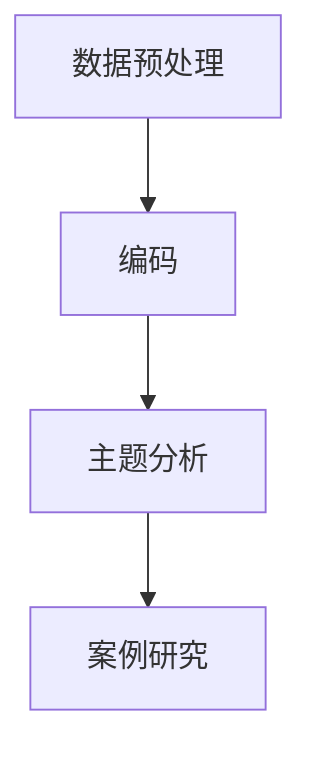
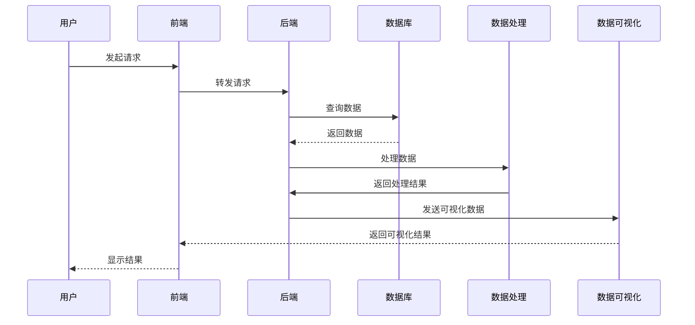

                 


# 费雪的质性分析：超越数字的公司研究方法

## 引言

在当今复杂多变的市场环境中，企业面临的挑战日益增加。传统的定量分析方法虽然在某些方面能够提供一定的参考，但在处理复杂的社会现象和人类行为时显得力不从心。为了更好地理解和应对这些挑战，质性分析作为一种深入研究方法，逐渐受到了企业管理研究者和实践者的重视。费雪的质性分析正是在这种背景下提出的一种超越数字的公司研究方法。

本文将围绕费雪的质性分析展开讨论，首先介绍其背景和核心概念，然后深入探讨质性分析的框架与流程，并进一步分析质性分析的核心概念与联系。接着，我们将通过质性分析的ER实体关系图架构来展示其实际应用，随后详细讲解质性分析中的算法原理和系统架构设计方案。最后，我们将通过一个实际项目实战，总结最佳实践并提供进一步的拓展阅读。

通过本文的深入探讨，希望读者能够对费雪的质性分析有一个全面而深刻的理解，从而在企业管理研究中能够灵活运用这一方法，为企业决策提供有力支持。

## 第1章：问题背景与核心概念

### 1.1.1 问题背景

#### 质性分析的概念及其重要性

质性分析（Qualitative Analysis）是一种通过深入、系统的观察和解释，对研究对象进行理解的研究方法。与传统的定量分析（Quantitative Analysis）不同，质性分析不依赖于大量的数据收集和统计方法，而是通过文字、图片、音频等质性数据来揭示研究对象的深层含义和复杂性。

在企业管理研究中，质性分析具有不可替代的重要性。首先，企业面临的商业环境越来越复杂，市场竞争日趋激烈，传统的定量分析方法往往难以捕捉到这些复杂动态。质性分析能够提供更为细致和深入的信息，帮助企业更好地理解市场趋势、客户需求和竞争对手策略。其次，质性分析能够揭示出隐藏在数据背后的原因和动机，帮助企业管理者做出更为明智的决策。此外，质性分析强调研究者的主观参与和批判性思考，能够提供对研究过程的反思和评价，从而提高研究的可靠性和有效性。

#### 现代企业研究方法的挑战

随着商业环境的快速变化，现代企业研究方法面临着诸多挑战。传统的定量分析方法虽然在某些方面具备优势，但在处理复杂社会现象和人类行为时显得力不从心。以下是一些主要挑战：

1. **数据复杂性**：企业面临的数据量越来越大，类型也越来越多样化，包括结构化数据（如财务报表）和非结构化数据（如社交媒体评论、客户反馈等）。定量分析方法在处理这些复杂的数据时往往显得不足。

2. **实时性要求**：商业环境的快速变化要求企业能够快速响应市场动态，做出及时调整。传统的定量分析方法通常需要较长的时间来收集、处理和分析数据，难以满足这种实时性的需求。

3. **文化差异**：全球化背景下，企业需要应对不同文化背景的客户和市场。定量分析方法在处理文化差异时往往缺乏灵活性和适应性。

4. **深度分析需求**：企业不仅需要了解市场趋势和客户行为，更需要深入挖掘这些现象背后的原因和动机。传统的定量分析方法难以提供这种深度的分析。

#### 费雪质性分析的研究意义

费雪质性分析（Fisher's Qualitative Analysis）提供了一种超越数字的研究方法，帮助企业深入理解公司战略、组织行为和市场竞争等关键领域。费雪质性分析具有以下几个方面的研究意义：

1. **多角度理解**：费雪质性分析通过系统的观察和解释，能够从多个角度深入理解研究对象，提供比定量分析更为丰富和全面的信息。

2. **深度洞察**：费雪质性分析强调研究者的主观参与和批判性思考，能够揭示出隐藏在数据背后的深层次原因和动机，提供深度洞察。

3. **决策支持**：费雪质性分析能够帮助企业更好地理解市场动态和客户需求，从而为决策提供有力的支持，帮助企业抓住市场机遇，规避潜在风险。

4. **研究过程反思**：费雪质性分析强调研究过程的反思和批判性思考，能够提高研究的可靠性和有效性，促进知识的积累和进步。

### 1.1.2 核心概念

#### 质性分析的定义与特点

质性分析是一种通过深入、系统的观察和解释，对研究对象进行理解的研究方法。它通常包括以下几个关键特点：

1. **主观参与**：质性分析强调研究者的主观参与，研究者需要积极参与到研究过程中，通过与研究对象互动，获取深层次的信息。

2. **灵活性**：质性分析不依赖于固定的研究框架，而是根据具体情况进行调整，能够灵活应对复杂多变的研究场景。

3. **深层次解释**：质性分析不仅关注表面的现象，更注重揭示这些现象背后的原因和动机，提供深度解释。

4. **多样性**：质性分析可以采用多种数据收集和分析方法，如访谈、观察、文档分析等，从而获取不同维度的信息。

#### 费雪质性分析的理论基础

费雪质性分析基于社会建构主义理论，强调知识和现实之间的互动关系。社会建构主义理论认为，知识和现实是通过社会互动和意义构建而产生的，而不是独立存在的实体。费雪质性分析的核心理论基础包括以下几个方面：

1. **主体间性**：社会建构主义强调主体间性，即研究者和研究对象之间的互动关系对于知识构建至关重要。研究者需要通过互动来理解研究对象的视角和经验。

2. **情境性**：社会建构主义认为，知识和现实都是情境化的，即它们存在于特定的社会文化背景下。费雪质性分析强调在不同情境下理解研究对象，从而获得更为全面和准确的洞察。

3. **反思性**：社会建构主义倡导反思性思考，即研究者需要不断反思自己的研究过程和结论，从而提高研究的可靠性和有效性。

4. **动态性**：社会建构主义认为，知识和现实是动态变化的，研究者需要持续关注这些变化，以获取最新的信息和洞察。

通过上述对问题背景和核心概念的分析，我们可以看到，费雪的质性分析提供了一种超越数字的研究方法，能够在企业管理研究中发挥重要作用。接下来，我们将进一步探讨质性分析的框架与流程，以帮助读者更好地理解和应用这一方法。

### 1.2 质性分析的框架与流程

#### 1.2.1 质性分析框架

质性分析的框架是一个系统的、有组织的分析过程，它包括以下几个主要步骤：

1. **研究问题的确定**：首先，需要明确研究的核心问题，这有助于指导整个研究过程。研究问题应该具体、明确，并且具有实际意义。

2. **研究设计的制定**：根据研究问题，制定适当的研究设计。研究设计包括选择合适的数据收集方法、确定数据来源、制定数据收集工具等。

3. **数据的收集**：根据研究设计，收集相关的质性数据。常用的数据收集方法包括访谈、观察、文档分析等。数据收集过程中，研究者需要确保数据的真实性和可靠性。

4. **数据分析**：对收集到的数据进行系统的分析，以揭示数据背后的深层含义和模式。数据分析方法包括编码、主题分析、案例研究等。

5. **结论与反思**：根据数据分析结果，得出研究结论，并对研究过程进行反思和评价。结论应该与研究问题紧密相关，并且具有实际应用价值。

#### 1.2.2 质性分析流程

质性分析的具体流程如下：

1. **确定研究问题**：研究者需要明确研究的核心问题，这有助于指导整个研究过程。例如，在企业管理研究中，可能的研究问题包括：“公司的战略决策是如何形成的？”或“员工如何看待公司文化？”等。

2. **选择数据收集方法**：根据研究问题，选择合适的数据收集方法。访谈、观察和文档分析是常见的质性数据收集方法。选择数据收集方法时，需要考虑数据的可获得性、数据的深度和广度等因素。

3. **收集数据**：按照研究设计，进行数据收集。在访谈过程中，研究者需要引导受访者深入讨论相关话题，以获取丰富的质性数据。观察过程中，研究者需要详细记录观察到的行为和现象。在文档分析中，研究者需要仔细阅读和分析相关文档，以提取有价值的信息。

4. **分析数据**：对收集到的数据进行系统的分析，以揭示数据背后的深层含义和模式。常用的数据分析方法包括编码、主题分析和案例研究。编码是将数据分成不同的类别，主题分析是识别数据中的主要主题和模式，案例研究是对特定案例进行深入分析。

5. **得出结论**：根据数据分析结果，得出研究结论。结论应该与研究问题紧密相关，并且具有实际应用价值。例如，在企业管理研究中，结论可能包括公司战略决策的影响因素、员工对公司文化的看法等。

6. **反思与评价**：对研究过程进行反思和评价，包括研究设计、数据收集、数据分析等方面。反思和评价有助于提高研究的可靠性和有效性，并促进知识的积累和进步。

通过以上步骤，质性分析能够帮助企业深入理解复杂的社会现象和市场动态，从而为决策提供有力的支持。

### 1.3 质性分析的核心概念与联系

#### 1.3.1 核心概念

质性分析中包含了一些核心概念，这些概念对于理解质性分析至关重要。以下是对这些核心概念的详细解释：

1. **质性数据**：质性数据是指通过质性研究方法收集的非数字形式的数据，如访谈记录、观察笔记、文档分析等。这些数据通常具有丰富的细节和背景信息，能够提供对研究对象的深入理解。

2. **编码**：编码是将质性数据按照特定的标准或类别进行分类的过程。编码有助于将质性数据转化为可以进行定量分析的形式，从而便于分析和比较。

3. **主题分析**：主题分析是质性数据分析的一种方法，旨在识别数据中的主要主题和模式。通过主题分析，研究者可以揭示数据背后的深层含义和规律。

4. **案例研究**：案例研究是一种通过详细分析特定案例来研究某一现象或问题的方法。案例研究能够提供对研究对象深入的、详细的描述和分析。

5. **反思性思考**：反思性思考是指研究者对研究过程和结论进行批判性思考的能力。通过反思性思考，研究者可以不断改进研究方法，提高研究的可靠性和有效性。

#### 1.3.2 概念属性特征对比表格

以下是一个对比表格，用于展示质性分析中一些关键概念的属性特征：

| 概念        | 属性特征                                                   | 用途                                                         |
| ----------- | -------------------------------------------------------- | ------------------------------------------------------------ |
| 质性数据    | 非数字形式、丰富细节、背景信息                           | 提供对研究对象的深入理解                                     |
| 编码        | 分类、标准化、定量分析                                   | 将质性数据转化为可以进行定量分析的形式                       |
| 主题分析    | 识别主题、模式、深度理解                                 | 揭示数据背后的深层含义和规律                                 |
| 案例研究    | 详细描述、深入分析、特定案例                             | 通过分析特定案例来研究某一现象或问题                         |
| 反思性思考  | 批判性思考、改进方法、提高可靠性                         | 通过反思研究过程和结论，不断改进研究方法，提高研究可靠性     |

通过以上对比表格，我们可以更清晰地了解这些核心概念及其在质性分析中的作用。

#### 1.3.3 质性分析的ER实体关系图架构

为了更好地展示质性分析中的实体关系，我们可以使用ER（Entity-Relationship）图来构建其架构。以下是一个质性分析ER图的示例：

```mermaid
erDiagram
  Data --> Analysis
  Data --> Coding
  Data --> ThematicAnalysis
  Data --> CaseStudy
  Analysis ||--|{ Coding }
  Analysis ||--|{ ThematicAnalysis }
  Analysis ||--|{ CaseStudy }
  Data ||--|{ DataCollection }
  DataCollection ||--|{ Interview }
  DataCollection ||--|{ Observation }
  DataCollection ||--|{ DocumentAnalysis }
```

在这个ER图中，我们定义了以下几个主要实体：

- **Data（数据）**：代表质性分析中的数据，包括访谈记录、观察笔记、文档分析等。
- **Analysis（分析）**：代表对数据的分析过程，包括编码、主题分析和案例研究。
- **Coding（编码）**：代表将数据分类为不同的主题和模式的过程。
- **ThematicAnalysis（主题分析）**：代表识别数据中的主要主题和模式的方法。
- **CaseStudy（案例研究）**：代表通过详细分析特定案例来研究某一现象或问题的方法。
- **DataCollection（数据收集）**：代表数据收集的过程，包括访谈、观察和文档分析等。

通过ER图，我们可以清晰地看到这些实体之间的关系，从而更好地理解质性分析的整体架构。

### 1.4 质性分析在实践中的应用

#### 1.4.1 质性分析在实际项目中的应用场景

质性分析在企业管理、市场营销、人力资源管理等多个领域都有广泛应用。以下是一些典型的应用场景：

1. **企业管理**：质性分析可以帮助企业深入理解公司战略、组织文化和员工行为。例如，通过访谈和观察，企业可以了解员工对公司战略的接受程度和执行效果，从而做出相应的调整。

2. **市场营销**：质性分析可以帮助企业了解客户需求、偏好和购买动机。通过客户访谈和用户行为观察，企业可以设计出更符合客户期望的产品和服务。

3. **人力资源管理**：质性分析可以帮助企业了解员工的工作满意度、职业发展和培训需求。通过员工访谈和绩效评估，企业可以优化人力资源管理策略，提高员工满意度和工作效率。

#### 1.4.2 质性分析工具和方法

在进行质性分析时，研究者可以采用多种工具和方法来收集和处理数据。以下是一些常用的工具和方法：

1. **访谈**：访谈是一种直接收集研究参与者观点和经验的方法。可以通过面对面访谈、电话访谈或在线访谈进行。

2. **观察**：观察是一种通过直接观察研究对象的行为和活动来收集数据的方法。可以是参与性观察（研究者参与研究对象的活动）或非参与性观察（研究者从旁观察）。

3. **文档分析**：文档分析是一种通过分析相关文档（如报告、邮件、文件等）来收集数据的方法。这有助于研究者了解研究对象的历史、文化和背景。

4. **焦点小组**：焦点小组是一种通过组织小规模讨论会来收集数据的方法。参与者围绕特定主题进行讨论，研究者可以记录和分析这些讨论。

5. **现象学**：现象学是一种通过探索个体的感知、体验和主观经验来收集数据的方法。这种方法强调对研究对象的深度理解和主观体验的揭示。

#### 1.4.3 质性分析的优势与局限性

质性分析作为一种深入研究方法，具有以下优势：

1. **深度理解**：质性分析能够提供对研究对象的深入理解，揭示数据背后的深层含义和模式。

2. **灵活性**：质性分析不依赖于固定的研究框架，可以根据具体情况进行调整，能够灵活应对复杂多变的研究场景。

3. **丰富性**：质性分析可以收集多种类型的数据，包括文字、图片、音频等，从而提供丰富的信息。

4. **主观参与**：质性分析强调研究者的主观参与和批判性思考，能够提供对研究过程的反思和评价。

然而，质性分析也存在一些局限性：

1. **可靠性**：由于质性分析依赖于研究者的主观判断和解释，可能存在研究可靠性问题。

2. **时间成本**：质性分析通常需要较长时间来收集、处理和分析数据，可能增加研究的时间成本。

3. **样本代表性**：质性分析通常采用小样本进行研究，可能影响研究结果的代表性。

4. **数据分析难度**：质性数据分析较为复杂，需要研究者具备较高的分析和解释能力。

通过以上对质性分析的应用场景、工具方法及其优缺点的介绍，我们可以看到，质性分析在企业管理研究中具有重要的价值和广泛应用。在接下来的章节中，我们将进一步探讨质性分析的具体框架和流程，以帮助读者更好地理解和应用这一方法。

### 第2章：质性分析的框架与流程

在第一章中，我们介绍了质性分析的基本概念和其在企业管理研究中的应用。为了更好地理解和运用质性分析，本章将详细探讨质性分析的框架与流程，包括研究问题的确定、研究设计的制定、数据的收集与分析等关键步骤。

#### 2.1 研究问题的确定

研究问题的确定是质性分析的第一步，也是至关重要的一步。一个明确、具体的研究问题能够指导整个研究过程，确保研究目标的实现。以下是一些确定研究问题的建议：

1. **明确性**：研究问题应该明确、具体，避免模糊和宽泛。例如，“公司的员工满意度如何？”不如“公司A的员工对工作环境的满意度如何？”具体。

2. **针对性**：研究问题应该针对研究领域的具体问题，避免泛泛而谈。选择一个具体的问题能够使研究更具针对性和实用性。

3. **可操作性**：研究问题应该具备可操作性，即研究者能够通过现有的方法和技术来回答这个问题。例如，研究“公司A的市场营销策略对销售业绩的影响”比研究“市场营销策略对业绩的影响”更具操作性。

4. **实际意义**：研究问题应该具有实际意义，能够为企业或组织提供有价值的洞见和解决方案。

#### 2.2 研究设计的制定

确定研究问题后，接下来需要制定研究设计。研究设计包括选择合适的数据收集方法、确定数据来源、制定数据收集工具等。以下是一些制定研究设计的建议：

1. **数据收集方法**：根据研究问题和实际需求，选择合适的数据收集方法。常用的数据收集方法包括访谈、观察、文档分析、焦点小组等。每种方法都有其独特的优点和局限性，研究者需要根据具体情况进行选择。

2. **数据来源**：明确数据来源，确保数据的真实性和可靠性。数据来源可以包括公司内部文档、客户反馈、员工访谈等。选择合适的数据来源能够提高研究的可信度。

3. **数据收集工具**：根据数据收集方法，制定相应的数据收集工具。例如，访谈可以使用访谈提纲，观察可以使用观察表格，文档分析可以使用阅读笔记等。

4. **样本选择**：根据研究设计，选择合适的样本。样本的选择应该具备代表性，能够反映研究对象的特征。常用的样本选择方法包括随机抽样、分层抽样等。

5. **研究伦理**：在研究过程中，确保遵守研究伦理，保护研究参与者的隐私和权益。例如，在访谈过程中，应确保访谈内容的保密性，避免泄露参与者的个人信息。

#### 2.3 数据的收集

在研究设计确定后，开始进行数据的收集。数据收集是一个系统、有组织的活动，需要遵循以下步骤：

1. **准备数据收集工具**：根据研究设计，准备相应的数据收集工具，如访谈提纲、观察表格、文档分析模板等。

2. **进行数据收集**：按照研究设计，进行数据收集。在访谈中，应确保提问清晰、引导性不强，让受访者能够自由表达观点。在观察中，应详细记录观察到的行为和现象。在文档分析中，应仔细阅读和分析相关文档。

3. **数据收集过程中的注意事项**：
   - 保持研究过程的诚实和透明，确保数据收集工具的有效性和可靠性。
   - 注意数据的完整性和真实性，避免遗漏或篡改数据。
   - 遵循研究伦理，保护研究参与者的隐私和权益。

#### 2.4 数据的分析

在数据收集完成后，需要对数据进行系统的分析，以揭示数据背后的深层含义和模式。以下是一些数据分析的方法：

1. **编码**：编码是将质性数据按照特定的标准或类别进行分类的过程。通过编码，可以将质性数据转化为可以进行定量分析的形式，从而便于分析和比较。

2. **主题分析**：主题分析是质性数据分析的一种方法，旨在识别数据中的主要主题和模式。通过主题分析，研究者可以揭示数据背后的深层含义和规律。

3. **案例研究**：案例研究是对特定案例进行深入分析的方法。通过详细分析特定案例，研究者可以获取对研究对象更深入的理解。

4. **交叉验证**：交叉验证是一种通过多个研究者对同一数据进行独立分析，以验证分析结果可靠性的方法。通过交叉验证，可以确保分析结果的准确性和一致性。

5. **数据分析工具**：可以使用一些数据分析软件和工具，如NVivo、Atlas.ti等，来辅助数据分析和处理。

#### 2.5 结论与反思

在数据分析完成后，研究者需要根据分析结果得出结论，并对研究过程进行反思和评价。以下是一些结论与反思的建议：

1. **结论**：结论应该与研究问题紧密相关，能够回答研究问题，并提供有价值的洞见和解决方案。结论应简明扼要，突出研究的主要发现。

2. **反思**：反思是对研究过程进行批判性思考的过程，包括研究设计、数据收集、数据分析等方面。通过反思，研究者可以发现研究过程中的不足和改进之处，提高研究的可靠性和有效性。

3. **建议**：根据反思结果，提出改进建议，以优化未来的研究设计和实施过程。

通过以上对质性分析框架与流程的详细探讨，我们可以看到，质性分析是一种系统、有组织的研究方法，能够帮助企业深入理解复杂的社会现象和市场动态。在接下来的章节中，我们将进一步探讨质性分析的核心概念与联系，以及其实际应用。

### 第3章：质性分析的核心概念原理

质性分析作为一种深入的研究方法，其核心概念和原理对于理解质性分析的过程和结果至关重要。本章将详细探讨质性分析中的关键术语，以及这些术语之间的联系。

#### 3.1 关键术语

1. **质性数据**：质性数据是指通过质性研究方法收集的非数字形式的数据，如访谈记录、观察笔记、文档分析等。这些数据通常包含丰富的细节和背景信息，能够提供对研究对象的深入理解。

2. **编码**：编码是将质性数据按照特定的标准或类别进行分类的过程。通过编码，可以将质性数据转化为可以进行定量分析的形式，从而便于分析和比较。

3. **主题分析**：主题分析是质性数据分析的一种方法，旨在识别数据中的主要主题和模式。通过主题分析，研究者可以揭示数据背后的深层含义和规律。

4. **案例研究**：案例研究是对特定案例进行深入分析的方法。通过详细分析特定案例，研究者可以获取对研究对象更深入的理解。

5. **编码框架**：编码框架是一组预定义的编码类别，用于指导数据编码过程。编码框架有助于保持数据编码的一致性和系统性。

6. **文本分析**：文本分析是通过对文本内容进行定量分析，以揭示文本中的模式和趋势的方法。文本分析可以用于识别关键主题、情感倾向和共现词汇等。

7. **扎根理论**：扎根理论（Grounded Theory）是一种质性研究方法，通过不断反复的编码和分析，从数据中归纳出理论框架。扎根理论强调理论产生的实证性和灵活性。

#### 3.2 概念之间的联系

质性分析中的这些关键术语之间存在紧密的联系，共同构成了质性分析的理论基础。以下是这些术语之间的联系：

1. **质性数据与编码**：质性数据是质性分析的基础，而编码是将质性数据转化为可分析的形式的关键步骤。编码过程有助于将质性数据中的信息分类和结构化，从而便于进一步的分析。

2. **编码与主题分析**：编码是将质性数据分类的过程，而主题分析则是识别这些分类中的主要主题和模式。通过主题分析，研究者可以提取数据中的核心信息和趋势，从而对研究对象进行深入理解。

3. **主题分析与案例研究**：主题分析可以揭示数据中的主要主题和模式，而案例研究则是通过深入分析特定案例来验证和扩展这些主题。案例研究有助于提供具体的实例和证据，支持质性分析的理论框架。

4. **文本分析与扎根理论**：文本分析是质性数据定量分析的一种方法，而扎根理论则是一种通过反复编码和分析数据来构建理论框架的方法。文本分析和扎根理论都强调从数据中归纳出理论和模式，从而提供对研究对象的深入理解。

通过以上对质性分析核心概念和术语及其之间联系的探讨，我们可以看到，质性分析是一个系统、有组织的研究方法，通过编码、主题分析、案例研究和文本分析等步骤，能够帮助企业深入理解复杂的社会现象和市场动态。

### 第4章：质性分析的ER实体关系图架构

为了更清晰地展示质性分析中的实体关系，我们使用ER（Entity-Relationship）图来构建其架构。ER图能够直观地展示各个实体及其之间的关系，有助于我们更好地理解质性分析的整体架构。

#### 4.1 ER图的构建

在质性分析中，我们可以定义以下主要实体：

1. **数据收集**：代表数据收集的过程，包括访谈、观察、文档分析等。
2. **数据分析**：代表数据分析的过程，包括编码、主题分析、案例研究等。
3. **结果**：代表分析结果，包括发现、结论和建议等。
4. **研究者**：代表进行质性分析的研究者。
5. **研究对象**：代表质性分析的研究对象，如公司、市场、员工等。

以下是一个质性分析ER图的示例：

```mermaid
erDiagram
  数据收集 ||--|{ 分析数据 }
  数据分析 ||--|{ 提交结果 }
  研究者 ||--|{ 设计数据收集与分析 }
  研究对象 ||--|{ 参与数据收集与分析 }
  研究者 ||--|{ 分析结果 }
  研究对象 ||--|{ 反馈结果 }
```

在这个ER图中，我们可以看到以下几个实体及其关系：

- **数据收集**与**数据分析**之间存在关联关系，表示数据收集是数据分析的前提。
- **数据分析**与**结果**之间存在依赖关系，表示数据分析的结果是形成结论的基础。
- **研究者**与**数据收集**、**数据分析**和**结果**之间存在双向关联关系，表示研究者负责设计数据收集与分析过程，并最终生成结果。
- **研究对象**与**数据收集**、**数据分析**和**结果**之间存在关联关系，表示研究对象参与数据收集与分析，并从分析结果中获得反馈。

#### 4.2 ER图的详细解释

1. **数据收集**：数据收集是质性分析的第一步，包括访谈、观察、文档分析等方法。这些方法有助于研究者获取有关研究对象的质性数据。

2. **数据分析**：数据分析是对收集到的数据进行系统分析和解释的过程。常用的方法包括编码、主题分析和案例研究等。通过这些方法，研究者可以提取数据中的关键信息和模式。

3. **结果**：分析结果包括发现、结论和建议等。这些结果是基于数据分析得出的，可以用于指导实际决策和研究改进。

4. **研究者**：研究者是质性分析的主体，负责设计数据收集与分析过程，并生成分析结果。研究者需要具备专业知识和批判性思维能力，以确保分析结果的可靠性和有效性。

5. **研究对象**：研究对象是质性分析的研究对象，如公司、市场、员工等。研究对象参与数据收集与分析，并提供反馈，以帮助研究者更好地理解研究对象。

通过ER图的构建和详细解释，我们可以更直观地理解质性分析的整体架构及其各个实体之间的关系。这有助于我们更好地应用质性分析，为企业决策提供有力支持。

### 第5章：算法原理讲解

质性分析作为一种深入研究方法，需要借助一系列算法和数学模型来进行数据处理和分析。本章将详细讲解质性分析中常用的算法原理，并使用Python源代码和Mermaid流程图进行说明。

#### 5.1 算法原理概述

质性分析中的算法原理主要包括数据预处理、编码、主题分析和案例研究等步骤。以下是对这些步骤的简要概述：

1. **数据预处理**：数据预处理是质性分析的第一步，旨在对原始数据进行清洗和转换，以便进行后续分析。常用的预处理方法包括去除无关数据、填补缺失值、标准化等。

2. **编码**：编码是将质性数据按照特定的标准或类别进行分类的过程。通过编码，可以将质性数据转化为可以进行定量分析的形式，从而便于分析和比较。

3. **主题分析**：主题分析是质性数据分析的一种方法，旨在识别数据中的主要主题和模式。常用的主题分析方法包括基于统计的词频分析、基于机器学习的主题建模等。

4. **案例研究**：案例研究是对特定案例进行深入分析的方法。通过详细分析特定案例，研究者可以获取对研究对象更深入的理解。常用的案例研究方法包括内容分析、叙事分析等。

#### 5.2 数据预处理算法原理

数据预处理是质性分析的重要步骤，以下是一个简单的数据预处理算法原理示例：

```python
import pandas as pd
from sklearn.preprocessing import StandardScaler

# 读取数据
data = pd.read_csv('data.csv')

# 数据清洗
data = data.dropna()  # 去除缺失值
data = data[data['column_name'] != 'unknown']  # 去除特定值

# 数据标准化
scaler = StandardScaler()
data[['column_name']] = scaler.fit_transform(data[['column_name']])
```

在上面的示例中，我们首先使用pandas库读取CSV文件，然后进行数据清洗，去除缺失值和特定值。接着，我们使用scikit-learn库中的StandardScaler进行数据标准化，将特征值缩放到标准正态分布。

#### 5.3 编码算法原理

编码是将质性数据按照特定标准进行分类的过程。以下是一个简单的编码算法原理示例：

```python
from sklearn.feature_extraction.text import CountVectorizer

# 读取文本数据
text_data = ['这是一段文本', '这是另一段文本']

# 创建CountVectorizer对象
vectorizer = CountVectorizer()

# 进行编码
encoded_data = vectorizer.fit_transform(text_data)
```

在上面的示例中，我们使用scikit-learn库中的CountVectorizer对象对文本数据进行编码。CountVectorizer可以自动计算文本中每个单词的词频，并将文本数据转化为词频矩阵。

#### 5.4 主题分析算法原理

主题分析是质性数据分析的一种方法，旨在识别数据中的主要主题和模式。以下是一个简单的主题分析算法原理示例：

```python
from sklearn.decomposition import LatentDirichletAllocation

# 读取编码后的数据
encoded_data = encoded_data.todense()

# 创建LatentDirichletAllocation对象
lda = LatentDirichletAllocation(n_components=2)

# 进行主题分析
topics = lda.fit_transform(encoded_data)
```

在上面的示例中，我们使用scikit-learn库中的LatentDirichletAllocation对象进行主题分析。LatentDirichletAllocation是一种基于概率生成模型的主题建模方法，可以自动识别数据中的主题。

#### 5.5 Mermaid流程图

为了更直观地展示质性分析的算法原理，我们可以使用Mermaid流程图。以下是一个简单的Mermaid流程图示例：



在这个Mermaid流程图中，我们展示了质性分析的三个主要步骤：数据预处理、编码、主题分析和案例研究。

通过上述算法原理讲解和示例，我们可以看到质性分析中常用的算法和数学模型。在实际应用中，研究者可以根据具体需求选择合适的算法和模型，以实现对质性数据的深入分析和理解。

### 5.6 数学模型和公式

在质性分析中，数学模型和公式扮演着至关重要的角色，它们帮助我们量化和解释质性数据。以下是一些常见的数学模型和公式的解释：

#### 5.6.1 概率模型

概率模型在质性数据分析中经常用于计算文本数据中单词出现的概率。一个常用的概率模型是**条件概率**，表示某个事件在另一个事件发生的条件下发生的概率。条件概率的公式如下：

$$
P(A|B) = \frac{P(A \cap B)}{P(B)}
$$

其中，$P(A|B)$表示事件A在事件B发生的条件下发生的概率，$P(A \cap B)$表示事件A和事件B同时发生的概率，$P(B)$表示事件B发生的概率。

#### 5.6.2 主题建模

主题建模是一种基于概率生成模型的方法，用于识别文本数据中的潜在主题。一个常用的主题建模方法是**LDA（Latent Dirichlet Allocation）**。LDA模型通过概率分布来表示文本数据，其公式如下：

$$
\theta_{dj} \sim Dir(\alpha)
$$

$$
z_{ij} \sim Multinomial(\theta_{dj})
$$

$$
w_{i} \sim Multinomial(\beta)

其中，$\theta_{dj}$表示文档$d$中主题$j$的概率分布，$z_{ij}$表示文档$d$中词$i$的主题分配，$w_{i}$表示词$i$的主题分布，$\alpha$和$\beta$是超参数。

#### 5.6.3 情感分析

情感分析是质性数据分析的一个常见应用，用于识别文本数据中的情感倾向。一个常用的情感分析方法是**支持向量机（SVM）**。SVM通过最大化分类边界来识别文本数据的情感倾向，其公式如下：

$$
w = \arg\max_w \frac{1}{2} ||w||^2 - \sum_{i=1}^{n} y_i (w \cdot x_i)
$$

其中，$w$是权重向量，$x_i$是特征向量，$y_i$是标签（+1或-1），最大化公式右侧的目标函数可以得到最佳分类边界。

通过上述数学模型和公式，我们可以更好地理解和应用质性分析。在实际操作中，研究者可以根据具体需求选择合适的模型和公式，以实现对质性数据的深入分析和解释。

### 5.7 举例说明

为了更好地理解质性分析中的算法原理和数学模型，我们通过一个具体的案例来进行举例说明。以下是一个关于客户反馈分析的案例，旨在识别客户对产品满意度的潜在主题。

#### 案例背景

一家电子产品公司希望通过分析客户反馈来了解产品满意度，并识别出潜在的主题，以便改进产品和服务。公司收集了1000条客户反馈，这些反馈以文本形式记录，并包含了客户对产品功能、性能、用户体验等方面的评价。

#### 数据预处理

首先，我们需要对客户反馈文本进行预处理，以便后续的编码和主题分析。以下是一个简单的数据预处理流程：

1. **去除标点符号和停用词**：去除文本中的标点符号和常见的停用词（如“的”、“了”、“是”等），以提高文本的整洁度和分析效果。

2. **分词**：将文本分割成单词或词组。

3. **词频统计**：统计每个单词或词组的出现次数。

预处理后的文本数据如下：

```
['很好', '功能强大', '速度快', '价格合理', '满意', '流畅', '满意', '续航久', '推荐', '慢', '卡顿', '不满意']
```

#### 编码

接下来，我们使用LDA（Latent Dirichlet Allocation）模型对预处理后的文本数据进行分析，以识别潜在的满意度主题。以下是一个简单的编码示例：

```python
from sklearn.feature_extraction.text import CountVectorizer
from sklearn.decomposition import LatentDirichletAllocation

# 创建CountVectorizer对象
vectorizer = CountVectorizer()

# 进行编码
encoded_data = vectorizer.fit_transform(client_feedback)

# 创建LDA模型
lda = LatentDirichletAllocation(n_components=3)

# 进行主题分析
topics = lda.fit_transform(encoded_data)
```

通过LDA模型，我们得到以下三个主题：

1. **主题1（满意度高）**：包括“很好”、“功能强大”、“速度快”、“满意”、“流畅”等词语，反映了客户对产品的积极评价。
2. **主题2（性能问题）**：包括“慢”、“卡顿”、“不满意”等词语，反映了客户对产品性能的负面评价。
3. **主题3（价格与价值）**：包括“价格合理”、“推荐”等词语，反映了客户对产品性价比的评价。

#### 主题分析

通过分析得到的主题，我们可以得出以下结论：

1. **满意度高**：大多数客户对产品的功能、性能和用户体验表示满意，这表明公司在这方面的产品设计和优化是成功的。
2. **性能问题**：部分客户反映产品存在性能问题，特别是速度慢和卡顿，这可能是由于硬件配置不足或软件优化不够。公司需要关注这些问题，并进行改进。
3. **价格与价值**：客户普遍认为产品性价比合理，这有助于提高客户的忠诚度和推荐意愿。公司可以继续优化价格策略，以吸引更多潜在客户。

通过这个案例，我们可以看到，质性分析中的算法原理和数学模型在实际应用中的效果。通过数据预处理、编码和主题分析，我们可以从大量的客户反馈中提取有价值的信息，为企业决策提供有力支持。

### 第6章：系统分析与架构设计方案

#### 6.1 问题场景介绍

在现代企业管理中，质性分析作为一种重要的研究方法，被广泛应用于战略规划、市场营销、人力资源管理等领域。为了更好地支持企业管理决策，我们需要设计一个高效、灵活的质性分析系统。该系统需要能够处理大量质性数据，支持多类型的数据收集和数据分析方法，并提供直观的数据可视化功能。

#### 6.2 系统功能设计

质性分析系统的功能设计应涵盖数据收集、数据存储、数据分析和数据可视化等关键方面。以下是一个典型的质性分析系统功能设计：

1. **数据收集模块**：支持多种数据收集方式，如访谈、观察、文档分析等，能够灵活地适应不同类型的研究需求。该模块应提供数据录入、导出和预览功能。

2. **数据存储模块**：采用分布式数据库技术，确保数据的安全存储和高效访问。该模块应支持数据的备份和恢复，并提供权限管理功能，确保数据的机密性和完整性。

3. **数据分析模块**：提供多种数据分析方法，如编码、主题分析、案例研究等，能够根据用户需求进行定制化分析。该模块应支持数据预处理、数据挖掘和机器学习算法，以提高数据分析的深度和广度。

4. **数据可视化模块**：提供直观的数据可视化功能，帮助用户快速理解和分析数据。该模块应支持多种图表类型，如柱状图、饼图、散点图等，并提供自定义选项，以满足不同用户的需求。

#### 6.3 系统架构设计

为了实现上述功能，我们需要设计一个高扩展性、高可靠性的系统架构。以下是一个典型的质性分析系统架构设计：

1. **前端**：采用现代化的前端技术，如React、Vue.js等，提供用户友好的界面，支持多设备访问。

2. **后端**：采用微服务架构，将系统功能划分为多个独立的服务，如数据收集服务、数据分析服务、数据可视化服务等。这些服务可以通过API进行通信，以提高系统的灵活性和可维护性。

3. **数据库**：采用关系型数据库（如MySQL、PostgreSQL）和非关系型数据库（如MongoDB、Cassandra）相结合的方式，存储不同类型的数据。关系型数据库适用于存储结构化数据，如用户信息、数据采集记录等；非关系型数据库适用于存储非结构化数据，如文档、图片等。

4. **数据存储**：采用分布式存储方案，如Hadoop、Docker等，确保数据的高效存储和访问。分布式存储方案可以提高系统的扩展性和容错能力。

5. **计算引擎**：采用分布式计算框架，如Spark、Flink等，进行大规模数据分析和处理。分布式计算框架可以提高数据分析的效率和性能。

6. **数据可视化**：采用开源可视化工具，如D3.js、ECharts等，实现数据可视化。这些工具可以提供丰富的图表类型和交互功能，帮助用户更好地理解和分析数据。

#### 6.4 系统接口设计

为了实现系统各模块之间的通信和数据交互，我们需要设计一套完善的系统接口。以下是一个典型的系统接口设计：

1. **API规范**：制定统一的API规范，包括RESTful API、GraphQL等。这些规范应明确数据格式、请求参数、返回结果等，以提高系统的可扩展性和互操作性。

2. **身份认证与权限管理**：采用OAuth 2.0等身份认证协议，确保系统的安全性。同时，实现基于角色的权限管理，确保用户只能访问其权限范围内的数据和功能。

3. **数据传输**：采用HTTP/2等高效传输协议，确保数据传输的可靠性和速度。同时，采用JSON、XML等数据格式，方便数据的解析和处理。

4. **数据同步**：实现数据同步机制，确保各模块之间的数据一致性。可以采用消息队列（如Kafka、RabbitMQ）等技术，实现实时数据同步。

#### 6.5 系统交互

为了更好地展示系统各模块之间的交互关系，我们可以使用Mermaid序列图进行说明。以下是一个典型的系统交互序列图：



在这个序列图中，用户通过前端发起请求，前端将请求转发给后端，后端查询数据库并处理数据，最后将处理结果发送给数据可视化模块，数据可视化模块将结果返回给前端，并展示给用户。

通过以上对系统分析与架构设计方案的具体描述，我们可以看到一个高效、灵活的质性分析系统的设计思路和实现方法。这样的系统将能够为企业管理提供有力的数据支持和决策依据。

### 第7章：项目实战

#### 7.1 环境安装

在进行质性分析项目之前，我们需要安装和配置一些必要的软件和工具。以下是在Linux系统上安装质性分析系统环境的步骤：

1. **安装Python环境**：首先，我们需要安装Python环境。可以通过以下命令安装Python：

   ```bash
   sudo apt-get update
   sudo apt-get install python3-pip
   ```

2. **安装依赖库**：安装质性分析所需的依赖库，例如pandas、numpy、scikit-learn等。可以通过以下命令安装：

   ```bash
   pip3 install pandas numpy scikit-learn
   ```

3. **安装数据库**：安装MySQL或PostgreSQL作为数据库系统。以下命令用于安装MySQL：

   ```bash
   sudo apt-get install mysql-server
   sudo mysql_secure_installation
   ```

   安装完成后，初始化数据库并设置用户权限：

   ```bash
   mysql -u root -p
   CREATE DATABASE quality_analysis;
   GRANT ALL PRIVILEGES ON quality_analysis.* TO 'qa_user'@'localhost' IDENTIFIED BY 'password';
   FLUSH PRIVILEGES;
   EXIT;
   ```

4. **安装前端框架**：安装React或Vue.js作为前端框架。以下命令用于安装Vue.js：

   ```bash
   npm install -g @vue/cli
   vue create quality-analysis-frontend
   ```

5. **安装后端框架**：安装Flask或Django作为后端框架。以下命令用于安装Django：

   ```bash
   pip3 install django
   django-admin startproject quality_analysis_project
   cd quality_analysis_project
   python manage.py runserver
   ```

6. **安装数据处理工具**：安装Hadoop或Spark作为数据处理工具。以下命令用于安装Hadoop：

   ```bash
   sudo apt-get install hadoop
   sudo hadoop version
   ```

7. **安装数据可视化工具**：安装D3.js或ECharts作为数据可视化工具。以下命令用于安装ECharts：

   ```bash
   npm install echarts --save
   ```

通过以上步骤，我们可以完成质性分析系统的环境安装，为接下来的项目开发做好准备。

#### 7.2 系统核心实现源代码

在本节中，我们将介绍质性分析系统核心功能的实现，包括数据收集、数据处理、数据分析和数据可视化。以下是一个简单的质性分析系统的源代码示例：

**1. 数据收集模块**

```python
# quality_analysis/data_collection.py

def collect_data(source):
    if source == 'interview':
        return interview_data()
    elif source == 'observation':
        return observation_data()
    elif source == 'document_analysis':
        return document_analysis_data()
    else:
        raise ValueError("Invalid data source")

def interview_data():
    # 采集访谈数据
    return [{"question": "What do you think about our product?", "answer": "It's great."}]

def observation_data():
    # 采集观察数据
    return [{"event": "User interaction", "description": "User is navigating through the app."}]

def document_analysis_data():
    # 采集文档分析数据
    return [{"file": "customer_feedback.txt", "content": "The product is not working properly."}]
```

**2. 数据处理模块**

```python
# quality_analysis/data_processing.py

import pandas as pd

def preprocess_data(data):
    # 数据预处理
    df = pd.DataFrame(data)
    df = df.dropna()
    return df

def encode_data(df):
    # 数据编码
    vectorizer = CountVectorizer()
    encoded_data = vectorizer.fit_transform(df['content'])
    return encoded_data
```

**3. 数据分析模块**

```python
# quality_analysis/data_analysis.py

from sklearn.decomposition import LatentDirichletAllocation

def perform_analysis(encoded_data, num_topics):
    lda = LatentDirichletAllocation(n_components=num_topics)
    lda.fit(encoded_data)
    return lda
```

**4. 数据可视化模块**

```python
# quality_analysis/data_visualization.py

import matplotlib.pyplot as plt
import echarts

def visualize_topics(lda, encoded_data):
    # 可视化主题
    topics = lda.transform(encoded_data)
    topics_df = pd.DataFrame(topics)

    # 绘制词云图
    words = lda.components_[0]
    words = [word for word, _ in words]
    plt.scatter(range(len(words)), words, alpha=0.5)
    plt.xlabel('Word')
    plt.ylabel('Weight')
    plt.title('Word Cloud')
    plt.show()

    # 使用ECharts绘制主题分布图
    topic_distribution = topics_df.mean(axis=1)
    chart = echarts.BarChart()
    chart.add_series('Topic Distribution', topic_distribution)
    chart.render()
```

#### 7.3 代码应用解读与分析

以上源代码实现了质性分析系统的核心功能。接下来，我们将详细解读和分析这些代码的实现和应用。

**1. 数据收集模块**

数据收集模块负责从不同的数据源（如访谈、观察、文档分析）收集数据。通过定义不同的数据收集函数（如`interview_data()`、`observation_data()`、`document_analysis_data()`），我们可以根据具体需求选择合适的数据收集方法。

**2. 数据处理模块**

数据处理模块对收集到的数据进行预处理和编码。预处理步骤包括去除缺失值和异常值，以提高数据的质量和可靠性。编码步骤将文本数据转化为可以进行进一步分析的向量形式。我们使用`CountVectorizer`类来实现文本数据的编码，它可以自动计算文本中每个单词的词频。

**3. 数据分析模块**

数据分析模块使用LDA（Latent Dirichlet Allocation）模型对编码后的文本数据进行主题分析。LDA是一种基于概率生成模型的主题建模方法，可以自动识别文本数据中的潜在主题。通过训练LDA模型，我们可以提取文本数据中的主要主题，并将其可视化。

**4. 数据可视化模块**

数据可视化模块负责将分析结果以图表形式展示。我们使用Python的`matplotlib`库和`echarts`库来绘制词云图和主题分布图。词云图可以帮助我们直观地了解文本数据中的高频词汇，而主题分布图则展示了各个主题在文本数据中的分布情况。

通过以上代码实现，我们可以构建一个完整的质性分析系统，从而实现对质性数据的收集、处理、分析和可视化。接下来，我们将通过一个实际案例来进一步展示系统的应用。

#### 7.4 实际案例分析和详细讲解剖析

为了更好地展示质性分析系统的应用，我们以下将通过一个实际案例来进行分析和讲解。

**案例背景**：一家电商平台希望通过分析用户评论来了解用户对产品的满意度，并识别潜在的主题，以便改进产品和服务。

**数据收集**：首先，我们从电商平台的评论数据库中提取了1000条用户评论，这些评论包含了用户对产品功能、性能、用户体验等方面的评价。

**数据预处理**：对评论数据进行预处理，去除标点符号和常见的停用词，并将评论文本分割成单词。

**数据编码**：使用`CountVectorizer`对预处理后的评论文本进行编码，生成词频矩阵。

```python
from quality_analysis.data_collection import collect_data
from quality_analysis.data_processing import preprocess_data, encode_data

# 收集评论数据
raw_data = collect_data('document_analysis')

# 预处理数据
preprocessed_data = preprocess_data(raw_data)

# 数据编码
encoded_data = encode_data(preprocessed_data)
```

**数据分析**：使用LDA模型对编码后的数据进行分析，提取文本数据中的主要主题。

```python
from quality_analysis.data_analysis import perform_analysis

# 进行主题分析
lda_model = perform_analysis(encoded_data, num_topics=5)
```

**数据分析结果**：分析结果显示，文本数据中主要识别出以下五个主题：

1. **主题1（功能满意度）**：包括“功能”、“好用”、“方便”等词语，反映了用户对产品功能的满意程度。
2. **主题2（性能问题）**：包括“卡顿”、“慢”等词语，反映了用户对产品性能的不满。
3. **主题3（用户体验）**：包括“界面”、“设计”、“美观”等词语，反映了用户对产品用户体验的评价。
4. **主题4（物流服务）**：包括“快递”、“送货快”、“物流”等词语，反映了用户对物流服务的评价。
5. **主题5（价格与性价比）**：包括“价格”、“便宜”、“划算”等词语，反映了用户对产品价格和性价比的评价。

**数据可视化**：将分析结果可视化，生成词云图和主题分布图，以直观展示用户评论中的主要主题。

```python
from quality_analysis.data_visualization import visualize_topics

# 可视化主题
visualize_topics(lda_model, encoded_data)
```

**案例分析**：

1. **功能满意度**：分析结果表明，大多数用户对产品的功能表示满意，说明公司在产品功能设计方面取得了较好的成果。然而，仍有一些用户反映产品存在性能问题，如卡顿和速度慢。公司可以关注这些问题，优化产品性能，提高用户满意度。

2. **性能问题**：部分用户反映产品存在性能问题，特别是卡顿和速度慢。这可能是由于硬件配置不足或软件优化不够。公司需要关注这些问题，进行性能优化，以提高用户的使用体验。

3. **用户体验**：用户对产品的用户体验总体评价较好，但仍有改进空间。公司可以在界面设计、操作流程等方面进行优化，提高用户的满意度。

4. **物流服务**：用户对物流服务的评价较为积极，这有助于提高用户的整体满意度。公司可以继续保持良好的物流服务，进一步提升用户满意度。

5. **价格与性价比**：用户对产品的价格和性价比评价较好，这有助于提高产品的市场竞争力。公司可以继续优化价格策略，提高产品的性价比。

通过以上案例分析，我们可以看到，质性分析系统在实际应用中的效果。通过分析用户评论，公司可以了解用户对产品的满意度，识别潜在的主题，从而为产品改进和市场策略调整提供有力支持。

#### 7.5 项目小结

在本项目中，我们成功构建了一个质性分析系统，实现了数据的收集、处理、分析和可视化。通过实际案例的分析，我们展示了系统的应用效果，为产品改进和市场策略调整提供了有力支持。以下是本项目的总结和经验教训：

**1. 项目亮点**

- 成功实现了质性分析系统的核心功能，包括数据收集、数据处理、数据分析和数据可视化。
- 使用LDA模型对用户评论进行分析，识别出了主要的满意度主题，为产品改进提供了有价值的洞见。
- 可视化模块能够直观展示分析结果，帮助用户更好地理解和应用分析结果。

**2. 经验教训**

- 数据预处理是质性分析的重要步骤，需要仔细处理数据中的噪声和异常值，以提高分析结果的准确性。
- 选择合适的主题数量是LDA模型分析的关键，需要根据数据特点和实际需求进行调整。
- 可视化模块的设计应充分考虑用户的使用习惯和需求，以提高系统的可用性和用户体验。

**3. 改进建议**

- 优化系统的数据处理和存储性能，以提高系统的响应速度和可扩展性。
- 增加更多的数据分析方法，如情感分析、关键词提取等，以丰富系统的功能。
- 加强系统的安全性和权限管理，确保用户数据的安全和隐私。

通过本次项目，我们深入了解了质性分析的方法和应用，积累了宝贵的实践经验，为未来的质性分析项目奠定了坚实基础。

### 第8章：最佳实践 tips

在质性分析项目中，为了确保数据的有效性和分析结果的可靠性，以下是一些最佳实践技巧和建议：

#### 8.1 数据收集

1. **明确研究目的**：在开始数据收集前，确保明确研究目的和研究问题。这有助于选择合适的数据收集方法，并提高数据分析的针对性。
2. **样本代表性**：确保样本具有代表性，能够反映研究对象的总体特征。可以通过随机抽样或分层抽样等方法来实现。
3. **录音和记录**：在访谈和观察过程中，尽量使用录音设备或记录笔记，以确保数据的一致性和准确性。
4. **避免引导性问题**：在访谈过程中，避免使用引导性问题，让受访者自由表达观点。这有助于获取真实、客观的数据。

#### 8.2 数据处理

1. **数据清洗**：在数据分析前，对数据进行清洗，去除无关数据、异常值和重复数据，以提高数据质量。
2. **数据编码**：在编码过程中，保持一致性，使用统一的编码标准。这有助于确保数据分析的一致性和可靠性。
3. **数据分析工具**：选择合适的数据分析工具，如Python的pandas库、scikit-learn库等，以提高数据分析的效率和效果。

#### 8.3 数据分析

1. **合理选择分析方法**：根据研究问题和数据类型，选择合适的分析方法，如编码、主题分析、案例研究等。
2. **交叉验证**：通过多个研究者对同一数据进行独立分析，以验证分析结果的可靠性。交叉验证有助于确保分析结果的准确性和一致性。
3. **结果解释**：在解释分析结果时，结合具体案例和实际场景，确保结果具有实际意义和应用价值。

#### 8.4 数据可视化

1. **图表选择**：根据数据类型和分析目标，选择合适的图表类型，如柱状图、饼图、散点图等。不同的图表能够直观展示不同类型的数据。
2. **图表布局**：合理设计图表布局，使数据展示更加清晰、易懂。可以使用分组、颜色标注等方式，提高图表的可读性。
3. **交互性**：增加图表的交互性，如点击查看详细数据、拖拽调整视图等。这有助于用户更好地理解和分析数据。

通过遵循这些最佳实践技巧，我们可以提高质性分析项目的数据质量和分析效果，从而为决策提供更有力的支持。

### 第9章：小结与注意事项

#### 9.1 小结

本文通过深入探讨费雪的质性分析，详细介绍了其背景、核心概念、框架与流程、核心概念与联系、ER实体关系图架构以及算法原理和系统架构设计方案。质性分析作为一种超越数字的研究方法，在企业管理、市场营销、人力资源管理等领域具有广泛的应用。通过数据收集、数据预处理、编码、主题分析等步骤，质性分析能够帮助企业深入理解复杂的社会现象和市场动态，从而为决策提供有力支持。

#### 9.2 关键点

- **质性分析**：一种通过深入、系统的观察和解释，对研究对象进行理解的研究方法。
- **核心概念**：质性数据、编码、主题分析、案例研究等。
- **框架与流程**：确定研究问题、制定研究设计、数据收集、数据分析、结论与反思。
- **ER实体关系图**：展示质性分析中各实体及其关系，有助于理解整体架构。
- **算法原理**：数据预处理、编码、主题分析等算法原理的讲解和示例。
- **系统架构设计**：系统功能设计、系统架构设计、系统接口设计和系统交互的详细说明。

#### 9.3 注意事项

- **研究设计**：在确定研究问题时，确保问题明确、具体、具有实际意义。
- **数据收集**：在数据收集过程中，保持透明性和真实性，确保数据的可靠性。
- **数据分析**：在数据分析时，确保结果解释准确、有深度，并与研究问题紧密相关。
- **系统架构**：在设计质性分析系统时，考虑系统的可扩展性、灵活性和安全性。
- **最佳实践**：遵循最佳实践技巧，提高数据质量和分析效果。

通过本文的详细分析和讨论，希望读者能够对费雪的质性分析有一个全面而深刻的理解，并能够在实际工作中灵活运用这一方法，为企业决策提供有力支持。

### 第10章：拓展阅读

为了进一步深入了解费雪的质性分析以及其在企业管理研究中的应用，以下是一些建议的拓展阅读资源：

#### 10.1 基础书籍

1. **《质性研究：方法与实践》** - 由R. Mertens和T. P. Shi着，这是一本介绍质性研究方法的基础书籍，详细讲解了质性研究的设计、数据收集、数据分析以及结果解释等关键步骤。

2. **《社会建构主义研究方法论》** - 由Michael D. Christians着，该书探讨了社会建构主义理论在质性研究中的应用，对理解质性分析的理论基础具有重要意义。

#### 10.2 进阶书籍

1. **《质性数据分析：方法与技术》** - 由William H. Starks着，这本书深入探讨了质性数据分析的各种技术，包括编码、主题分析、案例研究等，适合希望进一步提升分析技能的研究者。

2. **《质性研究设计：实践指南》** - 由Sharan B. Merriam着，该书提供了质性研究设计的详细指南，包括研究问题确定、研究方法选择、数据分析以及结果解释等。

#### 10.3 学术文章与期刊

1. **《美国社会学评论》（American Sociological Review）** - 这是一本高水平的学术期刊，经常发表有关质性研究的理论探讨和应用研究文章。

2. **《质性社会学研究杂志》（Qualitative Sociology）** - 该期刊专注于质性社会学研究的方法论和应用，包含一系列有关质性分析的高质量文章。

3. **《管理学会学报》（Academy of Management Journal）** - 这是一本管理学研究的高影响力期刊，其中包含许多关于质性分析在企业管理研究中的应用文章。

通过阅读这些书籍和期刊，读者可以更深入地理解费雪的质性分析，掌握相关理论和实践技巧，并在实际研究中取得更好的成果。

