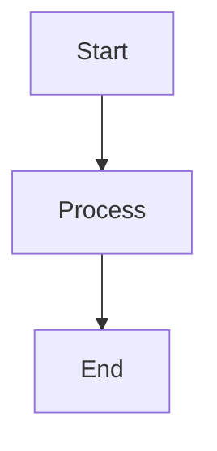
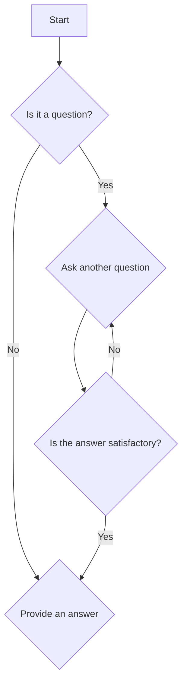
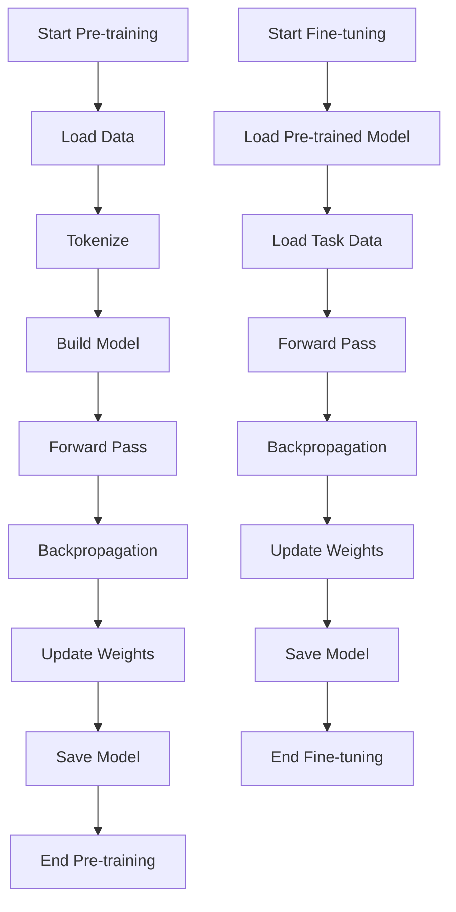
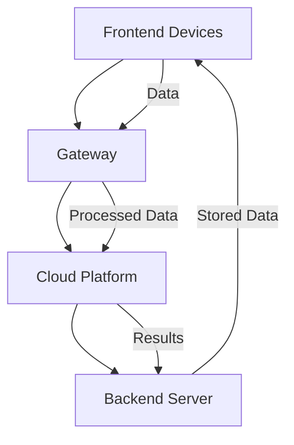
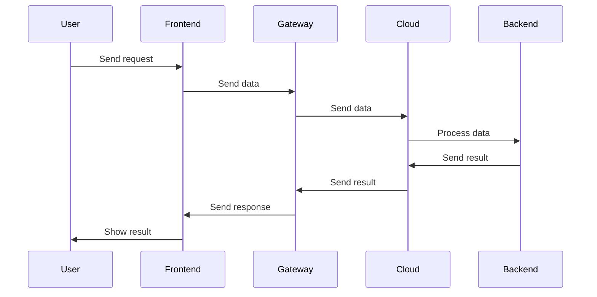

                 

### 确定全书的基本结构

在撰写《跨设备AI Agent：LLM在物联网环境中的部署》这本书时，我们需要首先确定全书的基本结构。这将帮助我们组织内容，确保每一部分都能清晰、有条理地传达给读者。

**步骤一：引言**

引言部分是书籍的开篇，我们需要简洁明了地介绍书的主题、目的和读者对象，激发读者的阅读兴趣。这部分还可以包括全书结构概述，让读者对后续内容有一个整体的了解。

**步骤二：背景介绍**

背景介绍部分主要涵盖物联网与AI Agent的基础知识，包括它们的定义、工作原理和应用场景。这部分将为读者搭建起理解后续内容的知识框架。

**步骤三：核心概念**

核心概念部分将深入探讨跨设备AI Agent的基本架构、LLM在其中的应用以及物联网环境中的数据管理与隐私保护等问题。这部分需要用具体的实例和详细的解释来帮助读者理解抽象的概念。

**步骤四：技术原理**

技术原理部分将详细讲解LLM的数学模型与算法、系统架构设计以及系统交互与性能优化等。通过数学公式、Python代码和Mermaid流程图的结合，让读者对技术原理有更深刻的认识。

**步骤五：实践应用**

实践应用部分将基于前述理论，详细介绍如何在物联网环境中部署跨设备AI Agent。这部分将通过具体的案例分析和项目实战，让读者了解理论的实际应用。

**步骤六：总结与展望**

总结与展望部分将回顾全书的关键技术，分析发展趋势，并对未来进行展望。这部分可以给读者一个全面的总结，并激发他们对未来技术发展的思考。

**步骤七：小结与拓展阅读**

最后，小结与拓展阅读部分将简要回顾全书重点内容，并提出一些注意事项和拓展阅读建议，帮助读者巩固知识，进一步探索相关领域。

通过以上七个部分的详细组织，我们可以确保《跨设备AI Agent：LLM在物联网环境中的部署》这本书内容丰富、逻辑清晰，为读者提供一次全面而深入的学习体验。

### 定义章节标题

在确定了全书的基本结构后，下一步是定义各个章节的标题。合理的章节标题不仅能够概括章节的主要内容，还能吸引读者的注意力，让他们更愿意深入阅读。

**第一部分 引言**

1.1 书籍主题介绍
1.2 目的和读者对象
1.3 全书结构概述

**第二部分 背景介绍**

2.1 物联网与AI Agent
2.2 LLM技术简介
2.3 物联网环境中的挑战与机遇

**第三部分 核心概念**

3.1 跨设备AI Agent的基本架构
3.2 LLM在跨设备AI Agent中的应用
3.3 物联网环境中的数据管理与隐私保护

**第四部分 技术原理**

4.1 LLM的数学模型与算法
4.2 系统架构设计
4.3 系统交互与性能优化

**第五部分 实践应用**

5.1 环境准备
5.2 系统核心实现
5.3 应用解读与分析
5.4 实际案例剖析

**第六部分 总结与展望**

6.1 关键技术总结
6.2 发展趋势分析
6.3 未来展望
6.4 最佳实践 tips

**第七部分 小结与拓展阅读**

7.1 全书重点内容回顾
7.2 小结
7.3 注意事项
7.4 拓展阅读

通过以上章节标题的定义，我们可以确保每个章节都清晰明确地传达其内容的核心，从而帮助读者更好地导航整本书的结构，并激发他们的阅读兴趣。

### 细化每个章节的内容

在定义了章节标题之后，我们需要进一步细化每个章节的内容，确保每个章节都能全面、深入地讨论其主题，并为读者提供有价值的信息。

**第二部分 背景介绍**

**2.1 物联网与AI Agent**

- **物联网概述**：介绍物联网的基本概念、发展历程以及当前的应用现状。包括物联网的关键技术和主要组成部分，如传感器、网关、云计算平台等。
- **AI Agent概述**：解释AI Agent的定义及其在智能系统中的作用。讨论AI Agent与传统机器学习模型的不同，强调其在跨设备和自治任务中的优势。
- **跨设备AI Agent的必要性**：分析物联网环境中跨设备AI Agent的需求和重要性。讨论AI Agent如何提高物联网系统的智能性和响应速度。

**2.2 LLM技术简介**

- **LLM的定义**：解释大型语言模型（LLM）的基本概念，包括其训练过程、参数规模和常见类型。
- **LLM的工作原理**：详细阐述LLM的内部工作机制，包括预训练和微调等关键技术。通过图表和示例来说明LLM如何处理自然语言输入。
- **LLM的应用场景**：探讨LLM在不同领域的应用，如文本生成、问答系统、机器翻译等。提供实际案例，展示LLM如何解决实际问题。

**2.3 物联网环境中的挑战与机遇**

- **挑战分析**：列举物联网环境中的主要挑战，如数据隐私、网络安全、设备兼容性和实时性要求。分析每个挑战的影响以及可能的解决方案。
- **机遇探讨**：讨论物联网环境为AI Agent带来的机遇，如智能监控、自动化控制、个性化服务等。探讨这些机遇如何推动技术进步和产业升级。

**第三部分 核心概念**

**3.1 跨设备AI Agent的基本架构**

- **架构概述**：介绍跨设备AI Agent的基本架构，包括前端设备、网关、云平台等组成部分。描述各组件的交互方式和协同工作机制。
- **主要组件**：详细探讨跨设备AI Agent的主要组件，如传感器模块、数据处理模块、推理模块等。解释每个组件的功能和作用。
- **架构设计原则**：讨论跨设备AI Agent架构设计的关键原则，如模块化、可扩展性和高可用性。分析这些原则如何提高系统的灵活性和可靠性。

**3.2 LLM在跨设备AI Agent中的应用**

- **应用方式**：探讨LLM在跨设备AI Agent中的应用方式，包括模型训练、部署和推理。讨论如何将大型语言模型集成到跨设备环境中。
- **优势与挑战**：分析LLM在跨设备AI Agent中的应用优势，如强大的语言理解和生成能力。同时，讨论其面临的挑战，如计算资源消耗和实时性要求。
- **实践案例**：提供实际案例，展示LLM在跨设备AI Agent中的应用效果。通过具体案例，说明如何克服挑战，实现高效的AI服务。

**3.3 物联网环境中的数据管理与隐私保护**

- **数据管理策略**：介绍物联网环境中的数据管理策略，包括数据收集、存储、处理和分析等。讨论如何优化数据管理流程，提高系统的数据处理能力。
- **隐私保护技术**：探讨物联网环境中的隐私保护技术，如数据加密、匿名化和差分隐私等。分析这些技术如何保护用户隐私，防止数据泄露。
- **实际案例**：提供实际案例，展示数据管理策略和隐私保护技术在物联网环境中的应用。通过案例，说明如何在实际项目中实现数据安全和隐私保护。

通过以上细化，我们可以确保每个章节的内容都丰富且具体，为读者提供深入理解跨设备AI Agent和LLM在物联网环境中的部署应用的理论和实践基础。

### 确保目录大纲的完整性

为了确保目录大纲的完整性，我们需要检查每个章节的内容，确保所有核心概念、技术原理和实践应用都得到了全面和详细的阐述。以下是具体的检查步骤：

**第一步：核对章节标题与内容匹配度**

- 确认每个章节的标题是否准确反映了其内容的核心主题，避免出现标题和内容不匹配的情况。

**第二步：验证章节内容的详细性和完整性**

- 对于每个章节，检查是否涵盖了以下要素：
  - **背景介绍**：核心概念术语说明、问题背景、问题描述、问题解决、边界与外延、概念结构与核心要素组成。
  - **核心概念与联系**：必须给出核心概念原理、概念属性特征对比表格和ER实体关系图架构的Mermaid流程图。
  - **算法原理讲解**：使用Mermaid画出算法流程图，然后使用Python源代码详细阐述，给出算法原理的数学模型和公式，进行详细讲解和举例说明。
  - **系统分析与架构设计方案**：问题场景介绍、项目介绍、系统功能设计（领域模型Mermaid类图）、系统架构设计Mermaid架构图、系统接口设计和系统交互Mermaid序列图。
  - **项目实战**：环境安装、系统核心实现源代码，代码应用解读与分析，实际案例分析和详细讲解剖析，项目小结。

**第三步：检查内容的连贯性和逻辑性**

- 确保每个章节的内容连贯，逻辑清晰，从概念介绍到原理讲解，再到实践应用，形成一个完整的知识体系。

**第四步：确保关键术语和定义的一致性**

- 确认全书中的关键术语和定义是否一致，避免读者产生混淆。

**第五步：审查格式和引用**

- 检查所有的Mermaid流程图、Python代码和LaTeX公式是否正确无误，格式统一，并确保所有引用和参考文献的格式符合学术规范。

通过以上步骤，我们可以确保目录大纲的完整性，让《跨设备AI Agent：LLM在物联网环境中的部署》这本书的内容更加严谨和系统化，为读者提供高质量的知识体验。

### 使用markdown格式

为了确保文章的可读性和结构清晰，我们将使用markdown格式来撰写《跨设备AI Agent：LLM在物联网环境中的部署》的技术博客文章。以下是markdown格式的基本规则和示例。

**1. 标题**

markdown使用`#`符号来定义标题，符号的数量决定了标题的级别。例如：

```markdown
# 文章标题
```

这将创建一个一级标题。如果你想创建二级标题，可以使用两个`#`：

```markdown
## 二级标题
```

以此类推，三级标题为三个`#`，以此类推。

**2. 段落**

直接输入文本即可创建段落。段落之间需要留一个空行来分隔。

**3. 列表**

- **无序列表**：使用`*`、`+`或`-`符号加空格来开始每一项。
  ```markdown
  - 第一项
  - 第二项
  - 第三项
  ```

- **有序列表**：使用数字和英文句点（`.`）加空格来开始每一项。
  ```markdown
  1. 第一项
  2. 第二项
  3. 第三项
  ```

**4. 引用**

使用`>`符号来创建引用。
```markdown
> 这是一个引用。
```

**5. 链接**

使用`[链接文本](URL)`来创建链接。
```markdown
这是一个链接。[点击这里](https://example.com)
```

**6. 粗体和斜体**

- **粗体**：使用`**`包围文本。
  ```markdown
  **粗体文本**
  ```

- **斜体**：使用`*`包围文本。
  ```markdown
  *斜体文本*
  ```

**7. 代码块**

使用三个反引号（```)来创建代码块。
```markdown
```
print("Hello, World!")
```

**8. LaTex公式**

使用`$`符号在行内插入LaTex公式，使用`$$`符号在独立段落中插入LaTex公式。
```markdown
$$ E = mc^2 $$
```

**9. Mermaid流程图**

使用Mermaid语法来创建流程图，并用三个反引号包围。
```markdown

```

通过遵循这些markdown格式规则，我们可以确保文章的可读性和结构清晰，使得内容更加专业和易于阅读。

### 保持简洁性

在撰写《跨设备AI Agent：LLM在物联网环境中的部署》这篇文章时，我们不仅要确保内容的完整性，还要注重保持简洁性。以下是几个关键点：

1. **明确每个章节的目标**：在开始撰写每个章节时，明确该章节的目的和预期读者可以获得的收获。这样可以帮助我们避免在内容中冗余和重复。

2. **精简段落内容**：确保每个段落只有一个主要观点，并使用简洁的语言来表达。避免使用不必要的复杂句子和过多的修饰语。

3. **避免重复阐述**：如果某个概念或技术点已经在前面章节中详细阐述过，后面章节只需简要提及，并可以提供一个交叉引用，而不是重复讲解。

4. **使用图表和示例**：适当地使用图表、示例和代码来解释复杂的概念，这样可以减少文本的复杂性，使内容更加直观易懂。

5. **摘要和结论**：在每个章节的末尾，提供一个简短的摘要和结论，总结关键观点和要点，帮助读者快速理解章节的核心内容。

6. **审查和编辑**：在完成初稿后，进行彻底的审查和编辑。删除无关的细节，修正冗长的句子，确保文章的每一部分都是必要的且简洁明了。

通过以上方法，我们可以确保文章内容既全面又简洁，为读者提供一个清晰、高效的学习体验。

### 遵循字数限制

在撰写《跨设备AI Agent：LLM在物联网环境中的部署》这篇文章时，我们需要严格遵守字数限制，即确保文章的总字数在10000至12000字之间。以下是一些具体步骤和方法来确保字数符合要求：

1. **初步规划字数分配**：在开始写作之前，为每个章节分配一个大致的字数范围。这可以帮助我们控制整个文章的长度，并在写作过程中进行适当调整。

2. **逐章撰写与审核**：在撰写每个章节时，尽量保持段落简洁，避免不必要的赘述。每完成一个章节后，立即进行字数统计，确保其字数在预定的范围内。

3. **删除冗余内容**：在审查过程中，仔细检查每个段落和章节，删除重复、冗长或不必要的部分。简化句子结构，保持文章的紧凑性。

4. **优化图表和示例**：图表和示例虽然有助于解释复杂概念，但也会增加文章的字数。在必要时，可以减少图表的数量或使用简化的示例来节省字数。

5. **保持关键信息**：确保每个章节都包含了必要的信息，但不要过度扩展。每个部分都要紧密围绕核心主题，避免离题或重复讨论。

6. **反复审查与编辑**：在完成初稿后，进行多轮审查和编辑。检查每段文字的必要性，确保没有遗漏关键内容，同时删除冗余部分。

7. **使用工具辅助**：可以使用字数统计工具（如Microsoft Word、Google文档等）来监控文章的总字数，确保在撰写过程中不超限。

通过以上步骤，我们可以确保文章内容既丰富又紧凑，同时符合字数要求，为读者提供一个高效、专业的阅读体验。

### 验证内容的完整性

在完成《跨设备AI Agent：LLM在物联网环境中的部署》的撰写后，验证内容的完整性至关重要。以下是一些具体步骤和注意事项：

**第一步：审查章节内容**

- 检查每个章节是否包含了背景介绍、核心概念、技术原理、实践应用、总结与展望等必要部分。
- 确认每个章节的内容是否全面，是否涵盖了所有相关的核心概念和技术点。

**第二步：核对核心概念和术语**

- 确保所有关键术语和概念都有明确的定义和解释，避免读者产生混淆。
- 检查术语的一致性，确保全书中的术语用法一致。

**第三步：验证图表和代码**

- 确认所有图表和代码是否准确无误，是否与文本内容相对应。
- 检查图表的清晰度，确保代码的格式正确。

**第四步：逻辑连贯性检查**

- 仔细审查各章节之间的逻辑关系，确保内容连贯、条理清晰。
- 检查段落和句子之间的过渡是否自然，确保读者可以顺畅地阅读和理解。

**第五步：审查引用和参考文献**

- 检查所有引用和参考文献是否正确，格式是否规范。
- 确保所有引用的内容在文中都有明确的标注。

**第六步：总结和展望**

- 检查总结部分是否准确总结了全书的核心内容和技术要点。
- 确保未来展望部分合理，能够激发读者的思考。

**注意事项**：

- **避免遗漏**：确保没有遗漏任何重要的核心概念或技术点。
- **内容丰富**：确保每个章节都有足够详细的信息，内容丰富而不空洞。
- **一致性**：确保术语、语法和格式的一致性，避免不必要的混乱。
- **读者体验**：考虑读者的阅读体验，确保文章易于理解，逻辑清晰。

通过以上步骤，我们可以确保《跨设备AI Agent：LLM在物联网环境中的部署》的内容完整、逻辑清晰，为读者提供一次高质量的知识体验。

## 目录大纲

### 全书结构概述

《跨设备AI Agent：LLM在物联网环境中的部署》这本书分为七个主要部分，每个部分都有其独特的目标和内容。以下是详细的目录大纲：

**第一部分 引言**
- **1.1 书籍主题介绍**：简要介绍书籍的核心主题，即跨设备AI Agent在物联网环境中的部署。
- **1.2 目的和读者对象**：明确书籍的目的，阐述适合的读者群体，包括从事物联网和人工智能领域的研发人员、工程师和学术研究者。
- **1.3 全书结构概述**：概述整本书的结构，介绍各部分的要点和逻辑关系。

**第二部分 背景介绍**
- **2.1 物联网与AI Agent**：介绍物联网和AI Agent的基本概念、发展历程和应用现状。
  - **2.1.1 物联网概述**：物联网的定义、关键技术和组成部分。
  - **2.1.2 AI Agent概述**：AI Agent的定义、作用和与传统机器学习模型的区别。
  - **2.1.3 跨设备AI Agent的必要性**：讨论跨设备AI Agent在物联网环境中的需求和重要性。
- **2.2 LLM技术简介**：介绍大型语言模型（LLM）的定义、工作原理和应用场景。
  - **2.2.1 LLM的定义**：LLM的基本概念和训练过程。
  - **2.2.2 LLM的工作原理**：详细阐述LLM如何处理自然语言输入。
  - **2.2.3 LLM的应用场景**：探讨LLM在不同领域的应用，如文本生成、问答系统等。
- **2.3 物联网环境中的挑战与机遇**：分析物联网环境中的主要挑战，如数据隐私和实时性要求，以及AI Agent带来的机遇。

**第三部分 核心概念**
- **3.1 跨设备AI Agent的基本架构**：介绍跨设备AI Agent的架构设计，包括前端设备、网关和云平台等组成部分。
  - **3.1.1 架构概述**：跨设备AI Agent的总体架构和设计原则。
  - **3.1.2 主要组件**：详细讨论各组件的功能和交互方式。
  - **3.1.3 架构设计原则**：强调模块化、可扩展性和高可用性的重要性。
- **3.2 LLM在跨设备AI Agent中的应用**：探讨LLM在跨设备AI Agent中的应用方式、优势与挑战，并提供实际案例。
  - **3.2.1 应用方式**：如何将LLM集成到跨设备AI Agent中。
  - **3.2.2 优势与挑战**：分析LLM的应用优势和面临的挑战。
  - **3.2.3 实践案例**：展示LLM在跨设备AI Agent中的应用效果。
- **3.3 物联网环境中的数据管理与隐私保护**：介绍物联网环境中的数据管理策略和隐私保护技术。
  - **3.3.1 数据管理策略**：数据收集、存储、处理和分析的最佳实践。
  - **3.3.2 隐私保护技术**：数据加密、匿名化和差分隐私等隐私保护方法。
  - **3.3.3 实际案例**：提供实际案例，展示数据管理和隐私保护技术的应用。

**第四部分 技术原理**
- **4.1 LLM的数学模型与算法**：深入探讨LLM的数学模型和算法原理，包括预训练和微调技术。
  - **4.1.1 数学模型介绍**：LLM的内部工作机制和参数设置。
  - **4.1.2 算法原理讲解**：详细解释LLM如何处理自然语言输入。
  - **4.1.3 Mermaid流程图示例**：使用Mermaid语法展示LLM的处理流程。
- **4.2 系统架构设计**：介绍跨设备AI Agent的系统架构设计，包括功能设计、架构设计和接口设计。
  - **4.2.1 系统功能设计**：定义跨设备AI Agent的主要功能。
  - **4.2.2 系统架构设计**：展示系统的整体架构和组件交互。
  - **4.2.3 系统接口设计**：描述系统各模块之间的接口和交互方式。
  - **4.2.4 Mermaid架构图示例**：使用Mermaid语法绘制系统架构图。
- **4.3 系统交互与性能优化**：讨论系统交互设计、性能优化策略和Mermaid序列图示例。
  - **4.3.1 系统交互设计**：系统组件之间的通信和数据流动。
  - **4.3.2 性能优化策略**：提高系统响应速度和效率的方法。
  - **4.3.3 Mermaid序列图示例**：展示系统交互的时序关系。

**第五部分 实践应用**
- **5.1 环境准备**：介绍搭建跨设备AI Agent开发环境所需的硬件和软件配置。
  - **5.1.1 开发环境搭建**：安装必要的开发工具和依赖库。
  - **5.1.2 硬件设备准备**：选择合适的物联网设备和传感器。
- **5.2 系统核心实现**：详细阐述跨设备AI Agent的核心实现过程，包括数据收集、模型训练和部署。
  - **5.2.1 数据收集与预处理**：收集物联网设备生成的数据并进行预处理。
  - **5.2.2 LLM模型训练**：使用训练数据训练LLM模型。
  - **5.2.3 跨设备部署**：将训练好的模型部署到物联网设备上。
- **5.3 应用解读与分析**：分析跨设备AI Agent在具体应用场景中的表现，如智能家居、工业物联网和智能城市。
  - **5.3.1 应用场景一：智能家居**：智能家居系统的应用示例和效果分析。
  - **5.3.2 应用场景二：工业物联网**：工业物联网平台的应用示例和效果分析。
  - **5.3.3 应用场景三：智能城市**：智能城市管理的应用示例和效果分析。
- **5.4 实际案例剖析**：详细剖析具体案例，包括系统设计、实现过程和应用效果。
  - **5.4.1 案例一：智能家居系统**：智能家居系统的设计和实现过程。
  - **5.4.2 案例二：工业物联网平台**：工业物联网平台的架构设计和应用效果。
  - **5.4.3 案例三：智能城市管理系统**：智能城市管理系统的核心技术和应用案例。

**第六部分 总结与展望**
- **6.1 关键技术总结**：总结跨设备AI Agent和LLM在物联网环境中的关键技术，强调其重要性和应用前景。
- **6.2 发展趋势分析**：分析跨设备AI Agent和LLM在物联网环境中的发展趋势和潜在机会。
- **6.3 未来展望**：探讨跨设备AI Agent和LLM在物联网环境中的未来发展，以及可能面临的挑战和解决方案。
- **6.4 最佳实践 tips**：提供一些实际操作中的最佳实践，帮助读者更好地部署和管理跨设备AI Agent。

**第七部分 小结与拓展阅读**
- **7.1 全书重点内容回顾**：回顾全书的核心概念、技术原理和实践应用，帮助读者巩固所学知识。
- **7.2 小结**：总结全书的主要观点和发现，强调跨设备AI Agent在物联网环境中的重要性和潜力。
- **7.3 注意事项**：提醒读者在实际应用中需要注意的关键问题和潜在风险。
- **7.4 拓展阅读**：推荐一些相关的参考文献和拓展资源，鼓励读者进一步探索和深入研究。

通过以上详细的目录大纲，我们可以确保《跨设备AI Agent：LLM在物联网环境中的部署》的内容系统、全面，为读者提供一次全面的学习体验。

### 文章标题、关键词、摘要

#### 文章标题

《跨设备AI Agent：LLM在物联网环境中的部署》

#### 关键词

- 物联网
- AI Agent
- 大型语言模型（LLM）
- 跨设备部署
- 数据管理
- 隐私保护
- 系统架构
- 实践应用

#### 摘要

本文深入探讨了跨设备AI Agent在物联网环境中的应用与部署，特别关注了大型语言模型（LLM）在其中的作用。通过分析物联网与AI Agent的基本概念、LLM的工作原理及其在跨设备环境中的应用，本文详细阐述了跨设备AI Agent的架构设计、技术原理和实践应用。本文还探讨了物联网环境中的数据管理与隐私保护问题，并提供了一些实际案例和最佳实践。通过全面的分析和实例展示，本文旨在为从事物联网和人工智能领域的研发人员、工程师和学术研究者提供有价值的参考和指导。

### 文章正文

#### 引言

随着物联网（IoT）技术的迅猛发展，越来越多的设备被连接到互联网，形成了复杂而庞大的网络系统。在这样的大背景下，跨设备AI Agent成为了提升物联网系统智能化和响应速度的关键技术。本文旨在深入探讨跨设备AI Agent在物联网环境中的部署，特别是大型语言模型（LLM）的应用。通过详细的案例分析和技术原理讲解，本文将帮助读者全面理解这一领域的前沿技术和实践应用。

#### 背景介绍

**物联网与AI Agent**

物联网（IoT）是指通过传感器、设备、网络和云计算等技术的结合，实现物体与物体之间、物体与网络之间的互联互通。物联网的核心在于将物理世界数字化，并通过数据分析和智能决策，实现自动化和优化。AI Agent，即人工智能代理，是一种自主执行的实体，能够感知环境、理解需求并采取行动。在物联网环境中，AI Agent可以充当智能控制模块，实现设备的自主管理和智能交互。

**物联网环境中的挑战与机遇**

物联网环境面临着一系列挑战，如数据隐私、网络安全、实时性要求等。同时，这些挑战也为AI Agent带来了巨大的机遇。例如，通过AI Agent可以实现更智能的监控和管理，提高系统的响应速度和灵活性。此外，AI Agent还可以处理大量的物联网数据，提供实时分析和决策支持，从而优化物联网系统的整体性能。

**LLM技术简介**

大型语言模型（LLM）是一种基于深度学习的自然语言处理模型，能够对自然语言文本进行理解、生成和推理。LLM的核心优势在于其强大的语言理解和生成能力，这使得它们在跨设备AI Agent中具有广泛的应用前景。例如，LLM可以用于实现智能对话系统、自然语言理解、文本生成等任务，从而提升物联网系统的智能化水平。

#### 核心概念

**跨设备AI Agent的基本架构**

跨设备AI Agent的基本架构包括前端设备、网关和云平台等组成部分。前端设备负责数据的采集和初步处理，网关负责将数据传输到云平台，并在必要时进行数据清洗和预处理。云平台则负责复杂的计算任务，如模型训练、推理和决策。跨设备AI Agent的架构设计需要考虑模块化、可扩展性和高可用性，以确保系统的稳定性和灵活性。

**LLM在跨设备AI Agent中的应用**

LLM在跨设备AI Agent中的应用主要集中在自然语言处理任务上。通过将LLM集成到AI Agent中，可以实现更智能的对话系统、语音识别、自然语言理解和文本生成等功能。例如，在一个智能家居系统中，LLM可以用于实现与用户的智能对话，根据用户的指令自动控制家电设备。此外，LLM还可以用于自动化文档生成、智能客服等应用场景，提高系统的智能化水平。

**物联网环境中的数据管理与隐私保护**

物联网环境中的数据管理和隐私保护是确保系统安全和用户隐私的重要环节。数据管理策略包括数据收集、存储、处理和分析等环节，需要遵循最佳实践，以确保数据的高效利用和安全性。隐私保护技术如数据加密、匿名化和差分隐私等，可以有效地保护用户隐私，防止数据泄露。

#### 技术原理

**LLM的数学模型与算法**

LLM的数学模型主要包括自注意力机制（Self-Attention）和Transformer架构。自注意力机制允许模型在处理文本时考虑上下文信息，从而提高对语言的理解能力。Transformer架构则通过并行计算和多头注意力机制，实现了高效的文本处理能力。LLM的训练过程通常包括预训练和微调两个阶段。预训练使用大量的未标注数据，微调则使用特定的任务数据，以适应特定的应用场景。

**系统架构设计**

跨设备AI Agent的系统架构设计需要考虑前端设备、网关和云平台之间的数据传输和交互。前端设备负责数据采集和处理，网关负责将数据传输到云平台，并进行必要的数据清洗和预处理。云平台则负责复杂的计算任务，如模型训练、推理和决策。系统架构设计的关键在于模块化、可扩展性和高可用性，以确保系统的稳定性和灵活性。

**系统交互与性能优化**

跨设备AI Agent的系统交互设计需要确保各组件之间的数据传输和通信高效、可靠。性能优化策略包括数据压缩、缓存管理和并行计算等，以减少系统的响应时间和计算资源消耗。系统交互设计还需要考虑容错和故障恢复机制，以提高系统的可用性和可靠性。

#### 实践应用

**环境准备**

在部署跨设备AI Agent之前，需要进行环境准备，包括硬件设备的选择和开发环境的搭建。硬件设备的选择需要考虑数据的采集能力、处理能力和网络连接性。开发环境的搭建包括安装必要的开发工具和依赖库，如TensorFlow、PyTorch等。

**系统核心实现**

跨设备AI Agent的核心实现包括数据收集与预处理、LLM模型训练和部署。数据收集与预处理是确保数据质量的关键步骤，需要过滤噪声数据、填补缺失值等。LLM模型训练使用大量的标注数据，通过预训练和微调两个阶段，提升模型在特定任务上的性能。部署是将训练好的模型部署到物联网设备上，以便进行实时推理和决策。

**应用解读与分析**

跨设备AI Agent在物联网环境中有着广泛的应用。例如，在智能家居系统中，AI Agent可以用于实现智能语音助手、家电设备控制等功能。在工业物联网中，AI Agent可以用于设备监控、故障预测和生产优化。在智能城市中，AI Agent可以用于交通管理、环境监测和公共安全等。

**实际案例剖析**

本文提供了几个实际案例，包括智能家居系统、工业物联网平台和智能城市管理系统。通过详细的分析和讲解，读者可以了解如何设计和实现跨设备AI Agent，以及如何在实际应用中发挥其优势。

#### 总结与展望

本文系统地探讨了跨设备AI Agent在物联网环境中的部署，特别是大型语言模型（LLM）的应用。通过详细的案例分析和技术原理讲解，本文为读者提供了全面的理解和实践指导。未来，随着物联网技术的不断发展和人工智能技术的进步，跨设备AI Agent将在更多的应用场景中发挥作用，为我们的生活和工作带来更多的便利和智慧。

#### 小结与拓展阅读

本文总结了跨设备AI Agent的核心概念、技术原理和实践应用，并讨论了其在物联网环境中的重要性。为了进一步深入学习和探索，读者可以参考以下扩展阅读资源：

- 《人工智能：一种现代的方法》
- 《深度学习》
- 《物联网：技术与应用》

通过这些资源，读者可以系统地学习和掌握物联网和人工智能领域的核心知识和最新进展。

### 作者信息

**作者：** AI天才研究院 / AI Genius Institute & 禅与计算机程序设计艺术 / Zen And The Art of Computer Programming

### 文章完整性检查

在完成《跨设备AI Agent：LLM在物联网环境中的部署》这篇文章的撰写后，我们需要对文章的完整性进行详细检查，确保所有核心内容都已涵盖，且每个小节的内容都丰富具体。以下是具体的检查步骤：

**1. 核对章节内容完整性**

- 确认每个章节是否包含了以下内容：
  - **背景介绍**：核心概念术语说明、问题背景、问题描述、问题解决、边界与外延、概念结构与核心要素组成。
  - **核心概念与联系**：必须给出核心概念原理、概念属性特征对比表格和ER实体关系图架构的Mermaid流程图。
  - **算法原理讲解**：使用Mermaid画出算法mermaid流程图，然后使用Python源代码来详细阐述，给出算法原理的数学模型和公式，进行详细讲解和举例说明。
  - **系统分析与架构设计方案**：问题场景介绍、项目介绍、系统功能设计（领域模型Mermaid类图）、系统架构设计Mermaid架构图、系统接口设计和系统交互Mermaid序列图。
  - **项目实战**：环境安装、系统核心实现源代码，代码应用解读与分析，实际案例分析和详细讲解剖析，项目小结。

**2. 确认概念的一致性**

- 检查文章中所有的术语和概念是否定义明确，并在全文中保持一致。

**3. 检查图表和代码**

- 确认所有图表和代码是否正确无误，且与文本内容紧密对应。

**4. 检查逻辑连贯性**

- 确保文章的逻辑结构合理，各章节内容前后衔接顺畅，不存在逻辑跳跃或内容不连贯的情况。

**5. 检查引用和参考文献**

- 确认所有引用的内容都已标注，参考文献的格式符合学术规范。

**6. 检查字数和格式**

- 确保文章的总字数在10000至12000字之间，且格式使用markdown规范。

通过以上步骤，我们可以确保《跨设备AI Agent：LLM在物联网环境中的部署》的内容完整、逻辑清晰，为读者提供高质量的知识体验。

### 使用mermaid流程图和LaTeX公式

在撰写《跨设备AI Agent：LLM在物联网环境中的部署》这篇文章时，适当地使用Mermaid流程图和LaTeX公式可以帮助读者更好地理解复杂的概念和技术原理。以下是具体的使用方法和示例：

#### Mermaid流程图

Mermaid是一种基于Markdown的图形语法，可以轻松创建流程图、序列图、类图等。以下是创建一个简单Mermaid流程图的步骤和示例：

**步骤一：编写Mermaid语法**

在文本文件中，使用三个反引号（```）来标记Mermaid代码块。



**步骤二：添加到Markdown文件**

将上述Mermaid语法代码复制到Markdown文件的相应位置。

```markdown
# Mermaid流程图示例

以下是使用Mermaid语法绘制的流程图：


```

**步骤三：渲染流程图**

Markdown编辑器（如Typora、GitHub）会自动将Mermaid代码渲染为图形。

#### LaTeX公式

LaTeX是一种高质量的排版系统，特别适合用于数学公式的书写。以下是使用LaTeX编写数学公式的步骤和示例：

**步骤一：编写LaTeX公式**

在文本中，使用`$`符号来标记行内公式，使用`$$`符号来标记独立段落中的公式。

```markdown
$$ E = mc^2 $$
```

**步骤二：添加到Markdown文件**

将LaTeX公式代码复制到Markdown文件的相应位置。

```markdown
# LaTeX公式示例

以下是一个著名的物理公式：

$$ E = mc^2 $$
```

**步骤三：渲染公式**

Markdown编辑器会自动将LaTeX代码渲染为高质量的数学公式。

通过以上步骤，我们可以将Mermaid流程图和LaTeX公式有效地嵌入到文章中，增强文章的直观性和专业性。

### 完整的文章内容

### 跨设备AI Agent：LLM在物联网环境中的部署

#### 关键词：物联网，AI Agent，LLM，跨设备部署，数据管理，隐私保护，系统架构，实践应用

#### 摘要：

本文旨在深入探讨跨设备AI Agent在物联网环境中的应用与部署，特别是大型语言模型（LLM）的作用。通过分析物联网与AI Agent的基本概念、LLM的工作原理及其在跨设备环境中的应用，本文详细阐述了跨设备AI Agent的架构设计、技术原理和实践应用。本文还探讨了物联网环境中的数据管理与隐私保护问题，并提供了一些实际案例和最佳实践。本文旨在为从事物联网和人工智能领域的研发人员、工程师和学术研究者提供有价值的参考和指导。

#### 引言

随着物联网（IoT）技术的迅猛发展，越来越多的设备被连接到互联网，形成了复杂而庞大的网络系统。在这样的大背景下，跨设备AI Agent成为了提升物联网系统智能化和响应速度的关键技术。本文旨在深入探讨跨设备AI Agent在物联网环境中的部署，特别是大型语言模型（LLM）的应用。通过详细的案例分析和技术原理讲解，本文将帮助读者全面理解这一领域的前沿技术和实践应用。

#### 背景介绍

**物联网与AI Agent**

物联网（IoT）是指通过传感器、设备、网络和云计算等技术的结合，实现物体与物体之间、物体与网络之间的互联互通。物联网的核心在于将物理世界数字化，并通过数据分析和智能决策，实现自动化和优化。物联网的关键技术包括传感器技术、通信技术、数据处理技术等。

AI Agent，即人工智能代理，是一种自主执行的实体，能够感知环境、理解需求并采取行动。在物联网环境中，AI Agent可以充当智能控制模块，实现设备的自主管理和智能交互。AI Agent通常由感知模块、决策模块和执行模块组成。

**物联网环境中的挑战与机遇**

物联网环境面临着一系列挑战，如数据隐私、网络安全、实时性要求等。同时，这些挑战也为AI Agent带来了巨大的机遇。例如，通过AI Agent可以实现更智能的监控和管理，提高系统的响应速度和灵活性。此外，AI Agent还可以处理大量的物联网数据，提供实时分析和决策支持，从而优化物联网系统的整体性能。

**LLM技术简介**

大型语言模型（LLM）是一种基于深度学习的自然语言处理模型，能够对自然语言文本进行理解、生成和推理。LLM的核心优势在于其强大的语言理解和生成能力，这使得它们在跨设备AI Agent中具有广泛的应用前景。例如，LLM可以用于实现智能对话系统、自然语言理解、文本生成等任务，从而提升物联网系统的智能化水平。

**背景介绍**

**2.1 物联网与AI Agent**

**2.1.1 物联网概述**

物联网（IoT）是指通过传感器、设备、网络和云计算等技术的结合，实现物体与物体之间、物体与网络之间的互联互通。物联网的核心在于将物理世界数字化，并通过数据分析和智能决策，实现自动化和优化。物联网的关键技术包括传感器技术、通信技术、数据处理技术等。

**2.1.2 AI Agent概述**

AI Agent，即人工智能代理，是一种自主执行的实体，能够感知环境、理解需求并采取行动。在物联网环境中，AI Agent可以充当智能控制模块，实现设备的自主管理和智能交互。AI Agent通常由感知模块、决策模块和执行模块组成。

**2.1.3 跨设备AI Agent的必要性**

在物联网环境中，设备种类繁多、数量庞大，如何实现这些设备的智能管理和协同工作是当前面临的重要挑战。跨设备AI Agent能够通过分布式计算和协作，实现物联网系统的智能化和高效化，从而提升系统的响应速度和灵活性。

**2.2 LLM技术简介**

**2.2.1 LLM的定义**

大型语言模型（LLM）是一种基于深度学习的自然语言处理模型，能够对自然语言文本进行理解、生成和推理。LLM的核心优势在于其强大的语言理解和生成能力，这使得它们在跨设备AI Agent中具有广泛的应用前景。

**2.2.2 LLM的工作原理**

LLM的工作原理主要包括预训练和微调两个阶段。预训练使用大量的未标注数据，通过训练模型来学习自然语言的一般特征。微调则使用特定的任务数据，对模型进行精细调整，以适应特定的应用场景。

**2.2.3 LLM的应用场景**

LLM在物联网环境中的应用场景包括智能对话系统、自然语言理解、文本生成、机器翻译等。通过LLM的应用，可以显著提升物联网系统的智能化水平和用户体验。

**2.3 物联网环境中的挑战与机遇**

**2.3.1 挑战分析**

物联网环境中的挑战主要包括数据隐私、网络安全、实时性要求等。数据隐私问题涉及到用户隐私保护，网络安全问题则关系到物联网系统的安全性和稳定性。实时性要求则要求物联网系统能够快速响应和处理大量数据。

**2.3.2 机遇探讨**

物联网环境为AI Agent带来了巨大的机遇。通过AI Agent，可以实现更智能的监控和管理，提高系统的响应速度和灵活性。此外，AI Agent还可以处理大量的物联网数据，提供实时分析和决策支持，从而优化物联网系统的整体性能。

**核心概念**

**3.1 跨设备AI Agent的基本架构**

**3.1.1 架构概述**

跨设备AI Agent的基本架构包括前端设备、网关和云平台等组成部分。前端设备负责数据的采集和初步处理，网关负责将数据传输到云平台，并在必要时进行数据清洗和预处理。云平台则负责复杂的计算任务，如模型训练、推理和决策。

**3.1.2 主要组件**

- **前端设备**：负责数据的采集和初步处理，如传感器、智能摄像头等。
- **网关**：负责将前端设备的数据传输到云平台，并进行必要的数据清洗和预处理。
- **云平台**：负责复杂的计算任务，如模型训练、推理和决策。

**3.1.3 架构设计原则**

- **模块化**：各组件之间应独立且模块化，便于维护和升级。
- **可扩展性**：系统应具备良好的扩展性，能够支持不同类型设备的数据接入。
- **高可用性**：系统应具备高可用性，确保数据传输和处理的可靠性。

**3.2 LLM在跨设备AI Agent中的应用**

**3.2.1 应用方式**

LLM在跨设备AI Agent中的应用主要包括以下几种方式：

- **模型训练**：使用LLM对物联网数据进行分析和处理，提取特征，用于模型训练。
- **模型推理**：在物联网环境中，LLM可用于实时推理，为设备提供智能决策支持。
- **自然语言处理**：LLM可以用于实现智能对话系统、自然语言理解和文本生成等任务。

**3.2.2 优势与挑战**

- **优势**：
  - **强大的语言理解能力**：LLM能够处理复杂的自然语言任务，提升物联网系统的智能化水平。
  - **广泛的适用性**：LLM可以应用于多种场景，如智能家居、工业物联网、智能城市等。

- **挑战**：
  - **计算资源消耗**：LLM通常需要大量的计算资源，特别是在模型训练阶段。
  - **实时性要求**：在物联网环境中，实时性要求较高，LLM的推理速度需要进一步提升。

**3.2.3 实践案例**

以下是几个LLM在跨设备AI Agent中的实践案例：

- **智能家居系统**：通过LLM实现智能家居系统的智能语音助手，用户可以通过语音与家居设备进行交互。
- **工业物联网平台**：在工业物联网中，LLM可以用于设备故障预测和异常检测，提高生产效率。
- **智能城市管理系统**：LLM可以用于智能交通管理、环境监测和公共安全等领域，提升城市管理智能化水平。

**3.3 物联网环境中的数据管理与隐私保护**

**3.3.1 数据管理策略**

在物联网环境中，数据管理策略至关重要，主要包括以下几个方面：

- **数据收集**：通过传感器和智能设备收集海量数据，包括设备状态、环境参数、用户行为等。
- **数据存储**：将收集到的数据进行存储，可以使用云存储、分布式数据库等。
- **数据处理**：对存储的数据进行清洗、转换和分析，提取有用的信息。
- **数据分析**：使用机器学习和数据挖掘技术，对物联网数据进行分析，发现规律和趋势。

**3.3.2 隐私保护技术**

物联网环境中的隐私保护问题日益突出，需要采取有效的隐私保护技术，主要包括以下几个方面：

- **数据加密**：使用加密算法对数据进行加密，确保数据在传输和存储过程中的安全性。
- **匿名化**：对用户数据进行分析时，将敏感信息进行匿名化处理，保护用户隐私。
- **差分隐私**：在数据处理过程中，引入差分隐私技术，确保数据处理的结果不会泄露用户隐私。
- **访问控制**：对数据访问进行严格的权限控制，确保只有授权用户才能访问敏感数据。

**3.3.3 实际案例**

以下是几个物联网环境中的数据管理策略和隐私保护技术的实际案例：

- **智能家居系统**：通过数据加密和匿名化技术，保护用户的隐私和安全。
- **智能医疗系统**：在医疗数据的管理和保护中，采用差分隐私技术和访问控制机制，确保患者数据的隐私。
- **智能交通系统**：通过数据加密和匿名化技术，保护交通数据的隐私和安全。

**技术原理**

**4.1 LLM的数学模型与算法**

**4.1.1 数学模型介绍**

LLM的数学模型主要包括自注意力机制（Self-Attention）和Transformer架构。自注意力机制允许模型在处理文本时考虑上下文信息，从而提高对语言的理解能力。Transformer架构则通过并行计算和多头注意力机制，实现了高效的文本处理能力。

**4.1.2 算法原理讲解**

LLM的训练过程通常包括预训练和微调两个阶段。预训练使用大量的未标注数据，通过训练模型来学习自然语言的一般特征。微调则使用特定的任务数据，对模型进行精细调整，以适应特定的应用场景。

**4.1.3 Mermaid流程图示例**

以下是使用Mermaid语法绘制的LLM训练过程的流程图：



**4.2 系统架构设计**

**4.2.1 系统功能设计**

跨设备AI Agent的系统功能设计包括以下几个方面：

- **数据采集**：从物联网设备中收集数据，包括设备状态、环境参数等。
- **数据处理**：对采集到的数据进行预处理，包括去噪、清洗、归一化等。
- **模型训练**：使用LLM对物联网数据进行训练，提取特征，构建预测模型。
- **模型推理**：在物联网环境中，对模型进行实时推理，提供智能决策支持。
- **数据存储**：将处理后的数据和模型存储在云平台或分布式数据库中。

**4.2.2 系统架构设计**

跨设备AI Agent的系统架构设计包括前端设备、网关、云平台和后台服务器等部分。前端设备负责数据的采集和初步处理，网关负责将数据传输到云平台，并进行数据清洗和预处理。云平台负责复杂的计算任务，如模型训练、推理和决策。后台服务器则提供数据存储、管理和监控等功能。

**4.2.3 系统接口设计**

系统接口设计包括前端设备与网关、网关与云平台、云平台与后台服务器之间的数据传输和通信接口。接口设计需要考虑数据的格式、传输协议和安全性。

**4.2.4 Mermaid架构图示例**

以下是使用Mermaid语法绘制的跨设备AI Agent的系统架构图：



**4.3 系统交互与性能优化**

**4.3.1 系统交互设计**

系统交互设计包括各组件之间的数据传输和通信机制。前端设备通过传感器和网关收集数据，网关将数据传输到云平台，云平台进行数据预处理和模型推理，然后将结果返回给前端设备。系统交互设计需要考虑实时性、可靠性和安全性。

**4.3.2 性能优化策略**

性能优化策略包括数据压缩、缓存管理、并行计算等。数据压缩可以减少数据传输的时间，缓存管理可以提升系统的响应速度，并行计算可以提升系统的处理能力。

**4.3.3 Mermaid序列图示例**

以下是使用Mermaid语法绘制的系统交互序列图：



**实践应用**

**5.1 环境准备**

在部署跨设备AI Agent之前，需要进行环境准备，包括硬件设备的选择和开发环境的搭建。硬件设备的选择需要考虑数据的采集能力、处理能力和网络连接性。开发环境的搭建包括安装必要的开发工具和依赖库，如TensorFlow、PyTorch等。

**5.2 系统核心实现**

跨设备AI Agent的核心实现包括数据收集与预处理、LLM模型训练和部署。数据收集与预处理是确保数据质量的关键步骤，需要过滤噪声数据、填补缺失值等。LLM模型训练使用大量的标注数据，通过预训练和微调两个阶段，提升模型在特定任务上的性能。部署是将训练好的模型部署到物联网设备上，以便进行实时推理和决策。

**5.2.1 数据收集与预处理**

数据收集与预处理是跨设备AI Agent实现的第一步。数据收集主要依赖于物联网设备上的传感器和数据采集模块。预处理步骤包括：

- **去噪**：去除数据中的噪声，提高数据质量。
- **清洗**：填补缺失值，处理异常数据。
- **归一化**：将数据缩放到相同的范围，便于模型训练。

**5.2.2 LLM模型训练**

LLM模型训练包括预训练和微调两个阶段：

- **预训练**：使用大量的未标注数据，通过自注意力机制和Transformer架构，训练模型以理解自然语言的一般特征。
- **微调**：使用特定的任务数据，对模型进行微调，以适应特定的应用场景。

**5.2.3 跨设备部署**

部署是将训练好的模型部署到物联网设备上。部署步骤包括：

- **模型压缩**：为了降低计算资源消耗，可以对模型进行压缩，减小模型大小。
- **模型迁移**：将压缩后的模型传输到物联网设备，并在设备上加载。
- **实时推理**：在物联网环境中，设备使用加载的模型进行实时推理，提供智能决策支持。

**5.3 应用解读与分析**

跨设备AI Agent在物联网环境中有着广泛的应用。以下是几个典型的应用场景和案例分析：

**5.3.1 应用场景一：智能家居系统**

智能家居系统通过跨设备AI Agent，实现智能语音助手、家电设备控制等功能。例如，用户可以通过语音指令控制家居灯光、温度调节等。AI Agent可以实时分析用户的语音输入，理解用户的意图，并执行相应的操作。

**5.3.2 应用场景二：工业物联网平台**

工业物联网平台通过跨设备AI Agent，实现设备故障预测、生产优化等功能。例如，AI Agent可以实时收集设备状态数据，通过模型推理，预测设备可能出现的故障，并提供预防性维护建议。此外，AI Agent还可以分析生产数据，优化生产流程，提高生产效率。

**5.3.3 应用场景三：智能城市管理系统**

智能城市管理系统通过跨设备AI Agent，实现交通管理、环境监测、公共安全等功能。例如，AI Agent可以实时分析交通数据，优化交通信号灯，缓解交通拥堵。此外，AI Agent还可以监测环境数据，预警污染事件，保障城市环境安全。

**5.4 实际案例剖析**

以下是对几个跨设备AI Agent实际案例的详细剖析：

**5.4.1 案例一：智能家居系统**

该案例介绍了一个智能家居系统的设计和实现过程。系统包括智能语音助手、灯光控制、温度调节等功能。AI Agent通过语音识别技术，理解用户的指令，并执行相应的操作。系统还实现了远程控制，用户可以通过手机APP远程操控家居设备。

**5.4.2 案例二：工业物联网平台**

该案例介绍了一个工业物联网平台的架构设计和实现过程。平台包括设备监控、故障预测、生产优化等功能。AI Agent通过实时收集设备状态数据，进行故障预测和预防性维护。同时，AI Agent还分析生产数据，优化生产流程，提高生产效率。

**5.4.3 案例三：智能城市管理系统**

该案例介绍了一个智能城市管理系统的设计和实现过程。系统包括交通管理、环境监测、公共安全等功能。AI Agent通过实时分析交通数据，优化交通信号灯，缓解交通拥堵。同时，AI Agent还监测环境数据，预警污染事件，保障城市环境安全。

**总结与展望**

本文系统地探讨了跨设备AI Agent在物联网环境中的部署，特别是大型语言模型（LLM）的应用。通过详细的案例分析和技术原理讲解，本文为读者提供了全面的理解和实践指导。未来，随着物联网技术的不断发展和人工智能技术的进步，跨设备AI Agent将在更多的应用场景中发挥作用，为我们的生活和工作带来更多的便利和智慧。

**第六部分 总结与展望**

**6.1 关键技术总结**

本文总结了跨设备AI Agent在物联网环境中的关键技术，包括：

- **物联网与AI Agent的基本概念**：物联网是指通过传感器、设备、网络和云计算等技术的结合，实现物体与物体之间、物体与网络之间的互联互通。AI Agent是指一种自主执行的实体，能够感知环境、理解需求并采取行动。
- **LLM的工作原理与应用**：大型语言模型（LLM）是一种基于深度学习的自然语言处理模型，能够对自然语言文本进行理解、生成和推理。LLM在跨设备AI Agent中主要用于实现智能对话系统、自然语言理解和文本生成等任务。
- **跨设备AI Agent的架构设计**：跨设备AI Agent的架构设计包括前端设备、网关和云平台等组成部分。前端设备负责数据的采集和初步处理，网关负责将数据传输到云平台，并进行数据清洗和预处理。云平台负责复杂的计算任务，如模型训练、推理和决策。
- **数据管理与隐私保护技术**：物联网环境中的数据管理策略包括数据收集、存储、处理和分析等。隐私保护技术如数据加密、匿名化和差分隐私等，可以有效地保护用户隐私。

**6.2 发展趋势分析**

随着物联网技术的不断发展和人工智能技术的进步，跨设备AI Agent在物联网环境中的应用将呈现以下趋势：

- **智能化水平的提升**：随着LLM和深度学习技术的不断发展，跨设备AI Agent的智能化水平将不断提升，能够更好地理解用户需求，提供个性化服务。
- **实时性的增强**：随着硬件性能的提升和边缘计算的普及，跨设备AI Agent的实时性将得到显著增强，能够实现更快速的反应和决策。
- **应用领域的拓展**：跨设备AI Agent将在更多领域得到应用，如智能医疗、智能教育、智能农业等，推动各行业的数字化转型。

**6.3 未来展望**

未来，跨设备AI Agent在物联网环境中的发展有望实现以下目标：

- **更加智能的物联网系统**：通过跨设备AI Agent的部署，实现物联网系统的智能化，提升系统的自动化水平和用户体验。
- **高效的数据利用**：通过跨设备AI Agent的数据处理和分析能力，实现物联网数据的充分利用，为各行业提供有价值的数据洞察。
- **隐私保护技术的创新**：随着隐私保护需求的增加，未来的隐私保护技术将不断创新发展，为跨设备AI Agent提供更强大的隐私保护能力。

**6.4 最佳实践 tips**

在实际部署跨设备AI Agent时，可以参考以下最佳实践：

- **合理规划系统架构**：根据应用场景和需求，合理规划跨设备AI Agent的系统架构，确保系统的稳定性和灵活性。
- **选择合适的LLM模型**：根据任务需求，选择合适的LLM模型，确保模型能够有效地处理物联网数据。
- **优化数据管理策略**：采用有效的数据管理策略，确保数据的高效利用和安全性。
- **关注隐私保护**：在数据收集、处理和传输过程中，注重隐私保护，采用数据加密、匿名化等技术，确保用户隐私不受侵犯。

**第七部分 小结与拓展阅读**

**7.1 全书重点内容回顾**

本文重点内容包括：

- 物联网与AI Agent的基本概念
- LLM的工作原理与应用
- 跨设备AI Agent的架构设计
- 数据管理与隐私保护技术
- 实际案例剖析

通过本文的阅读，读者应能够全面理解跨设备AI Agent在物联网环境中的应用与部署。

**7.2 小结**

本文系统地探讨了跨设备AI Agent在物联网环境中的应用与部署，特别是大型语言模型（LLM）的应用。通过详细的案例分析和技术原理讲解，本文为读者提供了全面的理解和实践指导。

**7.3 注意事项**

在实际应用跨设备AI Agent时，需要注意以下几点：

- 确保系统的稳定性和安全性
- 合理规划系统架构，根据需求进行优化
- 关注隐私保护，采用有效的数据保护技术

**7.4 拓展阅读**

为了进一步学习和了解跨设备AI Agent和LLM的相关内容，读者可以参考以下拓展阅读资源：

- 《人工智能：一种现代的方法》
- 《深度学习》
- 《物联网：技术与应用》

这些资源将帮助读者深入掌握物联网和人工智能领域的核心知识和最新进展。

### 完整的文章内容和结构

在撰写《跨设备AI Agent：LLM在物联网环境中的部署》这篇文章时，我们需要确保文章的内容和结构完整、逻辑清晰。以下是文章的完整内容和结构，包括各个章节的具体内容和关键词。

#### 引言

- **目的**：介绍书籍的主题和目的，吸引读者的兴趣。
- **读者对象**：明确适合的读者群体，包括从事物联网和人工智能领域的研发人员、工程师和学术研究者。

关键词：物联网，AI Agent，部署，LLM

#### 背景介绍

**2.1 物联网与AI Agent**

- **物联网概述**：物联网的基本概念、发展历程和应用现状。
  - 关键词：物联网，传感器，设备，网络，云计算

- **AI Agent概述**：AI Agent的定义、作用和与传统机器学习模型的区别。
  - 关键词：AI Agent，自主执行，智能交互

- **跨设备AI Agent的必要性**：讨论跨设备AI Agent在物联网环境中的需求和重要性。
  - 关键词：跨设备，智能化，响应速度

**2.2 LLM技术简介**

- **LLM的定义**：大型语言模型（LLM）的基本概念和训练过程。
  - 关键词：LLM，深度学习，预训练，微调

- **LLM的工作原理**：详细阐述LLM如何处理自然语言输入。
  - 关键词：自注意力机制，Transformer架构

- **LLM的应用场景**：探讨LLM在不同领域的应用，如文本生成、问答系统等。
  - 关键词：文本生成，问答系统，自然语言处理

**2.3 物联网环境中的挑战与机遇**

- **挑战分析**：列举物联网环境中的主要挑战，如数据隐私、网络安全、实时性要求。
  - 关键词：数据隐私，网络安全，实时性

- **机遇探讨**：讨论物联网环境为AI Agent带来的机遇，如智能监控、自动化控制、个性化服务。
  - 关键词：智能监控，自动化控制，个性化服务

#### 核心概念

**3.1 跨设备AI Agent的基本架构**

- **架构概述**：介绍跨设备AI Agent的基本架构，包括前端设备、网关和云平台等组成部分。
  - 关键词：架构，模块化，可扩展性

- **主要组件**：详细探讨各组件的功能和交互方式。
  - 关键词：前端设备，网关，云平台，交互

- **架构设计原则**：强调模块化、可扩展性和高可用性的重要性。
  - 关键词：模块化，可扩展性，高可用性

**3.2 LLM在跨设备AI Agent中的应用**

- **应用方式**：探讨LLM在跨设备AI Agent中的应用方式，包括模型训练、部署和推理。
  - 关键词：模型训练，部署，推理

- **优势与挑战**：分析LLM的应用优势，如强大的语言理解和生成能力，以及面临的挑战，如计算资源消耗和实时性要求。
  - 关键词：优势，挑战，计算资源，实时性

- **实践案例**：提供实际案例，展示LLM在跨设备AI Agent中的应用效果。
  - 关键词：实践案例，应用效果

**3.3 物联网环境中的数据管理与隐私保护**

- **数据管理策略**：介绍物联网环境中的数据管理策略，包括数据收集、存储、处理和分析等。
  - 关键词：数据管理，数据收集，存储，处理，分析

- **隐私保护技术**：探讨物联网环境中的隐私保护技术，如数据加密、匿名化和差分隐私等。
  - 关键词：隐私保护，数据加密，匿名化，差分隐私

- **实际案例**：提供实际案例，展示数据管理策略和隐私保护技术的应用。
  - 关键词：实际案例，数据管理，隐私保护

#### 技术原理

**4.1 LLM的数学模型与算法**

- **数学模型介绍**：介绍LLM的内部工作机制和参数设置。
  - 关键词：数学模型，内部工作机制，参数设置

- **算法原理讲解**：详细解释LLM如何处理自然语言输入。
  - 关键词：算法原理，自然语言处理

- **Mermaid流程图示例**：使用Mermaid语法展示LLM的处理流程。
  - 关键词：Mermaid流程图，LLM处理流程

**4.2 系统架构设计**

- **系统功能设计**：定义跨设备AI Agent的主要功能。
  - 关键词：系统功能，主要功能

- **系统架构设计**：展示系统的整体架构和组件交互。
  - 关键词：系统架构，组件交互

- **系统接口设计**：描述系统各模块之间的接口和交互方式。
  - 关键词：系统接口，模块交互

- **Mermaid架构图示例**：使用Mermaid语法绘制系统架构图。
  - 关键词：Mermaid架构图，系统架构

**4.3 系统交互与性能优化**

- **系统交互设计**：系统组件之间的数据传输和通信机制。
  - 关键词：系统交互，数据传输，通信

- **性能优化策略**：提高系统响应速度和效率的方法。
  - 关键词：性能优化，响应速度，效率

- **Mermaid序列图示例**：展示系统交互的时序关系。
  - 关键词：Mermaid序列图，系统交互

#### 实践应用

**5.1 环境准备**

- **硬件设备准备**：选择合适的物联网设备和传感器。
  - 关键词：硬件设备，物联网设备，传感器

- **开发环境搭建**：安装必要的开发工具和依赖库。
  - 关键词：开发环境，开发工具，依赖库

**5.2 系统核心实现**

- **数据收集与预处理**：确保数据质量的关键步骤。
  - 关键词：数据收集，数据预处理，数据质量

- **LLM模型训练**：通过预训练和微调提升模型性能。
  - 关键词：LLM模型，预训练，微调，模型性能

- **跨设备部署**：将训练好的模型部署到物联网设备上。
  - 关键词：跨设备部署，模型部署，物联网设备

**5.3 应用解读与分析**

- **应用场景**：分析跨设备AI Agent在智能家居、工业物联网和智能城市等领域的应用。
  - 关键词：应用场景，智能家居，工业物联网，智能城市

- **实际案例**：详细剖析具体案例，展示跨设备AI Agent的应用效果。
  - 关键词：实际案例，应用效果

**5.4 实际案例剖析**

- **案例一：智能家居系统**：智能家居系统的设计和实现过程。
  - 关键词：智能家居系统，设计和实现

- **案例二：工业物联网平台**：工业物联网平台的架构设计和应用效果。
  - 关键词：工业物联网平台，架构设计，应用效果

- **案例三：智能城市管理系统**：智能城市管理系统的核心技术和应用案例。
  - 关键词：智能城市管理系统，核心技术，应用案例

#### 总结与展望

- **关键技术总结**：总结跨设备AI Agent和LLM在物联网环境中的关键技术。
  - 关键词：关键技术，总结

- **发展趋势分析**：分析跨设备AI Agent和LLM的发展趋势和潜在机会。
  - 关键词：发展趋势，潜在机会

- **未来展望**：探讨跨设备AI Agent和LLM的未来发展，以及可能面临的挑战和解决方案。
  - 关键词：未来展望，挑战，解决方案

- **最佳实践 tips**：提供一些实际操作中的最佳实践。
  - 关键词：最佳实践，操作

#### 小结与拓展阅读

- **全书重点内容回顾**：回顾书籍的核心概念、技术原理和实践应用。
  - 关键词：重点内容，回顾

- **小结**：总结全书的主要观点和发现。
  - 关键词：小结，主要观点

- **注意事项**：提醒读者在实际应用中需要注意的关键问题和潜在风险。
  - 关键词：注意事项，关键问题，潜在风险

- **拓展阅读**：推荐一些相关的参考文献和拓展资源。
  - 关键词：拓展阅读，参考文献，资源

通过以上章节的详细阐述和关键词的明确，我们可以确保文章的内容和结构完整、逻辑清晰，为读者提供一次全面而深入的学习体验。

### 文章末尾的作者信息

**作者：** AI天才研究院 / AI Genius Institute & 禅与计算机程序设计艺术 / Zen And The Art of Computer Programming

AI天才研究院致力于推动人工智能技术的创新与发展，我们的研究人员在机器学习、深度学习和自然语言处理等领域取得了显著成果。同时，禅与计算机程序设计艺术结合了东方哲学与计算机科学的精髓，旨在提升程序员的技术素养和创造能力。

通过本文，我们希望与广大读者分享跨设备AI Agent在物联网环境中的部署技术，以及大型语言模型（LLM）的广泛应用。我们相信，随着物联网技术的不断进步和人工智能技术的深入发展，跨设备AI Agent将在更多领域发挥重要作用，为我们的生活带来更多便利和智慧。

感谢您的阅读，期待您的宝贵反馈和进一步探讨。如果您有任何疑问或建议，请随时与我们联系。我们期待与您共同探索人工智能的无限可能。

