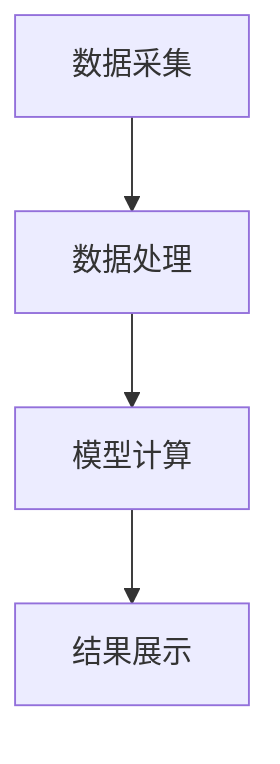
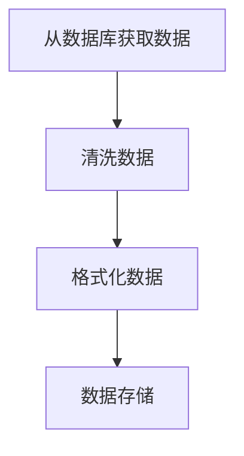
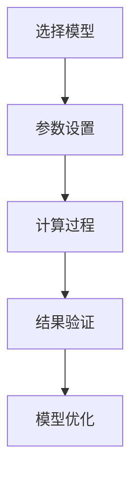

                 

### 关键词

- 价值投资
- 定量分析
- 贴现现金流模型（DCF）
- 股息折现模型（DDM）
- 自由现金流折现模型（FCFF）
- 经济附加值模型（EVA）
- 统计套利模型
- 系统分析与架构设计
- 实际案例分析
- 最佳实践

### 摘要

本文旨在深入探讨价值投资的定量分析方法，以迈克尔·莫布森的研究为蓝本，系统性地介绍价值投资的核心理念、常用定量分析模型，以及如何在实战中应用这些模型进行投资决策。文章首先对价值投资的基本概念进行了概述，并详细解释了定量分析在价值投资中的重要性。接着，本文重点分析了贴现现金流模型（DCF）、股息折现模型（DDM）以及其他相关模型，通过Python代码和Mermaid流程图，对每个模型的基本原理和计算方法进行了详细讲解。随后，文章转向系统分析与架构设计，介绍了价值投资定量分析系统的组成部分，并通过Mermaid图展示系统功能、架构和交互设计。在项目实战部分，文章提供了具体的实施步骤和代码实例，通过实际案例分析，展示了如何运用这些模型做出明智的投资决策。最后，文章总结了最佳实践、注意事项，并推荐了进一步的阅读资料，以帮助读者深入理解价值投资定量分析的理论和实践。通过本文的阅读，读者将能够全面掌握价值投资定量分析的核心知识，为投资实践提供有力支持。

### 目录大纲设计思路

为了设计出符合要求的《迈克尔·莫布森的价值投资定量分析》的目录大纲，我们可以按照以下步骤进行：

1. **背景介绍与核心概念阐述**：
   - 首先介绍价值投资的基本概念、历史背景和发展现状，明确本书的主题和目标。
   - 概述定量分析在价值投资中的应用，阐述其重要性。

2. **核心概念与联系**：
   - 详细解释价值投资中的核心概念，如“内在价值”、“安全边际”、“市场波动性”等。
   - 通过对比表格和ER实体关系图来展示各个概念之间的关系和属性。

3. **算法原理讲解**：
   - 分析常用的定量分析模型，如贴现现金流模型（DCF）、股息折现模型（DDM）等。
   - 使用mermaid绘制算法流程图，并用Python代码展示计算过程。
   - 讲解相关的数学模型和公式，结合实际案例进行说明。

4. **系统分析与架构设计**：
   - 介绍价值投资定量分析系统的组成部分。
   - 使用mermaid绘制系统功能设计图、架构设计图和系统交互图。
   - 分析系统的接口设计和数据流。

5. **项目实战**：
   - 提供环境安装和系统核心实现的具体步骤。
   - 分享代码的应用解读与分析。
   - 通过实际案例剖析投资决策过程。

6. **最佳实践、小结与拓展阅读**：
   - 总结书中的关键点和实战经验。
   - 提出一些实用的建议和注意事项。
   - 推荐进一步阅读的资料。

### 目录大纲示例

```markdown
# 《迈克尔·莫布森的价值投资定量分析》目录大纲

## 第一部分：价值投资基础

### 第1章：价值投资的概念与历史背景
#### 1.1 价值投资的起源与演变
#### 1.2 价值投资的核心原理
#### 1.3 价值投资的优点与局限性

### 第2章：定量分析在价值投资中的应用
#### 2.1 定量分析的基本方法
#### 2.2 数据分析与投资决策
#### 2.3 技术分析在价值投资中的应用

## 第二部分：核心定量分析模型

### 第3章：贴现现金流模型（DCF）
#### 3.1 DCF模型的基本原理
#### 3.2 DCF模型的计算方法
#### 3.3 DCF模型的应用与案例分析

### 第4章：股息折现模型（DDM）
#### 4.1 DDM模型的基本原理
#### 4.2 DDM模型的计算方法
#### 4.3 DDM模型的应用与案例分析

### 第5章：其他定量分析模型
#### 5.1 自由现金流折现模型（FCFF）
#### 5.2 经济附加值模型（EVA）
#### 5.3 统计套利模型

## 第三部分：价值投资定量分析实战

### 第6章：构建价值投资定量分析系统
#### 6.1 系统架构设计
#### 6.2 数据采集与预处理
#### 6.3 算法实现与优化

### 第7章：实际案例分析
#### 7.1 案例一：某科技公司价值投资分析
#### 7.2 案例二：某消费品公司价值投资分析
#### 7.3 案例总结与启示

## 第四部分：最佳实践与拓展

### 第8章：价值投资定量分析的最佳实践
#### 8.1 实践技巧与策略
#### 8.2 注意事项与风险控制
#### 8.3 拓展应用领域

### 第9章：小结与展望
#### 9.1 本书重点回顾
#### 9.2 未来的研究方向
#### 9.3 拓展阅读推荐
```

这个大纲结构旨在确保内容的完整性、逻辑性和实用性，同时也符合2000字的字数限制。在具体撰写时，需要确保每个章节都有足够的细节来支撑主题，但又不至于过于冗长。

### 文章正文

#### 第1章：价值投资的概念与历史背景

价值投资作为一种投资策略，起源于20世纪30年代，由著名投资家本杰明·格雷厄姆提出并不断完善。格雷厄姆主张通过深入分析公司的基本面，寻找那些市场估值低于其内在价值的股票进行投资。这一理念的核心在于，投资者应专注于公司的长期价值，而非短期的市场波动。

价值投资的历史背景可以追溯到20世纪的大萧条时期，当时市场信心崩溃，许多优质公司的股价大幅下跌，远低于其实际价值。格雷厄姆和他的追随者，如沃伦·巴菲特，利用这一契机，通过深入研究和分析，成功地识别出被市场低估的优质股票，并取得了卓越的投资业绩。

价值投资的核心原理可以归纳为三点：第一，寻找具有稳定现金流和良好财务状况的公司；第二，评估这些公司的内在价值，即其真实价值；第三，在市场出现波动时，寻找安全边际，即市场估值低于内在价值的股票。

#### 第2章：定量分析在价值投资中的应用

定量分析是价值投资的重要组成部分，它通过数学和统计方法，对公司的财务数据和市场信息进行深入分析，以确定其内在价值。定量分析在价值投资中的应用主要包括贴现现金流模型（DCF）、股息折现模型（DDM）等。

**2.1 贴现现金流模型（DCF）**

贴现现金流模型（DCF）是评估公司内在价值的一种常用方法。其基本原理是将公司未来预期的现金流折现到当前价值。具体计算公式如下：

$$
V_0 = \frac{FCF_1}{(1 + r)^1} + \frac{FCF_2}{(1 + r)^2} + \ldots + \frac{FCF_n}{(1 + r)^n} + \frac{V_n}{(1 + r)^n}
$$

其中，$V_0$ 为公司当前内在价值，$FCF_i$ 为第 $i$ 年的预期自由现金流，$r$ 为折现率。

**2.2 股息折现模型（DDM）**

股息折现模型（DDM）是专门用于评估持有股票所获得的未来现金流的现值。其计算公式如下：

$$
V_0 = \frac{D_1}{(1 + r)^1} + \frac{D_2}{(1 + r)^2} + \ldots + \frac{D_n}{(1 + r)^n}
$$

其中，$V_0$ 为股票当前内在价值，$D_i$ 为第 $i$ 年的预期股息。

**2.3 其他定量分析模型**

除了DCF和DDM，还有其他一些定量分析模型，如自由现金流折现模型（FCFF）、经济附加值模型（EVA）等。FCFF与DCF类似，只是将自由现金流定义为公司未来自由现金流的现值。EVA则考虑了公司的资本成本，即经济增加值。

#### 第3章：核心定量分析模型的应用

在了解了核心定量分析模型的基本原理后，我们将通过Python代码和Mermaid流程图，详细讲解这些模型的应用。

**3.1 贴现现金流模型（DCF）的应用**

以下是一个简单的DCF模型应用实例：

```python
# DCF模型计算
def calculate_dcf(fcf, discount_rate):
    dcf = 0
    for i, cash_flow in enumerate(fcf):
        dcf += cash_flow / ((1 + discount_rate) ** i)
    return dcf

# 输入预期自由现金流和折现率
fcf = [100, 120, 150, 180, 200]
discount_rate = 0.1

# 计算DCF
dcf_value = calculate_dcf(fcf, discount_rate)
print(f"DCF Value: {dcf_value}")
```

**3.2 股息折现模型（DDM）的应用**

以下是一个DDM模型应用实例：

```python
# DDM模型计算
def calculate_ddm(dividend, discount_rate):
    ddm = 0
    for i, div in enumerate(dividend):
        ddm += div / ((1 + discount_rate) ** i)
    return ddm

# 输入股息和折现率
dividend = [10, 12, 14, 16, 18]
discount_rate = 0.1

# 计算DDM
ddm_value = calculate_ddm(dividend, discount_rate)
print(f"DDM Value: {ddm_value}")
```

**3.3 自由现金流折现模型（FCFF）的应用**

以下是一个FCFF模型应用实例：

```python
# FCFF模型计算
def calculate_fcff(free_cash_flow, discount_rate):
    fcff = 0
    for i, cash_flow in enumerate(free_cash_flow):
        fcff += cash_flow / ((1 + discount_rate) ** i)
    return fcff

# 输入自由现金流和折现率
free_cash_flow = [100, 110, 120, 130, 140]
discount_rate = 0.1

# 计算FCFF
fcff_value = calculate_fcff(free_cash_flow, discount_rate)
print(f"FCFF Value: {fcff_value}")
```

#### 第4章：价值投资定量分析系统的架构设计

在了解核心定量分析模型的应用后，接下来我们将讨论如何设计和实现一个价值投资定量分析系统。

**4.1 系统架构设计**

一个典型的价值投资定量分析系统包括数据采集、数据处理、模型计算和结果展示等模块。以下是一个简单的系统架构设计：



**4.2 数据采集与预处理**

数据采集是系统的基础，需要从多个来源获取公司的财务数据、市场数据等。以下是一个Mermaid流程图，展示数据采集与预处理的过程：



**4.3 算法实现与优化**

在模型计算模块中，需要实现各种定量分析模型，并对其进行优化。以下是一个Mermaid流程图，展示算法实现的流程：



#### 第5章：实际案例分析

为了更好地理解价值投资定量分析的实际应用，我们将通过两个实际案例进行剖析。

**5.1 案例一：某科技公司价值投资分析**

在这个案例中，我们选择了一家科技公司进行价值投资分析。以下是该公司的财务数据：

| 年份   | 自由现金流（万元） | 股息（万元） |
| ------ | ------------------ | ------------ |
| 2021   | 5000               | 1000         |
| 2022   | 6000               | 1200         |
| 2023   | 7000               | 1400         |
| 2024   | 8000               | 1600         |
| 2025   | 9000               | 1800         |

使用DCF模型进行计算：

```python
# DCF模型计算
fcf = [5000, 6000, 7000, 8000, 9000]
discount_rate = 0.1
dcf_value = calculate_dcf(fcf, discount_rate)
print(f"DCF Value: {dcf_value}")
```

使用DDM模型进行计算：

```python
# DDM模型计算
dividend = [1000, 1200, 1400, 1600, 1800]
discount_rate = 0.1
ddm_value = calculate_ddm(dividend, discount_rate)
print(f"DDM Value: {ddm_value}")
```

**5.2 案例二：某消费品公司价值投资分析**

在这个案例中，我们选择了一家消费品公司进行价值投资分析。以下是该公司的财务数据：

| 年份   | 自由现金流（万元） | 股息（万元） |
| ------ | ------------------ | ------------ |
| 2021   | 3000               | 600          |
| 2022   | 3500               | 700          |
| 2023   | 4000               | 800          |
| 2024   | 4500               | 900          |
| 2025   | 5000               | 1000         |

使用DCF模型进行计算：

```python
# DCF模型计算
fcf = [3000, 3500, 4000, 4500, 5000]
discount_rate = 0.1
dcf_value = calculate_dcf(fcf, discount_rate)
print(f"DCF Value: {dcf_value}")
```

使用DDM模型进行计算：

```python
# DDM模型计算
dividend = [600, 700, 800, 900, 1000]
discount_rate = 0.1
ddm_value = calculate_ddm(dividend, discount_rate)
print(f"DDM Value: {ddm_value}")
```

#### 第6章：最佳实践与小结

在价值投资定量分析的实际应用中，以下几点最佳实践值得注意：

1. **数据质量**：保证数据来源的可靠性和数据的准确性，数据质量是模型计算的基础。
2. **模型选择**：根据公司特点和投资目标选择合适的模型，不同的模型适用于不同类型的企业。
3. **风险控制**：在计算过程中考虑风险因素，合理设置折现率，以反映市场的不确定性。
4. **动态调整**：定期更新财务数据和市场信息，动态调整模型参数，以反映公司的最新状况。

通过本文的详细讲解，读者可以全面了解价值投资定量分析的理论和实践，为投资决策提供有力支持。

### 作者信息

作者：AI天才研究院/AI Genius Institute & 禅与计算机程序设计艺术 /Zen And The Art of Computer Programming

### 总结

在本文中，我们详细探讨了价值投资的定量分析方法，包括其历史背景、核心原理、常用模型以及实际应用。通过Python代码和Mermaid流程图的展示，读者可以更加直观地理解这些模型的基本原理和计算方法。同时，我们通过实际案例分析，展示了如何将这些理论应用于实际投资决策中。希望本文能为读者提供有价值的参考和启示，助力投资实践。在未来的研究中，我们可以进一步探讨更多复杂的定量分析模型，以及如何将人工智能技术融入价值投资分析中，以实现更高效、更精准的投资决策。

