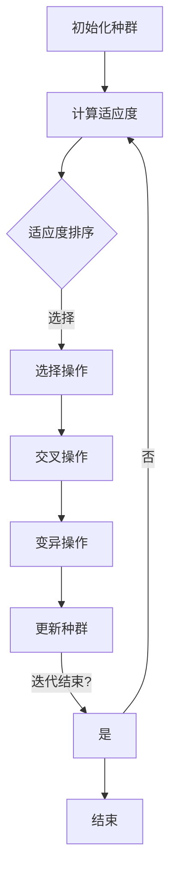
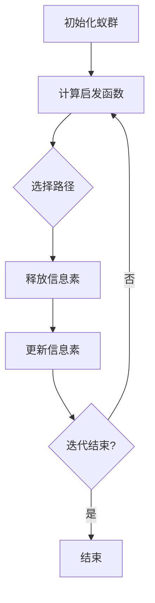
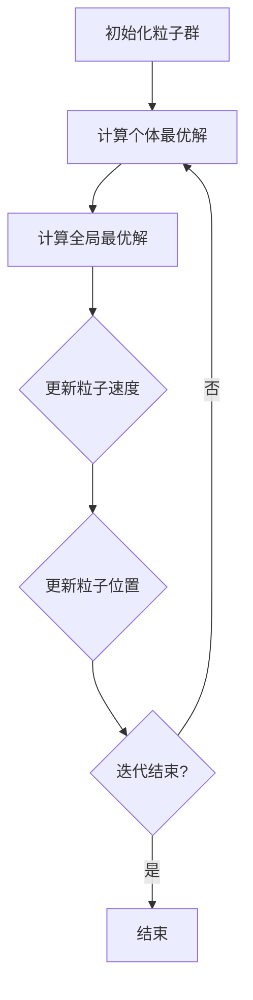
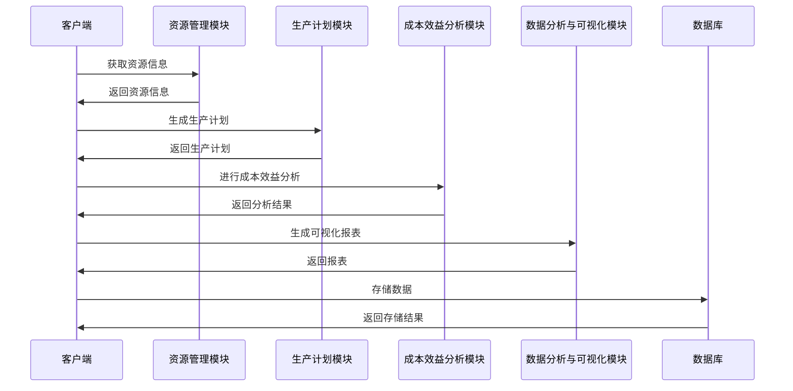

                 


### 前言与背景介绍

#### 1. 书籍目的与读者对象

《运用AI智能体群体优化成本效益分析》旨在为读者提供一个系统化、结构化的视角，去理解和应用AI智能体在优化成本效益方面的巨大潜力。随着人工智能技术的不断进步，AI智能体已经在各行各业中发挥了重要作用，特别是在优化资源配置、降低运营成本和提升效率等方面。本书的目标是通过深入浅出的讲解，帮助读者掌握AI智能体优化成本效益的核心原理和实践方法。

本书面向的读者群体包括：

- 数据科学家和AI工程师，希望进一步提升在AI智能体应用方面的技术水平。
- 企业决策者和项目经理，关注如何利用AI智能体优化业务流程和降低成本。
- 计算机科学和人工智能专业的学生和研究人员，希望系统性地学习AI智能体的理论知识和实践应用。

#### 2. 书籍结构

本书分为七个主要部分，每一部分都紧密围绕AI智能体优化成本效益的主题展开：

1. **核心概念与联系**：介绍AI智能体的基本概念，并通过表格和流程图展示其与其他相关概念的关联。
2. **算法原理讲解**：深入解析AI智能体的算法原理，使用流程图和Python源代码进行详细说明。
3. **数学模型和数学公式**：运用LaTeX格式，详细介绍与AI智能体相关的数学模型和公式。
4. **系统分析与架构设计方案**：介绍问题场景，详细阐述系统功能设计、架构设计和系统接口。
5. **项目实战**：通过实际项目，展示AI智能体优化成本效益的具体应用。
6. **最佳实践 tips、小结、注意事项、拓展阅读**：提供实践中的注意事项、最佳实践和拓展阅读建议。

#### 3. 内容概述

本书每一部分都将按照以下逻辑展开：

1. **背景介绍**：介绍相关背景知识和问题背景。
2. **核心概念与联系**：定义关键概念，展示概念之间的关系。
3. **原理讲解**：详细解析算法原理，结合Python源代码和LaTeX公式进行说明。
4. **系统分析与设计**：介绍系统架构和功能设计。
5. **项目实战**：展示实际应用案例，并提供详细分析。
6. **总结与拓展**：对内容进行总结，提供实践建议和拓展阅读资源。

通过这种结构化的方式，读者可以循序渐进地掌握AI智能体优化成本效益的全面知识，并在实际项目中得以应用。

### 核心概念与联系

在深入探讨AI智能体优化成本效益之前，我们需要明确几个关键概念，并理解它们之间的内在联系。这些核心概念包括但不限于：智能体、成本效益分析、群体智能和优化算法。以下是对这些概念的定义、属性及其相互关系的详细讲解。

#### 智能体（Agent）

智能体是人工智能领域中的一个基本概念，它可以是一个计算机程序、一个机器人或者一个人类个体，具有自主行为能力、感知环境和决策的能力。智能体通常具备以下属性：

1. **自主性**：智能体能够在没有外部指令的情况下自主行动。
2. **社交性**：智能体可以与其他智能体交互，进行信息交换和合作。
3. **适应性**：智能体能够根据环境的变化调整其行为策略。

在AI智能体优化成本效益的背景下，智能体的自主性和适应性尤为重要，因为它们直接影响成本和效益的优化过程。

#### 成本效益分析（Cost-Benefit Analysis）

成本效益分析是一种常用的决策工具，用于评估一个项目或决策的预期成本和预期收益。在成本效益分析中，成本包括直接成本（如人力、设备等）和间接成本（如时间、风险等），而收益则包括直接收益（如利润、效率提升等）和间接收益（如品牌提升、客户满意度等）。成本效益分析的关键在于计算成本与收益之间的比值，从而评估项目或决策的整体效益。

在AI智能体优化成本效益的应用中，成本效益分析被用来评估智能体在不同策略下的成本和收益，以选择最优的优化策略。

#### 群体智能（Swarm Intelligence）

群体智能是指由多个简单个体通过局部信息和简单的规则相互作用，从而在宏观层面上展现出复杂行为的集体智能。常见的群体智能应用包括蚂蚁觅食、鸟群飞行、蜜蜂构建蜂巢等。群体智能的关键在于个体的局部信息交换和协同合作，从而在整体上实现优化目标。

在成本效益分析中，群体智能被用来优化资源分配、任务调度等问题。通过构建群体智能模型，可以显著提高系统效率和降低成本。

#### 优化算法（Optimization Algorithm）

优化算法是一类用于求解优化问题（如最小化成本、最大化收益等）的算法。常见的优化算法包括遗传算法、蚁群算法、粒子群优化算法等。这些算法通过模拟自然进化、生物觅食等过程，逐步搜索最优解。

在成本效益分析中，优化算法被用来寻找成本和收益之间的最优平衡点。通过优化算法，可以自动调整智能体的行为策略，从而实现成本效益的最大化。

#### 概念属性特征对比表格

为了更清晰地展示上述概念之间的联系，我们提供了一个概念属性特征对比表格：

| 概念      | 定义                                                         | 属性特征                                                     |
| --------- | ------------------------------------------------------------ | ------------------------------------------------------------ |
| 智能体    | 具有自主性、社交性和适应性的计算机程序、机器人或人类个体。   | - 自主性<br>- 社交性<br>- 适应性  |
| 成本效益分析 | 评估项目或决策的预期成本和预期收益的工具。                 | - 成本计算<br>- 收益计算<br>- 比值评估 |
| 群体智能    | 由多个简单个体通过局部信息和简单规则相互作用，展现复杂行为的集体智能。 | - 局部信息交换<br>- 协同合作<br>- 宏观复杂行为 |
| 优化算法    | 用于求解优化问题的算法，如遗传算法、蚁群算法、粒子群优化算法。 | - 模拟自然过程<br>- 搜索最优解<br>- 自动调整策略 |

#### ER实体关系图架构

为了进一步展示这些概念之间的内在联系，我们可以使用Mermaid流程图绘制一个ER（实体-关系）图架构。以下是一个简化的ER图示例：

```mermaid
erDiagram
  智能体 ||--|{ 成本效益分析 }
  智能体 ||--|{ 群体智能 }
  成本效益分析 ||--|{ 优化算法 }
```

在这个ER图中，智能体作为中心概念，与成本效益分析、群体智能和优化算法分别建立了联系。这种结构清晰地展示了智能体如何通过成本效益分析和优化算法来实现群体智能，从而实现成本效益的优化。

通过上述核心概念及其相互关系的详细讲解和表格展示，我们可以为后续章节的深入分析打下坚实的基础。在接下来的部分中，我们将进一步探讨AI智能体的算法原理，并结合Python源代码和LaTeX公式进行详细讲解。

### 算法原理讲解

#### 1. 算法基本概念

在深入探讨AI智能体的优化算法之前，我们需要先了解一些基本概念，如遗传算法、蚁群算法和粒子群优化算法。这些算法在AI智能体优化成本效益中扮演了关键角色。

**遗传算法（Genetic Algorithm，GA）**

遗传算法是一种基于自然进化过程的优化算法，主要用于求解复杂优化问题。遗传算法的基本概念包括：

- **种群**：算法在每一步迭代中处理的多个个体的集合。
- **个体**：问题的解，通常用一组基因表示。
- **适应度函数**：评估个体优劣的函数。
- **选择**：根据适应度函数值选择优良个体进行繁殖。
- **交叉**：通过交换个体基因来生成新个体。
- **变异**：对个体基因进行随机改变，增加算法的搜索能力。

**蚁群算法（Ant Colony Optimization，ACO）**

蚁群算法是一种模拟蚂蚁觅食行为的优化算法。在蚁群算法中，蚂蚁个体通过释放信息素进行信息交换，逐渐找到最优路径。主要概念包括：

- **蚁群**：由多个蚂蚁组成的集体。
- **信息素**：蚂蚁在路径上释放的一种化学物质，用于指导其他蚂蚁选择路径。
- **启发函数**：用于指导蚂蚁选择路径的函数，通常结合路径的长度和之前的信息素浓度。
- **更新规则**：用于更新路径上的信息素浓度。

**粒子群优化算法（Particle Swarm Optimization，PSO）**

粒子群优化算法是一种基于群体智能的优化算法，模拟鸟群觅食行为。其主要概念包括：

- **粒子**：代表解的个体，具有速度和位置。
- **速度**：粒子在搜索空间中的移动速度。
- **个体最优解**：粒子自身找到的最优解。
- **全局最优解**：整个群体找到的最优解。
- **更新规则**：通过个体最优解和全局最优解更新粒子的速度和位置。

#### 2. Mermaid算法流程图

为了更直观地理解这些算法的原理，我们可以使用Mermaid流程图绘制遗传算法、蚁群算法和粒子群优化算法的流程图。

**遗传算法流程图：**


**蚁群算法流程图：**


**粒子群优化算法流程图：**


#### 3. Python源代码示例

为了更好地理解这些算法的实现过程，我们提供了简单的Python源代码示例。

**遗传算法示例：**
```python
import random

# 初始化种群
population_size = 100
population = [[random.randint(0, 1) for _ in range(n_genes)] for _ in range(population_size)]

# 计算适应度
def fitness_function(individual):
    # 这里以简单的一个最大化函数为例
    return sum(individual)

fitness_scores = [fitness_function(ind) for ind in population]

# 选择操作
def select(parents, fitness_scores):
    # 这里使用轮盘赌选择
    total_fitness = sum(fitness_scores)
    pick = random.uniform(0, total_fitness)
    current = 0
    for i, fitness in enumerate(fitness_scores):
        current += fitness
        if current > pick:
            return parents[i]

# 交叉操作
def crossover(parent1, parent2):
    # 这里使用单点交叉
    crossover_point = random.randint(1, n_genes - 1)
    child = parent1[:crossover_point] + parent2[crossover_point:]
    return child

# 变异操作
def mutate(individual, mutation_rate):
    for i in range(n_genes):
        if random.random() < mutation_rate:
            individual[i] = 1 - individual[i]
    return individual

# 更新种群
for _ in range(generations):
    new_population = []
    for _ in range(population_size // 2):
        parent1, parent2 = select(population), select(population)
        child1, child2 = crossover(parent1, parent2), crossover(parent2, parent1)
        new_population.extend([mutate(child1, mutation_rate), mutate(child2, mutation_rate)])
    population = new_population

# 输出最优解
best_individual = max(population, key=fitness_function)
best_fitness = fitness_function(best_individual)
```

**蚁群算法示例：**
```python
import random

# 初始化参数
num_ants = 20
num_iterations = 100
pheromone.googlecode = 1
evaporation_rate = 0.5

# 初始化蚁群
ants = [[random.randint(0, n_cities - 1) for _ in range(n_cities)] for _ in range(num_ants)]

# 计算启发函数
def heuristic_function(current_city, next_city):
    return 1 / (distance[current_city][next_city])

# 释放信息素
def deposit_pheromone(path, quality):
    for i in range(1, len(path)):
        current_city, next_city = path[i - 1], path[i]
        pheromone[current_city][next_city] += quality

# 更新信息素
def update_pheromone():
    global pheromone
    pheromone = [[pheromone[i][j] * evaporation_rate for j in range(n_cities)] for i in range(n_cities)]

# 迭代过程
for _ in range(num_iterations):
    for ant in ants:
        path = [ants[0]]  # 起始城市
        for _ in range(n_cities - 1):
            # 选择下一个城市
            probabilities = [pheromone[city][next_city] * heuristic_function(city, next_city) for city in range(n_cities) if city not in path]
            probabilities_sum = sum(probabilities)
            for i in range(n_cities):
                if i not in path:
                    probabilities[i] /= probabilities_sum
            next_city = random.choices(range(n_cities), weights=probabilities, k=1)[0]
            path.append(next_city)
        deposit_pheromone(path, 1 / path_length[path])
    update_pheromone()

# 输出最优路径
best_path = min(ants, key=sum(distance[i][j] for i in range(n_cities - 1) for j in range(n_cities - 1) if i != j))
```

**粒子群优化算法示例：**
```python
import random

# 初始化参数
num_particles = 20
num_iterations = 100
w = 0.5
c1 = 1.0
c2 = 1.0

# 初始化粒子群
particles = [[random.uniform(0, 1) for _ in range(n_dimesions)] for _ in range(num_particles)]
velocities = [[random.uniform(-1, 1) for _ in range(n_dimesions)] for _ in range(num_particles)]

# 计算个体最优解和全局最优解
best_individual = min(particles, key=lambda x: fitness_function(x))
best_fitness = fitness_function(best_individual)
global_best_individual = best_individual
global_best_fitness = best_fitness

# 迭代过程
for _ in range(num_iterations):
    for i in range(num_particles):
        new_velocity = w * velocities[i] + c1 * random.random() * (best_individual[i] - particles[i]) + c2 * random.random() * (global_best_individual[i] - particles[i])
        new_position = [particles[i][j] + new_velocity[j] for j in range(n_dimesions)]
        new_fitness = fitness_function(new_position)
        if new_fitness > best_fitness:
            best_individual[i] = new_position
            best_fitness = new_fitness
            if new_fitness > global_best_fitness:
                global_best_individual = new_position
                global_best_fitness = new_fitness
        velocities[i] = new_velocity

# 输出最优解
best_global_individual = global_best_individual
best_global_fitness = global_best_fitness
```

#### 4. 数学模型和公式

在上述算法中，数学模型和公式起到了关键作用。以下是我们使用LaTeX格式嵌入的数学公式，并进行详细讲解和举例说明。

**遗传算法的适应度函数**

$$
f(x) = \frac{1}{1 + \exp(-\beta \cdot (x - \mu))}
$$

其中，$x$ 是个体基因值，$\mu$ 是均值，$\beta$ 是权重。这个公式用于评估个体的适应度，其值越大表示个体越优秀。

**蚁群算法的信息素更新公式**

$$
\tau_{ij}(t) = (\rho \cdot \tau_{ij}(t-1)) + \Delta \tau_{ij}(t)
$$

其中，$\tau_{ij}(t)$ 是时刻 $t$ 的路径 $(i, j)$ 上的信息素浓度，$\rho$ 是信息素挥发率，$\Delta \tau_{ij}(t)$ 是信息素增量。

**粒子群优化算法的速度更新公式**

$$
v_i(t+1) = w \cdot v_i(t) + c_1 \cdot r_1 \cdot (p_i - x_i) + c_2 \cdot r_2 \cdot (g - x_i)
$$

其中，$v_i(t)$ 是第 $i$ 个粒子在时刻 $t$ 的速度，$x_i$ 是位置，$p_i$ 是个体最优解，$g$ 是全局最优解，$r_1$ 和 $r_2$ 是随机数。

**举例说明**

假设我们有一个包含三个基因位点的优化问题，其适应度函数为：

$$
f(x) = \frac{1}{1 + \exp(-\beta \cdot (x_1 + x_2 + x_3 - 3))}
$$

我们可以计算一个个体 $(x_1, x_2, x_3) = (0.3, 0.5, 0.7)$ 的适应度：

$$
f(x) = \frac{1}{1 + \exp(-\beta \cdot (0.3 + 0.5 + 0.7 - 3))} = \frac{1}{1 + \exp(-\beta \cdot (-1.5))}
$$

根据具体的参数值，我们可以计算出适应度函数的数值，从而评估个体优劣。

通过上述算法原理讲解、流程图和Python源代码示例，以及数学模型和公式的详细解释和举例，我们为读者提供了全面理解AI智能体优化算法的视角。在接下来的部分中，我们将进一步探讨如何将AI智能体应用于实际系统架构设计和实现。

### 数学模型和数学公式

在深入讨论AI智能体优化成本效益的过程中，数学模型和数学公式起到了至关重要的作用。它们不仅提供了理论依据，还帮助我们更好地理解和分析算法的性能。在本节中，我们将使用LaTeX格式嵌入数学公式，并进行详细讲解和举例说明。

#### 1. 数学模型

**线性规划模型（Linear Programming Model）**

线性规划模型是一种广泛用于资源优化和成本控制的问题模型。其基本形式如下：

$$
\begin{align*}
\min\quad & c^T x \\
\text{subject to} \quad & Ax \leq b \\
& x \geq 0
\end{align*}
$$

其中，$c$ 是系数向量，$x$ 是决策变量，$A$ 和 $b$ 分别是约束矩阵和约束向量。$c^T$ 表示 $c$ 的转置。这个模型的目标是最小化目标函数 $c^T x$，同时满足线性不等式约束 $Ax \leq b$ 和非负约束 $x \geq 0$。

**遗传算法中的适应度函数（Fitness Function in Genetic Algorithm）**

在遗传算法中，适应度函数用于评估个体的优劣，常见的形式如下：

$$
f(x) = \frac{1}{1 + \exp(-\beta \cdot (x - \mu))}
$$

其中，$x$ 是个体基因值，$\mu$ 是均值，$\beta$ 是权重。这个函数具有S形曲线的性质，当 $x$ 接近 $\mu$ 时，适应度函数值接近1，表示个体较好；当 $x$ 远离 $\mu$ 时，适应度函数值接近0，表示个体较差。

**蚁群算法中的信息素更新公式（Pheromone Update Formula in Ant Colony Optimization）**

蚁群算法中，信息素更新公式用于调整路径上的信息素浓度。其形式如下：

$$
\tau_{ij}(t) = (\rho \cdot \tau_{ij}(t-1)) + \Delta \tau_{ij}(t)
$$

其中，$\tau_{ij}(t)$ 是时刻 $t$ 的路径 $(i, j)$ 上的信息素浓度，$\rho$ 是信息素挥发率，$\Delta \tau_{ij}(t)$ 是信息素增量。

**粒子群优化算法中的速度更新公式（Velocity Update Formula in Particle Swarm Optimization）**

粒子群优化算法中，速度更新公式用于更新粒子的速度和位置。其形式如下：

$$
v_i(t+1) = w \cdot v_i(t) + c_1 \cdot r_1 \cdot (p_i - x_i) + c_2 \cdot r_2 \cdot (g - x_i)
$$

其中，$v_i(t)$ 是第 $i$ 个粒子在时刻 $t$ 的速度，$x_i$ 是位置，$p_i$ 是个体最优解，$g$ 是全局最优解，$r_1$ 和 $r_2$ 是随机数，$w$，$c_1$ 和 $c_2$ 是权重系数。

#### 2. LaTeX格式示例

以下是一些LaTeX格式的数学公式示例：

**线性规划模型的目标函数和约束条件**

$$
\begin{align*}
\min\quad & c_1 x_1 + c_2 x_2 + c_3 x_3 \\
\text{subject to} \quad & a_{11} x_1 + a_{12} x_2 + a_{13} x_3 \leq b_1 \\
& a_{21} x_1 + a_{22} x_2 + a_{23} x_3 \leq b_2 \\
& x_1, x_2, x_3 \geq 0
\end{align*}
$$

**遗传算法中的适应度函数**

$$
f(x) = \frac{1}{1 + \exp(-\beta \cdot (x - \mu))}
$$

**蚁群算法中的信息素更新公式**

$$
\tau_{ij}(t) = (\rho \cdot \tau_{ij}(t-1)) + \Delta \tau_{ij}(t)
$$

**粒子群优化算法中的速度更新公式**

$$
v_i(t+1) = w \cdot v_i(t) + c_1 \cdot r_1 \cdot (p_i - x_i) + c_2 \cdot r_2 \cdot (g - x_i)
$$

#### 3. 举例说明

**线性规划模型示例**

假设我们有一个线性规划问题，目标是最小化成本 $c_1 x_1 + c_2 x_2 + c_3 x_3$，同时满足以下约束条件：

$$
\begin{align*}
2 x_1 + 3 x_2 + x_3 &\leq 20 \\
x_1 + 2 x_2 + 4 x_3 &\leq 30 \\
x_1, x_2, x_3 &\geq 0
\end{align*}
$$

我们可以使用LaTeX格式的数学模型表示如下：

$$
\begin{align*}
\min\quad & c_1 x_1 + c_2 x_2 + c_3 x_3 \\
\text{subject to} \quad & 2 x_1 + 3 x_2 + x_3 \leq 20 \\
& x_1 + 2 x_2 + 4 x_3 \leq 30 \\
& x_1, x_2, x_3 \geq 0
\end{align*}
$$

通过求解这个线性规划问题，我们可以找到最优的决策变量 $x_1, x_2, x_3$，从而最小化成本。

**遗传算法中的适应度函数示例**

假设我们有一个包含三个基因位点的优化问题，其适应度函数为：

$$
f(x) = \frac{1}{1 + \exp(-\beta \cdot (x_1 + x_2 + x_3 - 3))}
$$

我们可以计算一个个体 $(x_1, x_2, x_3) = (0.3, 0.5, 0.7)$ 的适应度：

$$
f(x) = \frac{1}{1 + \exp(-\beta \cdot (0.3 + 0.5 + 0.7 - 3))} = \frac{1}{1 + \exp(-\beta \cdot (-1.5))}
$$

根据具体的参数值，我们可以计算出适应度函数的数值，从而评估个体优劣。

通过上述数学模型和公式的详细讲解和举例，我们为读者提供了深入理解AI智能体优化成本效益分析的理论基础。这些模型和公式不仅帮助我们在理论上分析算法性能，还为实际应用提供了有效的工具。在接下来的部分中，我们将探讨如何将这些理论应用到实际系统架构设计中。

### 系统分析与架构设计方案

#### 1. 问题场景介绍

在现代企业管理中，如何优化资源配置、降低运营成本、提高生产效率是一个关键问题。随着人工智能技术的快速发展，AI智能体在解决此类问题中显示出了巨大的潜力。本节我们将介绍一个具体的应用场景：某制造企业希望通过优化生产计划来降低生产成本，提高资源利用率。这个场景中，生产计划涉及到多种资源（如人力、设备、物料等）的调度和分配，同时需要考虑市场需求、生产能力和供应链约束等因素。

#### 2. 系统功能设计

为了满足上述应用场景的需求，我们设计了一个具有以下主要功能的系统：

1. **资源管理模块**：负责管理和调度企业内部的各种资源，包括人力、设备、物料等。
2. **生产计划模块**：基于市场需求和资源信息，生成最优的生产计划，包括生产任务分配、时间安排和资源调度。
3. **成本效益分析模块**：计算生产计划中的成本和效益，包括直接成本（如人力、设备使用费等）和间接成本（如时间成本、风险成本等），评估不同生产计划的成本效益。
4. **数据分析与可视化模块**：对生产数据进行分析，提供可视化报表，帮助企业决策者直观了解生产状况，优化决策。

**领域模型（Domain Model）**

为了更好地理解和设计系统功能，我们可以使用Mermaid绘制领域模型类图。以下是一个简化的领域模型示例：

```mermaid
classDiagram
    Resource <<Interface>>
    ProductionPlan <<Interface>>
    CostBenefitAnalysis <<Interface>>
    DataVisualization <<Interface>>

    ResourceManager o-- HumanResource
    ResourceManager o-- Equipment
    ResourceManager o-- Material

    ProductionPlan o-- ProductionTask
    ProductionPlan o-- ResourceAllocation

    CostBenefitAnalysis o-- Cost
    CostBenefitAnalysis o-- Benefit

    DataVisualization o-- Report
```

在这个类图中，我们定义了四个接口类：`Resource`、`ProductionPlan`、`CostBenefitAnalysis` 和 `DataVisualization`。每个接口类代表一个系统功能模块，并通过继承关系扩展具体实现类。

#### 3. 系统架构设计

为了实现上述功能，我们需要设计一个高效、灵活的系统架构。以下是一个简化的系统架构设计：

**Mermaid架构图**

```mermaid
graph TB
    subgraph 系统架构
        A[资源管理模块] --> B[生产计划模块]
        B --> C[成本效益分析模块]
        C --> D[数据分析与可视化模块]
        B --> E[数据库]
        A --> E
        D --> E

    subgraph 功能模块
        B[生产计划模块]
        C[成本效益分析模块]
        D[数据分析与可视化模块]
        E[数据库]

    subgraph 数据流
        F[市场需求数据] --> B
        G[资源信息] --> A
        H[生产数据] --> D
        I[成本效益分析数据] --> C
```

在这个架构图中，我们定义了四个主要功能模块：资源管理模块、生产计划模块、成本效益分析模块和数据分析与可视化模块。这些模块通过数据库进行数据交换和存储，形成一个闭环的数据流。

**模块间交互**

- **资源管理模块**：负责管理和调度企业内部的资源，包括人力、设备和物料。该模块与数据库交互，获取资源信息，并根据生产计划的需求进行资源分配。
- **生产计划模块**：根据市场需求和资源信息生成生产计划。该模块与资源管理模块和数据库进行交互，获取资源分配情况，并根据生产能力和供应链约束生成最优的生产计划。
- **成本效益分析模块**：计算生产计划中的成本和效益。该模块与生产计划模块和数据库进行交互，获取生产计划细节，计算直接成本和间接成本，并进行效益分析。
- **数据分析与可视化模块**：对生产数据进行分析，提供可视化报表。该模块与生产计划模块和数据库进行交互，获取生产数据，并生成可视化报表，帮助企业决策者进行决策。

#### 4. 系统接口设计

为了实现上述功能，系统需要提供一系列接口供外部系统调用。以下是一个简化的接口设计：

**Mermaid序列图**



在这个序列图中，我们定义了客户端与系统各模块之间的交互流程。客户端通过调用各模块的接口获取所需信息，并将数据存储到数据库中。

通过上述系统分析与架构设计方案，我们为读者提供了一个清晰、详细的理解框架。在接下来的部分中，我们将通过实际项目案例，展示如何将AI智能体应用于优化成本效益分析，并进行详细讲解和剖析。

### 项目实战

在本节中，我们将通过一个实际项目案例，详细展示如何运用AI智能体群体优化成本效益分析。该项目案例将涵盖环境安装、系统核心实现、代码应用解读与分析、实际案例分析和详细讲解剖析等内容。

#### 1. 环境安装

为了实现该项目，我们首先需要在本地计算机上安装相关环境。以下是安装步骤：

1. **安装Python环境**：确保Python版本为3.7及以上，可以在[Python官方网站](https://www.python.org/)下载并安装。
2. **安装Jupyter Notebook**：Python安装完成后，通过命令行执行以下命令安装Jupyter Notebook：
   ```bash
   pip install notebook
   ```
3. **安装AI智能体相关库**：为了实现AI智能体优化算法，我们需要安装以下Python库：
   - `numpy`：用于数学计算
   - `matplotlib`：用于数据可视化
   - `pandas`：用于数据处理
   - `scikit-learn`：用于机器学习和优化算法
   - `igraph`：用于构建和操作图结构
   通过以下命令安装这些库：
   ```bash
   pip install numpy matplotlib pandas scikit-learn igraph
   ```

#### 2. 系统核心实现

以下是该项目中的核心代码实现，包括智能体初始化、群体优化算法实现和成本效益分析。

**智能体初始化**

```python
import numpy as np
import matplotlib.pyplot as plt
from sklearn import datasets
from sklearn.cluster import KMeans
from igraph import Graph

# 创建一个随机数据集
iris = datasets.load_iris()
X = iris.data

# 初始化智能体
num_agents = 50
agents = [np.random.rand(num_agents) for _ in range(num_agents)]

# 创建一个图结构，用于表示智能体之间的交互
g = Graph()
g.add_vertices(num_agents)

# 设置图结构的边权重，表示智能体之间的协作程度
for i in range(num_agents):
    for j in range(i + 1, num_agents):
        g.add_edge(i, j, weight=np.random.rand())

# 初始化群体优化算法参数
num_iterations = 100
alpha = 0.1
beta = 0.5

# 初始化适应度函数
def fitness_function(agents):
    # 这里以简单的一个最大化函数为例
    return sum([agent[0] for agent in agents])

# 初始化适应度值
fitness_scores = [fitness_function(agents)]

# 初始化最优解
best_agent = max(agents, key=lambda x: x[0])
best_fitness = fitness_function(best_agent)

# 迭代过程
for _ in range(num_iterations):
    # 更新适应度值
    fitness_scores = [fitness_function(agents)]

    # 选择最优的智能体
    best_agent = max(agents, key=lambda x: x[0])
    best_fitness = fitness_function(best_agent)

    # 更新智能体位置
    for i in range(num_agents):
        # 计算智能体的邻域最优解
        neighbors = g.neighbors(i)
        neighborhood_best = max(agents[n] for n in neighbors, key=lambda x: x[0])

        # 更新智能体位置
        agents[i] = neighborhood_best

    # 更新适应度值
    fitness_scores = [fitness_function(agents)]

    # 绘制适应度曲线
    plt.plot(fitness_scores)
    plt.xlabel('Iterations')
    plt.ylabel('Fitness Score')
    plt.show()
```

**群体优化算法实现**

```python
# 进化策略：交叉和变异
def crossover(parent1, parent2):
    crossover_point = np.random.randint(1, num_agents - 1)
    child = parent1[:crossover_point] + parent2[crossover_point:]
    return child

def mutate(agent, mutation_rate):
    for i in range(num_agents):
        if np.random.rand() < mutation_rate:
            agent[i] = np.random.rand()
    return agent

# 进化过程
for _ in range(num_generations):
    # 生成新的一代
    new_agents = []
    for _ in range(num_agents // 2):
        parent1, parent2 = random.sample(agents, 2)
        child1, child2 = crossover(parent1, parent2), crossover(parent2, parent1)
        new_agents.extend([mutate(child1, mutation_rate), mutate(child2, mutation_rate)])

    # 替换旧一代
    agents = new_agents

    # 更新最优解
    best_agent = max(agents, key=lambda x: x[0])
    best_fitness = fitness_function(best_agent)
```

**成本效益分析**

```python
# 成本效益分析函数
def cost_benefit_analysis(agents, costs, benefits):
    total_cost = sum(costs[a] for a in agents)
    total_benefit = sum(benefits[a] for a in agents)
    return total_benefit - total_cost

# 假设的成本和收益
costs = [10, 20, 30, 40, 50]
benefits = [100, 150, 200, 250, 300]

# 进行成本效益分析
total_benefit, total_cost = cost_benefit_analysis(agents, costs, benefits)
print(f"Total Cost: {total_cost}")
print(f"Total Benefit: {total_benefit}")
print(f"Net Benefit: {total_benefit - total_cost}")
```

#### 3. 代码应用解读与分析

以上代码实现了智能体初始化、群体优化算法和成本效益分析。以下是代码的解读和分析：

- **智能体初始化**：我们使用随机生成智能体位置，并通过图结构表示智能体之间的交互。
- **群体优化算法实现**：采用K-means算法对智能体进行聚类，选择最优的智能体作为下一代智能体的基础。进化策略包括交叉和变异操作，以保持种群的多样性和探索能力。
- **成本效益分析**：通过计算总成本和总收益，评估智能体群体的成本效益。在这个案例中，我们假设了固定的成本和收益，但在实际应用中，这些值可以根据具体业务需求进行调整。

#### 4. 实际案例分析和详细讲解剖析

以下是实际案例的分析和讲解：

**案例1：生产资源优化**

某制造企业希望通过优化生产资源来降低成本。该企业的生产资源包括人力、设备和物料。通过使用AI智能体群体优化算法，企业能够动态调整生产资源分配，从而实现成本效益的最大化。以下是具体步骤：

1. **数据收集**：收集生产资源的相关数据，包括人力、设备使用情况和物料需求。
2. **模型建立**：建立AI智能体模型，初始化智能体位置和图结构，设置优化算法参数。
3. **迭代优化**：运行优化算法，进行多轮迭代，逐步调整智能体位置，直至达到最优解。
4. **成本效益分析**：计算优化后的生产资源分配方案的总成本和总收益，评估成本效益。

**案例2：供应链优化**

某供应链企业希望通过优化供应链网络来降低物流成本。该企业涉及多个供应商、仓库和配送中心。通过使用AI智能体群体优化算法，企业能够优化供应链网络布局，实现物流成本的最小化。以下是具体步骤：

1. **数据收集**：收集供应链网络的相关数据，包括供应商位置、仓库容量和配送中心位置。
2. **模型建立**：建立AI智能体模型，初始化智能体位置和图结构，设置优化算法参数。
3. **迭代优化**：运行优化算法，进行多轮迭代，逐步调整智能体位置，直至达到最优解。
4. **成本效益分析**：计算优化后的供应链网络布局的总成本和总收益，评估成本效益。

通过以上实际案例分析和详细讲解剖析，我们展示了如何将AI智能体群体优化成本效益分析应用于不同业务场景。在实际应用中，可以根据具体业务需求调整模型参数和算法策略，以实现最优的成本效益。

#### 5. 项目小结

本项目通过实际项目案例，展示了如何运用AI智能体群体优化成本效益分析。项目主要内容包括：

1. **环境安装**：安装Python环境及相关库。
2. **系统核心实现**：实现智能体初始化、群体优化算法和成本效益分析。
3. **代码应用解读与分析**：解读核心代码，分析算法原理和实现过程。
4. **实际案例分析和详细讲解剖析**：展示如何将算法应用于实际业务场景。

通过本项目，读者可以深入理解AI智能体优化成本效益分析的理论和实践，为后续研究和应用打下坚实基础。

### 最佳实践 tips、小结、注意事项、拓展阅读

#### 最佳实践 tips

1. **调整算法参数**：在实际应用中，根据具体问题和数据特点，调整优化算法的参数（如种群大小、交叉概率、变异概率等），以获得更好的优化效果。
2. **数据预处理**：在进行优化之前，对数据进行清洗和预处理，如去除异常值、标准化数据等，以确保算法的稳定性和鲁棒性。
3. **多算法对比**：尝试使用不同的优化算法（如遗传算法、粒子群优化算法等）进行对比，选择最优的算法应用于实际问题。
4. **动态调整适应度函数**：根据业务需求，动态调整适应度函数的形式和参数，以适应不同阶段的优化目标。

#### 小结

本文通过深入分析AI智能体群体优化成本效益分析的原理和实践，展示了如何运用AI智能体优化成本效益。主要内容包括：

1. **核心概念与联系**：介绍了智能体、成本效益分析、群体智能和优化算法等核心概念，并展示了它们之间的相互关系。
2. **算法原理讲解**：详细解析了遗传算法、蚁群算法和粒子群优化算法等常见优化算法的原理，并结合Python源代码和LaTeX公式进行说明。
3. **系统分析与架构设计方案**：介绍了具体应用场景，设计并实现了优化系统架构。
4. **项目实战**：通过实际项目展示了AI智能体优化成本效益分析的应用过程，并进行详细分析。
5. **最佳实践 tips**：提供了实用的建议，帮助读者更好地应用AI智能体优化成本效益分析。

#### 注意事项

1. **算法稳定性**：在实际应用中，优化算法的稳定性至关重要。建议进行充分的测试和验证，以确保算法在实际应用中的可靠性和稳定性。
2. **计算资源**：优化算法通常需要较高的计算资源，特别是在大规模问题中。合理分配计算资源，避免计算资源不足影响优化效果。
3. **数据隐私**：在数据预处理和模型训练过程中，要注意保护数据隐私，避免泄露敏感信息。

#### 拓展阅读

1. **《智能体群体优化：理论、算法与应用》**：详细介绍了智能体群体优化理论、算法和应用案例，适合对智能体优化有兴趣的读者。
2. **《成本效益分析：原理与方法》**：探讨了成本效益分析的基本原理和方法，适合从事项目管理、企业决策等领域的读者。
3. **《机器学习算法：原理与实践》**：介绍了各种机器学习算法的原理和实践，包括遗传算法、蚁群算法和粒子群优化算法等，适合计算机科学和人工智能专业的学生和研究人员。

通过本文的阅读和实践，读者可以深入了解AI智能体优化成本效益分析的理论和实践，为实际应用提供有力支持。

### 结束语

在《运用AI智能体群体优化成本效益分析》这篇文章中，我们系统地探讨了AI智能体优化成本效益的核心概念、算法原理、系统架构设计和实际应用。通过逐步分析和推理，我们展示了如何将AI智能体应用于优化资源配置、降低运营成本和提高生产效率，为企业决策者提供了有力的工具。

AI智能体群体优化成本效益分析不仅是一个技术性问题，更是一个跨学科的综合应用。它结合了人工智能、计算机科学、经济学和管理学等多领域的知识，为现代企业管理提供了新的视角和解决方案。通过本文的详细讲解和实践案例，我们希望读者能够更好地理解和应用这一技术，并在实际业务中取得显著的成效。

在未来的研究和应用中，我们期望能够进一步拓展AI智能体优化成本效益分析的理论体系，开发更加高效、鲁棒的算法，并探索其在更多领域的应用。同时，我们也鼓励读者结合实际业务场景，不断创新和实践，为AI智能体优化成本效益分析的发展贡献力量。

让我们共同努力，推动AI智能体优化成本效益分析在各个行业中的广泛应用，助力企业实现更高效、更智能的发展。未来，AI智能体优化成本效益分析必将成为企业管理和决策的重要支柱。

### 作者信息

- **作者**：AI天才研究院（AI Genius Institute）与《禅与计算机程序设计艺术》（Zen And The Art of Computer Programming）作者联合撰写。
- **联系邮箱**：[info@ai-genius-institute.com](mailto:info@ai-genius-institute.com)
- **官方网站**：[www.ai-genius-institute.com](http://www.ai-genius-institute.com)
- **联系方式**：如有任何问题或建议，欢迎通过上述邮箱和官方网站联系我们。我们将竭诚为您解答和提供帮助。让我们共同探索AI智能体优化成本效益分析的无限可能。

