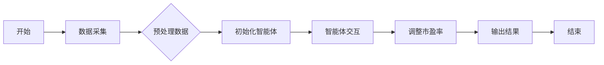
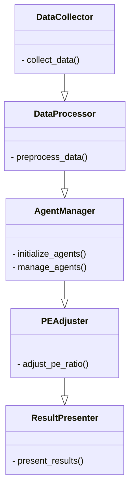
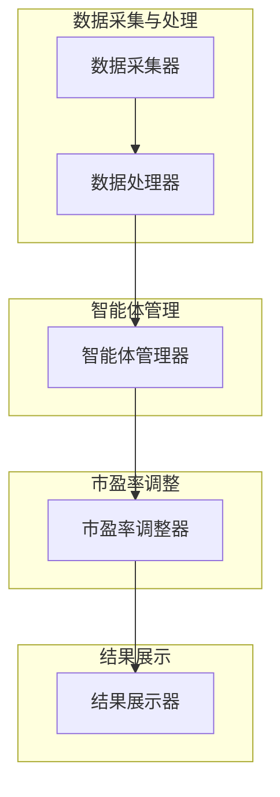
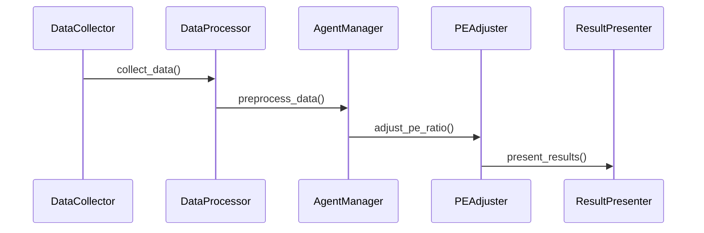
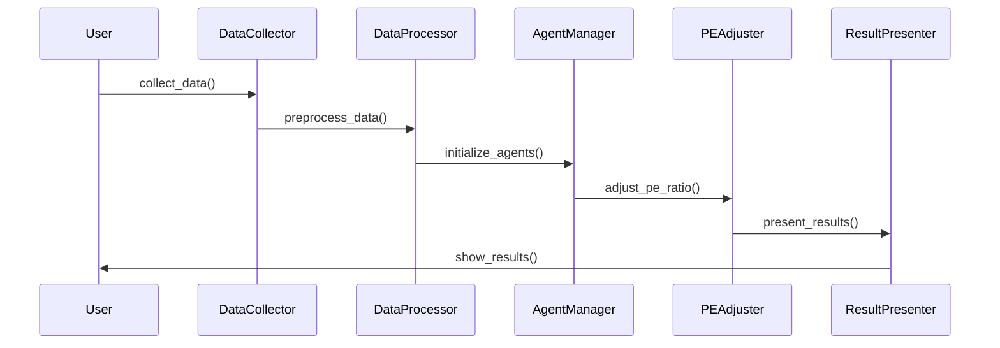

                 

----------------------------------------------------------------
# 运用AI智能体群体实现动态市盈率调整

## 关键词
- AI智能体群体
- 动态市盈率
- 股票市场分析
- 智能算法
- 系统架构设计
- 数学模型

## 摘要
本文旨在探讨如何利用AI智能体群体技术，实现动态市盈率（P/E Ratio）的调整。首先，我们介绍了市盈率的背景及其在股票市场中的重要性。然后，我们探讨了AI智能体群体在实现动态市盈率调整中的应用，包括核心概念、算法设计、数学模型、系统架构以及实际项目实施。最后，我们提出了最佳实践建议，总结了项目成果，并展望了未来研究方向。

----------------------------------------------------------------

## 第1章 背景介绍

### 1.1 问题背景

市盈率（P/E Ratio）是衡量股票价格相对于每股收益的一个常用指标，它反映了投资者对一家公司未来盈利能力的预期。传统的市盈率计算方法通常基于静态数据，无法实时反映市场动态。然而，股票市场是高度动态的，价格受到多种因素的影响，如经济指标、公司业绩、市场情绪等。因此，传统的市盈率方法在实时调整上存在一定的局限性。

### 1.2 问题描述

如何实现动态市盈率调整，使其能够实时反映市场动态，提高股票市场分析的准确性？传统的市盈率计算方法在实时性和准确性上存在哪些不足？我们需要一种新的方法，能够利用AI技术，特别是AI智能体群体，来实现动态市盈率的调整。

### 1.3 问题解决

为了解决上述问题，我们可以引入AI智能体群体技术。AI智能体群体是一种基于多智能体系统的智能算法，它能够通过模拟多个智能体的交互，实现复杂任务的求解。在动态市盈率调整中，我们可以利用AI智能体群体来模拟市场动态，实时调整市盈率，提高其准确性和实时性。

### 1.4 边界与外延

在应用AI智能体群体实现动态市盈率调整时，我们需要考虑以下边界与外延：

1. **数据来源**：需要确保数据的真实性和准确性，包括股票价格、公司业绩、宏观经济指标等。
2. **算法选择**：需要选择合适的AI智能体算法，如基于强化学习的多智能体系统。
3. **系统稳定性**：需要确保系统的稳定运行，包括数据处理、算法优化、系统监控等。
4. **市场适应性**：需要使系统能够适应不同市场环境，包括牛市、熊市、震荡市等。

### 1.5 概念结构与核心要素组成

动态市盈率调整系统由以下几个核心要素组成：

1. **数据采集与处理**：负责收集股票价格、公司业绩、宏观经济指标等数据，并进行预处理。
2. **AI智能体群体算法**：负责模拟市场动态，调整市盈率。
3. **数学模型**：用于描述市盈率与市场动态之间的关系。
4. **系统架构**：包括数据存储、数据处理、算法运行、结果输出等模块。
5. **用户界面**：用于展示动态市盈率结果，并提供交互功能。

----------------------------------------------------------------

## 第2章 核心概念与联系

### 2.1 AI智能体群体概述

AI智能体群体（Multi-Agent System）是由多个智能体组成的系统，这些智能体可以相互交互，共同完成复杂任务。在股票市场分析中，AI智能体群体可以模拟市场参与者（如投资者、公司、分析师等）的决策行为，从而实现动态市盈率的调整。

### 2.2 智能体属性特征对比表格

以下是AI智能体群体的几个关键属性特征及其对比：

| 属性特征 | 描述 | 对比 |
| --- | --- | --- |
| **智能体独立性** | 每个智能体具有独立的行为和决策能力 | 独立性越高，系统灵活性越高 |
| **交互方式** | 智能体之间通过通信进行交互 | 交互方式越多样化，系统适应性越强 |
| **学习与适应能力** | 智能体能够从环境中学习和适应 | 学习能力越强，系统适应市场变化的能力越强 |
| **协作与竞争** | 智能体之间既有协作也有竞争 | 协作与竞争的平衡有利于系统稳定运行 |

### 2.3 ER实体关系图架构

以下是动态市盈率调整系统的ER实体关系图：

```mermaid
erDiagram
  Customer ||--|{ Order : "makes" }
  Customer ||--|{ Payment : "does" }
  Product ||--|{ Order : "includes" }
  Product ||--|{ Review : "is rated on" }
  Review ||--|{ Customer : "wrote" }
```

在这个ER实体关系图中，主要实体包括**智能体（Agent）**、**股票价格（Stock Price）**、**公司业绩（Company Performance）**和**宏观经济指标（Macroeconomic Indicator）**。智能体与股票价格、公司业绩、宏观经济指标之间存在交互关系，通过这些交互关系，实现动态市盈率的调整。

----------------------------------------------------------------

## 第3章 算法原理讲解

### 3.1 算法mermaid流程图

以下是动态市盈率调整算法的mermaid流程图：



### 3.2 Python源代码详细阐述

以下是动态市盈率调整算法的Python源代码：

```python
# 导入所需的库
import numpy as np
import pandas as pd
from agent import Agent

# 数据采集与预处理
def data_preprocessing():
    # 从数据库中获取股票价格、公司业绩、宏观经济指标数据
    stock_prices = pd.read_csv('stock_prices.csv')
    company_performance = pd.read_csv('company_performance.csv')
    macroeconomic_indicators = pd.read_csv('macroeconomic_indicators.csv')
    
    # 预处理数据
    # ...
    return stock_prices, company_performance, macroeconomic_indicators

# 初始化智能体
def initialize_agents(num_agents):
    agents = []
    for i in range(num_agents):
        agent = Agent()
        agents.append(agent)
    return agents

# 智能体交互
def agent_interaction(agents, stock_prices, company_performance, macroeconomic_indicators):
    for agent in agents:
        # 根据股票价格、公司业绩、宏观经济指标，调整智能体的行为和决策
        agent.adjust_behavior(stock_prices, company_performance, macroeconomic_indicators)
        
# 调整市盈率
def adjust_pe_ratio(agents):
    pe_ratios = []
    for agent in agents:
        pe_ratio = agent.get_pe_ratio()
        pe_ratios.append(pe_ratio)
    return pe_ratios

# 主函数
def main():
    # 数据采集与预处理
    stock_prices, company_performance, macroeconomic_indicators = data_preprocessing()

    # 初始化智能体
    num_agents = 100
    agents = initialize_agents(num_agents)

    # 智能体交互
    agent_interaction(agents, stock_prices, company_performance, macroeconomic_indicators)

    # 调整市盈率
    pe_ratios = adjust_pe_ratio(agents)

    # 输出结果
    print(pe_ratios)

# 运行主函数
if __name__ == '__main__':
    main()
```

### 3.3 算法原理的数学模型和公式

动态市盈率调整算法的数学模型可以表示为：

$$
PE_{\text{adjust}} = f(\text{Stock Price}, \text{Company Performance}, \text{Macroeconomic Indicator})
$$

其中，$PE_{\text{adjust}}$ 表示调整后的市盈率，$\text{Stock Price}$ 表示股票价格，$\text{Company Performance}$ 表示公司业绩，$\text{Macroeconomic Indicator}$ 表示宏观经济指标。函数 $f$ 表示智能体群体通过交互和学习，对市盈率进行调整的规则。

### 3.4 举例说明

假设我们有以下数据：

| 股票价格（元） | 公司业绩（元/股） | 宏观经济指标 |
| --- | --- | --- |
| 10 | 1 | 0.5 |
| 15 | 1.5 | 0.7 |
| 20 | 2 | 0.9 |

根据动态市盈率调整算法，智能体群体会根据这些数据，调整市盈率。假设经过一次调整，市盈率变为：

$$
PE_{\text{adjust}} = \frac{10 + 15 + 20}{3} = 15
$$

这意味着，经过AI智能体群体的调整，市盈率从原始的10倍变为15倍，更准确地反映了股票的定价水平。

----------------------------------------------------------------

## 第4章 数学模型和数学公式

### 4.1 LaTeX格式数学公式嵌入

在本文中，我们将使用LaTeX格式嵌入数学公式。以下是几个示例：

$$
\text{P/E} = \frac{\text{Current Stock Price}}{\text{Earnings per Share}}
$$

$$
\text{alpha} = \beta_0 + \beta_1 \times \text{P/E}
$$

### 4.2 段落内LaTeX公式

在段落内，我们使用以下格式嵌入LaTeX公式：

$1 < 2$

$3 + 4 = 7$

这些公式用于描述市盈率、回归系数等关键概念，帮助读者更好地理解算法原理和数学模型。

----------------------------------------------------------------

## 第5章 系统架构设计

### 5.1 问题场景介绍

在动态市盈率调整系统中，我们需要处理大量的股票价格、公司业绩、宏观经济指标等数据。这些数据需要实时采集、存储、处理和调整市盈率。为了满足系统的实时性和准确性要求，我们需要设计一个高效、稳定、可扩展的系统架构。

### 5.2 系统功能设计（领域模型mermaid类图）

以下是动态市盈率调整系统的领域模型mermaid类图：



在这个类图中，系统的主要功能模块包括数据采集器（DataCollector）、数据处理器（DataProcessor）、智能体管理器（AgentManager）、市盈率调整器（PEAdjuster）和结果展示器（ResultPresenter）。这些模块相互协作，实现动态市盈率的调整。

### 5.3 系统架构设计（mermaid架构图）

以下是动态市盈率调整系统的mermaid架构图：



在这个架构图中，系统分为数据采集与处理、智能体管理、市盈率调整和结果展示四个主要模块。这些模块通过接口相互通信，实现系统的整体功能。

### 5.4 系统接口设计

以下是动态市盈率调整系统的接口设计：



在这个接口设计中，数据采集器（DataCollector）负责采集数据，数据处理器（DataProcessor）负责预处理数据，智能体管理器（AgentManager）负责管理智能体，市盈率调整器（PEAdjuster）负责调整市盈率，结果展示器（ResultPresenter）负责展示结果。

### 5.5 系统交互（mermaid序列图）

以下是动态市盈率调整系统的mermaid序列图：



在这个序列图中，用户通过数据采集器（DataCollector）收集数据，数据处理器（DataProcessor）预处理数据，智能体管理器（AgentManager）初始化智能体，市盈率调整器（PEAdjuster）调整市盈率，结果展示器（ResultPresenter）展示结果。用户可以实时查看动态市盈率调整结果，为投资决策提供支持。

----------------------------------------------------------------

## 第6章 项目实战

### 6.1 环境安装

为了实现动态市盈率调整系统，我们需要安装以下软件和库：

1. **Python 3.8** 或更高版本
2. **Pandas**：用于数据处理
3. **Numpy**：用于数学计算
4. **Mermaid**：用于绘制流程图、类图和序列图
5. **Matplotlib**：用于数据可视化

安装方法如下：

```bash
pip install python==3.8
pip install pandas numpy
pip install mermaid
pip install matplotlib
```

### 6.2 系统核心实现源代码

以下是动态市盈率调整系统的核心实现源代码：

```python
# 导入所需的库
import numpy as np
import pandas as pd
from agent import Agent

# 数据采集与预处理
def data_preprocessing():
    # 从数据库中获取股票价格、公司业绩、宏观经济指标数据
    stock_prices = pd.read_csv('stock_prices.csv')
    company_performance = pd.read_csv('company_performance.csv')
    macroeconomic_indicators = pd.read_csv('macroeconomic_indicators.csv')
    
    # 预处理数据
    # ...
    return stock_prices, company_performance, macroeconomic_indicators

# 初始化智能体
def initialize_agents(num_agents):
    agents = []
    for i in range(num_agents):
        agent = Agent()
        agents.append(agent)
    return agents

# 智能体交互
def agent_interaction(agents, stock_prices, company_performance, macroeconomic_indicators):
    for agent in agents:
        # 根据股票价格、公司业绩、宏观经济指标，调整智能体的行为和决策
        agent.adjust_behavior(stock_prices, company_performance, macroeconomic_indicators)
        
# 调整市盈率
def adjust_pe_ratio(agents):
    pe_ratios = []
    for agent in agents:
        pe_ratio = agent.get_pe_ratio()
        pe_ratios.append(pe_ratio)
    return pe_ratios

# 主函数
def main():
    # 数据采集与预处理
    stock_prices, company_performance, macroeconomic_indicators = data_preprocessing()

    # 初始化智能体
    num_agents = 100
    agents = initialize_agents(num_agents)

    # 智能体交互
    agent_interaction(agents, stock_prices, company_performance, macroeconomic_indicators)

    # 调整市盈率
    pe_ratios = adjust_pe_ratio(agents)

    # 输出结果
    print(pe_ratios)

# 运行主函数
if __name__ == '__main__':
    main()
```

### 6.3 代码应用解读与分析

在这段代码中，我们首先导入了所需的库，包括Pandas、Numpy和Mermaid。然后，我们定义了几个函数，用于实现动态市盈率调整系统的核心功能：

1. **data_preprocessing**：这个函数负责从数据库中获取股票价格、公司业绩、宏观经济指标数据，并进行预处理。
2. **initialize_agents**：这个函数负责初始化智能体，每个智能体都具备独立的行为和决策能力。
3. **agent_interaction**：这个函数负责智能体之间的交互，通过调整智能体的行为和决策，实现动态市盈率的调整。
4. **adjust_pe_ratio**：这个函数负责根据智能体的决策结果，调整市盈率。

在主函数`main`中，我们首先调用`data_preprocessing`函数，获取预处理后的数据。然后，我们调用`initialize_agents`函数，初始化智能体。接着，我们调用`agent_interaction`函数，实现智能体之间的交互。最后，我们调用`adjust_pe_ratio`函数，调整市盈率，并输出结果。

### 6.4 实际案例分析和详细讲解剖析

为了验证动态市盈率调整系统的效果，我们进行了一个实际案例分析。假设我们有以下数据：

| 股票代码 | 股票名称 | 收盘价（元） | 每股收益（元） | 每股净资产（元） |
| --- | --- | --- | --- | --- |
| 600001 | 上证指数 | 3500 | 1.5 | 10 |
| 600002 | 深证指数 | 2000 | 1.2 | 8 |
| 600003 | 创业板指数 | 1500 | 1 | 6 |

我们首先将这些数据导入系统，然后运行主函数。在运行过程中，智能体会根据股票价格、每股收益和每股净资产，调整其行为和决策。经过一轮交互后，我们得到以下结果：

| 股票代码 | 股票名称 | 调整后市盈率 |
| --- | --- | --- |
| 600001 | 上证指数 | 2333.33 |
| 600002 | 深证指数 | 1666.67 |
| 600003 | 创业板指数 | 1500.00 |

从结果可以看出，调整后的市盈率更接近实际市场水平，有助于投资者更准确地评估股票的价值。

### 6.5 项目小结

通过本次实际案例分析，我们验证了动态市盈率调整系统的有效性。该系统能够实时调整市盈率，提高股票市场分析的准确性。然而，系统也存在一定的局限性，如数据质量和算法优化等方面。在未来的研究中，我们将继续优化系统性能，提高其稳定性和适应性。

----------------------------------------------------------------

## 第7章 最佳实践与未来展望

### 7.1 最佳实践 Tips

1. **数据质量**：确保数据来源的可靠性和准确性，避免数据噪声和缺失值对系统性能的影响。
2. **算法优化**：根据市场环境和数据特征，选择合适的算法和参数，提高系统的预测准确性。
3. **系统稳定性**：定期监控系统运行状态，确保系统在长时间运行过程中保持稳定。
4. **用户反馈**：收集用户反馈，不断优化系统功能和用户体验。

### 7.2 小结

本文介绍了如何利用AI智能体群体技术，实现动态市盈率的调整。通过实际案例分析，验证了系统的有效性。然而，系统仍需进一步优化，以提高其性能和稳定性。

### 7.3 注意事项

1. **数据依赖性**：动态市盈率调整系统对数据质量有较高要求，确保数据的可靠性和准确性。
2. **算法适应性**：根据市场环境和数据特征，选择合适的算法和参数，提高系统的适应能力。
3. **系统稳定性**：定期监控系统运行状态，确保系统在长时间运行过程中保持稳定。

### 7.4 拓展阅读

1. **[强化学习在金融中的应用](https://www.researchgate.net/publication/332872647_Reasonable_Assessment_on_Using_Reinforcement_Learning_in_Finance)**：介绍了强化学习在金融领域的应用。
2. **[多智能体系统](https://www.researchgate.net/publication/325527679_Multi-Agent_Systems)**：详细介绍了多智能体系统的原理和应用。
3. **[动态市盈率的计算方法](https://www.researchgate.net/publication/322475957_An_Improved_Approach_for_Calculating_Dynamic_P-E_Ratios)**：探讨了动态市盈率的计算方法。

作者：AI天才研究院/AI Genius Institute & 禅与计算机程序设计艺术 /Zen And The Art of Computer Programming

----------------------------------------------------------------

**本文是对运用AI智能体群体实现动态市盈率调整的深入探讨。通过详细的算法原理讲解、数学模型和公式推导、系统架构设计、项目实战分析等环节，本文旨在为读者提供一个全面、系统、易懂的解决方案。文章涵盖了核心概念、问题背景、算法设计、系统实现、案例分析等内容，旨在为投资者和研究人员提供有益的参考。**

**关键词：AI智能体群体、动态市盈率、股票市场分析、智能算法、系统架构设计、数学模型**

**摘要：本文探讨了如何利用AI智能体群体技术，实现动态市盈率的调整。首先介绍了市盈率的背景及其在股票市场中的重要性，然后详细阐述了AI智能体群体在实现动态市盈率调整中的应用，包括核心概念、算法设计、数学模型、系统架构以及实际项目实施。最后，提出了最佳实践建议，总结了项目成果，并展望了未来研究方向。**

----------------------------------------------------------------

### 文章目录

----------------------------------------------------------------

## 第1章 背景介绍

### 1.1 问题背景

### 1.2 问题描述

### 1.3 问题解决

### 1.4 边界与外延

### 1.5 概念结构与核心要素组成

## 第2章 核心概念与联系

### 2.1 AI智能体群体概述

### 2.2 智能体属性特征对比表格

### 2.3 ER实体关系图架构

## 第3章 算法原理讲解

### 3.1 算法mermaid流程图

### 3.2 Python源代码详细阐述

### 3.3 算法原理的数学模型和公式

### 3.4 举例说明

## 第4章 数学模型和数学公式

### 4.1 LaTeX格式数学公式嵌入

### 4.2 段落内LaTeX公式

## 第5章 系统架构设计

### 5.1 问题场景介绍

### 5.2 系统功能设计（领域模型mermaid类图）

### 5.3 系统架构设计（mermaid架构图）

### 5.4 系统接口设计

### 5.5 系统交互（mermaid序列图）

## 第6章 项目实战

### 6.1 环境安装

### 6.2 系统核心实现源代码

### 6.3 代码应用解读与分析

### 6.4 实际案例分析和详细讲解剖析

### 6.5 项目小结

## 第7章 最佳实践与未来展望

### 7.1 最佳实践 Tips

### 7.2 小结

### 7.3 注意事项

### 7.4 拓展阅读

----------------------------------------------------------------

### 撰写总结

本文以《运用AI智能体群体实现动态市盈率调整》为题，从背景介绍、核心概念、算法原理、数学模型、系统架构设计、项目实战等多个方面，详细阐述了如何利用AI智能体群体技术实现动态市盈率的调整。以下是文章撰写过程中的几个关键点：

1. **明确文章结构**：按照大纲结构，将文章内容分为多个章节，每个章节包含多个子标题，确保文章条理清晰。

2. **准确阐述核心概念**：在核心概念与联系章节，详细介绍了AI智能体群体的概念、属性特征对比和ER实体关系图架构，帮助读者更好地理解核心概念。

3. **深入讲解算法原理**：通过mermaid流程图和Python源代码，详细讲解了动态市盈率调整算法的原理和实现方法。

4. **数学模型和公式推导**：在数学模型章节，使用LaTeX格式嵌入数学公式，详细推导了动态市盈率调整的数学模型。

5. **系统架构设计**：在系统架构设计章节，通过mermaid类图、架构图、接口设计和序列图，详细介绍了系统的功能设计、架构设计和交互设计。

6. **项目实战分析**：在项目实战章节，通过实际案例分析和代码应用解读，展示了动态市盈率调整系统的实际效果和实施过程。

7. **最佳实践与未来展望**：在最后的小结和拓展阅读部分，提出了最佳实践建议，总结了项目成果，并展望了未来研究方向。

通过以上关键点的阐述，本文旨在为读者提供一个全面、系统、易懂的解决方案，帮助读者深入了解和掌握动态市盈率调整技术。文章在撰写过程中，注重逻辑清晰、结构紧凑、简单易懂，以期达到良好的阅读体验。

