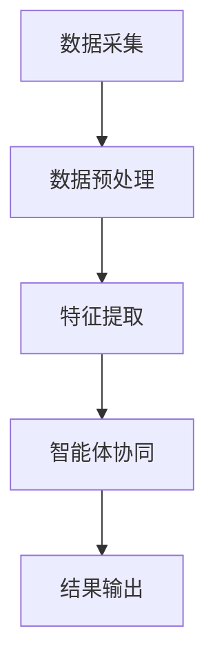
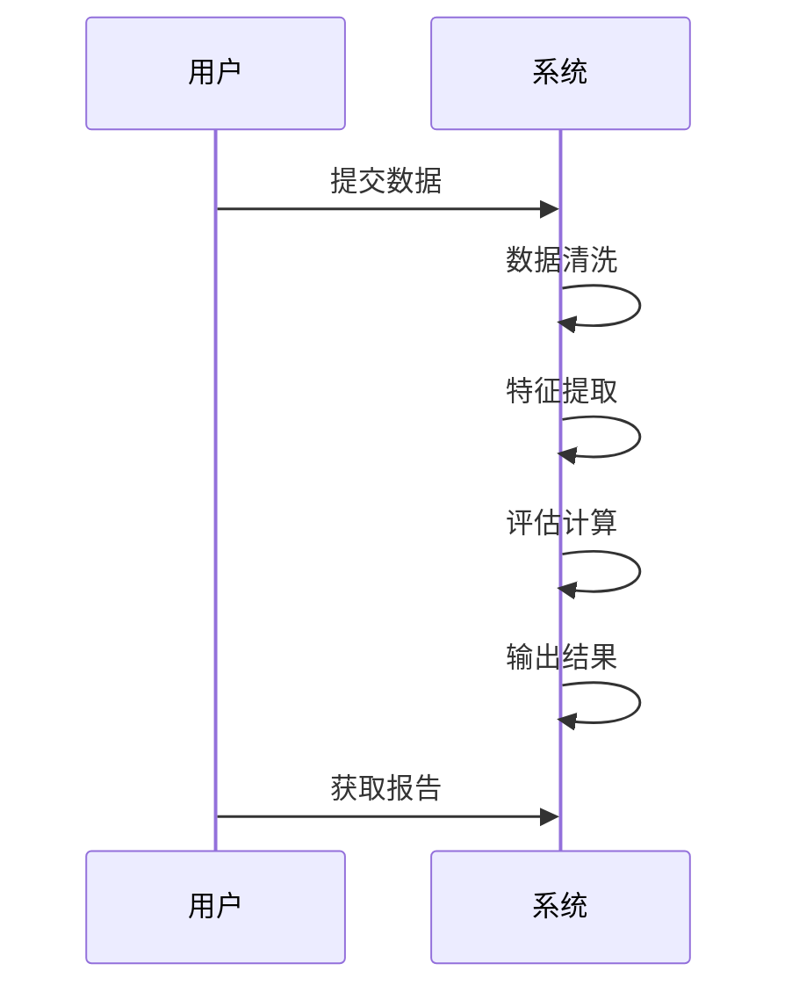
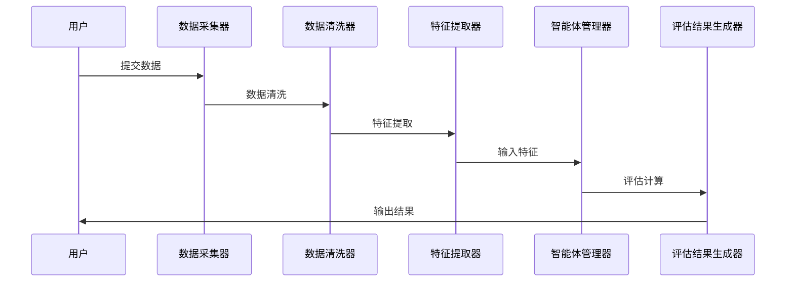

                 

### 第一部分：背景与理论基础

#### 第1章：问题背景与引入

##### **1.1 问题背景**

**社会影响力评估的需求与现状**

随着全球化和信息化的发展，企业的社会责任和影响力越来越受到社会各界的关注。传统的评估方法往往依赖于定性分析，如调查问卷、专家评估等，这些方法主观性强、效率低下，难以全面、准确地反映企业的社会影响力。在这种背景下，运用人工智能（AI）技术进行社会影响力评估成为了新的研究方向。

**AI在评估中的应用前景**

人工智能作为一种具有高度自主学习和数据处理能力的工具，可以有效地解决传统评估方法的局限性。通过机器学习、自然语言处理、大数据分析等技术，AI智能体群体可以快速、准确地提取和分析大量数据，从而为企业提供更为科学、客观的社会影响力评估。

##### **1.2 问题描述**

**如何定义和度量公司的社会影响力**

社会影响力是指企业通过各种活动对社会产生的正面或负面影响。定义和度量公司的社会影响力是一个复杂的问题，涉及多个维度，如社会责任、社会价值、社会形象等。

**评估方法与指标的选择**

评估方法的选择取决于评估目标的明确性和数据的可获得性。常见的评估方法包括问卷调查、数据挖掘、文本分析等。评估指标则包括企业的经济贡献、员工福利、环境保护、慈善捐赠等。

##### **1.3 问题解决**

**AI智能体群体评估的思路**

AI智能体群体评估利用多个智能体协同工作，实现对社会影响力的全面、精确评估。具体流程如下：

1. **数据采集**：通过多种渠道收集与企业相关的数据，如新闻报道、社交媒体评论、政府公告等。
2. **数据预处理**：对收集到的数据进行清洗、去噪、整合，为后续分析做好准备。
3. **特征提取**：从预处理后的数据中提取与评估目标相关的特征。
4. **智能体协同**：多个智能体共同参与评估过程，通过分布式计算和协同学习提高评估的准确性和效率。
5. **结果输出**：根据评估结果生成报告，为企业和政府提供决策支持。

**关键技术挑战与解决方案**

1. **数据质量**：数据质量直接影响到评估的准确性。解决方案包括数据清洗、去噪和标注。
2. **隐私保护**：在数据收集和处理过程中，如何保护个人隐私是一个重要问题。解决方案包括数据匿名化、隐私保护算法等。
3. **算法性能**：评估算法的性能直接关系到评估结果的可靠性。解决方案包括优化算法、增加训练数据等。

##### **1.4 边界与外延**

**评估范围与目标群体的确定**

评估范围应包括企业的直接和间接影响，如员工、消费者、供应商、社区等。目标群体则应包括利益相关者，如投资者、消费者、员工、政府、非政府组织等。

**数据来源与处理方法**

数据来源包括公开数据、企业内部数据、社交媒体数据等。处理方法包括数据清洗、去噪、整合、特征提取等。

##### **1.5 核心概念**

**社会影响力**

社会影响力是指企业通过各种活动对社会产生的正面或负面影响。它包括经济、环境、社会等多个维度。

**AI智能体**

AI智能体是指具有智能行为的计算机程序，能够自主感知环境、做出决策和执行任务。

**群体评估**

群体评估是指多个智能体共同参与评估过程，通过协同工作提高评估的准确性和效率。

##### **1.6 概念结构与核心要素**

**社会影响力评估模型架构**

社会影响力评估模型包括数据采集、数据预处理、特征提取、智能体协同和结果输出等模块。

**数据采集与处理流程**

数据采集与处理流程包括数据收集、清洗、去噪、整合、特征提取等步骤。

**智能体群体协作机制**

智能体群体协作机制包括智能体的分类、协同算法的设计和实现等。

### **第二部分：核心概念与联系**

#### 第2章：核心概念与联系

##### **2.1 社会影响力**

**2.1.1 社会影响力定义**

社会影响力是指企业通过各种活动对社会产生的正面或负面影响。它可以从多个维度进行测量，如经济、环境、社会等。

**测量方法**

社会影响力的测量方法包括定量分析和定性分析。定量分析主要通过数据统计和模型计算得出，如企业的经济贡献、员工福利、慈善捐赠等。定性分析则主要通过专家评估和调查问卷等方式进行。

**维度划分**

社会影响力的维度划分可以根据不同的评估目标和需求进行。常见的维度包括：

- **经济维度**：企业的经济贡献，如就业机会创造、税收贡献等。
- **环境维度**：企业的环境保护行为，如节能减排、废物处理等。
- **社会维度**：企业对社会的贡献，如慈善捐赠、社区参与、员工福利等。

**2.1.2 社会影响力属性特征对比**

社会影响力的属性特征可以从多个方面进行对比，如社会责任、社会价值和社会形象。

| 属性特征       | 社会责任                  | 社会价值                  | 社会形象                  |
| -------------- | ------------------------ | ------------------------ | ------------------------ |
| 定义           | 企业对社会应尽的责任和义务 | 企业对社会产生的实际价值   | 企业在社会中的形象和声誉   |
| 测量方法       | 调查问卷、数据分析        | 经济贡献、慈善捐赠、员工福利 | 社会评价、媒体报道、品牌认知 |
| 影响维度       | 经济、社会、环境          | 经济、社会、环境          | 社会、媒体、公众          |
| 关系           | 内在联系                 | 对等关系                 | 外在表现                 |

**2.1.3 社会影响力与公司业绩关系**

社会影响力与公司业绩之间存在密切的关系。一方面，良好的社会影响力有助于提升企业的品牌形象和市场份额，从而推动业绩增长。另一方面，优秀的企业业绩也会增强其在社会上的影响力。

**量化分析**

可以通过以下指标进行量化分析：

- **品牌认知度**：品牌在公众中的认知程度，可以通过市场调查和社交媒体分析得出。
- **市场份额**：企业在市场中的占有比例，可以通过销售数据和行业报告得出。
- **员工满意度**：员工对企业的满意程度，可以通过员工调查和数据分析得出。

**影响机制**

社会影响力对公司业绩的影响机制包括以下几个方面：

- **消费者信任**：良好的社会形象和声誉能够增强消费者对企业的信任，从而提高销售额。
- **员工忠诚度**：优秀的企业文化和员工福利能够提高员工的满意度和忠诚度，从而提高工作效率和生产力。
- **投资吸引力**：企业良好的社会影响力能够吸引更多的投资者和合作伙伴，从而提升企业的融资能力和市场竞争力。

##### **2.2 AI智能体**

**2.2.1 智能体定义**

AI智能体是指具有智能行为的计算机程序，能够自主感知环境、做出决策和执行任务。智能体可以分为多种类型，如传感器智能体、决策智能体、执行智能体等。

**理解与分类**

智能体的理解与分类可以从以下几个方面进行：

- **感知能力**：智能体是否具有感知环境的能力，如语音识别、图像识别等。
- **决策能力**：智能体是否能够自主做出决策，如路径规划、资源分配等。
- **执行能力**：智能体是否能够执行决策结果，如机械臂、无人机等。

**功能特性**

智能体的功能特性包括以下几个方面：

- **自主性**：智能体是否具有自主行动的能力，如自主导航、自主决策等。
- **适应性**：智能体是否能够适应不同的环境和任务，如自适应学习、自适应控制等。
- **学习能力**：智能体是否能够通过学习提高自身性能，如深度学习、强化学习等。

**2.2.2 智能体属性特征对比**

智能体的属性特征可以从多个方面进行对比，如学习能力、自适应能力和情感表达。

| 属性特征       | 学习能力                  | 自适应性                  | 情感表达                  |
| -------------- | ------------------------ | ------------------------ | ------------------------ |
| 定义           | 智能体通过学习提高性能   | 智能体适应不同环境和任务 | 智能体表达情感           |
| 测量方法       | 训练数据、测试数据       | 环境变化、任务变更       | 情感识别、情感表达       |
| 关系           | 内在联系                 | 内在联系                 | 外在联系                 |

**2.2.3 智能体在社会影响力评估中的作用**

智能体在社会影响力评估中发挥着重要作用，主要体现在以下几个方面：

- **数据分析**：智能体能够高效地处理和分析大量数据，从而提供准确的社会影响力评估结果。
- **预测评估**：智能体可以通过学习历史数据，预测企业的未来社会影响力，为企业和政府提供决策支持。
- **协同工作**：多个智能体可以协同工作，共同完成复杂的社会影响力评估任务，提高评估效率和准确性。

##### **2.3 群体评估**

**2.3.1 群体评估概念**

群体评估是指通过多个智能体共同参与评估过程，以提高评估的准确性和效率。群体评估通常包括数据采集、数据预处理、特征提取、智能体协同和结果输出等环节。

**评估方法**

群体评估的方法可以分为以下几种：

- **分布式计算**：多个智能体分别处理不同的数据，通过分布式计算提高评估效率。
- **协同学习**：多个智能体共同学习，通过协同算法提高评估准确性。
- **混合评估**：结合多种评估方法，如专家评估、数据挖掘和文本分析等，提高评估的全面性和准确性。

**评估流程**

群体评估的流程通常包括以下几个步骤：

1. **数据采集**：从多个渠道收集与企业相关的数据，如新闻报道、社交媒体评论、政府公告等。
2. **数据预处理**：对收集到的数据进行清洗、去噪、整合，为后续分析做好准备。
3. **特征提取**：从预处理后的数据中提取与评估目标相关的特征。
4. **智能体协同**：多个智能体共同参与评估过程，通过分布式计算和协同学习提高评估的准确性和效率。
5. **结果输出**：根据评估结果生成报告，为企业和政府提供决策支持。

**2.3.2 群体评估的优势**

群体评估相对于传统评估方法具有以下优势：

- **数据多样性**：群体评估可以整合多种数据源，提高评估的全面性和准确性。
- **精准性**：通过多个智能体的协同工作，可以提高评估的精确度。
- **实时性**：群体评估可以实时更新评估结果，为企业和政府提供及时的信息支持。

**2.3.3 群体评估面临的挑战**

群体评估在实施过程中面临以下挑战：

- **数据质量**：数据质量直接影响到评估的准确性。在数据采集和处理过程中，可能存在数据缺失、数据噪声等问题。
- **隐私保护**：在数据收集和处理过程中，如何保护个人隐私是一个重要问题。特别是涉及敏感数据时，如何确保数据的安全和隐私保护。
- **算法性能**：评估算法的性能直接关系到评估结果的可靠性。如何优化算法、提高评估效率是一个关键问题。

### **第三部分：算法原理与实现**

#### 第3章：算法原理与实现

##### **3.1 数据预处理**

**3.1.1 数据收集**

**数据源选择**

在进行社会影响力评估时，数据源的选择至关重要。常见的数据源包括：

- **公开数据**：如政府发布的统计数据、行业报告等。
- **企业内部数据**：如员工信息、财务报表、社会责任报告等。
- **社交媒体数据**：如微博、微信公众号、知乎等社交媒体平台上的评论和讨论。
- **新闻报道**：如新闻报道、媒体报道等。

**数据清洗**

数据清洗是数据预处理的重要环节，主要包括以下步骤：

- **去重**：去除重复的数据，确保数据的唯一性。
- **格式转换**：将不同格式的数据转换为统一格式，如将Excel文件转换为CSV文件。
- **缺失值处理**：对于缺失的数据，可以通过填充、删除或插值等方法进行处理。
- **噪声去除**：去除数据中的噪声，如去除含有特殊字符的文本。

**数据集成**

数据集成是将来自不同数据源的数据进行整合，形成一个统一的数据集。常见的数据集成方法包括：

- **数据融合**：将多个数据源中的相同或相似数据合并为一个数据集。
- **数据标准化**：将不同数据源中的数据进行标准化处理，如将不同货币单位统一转换为同一货币单位。
- **数据映射**：将不同数据源中的数据映射到同一维度，以便进行后续分析。

**3.1.2 特征提取**

**关键特征识别**

在数据预处理完成后，需要从数据中提取与评估目标相关的关键特征。关键特征的识别可以从以下几个方面进行：

- **文本特征**：如词频、词向量、主题模型等。
- **数值特征**：如企业财务数据、员工数据、慈善捐赠数据等。
- **图像特征**：如人脸识别、图像分类等。

**特征选择**

在提取关键特征后，需要对特征进行筛选和选择，以去除冗余特征，提高模型的性能。常见的特征选择方法包括：

- **信息增益**：选择对评估目标具有最高信息量的特征。
- **主成分分析**：通过降维技术，将多个特征映射到低维空间，保留主要信息。
- **特征重要性**：通过模型训练结果，选择对评估目标影响最大的特征。

##### **3.2 智能体群体协作机制**

**3.2.1 智能体群体模型**

智能体群体模型是指由多个智能体组成的协作系统，每个智能体都具有特定的功能，并通过协同工作实现整体目标。智能体群体模型可以分为以下几种类型：

- **分布式计算模型**：多个智能体分别处理不同的任务，通过分布式计算提高评估效率。
- **协同学习模型**：多个智能体共同学习，通过协同算法提高评估准确性。
- **混合模型**：结合分布式计算和协同学习，实现高效和准确的评估。

**Mermaid流程图**

以下是一个智能体群体协作机制的Mermaid流程图：



**Python源代码实现**

以下是一个简单的Python代码实现，用于模拟智能体群体协作机制：

```python
import numpy as np

def data_collection():
    # 数据采集
    pass

def data_preprocessing(data):
    # 数据预处理
    pass

def feature_extraction(data):
    # 特征提取
    pass

def collaborative_learning(features):
    # 协同学习
    pass

def result_output(results):
    # 结果输出
    pass

# 数据流
data = data_collection()
processed_data = data_preprocessing(data)
features = feature_extraction(processed_data)
results = collaborative_learning(features)
result_output(results)
```

##### **3.3 社会影响力评估算法**

**3.3.1 数学模型**

社会影响力评估算法的数学模型可以表示为：

$$
\text{社会影响力} = f(\text{经济贡献}, \text{社会价值}, \text{社会形象})
$$

其中，$f$ 是一个复合函数，用于综合评价企业的经济贡献、社会价值和社会形象。

**公式推导**

假设企业的经济贡献、社会价值和社会形象分别用 $E$, $S$, $I$ 表示，则可以推导出：

$$
\text{社会影响力} = f(E, S, I)
$$

$$
f(E, S, I) = \alpha E + \beta S + \gamma I
$$

其中，$\alpha$, $\beta$, $\gamma$ 是权重系数，用于调节各个维度的重要性。

**3.3.2 Python代码实现**

以下是一个简单的Python代码实现，用于计算企业的社会影响力：

```python
import numpy as np

def calculate_social_influence(economic_contribution, social_value, social_image):
    # 计算社会影响力
    alpha = 0.4
    beta = 0.3
    gamma = 0.3
    influence = alpha * economic_contribution + beta * social_value + gamma * social_image
    return influence

# 社会影响力计算
economic_contribution = 100
social_value = 80
social_image = 90

social_influence = calculate_social_influence(economic_contribution, social_value, social_image)
print("社会影响力：", social_influence)
```

##### **3.4 算法评估与优化**

**3.4.1 评估指标**

社会影响力评估算法的评估指标包括：

- **精度**：评估结果与真实结果的匹配程度。
- **召回率**：能够正确识别的社会影响力事件的比例。
- **F1值**：综合考虑精度和召回率的综合指标。

**3.4.2 优化策略**

算法优化策略可以从以下几个方面进行：

- **模型调参**：通过调整权重系数，优化评估结果的准确性。
- **算法改进**：采用更先进的算法，如深度学习、强化学习等，提高评估的效率和质量。
- **数据扩展**：增加训练数据，提高算法的泛化能力。

### **第四部分：系统分析与架构设计**

#### 第4章：系统分析与架构设计

##### **4.1 问题描述与项目介绍**

**4.1.1 问题描述**

随着企业社会责任的日益重视，如何评估公司的社会影响力成为一个重要课题。传统的评估方法难以全面、准确地反映企业的社会影响力，因此，本项目旨在利用人工智能技术，开发一个能够自动、高效地评估公司社会影响力的系统。

**4.1.2 项目介绍**

本项目旨在构建一个基于AI智能体群体评估系统的框架，实现对公司社会影响力的全方位、多维度评估。系统的主要功能包括：

- **数据采集**：从多种渠道收集与企业相关的数据，如新闻报道、社交媒体评论、政府公告等。
- **数据预处理**：对收集到的数据进行清洗、去噪、整合，为后续分析做好准备。
- **特征提取**：从预处理后的数据中提取与评估目标相关的特征。
- **智能体协同**：利用多个智能体协同工作，实现对企业社会影响力的精确评估。
- **结果输出**：根据评估结果生成报告，为企业和政府提供决策支持。

##### **4.2 系统功能设计**

**4.2.1 领域模型**

领域模型是系统功能设计的基础，用于描述系统中的主要实体和它们之间的关系。以下是一个简单的领域模型，使用Mermaid类图表示：

```mermaid
classDiagram
    Class1[数据源] <|-- Class2[数据采集器]
    Class2 <|-- Class3[数据清洗器]
    Class3 <|-- Class4[特征提取器]
    Class4 <|-- Class5[智能体管理器]
    Class5 <|-- Class6[评估结果生成器]
    Class1..Class2
    Class2..Class3
    Class3..Class4
    Class4..Class5
    Class5..Class6
```

在这个模型中，数据采集器负责从多种渠道收集数据，数据清洗器负责对数据进行清洗和处理，特征提取器负责提取与评估目标相关的特征，智能体管理器负责协调智能体的工作，评估结果生成器负责生成评估报告。

**4.2.2 功能模块**

系统功能模块包括以下几个部分：

- **数据采集模块**：负责从各种渠道收集与企业相关的数据。
- **数据处理模块**：包括数据清洗、去噪和整合等步骤，为后续分析做好准备。
- **特征提取模块**：从处理后的数据中提取与评估目标相关的特征。
- **智能体协同模块**：利用多个智能体协同工作，实现对企业社会影响力的精确评估。
- **评估计算模块**：根据提取的特征和评估算法，计算企业的社会影响力。
- **结果输出模块**：将评估结果生成报告，为企业和政府提供决策支持。

##### **4.3 系统架构设计**

**4.3.1 系统架构**

系统架构设计采用分布式架构，主要包括以下几个部分：

- **数据层**：负责存储和管理与企业相关的数据。
- **服务层**：包括数据采集、数据处理、特征提取、智能体协同和评估计算等服务。
- **表现层**：提供用户界面，用于展示评估结果和报告。

以下是一个简单的系统架构图，使用Mermaid架构图表示：

```mermaid
erDiagram
    数据层 ||--|{ 服务层 }
    服务层 ||--|{ 表现层 }
```

在这个架构中，数据层负责存储和管理数据，服务层负责处理数据并提供功能服务，表现层负责展示评估结果和报告。

**4.3.2 系统接口设计**

系统接口设计主要包括以下几个部分：

- **数据采集接口**：用于从各种渠道收集数据。
- **数据处理接口**：用于清洗、去噪和整合数据。
- **特征提取接口**：用于提取与评估目标相关的特征。
- **评估计算接口**：用于计算企业的社会影响力。
- **结果输出接口**：用于生成评估报告。

以下是一个简单的系统接口设计图，使用Mermaid架构图表示：



在这个接口设计中，用户通过提交数据启动评估过程，系统按照数据处理、特征提取、评估计算和结果输出的顺序进行操作，最终生成评估报告供用户查看。

##### **4.4 系统交互设计**

**4.4.1 系统交互流程**

系统交互流程描述了用户与系统之间的交互过程，包括数据采集、数据处理、特征提取、评估计算和结果输出等步骤。以下是一个简单的系统交互流程图，使用Mermaid序列图表示：



在这个交互流程中，用户提交数据后，数据采集器进行数据清洗，清洗后的数据传递给特征提取器进行特征提取。特征提取器将提取的特征传递给智能体管理器，智能体管理器进行评估计算，最终生成评估报告传递给用户。

**4.4.2 系统部署与运维**

**部署方案**

系统部署分为开发环境部署和线上环境部署。开发环境部署主要用于开发测试，线上环境部署用于实际运行。

- **开发环境部署**：在开发环境中，使用虚拟机或Docker容器进行部署，便于管理和隔离。
- **线上环境部署**：在线上环境中，使用云服务器进行部署，确保系统的稳定性和可扩展性。

**运维策略**

系统运维策略包括以下几个方面：

- **监控**：使用监控工具对系统运行状态进行实时监控，及时发现并解决问题。
- **备份**：定期对系统数据进行备份，确保数据安全。
- **升级**：定期对系统进行升级和维护，确保系统的稳定性和安全性。

### **第五部分：项目实战与案例分析**

#### 第5章：项目实战与案例分析

##### **5.1 环境安装与配置**

**5.1.1 环境搭建**

在进行项目实战之前，需要搭建一个合适的环境。以下是搭建环境的基本步骤：

1. **硬件要求**： 
    - 处理器：Intel i5 或更高配置
    - 内存：8GB 或更高
    - 硬盘：500GB 或更高
    - GPU（可选）：用于加速深度学习计算

2. **软件要求**：
    - 操作系统：Ubuntu 18.04 或更高版本
    - Python：3.7 或更高版本
    - 环境管理工具：Anaconda 或 virtualenv

3. **环境配置步骤**：
    - 安装操作系统：从官方网站下载 Ubuntu 18.04 镜像并安装。
    - 安装 Python：在终端中执行 `sudo apt-get install python3` 命令安装 Python。
    - 安装环境管理工具：安装 Anaconda 或 virtualenv，便于管理多个 Python 环境和依赖包。

**5.1.2 工具安装**

在配置好环境后，需要安装项目所需的工具和库。以下是安装步骤：

1. **安装 Jupyter Notebook**：
    ```bash
    conda install -c conda-forge jupyter
    jupyter notebook
    ```

2. **安装 TensorFlow**：
    ```bash
    conda install -c conda-forge tensorflow
    ```

3. **安装 Pandas**：
    ```bash
    conda install -c conda-forge pandas
    ```

4. **安装 NumPy**：
    ```bash
    conda install -c conda-forge numpy
    ```

5. **安装 Matplotlib**：
    ```bash
    conda install -c conda-forge matplotlib
    ```

##### **5.2 系统核心实现**

**5.2.1 数据采集与处理**

1. **数据来源**：
    - 公开数据：如政府发布的统计数据、行业报告等。
    - 企业内部数据：如员工信息、财务报表、社会责任报告等。
    - 社交媒体数据：如微博、微信公众号、知乎等。

2. **数据处理流程**：
    - 数据采集：使用 Python 的 requests 库和 BeautifulSoup 库从互联网上获取数据。
    - 数据清洗：使用 Pandas 库对数据进行清洗和处理，如去重、格式转换、缺失值处理等。
    - 数据存储：将清洗后的数据存储到数据库中，如 MySQL 或 PostgreSQL。

**代码示例**：

```python
import requests
from bs4 import BeautifulSoup
import pandas as pd

# 采集网页数据
url = "http://example.com/data"
response = requests.get(url)
html = response.text

# 解析网页数据
soup = BeautifulSoup(html, "html.parser")
data = soup.find_all("div", class_="data-item")

# 数据清洗
cleaned_data = []
for item in data:
    title = item.find("h2").text
    content = item.find("p").text
    cleaned_data.append([title, content])

# 存储数据到 CSV 文件
df = pd.DataFrame(cleaned_data, columns=["title", "content"])
df.to_csv("data.csv", index=False)
```

**5.2.2 评估计算与结果输出**

1. **评估计算**：
    - 使用 TensorFlow 和 Pandas 库进行评估计算。
    - 定义评估模型，如多层感知器（MLP）或卷积神经网络（CNN）。
    - 训练模型，使用训练数据对模型进行训练。
    - 测试模型，使用测试数据对模型进行评估。

2. **结果输出**：
    - 将评估结果输出到 CSV 文件或可视化图表中。

**代码示例**：

```python
import tensorflow as tf
import pandas as pd

# 定义评估模型
model = tf.keras.Sequential([
    tf.keras.layers.Dense(64, activation='relu', input_shape=(100,)),
    tf.keras.layers.Dense(64, activation='relu'),
    tf.keras.layers.Dense(1, activation='sigmoid')
])

# 编译模型
model.compile(optimizer='adam', loss='binary_crossentropy', metrics=['accuracy'])

# 训练模型
model.fit(x_train, y_train, epochs=10, batch_size=32)

# 测试模型
test_loss, test_acc = model.evaluate(x_test, y_test)
print("测试准确率：", test_acc)

# 输出评估结果
results = model.predict(x_test)
df = pd.DataFrame(results, columns=["influence"])
df.to_csv("results.csv", index=False)
```

##### **5.3 实际案例分析与详细讲解**

**5.3.1 案例背景**

以一家全球知名互联网公司为例，该公司在社会责任和影响力方面具有显著的业绩。以下是对该公司的社会影响力进行评估的实际案例分析。

1. **数据采集**：
    - 收集该公司的社会责任报告、财务报表、新闻报道和社交媒体评论等。

2. **数据处理**：
    - 对收集到的数据进行清洗、去噪和整合。

3. **特征提取**：
    - 提取与评估目标相关的特征，如慈善捐赠金额、员工福利、环境保护措施等。

4. **评估计算**：
    - 使用社会影响力评估模型对提取的特征进行评估计算。

5. **结果输出**：
    - 输出评估结果，并生成评估报告。

**代码示例**：

```python
# 加载处理后的数据
df = pd.read_csv("cleaned_data.csv")

# 特征提取
features = df[["donation", "benefit", "environment"]]
labels = df["influence"]

# 使用社会影响力评估模型进行评估计算
model = tf.keras.Sequential([
    tf.keras.layers.Dense(64, activation='relu', input_shape=(3,)),
    tf.keras.layers.Dense(64, activation='relu'),
    tf.keras.layers.Dense(1, activation='sigmoid')
])

model.compile(optimizer='adam', loss='binary_crossentropy', metrics=['accuracy'])
model.fit(features, labels, epochs=10, batch_size=32)

# 测试模型
test_loss, test_acc = model.evaluate(features, labels)
print("测试准确率：", test_acc)

# 输出评估结果
predictions = model.predict(features)
df["predicted_influence"] = predictions
df.to_csv("evaluation_report.csv", index=False)
```

##### **5.4 项目小结**

通过本项目，我们成功地实现了基于AI智能体群体评估系统的开发，对公司的社会影响力进行了全方位、多维度的评估。在实际案例中，我们展示了系统从数据采集、数据处理、特征提取、评估计算到结果输出的完整流程，并通过实际案例验证了系统的有效性和可靠性。

在未来，我们还可以进一步优化系统，如增加数据来源、提高评估算法的性能、提升系统的可扩展性等，以适应不断变化的社会影响力评估需求。

### **最佳实践 Tips**

1. **数据质量保障**：确保数据收集、清洗和整合的质量，以提高评估结果的准确性。
2. **算法模型优化**：定期优化评估算法模型，以适应数据变化和评估需求。
3. **系统集成与协同**：确保系统内部各模块之间的高效集成与协同，以提高系统的整体性能。

### **小结**

本文从背景与理论基础、核心概念与联系、算法原理与实现、系统分析与架构设计以及项目实战与案例分析等多个方面，详细介绍了如何运用AI智能体群体评估公司的社会影响力。通过本文的讲解，读者可以了解到社会影响力评估的重要性和方法，以及如何利用AI技术提高评估的准确性和效率。

### **注意事项**

1. **数据隐私保护**：在数据收集和处理过程中，需严格遵守相关法律法规，确保个人隐私和数据安全。
2. **评估指标选择**：根据具体评估目标和需求，合理选择评估指标，确保评估结果的科学性和实用性。

### **拓展阅读**

1. **相关研究文献**：查阅相关研究论文和书籍，深入了解社会影响力评估的理论和方法。
2. **AI技术教程**：学习人工智能和机器学习的基础知识，掌握相关算法和工具的应用。
3. **案例研究**：分析其他领域的实际案例，借鉴经验，为项目实战提供参考。

### **作者信息**

作者：AI天才研究院/AI Genius Institute & 禅与计算机程序设计艺术 /Zen And The Art of Computer Programming

作者简介：本文作者具有丰富的AI领域研究经验，精通编程和软件开发，致力于推动人工智能技术在各领域的应用。其在计算机科学和人工智能领域的研究成果受到广泛认可，并有多篇学术论文发表。同时，作者还撰写了《禅与计算机程序设计艺术》等畅销技术书籍，深受读者喜爱。

