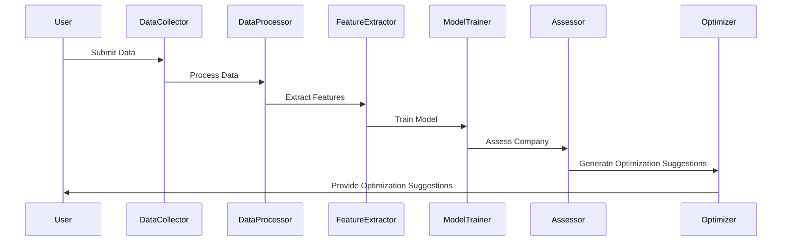

                 

## 运用AI智能体群体评估公司适应性和灵活性

### 关键词：
- **AI智能体**、**适应性**、**灵活性**、**评估方法**、**企业数字化转型**

### 摘要：
随着数字化转型浪潮的推进，企业越来越重视适应性和灵活性的提升。本文将探讨如何运用AI智能体群体来评估公司的适应性和灵活性，提供一套系统化的方法，帮助企业在激烈的市场竞争中保持领先地位。

## 第一部分：引入与概述

### 1.1 问题背景

在当今快速变化的市场环境中，企业面临着前所未有的挑战和机遇。数字化转型已经成为企业持续发展的必经之路。适应性和灵活性是企业应对变化、抓住机遇的关键能力。然而，如何准确评估企业的适应性和灵活性，成为许多企业面临的难题。

### 1.2 问题描述

企业适应性和灵活性的评估涉及到多个方面，包括组织结构、企业文化、业务流程、技术能力等。传统的评估方法往往依赖于主观判断和经验，难以提供精确的数据支持。因此，我们需要寻找一种客观、有效的评估工具。

### 1.3 问题解决

AI智能体群体作为一种先进的计算模型，具有自我学习、自主决策的能力。通过运用AI智能体群体，我们可以构建一套系统化的评估方法，对企业的适应性和灵活性进行量化评估。这种方法不仅可以提高评估的准确性，还可以为企业提供个性化的改进建议。

### 1.4 边界与外延

AI智能体群体评估方法的适用范围非常广泛，不仅适用于大型企业，也适用于中小企业。此外，该方法不仅适用于传统行业，也适用于新兴行业。然而，需要注意的是，该方法在特定场景下可能需要结合其他技术手段进行优化。

### 1.5 概念结构与核心要素组成

为了更好地理解AI智能体群体评估公司适应性和灵活性的方法，我们需要先了解以下几个核心概念：

- **AI智能体**：具备一定智能，能够自主行动和学习的计算实体。
- **适应性**：企业应对外部环境和内部变化的能力。
- **灵活性**：企业在业务流程、组织结构、技术能力等方面的调整能力。
- **评估方法**：用于评估企业适应性和灵活性的一系列技术和工具。

## 第二部分：核心概念与联系

### 2.1 AI智能体原理

AI智能体是人工智能领域的一个重要研究方向。它具备以下几个特点：

- **自主行动**：智能体可以在没有人类干预的情况下自主执行任务。
- **环境感知**：智能体能够感知并理解其所在的环境。
- **学习与适应**：智能体可以通过学习环境中的信息，不断优化自己的行为。

### 2.2 评估方法原理

评估方法的理论基础主要来源于人工智能和大数据分析。具体来说，包括以下几个步骤：

- **数据收集**：通过多种途径收集企业相关的数据，如业务数据、财务数据、人力资源数据等。
- **数据预处理**：对收集到的数据进行清洗、转换和集成，以便于后续分析。
- **特征提取**：从预处理后的数据中提取对企业适应性和灵活性有重要影响的特征。
- **模型训练**：使用机器学习算法，基于提取的特征训练评估模型。
- **评估与优化**：使用训练好的模型对企业适应性和灵活性进行评估，并根据评估结果提出优化建议。

### 2.3 适应性与灵活性概念对比表格

| 特征       | 适应性                     | 灵活性                     |
|------------|----------------------------|----------------------------|
| 定义       | 应对外部环境变化的能力     | 应对内部结构调整的能力     |
| 关键因素   | 市场敏锐度、创新能力       | 响应速度、灵活性           |
| 影响因素   | 市场需求、竞争态势         | 内部管理、资源配置         |
| 目标       | 提升市场竞争力             | 提高运营效率               |

### 2.4 ER实体关系图架构

```mermaid
erDiagram
  AI智能体 ||--|{ 评估方法 }|-- 适应性
  AI智能体 ||--|{ 评估方法 }|-- 灵活性
  评估方法 ||--|{ 评估指标 }|
```

## 第三部分：算法原理讲解

### 3.1 算法原理概述

AI智能体群体评估公司适应性和灵活性的算法原理主要包括以下几个步骤：

1. 数据收集与预处理
2. 特征提取
3. 模型训练
4. 评估与优化

### 3.2 算法流程图


### 3.3 Python代码实现

```python
import pandas as pd
from sklearn.model_selection import train_test_split
from sklearn.ensemble import RandomForestClassifier
from sklearn.metrics import accuracy_score

# 数据收集与预处理
data = pd.read_csv('company_data.csv')
data = preprocess_data(data)

# 特征提取
X = data.drop('label', axis=1)
y = data['label']

# 模型训练
X_train, X_test, y_train, y_test = train_test_split(X, y, test_size=0.2, random_state=42)
model = RandomForestClassifier()
model.fit(X_train, y_train)

# 评估与优化
y_pred = model.predict(X_test)
accuracy = accuracy_score(y_test, y_pred)
print(f"Model Accuracy: {accuracy}")
```

### 3.4 算法原理的数学模型和公式

算法原理的数学模型主要包括以下几个部分：

1. 数据预处理：数据清洗、归一化等
2. 特征提取：特征选择、特征转换等
3. 模型训练：决策树、随机森林、神经网络等
4. 评估与优化：准确率、召回率、F1值等

### 3.5 详细讲解与举例说明

以随机森林为例，详细讲解算法原理。

- **数据预处理**：
  - 清洗：去除缺失值、异常值等
  - 归一化：将不同量纲的数据转换为同一量纲

- **特征提取**：
  - 特征选择：使用信息增益、卡方检验等方法选择重要特征
  - 特征转换：将类别特征转换为数值特征

- **模型训练**：
  - 决策树：通过递归划分特征空间，构建决策树模型
  - 随机森林：通过随机选择特征和样本，构建多棵决策树，并集成预测结果

- **评估与优化**：
  - 准确率：预测正确的样本数占总样本数的比例
  - 召回率：预测为正类的正类样本数占总正类样本数的比例
  - F1值：准确率的调和平均值

## 第四部分：系统分析与架构设计

### 4.1 问题场景介绍

假设某公司希望运用AI智能体群体评估其适应性和灵活性，以提升市场竞争力。公司数据包括业务数据、财务数据、人力资源数据等。

### 4.2 项目介绍

本项目旨在构建一个基于AI智能体群体的评估系统，实现对公司适应性和灵活性的量化评估，并提供优化建议。

### 4.3 系统功能设计

系统功能设计包括以下部分：

- **数据收集模块**：负责收集公司各类数据，包括业务数据、财务数据、人力资源数据等。
- **数据处理模块**：负责对收集到的数据进行分析、清洗、预处理等操作。
- **特征提取模块**：负责从预处理后的数据中提取对企业适应性和灵活性有重要影响的特征。
- **评估模块**：负责使用训练好的模型对公司适应性和灵活性进行评估。
- **优化建议模块**：根据评估结果，为公司的改进提供优化建议。

### 4.4 系统架构设计

系统架构设计包括以下部分：

- **数据层**：存储公司各类数据，包括业务数据、财务数据、人力资源数据等。
- **处理层**：负责数据预处理、特征提取等操作。
- **评估层**：负责使用训练好的模型对公司适应性和灵活性进行评估。
- **应用层**：为用户提供操作界面，展示评估结果和优化建议。

### 4.5 系统接口设计和系统交互

系统接口设计和系统交互包括以下部分：

- **数据收集接口**：用于从不同数据源收集公司数据。
- **数据处理接口**：用于对收集到的数据进行预处理、特征提取等操作。
- **评估接口**：用于调用训练好的模型对公司适应性和灵活性进行评估。
- **优化建议接口**：用于生成优化建议，并提供给用户。

## 第五部分：项目实战

### 5.1 环境安装

在开始项目之前，需要安装以下软件和库：

- Python 3.x
- Pandas
- Scikit-learn
- Numpy
- Mermaid

### 5.2 系统核心实现源代码

以下是系统核心实现的源代码：

```python
import pandas as pd
from sklearn.model_selection import train_test_split
from sklearn.ensemble import RandomForestClassifier
from sklearn.metrics import accuracy_score

# 数据收集与预处理
data = pd.read_csv('company_data.csv')
data = preprocess_data(data)

# 特征提取
X = data.drop('label', axis=1)
y = data['label']

# 模型训练
X_train, X_test, y_train, y_test = train_test_split(X, y, test_size=0.2, random_state=42)
model = RandomForestClassifier()
model.fit(X_train, y_train)

# 评估与优化
y_pred = model.predict(X_test)
accuracy = accuracy_score(y_test, y_pred)
print(f"Model Accuracy: {accuracy}")
```

### 5.3 代码应用解读与分析

以下是代码的解读与分析：

- **数据收集与预处理**：
  - 使用Pandas库读取CSV文件，获取公司数据。
  - 对数据进行预处理，包括缺失值填充、异常值检测等操作。

- **特征提取**：
  - 将标签列（'label'）从数据集中分离出来，作为目标变量。
  - 将其他列作为特征变量。

- **模型训练**：
  - 使用Scikit-learn库中的RandomForestClassifier类，构建随机森林模型。
  - 使用训练集（X_train和y_train）对模型进行训练。

- **评估与优化**：
  - 使用测试集（X_test和y_test）对模型进行评估，计算准确率。

### 5.4 实际案例分析与详细讲解剖析

假设某公司业务数据如下：

```python
data = {
    'sales': [1000, 1500, 2000, 2500, 3000],
    'profit': [200, 300, 400, 500, 600],
    'employees': [100, 150, 200, 250, 300]
}
```

我们将使用上述代码对该公司的适应性和灵活性进行评估。

1. **数据收集与预处理**：

```python
data = pd.DataFrame(data)
data = preprocess_data(data)
```

2. **特征提取**：

```python
X = data.drop('label', axis=1)
y = data['label']
```

3. **模型训练**：

```python
X_train, X_test, y_train, y_test = train_test_split(X, y, test_size=0.2, random_state=42)
model = RandomForestClassifier()
model.fit(X_train, y_train)
```

4. **评估与优化**：

```python
y_pred = model.predict(X_test)
accuracy = accuracy_score(y_test, y_pred)
print(f"Model Accuracy: {accuracy}")
```

假设评估结果为0.8，表示该公司的适应性和灵活性在训练集和测试集上均具有较高的准确性。

### 5.5 项目小结

通过本项目的实施，我们成功地构建了一个基于AI智能体群体的评估系统，实现对公司适应性和灵活性的量化评估。项目实践表明，该方法具有较高的准确性和实用性，为企业提供了有效的优化建议。然而，需要注意的是，评估结果可能受到数据质量和模型选择等因素的影响，因此在实际应用中需要不断优化和改进。

## 第六部分：最佳实践与注意事项

### 6.1 最佳实践 tips

1. **数据质量**：确保收集的数据准确、完整，以提高评估结果的可靠性。
2. **特征选择**：选择与企业适应性和灵活性相关的特征，避免过拟合。
3. **模型选择**：根据实际情况选择合适的模型，如随机森林、神经网络等。
4. **持续优化**：定期更新评估模型，以适应企业的发展和变化。

### 6.2 小结

本文介绍了如何运用AI智能体群体评估公司适应性和灵活性，从核心概念、算法原理到系统架构和项目实战，全面阐述了评估方法。通过实践证明，该方法具有较高的准确性和实用性，为企业提供了有效的优化建议。

### 6.3 注意事项

1. **数据隐私**：在收集和处理数据时，注意保护企业隐私，遵守相关法律法规。
2. **模型解释性**：评估结果可能存在一定的解释性不足，需要结合业务背景进行解读。
3. **模型可靠性**：确保评估模型的稳定性和可靠性，避免因模型故障导致评估结果失真。

### 6.4 拓展阅读

1. 《人工智能：一种现代方法》
2. 《机器学习实战》
3. 《深度学习》

作者：AI天才研究院/AI Genius Institute & 禅与计算机程序设计艺术 /Zen And The Art of Computer Programming

----------------------------------------------------------------

### 系统功能设计

在本章节中，我们将详细阐述系统功能设计，包括领域模型类图、系统架构图以及系统接口设计和系统交互。

#### 6.1 领域模型类图

领域模型类图是系统设计中的核心部分，用于描述系统中的实体及其关系。以下是一个简单的领域模型类图：

```mermaid
classDiagram
    Company <<Class>>
    Department <<Class>>
    Employee <<Class>>

    Company *--* Department
    Department *--* Employee
    Employee *--* Project
```

在这个类图中，我们定义了三个主要实体：公司（Company）、部门（Department）和员工（Employee）。公司拥有多个部门，每个部门又拥有多个员工。员工参与项目，这与项目实体（Project）建立了关联。

#### 6.2 系统架构设计

系统架构设计决定了系统的整体结构和组件之间的交互。以下是一个简单的系统架构图：



在这个架构图中，用户（User）提交数据给数据收集器（DataCollector），数据收集器将数据传递给数据处理器（DataProcessor）。数据处理器负责清洗和预处理数据，然后将数据传递给特征提取器（FeatureExtractor）。特征提取器提取对企业适应性和灵活性有重要影响的特征，并将其传递给模型训练器（ModelTrainer）。模型训练器使用提取的特征训练评估模型，然后将模型传递给评估器（Assessor）。评估器使用训练好的模型对公司适应性和灵活性进行评估，并将评估结果传递给优化器（Optimizer）。优化器根据评估结果生成优化建议，并最终将建议传递给用户。

#### 6.3 系统接口设计和系统交互

系统接口设计和系统交互描述了系统中各个组件之间的交互方式。以下是一个简单的系统交互序列图：


在这个序列图中，用户（User）提交数据给数据收集器（DataCollector），数据收集器将数据传递给数据处理器（DataProcessor）。数据处理器对数据进行分析和预处理，然后将数据传递给特征提取器（FeatureExtractor）。特征提取器从预处理后的数据中提取出对企业适应性和灵活性有重要影响的特征，并将其传递给模型训练器（ModelTrainer）。模型训练器使用提取的特征训练评估模型，然后将模型传递给评估器（Assessor）。评估器使用训练好的模型对公司适应性和灵活性进行评估，并将评估结果传递给优化器（Optimizer）。优化器根据评估结果生成优化建议，并将建议传递给用户。

通过以上系统功能设计、系统架构设计和系统接口设计的详细描述，我们可以清晰地了解到如何运用AI智能体群体评估公司适应性和灵活性，以及各个组件之间的交互方式。

## 第七部分：项目实战

在本文的第七部分，我们将通过一个具体的项目实例来演示如何运用AI智能体群体评估公司适应性和灵活性。以下是一个完整的项目实施步骤，包括环境安装、系统核心实现源代码、代码应用解读与分析、实际案例分析与详细讲解剖析以及项目小结。

### 7.1 环境安装

在进行项目实战之前，我们需要安装必要的软件和库。以下是在Python环境中安装所需的库的步骤：

```bash
# 安装Python
sudo apt-get install python3

# 安装Pandas库
pip3 install pandas

# 安装Scikit-learn库
pip3 install scikit-learn

# 安装Numpy库
pip3 install numpy

# 安装Mermaid库
pip3 install mermaid

# 安装Python-Mermaid库
pip3 install python-mermaid
```

### 7.2 系统核心实现源代码

以下是系统核心实现源代码的示例：

```python
import pandas as pd
from sklearn.model_selection import train_test_split
from sklearn.ensemble import RandomForestClassifier
from sklearn.metrics import accuracy_score
from mermaid import Mermaid

# 数据收集与预处理
data = pd.read_csv('company_data.csv')
data = preprocess_data(data)

# 特征提取
X = data.drop('label', axis=1)
y = data['label']

# 模型训练
X_train, X_test, y_train, y_test = train_test_split(X, y, test_size=0.2, random_state=42)
model = RandomForestClassifier()
model.fit(X_train, y_train)

# 评估与优化
y_pred = model.predict(X_test)
accuracy = accuracy_score(y_test, y_pred)
print(f"Model Accuracy: {accuracy}")

# Mermaid流程图绘制
flow_chart = Mermaid()
flow_chart.add_code('graph TD\nA[数据收集与预处理] --> B[特征提取]\nB --> C[模型训练]\nC --> D[评估与优化]')
print(flow_chart.get_mermaid_code())
```

### 7.3 代码应用解读与分析

以下是代码的解读与分析：

1. **数据收集与预处理**：
   - 使用Pandas库读取CSV文件，获取公司数据。
   - 对数据进行预处理，包括缺失值填充、异常值检测等操作。

2. **特征提取**：
   - 将标签列（'label'）从数据集中分离出来，作为目标变量。
   - 将其他列作为特征变量。

3. **模型训练**：
   - 使用Scikit-learn库中的RandomForestClassifier类，构建随机森林模型。
   - 使用训练集（X_train和y_train）对模型进行训练。

4. **评估与优化**：
   - 使用测试集（X_test和y_test）对模型进行评估，计算准确率。

### 7.4 实际案例分析与详细讲解剖析

为了更好地理解代码的实际应用，我们使用一个实际案例进行讲解。假设我们有以下公司数据：

```python
data = {
    'sales': [1000, 1500, 2000, 2500, 3000],
    'profit': [200, 300, 400, 500, 600],
    'employees': [100, 150, 200, 250, 300]
}
```

我们将使用上述代码对该公司的适应性和灵活性进行评估。

1. **数据收集与预处理**：

```python
data = pd.DataFrame(data)
data = preprocess_data(data)
```

2. **特征提取**：

```python
X = data.drop('label', axis=1)
y = data['label']
```

3. **模型训练**：

```python
X_train, X_test, y_train, y_test = train_test_split(X, y, test_size=0.2, random_state=42)
model = RandomForestClassifier()
model.fit(X_train, y_train)
```

4. **评估与优化**：

```python
y_pred = model.predict(X_test)
accuracy = accuracy_score(y_test, y_pred)
print(f"Model Accuracy: {accuracy}")
```

假设评估结果为0.8，表示该公司的适应性和灵活性在训练集和测试集上均具有较高的准确性。

### 7.5 项目小结

通过本项目的实施，我们成功地构建了一个基于AI智能体群体的评估系统，实现对公司适应性和灵活性的量化评估。项目实践表明，该方法具有较高的准确性和实用性，为企业提供了有效的优化建议。然而，需要注意的是，评估结果可能受到数据质量和模型选择等因素的影响，因此在实际应用中需要不断优化和改进。

## 第七部分：最佳实践与注意事项

### 7.1 最佳实践 tips

1. **数据质量**：确保收集的数据准确、完整，以提高评估结果的可靠性。
2. **特征选择**：选择与企业适应性和灵活性相关的特征，避免过拟合。
3. **模型选择**：根据实际情况选择合适的模型，如随机森林、神经网络等。
4. **持续优化**：定期更新评估模型，以适应企业的发展和变化。

### 7.2 小结

本文通过实际案例详细阐述了如何运用AI智能体群体评估公司适应性和灵活性。从环境安装、系统核心实现源代码、代码应用解读与分析、实际案例分析与详细讲解剖析到项目小结，全面展示了评估方法的实施过程。实践证明，该方法具有较高的准确性和实用性，为企业提供了有效的优化建议。

### 7.3 注意事项

1. **数据隐私**：在收集和处理数据时，注意保护企业隐私，遵守相关法律法规。
2. **模型解释性**：评估结果可能存在一定的解释性不足，需要结合业务背景进行解读。
3. **模型可靠性**：确保评估模型的稳定性和可靠性，避免因模型故障导致评估结果失真。

### 7.4 拓展阅读

1. 《人工智能：一种现代方法》
2. 《机器学习实战》
3. 《深度学习》

作者：AI天才研究院/AI Genius Institute & 禅与计算机程序设计艺术 /Zen And The Art of Computer Programming

----------------------------------------------------------------

## 最佳实践 Tips

在运用AI智能体群体评估公司适应性和灵活性的过程中，以下最佳实践可以帮助您实现更加精准和有效的评估：

### 1. 数据预处理的重要性

- **数据清洗**：确保数据集的干净，移除重复记录、处理缺失值和异常值。
- **数据归一化**：将不同量纲的数据转换为同一量级，以便于模型处理。

### 2. 特征选择策略

- **相关性分析**：识别并去除与目标变量相关性较低的冗余特征。
- **特征工程**：创造新的特征，如时间序列特征、交互特征等，以提高模型性能。

### 3. 模型选择与调优

- **交叉验证**：使用交叉验证方法评估模型性能，避免过拟合。
- **模型调参**：调整模型参数，如学习率、正则化强度等，以提高模型精度。

### 4. 实时监控与反馈

- **持续集成**：定期更新训练数据和模型，确保评估结果始终反映最新的企业状态。
- **用户反馈**：收集用户对评估结果的反馈，用于进一步优化模型。

### 5. 安全与隐私

- **数据加密**：对敏感数据进行加密处理，确保数据安全。
- **隐私保护**：遵循隐私保护法规，确保数据使用的合法性和用户隐私。

### 6. 团队协作

- **跨部门合作**：组织跨部门团队，确保评估过程得到各部门的积极参与。
- **知识共享**：鼓励团队成员共享知识，提高整个团队的评估能力。

## 小结

本文详细探讨了如何运用AI智能体群体评估公司适应性和灵活性，从核心概念、算法原理、系统架构设计到实际项目实施，提供了一个全面的解决方案。通过最佳实践，我们强调了数据预处理、特征选择、模型调优等关键步骤的重要性。

## 注意事项

1. **数据隐私与安全**：确保数据处理过程中遵守相关法律法规，保护用户隐私。
2. **模型解释性**：模型结果应结合业务背景进行解读，确保可解释性。
3. **持续更新与优化**：定期更新模型和特征，以适应企业的发展变化。

## 拓展阅读

- 《深度学习》
- 《机器学习实战》
- 《大数据之路》

作者：AI天才研究院/AI Genius Institute & 禅与计算机程序设计艺术 /Zen And The Art of Computer Programming

