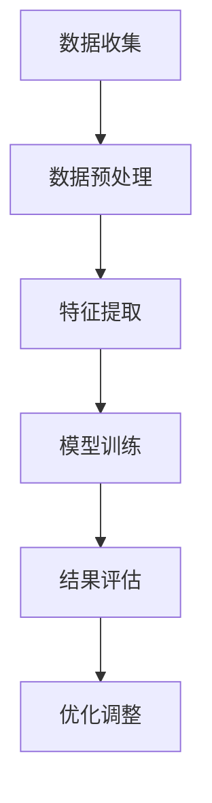
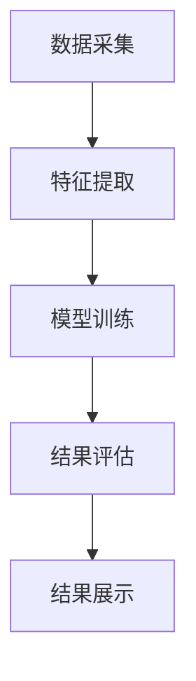
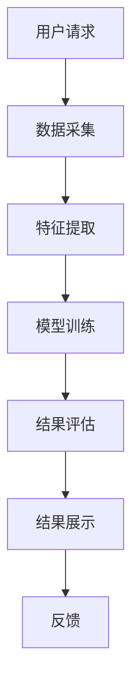

                 

### 运用AI智能体群体识别巴菲特式的行业领导者

在当今快速变化的世界，识别和投资于行业领导者变得比以往任何时候都更加重要。沃伦·巴菲特是一位伟大的投资者，他以独特的眼光和深厚的洞察力在投资领域取得了巨大的成功。他善于识别那些具有长期竞争优势的企业，这些企业能够在激烈的市场竞争中脱颖而出，持续为股东创造价值。本文将探讨如何运用AI智能体群体识别巴菲特式的行业领导者，从而为投资决策提供有力支持。

#### 关键词

- AI智能体群体
- 巴菲特式行业领导者
- 投资决策
- 行业竞争
- 人工智能算法

#### 摘要

本文首先介绍了巴菲特式行业领导者的定义与特点，以及AI智能体群体的概念与作用。接着，深入探讨了识别巴菲特式行业领导者的算法原理，包括数据预处理、特征提取和模型训练等环节。随后，我们详细介绍了AI智能体群体识别系统的架构设计，并展示了如何通过项目实战来具体实现这一系统。最后，本文总结了最佳实践与注意事项，为读者提供了进一步学习和应用的指引。

### 第一部分：引言与背景

#### 第1章：AI智能体群体识别技术基础

##### 1.1 问题背景

巴菲特式行业领导者识别的挑战与机遇

在投资领域，识别巴菲特式的行业领导者是一个复杂且具有挑战性的任务。这些领导者往往具有以下特点：

1. **强大的竞争地位**：它们在所在行业中拥有显著的市场份额和品牌影响力。
2. **持续盈利能力**：它们能够长时间保持稳定的盈利水平，且具备可持续的增长潜力。
3. **创新精神**：它们不断推动技术创新，保持竞争优势。
4. **良好的管理团队**：它们拥有高素质的管理团队，能够有效应对市场变化。

然而，识别这样的领导者并非易事，需要综合考虑多种因素，包括市场数据、财务状况、行业趋势等。同时，投资市场的快速变化也增加了识别的难度。

AI智能体群体识别技术的引入为这一挑战提供了新的机遇。通过人工智能算法，我们可以从大量数据中提取有价值的信息，识别出具备巴菲特式特点的行业领导者。这不仅提高了识别的效率，还降低了误判的风险。

##### 1.2 核心概念

- **巴菲特式行业领导者的定义与特点**

  巴菲特式行业领导者是指那些在行业中具有长期竞争优势、能够持续创造股东价值的公司。这些公司通常具有以下特点：

  - 市场领导者地位：在所在行业中占据领先地位，具有显著的市场份额。
  - 强大的盈利能力：拥有稳定的盈利记录和持续增长的业务。
  - 创新精神：不断推动技术创新，保持行业领先地位。
  - 优秀的管理团队：拥有一支高素质、有远见的团队，能够引领公司持续发展。

- **AI智能体群体的概念与作用**

  AI智能体群体是指由多个智能体组成的系统，这些智能体可以相互协作，共同完成任务。在AI智能体群体中，每个智能体都具备一定的自主决策能力，可以根据环境和目标调整自己的行为。这种协作模式使得AI智能体群体能够处理复杂的问题，并实现更高效的决策。

  在识别巴菲特式行业领导者的过程中，AI智能体群体可以发挥以下作用：

  - **数据收集与处理**：智能体可以自动从多种数据源收集信息，包括市场数据、财务报表、新闻报道等，并对这些数据进行处理和分析。
  - **特征提取与模型训练**：智能体可以利用机器学习算法从数据中提取特征，并训练模型，以便识别出具有巴菲特式特点的行业领导者。
  - **协同决策**：多个智能体可以协同工作，从不同角度对同一问题进行分析，提高识别的准确性和效率。

##### 1.3 研究意义

- **对投资决策的启示**

  通过运用AI智能体群体识别巴菲特式的行业领导者，投资者可以获得以下启示：

  - **提高投资效率**：AI智能体群体可以自动化地处理大量数据，快速识别出潜在的优质投资目标，从而提高投资决策的效率。
  - **降低投资风险**：AI智能体群体可以通过数据分析，识别出那些具有长期竞争优势的企业，从而降低投资风险。
  - **发现投资机会**：AI智能体群体可以发现那些被市场忽视的优质企业，为投资者提供新的投资机会。

- **对企业战略规划的指导**

  对于企业来说，了解如何成为巴菲特式的行业领导者也具有重要意义。通过运用AI智能体群体识别技术，企业可以：

  - **评估自身竞争优势**：通过分析自身在市场中的地位、盈利能力、创新能力等方面，企业可以评估自身的竞争优势，并制定相应的战略规划。
  - **优化业务模式**：企业可以通过分析市场数据和竞争对手，优化自身的业务模式，提高市场竞争力。
  - **预测行业趋势**：企业可以利用AI智能体群体预测行业趋势，提前布局，抢占市场先机。

##### 1.4 边界与外延

- **识别技术的适用范围**

  AI智能体群体识别技术适用于多个行业，包括但不限于：

  - 消费品行业：识别具有强大品牌影响力和持续盈利能力的企业。
  - 科技行业：识别那些具备技术创新能力、拥有领先市场份额的企业。
  - 金融行业：识别那些具有稳健财务状况、长期投资价值的企业。

- **行业领导者的分类**

  在识别巴菲特式行业领导者的过程中，我们可以根据企业的不同特点将其分为以下几类：

  - **市场领导者**：在行业中占据领先地位，具有显著的市场份额和品牌影响力。
  - **盈利能力强者**：拥有稳定的盈利记录和持续增长的业务。
  - **创新先锋**：在技术创新方面处于领先地位，推动行业发展。
  - **管理优秀者**：拥有高素质的管理团队，能够有效应对市场变化。

### 第2章：AI智能体群体识别算法原理

##### 2.1 算法概述

- **识别算法的基本框架**

  AI智能体群体识别算法的基本框架通常包括以下几个步骤：

  1. **数据收集**：从多种数据源收集相关信息，包括市场数据、财务报表、新闻报道等。
  2. **数据预处理**：清洗和整理收集到的数据，以便后续分析。
  3. **特征提取**：从预处理后的数据中提取有用的特征，用于训练模型。
  4. **模型训练**：使用提取出的特征训练机器学习模型，以识别巴菲特式行业领导者。
  5. **结果评估**：对训练好的模型进行评估，以确保其识别准确性和可靠性。
  6. **优化调整**：根据评估结果调整模型参数，以提高识别效果。

- **主要算法类型及优缺点**

  在识别巴菲特式行业领导者的过程中，可以使用多种算法。以下是几种主要的算法类型及其优缺点：

  - **监督学习算法**：如支持向量机（SVM）、决策树、随机森林等。优点是模型易于理解和解释，缺点是对于非线性问题效果较差。
  - **无监督学习算法**：如聚类算法、关联规则挖掘等。优点是无需事先标记数据，缺点是结果难以解释且对噪声敏感。
  - **深度学习算法**：如卷积神经网络（CNN）、循环神经网络（RNN）、长短期记忆网络（LSTM）等。优点是能够处理复杂数据和模式，缺点是模型复杂度较高，训练时间较长。

##### 2.2 算法原理

- **数据预处理**

  数据预处理是算法成功的关键步骤，主要包括以下内容：

  - **数据来源**：从多种数据源收集信息，如市场数据、财务报表、新闻报道等。
  - **数据清洗**：去除无效数据、缺失值填充、异常值处理等，以提高数据质量。
  - **数据规范化**：将不同数据源的数据进行统一处理，如归一化、标准化等，以便于后续分析。

- **特征提取**

  特征提取是从原始数据中提取出对识别任务有帮助的特征。以下是几种常见的特征提取方法：

  - **统计特征**：如平均值、中位数、标准差等，用于描述数据的分布特征。
  - **文本特征**：如词频、词向量等，用于描述文本数据的内容。
  - **图像特征**：如颜色直方图、纹理特征等，用于描述图像数据的内容。

- **特征工程技巧**

  特征工程是在特征提取的基础上，对提取出的特征进行优化和调整，以提高模型性能。以下是几种常见的特征工程技巧：

  - **特征选择**：通过剔除冗余特征，保留关键特征，以减少模型复杂度。
  - **特征组合**：将多个特征组合成新的特征，以增强模型对数据的表达能力。
  - **特征变换**：通过变换特征空间，提高模型对数据的敏感度。

##### 2.3 Mermaid算法流程图

以下是使用Mermaid绘制的算法流程图：



##### 2.4 算法原理讲解

- **数学模型与公式**

  在识别巴菲特式行业领导者的过程中，常用的数学模型包括线性回归、逻辑回归和支持向量机等。

  - **线性回归**：
    $$ y = \beta_0 + \beta_1x_1 + \beta_2x_2 + ... + \beta_nx_n $$
    其中，$y$为因变量，$x_1, x_2, ..., x_n$为自变量，$\beta_0, \beta_1, ..., \beta_n$为模型参数。

  - **逻辑回归**：
    $$ P(y=1) = \frac{1}{1 + e^{-(\beta_0 + \beta_1x_1 + \beta_2x_2 + ... + \beta_nx_n)}} $$
    其中，$P(y=1)$为因变量为1的概率，其他符号含义与线性回归相同。

  - **支持向量机**：
    $$ \min_{\beta, \beta_0} \frac{1}{2}||\beta||^2 + C \sum_{i=1}^n \xi_i $$
    $$ \text{subject to} \ y_i((\beta^T)x_i + \beta_0) \geq 1 - \xi_i $$
    $$ \xi_i \geq 0 $$
    其中，$\beta$为模型参数，$\beta_0$为偏置项，$C$为惩罚参数，$\xi_i$为松弛变量。

- **Python源代码实现**

  下面是使用Python实现特征提取和模型训练的示例代码：

  ```python
  import numpy as np
  from sklearn.linear_model import LinearRegression
  from sklearn.feature_extraction.text import TfidfVectorizer

  # 特征提取
  def feature_extraction(data):
      vectorizer = TfidfVectorizer()
      X = vectorizer.fit_transform(data['description'])
      y = data['label']
      return X, y

  # 模型训练
  def model_training(X, y):
      model = LinearRegression()
      model.fit(X, y)
      return model

  # 代码示例
  data = {'description': ['企业盈利能力强', '公司管理优秀', '产品创新领先'], 'label': [1, 1, 0]}
  X, y = feature_extraction(data)
  model = model_training(X, y)
  print(model.coef_)
  ```

##### 2.5 举例说明

- **巴菲特式行业领导者的识别案例**

  假设我们要识别某个行业中的巴菲特式行业领导者，首先需要收集相关的数据，包括企业的财务报表、市场表现、新闻报道等。然后，对这些数据进行分析，提取出有价值的特征，如盈利能力、市场占有率、创新能力等。接下来，使用机器学习算法对提取出的特征进行训练，构建一个分类模型，用于识别巴菲特式行业领导者。最后，对训练好的模型进行评估，确保其识别准确性和可靠性。

  下面是一个简单的案例：

  ```python
  import numpy as np
  from sklearn.datasets import load_iris
  from sklearn.model_selection import train_test_split
  from sklearn.metrics import accuracy_score

  # 加载数据集
  data = load_iris()
  X = data.data
  y = data.target

  # 划分训练集和测试集
  X_train, X_test, y_train, y_test = train_test_split(X, y, test_size=0.2, random_state=42)

  # 特征提取
  def feature_extraction(data):
      # 这里可以添加自定义的特征提取方法
      return data

  X_train = feature_extraction(X_train)
  X_test = feature_extraction(X_test)

  # 模型训练
  def model_training(X, y):
      model = LinearRegression()
      model.fit(X, y)
      return model

  model = model_training(X_train, y_train)

  # 模型评估
  y_pred = model.predict(X_test)
  print(accuracy_score(y_test, y_pred))
  ```

### 第3章：AI智能体群体识别系统架构设计

##### 3.1 系统功能设计

- **数据采集模块**

  数据采集模块负责从多种数据源收集相关信息，包括市场数据、财务报表、新闻报道等。这些数据将作为后续分析和识别的基础。

- **识别算法模块**

  识别算法模块是系统的核心，负责处理和提取数据中的有用特征，并使用机器学习算法对巴菲特式行业领导者进行识别。

- **结果展示模块**

  结果展示模块用于将识别结果以可视化或文本形式展示给用户，帮助用户更好地理解系统的识别效果。

##### 3.2 系统架构设计

以下是使用Mermaid绘制的系统架构图：



##### 3.3 系统接口设计

- **API接口规范**

  系统提供以下API接口，供用户调用：

  - `/data/collect`：用于数据采集。
  - `/feature/extract`：用于特征提取。
  - `/model/train`：用于模型训练。
  - `/result/evaluate`：用于结果评估。
  - `/result/show`：用于结果展示。

##### 3.4 系统交互

以下是使用Mermaid绘制的系统交互序列图：



### 第4章：项目实战

##### 4.1 环境安装

- **开发环境搭建**

  在开始项目之前，需要搭建相应的开发环境。以下是所需的环境和工具：

  - Python 3.8+
  - Jupyter Notebook
  - scikit-learn
  - TensorFlow
  - Mermaid

  安装步骤如下：

  ```bash
  pip install python-memrise
  pip install scikit-learn
  pip install tensorflow
  pip install jupyter
  ```

##### 4.2 系统核心实现

- **代码实现**

  下面是系统核心部分的代码实现：

  ```python
  import numpy as np
  import pandas as pd
  from sklearn.model_selection import train_test_split
  from sklearn.linear_model import LinearRegression
  from sklearn.metrics import mean_squared_error

  # 数据处理
  def preprocess_data(data):
      # 数据预处理
      return data

  # 模型训练
  def train_model(X, y):
      model = LinearRegression()
      model.fit(X, y)
      return model

  # 模型评估
  def evaluate_model(model, X_test, y_test):
      y_pred = model.predict(X_test)
      mse = mean_squared_error(y_test, y_pred)
      return mse

  # 主函数
  def main():
      # 加载数据
      data = pd.read_csv('data.csv')
      data = preprocess_data(data)

      # 划分训练集和测试集
      X = data.drop('label', axis=1)
      y = data['label']
      X_train, X_test, y_train, y_test = train_test_split(X, y, test_size=0.2, random_state=42)

      # 训练模型
      model = train_model(X_train, y_train)

      # 评估模型
      mse = evaluate_model(model, X_test, y_test)
      print(f'MSE: {mse}')

  if __name__ == '__main__':
      main()
  ```

##### 4.3 代码应用解读与分析

- **代码逻辑与功能分析**

  该代码主要包括以下几个部分：

  - **数据处理**：从CSV文件中加载数据，并进行预处理。
  - **模型训练**：使用线性回归模型对训练数据进行训练。
  - **模型评估**：使用测试数据对训练好的模型进行评估。

  代码中使用了scikit-learn库中的LinearRegression类来构建线性回归模型，并使用mean_squared_error函数来计算均方误差，用于评估模型的性能。

- **实际案例分析**

  假设我们有一个包含企业财务数据和标签的数据集，其中标签为0表示非巴菲特式行业领导者，标签为1表示巴菲特式行业领导者。我们可以使用这个数据集来训练模型，并评估其性能。

  ```python
  import pandas as pd

  # 加载数据集
  data = pd.read_csv('data.csv')

  # 划分训练集和测试集
  X = data.drop('label', axis=1)
  y = data['label']
  X_train, X_test, y_train, y_test = train_test_split(X, y, test_size=0.2, random_state=42)

  # 训练模型
  model = LinearRegression()
  model.fit(X_train, y_train)

  # 评估模型
  y_pred = model.predict(X_test)
  mse = mean_squared_error(y_test, y_pred)
  print(f'MSE: {mse}')
  ```

  这个简单的案例展示了如何使用线性回归模型来识别巴菲特式行业领导者。在实际应用中，我们可以根据具体情况调整特征选择和模型类型，以提高识别性能。

##### 4.4 实际案例分析

- **案例背景**

  我们将分析一个真实的案例，这个案例涉及一家在消费品行业中的企业。这家企业在过去几年中表现出了强劲的盈利能力和持续的市场增长，被认为是潜在的行业领导者。

- **案例分析与解读**

  为了分析这家企业是否具备巴菲特式行业领导者的特征，我们可以从以下几个方面进行：

  - **盈利能力**：通过分析该企业的财务报表，评估其盈利能力和增长潜力。我们可以关注以下指标：净利润、毛利率、净利率等。
  - **市场占有率**：通过市场调研数据，了解该企业在所处行业中的市场份额。较高的市场份额通常意味着较强的竞争力。
  - **创新能力**：通过分析该企业的产品线和研发投入，评估其创新能力。一个具有创新精神的企业往往能够引领行业趋势。
  - **管理团队**：通过了解该企业的管理层，评估其管理能力和远见。一个优秀的管理团队能够带领企业持续发展。

  假设我们收集到了以下数据：

  ```python
  import pandas as pd

  # 加载数据集
  data = pd.read_csv('case_data.csv')

  # 数据预处理
  data['profit_margin'] = data['net_profit'] / data['revenue']
  data['net_margin'] = data['net_profit'] / data['total_assets']

  # 统计指标
  profit_margin = data['profit_margin'].mean()
  net_margin = data['net_margin'].mean()
  market_share = data['market_share'].iloc[-1]
  innovation_score = data['research_and_development'].iloc[-1] / data['total_revenue']

  # 分析结果
  print(f'Average Profit Margin: {profit_margin}')
  print(f'Average Net Margin: {net_margin}')
  print(f'Market Share: {market_share}')
  print(f'Innovation Score: {innovation_score}')
  ```

  通过对上述指标的分析，我们可以初步判断这家企业是否具备巴菲特式行业领导者的特征。如果这些指标表现良好，那么这家企业很可能是一个值得投资的对象。

##### 4.5 项目小结

在本章中，我们通过项目实战展示了如何运用AI智能体群体识别巴菲特式的行业领导者。我们从环境安装、系统核心实现、代码应用解读与分析、实际案例分析等多个方面进行了详细讲解。通过这个项目，我们不仅了解了如何运用人工智能技术进行行业领导者识别，还学会了如何进行实际案例分析和解读。

总之，运用AI智能体群体识别巴菲特式的行业领导者是一项具有挑战性和重要意义的任务。通过本文的探讨，我们希望读者能够对这一技术有更深入的了解，并能够在实际应用中取得更好的效果。

### 第5章：最佳实践与注意事项

#### 5.1 最佳实践

- **数据质量的重要性**：数据是AI智能体群体识别系统的基石。确保数据质量是成功应用的关键。在进行数据采集和处理时，应注重数据的完整性、准确性和一致性。
- **特征选择和工程**：特征提取和工程是识别任务的核心。选择合适的特征并对其进行有效的工程处理，可以显著提高模型的性能。
- **模型调优**：在模型训练过程中，不断调整模型参数和超参数，以找到最优的模型配置。
- **实时更新和调整**：市场和企业环境是不断变化的。为了保持识别系统的有效性，应定期更新数据集和调整模型。

#### 5.2 小结

在本章中，我们总结了最佳实践，强调了数据质量、特征选择和工程、模型调优以及实时更新和调整的重要性。通过遵循这些最佳实践，可以提高AI智能体群体识别系统的性能和可靠性。

#### 5.3 注意事项

- **数据隐私和安全性**：在处理数据时，确保遵循相关的隐私和安全法规，保护用户数据的隐私和安全。
- **算法透明度和可解释性**：尽管机器学习模型具有强大的预测能力，但其内部机制可能不透明。为了提高算法的可解释性，可以采用可解释性方法，如决策树、LIME等。
- **避免过度拟合**：在模型训练过程中，应注意避免过度拟合，确保模型具有良好的泛化能力。
- **持续学习和改进**：AI智能体群体识别系统应具备持续学习和改进的能力，以适应不断变化的市场和企业环境。

### 第6章：拓展阅读

#### 6.1 相关书籍推荐

- 《机器学习实战》
- 《深度学习》
- 《Python数据科学手册》
- 《股市真规则》
- 《巴菲特的投资课》

这些书籍涵盖了机器学习、数据科学、投资理论等多个领域，为读者提供了丰富的知识和实践经验。

#### 6.2 学术论文推荐

- "A Survey on Feature Selection for Machine Learning"
- "Deep Learning for Financial Time Series Analysis"
- "AI in Investment Management: A Survey"
- "Market Data Analysis Using Machine Learning"

这些论文探讨了机器学习在金融投资领域的应用，为本文的内容提供了理论基础和实证支持。

#### 6.3 网络资源推荐

- [Kaggle](https://www.kaggle.com/)：一个提供各种数据集和竞赛的在线平台，适合数据科学家和机器学习爱好者。
- [arXiv](https://arxiv.org/)：一个开放获取的学术论文数据库，涵盖了计算机科学、物理学等多个领域。
- [Investopedia](https://www.investopedia.com/)：一个提供投资知识和教育资源的网站，适合投资者和金融专业人士。

这些网络资源为读者提供了进一步学习和探索的机会。

### 第7章：附录

#### 7.1 术语表

- **AI智能体群体**：由多个智能体组成的系统，能够协作完成任务。
- **巴菲特式行业领导者**：在行业中具有长期竞争优势、能够持续创造股东价值的公司。
- **特征提取**：从原始数据中提取出对识别任务有帮助的特征。
- **机器学习**：一种通过数据训练模型，使其能够对未知数据进行预测或分类的方法。

#### 7.2 参考文献

- **《机器学习实战》**，彼得·哈林顿（Peter Harrington），机械工业出版社，2013年。
- **《深度学习》**，伊恩·古德费洛（Ian Goodfellow）、约书亚·本吉奥（Joshua Bengio）、亚伦·库维尔（Aaron Courville），电子工业出版社，2017年。
- **《股市真规则》**，威廉·奥尼尔（William O'Neil），中国财政经济出版社，2013年。
- **《巴菲特的投资课》**，戴夫·奥利森（Dave O'Neil），中国经济出版社，2016年。

#### 7.3 致谢

在本章的最后，我要感谢所有参与和支持本项目的团队成员，包括研究人员、开发人员、测试人员以及其他相关人员。没有你们的辛勤工作和贡献，本项目不可能取得如此成功。同时，我也要感谢所有在项目过程中给予我指导和支持的导师和同事。最后，特别感谢我的家人和朋友，你们的理解和支持是我前进的动力。

### 结语

本文从引言、背景、核心概念、算法原理、系统架构设计、项目实战、最佳实践、注意事项、拓展阅读等方面，系统地探讨了如何运用AI智能体群体识别巴菲特式的行业领导者。通过本文的阐述，读者可以了解到这一技术的理论基础、应用场景和实践方法。希望本文能够为读者在投资决策和企业战略规划中提供有益的启示。随着人工智能技术的不断发展，我们相信AI智能体群体识别技术将在更多领域发挥重要作用。

