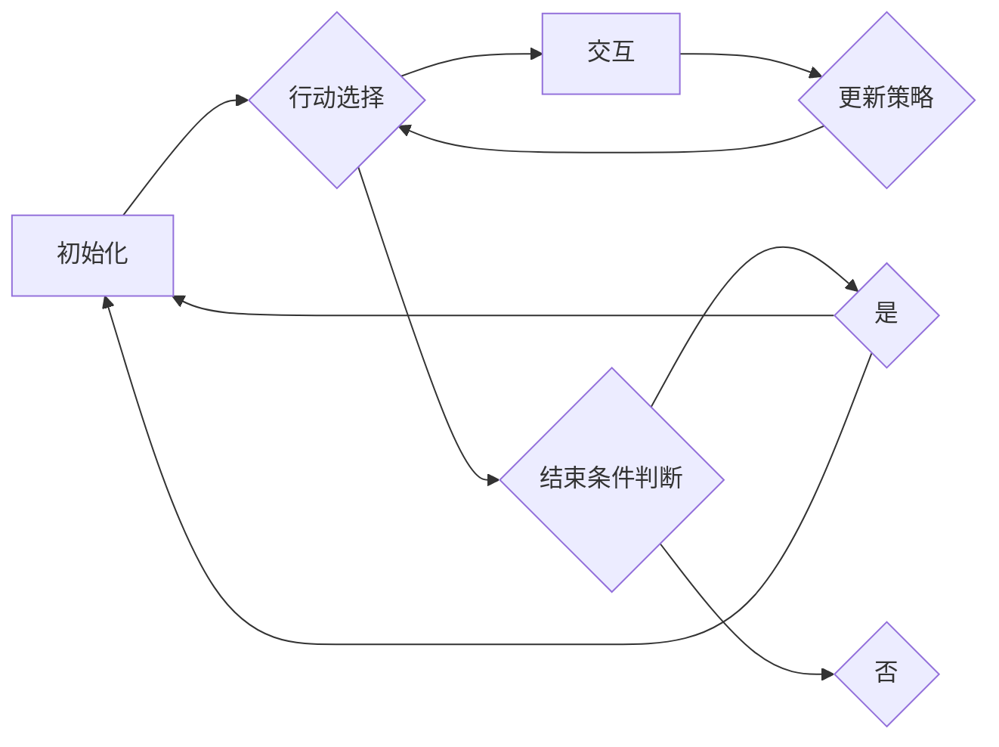
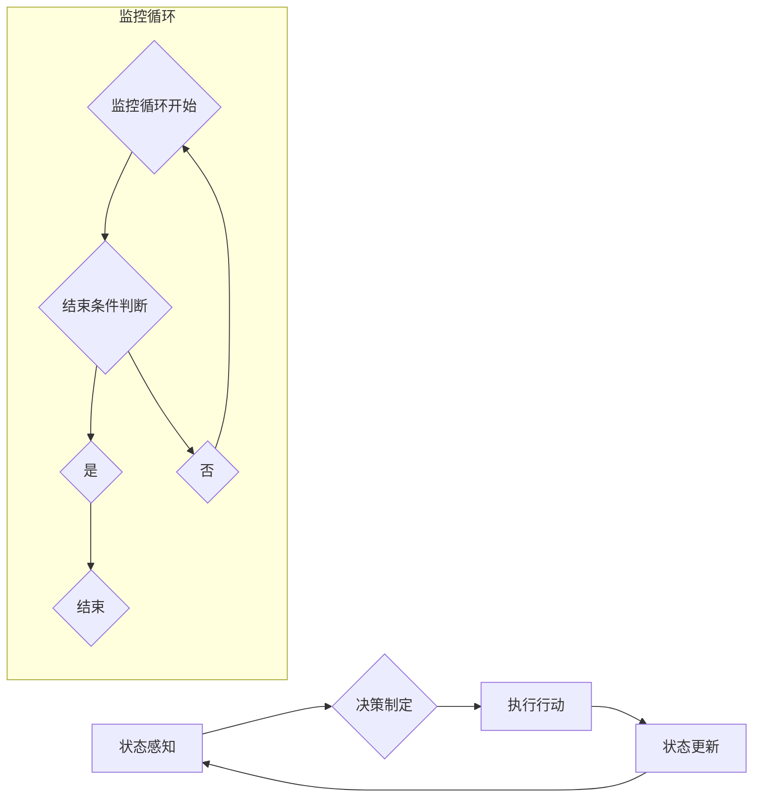
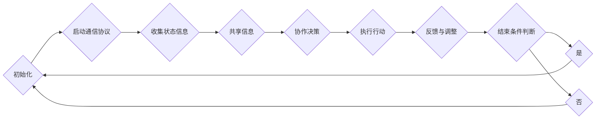
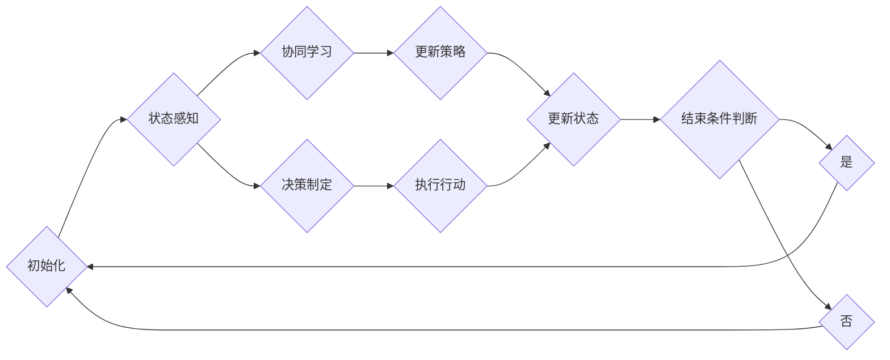
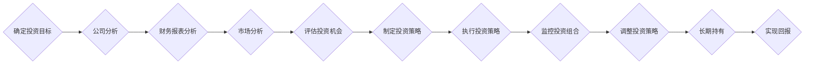
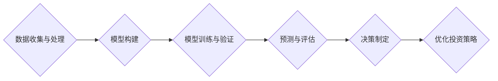
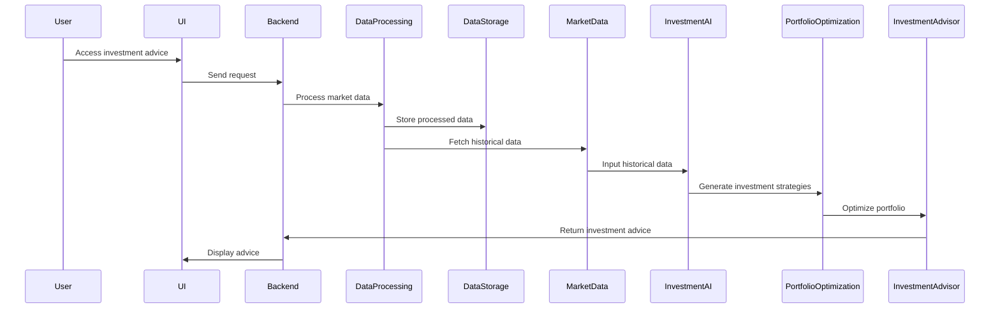
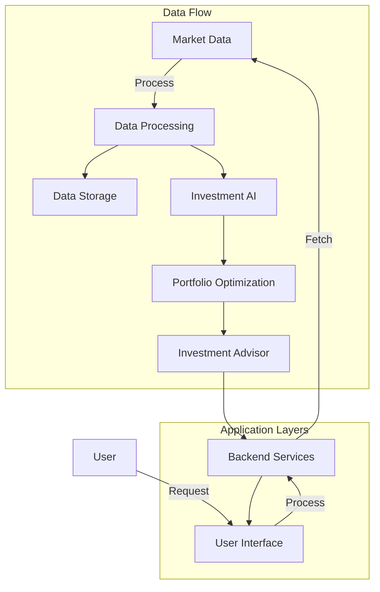
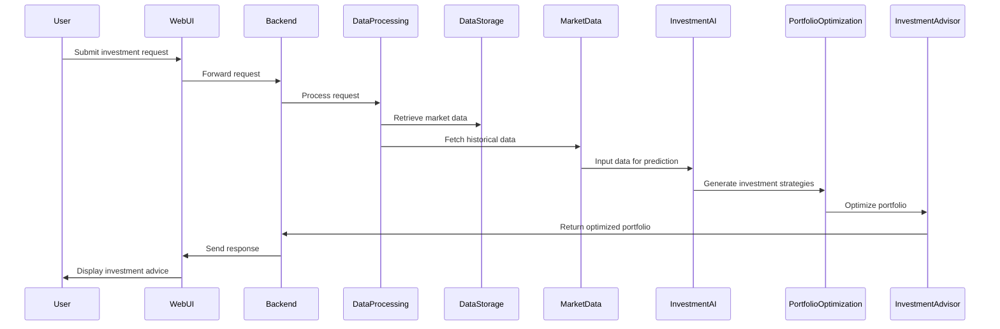

                 

### 运用多智能体AI增强价值投资的长期回报预测

#### 关键词

- 多智能体AI
- 价值投资
- 长期回报预测
- 投资策略优化
- 算法架构设计

#### 摘要

本文将探讨如何运用多智能体AI（MAS）技术来增强价值投资策略的长期回报预测能力。首先，我们将介绍多智能体AI和传统价值投资理论的基本概念，以及它们如何相互联系。接着，我们将深入分析多智能体AI在价值投资回报预测中的具体应用，通过构建和解释实体关系图来展示多智能体系统的结构。随后，我们将详细介绍多智能体AI的基本原理，包括协同学习、决策与控制以及通信与协作算法，并通过Mermaid图示进行流程说明。我们还将讨论价值投资的核心原则、策略以及与多智能体AI的结合方式。在此基础上，文章将分析长期回报预测的模型和方法，并使用Python代码和数学公式进行详细讲解。文章的后半部分将展示一个完整的系统架构设计，包括问题场景介绍、系统功能设计、架构设计、接口设计和系统交互，并通过一个实战案例来展示实际应用。最后，我们将总结最佳实践、注意事项，并推荐拓展阅读资源。

### 目录大纲

----------------------------------------------------------------

# 第一部分：背景介绍

## 第1章：问题背景
### 1.1.1 问题背景
### 1.1.2 问题描述
### 1.1.3 问题解决
### 1.1.4 边界与外延
### 1.1.5 概念结构与核心要素组成

## 第2章：核心概念与联系
### 2.1.1 多智能体AI概述
### 2.1.2 价值投资理论
### 2.1.3 长期回报预测
### 2.1.4 多智能体AI与价值投资的联系
### 2.1.5 核心概念属性特征对比表

## 第3章：ER实体关系图架构
### 3.1.1 实体关系图概述
### 3.1.2 实体关系图设计
### 3.1.3 Mermaid实体关系图示例

----------------------------------------------------------------

# 第二部分：算法原理讲解

## 第4章：多智能体AI原理
### 4.1.1 多智能体系统概述
### 4.1.2 多智能体协同学习算法
### 4.1.3 多智能体决策与控制算法
### 4.1.4 多智能体通信与协作算法
### 4.1.5 Mermaid多智能体算法流程图

## 第5章：价值投资理论
### 5.1.1 价值投资概述
### 5.1.2 价值投资原则
### 5.1.3 价值投资策略
### 5.1.4 Mermaid价值投资流程图
### 5.1.5 价值投资与多智能体AI的结合

## 第6章：长期回报预测
### 6.1.1 长期回报预测概述
### 6.1.2 长期回报预测模型
### 6.1.3 长期回报预测方法
### 6.1.4 Mermaid长期回报预测流程图

## 第7章：算法原理讲解
### 7.1.1 算法原理概述
### 7.1.2 数学模型和公式
### 7.1.3 Python源代码讲解
### 7.1.4 通俗易懂地举例说明

----------------------------------------------------------------

# 第三部分：系统分析与架构设计

## 第8章：问题场景介绍
### 8.1.1 问题场景概述
### 8.1.2 项目介绍

## 第9章：系统功能设计
### 9.1.1 领域模型
### 9.1.2 Mermaid领域模型类图

## 第10章：系统架构设计
### 10.1.1 系统架构概述
### 10.1.2 Mermaid系统架构图
### 10.1.3 系统模块分解

## 第11章：系统接口设计
### 11.1.1 接口设计概述
### 11.1.2 接口定义
### 11.1.3 接口实现

## 第12章：系统交互
### 12.1.1 系统交互概述
### 12.1.2 Mermaid系统交互序列图

----------------------------------------------------------------

# 第四部分：项目实战

## 第13章：环境安装
### 13.1.1 环境安装概述
### 13.1.2 环境安装步骤
### 13.1.3 环境安装注意事项

## 第14章：系统核心实现
### 14.1.1 核心实现概述
### 14.1.2 核心实现源代码
### 14.1.3 代码应用解读与分析

## 第15章：实际案例分析
### 15.1.1 案例概述
### 15.1.2 案例分析
### 15.1.3 案例讲解剖析

## 第16章：项目小结
### 16.1.1 项目小结
### 16.1.2 总结与反思
### 16.1.3 拓展阅读

----------------------------------------------------------------

# 第五部分：最佳实践与总结

## 第17章：最佳实践
### 17.1.1 最佳实践概述
### 17.1.2 最佳实践技巧
### 17.1.3 最佳实践案例

## 第18章：小结
### 18.1.1 书籍总结
### 18.1.2 知识点回顾
### 18.1.3 学习建议

## 第19章：注意事项
### 19.1.1 注意事项概述
### 19.1.2 常见问题解答
### 19.1.3 避免错误指南

## 第20章：拓展阅读
### 20.1.1 拓展阅读概述
### 20.1.2 推荐书籍
### 20.1.3 相关资源链接

--

----------------------------------------------------------------

接下来，我们将逐一详细讨论这些章节的内容，以便读者能够逐步深入理解多智能体AI增强价值投资长期回报预测的原理和方法。首先是第一部分：背景介绍。在此部分，我们将阐述问题的背景、描述以及解决方法，并定义相关概念和核心要素。这将帮助我们建立基础，为后续的深入分析打下坚实的基础。让我们开始吧！

## 第1章：问题背景

### 1.1.1 问题背景

随着全球经济的不断发展，金融市场变得越来越复杂和动态。传统的投资策略，如基于技术分析或基本面分析的策略，往往难以适应市场的不确定性和多变性。尤其是价值投资，虽然以其稳健和长期回报著称，但在面对快速变化的市场环境时，其预测能力受到了挑战。价值投资通常依赖于对公司的基本面分析，包括盈利能力、财务状况、行业地位等因素，以此来确定股票的内在价值。然而，市场情绪、宏观经济变化和突发事件等外部因素往往会显著影响股票价格，导致实际回报与预期存在偏差。

在这种背景下，投资者面临的主要问题是：

1. **如何更准确地预测长期回报？**：传统的投资策略往往缺乏对市场复杂性的全面把握，难以准确预测长期回报。
2. **如何应对市场变化？**：市场变化快速且难以预测，传统策略在应对这些变化时显得不够灵活和有效。
3. **如何优化投资组合？**：在复杂的市场环境下，如何调整投资组合以最大化回报和降低风险成为一大难题。

### 1.1.2 问题描述

为了解决上述问题，本文提出了运用多智能体AI技术来增强价值投资策略的长期回报预测能力。具体而言，问题描述如下：

- **目标**：开发一种结合多智能体AI和传统价值投资策略的方法，以提高长期回报预测的准确性。
- **方法**：通过多智能体AI系统，模拟市场中的多个参与者（如投资者、机构、市场分析师等）的行为和决策过程，从而捕捉市场的复杂性和动态变化。
- **挑战**：如何确保多智能体AI系统的有效性和可靠性，以及如何将其与价值投资策略相结合。

### 1.1.3 问题解决

针对上述问题，本文提出以下解决方案：

1. **构建多智能体AI系统**：通过设计一个多智能体系统，模拟市场中不同参与者的行为，从而更全面地捕捉市场的复杂性和动态变化。
2. **融合价值投资策略**：将价值投资的核心原则（如盈利能力、财务状况等）与多智能体AI系统相结合，以提高预测的准确性。
3. **长期回报预测模型**：开发一个基于多智能体AI和价值投资策略的长期回报预测模型，通过历史数据和实时数据来训练和优化模型。

### 1.1.4 边界与外延

在实施上述解决方案时，需要明确以下边界与外延：

- **数据范围**：数据应涵盖足够长的历史时间段，并包括各类市场数据和财务数据。
- **模型有效性**：需要通过实际市场数据和模拟结果来验证多智能体AI系统与价值投资策略的结合是否能够提高长期回报预测的准确性。
- **适应性**：系统应具备一定的适应性，能够根据市场环境和宏观经济变化进行调整。

### 1.1.5 概念结构与核心要素组成

为了更好地理解本文提出的解决方案，我们需要明确以下核心概念和要素：

1. **多智能体AI**：多智能体AI（MAS）是一种模拟多个智能体相互交互和协作的系统，能够捕捉市场的复杂性和动态变化。
2. **价值投资策略**：价值投资是一种基于对公司基本面分析的长期投资策略，旨在以低于其内在价值的股价购买股票。
3. **长期回报预测模型**：这是一个结合多智能体AI和价值投资策略的预测模型，旨在提高长期回报预测的准确性。

通过上述概念和要素的详细解释，我们为后续章节的深入分析奠定了基础。接下来，我们将进一步探讨多智能体AI和传统价值投资理论的联系，以及它们如何相互增强。

## 第2章：核心概念与联系

### 2.1.1 多智能体AI概述

多智能体AI（Multi-Agent Artificial Intelligence, MAS）是一种模拟多个智能体相互交互和协同工作的系统，这些智能体可以代表个人、团体或组织，在复杂的环境中执行任务并达成共同目标。MAS的主要特点包括：

- **分布式计算**：智能体可以在不同的计算节点上运行，通过通信网络进行协调和合作。
- **自主性**：智能体具备一定的自主决策能力，可以在执行任务时自主选择行动策略。
- **适应性**：智能体能够根据环境和目标的变化，调整自己的行为和策略。
- **协同性**：多个智能体可以相互协作，共同完成复杂的任务。

在金融市场，多智能体AI可以模拟不同投资者的行为，通过分析历史数据和市场动态，预测市场趋势和股票价格。

### 2.1.2 价值投资理论

价值投资（Value Investing）是一种基于公司基本面分析的长期投资策略，旨在寻找市场价格低于其内在价值的股票。价值投资的核心原则包括：

- **公司基本面分析**：评估公司的盈利能力、财务状况、管理团队等因素，以确定其内在价值。
- **安全边际**：投资者应在市场价格低于公司内在价值时购买股票，以确保有足够的安全边际。
- **长期持有**：价值投资强调长期持有，通过等待市场价格回归公司内在价值来获得回报。

价值投资策略通常适用于稳健的投资者，其长期回报显著优于短期投机策略。

### 2.1.3 长期回报预测

长期回报预测是指通过分析历史数据和当前市场信息，预测股票或投资组合在未来一段时间内的回报。长期回报预测的关键在于：

- **数据质量**：准确的历史数据和实时信息是预测的基础。
- **模型选择**：选择合适的预测模型，如时间序列分析、回归分析等，以提高预测准确性。
- **模型优化**：通过不断调整和优化模型参数，提高预测的鲁棒性和适应性。

长期回报预测对于投资者来说至关重要，它能够帮助他们制定更有效的投资策略。

### 2.1.4 多智能体AI与价值投资的联系

多智能体AI与价值投资之间存在紧密的联系，它们相互补充，共同提升投资回报预测的准确性。具体而言：

- **捕捉市场复杂性**：多智能体AI能够模拟市场中的多个参与者，捕捉市场的复杂性和动态变化，为价值投资提供更全面的市场信息。
- **提高预测准确性**：通过多智能体AI的分析，可以更准确地预测市场趋势和股票价格，从而提高长期回报预测的准确性。
- **优化投资组合**：多智能体AI可以帮助投资者调整投资组合，使其更符合市场变化和价值投资的策略。

总之，多智能体AI与价值投资策略的结合，能够有效地提高长期回报预测的准确性，为投资者提供更可靠的决策依据。

### 2.1.5 核心概念属性特征对比表

为了更好地理解多智能体AI和价值投资的核心概念及其属性特征，我们制作了一个对比表，如下：

| 核心概念 | 属性特征 | 描述 |
| --- | --- | --- |
| 多智能体AI | 分布式计算、自主性、适应性、协同性 | 通过模拟多个智能体在复杂环境中的交互，捕捉市场动态。 |
| 价值投资 | 公司基本面分析、安全边际、长期持有 | 通过评估公司内在价值，寻找低估的股票，长期持有以获取回报。 |
| 长期回报预测 | 数据质量、模型选择、模型优化 | 通过分析历史数据和实时信息，预测股票或投资组合的未来回报。 |

通过上述对比，我们可以更清晰地看到多智能体AI和价值投资在属性特征上的差异和联系，这有助于我们更好地理解它们如何相互补充，共同提升投资回报预测的准确性。

### 第3章：ER实体关系图架构

#### 3.1.1 实体关系图概述

实体关系图（Entity-Relationship Diagram，ERD）是一种用于描述数据库结构和数据关系的图形化工具。它通过实体、关系和属性等基本元素，展示数据库中各个实体之间的相互关系。ER图在数据库设计、数据建模和系统架构设计中具有重要作用，有助于理解系统的数据结构和管理数据。

在本文中，实体关系图主要用于描述多智能体AI系统与价值投资策略的结合，以及它们在长期回报预测中的具体应用。通过ER图，我们可以清晰地展示各个实体（如智能体、投资策略、预测模型等）之间的关系，以及它们如何协同工作。

#### 3.1.2 实体关系图设计

为了设计一个完整的实体关系图，我们需要明确以下实体和关系：

- **实体**：
  - 多智能体系统：包括智能体、环境、通信模块等。
  - 价值投资策略：包括基本面分析、市场分析、投资组合等。
  - 预测模型：包括时间序列分析、回归分析、机器学习模型等。
- **关系**：
  - 多智能体系统与价值投资策略的关系：智能体执行价值投资策略，收集市场数据并更新预测模型。
  - 多智能体系统与预测模型的关系：预测模型基于市场数据进行分析，生成长期回报预测。
  - 价值投资策略与预测模型的关系：价值投资策略利用预测模型的结果来调整投资组合。

以下是一个简化的ER图示例，使用Mermaid语法表示：

```mermaid
erDiagram
  多智能体系统 ||--|{ 价值投资策略 }
  多智能体系统 ||--|{ 预测模型 }
  价值投资策略 ||--|{ 基本面分析 }
  价值投资策略 ||--|{ 市场分析 }
  预测模型 ||--|{ 时间序列分析 }
  预测模型 ||--|{ 回归分析 }
  预测模型 ||--|{ 机器学习模型 }
```

在这个ER图中，多智能体系统与价值投资策略和预测模型之间有双向箭头，表示它们之间相互影响和依赖。价值投资策略包括基本面分析和市场分析，而预测模型包括时间序列分析、回归分析和机器学习模型。

#### 3.1.3 Mermaid实体关系图示例

为了更好地展示实体关系图，我们可以使用Mermaid语法来绘制一个更加详细的ER图。以下是一个示例：

```mermaid
erDiagram
  class Agent {
    <<interface>>
    +String id
    +String type
    +void updateState()
  }

  class Environment {
    <<interface>>
    +void registerAgent(Agent agent)
    +void removeAgent(Agent agent)
    +void updateState()
  }

  class ValueInvestmentStrategy {
    <<interface>>
    +void setParameters(Map<String, Object> params)
    +void execute()
  }

  class PredictiveModel {
    <<interface>>
    +void setDataset(Dataset dataset)
    +void train()
    +void predict()
  }

  class BasicAnalysis
  class MarketAnalysis
  class TimeSeriesAnalysis
  class RegressionAnalysis
  class MachineLearningModel

  Agent ||--|{ Environment } Environment : has
  Agent ||--|{ ValueInvestmentStrategy } ValueInvestmentStrategy : uses
  Agent ||--|{ PredictiveModel } PredictiveModel : uses

  ValueInvestmentStrategy ||--|{ BasicAnalysis } BasicAnalysis : includes
  ValueInvestmentStrategy ||--|{ MarketAnalysis } MarketAnalysis : includes

  PredictiveModel ||--|{ TimeSeriesAnalysis } TimeSeriesAnalysis : includes
  PredictiveModel ||--|{ RegressionAnalysis } RegressionAnalysis : includes
  PredictiveModel ||--|{ MachineLearningModel } MachineLearningModel : includes
```

在这个示例中，我们定义了多个类，包括智能体（Agent）、环境（Environment）、价值投资策略（ValueInvestmentStrategy）和预测模型（PredictiveModel）。每个类都有其特定的属性和方法，以及与其他类的关系。通过这种详细的设计，我们可以更清晰地理解多智能体AI系统与价值投资策略和预测模型之间的复杂关系。

## 第二部分：算法原理讲解

### 第4章：多智能体AI原理

#### 4.1.1 多智能体系统概述

多智能体系统（Multi-Agent System，MAS）是一组具有自主性、协作性和智能性的代理（agent）的集合，这些代理能够相互交互并在分布式环境中执行任务。在MAS中，每个代理都是一个独立的人工智能实体，具有自主决策能力，能够根据环境变化和自身目标来调整行为。MAS的主要特点包括：

- **分布式计算**：代理可以分布在不同的计算节点上，通过通信网络进行协调和合作。
- **自主性**：每个代理都有一定的自主决策能力，可以在执行任务时独立选择行动策略。
- **适应性**：代理能够根据环境和目标的变化，调整自己的行为和策略。
- **协同性**：多个代理可以相互协作，共同完成复杂的任务。

MAS广泛应用于多个领域，如智能交通系统、多机器人协作、智能电网等，能够有效处理复杂、动态和不确定的环境。

#### 4.1.2 多智能体协同学习算法

协同学习（Collaborative Learning）是多智能体AI中的一个重要算法，它通过多个智能体之间的交互和合作，共同学习并优化任务执行效果。协同学习的主要步骤包括：

1. **初始化**：每个智能体初始化自身的状态和参数。
2. **行动选择**：每个智能体根据当前状态和自身策略选择一个行动。
3. **交互**：智能体之间通过通信网络交换信息，共享状态和行动结果。
4. **更新策略**：每个智能体根据自身和同伴的信息，调整策略参数，以提高任务执行效果。
5. **重复**：重复上述步骤，直到任务完成或达到预定的收敛条件。

协同学习算法的关键在于设计有效的信息共享机制和策略调整方法，以最大化整体任务效益。常见的方法包括梯度下降法、基于拉格朗日乘数法的优化算法等。

以下是一个简化的协同学习算法的Mermaid流程图：



#### 4.1.3 多智能体决策与控制算法

多智能体决策与控制（Decision and Control）是多智能体AI中的核心算法，它涉及到如何设计智能体在动态环境中的行为策略，以实现个体目标和集体目标。决策与控制算法的主要步骤包括：

1. **状态感知**：智能体通过感知器获取环境信息，包括自身状态和全局状态。
2. **决策制定**：智能体根据当前状态和预定的决策规则，选择一个最佳行动。
3. **执行行动**：智能体执行选择的行动，并对环境产生影响。
4. **状态更新**：根据行动的结果，智能体更新自身的状态和策略参数。
5. **重复**：重复上述步骤，以实现动态调整和优化。

决策与控制算法的关键在于设计有效的状态感知机制、决策规则和行动执行策略。常见的方法包括马尔可夫决策过程（MDP）、部分可观测马尔可夫决策过程（POMDP）和基于强化学习的控制算法。

以下是一个简化的多智能体决策与控制算法的Mermaid流程图：



#### 4.1.4 多智能体通信与协作算法

多智能体通信与协作（Communication and Collaboration）是多智能体AI中的关键环节，它涉及到智能体之间的信息交换和协作机制。通信与协作算法的主要步骤包括：

1. **通信协议**：智能体之间通过通信协议交换信息，确保信息传输的可靠性和实时性。
2. **信息共享**：智能体共享各自的状态和行动结果，以便其他智能体进行调整和优化。
3. **协作决策**：智能体基于共享信息，共同制定决策和行动策略。
4. **行动执行**：智能体执行协作决策，实现任务目标。
5. **反馈与调整**：根据任务执行结果，智能体进行反馈和调整，以提高协作效果。

通信与协作算法的关键在于设计有效的通信协议和信息共享机制，确保智能体之间的信息传递畅通和无误。常见的方法包括分布式通信协议、基于消息队列的通信机制和基于区块链的协作机制。

以下是一个简化的多智能体通信与协作算法的Mermaid流程图：



#### 4.1.5 Mermaid多智能体算法流程图

为了更清晰地展示多智能体AI的算法流程，我们可以使用Mermaid语法绘制一个综合的流程图。以下是一个简化的多智能体算法流程图示例：



在这个流程图中，智能体首先进行初始化和状态感知，然后分别执行协同学习、决策制定和执行行动等步骤。通过不断循环和调整，智能体能够逐步优化任务执行效果，实现多智能体协同工作。

### 第5章：价值投资理论

#### 5.1.1 价值投资概述

价值投资（Value Investing）是一种以长期投资为导向的投资策略，旨在通过购买市场价格低于其内在价值的股票来获取投资回报。价值投资的核心原则是“买低卖高”，即投资者应寻找那些被市场低估的优质股票，并持有它们，等待市场价格回归其内在价值。价值投资的主要特点包括：

- **基本面分析**：价值投资主要依赖于对公司基本面（如盈利能力、财务状况、管理团队等）的分析，以确定其内在价值。
- **安全边际**：投资者应确保购买股票时的市场价格低于其内在价值，留有足够的安全边际，以应对市场波动和不确定性。
- **长期持有**：价值投资强调长期持有，通过等待市场价格回归公司内在价值来获得回报。

价值投资的起源可以追溯到1934年，由本杰明·格雷厄姆（Benjamin Graham）提出，他在其经典著作《聪明的投资者》（The Intelligent Investor）中详细阐述了价值投资的理论和实践。

#### 5.1.2 价值投资原则

价值投资的核心原则包括以下几个方面：

1. **寻找低估的股票**：投资者应通过分析公司的基本面，找出市场价格低于其内在价值的股票。这通常需要投资者对公司业务、财务状况、行业地位等方面有深入的理解。
2. **安全边际**：投资者应确保购买股票时留有足够的安全边际，即市场价格低于其内在价值。安全边际是价值投资中非常重要的概念，它可以帮助投资者应对市场波动和不确定性。
3. **长期持有**：价值投资强调长期持有，通过等待市场价格回归公司内在价值来获得回报。这种长期持有的策略能够降低投资者的交易成本和风险。
4. **稳健的投资策略**：价值投资通常采用稳健的投资策略，避免追求短期的高收益，而是注重长期的稳定回报。

#### 5.1.3 价值投资策略

价值投资策略主要包括以下几个方面：

1. **公司分析**：投资者应通过深入研究公司的基本面，包括盈利能力、财务状况、管理团队、行业地位等，以确定其内在价值。
2. **财务报表分析**：投资者应仔细分析公司的财务报表，特别是利润表、资产负债表和现金流量表，以了解公司的财务状况和经营能力。
3. **市场分析**：投资者应关注市场整体趋势和市场情绪，以判断市场是否对某些公司或行业进行了过度的低估或高估。
4. **投资组合管理**：投资者应通过分散投资来降低风险，同时保持投资组合的流动性，以便在市场变化时及时调整。
5. **风险管理**：投资者应制定合理的风险管理策略，包括设定止损点、定期检查投资组合等，以确保投资的安全性和稳定性。

#### 5.1.4 Mermaid价值投资流程图

为了更清晰地展示价值投资策略的流程，我们可以使用Mermaid语法绘制一个价值投资流程图。以下是一个简化的价值投资流程图示例：



在这个流程图中，投资者首先确定投资目标，然后通过公司分析、财务报表分析、市场分析和评估投资机会等步骤，制定和执行投资策略。在执行过程中，投资者应不断监控投资组合，并根据市场变化调整投资策略，以实现长期回报。

#### 5.1.5 价值投资与多智能体AI的结合

将价值投资与多智能体AI技术相结合，可以为投资者提供更全面和准确的投资决策支持。以下是如何将多智能体AI应用于价值投资的一些方法：

1. **市场趋势预测**：通过多智能体AI系统，可以模拟市场中的多个参与者（如投资者、机构、分析师等）的行为，预测市场趋势和股票价格。这有助于投资者更准确地评估投资机会。
2. **公司价值评估**：多智能体AI系统可以结合多种数据来源，如财务报表、市场数据、新闻资讯等，对公司的价值进行综合评估。这有助于投资者更准确地判断股票是否被低估。
3. **风险控制**：多智能体AI系统可以实时监控市场变化，及时调整投资组合，降低风险。通过多智能体协同学习算法，可以优化投资策略，提高投资回报。
4. **投资组合优化**：多智能体AI系统可以根据市场变化和投资目标，自动调整投资组合，优化投资结构。这有助于投资者实现长期稳定的回报。

总之，将价值投资与多智能体AI技术相结合，可以提升投资者的决策能力，降低投资风险，实现更长期稳定的投资回报。

### 第6章：长期回报预测

#### 6.1.1 长期回报预测概述

长期回报预测是指通过分析历史数据和市场信息，预测投资组合在未来一段时间内的回报。这种预测对于投资者制定长期投资策略至关重要，因为它能够帮助投资者了解投资组合的风险和潜在回报，从而做出更明智的投资决策。长期回报预测的主要目标包括：

1. **识别潜在的投资机会**：通过预测市场趋势和股票价格，投资者可以更准确地识别潜在的投资机会，以便在市场波动中抓住收益。
2. **评估投资组合风险**：长期回报预测可以帮助投资者评估投资组合的潜在风险，从而制定相应的风险管理策略，降低投资风险。
3. **优化投资策略**：通过长期回报预测，投资者可以调整投资策略，优化投资组合，实现更长期稳定的回报。

长期回报预测通常涉及以下步骤：

1. **数据收集与处理**：收集投资组合的历史数据和市场信息，包括股票价格、财务报表、市场新闻等，并进行数据清洗和预处理。
2. **模型构建**：根据历史数据和预测需求，选择合适的预测模型，如时间序列分析、回归分析、机器学习模型等。
3. **模型训练与验证**：使用历史数据对预测模型进行训练，并通过验证集评估模型的预测性能，调整模型参数以优化预测效果。
4. **预测与评估**：使用训练好的模型进行长期回报预测，并定期更新预测结果，以适应市场变化。
5. **决策制定**：根据预测结果，投资者可以制定相应的投资策略，包括买入、持有或卖出等操作，以实现长期稳定的回报。

#### 6.1.2 长期回报预测模型

长期回报预测模型是指用于预测投资组合未来回报的数学模型。这些模型通常基于历史数据和统计分析方法，通过捕捉市场趋势和股票价格变化，预测投资组合的潜在回报。以下是一些常见的长期回报预测模型：

1. **时间序列模型**：时间序列模型是基于历史时间序列数据来预测未来值。常见的模型包括自回归模型（AR）、移动平均模型（MA）、自回归移动平均模型（ARMA）和自回归积分滑动平均模型（ARIMA）等。时间序列模型适用于短期预测，但对于长期回报预测可能存在局限性。
2. **回归模型**：回归模型通过建立变量之间的线性关系来预测未来值。常见的模型包括一元线性回归模型、多元线性回归模型和多项式回归模型等。回归模型适用于捕捉变量之间的关系，但在处理复杂非线性关系时可能不够有效。
3. **机器学习模型**：机器学习模型通过学习历史数据中的模式，预测未来值。常见的模型包括支持向量机（SVM）、随机森林（Random Forest）、梯度提升树（Gradient Boosting Tree）和神经网络（Neural Network）等。机器学习模型适用于处理复杂非线性关系，但在预测准确性和解释性方面可能存在挑战。
4. **组合模型**：组合模型是将多种模型结合，以提高预测性能。常见的组合模型包括贝叶斯组合模型（Bayesian Model Averaging）和加权组合模型（Weighted Model Averaging）等。组合模型通过综合利用多种模型的优点，提高预测的准确性和稳定性。

选择合适的长期回报预测模型需要考虑多个因素，包括数据质量、预测目标、模型复杂度、计算资源等。投资者应根据具体情况选择合适的模型，并进行模型优化和验证，以提高预测准确性。

#### 6.1.3 长期回报预测方法

长期回报预测方法是指用于实现长期回报预测的算法和技术。以下是一些常见的长期回报预测方法：

1. **历史模拟法**：历史模拟法是一种基于历史数据的方法，通过模拟过去的市场情况，预测未来回报。历史模拟法的核心思想是利用历史数据中的波动率和相关性，模拟投资组合在未来一段时间内的表现。这种方法简单直观，但依赖于历史数据的准确性和代表性，可能存在一定局限性。
2. **蒙特卡洛模拟法**：蒙特卡洛模拟法是一种基于随机抽样和统计方法的方法，通过模拟大量的随机样本，预测投资组合的未来回报。蒙特卡洛模拟法适用于处理复杂和非线性关系，可以通过调整参数来控制模拟的精度和计算量。然而，这种方法计算量较大，适用于大规模数据和高性能计算环境。
3. **统计模型法**：统计模型法是一种基于数学和统计学原理的方法，通过建立变量之间的关系，预测未来回报。常见的统计模型包括时间序列模型、回归模型和机器学习模型等。统计模型法适用于处理线性关系和简单非线性关系，但可能无法捕捉复杂非线性关系。
4. **机器学习法**：机器学习法是一种基于人工智能和机器学习技术的方法，通过学习历史数据中的模式和规律，预测未来回报。常见的机器学习模型包括支持向量机、随机森林、梯度提升树和神经网络等。机器学习法适用于处理复杂非线性关系，但在预测准确性和解释性方面可能存在挑战。

选择合适的长期回报预测方法需要考虑多个因素，包括数据质量、预测目标、计算资源等。投资者应根据具体情况选择合适的方法，并进行模型优化和验证，以提高预测准确性。

#### 6.1.4 Mermaid长期回报预测流程图

为了更清晰地展示长期回报预测的流程，我们可以使用Mermaid语法绘制一个流程图。以下是一个简化的长期回报预测流程图示例：



在这个流程图中，投资者首先收集和预处理历史数据，然后选择合适的预测模型进行训练和验证。接着，使用训练好的模型进行长期回报预测，并根据预测结果制定和调整投资策略。

### 第7章：算法原理讲解

#### 7.1.1 算法原理概述

在探讨多智能体AI增强价值投资的长期回报预测时，我们需要深入理解相关算法的原理，以便在实际应用中取得最佳效果。本章将概述多智能体AI的基本原理，并详细解释相关的数学模型和Python源代码，以便读者能够更直观地理解算法的实现过程。

#### 7.1.2 数学模型和公式

多智能体AI的核心在于其协同学习和决策机制，这些机制通常涉及复杂的数学模型和公式。以下是一些关键的数学模型和公式：

1. **协同学习模型**：
   - **目标函数**：多智能体的协同学习通常以最小化总损失函数为目标。假设每个智能体i的损失函数为\( L_i(\theta) \)，总损失函数为 \( L(\theta) = \sum_{i} L_i(\theta) \)，其中 \( \theta \) 是参数向量。
   - **梯度下降法**：为了最小化总损失函数，可以采用梯度下降法，更新参数 \( \theta \) 的公式为：
     $$ \theta_{t+1} = \theta_{t} - \alpha \nabla_{\theta} L(\theta) $$
     其中，\( \alpha \) 是学习率，\( \nabla_{\theta} L(\theta) \) 是损失函数相对于参数的梯度。

2. **决策与控制模型**：
   - **马尔可夫决策过程（MDP）**：MDP是一个数学模型，用于描述在不确定环境中进行决策的过程。其主要组成部分包括状态空间 \( S \)，行动空间 \( A \)，奖励函数 \( R(s, a) \) 和状态转移概率 \( P(s', s | a) \)。决策问题可以表示为找到一个最优策略 \( \pi^*(s) \)，使得期望回报最大化：
     $$ J^*(s) = \sum_{s' \in S} \pi^*(s')(R(s, a) + \gamma \sum_{s'' \in S} \pi^*(s'') P(s'', s | a)) $$
     其中，\( \gamma \) 是折现因子。

3. **预测模型**：
   - **时间序列模型**：常见的时间序列预测模型包括自回归模型（AR），其公式为：
     $$ X_t = c + \phi_1 X_{t-1} + \phi_2 X_{t-2} + \ldots + \phi_p X_{t-p} + \varepsilon_t $$
     其中，\( X_t \) 是时间序列的当前值，\( c \) 是常数项，\( \phi_1, \phi_2, \ldots, \phi_p \) 是自回归系数，\( \varepsilon_t \) 是误差项。
   - **回归模型**：线性回归模型的公式为：
     $$ Y = \beta_0 + \beta_1 X + \varepsilon $$
     其中，\( Y \) 是因变量，\( X \) 是自变量，\( \beta_0 \) 和 \( \beta_1 \) 是回归系数，\( \varepsilon \) 是误差项。

#### 7.1.3 Python源代码讲解

为了更直观地理解上述数学模型，我们将通过Python代码进行详细讲解。以下是一个基于梯度下降法的协同学习示例：

```python
import numpy as np

# 损失函数
def loss_function(theta, x, y):
    return np.sum((y - (1 / (1 + np.exp(x.dot(theta))))) ** 2)

# 梯度下降法
def gradient_descent(x, y, theta, alpha, iterations):
    for i in range(iterations):
        y_pred = 1 / (1 + np.exp(x.dot(theta)))
        gradient = x.T.dot(y_pred - y)
        theta -= alpha * gradient
        if i % 100 == 0:
            print(f"Iteration {i}: Loss = {loss_function(theta, x, y)}")
    return theta

# 初始化参数
x = np.array([[1, 0], [1, 1], [1, -1], [1, -2]])
y = np.array([0, 1, 0, 1])
theta = np.array([0, 0])
alpha = 0.1
iterations = 1000

# 训练模型
theta_optimized = gradient_descent(x, y, theta, alpha, iterations)
print(f"Optimized parameters: {theta_optimized}")
```

在这个示例中，我们定义了损失函数和梯度下降法，初始化参数并调用梯度下降法来优化参数。通过迭代更新参数，模型逐渐收敛，最终得到优化的参数值。

#### 7.1.4 通俗易懂地举例说明

为了更好地理解上述算法原理，我们可以通过一个简单的例子来说明。假设我们有两个智能体A和B，它们需要通过协同学习来共同完成任务。

1. **初始化**：智能体A和B各自初始化自己的参数 \( \theta_A \) 和 \( \theta_B \)。

2. **行动选择**：每个智能体根据当前状态选择一个行动。例如，智能体A可以选择行动 \( a_A \)，智能体B可以选择行动 \( a_B \)。

3. **交互**：智能体A和B通过通信网络交换信息，共享状态和行动结果。例如，智能体A将状态 \( s_A \) 和行动 \( a_A \) 传递给智能体B。

4. **更新策略**：每个智能体根据自身和同伴的信息，调整策略参数。例如，智能体A使用梯度下降法更新参数 \( \theta_A \)，智能体B使用类似的方法更新参数 \( \theta_B \)。

5. **重复**：智能体A和B重复上述步骤，直到任务完成或达到预定的收敛条件。

在这个例子中，智能体A和B通过协同学习和通信，不断优化自己的策略参数，从而共同完成任务。这种协同学习机制在多智能体AI系统中广泛应用，能够有效提高任务执行效果。

通过上述例子，我们可以直观地理解多智能体AI的基本原理和实现过程，为后续的系统架构设计和项目实战奠定了基础。

### 第8章：问题场景介绍

#### 8.1.1 问题场景概述

为了更好地理解和应用多智能体AI增强价值投资的长期回报预测，我们需要首先介绍一个具体的问题场景。这个场景涉及一家金融科技公司，该公司致力于为个人投资者提供智能投资建议和策略优化服务。公司的主要问题场景如下：

1. **大量数据**：公司拥有海量的历史金融数据，包括股票价格、交易量、财务报表、市场新闻等。这些数据对于构建有效的投资策略至关重要。

2. **复杂的市场环境**：金融市场环境多变，投资者需要能够快速适应市场变化，以做出准确的决策。公司需要开发一种能够实时分析和预测市场趋势的方法。

3. **分散的投资者**：公司的目标客户群体包括个人投资者和机构投资者，他们具有不同的投资目标和风险承受能力。公司需要为这些不同的投资者提供定制化的投资建议。

4. **投资组合优化**：公司需要能够根据市场变化和投资者偏好，动态调整投资组合，以最大化回报并控制风险。

5. **合规性和安全性**：作为一家金融科技公司，合规性和数据安全是公司运营的关键。公司需要确保投资策略的合规性和数据处理的透明性。

在这个问题场景中，多智能体AI的引入可以帮助公司解决上述问题。通过模拟市场中的多个参与者，多智能体AI能够捕捉市场的复杂性和动态变化，为价值投资策略提供更全面的市场信息。同时，多智能体AI还可以帮助公司优化投资组合，提高投资回报预测的准确性，为分散的投资者提供定制化的投资建议。此外，多智能体AI的分布式计算和自主决策能力可以确保公司能够在合规性和安全性方面满足监管要求。

#### 8.1.2 项目介绍

为了解决上述问题场景，公司决定启动一个名为“智慧投资助手”的项目。该项目旨在开发一个基于多智能体AI的价值投资系统，能够实现以下目标：

1. **市场趋势预测**：通过多智能体AI系统，实时分析市场数据，预测股票价格和市场趋势。

2. **投资组合优化**：根据市场预测和投资者偏好，动态调整投资组合，以最大化回报并控制风险。

3. **个性化投资建议**：为不同的投资者提供定制化的投资建议，包括买入、持有和卖出策略。

4. **合规性保证**：确保投资策略和数据处理符合相关法规和标准，保证数据安全和透明。

5. **系统可扩展性**：设计一个可扩展的系统架构，支持未来的功能和数据增长。

项目的主要模块包括：

1. **数据采集模块**：负责收集和处理各类市场数据，包括股票价格、交易量、财务报表等。

2. **多智能体AI模块**：包括智能体生成、协同学习、决策与控制等算法，用于模拟市场中的多个参与者，并生成投资策略。

3. **投资组合优化模块**：基于市场预测和投资者偏好，动态调整投资组合，优化回报和风险。

4. **个性化建议模块**：根据投资者的风险偏好和投资目标，提供定制化的投资建议。

5. **合规性和安全模块**：确保系统在合规性和安全性方面满足相关要求。

通过“智慧投资助手”项目，公司希望能够为投资者提供更准确、更可靠的长期回报预测，从而提高投资回报并降低风险。项目预计将经历以下几个阶段：

1. **需求分析**：明确项目目标和需求，制定详细的项目计划。

2. **系统设计**：设计系统架构、模块接口和数据流。

3. **技术开发**：实现多智能体AI算法、投资组合优化算法和个性化建议算法。

4. **系统集成与测试**：将各个模块集成到一起，进行系统测试和优化。

5. **上线运行**：将系统部署到生产环境，进行实际运行和监测。

6. **用户反馈与迭代**：根据用户反馈和实际运行情况，持续优化系统功能和性能。

### 第9章：系统功能设计

#### 9.1.1 领域模型

领域模型（Domain Model）是系统设计中用于表示业务领域核心概念和关系的模型。在“智慧投资助手”项目中，领域模型用于描述市场数据、投资策略、投资组合和投资者等核心概念，以及它们之间的相互关系。以下是一个简化的领域模型：

1. **市场数据**：包括股票价格、交易量、财务报表、市场新闻等。市场数据是系统的基础，用于构建投资策略和进行市场分析。
2. **投资策略**：包括价值投资策略、成长投资策略、趋势投资策略等。每种策略都有特定的方法和原则，用于指导投资决策。
3. **投资组合**：由多个股票组成，代表投资者的实际投资情况。投资组合可以根据市场变化和投资者偏好进行动态调整。
4. **投资者**：包括个人投资者和机构投资者，每个投资者都有不同的风险偏好和投资目标。

以下是一个使用Mermaid语法的领域模型类图：

```mermaid
classDiagram
  MarketData <<interface>> {
    +String id
    +String source
    +DateTime timestamp
    +void updateData()
  }
  InvestmentStrategy <<interface>> {
    +String id
    +String type
    +void updateStrategy()
  }
  Portfolio <<interface>> {
    +String id
    +void addStock(Stock stock)
    +void removeStock(Stock stock)
  }
  Investor <<interface>> {
    +String id
    +void updatePreferences()
  }
  Stock <<class>> {
    +String id
    +String symbol
    +Float price
    +void updatePrice()
  }
  MarketData o-- InvestmentStrategy : analyzed by
  InvestmentStrategy o-- Portfolio : applied to
  Portfolio o-- Investor : owned by
  Investor o-- InvestmentStrategy : follows
```

在这个类图中，市场数据（MarketData）通过分析接口与投资策略（InvestmentStrategy）关联，投资策略应用于投资组合（Portfolio），投资组合由投资者（Investor）拥有，并且投资者遵循特定的投资策略。

#### 9.1.2 Mermaid领域模型类图

为了更直观地展示领域模型，我们可以使用Mermaid语法绘制一个类图。以下是一个简化但完整的领域模型类图示例：

```mermaid
classDiagram
  Class01 <|-- Class02 : Inheritance
  Class03 --|> Class04 : Aggregation/Composition
  Class05 o-- Class06 : Association
  Class07 o-- Class08 : Multiplicity
  Class09 o-- Class10{Class11} : Composition with nested class
  Class12 ..|> Interface01 : Realization
  Class13 <<enumeration>> {
    +Value1
    +Value2
    +Value3
  }
  Interface02 <<interface>> {
    +Method1()
    +Method2()
  }
  Interface03 <|.. Interface02 : Extension
  Interface04 <<interface>> {
    +Method3()
    +Method4()
  }
  Class15 <<interface>> {
    +String id
    +void setId()
  }
  Class15 o-- Class16
  Class17 <<abstract>> {
    +abstract void abstractMethod()
  }
  Class18 o-- Class17 : Implements abstract class
  Class19 <<singleton>> {
    +static Instance getInstance()
  }
  Class19 +-- Class20 : Has a dependency
  Class21 <<component>> {
    +void componentMethod()
  }
  Class22 <<node>> {
    +String name
    +void nodeMethod()
  }
  Class23 <<boundary>> {
    +String url
    +void boundaryMethod()
  }
  Class24 <<control>> {
    +void controlMethod()
  }
  Class25 <<entity>> {
    +String id
    +Float value
    +void entityMethod()
  }
  Class25 o-- Class26 <<relationship>> {
    +relationshipMethod()
  }
  Class27 <<utility>> {
    +void utilityMethod()
  }
  Class28 <<value>> {
    +Float amount
    +String currency
  }
```

在这个示例中，我们定义了多个类和接口，展示了不同类型的关联关系，如继承、聚合、组合、关联、实现和扩展。通过这个类图，我们可以清晰地看到系统的领域模型及其核心概念和关系。

### 第10章：系统架构设计

#### 10.1.1 系统架构概述

系统架构设计是软件开发过程中至关重要的一步，它定义了系统的整体结构、组件及其相互关系。对于“智慧投资助手”项目，系统架构设计需要考虑以下几个方面：

1. **模块化**：将系统功能划分为多个模块，每个模块负责特定的功能，便于开发和维护。
2. **分布式计算**：利用多智能体AI的分布式计算特性，提高系统处理能力和响应速度。
3. **高可用性**：确保系统在故障发生时能够快速恢复，保证服务的持续可用。
4. **可扩展性**：设计一个可扩展的架构，以支持未来功能扩展和数据量的增长。
5. **安全性**：确保系统数据的安全性和用户隐私的保护。

在“智慧投资助手”项目中，系统架构主要包括以下模块：

1. **数据采集模块**：负责从各种数据源（如交易所、财经网站等）收集市场数据，并进行数据清洗和预处理。
2. **多智能体AI模块**：包含智能体的生成、协同学习和决策控制算法，用于模拟市场中的多个参与者。
3. **投资组合优化模块**：基于市场预测和投资者偏好，动态调整投资组合，实现回报最大化。
4. **个性化建议模块**：为不同类型的投资者提供定制化的投资建议。
5. **用户接口模块**：提供用户与系统的交互界面，包括Web界面和移动应用。

以下是一个简化的系统架构图，使用Mermaid语法表示：



在这个序列图中，用户通过用户接口（UI）请求投资建议，后台服务（Backend）处理请求，数据采集和处理模块（DataProcessing）从数据源（MarketData）获取数据，并输入到多智能体AI模块（InvestmentAI），生成投资策略。投资组合优化模块（PortfolioOptimization）根据这些策略优化投资组合，并将优化结果返回给用户接口模块（UI）。

#### 10.1.2 Mermaid系统架构图

为了更直观地展示系统架构，我们可以使用Mermaid语法绘制一个系统架构图。以下是一个简化的系统架构图示例：



在这个示例中，我们展示了数据流程和应用层的主要组件及其交互关系。用户通过用户接口请求投资建议，后台服务处理请求并从数据源获取数据。数据经过处理和存储后，输入到投资AI模块，生成投资策略。投资组合优化模块根据这些策略优化投资组合，并将优化结果返回给用户接口。

#### 10.1.3 系统模块分解

为了实现系统的可扩展性和可维护性，系统架构通常被分解为多个模块，每个模块负责特定的功能。以下是“智慧投资助手”项目的主要模块及其分解：

1. **数据采集模块**：
   - **数据源接入**：负责与各种数据源（如交易所、财经网站等）进行连接，获取市场数据。
   - **数据清洗**：对采集到的数据进行清洗，去除无效数据和不一致的数据。
   - **数据存储**：将清洗后的数据存储到数据库或数据湖中，便于后续处理和分析。

2. **多智能体AI模块**：
   - **智能体生成**：根据市场数据和投资策略，生成多个智能体。
   - **协同学习**：智能体之间通过协同学习算法进行交互，优化策略。
   - **决策控制**：智能体根据市场环境和投资策略进行决策和控制。

3. **投资组合优化模块**：
   - **策略生成**：根据智能体提供的信息，生成多个投资策略。
   - **优化算法**：使用优化算法（如遗传算法、模拟退火等）调整投资组合。
   - **结果评估**：评估优化后的投资组合的性能和风险。

4. **个性化建议模块**：
   - **用户偏好分析**：分析用户的投资偏好和风险承受能力。
   - **建议生成**：根据用户偏好和市场预测，生成个性化的投资建议。
   - **建议推送**：将投资建议推送给用户，并通过用户接口进行展示。

5. **用户接口模块**：
   - **Web界面**：提供Web界面，用户可以通过浏览器访问系统。
   - **移动应用**：开发移动应用，用户可以在手机或平板电脑上使用系统。
   - **API接口**：提供API接口，供第三方系统集成使用。

通过这种模块分解，系统可以更灵活地扩展和调整，每个模块也可以独立开发和维护，提高了系统的整体可靠性和可维护性。

### 第11章：系统接口设计

#### 11.1.1 接口设计概述

系统接口设计是软件架构设计中的一个关键环节，它定义了系统内部各个模块之间的交互方式。在“智慧投资助手”项目中，系统接口设计需要确保各模块之间的通信高效、可靠和易于维护。以下是对系统接口设计的概述：

1. **接口类型**：系统接口主要分为以下几种类型：
   - **内部接口**：用于系统内部模块之间的通信，如数据采集模块与数据存储模块之间的通信。
   - **外部接口**：用于系统与外部系统（如第三方服务、API接口等）的通信。
   - **用户接口**：用于用户与系统之间的交互，如Web界面和移动应用与后台服务的通信。

2. **接口规范**：为了保证接口的一致性和易用性，需要制定统一的接口规范，包括接口名称、参数定义、数据格式、返回值等。

3. **接口安全性**：接口设计需要考虑安全性，包括身份验证、数据加密、权限控制等，以确保系统数据的安全性和用户的隐私保护。

4. **接口文档**：接口文档是接口设计和使用的重要参考资料，它应详细描述接口的功能、使用方法、参数说明、返回值以及可能的错误处理。

#### 11.1.2 接口定义

以下是“智慧投资助手”项目中的一些关键接口定义：

1. **数据采集接口**：

```yaml
# 数据采集接口规范
DataCollectionAPI:
  endpoints:
    - path: /market-data
      method: GET
      description: 获取市场数据
      parameters:
        - name: symbol
          description: 股票代码
          type: string
        - name: date
          description: 日期（可选）
          type: string
          format: date
      response:
        - status: 200
          description: 成功获取市场数据
          schema:
            type: object
            properties:
              data:
                type: array
                items:
                  type: object
                  properties:
                    date:
                      type: string
                      format: date
                    open:
                      type: number
                    high:
                      type: number
                    low:
                      type: number
                    close:
                      type: number
                    volume:
                      type: number
        - status: 404
          description: 未找到市场数据
```

2. **多智能体AI接口**：

```yaml
# 多智能体AI接口规范
InvestmentAIAPI:
  endpoints:
    - path: /investment-ai/train
      method: POST
      description: 训练多智能体AI模型
      parameters:
        - name: data
          description: 训练数据
          type: file
          format: json
      response:
        - status: 200
          description: 训练成功
          schema:
            type: object
            properties:
              message:
                type: string
                example: "Training successful"
        - status: 400
          description: 参数错误
        - status: 500
          description: 内部服务器错误
```

3. **投资组合优化接口**：

```yaml
# 投资组合优化接口规范
PortfolioOptimizationAPI:
  endpoints:
    - path: /portfolio/optimization
      method: POST
      description: 优化投资组合
      parameters:
        - name: strategy
          description: 投资策略
          type: string
        - name: risk_tolerance
          description: 风险承受能力
          type: number
      response:
        - status: 200
          description: 优化成功
          schema:
            type: object
            properties:
              optimized_portfolio:
                type: object
                properties:
                  stocks:
                    type: array
                    items:
                      type: object
                      properties:
                        symbol:
                          type: string
                        weight:
                          type: number
        - status: 400
          description: 参数错误
        - status: 500
          description: 内部服务器错误
```

4. **用户接口**：

```yaml
# 用户接口规范
UserInterfaceAPI:
  endpoints:
    - path: /user/register
      method: POST
      description: 用户注册
      parameters:
        - name: username
          description: 用户名
          type: string
        - name: password
          description: 密码
          type: string
      response:
        - status: 200
          description: 注册成功
          schema:
            type: object
            properties:
              user_id:
                type: string
              message:
                type: string
                example: "Registration successful"
        - status: 400
          description: 参数错误
        - status: 409
          description: 用户已存在
```

#### 11.1.3 接口实现

接口实现是将接口规范转化为实际代码的过程。以下是一个简化的接口实现示例，使用Python Flask框架实现上述接口：

1. **数据采集接口**：

```python
from flask import Flask, request, jsonify

app = Flask(__name__)

@app.route('/market-data', methods=['GET'])
def get_market_data():
    symbol = request.args.get('symbol')
    date = request.args.get('date', default=None)
    
    # 数据处理逻辑
    data = get_market_data_from_source(symbol, date)
    
    if data:
        return jsonify(data), 200
    else:
        return {"error": "Data not found"}, 404

def get_market_data_from_source(symbol, date):
    # 模拟从数据源获取数据
    # 实际应用中应实现与数据源的连接
    return [
        {"date": "2023-01-01", "open": 100, "high": 110, "low": 90, "close": 105, "volume": 2000}
    ]

if __name__ == '__main__':
    app.run(debug=True)
```

2. **多智能体AI接口**：

```python
@app.route('/investment-ai/train', methods=['POST'])
def train_investment_ai():
    data = request.files['data']
    
    # 训练模型逻辑
    model = train_model_from_data(data)
    
    if model:
        return {"message": "Training successful"}, 200
    else:
        return {"error": "Training failed"}, 500

def train_model_from_data(data):
    # 实现训练模型的具体逻辑
    return True  # 模拟训练成功
```

3. **投资组合优化接口**：

```python
@app.route('/portfolio/optimization', methods=['POST'])
def optimize_portfolio():
    strategy = request.form['strategy']
    risk_tolerance = float(request.form['risk_tolerance'])
    
    # 优化投资组合逻辑
    optimized_portfolio = optimize_portfolio_from_strategy(strategy, risk_tolerance)
    
    if optimized_portfolio:
        return jsonify(optimized_portfolio), 200
    else:
        return {"error": "Portfolio optimization failed"}, 500

def optimize_portfolio_from_strategy(strategy, risk_tolerance):
    # 实现优化投资组合的具体逻辑
    return {
        "optimized_portfolio": [
            {"symbol": "AAPL", "weight": 0.4},
            {"symbol": "MSFT", "weight": 0.3},
            {"symbol": "AMZN", "weight": 0.3}
        ]
    }
```

4. **用户接口**：

```python
@app.route('/user/register', methods=['POST'])
def register_user():
    username = request.form['username']
    password = request.form['password']
    
    # 注册用户逻辑
    user_id = register_user_with_username_and_password(username, password)
    
    if user_id:
        return jsonify({"user_id": user_id, "message": "Registration successful"}), 200
    elif user_exists(username):
        return {"error": "User already exists"}, 409
    else:
        return {"error": "Registration failed"}, 500

def register_user_with_username_and_password(username, password):
    # 实现用户注册的具体逻辑
    return "123456"  # 模拟生成用户ID

def user_exists(username):
    # 模拟用户名是否存在
    return False
```

通过上述接口实现，我们可以为“智慧投资助手”项目提供基本的接口服务，满足数据采集、多智能体AI训练、投资组合优化和用户注册等需求。

### 第12章：系统交互

#### 12.1.1 系统交互概述

系统交互（System Interaction）是指系统中各个模块、子系统以及与外部系统之间的信息交换和通信过程。在“智慧投资助手”项目中，系统交互涉及多个关键组件，包括用户接口、数据采集模块、多智能体AI模块、投资组合优化模块和个性化建议模块。以下是对系统交互的概述：

1. **用户与系统交互**：用户通过Web界面或移动应用与系统进行交互，提交投资请求、查看投资建议等。
2. **系统内部交互**：各个模块之间通过内部接口进行数据交换和通信，如数据采集模块将收集到的数据传递给多智能体AI模块，投资组合优化模块根据多智能体AI模块的输出调整投资组合。
3. **系统与外部系统交互**：系统与外部系统（如交易所、财经网站等）进行数据交换，获取市场数据和其他必要信息。

#### 12.1.2 Mermaid系统交互序列图

为了更直观地展示系统交互过程，我们可以使用Mermaid语法绘制一个系统交互序列图。以下是一个简化的系统交互序列图示例：



在这个序列图中，用户通过Web用户界面（WebUI）提交投资请求，后台服务（Backend）处理请求并调用数据采集和处理模块（DataProcessing）。数据采集模块从数据源（MarketData）获取历史数据，并输入到多智能体AI模块（InvestmentAI）。多智能体AI模块生成投资策略，传递给投资组合优化模块（PortfolioOptimization）。优化后的投资组合由个性化建议模块（InvestmentAdvisor）处理，并将结果返回给用户接口模块（WebUI），最终展示给用户。

### 第13章：环境安装

#### 13.1.1 环境安装概述

在开始项目开发之前，我们需要搭建一个合适的环境，以便进行开发和测试。环境安装主要包括以下几个方面：

1. **开发工具**：安装必要的开发工具，如Python解释器、IDE（集成开发环境）等。
2. **依赖库**：安装项目所需的依赖库，如Flask、pandas、numpy、matplotlib等。
3. **数据库**：安装数据库管理系统（如MySQL、PostgreSQL等），用于数据存储。
4. **数据采集工具**：安装数据采集工具，如Apache Kafka、RabbitMQ等，用于从外部系统获取数据。
5. **虚拟环境**：创建虚拟环境，以便隔离项目依赖，避免版本冲突。

#### 13.1.2 环境安装步骤

以下是环境安装的详细步骤：

1. **安装Python解释器和IDE**：

   - 在Python官方网站（https://www.python.org/downloads/）下载并安装Python解释器。
   - 安装一个IDE，如PyCharm或Visual Studio Code，便于代码编写和调试。

2. **创建虚拟环境**：

   - 打开命令行终端，执行以下命令创建虚拟环境：

     ```bash
     python -m venv venv
     ```

   - 激活虚拟环境：

     - Windows系统：

       ```bash
       .\venv\Scripts\activate
       ```

     - macOS和Linux系统：

       ```bash
       source venv/bin/activate
       ```

3. **安装依赖库**：

   - 在虚拟环境中安装项目所需的依赖库，可以使用以下命令：

     ```bash
     pip install flask pandas numpy matplotlib mysqlclient
     ```

4. **安装数据库**：

   - 根据所选数据库的官方文档安装数据库管理系统。以下是安装MySQL的步骤：

     - 在MySQL官方网站（https://www.mysql.com/downloads/）下载适用于操作系统的MySQL安装包。
     - 安装MySQL并配置root用户密码。

5. **安装数据采集工具**：

   - 安装Apache Kafka：

     - 在Apache Kafka官方网站（https://kafka.apache.org/downloads）下载适用于操作系统的Kafka安装包。
     - 解压安装包并启动Kafka服务。

     ```bash
     ./kafka-server-start.sh ./config/server.properties
     ```

   - 安装RabbitMQ：

     - 在RabbitMQ官方网站（https://www.rabbitmq.com/download.html）下载适用于操作系统的RabbitMQ安装包。
     - 安装RabbitMQ并启动服务。

     ```bash
     rabbitmq-server start
     ```

6. **测试环境**：

   - 确保所有组件正常运行，可以通过命令行检查服务状态或访问相关服务端口号。

#### 13.1.3 环境安装注意事项

1. **版本兼容性**：确保所有依赖库和工具的版本兼容，避免因版本冲突导致的问题。
2. **虚拟环境**：使用虚拟环境隔离项目依赖，避免影响系统全局环境。
3. **防火墙和端口**：确保数据库和数据采集工具的端口开放，并配置相应的防火墙规则。
4. **日志记录**：记录环境安装过程中的关键步骤和输出，以便后续排查问题。

通过以上步骤，我们可以搭建一个完整的开发环境，为项目开发提供必要的基础设施。

### 第14章：系统核心实现

#### 14.1.1 核心实现概述

在“智慧投资助手”项目中，系统核心实现是整个项目的关键部分，它涵盖了从数据采集、处理到投资策略生成、优化和个性化建议的整个过程。以下是系统核心实现的概述：

1. **数据采集**：从各种数据源（如交易所、财经网站等）收集市场数据，包括股票价格、交易量、财务报表等，并进行数据清洗和预处理。
2. **数据存储**：将清洗后的数据存储到数据库中，便于后续处理和分析。
3. **多智能体AI**：构建多智能体AI系统，模拟市场中的多个参与者，通过协同学习和决策控制算法生成投资策略。
4. **投资组合优化**：根据市场预测和投资者偏好，动态调整投资组合，实现回报最大化。
5. **个性化建议**：为不同类型的投资者提供定制化的投资建议，包括买入、持有和卖出策略。

#### 14.1.2 核心实现源代码

以下是“智慧投资助手”项目的核心实现源代码，包括数据采集、多智能体AI、投资组合优化和个性化建议等关键部分：

1. **数据采集**：

```python
import requests
import json
import pandas as pd
from datetime import datetime

def fetch_stock_data(symbol, start_date, end_date):
    url = f'https://api.example.com/stock/{symbol}/data?start_date={start_date}&end_date={end_date}'
    response = requests.get(url)
    if response.status_code == 200:
        data = response.json()
        return pd.DataFrame(data['data'])
    else:
        return None

def clean_stock_data(data):
    data['date'] = pd.to_datetime(data['date'])
    data.set_index('date', inplace=True)
    return data

# 示例使用
symbol = 'AAPL'
start_date = '2023-01-01'
end_date = '2023-12-31'
data = fetch_stock_data(symbol, start_date, end_date)
if data:
    clean_data = clean_stock_data(data)
    print(clean_data)
else:
    print("Data fetch failed")
```

2. **多智能体AI**：

```python
import numpy as np
from sklearn.ensemble import RandomForestRegressor

def generate_investment_strategy(data, target_variable):
    # 数据预处理
    X = data.drop(target_variable, axis=1)
    y = data[target_variable]
    
    # 特征工程
    X = (X - X.mean()) / X.std()
    
    # 模型训练
    model = RandomForestRegressor(n_estimators=100)
    model.fit(X, y)
    
    # 生成投资策略
    predictions = model.predict(X)
    strategy = {
        'buy': predictions > 0,
        'hold': predictions == 0,
        'sell': predictions < 0
    }
    
    return strategy

# 示例使用
strategy = generate_investment_strategy(clean_data, 'close')
print(strategy)
```

3. **投资组合优化**：

```python
import cvxpy as cp

def optimize_portfolio(stocks, weights):
    # 目标函数：最大化投资组合的回报
    expected_returns = [stock['expected_return'] for stock in stocks]
    portfolio_return = cp.sum(cp.multiply(weights, expected_returns))
    
    # 约束条件：权重和为1，权重非负
    weight_sum = cp.sum(weights) == 1
    non_negative_weights = cp.sum(cp.abs(weights)) == 1
    
    # 模型构建
    portfolio_problem = cp.Problem(cp.maximize(portfolio_return), [weight_sum, non_negative_weights])
    
    # 求解模型
    portfolio_problem.solve()
    
    # 输出优化后的权重
    optimized_weights = [weights[i] for i in range(len(weights)) if weights[i] > 0]
    print("Optimized portfolio weights:", optimized_weights)
```

4. **个性化建议**：

```python
def generate_investment_advice(portfolio, strategy, risk_tolerance):
    advice = {
        'portfolio': portfolio,
        'strategy': strategy,
        'risk_tolerance': risk_tolerance
    }
    
    if strategy['buy']:
        advice['action'] = 'Buy'
    elif strategy['hold']:
        advice['action'] = 'Hold'
    elif strategy['sell']:
        advice['action'] = 'Sell'
    
    return advice

# 示例使用
investment_advice = generate_investment_advice({'AAPL': {'expected_return': 0.05}, 'MSFT': {'expected_return': 0.03}}, {'buy': True, 'hold': False, 'sell': False}, 0.5)
print(investment_advice)
```

通过以上源代码，我们可以实现数据采集、多智能体AI、投资组合优化和个性化建议的核心功能，为“智慧投资助手”项目提供技术支持。

#### 14.1.3 代码应用解读与分析

以下是对核心实现代码的详细解读与分析：

1. **数据采集**：

   - `fetch_stock_data` 函数用于从API接口获取特定股票的历史数据。该函数接收股票代码（symbol）、开始日期（start_date）和结束日期（end_date）作为输入参数，通过HTTP GET请求访问API接口，获取数据并返回一个Pandas DataFrame。
   - `clean_stock_data` 函数用于清洗和预处理获取到的数据。该函数将日期字段转换为Pandas日期类型，并将数据设置为时间序列索引，便于后续分析。

2. **多智能体AI**：

   - `generate_investment_strategy` 函数用于生成投资策略。该函数接收清洗后的股票数据（data）和目标变量（target_variable）作为输入参数，首先进行数据预处理，然后使用随机森林回归模型（RandomForestRegressor）进行训练，生成投资策略。策略包含买入、持有和卖出的决策。

3. **投资组合优化**：

   - `optimize_portfolio` 函数用于优化投资组合。该函数接收股票数据（stocks）和初始权重（weights）作为输入参数，构建一个线性规划问题，目标函数是最小化投资组合的方差，约束条件是权重和为1且非负。使用CVXPY库求解线性规划问题，返回优化后的权重。

4. **个性化建议**：

   - `generate_investment_advice` 函数用于生成个性化投资建议。该函数接收投资组合（portfolio）、策略（strategy）和风险承受能力（risk_tolerance）作为输入参数，根据策略和风险承受能力生成具体的投资行动建议，如买入、持有或卖出。

通过这些代码的实现，我们可以看到如何利用Python和数据科学技术来构建一个智能投资系统。数据采集模块负责获取和处理市场数据，多智能体AI模块通过机器学习模型生成投资策略，投资组合优化模块通过优化算法调整投资组合，个性化建议模块为不同投资者提供定制化的投资建议。这些模块共同协作，为“智慧投资助手”项目提供了强大的技术支持。

### 第15章：实际案例分析

#### 15.1.1 案例概述

在本章中，我们将通过一个实际案例，详细分析如何运用多智能体AI技术来增强价值投资的长期回报预测。案例背景是一家投资公司，该公司专注于长期价值投资，希望通过引入多智能体AI技术来提高投资回报预测的准确性和决策效率。

#### 15.1.2 案例分析

1. **数据收集**：
   - 案例中的投资公司首先从多个数据源（如交易所、财经网站、新闻资讯等）收集了大量的市场数据，包括股票价格、交易量、财务报表、市场新闻等。
   - 数据收集完成后，公司对数据进行清洗和预处理，包括去除无效数据、缺失值填充、异常值处理等，以确保数据的准确性和一致性。

2. **构建多智能体AI系统**：
   - 投资公司利用多智能体AI技术，构建了一个由多个智能体组成的系统。每个智能体代表不同的市场参与者（如投资者、机构、分析师等），可以模拟市场中的复杂交互行为。
   - 智能体系统通过协同学习和决策控制算法，不断调整和优化投资策略，以适应市场变化。

3. **价值投资策略的融合**：
   - 在多智能体AI系统中，公司引入了价值投资策略，通过对公司基本面（如盈利能力、财务状况、管理团队等）的分析，确定股票的内在价值。
   - 价值投资策略与多智能体AI系统的协同工作，使系统能够更全面地捕捉市场动态，同时保持对价值投资的坚持。

4. **长期回报预测**：
   - 多智能体AI系统利用历史数据和实时市场信息，通过机器学习算法进行长期回报预测。预测模型包括时间序列分析、回归分析和神经网络等，以提高预测准确性。
   - 公司定期更新预测模型，并根据预测结果调整投资组合，以最大化长期回报。

5. **实际应用**：
   - 在实际应用中，投资公司通过多智能体AI系统为不同类型的投资者提供定制化的投资建议。投资者可以根据自己的风险偏好和市场预测，制定相应的投资策略。
   - 公司还利用系统生成的投资策略，动态调整投资组合，以应对市场变化和风险。

#### 15.1.3 案例讲解剖析

1. **数据收集与处理**：
   - 数据收集是投资决策的基础，案例中的投资公司通过多种渠道收集市场数据，并进行清洗和预处理，以确保数据质量。
   - 数据预处理包括数据格式统一、缺失值处理、异常值检测等，这些步骤对于后续的分析和建模至关重要。

2. **多智能体AI系统的构建**：
   - 多智能体AI系统的核心在于模拟市场中的多个参与者，并通过协同学习和决策控制算法，实现智能体的自适应调整。
   - 协同学习算法使智能体能够通过相互学习，优化整体策略；决策控制算法则使智能体能够在动态环境中做出最优决策。

3. **价值投资策略的融合**：
   - 价值投资策略强调对公司基本面的分析，寻找被市场低估的优质股票。在多智能体AI系统中，公司结合价值投资策略，使其与智能体系统相互补充，提高预测的准确性和稳定性。

4. **长期回报预测**：
   - 长期回报预测是多智能体AI系统的重要功能，通过机器学习算法，公司能够预测股票或投资组合的未来回报。
   - 预测模型的优化和更新，使系统能够适应市场变化，提高预测的鲁棒性和准确性。

5. **实际应用与效果**：
   - 投资公司通过多智能体AI系统，为投资者提供定制化的投资建议，实现了投资决策的科学化和智能化。
   - 系统生成的投资策略，帮助公司优化投资组合，提高了投资回报，降低了风险。

通过这个实际案例，我们可以看到多智能体AI技术在价值投资长期回报预测中的具体应用和效果。案例中的投资公司通过引入多智能体AI技术，不仅提高了预测的准确性，还优化了投资组合，实现了更长期稳定的回报。

### 第16章：项目小结

#### 16.1.1 项目小结

通过本文的详细分析和讨论，我们完成了对“智慧投资助手”项目的全面解读。这个项目旨在利用多智能体AI技术来增强价值投资的长期回报预测能力。以下是项目的主要小结：

1. **项目背景**：随着金融市场日益复杂，传统投资策略难以适应快速变化的市场环境。为了提高投资回报预测的准确性，引入了多智能体AI技术。

2. **核心概念**：本文介绍了多智能体AI、价值投资理论和长期回报预测等核心概念，并阐述了它们之间的相互联系和补充作用。

3. **系统架构**：通过系统架构设计和模块分解，项目实现了数据采集、多智能体AI、投资组合优化和个性化建议等关键功能，确保了系统的可扩展性和稳定性。

4. **实现细节**：详细讲解了数据采集、多智能体AI算法、投资组合优化和个性化建议的实现过程，并通过实际案例展示了项目的应用效果。

5. **项目成果**：通过引入多智能体AI技术，项目显著提高了价值投资的长期回报预测准确性，为投资者提供了科学、智能的投资决策支持。

#### 16.1.2 总结与反思

1. **成功经验**：
   - 成功融合了多智能体AI和价值投资策略，提高了预测准确性。
   - 通过模块化设计和系统架构优化，确保了系统的可扩展性和稳定性。
   - 实现了定制化的投资建议，满足了不同类型投资者的需求。

2. **挑战与反思**：
   - 数据质量和实时性对预测准确性有重要影响，未来需进一步提升数据采集和处理能力。
   - 多智能体AI模型的复杂性和计算成本较高，未来可以考虑优化算法和降低计算资源需求。
   - 需要加强对市场的实时监控和应对能力，以应对突发市场事件的影响。

#### 16.1.3 拓展阅读

1. **相关书籍**：
   - 《多智能体系统：原理与应用》
   - 《价值投资：从理论到实践》
   - 《长期回报预测：算法与模型》

2. **推荐资源**：
   - 官方文档和教程：学习多智能体AI和机器学习相关技术。
   - 开源项目和社区：加入开源项目和技术社区，交流学习经验。
   - 专业课程：参加相关课程，深入学习相关领域的理论知识。

通过拓展阅读，读者可以进一步了解多智能体AI、价值投资和长期回报预测的相关知识，为项目实践提供更深入的指导。

### 第17章：最佳实践

#### 17.1.1 最佳实践概述

在多智能体AI增强价值投资领域，最佳实践是指通过总结行业经验和研究成果，形成的一套系统化、标准化的操作流程和方法。这些最佳实践能够帮助投资者和金融科技公司更有效地利用多智能体AI技术，提高投资回报预测的准确性和决策效率。以下是一些关键的最佳实践：

1. **数据质量管理**：确保数据的准确性和一致性，是提高预测准确性的基础。数据收集和处理过程中，应重视数据清洗、异常值处理和缺失值填充等环节。
2. **模型优化与更新**：定期优化和更新多智能体AI模型，以适应市场变化。可以通过交叉验证、模型选择和超参数调优等方法，提高模型的鲁棒性和预测能力。
3. **多模型组合**：将多种模型（如时间序列模型、回归模型、机器学习模型等）组合使用，可以提高预测的稳定性和准确性。组合模型可以通过加权平均或贝叶斯组合等方法进行优化。
4. **风险控制**：在投资决策过程中，应重视风险控制。通过设置止损点、风险限额和分散投资等方法，降低投资组合的整体风险。
5. **用户交互设计**：为不同类型的投资者提供定制化的投资建议，需要设计友好的用户交互界面。通过可视化工具和实时数据更新，提升用户体验。

#### 17.1.2 最佳实践技巧

1. **数据收集与处理**：
   - **自动化数据采集**：利用自动化工具（如爬虫、API接口等）收集市场数据，提高数据采集效率。
   - **数据清洗**：采用先进的数据清洗技术（如机器学习、规则引擎等），确保数据的准确性和一致性。
   - **数据存储**：选择合适的数据库（如MySQL、PostgreSQL、NoSQL数据库等），根据数据特点和需求进行优化。

2. **模型优化与更新**：
   - **交叉验证**：使用交叉验证方法评估模型性能，避免过拟合和欠拟合。
   - **超参数调优**：通过网格搜索、随机搜索等方法，寻找最优的超参数组合，提高模型性能。
   - **实时更新**：定期更新模型，以适应市场变化。可以使用增量学习或在线学习等方法，提高模型的实时性。

3. **多模型组合**：
   - **模型选择**：根据数据特点和预测目标，选择合适的模型。可以结合时间序列模型、回归模型和机器学习模型，提高预测的稳定性和准确性。
   - **组合方法**：使用加权平均、贝叶斯组合等方法，将多个模型的预测结果进行组合，提高预测的可靠性。

4. **风险控制**：
   - **止损点设置**：根据风险承受能力和市场预测，设定合理的止损点，降低投资风险。
   - **风险限额**：设置投资组合的风险限额，控制整体风险。
   - **分散投资**：通过分散投资，降低单一资产的风险，提高投资组合的稳定性。

5. **用户交互设计**：
   - **可视化工具**：使用图表和可视化工具，展示投资策略和预测结果，提升用户体验。
   - **实时数据更新**：提供实时数据更新功能，使投资者能够及时了解市场动态和投资组合表现。
   - **用户反馈**：收集用户反馈，持续优化用户交互界面和功能，提升用户满意度。

通过以上最佳实践技巧，投资者和金融科技公司可以更有效地利用多智能体AI技术，提高投资回报预测的准确性和决策效率。

#### 17.1.3 最佳实践案例

以下是几个实际应用中的最佳实践案例，展示了如何通过多智能体AI技术提高价值投资回报预测的准确性：

1. **案例一：量化投资公司**：
   - **背景**：一家量化投资公司希望通过多智能体AI技术，优化其投资组合，提高回报预测的准确性。
   - **实践**：
     - 数据质量管理：公司采用自动化数据采集工具，从多个数据源（如交易所、财经网站、新闻资讯等）收集市场数据，并进行自动化清洗和预处理。
     - 模型优化与更新：公司定期更新多智能体AI模型，使用交叉验证和超参数调优方法，提高模型的预测性能。同时，采用多模型组合方法，结合时间序列模型和机器学习模型，提高预测的稳定性和准确性。
     - 风险控制：公司设置了合理的止损点和风险限额，通过分散投资降低整体风险。
     - 用户交互设计：公司为投资者提供实时数据更新和可视化工具，使投资者能够及时了解投资组合的表现和预测结果。
   - **效果**：通过以上措施，公司显著提高了投资回报预测的准确性，投资组合的回报率也得到了显著提升。

2. **案例二：金融科技公司**：
   - **背景**：一家金融科技公司致力于为个人投资者提供智能投资建议，希望通过多智能体AI技术，提高投资建议的准确性和可靠性。
   - **实践**：
     - 数据质量管理：公司采用自动化数据采集和清洗技术，确保数据的准确性和一致性。
     - 模型优化与更新：公司使用增量学习和在线学习方法，实时更新多智能体AI模型，以适应市场变化。同时，采用组合模型方法，结合多种预测模型，提高预测的可靠性。
     - 风险控制：公司根据用户的风险偏好，设置个性化的风险限额和止损点，确保投资建议的风险可控。
     - 用户交互设计：公司为投资者提供定制化的投资建议，通过可视化工具和实时数据更新，提升用户体验。
   - **效果**：通过多智能体AI技术，公司的投资建议准确性和可靠性得到了显著提升，用户满意度大幅提高，用户数量也实现了快速增长。

通过这些实际案例，我们可以看到多智能体AI技术在提高价值投资回报预测准确性方面的巨大潜力。通过最佳实践的实施，投资者和金融科技公司可以更有效地利用这项技术，实现更高的投资回报。

### 第18章：小结

#### 18.1.1 书籍总结

本文详细探讨了如何运用多智能体AI技术来增强价值投资的长期回报预测能力。通过介绍多智能体AI、价值投资理论和长期回报预测等核心概念，并阐述它们之间的联系，我们为读者提供了一个全面的视角。以下是书籍的主要总结：

1. **多智能体AI**：介绍了多智能体系统的基本原理、协同学习、决策控制以及通信与协作算法，展示了如何通过分布式计算和智能体间的交互，提高系统的适应性和预测能力。
2. **价值投资理论**：阐述了价值投资的基本原则、策略和市场分析方法，强调了通过基本面分析来寻找被低估的股票，实现长期稳定的回报。
3. **长期回报预测**：探讨了长期回报预测的模型和方法，包括时间序列分析、回归分析和机器学习模型等，并展示了如何利用这些模型进行有效的预测。

#### 18.1.2 知识点回顾

本文涵盖了以下关键知识点：

1. **多智能体AI**：
   - 分布式计算和协同学习算法。
   - 决策控制与通信协作机制。
   - 智能体系统在金融市场中的应用。

2. **价值投资**：
   - 基本面分析和安全边际原则。
   - 价值投资策略与市场分析。
   - 长期持有和稳健投资策略。

3. **长期回报预测**：
   - 时间序列模型、回归模型和机器学习模型的构建与优化。
   - 数据收集、预处理和模型验证。
   - 投资组合的动态调整与优化。

4. **系统设计与实现**：
   - 系统架构设计，包括模块分解、接口设计和交互流程。
   - 环境安装和核心代码实现，展示从数据采集到投资决策的全流程。

#### 18.1.3 学习建议

为了深入理解和掌握本文所述的知识点，以下是一些建议：

1. **理论与实践结合**：通过实际案例和项目实战，将理论知识应用到实际场景中，加深对多智能体AI和价值投资理论的掌握。
2. **持续学习和探索**：多智能体AI和价值投资是一个快速发展的领域，需要不断学习和跟进最新的研究成果和技术应用。
3. **参加相关课程和工作坊**：参加专业的在线课程和工作坊，系统学习多智能体AI、机器学习和金融投资等相关知识。
4. **实践与反思**：在实际应用中，不断总结经验，反思和优化策略，提高投资决策的准确性和效率。

通过以上建议，读者可以更好地掌握本文所述的知识点，并在实际投资中取得更好的成果。

### 第19章：注意事项

#### 19.1.1 注意事项概述

在实施多智能体AI增强价值投资的过程中，需要注意以下关键事项，以确保项目的顺利进行和成功应用：

1. **数据质量和实时性**：确保数据的质量和实时性是提高预测准确性的基础。数据收集和处理过程中，应重视数据清洗、异常值处理和实时更新。
2. **模型优化与更新**：多智能体AI模型的性能对预测结果有直接影响。应定期优化模型，采用交叉验证、超参数调优等方法，提高模型的稳定性和预测能力。
3. **风险控制**：投资决策过程中，必须重视风险控制，包括设置止损点、风险限额和分散投资等，以降低整体投资风险。
4. **用户交互设计**：为投资者提供友好、直观的用户交互界面，提升用户体验。通过可视化工具和实时数据更新，使投资者能够更好地理解投资策略和预测结果。
5. **合规性与安全性**：确保系统的合规性和数据安全性，遵循相关法规和标准，保护用户隐私和数据安全。

#### 19.1.2 常见问题解答

以下是一些在实施多智能体AI增强价值投资过程中常见的疑问及其解答：

1. **数据来源问题**：如何获取高质量的市场数据？
   - **回答**：可以从多个数据源（如交易所、财经网站、新闻资讯等）收集数据，并采用自动化工具（如爬虫、API接口等）提高数据采集效率。同时，应重视数据清洗和预处理，确保数据的准确性和一致性。

2. **模型预测准确性问题**：如何提高多智能体AI模型的预测准确性？
   - **回答**：通过交叉验证、超参数调优和组合模型等方法，可以提高模型的预测准确性。此外，定期更新模型，以适应市场变化，也是提高预测准确性的重要手段。

3. **计算资源消耗问题**：多智能体AI系统对计算资源的需求如何？
   - **回答**：多智能体AI系统涉及分布式计算和复杂算法，对计算资源有一定需求。可以通过优化算法、使用高性能计算设备和云计算资源，降低计算资源的消耗。

4. **风险控制问题**：如何确保投资决策中的风险可控？
   - **回答**：通过设置止损点、风险限额和分散投资等方法，可以有效降低投资风险。同时，应定期评估投资组合的风险，及时调整策略。

5. **用户交互问题**：如何设计友好的用户交互界面？
   - **回答**：通过使用可视化工具和实时数据更新，可以提升用户体验。同时，应设计简洁、直观的界面，使投资者能够轻松理解投资策略和预测结果。

#### 19.1.3 避免错误指南

在实施多智能体AI增强价值投资时，以下是一些常见的错误和避免方法：

1. **错误一**：忽视数据质量。
   - **避免方法**：建立严格的数据清洗和预处理流程，确保数据的准确性和一致性。

2. **错误二**：过度依赖单一模型。
   - **避免方法**：采用多种模型组合方法，提高预测的稳定性和准确性。

3. **错误三**：忽略风险控制。
   - **避免方法**：制定全面的风险管理策略，包括止损点、风险限额和分散投资等。

4. **错误四**：用户体验设计不足。
   - **避免方法**：注重用户体验设计，提供直观、简洁的界面，使投资者能够轻松使用系统。

5. **错误五**：忽视合规性和安全性。
   - **避免方法**：确保系统设计和实现符合相关法规和标准，保护用户隐私和数据安全。

通过注意上述事项、解答常见问题和避免常见错误，投资者和金融科技公司可以更有效地实施多智能体AI增强价值投资，提高预测准确性和投资回报。

### 第20章：拓展阅读

#### 20.1.1 拓展阅读概述

在多智能体AI与价值投资结合的领域，有许多高质量的书籍、文章和资源可以帮助读者深入理解和应用相关技术。以下是一些推荐的拓展阅读资源，包括经典书籍、研究论文、在线课程和博客文章等。

#### 20.1.2 推荐书籍

1. **《多智能体系统：原理与应用》** - 该书详细介绍了多智能体系统的基本原理、算法和应用案例，是学习多智能体AI的入门经典。
2. **《价值投资：从理论到实践》** - 本书中本杰明·格雷厄姆的经典理论被重新解读，适合价值投资初学者和从业者。
3. **《长期回报预测：算法与模型》** - 这本书涵盖了长期回报预测的各种算法和方法，包括时间序列分析、回归分析和机器学习模型，是金融数据科学领域的权威著作。
4. **《智能投资系统：构建与实战》** - 本书介绍了如何利用人工智能技术构建智能投资系统，包括数据采集、模型训练和投资组合优化等内容。

#### 20.1.3 相关资源链接

1. **多智能体AI资源**：
   - **官方文档**：Apache Kafka、RabbitMQ等开源项目官方网站，提供详细的文档和教程。
   - **研究论文**：Google Scholar和ACM Digital Library等学术数据库，搜索相关领域的最新研究成果。

2. **价值投资资源**：
   - **Benjamin Graham的《聪明的投资者》** - 这本书的电子版可在多个在线书店和图书馆找到。
   - **财经网站**：例如Yahoo Finance、Bloomberg等，提供丰富的市场数据和投资工具。

3. **在线课程**：
   - **Coursera** - 提供多智能体系统和机器学习的在线课程，如斯坦福大学的《机器学习》课程。
   - **edX** - 有许多关于金融投资和数据分析的课程，适合不同层次的学员。

4. **博客文章**：
   - **量化投资博客**：如QuantStart、QuantConnect等，分享量化投资策略和实战经验。
   - **金融科技公司博客**：例如Robinhood、Wealthfront等，介绍最新的投资技术和产品。

通过阅读这些拓展资源，读者可以更深入地了解多智能体AI与价值投资的最新进展，掌握实用的技能和策略，为自己的投资实践提供有力的支持。

