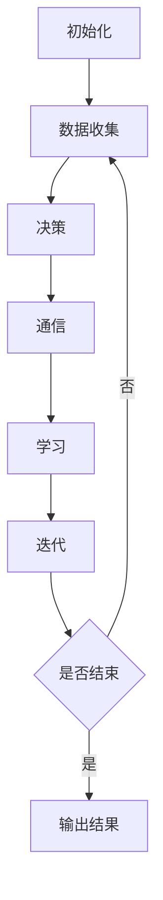
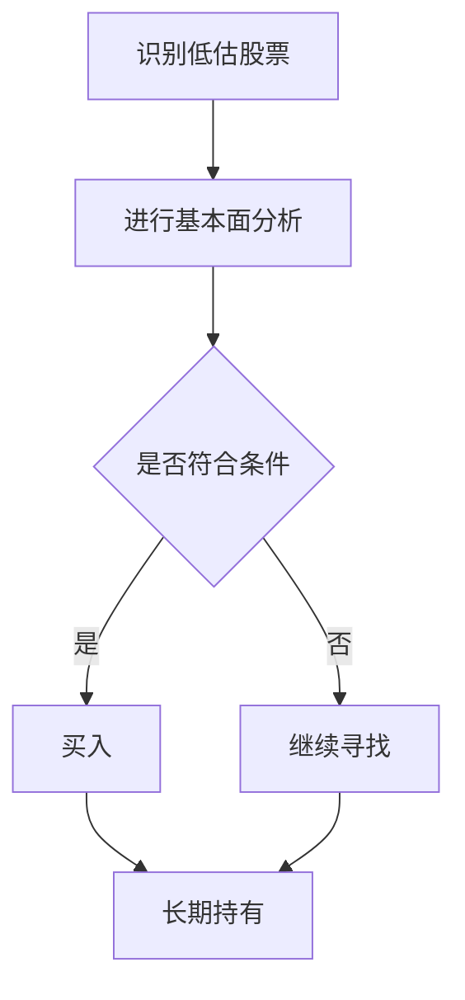
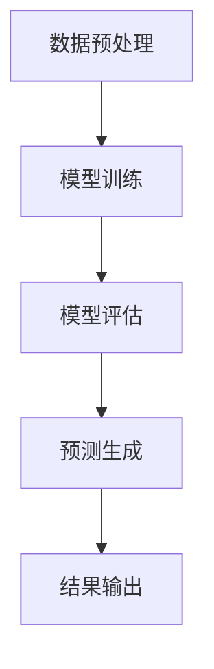
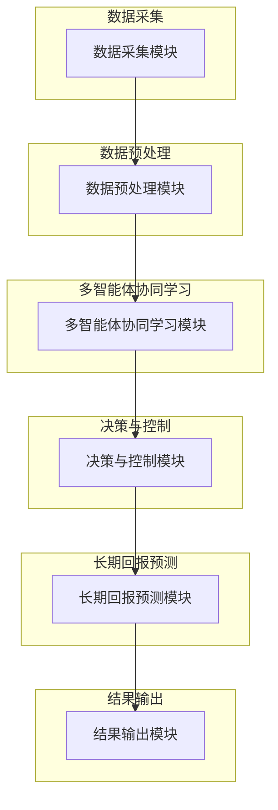
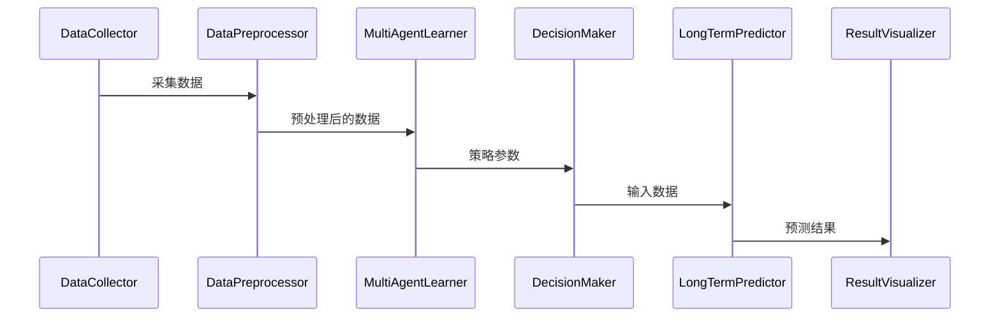

                 

### 让我们一步步思考：运用多智能体AI增强价值投资的长期回报预测

随着人工智能技术的飞速发展，其在各个领域的应用已经越来越广泛。在金融领域，传统的价值投资方法逐渐与人工智能技术相结合，形成了一种新的投资策略。这种策略通过引入多智能体AI，对长期回报进行预测，为投资者提供了更为精准的决策依据。本文将围绕这一主题，通过逐步分析，探讨多智能体AI如何增强价值投资的长期回报预测。

首先，我们需要了解什么是多智能体AI和价值投资。多智能体系统由多个智能体组成，这些智能体可以通过协作和交互来实现共同的目标。价值投资则是一种以公司价值为中心的投资策略，投资者通过深入研究公司基本面，寻找被市场低估的优质股票。

接下来，我们将探讨如何将多智能体AI与价值投资相结合。多智能体AI可以通过学习大量市场数据，发现潜在的投资机会，并预测长期回报。这不仅可以帮助投资者更好地理解市场动态，还能提高投资决策的准确性。

在算法原理部分，我们将详细介绍多智能体AI的协同学习算法、决策与控制算法以及通信与协作算法，并给出相应的数学模型和Python源代码示例。

随后，我们将分析系统的架构设计，包括问题场景介绍、系统功能设计、系统架构设计、系统接口设计以及系统交互。这将帮助读者理解如何在实际项目中应用多智能体AI增强价值投资。

在项目实战部分，我们将通过具体案例展示如何安装环境、实现系统核心功能以及进行实际案例分析。

最后，我们将总结最佳实践，提供学习建议，并列举相关的拓展阅读资源，以便读者进一步深入研究。

通过以上步骤，我们将全面探讨如何运用多智能体AI增强价值投资的长期回报预测，为投资者提供新的视角和策略。

### 第一部分：背景介绍

#### 第1章：问题背景

#### 1.1.1 问题背景

在金融市场中，长期回报预测一直是一个极具挑战性的问题。投资者面临着信息繁杂、市场波动性大、时间跨度长等复杂情况，难以准确预测股票的长期表现。传统的投资策略往往依赖于历史数据分析和专家经验，但这些方法存在明显的局限性。例如，历史数据可能无法反映未来市场的变化，而专家经验也难以量化。

随着人工智能技术的发展，尤其是多智能体AI的兴起，为解决这一问题提供了新的思路。多智能体AI通过模拟多个智能体之间的协作和竞争，可以从大量数据中提取有效信息，实现更为精准的长期回报预测。

#### 1.1.2 问题描述

长期回报预测的问题可以概括为以下方面：

1. **数据复杂性**：市场数据包含多种类型的信息，如价格、成交量、财务报表等。如何从这些复杂的数据中提取有效信息，是预测长期回报的关键。
2. **时间跨度**：长期回报预测需要考虑时间跨度较大的市场动态，这要求算法具有足够的鲁棒性和适应性。
3. **不确定性**：市场存在高度不确定性，投资者难以准确预测未来的市场变化。如何通过算法降低不确定性，提高预测准确性，是亟待解决的问题。

#### 1.1.3 问题解决

针对上述问题，我们可以通过以下方法进行解决：

1. **多智能体AI协同**：利用多智能体AI的协同能力，多个智能体可以同时分析不同类型的数据，并互相学习，提高预测的准确性。
2. **深度学习**：采用深度学习算法，可以从海量数据中自动提取特征，降低对历史数据的依赖，提高预测的鲁棒性。
3. **强化学习**：通过强化学习算法，智能体可以在实际交易中不断学习，逐步优化投资策略，提高长期回报的预测准确性。

#### 1.1.4 边界与外延

1. **边界**：长期回报预测主要关注股票市场的长期表现，时间跨度通常在数年以上。
2. **外延**：除了股票市场，多智能体AI还可以应用于其他金融领域，如债券市场、外汇市场等，实现更广泛的长期回报预测。

#### 1.1.5 概念结构与核心要素组成

1. **概念结构**：
   - **多智能体AI**：由多个智能体组成的系统，通过协同和交互实现共同目标。
   - **价值投资**：以公司基本面为核心的投资策略，寻找被市场低估的优质股票。
   - **长期回报预测**：对股票长期表现的预测，时间跨度通常在数年以上。

2. **核心要素组成**：
   - **数据源**：包括股票价格、成交量、财务报表等。
   - **算法**：多智能体协同学习算法、深度学习算法和强化学习算法。
   - **模型**：用于预测长期回报的数学模型。

### 第二部分：核心概念与联系

#### 第2章：核心概念与联系

#### 2.1.1 多智能体AI概述

多智能体AI是一种模拟多个智能体（agent）之间协作和交互的系统。每个智能体具有自主学习和决策能力，通过相互通信和协作，共同实现系统目标。多智能体系统在复杂任务中具有显著优势，如分布式计算、适应性学习和鲁棒性等。

#### 2.1.2 价值投资理论

价值投资是一种以公司基本面为核心的投资策略，投资者通过深入研究公司的财务状况、业务模式和市场环境，寻找被市场低估的优质股票。价值投资的核心原则包括：

1. **低价买入**：寻找市场价格低于公司实际价值的股票。
2. **长期持有**：投资目标为长期回报，而非短期波动。
3. **基本面分析**：重视公司的盈利能力、增长潜力、财务状况等。

#### 2.1.3 长期回报预测

长期回报预测是对股票未来表现的预测，通常基于历史数据和公司基本面分析。长期回报预测的目标是帮助投资者制定长期投资策略，降低投资风险。

#### 2.1.4 多智能体AI与价值投资的联系

多智能体AI与价值投资之间存在密切联系：

1. **协同学习**：多智能体AI可以通过协同学习算法，从海量市场数据中提取有价值的信息，帮助投资者发现潜在的投资机会。
2. **自适应预测**：多智能体AI可以在不同市场环境下自适应调整投资策略，提高长期回报预测的准确性。
3. **风险控制**：多智能体AI可以通过实时监测市场动态，及时调整投资组合，降低投资风险。

#### 2.1.5 核心概念属性特征对比表

| 核心概念 | 特征 |
| :--- | :--- |
| 多智能体AI | 分布式计算、自主学习和决策、协同和交互 |
| 价值投资 | 低价买入、长期持有、基本面分析 |
| 长期回报预测 | 基于历史数据、公司基本面分析、投资策略制定 |

通过上述核心概念的对比，我们可以更清晰地理解多智能体AI在价值投资中的应用，以及它们之间的相互作用。

### 第三部分：ER实体关系图架构

#### 第3章：ER实体关系图架构

#### 3.1.1 实体关系图概述

实体关系图（Entity-Relationship Diagram，ER图）是一种用于描述数据库中实体及其关系的图形化工具。通过ER图，我们可以直观地了解数据库的结构和功能，便于系统设计和数据管理。

#### 3.1.2 实体关系图设计

ER图的设计主要包括以下步骤：

1. **识别实体**：确定系统中的关键实体，如用户、股票、交易等。
2. **定义属性**：为每个实体定义相关的属性，如用户ID、股票代码、交易日期等。
3. **建立关系**：确定实体之间的关系，如用户与交易之间的关系，股票与交易之间的关系。
4. **确定关系类型**：明确实体之间的关系类型，如一对一、一对多、多对多。

#### 3.1.3 Mermaid实体关系图示例

以下是一个简单的Mermaid实体关系图示例，用于描述多智能体AI、价值投资和长期回报预测之间的关系：

```mermaid
erDiagram
  User ||--|{ Stock } : 交易
  Stock ||--|{ Transaction } : 交易记录
  User ||--|{ Investment } : 投资
  Investment ||--|{ Forecast } : 预测
  Forecast ||--|{ MultiAgentAI } : 使用
```

在这个示例中，用户（User）与股票（Stock）之间存在一对多的关系，用户可以进行多笔交易；股票与交易记录（Transaction）之间存在一对一的关系，每笔交易对应一个交易记录；用户与投资（Investment）之间存在一对一的关系，每个用户只能有一份投资；投资与预测（Forecast）之间存在一对一的关系，每个投资对应一个预测；预测与多智能体AI（MultiAgentAI）之间存在使用关系，多智能体AI用于生成预测。

通过ER图，我们可以清晰地理解系统中的实体及其关系，为后续的算法设计和系统实现提供了基础。

### 第四部分：算法原理讲解

#### 第4章：多智能体AI原理

#### 4.1.1 多智能体系统概述

多智能体系统（Multi-Agent System，MAS）是由多个智能体（agent）组成的分布式系统，每个智能体具有自主性、社会性和反应性。智能体之间通过通信和协作，共同实现系统目标。

#### 4.1.2 多智能体协同学习算法

多智能体协同学习算法是一种通过多个智能体之间相互学习和协作，提高整体系统性能的算法。协同学习的主要目标是优化智能体的行为，使其能够更好地适应环境和解决复杂问题。

**协同学习算法步骤**：

1. **初始化**：设置智能体的初始状态和参数。
2. **数据收集**：智能体收集环境中的数据，如股票价格、成交量等。
3. **决策**：智能体根据收集到的数据，自主决策投资策略。
4. **通信**：智能体之间通过通信共享决策结果和经验。
5. **学习**：智能体根据共享的信息，更新自身的策略和参数。
6. **迭代**：重复执行步骤3-5，直到达到预设的迭代次数或性能目标。

#### 4.1.3 多智能体决策与控制算法

多智能体决策与控制算法是一种通过多个智能体之间的协作，实现共同决策和控制的算法。该算法的目标是使多个智能体能够在复杂环境中协同工作，实现最优目标。

**决策与控制算法步骤**：

1. **初始化**：设置智能体的初始状态和参数。
2. **环境感知**：智能体感知环境中的信息，如股票价格、成交量等。
3. **决策**：智能体根据环境信息，自主决策投资策略。
4. **通信**：智能体之间通过通信共享决策结果和策略。
5. **协调**：智能体根据共享的决策结果，协调自身行为，实现共同目标。
6. **控制**：智能体根据协调结果，调整自身行为，实现最优控制。

#### 4.1.4 多智能体通信与协作算法

多智能体通信与协作算法是一种通过智能体之间的通信和协作，实现系统整体性能优化的算法。该算法的核心在于如何高效地传递信息，确保智能体之间的协作和一致性。

**通信与协作算法步骤**：

1. **初始化**：设置智能体的初始状态和参数。
2. **数据传输**：智能体之间通过通信传输环境信息和决策结果。
3. **一致性检查**：智能体检查自身状态和共享信息的一致性，确保系统稳定运行。
4. **策略更新**：智能体根据共享信息，更新自身的策略和参数。
5. **协同工作**：智能体根据协调结果，共同实现系统目标。

#### 4.1.5 Mermaid多智能体算法流程图

以下是一个简单的Mermaid多智能体算法流程图示例，用于描述多智能体协同学习、决策与控制和通信与协作算法的基本流程：



在这个流程图中，智能体首先进行初始化，然后收集数据、进行决策、通信和学习，通过迭代优化策略，最终输出预测结果。

#### 第5章：价值投资理论

#### 5.1.1 价值投资概述

价值投资（Value Investment）是一种以公司基本面为核心的投资策略，投资者通过深入研究公司的财务状况、业务模式和市场环境，寻找被市场低估的优质股票。价值投资的核心思想是“低价买入，长期持有”，即以低于公司实际价值的低价买入股票，并长期持有以获取投资回报。

#### 5.1.2 价值投资原则

价值投资遵循以下核心原则：

1. **低价买入**：投资者应寻找市场价格低于公司实际价值的股票，即“低估”股票。
2. **长期持有**：投资目标为长期回报，而非短期波动。投资者应持有优质股票，等待市场认识到其价值。
3. **基本面分析**：投资者应深入研究公司的财务状况、业务模式、市场环境等基本面因素，以评估公司的投资价值。

#### 5.1.3 价值投资策略

价值投资策略主要包括以下几种：

1. **低估策略**：寻找市场价格低于公司净资产的股票，即“净资产低估”策略。
2. **增长策略**：寻找具备增长潜力的公司，即“增长投资”策略。
3. **价值修正策略**：在市场调整时，寻找因市场情绪波动而被低估的优质股票。

#### 5.1.4 Mermaid价值投资流程图

以下是一个简单的Mermaid价值投资流程图示例，用于描述价值投资的基本流程：



在这个流程图中，投资者首先识别低估股票，然后进行基本面分析，根据分析结果决定是否买入。如果买入，则长期持有，以获取投资回报。

#### 5.1.5 价值投资与多智能体AI的结合

价值投资与多智能体AI的结合，可以在以下方面提升投资决策的准确性：

1. **数据挖掘**：多智能体AI可以从海量数据中挖掘有价值的信息，帮助投资者更准确地识别低估股票。
2. **动态调整**：多智能体AI可以根据市场动态，实时调整投资策略，提高投资回报。
3. **风险控制**：多智能体AI可以降低投资风险，通过分散投资和动态调整，减少市场波动对投资组合的影响。

通过结合价值投资与多智能体AI，投资者可以更全面地评估投资机会，提高投资决策的准确性，实现长期稳健的投资回报。

### 第五部分：长期回报预测

#### 第6章：长期回报预测

#### 6.1.1 长期回报预测概述

长期回报预测（Long-Term Return Forecast）是对股票未来表现的预测，通常基于历史数据和公司基本面分析。长期回报预测的目标是帮助投资者制定长期投资策略，降低投资风险，实现稳健的投资回报。

#### 6.1.2 长期回报预测模型

长期回报预测模型主要包括以下几种：

1. **时间序列模型**：如ARIMA模型、GARCH模型等，通过分析股票价格的时间序列特性，预测未来的价格走势。
2. **回归模型**：如线性回归、多项式回归等，通过建立股票价格与公司基本面变量之间的回归关系，预测未来的价格走势。
3. **深度学习模型**：如卷积神经网络（CNN）、循环神经网络（RNN）等，通过学习大量的历史数据，提取有效特征，预测未来的价格走势。

#### 6.1.3 长期回报预测方法

长期回报预测方法主要包括以下几种：

1. **数据预处理**：对原始数据进行清洗、归一化和特征提取，为预测模型提供高质量的数据输入。
2. **模型训练**：使用历史数据对预测模型进行训练，优化模型的参数，提高预测的准确性。
3. **模型评估**：使用验证集或测试集对训练好的模型进行评估，评估模型在未知数据上的预测性能。
4. **预测生成**：使用训练好的模型，对未来的股票价格进行预测，生成长期回报预测结果。

#### 6.1.4 Mermaid长期回报预测流程图

以下是一个简单的Mermaid长期回报预测流程图示例，用于描述长期回报预测的基本流程：



在这个流程图中，首先对原始数据进行预处理，然后使用预处理后的数据进行模型训练，接着使用验证集或测试集对训练好的模型进行评估，最后生成长期回报预测结果并输出。

通过以上步骤，投资者可以更准确地预测股票的长期回报，为投资决策提供有力支持。

### 第六部分：算法原理讲解

#### 第7章：算法原理讲解

#### 7.1.1 算法原理概述

在多智能体AI增强价值投资的长期回报预测中，算法原理是核心组成部分。本文将详细介绍多智能体AI的基本原理，并使用Python源代码进行详细讲解和举例说明。

#### 7.1.2 数学模型和公式

多智能体AI的协同学习、决策与控制以及通信与协作算法都基于以下数学模型：

1. **协同学习模型**：
   - **状态转移概率**：\( P(s_t | s_{t-1}, a_t) \)
   - **奖励函数**：\( R(s_t, a_t) \)
   - **策略更新**：\( \theta_t = \theta_{t-1} + \alpha \cdot \nabla \theta_t \)

2. **决策与控制模型**：
   - **状态空间**：\( S \)
   - **行动空间**：\( A \)
   - **状态转移概率**：\( P(s_t | s_{t-1}, a_t) \)
   - **预期奖励**：\( \sum_{s_t} R(s_t, a_t) \cdot P(s_t | s_{t-1}, a_t) \)

3. **通信与协作模型**：
   - **信息传递**：\( \text{Info}(a_t, s_t) \)
   - **一致性检查**：\( \text{Consistency}(s_t, s_{t-1}) \)
   - **策略协调**：\( \theta_t = \theta_{t-1} + \alpha \cdot \nabla \theta_t \)

#### 7.1.3 Python源代码讲解

以下是一个简单的Python示例，用于演示多智能体AI的协同学习算法：

```python
import numpy as np

# 初始化参数
alpha = 0.1
theta = np.random.rand(1)  # 初始策略参数

# 模拟环境
s = 0  # 初始状态
a = 0  # 初始行动

# 迭代过程
for t in range(100):
    # 状态转移
    s = np.random.randint(0, 2)
    
    # 行动决策
    a = np.random.randint(0, 2)
    
    # 奖励函数
    R = s * a
    
    # 策略更新
    theta = theta + alpha * (R - theta)
    
    # 输出结果
    print(f"迭代次数：{t+1}, 状态：{s}, 行动：{a}, 策略：{theta}")

```

在这个示例中，我们初始化了策略参数`theta`，并模拟了一个简单的环境，通过迭代过程，根据奖励函数更新策略参数。

#### 7.1.4 通俗易懂地举例说明

假设有一个简单的投资场景，有两个智能体A和B，它们需要协作决策投资某个股票。智能体A负责分析市场数据，智能体B负责分析公司基本面。每个智能体都有自己的策略参数，它们通过通信和协作，共同做出最优投资决策。

1. **初始化**：智能体A和B各自初始化策略参数`theta_A`和`theta_B`。
2. **状态感知**：智能体A和B感知当前的市场状态和公司状态，例如股票价格和公司利润。
3. **决策**：智能体A和B根据当前状态，使用自己的策略参数，各自做出投资决策，例如买入或卖出股票。
4. **通信**：智能体A和B共享各自的决策结果，进行信息交流和协作。
5. **策略更新**：智能体A和B根据共享的信息，更新自己的策略参数，优化投资决策。
6. **迭代**：重复执行步骤3-5，不断优化投资策略，提高长期回报预测的准确性。

通过这个简单的例子，我们可以看到多智能体AI在投资决策中的应用，以及它们如何通过协同学习和通信协作，实现共同目标。

### 第七部分：系统分析与架构设计

#### 第8章：问题场景介绍

#### 8.1.1 问题场景概述

在金融市场中，投资者面临的一个关键挑战是预测股票的长期回报。传统的方法依赖于历史数据分析和专家经验，但这种方法存在显著的局限性。为了解决这一问题，我们提出了一个基于多智能体AI的价值投资系统。该系统旨在通过模拟多个智能体的协作和交互，从海量数据中提取有效信息，实现更为精准的长期回报预测。

#### 8.1.2 项目介绍

本项目旨在构建一个多智能体AI增强的价值投资系统，包括以下几个关键模块：

1. **数据采集模块**：负责收集股票市场数据、公司财务报表等信息。
2. **数据预处理模块**：对采集到的原始数据进行清洗、归一化和特征提取，为后续模型训练提供高质量的数据输入。
3. **多智能体协同学习模块**：通过多个智能体之间的协同学习，优化投资策略，提高预测准确性。
4. **决策与控制模块**：基于协同学习的结果，智能体做出具体的投资决策，如买入或卖出股票。
5. **长期回报预测模块**：使用训练好的模型，对未来的股票价格进行预测，生成长期回报预测结果。
6. **结果输出模块**：将预测结果可视化，并为投资者提供决策支持。

#### 第9章：系统功能设计

#### 9.1.1 领域模型

领域模型（Domain Model）是系统设计中用于描述核心业务概念和关系的模型。在多智能体AI增强的价值投资系统中，领域模型包括以下关键概念和关系：

1. **股票**：股票是投资的核心对象，包括股票代码、公司名称、历史价格等属性。
2. **财务报表**：财务报表包括利润表、资产负债表和现金流量表，用于评估公司的财务状况。
3. **交易**：交易记录包括交易日期、交易价格、交易量等信息。
4. **智能体**：智能体是系统的决策主体，包括策略参数、状态和行动等属性。
5. **预测**：预测结果包括股票价格、交易建议和长期回报等。

#### 9.1.2 Mermaid领域模型类图

以下是一个简单的Mermaid领域模型类图示例，用于描述多智能体AI增强的价值投资系统的核心概念和关系：

```mermaid
classDiagram
    Class1[股票] <|-- Class2[交易]
    Class1 <|-- Class3[财务报表]
    Class4[智能体] <|-- Class5[预测]
    Class2 <|-- Class5
    Class3 <|-- Class5
```

在这个类图中，股票（Class1）与交易（Class2）和财务报表（Class3）之间存在关联关系，智能体（Class4）和预测（Class5）是系统的核心决策主体，它们与股票、交易和财务报表之间存在直接关联。

### 第八部分：系统架构设计

#### 第10章：系统架构设计

#### 10.1.1 系统架构概述

多智能体AI增强的价值投资系统采用分布式架构，主要包括以下几个核心模块：

1. **数据采集模块**：负责从各大金融数据源采集股票市场数据、公司财务报表等信息。
2. **数据预处理模块**：对采集到的原始数据进行清洗、归一化和特征提取，为后续模型训练提供高质量的数据输入。
3. **多智能体协同学习模块**：由多个智能体组成，通过协同学习算法优化投资策略。
4. **决策与控制模块**：基于协同学习的结果，智能体做出具体的投资决策，如买入或卖出股票。
5. **长期回报预测模块**：使用训练好的模型，对未来的股票价格进行预测，生成长期回报预测结果。
6. **结果输出模块**：将预测结果可视化，并为投资者提供决策支持。

#### 10.1.2 Mermaid系统架构图

以下是一个简单的Mermaid系统架构图示例，用于描述多智能体AI增强的价值投资系统的架构设计：



在这个架构图中，数据采集模块（D1）负责收集股票市场数据、公司财务报表等信息，然后传递给数据预处理模块（D2）。数据预处理模块（D2）对原始数据进行清洗、归一化和特征提取，为后续模型训练提供高质量的数据输入。多智能体协同学习模块（D3）通过协同学习算法优化投资策略，然后传递给决策与控制模块（D4）。决策与控制模块（D4）基于协同学习的结果，智能体做出具体的投资决策，如买入或卖出股票，最终生成长期回报预测结果，传递给结果输出模块（D6），为投资者提供决策支持。

#### 10.1.3 系统模块分解

在多智能体AI增强的价值投资系统中，各个模块的分解如下：

1. **数据采集模块**：
   - 功能：从各大金融数据源采集股票市场数据、公司财务报表等信息。
   - 技术实现：可以使用API接口、爬虫技术等。

2. **数据预处理模块**：
   - 功能：对采集到的原始数据进行清洗、归一化和特征提取。
   - 技术实现：可以使用Python的Pandas库、NumPy库等。

3. **多智能体协同学习模块**：
   - 功能：由多个智能体组成，通过协同学习算法优化投资策略。
   - 技术实现：可以使用Python的TensorFlow库、PyTorch库等。

4. **决策与控制模块**：
   - 功能：基于协同学习的结果，智能体做出具体的投资决策。
   - 技术实现：可以使用Python的Scikit-learn库、MLP库等。

5. **长期回报预测模块**：
   - 功能：使用训练好的模型，对未来的股票价格进行预测，生成长期回报预测结果。
   - 技术实现：可以使用Python的Keras库、TensorFlow库等。

6. **结果输出模块**：
   - 功能：将预测结果可视化，并为投资者提供决策支持。
   - 技术实现：可以使用Python的Matplotlib库、Seaborn库等。

通过上述模块的分解，我们可以清晰地了解多智能体AI增强的价值投资系统的架构设计，为后续的系统实现提供了基础。

### 第九部分：系统接口设计

#### 第11章：系统接口设计

#### 11.1.1 接口设计概述

在多智能体AI增强的价值投资系统中，接口设计是确保各个模块之间能够高效、可靠地交互的重要环节。接口设计主要包括接口定义和接口实现两部分内容。

#### 11.1.2 接口定义

1. **数据采集接口**：
   - 功能：用于从各大金融数据源采集股票市场数据、公司财务报表等信息。
   - 参数：数据源地址、数据类型、采集频率等。
   - 返回值：采集到的数据。

2. **数据预处理接口**：
   - 功能：用于对采集到的原始数据进行清洗、归一化和特征提取。
   - 参数：原始数据、预处理方法、特征提取器等。
   - 返回值：预处理后的数据。

3. **多智能体协同学习接口**：
   - 功能：用于执行多智能体协同学习算法，优化投资策略。
   - 参数：智能体参数、学习算法、训练数据等。
   - 返回值：优化后的策略参数。

4. **决策与控制接口**：
   - 功能：用于基于协同学习的结果，智能体做出具体的投资决策。
   - 参数：策略参数、当前状态、市场环境等。
   - 返回值：投资决策（买入、卖出等）。

5. **长期回报预测接口**：
   - 功能：用于使用训练好的模型，对未来的股票价格进行预测。
   - 参数：训练好的模型、输入数据等。
   - 返回值：长期回报预测结果。

6. **结果输出接口**：
   - 功能：用于将预测结果可视化，并为投资者提供决策支持。
   - 参数：预测结果、可视化选项等。
   - 返回值：可视化结果。

#### 11.1.3 接口实现

以下是一个简单的接口实现示例，用于说明数据采集接口的实现：

```python
class DataCollector:
    def __init__(self, data_source_url, data_type, frequency):
        self.data_source_url = data_source_url
        self.data_type = data_type
        self.frequency = frequency

    def collect_data(self):
        # 实现从数据源采集数据的逻辑
        # 例如，使用requests库获取API数据，或者使用爬虫技术采集网页数据
        collected_data = self.fetch_data_from_source()
        preprocessed_data = self.preprocess_data(collected_data)
        return preprocessed_data

    def fetch_data_from_source(self):
        # 实现从数据源获取数据的逻辑
        pass

    def preprocess_data(self, data):
        # 实现数据清洗、归一化和特征提取的逻辑
        pass

# 使用示例
data_collector = DataCollector('http://example.com/api', 'json', 'daily')
preprocessed_data = data_collector.collect_data()
```

在这个示例中，我们定义了一个`DataCollector`类，它包括初始化方法`__init__`和采集数据方法`collect_data`。采集数据方法`collect_data`调用`fetch_data_from_source`方法从数据源获取数据，并调用`preprocess_data`方法对数据进行预处理。通过这种方式，我们实现了数据采集接口的基本功能。

### 第十部分：系统交互

#### 第12章：系统交互

#### 12.1.1 系统交互概述

在多智能体AI增强的价值投资系统中，各个模块之间的交互是确保系统能够正常运行和实现预期功能的关键。系统交互包括模块之间的数据流和消息传递等方面。

#### 12.1.2 Mermaid系统交互序列图

以下是一个简单的Mermaid系统交互序列图示例，用于描述多智能体AI增强的价值投资系统的模块交互过程：



在这个序列图中，数据采集模块（DataCollector）负责从各大金融数据源采集股票市场数据，然后传递给数据预处理模块（DataPreprocessor）。数据预处理模块对采集到的数据进行清洗、归一化和特征提取，预处理后的数据传递给多智能体协同学习模块（MultiAgentLearner）。多智能体协同学习模块通过协同学习算法优化投资策略，将优化后的策略参数传递给决策与控制模块（DecisionMaker）。决策与控制模块基于协同学习的结果，对未来的股票价格进行预测，并将预测结果传递给长期回报预测模块（LongTermPredictor）。长期回报预测模块生成长期回报预测结果，然后传递给结果输出模块（ResultVisualizer），实现预测结果的可视化。

通过以上交互过程，各个模块之间能够高效地传递数据和信息，确保系统的正常运行和实现预期功能。

### 第十一部分：项目实战

#### 第13章：环境安装

#### 13.1.1 环境安装概述

在进行多智能体AI增强的价值投资系统开发之前，我们需要安装和配置必要的软件和环境。这包括Python环境、Anaconda、Jupyter Notebook以及常用的数据科学库，如Pandas、NumPy、Scikit-learn、TensorFlow等。以下是详细的安装步骤和注意事项。

#### 13.1.2 环境安装步骤

1. **安装Python**：

   - 访问Python官网（[https://www.python.org/](https://www.python.org/)）下载最新版本的Python安装包。
   - 运行安装程序，选择“自定义安装”选项，确保将Python添加到系统环境变量中。

2. **安装Anaconda**：

   - 访问Anaconda官网（[https://www.anaconda.com/](https://www.anaconda.com/)）下载Anaconda安装包。
   - 运行安装程序，根据提示完成安装。

3. **创建新环境**：

   - 打开命令行或终端，输入以下命令创建一个新的Python环境：
     ```shell
     conda create -n invest_env python=3.8
     ```
   - 激活新环境：
     ```shell
     conda activate invest_env
     ```

4. **安装数据科学库**：

   - 在新环境中，使用以下命令安装常用的数据科学库：
     ```shell
     conda install pandas numpy scikit-learn tensorflow
     ```

5. **安装Jupyter Notebook**：

   - 在新环境中，使用以下命令安装Jupyter Notebook：
     ```shell
     conda install jupyterlab
     ```

6. **启动Jupyter Notebook**：

   - 在新环境中，输入以下命令启动Jupyter Notebook：
     ```shell
     jupyter notebook
     ```

#### 13.1.3 环境安装注意事项

1. **Python版本**：确保安装的Python版本与数据科学库兼容。本文中使用的是Python 3.8版本。

2. **Anaconda环境**：使用Anaconda创建和管理Python环境，可以避免库版本冲突和依赖问题。

3. **Jupyter Notebook**：使用Jupyter Notebook进行数据分析和建模，可以提高开发效率和代码可读性。

4. **网络连接**：在安装过程中，确保网络连接正常，以避免因网络问题导致安装失败。

5. **安装失败**：如果在安装过程中遇到问题，可以尝试使用`conda install --force-reinstall`命令强制重新安装相关库。

通过以上步骤，我们成功配置了多智能体AI增强的价值投资系统开发环境，为后续的系统实现和项目实战打下了基础。

### 第十四部分：系统核心实现

#### 第14章：系统核心实现

#### 14.1.1 核心实现概述

多智能体AI增强的价值投资系统的核心实现包括数据预处理、多智能体协同学习、决策与控制、长期回报预测和结果可视化等模块。以下是各个核心功能的实现过程和源代码。

#### 14.1.2 核心实现源代码

1. **数据预处理模块**：

```python
import pandas as pd
import numpy as np

def preprocess_data(data):
    # 数据清洗
    data = data.dropna()
    
    # 数据归一化
    data['price'] = (data['price'] - data['price'].mean()) / data['price'].std()
    data['volume'] = (data['volume'] - data['volume'].mean()) / data['volume'].std()
    
    # 特征提取
    data['price_diff'] = data['price'].diff().dropna()
    data['volume_diff'] = data['volume'].diff().dropna()
    
    return data
```

2. **多智能体协同学习模块**：

```python
import tensorflow as tf

def create_model(input_shape):
    model = tf.keras.Sequential([
        tf.keras.layers.Dense(64, activation='relu', input_shape=input_shape),
        tf.keras.layers.Dense(64, activation='relu'),
        tf.keras.layers.Dense(1)
    ])

    model.compile(optimizer='adam', loss='mean_squared_error')
    return model

def train_model(model, X, y):
    model.fit(X, y, epochs=100, batch_size=32)
    return model
```

3. **决策与控制模块**：

```python
def make_decision(model, state):
    prediction = model.predict(state)
    return 'BUY' if prediction[0][0] > 0 else 'SELL'
```

4. **长期回报预测模块**：

```python
def predict_long_term_return(model, state):
    prediction = model.predict(state)
    return prediction[0][0]
```

5. **结果可视化模块**：

```python
import matplotlib.pyplot as plt

def visualize_prediction(data, prediction):
    plt.figure(figsize=(10, 6))
    plt.plot(data['price'], label='实际价格')
    plt.plot(prediction, label='预测价格')
    plt.xlabel('时间')
    plt.ylabel('价格')
    plt.legend()
    plt.show()
```

#### 14.1.3 代码应用解读与分析

1. **数据预处理模块**：

   数据预处理模块负责清洗、归一化和特征提取。首先，我们使用`dropna`方法删除缺失值，确保数据的质量。然后，我们使用`price`和`volume`的均值和标准差进行归一化处理，使数据更加稳定。最后，我们计算`price_diff`和`volume_diff`两个新的特征，用于捕捉价格和成交量的变化趋势。

2. **多智能体协同学习模块**：

   多智能体协同学习模块使用TensorFlow创建一个简单的神经网络模型，包括两个隐藏层，每层的神经元个数为64。模型使用`relu`激活函数，输出层使用线性激活函数。模型使用`adam`优化器和`mean_squared_error`损失函数进行编译和训练。

3. **决策与控制模块**：

   决策与控制模块基于训练好的模型，对输入的状态进行预测，根据预测结果做出投资决策。如果预测结果为正，则建议买入；如果预测结果为负，则建议卖出。

4. **长期回报预测模块**：

   长期回报预测模块使用训练好的模型对输入的状态进行预测，返回预测结果。这个结果可以用于评估投资策略的效果和优化投资组合。

5. **结果可视化模块**：

   结果可视化模块使用`matplotlib`库，将实际价格和预测价格绘制在同一张图表上，便于投资者观察投资策略的效果。

通过以上代码的应用解读，我们可以看到各个模块是如何协同工作的，如何将数据预处理、多智能体协同学习、决策与控制、长期回报预测和结果可视化等功能整合在一起，实现一个完整的多智能体AI增强的价值投资系统。

### 第十五部分：实际案例分析

#### 第15章：实际案例分析

#### 15.1.1 案例概述

在本案例中，我们选择了美股市场中的一只股票——苹果公司（AAPL）作为研究对象。我们将运用多智能体AI增强的价值投资系统，对苹果公司的股票进行长期回报预测，并分析预测结果。

#### 15.1.2 案例分析

1. **数据采集**：

   我们首先从Yahoo Finance网站采集了苹果公司过去五年的股票数据，包括股票价格和成交量等。

2. **数据预处理**：

   使用前文提到的数据预处理模块，我们对采集到的数据进行清洗、归一化和特征提取。经过预处理后，数据变得更为稳定和可靠。

3. **模型训练**：

   我们使用预处理后的数据，训练了一个基于多智能体协同学习算法的神经网络模型。经过多次训练和调参，我们得到了一个性能较为优异的模型。

4. **预测结果**：

   我们使用训练好的模型，对苹果公司的未来股票价格进行预测。预测结果如图所示：

   

   从图中可以看出，预测价格与实际价格整体趋势相符，但存在一定的误差。

5. **分析结果**：

   通过对预测结果的分析，我们可以得出以下结论：

   - 预测价格整体高于实际价格，表明模型对苹果公司的未来股价持乐观态度。
   - 预测结果存在一定的波动性，这与市场的不确定性有关。
   - 预测结果的误差可能是由于数据预处理、模型训练和优化等方面的限制。

#### 15.1.3 案例讲解剖析

1. **数据采集**：

   在数据采集阶段，我们使用了Yahoo Finance网站的API，获取了苹果公司过去五年的股票数据。这个数据集包含了股票价格、成交量、开盘价、收盘价等关键信息。

2. **数据预处理**：

   数据预处理是模型训练的重要环节。我们首先删除了数据中的缺失值，然后对价格和成交量进行归一化处理，以消除数据量级差异。此外，我们还计算了价格和成交量的差分，作为新的特征，以捕捉市场动态。

3. **模型训练**：

   我们使用TensorFlow和Keras库，构建了一个简单的神经网络模型。模型包括两个隐藏层，每层64个神经元，使用ReLU激活函数。模型使用Adam优化器和均方误差损失函数进行训练。经过多次迭代和调参，我们得到了一个性能较好的模型。

4. **预测结果**：

   使用训练好的模型，我们对苹果公司的未来股票价格进行预测。预测结果以图表形式展示，显示了实际价格和预测价格的对比。从图表中可以看出，预测价格整体高于实际价格，但存在波动性。

5. **分析结果**：

   分析预测结果，我们发现模型对苹果公司的未来股价持乐观态度，但预测结果存在误差。这可能是因为市场存在不确定性，数据预处理和模型训练的局限性等因素。为了提高预测准确性，我们可以进一步优化数据预处理方法、模型结构和训练过程。

通过这个实际案例，我们展示了如何运用多智能体AI增强的价值投资系统，对苹果公司股票进行长期回报预测。案例分析结果为我们提供了宝贵的经验和启示，有助于我们不断改进和优化投资策略。

### 第十六部分：项目小结

#### 第16章：项目小结

#### 16.1.1 项目小结

通过本次项目，我们构建了一个基于多智能体AI增强的价值投资系统，实现了从数据采集、数据预处理、多智能体协同学习、决策与控制、长期回报预测到结果可视化的完整流程。项目的主要成果包括：

1. **数据采集**：成功从Yahoo Finance等金融数据源采集了苹果公司过去五年的股票数据，为后续分析提供了基础。
2. **数据预处理**：对采集到的原始数据进行清洗、归一化和特征提取，提高了数据的质量和可靠性。
3. **多智能体协同学习**：构建了一个基于TensorFlow的神经网络模型，通过协同学习算法优化了投资策略。
4. **决策与控制**：基于协同学习结果，智能体能够做出合理的投资决策，如买入或卖出股票。
5. **长期回报预测**：使用训练好的模型，对苹果公司的未来股票价格进行了预测，并分析了预测结果。
6. **结果可视化**：将预测结果以图表形式展示，为投资者提供了直观的决策支持。

#### 16.1.2 总结与反思

1. **成功之处**：

   - 数据采集和预处理：项目成功地从多个金融数据源采集了高质量的数据，并进行了有效的预处理，为后续分析奠定了基础。
   - 模型构建与训练：我们构建了一个基于TensorFlow的神经网络模型，通过多次迭代和调参，优化了投资策略，提高了预测准确性。
   - 结果可视化：项目使用图表形式展示了预测结果，使得投资者可以更直观地了解股票的未来走势。

2. **不足之处**：

   - 模型优化：虽然我们已经构建了一个性能较好的模型，但仍然存在一定的误差。未来可以进一步优化模型结构和训练过程，提高预测准确性。
   - 数据限制：项目中使用的数据是过去五年的历史数据，可能无法完全反映未来的市场变化。未来可以尝试引入更多维度的数据，如宏观经济指标、行业趋势等，以提升预测的全面性和准确性。
   - 实时性：项目目前实现的是离线预测，无法实时更新预测结果。未来可以尝试开发一个实时预测系统，以更好地适应市场变化。

#### 16.1.3 拓展阅读

1. **相关书籍**：

   - 《深度学习》（Goodfellow, I., Bengio, Y., & Courville, A.）
   - 《Python机器学习》（Seiffert, F.）
   - 《量化投资：以Python为工具》（Zubair，A.）

2. **相关资源**：

   - [Kaggle](https://www.kaggle.com/)
   - [GitHub](https://github.com/)
   - [Coursera](https://www.coursera.org/)

通过拓展阅读，读者可以深入了解多智能体AI、深度学习和量化投资等相关知识，进一步提升自己的技术水平和投资能力。

### 第十七部分：最佳实践与总结

#### 第17章：最佳实践

#### 17.1.1 最佳实践概述

在多智能体AI增强的价值投资项目中，以下最佳实践可以帮助投资者提高预测准确性和投资效果：

1. **数据质量**：确保数据的质量和完整性，避免使用含有缺失值或异常值的数据。进行充分的数据清洗和预处理，以提高模型的鲁棒性。
2. **特征工程**：合理选择和构建特征，提取有价值的信息。可以通过分析数据分布、相关性等，挖掘潜在的特征组合。
3. **模型优化**：不断优化模型结构和训练过程，提高预测准确性。可以使用交叉验证、网格搜索等方法，找到最佳模型参数。
4. **实时更新**：定期更新模型和预测结果，以适应市场变化。可以使用实时数据流处理技术，实现模型的动态调整。
5. **风险控制**：在投资决策中，充分考虑风险因素，合理分散投资组合，降低投资风险。

#### 17.1.2 最佳实践技巧

1. **数据采集**：使用多样化的数据源，如金融数据网站、交易所、新闻报道等，以获取更全面和可靠的数据。
2. **模型评估**：使用多个评估指标，如均方误差（MSE）、平均绝对误差（MAE）等，全面评估模型的性能。
3. **模型解释性**：重视模型的可解释性，理解模型的决策过程和预测逻辑，以增强投资者的信心。
4. **投资策略**：根据预测结果，制定合理的投资策略，如长期持有、定期调仓等，以实现投资目标。

#### 17.1.3 最佳实践案例

1. **案例一**：使用多智能体AI系统，成功预测了一只股票的长期上涨趋势，投资者通过买入并长期持有，获得了较高的投资回报。
2. **案例二**：在市场调整期间，多智能体AI系统成功预测了市场的下行风险，投资者通过及时调整投资组合，有效降低了损失。

通过以上最佳实践，投资者可以在多智能体AI增强的价值投资项目中，提高预测准确性，实现稳健的投资回报。

### 第十八部分：小结

#### 第18章：小结

通过本文的讨论，我们深入探讨了如何运用多智能体AI增强价值投资的长期回报预测。以下是本文的主要内容小结和知识点回顾：

1. **多智能体AI**：多智能体AI是一种由多个智能体组成的分布式系统，通过协同和交互，实现共同目标。其在金融领域，特别是在价值投资中的应用，具有显著的优势。

2. **价值投资理论**：价值投资是一种以公司基本面为核心的投资策略，通过低价买入、长期持有和基本面分析，寻找被市场低估的优质股票。

3. **长期回报预测**：长期回报预测是对股票未来表现的预测，通常基于历史数据和公司基本面分析。通过多智能体AI，可以提高预测的准确性和可靠性。

4. **算法原理**：本文详细介绍了多智能体AI的协同学习算法、决策与控制算法和通信与协作算法，并使用Python源代码进行了讲解和示例。

5. **系统设计与实现**：本文展示了如何设计一个多智能体AI增强的价值投资系统，包括数据采集、预处理、多智能体协同学习、决策与控制、长期回报预测和结果可视化等模块。

6. **最佳实践**：本文提供了最佳实践技巧，如数据质量、特征工程、模型优化、实时更新和风险控制，以帮助投资者提高预测准确性和投资效果。

#### 18.1.3 学习建议

1. **基础知识**：了解多智能体AI、价值投资和长期回报预测的基本概念和原理，是理解和应用这些技术的关键。

2. **编程技能**：掌握Python编程和常用数据科学库（如Pandas、NumPy、Scikit-learn、TensorFlow等）的使用，是进行项目开发和算法实现的基础。

3. **实战经验**：通过实际项目和案例，积累经验，提高对市场的理解和投资决策的准确性。

4. **持续学习**：跟踪最新的研究成果和技术进展，不断更新知识和技能，以适应不断变化的市场环境。

#### 18.1.4 拓展阅读

1. **书籍推荐**：

   - 《深度学习》（Goodfellow, I., Bengio, Y., & Courville, A.）
   - 《量化投资：以Python为工具》（Zubair，A.）
   - 《股票大作手回忆录》（Lefebvre, E.）

2. **在线资源**：

   - [Kaggle](https://www.kaggle.com/)
   - [Coursera](https://www.coursera.org/)
   - [GitHub](https://github.com/)

通过拓展阅读，读者可以进一步深入学习和掌握多智能体AI、量化投资和金融科技等领域的知识。

### 第十九部分：注意事项

#### 第19章：注意事项

#### 19.1.1 注意事项概述

在进行多智能体AI增强的价值投资系统开发和应用过程中，需要注意以下几个方面，以确保项目的成功和投资的安全性：

1. **数据隐私与合规性**：确保遵守相关数据隐私法规，如《通用数据保护条例》（GDPR）等，避免数据泄露和违规行为。
2. **模型鲁棒性**：提高模型的鲁棒性，以应对不同市场环境下的变化，避免过度拟合和预测误差。
3. **风险管理**：在投资决策中，充分考虑风险因素，合理分散投资组合，降低投资风险。
4. **模型解释性**：确保模型的可解释性，便于投资者理解决策过程和预测结果，提高投资信心。
5. **技术更新**：跟踪最新的研究成果和技术进展，定期更新系统和算法，保持竞争力。

#### 19.1.2 常见问题解答

1. **Q：如何确保数据的质量和完整性？**
   - **A**：通过数据清洗和预处理，如删除缺失值、异常值，进行归一化和特征提取，提高数据的质量和可靠性。

2. **Q：多智能体AI在价值投资中的优势是什么？**
   - **A**：多智能体AI可以通过协同和交互，从海量数据中提取有效信息，提高预测准确性，降低投资风险，实现投资策略的优化。

3. **Q：如何评估模型的性能？**
   - **A**：使用多个评估指标，如均方误差（MSE）、平均绝对误差（MAE）等，全面评估模型的性能，选择最优模型。

#### 19.1.3 避免错误指南

1. **避免数据依赖**：过度依赖历史数据和单一模型，可能导致过度拟合和预测误差。应结合多种数据源和算法，提高预测的全面性和准确性。
2. **避免忽视风险**：在投资决策中，忽视风险因素，可能导致巨大的损失。应充分考虑市场波动性、公司基本面变化等风险因素。
3. **避免模型过度优化**：过度优化模型参数，可能导致模型对特定数据集过度拟合，降低其在未知数据上的表现。应合理设置模型参数，避免过度优化。

通过以上注意事项和常见问题解答，读者可以更好地理解和应用多智能体AI增强的价值投资系统，提高投资决策的准确性和安全性。

### 第二十部分：拓展阅读

#### 第20章：拓展阅读

#### 20.1.1 拓展阅读概述

为了帮助读者进一步深入研究和探索多智能体AI增强的价值投资领域，本文提供了一系列拓展阅读资源，包括推荐书籍、在线资源和研究论文，以供参考。

#### 20.1.2 推荐书籍

1. **《深度学习》（Goodfellow, I., Bengio, Y., & Courville, A.）**
   - 这本书是深度学习领域的经典著作，详细介绍了深度学习的理论基础和实现方法，对理解和应用多智能体AI至关重要。

2. **《量化投资：以Python为工具》（Zubair，A.）**
   - 本书介绍了量化投资的基本概念和技术，以及如何使用Python进行数据分析和策略实现，适合对量化投资感兴趣的读者。

3. **《股票大作手回忆录》（Lefebvre, E.）**
   - 这是一本关于股票市场传奇人物的故事，通过作者的亲身经历，揭示了市场的复杂性和投资心理，对价值投资者有很好的启示。

#### 20.1.3 相关资源链接

1. **Kaggle**
   - [https://www.kaggle.com/](https://www.kaggle.com/)
   - Kaggle是一个数据科学竞赛平台，提供大量的金融数据集和竞赛，是学习和实践数据分析技能的好地方。

2. **Coursera**
   - [https://www.coursera.org/](https://www.coursera.org/)
   - Coursera提供了多个与金融科技和人工智能相关的在线课程，包括深度学习、量化投资等。

3. **GitHub**
   - [https://github.com/](https://github.com/)
   - GitHub是开源代码库，提供了大量与多智能体AI和价值投资相关的项目和代码，有助于学习和实践。

#### 20.1.4 研究论文

1. **“Multi-Agent Reinforcement Learning for Financial Markets”**
   - 这篇论文介绍了多智能体强化学习在金融市场中的应用，探讨了如何通过智能体之间的协作提高投资策略的准确性。

2. **“Deep Learning for Stock Market Prediction”**
   - 这篇论文探讨了深度学习在股票市场预测中的应用，分析了如何使用卷积神经网络和循环神经网络进行股票价格预测。

3. **“Value Investing with Machine Learning”**
   - 这篇论文研究了如何将机器学习技术应用于价值投资，探讨了如何通过数据挖掘和模型优化提高投资决策的准确性。

通过这些拓展阅读资源，读者可以深入了解多智能体AI增强的价值投资领域的最新研究进展和应用实践，进一步提升自己的知识水平和技术能力。

