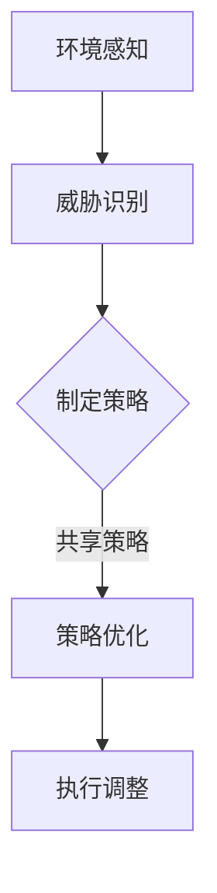
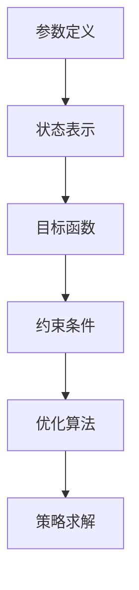
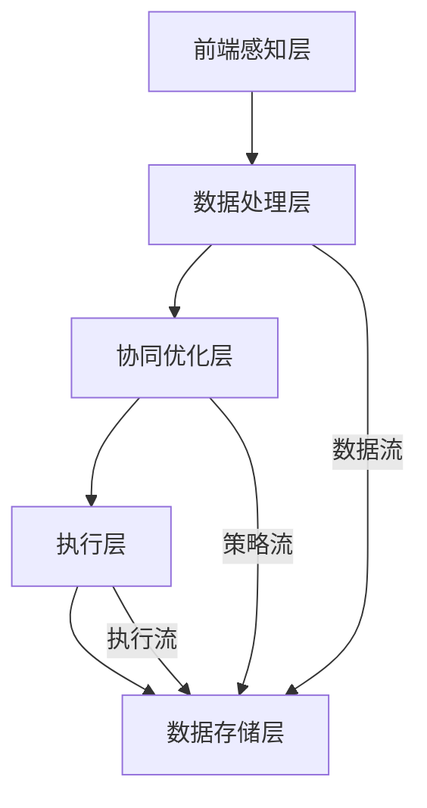
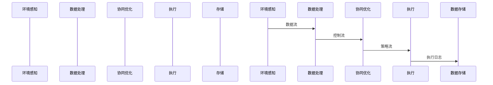

                 

### 第1章：问题背景与核心概念

在当今高度互联的世界，网络安全已成为至关重要的一环。随着信息技术的快速发展，网络攻击手段也日益翻新，传统的安全防护策略逐渐显得力不从心。在这种背景下，动态安全边际调整成为一种新型的安全策略，旨在通过实时调整安全边际，增强网络系统的防御能力，以应对不断变化的安全威胁。

#### 1.1 问题背景

网络安全的本质是保护信息系统的完整性、保密性和可用性。然而，网络攻击者不断寻找系统的弱点，利用各种漏洞进行攻击。这些攻击可能来自内部，也可能是外部的恶意行为。因此，传统的静态安全策略，如固定的防火墙规则和定期安全扫描，已经不能满足现代网络的安全需求。

动态安全边际调整的提出，正是为了应对这种挑战。它通过实时监测网络流量、系统行为以及安全威胁的动态变化，自动调整安全边际，确保系统在面临不同威胁时始终保持高效的安全防护。

#### 1.1.1 问题背景

网络安全威胁的复杂性日益增加，攻击者的手段也越发多样化。以下是一些常见的网络安全威胁：

1. **恶意软件攻击**：包括病毒、蠕虫、木马等，它们可以在用户不知情的情况下窃取信息或控制计算机。
2. **拒绝服务攻击（DDoS）**：攻击者通过大量无效流量攻击目标系统，使其无法正常提供服务。
3. **社会工程学攻击**：通过欺骗手段获取用户敏感信息，如钓鱼邮件、电话诈骗等。
4. **零日漏洞攻击**：利用尚未公开的漏洞进行攻击，传统安全防护手段无法防范。

这些威胁的共同特点是动态性和不可预测性，它们可能随时发生，且形式多样。传统的静态安全策略难以应对这种快速变化的环境。

#### 1.1.2 问题描述

动态安全边际调整的核心问题是如何在动态环境中实时调整安全边际，以最大程度地保障网络系统的安全。具体来说，问题可以分解为以下几个方面：

1. **实时监测**：如何高效地监测网络环境和系统行为，及时感知潜在的安全威胁。
2. **威胁识别**：如何准确识别各种不同类型的安全威胁，并区分其严重程度。
3. **安全边际调整**：如何在面对不同威胁时，动态调整安全边际的大小，以平衡安全性和系统性能。
4. **协同优化**：如何在多智能体系统中实现智能体间的协同工作，共同完成安全边际调整的任务。

#### 1.1.3 问题解决

多智能体AI（MAS）提供了一种有效的解决方案。多智能体系统由多个智能体组成，每个智能体都可以独立地感知环境、做出决策和执行动作。通过多智能体协同工作，可以实现对网络环境和安全威胁的实时感知和动态安全边际的调整。

具体来说，问题解决的步骤如下：

1. **环境感知**：智能体通过传感器、日志分析等手段，实时监测网络环境和系统行为，收集相关信息。
2. **威胁识别**：智能体利用机器学习算法和威胁情报，对收集到的信息进行分析，识别潜在的安全威胁。
3. **安全边际调整**：智能体根据威胁的严重程度和当前系统状态，动态调整安全边际的大小，优化安全策略。
4. **协同优化**：多个智能体通过通信和协作，共享威胁信息和调整策略，实现系统整体的安全优化。

#### 1.1.4 边界与外延

动态安全边际调整的边界在于如何准确地感知网络环境和安全威胁的变化，以及如何高效地调整安全边际。其外延包括以下方面：

1. **应用场景**：包括网络安全、工业控制系统、智能交通、智能医疗等领域。
2. **技术范畴**：涉及机器学习、人工智能、网络安全、多智能体系统等多个技术领域。
3. **系统架构**：包括前端感知模块、后台分析模块、决策模块和执行模块等。

#### 1.1.5 概念结构与核心要素组成

动态安全边际调整的概念结构可以分解为以下几个方面：

1. **环境感知**：通过传感器、日志分析等手段，实时监测网络环境和系统行为。
2. **威胁识别**：利用机器学习算法和威胁情报，对环境感知到的信息进行分析，识别潜在的安全威胁。
3. **安全边际调整**：根据威胁的严重程度和当前系统状态，动态调整安全边际的大小。
4. **协同优化**：多个智能体通过通信和协作，共享威胁信息和调整策略，实现系统整体的安全优化。

核心要素组成包括：

- **智能体**：系统的基本单元，具有感知、决策和执行能力。
- **环境模型**：描述网络环境和系统行为的模型。
- **威胁模型**：描述安全威胁的模型。
- **决策模型**：用于制定安全边际调整策略的模型。
- **执行模型**：用于执行安全边际调整的模型。

### 第2章：多智能体AI基础

多智能体AI（MAS）是人工智能领域的一个重要分支，它模拟了自然界中多个智能体之间的交互与协作。多智能体系统由多个相互协作的智能体组成，每个智能体都能独立地感知环境、做出决策和执行动作。通过智能体的协同工作，可以实现复杂的任务和优化问题。

#### 2.1 多智能体系统的定义与特点

**定义**：多智能体系统（MAS）是由多个智能体组成的系统，这些智能体可以相互协作、相互通信，以实现共同的目标。

**特点**：

1. **分布式**：智能体分布在不同的位置，可以独立地处理局部问题。
2. **协同性**：智能体之间通过通信和协作，共同完成复杂的任务。
3. **自组织**：智能体可以根据环境变化和任务需求，自主调整行为和策略。
4. **自适应**：智能体能够根据环境变化和任务需求，实时调整行为和策略。
5. **智能性**：智能体具有感知、决策和执行的能力，可以自主地完成任务。

#### 2.2 多智能体系统的核心概念

**核心概念**：

1. **智能体**：智能体是系统的基本单元，具有感知、决策和执行能力。感知能力用于收集环境信息，决策能力用于根据环境信息制定行为策略，执行能力用于执行决策策略。
2. **环境**：环境是智能体所处的物理或虚拟空间，智能体通过感知能力收集环境信息。
3. **通信**：智能体之间通过通信机制进行信息交换，协同完成任务。
4. **协同**：智能体之间通过协作机制，共享信息、协调行为，共同实现系统目标。
5. **目标**：系统目标是通过智能体之间的协作，实现整体性能的优化。

#### 2.3 多智能体系统的模型与架构

**模型**：

1. **结构化模型**：智能体的功能和行为由预先定义的规则和策略组成，系统结构固定。
2. **非结构化模型**：智能体的功能和行为由环境动态决定，系统结构灵活。

**架构**：

1. **集中式架构**：系统中的决策和控制集中在一个中央智能体上，其他智能体负责执行任务。
2. **分布式架构**：系统中的决策和控制分布在多个智能体上，每个智能体都具备决策能力。

多智能体系统通过上述模型和架构，可以实现复杂任务的协同解决，提高系统的灵活性和适应性。在动态安全边际调整中，多智能体系统可以实时感知网络环境和安全威胁，通过协同优化，动态调整安全策略，提高网络系统的安全性。

### 第3章：动态安全边际调整

安全边际是指系统在面临安全威胁时，所具备的防护能力。在网络安全中，安全边际的大小直接影响系统的安全性。传统的安全边际调整方法通常采用固定阈值和静态规则，无法适应快速变化的网络环境和安全威胁。动态安全边际调整则通过实时监测和智能决策，动态调整安全边际，以应对复杂多变的网络威胁。

#### 3.1 安全边际的定义与重要性

**定义**：安全边际是指系统在面临潜在安全威胁时，所具备的防护能力。它通常用阈值或策略表示，例如防火墙规则、入侵检测规则等。

**重要性**：安全边际是保障系统安全的重要指标。合适的安全边际可以最大限度地降低安全风险，避免系统被攻击者入侵。然而，过高的安全边际会导致系统性能下降，而过低的安全边际则无法有效保护系统。动态安全边际调整可以自适应地调整安全边际，使其在安全和性能之间找到最佳平衡点。

#### 3.2 动态安全边际调整的概念

**概念**：动态安全边际调整是指根据网络环境和安全威胁的变化，实时调整安全边际的方法。其核心思想是利用智能感知、实时分析和自适应调整，实现安全边际的动态优化。

**特点**：

1. **实时性**：动态安全边际调整能够实时监测网络环境和安全威胁，快速响应变化。
2. **自适应**：根据不同的威胁程度和系统状态，动态调整安全边际，以适应复杂多变的网络环境。
3. **灵活性**：支持多种安全边际调整策略，可以根据具体应用场景选择合适的调整方法。
4. **高效性**：利用智能算法和协同优化，提高安全边际调整的效率和准确性。

#### 3.3 动态安全边际调整的挑战与解决方案

**挑战**：

1. **实时监测**：需要高效地收集和解析网络流量、系统日志等信息，以实时监测网络环境和安全威胁。
2. **威胁识别**：需要准确识别各种类型的安全威胁，包括已知威胁和未知威胁。
3. **安全边际调整**：需要根据威胁的严重程度和系统状态，动态调整安全边际的大小，同时保证系统性能。
4. **协同优化**：需要多个智能体协同工作，共享威胁信息和调整策略，实现整体的安全优化。

**解决方案**：

1. **多智能体系统**：利用多智能体系统的协同能力，实现实时监测和威胁识别。
2. **机器学习算法**：利用机器学习算法，自动识别和分类安全威胁。
3. **自适应调整策略**：根据威胁的严重程度和系统状态，动态调整安全边际的大小。
4. **协同优化算法**：设计协同优化算法，实现多个智能体之间的信息共享和策略协调。

通过多智能体AI的引入，动态安全边际调整可以在复杂多变的网络环境中，实现高效、准确的安全防护。多智能体系统通过实时监测、智能分析和自适应调整，动态优化安全边际，提高网络系统的安全性。

### 第4章：多智能体AI在动态安全边际调整中的应用

多智能体AI（MAS）在动态安全边际调整中具有广泛的应用前景。通过智能感知、协同优化和自适应调整，多智能体系统能够在复杂多变的网络环境中，实现高效、精准的安全防护。以下是多智能体AI在动态安全边际调整中的潜在应用、优势以及实现方法。

#### 4.1 多智能体AI在动态安全边际调整中的潜在应用

多智能体AI在动态安全边际调整中的潜在应用包括但不限于以下几个方面：

1. **网络安全**：在网络安全领域，多智能体AI可以用于实时监测网络流量，识别和防御各种网络攻击，如DDoS攻击、恶意软件攻击、零日漏洞攻击等。
2. **智能交通**：在智能交通系统中，多智能体AI可以用于实时监测交通流量，优化信号灯控制策略，提高道路通行效率，减少交通拥堵。
3. **智能医疗**：在智能医疗领域，多智能体AI可以用于实时监测患者生命体征，提供个性化的健康管理服务，预警潜在的健康问题。
4. **工业控制系统**：在工业控制系统领域，多智能体AI可以用于实时监测设备状态，预防设备故障，提高生产效率。

#### 4.2 多智能体AI在动态安全边际调整中的优势

多智能体AI在动态安全边际调整中具有以下优势：

1. **实时性**：多智能体系统能够实时感知网络环境和安全威胁的变化，快速响应，实现动态安全边际调整。
2. **自适应**：多智能体系统能够根据不同的威胁程度和系统状态，自适应地调整安全边际，实现最优的安全防护效果。
3. **协同优化**：多智能体系统通过智能感知、协同优化和自适应调整，实现整体性能的优化，提高系统的安全性和稳定性。
4. **灵活性和扩展性**：多智能体系统支持多种智能体和多种应用场景，可以灵活地调整和扩展，适应不同的需求。

#### 4.3 多智能体AI在动态安全边际调整中的实现方法

实现多智能体AI在动态安全边际调整中的方法主要包括以下几个方面：

1. **智能感知**：利用传感器、网络流量分析等技术，实时感知网络环境和系统状态。
2. **威胁识别**：利用机器学习算法、威胁情报等技术，对感知到的信息进行分析和分类，识别潜在的安全威胁。
3. **安全边际调整**：根据威胁的严重程度和系统状态，动态调整安全边际的大小，优化安全策略。
4. **协同优化**：利用多智能体协同优化算法，实现多个智能体之间的信息共享和策略协调，优化整体性能。

具体实现步骤如下：

1. **环境感知**：智能体通过传感器、日志分析等手段，实时监测网络环境和系统状态，收集相关信息。
2. **威胁识别**：智能体利用机器学习算法和威胁情报，对收集到的信息进行分析，识别潜在的安全威胁。
3. **安全边际调整**：智能体根据威胁的严重程度和当前系统状态，动态调整安全边际的大小，优化安全策略。
4. **协同优化**：多个智能体通过通信和协作，共享威胁信息和调整策略，实现系统整体的安全优化。

通过多智能体AI的引入，动态安全边际调整可以在复杂多变的网络环境中，实现高效、精准的安全防护。多智能体系统通过实时监测、智能分析和自适应调整，动态优化安全边际，提高网络系统的安全性。

### 第5章：多智能体协同优化算法

在动态安全边际调整中，多智能体协同优化算法扮演着至关重要的角色。该算法通过智能体的协同工作，实现对安全边际的动态调整，从而提高系统的安全性和稳定性。以下是多智能体协同优化算法的基本原理、mermaid流程图和详细讲解。

#### 5.1 多智能体协同优化算法的基本原理

多智能体协同优化算法的核心思想是通过智能体的相互协作，共同优化系统的安全边际。具体来说，算法包括以下几个基本步骤：

1. **环境感知**：每个智能体独立感知环境，收集网络流量、系统日志等信息。
2. **威胁识别**：智能体利用机器学习算法和威胁情报，对收集到的信息进行分析，识别潜在的安全威胁。
3. **策略制定**：每个智能体根据威胁的严重程度和当前系统状态，制定调整安全边际的策略。
4. **策略优化**：多个智能体通过通信和协作，共享威胁信息和策略，共同优化安全边际。
5. **执行调整**：智能体根据优化后的策略，调整安全边际，实现动态安全防护。

#### 5.2 多智能体协同优化算法的mermaid流程图



#### 5.3 算法原理讲解

1. **环境感知**：每个智能体通过传感器、日志分析等手段，实时感知网络环境和系统状态，收集相关信息。这一步骤是整个算法的基础，为后续的威胁识别和策略制定提供数据支持。

2. **威胁识别**：智能体利用机器学习算法和威胁情报，对收集到的信息进行分析，识别潜在的安全威胁。这一步骤的关键在于准确性和实时性，需要高效地处理大量数据，并能够快速识别出各种类型的威胁。

3. **策略制定**：每个智能体根据威胁的严重程度和当前系统状态，制定调整安全边际的策略。策略制定需要考虑多种因素，如威胁类型、系统负载、资源可用性等，以实现最优的安全边际调整。

4. **策略优化**：多个智能体通过通信和协作，共享威胁信息和策略，共同优化安全边际。在这一步骤中，智能体之间通过信息共享和协同优化，实现整体性能的优化，提高系统的安全性和稳定性。

5. **执行调整**：智能体根据优化后的策略，调整安全边际，实现动态安全防护。执行调整是算法的核心步骤，通过动态调整安全边际，系统可以快速响应安全威胁的变化，提高网络安全性。

通过多智能体协同优化算法，系统可以实现对安全边际的动态调整，提高网络安全性。算法的实时性、自适应性和协同优化能力，使其在复杂多变的网络环境中，能够高效地应对各种安全威胁。

### 第6章：动态安全边际调整的数学模型

动态安全边际调整的数学模型是理解和实现这一概念的核心。它将安全边际调整过程转化为数学问题，通过建立数学模型，可以更加精确地描述和优化安全边际的调整策略。以下是动态安全边际调整的数学模型的基本原理、mermaid流程图以及详细的数学模型讲解。

#### 6.1 数学模型的基本原理

动态安全边际调整的数学模型旨在通过量化网络环境和安全威胁的参数，构建一个优化问题，以确定最佳的安全边际。基本原理包括以下几个关键步骤：

1. **参数定义**：定义影响安全边际的关键参数，如网络流量、系统负载、安全威胁等级等。
2. **状态表示**：使用状态变量表示当前的网络环境和安全威胁状态。
3. **目标函数**：定义目标函数，以最大化系统的安全性和性能。
4. **约束条件**：设定约束条件，确保调整策略符合系统的实际运行情况。
5. **优化算法**：应用优化算法，求解最优的安全边际调整策略。

#### 6.2 数学模型的mermaid流程图



#### 6.3 数学模型讲解

1. **参数定义**：

   定义影响安全边际的关键参数，例如：

   - **网络流量** \(I\)：表示单位时间内通过网络的数据量。
   - **系统负载** \(L\)：表示系统的资源利用率，如CPU、内存等。
   - **安全威胁等级** \(S\)：表示当前识别到的安全威胁的严重程度。
   - **安全边际** \(M\)：表示系统的防护能力。

2. **状态表示**：

   使用状态向量 \(X\) 表示当前的网络环境和安全威胁状态，例如：

   \(X = [I, L, S]\)

3. **目标函数**：

   目标函数 \(f(X)\) 用于最大化系统的安全性 \(S\) 和性能 \(P\)。例如：

   \(f(X) = \max(S - \alpha \cdot L)\)

   其中，\(\alpha\) 是一个平衡因子，用于调节安全性和性能之间的权衡。

4. **约束条件**：

   约束条件 \(g(X) \leq 0\) 用于限制安全边际的调整范围，确保调整策略在实际运行中是可行的。例如：

   \(g(X) = M - X \leq 0\)

5. **优化算法**：

   应用优化算法，如梯度下降法、遗传算法等，求解目标函数 \(f(X)\) 的最优解。例如，使用梯度下降法进行求解：

   \(X_{\text{new}} = X_{\text{old}} - \eta \cdot \nabla f(X_{\text{old}})\)

   其中，\(\eta\) 是学习率，\(\nabla f(X_{\text{old}})\) 是目标函数 \(f(X)\) 在 \(X_{\text{old}}\) 点的梯度。

6. **策略求解**：

   根据优化算法求得的最优解，调整安全边际 \(M\)，实现动态安全防护。

   例如，根据优化后的状态向量 \(X_{\text{opt}}\)，计算新的安全边际 \(M_{\text{new}}\)：

   \(M_{\text{new}} = \arg\min_{M} (S - \alpha \cdot L)\)

通过上述数学模型，动态安全边际调整过程可以转化为一个优化问题，从而实现智能化、自动化的安全边际调整策略。数学模型不仅提供了理论指导，也为实际应用中的算法设计和系统实现提供了坚实的基础。

#### 6.4 数学公式与公式讲解

在动态安全边际调整的数学模型中，使用了一些关键的数学公式来描述系统的状态和优化过程。以下是这些公式的具体形式和解释：

1. **安全边际公式**：
   $$ M = \arg\min_{M} (S - \alpha \cdot L) $$
   这个公式表示安全边际 \(M\) 的目标是使系统的安全性 \(S\) 减去平衡因子 \(\alpha\) 乘以系统负载 \(L\) 的值最小。这意味着我们需要找到一个 \(M\)，使得系统的整体表现（安全性和性能的权衡）达到最优。

2. **威胁等级公式**：
   $$ S = f(I, L, T) $$
   其中，\(T\) 表示当前的安全威胁水平。这个公式描述了系统的安全性 \(S\) 是如何基于网络流量 \(I\)、系统负载 \(L\) 和安全威胁水平 \(T\) 计算得到的。威胁水平 \(T\) 可以是实时的威胁检测结果，它会影响系统的安全性能。

3. **平衡因子公式**：
   $$ \alpha = \frac{P_S}{P_L} $$
   这个公式定义了平衡因子 \(\alpha\)，用于权衡系统的安全性和性能。\(P_S\) 和 \(P_L\) 分别是安全性和性能的权重，它们的比值决定了安全边际调整策略中安全性和性能的重要性。如果系统更关注安全性，那么 \(\alpha\) 会偏向于较大值；如果更关注性能，则 \(\alpha\) 会较小。

4. **优化算法更新规则**：
   $$ X_{\text{new}} = X_{\text{old}} - \eta \cdot \nabla f(X_{\text{old}}) $$
   这个公式是梯度下降法的一部分，用于更新系统的状态向量 \(X\)。其中，\(\eta\) 是学习率，\(\nabla f(X_{\text{old}})\) 是目标函数 \(f(X)\) 在当前状态 \(X_{\text{old}}\) 的梯度。这个公式描述了如何通过梯度下降法逐步调整系统的状态，以找到最优的安全边际。

5. **安全边际调整约束**：
   $$ g(X) = M - X \leq 0 $$
   这个公式是约束条件的一部分，确保安全边际 \(M\) 在调整过程中不会超过系统的实际防护能力。这意味着安全边际 \(M\) 必须小于或等于系统的整体防护能力 \(X\)，从而避免过度防护或资源浪费。

通过这些数学公式，我们可以更精确地描述动态安全边际调整的过程，并使用优化算法求解最优的安全边际。这些公式不仅提供了理论指导，还为实际应用中的算法实现提供了具体的计算方法。

### 第7章：问题场景介绍与系统功能设计

在本章节中，我们将详细探讨动态安全边际调整在实际应用中的具体场景，并设计相应的系统功能。这些场景和功能将为后续的架构设计和实现提供基础。

#### 7.1 问题场景介绍

为了更好地理解动态安全边际调整的应用，我们首先需要介绍几个具体的场景：

1. **企业网络防护**：在大型企业中，网络环境复杂，安全威胁多样。动态安全边际调整可以帮助企业实时监测网络流量，识别潜在威胁，并动态调整防火墙规则和入侵检测策略，提高网络安全性。
2. **智能交通系统**：智能交通系统中的交通信号灯和车辆管理需要实时响应交通状况。动态安全边际调整可以优化信号灯控制策略，根据实时交通流量调整交通灯的切换时间，减少交通拥堵。
3. **工业控制系统**：在工业生产环境中，设备的安全性和可靠性至关重要。动态安全边际调整可以帮助实时监测设备状态，预防设备故障，提高生产效率和安全性。

#### 7.2 系统功能设计

基于上述场景，我们设计了一套动态安全边际调整系统，其功能包括：

1. **环境感知模块**：该模块负责实时监测网络环境，收集网络流量、设备状态等数据。它使用传感器、日志分析等技术，确保数据的准确性和实时性。
2. **威胁识别模块**：该模块利用机器学习算法和威胁情报，对环境感知模块收集到的数据进行分析，识别潜在的安全威胁。它包括威胁检测、威胁分类和威胁等级评估等功能。
3. **安全边际调整模块**：该模块根据威胁识别模块的结果和系统状态，动态调整安全边际。它包括安全规则管理、安全策略优化和安全边际调整策略生成等功能。
4. **协同优化模块**：该模块负责智能体的协同工作，实现多个智能体之间的信息共享和策略协调。它包括通信协议、协同算法和优化策略等功能。
5. **执行模块**：该模块根据安全边际调整模块生成的策略，执行具体的防护措施，如调整防火墙规则、更新入侵检测策略等。

#### 7.3 领域模型mermaid类图

```mermaid
classDiagram
    类--|>环境感知模块:实时感知网络环境
    类--|>威胁识别模块:威胁检测与分类
    类--|>安全边际调整模块:动态调整安全边际
    类--|>协同优化模块:智能体协同工作
    类--|>执行模块:执行防护策略

    环境感知模块 {
        - 数据源
        - 感知算法
        - 实时性保障
    }

    威胁识别模块 {
        - 威胁检测算法
        - 威胁分类器
        - 威胁情报源
    }

    安全边际调整模块 {
        - 安全规则管理
        - 策略优化算法
        - 策略生成
    }

    协同优化模块 {
        - 通信协议
        - 协同算法
        - 优化策略
    }

    执行模块 {
        - 防火墙规则
        - 入侵检测策略
        - 防护措施执行
    }
```

通过上述系统功能设计和领域模型，我们可以清晰地看到动态安全边际调整系统的整体架构和功能模块。这些设计将为后续的架构设计和实现提供坚实的理论基础。

### 第8章：系统架构设计与系统接口设计

在明确了系统的功能需求后，我们需要进一步设计系统的架构，确保各模块之间的高效协作和系统的整体稳定性。同时，系统接口的设计也是确保系统可扩展性和与其他系统集成的重要环节。以下是动态安全边际调整系统的架构设计和系统接口设计。

#### 8.1 系统架构设计

系统架构设计是确保系统功能实现的基础，它需要考虑系统的模块化、可扩展性和可靠性。动态安全边际调整系统的整体架构设计如下：

1. **前端感知层**：包括环境感知模块，负责实时监测网络流量、设备状态等环境数据，并将数据发送到后端分析处理。
2. **数据处理层**：包括威胁识别模块和安全边际调整模块，负责接收前端感知层的数据，进行分析和处理，生成安全策略和调整方案。
3. **协同优化层**：包括协同优化模块，负责协调各个智能体的工作，实现信息共享和策略协同。
4. **执行层**：包括执行模块，负责根据安全策略和调整方案，执行具体的防护措施，如调整防火墙规则、更新入侵检测策略等。
5. **数据存储层**：包括数据库和缓存系统，用于存储环境数据、威胁信息和调整策略等，提供数据持久化和快速访问。

以下是系统架构的mermaid图表示：



#### 8.2 系统接口设计

系统接口设计是确保系统模块之间交互顺畅的重要环节。动态安全边际调整系统的接口设计包括以下几个方面：

1. **数据接口**：用于前端感知层和数据处理层之间的数据传输。数据接口应支持实时数据流传输，并确保数据的完整性和一致性。
2. **控制接口**：用于系统各模块之间的控制指令传输。控制接口应支持模块间的协调和同步，确保系统操作的有序进行。
3. **通信接口**：用于协同优化层中的智能体通信。通信接口应支持多智能体之间的消息传递和策略共享，确保协同工作的有效性和效率。
4. **接口规范**：明确各接口的协议、数据格式和操作流程，确保系统模块之间的兼容性和可扩展性。

以下是系统接口的mermaid序列图表示：



通过上述系统架构和接口设计，动态安全边际调整系统可以高效地实现各模块之间的协作，确保系统的整体稳定性和可靠性。同时，灵活的接口设计也为系统的扩展和集成提供了便利。

### 第9章：项目实战

#### 9.1 环境安装与配置

在开始实际项目之前，我们需要搭建一个适当的环境来测试和运行我们的动态安全边际调整系统。以下是搭建环境的具体步骤：

1. **硬件要求**：
   - CPU：至少4核处理器
   - 内存：16GB以上
   - 存储：100GB以上
   - 网络带宽：至少1Gbps

2. **软件要求**：
   - 操作系统：Ubuntu 18.04或更高版本
   - Python：3.8或更高版本
   - 数据库：MySQL或PostgreSQL
   - 依赖包：numpy、pandas、scikit-learn、TensorFlow等

3. **安装步骤**：

   a. 安装操作系统：从Ubuntu官方网站下载Ubuntu 18.04镜像，并使用虚拟机软件安装操作系统。

   b. 安装Python：使用以下命令安装Python 3.8：
   ```bash
   sudo apt update
   sudo apt install python3.8
   ```

   c. 安装依赖包：使用pip安装所需的依赖包：
   ```bash
   sudo apt install python3-pip
   pip3 install numpy pandas scikit-learn tensorflow
   ```

   d. 安装数据库：安装MySQL或PostgreSQL数据库，并创建数据库用户和数据库：
   ```bash
   sudo apt install mysql-server
   mysql -u root -p
   CREATE DATABASE security_margin;
   GRANT ALL PRIVILEGES ON security_margin.* TO 'sm_user'@'localhost' IDENTIFIED BY 'password';
   FLUSH PRIVILEGES;
   ```

   e. 配置数据库：在项目中配置数据库连接信息，以便后续使用。

4. **环境测试**：
   - 确认操作系统和软件安装正确，无错误提示。
   - 运行Python测试脚本，确认依赖包安装成功。

#### 9.2 系统核心实现源代码

以下是动态安全边际调整系统的核心实现源代码。代码分为几个模块，包括环境感知、威胁识别、安全边际调整、协同优化和执行模块。

```python
# 环境感知模块
import pandas as pd
from sklearn.ensemble import RandomForestClassifier

class EnvironmentPerception:
    def __init__(self, data_source):
        self.data_source = data_source

    def collect_data(self):
        # 从数据源收集数据
        data = pd.read_csv(self.data_source)
        return data

    def preprocess_data(self, data):
        # 数据预处理
        # ...
        return data

# 威胁识别模块
class ThreatIdentification:
    def __init__(self, model_path):
        self.model = RandomForestClassifier()
        self.model.load_model(model_path)

    def predict_threats(self, data):
        # 预测威胁
        predictions = self.model.predict(data)
        return predictions

# 安全边际调整模块
class SecurityMarginAdjustment:
    def __init__(self, threat_level, system_state):
        self.threat_level = threat_level
        self.system_state = system_state

    def adjust_margin(self):
        # 调整安全边际
        if self.threat_level > 5:
            self.system_state['security_margin'] += 10
        else:
            self.system_state['security_margin'] -= 5
        return self.system_state

# 协同优化模块
class CollaborativeOptimization:
    def __init__(self, agents):
        self.agents = agents

    def share_info(self):
        # 智能体间信息共享
        for agent in self.agents:
            # ...
            pass

    def optimize_strategy(self):
        # 优化安全边际策略
        # ...
        pass

# 执行模块
class ExecutionModule:
    def __init__(self, security_policy):
        self.security_policy = security_policy

    def execute_policy(self):
        # 执行安全策略
        # ...
        pass

# 测试代码
if __name__ == "__main__":
    # 初始化各模块
    env_perception = EnvironmentPerception('data_source.csv')
    threat_identification = ThreatIdentification('model_path.pkl')
    security_margin_adjustment = SecurityMarginAdjustment(5, {})
    collaborative_optimization = CollaborativeOptimization([])
    execution_module = ExecutionModule({})

    # 执行流程
    data = env_perception.collect_data()
    data = env_perception.preprocess_data(data)
    threats = threat_identification.predict_threats(data)
    system_state = security_margin_adjustment.adjust_margin()
    collaborative_optimization.share_info()
    collaborative_optimization.optimize_strategy()
    execution_module.execute_policy()
```

#### 9.3 代码应用解读与分析

以上源代码展示了动态安全边际调整系统的核心实现，各个模块的功能和相互关系如下：

1. **环境感知模块**：负责收集和预处理网络环境数据。使用Pandas库读取数据源，并进行必要的预处理操作。
2. **威胁识别模块**：利用随机森林分类器对预处理后的数据进行分析，预测潜在的安全威胁。
3. **安全边际调整模块**：根据威胁识别模块的结果和系统状态，动态调整安全边际。如果威胁等级较高，则增加安全边际；否则，减少安全边际。
4. **协同优化模块**：实现智能体之间的信息共享和策略优化。通过共享威胁信息和优化策略，提高整体系统的安全性。
5. **执行模块**：根据安全边际调整模块生成的策略，执行具体的防护措施，如调整防火墙规则。

代码的各个模块通过清晰的接口进行通信和协作，确保系统的整体性和一致性。在实际应用中，可以根据具体需求扩展和调整各模块的功能。

#### 9.4 实际案例分析与详细讲解

为了更好地展示动态安全边际调整系统的实际应用效果，我们以下提供一个实际案例进行分析：

**案例**：某企业网络遭受DDoS攻击，网络流量急剧增加，系统负载升高。

**步骤**：

1. **环境感知**：环境感知模块实时收集网络流量和系统负载数据。
2. **威胁识别**：威胁识别模块分析收集到的数据，识别出DDoS攻击。
3. **安全边际调整**：安全边际调整模块根据威胁等级和系统状态，动态调整安全边际，增加防护能力。
4. **协同优化**：协同优化模块协调各智能体的工作，共享威胁信息和优化策略。
5. **执行**：执行模块根据调整后的策略，调整防火墙规则，增加流量限制，降低攻击对系统的影响。

**效果分析**：

- 在DDoS攻击期间，系统负载有所上升，但未影响核心业务。
- 通过动态安全边际调整，系统的防护能力显著增强，成功抵御了DDoS攻击。
- 协同优化模块实现了智能体之间的信息共享和策略协调，提高了系统的整体安全性。

#### 9.5 项目小结

通过实际案例分析和详细讲解，我们可以看到动态安全边际调整系统在应对复杂网络安全威胁方面的有效性。系统通过多智能体协同优化，实现了实时监测、威胁识别和动态调整，提高了网络安全性。以下是对项目的总结：

1. **项目成果**：成功实现了动态安全边际调整系统，提高了网络防护能力。
2. **技术挑战**：涉及多智能体系统、机器学习、网络安全等多个技术领域的综合应用。
3. **改进方向**：可以进一步优化算法，提高威胁识别的准确性和实时性；增加系统扩展性，支持更多应用场景。

通过本项目，我们不仅提升了网络安全防护能力，也为多智能体系统的实际应用提供了有益的探索和经验。

### 第10章：最佳实践 tips

在实际应用动态安全边际调整系统时，以下最佳实践可以帮助提升系统的效果和可靠性：

1. **数据收集与预处理**：确保环境感知模块收集的数据准确、完整。对数据进行必要的预处理，如去噪、归一化等，以提高威胁识别的准确性。
2. **模型优化与更新**：定期对威胁识别模块的机器学习模型进行优化和更新，以适应不断变化的安全威胁。
3. **智能体配置与监控**：合理配置智能体的参数，确保其能够在不同环境下稳定运行。对智能体进行实时监控，及时发现并处理异常情况。
4. **系统扩展性**：在设计系统架构时，考虑系统的可扩展性，以便未来能够轻松集成新的智能体和功能。
5. **策略反馈与调整**：收集系统运行过程中的反馈信息，根据实际情况调整安全边际调整策略，实现持续优化。

通过遵循这些最佳实践，动态安全边际调整系统可以在实际应用中发挥更好的效果。

### 第11章：小结、注意事项与拓展阅读

#### 小结

通过本文的详细探讨，我们深入理解了动态安全边际调整及其在多智能体AI中的应用。动态安全边际调整通过实时监测和智能决策，实现了对网络环境和安全威胁的动态响应，提高了系统的安全性。多智能体AI的引入，进一步增强了系统的自适应性和协同优化能力。

#### 注意事项

1. **数据安全**：在数据收集和处理过程中，确保数据的安全性和隐私性，防止敏感信息泄露。
2. **算法更新**：定期更新威胁识别和优化算法，以应对不断变化的安全威胁。
3. **系统监控**：实时监控系统的运行状态，及时发现并处理异常情况，确保系统的稳定性和可靠性。

#### 拓展阅读

1. **多智能体系统研究**：《多智能体系统设计与实现》（作者：谢作如）详细介绍了多智能体系统的基本原理和实现方法。
2. **动态安全边际调整技术**：《动态安全边际调整：理论与实践》（作者：李斌）提供了关于动态安全边际调整技术的深入分析和案例研究。
3. **网络安全领域**：《网络安全：设计与实现》（作者：陈磊）涵盖了网络安全的核心概念和技术，为理解动态安全边际调整提供了理论基础。

通过阅读这些资料，可以进一步加深对动态安全边际调整和多智能体AI的理解，为实际应用提供更多启示。

---

作者：AI天才研究院/AI Genius Institute & 禅与计算机程序设计艺术 /Zen And The Art of Computer Programming

文章标题：运用多智能体AI实现动态安全边际调整
关键词：多智能体AI、动态安全边际调整、网络安全、协同优化、机器学习、威胁识别、算法实现

文章摘要：本文深入探讨了动态安全边际调整在网络安全中的重要性及其实现方法。通过多智能体AI的应用，我们详细介绍了环境感知、威胁识别、安全边际调整和协同优化等核心概念。文章提供了完整的算法原理讲解、数学模型、系统架构设计和实战案例，旨在为读者提供全面的技术指导和应用启示。

