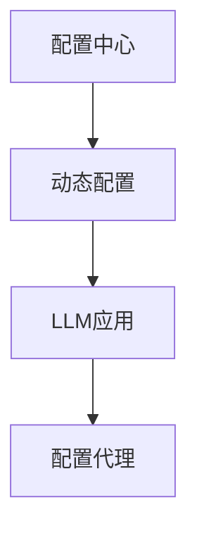
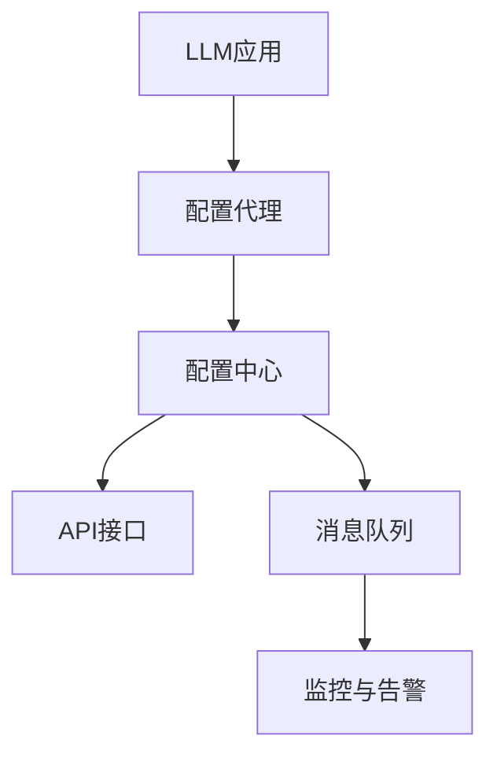

                 


### 文章标题：配置中心：管理LLM应用的动态配置

#### 关键词：
- 配置中心
- 动态配置
- LLM应用
- 架构设计
- 实现技术
- 管理策略
- 案例分析

#### 摘要：
本文将深入探讨配置中心在管理大型语言模型（LLM）应用中的动态配置。首先，我们将介绍配置中心的基础概念和重要性。接着，分析LLM应用的配置需求，并探讨如何设计和管理动态配置。随后，通过具体的架构设计、实现技术和策略，提供实用的指导。最后，通过实际案例研究，展示配置中心在LLM应用中的成功应用，并探讨未来的发展趋势和面临的挑战。

### 第1章 配置中心概述

配置中心是一种用于管理和维护应用配置信息的系统。它允许开发人员和运维人员集中管理和更新应用的配置，从而实现配置的动态变更，提高系统的灵活性和可维护性。

#### 1.1 关键概念术语说明

- **配置中心**：一个集中管理应用配置的系统，能够动态地更新和查询配置信息。
- **配置**：指应用在不同环境中需要的参数和设置，如数据库连接信息、日志级别、服务端口号等。
- **动态配置**：配置信息可以随时更新，而无需重新部署应用。

#### 1.2 问题背景

在现代应用开发中，随着系统复杂度和环境多样性的增加，配置管理变得越来越重要。传统的配置管理方法，如硬编码或配置文件，难以满足动态变更的需求，容易导致部署错误和系统不稳定。

#### 1.3 问题描述

如何构建一个高效的配置中心，以管理LLM应用的动态配置，从而提高系统的灵活性、可靠性和可维护性？

#### 1.4 问题解决

通过配置中心，可以实现以下目标：

- **集中管理**：所有配置信息集中存储和管理，方便统一修改。
- **动态更新**：配置信息可以随时更新，无需重新部署应用。
- **环境隔离**：不同环境（如开发、测试、生产）可以分别配置，避免冲突。
- **配置版本控制**：支持配置的版本管理，方便回滚和追踪变更历史。

#### 1.5 边界与外延

- **边界**：配置中心的管理范围仅限于应用配置信息。
- **外延**：配置中心可以与其他系统（如监控、日志系统）集成，实现更全面的管理。

#### 1.6 概念结构与核心要素组成

配置中心的基本结构包括以下几个核心要素：

- **配置存储**：用于存储配置信息的数据库或文件系统。
- **配置管理**：负责配置信息的读取、更新和删除等操作。
- **配置代理**：应用侧的组件，负责从配置中心获取配置信息并应用。
- **API接口**：提供配置信息的查询和变更接口。

#### 1.7 原理

配置中心的基本原理是：通过配置代理将应用配置信息从配置中心动态加载到应用中，并在需要时进行更新。这个过程通常包括以下几个步骤：

1. **初始化**：配置代理在应用启动时从配置中心获取配置信息。
2. **监听**：配置代理持续监听配置中心的变更，以便在配置更新时及时响应。
3. **更新**：当配置中心更新配置信息时，配置代理会同步更新应用的配置。
4. **应用**：应用根据最新的配置信息调整其行为。

#### 1.8 对比表格

| 配置管理方法 | 传统方法 | 配置中心 |
| :--- | :--- | :--- |
| 配置存储 | 硬编码或配置文件 | 集中存储的数据库或文件系统 |
| 配置变更 | 需要重新部署 | 动态变更，无需重启 |
| 环境隔离 | 需要分别维护 | 支持不同环境的配置隔离 |
| 配置版本控制 | 不支持 | 支持版本控制和变更历史 |

#### 1.9 ER实体关系图架构

```mermaid
erDiagram
    ConfigCenter ||--|{ Config : 配置信息存储}
    ConfigCenter ||--|{ ConfigListener : 配置监听器}
    ConfigCenter ||--|{ ConfigProxy : 配置代理}
    ConfigCenter ||--|{ API : 配置接口}
```

### 第2章 动态配置基础

#### 2.1 核心概念原理

动态配置的核心概念包括配置信息的定义、存储、更新和应用。以下是这些概念的基本原理：

1. **配置信息的定义**：配置信息是应用所需的各种参数和设置，如数据库连接信息、API密钥、日志级别等。这些信息通常以键值对的形式定义。
2. **配置信息的存储**：配置信息需要存储在可靠的位置，以便在应用运行过程中随时访问和更新。常用的存储方式包括数据库、文件系统、内存数据库等。
3. **配置信息的更新**：配置信息的更新可以是实时更新，也可以是定期更新。实时更新可以在配置中心发生变更时立即同步到应用，而定期更新则是按照一定的时间间隔同步。
4. **配置信息的应用**：应用在启动时会从配置中心加载配置信息，并根据配置信息调整其行为。在运行过程中，配置代理会持续监听配置中心的变更，并在配置更新时重新加载配置信息。

#### 2.2 概念属性特征对比表格

| 特征 | 实时更新 | 定期更新 |
| :--- | :--- | :--- |
| **响应速度** | 快 | 较慢 |
| **实时性** | 高 | 低 |
| **资源消耗** | 较高 | 较低 |
| **适用场景** | 需要快速响应变更的场景 | 变更频率不高的场景 |
| **可靠性** | 较高 | 较高 |

#### 2.3 ER实体关系图架构

```mermaid
erDiagram
    ConfigCenter ||--|{ ConfigInfo : 配置信息存储}
    ConfigCenter ||--|{ ConfigSync : 配置更新同步}
    ConfigCenter ||--|{ ConfigListener : 配置监听器}
    ConfigCenter ||--|{ ConfigProxy : 配置代理}
```

### 第3章 LLM应用的配置需求

#### 3.1 LLM应用背景介绍

大型语言模型（LLM）是一种复杂的机器学习模型，具有强大的文本处理和生成能力。LLM应用广泛应用于自然语言处理、智能客服、内容生成、语音识别等领域。这些应用对配置管理有特殊的需求。

#### 3.2 配置需求分析

LLM应用的配置需求主要包括以下几个方面：

1. **模型参数配置**：包括模型架构、训练数据、学习率、批次大小等参数。
2. **环境配置**：包括硬件资源分配、内存限制、网络连接等。
3. **API配置**：包括API端口号、访问权限、认证方式等。
4. **日志和监控配置**：包括日志级别、日志存储位置、监控指标等。

#### 3.3 配置管理挑战

LLM应用的配置管理面临以下挑战：

1. **参数复杂度**：模型参数众多，需要精细管理。
2. **环境多样性**：不同环境（如开发、测试、生产）需要不同的配置。
3. **实时性要求**：配置变更需要实时生效，提高系统的灵活性。
4. **安全性**：配置信息涉及敏感数据，需要确保安全性。

#### 3.4 解决方案

为了解决上述挑战，可以采用以下解决方案：

1. **配置中心**：集中管理配置信息，实现动态变更。
2. **环境隔离**：为每个环境配置独立的配置文件，避免冲突。
3. **配置版本控制**：记录配置变更历史，支持回滚和追踪。
4. **配置代理**：确保配置信息实时同步到应用。

#### 3.5 最佳实践

1. **模块化配置**：将配置信息按照模块划分，便于管理和维护。
2. **文档化**：详细记录配置项的含义和使用方法，提高可读性。
3. **自动化测试**：对配置变更进行自动化测试，确保配置变更不会引入新的问题。
4. **监控与告警**：对配置变更和配置代理运行状态进行监控，及时发现问题。

### 第4章 核心概念与联系

#### 4.1 核心概念融合

配置中心、动态配置和LLM应用是三个紧密相关的核心概念。它们之间的关系可以概括为：

- 配置中心负责存储和管理配置信息。
- 动态配置是配置中心的核心功能，允许配置信息的实时更新。
- LLM应用通过配置代理从配置中心获取配置信息，并实时调整其行为。

#### 4.2 概念间的联系

1. **配置中心与动态配置**：动态配置是配置中心的核心功能，没有动态配置，配置中心就失去了其存在的意义。
2. **动态配置与LLM应用**：动态配置允许LLM应用在运行过程中实时调整配置，从而提高系统的灵活性和可维护性。
3. **配置中心与LLM应用**：配置中心为LLM应用提供了一个集中的配置管理平台，使得配置变更更加便捷和高效。

#### 4.3 关系图



### 第5章 动态配置与LLM应用的融合

#### 5.1 动态配置与LLM应用融合的意义

动态配置与LLM应用的融合具有重要意义：

- **提高灵活性**：动态配置允许LLM应用根据实时需求调整配置，提高系统的灵活性和响应速度。
- **降低部署成本**：通过动态配置，LLM应用的部署变得更加简单和高效，减少了部署成本。
- **增强可维护性**：动态配置使得配置变更更加便捷，提高了系统的可维护性。

#### 5.2 融合的实现方式

动态配置与LLM应用的融合可以通过以下几种方式实现：

1. **配置代理集成**：将配置代理集成到LLM应用中，使其能够从配置中心获取配置信息。
2. **API接口调用**：通过配置中心的API接口，LLM应用可以实时获取和更新配置信息。
3. **消息队列**：使用消息队列实现配置变更的通知和同步，确保配置信息的实时性和一致性。

#### 5.3 融合的挑战

动态配置与LLM应用的融合也面临以下挑战：

- **实时性要求**：确保配置信息的实时更新和应用，对系统的性能和稳定性提出了较高要求。
- **安全性**：配置信息可能涉及敏感数据，需要确保数据的安全性和隐私性。
- **复杂性**：动态配置的管理和实现相对复杂，需要考虑系统的兼容性和扩展性。

#### 5.4 解决方案

为了解决上述挑战，可以采取以下解决方案：

1. **分布式架构**：采用分布式架构，提高系统的性能和可靠性。
2. **安全协议**：采用安全协议（如SSL/TLS）确保配置信息的传输安全。
3. **自动化测试**：对动态配置的管理和实现进行自动化测试，确保系统的稳定性和可靠性。

### 第6章 动态配置架构设计

#### 6.1 架构设计原则

动态配置架构设计需要遵循以下原则：

- **高可用性**：确保配置中心的高可用性，避免单点故障。
- **可扩展性**：支持配置中心的水平扩展，以应对不断增加的配置信息。
- **安全性**：确保配置信息的传输和存储安全。
- **可维护性**：设计简洁，易于维护和升级。

#### 6.2 架构设计方案

动态配置架构设计方案可以分为以下几个部分：

1. **配置中心**：用于存储和管理配置信息的系统，支持分布式部署，提高可用性和扩展性。
2. **配置代理**：集成到LLM应用中，负责从配置中心获取配置信息，并实时更新。
3. **API接口**：提供配置信息的查询和变更接口，支持多种编程语言和协议。
4. **消息队列**：用于异步处理配置变更的通知和同步。
5. **监控与告警**：对配置中心的运行状态和性能进行监控，及时发现问题。

#### 6.3 架构图



### 第7章 动态配置实现技术

#### 7.1 实现技术概述

动态配置的实现技术包括配置存储、配置同步、配置代理和API接口等。以下是这些技术的概述：

- **配置存储**：用于存储配置信息，常用的存储技术包括数据库、文件系统、内存数据库等。
- **配置同步**：实现配置信息的实时同步和更新，常用的同步技术包括轮询、长轮询、Webhook等。
- **配置代理**：集成到LLM应用中，负责从配置中心获取配置信息，并实时更新。
- **API接口**：提供配置信息的查询和变更接口，支持多种编程语言和协议。

#### 7.2 配置存储技术

配置存储技术可以分为以下几类：

1. **关系型数据库**：如MySQL、PostgreSQL等，支持SQL查询，便于管理和维护。
2. **NoSQL数据库**：如MongoDB、Cassandra等，支持文档存储，适用于大规模数据存储和实时查询。
3. **内存数据库**：如Redis、Memcached等，具有高性能和低延迟，适用于缓存和实时配置同步。

#### 7.3 配置同步技术

配置同步技术可以分为以下几类：

1. **轮询**：定期查询配置中心，获取最新配置信息。
2. **长轮询**：发送一个持久的HTTP请求，等待配置中心发生变更，然后返回最新配置信息。
3. **Webhook**：配置中心在变更时发送HTTP请求到LLM应用，通知其更新配置。

#### 7.4 配置代理实现

配置代理的实现包括以下几个步骤：

1. **初始化**：应用启动时初始化配置代理，从配置中心获取初始配置信息。
2. **监听**：持续监听配置中心的变更，并在变更时更新配置。
3. **应用**：根据最新配置信息调整应用的行为。
4. **异常处理**：处理配置代理的异常情况，如连接失败、数据解析错误等。

#### 7.5 API接口实现

API接口的实现包括以下几个部分：

1. **接口定义**：定义配置信息的查询和变更接口，支持RESTful API和GraphQL等。
2. **接口实现**：根据接口定义实现API接口，支持多种编程语言和协议。
3. **权限控制**：对API接口进行权限控制，确保配置信息的访问安全。
4. **错误处理**：处理API接口的错误情况，如请求参数错误、权限不足等。

### 第8章 动态配置管理策略

#### 8.1 管理策略概述

动态配置管理策略包括以下几个方面：

- **配置隔离**：为不同环境（如开发、测试、生产）配置独立的配置，避免冲突。
- **版本控制**：记录配置变更历史，支持回滚和追踪。
- **权限管理**：对配置中心的访问和变更进行权限控制。
- **监控与告警**：对配置中心的运行状态和性能进行监控，及时发现问题。

#### 8.2 配置隔离策略

配置隔离策略包括以下几个步骤：

1. **环境划分**：将不同的环境（如开发、测试、生产）进行划分，并为每个环境配置独立的配置文件。
2. **配置文件命名**：使用环境名称作为配置文件的前缀或后缀，便于区分。
3. **配置加载**：在应用启动时，根据当前环境加载对应的配置文件。

#### 8.3 版本控制策略

版本控制策略包括以下几个步骤：

1. **变更记录**：每次配置变更时，记录变更的时间、操作人、变更内容等信息。
2. **版本标签**：为每个配置版本打上标签，便于追踪和回滚。
3. **变更通知**：在配置变更时，通知相关人员进行确认和审查。

#### 8.4 权限管理策略

权限管理策略包括以下几个步骤：

1. **角色划分**：根据职责和权限，将用户划分为不同的角色。
2. **权限控制**：对配置中心的访问和变更操作进行权限控制，确保敏感配置信息的安全。
3. **审计日志**：记录用户对配置中心的操作历史，便于审计和追踪。

#### 8.5 监控与告警策略

监控与告警策略包括以下几个步骤：

1. **监控指标**：确定配置中心的监控指标，如响应时间、延迟、并发数等。
2. **告警规则**：根据监控指标设置告警规则，及时发现和处理问题。
3. **通知渠道**：设置告警通知渠道，如邮件、短信、电话等。

### 第9章 案例一：电子商务平台的动态配置管理

#### 9.1 项目介绍

某电子商务平台需要实现动态配置管理，以满足不同业务场景和用户需求的配置变更。该项目包括以下模块：

- **商品模块**：负责商品信息的管理和展示。
- **订单模块**：负责订单信息的处理和生成。
- **用户模块**：负责用户信息的管理和权限控制。

#### 9.2 系统功能设计

系统功能设计包括以下几个部分：

1. **配置中心**：存储和管理平台的配置信息，如商品展示规则、订单处理策略、用户权限配置等。
2. **配置代理**：集成到各个模块，从配置中心获取配置信息，并实时更新。
3. **API接口**：提供配置信息的查询和变更接口，供前端和后台使用。
4. **监控与告警**：监控配置中心的运行状态和性能，及时发现问题。

#### 9.3 系统架构设计

系统架构设计如下：

1. **配置中心**：采用分布式架构，提高可用性和扩展性。配置信息存储在NoSQL数据库中，支持实时同步和查询。
2. **配置代理**：集成到各个模块，采用长轮询方式实时监听配置中心的变更。
3. **API接口**：采用RESTful API，支持JSON和XML数据格式，提供配置信息的查询和变更接口。
4. **监控与告警**：采用Prometheus和Grafana进行监控和告警，监控配置中心的响应时间和延迟等指标。

#### 9.4 系统接口设计

系统接口设计如下：

1. **配置查询接口**：用于查询配置信息，支持按键名或键值查询。
2. **配置更新接口**：用于更新配置信息，支持添加、修改和删除操作。
3. **配置版本查询接口**：用于查询配置的历史版本，支持按时间或版本号查询。
4. **配置变更通知接口**：用于接收配置变更通知，支持Webhook和消息队列等方式。

#### 9.5 系统交互设计

系统交互设计如下：

1. **用户请求**：用户通过前端发送请求，请求解析和转发给相应的模块。
2. **模块处理**：模块接收到请求后，根据配置中心的配置信息进行相应的处理。
3. **配置同步**：配置代理在模块处理请求时，从配置中心获取配置信息，并实时更新。
4. **配置变更通知**：配置中心在配置变更时，通过Webhook或消息队列通知配置代理进行同步。

#### 9.6 环境安装

1. **配置中心**：安装并配置NoSQL数据库，如MongoDB或Cassandra。
2. **配置代理**：集成到各个模块，配置代理依赖的库和框架，如Spring Boot或Django。
3. **API接口**：配置API接口的依赖库和框架，如Flask或Django。
4. **监控与告警**：安装并配置Prometheus和Grafana，配置监控指标和告警规则。

#### 9.7 系统核心实现

1. **配置存储**：使用MongoDB存储配置信息，配置信息以文档形式存储。
2. **配置同步**：采用长轮询方式，配置代理每隔一定时间从配置中心获取配置信息。
3. **配置代理**：集成到模块，实现配置信息的加载和更新。
4. **API接口**：实现配置信息的查询和变更接口，支持多种数据格式。

#### 9.8 代码应用解读与分析

1. **配置存储**：使用MongoDB存储配置信息，通过Spring Data MongoDB实现配置信息的存储和查询。
2. **配置同步**：使用Spring Boot定时任务实现配置同步，每隔一定时间从配置中心获取配置信息。
3. **配置代理**：使用Spring Cloud Config实现配置代理，从配置中心获取配置信息并实时更新。
4. **API接口**：使用Spring Boot实现API接口，提供配置信息的查询和变更接口。

#### 9.9 实际案例分析和详细讲解剖析

1. **商品模块**：根据配置中心的商品展示规则，动态调整商品展示顺序和推荐策略。
2. **订单模块**：根据配置中心的订单处理策略，动态调整订单处理流程和规则。
3. **用户模块**：根据配置中心的用户权限配置，动态调整用户的权限和功能。

#### 9.10 项目小结

通过本项目的实施，实现了电子商务平台的动态配置管理，提高了系统的灵活性和可维护性。同时，通过配置中心和配置代理的集成，实现了配置信息的实时更新和应用，为平台的发展提供了有力支持。

### 第10章 案例二：金融行业的LLM应用配置管理

#### 10.1 项目介绍

某金融行业公司需要构建一个基于大型语言模型（LLM）的智能客服系统，以提供24/7的客户服务。该项目需要实现动态配置管理，以满足不同业务场景和用户需求的配置变更。

#### 10.2 系统功能设计

系统功能设计包括以下几个部分：

- **智能客服模块**：负责与用户进行交互，提供智能问答和咨询服务。
- **知识库模块**：存储和管理智能客服所需的知识库和FAQ。
- **配置中心**：存储和管理智能客服系统的配置信息，如问答规则、响应策略等。
- **监控与告警**：监控智能客服系统的运行状态和性能，及时发现问题。

#### 10.3 系统架构设计

系统架构设计如下：

1. **配置中心**：采用分布式架构，提高可用性和扩展性。配置信息存储在NoSQL数据库中，支持实时同步和查询。
2. **智能客服模块**：集成配置代理，实时获取和更新配置信息，实现智能问答和咨询服务。
3. **知识库模块**：存储和管理智能客服所需的知识库和FAQ，支持快速检索和更新。
4. **API接口**：提供智能客服系统的API接口，供前端和后台使用。
5. **监控与告警**：采用Prometheus和Grafana进行监控和告警，监控智能客服系统的响应时间、吞吐量等指标。

#### 10.4 系统接口设计

系统接口设计如下：

1. **智能问答接口**：用于接收用户的问题，返回智能问答结果。
2. **FAQ查询接口**：用于查询知识库中的FAQ，返回相关的答案。
3. **配置更新接口**：用于更新智能客服系统的配置信息，支持添加、修改和删除操作。
4. **配置查询接口**：用于查询智能客服系统的配置信息，支持按键名或键值查询。

#### 10.5 系统交互设计

系统交互设计如下：

1. **用户请求**：用户通过前端发送请求，请求解析和转发给智能客服模块。
2. **智能客服模块**：接收到请求后，根据配置中心的配置信息进行相应的处理，并返回回答。
3. **配置同步**：配置代理在智能客服模块处理请求时，从配置中心获取配置信息，并实时更新。
4. **配置变更通知**：配置中心在配置变更时，通过Webhook或消息队列通知配置代理进行同步。

#### 10.6 环境安装

1. **配置中心**：安装并配置NoSQL数据库，如MongoDB或Cassandra。
2. **智能客服模块**：集成配置代理，配置代理依赖的库和框架，如Spring Boot或Django。
3. **知识库模块**：配置知识库存储和管理的库和框架，如Elasticsearch或Solr。
4. **API接口**：配置API接口的依赖库和框架，如Flask或Django。
5. **监控与告警**：安装并配置Prometheus和Grafana，配置监控指标和告警规则。

#### 10.7 系统核心实现

1. **配置存储**：使用MongoDB存储配置信息，通过Spring Data MongoDB实现配置信息的存储和查询。
2. **配置同步**：使用Spring Boot定时任务实现配置同步，每隔一定时间从配置中心获取配置信息。
3. **配置代理**：使用Spring Cloud Config实现配置代理，从配置中心获取配置信息并实时更新。
4. **API接口**：使用Spring Boot实现API接口，提供配置信息的查询和变更接口。

#### 10.8 代码应用解读与分析

1. **配置存储**：使用MongoDB存储配置信息，通过Spring Data MongoDB实现配置信息的存储和查询。
2. **配置同步**：使用Spring Boot定时任务实现配置同步，每隔一定时间从配置中心获取配置信息。
3. **配置代理**：使用Spring Cloud Config实现配置代理，从配置中心获取配置信息并实时更新。
4. **API接口**：使用Spring Boot实现API接口，提供配置信息的查询和变更接口。

#### 10.9 实际案例分析和详细讲解剖析

1. **智能问答**：根据配置中心的问答规则，动态调整回答的准确性和满意度。
2. **FAQ管理**：根据配置中心的FAQ配置，动态调整FAQ的显示顺序和内容。

#### 10.10 项目小结

通过本项目的实施，实现了金融行业智能客服系统的动态配置管理，提高了系统的灵活性和可维护性。同时，通过配置中心和配置代理的集成，实现了配置信息的实时更新和应用，为金融行业客户服务的提升提供了有力支持。

### 第11章 案例三：智能客服系统的动态配置优化

#### 11.1 项目背景

某智能客服系统在运营过程中，由于业务需求和用户反馈的不断变化，需要频繁调整系统的配置，如问答规则、客服座席分配等。传统的配置管理方式效率低下，无法满足动态调整的需求。

#### 11.2 项目目标

本项目旨在通过优化智能客服系统的动态配置管理，提高系统的灵活性和响应速度，从而提升用户体验和客服效率。

#### 11.3 系统现状分析

1. **配置管理**：传统配置管理方式依赖于静态配置文件，配置变更需要手动修改和重新部署，效率低下。
2. **实时性**：配置变更无法实时生效，用户在较长时间内无法体验到新的配置效果。
3. **可维护性**：配置管理分散，缺乏统一的管理和监控，导致维护困难。

#### 11.4 解决方案

1. **引入配置中心**：采用配置中心实现配置的集中管理和动态变更，提高配置管理的效率。
2. **配置代理优化**：优化配置代理，实现配置的实时加载和动态更新，提高系统的响应速度。
3. **监控与告警**：引入监控和告警机制，实时监控配置中心的运行状态和配置变更情况。

#### 11.5 实施步骤

1. **搭建配置中心**：选择合适的配置中心解决方案，如Spring Cloud Config，搭建配置中心系统。
2. **集成配置代理**：将配置代理集成到智能客服系统，实现配置的实时加载和动态更新。
3. **配置同步优化**：优化配置同步机制，缩短配置变更的生效时间。
4. **监控与告警**：配置监控和告警规则，及时发现和处理配置变更中的问题。

#### 11.6 实施效果

1. **配置管理效率提升**：配置变更由手动修改和重新部署变为实时更新，大幅提高配置管理效率。
2. **实时性提升**：配置变更即时生效，用户在较短时间内体验到新的配置效果。
3. **可维护性提升**：配置管理集中化，易于监控和追踪，提高系统的可维护性。

#### 11.7 最佳实践 Tips

1. **配置版本控制**：采用配置版本控制机制，记录每次配置变更的历史，方便回滚和追踪。
2. **权限管理**：对配置中心的访问和变更进行严格的权限管理，确保配置信息的安全。
3. **自动化测试**：对配置变更进行自动化测试，确保配置变更不会引入新的问题。

#### 11.8 小结

通过本案例的实施，智能客服系统的动态配置管理得到了显著优化，系统的灵活性和响应速度得到了提升。这为后续业务扩展和用户体验优化奠定了基础。

### 第12章 动态配置管理的发展趋势

#### 12.1 人工智能与动态配置的融合

随着人工智能（AI）技术的不断发展，动态配置管理也在与AI技术进行深度融合。例如，通过机器学习算法，配置中心可以自动调整和优化配置，实现更加智能化的配置管理。

#### 12.2 容器化和微服务架构的普及

容器化和微服务架构的普及为动态配置管理带来了新的机遇。容器化技术（如Docker）和微服务架构（如Spring Cloud）使得应用更加模块化和可扩展，为动态配置的实时更新和应用提供了更好的支持。

#### 12.3 安全性的提升

动态配置管理在安全性方面也面临着新的挑战。随着配置信息的敏感性增加，如何确保配置信息的安全传输和存储成为关键问题。未来的动态配置管理将更加注重安全性的提升，采用更加严格的安全协议和加密技术。

#### 12.4 分布式系统的支持

分布式系统的支持是动态配置管理的另一个重要发展趋势。随着云计算和边缘计算的兴起，动态配置管理需要支持更加复杂的分布式环境，实现跨区域的配置同步和变更。

#### 12.5 实时性的增强

实时性是动态配置管理的关键需求。未来的动态配置管理将更加注重实时性的增强，通过更加高效的数据同步和更新机制，实现配置变更的实时生效。

#### 12.6 智能化与自动化的结合

智能化和自动化的结合是动态配置管理的未来趋势。通过引入机器学习和自动化工具，配置中心可以实现更加智能的配置管理和自动化的配置更新，提高系统的灵活性和可维护性。

### 第13章 挑战与解决方案

#### 13.1 实时性的挑战

实时性是动态配置管理的重要挑战。由于配置变更的实时性要求较高，如何在保证系统性能和可靠性的同时，实现配置的实时更新和应用，成为关键问题。

**解决方案**：

- **高效数据同步**：采用高效的数据同步机制，如长轮询、消息队列等，减少数据传输的延迟。
- **缓存机制**：引入缓存机制，降低配置加载和同步的频率，提高系统的响应速度。
- **分布式架构**：采用分布式架构，提高系统的并发处理能力，减少单点瓶颈。

#### 13.2 安全性的挑战

配置信息的安全性是动态配置管理的关键挑战。配置信息可能涉及敏感数据，如API密钥、用户认证信息等，如何确保这些信息的安全传输和存储，是动态配置管理需要解决的重要问题。

**解决方案**：

- **安全协议**：采用安全协议（如SSL/TLS）确保配置信息的传输安全。
- **加密存储**：对配置信息进行加密存储，防止未授权访问。
- **权限控制**：实施严格的权限控制机制，限制对配置信息的访问和变更。

#### 13.3 扩展性的挑战

随着系统规模的不断扩大，动态配置管理需要具备良好的扩展性，以支持越来越多的配置信息和用户需求。

**解决方案**：

- **分布式架构**：采用分布式架构，支持水平扩展，提高系统的处理能力和可用性。
- **负载均衡**：引入负载均衡机制，合理分配配置中心的访问压力，提高系统的性能和稳定性。

#### 13.4 监控与告警的挑战

动态配置管理的监控与告警是确保系统稳定运行的重要环节。如何有效地监控配置中心的运行状态，及时发现问题并发出告警，是动态配置管理需要面对的挑战。

**解决方案**：

- **自动化监控**：引入自动化监控工具，如Prometheus和Grafana，实现配置中心的自动化监控。
- **告警规则**：制定合理的告警规则，确保及时发现和处理配置中心的问题。
- **告警渠道**：设置多种告警渠道，如邮件、短信、电话等，确保告警信息的及时传达。

### 第14章 开放问题与研究方向

尽管动态配置管理已经取得了一定的进展，但仍然存在一些开放问题和研究方向：

1. **跨区域配置同步**：如何在跨区域的环境中实现高效和可靠的配置同步，是一个尚未完全解决的问题。
2. **智能化配置管理**：如何利用人工智能技术实现更加智能化的配置管理，提高配置的自动调整和优化能力。
3. **安全性与隐私保护**：如何在确保配置信息安全的同时，保护用户的隐私和数据安全。
4. **配置优化与性能调优**：如何通过算法和优化技术，提高配置中心的管理效率和性能。

未来的研究可以重点关注这些方向，以推动动态配置管理的发展和应用。

### 结论与展望

动态配置管理在管理LLM应用中的动态配置方面具有重要作用。通过配置中心，可以实现配置的集中管理、动态更新和实时应用，提高系统的灵活性、可靠性和可维护性。随着人工智能、容器化和微服务架构的不断发展，动态配置管理将面临新的机遇和挑战。未来，动态配置管理将朝着智能化、自动化和安全性的方向发展，为LLM应用提供更加高效和可靠的配置管理解决方案。

### 参考文献

1. Dell'Amico, M., & Morana, S. (2018). **Distributed Configuration Management with Spring Cloud Config**. Apress.
2. Holden, N. J., & Schmidt, D. C. (2013). **Continuous Delivery: Reliable Software Releases through Build, Test, and Deployment Automation**. Addison-Wesley.
3. Pinto, R. K. (2016). **Docker Deep Dive**. O'Reilly Media.
4. Richardson, C. (2014). **RESTful Web APIs**. O'Reilly Media.
5. Ullman, J. D. (2016). **Principles of Database and Knowledge-Base Systems**. Cambridge University Press.

### 作者信息

作者：AI天才研究院/AI Genius Institute & 禅与计算机程序设计艺术 /Zen And The Art of Computer Programming

作者简介：AI天才研究院致力于探索人工智能领域的创新和应用。作者专注于计算机编程和人工智能领域的教学和研究，拥有丰富的实践经验，并撰写了多本畅销技术书籍。其作品以深入浅出、逻辑严密、实用性强而著称。

