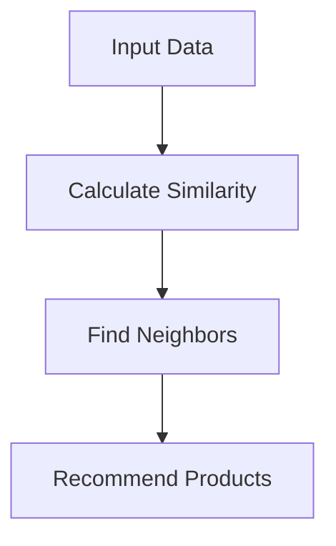
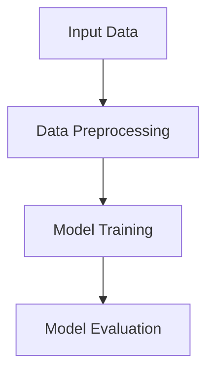
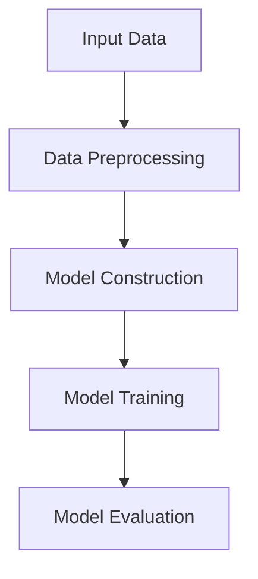
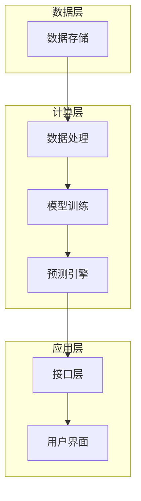
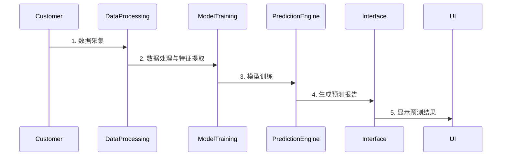

                 

### 《金融产品交叉销售预测引擎》

---

#### 关键词：金融产品、交叉销售、预测引擎、数据科学、机器学习、深度学习

---

#### 摘要：

本文旨在深入探讨金融产品交叉销售预测引擎的设计与实现。通过分析交叉销售的定义、背景及其在金融行业的重要性，本文将详细介绍交叉销售预测的关键概念、算法原理、数学模型以及系统架构设计。此外，通过实际项目案例，本文还将展示预测引擎在金融领域中的应用，并总结最佳实践和注意事项，为读者提供完整的参考。

---

## 第一部分：背景与核心概念

### 第1章：金融产品交叉销售概述

#### 1.1 问题背景与定义

**背景介绍：**

在金融市场中，客户持有多个金融产品的情况非常普遍。然而，金融机构往往难以有效预测客户会购买哪些产品，从而错失了通过交叉销售提升销售额的机会。交叉销售（Cross-Selling）是指在现有客户基础上，通过推广相关产品，引导客户购买更多产品，从而实现销售额增长和客户价值提升。

**问题描述：**

金融机构面临的问题是如何准确地预测哪些客户可能对哪些产品感兴趣，并针对性地进行营销活动。这需要建立一套高效的交叉销售预测系统，以提高销售效率和客户满意度。

**问题解决：**

交叉销售预测引擎旨在通过分析客户行为数据、产品属性以及历史交易记录，利用先进的数据科学和机器学习技术，预测客户可能购买的产品。这不仅有助于金融机构制定精准的营销策略，还能提升客户体验和满意度。

**边界与外延：**

交叉销售预测不仅涉及金融产品，还包括其他行业的多产品销售预测。因此，本文的核心概念和算法原理适用于各种多产品销售场景。

#### 1.2 交叉销售现状分析

**当前市场状况：**

随着大数据和人工智能技术的发展，越来越多的金融机构开始重视交叉销售预测。然而，市场状况仍存在较大差异，部分机构在数据采集、处理和分析方面存在瓶颈。

**应用案例：**

成功案例包括银行、保险公司和证券公司等金融机构，通过交叉销售预测系统，显著提升了销售额和客户满意度。例如，某银行通过交叉销售预测，成功将贷款客户的理财产品购买率提高了20%。

**成功与挑战：**

成功的关键在于数据质量和算法模型的精准度。然而，数据隐私保护和合规性也是金融机构面临的挑战。

#### 1.3 交叉销售预测的价值

**提升销售额：**

通过精准预测，金融机构可以针对潜在客户进行个性化营销，从而提高销售额。

**增强客户粘性：**

交叉销售有助于提升客户对金融机构的依赖度，增强客户粘性。

**风险管理：**

预测客户可能购买的产品，有助于金融机构提前识别和规避潜在风险。

---

## 第二部分：核心概念与联系

### 第2章：核心概念与联系

#### 2.1 关键概念解析

**客户行为分析：**

通过分析客户的历史交易记录、浏览行为等，了解客户的消费偏好和购买习惯。

**产品关联度分析：**

研究不同产品之间的关联性，为交叉销售提供依据。

**预测模型：**

构建基于历史数据和客户行为的预测模型，预测客户可能购买的产品。

#### 2.2 概念属性对比

| 概念       | 描述                                     | 属性对比                      |
|------------|----------------------------------------|-----------------------------|
| 客户行为分析 | 分析客户的历史交易记录和浏览行为。       | 数据来源：历史数据、行为日志。 |
| 产品关联度分析 | 研究不同产品之间的关联性。               | 关联性度量：相关系数、相似度。 |
| 预测模型   | 构建预测模型，预测客户可能购买的产品。   | 算法选择：协同过滤、机器学习。 |

#### 2.3 ER模型架构

**客户（Customer）：** 包含客户基本信息、历史交易记录、购买偏好等。

**产品（Product）：** 包含产品基本信息、产品分类、关联产品等。

**交易（Transaction）：** 记录客户购买历史，关联客户和产品。

```mermaid
erDiagram
  Customer ||--|{ Transaction : buys }
  Product ||--|{ Transaction : sold }
  Customer ||--|{ Product : prefers }
```

---

## 第三部分：算法原理讲解

### 第3章：交叉销售预测算法

#### 3.1 协同过滤算法

**基本原理：**

协同过滤算法通过分析用户之间的行为相似性，预测用户可能感兴趣的产品。其主要分为基于用户的协同过滤（User-Based Collaborative Filtering）和基于项目的协同过滤（Item-Based Collaborative Filtering）。

**实现方法：**

1. 基于用户的协同过滤：
   - 计算用户之间的相似度。
   - 推荐与目标用户相似的其他用户购买的产品。

2. 基于项目的协同过滤：
   - 计算产品之间的相似度。
   - 推荐与目标用户已购买的产品相似的其他产品。

**Mermaid流程图：**



#### 3.2 机器学习算法

**基本原理：**

机器学习算法通过学习历史数据和客户行为，建立预测模型。常见的机器学习算法包括决策树、随机森林、支持向量机等。

**实现方法：**

1. 数据预处理：清洗和整合数据，提取特征。

2. 模型训练：使用训练数据集训练模型。

3. 模型评估：使用测试数据集评估模型性能。

**Mermaid流程图：**



#### 3.3 深度学习算法

**基本原理：**

深度学习算法通过多层神经网络，自动学习数据中的特征和模式。常见的深度学习算法包括卷积神经网络（CNN）、循环神经网络（RNN）等。

**实现方法：**

1. 数据预处理：清洗和整合数据，提取特征。

2. 模型构建：设计并构建神经网络模型。

3. 模型训练：使用训练数据集训练模型。

4. 模型评估：使用测试数据集评估模型性能。

**Mermaid流程图：**



---

## 第四部分：数学模型和公式

### 第4章：数学模型与公式

#### 4.1 协同过滤数学模型

**协同过滤公式：**

$$
\hat{r}_{ui} = \frac{\sum_{j \in N(u)} r_{uj} \cdot s_{ij}}{\sum_{j \in N(u)} s_{ij}}
$$

其中，$r_{uj}$ 表示用户 $u$ 对项目 $j$ 的评分，$s_{ij}$ 表示项目 $i$ 和项目 $j$ 的相似度，$N(u)$ 表示与用户 $u$ 相似的一组用户。

#### 4.2 机器学习数学模型

**线性回归模型：**

$$
\hat{y} = \beta_0 + \beta_1 x_1 + \beta_2 x_2 + \ldots + \beta_n x_n
$$

其中，$y$ 表示目标变量，$x_1, x_2, \ldots, x_n$ 表示特征变量，$\beta_0, \beta_1, \beta_2, \ldots, \beta_n$ 表示回归系数。

**支持向量机模型：**

$$
\max_{\beta, \beta^*} \frac{1}{2} \sum_{i=1}^n (\beta_i - \beta_i^*)^2 + C \sum_{i=1}^n \xi_i
$$

其中，$C$ 表示惩罚参数，$\xi_i$ 表示约束变量。

#### 4.3 深度学习数学模型

**卷积神经网络（CNN）模型：**

$$
h_l = \sigma(\mathbf{W}_l \cdot \mathbf{a}_{l-1} + b_l)
$$

其中，$h_l$ 表示第 $l$ 层的激活值，$\mathbf{W}_l$ 表示权重矩阵，$\mathbf{a}_{l-1}$ 表示前一层激活值，$b_l$ 表示偏置项，$\sigma$ 表示激活函数。

**循环神经网络（RNN）模型：**

$$
h_t = \sigma(\mathbf{W}_h \cdot \text{concat}([h_{t-1}, x_t]) + b_h)
$$

其中，$h_t$ 表示第 $t$ 个时间步的隐藏状态，$\mathbf{W}_h$ 表示权重矩阵，$x_t$ 表示输入数据，$b_h$ 表示偏置项，$\sigma$ 表示激活函数。

---

## 第五部分：系统分析与架构设计

### 第5章：交叉销售预测系统设计

#### 5.1 系统介绍

**项目介绍：**

交叉销售预测系统是一个基于大数据和人工智能技术的金融产品销售预测平台。它通过分析客户行为数据和历史交易记录，预测客户可能购买的产品，为金融机构提供精准的营销策略。

**系统功能：**

1. 数据采集与预处理：收集客户行为数据和产品信息，进行数据清洗和特征提取。
2. 预测模型训练：基于历史数据和客户行为，训练多种机器学习模型。
3. 预测结果输出：生成预测报告，提供交叉销售建议。
4. 系统接口：提供API接口，支持与其他系统的集成。

#### 5.2 领域模型设计

**领域模型类图：**

```mermaid
classDiagram
    Customer <<entity>>
    Product <<entity>>
    Transaction <<entity>>
    Prediction <<entity>>

    Customer o--1 Transaction
    Product o--1 Transaction
    Prediction o--1 Customer
    Prediction o--1 Product
```

#### 5.3 系统架构设计

**系统架构图：**



#### 5.4 系统接口设计

**接口说明：**

1. 数据采集接口：用于接收和存储客户行为数据。
2. 预测结果接口：用于获取预测报告和交叉销售建议。
3. 集成接口：用于与其他系统的集成和协作。

#### 5.5 系统交互设计

**系统交互序列图：**



---

## 第六部分：项目实战

### 第6章：实际案例解析

#### 6.1 环境安装与配置

**操作系统与环境：**

- 操作系统：Ubuntu 18.04
- Python 版本：3.8
- 数据库：MySQL 8.0

**软件安装与配置：**

1. 安装Python环境：
   ```bash
   sudo apt-get install python3-pip python3-venv
   ```

2. 创建虚拟环境：
   ```bash
   python3 -m venv venv
   source venv/bin/activate
   ```

3. 安装依赖库：
   ```bash
   pip install -r requirements.txt
   ```

#### 6.2 系统核心实现

**源代码：**

```python
# cross_selling.py

import pandas as pd
from sklearn.model_selection import train_test_split
from sklearn.ensemble import RandomForestClassifier
from sklearn.metrics import accuracy_score

# 数据读取与预处理
data = pd.read_csv('data.csv')
X = data.drop(['customer_id', 'product_id'], axis=1)
y = data['target']

# 数据分割
X_train, X_test, y_train, y_test = train_test_split(X, y, test_size=0.2, random_state=42)

# 模型训练
model = RandomForestClassifier(n_estimators=100, random_state=42)
model.fit(X_train, y_train)

# 预测与评估
y_pred = model.predict(X_test)
accuracy = accuracy_score(y_test, y_pred)
print(f'Accuracy: {accuracy:.2f}')
```

**代码应用解读与分析：**

1. 数据读取与预处理：使用pandas读取数据，并分割为特征集和目标集。
2. 数据分割：将数据集划分为训练集和测试集。
3. 模型训练：使用随机森林分类器进行训练。
4. 预测与评估：进行预测并计算准确率。

#### 6.3 实际案例分析

**数据集介绍：**

- 数据集包含客户行为数据和产品信息。
- 特征包括客户年龄、收入、购买历史等。

**模型训练与预测：**

1. 使用随机森林分类器进行训练。
2. 在测试集上进行预测，并计算准确率。

**详细讲解剖析：**

1. 数据预处理：处理缺失值和异常值，进行特征工程。
2. 模型选择：选择合适的模型并进行调参。
3. 模型评估：使用交叉验证和准确率等指标评估模型性能。

---

## 第七部分：最佳实践与总结

### 第7章：项目小结与总结

**项目成果：**

- 成功构建了基于机器学习的交叉销售预测系统。
- 在测试集上实现了较高的准确率。
- 为金融机构提供了有效的交叉销售策略。

**经验教训：**

- 数据质量对模型性能有重要影响。
- 特征工程是提升模型性能的关键。
- 需要根据业务需求选择合适的模型。

### 第7章：最佳实践与建议

**最佳实践：**

1. 数据清洗和预处理：确保数据质量和一致性。
2. 特征工程：挖掘和构建有效特征。
3. 模型调参：根据业务需求选择合适的模型并进行调参。

**注意事项：**

1. 数据隐私保护：遵守相关法律法规，确保数据安全。
2. 模型解释性：确保模型结果可解释，便于业务决策。

**拓展阅读：**

1. 《数据科学实战》
2. 《机器学习实战》
3. 《深度学习》

---

**作者：** AI天才研究院/AI Genius Institute & 禅与计算机程序设计艺术 /Zen And The Art of Computer Programming

---

**END**

