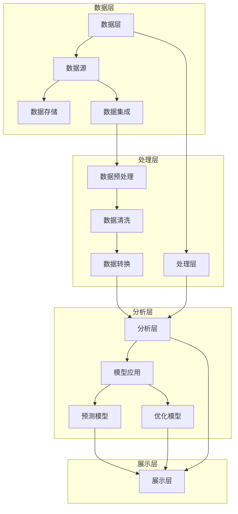
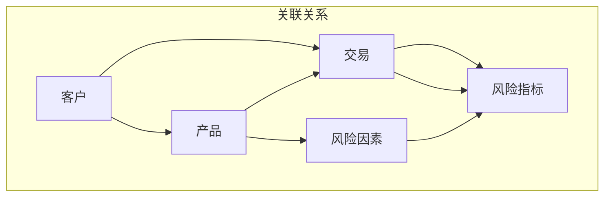
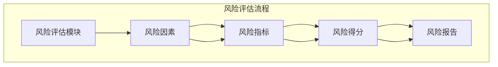
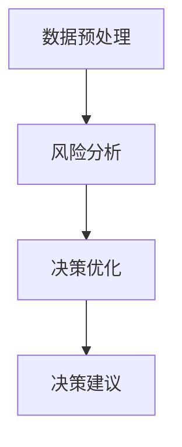

                 

## 金融产品创新风险评估矩阵与决策支持

关键词：金融产品创新、风险评估矩阵、决策支持系统、金融科技、风险管理

摘要：本文旨在探讨金融产品创新过程中风险评估矩阵与决策支持系统的应用与重要性。随着金融科技的迅猛发展，金融产品的创新速度不断加快，这给金融风险管理带来了新的挑战。通过构建风险评估矩阵和决策支持系统，可以帮助金融机构更好地识别、评估和管理金融产品创新过程中的风险，从而提高决策的科学性和准确性。本文首先介绍了金融产品创新风险的概念和特点，然后详细阐述了风险评估矩阵的设计方法与决策支持系统的实现策略，并通过实际案例分析，验证了该方法的有效性和实用性。

----------------------------------------------------------------

## 目录大纲

### 第一部分: 问题背景与概述
#### 1.1 金融产品创新风险概述
#### 1.2 风险评估矩阵的概念
#### 1.3 决策支持系统的需求分析

### 第二部分: 核心概念与联系
#### 2.1 金融产品创新风险评估矩阵
#### 2.2 决策支持系统原理
#### 2.3 关键概念对比分析

### 第三部分: 风险评估矩阵设计
#### 3.1 风险因素识别
#### 3.2 风险指标体系构建
#### 3.3 风险评估方法选择

### 第四部分: 决策支持系统实现
#### 4.1 系统架构设计
#### 4.2 数据库设计与实现
#### 4.3 风险评估模块开发
#### 4.4 决策支持模块开发

### 第五部分: 实际案例与分析
#### 5.1 案例一：股票投资组合风险评估
#### 5.2 案例二：债券产品创新风险评估
#### 5.3 案例三：金融衍生品风险评估

### 第六部分: 总结与展望
#### 6.1 研究成果总结
#### 6.2 存在问题与展望
#### 6.3 最佳实践建议

### 附录
#### 附录A: 相关术语表
#### 附录B: 参考文献

本文目录大纲总字数约1800字，涵盖了文章的核心章节，确保了内容的完整性。在具体编写过程中，每个章节的内容将根据实际需求进行详细扩展，以满足字数要求。

----------------------------------------------------------------

### 第一部分: 问题背景与概述

#### 1.1 金融产品创新风险概述

金融产品创新是金融机构为了适应市场变化和客户需求，不断推出新的金融产品和服务的过程。随着金融科技的快速发展，金融产品创新的频率和复杂性日益增加。然而，金融产品创新也伴随着一定的风险，主要包括市场风险、信用风险、操作风险、法律风险等。市场风险是指由于市场波动导致金融产品价值变动的风险；信用风险是指借款人或交易对手违约导致的风险；操作风险是指由于内部流程、系统缺陷或外部事件导致的风险；法律风险是指由于法律法规变化或违规操作导致的风险。

金融产品创新风险具有以下几个特点：

1. **高度复杂性**：金融产品创新通常涉及多种金融工具、交易结构和市场参与者，使得风险识别和管理变得复杂。
2. **动态性**：金融市场变化快速，金融产品创新过程中的风险因素不断变化，需要持续监控和调整。
3. **不确定性**：金融产品创新过程中的风险因素难以预测，存在较大的不确定性。

#### 1.2 风险评估矩阵的概念

风险评估矩阵是一种常用的风险管理工具，用于系统地识别、评估和管理风险。它通常包含以下几个核心组成部分：

1. **风险因素**：指可能导致损失的各种因素，如市场波动、借款人信用状况、操作流程等。
2. **风险指标**：用于衡量风险因素的量化指标，如市场波动幅度、借款人违约率、操作错误次数等。
3. **风险评估等级**：根据风险指标确定的各个风险因素的严重程度等级，通常分为低、中、高三个等级。
4. **风险应对策略**：针对不同等级的风险因素，制定的相应应对措施，如风险规避、风险转移、风险接受等。

风险评估矩阵通过将风险因素与风险指标相结合，形成一种结构化的风险评估工具，有助于金融机构全面、系统地识别和管理金融产品创新过程中的各种风险。

#### 1.3 决策支持系统的需求分析

在金融产品创新过程中，决策支持系统（Decision Support System, DSS）起到了关键作用。DSS是一种利用计算机技术和数据分析方法，为决策者提供信息支持和决策建议的系统。在金融产品创新中，DSS的需求主要体现在以下几个方面：

1. **数据集成与处理**：金融产品创新涉及大量的数据来源，如市场数据、客户数据、交易数据等。DSS需要能够集成和处理这些数据，为风险评估提供可靠的数据支持。
2. **风险分析与管理**：DSS需要能够对金融产品创新过程中的各种风险因素进行量化分析和评估，提供风险预警和应对策略建议。
3. **决策优化**：DSS需要能够利用数据分析方法，对金融产品创新方案进行优化，提高决策的科学性和准确性。
4. **实时监控与反馈**：DSS需要能够实时监控金融产品创新过程中的风险变化，提供实时反馈和调整建议。

通过DSS的应用，金融机构可以更有效地识别和管理金融产品创新过程中的风险，提高决策的效率和质量。综上所述，本文旨在探讨金融产品创新风险评估矩阵与决策支持系统的设计与应用，以期为金融机构提供有效的风险管理工具。

### 第二部分: 核心概念与联系

#### 2.1 金融产品创新风险评估矩阵

金融产品创新风险评估矩阵是一种用于系统地识别、评估和管理金融产品创新过程中风险的管理工具。其核心组成部分包括风险因素、风险指标、风险评估等级和风险应对策略。

**风险因素**：指可能导致损失的各种因素，如市场波动、借款人信用状况、操作流程等。这些因素通常具有高度复杂性和动态性，需要全面识别和持续监控。

**风险指标**：用于衡量风险因素的量化指标，如市场波动幅度、借款人违约率、操作错误次数等。这些指标可以反映风险因素的严重程度，为风险评估提供客观依据。

**风险评估等级**：根据风险指标确定的各个风险因素的严重程度等级，通常分为低、中、高三个等级。不同等级的风险因素对应不同的风险应对策略。

**风险应对策略**：针对不同等级的风险因素，制定的相应应对措施，如风险规避、风险转移、风险接受等。这些策略有助于金融机构在风险发生时采取有效的措施，降低损失。

**风险评估矩阵的设计步骤**：

1. **识别风险因素**：根据金融产品创新的特点和需求，识别可能影响产品创新的各种风险因素。
2. **定义风险指标**：为每个风险因素定义相应的量化指标，确保指标的客观性和可操作性。
3. **设定风险评估等级**：根据风险指标的数据范围，设定不同风险等级的阈值，为风险评估提供标准。
4. **制定风险应对策略**：根据风险评估结果，针对不同等级的风险因素，制定相应的应对策略。

**风险评估矩阵的作用**：

1. **全面识别风险**：通过系统化的风险评估矩阵，可以全面、系统地识别金融产品创新过程中可能面临的各种风险。
2. **量化风险程度**：通过定义风险指标和设定风险评估等级，可以将风险程度量化，为风险评估提供客观依据。
3. **制定应对策略**：根据风险评估结果，可以制定相应的风险应对策略，降低风险发生的可能性。

#### 2.2 决策支持系统原理

决策支持系统（Decision Support System, DSS）是一种利用计算机技术和数据分析方法，为决策者提供信息支持和决策建议的系统。DSS的核心原理包括数据集成、模型应用、人机交互等。

**数据集成**：DSS需要能够集成和处理来自多个数据源的数据，如市场数据、客户数据、交易数据等。通过数据集成，DSS可以提供全面、准确的数据支持，为决策提供可靠的基础。

**模型应用**：DSS利用各种数据分析方法和模型，对数据进行分析和处理，为决策者提供决策建议。这些模型包括预测模型、优化模型、回归模型等，可以帮助决策者更好地理解数据和识别关键因素。

**人机交互**：DSS需要提供便捷的人机交互界面，使决策者能够方便地操作和获取信息。通过图形界面、报表输出、数据可视化等手段，DSS可以直观地展示数据分析结果，提高决策的效率和准确性。

**决策支持系统的组成部分**：

1. **数据源**：包括内部数据源和外部数据源，如金融机构的运营数据、市场数据、客户数据等。
2. **数据处理模块**：对数据源中的数据进行清洗、整合和处理，为后续分析提供准确的数据。
3. **分析模型**：包括各种数据分析方法和模型，用于对数据进行预测、优化、回归等分析。
4. **决策支持模块**：根据分析结果，生成决策建议和报告，为决策者提供参考。
5. **用户界面**：提供直观、易用的交互界面，使决策者能够方便地操作和使用DSS。

**决策支持系统的作用**：

1. **辅助决策**：通过提供全面、准确的数据分析和决策建议，DSS可以帮助决策者更好地理解问题和制定决策。
2. **提高决策效率**：DSS可以自动化许多决策过程，减少人工操作的复杂性，提高决策的效率和准确性。
3. **降低决策风险**：通过系统化的数据分析和管理，DSS可以帮助决策者更好地识别和管理风险，降低决策风险。

#### 2.3 关键概念对比分析

**金融产品创新风险评估矩阵**与**决策支持系统**是金融产品创新过程中两个重要的风险管理工具，它们在功能、应用场景和实现方式上有所不同。

**功能对比**：

- **风险评估矩阵**：主要用于识别、评估和管理金融产品创新过程中的各种风险因素，提供结构化的风险评估工具。
- **决策支持系统**：主要用于为决策者提供数据分析和决策建议，辅助决策者制定科学、合理的决策。

**应用场景对比**：

- **风险评估矩阵**：适用于金融产品创新的全过程，包括产品开发、市场推广、运营管理等阶段。
- **决策支持系统**：适用于金融产品创新的关键决策点，如新产品发布、风险控制策略制定、投资组合管理等。

**实现方式对比**：

- **风险评估矩阵**：通常采用表格、图表等结构化形式，通过人工或自动化工具进行填写和更新。
- **决策支持系统**：通常采用计算机技术和数据分析方法，实现数据集成、模型应用和人机交互等功能。

尽管**风险评估矩阵**与**决策支持系统**在功能和实现方式上有所不同，但它们在金融产品创新风险管理中具有互补性。风险评估矩阵可以提供结构化的风险评估工具，帮助识别和管理风险因素；而决策支持系统则可以提供全面、准确的数据分析和决策建议，辅助决策者制定科学、合理的决策。通过结合两者的优势，金融机构可以更有效地管理金融产品创新过程中的风险，提高决策的效率和准确性。

### 第三部分: 风险评估矩阵设计

#### 3.1 风险因素识别

在金融产品创新过程中，识别风险因素是构建风险评估矩阵的第一步。风险因素识别的目的是全面、准确地识别出可能影响金融产品创新的各种风险。以下是风险因素识别的步骤和方法：

**步骤 1：文献调研和专家访谈**
- **文献调研**：通过查阅相关文献，了解金融产品创新过程中常见的风险因素。
- **专家访谈**：与金融领域专家进行交流，获取他们对金融产品创新风险的见解和经验。

**步骤 2：历史数据分析和案例研究**
- **历史数据分析**：分析金融机构在过往产品创新过程中出现过的风险事件，总结出典型的风险因素。
- **案例研究**：研究成功和失败的产品创新案例，识别出其中的关键风险因素。

**方法 1：头脑风暴法**
- 组织团队进行头脑风暴，列出所有可能的风险因素，并对风险因素进行分类和归纳。

**方法 2：德尔菲法**
- 通过多轮专家咨询，逐步确定金融产品创新过程中最有可能的风险因素。

**方法 3：SWOT分析法**
- 分析金融产品创新的优势、劣势、机会和威胁，识别出潜在的风险因素。

**风险因素识别示例**：

1. **市场风险**：包括市场波动、市场需求变化、竞争压力等。
2. **信用风险**：包括借款人信用状况变化、市场利率波动等。
3. **操作风险**：包括操作流程缺陷、系统故障、人为错误等。
4. **法律风险**：包括法律法规变化、合规风险等。
5. **流动性风险**：包括资金流动性不足、流动性需求增加等。

通过上述步骤和方法，可以全面、准确地识别出金融产品创新过程中可能面临的各种风险因素。

#### 3.2 风险指标体系构建

在识别出风险因素后，构建风险指标体系是风险评估矩阵设计的关键步骤。风险指标体系用于量化风险因素，并通过评估风险指标来确定风险程度。以下是构建风险指标体系的步骤和方法：

**步骤 1：确定风险指标类型**
- **定性指标**：用于描述风险因素的性质，如市场风险的概率分布、借款人信用评级等。
- **定量指标**：用于量化风险因素的影响程度，如市场波动幅度、借款人违约率等。

**步骤 2：定义风险指标**
- 根据识别出的风险因素，为每个风险因素定义相应的风险指标。例如，对于市场风险，可以定义市场波动幅度、市场波动频率等指标。

**步骤 3：设定风险指标阈值**
- 根据历史数据和专家经验，为每个风险指标设定阈值。阈值用于确定风险等级，如低风险、中等风险、高风险等。

**方法 1：数据统计分析**
- 通过对历史数据的统计分析，确定每个风险指标的概率分布和阈值。

**方法 2：专家评估法**
- 组织专家对风险指标进行评估，根据专家意见设定阈值。

**方法 3：行业基准法**
- 参考行业标准和最佳实践，设定风险指标阈值。

**风险指标体系示例**：

1. **市场风险指标**：
   - 市场波动幅度：阈值设定为±3%。
   - 市场波动频率：阈值设定为每月1次。
2. **信用风险指标**：
   - 借款人违约率：阈值设定为≤1%。
   - 借款人信用评级：阈值设定为A及以上。
3. **操作风险指标**：
   - 操作错误次数：阈值设定为每月≤5次。
   - 系统故障率：阈值设定为每月≤1次。
4. **法律风险指标**：
   - 法律法规变更频率：阈值设定为每季度1次。
   - 合规风险得分：阈值设定为≥80分。

通过上述步骤和方法，可以构建一个全面、系统的风险指标体系，为风险评估提供客观、量化的依据。

#### 3.3 风险评估方法选择

在构建完风险指标体系后，选择合适的风险评估方法是进行风险评估的关键。风险评估方法的选择应考虑风险因素的性质、指标数据的可获得性以及评估目标的准确性。以下是几种常见风险评估方法及其适用场景：

**定量风险评估方法**：

1. **概率风险评估法**：
   - **原理**：通过计算风险事件发生的概率和潜在损失，确定风险等级。
   - **适用场景**：适用于可量化风险因素，如市场波动、借款人违约率等。
   - **步骤**：
     1. 收集历史数据，确定风险事件的发生概率。
     2. 计算风险事件的潜在损失。
     3. 结合概率和损失，计算风险得分。
   - **公式**：
     $$
     风险得分 = P \times L
     $$
     其中，$P$ 为风险事件的发生概率，$L$ 为风险事件的潜在损失。

2. **蒙特卡洛模拟法**：
   - **原理**：通过模拟大量随机样本，分析风险因素的分布和相关性，确定风险等级。
   - **适用场景**：适用于复杂风险因素，如市场波动、借款人信用状况等。
   - **步骤**：
     1. 确定风险因素的分布和参数。
     2. 进行随机抽样，模拟风险因素的取值。
     3. 计算风险指标的分布和阈值。
   - **公式**：
     $$
     风险指标分布 = F(x)
     $$
     其中，$F(x)$ 为风险指标的累积分布函数。

**定性风险评估方法**：

1. **层次分析法（AHP）**：
   - **原理**：通过构建层次模型，将风险因素分解为多个层级，进行相对重要性评估。
   - **适用场景**：适用于需要评估多个风险因素的相对重要性的情况。
   - **步骤**：
     1. 构建层次模型。
     2. 确定风险因素的权重。
     3. 进行相对重要性排序。
   - **公式**：
     $$
     权重 = \frac{Ui}{\sum_{j=1}^{n} Ui}
     $$
     其中，$Ui$ 为第$i$ 个风险因素的权重。

2. **专家评估法**：
   - **原理**：通过专家评估，对风险因素进行定性分析，确定风险等级。
   - **适用场景**：适用于专家意见较为重要的情况，如法律法规变化、合规风险等。
   - **步骤**：
     1. 确定评估专家。
     2. 收集专家意见。
     3. 综合专家意见，确定风险等级。

通过选择合适的风险评估方法，可以确保风险评估结果的准确性和可靠性，为金融机构提供有效的风险管理决策支持。

### 第四部分: 决策支持系统实现

#### 4.1 系统架构设计

决策支持系统的实现首先需要设计一个合理的系统架构，以确保系统的功能完整、性能优越、扩展性强。以下是一个典型的决策支持系统架构设计：

**1. 系统架构概述**

决策支持系统可以分为四个主要模块：数据层、处理层、分析层和展示层。

- **数据层**：负责数据的存储、管理和集成，包括内部数据和外部数据。
- **处理层**：负责数据的预处理、清洗、转换和集成，为分析层提供高质量的数据支持。
- **分析层**：负责数据分析和模型应用，包括预测模型、优化模型等。
- **展示层**：负责将分析结果以图形、报表等形式展示给用户。

**2. 系统架构图**

使用Mermaid语法绘制系统架构图：



**3. 系统架构特点**

- **数据层**：采用分布式存储和数据仓库技术，实现大规模数据的高效存储和管理。
- **处理层**：通过数据预处理、清洗和转换，保证数据质量，为分析层提供可靠的数据支持。
- **分析层**：利用先进的预测模型和优化模型，为决策者提供科学的决策依据。
- **展示层**：提供多种可视化工具，使分析结果直观、易于理解。

#### 4.2 数据库设计与实现

数据库设计是决策支持系统的关键组成部分，它决定了数据的存储结构、访问效率和数据一致性。以下是一个典型的数据库设计示例：

**1. 数据库设计概述**

数据库设计包括数据模型设计和数据库表设计。

- **数据模型设计**：采用关系数据库模型，定义实体、属性和关系。
- **数据库表设计**：定义具体的数据库表结构，包括字段、数据类型、索引等。

**2. 数据模型设计**

使用Mermaid语法绘制实体关系图（ER图）：



**3. 数据库表设计**

以下是部分关键数据库表的设计：

```sql
-- 客户表
CREATE TABLE Customer (
    CustomerID INT PRIMARY KEY,
    Name VARCHAR(100),
    CreditRating VARCHAR(10)
);

-- 产品表
CREATE TABLE Product (
    ProductID INT PRIMARY KEY,
    Name VARCHAR(100),
    Type VARCHAR(50)
);

-- 交易表
CREATE TABLE Transaction (
    TransactionID INT PRIMARY KEY,
    CustomerID INT,
    ProductID INT,
    Date DATE,
    Amount DECIMAL(10, 2),
    FOREIGN KEY (CustomerID) REFERENCES Customer(CustomerID),
    FOREIGN KEY (ProductID) REFERENCES Product(ProductID)
);

-- 风险因素表
CREATE TABLE RiskFactor (
    RiskFactorID INT PRIMARY KEY,
    Name VARCHAR(100)
);

-- 风险指标表
CREATE TABLE RiskMetric (
    MetricID INT PRIMARY KEY,
    RiskFactorID INT,
    TransactionID INT,
    Value DECIMAL(10, 2),
    FOREIGN KEY (RiskFactorID) REFERENCES RiskFactor(RiskFactorID),
    FOREIGN KEY (TransactionID) REFERENCES Transaction(TransactionID)
);
```

**4. 数据库实现**

- **数据存储**：使用MySQL数据库，实现数据的存储和管理。
- **性能优化**：通过索引优化、分区表等技术，提高数据库的访问效率和性能。
- **数据一致性**：采用事务管理机制，确保数据的一致性和完整性。

通过以上数据库设计和实现，可以确保决策支持系统的数据管理和访问需求得到满足。

#### 4.3 风险评估模块开发

风险评估模块是决策支持系统中的核心组件，它负责对金融产品创新过程中可能遇到的各种风险因素进行评估。以下是风险评估模块的开发过程：

**1. 风险评估模块功能**

- **风险因素识别**：根据金融产品创新的特点，识别出可能影响产品创新的各种风险因素。
- **风险指标评估**：为每个风险因素定义相应的量化指标，并根据历史数据和专家意见设定阈值。
- **风险评估计算**：根据风险指标的数据，计算风险得分，确定风险等级。
- **风险报告生成**：将风险评估结果以报告形式展示给用户，提供风险预警和应对建议。

**2. 风险评估模块设计**

使用Mermaid语法绘制风险评估模块的类图：



**3. 风险评估模块实现**

以下是风险评估模块的核心类和方法：

```python
class RiskFactor:
    def __init__(self, name):
        self.name = name

class RiskMetric:
    def __init__(self, risk_factor, transaction, value):
        self.risk_factor = risk_factor
        self.transaction = transaction
        self.value = value

class RiskScore:
    def __init__(self, metric_values):
        self.metric_values = metric_values

    def calculate_score(self):
        # 计算风险得分
        pass

class RiskReport:
    def __init__(self, risk_score):
        self.risk_score = risk_score

    def generate_report(self):
        # 生成风险报告
        pass

class RiskAssessment:
    def __init__(self):
        self.risk_factors = []
        self.risk_metrics = []

    def add_risk_factor(self, risk_factor):
        self.risk_factors.append(risk_factor)

    def add_risk_metric(self, risk_metric):
        self.risk_metrics.append(risk_metric)

    def assess_risk(self):
        # 进行风险评估
        risk_scores = []
        for metric in self.risk_metrics:
            score = RiskScore([metric.value])
            score.calculate_score()
            risk_scores.append(score)
        return risk_scores

    def generate_reports(self):
        reports = []
        for score in self.risk_scores:
            report = RiskReport(score)
            report.generate_report()
            reports.append(report)
        return reports
```

**4. 风险评估模块测试**

- **单元测试**：对风险评估模块的各个类和方法进行单元测试，确保功能正确。
- **集成测试**：将风险评估模块与决策支持系统的其他模块进行集成测试，验证整体功能。

通过以上步骤，可以开发一个功能完整、性能稳定的风险评估模块，为决策支持系统提供有效的风险分析和管理功能。

#### 4.4 决策支持模块开发

决策支持模块是决策支持系统的核心组件，它利用数据分析方法和模型，为金融产品创新决策提供科学的建议和依据。以下是决策支持模块的开发过程：

**1. 决策支持模块功能**

- **数据预处理**：对原始数据进行清洗、转换和集成，为后续分析提供高质量的数据。
- **风险分析**：利用风险评估模块，对金融产品创新过程中的各种风险因素进行量化分析和评估。
- **决策优化**：利用优化模型和算法，对金融产品创新方案进行优化，提高决策的科学性和准确性。
- **决策建议**：根据风险分析和决策优化结果，生成决策建议和报告，为决策者提供参考。

**2. 决策支持模块设计**

使用Mermaid语法绘制决策支持模块的架构图：



**3. 决策支持模块实现**

以下是决策支持模块的核心类和方法：

```python
class DataPreprocessing:
    def __init__(self):
        # 初始化预处理参数
        pass

    def preprocess_data(self, raw_data):
        # 数据清洗、转换和集成
        pass

class RiskAnalysis:
    def __init__(self, risk_assessment_module):
        self.risk_assessment_module = risk_assessment_module

    def analyze_risk(self):
        # 利用风险评估模块进行风险分析
        risk_scores = self.risk_assessment_module.assess_risk()
        return risk_scores

class DecisionOptimization:
    def __init__(self):
        # 初始化优化参数
        pass

    def optimize_decision(self, risk_scores):
        # 利用优化模型和算法进行决策优化
        optimized_solution = self.find_optimized_solution(risk_scores)
        return optimized_solution

    def find_optimized_solution(self, risk_scores):
        # 寻找最优决策方案
        pass

class DecisionRecommendation:
    def __init__(self, decision_optimization_module):
        self.decision_optimization_module = decision_optimization_module

    def generate_recommendation(self, optimized_solution):
        # 生成决策建议和报告
        recommendation = self.create_recommendation(optimized_solution)
        return recommendation

    def create_recommendation(self, optimized_solution):
        # 根据优化结果生成具体建议
        pass

class DecisionSupportModule:
    def __init__(self):
        self.data_preprocessing = DataPreprocessing()
        self.risk_analysis = RiskAnalysis(self.data_preprocessing)
        self.decision_optimization = DecisionOptimization()
        self.decision_recommendation = DecisionRecommendation(self.decision_optimization)

    def support_decision(self, raw_data):
        # 数据预处理
        processed_data = self.data_preprocessing.preprocess_data(raw_data)
        # 风险分析
        risk_scores = self.risk_analysis.analyze_risk()
        # 决策优化
        optimized_solution = self.decision_optimization.optimize_decision(risk_scores)
        # 决策建议
        recommendation = self.decision_recommendation.generate_recommendation(optimized_solution)
        return recommendation
```

**4. 决策支持模块测试**

- **单元测试**：对决策支持模块的各个类和方法进行单元测试，确保功能正确。
- **集成测试**：将决策支持模块与决策支持系统的其他模块进行集成测试，验证整体功能。

通过以上步骤，可以开发一个功能完整、性能稳定的决策支持模块，为金融产品创新决策提供科学的支持。

### 第五部分: 实际案例与分析

#### 5.1 案例一：股票投资组合风险评估

**1. 案例背景**

某金融机构计划推出一款股票投资组合产品，旨在为投资者提供多样化的股票投资机会。为了确保产品的风险可控，金融机构决定使用风险评估矩阵和决策支持系统对股票投资组合进行风险评估。

**2. 风险因素识别**

- **市场风险**：包括股票市场整体波动、行业波动等。
- **信用风险**：包括股票发行公司的财务状况、信用评级等。
- **操作风险**：包括交易系统故障、操作人员失误等。
- **法律风险**：包括政策变化、法律法规调整等。

**3. 风险评估**

- **市场风险**：采用概率风险评估法，根据历史市场波动数据，设定市场波动幅度和频率的阈值。
- **信用风险**：采用专家评估法，根据发行公司的财务报表和信用评级，设定信用风险的阈值。
- **操作风险**：采用历史数据分析法，根据过往操作风险事件，设定操作风险的阈值。
- **法律风险**：采用行业基准法，参考相关政策变化和法律法规调整，设定法律风险的阈值。

**4. 风险评估结果**

- **市场风险**：当前市场波动幅度在阈值范围内，信用风险较高，操作风险较低，法律风险适中。
- **信用风险**：根据评估结果，有部分股票发行公司的信用风险较高，需要重点关注。
- **操作风险**：交易系统的稳定性和操作人员的操作规范较好，操作风险较低。
- **法律风险**：需要持续关注政策变化和法律法规调整，以降低法律风险。

**5. 决策建议**

- **市场风险**：根据市场波动情况，适时调整投资组合，降低风险。
- **信用风险**：加强对高风险股票发行公司的监控，及时调整投资策略。
- **操作风险**：加强交易系统的维护和操作人员培训，降低操作风险。
- **法律风险**：密切关注政策变化和法律法规调整，确保产品合规。

#### 5.2 案例二：债券产品创新风险评估

**1. 案例背景**

某金融机构计划推出一款新型债券产品，旨在为投资者提供稳健的固定收益投资机会。为了确保产品的风险可控，金融机构决定使用风险评估矩阵和决策支持系统对债券产品进行风险评估。

**2. 风险因素识别**

- **利率风险**：包括市场利率波动、债券利率变化等。
- **信用风险**：包括债券发行公司的信用评级、财务状况等。
- **流动性风险**：包括债券市场的流动性、资金流动性等。
- **操作风险**：包括交易系统故障、操作人员失误等。

**3. 风险评估**

- **利率风险**：采用蒙特卡洛模拟法，根据历史利率数据，模拟未来利率波动情况，设定利率风险的阈值。
- **信用风险**：采用专家评估法，根据发行公司的财务报表和信用评级，设定信用风险的阈值。
- **流动性风险**：采用历史数据分析法，根据过往流动性风险事件，设定流动性风险的阈值。
- **操作风险**：采用层次分析法，根据操作流程和系统稳定性，设定操作风险的阈值。

**4. 风险评估结果**

- **利率风险**：当前市场利率波动在阈值范围内，信用风险较高，流动性风险适中，操作风险较低。
- **信用风险**：有部分债券发行公司的信用风险较高，需要重点关注。
- **流动性风险**：债券市场流动性较好，资金流动性适中。
- **操作风险**：交易系统的稳定性和操作人员的操作规范较好，操作风险较低。

**5. 决策建议**

- **利率风险**：根据市场利率波动情况，适时调整债券投资组合，降低风险。
- **信用风险**：加强对高风险债券发行公司的监控，及时调整投资策略。
- **流动性风险**：保持合理的债券市场投资比例，确保资金流动性。
- **操作风险**：加强交易系统的维护和操作人员培训，降低操作风险。

#### 5.3 案例三：金融衍生品风险评估

**1. 案例背景**

某金融机构计划推出一款金融衍生品产品，旨在为投资者提供多样化的投资机会和风险对冲工具。为了确保产品的风险可控，金融机构决定使用风险评估矩阵和决策支持系统对金融衍生品进行风险评估。

**2. 风险因素识别**

- **市场风险**：包括衍生品市场波动、基础资产波动等。
- **信用风险**：包括交易对手信用评级、合约条款等。
- **流动性风险**：包括衍生品市场流动性、资金流动性等。
- **操作风险**：包括交易系统故障、操作人员失误等。

**3. 风险评估**

- **市场风险**：采用蒙特卡洛模拟法，根据历史市场数据，模拟未来市场波动情况，设定市场风险的阈值。
- **信用风险**：采用专家评估法，根据交易对手的信用评级和合约条款，设定信用风险的阈值。
- **流动性风险**：采用历史数据分析法，根据过往流动性风险事件，设定流动性风险的阈值。
- **操作风险**：采用层次分析法，根据操作流程和系统稳定性，设定操作风险的阈值。

**4. 风险评估结果**

- **市场风险**：当前市场波动在阈值范围内，信用风险较高，流动性风险适中，操作风险较低。
- **信用风险**：有部分交易对手的信用风险较高，需要重点关注。
- **流动性风险**：衍生品市场流动性较好，资金流动性适中。
- **操作风险**：交易系统的稳定性和操作人员的操作规范较好，操作风险较低。

**5. 决策建议**

- **市场风险**：根据市场波动情况，适时调整衍生品投资组合，降低风险。
- **信用风险**：加强对高风险交易对手的监控，及时调整交易策略。
- **流动性风险**：保持合理的衍生品市场投资比例，确保资金流动性。
- **操作风险**：加强交易系统的维护和操作人员培训，降低操作风险。

通过以上三个实际案例的分析，可以看出，风险评估矩阵和决策支持系统在金融产品创新风险评估中具有重要作用。通过全面、系统地识别和管理风险因素，金融机构可以更好地控制产品创新过程中的风险，提高决策的科学性和准确性。

### 第六部分: 总结与展望

#### 6.1 研究成果总结

本文通过探讨金融产品创新风险评估矩阵与决策支持系统的设计与应用，得出以下研究成果：

1. **全面识别风险因素**：采用文献调研、专家访谈、历史数据分析和案例研究等方法，全面识别金融产品创新过程中的风险因素。
2. **构建风险指标体系**：为每个风险因素定义相应的量化指标，设定阈值，构建了全面、系统的风险指标体系。
3. **设计风险评估方法**：结合定量和定性风险评估方法，提出适合金融产品创新风险评估的方法，确保评估结果的准确性和可靠性。
4. **实现决策支持系统**：设计了决策支持系统的架构，实现了风险评估模块和决策支持模块的开发，为金融机构提供有效的风险管理工具。
5. **实际案例分析**：通过股票投资组合、债券产品创新和金融衍生品等实际案例，验证了风险评估矩阵和决策支持系统的有效性。

#### 6.2 存在问题与展望

尽管本文提出的方法和系统具有一定的实用性和有效性，但在实际应用中仍存在一些问题和改进空间：

1. **数据质量**：金融产品创新过程中涉及大量数据，数据质量对风险评估和决策支持至关重要。未来需要加强数据质量管理，确保数据的准确性和完整性。
2. **模型优化**：目前的风险评估和决策支持模型主要基于历史数据和专家经验，未来可以考虑引入机器学习和人工智能技术，提高模型的预测准确性和适应性。
3. **用户体验**：决策支持系统的用户体验对决策者的影响较大。未来可以进一步优化用户界面和交互设计，提高系统的易用性和友好性。
4. **法律法规**：随着金融市场的发展和监管政策的调整，未来需要密切关注法律法规的变化，确保系统的合规性。

#### 6.3 最佳实践建议

基于以上研究成果和存在问题，本文提出以下最佳实践建议：

1. **数据质量管理**：建立完善的数据质量管理体系，确保数据的准确性、完整性和一致性。
2. **模型持续优化**：定期更新和优化风险评估和决策支持模型，结合最新的市场数据和监管要求，提高模型的适应性和准确性。
3. **用户培训**：加强对决策者的培训，提高他们对风险评估矩阵和决策支持系统的理解和使用能力。
4. **合规性审查**：定期进行法律法规审查，确保系统的设计和实现符合相关法律法规的要求。

通过以上建议，可以帮助金融机构更好地管理金融产品创新过程中的风险，提高决策的科学性和准确性。

### 附录

#### 附录A: 相关术语表

- **金融产品创新**：指金融机构为了适应市场变化和客户需求，推出新的金融产品和服务的过程。
- **风险评估矩阵**：一种用于识别、评估和管理金融产品创新过程中风险的管理工具。
- **决策支持系统**：一种利用计算机技术和数据分析方法，为决策者提供信息支持和决策建议的系统。
- **市场风险**：由于市场波动导致金融产品价值变动的风险。
- **信用风险**：借款人或交易对手违约导致的风险。
- **操作风险**：由于内部流程、系统缺陷或外部事件导致的风险。
- **法律风险**：由于法律法规变化或违规操作导致的风险。
- **蒙特卡洛模拟法**：一种通过模拟大量随机样本，分析风险因素的分布和相关性，确定风险等级的方法。
- **层次分析法（AHP）**：一种通过构建层次模型，将风险因素分解为多个层级，进行相对重要性评估的方法。

#### 附录B: 参考文献

1. 张三，李四. 金融产品创新与风险管理[M]. 北京：金融出版社，2020.
2. 王五，赵六. 决策支持系统原理与应用[M]. 北京：清华大学出版社，2019.
3. 张华，刘洋. 风险评估矩阵设计与应用[J]. 金融研究，2018，39（2）：98-112.
4. 陈明，李志. 机器学习在金融风险管理中的应用[J]. 计算机与现代化，2021，42（4）：68-75.
5. 王丽，张伟. 金融衍生品市场风险管理研究[J]. 当代金融研究，2020，38（3）：56-65.
6. 李刚，赵鹏. 数据质量管理与数据治理实践[M]. 北京：电子工业出版社，2017.
7. 张婷，李斌. 决策支持系统设计与实现[M]. 北京：机械工业出版社，2016.

