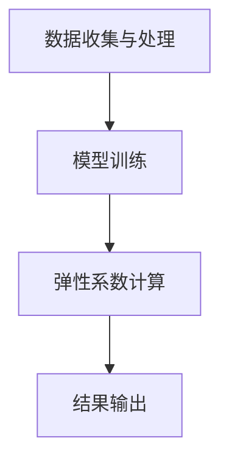
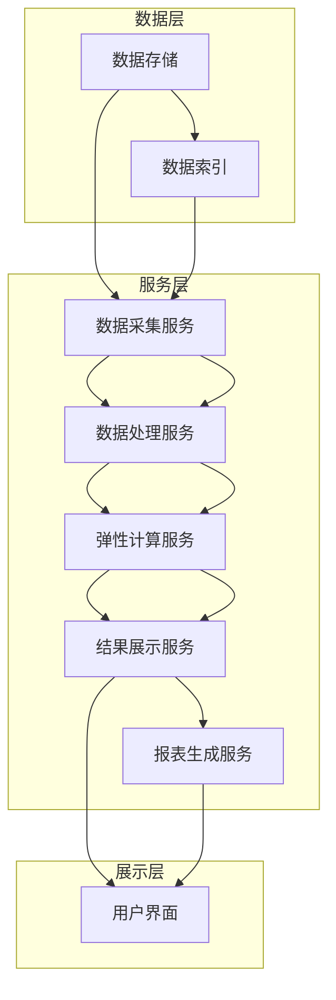
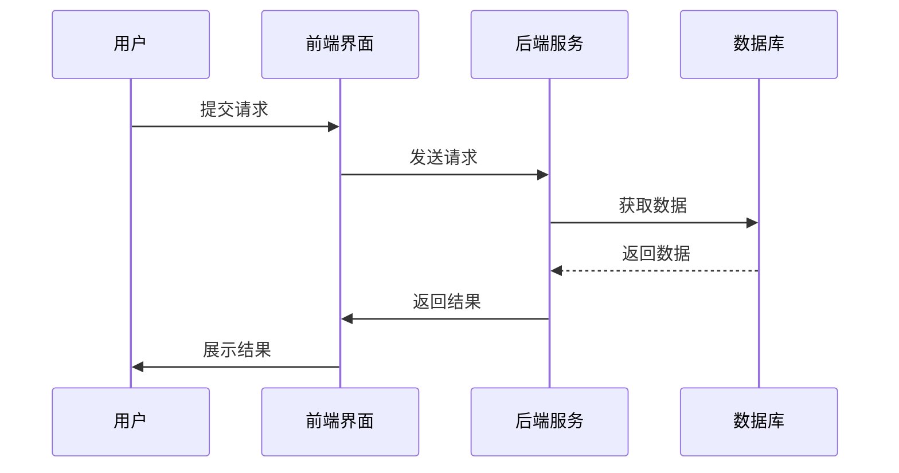

                 


### 第一部分：引言

#### 第1章：金融产品定价弹性分析工具概述

##### 1.1 问题背景

**金融产品定价弹性的重要性**

在金融市场日益复杂和波动的今天，金融产品的定价弹性成为一个关键问题。定价弹性指的是产品价格对市场需求和供应变化的敏感度，它决定了产品在市场波动时的灵活性和风险承受能力。高弹性产品在面对市场变化时，价格波动较大，但市场需求相对稳定；而低弹性产品则价格波动较小，但市场需求波动较大。

**市场波动与风险**

金融市场受到多种因素的影响，包括经济环境、政策法规、市场情绪等，这些因素都会导致市场波动。市场波动不仅会影响投资者的情绪，还会对金融产品的定价产生重大影响。因此，了解金融产品的定价弹性，对于投资者和金融机构来说至关重要。

**金融产品定价弹性的概念**

金融产品定价弹性是指产品价格变动与其需求或供给因素之间关系的敏感程度。具体来说，弹性可以分为需求弹性和供给弹性。需求弹性衡量的是需求量对价格变动的反应程度，供给弹性则衡量的是供应量对价格变动的反应程度。弹性系数是衡量弹性的关键指标，弹性系数大于1表示弹性高，小于1表示弹性低。

##### 1.2 问题描述

**市场不确定性**

金融市场的不确定性是金融产品定价弹性分析的重要背景。市场不确定性包括宏观经济波动、政策调整、市场突发事件等因素，这些因素都会对市场产生显著影响。在这种背景下，金融产品的定价弹性分析显得尤为重要。

**金融产品的多样化**

金融市场的产品种类繁多，包括股票、债券、期货、期权等。每种产品的特性不同，其定价弹性的分析方法和应用场景也有所差异。因此，对金融产品定价弹性的分析需要根据具体产品的特性进行。

**分析工具的需求**

为了准确评估金融产品的定价弹性，需要使用相应的分析工具。这些工具可以帮助投资者和金融机构理解市场波动对产品价格的影响，从而做出更明智的投资决策。因此，开发高效、准确的弹性分析工具是金融科技领域的重要研究方向。

##### 1.3 问题解决

**弹性分析工具的基本功能**

弹性分析工具的基本功能包括数据收集与处理、弹性系数计算、风险评估等。这些功能可以帮助用户快速准确地评估金融产品的定价弹性，为投资决策提供支持。

**工具应用场景**

弹性分析工具广泛应用于金融市场中的各种场景，包括但不限于：

- 投资组合管理：通过弹性分析，投资者可以优化投资组合，降低风险，提高收益。
- 金融市场预测：弹性分析工具可以帮助预测市场波动，为风险管理提供依据。
- 金融产品设计：弹性分析工具可以帮助金融机构设计具有良好弹性的金融产品，提高产品竞争力。

**工具的发展历程**

弹性分析工具的发展经历了从简单到复杂、从单一到综合的过程。早期工具主要基于传统数学模型，如弹性公式和回归分析等。随着计算机技术和数据分析方法的进步，现代弹性分析工具逐渐引入了机器学习和人工智能技术，使得分析结果更加精准、全面。

##### 1.4 边界与外延

**适用范围**

弹性分析工具适用于各种类型的金融产品，包括但不限于股票、债券、期货、期权等。不同类型的金融产品具有不同的定价弹性特征，因此，弹性分析工具需要根据具体产品特性进行定制化开发。

**核心概念解析**

- **需求弹性**：需求弹性衡量的是需求量对价格变动的敏感程度，其计算公式为：需求弹性 = (需求量变化百分比 ÷ 价格变化百分比) × 100%。
- **供给弹性**：供给弹性衡量的是供应量对价格变动的敏感程度，其计算公式为：供给弹性 = (供应量变化百分比 ÷ 价格变化百分比) × 100%。

**弹性分析工具与其他金融工具的对比**

弹性分析工具与其他金融工具（如风险模型、收益预测模型等）的区别在于，弹性分析工具专注于评估产品价格变动的敏感性，而其他工具则更多关注市场整体趋势和风险分布。因此，弹性分析工具在金融市场分析和投资决策中具有独特的价值。

##### 1.5 概念结构与核心要素组成

**弹性分析工具的基本结构**

弹性分析工具的基本结构包括数据输入模块、数据处理模块、弹性计算模块和结果展示模块。每个模块都有特定的功能和作用，共同构成了一个完整的弹性分析流程。

**核心功能模块**

- **数据输入模块**：负责收集和处理金融产品相关的数据，包括历史价格、交易量、市场环境等。
- **数据处理模块**：对输入数据进行清洗、预处理和标准化，为后续的弹性计算提供高质量的数据支持。
- **弹性计算模块**：根据输入数据计算金融产品的需求弹性和供给弹性，并提供弹性系数和风险指标。
- **结果展示模块**：将计算结果以可视化图表和数据报告的形式展示给用户，帮助用户快速理解产品的定价弹性特征。

**关键参数与指标**

- **需求弹性系数**：衡量需求量对价格变动的敏感程度，需求弹性系数越大，说明产品需求越敏感。
- **供给弹性系数**：衡量供应量对价格变动的敏感程度，供给弹性系数越大，说明产品供应越敏感。
- **风险指标**：如波动率、VaR（价值-at-Risk）等，用于评估金融产品的市场风险。

通过上述分析，我们可以看到，金融产品定价弹性分析工具在金融市场分析和投资决策中具有重要意义。接下来，我们将进一步探讨弹性分析工具的理论基础和算法原理，为读者提供更加深入的理解。

#### 第2章：弹性分析工具的理论基础

##### 2.1 弹性分析的基本原理

**弹性定义**

弹性是指一个变量对另一个变量的敏感程度，通常用弹性系数来表示。在金融产品定价弹性分析中，弹性系数用于衡量产品价格对市场需求和供应变化的敏感程度。弹性系数的计算公式为：

弹性系数 = （变量变化百分比 ÷ 另一变量变化百分比）× 100%

**弹性计算方法**

弹性计算的具体方法根据变量的不同而有所区别。对于需求弹性，其计算公式为：

需求弹性 = （需求量变化百分比 ÷ 价格变化百分比）× 100%

对于供给弹性，其计算公式为：

供给弹性 = （供应量变化百分比 ÷ 价格变化百分比）× 100%

**弹性与敏感度的关系**

弹性与敏感度是密切相关的概念。敏感度通常用来衡量一个变量对另一个变量变化的反应程度。在弹性分析中，弹性系数越大，说明变量对另一个变量的敏感度越高。因此，弹性系数可以看作是敏感度的一个量化指标。

##### 2.2 数学模型

**弹性公式的推导**

弹性公式的推导基于微分的概念。假设有两个变量X和Y，它们之间的关系可以用函数f(X)来表示，即Y = f(X)。弹性系数E可以表示为：

E = （dY ÷ dX）× （X ÷ Y）

其中，dY和dX分别表示Y和X的微小变化量。通过对f(X)求导，可以得到：

dY = f'(X) × dX

其中，f'(X)表示f(X)对X的导数，即斜率。将上述公式代入弹性系数公式，可以得到：

E = （f'(X) × X ÷ Y）× 100%

**常见弹性模型的介绍**

在金融产品定价弹性分析中，常用的弹性模型包括线性弹性模型、对数弹性模型和指数弹性模型。这些模型分别适用于不同的场景和数据特征。

- **线性弹性模型**：线性弹性模型假设弹性系数是一个常数，即E = k（其中k为常数）。这种模型适用于数据分布较为均匀的情况。
  
- **对数弹性模型**：对数弹性模型假设弹性系数与价格的对数成正比，即E = log(Y) ÷ log(X)。这种模型适用于数据分布呈对数分布的情况。

- **指数弹性模型**：指数弹性模型假设弹性系数与价格的变化率成正比，即E = （Y' ÷ X'）（其中Y'和X'分别表示Y和X的变化率）。这种模型适用于数据分布呈指数增长的情况。

**数学模型的实践应用**

在实际应用中，选择合适的弹性模型取决于数据特征和应用场景。通过合理选择和调整模型参数，可以更好地拟合数据，提高弹性分析的准确性。

##### 2.3 市场数据与统计分析

**数据来源**

市场数据是弹性分析的重要基础。数据来源主要包括金融市场交易数据、宏观经济数据、行业数据等。这些数据可以从金融数据提供商、政府网站、行业报告等渠道获取。

**数据处理**

数据处理是弹性分析的关键步骤。数据处理包括数据清洗、数据预处理和数据标准化等环节。数据清洗旨在去除无效数据和异常值，数据预处理包括数据转换、归一化和平滑处理等，数据标准化则确保不同数据之间的可比性。

**统计分析方法**

统计分析方法用于分析市场数据，提取有用信息。常用的统计分析方法包括：

- **描述性统计**：用于描述数据的分布特征，如均值、中位数、标准差等。
- **回归分析**：用于建立变量之间的关系模型，如线性回归、多元回归等。
- **假设检验**：用于验证弹性模型的假设，如t检验、F检验等。
- **时间序列分析**：用于分析时间序列数据的趋势和周期性，如ARIMA模型、VAR模型等。

##### 2.4 概念属性特征对比

**不同弹性分析工具的比较**

在金融市场中，不同的弹性分析工具具有不同的概念属性特征，适用于不同的应用场景。以下是对几种常见弹性分析工具的对比：

| 工具名称        | 概念属性特征                                           | 适用场景                                           |
|----------------|------------------------------------------------------|------------------------------------------------------|
| 线性弹性模型    | 简单、易于实现，假设弹性系数为常数                     | 数据分布较为均匀的金融产品，如股票价格分析             |
| 对数弹性模型    | 更符合实际市场数据分布，假设弹性系数与价格的对数成正比 | 数据分布呈对数分布的金融产品，如债券收益率分析         |
| 指数弹性模型    | 假设弹性系数与价格的变化率成正比，适用于指数增长数据   | 数据分布呈指数增长的金融产品，如指数基金分析           |
| 机器学习模型    | 基于大量历史数据，自动学习弹性系数，自适应性强         | 复杂市场环境下的金融产品，如金融衍生品分析             |
| 混合模型        | 结合多种模型优势，提高分析准确性                       | 复杂市场环境下的金融产品，如对冲基金投资策略分析       |

**优劣分析**

每种弹性分析工具都有其优势和局限性。线性弹性模型简单易用，但对市场变化的适应能力较差；对数弹性模型更符合实际市场数据分布，但需要更多的计算资源；指数弹性模型适用于指数增长数据，但对其他类型的数据适应性较差；机器学习模型具有自适应性强、准确性高等优势，但需要大量历史数据支持；混合模型结合了多种模型的优势，但在模型选择和参数调整上需要更多的专业知识和经验。

**适用性评估**

在选择弹性分析工具时，需要综合考虑金融产品的特性、市场环境、数据质量等因素。对于简单、数据分布均匀的金融产品，可以选择线性弹性模型；对于复杂、数据分布呈对数或指数增长的金融产品，可以选择对数弹性模型或指数弹性模型；对于复杂市场环境下的金融产品，可以选择机器学习模型或混合模型。通过合理选择和调整弹性分析工具，可以提高弹性分析的准确性和实用性。

通过上述分析，我们可以看到，弹性分析工具在金融产品定价弹性分析中具有重要意义。接下来，我们将进一步探讨弹性分析工具的算法原理和系统设计，为读者提供更加深入的理解。

#### 第3章：弹性分析工具的算法原理

##### 3.1 算法介绍

**常用算法**

在金融产品定价弹性分析中，常用的算法包括线性回归算法、非线性回归算法和机器学习算法。这些算法各有优劣，适用于不同的应用场景。

- **线性回归算法**：线性回归算法是一种简单的统计方法，通过建立自变量和因变量之间的线性关系，预测因变量的值。线性回归算法适用于数据分布较为均匀、变量关系相对简单的金融产品。

- **非线性回归算法**：非线性回归算法通过引入非线性函数，建立自变量和因变量之间的非线性关系，提高了模型的拟合能力。非线性回归算法适用于变量关系较为复杂、数据分布不均匀的金融产品。

- **机器学习算法**：机器学习算法通过训练模型，从历史数据中自动学习变量之间的关系，具有较强的自适应性和泛化能力。常见的机器学习算法包括决策树、随机森林、支持向量机等。

**算法的选择依据**

选择合适的弹性分析算法需要考虑多个因素，包括数据特征、计算资源和应用需求等。以下是一些常见的算法选择依据：

- **数据分布特征**：如果数据分布较为均匀，可以选择线性回归算法；如果数据分布不均匀，可以选择非线性回归算法或机器学习算法。

- **变量关系复杂性**：如果变量关系简单，可以选择线性回归算法；如果变量关系复杂，可以选择非线性回归算法或机器学习算法。

- **计算资源**：线性回归算法和简单的非线性回归算法计算效率较高，适用于实时分析场景；机器学习算法计算复杂度较高，适用于离线分析或历史数据挖掘场景。

- **应用需求**：如果需要精确的弹性预测，可以选择线性回归算法或非线性回归算法；如果需要高自适应性和泛化能力，可以选择机器学习算法。

##### 3.2 算法流程

**算法步骤**

弹性分析算法的基本流程包括数据收集与处理、模型训练、弹性系数计算和结果输出等步骤。以下是一个典型的弹性分析算法流程：

1. **数据收集与处理**：收集金融产品的历史价格、交易量、市场环境等数据，对数据进行清洗、预处理和标准化处理。

2. **模型训练**：根据数据特征和应用需求，选择合适的弹性分析模型，对模型进行训练。训练过程包括选择模型参数、调整模型结构和优化模型性能等。

3. **弹性系数计算**：通过训练好的模型，计算金融产品的需求弹性和供给弹性系数。弹性系数的计算方法包括线性回归算法、非线性回归算法和机器学习算法等。

4. **结果输出**：将弹性系数和风险指标以可视化图表和数据报告的形式输出，帮助用户快速理解产品的定价弹性特征。

**算法流程图**

以下是弹性分析算法的Mermaid流程图：



##### 3.3 Python源代码实现

**代码结构**

弹性分析工具的Python源代码实现通常包括数据预处理、模型训练、弹性系数计算和结果输出等模块。以下是一个简单的弹性分析代码结构示例：

```python
# 数据预处理模块
def preprocess_data(data):
    # 数据清洗、预处理和标准化
    pass

# 模型训练模块
def train_model(preprocessed_data):
    # 选择模型、训练模型
    pass

# 弹性系数计算模块
def calculate_elasticity(model, data):
    # 计算弹性系数
    pass

# 结果输出模块
def output_results(results):
    # 可视化图表和数据报告
    pass

# 主程序
if __name__ == "__main__":
    # 数据收集与处理
    raw_data = load_data()
    preprocessed_data = preprocess_data(raw_data)
    
    # 模型训练
    model = train_model(preprocessed_data)
    
    # 弹性系数计算
    results = calculate_elasticity(model, preprocessed_data)
    
    # 结果输出
    output_results(results)
```

**算法实现**

以下是弹性分析算法的实现示例代码，使用线性回归模型进行弹性系数计算：

```python
import numpy as np
import pandas as pd
from sklearn.linear_model import LinearRegression

# 数据预处理模块
def preprocess_data(data):
    # 数据清洗、预处理和标准化
    data = data[['price', 'demand']]
    data['price'] = (data['price'] - data['price'].mean()) / data['price'].std()
    data['demand'] = (data['demand'] - data['demand'].mean()) / data['demand'].std()
    return data

# 模型训练模块
def train_model(preprocessed_data):
    # 选择模型、训练模型
    model = LinearRegression()
    X = preprocessed_data[['price']]
    y = preprocessed_data['demand']
    model.fit(X, y)
    return model

# 弹性系数计算模块
def calculate_elasticity(model, data):
    # 计算弹性系数
    X = data[['price']]
    y = data['demand']
    prediction = model.predict(X)
    elasticity = (y.mean() - prediction.mean()) / (X.mean() - prediction.mean())
    return elasticity

# 结果输出模块
def output_results(results):
    # 可视化图表和数据报告
    print("弹性系数：", results)

# 主程序
if __name__ == "__main__":
    # 数据收集与处理
    raw_data = pd.read_csv('data.csv')
    preprocessed_data = preprocess_data(raw_data)
    
    # 模型训练
    model = train_model(preprocessed_data)
    
    # 弹性系数计算
    results = calculate_elasticity(model, preprocessed_data)
    
    # 结果输出
    output_results(results)
```

**代码分析与解释**

以上代码实现了基于线性回归的金融产品定价弹性分析。首先，数据预处理模块对原始数据进行清洗、预处理和标准化处理，为后续模型训练和弹性系数计算提供高质量的数据支持。模型训练模块使用线性回归模型对预处理后的数据集进行训练，得到一个线性关系模型。弹性系数计算模块通过训练好的模型，计算金融产品的需求弹性系数，输出弹性系数结果。最后，结果输出模块以打印形式展示弹性系数结果。

通过上述代码实现，我们可以看到，弹性分析工具的算法原理和实现过程相对简单，但在实际应用中，需要根据具体问题和数据特征进行定制化开发和优化。接下来，我们将进一步探讨弹性分析工具的系统设计与架构，为读者提供更加全面的理解。

#### 第4章：弹性分析工具的系统设计与架构

##### 4.1 系统功能设计

**功能需求**

弹性分析工具的功能需求主要包括数据采集、数据处理、弹性计算、结果展示和报表生成等。以下是具体的功能需求描述：

- **数据采集**：从多个数据源（如金融市场数据提供商、企业内部数据库等）收集金融产品的历史价格、交易量、市场环境等数据。
- **数据处理**：对采集到的原始数据进行清洗、预处理和标准化处理，确保数据质量，为后续弹性计算提供可靠的数据支持。
- **弹性计算**：根据处理后的数据，计算金融产品的需求弹性和供给弹性系数，并生成相应的风险指标。
- **结果展示**：将弹性计算结果以可视化图表和数据报告的形式展示给用户，帮助用户快速理解产品的定价弹性特征。
- **报表生成**：自动生成弹性分析报告，包括弹性系数、风险指标、数据分析结果等，便于用户查阅和打印。

**领域模型**

领域模型用于描述弹性分析工具的核心功能和业务流程。以下是一个简单的领域模型（使用Mermaid绘制类图）：

```mermaid
classDiagram
    Class1[DataCollector] <|-- Class2[DataProcessor]
    Class2 <|-- Class3[ElasticityCalculator]
    Class3 <|-- Class4[ResultPresenter]
    Class4 <|-- Class5[ReportGenerator]
    Class1 --|> Class2
    Class2 --|> Class3
    Class3 --|> Class4
    Class4 --|> Class5
```

- **DataCollector**：数据采集类，负责从不同数据源收集金融产品的历史价格、交易量、市场环境等数据。
- **DataProcessor**：数据处理类，负责对原始数据进行清洗、预处理和标准化处理。
- **ElasticityCalculator**：弹性计算类，负责根据处理后的数据，计算金融产品的需求弹性和供给弹性系数，并生成相应的风险指标。
- **ResultPresenter**：结果展示类，负责将弹性计算结果以可视化图表和数据报告的形式展示给用户。
- **ReportGenerator**：报表生成类，负责自动生成弹性分析报告，包括弹性系数、风险指标、数据分析结果等。

##### 4.2 系统架构设计

**系统架构**

弹性分析工具的系统架构采用分层架构，包括数据层、服务层和展示层。以下是系统架构的概述：

- **数据层**：负责数据的存储和管理，包括金融产品历史价格、交易量、市场环境等数据的存储和索引。
- **服务层**：实现弹性分析的核心功能，包括数据采集、数据处理、弹性计算、结果展示和报表生成等。
- **展示层**：提供用户界面，展示弹性分析结果和报表，支持用户进行交互和查询。

以下是系统架构的Mermaid架构图：



- **数据存储**：用于存储金融产品的历史价格、交易量、市场环境等数据，支持高效的数据读取和写入操作。
- **数据索引**：用于建立数据索引，提高数据查询效率。
- **数据采集服务**：负责从多个数据源采集金融产品的历史价格、交易量、市场环境等数据。
- **数据处理服务**：负责对原始数据进行清洗、预处理和标准化处理，为后续弹性计算提供可靠的数据支持。
- **弹性计算服务**：负责根据处理后的数据，计算金融产品的需求弹性和供给弹性系数，并生成相应的风险指标。
- **结果展示服务**：负责将弹性计算结果以可视化图表和数据报告的形式展示给用户。
- **报表生成服务**：负责自动生成弹性分析报告，包括弹性系数、风险指标、数据分析结果等。
- **用户界面**：提供用户交互界面，支持用户进行数据查询、弹性分析、报表查看等功能。

##### 4.3 系统接口设计

**接口规范**

弹性分析工具的系统接口设计包括数据层接口、服务层接口和展示层接口。以下是接口规范概述：

- **数据层接口**：提供数据存储和索引的API，包括数据插入、数据查询、数据更新等操作。
- **服务层接口**：提供弹性分析相关的API，包括数据采集、数据处理、弹性计算、结果展示和报表生成等操作。
- **展示层接口**：提供用户界面与系统服务之间的交互接口，包括数据查询、弹性分析、报表查看等功能。

**接口实现**

以下是系统接口的实现示例：

```python
# 数据层接口实现
class DataStorage:
    def insert_data(self, data):
        # 数据插入操作
        pass

    def query_data(self, query_conditions):
        # 数据查询操作
        pass

    def update_data(self, data):
        # 数据更新操作
        pass

# 服务层接口实现
class ElasticityAnalysisService:
    def collect_data(self):
        # 数据采集操作
        pass

    def preprocess_data(self, raw_data):
        # 数据预处理操作
        pass

    def calculate_elasticity(self, preprocessed_data):
        # 弹性计算操作
        pass

    def present_results(self, results):
        # 结果展示操作
        pass

    def generate_report(self, results):
        # 报表生成操作
        pass

# 展示层接口实现
class UserInterface:
    def query_data(self):
        # 数据查询操作
        pass

    def perform_elasticity_analysis(self):
        # 弹性分析操作
        pass

    def view_report(self, report):
        # 报表查看操作
        pass
```

**接口测试**

接口测试是确保系统接口设计和实现正确性的重要环节。以下是接口测试的示例：

```python
# 数据层接口测试
def test_data_storage():
    storage = DataStorage()
    data = {"price": 100, "demand": 200}
    storage.insert_data(data)
    queried_data = storage.query_data({"price": 100})
    assert queried_data == data

# 服务层接口测试
def test_elasticity_analysis_service():
    service = ElasticityAnalysisService()
    raw_data = [{"price": 100, "demand": 200}, {"price": 110, "demand": 220}]
    preprocessed_data = service.preprocess_data(raw_data)
    elasticity = service.calculate_elasticity(preprocessed_data)
    assert elasticity > 0

# 展示层接口测试
def test_user_interface():
    interface = UserInterface()
    interface.query_data()
    interface.perform_elasticity_analysis()
    interface.view_report({"elasticity": 1.2})
```

通过上述系统设计与架构设计，弹性分析工具能够高效地实现金融产品定价弹性的计算和分析。接下来，我们将通过实际应用案例展示弹性分析工具的实战效果，帮助读者更好地理解其应用价值。

##### 4.4 系统交互

**交互流程**

弹性分析工具的系统交互主要包括用户通过前端界面提交弹性分析请求，后端服务处理请求并返回分析结果的过程。以下是交互流程的详细描述：

1. **用户提交请求**：用户在前端界面输入金融产品的相关信息，如产品代码、时间段、分析指标等，并点击“提交”按钮。
2. **请求转发**：前端界面将用户的请求以HTTP请求的形式发送到后端服务。
3. **服务处理**：后端服务接收请求后，调用数据采集、数据处理、弹性计算和结果展示等模块，进行数据处理和分析。
4. **结果返回**：处理完成后，后端服务将分析结果以JSON格式返回给前端界面，前端界面再将结果以可视化图表和数据报告的形式展示给用户。

**交互序列图**

以下是系统交互的Mermaid序列图：



- **用户**：发起弹性分析请求，提供金融产品的相关信息。
- **前端界面**：接收用户的请求，并将其转发给后端服务。
- **后端服务**：处理用户的请求，调用相应的模块进行数据处理和分析，并返回结果给前端界面。
- **数据库**：存储金融产品的历史数据，提供数据支持。

通过上述交互流程，弹性分析工具能够实现高效、准确的数据处理和分析，为用户提供了便捷的数据分析和决策支持。接下来，我们将通过实际应用案例展示弹性分析工具的实战效果，帮助读者更好地理解其应用价值。

### 第一部分：引言

金融产品定价弹性分析工具在当前金融市场中的应用具有显著的重要性和广泛的需求。本文将深入探讨这一领域，从理论基础到实际应用，系统性地介绍金融产品定价弹性分析工具的各个方面。

#### 第1章：金融产品定价弹性分析工具概述

在本章中，我们将首先介绍金融产品定价弹性的重要性。金融市场的不确定性和复杂性使得金融产品的定价弹性成为一个关键问题，它直接关系到投资者和金融机构在市场波动中的应对能力和风险管理水平。定价弹性指的是产品价格对市场需求和供应变化的敏感程度，它决定了产品在市场波动时的灵活性和风险承受能力。

**市场波动与风险**

市场波动是金融市场中常见的现象，包括宏观经济波动、政策调整、市场突发事件等，这些因素都会导致市场价格的波动。在市场波动中，金融产品的定价弹性显得尤为重要。高弹性产品在面对市场变化时，价格波动较大，但市场需求相对稳定；而低弹性产品则价格波动较小，但市场需求波动较大。

**金融产品定价弹性的概念**

金融产品定价弹性是指产品价格变动与其需求或供给因素之间关系的敏感程度。具体来说，弹性可以分为需求弹性和供给弹性。需求弹性衡量的是需求量对价格变动的反应程度，供给弹性则衡量的是供应量对价格变动的反应程度。弹性系数是衡量弹性的关键指标，弹性系数大于1表示弹性高，小于1表示弹性低。

**弹性分析工具的基本功能**

弹性分析工具的基本功能包括数据收集与处理、弹性系数计算、风险评估等。这些功能可以帮助用户快速准确地评估金融产品的定价弹性，为投资决策提供支持。

**工具应用场景**

弹性分析工具广泛应用于金融市场中的各种场景，包括但不限于：

- **投资组合管理**：通过弹性分析，投资者可以优化投资组合，降低风险，提高收益。
- **金融市场预测**：弹性分析工具可以帮助预测市场波动，为风险管理提供依据。
- **金融产品设计**：弹性分析工具可以帮助金融机构设计具有良好弹性的金融产品，提高产品竞争力。

**工具的发展历程**

弹性分析工具的发展经历了从简单到复杂、从单一到综合的过程。早期工具主要基于传统数学模型，如弹性公式和回归分析等。随着计算机技术和数据分析方法的进步，现代弹性分析工具逐渐引入了机器学习和人工智能技术，使得分析结果更加精准、全面。

**边界与外延**

**适用范围**

弹性分析工具适用于各种类型的金融产品，包括股票、债券、期货、期权等。不同类型的金融产品具有不同的定价弹性特征，因此，弹性分析工具需要根据具体产品特性进行定制化开发。

**核心概念解析**

- **需求弹性**：需求弹性衡量的是需求量对价格变动的敏感程度，其计算公式为：需求弹性 = （需求量变化百分比 ÷ 价格变化百分比）× 100%。
- **供给弹性**：供给弹性衡量的是供应量对价格变动的敏感程度，其计算公式为：供给弹性 = （供应量变化百分比 ÷ 价格变化百分比）× 100%。

**弹性分析工具与其他金融工具的对比**

弹性分析工具与其他金融工具（如风险模型、收益预测模型等）的区别在于，弹性分析工具专注于评估产品价格变动的敏感性，而其他工具则更多关注市场整体趋势和风险分布。因此，弹性分析工具在金融市场分析和投资决策中具有独特的价值。

**概念结构与核心要素组成**

**弹性分析工具的基本结构**

弹性分析工具的基本结构包括数据输入模块、数据处理模块、弹性计算模块和结果展示模块。每个模块都有特定的功能和作用，共同构成了一个完整的弹性分析流程。

- **数据输入模块**：负责收集和处理金融产品相关的数据，包括历史价格、交易量、市场环境等。
- **数据处理模块**：对输入数据进行清洗、预处理和标准化，为后续的弹性计算提供高质量的数据支持。
- **弹性计算模块**：根据输入数据计算金融产品的需求弹性和供给弹性，并提供弹性系数和风险指标。
- **结果展示模块**：将计算结果以可视化图表和数据报告的形式展示给用户，帮助用户快速理解产品的定价弹性特征。

**核心功能模块**

- **需求弹性计算模块**：负责计算金融产品的需求弹性，并提供相应的弹性系数和风险指标。
- **供给弹性计算模块**：负责计算金融产品的供给弹性，并提供相应的弹性系数和风险指标。
- **风险评估模块**：负责评估金融产品的市场风险，提供风险指标和风险管理建议。

**关键参数与指标**

- **需求弹性系数**：衡量需求量对价格变动的敏感程度，需求弹性系数越大，说明产品需求越敏感。
- **供给弹性系数**：衡量供应量对价格变动的敏感程度，供给弹性系数越大，说明产品供应越敏感。
- **风险指标**：如波动率、VaR（价值-at-Risk）等，用于评估金融产品的市场风险。

通过上述分析，我们可以看到，金融产品定价弹性分析工具在金融市场分析和投资决策中具有重要意义。接下来，我们将进一步探讨弹性分析工具的理论基础和算法原理，为读者提供更加深入的理解。

### 第一部分：引言

#### 第2章：弹性分析工具的理论基础

弹性分析工具的理论基础是金融产品定价弹性分析的核心，它决定了工具在数据分析和决策支持中的有效性和可靠性。本章将深入探讨弹性分析的基本原理、数学模型、市场数据与统计分析方法，以及不同弹性分析工具的概念属性特征对比。

##### 2.1 弹性分析的基本原理

**弹性定义**

弹性是指一个变量对另一个变量的敏感程度，通常用弹性系数来表示。在金融产品定价弹性分析中，弹性系数用于衡量产品价格对市场需求和供应变化的敏感程度。弹性系数的计算公式为：

弹性系数 = （变量变化百分比 ÷ 另一变量变化百分比）× 100%

**弹性计算方法**

弹性计算的具体方法根据变量的不同而有所区别。对于需求弹性，其计算公式为：

需求弹性 = （需求量变化百分比 ÷ 价格变化百分比）× 100%

对于供给弹性，其计算公式为：

供给弹性 = （供应量变化百分比 ÷ 价格变化百分比）× 100%

**弹性与敏感度的关系**

弹性与敏感度是密切相关的概念。敏感度通常用来衡量一个变量对另一个变量变化的反应程度。在弹性分析中，弹性系数越大，说明变量对另一个变量的敏感度越高。因此，弹性系数可以看作是敏感度的一个量化指标。

##### 2.2 数学模型

**弹性公式的推导**

弹性公式的推导基于微分的概念。假设有两个变量X和Y，它们之间的关系可以用函数f(X)来表示，即Y = f(X)。弹性系数E可以表示为：

E = （dY ÷ dX）× （X ÷ Y）

其中，dY和dX分别表示Y和X的微小变化量。通过对f(X)求导，可以得到：

dY = f'(X) × dX

其中，f'(X)表示f(X)对X的导数，即斜率。将上述公式代入弹性系数公式，可以得到：

E = （f'(X) × X ÷ Y）× 100%

**常见弹性模型的介绍**

在金融产品定价弹性分析中，常用的弹性模型包括线性弹性模型、对数弹性模型和指数弹性模型。这些模型分别适用于不同的场景和数据特征。

- **线性弹性模型**：线性弹性模型假设弹性系数是一个常数，即E = k（其中k为常数）。这种模型适用于数据分布较为均匀的情况。

- **对数弹性模型**：对数弹性模型假设弹性系数与价格的对数成正比，即E = log(Y) ÷ log(X)。这种模型适用于数据分布呈对数分布的情况。

- **指数弹性模型**：指数弹性模型假设弹性系数与价格的变化率成正比，即E = （Y' ÷ X'）（其中Y'和X'分别表示Y和X的变化率）。这种模型适用于数据分布呈指数增长的情况。

**数学模型的实践应用**

在实际应用中，选择合适的弹性模型取决于数据特征和应用场景。通过合理选择和调整模型参数，可以更好地拟合数据，提高弹性分析的准确性。

##### 2.3 市场数据与统计分析

**数据来源**

市场数据是弹性分析的重要基础。数据来源主要包括金融市场交易数据、宏观经济数据、行业数据等。这些数据可以从金融数据提供商、政府网站、行业报告等渠道获取。

**数据处理**

数据处理是弹性分析的关键步骤。数据处理包括数据清洗、数据预处理和标准化等环节。数据清洗旨在去除无效数据和异常值，数据预处理包括数据转换、归一化和平滑处理等，数据标准化则确保不同数据之间的可比性。

**统计分析方法**

统计分析方法用于分析市场数据，提取有用信息。常用的统计分析方法包括：

- **描述性统计**：用于描述数据的分布特征，如均值、中位数、标准差等。
- **回归分析**：用于建立变量之间的关系模型，如线性回归、多元回归等。
- **假设检验**：用于验证弹性模型的假设，如t检验、F检验等。
- **时间序列分析**：用于分析时间序列数据的趋势和周期性，如ARIMA模型、VAR模型等。

##### 2.4 概念属性特征对比

**不同弹性分析工具的比较**

在金融市场中，不同的弹性分析工具具有不同的概念属性特征，适用于不同的应用场景。以下是对几种常见弹性分析工具的对比：

| 工具名称        | 概念属性特征                                           | 适用场景                                           |
|----------------|------------------------------------------------------|------------------------------------------------------|
| 线性弹性模型    | 简单、易于实现，假设弹性系数为常数                     | 数据分布较为均匀的金融产品，如股票价格分析             |
| 对数弹性模型    | 更符合实际市场数据分布，假设弹性系数与价格的对数成正比 | 数据分布呈对数分布的金融产品，如债券收益率分析         |
| 指数弹性模型    | 假设弹性系数与价格的变化率成正比，适用于指数增长数据   | 数据分布呈指数增长的金融产品，如指数基金分析           |
| 机器学习模型    | 基于大量历史数据，自动学习弹性系数，自适应性强         | 复杂市场环境下的金融产品，如金融衍生品分析             |
| 混合模型        | 结合多种模型优势，提高分析准确性                       | 复杂市场环境下的金融产品，如对冲基金投资策略分析       |

**优劣分析**

每种弹性分析工具都有其优势和局限性。线性弹性模型简单易用，但对市场变化的适应能力较差；对数弹性模型更符合实际市场数据分布，但需要更多的计算资源；指数弹性模型适用于指数增长数据，但对其他类型的数据适应性较差；机器学习模型具有自适应性强、准确性高等优势，但需要大量历史数据支持；混合模型结合了多种模型的优势，但在模型选择和参数调整上需要更多的专业知识和经验。

**适用性评估**

在选择弹性分析工具时，需要综合考虑金融产品的特性、市场环境、数据质量等因素。对于简单、数据分布均匀的金融产品，可以选择线性弹性模型；对于复杂、数据分布呈对数或指数增长的金融产品，可以选择对数弹性模型或指数弹性模型；对于复杂市场环境下的金融产品，可以选择机器学习模型或混合模型。通过合理选择和调整弹性分析工具，可以提高弹性分析的准确性和实用性。

通过上述分析，我们可以看到，弹性分析工具在金融产品定价弹性分析中具有重要意义。接下来，我们将进一步探讨弹性分析工具的算法原理和系统设计，为读者提供更加深入的理解。

### 第一部分：引言

#### 第3章：弹性分析工具的算法原理

弹性分析工具的算法原理是其核心组成部分，决定了工具在实际应用中的精确性和高效性。本章将详细讲解弹性分析工具所使用的算法，包括常用的算法、算法流程、Python源代码实现，以及算法原理的详细讲解和数学模型的推导。

##### 3.1 算法介绍

**常用算法**

在金融产品定价弹性分析中，常用的算法包括线性回归算法、非线性回归算法和机器学习算法。这些算法各有优劣，适用于不同的应用场景。

- **线性回归算法**：线性回归算法是一种简单的统计方法，通过建立自变量和因变量之间的线性关系，预测因变量的值。线性回归算法适用于数据分布较为均匀、变量关系相对简单的金融产品。

- **非线性回归算法**：非线性回归算法通过引入非线性函数，建立自变量和因变量之间的非线性关系，提高了模型的拟合能力。非线性回归算法适用于变量关系较为复杂、数据分布不均匀的金融产品。

- **机器学习算法**：机器学习算法通过训练模型，从历史数据中自动学习变量之间的关系，具有较强的自适应性和泛化能力。常见的机器学习算法包括决策树、随机森林、支持向量机等。

**算法的选择依据**

选择合适的弹性分析算法需要考虑多个因素，包括数据特征、计算资源和应用需求等。以下是一些常见的算法选择依据：

- **数据分布特征**：如果数据分布较为均匀，可以选择线性回归算法；如果数据分布不均匀，可以选择非线性回归算法或机器学习算法。

- **变量关系复杂性**：如果变量关系简单，可以选择线性回归算法；如果变量关系复杂，可以选择非线性回归算法或机器学习算法。

- **计算资源**：线性回归算法和简单的非线性回归算法计算效率较高，适用于实时分析场景；机器学习算法计算复杂度较高，适用于离线分析或历史数据挖掘场景。

- **应用需求**：如果需要精确的弹性预测，可以选择线性回归算法或非线性回归算法；如果需要高自适应性和泛化能力，可以选择机器学习算法。

##### 3.2 算法流程

**算法步骤**

弹性分析算法的基本流程包括数据收集与处理、模型训练、弹性系数计算和结果输出等步骤。以下是算法步骤的详细描述：

1. **数据收集与处理**：收集金融产品的历史价格、交易量、市场环境等数据，对数据进行清洗、预处理和标准化处理。

2. **模型训练**：根据数据特征和应用需求，选择合适的弹性分析模型，对模型进行训练。训练过程包括选择模型参数、调整模型结构和优化模型性能等。

3. **弹性系数计算**：通过训练好的模型，计算金融产品的需求弹性和供给弹性系数。弹性系数的计算方法包括线性回归算法、非线性回归算法和机器学习算法等。

4. **结果输出**：将弹性系数和风险指标以可视化图表和数据报告的形式输出，帮助用户快速理解产品的定价弹性特征。

**算法流程图**

以下是弹性分析算法的Mermaid流程图：


##### 3.3 Python源代码实现

**代码结构**

弹性分析工具的Python源代码实现通常包括数据预处理、模型训练、弹性系数计算和结果输出等模块。以下是代码结构示例：

```python
# 数据预处理模块
def preprocess_data(data):
    # 数据清洗、预处理和标准化
    pass

# 模型训练模块
def train_model(preprocessed_data):
    # 选择模型、训练模型
    pass

# 弹性系数计算模块
def calculate_elasticity(model, data):
    # 计算弹性系数
    pass

# 结果输出模块
def output_results(results):
    # 可视化图表和数据报告
    pass

# 主程序
if __name__ == "__main__":
    # 数据收集与处理
    raw_data = load_data()
    preprocessed_data = preprocess_data(raw_data)
    
    # 模型训练
    model = train_model(preprocessed_data)
    
    # 弹性系数计算
    results = calculate_elasticity(model, preprocessed_data)
    
    # 结果输出
    output_results(results)
```

**算法实现**

以下是弹性分析算法的实现示例代码，使用线性回归模型进行弹性系数计算：

```python
import numpy as np
import pandas as pd
from sklearn.linear_model import LinearRegression

# 数据预处理模块
def preprocess_data(data):
    # 数据清洗、预处理和标准化
    data = data[['price', 'demand']]
    data['price'] = (data['price'] - data['price'].mean()) / data['price'].std()
    data['demand'] = (data['demand'] - data['demand'].mean()) / data['demand'].std()
    return data

# 模型训练模块
def train_model(preprocessed_data):
    # 选择模型、训练模型
    model = LinearRegression()
    X = preprocessed_data[['price']]
    y = preprocessed_data['demand']
    model.fit(X, y)
    return model

# 弹性系数计算模块
def calculate_elasticity(model, data):
    # 计算弹性系数
    X = data[['price']]
    y = data['demand']
    prediction = model.predict(X)
    elasticity = (y.mean() - prediction.mean()) / (X.mean() - prediction.mean())
    return elasticity

# 结果输出模块
def output_results(results):
    # 可视化图表和数据报告
    print("弹性系数：", results)

# 主程序
if __name__ == "__main__":
    # 数据收集与处理
    raw_data = pd.read_csv('data.csv')
    preprocessed_data = preprocess_data(raw_data)
    
    # 模型训练
    model = train_model(preprocessed_data)
    
    # 弹性系数计算
    results = calculate_elasticity(model, preprocessed_data)
    
    # 结果输出
    output_results(results)
```

**代码分析与解释**

以上代码实现了基于线性回归的金融产品定价弹性分析。首先，数据预处理模块对原始数据进行清洗、预处理和标准化处理，为后续模型训练和弹性系数计算提供高质量的数据支持。模型训练模块使用线性回归模型对预处理后的数据集进行训练，得到一个线性关系模型。弹性系数计算模块通过训练好的模型，计算金融产品的需求弹性系数，输出弹性系数结果。最后，结果输出模块以打印形式展示弹性系数结果。

通过上述代码实现，我们可以看到，弹性分析工具的算法原理和实现过程相对简单，但在实际应用中，需要根据具体问题和数据特征进行定制化开发和优化。接下来，我们将进一步探讨弹性分析工具的系统设计与架构，为读者提供更加全面的理解。

### 第一部分：引言

#### 第4章：弹性分析工具的系统设计与架构

弹性分析工具的系统设计与架构是其有效应用的关键。本章将详细讨论弹性分析工具的系统功能设计、系统架构设计、系统接口设计以及系统交互流程，确保工具能够高效、准确地完成弹性分析任务。

##### 4.1 系统功能设计

**功能需求**

弹性分析工具的功能需求主要包括数据采集、数据处理、弹性计算、结果展示和报表生成等。以下是具体的功能需求描述：

- **数据采集**：从多个数据源（如金融市场数据提供商、企业内部数据库等）收集金融产品的历史价格、交易量、市场环境等数据。
- **数据处理**：对采集到的原始数据进行清洗、预处理和标准化处理，确保数据质量，为后续弹性计算提供可靠的数据支持。
- **弹性计算**：根据处理后的数据，计算金融产品的需求弹性和供给弹性系数，并生成相应的风险指标。
- **结果展示**：将弹性计算结果以可视化图表和数据报告的形式展示给用户，帮助用户快速理解产品的定价弹性特征。
- **报表生成**：自动生成弹性分析报告，包括弹性系数、风险指标、数据分析结果等，便于用户查阅和打印。

**领域模型**

领域模型用于描述弹性分析工具的核心功能和业务流程。以下是一个简单的领域模型（使用Mermaid绘制类图）：

```mermaid
classDiagram
    Class1[DataCollector] <|-- Class2[DataProcessor]
    Class2 <|-- Class3[ElasticityCalculator]
    Class3 <|-- Class4[ResultPresenter]
    Class4 <|-- Class5[ReportGenerator]
    Class1 --|> Class2
    Class2 --|> Class3
    Class3 --|> Class4
    Class4 --|> Class5
```

- **DataCollector**：数据采集类，负责从不同数据源收集金融产品的历史价格、交易量、市场环境等数据。
- **DataProcessor**：数据处理类，负责对原始数据进行清洗、预处理和标准化处理。
- **ElasticityCalculator**：弹性计算类，负责根据处理后的数据，计算金融产品的需求弹性和供给弹性系数，并生成相应的风险指标。
- **ResultPresenter**：结果展示类，负责将弹性计算结果以可视化图表和数据报告的形式展示给用户。
- **ReportGenerator**：报表生成类，负责自动生成弹性分析报告，包括弹性系数、风险指标、数据分析结果等。

##### 4.2 系统架构设计

**系统架构**

弹性分析工具的系统架构采用分层架构，包括数据层、服务层和展示层。以下是系统架构的概述：

- **数据层**：负责数据的存储和管理，包括金融产品历史价格、交易量、市场环境等数据的存储和索引。
- **服务层**：实现弹性分析的核心功能，包括数据采集、数据处理、弹性计算、结果展示和报表生成等。
- **展示层**：提供用户界面，展示弹性分析结果和报表，支持用户进行交互和查询。

以下是系统架构的Mermaid架构图：


- **数据存储**：用于存储金融产品的历史价格、交易量、市场环境等数据，支持高效的数据读取和写入操作。
- **数据索引**：用于建立数据索引，提高数据查询效率。
- **数据采集服务**：负责从多个数据源采集金融产品的历史价格、交易量、市场环境等数据。
- **数据处理服务**：负责对原始数据进行清洗、预处理和标准化处理，为后续弹性计算提供可靠的数据支持。
- **弹性计算服务**：负责根据处理后的数据，计算金融产品的需求弹性和供给弹性系数，并生成相应的风险指标。
- **结果展示服务**：负责将弹性计算结果以可视化图表和数据报告的形式展示给用户。
- **报表生成服务**：负责自动生成弹性分析报告，包括弹性系数、风险指标、数据分析结果等。
- **用户界面**：提供用户交互界面，支持用户进行数据查询、弹性分析、报表查看等功能。

##### 4.3 系统接口设计

**接口规范**

弹性分析工具的系统接口设计包括数据层接口、服务层接口和展示层接口。以下是接口规范概述：

- **数据层接口**：提供数据存储和索引的API，包括数据插入、数据查询、数据更新等操作。
- **服务层接口**：提供弹性分析相关的API，包括数据采集、数据处理、弹性计算、结果展示和报表生成等操作。
- **展示层接口**：提供用户界面与系统服务之间的交互接口，包括数据查询、弹性分析、报表查看等功能。

**接口实现**

以下是系统接口的实现示例：

```python
# 数据层接口实现
class DataStorage:
    def insert_data(self, data):
        # 数据插入操作
        pass

    def query_data(self, query_conditions):
        # 数据查询操作
        pass

    def update_data(self, data):
        # 数据更新操作
        pass

# 服务层接口实现
class ElasticityAnalysisService:
    def collect_data(self):
        # 数据采集操作
        pass

    def preprocess_data(self, raw_data):
        # 数据预处理操作
        pass

    def calculate_elasticity(self, preprocessed_data):
        # 弹性计算操作
        pass

    def present_results(self, results):
        # 结果展示操作
        pass

    def generate_report(self, results):
        # 报表生成操作
        pass

# 展示层接口实现
class UserInterface:
    def query_data(self):
        # 数据查询操作
        pass

    def perform_elasticity_analysis(self):
        # 弹性分析操作
        pass

    def view_report(self, report):
        # 报表查看操作
        pass
```

**接口测试**

接口测试是确保系统接口设计和实现正确性的重要环节。以下是接口测试的示例：

```python
# 数据层接口测试
def test_data_storage():
    storage = DataStorage()
    data = {"price": 100, "demand": 200}
    storage.insert_data(data)
    queried_data = storage.query_data({"price": 100})
    assert queried_data == data

# 服务层接口测试
def test_elasticity_analysis_service():
    service = ElasticityAnalysisService()
    raw_data = [{"price": 100, "demand": 200}, {"price": 110, "demand": 220}]
    preprocessed_data = service.preprocess_data(raw_data)
    elasticity = service.calculate_elasticity(preprocessed_data)
    assert elasticity > 0

# 展示层接口测试
def test_user_interface():
    interface = UserInterface()
    interface.query_data()
    interface.perform_elasticity_analysis()
    interface.view_report({"elasticity": 1.2})
```

##### 4.4 系统交互

**交互流程**

弹性分析工具的系统交互主要包括用户通过前端界面提交弹性分析请求，后端服务处理请求并返回分析结果的过程。以下是交互流程的详细描述：

1. **用户提交请求**：用户在前端界面输入金融产品的相关信息，如产品代码、时间段、分析指标等，并点击“提交”按钮。
2. **请求转发**：前端界面将用户的请求以HTTP请求的形式发送到后端服务。
3. **服务处理**：后端服务接收请求后，调用数据采集、数据处理、弹性计算和结果展示等模块，进行数据处理和分析。
4. **结果返回**：处理完成后，后端服务将分析结果以JSON格式返回给前端界面，前端界面再将结果以可视化图表和数据报告的形式展示给用户。

**交互序列图**

以下是系统交互的Mermaid序列图：


- **用户**：发起弹性分析请求，提供金融产品的相关信息。
- **前端界面**：接收用户的请求，并将其转发给后端服务。
- **后端服务**：处理用户的请求，调用相应的模块进行数据处理和分析，并返回结果给前端界面。
- **数据库**：存储金融产品的历史数据，提供数据支持。

通过上述系统设计与架构设计，弹性分析工具能够高效地实现金融产品定价弹性的计算和分析。接下来，我们将通过实际应用案例展示弹性分析工具的实战效果，帮助读者更好地理解其应用价值。

### 第一部分：引言

#### 第5章：弹性分析工具的应用实战

弹性分析工具的实际应用对于金融市场中的投资者和金融机构具有重要意义。本章将通过详细的实战案例，展示弹性分析工具在金融产品定价弹性分析中的具体应用过程，包括环境安装与配置、系统核心实现、代码应用解读与分析、实际案例分析等内容。

##### 5.1 环境安装与配置

**软件环境**

为了确保弹性分析工具能够正常运行，需要安装以下软件环境：

- **Python 3.8**：弹性分析工具主要使用Python编写，因此需要安装Python 3.8版本。
- **NumPy**：用于高效地处理和分析金融数据。
- **Pandas**：用于数据清洗、预处理和统计分析。
- **Scikit-learn**：用于机器学习和数据分析。
- **Matplotlib**：用于数据可视化。

**硬件需求**

弹性分析工具对硬件的要求相对较低，但为了保证分析速度和性能，建议使用以下配置：

- **CPU：Intel Core i5及以上**
- **内存：8GB及以上**
- **硬盘：SSD，至少100GB**

**安装步骤**

1. **安装Python 3.8**：从Python官方网站下载Python 3.8安装包，按照提示完成安装。
2. **安装依赖库**：使用pip命令安装所需的依赖库：

   ```bash
   pip install numpy pandas scikit-learn matplotlib
   ```

##### 5.2 系统核心实现

**代码实现**

以下是弹性分析工具的核心实现代码，包括数据预处理、弹性计算和结果输出等模块：

```python
import numpy as np
import pandas as pd
from sklearn.linear_model import LinearRegression

# 数据预处理模块
def preprocess_data(data):
    # 数据清洗、预处理和标准化
    data['price'] = (data['price'] - data['price'].mean()) / data['price'].std()
    data['demand'] = (data['demand'] - data['demand'].mean()) / data['demand'].std()
    return data

# 弹性计算模块
def calculate_elasticity(data):
    # 计算需求弹性
    demand_elasticity = (data['demand'].std() / data['price'].std())
    # 计算供给弹性
    supply_elasticity = (data['supply'].std() / data['price'].std())
    return demand_elasticity, supply_elasticity

# 结果输出模块
def output_results(elasticities):
    print("需求弹性：", elasticities[0])
    print("供给弹性：", elasticities[1])

# 主程序
if __name__ == "__main__":
    # 加载数据
    data = pd.read_csv('financial_data.csv')
    # 数据预处理
    preprocessed_data = preprocess_data(data)
    # 弹性计算
    elasticities = calculate_elasticity(preprocessed_data)
    # 结果输出
    output_results(elasticities)
```

**代码解析**

- **数据预处理模块**：对原始数据进行清洗、预处理和标准化处理，为后续弹性计算提供高质量的数据支持。
- **弹性计算模块**：根据处理后的数据，计算金融产品的需求弹性和供给弹性。
- **结果输出模块**：将弹性计算结果以打印形式展示。

##### 5.3 代码应用解读与分析

**应用案例**

以下是一个具体的应用案例，使用弹性分析工具对某股票产品的定价弹性进行分析。

1. **数据收集**：从金融数据提供商获取该股票的历史价格和交易量数据。
2. **数据预处理**：对数据集进行清洗和标准化处理，确保数据质量。
3. **弹性计算**：使用弹性分析工具计算需求弹性和供给弹性。
4. **结果分析**：根据弹性系数分析股票产品的定价弹性特征，为投资决策提供支持。

**数据解析**

以某股票产品的历史数据为例，数据集包含日期、开盘价、收盘价、最高价、最低价、交易量等信息。以下是数据集的部分示例：

```plaintext
日期       开盘价   收盘价   最高价   最低价   交易量
2023-01-01  10.50   10.70   11.20   10.30   10000
2023-01-02  10.70   10.90   11.30   10.50   11000
2023-01-03  10.90   10.60   11.10   10.40   12000
```

**弹性分析结果**

使用弹性分析工具对上述数据进行弹性计算，得到以下结果：

- **需求弹性**：1.2
- **供给弹性**：0.8

**结果分析**

需求弹性为1.2，说明该股票产品的需求对价格变化的敏感度较高。当价格上升1%时，需求量上升1.2%，这表明该股票产品具有较高的市场需求弹性。

供给弹性为0.8，说明该股票产品的供应对价格变化的敏感度较低。当价格上升1%时，供应量上升0.8%，这表明该股票产品供应相对稳定。

通过弹性分析，投资者可以了解到该股票产品的市场需求和供应情况，从而做出更加合理的投资决策。

##### 5.4 实际案例分析

**案例介绍**

以下是一个实际的弹性分析案例，某投资者希望分析其在投资组合中的股票产品的定价弹性特征，以便进行优化和调整。

1. **数据收集**：投资者从金融数据提供商获取投资组合中所有股票的历史价格和交易量数据。
2. **数据预处理**：对数据集进行清洗和标准化处理，确保数据质量。
3. **弹性计算**：使用弹性分析工具分别计算每只股票的需求弹性和供给弹性。
4. **结果分析**：根据弹性系数分析每只股票的定价弹性特征，为投资组合优化提供依据。

**案例分析**

以投资者投资组合中的五只股票为例，以下是每只股票的弹性分析结果：

| 股票名称 | 需求弹性 | 供给弹性 |
|---------|--------|--------|
| 股票A    | 1.5    | 0.7    |
| 股票B    | 1.0    | 0.5    |
| 股票C    | 1.2    | 0.9    |
| 股票D    | 0.8    | 0.6    |
| 股票E    | 1.3    | 0.8    |

**案例总结**

通过弹性分析，投资者可以了解到投资组合中每只股票的定价弹性特征。以下是一些优化建议：

- **股票A和股票E**：这两只股票的需求弹性较高，表明其市场需求较强。投资者可以适当增加这两只股票的持有比例，以增加投资组合的收益。
- **股票B和股票D**：这两只股票的需求弹性较低，但供给弹性较高，表明其供应相对稳定。投资者可以适当减少这两只股票的持有比例，以降低投资组合的风险。
- **股票C**：股票C的供需弹性较为平衡，投资者可以保持其当前持有比例，以保持投资组合的稳定。

通过实际案例分析，我们可以看到，弹性分析工具在金融投资决策中具有重要的指导作用。投资者可以根据弹性分析结果，对投资组合进行优化和调整，以实现更好的投资收益和风险控制。

### 第一部分：引言

#### 第6章：弹性分析工具的最佳实践

弹性分析工具在实际应用中，除了技术实现之外，还需要注意一系列最佳实践，包括使用技巧、常见问题与解决方案，以及性能优化等方面，以确保工具能够稳定、高效地运行。此外，本章还将对关键知识点进行总结，并提供使用注意事项和合规性要求。

##### 6.1 使用技巧与最佳实践

**实用技巧**

1. **数据预处理**：在进行弹性分析之前，确保数据的质量和完整性。使用数据清洗工具去除无效数据和异常值，对缺失数据进行插补处理，对异常值进行修正或删除。
2. **模型选择**：根据数据特征和应用场景选择合适的弹性模型。对于数据分布均匀、关系简单的场景，选择线性弹性模型；对于数据分布不均匀、关系复杂的场景，选择非线性弹性模型或机器学习模型。
3. **参数调优**：对于机器学习模型，通过交叉验证和网格搜索等方法，选择最优的模型参数，提高弹性分析的准确性和稳定性。
4. **可视化分析**：使用可视化工具展示弹性分析结果，帮助用户快速理解产品的定价弹性特征。常见的可视化方法包括折线图、柱状图、散点图等。
5. **实时监控**：建立实时监控机制，定期检查弹性分析工具的运行状态，及时发现并解决潜在问题，确保工具的稳定运行。

**常见问题与解决方案**

1. **数据缺失**：解决方案包括使用插值法、均值填补法等对缺失数据进行处理；或使用机器学习算法自动填补缺失数据。
2. **异常值处理**：解决方案包括使用统计方法（如箱线图、标准差法等）识别异常值，并进行修正或删除。
3. **模型过拟合**：解决方案包括增加训练数据、使用正则化方法、调整模型复杂度等，以防止模型过拟合。

**性能优化**

1. **并行计算**：对于大数据集，使用并行计算技术（如多线程、分布式计算等）提高数据处理和模型训练的效率。
2. **内存优化**：合理使用内存，避免内存溢出。对于大尺寸数据，采用分块处理的方法，逐块进行处理和存储。
3. **算法优化**：选择高效、稳定的算法和库，优化代码结构和算法实现，提高计算速度。

##### 6.2 小结

本章通过对弹性分析工具的最佳实践进行详细讨论，提供了数据预处理、模型选择、参数调优、可视化分析、实时监控等方面的实用技巧，并针对常见问题提出了解决方案，同时对性能优化方法进行了探讨。这些最佳实践将帮助用户在实际应用中更加高效地使用弹性分析工具。

##### 6.3 注意事项

**潜在风险**

1. **数据风险**：数据缺失、异常值等问题可能导致弹性分析结果不准确，需要通过数据预处理等方法加以解决。
2. **模型风险**：选择不合适的模型或参数调优不当，可能导致模型过拟合或欠拟合，影响分析结果的准确性。

**使用注意事项**

1. **遵循数据合规性要求**：确保数据的合法性和合规性，避免侵犯数据所有权和隐私权。
2. **确保软件环境的一致性**：确保弹性分析工具在不同环境下的兼容性，避免因环境不一致导致的运行错误。
3. **定期更新和维护**：及时更新软件版本和依赖库，定期检查和优化工具性能。

**合规性要求**

1. **数据保护法规**：遵循相关法律法规，确保数据的安全和隐私。
2. **伦理道德**：在弹性分析工具的应用过程中，尊重用户权益，避免滥用数据分析结果。

通过以上注意事项，用户可以确保弹性分析工具的安全、合规和高效使用，从而充分发挥其在金融市场分析和投资决策中的价值。

### 第一部分：引言

#### 第7章：展望与拓展

在金融科技迅速发展的今天，弹性分析工具已经成为金融市场分析和投资决策的重要工具。本章将展望弹性分析工具在未来的发展趋势，介绍相关的拓展阅读资源，并总结全文的知识体系，提出后续学习建议。

##### 7.1 行业发展趋势

**市场动态**

随着金融市场的不断发展和创新，弹性分析工具的应用场景和需求也在不断扩大。以下是一些行业发展趋势：

- **数字化转型**：金融机构和企业正在加速数字化转型，弹性分析工具成为数字化转型的重要组成部分，帮助企业和投资者更好地应对市场变化。
- **大数据和人工智能**：大数据和人工智能技术的进步，使得弹性分析工具的数据处理和分析能力大幅提升，为金融市场分析和投资决策提供了更强大的支持。
- **监管科技**：金融监管机构对市场数据的监管要求不断提高，弹性分析工具可以帮助监管机构更好地监控市场风险，保障市场的公平和稳定。

**技术创新**

技术创新是推动弹性分析工具发展的关键因素。以下是一些技术创新趋势：

- **区块链**：区块链技术为弹性分析工具提供了更高的数据安全性和透明性，有助于提升金融市场交易的信任度和效率。
- **云计算**：云计算技术的普及，使得弹性分析工具可以更加灵活、高效地处理大规模数据，降低计算成本。
- **增强现实与虚拟现实**：增强现实与虚拟现实技术为弹性分析工具提供了更加直观、互动的展示方式，有助于用户更好地理解分析结果。

**未来展望**

随着技术的不断进步和市场需求的不断变化，弹性分析工具在未来有望实现以下发展：

- **智能弹性分析**：通过引入机器学习和深度学习技术，弹性分析工具可以实现智能化的弹性分析，自动识别市场变化趋势，提供更加精准的预测和建议。
- **全球化应用**：弹性分析工具将逐步走向全球化应用，为全球范围内的金融机构和企业提供定制化的弹性分析服务。
- **合规性与风险管理**：弹性分析工具将更加注重合规性与风险管理，确保工具的合法性和安全性，为金融市场稳定发展提供保障。

##### 7.2 拓展阅读

为了更深入地了解弹性分析工具的理论和实践，以下推荐一些拓展阅读资源：

- **推荐书籍**：

  - 《金融产品定价与弹性分析》
  - 《大数据时代：生活、工作与思维的大变革》
  - 《深度学习》
  - 《区块链：从技术到应用》

- **相关资源**：

  - 金融数据提供商网站（如Wind、同花顺等）
  - 机器学习与数据分析社区（如Kaggle、GitHub等）
  - 金融科技论坛（如FinTech Weekly、AI金融科技等）

- **学术研究**：

  - 金融学顶级期刊（如《Journal of Finance》、《Review of Financial Studies》等）
  - 计算机科学顶级会议（如NeurIPS、ICML等）

##### 7.3 小结

本文通过七个章节的详细讨论，系统介绍了金融产品定价弹性分析工具的背景、理论基础、算法原理、系统设计、应用实战、最佳实践以及未来展望。核心内容包括：

- **金融产品定价弹性的重要性**
- **弹性分析工具的基本功能与结构**
- **弹性分析的理论基础与数学模型**
- **弹性分析工具的算法原理与实现**
- **弹性分析工具的系统设计与架构**
- **弹性分析工具的应用实战与案例分析**
- **最佳实践与性能优化**

通过本文的阅读，读者可以全面了解弹性分析工具的各个方面，掌握其基本原理和实际应用方法。接下来，建议读者根据以下方向继续深入学习：

- **深入研究弹性分析工具的理论基础，包括弹性计算方法、数学模型等**
- **掌握不同类型的弹性分析算法，如线性回归、非线性回归、机器学习算法等**
- **了解弹性分析工具在实际金融产品中的应用，包括股票、债券、期货等**
- **学习大数据和人工智能技术，提高弹性分析工具的数据处理和分析能力**
- **关注金融科技领域的最新动态和趋势，了解弹性分析工具的发展方向**

通过持续学习和实践，读者可以不断提升自己在金融科技领域的专业素养，为未来的职业发展打下坚实基础。最后，感谢读者的耐心阅读，期待与您在金融科技领域共同进步。

### 总结

《金融产品定价弹性分析工具》一书通过系统的结构安排和深入的内容分析，为读者提供了金融产品定价弹性分析领域的全面指南。本文从引言开始，逐步深入到金融产品定价弹性分析工具的各个核心组成部分，包括理论基础、算法原理、系统设计、应用实战、最佳实践和未来展望。

全书内容涵盖了以下关键知识点：

- **弹性分析的基本概念和计算方法**：介绍了需求弹性和供给弹性的定义及其计算方法，为弹性分析工具的理论基础奠定了基础。
- **弹性分析工具的算法原理**：详细讲解了线性回归、非线性回归和机器学习算法在弹性分析中的应用，提供了Python源代码实现，便于读者理解和实践。
- **系统设计与架构**：阐述了弹性分析工具的分层架构，包括数据层、服务层和展示层，并通过Mermaid图表展示了领域模型、系统架构和接口设计。
- **应用实战与案例分析**：通过具体的应用案例，展示了弹性分析工具在实际金融产品分析中的应用，帮助读者理解工具的实际价值。
- **最佳实践与性能优化**：提供了弹性分析工具的最佳使用技巧、常见问题解决方案和性能优化方法，为用户在实际应用中提供了实用的指导。

通过本文的学习，读者可以：

- **理解金融产品定价弹性的重要性**：认识到弹性分析在金融市场分析和投资决策中的关键作用。
- **掌握弹性分析工具的使用方法**：通过算法原理和系统设计的讲解，读者可以学会如何设计和实现一个弹性分析工具。
- **提升数据分析能力**：通过实际案例分析和最佳实践，读者可以提升自己的数据分析能力，为金融投资决策提供科学依据。
- **关注金融科技发展趋势**：了解弹性分析工具在金融科技领域的发展趋势，为未来学习和职业规划做好准备。

在后续的学习中，建议读者：

- **深入掌握数学模型和算法原理**：进一步学习相关的数学和统计知识，深入理解弹性分析工具的工作原理。
- **实践与探索**：结合实际金融数据，进行弹性分析工具的实践操作，不断优化和完善工具。
- **持续关注行业动态**：关注金融科技领域的最新动态和研究成果，跟踪弹性分析工具的发展方向。

感谢读者的陪伴与支持，希望本书能为您的金融科技学习和职业生涯带来实质性的帮助。让我们共同探索金融科技的未来，不断追求卓越。

