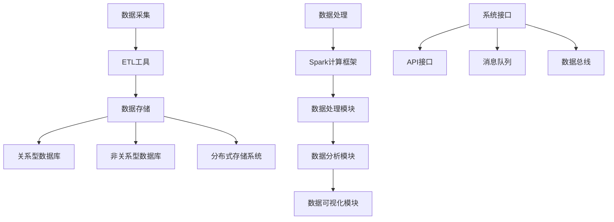

                 

## 引言

### 1.1 书籍目的与结构

《金融大数据分析平台构建》的编写旨在帮助金融行业的技术人员和数据科学家深入了解并掌握金融大数据分析平台的构建方法和实践技巧。本书的目标是：

1. **介绍金融大数据的基本概念和应用场景**：帮助读者理解大数据在金融行业中的重要性，以及其应用的具体案例。
2. **详细讲解数据分析平台的关键功能**：从数据采集、存储、处理、分析到可视化，逐步引导读者构建一个完整的金融数据分析平台。
3. **提供实战案例和最佳实践**：通过具体的案例分析，让读者能够将理论知识应用到实际项目中，掌握数据分析平台的构建技巧。

全书结构如下：

- **引言**：介绍书籍的目的、目标读者和整体结构。
- **第二部分：数据采集与存储**：包括数据采集、数据质量管理、数据存储技术等章节。
- **第三部分：数据处理与分析**：包括数据处理技术、金融数据分析方法等章节。
- **附录**：提供相关工具、技术和最佳实践的详细介绍。

### 1.2 金融大数据的背景

#### 1.2.1 金融行业大数据的发展

随着互联网和金融科技的快速发展，金融行业积累了大量的数据。这些数据不仅包括客户的交易记录、贷款申请、投资行为等，还涵盖了新闻、社交媒体、市场行情等多维数据。大数据技术在金融行业的应用，使得金融机构能够更加准确地了解市场动态，优化风险管理，提升服务质量和效率。

#### 1.2.2 大数据在金融行业的应用

大数据在金融行业的应用场景非常广泛，主要包括：

- **风险控制**：通过分析客户的历史交易数据和行为模式，预测潜在的风险，并进行实时监控和调整。
- **客户关系管理**：利用大数据分析客户需求，提供个性化的服务和建议，提高客户满意度和忠诚度。
- **市场预测**：通过对市场数据的分析，预测市场趋势，帮助投资者做出更明智的决策。
- **运营优化**：通过分析业务数据，优化业务流程，降低成本，提高效率。

#### 1.2.3 大数据分析的重要性

大数据分析在金融行业的重要性体现在以下几个方面：

- **提高决策效率**：通过快速处理和分析大量数据，帮助金融机构做出更快速、准确的决策。
- **提升服务质量**：通过分析客户数据，提供个性化的服务和建议，提高客户满意度和忠诚度。
- **降低风险**：通过风险控制分析，提前识别和防范潜在风险，降低金融风险。
- **创新业务模式**：大数据分析为金融机构提供了新的业务模式和增长点。

### 1.3 数据分析平台概述

#### 1.3.1 数据分析平台的定义

数据分析平台是一个集成化的系统，用于从各种数据源中采集、存储、处理和分析数据，并提供可视化工具，帮助用户理解和利用数据。

#### 1.3.2 平台的关键功能

一个典型的数据分析平台通常包括以下关键功能：

- **数据采集**：从内部和外部数据源采集数据。
- **数据存储**：存储和管理采集到的数据。
- **数据处理**：对数据进行清洗、整合和转换。
- **数据分析**：运用统计分析和机器学习算法对数据进行深入分析。
- **数据可视化**：通过图表、报表等形式展示分析结果。

#### 1.3.3 平台的需求分析

构建一个金融大数据分析平台，需要考虑以下需求：

- **数据多样性**：需要能够处理不同类型的数据，如结构化数据、非结构化数据和实时数据。
- **数据量级**：需要能够处理海量数据，支持实时和批量处理。
- **安全性和隐私保护**：需要确保数据安全和用户隐私。
- **扩展性和灵活性**：需要支持系统的扩展和功能的灵活调整。
- **用户体验**：需要提供友好的用户界面和便捷的操作体验。

### 1.4 本书内容安排

#### 1.4.1 各章节内容简述

- **第1章 引言**：介绍书籍的目的、结构和内容。
- **第2章 数据采集**：介绍数据采集的方法、技术和质量管理。
- **第3章 数据存储与管理**：介绍数据存储技术、架构设计和数据库优化。
- **第4章 数据处理技术**：介绍数据处理流程、算法和工具。
- **第5章 金融数据分析方法**：介绍金融领域常用的数据分析方法。

#### 1.4.2 学习建议和路线规划

为了更好地掌握金融大数据分析平台的构建，建议读者：

- **系统学习**：按照本书的结构，逐步学习各个部分的内容。
- **动手实践**：在理解理论知识的基础上，动手实践，构建自己的数据分析平台。
- **拓展阅读**：阅读相关领域的专业书籍和文献，加深对金融大数据分析的理解。
- **持续学习**：随着大数据技术和金融行业的不断进步，持续学习和更新知识。

### 1.5 本章小结

本章介绍了《金融大数据分析平台构建》的目的、结构和内容。通过了解金融大数据的背景和数据分析平台的需求，读者可以更好地理解本书的主题和内容。在接下来的章节中，我们将逐步深入探讨金融大数据分析平台构建的各个方面。

# 数据采集

数据采集是构建金融大数据分析平台的第一步，它是后续数据处理和分析的基础。本章节将详细探讨数据采集的方法、技术和质量管理。

## 2.1 数据源类型

金融行业的数据源可以分为内部数据源和外部数据源。

### 2.1.1 内部数据源

内部数据源主要包括金融机构内部的交易记录、客户信息、财务报表等。这些数据是金融机构日常运营的重要组成部分，通常已经结构化并且经过了一定的预处理。

- **交易记录**：包括股票交易、基金交易、债券交易等。
- **客户信息**：包括客户的身份信息、财务状况、投资偏好等。
- **财务报表**：包括资产负债表、利润表、现金流量表等。

### 2.1.2 外部数据源

外部数据源主要包括市场数据、新闻、社交媒体和其他外部数据。这些数据通常是非结构化的，需要进一步的处理和整合。

- **市场数据**：包括股票价格、利率、汇率等。
- **新闻和报告**：包括金融新闻、研究报告、行业动态等。
- **社交媒体**：包括微博、微信、论坛等平台的用户评论和反馈。

### 2.1.3 数据源的整合与筛选

在采集数据时，需要对内部和外部数据源进行整合和筛选，以确保数据的质量和一致性。以下是一些常用的方法和技巧：

- **数据整合**：使用ETL（提取、转换、加载）工具将不同数据源的数据整合到一个统一的数据存储中。
- **数据筛选**：根据业务需求和数据质量要求，对数据进行筛选和过滤，去除重复、错误和无用的数据。
- **数据标准化**：对数据进行标准化处理，确保数据格式的一致性和兼容性。

## 2.2 数据采集技术

数据采集技术可以分为离线采集、实时采集和半实时采集。

### 2.2.1 离线采集

离线采集是指在一定时间窗口内，对数据源进行数据采集和整合。这种方法通常用于处理历史数据，适用于数据量较大但变化不频繁的场景。

- **优点**：数据采集过程简单，对系统性能要求较低。
- **缺点**：数据处理和更新周期较长，无法满足实时分析的需求。

### 2.2.2 实时采集

实时采集是指对数据源的实时数据流进行采集和处理。这种方法适用于需要实时分析决策的场景，如交易风险监控、实时行情分析等。

- **优点**：数据更新速度快，能够实时响应业务需求。
- **缺点**：对系统性能和稳定性要求较高，需要处理数据流中的噪声和异常。

### 2.2.3 半实时采集

半实时采集是指在一定时间窗口内，对数据源进行数据采集和处理。这种方法结合了离线采集和实时采集的优点，适用于部分实时分析和批处理场景。

- **优点**：平衡了实时性和批处理效率，适合多种业务需求。
- **缺点**：数据处理和更新周期相对较长，无法满足最高级别的实时需求。

## 2.3 数据质量管理

数据质量管理是确保数据准确、完整、一致和可靠的关键环节。以下是一些常用的数据质量管理方法和技巧：

### 2.3.1 数据质量的重要性

- **数据准确性和完整性**：准确和完整的数据是进行分析和决策的基础。
- **数据一致性和可靠性**：确保数据在系统中的一致性和可靠性，避免错误和冲突。
- **数据合规性**：确保数据符合相关法规和标准，保护用户隐私和商业秘密。

### 2.3.2 数据清洗的方法

- **缺失值处理**：对缺失数据进行填补或删除。
- **重复数据识别**：识别和删除重复的数据。
- **异常值处理**：识别和修正异常数据。
- **数据标准化**：对数据进行格式化和统一处理。

### 2.3.3 数据质量评估

- **数据质量指标**：定义和计算数据质量指标，如准确性、完整性、一致性等。
- **数据质量报告**：定期生成数据质量报告，评估数据质量状况。

## 2.4 数据采集案例

### 2.4.1 案例背景

某金融机构计划构建一个金融大数据分析平台，用于分析客户交易行为和市场行情。数据源包括内部交易数据和外部市场数据。

### 2.4.2 采集流程设计

1. **数据整合**：使用ETL工具，将内部交易数据和外部市场数据进行整合，存储到一个统一的数据仓库中。
2. **数据清洗**：对数据进行缺失值处理、重复数据识别和异常值处理，确保数据质量。
3. **数据筛选**：根据业务需求，对数据进行筛选和过滤，去除无关数据。
4. **数据存储**：将清洗后的数据存储到分布式数据库中，确保数据可扩展性和高性能。

### 2.4.3 采集效果评估

1. **数据质量评估**：通过数据质量指标评估数据质量，如准确性、完整性、一致性等。
2. **采集效率评估**：评估数据采集的效率和性能，如数据采集时间、数据处理速度等。
3. **业务价值评估**：评估数据采集对业务决策的支持和贡献，如风险控制、市场预测等。

## 2.5 本章小结

本章介绍了金融大数据分析平台构建中的数据采集过程。通过了解数据源类型、数据采集技术和数据质量管理，读者可以掌握构建金融大数据分析平台的基本方法和实践技巧。在接下来的章节中，我们将进一步探讨数据存储和管理、数据处理与分析等内容。

# 第3章 数据存储与管理

数据存储与管理是金融大数据分析平台构建的关键环节。一个高效、稳定和安全的存储与管理系统能够确保数据的有效利用和业务连续性。本章将详细介绍数据存储技术、存储架构设计、数据库选型与优化，以及数据管理最佳实践。

## 3.1 数据存储技术概述

数据存储技术可以根据数据类型和处理需求进行分类，主要包括关系型数据库、非关系型数据库和分布式存储系统。

### 3.1.1 关系型数据库

关系型数据库（RDBMS）是最常用的数据存储技术之一。它基于关系模型，使用表格来组织数据，支持SQL查询语言。关系型数据库的优点包括：

- **数据结构清晰**：使用表格和关系来组织数据，便于理解和维护。
- **支持复杂查询**：SQL语言支持复杂的数据查询和计算。
- **事务支持**：支持事务处理，确保数据的一致性和完整性。

常用的关系型数据库包括MySQL、PostgreSQL、Oracle等。

### 3.1.2 非关系型数据库

非关系型数据库（NoSQL）适用于处理大规模的非结构化和半结构化数据。它不依赖于固定的表结构，支持灵活的数据模型。非关系型数据库的优点包括：

- **灵活性**：适用于不同类型的数据，如文档、键值对、图等。
- **可扩展性**：易于扩展，支持水平扩展。
- **高性能**：适用于读多写少的场景，提供高性能的读写操作。

常用的非关系型数据库包括MongoDB、Redis、Cassandra等。

### 3.1.3 分布式存储系统

分布式存储系统是将数据存储在多个节点上，提供高可用性和高性能的数据存储解决方案。分布式存储系统的优点包括：

- **高可用性**：通过冗余存储和故障转移，确保系统的可用性。
- **高性能**：通过数据分片和并行处理，提供高性能的读写操作。
- **可扩展性**：支持在线扩展，适应数据量的增长。

常用的分布式存储系统包括HDFS、Ceph、Alluxio等。

## 3.2 数据存储架构设计

数据存储架构设计是构建金融大数据分析平台的关键。一个良好的数据存储架构应考虑数据类型、数据量级、性能需求、扩展性和安全性等因素。以下是一些常见的数据存储架构设计方法：

### 3.2.1 数据分层存储

数据分层存储是将数据分为不同的层级，每个层级使用不同的存储技术和策略。常见的分层存储架构包括：

- **热数据层**：存储经常访问的数据，使用高性能的存储设备，如SSD。
- **温数据层**：存储不常访问但仍然需要快速访问的数据，使用性能较好的存储设备，如HDD。
- **冷数据层**：存储长期不访问的数据，使用成本较低的存储设备，如云存储。

### 3.2.2 数据存储容量规划

数据存储容量规划是确保数据存储系统能够满足未来增长需求的重要环节。以下是一些容量规划的方法：

- **基于历史数据增长趋势进行预测**：通过分析历史数据增长趋势，预测未来的数据量，并根据预测结果进行容量规划。
- **预留额外容量**：在规划时预留一定的额外容量，以应对突发性的数据增长。

### 3.2.3 数据存储性能优化

数据存储性能优化是提高数据存储系统性能的关键。以下是一些常见的性能优化方法：

- **数据分片**：将数据分散存储在多个节点上，提高数据访问速度和系统吞吐量。
- **缓存策略**：使用缓存技术，减少数据的访问延迟，提高系统性能。
- **读写分离**：通过将读操作和写操作分离到不同的节点，提高系统的读写性能。

## 3.3 数据库选型与优化

数据库选型是构建金融大数据分析平台的重要环节。以下是一些常见的数据库选型策略：

### 3.3.1 数据库选型策略

- **业务需求**：根据业务需求选择适合的数据库类型，如关系型数据库适用于结构化数据，非关系型数据库适用于非结构化数据。
- **性能需求**：根据系统性能需求，选择适合的数据库，如高性能需求选择关系型数据库，高扩展性需求选择非关系型数据库。
- **成本因素**：考虑数据库的硬件成本、软件成本和维护成本，选择成本效益最高的数据库。

### 3.3.2 查询优化技术

查询优化技术是提高数据库性能的关键。以下是一些常见的查询优化技术：

- **索引优化**：合理使用索引，提高查询效率。
- **查询重写**：通过重写查询语句，优化查询执行计划。
- **分区策略**：通过数据分区，提高查询的并行度和性能。

### 3.3.3 数据库性能监控与调优

数据库性能监控与调优是确保数据库稳定运行和高效运行的关键。以下是一些常见的数据库性能监控与调优方法：

- **性能监控**：通过监控数据库的CPU、内存、I/O等资源使用情况，及时发现性能瓶颈。
- **性能调优**：根据监控数据，调整数据库配置和参数，优化数据库性能。
- **日志分析**：通过分析数据库日志，识别和解决性能问题。

## 3.4 数据管理最佳实践

数据管理是确保数据质量、安全性和合规性的关键。以下是一些常见的数据管理最佳实践：

### 3.4.1 数据访问权限管理

- **权限分级**：根据用户角色和职责，设置不同的数据访问权限。
- **审计跟踪**：记录用户的数据访问行为，确保数据访问的可追溯性。

### 3.4.2 数据备份与恢复策略

- **定期备份**：定期对数据进行备份，确保数据不会因为系统故障而丢失。
- **灾难恢复**：制定灾难恢复计划，确保在灾难发生时，能够快速恢复数据。

### 3.4.3 数据安全与隐私保护

- **数据加密**：对敏感数据进行加密，确保数据在传输和存储过程中的安全性。
- **访问控制**：通过访问控制机制，限制对数据的访问，防止未经授权的访问。
- **隐私保护**：遵守相关法律法规，确保用户隐私和数据安全。

## 3.5 数据存储案例分析

### 3.5.1 案例背景

某金融机构计划构建一个金融大数据分析平台，用于分析客户交易行为和市场行情。数据量预计达到数十TB级别，要求高可用性和高性能。

### 3.5.2 存储架构设计

1. **数据分层存储**：采用热数据层、温数据层和冷数据层，分别使用SSD、HDD和云存储。
2. **分布式存储系统**：采用分布式存储系统，提高数据访问速度和系统吞吐量。
3. **数据库选型**：关系型数据库用于存储结构化数据，非关系型数据库用于存储非结构化数据。

### 3.5.3 存储优化措施

1. **数据分片**：将数据分片存储在多个节点上，提高数据访问速度和系统吞吐量。
2. **缓存策略**：使用缓存技术，减少数据的访问延迟，提高系统性能。
3. **读写分离**：将读操作和写操作分离到不同的节点，提高系统的读写性能。

## 3.6 本章小结

本章介绍了金融大数据分析平台构建中的数据存储与管理。通过了解数据存储技术、存储架构设计、数据库选型与优化和数据管理最佳实践，读者可以掌握构建金融大数据分析平台的基本方法和实践技巧。在接下来的章节中，我们将进一步探讨数据处理与分析、金融数据分析方法等内容。

# 第4章 数据处理技术

数据处理技术是构建金融大数据分析平台的核心环节。通过有效的数据处理，可以挖掘数据的价值，为金融业务提供深入洞察。本章将详细介绍数据处理流程、常见数据处理算法、数据处理工具，以及数据处理案例。

## 4.1 数据预处理

数据预处理是数据处理的第一步，它包括数据清洗、数据整合和数据转换等过程。数据预处理的质量直接影响到后续数据分析的结果。

### 4.1.1 数据清洗

数据清洗是去除数据中的噪声和错误，确保数据质量的过程。以下是一些常见的数据清洗方法：

- **缺失值处理**：对缺失值进行填补或删除。填补方法包括均值填补、中值填补和插值填补等。
- **重复数据识别**：识别并删除重复的数据。
- **异常值处理**：识别并处理异常值，可以采用统计方法（如箱线图）或机器学习方法进行识别和处理。
- **数据规范化**：将数据转换为同一尺度，以便进行比较和分析。

### 4.1.2 数据整合

数据整合是将来自不同数据源的数据进行合并和统一的过程。以下是一些常见的数据整合方法：

- **数据合并**：使用合并操作将多个数据集合并为一个数据集。
- **数据融合**：将多个数据源的属性进行融合，形成新的数据集。
- **数据连接**：通过连接操作将多个数据表中的数据连接起来，形成统一的数据视图。

### 4.1.3 数据转换

数据转换是将数据从一种格式转换为另一种格式的过程。以下是一些常见的数据转换方法：

- **数据类型转换**：将数据从一种类型转换为另一种类型，如将字符串转换为数字或日期。
- **数据格式转换**：将数据从一种格式转换为另一种格式，如将CSV格式转换为JSON格式。
- **数据编码转换**：将数据从一种编码转换为另一种编码，如将UTF-8编码转换为ISO-8859-1编码。

## 4.2 数据分析流程

数据分析流程是进行数据探索性分析、统计分析、预测分析等步骤的过程。以下是一个典型的数据分析流程：

### 4.2.1 数据探索性分析

数据探索性分析（EDA）是通过对数据进行初步分析，发现数据中的模式和异常。以下是一些常见的EDA方法：

- **描述性统计**：计算数据的均值、中位数、标准差等统计量，了解数据的分布情况。
- **可视化**：使用图表、散点图、箱线图等可视化方法，展示数据的分布和关系。
- **数据挖掘**：使用聚类、关联规则等挖掘技术，发现数据中的隐藏模式。

### 4.2.2 统计分析

统计分析是对数据进行定量分析，以揭示数据之间的关系和规律。以下是一些常见的统计分析方法：

- **相关性分析**：计算变量之间的相关性，了解变量之间的关系。
- **回归分析**：建立变量之间的回归模型，预测因变量的值。
- **方差分析**：比较不同组之间的差异，了解变量之间的交互作用。

### 4.2.3 预测分析

预测分析是根据历史数据，预测未来的趋势和变化。以下是一些常见的预测分析方法：

- **时间序列分析**：分析时间序列数据的趋势和季节性，预测未来的趋势。
- **回归分析**：建立回归模型，预测因变量的值。
- **机器学习模型**：使用机器学习算法，建立预测模型，预测未来的趋势。

## 4.3 常见数据处理算法

常见的数据处理算法包括聚类算法、分类算法和回归算法等。以下是对这些算法的简要介绍：

### 4.3.1 聚类算法

聚类算法是将数据分为多个簇的过程，使得同一个簇内的数据尽可能相似，而不同簇之间的数据尽可能不同。以下是一些常见的聚类算法：

- **K-均值聚类**：将数据分为K个簇，每个簇由一个中心点表示，算法通过迭代调整中心点，最小化簇内的距离平方和。
- **层次聚类**：将数据分为多个层次，每一层都是上一层的子集，直到所有数据点都属于一个簇。
- **DBSCAN**：基于密度的聚类算法，将数据点根据其密度和邻域大小划分为多个簇。

### 4.3.2 分类算法

分类算法是将数据分为预定义的类别或标签的过程。以下是一些常见的分类算法：

- **决策树**：使用一系列条件来判断数据点属于哪个类别。
- **支持向量机（SVM）**：通过寻找最优超平面，将数据分为不同的类别。
- **随机森林**：通过构建多棵决策树，结合它们的预测结果进行分类。

### 4.3.3 回归算法

回归算法是预测因变量值的方法，以下是一些常见的回归算法：

- **线性回归**：通过建立线性模型，预测因变量的值。
- **多项式回归**：通过建立多项式模型，预测因变量的值。
- **岭回归**：通过添加正则化项，减少模型的过拟合。

## 4.4 数据分析工具介绍

数据分析工具是进行数据处理和统计分析的重要工具。以下是一些常见的数据分析工具：

### 4.4.1 SQL查询工具

SQL查询工具是进行结构化数据查询和操作的重要工具，以下是一些常见的SQL查询工具：

- **MySQL Workbench**：MySQL的图形化管理工具。
- **PostgreSQL Console**：PostgreSQL的命令行查询工具。
- **SQL Server Management Studio**：SQL Server的图形化管理工具。

### 4.4.2 数据分析软件

数据分析软件提供了丰富的数据分析功能和图形化界面，以下是一些常见的数据分析软件：

- **Tableau**：提供数据可视化和分析功能。
- **Power BI**：提供数据可视化和分析功能。
- **QlikView**：提供数据可视化和分析功能。

### 4.4.3 编程语言与库

编程语言和库是进行数据处理和分析的重要工具，以下是一些常见的编程语言和库：

- **Python**：Python是一种通用编程语言，拥有丰富的数据处理和分析库。
- **Pandas**：Pandas是一个Python库，用于数据清洗、分析、转换等。
- **NumPy**：NumPy是一个Python库，提供高效的数组操作和数学计算。
- **Scikit-learn**：Scikit-learn是一个Python库，提供多种机器学习算法和工具。

## 4.5 数据处理案例

### 4.5.1 案例背景

某金融机构希望通过分析客户交易数据，预测客户的潜在投资风险。数据包括客户的交易记录、财务状况、市场行情等。

### 4.5.2 处理流程

1. **数据采集**：采集客户交易数据、财务状况和市场行情数据。
2. **数据清洗**：处理缺失值、异常值和重复数据。
3. **数据整合**：整合不同数据源的数据，形成统一的数据集。
4. **数据转换**：将数据转换为适合分析和建模的格式。
5. **数据建模**：使用机器学习算法建立预测模型，预测客户的投资风险。
6. **模型评估**：评估模型的性能，调整模型参数。
7. **模型应用**：将模型应用于实际业务场景，进行风险预测和决策。

### 4.5.3 处理效果评估

1. **模型精度评估**：通过交叉验证和测试集评估模型的精度。
2. **业务效果评估**：评估模型在业务中的应用效果，如风险降低率、投资回报率等。
3. **用户反馈**：收集用户对模型的反馈，持续优化和改进。

## 4.6 本章小结

本章介绍了金融大数据分析平台构建中的数据处理技术。通过了解数据处理流程、常见数据处理算法、数据处理工具，以及数据处理案例，读者可以掌握构建金融大数据分析平台的基本方法和实践技巧。在接下来的章节中，我们将进一步探讨金融数据分析方法等内容。

# 第5章 金融数据分析方法

金融数据分析方法在金融大数据分析平台中起着至关重要的作用。本章将详细介绍金融时间序列分析方法和应用，包括基本概念、指标计算和预测模型。

## 5.1 金融时间序列分析

金融时间序列分析是对金融市场中的时间序列数据进行研究，以预测未来的市场走势。时间序列数据通常具有趋势性、周期性和随机性等特点。

### 5.1.1 时间序列基本概念

- **时间序列**：时间序列是按时间顺序排列的一组数据点，通常包含一个或多个变量。
- **趋势**：趋势是指时间序列数据随时间增加或减少的总体方向。
- **周期性**：周期性是指时间序列数据中重复出现的波动模式。
- **随机性**：随机性是指时间序列数据中的随机波动，无法用确定性的模型解释。

### 5.1.2 指标计算

金融时间序列分析中常用的一些指标包括：

- **均值**：时间序列数据的平均值，用于衡量数据的中心趋势。
- **标准差**：时间序列数据的离散程度，用于衡量数据的波动性。
- **自相关系数**：时间序列数据在不同时间点之间的相关性，用于衡量数据的依赖性。
- **移动平均**：时间序列数据的平滑处理，用于消除短期波动，显示长期趋势。

### 5.1.3 时间序列预测模型

金融时间序列预测模型包括以下几种：

- **AR（自回归模型）**：通过历史值的线性组合预测未来值。
- **MA（移动平均模型）**：通过历史值的平均值预测未来值。
- **ARMA（自回归移动平均模型）**：结合自回归和移动平均模型，预测未来值。
- **ARIMA（自回归积分移动平均模型）**：在ARMA模型的基础上，加入差分操作，处理非平稳时间序列。

### 5.1.4 应用场景

金融时间序列分析在以下应用场景中具有重要价值：

- **市场预测**：预测市场指数、股票价格、汇率等市场走势，为投资决策提供依据。
- **风险控制**：通过分析市场波动性，预测风险，制定风险管理策略。
- **信用评估**：通过分析借款人的历史信用数据，预测其信用风险。

## 5.2 金融时间序列分析方法

金融时间序列分析方法包括：

- **经典统计方法**：如移动平均法、指数平滑法等。
- **时间序列模型**：如AR、MA、ARMA、ARIMA等。
- **机器学习方法**：如随机森林、支持向量机、神经网络等。

### 5.2.1 移动平均法

移动平均法是通过计算时间序列数据的平均值来平滑数据，以消除短期波动，显示长期趋势。移动平均法分为简单移动平均（SMA）和指数移动平均（EMA）。

- **简单移动平均（SMA）**：SMA是计算过去n个时间点的平均值，公式如下：
  $$SMA = \frac{X_t + X_{t-1} + ... + X_{t-n+1}}{n}$$
  其中，$X_t$表示第t个时间点的数据，$n$表示移动平均周期。

- **指数移动平均（EMA）**：EMA是对SMA的改进，给予近期数据更高的权重，公式如下：
  $$EMA_t = \alpha \cdot X_t + (1 - \alpha) \cdot EMA_{t-1}$$
  其中，$\alpha$是权重系数，通常取值范围为0到1。

### 5.2.2 AR模型

AR模型（自回归模型）是利用过去值的线性组合来预测当前值。AR模型的基本形式如下：
$$X_t = c + \phi_1 X_{t-1} + \phi_2 X_{t-2} + ... + \phi_p X_{t-p} + \varepsilon_t$$
其中，$X_t$是时间序列数据，$c$是常数项，$\phi_1, \phi_2, ..., \phi_p$是自回归系数，$\varepsilon_t$是随机误差项。

### 5.2.3 MA模型

MA模型（移动平均模型）是利用过去值的平均值来预测当前值。MA模型的基本形式如下：
$$X_t = c + \theta_1 X_{t-1} + \theta_2 X_{t-2} + ... + \theta_q X_{t-q} + \varepsilon_t$$
其中，$X_t$是时间序列数据，$c$是常数项，$\theta_1, \theta_2, ..., \theta_q$是移动平均系数，$\varepsilon_t$是随机误差项。

### 5.2.4 ARMA模型

ARMA模型（自回归移动平均模型）是结合AR模型和MA模型的特点，预测当前值。ARMA模型的基本形式如下：
$$X_t = c + \phi_1 X_{t-1} + \phi_2 X_{t-2} + ... + \phi_p X_{t-p} + \theta_1 X_{t-1} + \theta_2 X_{t-2} + ... + \theta_q X_{t-q} + \varepsilon_t$$
其中，$X_t$是时间序列数据，$c$是常数项，$\phi_1, \phi_2, ..., \phi_p$是自回归系数，$\theta_1, \theta_2, ..., \theta_q$是移动平均系数，$\varepsilon_t$是随机误差项。

### 5.2.5 ARIMA模型

ARIMA模型（自回归积分移动平均模型）是处理非平稳时间序列的方法。ARIMA模型的基本形式如下：
$$X_t = c + \phi_1 X_{t-1} + \phi_2 X_{t-2} + ... + \phi_p X_{t-p} + \theta_1 X_{t-1} + \theta_2 X_{t-2} + ... + \theta_q X_{t-q} + \varepsilon_t$$
其中，$X_t$是时间序列数据，$c$是常数项，$\phi_1, \phi_2, ..., \phi_p$是自回归系数，$\theta_1, \theta_2, ..., \theta_q$是移动平均系数，$\varepsilon_t$是随机误差项。在ARIMA模型中，时间序列数据通常需要先进行差分操作，使其变得平稳。

## 5.3 金融时间序列分析案例

### 5.3.1 案例背景

某金融机构希望通过分析股票市场数据，预测未来股票价格走势。数据包括某股票在过去一年的每日收盘价。

### 5.3.2 模型选择

根据数据的特征，选择ARIMA模型进行股票价格预测。

### 5.3.3 模型训练

1. **数据预处理**：对股票收盘价进行差分操作，使其变得平稳。
2. **模型参数选择**：通过ACF和PACF图选择自回归和移动平均的阶数。
3. **模型训练**：使用历史数据训练ARIMA模型。

### 5.3.4 模型评估

1. **模型拟合**：使用训练集数据评估模型拟合效果。
2. **预测误差**：计算预测值与实际值的误差，评估模型预测能力。

### 5.3.5 模型应用

1. **未来预测**：使用训练好的模型预测未来股票价格。
2. **风险分析**：通过预测结果分析股票价格的风险，为投资决策提供依据。

## 5.4 本章小结

本章介绍了金融时间序列分析方法，包括基本概念、指标计算和预测模型。通过金融时间序列分析，可以预测市场走势，为金融业务提供决策支持。在金融大数据分析平台中，时间序列分析是一个重要的组成部分，有助于提高金融业务的数据分析能力和决策水平。在接下来的章节中，我们将进一步探讨金融数据分析的其他方法和应用。

# 第6章 金融大数据分析平台架构设计

金融大数据分析平台的架构设计是构建高效、稳定和可扩展的平台的关键。本章将介绍金融大数据分析平台的设计原则、系统功能设计、系统架构设计和系统接口设计，并提供一个实际案例的架构设计方案。

## 6.1 设计原则

金融大数据分析平台的设计原则如下：

- **模块化**：将平台划分为多个模块，每个模块具有独立的功能，便于开发和维护。
- **可扩展性**：设计具有可扩展性的架构，支持系统的动态调整和扩展。
- **高可用性**：确保系统的稳定运行，提供故障恢复和负载均衡机制。
- **安全性**：保障数据的安全性和用户隐私，遵循相关法律法规和安全标准。
- **高性能**：设计高效的数据处理和存储架构，满足大规模数据处理的性能需求。

## 6.2 系统功能设计

金融大数据分析平台的核心功能包括数据采集、数据存储、数据处理、数据分析和数据可视化。以下是对这些功能的详细描述：

### 6.2.1 数据采集

数据采集功能负责从内部和外部数据源采集数据，包括交易数据、客户信息、市场数据等。数据采集工具应支持离线采集、实时采集和半实时采集，并具备数据清洗和数据质量检查功能。

### 6.2.2 数据存储

数据存储功能负责存储和管理采集到的数据。数据存储架构应支持多种数据类型，包括结构化数据、非结构化数据和实时数据。常用的数据存储技术包括关系型数据库、非关系型数据库和分布式存储系统。

### 6.2.3 数据处理

数据处理功能负责对数据进行清洗、整合和转换。数据处理工具应支持批处理和实时处理，并提供丰富的数据处理算法和工具，如ETL工具、机器学习算法等。

### 6.2.4 数据分析

数据分析功能负责对数据进行深入分析，包括统计分析和预测分析。数据分析工具应支持多种数据分析方法和模型，如回归分析、聚类分析、时间序列分析等，并提供可视化的分析结果。

### 6.2.5 数据可视化

数据可视化功能负责将分析结果以图表、报表等形式展示给用户。数据可视化工具应支持多种图表类型，如折线图、柱状图、散点图等，并提供交互式操作和自定义功能。

## 6.3 系统架构设计

金融大数据分析平台的系统架构设计应考虑数据流、计算资源和系统接口等方面。以下是一个典型的金融大数据分析平台架构设计方案：

### 6.3.1 数据流设计

数据流设计是系统架构设计的关键。数据流设计应确保数据从采集到存储、处理、分析和可视化的整个过程中，保持高效和稳定。以下是一个典型的数据流设计：

1. **数据采集**：从内部和外部数据源采集数据，包括交易数据、客户信息和市场数据。
2. **数据存储**：将采集到的数据存储到关系型数据库、非关系型数据库和分布式存储系统中，支持结构化数据、非结构化数据和实时数据。
3. **数据处理**：使用ETL工具对数据进行清洗、整合和转换，支持批处理和实时处理。
4. **数据分析**：使用机器学习算法和统计分析方法对数据进行深入分析，生成分析报告和预测结果。
5. **数据可视化**：将分析结果以图表、报表等形式展示给用户，支持交互式操作和自定义。

### 6.3.2 计算资源设计

计算资源设计应根据系统的处理能力和负载需求进行配置。以下是一些常见的计算资源设计方法：

1. **计算节点**：使用分布式计算框架（如Hadoop、Spark）将计算任务分配到多个计算节点上，提高系统的处理能力和可扩展性。
2. **存储节点**：使用分布式存储系统（如HDFS、Ceph）存储海量数据，确保数据的高可用性和高性能。
3. **网络资源**：使用高速网络连接计算节点和存储节点，确保数据传输的速度和稳定性。

### 6.3.3 系统接口设计

系统接口设计应确保系统之间的数据交互和功能协同。以下是一些常见的系统接口设计方法：

1. **API接口**：使用RESTful API或SOAP协议，提供系统间的数据交互接口，支持JSON或XML数据格式。
2. **消息队列**：使用消息队列（如Kafka、RabbitMQ）实现异步数据传输和消息传递，提高系统的可靠性和可扩展性。
3. **数据总线**：使用数据总线（如Apache Kafka、Apache NiFi）实现数据流传输和集成，支持多种数据源和目标系统的连接。

## 6.4 系统接口设计

系统接口设计是确保系统之间数据交互和功能协同的关键。以下是一个典型的金融大数据分析平台接口设计：

### 6.4.1 数据接口

数据接口负责实现数据采集、存储、处理和分析等模块之间的数据传输。以下是一些常见的数据接口设计：

1. **数据采集接口**：提供数据采集功能，支持离线采集、实时采集和半实时采集。
2. **数据存储接口**：提供数据存储功能，支持关系型数据库、非关系型数据库和分布式存储系统的连接。
3. **数据处理接口**：提供数据处理功能，支持数据清洗、整合和转换。
4. **数据分析接口**：提供数据分析功能，支持统计分析和预测分析。

### 6.4.2 功能接口

功能接口负责实现系统内部不同模块之间的功能协同。以下是一些常见的功能接口设计：

1. **用户管理接口**：提供用户认证、授权和权限管理功能。
2. **权限管理接口**：提供数据访问权限管理功能，确保数据安全。
3. **数据可视化接口**：提供数据可视化功能，支持图表、报表的生成和展示。
4. **报告生成接口**：提供报告生成功能，支持自定义报告格式和内容。

## 6.5 实际案例架构设计

### 6.5.1 案例背景

某金融机构计划构建一个金融大数据分析平台，用于分析客户交易行为和市场行情。数据量预计达到数十TB级别，要求高可用性和高性能。

### 6.5.2 架构设计方案

根据上述设计原则和系统功能需求，设计一个符合以下要求的金融大数据分析平台架构：

1. **数据流设计**：采用ETL工具，实现数据采集、存储、处理和数据分析的完整数据流。
2. **计算资源设计**：使用分布式计算框架（如Spark），将计算任务分配到多个计算节点上，提高系统的处理能力和可扩展性。
3. **存储资源设计**：使用分布式存储系统（如HDFS），存储海量数据，确保数据的高可用性和高性能。
4. **系统接口设计**：使用API接口和消息队列，实现系统内部和外部系统的数据交互和功能协同。

### 6.5.3 架构图

以下是一个典型的金融大数据分析平台架构图：

## 6.6 本章小结

本章介绍了金融大数据分析平台的架构设计，包括设计原则、系统功能设计、系统架构设计和系统接口设计。通过实际案例架构设计，读者可以掌握金融大数据分析平台的基本架构和实现方法。在构建金融大数据分析平台时，应遵循设计原则，确保系统的模块化、可扩展性、高可用性和安全性。在接下来的章节中，我们将进一步探讨金融大数据分析平台的实战应用和最佳实践。

## 附录

### 附录A：相关工具和技术介绍

在本章中，我们将详细介绍金融大数据分析平台中常用的一些工具和技术。

#### A.1 数据采集工具

数据采集工具是金融大数据分析平台构建中不可或缺的一部分。以下是一些常用的数据采集工具：

1. **Apache NiFi**：Apache NiFi是一个可扩展的数据集成平台，用于数据采集、数据流的转换和数据处理。
2. **Apache Kafka**：Apache Kafka是一个分布式流处理平台，适用于实时数据采集和传输。
3. **Logstash**：Logstash是一个开源的数据收集引擎，用于从各种数据源收集日志数据并将其传输到Elasticsearch或其他数据存储。

#### A.2 数据存储技术

金融大数据分析平台中的数据存储技术至关重要，以下是一些常见的数据存储技术：

1. **关系型数据库（RDBMS）**：
   - **MySQL**：开源的关系型数据库管理系统，适用于结构化数据存储。
   - **PostgreSQL**：开源的关系型数据库管理系统，支持复杂查询和事务处理。

2. **非关系型数据库（NoSQL）**：
   - **MongoDB**：基于文档的NoSQL数据库，适用于存储非结构化和半结构化数据。
   - **Cassandra**：分布式NoSQL数据库，适用于高可用性和高性能的数据存储。

3. **分布式存储系统**：
   - **HDFS**（Hadoop Distributed File System）：分布式文件系统，适用于大数据存储。
   - **Alluxio**（Tachyon）：内存级分布式存储系统，提高数据访问速度。

#### A.3 数据处理工具

数据处理工具用于对数据进行清洗、整合和转换。以下是一些常用的数据处理工具：

1. **Apache Spark**：一个开源的分布式计算引擎，适用于大规模数据处理和机器学习。
2. **Apache Flink**：一个开源的流处理框架，适用于实时数据处理和事件驱动应用。
3. **Apache Hive**：一个基于Hadoop的数据仓库工具，适用于批量数据查询和分析。

#### A.4 数据分析工具

数据分析工具提供数据可视化和高级分析功能。以下是一些常用的数据分析工具：

1. **Tableau**：一个数据可视化工具，适用于创建交互式的图表和报表。
2. **Power BI**：一个由Microsoft开发的商业智能工具，提供数据可视化和分析功能。
3. **R**：一个统计计算和图形工具，适用于复杂数据分析和统计建模。

#### A.5 数据安全与隐私保护

数据安全与隐私保护是金融大数据分析平台的重要方面。以下是一些常见的数据安全与隐私保护技术：

1. **数据加密**：使用加密算法对敏感数据进行加密，确保数据在传输和存储过程中的安全性。
2. **访问控制**：通过访问控制机制，限制对数据的访问权限，确保数据的安全性和合规性。
3. **数据脱敏**：对敏感数据进行脱敏处理，防止隐私泄露。

### 附录B：学习资源推荐

为了更好地掌握金融大数据分析平台的相关知识，以下是推荐的一些学习资源：

1. **书籍**：
   - 《大数据技术基础》
   - 《金融大数据分析：方法和应用》
   - 《Hadoop实战》

2. **在线课程**：
   - Coursera上的《大数据分析》
   - Udacity的《大数据工程师纳米学位》

3. **技术社区**：
   - CSDN
   - GitHub
   - Stack Overflow

### 附录C：术语解释

在本章中，我们使用了一些专业术语，以下是对这些术语的解释：

- **ETL**：提取、转换、加载（Extract, Transform, Load）的过程，用于将数据从源系统提取出来，进行转换，然后加载到目标系统中。
- **NoSQL**：非关系型数据库（Not Only SQL）的简称，用于存储和管理非结构化和半结构化数据。
- **Hadoop**：一个开源框架，用于大规模数据处理，包括分布式存储（HDFS）和分布式计算（MapReduce）。
- **Spark**：一个开源的分布式计算引擎，提供高效的数据处理和分析功能。
- **数据仓库**：一个集中的数据存储系统，用于存储和管理大量的结构化数据，支持复杂的数据分析和报表生成。

### 附录D：注意事项

在构建金融大数据分析平台时，需要注意以下几点：

1. **数据质量**：确保数据质量是数据分析成功的关键，对数据进行清洗、整合和标准化处理。
2. **性能优化**：针对大数据处理，进行性能优化，如数据分片、缓存策略和读写分离等。
3. **安全性**：保障数据安全，遵循相关法律法规，对敏感数据进行加密和访问控制。
4. **扩展性**：设计具有可扩展性的架构，支持系统的动态调整和扩展。
5. **合规性**：确保系统符合相关法律法规和标准，保护用户隐私和数据安全。

### 附录E：拓展阅读

对于想要进一步了解金融大数据分析平台构建的读者，以下是推荐的一些拓展阅读：

1. **《大数据系统架构》**：详细介绍了大数据系统的设计原则、架构和实现方法。
2. **《金融科技：创新与变革》**：探讨金融科技在金融行业的应用和创新。
3. **《机器学习实战》**：提供机器学习算法的实践应用和案例分析。

通过附录中的内容，读者可以更全面地了解金融大数据分析平台的相关知识，掌握构建和优化金融大数据分析平台的方法和技巧。希望这些资源能够帮助读者在金融大数据分析领域取得更好的成就。作者：AI天才研究院/AI Genius Institute & 禅与计算机程序设计艺术 /Zen And The Art of Computer Programming。

