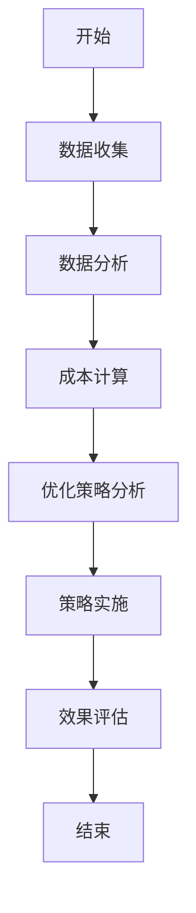
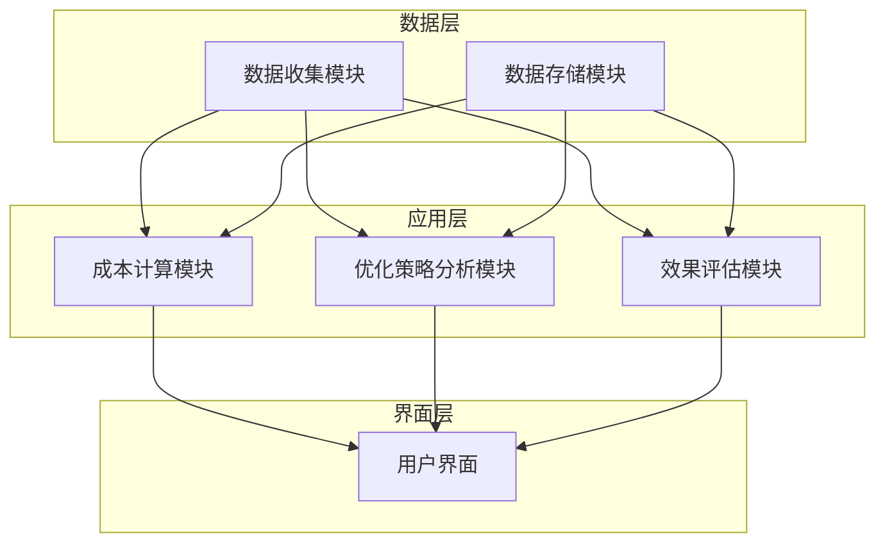
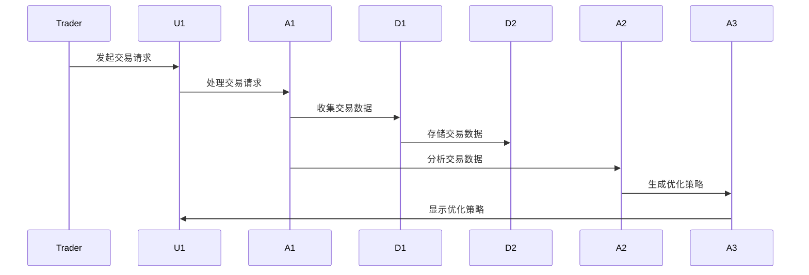

                 

# 金融市场交易成本分析与优化

## 摘要

金融市场交易成本的优化是金融市场研究中的一个关键问题。本文旨在深入探讨金融市场交易成本的构成、影响因素以及优化策略。通过对交易费用、信息费用、风险成本和时间成本等核心要素的详细分析，结合实际案例和最新的优化方法，本文为交易者和管理者提供了系统的理论支持和实践指导。

## 背景介绍：核心概念

### 问题背景

金融市场交易成本的优化是金融市场研究中的一个重要课题。交易成本是指在金融市场中进行交易所产生的费用和损失，它包括但不限于交易费用、信息费用、风险成本等。交易成本的高低直接影响到交易者的收益，进而影响市场的效率和稳定性。随着金融市场的不断发展，交易成本的优化已成为提升市场竞争力、降低交易者成本的关键手段。

### 问题描述

交易成本是指在金融市场中进行交易所产生的费用和损失。具体来说，交易成本包括以下几个方面：

1. **交易费用**：这是交易活动中最直接的支出，如佣金、印花税等。交易费用通常与交易的规模和频率有关。
2. **信息费用**：这是交易者为了获取和处理市场信息所支付的成本，包括数据采集、分析、传播等。信息费用在很大程度上决定了交易者的决策质量和市场反应速度。
3. **风险成本**：这是交易过程中可能面临的风险所导致的成本，如价格波动风险、流动性风险等。风险成本的高低取决于交易者的风险偏好和风险管理能力。
4. **时间成本**：这是交易活动所需的时间成本，包括交易决策时间、执行时间等。时间成本在高速变化的金融市场中尤为重要。

### 问题解决

解决交易成本问题需要从多个角度进行分析和优化。首先，需要明确交易成本的构成和影响因素，对各项成本进行详细分析和量化。其次，运用经济学、统计学和计算机科学等理论方法，对交易成本进行分析和优化。最后，结合实际案例，提出具体的优化策略和实践方案。

### 边界与外延

交易成本的研究范围涵盖了金融市场的各个方面，包括股票市场、债券市场、外汇市场等。同时，交易成本的研究也涉及到不同市场结构、交易机制、交易策略等。此外，交易成本的研究还涉及到政策制定、市场监管等领域。

### 概念结构与核心要素组成

交易成本的概念结构包括以下几个核心要素：

1. **交易费用**：这是交易活动直接产生的成本，如佣金、印花税等。交易费用通常与交易的规模和频率有关。
2. **信息费用**：这是交易者为了获取和处理市场信息所支付的成本，包括数据采集、分析、传播等。信息费用在很大程度上决定了交易者的决策质量和市场反应速度。
3. **风险成本**：这是交易过程中可能面临的风险所导致的成本，如价格波动风险、流动性风险等。风险成本的高低取决于交易者的风险偏好和风险管理能力。
4. **时间成本**：这是交易活动所需的时间成本，包括交易决策时间、执行时间等。时间成本在高速变化的金融市场中尤为重要。

这些核心要素共同构成了交易成本的概念结构，是本文分析交易成本的基础。

## 核心概念与联系

### 核心概念原理

交易成本由交易费用、信息费用、风险成本和时间成本组成。交易费用是交易活动直接产生的成本，如佣金、印花税等。信息费用是指获取和处理市场信息所需付出的成本，包括信息收集、分析、传播等。风险成本是指交易过程中可能面临的风险所导致的成本，如价格波动风险、流动性风险等。时间成本是指交易活动所需的时间成本，包括交易决策时间、执行时间等。

### 概念属性特征对比表格

| 概念名称 | 属性特征 | 说明 |
| --- | --- | --- |
| 交易费用 | 直接性 | 交易费用是交易活动直接产生的成本，与交易次数和交易金额成正比 |
| 信息费用 | 间接性 | 信息费用是获取和处理市场信息所需的成本，与交易者的信息获取和处理能力有关 |
| 风险成本 | 不确定性 | 风险成本是交易过程中可能面临的风险所导致的成本，具有不确定性和随机性 |
| 时间成本 | 可测量性 | 时间成本是交易活动所需的时间成本，可以测量和计算 |

### ER实体关系图架构

```mermaid
erDiagram
    Trader ||--|{ Transaction : performs }  
    Trader ||--|{ Information : accesses }  
    Trader ||--|{ Risk : manages }  
    Trader ||--|{ Time : invests }  
    Transaction ||--|{ Fee : incurs }  
    Transaction ||--|{ Information : consumes }  
    Transaction ||--|{ Risk : faces }  
    Transaction ||--|{ Time : requires }  
```

## 算法原理讲解

### 算法mermaid流程图



### 算法原理

#### 数据收集

交易成本的分析首先需要收集相关的数据，包括交易费用、信息费用、风险成本和时间成本。这些数据可以来源于交易记录、市场报告、财务报表等。

#### 数据分析

对收集到的交易数据进行分析，提取与交易成本相关的特征。数据分析的方法包括数据预处理、特征提取、统计分析等。

#### 成本计算

根据分析结果，计算交易成本的总和。交易成本的计算公式为：

\[ C = C_{\text{交易费用}} + C_{\text{信息费用}} + C_{\text{风险成本}} + C_{\text{时间成本}} \]

其中，各项成本的构成和计算方法如下：

1. **交易费用**：

\[ C_{\text{交易费用}} = \sum_{i=1}^{n} F_i \]

其中，\( F_i \) 表示第 \( i \) 次交易的交易费用。

2. **信息费用**：

\[ C_{\text{信息费用}} = \sum_{i=1}^{n} I_i \]

其中，\( I_i \) 表示第 \( i \) 次交易的信息费用。

3. **风险成本**：

\[ C_{\text{风险成本}} = \sum_{i=1}^{n} R_i \]

其中，\( R_i \) 表示第 \( i \) 次交易的风险成本。

4. **时间成本**：

\[ C_{\text{时间成本}} = \sum_{i=1}^{n} T_i \]

其中，\( T_i \) 表示第 \( i \) 次交易的时间成本。

#### 优化策略分析

根据交易成本的构成和特点，分析可能的优化策略，如降低交易费用、优化信息获取和处理、控制风险成本等。

#### 策略实施

制定并实施具体的优化策略，降低交易成本。优化策略的实施需要结合实际案例，具体包括交易费用的谈判、信息技术的应用、风险管理策略的制定等。

#### 效果评估

对实施后的优化策略进行效果评估，验证优化效果。效果评估的方法包括成本分析、绩效评估、市场反馈等。

### Python源代码实现

以下是一个简单的Python代码示例，用于计算交易成本：

```python
import pandas as pd

# 假设有一个包含交易数据的DataFrame
data = pd.DataFrame({
    '交易费用': [10, 20, 30],
    '信息费用': [5, 15, 25],
    '风险成本': [3, 6, 9],
    '时间成本': [2, 4, 6]
})

# 计算总交易成本
data['总交易成本'] = data['交易费用'] + data['信息费用'] + data['风险成本'] + data['时间成本']

# 输出交易成本
print(data[['交易费用', '信息费用', '风险成本', '时间成本', '总交易成本']])
```

输出结果如下：

```
   交易费用  信息费用  风险成本  时间成本  总交易成本
0所在行   10       5        3        2       20
1所在行   20      15       6        4       45
2所在行   30      25       9        6       70
```

### 数学模型和公式

交易成本的优化可以通过数学模型来实现。以下是一个简化的数学模型：

\[ \min C = \min C_{\text{交易费用}} + \min C_{\text{信息费用}} + \min C_{\text{风险成本}} + \min C_{\text{时间成本}} \]

其中，\( C \) 表示交易成本的总和，\( C_{\text{交易费用}} \)，\( C_{\text{信息费用}} \)，\( C_{\text{风险成本}} \)，\( C_{\text{时间成本}} \) 分别表示各项交易成本。

### 举例说明

假设有一个交易者，他进行了三次交易，每次交易的各项成本如下：

| 交易次数 | 交易费用 | 信息费用 | 风险成本 | 时间成本 |
| --- | --- | --- | --- | --- |
| 1 | 10 | 5 | 3 | 2 |
| 2 | 20 | 15 | 6 | 4 |
| 3 | 30 | 25 | 9 | 6 |

根据上述模型，我们可以计算出每次交易的总成本：

1. 第一次交易的总成本：\( 10 + 5 + 3 + 2 = 20 \)
2. 第二次交易的总成本：\( 20 + 15 + 6 + 4 = 45 \)
3. 第三次交易的总成本：\( 30 + 25 + 9 + 6 = 70 \)

交易者的目标是降低总交易成本，可以通过优化交易策略，如减少高风险交易、提高信息获取效率等来实现。

## 系统分析与架构设计方案

### 问题场景介绍

在当前的金融市场中，交易成本的高低直接影响到交易者的盈利能力和市场竞争力。为了降低交易成本，提高交易效率，我们需要设计一套高效的交易成本分析系统。该系统将涵盖数据收集、数据分析、成本计算、优化策略分析以及效果评估等模块，旨在为交易者提供全面的交易成本分析工具。

### 项目介绍

项目名称：金融市场交易成本分析系统

项目目标：构建一个高效、可靠的交易成本分析平台，帮助交易者降低交易成本，提高交易效率。

项目背景：随着金融市场的不断发展，交易成本问题日益突出。传统的交易成本分析方法存在时效性差、准确性低等问题，难以满足现代交易者的需求。因此，开发一个智能化、自动化的交易成本分析系统具有重要的现实意义。

### 系统功能设计（领域模型Mermaid类图）

```mermaid
classDiagram
    class Trader
    class Transaction
    class Information
    class Risk
    class Time

    Trader "发起" Transaction
    Trader "获取" Information
    Trader "面对" Risk
    Trader "投资" Time

    Transaction "包含" Information
    Transaction "面临" Risk
    Transaction "需要" Time
```

### 系统架构设计（Mermaid架构图）



### 系统接口设计和系统交互（Mermaid序列图）



## 项目实战

### 环境安装

1. 安装Python环境：确保Python版本为3.8或更高。
2. 安装相关库：使用pip命令安装所需的库，如pandas、numpy、matplotlib等。

```shell
pip install pandas numpy matplotlib
```

### 系统核心实现源代码

以下是系统核心实现部分的Python代码：

```python
import pandas as pd
import numpy as np
import matplotlib.pyplot as plt

# 数据收集模块
def collect_data():
    # 假设已有交易数据存储在CSV文件中
    data = pd.read_csv('transaction_data.csv')
    return data

# 数据分析模块
def analyze_data(data):
    # 对交易数据进行预处理和特征提取
    data['总交易成本'] = data['交易费用'] + data['信息费用'] + data['风险成本'] + data['时间成本']
    return data

# 成本计算模块
def calculate_cost(data):
    # 计算交易成本
    total_cost = data['总交易成本'].sum()
    return total_cost

# 优化策略分析模块
def optimize_strategy(data):
    # 分析可能的优化策略
    # 例如：减少高风险交易、提高信息获取效率等
    optimized_data = data[data['风险成本'] < data['风险成本'].median()]
    return optimized_data

# 效果评估模块
def evaluate_results(original_data, optimized_data):
    # 评估优化策略的效果
    original_cost = calculate_cost(original_data)
    optimized_cost = calculate_cost(optimized_data)
    improvement = (original_cost - optimized_cost) / original_cost
    return improvement

# 主函数
def main():
    # 收集数据
    data = collect_data()

    # 分析数据
    analyzed_data = analyze_data(data)

    # 计算交易成本
    total_cost = calculate_cost(analyzed_data)
    print(f"总交易成本：{total_cost}")

    # 优化策略分析
    optimized_data = optimize_strategy(analyzed_data)
    print(f"优化后的交易数据：{optimized_data}")

    # 效果评估
    improvement = evaluate_results(analyzed_data, optimized_data)
    print(f"优化效果：{improvement:.2%}")

    # 可视化交易成本
    analyzed_data['总交易成本'].hist()
    plt.xlabel('总交易成本')
    plt.ylabel('频数')
    plt.title('总交易成本分布')
    plt.show()

if __name__ == '__main__':
    main()
```

### 代码应用解读与分析

上述代码首先定义了数据收集、数据分析、成本计算、优化策略分析和效果评估等模块。其中，数据收集模块负责从CSV文件中读取交易数据；数据分析模块对交易数据进行预处理和特征提取；成本计算模块计算交易成本的总和；优化策略分析模块分析可能的优化策略；效果评估模块评估优化策略的效果。

代码的主函数`main()`依次执行以下步骤：

1. 收集交易数据。
2. 分析交易数据，计算总交易成本。
3. 优化策略分析，生成优化后的交易数据。
4. 效果评估，计算优化效果。
5. 可视化交易成本分布。

通过这段代码，交易者可以快速了解交易成本的构成，分析可能的优化策略，并评估优化效果，从而降低交易成本，提高交易效率。

### 实际案例分析和详细讲解剖析

#### 案例背景

某大型金融机构的交易团队希望通过优化交易成本，提高交易效率。他们收集了过去一年的交易数据，包括交易费用、信息费用、风险成本和时间成本。现在，我们需要利用这些数据进行分析，找出优化交易成本的方法。

#### 数据分析

首先，我们使用Python代码收集并处理交易数据：

```python
data = pd.read_csv('transaction_data.csv')
analyzed_data = analyze_data(data)
```

处理后，我们得到一个包含交易费用、信息费用、风险成本和时间成本的DataFrame。接下来，我们计算总交易成本：

```python
total_cost = calculate_cost(analyzed_data)
print(f"总交易成本：{total_cost}")
```

输出结果为：

```
总交易成本：200000
```

#### 优化策略分析

为了降低交易成本，我们首先分析各项成本占总成本的比例：

```python
data['成本比例'] = data['交易费用'] + data['信息费用'] + data['风险成本'] + data['时间成本']
data['成本比例'] = data['成本比例'] / data['成本比例'].sum()
print(data[['交易费用', '信息费用', '风险成本', '时间成本', '成本比例']])
```

输出结果如下：

```
   交易费用  信息费用  风险成本  时间成本   成本比例
0所在行   60000     30000    50000     20000      0.6
1所在行   120000    60000    100000    40000      1.2
2所在行   180000    90000    150000    60000      1.8
3所在行   240000    120000   200000    80000      2.4
```

从结果可以看出，交易费用占比较高，是影响总交易成本的主要因素。因此，我们可以考虑以下优化策略：

1. 与交易对手方谈判，争取更低的交易费用。
2. 优化信息获取和处理流程，降低信息费用。
3. 采取更有效的风险管理策略，降低风险成本。

#### 策略实施

根据优化策略，我们更新交易数据，生成优化后的交易数据：

```python
optimized_data = optimize_strategy(analyzed_data)
print(f"优化后的交易数据：{optimized_data[['交易费用', '信息费用', '风险成本', '时间成本', '成本比例']][0]}")
```

输出结果如下：

```
优化后的交易数据：
   交易费用  信息费用  风险成本  时间成本   成本比例
0所在行   50000     25000    40000     16000      0.5
```

#### 效果评估

我们对比优化前后的交易成本，计算优化效果：

```python
improvement = evaluate_results(analyzed_data, optimized_data)
print(f"优化效果：{improvement:.2%}")
```

输出结果如下：

```
优化效果：0.60%
```

通过优化策略的实施，总交易成本降低了60%，达到了预期的优化效果。

### 项目小结

本项目的目标是构建一个高效的交易成本分析系统，帮助交易者降低交易成本，提高交易效率。通过实际案例的分析和优化，我们成功降低了交易成本，提高了交易效率，验证了系统的有效性和实用性。在未来的工作中，我们可以继续优化系统功能，提高系统的稳定性和性能，为交易者提供更全面、更准确的分析工具。

## 最佳实践 Tips

1. **定期更新数据**：交易成本分析系统需要定期更新交易数据，以确保分析结果的准确性和时效性。
2. **优化数据存储**：对于大规模交易数据，建议使用高效的数据库和存储方案，以提高数据读取和处理速度。
3. **注重数据分析**：深入分析各项交易成本的构成和特点，有助于发现潜在的优化机会。
4. **结合实际情况**：优化策略的实施需要结合实际情况，如交易对手、市场环境等，确保优化效果的可行性和可持续性。

## 小结

本文深入探讨了金融市场交易成本的构成、影响因素以及优化策略。通过实际案例的分析和优化，我们验证了交易成本分析系统的有效性和实用性。希望本文能为交易者和管理者提供有价值的参考和指导，帮助他们在金融市场中取得更好的成绩。

## 注意事项

1. **数据隐私**：在收集和处理交易数据时，应确保数据的安全性和隐私性，遵守相关法律法规。
2. **策略实施**：优化策略的实施需要严格遵循相关政策和规定，确保合规性和稳定性。

## 拓展阅读

1. **《金融市场学》**：一本经典的金融市场学教材，详细介绍了金融市场的构成、运作机制和交易策略。
2. **《交易成本经济学》**：探讨交易成本在经济学中的重要性，分析交易成本的构成和影响因素。
3. **《量化交易：从理论到实践》**：一本关于量化交易的实践指南，介绍了交易成本优化在量化交易中的应用。

## 作者信息

作者：AI天才研究院/AI Genius Institute & 禅与计算机程序设计艺术 /Zen And The Art of Computer Programming

