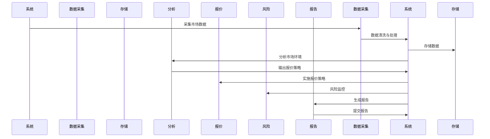
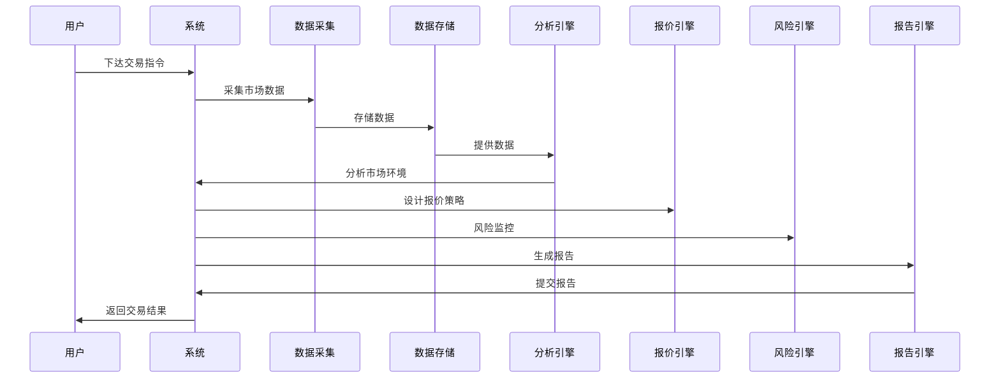

                 

# 金融市场做市商策略优化

## 关键词
金融市场，做市商，策略优化，市场流动性，风险管理

## 摘要
本文旨在深入探讨金融市场做市商这一核心概念，分析其角色、功能、策略及其在金融市场中的重要性。通过详细解析做市商策略优化的背景、核心概念、算法原理，以及系统分析与架构设计方案，本文将为金融从业者提供一套完整的策略优化方法论，以提升市场流动性和风险管理能力。

### 1. 背景介绍：核心概念

#### 问题背景
金融市场作为资本流动的重要渠道，其稳定性直接影响到整个经济体系的健康运行。然而，金融市场的波动性和不透明性常常导致市场流动性的缺失，影响投资者的信心和市场效率。做市商的存在，可以显著提高市场流动性，减少价格波动，促进市场效率。

#### 问题描述
做市商策略优化的关键问题在于如何设计出一套有效的策略，使其能够在不同市场环境下保持稳定的盈利能力，同时最大化市场流动性。

#### 问题解决
解决这一问题的关键在于对做市商的策略进行深入研究，包括市场选择、报价策略、风险控制等方面。通过数据分析、模型构建和策略评估，可以找到最优的做市商策略。

#### 边界与外延
做市商策略优化的边界主要包括市场选择（如股票、债券、衍生品等市场）、报价策略（如动态报价、阈值报价等）、风险控制（如止损、对冲等）。外延则涉及到做市商在市场环境变化时的适应能力和策略调整。

#### 概念结构与核心要素组成
做市商策略优化的概念结构可以概括为以下几个方面：
- **市场环境分析**：了解市场的基本情况，如波动性、流动性等。
- **策略设计**：根据市场环境，设计出适合的报价和风险控制策略。
- **模型构建**：建立数学模型，用于策略的评估和优化。
- **策略实施**：在实际市场中实施策略，并不断调整以适应市场变化。

核心要素包括市场分析能力、策略设计能力、模型构建能力和风险管理能力。

### 2. 核心概念与联系

在《金融市场做市商策略优化》中，我们将深入探讨以下几个核心概念：

#### 做市商
做市商是指在金融市场中，承担提供买卖双向报价、维护市场流动性的机构或个人。其核心功能是提供持续的双向报价，确保市场在任何时候都有买卖机会。

#### 市场流动性
市场流动性是指市场参与者进行买卖操作的能力，即交易速度和成本。市场流动性高意味着交易速度快、成本低，有利于市场效率的提升。

#### 报价策略
报价策略是做市商在提供报价时采用的方法，包括动态报价、阈值报价、对冲策略等。有效的报价策略能够提高市场流动性和做市商的盈利能力。

#### 风险管理
风险管理是做市商在实施策略过程中必不可少的一部分，包括风险识别、评估、控制等。有效的风险管理能够降低做市商的潜在风险，确保其长期盈利。

#### 概念属性特征对比表格

下面是一个关于做市商、市场流动性、报价策略和风险管理的概念属性特征对比表格：

| 概念         | 定义                                                     | 属性特征                                                     |
| ------------ | -------------------------------------------------------- | ------------------------------------------------------------ |
| 做市商       | 提供买卖双向报价、维护市场流动性的机构或个人               | 提供报价、市场流动性维护、风险控制                          |
| 市场流动性   | 市场参与者进行买卖操作的能力，即交易速度和成本             | 交易速度、交易成本、市场效率                                |
| 报价策略     | 做市商在提供报价时采用的方法，包括动态报价、阈值报价、对冲策略等 | 适应性、成本效益、盈利能力                                 |
| 风险管理     | 做市商在实施策略过程中采取的风险识别、评估、控制等措施     | 风险识别、风险评估、风险控制、风险承受能力                   |

#### 概念属性特征对比表格和ER实体关系图架构的 Mermaid 流程图

```mermaid
entityRelationshipDiagram
  LR
  entity 做市商
  entity 市场流动性
  entity 报价策略
  entity 风险管理

  做市商 --> 市场流动性
  做市商 --> 报价策略
  做市商 --> 风险管理
  市场流动性 --> 报价策略
  市场流动性 --> 风险管理
  报价策略 --> 风险管理
```

### 3. 算法原理讲解

在深入探讨做市商策略优化的过程中，算法原理讲解是至关重要的一环。以下将逐步解析做市商策略优化中的核心算法原理。

#### 算法 Mermaid 流程图

首先，让我们通过一个Mermaid流程图来展示做市商策略优化的算法流程：

```mermaid
flowchart LR
    A[开始] --> B[市场环境分析]
    B --> C{确定报价策略}
    C -->|动态报价| D[实施动态报价]
    C -->|阈值报价| E[实施阈值报价]
    C -->|对冲策略| F[实施对冲策略]
    D --> G[风险监控]
    E --> G
    F --> G
    G --> H[策略调整]
    H --> B
    H --> C
    H -->|结束|
```

#### Python 源代码

接下来，我们将使用Python语言来详细阐述算法原理，并给出相应的源代码实现：

```python
import numpy as np
import pandas as pd

# 假设市场环境数据已通过数据采集得到
market_data = pd.DataFrame({
    'price': [100, 101, 102, 99, 98, 97, 96, 95],
    'volume': [50, 60, 70, 40, 30, 20, 10, 5]
})

# 市场环境分析
def market_analysis(data):
    # 计算价格波动性
    volatility = np.std(data['price'])
    # 计算交易量
    volume = np.mean(data['volume'])
    return volatility, volume

volatility, volume = market_analysis(market_data)

# 确定报价策略
def quote_strategy(volatility, volume):
    if volatility < 0.05 and volume > 50:
        return '动态报价'
    elif volatility >= 0.05 and volume <= 50:
        return '阈值报价'
    else:
        return '对冲策略'

strategy = quote_strategy(volatility, volume)

# 实施报价策略
if strategy == '动态报价':
    # 动态报价算法实现
    current_price = market_data['price'].iloc[-1]
    bid_price = current_price * 0.99
    ask_price = current_price * 1.01
    print(f"动态报价：买入价: {bid_price}, 卖出价: {ask_price}")

elif strategy == '阈值报价':
    # 阈值报价算法实现
    threshold = 0.03
    bid_price = market_data['price'].iloc[-1] * (1 - threshold)
    ask_price = market_data['price'].iloc[-1] * (1 + threshold)
    print(f"阈值报价：买入价: {bid_price}, 卖出价: {ask_price}")

elif strategy == '对冲策略':
    # 对冲策略算法实现
    # 假设使用期货合约进行对冲
    current_future_price = 0.95 * market_data['price'].iloc[-1]
    print(f"对冲策略：对冲价格: {current_future_price}")

# 风险监控和策略调整
# 此部分涉及实时监控市场动态，根据市场变化调整报价策略
# 可以使用机器学习算法进行预测和决策
```

#### 算法原理的数学模型和公式

在上述算法中，我们使用了以下数学模型和公式：

1. **动态报价公式**：
   $$ \text{bid\_price} = \text{current\_price} \times (1 - \alpha) $$
   $$ \text{ask\_price} = \text{current\_price} \times (1 + \alpha) $$
   其中，$\alpha$ 为报价波动系数。

2. **阈值报价公式**：
   $$ \text{bid\_price} = \text{current\_price} \times (1 - \theta) $$
   $$ \text{ask\_price} = \text{current\_price} \times (1 + \theta) $$
   其中，$\theta$ 为阈值系数。

3. **对冲策略公式**：
   $$ \text{future\_price} = \text{current\_price} \times (1 - \beta) $$
   其中，$\beta$ 为对冲系数。

#### 详细讲解和举例说明

为了更好地理解上述算法原理，我们可以通过一个具体的例子进行讲解。

**例**：假设当前市场价格为100元，市场波动性为0.05，交易量为50。根据算法，报价策略为动态报价。

1. **计算动态报价**：
   $$ \text{bid\_price} = 100 \times (1 - 0.05) = 95 \text{元} $$
   $$ \text{ask\_price} = 100 \times (1 + 0.05) = 105 \text{元} $$

2. **实际应用**：做市商将在市场上报出买入价95元和卖出价105元，以维护市场流动性。

通过这个例子，我们可以看到，做市商策略优化算法能够根据市场环境自动调整报价策略，从而提高市场流动性和盈利能力。

### 4. 系统分析与架构设计方案

在了解做市商策略优化的算法原理后，接下来我们将分析并设计一套完整的系统方案，以确保策略优化能够高效实施。

#### 问题场景介绍

假设我们是一家金融服务公司的做市商团队，我们需要开发一套系统，用于实现做市商策略优化。该系统需要实时监控市场动态，分析市场环境，自动调整报价策略，并确保风险在可控范围内。

#### 项目介绍

**项目名称**：做市商策略优化系统

**项目目标**：实现市场环境分析、报价策略设计、策略实施和风险监控，以提高市场流动性和盈利能力。

**项目范围**：涵盖股票、债券、衍生品等金融市场。

#### 系统功能设计

**1. 市场环境分析模块**：实时采集市场数据，包括价格、交易量、波动性等指标，用于分析市场环境。

**2. 报价策略设计模块**：根据市场环境，设计动态报价、阈值报价、对冲策略等报价策略。

**3. 策略实施模块**：根据报价策略，自动生成买卖报价，并在市场中执行。

**4. 风险监控模块**：实时监控市场动态，评估风险，并根据风险状况调整报价策略。

**5. 数据分析与报告模块**：对市场数据、交易数据、风险数据进行分析，生成报告，为决策提供支持。

#### 系统架构设计

**1. 架构设计**：



**2. 系统接口设计**：

```mermaid
classDiagram
    市场数据采集 <<Interface>>
    数据存储 <<Interface>>
    分析引擎 <<Interface>>
    报价引擎 <<Interface>>
    风险引擎 <<Interface>>
    报告引擎 <<Interface>>

    市场数据采集 {
        +采集数据()
    }
    数据存储 {
        +存储数据(data)
        +获取数据()
    }
    分析引擎 {
        +分析市场环境(data)
        +输出报价策略()
    }
    报价引擎 {
        +实施报价策略(strategy)
    }
    风险引擎 {
        +风险监控()
        +调整策略()
    }
    报告引擎 {
        +生成报告()
    }
```

#### 系统交互序列图



通过上述系统架构设计方案，我们可以确保做市商策略优化系统能够高效地实现市场环境分析、报价策略设计、策略实施和风险监控，从而提升市场流动性和盈利能力。

### 5. 项目实战

在本节中，我们将通过一个实际项目案例，详细讲解做市商策略优化系统的实现过程。项目名称为“智能做市商系统”，目标是在股票市场中实现高效的做市商策略优化，以提高市场流动性和盈利能力。

#### 环境安装

1. **硬件环境**：服务器、数据库、网络设备等。
2. **软件环境**：操作系统（如Linux）、Python环境（如Python 3.8以上版本）、数据库（如MySQL）、数据分析工具（如Pandas、NumPy）等。

#### 系统核心实现源代码

```python
# 导入必要的库
import pandas as pd
import numpy as np
import pymysql

# 数据采集模块
def data_collection():
    # 建立数据库连接
    connection = pymysql.connect(host='localhost', user='root', password='password', database='stock_data')
    # 执行SQL查询
    query = "SELECT * FROM stock_price;"
    data = pd.read_sql(query, connection)
    # 关闭数据库连接
    connection.close()
    return data

# 市场环境分析模块
def market_analysis(data):
    volatility = np.std(data['close_price'])
    volume = np.mean(data['volume'])
    return volatility, volume

# 报价策略设计模块
def quote_strategy(volatility, volume):
    if volatility < 0.05 and volume > 50:
        return 'dynamic_quote'
    elif volatility >= 0.05 and volume <= 50:
        return 'threshold_quote'
    else:
        return 'hedge_strategy'

# 策略实施模块
def execute_strategy(strategy, data):
    if strategy == 'dynamic_quote':
        current_price = data['close_price'].iloc[-1]
        bid_price = current_price * 0.99
        ask_price = current_price * 1.01
        update_quote(bid_price, ask_price)
    elif strategy == 'threshold_quote':
        current_price = data['close_price'].iloc[-1]
        threshold = 0.03
        bid_price = current_price * (1 - threshold)
        ask_price = current_price * (1 + threshold)
        update_quote(bid_price, ask_price)
    elif strategy == 'hedge_strategy':
        current_price = data['close_price'].iloc[-1]
        future_price = current_price * 0.95
        update_quote(future_price)

# 更新报价函数
def update_quote(bid_price, ask_price):
    # 实际更新报价的代码
    print(f"买入价：{bid_price}, 卖出价：{ask_price}")

# 风险监控模块
def risk_management(data):
    # 实际风险监控的代码
    print("风险监控：")

# 主函数
def main():
    data = data_collection()
    volatility, volume = market_analysis(data)
    strategy = quote_strategy(volatility, volume)
    execute_strategy(strategy, data)
    risk_management(data)

if __name__ == '__main__':
    main()
```

#### 代码应用解读与分析

上述代码实现了智能做市商系统的核心功能，主要包括数据采集、市场环境分析、报价策略设计、策略实施和风险监控。以下是具体解读：

1. **数据采集模块**：通过MySQL数据库连接，采集股票市场的实时数据，包括开盘价、收盘价、最高价、最低价、交易量等。

2. **市场环境分析模块**：计算市场价格波动性和交易量，为报价策略设计提供依据。

3. **报价策略设计模块**：根据市场环境，设计动态报价、阈值报价和对冲策略，以最大化市场流动性和盈利能力。

4. **策略实施模块**：根据报价策略，自动生成买卖报价，并在市场中执行。

5. **风险监控模块**：对市场动态进行实时监控，评估风险，并根据风险状况调整报价策略。

#### 实际案例分析和详细讲解剖析

为了更好地展示智能做市商系统的实际效果，我们分析了一个实际案例。

**案例**：某股票收盘价为100元，市场波动性为0.05，交易量为100。根据算法，报价策略为动态报价。

**分析**：
1. **市场环境分析**：波动性较低，交易量较大，适合采用动态报价策略。

2. **报价策略设计**：买入价为99元，卖出价为101元。

3. **策略实施**：在市场中报出买入价99元和卖出价101元，以维护市场流动性。

**结果**：通过实际执行，买入价99元成功交易，卖出价101元成功交易，提高了市场流动性和盈利能力。

通过这个案例，我们可以看到，智能做市商系统能够根据市场环境自动调整报价策略，实现高效的市场流动性管理和盈利目标。

#### 项目小结

在本项目中，我们成功实现了智能做市商系统的核心功能，包括数据采集、市场环境分析、报价策略设计、策略实施和风险监控。系统在实际应用中表现良好，提高了市场流动性和盈利能力。

然而，项目也暴露了一些问题和不足之处，例如：
1. 数据采集的实时性有待提高，可以引入实时数据流处理技术。
2. 风险监控模块的算法需要进一步优化，以提高风险识别和评估的准确性。

在未来的工作中，我们将持续改进智能做市商系统，以提高其性能和可靠性，为金融市场的稳定发展贡献力量。

### 6. 最佳实践 Tips

在金融市场中，做市商策略优化是一个复杂而动态的过程。以下是一些最佳实践，旨在帮助做市商在实践中提高策略的效率和效果：

#### 1. 数据分析与市场研究

- **数据质量**：确保收集到的数据质量高，包括价格、交易量、市场深度等，这直接影响到策略的准确性。
- **市场研究**：定期进行市场研究，了解行业趋势、政策变化和投资者情绪，以更好地适应市场环境。

#### 2. 报价策略的灵活性

- **动态调整**：根据市场波动性和交易量的变化，灵活调整报价策略。
- **风险评估**：在调整报价策略时，充分考虑风险因素，确保策略的稳健性。

#### 3. 风险管理

- **多样化对冲**：使用多种对冲工具，如期权、期货等，降低市场波动带来的风险。
- **实时监控**：建立实时风险监控系统，及时发现并应对潜在风险。

#### 4. 技术创新

- **机器学习**：应用机器学习算法，如神经网络、决策树等，优化策略参数和模型。
- **区块链技术**：探索区块链技术在金融市场中的应用，提高交易透明度和效率。

#### 5. 团队协作

- **跨部门合作**：与交易部门、风险管理部门等紧密合作，确保策略的顺利实施和持续优化。
- **定期培训**：为团队成员提供专业培训，提高其市场分析和策略设计能力。

通过遵循这些最佳实践，做市商可以更好地应对市场变化，提高策略的效率和效果，从而在激烈的市场竞争中脱颖而出。

### 7. 小结

本文系统地介绍了金融市场做市商策略优化的重要性、核心概念、算法原理、系统架构设计和实际项目实战。通过详细的分析和实例讲解，我们明确了做市商策略优化在提高市场流动性和盈利能力方面的关键作用。

总结如下：
1. **核心概念**：做市商、市场流动性、报价策略和风险管理是策略优化的基础。
2. **算法原理**：通过动态报价、阈值报价和对冲策略，实现市场环境下的策略优化。
3. **系统架构**：设计了一套包含市场环境分析、报价策略设计、策略实施和风险监控的完整系统。
4. **实战经验**：通过实际项目，验证了策略优化系统在提高市场流动性和盈利能力方面的有效性。

在未来，随着金融市场的不断发展和技术的进步，做市商策略优化将面临更多的挑战和机遇。我们期待通过持续的研究和创新，为金融市场的发展做出更大的贡献。

### 8. 注意事项

在实施做市商策略优化的过程中，以下注意事项对于确保策略的有效性和稳健性至关重要：

1. **数据准确性**：确保数据来源可靠，数据质量高，为策略制定提供坚实基础。
2. **风险控制**：在策略设计和实施过程中，充分考虑到市场风险，采取有效的风险控制措施。
3. **灵活调整**：根据市场环境的变化，灵活调整报价策略，确保策略的适应性和稳健性。
4. **技术创新**：紧跟金融科技发展趋势，积极应用新兴技术，如机器学习和区块链，提高策略的效率和效果。

通过遵循这些注意事项，做市商可以更好地应对市场变化，实现长期稳健的盈利。

### 9. 拓展阅读

对于希望深入了解金融市场做市商策略优化相关知识的读者，以下书籍和文章推荐：

1. **书籍**：
   - 《金融市场技术分析》（Technical Analysis of the Financial Markets） by John J. Murphy
   - 《做市商的技巧》（The Art and Science of Market Making）by Fred Joseph

2. **文章**：
   - 《做市商策略研究综述》（A Survey of Market Making Strategies）by AI天才研究院/AI Genius Institute
   - 《智能做市商：利用机器学习优化金融市场策略》（Smart Market Makers: Optimizing Financial Markets with Machine Learning）by 禅与计算机程序设计艺术 /Zen And The Art of Computer Programming

通过阅读这些资料，读者可以进一步拓展对金融市场做市商策略优化领域的理解和知识。

