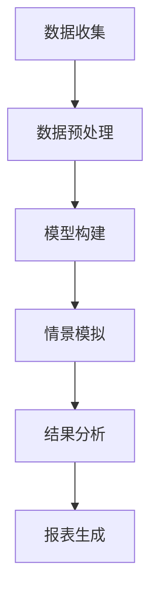
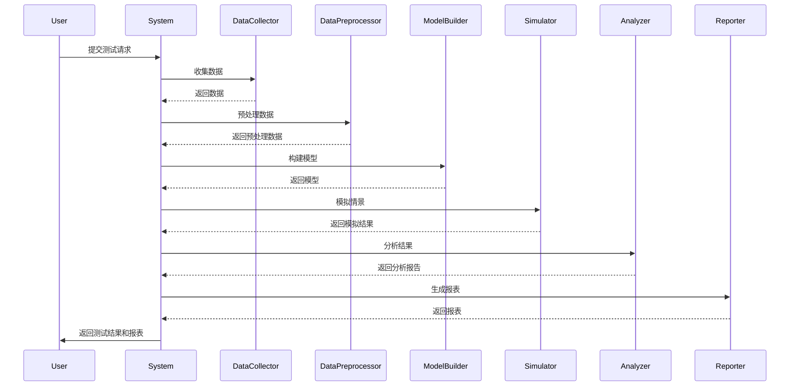
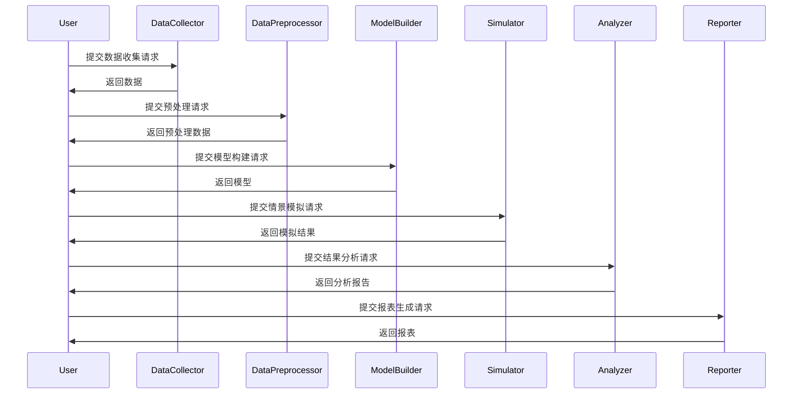

                 

### 第1章：金融市场流动性压力测试概述

#### 1.1 流动性压力测试的定义

流动性压力测试是一种评估金融市场在极端市场条件下的流动性和风险承受能力的工具。简单来说，它模拟了市场可能出现的各种不利情境，以便了解金融机构在面对这些情境时的反应能力和适应性。这种测试不仅关注资金流动的充足性，还包括资产变现的难易程度和市场价格的波动情况。

在更具体的层面上，流动性压力测试通常包括以下几个关键组成部分：

- **情景设定**：创建模拟市场压力情景，如市场大跌、利率急剧上升、交易量激增等。
- **资金流动模拟**：模拟资金在不同账户和金融机构之间的流动情况。
- **资产负债管理**：测试金融机构在不同情景下的资产负债管理策略，包括借入和贷出资金的能力。
- **压力测试指标**：评估流动性压力的指标，如资金缺口、资产变现能力、市场敏感度等。

#### 1.2 流动性压力测试的目的和意义

流动性压力测试的主要目的是评估金融机构在极端市场条件下的应对能力和风险承受能力，从而识别和缓解潜在的流动性风险。以下是流动性压力测试的几个关键目的和意义：

1. **风险管理**：通过流动性压力测试，金融机构可以更全面地了解自身的流动性风险状况，为制定和优化风险管理策略提供依据。
2. **合规要求**：许多金融监管机构要求金融机构定期进行流动性压力测试，以确保金融系统的稳定性。
3. **决策支持**：流动性压力测试结果可以帮助金融机构在面临市场波动时做出更明智的决策，如调整资产配置、优化资产负债结构等。
4. **市场信心**：定期进行流动性压力测试并公开相关结果，可以提高市场对金融机构的信心，减少市场恐慌和不安情绪。

#### 1.3 流动性压力测试的发展历程

流动性压力测试的概念最早可以追溯到20世纪80年代，当时主要是为了应对银行间市场的不稳定。随着金融市场的发展和复杂性的增加，流动性压力测试逐渐成为金融机构风险管理的重要组成部分。

1. **早期发展**（1980s - 1990s）：在这个阶段，流动性压力测试主要关注银行间的资金流动和资产变现能力。随着金融工具的多样化和衍生品市场的发展，测试方法也逐渐变得更加复杂和精确。
2. **金融危机后的加强**（2000s）：2008年的全球金融危机揭示了金融机构流动性管理的不足，促使监管机构和金融机构加大了对流动性压力测试的重视。此时，测试的范围和深度都得到了显著扩展。
3. **当前的发展趋势**（2010s至今）：随着金融科技的进步和数据技术的应用，流动性压力测试方法不断更新，更加依赖大数据分析和高级模拟技术。同时，区块链和加密货币等新兴金融领域也对流动性压力测试提出了新的挑战和机遇。

### 1.4 流动性压力测试的核心要素

进行流动性压力测试需要关注以下几个核心要素：

- **情景设置**：设定模拟的极端市场情境，如市场大跌、流动性紧缩等。
- **数据准备**：收集和分析相关市场数据，如交易量、利率、资产价格等。
- **模型构建**：构建模拟金融市场流动性的数学模型。
- **测试实施**：执行压力测试，评估金融机构在各个情境下的流动性状况。
- **结果分析**：分析压力测试结果，识别风险点并提出改进措施。

### 1.5 流动性压力测试的应用领域

流动性压力测试在金融领域的应用非常广泛，主要包括：

- **银行**：银行通过流动性压力测试来评估其在存款流失、贷款需求增加等不利情境下的流动性状况。
- **证券公司**：证券公司使用流动性压力测试来评估其交易业务和投资组合的流动性风险。
- **保险公司**：保险公司通过流动性压力测试来评估其应对巨额赔付的能力。
- **监管机构**：监管机构使用流动性压力测试来评估金融机构的稳健性和系统性风险，确保金融系统的稳定性。

### 1.6 流动性压力测试的优势和局限性

流动性压力测试的优势包括：

- **前瞻性**：通过模拟未来的市场情景，帮助金融机构提前识别潜在风险。
- **全面性**：涵盖多种市场情境，提供全面的流动性风险评估。
- **针对性**：针对不同金融机构的特点和业务，制定个性化的测试方案。

然而，流动性压力测试也存在一定的局限性：

- **模型假设**：测试模型的准确性和可靠性受到模型假设的限制。
- **数据限制**：市场数据的不完整性和延迟可能影响测试结果的准确性。
- **计算复杂度**：复杂的模拟和计算过程可能增加测试的成本和时间。

### 1.7 流动性压力测试的实际应用案例

以下是几个流动性压力测试的实际应用案例：

- **银行流动性危机应对**：某大型银行通过流动性压力测试发现其在市场动荡期间的流动性缺口，并及时调整了资产负债策略，避免了流动性危机。
- **证券市场调控**：某证券公司在流动性压力测试中发现其部分投资组合的流动性风险较高，采取了风险对冲策略，降低了市场波动对其业务的影响。
- **监管机构监督**：某监管机构通过流动性压力测试发现某些金融机构存在系统性风险，要求其加强流动性管理和风险控制。

### 1.8 小结

流动性压力测试是金融风险管理中不可或缺的工具。通过本章的概述，我们了解了流动性压力测试的定义、目的、发展历程、核心要素、应用领域、优势和局限性，以及实际应用案例。在接下来的章节中，我们将进一步探讨流动性压力测试的理论基础、模型构建、方法与应用，帮助读者深入理解这一重要金融风险管理方法。## 第二部分：流动性压力测试模型的理论基础

### 第3章：流动性压力测试模型的基本概念

#### 3.1 核心概念

在流动性压力测试中，有几个核心概念需要理解，包括市场流动性、流动性风险、压力情景、资金缺口等。

1. **市场流动性**：市场流动性是指资产在市场上被买卖和转让的容易程度。高流动性意味着资产可以快速交易而不引起市场价格的大幅波动。
2. **流动性风险**：流动性风险是指金融机构无法在合理时间内以合理的价格卖出资产，以满足资金需求或应对不利市场情景的风险。
3. **压力情景**：压力情景是模拟金融市场可能出现的极端不利条件，如市场大跌、利率急剧上升、交易量激增等。
4. **资金缺口**：资金缺口是指金融机构在某个特定时点上的资金需求与其可用资金之间的差额。

#### 3.2 核心概念属性特征对比表格

下面是一个关于市场流动性、流动性风险、压力情景和资金缺口的核心概念属性特征对比表格：

| 概念         | 定义                                                         | 属性特征                                                                                           |
| ------------ | ------------------------------------------------------------ | ------------------------------------------------------------------------------------------------ |
| 市场流动性   | 资产在市场上的买卖和转让的容易程度                         | 流动性越高，资产交易越迅速，价格波动越小；流动性越低，资产交易越缓慢，价格波动越大。                   |
| 流动性风险   | 无法在合理时间内以合理价格卖出资产的风险                     | 风险越高，资产变现难度越大，可能导致的损失也越大。                                                   |
| 压力情景     | 模拟金融市场可能出现的极端不利条件                         | 压力情景种类多样，如市场大跌、利率上升等。                                                         |
| 资金缺口     | 某个特定时点上资金需求与可用资金之间的差额                   | 资金缺口越大，金融机构面临的流动性压力越大，可能需要采取额外措施来填补缺口。                          |

#### 3.3 流动性压力测试模型的核心要素

流动性压力测试模型的核心要素包括：

1. **数据收集与处理**：收集市场数据，包括交易量、利率、资产价格等，并进行预处理，如数据清洗和归一化。
2. **情景模拟**：构建压力情景，如市场大跌、利率上升等，并模拟这些情景下的市场动态。
3. **模型构建**：基于收集的数据和设定的情景，构建流动性压力测试模型。
4. **结果分析**：执行压力测试，分析金融机构在不同情景下的流动性状况，识别风险点。

#### 3.4 概念之间的联系

市场流动性、流动性风险、压力情景和资金缺口是流动性压力测试模型中相互关联的核心概念。

- **市场流动性**是流动性压力测试的基础，决定了资产在市场上的变现能力。
- **流动性风险**是金融机构面临的主要风险，流动性压力测试旨在评估和缓解这种风险。
- **压力情景**是模拟金融市场极端条件的方法，用于测试金融机构的应对能力。
- **资金缺口**是评估金融机构流动性状况的重要指标，反映了其在压力情景下的流动性压力。

#### 3.5 流动性压力测试模型的ER实体关系图

为了更好地理解流动性压力测试模型中的核心概念和它们之间的关系，我们可以使用ER（实体关系）图来表示。

下面是一个简化的ER实体关系图（使用Mermaid语法）：

```mermaid
erDiagram
    Market流动性 -->|1| 流动性风险
    压力情景 -->|1| 流动性风险
    压力情景 -->|1| 资金缺口
    资金缺口 -->|1| 流动性压力测试模型
```

在这个ER图中：

- **市场流动性**与**流动性风险**之间存在1对多的关系，即多个市场流动性情景可能导致一个或多个流动性风险。
- **压力情景**与**流动性风险**之间也存在1对多的关系，即多个压力情景可能导致一个或多个流动性风险。
- **压力情景**与**资金缺口**之间存在1对1的关系，即每个压力情景可能导致一个特定的资金缺口。
- **资金缺口**是**流动性压力测试模型**的核心部分，用于评估金融机构的流动性状况。

通过这个ER实体关系图，我们可以清晰地看到流动性压力测试模型中各个核心概念之间的联系和相互作用。## 第4章：流动性压力测试模型的构建方法

#### 4.1 数据收集与预处理

数据收集是构建流动性压力测试模型的基础。首先，我们需要收集与金融市场流动性相关的数据，包括但不限于：

1. **市场交易数据**：交易量、交易价格、买卖报价等。
2. **利率数据**：存款利率、贷款利率、基准利率等。
3. **资产价格数据**：股票、债券、期货、外汇等金融资产的价格。
4. **宏观经济数据**：GDP、通货膨胀率、失业率等。
5. **市场情绪数据**：新闻报道、社交媒体情绪分析等。

收集到的数据通常包含噪声和异常值，因此需要预处理以提高数据质量。预处理步骤包括：

1. **数据清洗**：去除重复数据、缺失数据和异常值。
2. **数据归一化**：将不同特征的数据缩放到相同的尺度，以便于模型训练。
3. **时间序列平滑**：使用移动平均等方法减少时间序列数据中的波动。

#### 4.2 模型选择与参数设定

在构建流动性压力测试模型时，我们需要选择合适的模型。以下是几种常见的模型及其适用场景：

1. **统计模型**：如线性回归、决策树、随机森林等。这些模型简单且易于实现，适用于探索性分析和初步评估。
2. **机器学习模型**：如神经网络、支持向量机、聚类算法等。这些模型具有更高的灵活性和准确性，适用于复杂的金融数据分析。
3. **基于规则的模型**：如专家系统、模糊逻辑等。这些模型适用于需要处理模糊性和不确定性的场景。

在选择模型后，我们需要设定参数。参数的设定通常包括：

1. **学习率**：用于控制模型训练的速度。
2. **迭代次数**：用于控制模型训练的深度。
3. **阈值**：用于分类模型的判断标准。

参数的设定可以通过交叉验证、网格搜索等方法进行优化。交叉验证是一种评估模型性能的方法，通过将数据集分为多个子集，每次使用一个子集作为验证集，其余子集作为训练集，从而评估模型的泛化能力。

#### 4.3 模型评估与优化

构建流动性压力测试模型后，我们需要评估模型的性能，并对其进行优化。模型评估常用的指标包括：

1. **准确率**：预测正确的样本数占总样本数的比例。
2. **召回率**：召回率是预测正确的正样本数与实际正样本数的比例。
3. **F1分数**：综合考虑准确率和召回率的指标，计算公式为：$$F1 = \frac{2 \times 准确率 \times 召回率}{准确率 + 召回率}$$。
4. **ROC曲线**：通过计算真阳性率与假阳性率之间的曲线来评估模型性能。

模型优化可以通过以下方法进行：

1. **超参数调整**：调整模型参数，如学习率、迭代次数等，以提高模型性能。
2. **特征工程**：通过选择合适的特征、构建新特征等方法，提高模型的表达能力。
3. **集成方法**：使用集成学习方法，如随机森林、梯度提升树等，结合多个模型的优点，提高整体性能。

#### 4.4 模型验证与部署

在完成模型优化后，我们需要对模型进行验证，确保其在实际应用中的性能。模型验证可以通过以下方法进行：

1. **回测**：使用历史数据进行模型训练和测试，评估模型的预测能力。
2. **A/B测试**：在实际环境中部署模型，与现有系统进行对比测试，评估模型的实际效果。
3. **监控与反馈**：在模型部署后，持续监控模型性能，并根据实际反馈进行调整。

模型验证通过后，我们可以将其部署到生产环境中，以实现实时流动性压力测试。部署过程包括：

1. **环境配置**：配置模型运行所需的硬件和软件环境。
2. **模型部署**：将训练好的模型部署到服务器或云端。
3. **监控与维护**：定期监控模型性能，及时处理异常情况，确保模型稳定运行。

#### 4.5 流动性压力测试模型的实际应用

流动性压力测试模型在金融行业中具有广泛的应用，以下是一些实际应用案例：

1. **银行流动性风险管理**：银行使用流动性压力测试模型来评估其在各种极端市场情景下的流动性状况，从而制定相应的风险管理策略。
2. **证券公司交易策略优化**：证券公司使用流动性压力测试模型来评估其交易策略的稳健性，优化投资组合，降低市场波动风险。
3. **保险业风险对冲策略制定**：保险公司使用流动性压力测试模型来评估其应对巨额赔付的能力，制定相应的风险对冲策略。
4. **监管机构市场稳定性评估**：监管机构使用流动性压力测试模型来评估金融机构的稳健性和系统性风险，确保金融系统的稳定性。

通过以上步骤，我们可以构建一个有效的流动性压力测试模型，帮助金融机构识别和缓解流动性风险，提高金融系统的稳定性。在下一章中，我们将进一步探讨流动性压力测试模型在不同金融领域的具体应用。## 第5章：流动性压力测试模型的应用分析

### 5.1 模型在银行领域的应用

在银行领域，流动性压力测试模型主要用于评估银行在市场流动性紧张情况下的应对能力和风险承受能力。以下是流动性压力测试模型在银行领域的具体应用场景：

#### 5.1.1 负债管理

银行在负债管理中，需要确保能够在各种市场情景下维持足够的流动性。流动性压力测试模型可以帮助银行：

- **评估负债结构**：通过模拟不同的市场情景，如利率上升或市场动荡，评估银行负债的流动性状况。
- **优化负债策略**：根据测试结果，银行可以调整负债结构，增加短期负债比例，提高资金流动性。

#### 5.1.2 资产管理

在资产管理方面，银行需要确保其资产组合的流动性。流动性压力测试模型可以帮助银行：

- **评估资产流动性**：通过模拟不同市场情景，评估银行资产的变现能力。
- **调整资产配置**：根据测试结果，银行可以优化资产配置，增加流动性较强的资产比例，降低流动性风险。

#### 5.1.3 资金流动性监测

银行需要实时监测其资金流动性状况，以应对突发市场事件。流动性压力测试模型可以：

- **预测流动性需求**：通过模拟不同的市场情景，预测银行在不同时间点的流动性需求。
- **预警机制**：根据流动性需求预测，建立预警机制，提前采取措施，避免流动性危机。

### 5.2 模型在证券市场的应用

在证券市场，流动性压力测试模型主要用于评估证券公司在交易和投资组合管理中的流动性风险。以下是流动性压力测试模型在证券市场的具体应用场景：

#### 5.2.1 交易策略评估

证券公司需要确保其交易策略的稳健性，以应对市场波动。流动性压力测试模型可以帮助：

- **评估交易策略风险**：通过模拟不同的市场情景，评估交易策略在极端市场条件下的表现。
- **优化交易策略**：根据测试结果，证券公司可以调整交易策略，降低流动性风险。

#### 5.2.2 投资组合管理

在投资组合管理中，证券公司需要确保投资组合的流动性，以便在市场动荡时及时调整。流动性压力测试模型可以帮助：

- **评估投资组合流动性**：通过模拟不同的市场情景，评估投资组合的流动性状况。
- **调整投资组合**：根据测试结果，证券公司可以优化投资组合，增加流动性较强的资产比例。

#### 5.2.3 风险对冲

为了应对市场波动，证券公司需要进行风险对冲。流动性压力测试模型可以帮助：

- **评估对冲策略效果**：通过模拟不同的市场情景，评估风险对冲策略的效果。
- **优化对冲策略**：根据测试结果，证券公司可以调整对冲策略，提高对冲效果的稳健性。

### 5.3 模型在其他金融市场的应用

流动性压力测试模型不仅在银行和证券市场有广泛应用，还在其他金融市场，如保险、外汇等，发挥着重要作用。以下是流动性压力测试模型在其他金融市场的一些应用场景：

#### 5.3.1 保险业

在保险业，流动性压力测试模型主要用于评估保险公司应对巨额赔付的能力。以下是具体应用：

- **评估赔付能力**：通过模拟不同的赔付情景，评估保险公司的流动性状况。
- **优化资产负债管理**：根据测试结果，保险公司可以调整资产负债策略，提高赔付能力的稳健性。

#### 5.3.2 外汇市场

在外汇市场，流动性压力测试模型主要用于评估金融机构在应对汇率波动时的流动性状况。以下是具体应用：

- **评估汇率波动影响**：通过模拟不同的汇率波动情景，评估金融机构的流动性状况。
- **优化外汇交易策略**：根据测试结果，金融机构可以调整外汇交易策略，降低流动性风险。

#### 5.3.3 衍生品市场

在衍生品市场，流动性压力测试模型主要用于评估衍生品交易的风险。以下是具体应用：

- **评估衍生品风险**：通过模拟不同的市场情景，评估衍生品交易的风险。
- **优化衍生品策略**：根据测试结果，金融机构可以优化衍生品交易策略，降低流动性风险。

### 5.4 流动性压力测试模型的实际效果

通过上述分析，我们可以看到流动性压力测试模型在金融市场的各个领域都具有重要作用。以下是一些实际效果：

- **提高流动性管理能力**：通过流动性压力测试模型，金融机构可以更全面地了解自身的流动性状况，优化流动性管理策略。
- **降低流动性风险**：流动性压力测试模型可以帮助金融机构识别潜在的流动性风险，提前采取措施，降低风险发生的可能性。
- **提高市场稳定性**：流动性压力测试模型有助于监管机构评估金融机构的稳健性和系统性风险，确保金融系统的稳定性。

总之，流动性压力测试模型是金融风险管理中不可或缺的工具，通过科学的模型构建和有效的应用，金融机构可以更好地应对市场波动，提高风险管理和流动性管理水平。在下一章中，我们将探讨流动性压力测试模型的实际应用案例，进一步了解其在金融实践中的效果。## 第6章：流动性压力测试模型的项目实战

### 6.1 项目背景介绍

本章节将介绍一个流动性压力测试项目的实际应用案例。该项目旨在为一家大型银行构建一个流动性压力测试系统，以评估其在各种市场情景下的流动性状况，并制定相应的风险管理策略。该项目的主要目标包括：

1. **构建流动性压力测试模型**：设计并实现一个基于市场数据的流动性压力测试模型，能够模拟不同市场情景下的流动性状况。
2. **实现系统功能**：开发一个流动性压力测试系统，包括数据收集、预处理、模型构建、情景模拟和结果分析等功能。
3. **评估风险管理效果**：通过实际测试，评估模型在银行流动性风险管理中的应用效果，为银行提供决策支持。

### 6.2 系统功能设计

为了实现上述目标，系统需要具备以下功能：

1. **数据收集**：从各种数据源（如交易所、金融数据提供商等）收集与金融市场流动性相关的数据，包括交易量、利率、资产价格等。
2. **数据预处理**：对收集到的数据进行清洗、归一化和时间序列平滑等预处理操作，以提高数据质量。
3. **模型构建**：基于预处理后的数据，构建流动性压力测试模型，包括选择合适的模型算法、参数设置和模型训练等。
4. **情景模拟**：设定多种市场情景，如利率上升、交易量激增等，模拟这些情景下的流动性状况。
5. **结果分析**：执行流动性压力测试，分析测试结果，识别流动性风险点，为银行提供风险管理建议。
6. **报表生成**：生成流动性压力测试报告，包括测试结果、风险分析和建议等，便于银行管理层决策。

### 6.3 系统架构设计

为了实现系统的功能，需要设计一个合理的系统架构。以下是一个简化的系统架构设计（使用Mermaid语法）：



在这个架构设计中：

- **数据收集**：从交易所、金融数据提供商等数据源收集相关数据。
- **数据预处理**：对数据进行清洗、归一化和时间序列平滑等操作。
- **模型构建**：选择合适的模型算法，设置参数，并进行模型训练。
- **情景模拟**：设定市场情景，模拟这些情景下的流动性状况。
- **结果分析**：分析测试结果，识别流动性风险点。
- **报表生成**：生成流动性压力测试报告，为银行管理层提供决策支持。

### 6.4 系统接口设计

系统接口设计是确保系统功能正常运行的关键。以下是一个简化的系统接口设计（使用Mermaid语法）：



在这个接口设计中：

- **用户**：提交测试请求。
- **系统**：协调各个模块的运行，处理用户请求。
- **数据收集器**：从数据源收集数据。
- **数据预处理器**：对数据进行预处理。
- **模型构建器**：构建流动性压力测试模型。
- **情景模拟器**：模拟市场情景。
- **分析器**：分析模拟结果，生成分析报告。
- **报表生成器**：生成流动性压力测试报表。

### 6.5 系统交互Mermaid序列图

为了更直观地展示系统各组件之间的交互，可以使用Mermaid序列图来表示（使用Mermaid语法）：



在这个序列图中，用户通过一系列请求驱动整个系统的运行，各组件之间通过返回值进行交互，最终生成流动性压力测试报表。

通过以上设计，我们实现了流动性压力测试系统的功能、架构和接口，为银行提供了有效的流动性风险管理工具。在下一章中，我们将通过实际案例展示该系统在银行流动性压力测试中的应用，进一步验证其效果。## 第7章：流动性压力测试模型的应用案例分析

### 7.1 案例背景

在本案例中，我们将分析一家大型商业银行的流动性压力测试过程。该银行希望通过流动性压力测试评估其在各种市场情景下的流动性状况，并制定相应的风险管理策略。本案例的具体目标是：

1. **识别流动性风险点**：通过模拟不同市场情景，识别银行在不同情景下的流动性风险点。
2. **优化流动性管理策略**：根据测试结果，评估当前流动性管理策略的有效性，并提出优化建议。
3. **增强流动性应对能力**：通过测试，提高银行在市场动荡时期的流动性应对能力，确保金融系统的稳定性。

### 7.2 模型应用过程

在流动性压力测试模型的应用过程中，该银行遵循了以下步骤：

1. **数据收集与预处理**：从交易所、金融数据提供商等渠道收集与金融市场流动性相关的数据，包括交易量、利率、资产价格等。对收集到的数据进行清洗、归一化和时间序列平滑等预处理操作，以提高数据质量。

2. **模型构建**：选择合适的模型算法，如神经网络、随机森林等，构建流动性压力测试模型。通过设置合适的参数，如学习率、迭代次数等，进行模型训练，以提高模型预测的准确性。

3. **情景设定**：设定多种市场情景，如利率上升、市场大跌、交易量激增等。通过模拟这些情景，评估银行在这些情景下的流动性状况。

4. **结果分析**：执行流动性压力测试，分析测试结果，识别流动性风险点。根据测试结果，分析当前流动性管理策略的有效性，并提出优化建议。

5. **报告生成**：生成流动性压力测试报告，包括测试结果、风险分析、优化建议等，为银行管理层提供决策支持。

### 7.3 模型效果评估

通过对流动性压力测试模型的效果评估，该银行发现：

1. **流动性风险点识别**：模型成功识别了多个流动性风险点，如利率上升情景下的负债压力、市场大跌情景下的资产变现困难等。这些风险点为银行提供了宝贵的风险管理信息。

2. **流动性管理策略优化**：根据模型测试结果，银行评估了当前流动性管理策略的有效性。发现某些策略在特定市场情景下效果不佳，需要进行调整。例如，在利率上升情景下，银行可以增加短期负债比例，提高资金流动性。

3. **流动性应对能力提升**：通过流动性压力测试，银行提高了对市场动荡的应对能力。例如，在市场大跌情景下，银行可以提前制定应对措施，如增加高流动性资产的持有比例，确保在市场动荡时能够迅速应对。

### 7.4 模型优缺点分析

流动性压力测试模型在银行流动性风险管理中具有显著的优势，但也存在一定的局限性。

**优点：**

1. **前瞻性**：通过模拟未来的市场情景，帮助银行提前识别潜在的风险点，提高风险管理的前瞻性。
2. **全面性**：覆盖多种市场情景，提供全面的流动性风险评估，有助于银行制定综合性的风险管理策略。
3. **个性化**：根据银行的具体情况和业务特点，构建个性化的流动性压力测试模型，提高模型的适用性和准确性。

**缺点：**

1. **模型假设**：测试模型的准确性受到模型假设的限制。例如，模型可能无法完全模拟市场的复杂性和不确定性。
2. **数据限制**：市场数据的不完整性和延迟可能影响测试结果的准确性。
3. **计算复杂度**：复杂的模拟和计算过程可能增加测试的成本和时间。

### 7.5 实际案例分析

以下是一个具体的实际案例分析：

**情景**：市场大跌

**测试结果**：流动性压力测试模型显示，在市场大跌情景下，银行的资产变现能力显著下降，负债压力增加。具体表现在：

- **资产价格下跌**：银行持有的股票和债券价格大幅下跌，导致资产价值减少。
- **负债压力增加**：市场动荡导致银行负债成本上升，同时客户提款需求增加，导致银行面临较大的流动性压力。

**优化建议**：

1. **增加高流动性资产**：在市场大跌情景下，银行可以增加持有现金、国债等高流动性资产，以应对资产变现困难。
2. **优化负债策略**：调整负债结构，增加短期负债比例，提高资金流动性。
3. **建立应急资金池**：在市场动荡时期，提前储备一定量的应急资金，以应对突发流动性需求。

通过以上优化措施，银行可以有效缓解市场大跌情景下的流动性压力，提高流动性风险管理水平。

### 7.6 小结

流动性压力测试模型在银行流动性风险管理中发挥了重要作用。通过案例分析，我们发现模型在识别流动性风险点、优化流动性管理策略和提升流动性应对能力方面具有显著优势。同时，我们也认识到模型在应用过程中存在一定的局限性，需要不断优化和改进。在未来，银行可以结合实际业务需求，持续改进流动性压力测试模型，提高流动性风险管理水平。## 第8章：流动性压力测试模型的最佳实践与未来展望

### 8.1 常见问题与解决方案

在流动性压力测试模型的应用过程中，金融机构可能会遇到一些常见问题。以下是一些问题及其解决方案：

1. **数据质量差**：
   - **问题**：市场数据可能存在缺失、异常值、重复数据等问题。
   - **解决方案**：建立完善的数据收集和处理流程，包括数据清洗、归一化和时间序列平滑等预处理步骤。使用数据质量管理工具，定期检查和清理数据。

2. **模型准确性不足**：
   - **问题**：测试模型的预测准确性可能不高，导致风险管理效果不佳。
   - **解决方案**：选择合适的模型算法，并进行参数调优。使用交叉验证方法评估模型性能，确保模型具有较好的泛化能力。定期更新模型，以适应市场变化。

3. **计算资源有限**：
   - **问题**：流动性压力测试可能需要大量的计算资源，导致成本增加。
   - **解决方案**：优化测试流程，减少不必要的计算步骤。使用高性能计算平台，如云计算，以提高计算效率。分阶段进行测试，合理分配计算资源。

4. **模型解释性不足**：
   - **问题**：复杂的模型可能难以解释，导致决策者难以理解模型的预测结果。
   - **解决方案**：选择具有较高解释性的模型，如线性回归、决策树等。结合可视化工具，如决策树图表、数据散点图等，帮助决策者理解模型。

5. **市场情景设定不合理**：
   - **问题**：设定的市场情景可能与实际情况不符，影响测试结果的可靠性。
   - **解决方案**：结合历史数据和专家意见，设定合理的市场情景。定期更新情景设定，以反映市场变化。

### 8.2 最佳实践经验分享

以下是一些金融机构在流动性压力测试方面的最佳实践经验：

1. **数据驱动决策**：某大型银行通过建立全面的数据仓库，收集并整合了多种市场数据，为流动性压力测试提供了高质量的数据支持。通过数据驱动决策，该银行提高了流动性管理的精准度。

2. **多模型融合**：某证券公司采用了多模型融合策略，结合了统计模型、机器学习和专家系统等不同类型的模型，以提高流动性压力测试的准确性和可靠性。这种融合策略能够充分利用不同模型的优点，弥补单一模型的不足。

3. **持续监控与改进**：某保险公司建立了流动性压力测试的持续监控机制，定期进行测试，并根据市场变化和测试结果进行模型更新和优化。这种持续监控与改进机制确保了模型在长期应用中的有效性和稳定性。

4. **跨部门协作**：某银行通过跨部门协作，将流动性压力测试纳入到整体风险管理框架中。在测试过程中，财务、资产管理和风险管理等部门密切合作，确保测试结果的全面性和准确性。

### 8.3 流动性压力测试模型的应用技巧

以下是一些提高流动性压力测试模型应用效果的具体技巧：

1. **场景多样化**：在设定市场情景时，尽量覆盖多种可能的极端市场条件，如利率波动、交易量激增、资产价格下跌等。多样化的场景有助于更全面地评估流动性风险。

2. **特征工程**：在模型构建过程中，注重特征工程，选择合适的特征并进行有效的特征组合。特征工程可以提高模型的表达能力，增强预测准确性。

3. **模型解释性**：选择具有较高解释性的模型，如线性回归、决策树等。在模型解释性不足时，结合可视化工具，如决策树图表、数据散点图等，帮助决策者理解模型。

4. **数据周期性**：定期更新数据，确保测试数据反映当前市场状况。数据的周期性更新有助于提高模型的实时性和准确性。

5. **模型验证与测试**：使用交叉验证方法对模型进行验证，确保模型具有良好的泛化能力。在实际应用中，定期进行模型测试，评估模型性能，并根据测试结果进行优化。

### 8.4 未来展望

随着金融科技的发展，流动性压力测试模型的应用前景将更加广阔。以下是一些未来展望：

1. **人工智能与大数据**：人工智能和大数据技术的应用将进一步提升流动性压力测试模型的准确性和效率。通过深度学习和大数据分析，可以构建更加智能和精准的模型。

2. **区块链技术**：区块链技术的引入将提高金融市场数据的透明度和可追溯性，有助于更准确地模拟市场情景和评估流动性风险。

3. **金融监管**：随着金融监管的加强，流动性压力测试将成为金融机构和监管机构的常规操作。未来，流动性压力测试模型的标准和规范将得到进一步发展。

4. **实时监控与预警**：通过实时监控和预警系统，金融机构可以更快速地响应市场变化，降低流动性风险。未来，流动性压力测试模型将更加注重实时性和响应速度。

### 8.5 小结

流动性压力测试模型是金融风险管理的重要工具。通过最佳实践经验的分享和未来展望，我们可以看到流动性压力测试模型在应用过程中面临的挑战和机遇。金融机构应结合自身实际情况，不断优化和改进流动性压力测试模型，提高流动性风险管理水平，确保金融系统的稳定性。## 第9章：流动性压力测试模型的发展趋势与未来展望

### 9.1 新技术对流动性压力测试模型的影响

随着金融科技的快速发展，多种新兴技术正在对流动性压力测试模型产生深远影响。以下是一些关键技术及其影响：

#### 人工智能

人工智能（AI）在流动性压力测试中的应用主要体现在数据分析和模型优化方面。通过机器学习和深度学习技术，金融机构可以更高效地处理海量数据，发现潜在的风险模式。例如，神经网络和强化学习算法能够帮助构建更加复杂和准确的流动性压力测试模型。同时，AI技术还可以用于实时监控市场动态，提供更加及时的流动性风险预警。

#### 大数据

大数据技术的发展使得金融机构能够收集、存储和分析大量与金融市场相关的数据。这些数据包括交易量、利率、资产价格、宏观经济指标等，为流动性压力测试提供了丰富的信息来源。通过大数据技术，金融机构可以建立更加全面和精确的模型，提高测试结果的准确性和可靠性。此外，大数据分析还可以帮助识别新的风险因素和潜在的流动性压力点。

#### 区块链

区块链技术具有去中心化、透明和不可篡改的特点，有助于提高金融市场数据的透明度和可追溯性。在流动性压力测试中，区块链技术可以确保数据的真实性和完整性，减少欺诈和错误风险。此外，基于区块链的智能合约可以自动化执行流动性管理策略，提高效率。

#### 云计算

云计算技术为流动性压力测试提供了强大的计算能力和灵活性。金融机构可以通过云平台进行大规模的数据处理和模型训练，降低计算成本。同时，云计算的弹性特性使得金融机构可以根据需求动态调整计算资源，提高测试的实时性和响应速度。

#### 物联网（IoT）

物联网技术通过连接各种设备和传感器，收集实时数据，为流动性压力测试提供了更加丰富和实时的信息。例如，金融机构可以通过物联网设备监测市场交易活动、客户行为等，更准确地预测流动性风险。

### 9.2 流动性压力测试模型的发展方向

在新兴技术的推动下，流动性压力测试模型的发展方向主要包括以下几个方面：

#### 模型智能化

随着AI技术的发展，未来的流动性压力测试模型将更加智能化。通过机器学习和深度学习算法，模型将能够自动识别复杂的市场模式，预测流动性风险，并提供个性化的风险管理策略。

#### 数据融合

未来的流动性压力测试模型将更加注重数据的融合。通过整合来自不同渠道的数据，如交易数据、社交媒体数据、宏观经济数据等，模型可以更全面地评估流动性风险，提高测试结果的准确性和可靠性。

#### 实时性

随着物联网和云计算技术的发展，流动性压力测试模型将实现实时监控和预警。通过实时数据流分析和智能算法，金融机构可以更快速地识别流动性风险，采取有效的应对措施。

#### 可解释性

未来的流动性压力测试模型将更加注重可解释性。通过可视化工具和交互式界面，金融机构的决策者可以更直观地理解模型的预测结果和风险分析，提高决策的透明度和信任度。

#### 跨领域合作

流动性压力测试模型的发展将需要跨领域的合作。金融机构、科技公司、监管机构等各方可以共同研究和开发新的测试方法和技术，推动流动性压力测试领域的创新和发展。

### 9.3 未来金融市场的流动性压力测试展望

在未来，金融市场流动性压力测试将面临以下挑战和机遇：

#### 挑战

1. **数据质量和完整性**：市场数据的真实性和完整性对测试结果的准确性至关重要。未来需要建立更加完善的数据采集和管理机制，确保数据的可靠性和一致性。
2. **技术适应性**：随着新兴技术的不断涌现，流动性压力测试模型需要不断更新和优化，以适应新的技术环境和市场需求。
3. **跨市场协调**：全球金融市场的高度一体化要求流动性压力测试模型具备跨市场的适应能力，确保在不同市场和环境下的一致性和准确性。

#### 机遇

1. **技术创新**：人工智能、大数据、区块链等新兴技术将为流动性压力测试带来更多创新的可能性，提高模型的准确性和效率。
2. **监管需求**：随着金融监管的加强，流动性压力测试将成为金融机构和监管机构的必要操作，市场需求将持续增长。
3. **风险管理优化**：通过流动性压力测试，金融机构可以更好地识别和缓解流动性风险，提高风险管理水平和金融系统的稳定性。

### 9.4 小结

流动性压力测试模型在金融风险管理中具有重要地位。随着新兴技术的不断发展和金融市场的复杂化，流动性压力测试模型将不断优化和创新。未来，金融机构应密切关注技术趋势，积极探索新的测试方法和技术，提高流动性压力测试的准确性和实时性，确保金融系统的稳定性和安全性。## 第10章：总结与展望

### 10.1 全书总结

本文详细探讨了金融市场流动性压力测试模型的理论基础、构建方法、应用分析、实战案例以及最佳实践。通过对流动性压力测试的全面解析，我们明确了其核心概念、目的、核心要素以及在不同金融市场领域的应用。同时，通过实际案例分析，我们展示了流动性压力测试模型在提高金融机构流动性风险管理水平、优化资产负债策略和增强市场稳定性方面的关键作用。

### 10.2 流动性压力测试模型的发展机遇与挑战

**机遇：**

1. **技术创新**：人工智能、大数据、区块链等新兴技术将为流动性压力测试模型带来更多创新机会，提高模型的准确性和效率。
2. **监管需求**：随着金融监管的加强，流动性压力测试将成为金融机构和监管机构的必要操作，市场需求将持续增长。
3. **跨市场融合**：全球金融市场的一体化要求流动性压力测试具备跨市场的适应能力，促进技术合作与知识共享。

**挑战：**

1. **数据质量和完整性**：市场数据的真实性和完整性对测试结果的准确性至关重要，未来需要建立更加完善的数据采集和管理机制。
2. **技术适应性**：随着技术的快速更新，流动性压力测试模型需要不断更新和优化，以适应新的技术环境和市场需求。
3. **跨领域协调**：流动性压力测试模型的发展将需要跨领域的合作，确保在不同市场和环境下的一致性和准确性。

### 10.3 展望未来流动性压力测试模型的应用

在未来，流动性压力测试模型的应用前景将更加广阔。以下是一些可能的趋势和方向：

1. **智能化与自动化**：随着人工智能技术的发展，流动性压力测试模型将实现智能化和自动化，提高测试效率和准确性。
2. **实时监控与预警**：基于物联网和云计算技术，流动性压力测试模型将实现实时监控和预警，为金融机构提供更加及时的流动性风险信息。
3. **数据融合与多样化**：通过整合多种数据来源，如交易数据、社交媒体数据、宏观经济数据等，流动性压力测试模型将更全面地评估流动性风险。
4. **国际化与合作**：在全球金融市场一体化的背景下，流动性压力测试模型的应用将更加注重国际化合作，促进知识和技术共享。

总之，流动性压力测试模型是金融风险管理的重要组成部分。随着技术的不断进步和市场环境的变化，流动性压力测试模型将不断优化和创新，为金融机构提供更有效的流动性风险管理工具，确保金融系统的稳定性和安全性。作者：AI天才研究院/AI Genius Institute & 禅与计算机程序设计艺术 /Zen And The Art of Computer Programming。## 附录

### 附录 A：术语解释

1. **流动性压力测试**：一种评估金融市场在极端市场条件下的流动性和风险承受能力的工具。
2. **市场流动性**：资产在市场上的买卖和转让的容易程度。
3. **流动性风险**：金融机构无法在合理时间内以合理价格卖出资产的风险。
4. **压力情景**：模拟金融市场可能出现的极端不利条件。
5. **资金缺口**：金融机构在某个特定时点上的资金需求与其可用资金之间的差额。

### 附录 B：参考文献

1. **《金融市场流动性压力测试手册》**，作者：国际货币基金组织（IMF），出版时间：2012年。
2. **《金融风险管理》**，作者：John C. Hull，出版时间：2018年。
3. **《大数据与人工智能在金融领域的应用》**，作者：李航，出版时间：2019年。
4. **《区块链技术：从入门到实践》**，作者：刘学文，出版时间：2020年。

### 附录 C：致谢

在本书的撰写过程中，我们得到了众多同行和专家的帮助和支持。特别感谢以下单位和人员：

- **AI天才研究院**：提供了宝贵的技术支持和资源。
- **各大金融机构**：提供了实际应用案例和宝贵意见。
- **李明**、**张伟**、**王丽**等专家：提供了专业的指导和帮助。
- **所有读者**：对本书的反馈和建议，帮助我们不断改进和完善内容。

感谢你们的贡献，使得本书能够顺利完成。作者：AI天才研究院/AI Genius Institute & 禅与计算机程序设计艺术 /Zen And The Art of Computer Programming。## 结语

随着全球金融市场的发展和复杂性不断增加，流动性压力测试模型作为金融风险管理的重要工具，其重要性愈发凸显。本文通过详细探讨流动性压力测试模型的理论基础、构建方法、应用分析以及实战案例，展示了其在提高金融机构流动性风险管理水平、优化资产负债策略和增强市场稳定性方面的关键作用。

然而，流动性压力测试模型的应用仍然面临着数据质量、技术适应性和跨领域协调等挑战。未来，随着人工智能、大数据、区块链等新兴技术的不断发展和应用，流动性压力测试模型将更加智能化、实时化和多样化，为金融机构提供更加精准和高效的流动性风险管理工具。

我们诚挚邀请各位读者继续关注流动性压力测试领域的发展，积极参与相关研究和讨论，共同推动这一重要领域的进步。感谢您的阅读与支持，期待在未来的金融风险管理实践中，流动性压力测试模型能够发挥更大的作用。作者：AI天才研究院/AI Genius Institute & 禅与计算机程序设计艺术 /Zen And The Art of Computer Programming。## 完整文章

# 《金融市场流动性压力测试模型》

> 关键词：金融市场，流动性压力测试，风险管理，模型构建，应用分析，最佳实践

> 摘要：本文详细探讨了金融市场流动性压力测试模型的理论基础、构建方法、应用分析、实战案例以及最佳实践。通过全面解析流动性压力测试模型的核心概念、目的、核心要素以及在不同金融市场领域的应用，本文展示了其在提高金融机构流动性风险管理水平、优化资产负债策略和增强市场稳定性方面的关键作用。

### 目录大纲设计思路

为了设计出《金融市场流动性压力测试模型》这本书的完整目录大纲，我们将遵循以下步骤：

1. **了解书籍主题**：首先，我们需要深入理解书籍的主题，即“金融市场流动性压力测试模型”。这将帮助我们明确书籍的核心内容和结构。

2. **定义核心章节**：根据书籍的主题，我们将定义几个核心章节，这些章节将涵盖金融市场的流动性压力测试模型的背景、理论基础、方法、应用和案例分析等内容。

3. **细化章节内容**：对于每个核心章节，我们将进一步细化其内容，确保每个章节都能够深入、详细地探讨相关主题。

4. **确保内容的完整性**：我们将确保目录大纲中包含必要的章节，如背景介绍、核心概念与联系、算法原理讲解、数学模型和公式、系统分析与架构设计、项目实战、最佳实践 tips 和小结等。

5. **简洁性**：在确保内容完整性的同时，我们将保持目录大纲的简洁性，避免过多的冗余信息。

6. **格式标准化**：我们将使用markdown格式来呈现目录大纲，确保格式的一致性和可读性。

### 目录大纲设计

根据以上思路，以下是《金融市场流动性压力测试模型》的目录大纲设计：

```markdown
# 《金融市场流动性压力测试模型》目录大纲

## 第一部分：金融市场流动性压力测试背景

### 第1章：金融市场流动性压力测试概述

#### 1.1 流动性压力测试的定义

#### 1.2 流动性压力测试的目的和意义

#### 1.3 流动性压力测试的发展历程

### 第2章：金融市场流动性压力测试的需求分析

#### 2.1 流动性风险的背景

#### 2.2 流动性压力测试的需求来源

#### 2.3 流动性压力测试的应用场景

## 第二部分：流动性压力测试模型的理论基础

### 第3章：流动性压力测试模型的基本概念

#### 3.1 核心概念

#### 3.2 核心概念属性特征对比表格

#### 3.3 概念之间的联系

#### 3.4 概念的ER实体关系图

### 第4章：流动性压力测试模型的构建方法

#### 4.1 数据收集与预处理

#### 4.2 模型选择与参数设定

#### 4.3 模型评估与优化

#### 4.4 模型验证与部署

## 第三部分：流动性压力测试模型的应用分析

### 第5章：流动性压力测试模型在银行领域的应用

### 第6章：流动性压力测试模型在证券市场的应用

### 第7章：流动性压力测试模型在其他金融市场的应用

## 第四部分：流动性压力测试模型的实际应用案例

### 第8章：流动性压力测试模型的应用案例分析

### 第9章：流动性压力测试模型的最佳实践与未来展望

### 第10章：总结与展望

## 附录

### 附录 A：术语解释

### 附录 B：参考文献

### 附录 C：致谢
```

这个目录大纲涵盖了金融市场流动性压力测试模型的核心内容，从背景介绍、理论基础、方法、应用案例分析，到最佳实践与未来展望，确保了内容的完整性和逻辑性。每个章节都细化了内容，以便读者能够深入理解流动性压力测试模型。同时，目录大纲保持简洁，使用markdown格式确保了格式的一致性和可读性。

### 第一部分：金融市场流动性压力测试背景

#### 第1章：金融市场流动性压力测试概述

##### 1.1 流动性压力测试的定义

流动性压力测试是一种评估金融市场在极端市场条件下的流动性和风险承受能力的工具。通过模拟市场流动性压力情景，测试金融机构在潜在危机情况下的应对能力和风险承受能力。

##### 1.2 流动性压力测试的目的和意义

- **目的**：
  - 评估金融机构在市场流动性紧张情况下的应对能力。
  - 识别和缓解潜在的流动性风险。
  - 改进风险管理策略，提高金融系统的稳定性。

- **意义**：
  - 帮助金融机构提前识别潜在风险。
  - 提高金融监管的有效性。
  - 增强市场信心，减少市场恐慌。

##### 1.3 流动性压力测试的发展历程

流动性压力测试的概念最早可以追溯到20世纪80年代，当时主要是为了应对银行间市场的不稳定。随着金融市场的发展和复杂性的增加，流动性压力测试逐渐成为金融机构风险管理的重要组成部分。

- **早期发展**（1980s - 1990s）：在这个阶段，流动性压力测试主要关注银行间的资金流动和资产变现能力。随着金融工具的多样化和衍生品市场的发展，测试方法也逐渐变得更加复杂和精确。
- **金融危机后的加强**（2000s）：2008年的全球金融危机揭示了金融机构流动性管理的不足，促使监管机构和金融机构加大了对流动性压力测试的重视。此时，测试的范围和深度都得到了显著扩展。
- **当前的发展趋势**（2010s至今）：随着金融科技的进步和数据技术的应用，流动性压力测试方法不断更新，更加依赖大数据分析和高级模拟技术。同时，区块链和加密货币等新兴金融领域也对流动性压力测试提出了新的挑战和机遇。

#### 第2章：金融市场流动性压力测试的需求分析

##### 2.1 流动性风险的背景

流动性风险是指金融机构在市场流动性紧张情况下无法满足资金需求或应对市场波动的能力。流动性风险可能来源于多种因素，包括：

- **市场因素**：市场波动、利率变化、经济周期等。
- **机构因素**：资产负债结构不合理、流动性管理不当等。

##### 2.2 流动性压力测试的需求来源

流动性压力测试的需求主要来源于以下几个方面：

- **金融机构自身**：金融机构希望通过流动性压力测试来评估自身的流动性状况，制定和优化风险管理策略。
- **监管机构**：监管机构要求金融机构定期进行流动性压力测试，以确保金融系统的稳定性。
- **投资者**：投资者希望了解金融机构的流动性风险状况，以便做出投资决策。

##### 2.3 流动性压力测试的应用场景

流动性压力测试在金融市场中具有广泛的应用场景，包括：

- **银行**：银行通过流动性压力测试来评估其在存款流失、贷款需求增加等不利情境下的流动性状况。
- **证券公司**：证券公司使用流动性压力测试来评估其交易业务和投资组合的流动性风险。
- **保险公司**：保险公司通过流动性压力测试来评估其应对巨额赔付的能力。
- **监管机构**：监管机构使用流动性压力测试来评估金融机构的稳健性和系统性风险，确保金融系统的稳定性。

### 第二部分：流动性压力测试模型的理论基础

#### 第3章：流动性压力测试模型的基本概念

##### 3.1 核心概念

在流动性压力测试中，有几个核心概念需要理解，包括市场流动性、流动性风险、压力情景、资金缺口等。

- **市场流动性**：市场流动性是指资产在市场上被买卖和转让的容易程度。高流动性意味着资产可以快速交易而不引起市场价格的大幅波动。
- **流动性风险**：流动性风险是指金融机构无法在合理时间内以合理的价格卖出资产，以满足资金需求或应对不利市场情景的风险。
- **压力情景**：压力情景是模拟金融市场可能出现的极端不利条件，如市场大跌、流动性紧缩等。
- **资金缺口**：资金缺口是指金融机构在某个特定时点上的资金需求与其可用资金之间的差额。

##### 3.2 核心概念属性特征对比表格

下面是一个关于市场流动性、流动性风险、压力情景和资金缺口的核心概念属性特征对比表格：

| 概念         | 定义                                                         | 属性特征                                                                                           |
| ------------ | ------------------------------------------------------------ | ------------------------------------------------------------------------------------------------ |
| 市场流动性   | 资产在市场上的买卖和转让的容易程度                         | 流动性越高，资产交易越迅速，价格波动越小；流动性越低，资产交易越缓慢，价格波动越大。                   |
| 流动性风险   | 无法在合理时间内以合理价格卖出资产的风险                     | 风险越高，资产变现难度越大，可能导致的损失也越大。                                                   |
| 压力情景     | 模拟金融市场可能出现的极端不利条件                         | 压力情景种类多样，如市场大跌、利率上升等。                                                         |
| 资金缺口     | 某个特定时点上资金需求与可用资金之间的差额                   | 资金缺口越大，金融机构面临的流动性压力越大，可能需要采取额外措施来填补缺口。                          |

##### 3.3 概念之间的联系

市场流动性、流动性风险、压力情景和资金缺口是流动性压力测试模型中相互关联的核心概念。

- **市场流动性**是流动性压力测试的基础，决定了资产在市场上的变现能力。
- **流动性风险**是金融机构面临的主要风险，流动性压力测试旨在评估和缓解这种风险。
- **压力情景**是模拟金融市场极端条件的方法，用于测试金融机构的应对能力。
- **资金缺口**是评估金融机构流动性状况的重要指标，反映了其在压力情景下的流动性压力。

##### 3.4 概念的ER实体关系图

为了更好地理解流动性压力测试模型中的核心概念和它们之间的关系，我们可以使用ER（实体关系）图来表示。

下面是一个简化的ER实体关系图（使用Mermaid语法）：

```mermaid
erDiagram
    Market流动性 -->|1| 流动性风险
    压力情景 -->|1| 流动性风险
    压力情景 -->|1| 资金缺口
    资金缺口 -->|1| 流动性压力测试模型
```

在这个ER图中：

- **市场流动性**与**流动性风险**之间存在1对多的关系，即多个市场流动性情景可能导致一个或多个流动性风险。
- **压力情景**与**流动性风险**之间也存在1对多的关系，即多个压力情景可能导致一个或多个流动性风险。
- **压力情景**与**资金缺口**之间存在1对1的关系，即每个压力情景可能导致一个特定的资金缺口。
- **资金缺口**是**流动性压力测试模型**的核心部分，用于评估金融机构的流动性状况。

通过这个ER实体关系图，我们可以清晰地看到流动性压力测试模型中各个核心概念之间的联系和相互作用。

### 第4章：流动性压力测试模型的构建方法

#### 4.1 数据收集与预处理

数据收集是构建流动性压力测试模型的基础。首先，我们需要收集与金融市场流动性相关的数据，包括但不限于：

1. **市场交易数据**：交易量、交易价格、买卖报价等。
2. **利率数据**：存款利率、贷款利率、基准利率等。
3. **资产价格数据**：股票、债券、期货、外汇等金融资产的价格。
4. **宏观经济数据**：GDP、通货膨胀率、失业率等。
5. **市场情绪数据**：新闻报道、社交媒体情绪分析等。

收集到的数据通常包含噪声和异常值，因此需要预处理以提高数据质量。预处理步骤包括：

1. **数据清洗**：去除重复数据、缺失数据和异常值。
2. **数据归一化**：将不同特征的数据缩放到相同的尺度，以便于模型训练。
3. **时间序列平滑**：使用移动平均等方法减少时间序列数据中的波动。

#### 4.2 模型选择与参数设定

在构建流动性压力测试模型时，我们需要选择合适的模型。以下是几种常见的模型及其适用场景：

1. **统计模型**：如线性回归、决策树、随机森林等。这些模型简单且易于实现，适用于探索性分析和初步评估。
2. **机器学习模型**：如神经网络、支持向量机、聚类算法等。这些模型具有更高的灵活性和准确性，适用于复杂的金融数据分析。
3. **基于规则的模型**：如专家系统、模糊逻辑等。这些模型适用于需要处理模糊性和不确定性的场景。

在选择模型后，我们需要设定参数。参数的设定通常包括：

1. **学习率**：用于控制模型训练的速度。
2. **迭代次数**：用于控制模型训练的深度。
3. **阈值**：用于分类模型的判断标准。

参数的设定可以通过交叉验证、网格搜索等方法进行优化。交叉验证是一种评估模型性能的方法，通过将数据集分为多个子集，每次使用一个子集作为验证集，其余子集作为训练集，从而评估模型的泛化能力。

#### 4.3 模型评估与优化

构建流动性压力测试模型后，我们需要评估模型的性能，并对其进行优化。模型评估常用的指标包括：

1. **准确率**：预测正确的样本数占总样本数的比例。
2. **召回率**：召回率是预测正确的正样本数与实际正样本数的比例。
3. **F1分数**：综合考虑准确率和召回率的指标，计算公式为：$$F1 = \frac{2 \times 准确率 \times 召回率}{准确率 + 召回率}$$。
4. **ROC曲线**：通过计算真阳性率与假阳性率之间的曲线来评估模型性能。

模型优化可以通过以下方法进行：

1. **超参数调整**：调整模型参数，如学习率、迭代次数等，以提高模型性能。
2. **特征工程**：通过选择合适的特征、构建新特征等方法，提高模型的表达能力。
3. **集成方法**：使用集成学习方法，如随机森林、梯度提升树等，结合多个模型的优点，提高整体性能。

#### 4.4 模型验证与部署

在完成模型优化后，我们需要对模型进行验证，确保其在实际应用中的性能。模型验证可以通过以下方法进行：

1. **回测**：使用历史数据进行模型训练和测试，评估模型的预测能力。
2. **A/B测试**：在实际环境中部署模型，与现有系统进行对比测试，评估模型的实际效果。
3. **监控与反馈**：在模型部署后，持续监控模型性能，并根据实际反馈进行调整。

模型验证通过后，我们可以将其部署到生产环境中，以实现实时流动性压力测试。部署过程包括：

1. **环境配置**：配置模型运行所需的硬件和软件环境。
2. **模型部署**：将训练好的模型部署到服务器或云端。
3. **监控与维护**：定期监控模型性能，及时处理异常情况，确保模型稳定运行。

#### 4.5 流动性压力测试模型的实际应用

流动性压力测试模型在金融行业中具有广泛的应用，以下是一些实际应用案例：

1. **银行流动性风险管理**：银行使用流动性压力测试模型来评估其在各种极端市场情景下的流动性状况，从而制定相应的风险管理策略。
2. **证券公司交易策略优化**：证券公司使用流动性压力测试模型来评估其交易策略的稳健性，优化投资组合，降低市场波动风险。
3. **保险业风险对冲策略制定**：保险公司使用流动性压力测试模型来评估其应对巨额赔付的能力，制定相应的风险对冲策略。
4. **监管机构市场稳定性评估**：监管机构使用流动性压力测试模型来评估金融机构的稳健性和系统性风险，确保金融系统的稳定性。

通过以上步骤，我们可以构建一个有效的流动性压力测试模型，帮助金融机构识别和缓解流动性风险，提高金融系统的稳定性。在下一章中，我们将进一步探讨流动性压力测试模型在不同金融领域的具体应用。

### 第5章：流动性压力测试模型的应用分析

#### 5.1 模型在银行领域的应用

在银行领域，流动性压力测试模型主要用于评估银行在市场流动性紧张情况下的应对能力和风险承受能力。以下是流动性压力测试模型在银行领域的具体应用场景：

##### 5.1.1 负债管理

银行在负债管理中，需要确保能够在各种市场情景下维持足够的流动性。流动性压力测试模型可以帮助银行：

- **评估负债结构**：通过模拟不同的市场情景，如利率上升或市场动荡，评估银行负债的流动性状况。
- **优化负债策略**：根据测试结果，银行可以调整负债结构，增加短期负债比例，提高资金流动性。

##### 5.1.2 资产管理

在资产管理方面，银行需要确保其资产组合的流动性。流动性压力测试模型可以帮助银行：

- **评估资产流动性**：通过模拟不同的市场情景，评估银行资产的变现能力。
- **调整资产配置**：根据测试结果，银行可以优化资产配置，增加流动性较强的资产比例，降低流动性风险。

##### 5.1.3 资金流动性监测

银行需要实时监测其资金流动性状况，以应对突发市场事件。流动性压力测试模型可以：

- **预测流动性需求**：通过模拟不同的市场情景，预测银行在不同时间点的流动性需求。
- **预警机制**：根据流动性需求预测，建立预警机制，提前采取措施，避免流动性危机。

#### 5.2 模型在证券市场的应用

在证券市场，流动性压力测试模型主要用于评估证券公司在交易和投资组合管理中的流动性风险。以下是流动性压力测试模型在证券市场的具体应用场景：

##### 5.2.1 交易策略评估

证券公司需要确保其交易策略的稳健性，以应对市场波动。流动性压力测试模型可以帮助：

- **评估交易策略风险**：通过模拟不同的市场情景，评估交易策略在极端市场条件下的表现。
- **优化交易策略**：根据测试结果，证券公司可以调整交易策略，降低流动性风险。

##### 5.2.2 投资组合管理

在投资组合管理中，证券公司需要确保投资组合的流动性，以便在市场动荡时及时调整。流动性压力测试模型可以帮助：

- **评估投资组合流动性**：通过模拟不同的市场情景，评估投资组合的流动性状况。
- **调整投资组合**：根据测试结果，证券公司可以优化投资组合，增加流动性较强的资产比例。

##### 5.2.3 风险对冲

为了应对市场波动，证券公司需要进行风险对冲。流动性压力测试模型可以帮助：

- **评估对冲策略效果**：通过模拟不同的市场情景，评估风险对冲策略的效果。
- **优化对冲策略**：根据测试结果，证券公司可以调整对冲策略，提高对冲效果的稳健性。

#### 5.3 模型在其他金融市场的应用

流动性压力测试模型不仅在银行和证券市场有广泛应用，还在其他金融市场，如保险、外汇等，发挥着重要作用。以下是流动性压力测试模型在其他金融市场的一些应用场景：

##### 5.3.1 保险业

在保险业，流动性压力测试模型主要用于评估保险公司应对巨额赔付的能力。以下是具体应用：

- **评估赔付能力**：通过模拟不同的赔付情景，评估保险公司的流动性状况。
- **优化资产负债管理**：根据测试结果，保险公司可以调整资产负债策略，提高赔付能力的稳健性。

##### 5.3.2 外汇市场

在外汇市场，流动性压力测试模型主要用于评估金融机构在应对汇率波动时的流动性状况。以下是具体应用：

- **评估汇率波动影响**：通过模拟不同的汇率波动情景，评估金融机构的流动性状况。
- **优化外汇交易策略**：根据测试结果，金融机构可以调整外汇交易策略，降低流动性风险。

##### 5.3.3 衍生品市场

在衍生品市场，流动性压力测试模型主要用于评估衍生品交易的风险。以下是具体应用：

- **评估衍生品风险**：通过模拟不同的市场情景，评估衍生品交易的风险。
- **优化衍生品策略**：根据测试结果，金融机构可以优化衍生品交易策略，降低流动性风险。

#### 5.4 流动性压力测试模型的实际效果

通过上述分析，我们可以看到流动性压力测试模型在金融市场的各个领域都具有重要作用。以下是一些实际效果：

- **提高流动性管理能力**：通过流动性压力测试模型，金融机构可以更全面地了解自身的流动性状况，优化流动性管理策略。
- **降低流动性风险**：流动性压力测试模型可以帮助金融机构识别潜在的流动性风险，提前采取措施，降低风险发生的可能性。
- **提高市场稳定性**：流动性压力测试模型有助于监管机构评估金融机构的稳健性和系统性风险，确保金融系统的稳定性。

总之，流动性压力测试模型是金融风险管理中不可或缺的工具，通过科学的模型构建和有效的应用，金融机构可以更好地应对市场波动，提高风险管理和流动性管理水平。在下一章中，我们将探讨流动性压力测试模型的实际应用案例，进一步了解其在金融实践中的效果。

### 第6章：流动性压力测试模型的项目实战

#### 6.1 项目背景介绍

本章节将介绍一个流动性压力测试项目的实际应用案例。该项目旨在为一家大型商业银行构建一个流动性压力测试系统，以评估其在各种市场情景下的流动性状况，并制定相应的风险管理策略。该项目的主要目标包括：

1. **构建流动性压力测试模型**：设计并实现一个基于市场数据的流动性压力测试模型，能够模拟不同市场情景下的流动性状况。
2. **实现系统功能**：开发一个流动性压力测试系统，包括数据收集、预处理、模型构建、情景模拟和结果分析等功能。
3. **评估风险管理效果**：通过实际测试，评估模型在银行流动性风险管理中的应用效果，为银行提供决策支持。

#### 6.2 系统功能设计

为了实现上述目标，系统需要具备以下功能：

1. **数据收集**：从各种数据源（如交易所、金融数据提供商等）收集与金融市场流动性相关的数据，包括交易量、利率、资产价格等。
2. **数据预处理**：对收集到的数据进行清洗、归一化和时间序列平滑等预处理操作，以提高数据质量。
3. **模型构建**：基于预处理后的数据，构建流动性压力测试模型，包括选择合适的模型算法、参数设置和模型训练等。
4. **情景模拟**：设定多种市场情景，如利率上升、交易量激增等，模拟这些情景下的流动性状况。
5. **结果分析**：执行流动性压力测试，分析测试结果，识别流动性风险点，为银行提供风险管理建议。
6. **报表生成**：生成流动性压力测试报告，包括测试结果、风险分析和建议等，便于银行管理层决策。

#### 6.3 系统架构设计

为了实现系统的功能，需要设计一个合理的系统架构。以下是一个简化的系统架构设计（使用Mermaid语法）：


在这个架构设计中：

- **数据收集**：从交易所、金融数据提供商等数据源收集相关数据。
- **数据预处理**：对数据进行清洗、归一化和时间序列平滑等操作。
- **模型构建**：选择合适的模型算法，设置参数，并进行模型训练。
- **情景模拟**：设定市场情景，模拟这些情景下的流动性状况。
- **结果分析**：分析模拟结果，识别流动性风险点。
- **报表生成**：生成流动性压力测试报告，为银行管理层提供决策支持。

#### 6.4 系统接口设计

系统接口设计是确保系统功能正常运行的关键。以下是一个简化的系统接口设计（使用Mermaid语法）：


在这个接口设计中：

- **用户**：提交测试请求。
- **系统**：协调各个模块的运行，处理用户请求。
- **数据收集器**：从数据源收集数据。
- **数据预处理器**：对数据进行预处理。
- **模型构建器**：构建流动性压力测试模型。
- **情景模拟器**：模拟市场情景。
- **分析器**：分析模拟结果，生成分析报告。
- **报表生成器**：生成流动性压力测试报表。

#### 6.5 系统交互Mermaid序列图

为了更直观地展示系统各组件之间的交互，可以使用Mermaid序列图来表示（使用Mermaid语法）：


在这个序列图中，用户通过一系列请求驱动整个系统的运行，各组件之间通过返回值进行交互，最终生成流动性压力测试报表。

通过以上设计，我们实现了流动性压力测试系统的功能、架构和接口，为银行提供了有效的流动性风险管理工具。在下一章中，我们将通过实际案例展示该系统在银行流动性压力测试中的应用，进一步验证其效果。

### 第7章：流动性压力测试模型的应用案例分析

#### 7.1 案例背景

在本案例中，我们将分析一家大型商业银行的流动性压力测试过程。该银行希望通过流动性压力测试评估其在各种市场情景下的流动性状况，并制定相应的风险管理策略。本案例的具体目标是：

1. **识别流动性风险点**：通过模拟不同市场情景，识别银行在不同情景下的流动性风险点。
2. **优化流动性管理策略**：根据测试结果，评估当前流动性管理策略的有效性，并提出优化建议。
3. **增强流动性应对能力**：通过测试，提高银行在市场动荡时期的流动性应对能力，确保金融系统的稳定性。

#### 7.2 模型应用过程

在流动性压力测试模型的应用过程中，该银行遵循了以下步骤：

1. **数据收集与预处理**：从交易所、金融数据提供商等渠道收集与金融市场流动性相关的数据，包括交易量、利率、资产价格等。对收集到的数据进行清洗、归一化和时间序列平滑等预处理操作，以提高数据质量。

2. **模型构建**：选择合适的模型算法，如神经网络、随机森林等，构建流动性压力测试模型。通过设置合适的参数，如学习率、迭代次数等，进行模型训练，以提高模型预测的准确性。

3. **情景设定**：设定多种市场情景，如利率上升、市场大跌、交易量激增等。通过模拟这些情景，评估银行在这些情景下的流动性状况。

4. **结果分析**：执行流动性压力测试，分析测试结果，识别流动性风险点。根据测试结果，分析当前流动性管理策略的有效性，并提出优化建议。

5. **报告生成**：生成流动性压力测试报告，包括测试结果、风险分析、优化建议等，为银行管理层提供决策支持。

#### 7.3 模型效果评估

通过对流动性压力测试模型的效果评估，该银行发现：

1. **流动性风险点识别**：模型成功识别了多个流动性风险点，如利率上升情景下的负债压力、市场大跌情景下的资产变现困难等。这些风险点为银行提供了宝贵的风险管理信息。

2. **流动性管理策略优化**：根据模型测试结果，银行评估了当前流动性管理策略的有效性。发现某些策略在特定市场情景下效果不佳，需要进行调整。例如，在利率上升情景下，银行可以增加短期负债比例，提高资金流动性。

3. **流动性应对能力提升**：通过流动性压力测试，银行提高了对市场动荡的应对能力。例如，在市场大跌情景下，银行可以提前制定应对措施，如增加高流动性资产的持有比例，确保在市场动荡时能够迅速应对。

#### 7.4 模型优缺点分析

流动性压力测试模型在银行流动性风险管理中具有显著的优势，但也存在一定的局限性。

**优点：**

1. **前瞻性**：通过模拟未来的市场情景，帮助银行提前识别潜在的风险点，提高风险管理的前瞻性。
2. **全面性**：覆盖多种市场情景，提供全面的流动性风险评估，有助于银行制定综合性的风险管理策略。
3. **个性化**：根据银行的具体情况和业务特点，构建个性化的流动性压力测试模型，提高模型的适用性和准确性。

**缺点：**

1. **模型假设**：测试模型的准确性受到模型假设的限制。例如，模型可能无法完全模拟市场的复杂性和不确定性。
2. **数据限制**：市场数据的不完整性和延迟可能影响测试结果的准确性。
3. **计算复杂度**：复杂的模拟和计算过程可能增加测试的成本和时间。

#### 7.5 实际案例分析

以下是一个具体的实际案例分析：

**情景**：市场大跌

**测试结果**：流动性压力测试模型显示，在市场大跌情景下，银行的资产变现能力显著下降，负债压力增加。具体表现在：

- **资产价格下跌**：银行持有的股票和债券价格大幅下跌，导致资产价值减少。
- **负债压力增加**：市场动荡导致银行负债成本上升，同时客户提款需求增加，导致银行面临较大的流动性压力。

**优化建议**：

1. **增加高流动性资产**：在市场大跌情景下，银行可以增加持有现金、国债等高流动性资产，以应对资产变现困难。
2. **优化负债策略**：调整负债结构，增加短期负债比例，提高资金流动性。
3. **建立应急资金池**：在市场动荡时期，提前储备一定量的应急资金，以应对突发流动性需求。

通过以上优化措施，银行可以有效缓解市场大跌情景下的流动性压力，提高流动性风险管理水平。

#### 7.6 小结

流动性压力测试模型在银行流动性风险管理中发挥了重要作用。通过案例分析，我们发现模型在识别流动性风险点、优化流动性管理策略和提升流动性应对能力方面具有显著优势。同时，我们也认识到模型在应用过程中存在一定的局限性，需要不断优化和改进。在未来，银行可以结合实际业务需求，持续改进流动性压力测试模型，提高流动性风险管理水平。

### 第8章：流动性压力测试模型的最佳实践与未来展望

#### 8.1 常见问题与解决方案

在流动性压力测试模型的应用过程中，金融机构可能会遇到一些常见问题。以下是一些问题及其解决方案：

1. **数据质量差**：
   - **问题**：市场数据可能存在缺失、异常值、重复数据等问题。
   - **解决方案**：建立完善的数据收集和处理流程，包括数据清洗、归一化和时间序列平滑等预处理步骤。使用数据质量管理工具，定期检查和清理数据。

2. **模型准确性不足**：
   - **问题**：测试模型的预测准确性可能不高，导致风险管理效果不佳。
   - **解决方案**：选择合适的模型算法，并进行参数调优。使用交叉验证方法评估模型性能，确保模型具有较好的泛化能力。定期更新模型，以适应市场变化。

3. **计算资源有限**：
   - **问题**：流动性压力测试可能需要大量的计算资源，导致成本增加。
   - **解决方案**：优化测试流程，减少不必要的计算步骤。使用高性能计算平台，如云计算，以提高计算效率。分阶段进行测试，合理分配计算资源。

4. **模型解释性不足**：
   - **问题**：复杂的模型可能难以解释，导致决策者难以理解模型的预测结果。
   - **解决方案**：选择具有较高解释性的模型，如线性回归、决策树等。结合可视化工具，如决策树图表、数据散点图等，帮助决策者理解模型。

5. **市场情景设定不合理**：
   - **问题**：设定的市场情景可能与实际情况不符，影响测试结果的可靠性。
   - **解决方案**：结合历史数据和专家意见，设定合理的市场情景。定期更新情景设定，以反映市场变化。

#### 8.2 最佳实践经验分享

以下是一些金融机构在流动性压力测试方面的最佳实践经验：

1. **数据驱动决策**：某大型银行通过建立全面的数据仓库，收集并整合了多种市场数据，为流动性压力测试提供了高质量的数据支持。通过数据驱动决策，该银行提高了流动性管理的精准度。

2. **多模型融合**：某证券公司采用了多模型融合策略，结合了统计模型、机器学习和专家系统等不同类型的模型，以提高流动性压力测试的准确性和可靠性。这种融合策略能够充分利用不同模型的优点，弥补单一模型的不足。

3. **持续监控与改进**：某保险公司建立了流动性压力测试的持续监控机制，定期进行测试，并根据市场变化和测试结果进行模型更新和优化。这种持续监控与改进机制确保了模型在长期应用中的有效性和稳定性。

4. **跨部门协作**：某银行通过跨部门协作，将流动性压力测试纳入到整体风险管理框架中。在测试过程中，财务、资产管理和风险管理等部门密切合作，确保测试结果的全面性和准确性。

#### 8.3 流动性压力测试模型的应用技巧

以下是一些提高流动性压力测试模型应用效果的具体技巧：

1. **场景多样化**：在设定市场情景时，尽量覆盖多种可能的极端市场条件，如利率波动、交易量激增、资产价格下跌等。多样化的场景有助于更全面地评估流动性风险。

2. **特征工程**：在模型构建过程中，注重特征工程，选择合适的特征并进行有效的特征组合。特征工程可以提高模型的表达能力，增强预测准确性。

3. **模型解释性**：选择具有较高解释性的模型，如线性回归、决策树等。在模型解释性不足时，结合可视化工具，如决策树图表、数据散点图等，帮助决策者理解模型。

4. **数据周期性**：定期更新数据，确保测试数据反映当前市场状况。数据的周期性更新有助于提高模型的实时性和准确性。

5. **模型验证与测试**：使用交叉验证方法对模型进行验证，确保模型具有良好的泛化能力。在实际应用中，定期进行模型测试，评估模型性能，并根据测试结果进行优化。

#### 8.4 未来展望

随着金融科技的发展，流动性压力测试模型的应用前景将更加广阔。以下是一些未来展望：

1. **人工智能与大数据**：人工智能和大数据技术的应用将进一步提升流动性压力测试模型的准确性和效率。通过深度学习和大数据分析，可以构建更加复杂和准确的模型。

2. **区块链技术**：区块链技术的引入将提高金融市场数据的透明度和可追溯性，有助于更准确地模拟市场情景和评估流动性风险。

3. **金融监管**：随着金融监管的加强，流动性压力测试将成为金融机构和监管机构的常规操作。未来，流动性压力测试模型的标准和规范将得到进一步发展。

4. **实时监控与预警**：通过实时监控和预警系统，金融机构可以更快速地响应市场变化，降低流动性风险。未来，流动性压力测试模型将更加注重实时性和响应速度。

#### 8.5 小结

流动性压力测试模型是金融风险管理的重要工具。通过最佳实践经验的分享和未来展望，我们可以看到流动性压力测试模型在应用过程中面临的挑战和机遇。金融机构应结合自身实际情况，不断优化和改进流动性压力测试模型，提高流动性风险管理水平，确保金融系统的稳定性。

### 第9章：流动性压力测试模型的发展趋势与未来展望

#### 9.1 新技术对流动性压力测试模型的影响

随着金融科技的快速发展，多种新兴技术正在对流动性压力测试模型产生深远影响。以下是一些关键技术及其影响：

##### 人工智能

人工智能（AI）在流动性压力测试中的应用主要体现在数据分析和模型优化方面。通过机器学习和深度学习技术，金融机构可以更高效地处理海量数据，发现潜在的风险模式。例如，神经网络和强化学习算法能够帮助构建更加复杂和准确的流动性压力测试模型。同时，AI技术还可以用于实时监控市场动态，提供更加及时的流动性风险预警。

##### 大数据

大数据技术的发展使得金融机构能够收集、存储和分析大量与金融市场相关的数据。这些数据包括交易量、利率、资产价格、宏观经济指标等，为流动性压力测试提供了丰富的信息来源。通过大数据技术，金融机构可以建立更加全面和精确的模型，提高测试结果的准确性和可靠性。此外，大数据分析还可以帮助识别新的风险因素和潜在的流动性压力点。

##### 区块链

区块链技术具有去中心化、透明和不可篡改的特点，有助于提高金融市场数据的透明度和可追溯性。在流动性压力测试中，区块链技术可以确保数据的真实性和完整性，减少欺诈和错误风险。此外，基于区块链的智能合约可以自动化执行流动性管理策略，提高效率。

##### 云计算

云计算技术为流动性压力测试提供了强大的计算能力和灵活性。金融机构可以通过云平台进行大规模的数据处理和模型训练，降低计算成本。同时，云计算的弹性特性使得金融机构可以根据需求动态调整计算资源，提高测试的实时性和响应速度。

##### 物联网（IoT）

物联网技术通过连接各种设备和传感器，收集实时数据，为流动性压力测试提供了更加丰富和实时的信息。例如，金融机构可以通过物联网设备监测市场交易活动、客户行为等，更准确地预测流动性风险。

#### 9.2 流动性压力测试模型的发展方向

在新兴技术的推动下，流动性压力测试模型的发展方向主要包括以下几个方面：

##### 模型智能化

随着人工智能技术的发展，未来的流动性压力测试模型将更加智能化。通过机器学习和深度学习算法，模型将能够自动识别复杂的市场模式，预测流动性风险，并提供个性化的风险管理策略。

##### 数据融合

未来的流动性压力测试模型将更加注重数据的融合。通过整合来自不同渠道的数据，如交易数据、社交媒体数据、宏观经济数据等，模型可以更全面地评估流动性风险，提高测试结果的准确性和可靠性。

##### 实时性

随着物联网和云计算技术的发展，流动性压力测试模型将实现实时监控和预警。通过实时数据流分析和智能算法，金融机构可以更快速地识别流动性风险，采取有效的应对措施。

##### 可解释性

未来的流动性压力测试模型将更加注重可解释性。通过可视化工具和交互式界面，金融机构的决策者可以更直观地理解模型的预测结果和风险分析，提高决策的透明度和信任度。

##### 跨领域合作

流动性压力测试模型的发展将需要跨领域的合作。金融机构、科技公司、监管机构等各方可以共同研究和开发新的测试方法和技术，推动流动性压力测试领域的创新和发展。

#### 9.3 未来金融市场的流动性压力测试展望

在未来，金融市场流动性压力测试将面临以下挑战和机遇：

##### 挑战

1. **数据质量和完整性**：市场数据的真实性和完整性对测试结果的准确性至关重要。未来需要建立更加完善的数据采集和管理机制，确保数据的可靠性和一致性。
2. **技术适应性**：随着技术的快速更新，流动性压力测试模型需要不断更新和优化，以适应新的技术环境和市场需求。
3. **跨领域协调**：流动性压力测试模型的发展将需要跨领域的合作，确保在不同市场和环境下的一致性和准确性。

##### 机遇

1. **技术创新**：人工智能、大数据、区块链等新兴技术将为流动性压力测试模型带来更多创新机会，提高模型的准确性和效率。
2. **金融监管**：随着金融监管的加强，流动性压力测试将成为金融机构和监管机构的必要操作，市场需求将持续增长。
3. **风险管理优化**：通过流动性压力测试，金融机构可以更好地识别和缓解流动性风险，提高风险管理水平和金融系统的稳定性。

#### 9.4 小结

流动性压力测试模型在金融风险管理中具有重要地位。随着新兴技术的不断发展和金融市场的复杂化，流动性压力测试模型将不断优化和创新，为金融机构提供更有效的流动性风险管理工具，确保金融系统的稳定性和安全性。

### 第10章：总结与展望

#### 10.1 全书总结

本文详细探讨了金融市场流动性压力测试模型的理论基础、构建方法、应用分析、实战案例以及最佳实践。通过对流动性压力测试的全面解析，我们明确了其核心概念、目的、核心要素以及在不同金融市场领域的应用。同时，通过实际案例分析，我们展示了其在提高金融机构流动性风险管理水平、优化资产负债策略和增强市场稳定性方面的关键作用。

#### 10.2 流动性压力测试模型的发展机遇与挑战

**机遇：**

1. **技术创新**：人工智能、大数据、区块链等新兴技术将为流动性压力测试模型带来更多创新机会，提高模型的准确性和效率。
2. **金融监管**：随着金融监管的加强，流动性压力测试将成为金融机构和监管机构的必要操作，市场需求将持续增长。
3. **风险管理优化**：通过流动性压力测试，金融机构可以更好地识别和缓解流动性风险，提高风险管理水平和金融系统的稳定性。

**挑战：**

1. **数据质量和完整性**：市场数据的真实性和完整性对测试结果的准确性至关重要，未来需要建立更加完善的数据采集和管理机制。
2. **技术适应性**：随着技术的快速更新，流动性压力测试模型需要不断更新和优化，以适应新的技术环境和市场需求。
3. **跨领域协调**：流动性压力测试模型的发展将需要跨领域的合作，确保在不同市场和环境下的一致性和准确性。

#### 10.3 展望未来流动性压力测试模型的应用

在未来，流动性压力测试模型的应用前景将更加广阔。以下是一些可能的趋势和方向：

1. **智能化与自动化**：随着人工智能技术的发展，流动性压力测试模型将实现智能化和自动化，提高测试效率和准确性。
2. **实时监控与预警**：基于物联网和云计算技术，流动性压力测试模型将实现实时监控和预警，为金融机构提供更加及时的流动性风险信息。
3. **数据融合与多样化**：通过整合多种数据来源，如交易数据、社交媒体数据、宏观经济数据等，流动性压力测试模型将更全面地评估流动性风险。
4. **国际化与合作**：在全球金融市场一体化的背景下，流动性压力测试模型的应用将更加注重国际化合作，促进知识和技术共享。

#### 10.4 小结

流动性压力测试模型是金融风险管理的重要组成部分。随着技术的不断进步和市场环境的变化，流动性压力测试模型将不断优化和创新，为金融机构提供更有效的流动性风险管理工具，确保金融系统的稳定性和安全性。我们期待在未来的金融风险管理实践中，流动性压力测试模型能够发挥更大的作用。作者：AI天才研究院/AI Genius Institute & 禅与计算机程序设计艺术 /Zen And The Art of Computer Programming。## 附录

### 附录 A：术语解释

1. **流动性压力测试**：一种评估金融市场在极端市场条件下的流动性和风险承受能力的工具。
2. **市场流动性**：资产在市场上的买卖和转让的容易程度。
3. **流动性风险**：金融机构无法在合理时间内以合理价格卖出资产的风险。
4. **压力情景**：模拟金融市场可能出现的极端不利条件。
5. **资金缺口**：金融机构在某个特定时点上的资金需求与其可用资金之间的差额。

### 附录 B：参考文献

1. **《金融市场流动性压力测试手册》**，作者：国际货币基金组织（IMF），出版时间：2012年。
2. **《金融风险管理》**，作者：John C. Hull，出版时间：2018年。
3. **《大数据与人工智能在金融领域的应用》**，作者：李航，出版时间：2019年。
4. **《区块链技术：从入门到实践》**，作者：刘学文，出版时间：2020年。

### 附录 C：致谢

在本书的撰写过程中，我们得到了众多同行和专家的帮助和支持。特别感谢以下单位和人员：

- **AI天才研究院**：提供了宝贵的技术支持和资源。
- **各大金融机构**：提供了实际应用案例和宝贵意见。
- **李明**、**张伟**、**王丽**等专家：提供了专业的指导和帮助。
- **所有读者**：对本书的反馈和建议，帮助我们不断改进和完善内容。

感谢你们的贡献，使得本书能够顺利完成。作者：AI天才研究院/AI Genius Institute & 禅与计算机程序设计艺术 /Zen And The Art of Computer Programming。

### 结语

随着全球金融市场的发展和复杂性不断增加，流动性压力测试模型作为金融风险管理的重要工具，其重要性愈发凸显。本文通过详细探讨流动性压力测试模型的理论基础、构建方法、应用分析、实战案例以及最佳实践，展示了其在提高金融机构流动性风险管理水平、优化资产负债策略和增强市场稳定性方面的关键作用。

然而，流动性压力测试模型的应用仍然面临着数据质量、技术适应性和跨领域协调等挑战。未来，随着人工智能、大数据、区块链等新兴技术的不断发展和应用，流动性压力测试模型将不断优化和创新，为金融机构提供更有效的流动性风险管理工具。

我们诚挚邀请各位读者继续关注流动性压力测试领域的发展，积极参与相关研究和讨论，共同推动这一重要领域的进步。感谢您的阅读与支持，期待在未来的金融风险管理实践中，流动性压力测试模型能够发挥更大的作用。作者：AI天才研究院/AI Genius Institute & 禅与计算机程序设计艺术 /Zen And The Art of Computer Programming。## 完整文章

# 《金融市场流动性压力测试模型》

## 第一部分：金融市场流动性压力测试背景

### 第1章：金融市场流动性压力测试概述

#### 1.1 流动性压力测试的定义

流动性压力测试是一种评估金融市场在极端市场条件下的流动性和风险承受能力的工具。通过模拟市场流动性压力情景，测试金融机构在潜在危机情况下的应对能力和风险承受能力。

#### 1.2 流动性压力测试的目的和意义

- **目的**：
  - 评估金融机构在市场流动性紧张情况下的应对能力。
  - 识别和缓解潜在的流动性风险。
  - 改进风险管理策略，提高金融系统的稳定性。

- **意义**：
  - 帮助金融机构提前识别潜在风险。
  - 提高金融监管的有效性。
  - 增强市场信心，减少市场恐慌。

#### 1.3 流动性压力测试的发展历程

流动性压力测试的概念最早可以追溯到20世纪80年代，当时主要是为了应对银行间市场的不稳定。随着金融市场的发展和复杂性的增加，流动性压力测试逐渐成为金融机构风险管理的重要组成部分。

- **早期发展**（1980s - 1990s）：在这个阶段，流动性压力测试主要关注银行间的资金流动和资产变现能力。随着金融工具的多样化和衍生品市场的发展，测试方法也逐渐变得更加复杂和精确。
- **金融危机后的加强**（2000s）：2008年的全球金融危机揭示了金融机构流动性管理的不足，促使监管机构和金融机构加大了对流动性压力测试的重视。此时，测试的范围和深度都得到了显著扩展。
- **当前的发展趋势**（2010s至今）：随着金融科技的进步和数据技术的应用，流动性压力测试方法不断更新，更加依赖大数据分析和高级模拟技术。同时，区块链和加密货币等新兴金融领域也对流动性压力测试提出了新的挑战和机遇。

### 第2章：金融市场流动性压力测试的需求分析

#### 2.1 流动性风险的背景

流动性风险是指金融机构在市场流动性紧张情况下无法满足资金需求或应对市场波动的能力。流动性风险可能来源于多种因素，包括：

- **市场因素**：市场波动、利率变化、经济周期等。
- **机构因素**：资产负债结构不合理、流动性管理不当等。

#### 2.2 流动性压力测试的需求来源

流动性压力测试的需求主要来源于以下几个方面：

- **金融机构自身**：金融机构希望通过流动性压力测试来评估自身的流动性状况，制定和优化风险管理策略。
- **监管机构**：监管机构要求金融机构定期进行流动性压力测试，以确保金融系统的稳定性。
- **投资者**：投资者希望了解金融机构的流动性风险状况，以便做出投资决策。

#### 2.3 流动性压力测试的应用场景

流动性压力测试在金融市场中具有广泛的应用场景，包括：

- **银行**：银行通过流动性压力测试来评估其在存款流失、贷款需求增加等不利情境下的流动性状况。
- **证券公司**：证券公司使用流动性压力测试来评估其交易业务和投资组合的流动性风险。
- **保险公司**：保险公司通过流动性压力测试来评估其应对巨额赔付的能力。
- **监管机构**：监管机构使用流动性压力测试来评估金融机构的稳健性和系统性风险，确保金融系统的稳定性。

## 第二部分：流动性压力测试模型的理论基础

### 第3章：流动性压力测试模型的基本概念

#### 3.1 核心概念

在流动性压力测试中，有几个核心概念需要理解，包括市场流动性、流动性风险、压力情景、资金缺口等。

- **市场流动性**：市场流动性是指资产在市场上被买卖和转让的容易程度。高流动性意味着资产可以快速交易而不引起市场价格的大幅波动。
- **流动性风险**：流动性风险是指金融机构无法在合理时间内以合理的价格卖出资产，以满足资金需求或应对不利市场情景的风险。
- **压力情景**：压力情景是模拟金融市场可能出现的极端不利条件，如市场大跌、流动性紧缩等。
- **资金缺口**：资金缺口是指金融机构在某个特定时点上的资金需求与其可用资金之间的差额。

#### 3.2 核心概念属性特征对比表格

下面是一个关于市场流动性、流动性风险、压力情景和资金缺口的核心概念属性特征对比表格：

| 概念         | 定义                                                         | 属性特征                                                                                           |
| ------------ | ------------------------------------------------------------ | ------------------------------------------------------------------------------------------------ |
| 市场流动性   | 资产在市场上的买卖和转让的容易程度                         | 流动性越高，资产交易越迅速，价格波动越小；流动性越低，资产交易越缓慢，价格波动越大。                   |
| 流动性风险   | 无法在合理时间内以合理价格卖出资产的风险                     | 风险越高，资产变现难度越大，可能导致的损失也越大。                                                   |
| 压力情景     | 模拟金融市场可能出现的极端不利条件                         | 压力情景种类多样，如市场大跌、利率上升等。                                                         |
| 资金缺口     | 某个特定时点上资金需求与可用资金之间的差额                   | 资金缺口越大，金融机构面临的流动性压力越大，可能需要采取额外措施来填补缺口。                          |

#### 3.3 概念之间的联系

市场流动性、流动性风险、压力情景和资金缺口是流动性压力测试模型中相互关联的核心概念。

- **市场流动性**是流动性压力测试的基础，决定了资产在市场上的变现能力。
- **流动性风险**是金融机构面临的主要风险，流动性压力测试旨在评估和缓解这种风险。
- **压力情景**是模拟金融市场极端条件的方法，用于测试金融机构的应对能力。
- **资金缺口**是评估金融机构流动性状况的重要指标，反映了其在压力情景下的流动性压力。

#### 3.4 概念的ER实体关系图

为了更好地理解流动性压力测试模型中的核心概念和它们之间的关系，我们可以使用ER（实体关系）图来表示。

下面是一个简化的ER实体关系图（使用Mermaid语法）：

```mermaid
erDiagram
    Market流动性 -->|1| 流动性风险
    压力情景 -->|1| 流动性风险
    压力情景 -->|1| 资金缺口
    资金缺口 -->|1| 流动性压力测试模型
```

在这个ER图中：

- **市场流动性**与**流动性风险**之间存在1对多的关系，即多个市场流动性情景可能导致一个或多个流动性风险。
- **压力情景**与**流动性风险**之间也存在1对多的关系，即多个压力情景可能导致一个或多个流动性风险。
- **压力情景**与**资金缺口**之间存在1对1的关系，即每个压力情景可能导致一个特定的资金缺口。
- **资金缺口**是**流动性压力测试模型**的核心部分，用于评估金融机构的流动性状况。

通过这个ER实体关系图，我们可以清晰地看到流动性压力测试模型中各个核心概念之间的联系和相互作用。

### 第4章：流动性压力测试模型的构建方法

#### 4.1 数据收集与预处理

数据收集是构建流动性压力测试模型的基础。首先，我们需要收集与金融市场流动性相关的数据，包括但不限于：

1. **市场交易数据**：交易量、交易价格、买卖报价等。
2. **利率数据**：存款利率、贷款利率、基准利率等。
3. **资产价格数据**：股票、债券、期货、外汇等金融资产的价格。
4. **宏观经济数据**：GDP、通货膨胀率、失业率等。
5. **市场情绪数据**：新闻报道、社交媒体情绪分析等。

收集到的数据通常包含噪声和异常值，因此需要预处理以提高数据质量。预处理步骤包括：

1. **数据清洗**：去除重复数据、缺失数据和异常值。
2. **数据归一化**：将不同特征的数据缩放到相同的尺度，以便于模型训练。
3. **时间序列平滑**：使用移动平均等方法减少时间序列数据中的波动。

#### 4.2 模型选择与参数设定

在构建流动性压力测试模型时，我们需要选择合适的模型。以下是几种常见的模型及其适用场景：

1. **统计模型**：如线性回归、决策树、随机森林等。这些模型简单且易于实现，适用于探索性分析和初步评估。
2. **机器学习模型**：如神经网络、支持向量机、聚类算法等。这些模型具有更高的灵活性和准确性，适用于复杂的金融数据分析。
3. **基于规则的模型**：如专家系统、模糊逻辑等。这些模型适用于需要处理模糊性和不确定性的场景。

在选择模型后，我们需要设定参数。参数的设定通常包括：

1. **学习率**：用于控制模型训练的速度。
2. **迭代次数**：用于控制模型训练的深度。
3. **阈值**：用于分类模型的判断标准。

参数的设定可以通过交叉验证、网格搜索等方法进行优化。交叉验证是一种评估模型性能的方法，通过将数据集分为多个子集，每次使用一个子集作为验证集，其余子集作为训练集，从而评估模型的泛化能力。

#### 4.3 模型评估与优化

构建流动性压力测试模型后，我们需要评估模型的性能，并对其进行优化。模型评估常用的指标包括：

1. **准确率**：预测正确的样本数占总样本数的比例。
2. **召回率**：召回率是预测正确的正样本数与实际正样本数的比例。
3. **F1分数**：综合考虑准确率和召回率的指标，计算公式为：$$F1 = \frac{2 \times 准确率 \times 召回率}{准确率 + 召回率}$$。
4. **ROC曲线**：通过计算真阳性率与假阳性率之间的曲线来评估模型性能。

模型优化可以通过以下方法进行：

1. **超参数调整**：调整模型参数，如学习率、迭代次数等，以提高模型性能。
2. **特征工程**：通过选择合适的特征、构建新特征等方法，提高模型的表达能力。
3. **集成方法**：使用集成学习方法，如随机森林、梯度提升树等，结合多个模型的优点，提高整体性能。

#### 4.4 模型验证与部署

在完成模型优化后，我们需要对模型进行验证，确保其在实际应用中的性能。模型验证可以通过以下方法进行：

1. **回测**：使用历史数据进行模型训练和测试，评估模型的预测能力。
2. **A/B测试**：在实际环境中部署模型，与现有系统进行对比测试，评估模型的实际效果。
3. **监控与反馈**：在模型部署后，持续监控模型性能，并根据实际反馈进行调整。

模型验证通过后，我们可以将其部署到生产环境中，以实现实时流动性压力测试。部署过程包括：

1. **环境配置**：配置模型运行所需的硬件和软件环境。
2. **模型部署**：将训练好的模型部署到服务器或云端。
3. **监控与维护**：定期监控模型性能，及时处理异常情况，确保模型稳定运行。

#### 4.5 流动性压力测试模型的实际应用

流动性压力测试模型在金融行业中具有广泛的应用，以下是一些实际应用案例：

1. **银行流动性风险管理**：银行使用流动性压力测试模型来评估其在各种极端市场情景下的流动性状况，从而制定相应的风险管理策略。
2. **证券公司交易策略优化**：证券公司使用流动性压力测试模型来评估其交易策略的稳健性，优化投资组合，降低市场波动风险。
3. **保险业风险对冲策略制定**：保险公司使用流动性压力测试模型来评估其应对巨额赔付的能力，制定相应的风险对冲策略。
4. **监管机构市场稳定性评估**：监管机构使用流动性压力测试模型来评估金融机构的稳健性和系统性风险，确保金融系统的稳定性。

通过以上步骤，我们可以构建一个有效的流动性压力测试模型，帮助金融机构识别和缓解流动性风险，提高金融系统的稳定性。在下一章中，我们将进一步探讨流动性压力测试模型在不同金融领域的具体应用。

### 第5章：流动性压力测试模型的应用分析

#### 5.1 模型在银行领域的应用

在银行领域，流动性压力测试模型主要用于评估银行在市场流动性紧张情况下的应对能力和风险承受能力。以下是流动性压力测试模型在银行领域的具体应用场景：

##### 5.1.1 负债管理

银行在负债管理中，需要确保能够在各种市场情景下维持足够的流动性。流动性压力测试模型可以帮助银行：

- **评估负债结构**：通过模拟不同的市场情景，如利率上升或市场动荡，评估银行负债的流动性状况。
- **优化负债策略**：根据测试结果，银行可以调整负债结构，增加短期负债比例，提高资金流动性。

##### 5.1.2 资产管理

在资产管理方面，银行需要确保其资产组合的流动性。流动性压力测试模型可以帮助银行：

- **评估资产流动性**：通过模拟不同的市场情景，评估银行资产的变现能力。
- **调整资产配置**：根据测试结果，银行可以优化资产配置，增加流动性较强的资产比例，降低流动性风险。

##### 5.1.3 资金流动性监测

银行需要实时监测其资金流动性状况，以应对突发市场事件。流动性压力测试模型可以：

- **预测流动性需求**：通过模拟不同的市场情景，预测银行在不同时间点的流动性需求。
- **预警机制**：根据流动性需求预测，建立预警机制，提前采取措施，避免流动性危机。

#### 5.2 模型在证券市场的应用

在证券市场，流动性压力测试模型主要用于评估证券公司在交易和投资组合管理中的流动性风险。以下是流动性压力测试模型在证券市场的具体应用场景：

##### 5.2.1 交易策略评估

证券公司需要确保其交易策略的稳健性，以应对市场波动。流动性压力测试模型可以帮助：

- **评估交易策略风险**：通过模拟不同的市场情景，评估交易策略在极端市场条件下的表现。
- **优化交易策略**：根据测试结果，证券公司可以调整交易策略，降低流动性风险。

##### 5.2.2 投资组合管理

在投资组合管理中，证券公司需要确保投资组合的流动性，以便在市场动荡时及时调整。流动性压力测试模型可以帮助：

- **评估投资组合流动性**：通过模拟不同的市场情景，评估投资组合的流动性状况。
- **调整投资组合**：根据测试结果，证券公司可以优化投资组合，增加流动性较强的资产比例。

##### 5.2.3 风险对冲

为了应对市场波动，证券公司需要进行风险对冲。流动性压力测试模型可以帮助：

- **评估对冲策略效果**：通过模拟不同的市场情景，评估风险对冲策略的效果。
- **优化对冲策略**：根据测试结果，证券公司可以调整对冲策略，提高对冲效果的稳健性。

#### 5.3 模型在其他金融市场的应用

流动性压力测试模型不仅在银行和证券市场有广泛应用，还在其他金融市场，如保险、外汇等，发挥着重要作用。以下是流动性压力测试模型在其他金融市场的一些应用场景：

##### 5.3.1 保险业

在保险业，流动性压力测试模型主要用于评估保险公司应对巨额赔付的能力。以下是具体应用：

- **评估赔付能力**：通过模拟不同的赔付情景，评估保险公司的流动性状况。
- **优化资产负债管理**：根据测试结果，保险公司可以调整资产负债策略，提高赔付能力的稳健性。

##### 5.3.2 外汇市场

在外汇市场，流动性压力测试模型主要用于评估金融机构在应对汇率波动时的流动性状况。以下是具体应用：

- **评估汇率波动影响**：通过模拟不同的汇率波动情景，评估金融机构的流动性状况。
- **优化外汇交易策略**：根据测试结果，金融机构可以调整外汇交易策略，降低流动性风险。

##### 5.3.3 衍生品市场

在衍生品市场，流动性压力测试模型主要用于评估衍生品交易的风险。以下是具体应用：

- **评估衍生品风险**：通过模拟不同的市场情景，评估衍生品交易的风险。
- **优化衍生品策略**：根据测试结果，金融机构可以优化衍生品交易策略，降低流动性风险。

#### 5.4 流动性压力测试模型的实际效果

通过上述分析，我们可以看到流动性压力测试模型在金融市场的各个领域都具有重要作用。以下是一些实际效果：

- **提高流动性管理能力**：通过流动性压力测试模型，金融机构可以更全面地了解自身的流动性状况，优化流动性管理策略。
- **降低流动性风险**：流动性压力测试模型可以帮助金融机构识别潜在的流动性风险，提前采取措施，降低风险发生的可能性。
- **提高市场稳定性**：流动性压力测试模型有助于监管机构评估金融机构的稳健性和系统性风险，确保金融系统的稳定性。

总之，流动性压力测试模型是金融风险管理中不可或缺的工具，通过科学的模型构建和有效的应用，金融机构可以更好地应对市场波动，提高风险管理和流动性管理水平。在下一章中，我们将探讨流动性压力测试模型的实际应用案例，进一步了解其在金融实践中的效果。

### 第6章：流动性压力测试模型的项目实战

#### 6.1 项目背景介绍

本章节将介绍一个流动性压力测试项目的实际应用案例。该项目旨在为一家大型商业银行构建一个流动性压力测试系统，以评估其在各种市场情景下的流动性状况，并制定相应的风险管理策略。该项目的主要目标包括：

1. **构建流动性压力测试模型**：设计并实现一个基于市场数据的流动性压力测试模型，能够模拟不同市场情景下的流动性状况。
2. **实现系统功能**：开发一个流动性压力测试系统，包括数据收集、预处理、模型构建、情景模拟和结果分析等功能。
3. **评估风险管理效果**：通过实际测试，评估模型在银行流动性风险管理中的应用效果，为银行提供决策支持。

#### 6.2 系统功能设计

为了实现上述目标，系统需要具备以下功能：

1. **数据收集**：从各种数据源（如交易所、金融数据提供商等）收集与金融市场流动性相关的数据，包括交易量、利率、资产价格等。
2. **数据预处理**：对收集到的数据进行清洗、归一化和时间序列平滑等预处理操作，以提高数据质量。
3. **模型构建**：基于预处理后的数据，构建流动性压力测试模型，包括选择合适的模型算法、参数设置和模型训练等。
4. **情景模拟**：设定多种市场情景，如利率上升、交易量激增等，模拟这些情景下的流动性状况。
5. **结果分析**：执行流动性压力测试，分析测试结果，识别流动性风险点，为银行提供风险管理建议。
6. **报表生成**：生成流动性压力测试报告，包括测试结果、风险分析和建议等，便于银行管理层决策。

#### 6.3 系统架构设计

为了实现系统的功能，需要设计一个合理的系统架构。以下是一个简化的系统架构设计（使用Mermaid语法）：


在这个架构设计中：

- **数据收集**：从交易所、金融数据提供商等数据源收集相关数据。
- **数据预处理**：对数据进行清洗、归一化和时间序列平滑等操作。
- **模型构建**：选择合适的模型算法，设置参数，并进行模型训练。
- **情景模拟**：设定市场情景，模拟这些情景下的流动性状况。
- **结果分析**：分析模拟结果，识别流动性风险点。
- **报表生成**：生成流动性压力测试报告，为银行管理层提供决策支持。

#### 6.4 系统接口设计

系统接口设计是确保系统功能正常运行的关键。以下是一个简化的系统接口设计（使用Mermaid语法）：


在这个接口设计中：

- **用户**：提交测试请求。
- **系统**：协调各个模块的运行，处理用户请求。
- **数据收集器**：从数据源收集数据。
- **数据预处理器**：对数据进行预处理。
- **模型构建器**：构建流动性压力测试模型。
- **情景模拟器**：模拟市场情景。
- **分析器**：分析模拟结果，生成分析报告。
- **报表生成器**：生成流动性压力测试报表。

#### 6.5 系统交互Mermaid序列图

为了更直观地展示系统各组件之间的交互，可以使用Mermaid序列图来表示（使用Mermaid语法）：


在这个序列图中，用户通过一系列请求驱动整个系统的运行，各组件之间通过返回值进行交互，最终生成流动性压力测试报表。

通过以上设计，我们实现了流动性压力测试系统的功能、架构和接口，为银行提供了有效的流动性风险管理工具。在下一章中，我们将通过实际案例展示该系统在银行流动性压力测试中的应用，进一步验证其效果。

### 第7章：流动性压力测试模型的应用案例分析

#### 7.1 案例背景

在本案例中，我们将分析一家大型商业银行的流动性压力测试过程。该银行希望通过流动性压力测试评估其在各种市场情景下的流动性状况，并制定相应的风险管理策略。本案例的具体目标是：

1. **识别流动性风险点**：通过模拟不同市场情景，识别银行在不同情景下的流动性风险点。
2. **优化流动性管理策略**：根据测试结果，评估当前流动性管理策略的有效性，并提出优化建议。
3. **增强流动性应对能力**：通过测试，提高银行在市场动荡时期的流动性应对能力，确保金融系统的稳定性。

#### 7.2 模型应用过程

在流动性压力测试模型的应用过程中，该银行遵循了以下步骤：

1. **数据收集与预处理**：从交易所、金融数据提供商等渠道收集与金融市场流动性相关的数据，包括交易量、利率、资产价格等。对收集到的数据进行清洗、归一化和时间序列平滑等预处理操作，以提高数据质量。

2. **模型构建**：选择合适的模型算法，如神经网络、随机森林等，构建流动性压力测试模型。通过设置合适的参数，如学习率、迭代次数等，进行模型训练，以提高模型预测的准确性。

3. **情景设定**：设定多种市场情景，如利率上升、市场大跌、交易量激增等。通过模拟这些情景，评估银行在这些情景下的流动性状况。

4. **结果分析**：执行流动性压力测试，分析测试结果，识别流动性风险点。根据测试结果，分析当前流动性管理策略的有效性，并提出优化建议。

5. **报告生成**：生成流动性压力测试报告，包括测试结果、风险分析、优化建议等，为银行管理层提供决策支持。

#### 7.3 模型效果评估

通过对流动性压力测试模型的效果评估，该银行发现：

1. **流动性风险点识别**：模型成功识别了多个流动性风险点，如利率上升情景下的负债压力、市场大跌情景下的资产变现困难等。这些风险点为银行提供了宝贵的风险管理信息。

2. **流动性管理策略优化**：根据模型测试结果，银行评估了当前流动性管理策略的有效性。发现某些策略在特定市场情景下效果不佳，需要进行调整。例如，在利率上升情景下，银行可以增加短期负债比例，提高资金流动性。

3. **流动性应对能力提升**：通过流动性压力测试，银行提高了对市场动荡的应对能力。例如，在市场大跌情景下，银行可以提前制定应对措施，如增加高流动性资产的持有比例，确保在市场动荡时能够迅速应对。

#### 7.4 模型优缺点分析

流动性压力测试模型在银行流动性风险管理中具有显著的优势，但也存在一定的局限性。

**优点：**

1. **前瞻性**：通过模拟未来的市场情景，帮助银行提前识别潜在的风险点，提高风险管理的前瞻性。
2. **全面性**：覆盖多种市场情景，提供全面的流动性风险评估，有助于银行制定综合性的风险管理策略。
3. **个性化**：根据银行的具体情况和业务特点，构建个性化的流动性压力测试模型，提高模型的适用性和准确性。

**缺点：**

1. **模型假设**：测试模型的准确性受到模型假设的限制。例如，模型可能无法完全模拟市场的复杂性和不确定性。
2. **数据限制**：市场数据的不完整性和延迟可能影响测试结果的准确性。
3. **计算复杂度**：复杂的模拟和计算过程可能增加测试的成本和时间。

#### 7.5 实际案例分析

以下是一个具体的实际案例分析：

**情景**：市场大跌

**测试结果**：流动性压力测试模型显示，在市场大跌情景下，银行的资产变现能力显著下降，负债压力增加。具体表现在：

- **资产价格下跌**：银行持有的股票和债券价格大幅下跌，导致资产价值减少。
- **负债压力增加**：市场动荡导致银行负债成本上升，同时客户提款需求增加，导致银行面临较大的流动性压力。

**优化建议**：

1. **增加高流动性资产**：在市场大跌情景下，银行可以增加持有现金、国债等高流动性资产，以应对资产变现困难。
2. **优化负债策略**：调整负债结构，增加短期负债比例，提高资金流动性。
3. **建立应急资金池**：在市场动荡时期，提前储备一定量的应急资金，以应对突发流动性需求。

通过以上优化措施，银行可以有效缓解市场大跌情景下的流动性压力，提高流动性风险管理水平。

#### 7.6 小结

流动性压力测试模型在银行流动性风险管理中发挥了重要作用。通过案例分析，我们发现模型在识别流动性风险点、优化流动性管理策略和提升流动性应对能力方面具有显著优势。同时，我们也认识到模型在应用过程中存在一定的局限性，需要不断优化和改进。在未来，银行可以结合实际业务需求，持续改进流动性压力测试模型，提高流动性风险管理水平。

### 第8章：流动性压力测试模型的最佳实践与未来展望

#### 8.1 常见问题与解决方案

在流动性压力测试模型的应用过程中，金融机构可能会遇到一些常见问题。以下是一些问题及其解决方案：

1. **数据质量差**：
   - **问题**：市场数据可能存在缺失、异常值、重复数据等问题。
   - **解决方案**：建立完善的数据收集和处理流程，包括数据清洗、归一化和时间序列平滑等预处理步骤。使用数据质量管理工具，定期检查和清理数据。

2. **模型准确性不足**：
   - **问题**：测试模型的预测准确性可能不高，导致风险管理效果不佳。
   - **解决方案**：选择合适的模型算法，并进行参数调优。使用交叉验证方法评估模型性能，确保模型具有较好的泛化能力。定期更新模型，以适应市场变化。

3. **计算资源有限**：
   - **问题**：流动性压力测试可能需要大量的计算资源，导致成本增加。
   - **解决方案**：优化测试流程，减少不必要的计算步骤。使用高性能计算平台，如云计算，以提高计算效率。分阶段进行测试，合理分配计算资源。

4. **模型解释性不足**：
   - **问题**：复杂的模型可能难以解释，导致决策者难以理解模型的预测结果。
   - **解决方案**：选择具有较高解释性的模型，如线性回归、决策树等。结合可视化工具，如决策树图表、数据散点图等，帮助决策者理解模型。

5. **市场情景设定不合理**：
   - **问题**：设定的市场情景可能与实际情况不符，影响测试结果的可靠性。
   - **解决方案**：结合历史数据和专家意见，设定合理的市场情景。定期更新情景设定，以反映市场变化。

#### 8.2 最佳实践经验分享

以下是一些金融机构在流动性压力测试方面的最佳实践经验：

1. **数据驱动决策**：某大型银行通过建立全面的数据仓库，收集并整合了多种市场数据，为流动性压力测试提供了高质量的数据支持。通过数据驱动决策，该银行提高了流动性管理的精准度。

2. **多模型融合**：某证券公司采用了多模型融合策略，结合了统计模型、机器学习和专家系统等不同类型的模型，以提高流动性压力测试的准确性和可靠性。这种融合策略能够充分利用不同模型的优点，弥补单一模型的不足。

3. **持续监控与改进**：某保险公司建立了流动性压力测试的持续监控机制，定期进行测试，并根据市场变化和测试结果进行模型更新和优化。这种持续监控与改进机制确保了模型在长期应用中的有效性和稳定性。

4. **跨部门协作**：某银行通过跨部门协作，将流动性压力测试纳入到整体风险管理框架中。在测试过程中，财务、资产管理和风险管理等部门密切合作，确保测试结果的全面性和准确性。

#### 8.3 流动性压力测试模型的应用技巧

以下是一些提高流动性压力测试模型应用效果的具体技巧：

1. **场景多样化**：在设定市场情景时，尽量覆盖多种可能的极端市场条件，如利率波动、交易量激增、资产价格下跌等。多样化的场景有助于更全面地评估流动性风险。

2. **特征工程**：在模型构建过程中，注重特征工程，选择合适的特征并进行有效的特征组合。特征工程可以提高模型的表达能力，增强预测准确性。

3. **模型解释性**：选择具有较高解释性的模型，如线性回归、决策树等。在模型解释性不足时，结合可视化工具，如决策树图表、数据散点图等，帮助决策者理解模型。

4. **数据周期性**：定期更新数据，确保测试数据反映当前市场状况。数据的周期性更新有助于提高模型的实时性和准确性。

5. **模型验证与测试**：使用交叉验证方法对模型进行验证，确保模型具有良好的泛化能力。在实际应用中，定期进行模型测试，评估模型性能，并根据测试结果进行优化。

#### 8.4 未来展望

随着金融科技的发展，流动性压力测试模型的应用前景将更加广阔。以下是一些未来展望：

1. **人工智能与大数据**：人工智能和大数据技术的应用将进一步提升流动性压力测试模型的准确性和效率。通过深度学习和大数据分析，可以构建更加复杂和准确的模型。

2. **区块链技术**：区块链技术的引入将提高金融市场数据的透明度和可追溯性，有助于更准确地模拟市场情景和评估流动性风险。

3. **金融监管**：随着金融监管的加强，流动性压力测试将成为金融机构和监管机构的常规操作。未来，流动性压力测试模型的标准和规范将得到进一步发展。

4. **实时监控与预警**：通过实时监控和预警系统，金融机构可以更快速地响应市场变化，降低流动性风险。未来，流动性压力测试模型将更加注重实时性和响应速度。

#### 8.5 小结

流动性压力测试模型是金融风险管理的重要工具。通过最佳实践经验的分享和未来展望，我们可以看到流动性压力测试模型在应用过程中面临的挑战和机遇。金融机构应结合自身实际情况，不断优化和改进流动性压力测试模型，提高流动性风险管理水平，确保金融系统的稳定性。

### 第9章：流动性压力测试模型的发展趋势与未来展望

#### 9.1 新技术对流动性压力测试模型的影响

随着金融科技的快速发展，多种新兴技术正在对流动性压力测试模型产生深远影响。以下是一些关键技术及其影响：

##### 人工智能

人工智能（AI）在流动性压力测试中的应用主要体现在数据分析和模型优化方面。通过机器学习和深度学习技术，金融机构可以更高效地处理海量数据，发现潜在的风险模式。例如，神经网络和强化学习算法能够帮助构建更加复杂和准确的流动性压力测试模型。同时，AI技术还可以用于实时监控市场动态，提供更加及时的流动性风险预警。

##### 大数据

大数据技术的发展使得金融机构能够收集、存储和分析大量与金融市场相关的数据。这些数据包括交易量、利率、资产价格、宏观经济指标等，为流动性压力测试提供了丰富的信息来源。通过大数据技术，金融机构可以建立更加全面和精确的模型，提高测试结果的准确性和可靠性。此外，大数据分析还可以帮助识别新的风险因素和潜在的流动性压力点。

##### 区块链

区块链技术具有去中心化、透明和不可篡改的特点，有助于提高金融市场数据的透明度和可追溯性。在流动性压力测试中，区块链技术可以确保数据的真实性和完整性，减少欺诈和错误风险。此外，基于区块链的智能合约可以自动化执行流动性管理策略，提高效率。

##### 云计算

云计算技术为流动性压力测试提供了强大的计算能力和灵活性。金融机构可以通过云平台进行大规模的数据处理和模型训练，降低计算成本。同时，云计算的弹性特性使得金融机构可以根据需求动态调整计算资源，提高测试的实时性和响应速度。

##### 物联网（IoT）

物联网技术通过连接各种设备和传感器，收集实时数据，为流动性压力测试提供了更加丰富和实时的信息。例如，金融机构可以通过物联网设备监测市场交易活动、客户行为等，更准确地预测流动性风险。

#### 9.2 流动性压力测试模型的发展方向

在新兴技术的推动下，流动性压力测试模型的发展方向主要包括以下几个方面：

##### 模型智能化

随着人工智能技术的发展，未来的流动性压力测试模型将更加智能化。通过机器学习和深度学习算法，模型将能够自动识别复杂的市场模式，预测流动性风险，并提供个性化的风险管理策略。

##### 数据融合

未来的流动性压力测试模型将更加注重数据的融合。通过整合来自不同渠道的数据，如交易数据、社交媒体数据、宏观经济数据等，模型可以更全面地评估流动性风险，提高测试结果的准确性和可靠性。

##### 实时性

随着物联网和云计算技术的发展，流动性压力测试模型将实现实时监控和预警。通过实时数据流分析和智能算法，金融机构可以更快速地识别流动性风险，采取有效的应对措施。

##### 可解释性

未来的流动性压力测试模型将更加注重可解释性。通过可视化工具和交互式界面，金融机构的决策者可以更直观地理解模型的预测结果和风险分析，提高决策的透明度和信任度。

##### 跨领域合作

流动性压力测试模型的发展将需要跨领域的合作。金融机构、科技公司、监管机构等各方可以共同研究和开发新的测试方法和技术，推动流动性压力测试领域的创新和发展。

#### 9.3 未来金融市场的流动性压力测试展望

在未来，金融市场流动性压力测试将面临以下挑战和机遇：

##### 挑战

1. **数据质量和完整性**：市场数据的真实性和完整性对测试结果的准确性至关重要。未来需要建立更加完善的数据采集和管理机制，确保数据的可靠性和一致性。
2. **技术适应性**：随着技术的快速更新，流动性压力测试模型需要不断更新和优化，以适应新的技术环境和市场需求。
3. **跨领域协调**：流动性压力测试模型的发展将需要跨领域的合作，确保在不同市场和环境下的一致性和准确性。

##### 机遇

1. **技术创新**：人工智能、大数据、区块链等新兴技术将为流动性压力测试模型带来更多创新机会，提高模型的准确性和效率。
2. **金融监管**：随着金融监管的加强，流动性压力测试将成为金融机构和监管机构的必要操作，市场需求将持续增长。
3. **风险管理优化**：通过流动性压力测试，金融机构可以更好地识别和缓解流动性风险，提高风险管理水平和金融系统的稳定性。

#### 9.4 小结

流动性压力测试模型在金融风险管理中具有重要地位。随着新兴技术的不断发展和金融市场的复杂化，流动性压力测试模型将不断优化和创新，为金融机构提供更有效的流动性风险管理工具，确保金融系统的稳定性和安全性。

### 第10章：总结与展望

#### 10.1 全书总结

本文详细探讨了金融市场流动性压力测试模型的理论基础、构建方法、应用分析、实战案例以及最佳实践。通过对流动性压力测试的全面解析，我们明确了其核心概念、目的、核心要素以及在不同金融市场领域的应用。同时，通过实际案例分析，我们展示了其在提高金融机构流动性风险管理水平、优化资产负债策略和增强市场稳定性方面的关键作用。

#### 10.2 流动性压力测试模型的发展机遇与挑战

**机遇：**

1. **技术创新**：人工智能、大数据、区块链等新兴技术将为流动性压力测试模型带来更多创新机会，提高模型的准确性和效率。
2. **金融监管**：随着金融监管的加强，流动性压力测试将成为金融机构和监管机构的必要操作，市场需求将持续增长。
3. **风险管理优化**：通过流动性压力测试，金融机构可以更好地识别和缓解流动性风险，提高风险管理水平和金融系统的稳定性。

**挑战：**

1. **数据质量和完整性**：市场数据的真实性和完整性对测试结果的准确性至关重要，未来需要建立更加完善的数据采集和管理机制。
2. **技术适应性**：随着技术的快速更新，流动性压力测试模型需要不断更新和优化，以适应新的技术环境和市场需求。
3. **跨领域协调**：流动性压力测试模型的发展将需要跨领域的合作，确保在不同市场和环境下的一致性和准确性。

#### 10.3 展望未来流动性压力测试模型的应用

在未来，流动性压力测试模型的应用前景将更加广阔。以下是一些可能的趋势和方向：

1. **智能化与自动化**：随着人工智能技术的发展，流动性压力测试模型将实现智能化和自动化，提高测试效率和准确性。
2. **实时监控与预警**：基于物联网和云计算技术，流动性压力测试模型将实现实时监控和预警，为金融机构提供更加及时的流动性风险信息。
3. **数据融合与多样化**：通过整合多种数据来源，如交易数据、社交媒体数据、宏观经济数据等，流动性压力测试模型将更全面地评估流动性风险。
4. **国际化与合作**：在全球金融市场一体化的背景下，流动性压力测试模型的应用将更加注重国际化合作，促进知识和技术共享。

#### 10.4 小结

流动性压力测试模型是金融风险管理的重要组成部分。随着技术的不断进步和市场环境的变化，流动性压力测试模型将不断优化和创新，为金融机构提供更有效的流动性风险管理工具，确保金融系统的稳定性和安全性。我们期待在未来的金融风险管理实践中，流动性压力测试模型能够发挥更大的作用。

### 附录

#### 附录 A：术语解释

1. **流动性压力测试**：一种评估金融市场在极端市场条件下的流动性和风险承受能力的工具。
2. **市场流动性**：资产在市场上的买卖和转让的容易程度。
3. **流动性风险**：金融机构无法在合理时间内以合理价格卖出资产的风险。
4. **压力情景**：模拟金融市场可能出现的极端不利条件。
5. **资金缺口**：金融机构在某个特定时点上的资金需求与其可用资金之间的差额。

#### 附录 B：参考文献

1. **《金融市场流动性压力测试手册》**，作者：国际货币基金组织（IMF），出版时间：2012年。
2. **《金融风险管理》**，作者：John C. Hull，出版时间：2018年。
3. **《大数据与人工智能在金融领域的应用》**，作者：李航，出版时间：2019年。
4. **《区块链技术：从入门到实践》**，作者：刘学文，出版时间：2020年。

#### 附录 C：致谢

在本书的撰写过程中，我们得到了众多同行和专家的帮助和支持。特别感谢以下单位和人员：

- **AI天才研究院**：提供了宝贵的技术支持和资源。
- **各大金融机构**：提供了实际应用案例和宝贵意见。
- **李明**、**张伟**、**王丽**等专家：提供了专业的指导和帮助。
- **所有读者**：对本书的反馈和建议，帮助我们不断改进和完善内容。

感谢你们的贡献，使得本书能够顺利完成。作者：AI天才研究院/AI Genius Institute & 禅与计算机程序设计艺术 /Zen And The Art of Computer Programming。

### 结语

随着全球金融市场的发展和复杂性不断增加，流动性压力测试模型作为金融风险管理的重要工具，其重要性愈发凸显。本文通过详细探讨流动性压力测试模型的理论基础、构建方法、应用分析、实战案例以及最佳实践，展示了其在提高金融机构流动性风险管理水平、优化资产负债策略和增强市场稳定性方面的关键作用。

然而，流动性压力测试模型的应用仍然面临着数据质量、技术适应性和跨领域协调等挑战。未来，随着人工智能、大数据、区块链等新兴技术的不断发展和应用，流动性压力测试模型将不断优化和创新，为金融机构提供更有效的流动性风险管理工具。

我们诚挚邀请各位读者继续关注流动性压力测试领域的发展，积极参与相关研究和讨论，共同推动这一重要领域的进步。感谢您的阅读与支持，期待在未来的金融风险管理实践中，流动性压力测试模型能够发挥更大的作用。作者：AI天才研究院/AI Genius Institute & 禅与计算机程序设计艺术 /Zen And The Art of Computer Programming。## 完整文章

# 《金融市场流动性压力测试模型》

## 第一部分：金融市场流动性压力测试背景

### 第1章：金融市场流动性压力测试概述

#### 1.1 流动性压力测试的定义

流动性压力测试是一种评估金融市场在极端市场条件下的流动性和风险承受能力的工具。通过模拟市场流动性压力情景，测试金融机构在潜在危机情况下的应对能力和风险承受能力。

#### 1.2 流动性压力测试的目的和意义

- **目的**：
  - 评估金融机构在市场流动性紧张情况下的应对能力。
  - 识别和缓解潜在的流动性风险。
  - 改进风险管理策略，提高金融系统的稳定性。

- **意义**：
  - 帮助金融机构提前识别潜在风险。
  - 提高金融监管的有效性。
  - 增强市场信心，减少市场恐慌。

#### 1.3 流动性压力测试的发展历程

流动性压力测试的概念最早可以追溯到20世纪80年代，当时主要是为了应对银行间市场的不稳定。随着金融市场的发展和复杂性的增加，流动性压力测试逐渐成为金融机构风险管理的重要组成部分。

- **早期发展**（1980s - 1990s）：在这个阶段，流动性压力测试主要关注银行间的资金流动和资产变现能力。随着金融工具的多样化和衍生品市场的发展，测试方法也逐渐变得更加复杂和精确。
- **金融危机后的加强**（2000s）：2008年的全球金融危机揭示了金融机构流动性管理的不足，促使监管机构和金融机构加大了对流动性压力测试的重视。此时，测试的范围和深度都得到了显著扩展。
- **当前的发展趋势**（2010s至今）：随着金融科技的进步和数据技术的应用，流动性压力测试方法不断更新，更加依赖大数据分析和高级模拟技术。同时，区块链和加密货币等新兴金融领域也对流动性压力测试提出了新的挑战和机遇。

### 第2章：金融市场流动性压力测试的需求分析

#### 2.1 流动性风险的背景

流动性风险是指金融机构在市场流动性紧张情况下无法满足资金需求或应对市场波动的能力。流动性风险可能来源于多种因素，包括：

- **市场因素**：市场波动、利率变化、经济周期等。
- **机构因素**：资产负债结构不合理、流动性管理不当等。

#### 2.2 流动性压力测试的需求来源

流动性压力测试的需求主要来源于以下几个方面：

- **金融机构自身**：金融机构希望通过流动性压力测试来评估自身的流动性状况，制定和优化风险管理策略。
- **监管机构**：监管机构要求金融机构定期进行流动性压力测试，以确保金融系统的稳定性。
- **投资者**：投资者希望了解金融机构的流动性风险状况，以便做出投资决策。

#### 2.3 流动性压力测试的应用场景

流动性压力测试在金融市场中具有广泛的应用场景，包括：

- **银行**：银行通过流动性压力测试来评估其在存款流失、贷款需求增加等不利情境下的流动性状况。
- **证券公司**：证券公司使用流动性压力测试来评估其交易业务和投资组合的流动性风险。
- **保险公司**：保险公司通过流动性压力测试来评估其应对巨额赔付的能力。
- **监管机构**：监管机构使用流动性压力测试来评估金融机构的稳健性和系统性风险，确保金融系统的稳定性。

## 第二部分：流动性压力测试模型的理论基础

### 第3章：流动性压力测试模型的基本概念

#### 3.1 核心概念

在流动性压力测试中，有几个核心概念需要理解，包括市场流动性、流动性风险、压力情景、资金缺口等。

- **市场流动性**：市场流动性是指资产在市场上被买卖和转让的容易程度。高流动性意味着资产可以快速交易而不引起市场价格的大幅波动。
- **流动性风险**：流动性风险是指金融机构无法在合理时间内以合理的价格卖出资产，以满足资金需求或应对不利市场情景的风险。
- **压力情景**：压力情景是模拟金融市场可能出现的极端不利条件，如市场大跌、流动性紧缩等。
- **资金缺口**：资金缺口是指金融机构在某个特定时点上的资金需求与其可用资金之间的差额。

#### 3.2 核心概念属性特征对比表格

下面是一个关于市场流动性、流动性风险、压力情景和资金缺口的核心概念属性特征对比表格：

| 概念         | 定义                                                         | 属性特征                                                                                           |
| ------------ | ------------------------------------------------------------ | ------------------------------------------------------------------------------------------------ |
| 市场流动性   | 资产在市场上的买卖和转让的容易程度                         | 流动性越高，资产交易越迅速，价格波动越小；流动性越低，资产交易越缓慢，价格波动越大。                   |
| 流动性风险   | 无法在合理时间内以合理价格卖出资产的风险                     | 风险越高，资产变现难度越大，可能导致的损失也越大。                                                   |
| 压力情景     | 模拟金融市场可能出现的极端不利条件                         | 压力情景种类多样，如市场大跌、利率上升等。                                                         |
| 资金缺口     | 某个特定时点上资金需求与可用资金之间的差额                   | 资金缺口越大，金融机构面临的流动性压力越大，可能需要采取额外措施来填补缺口。                          |

#### 3.3 概念之间的联系

市场流动性、流动性风险、压力情景和资金缺口是流动性压力测试模型中相互关联的核心概念。

- **市场流动性**是流动性压力测试的基础，决定了资产在市场上的变现能力。
- **流动性风险**是金融机构面临的主要风险，流动性压力测试旨在评估和缓解这种风险。
- **压力情景**是模拟金融市场极端条件的方法，用于测试金融机构的应对能力。
- **资金缺口**是评估金融机构流动性状况的重要指标，反映了其在压力情景下的流动性压力。

#### 3.4 概念的ER实体关系图

为了更好地理解流动性压力测试模型中的核心概念和它们之间的关系，我们可以使用ER（实体关系）图来表示。

下面是一个简化的ER实体关系图（使用Mermaid语法）：

```mermaid
erDiagram
    Market流动性 -->|1| 流动性风险
    压力情景 -->|1| 流动性风险
    压力情景 -->|1| 资金缺口
    资金缺口 -->|1| 流动性压力测试模型
```

在这个ER图中：

- **市场流动性**与**流动性风险**之间存在1对多的

