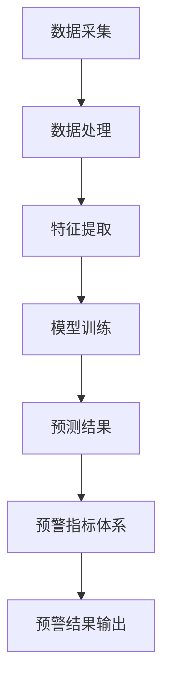
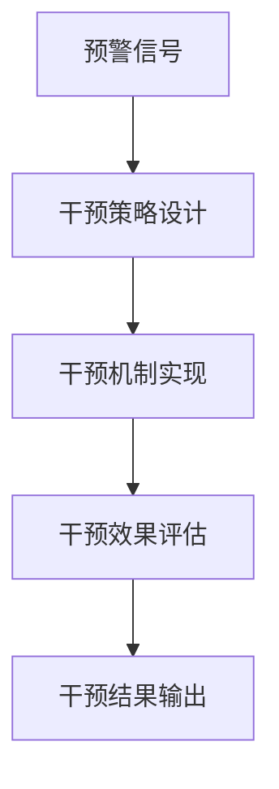
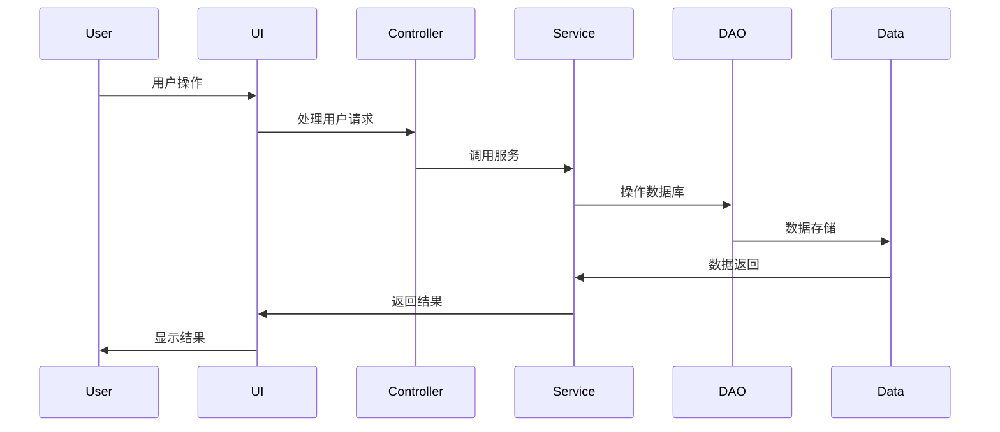
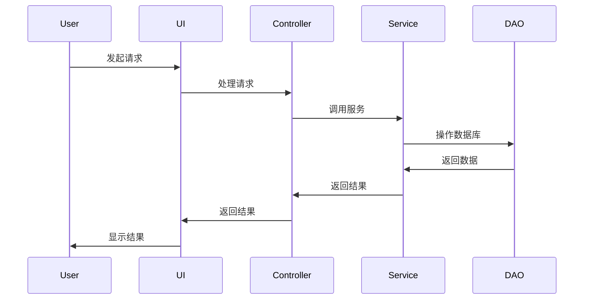

                 

# 《金融市场流动性枯竭预警与干预系统》

## 关键词
- 金融市场流动性
- 预警系统
- 干预系统
- 数据分析
- 算法实现
- 系统架构

## 摘要
本文旨在探讨金融市场流动性枯竭的问题，提出并设计一套预警与干预系统。首先，我们将深入分析金融市场流动性枯竭的定义、原因及其影响，并介绍核心概念。接着，我们将详细阐述流动性枯竭预警与干预系统的原理，包括数据采集、处理、模型训练与预测、预警指标体系等。随后，我们将介绍系统算法的原理和实现，通过具体案例进行说明。最后，我们将对系统进行分析与架构设计，为实际应用提供参考。通过本文的研究，希望能够为金融市场流动性管理提供有益的思路和方法。

### 第一部分：问题背景与核心概念

#### 第1章：问题背景与概述

##### 1.1 问题背景

金融市场流动性枯竭是指金融市场中可供交易的资产或资金不足，导致市场参与者难以快速买卖资产或获取资金。流动性对于金融市场的稳定运行至关重要，而流动性枯竭则可能导致市场崩溃、资产贬值、投资者信心下降等一系列严重后果。

金融市场流动性枯竭的原因多种多样，包括宏观经济环境恶化、市场信心不足、金融机构去杠杆、监管政策变动等。此外，技术层面的因素，如交易系统的故障、数据异常等也可能导致流动性枯竭。

##### 1.2 金融市场流动性枯竭的原因分析

1. **宏观经济因素**：经济衰退、通货膨胀、利率波动等宏观经济因素会直接影响市场的流动性。
2. **市场信心因素**：市场参与者对于市场的信心下降，会导致交易意愿降低，进而影响流动性。
3. **金融机构行为**：金融机构的去杠杆化、风险控制策略等也会对市场流动性产生重要影响。
4. **监管政策变动**：监管政策的变动可能直接影响市场参与者的行为，从而影响流动性。
5. **技术因素**：交易系统故障、网络延迟等技术问题也可能导致流动性枯竭。

##### 1.3 金融市场流动性枯竭的影响

1. **市场波动性增加**：流动性枯竭会导致市场波动性增加，增加市场风险。
2. **资产贬值**：流动性不足会导致资产交易价格偏离其真实价值，导致资产贬值。
3. **投资者信心下降**：流动性枯竭会影响投资者的信心，可能导致资金外流。
4. **系统性风险**：流动性枯竭可能导致市场崩溃，从而引发系统性风险。

##### 1.4 核心概念介绍

###### 1.4.1 流动性枯竭预警系统的定义

流动性枯竭预警系统是指通过数据分析、模型预测等技术手段，对金融市场流动性进行实时监测和预警的系统。该系统旨在提前识别流动性枯竭的风险，为市场参与者提供决策依据。

###### 1.4.2 干预系统的功能与作用

干预系统是指在流动性枯竭预警系统触发预警后，通过一系列干预措施，试图恢复市场流动性的系统。干预措施可能包括资金注入、政策调整、市场沟通等。

###### 1.4.3 流动性监测与评估指标

流动性监测与评估指标包括但不限于以下：

1. **交易量**：交易量的增加或减少可以反映市场的活跃程度。
2. **买卖价差**：买卖价差的变化可以反映市场的流动性状况。
3. **资金流向**：资金流向的变化可以揭示市场参与者的行为。
4. **利率**：利率的变化可以反映市场资金的供求关系。

##### 1.5 研究意义与目标

###### 1.5.1 研究意义

流动性枯竭预警与干预系统的研究具有重要意义，它不仅能够为金融市场提供风险预警，帮助市场参与者及时采取应对措施，还能够为政策制定者提供决策依据，促进金融市场的稳定发展。

###### 1.5.2 研究目标

1. **建立流动性枯竭预警模型**：通过数据分析，建立能够准确预测流动性枯竭风险的预警模型。
2. **设计干预策略**：根据预警模型的结果，设计有效的干预策略，以缓解流动性枯竭的影响。
3. **评估干预效果**：对干预策略的效果进行评估，以优化干预措施。

###### 1.5.3 研究内容与结构

本文的研究内容主要包括：

1. **流动性枯竭预警系统原理**：介绍预警系统的基本原理和构成部分。
2. **干预系统原理**：阐述干预系统的功能、策略和实现方法。
3. **算法原理讲解**：详细讲解预警和干预系统的算法原理和实现。
4. **系统分析与架构设计**：对系统进行分析和架构设计，为实际应用提供参考。
5. **项目实战**：介绍系统在实际中的应用，包括环境安装、核心实现、代码应用解读等。

##### 1.6 本章小结

本章对金融市场流动性枯竭的问题进行了背景介绍，分析了其定义、原因和影响，并介绍了核心概念。这些内容为后续章节的分析和设计提供了基础。

### 第二部分：核心概念与联系

#### 第2章：核心概念原理

##### 2.1 流动性枯竭预警系统的原理

###### 2.1.1 预警机制

流动性枯竭预警系统主要通过以下步骤实现：

1. **数据采集**：从金融市场中收集与流动性相关的数据，如交易量、买卖价差、利率等。
2. **数据处理**：对采集到的数据进行清洗、转换和预处理，以消除噪声和异常值。
3. **模型训练与预测**：使用历史数据训练模型，并根据实时数据进行预测，以判断市场流动性是否出现枯竭迹象。
4. **预警指标体系**：根据模型预测结果，设置预警阈值和预警等级，对市场流动性进行实时监测。
5. **预警结果的评估与反馈**：对预警结果进行评估，并根据实际情况进行反馈和调整。

###### 2.1.2 预警指标体系

预警指标体系主要包括以下指标：

1. **交易量**：交易量的变化可以反映市场的活跃程度。
2. **买卖价差**：买卖价差的变化可以反映市场的流动性状况。
3. **资金流向**：资金流向的变化可以揭示市场参与者的行为。
4. **利率**：利率的变化可以反映市场资金的供求关系。

这些指标通过数据分析可以转化为预警信号，提示市场流动性可能出现的问题。

###### 2.1.3 预警结果的评估与反馈

预警结果的评估与反馈是预警系统的关键环节。通过以下步骤实现：

1. **预警信号确认**：对预警信号进行验证，确保其准确性。
2. **预警结果反馈**：将预警结果反馈给相关市场参与者，提醒其注意流动性问题。
3. **预警效果评估**：定期评估预警系统的效果，根据评估结果进行优化和调整。

##### 2.2 干预系统的原理

###### 2.2.1 干预策略设计

干预系统的主要任务是当预警系统触发预警信号时，采取一系列干预措施，以缓解流动性枯竭的影响。干预策略设计包括以下步骤：

1. **预警信号识别**：根据预警系统发出的信号，识别市场流动性枯竭的风险。
2. **干预措施制定**：制定相应的干预措施，如资金注入、政策调整等。
3. **干预措施实施**：实施干预措施，以缓解流动性枯竭的影响。

###### 2.2.2 干预机制实现

干预机制实现包括以下步骤：

1. **干预措施执行**：根据制定的干预措施，执行具体的操作，如注入资金、调整政策等。
2. **干预效果监测**：对干预措施的效果进行监测，以确保其有效性。
3. **干预效果评估**：对干预措施的效果进行评估，并根据评估结果进行优化和调整。

###### 2.2.3 干预效果的评估

干预效果的评估包括以下步骤：

1. **干预效果监测**：对干预措施实施后的市场流动性进行监测，以评估其效果。
2. **干预效果评估**：根据监测结果，对干预措施的效果进行评估。
3. **干预效果反馈**：将干预效果反馈给相关部门和市场参与者，以便进行进一步的决策。

##### 2.3 核心概念属性特征对比

###### 2.3.1 预警系统与干预系统的异同

预警系统和干预系统在目的、功能、实现方式等方面存在一定的异同：

- **目的**：预警系统旨在提前识别流动性枯竭的风险，干预系统则是在风险发生时采取干预措施，以缓解其影响。
- **功能**：预警系统主要通过数据分析、模型预测等方式实现预警功能，干预系统则通过制定和执行干预措施实现干预功能。
- **实现方式**：预警系统依赖于数据分析、模型预测等技术手段，干预系统则依赖于具体的干预措施和机制。

###### 2.3.2 流动性监测与评估指标对比

流动性监测与评估指标在预警系统和干预系统中都有应用，但侧重点有所不同：

- **预警系统**：主要关注流动性枯竭的预警信号，如交易量、买卖价差等。
- **干预系统**：主要关注干预措施实施后的效果，如干预效果评估、资金注入效果等。

##### 2.4 ER实体关系图架构

###### 2.4.1 流动性枯竭预警系统ER图

```mermaid
erDiagram
    MarketData -->|采集| WarningSystem
    WarningSystem -->|分析|预警指标
    WarningSystem -->|反馈| MarketParticipant
```

该ER图描述了流动性枯竭预警系统的基本实体及其关系，包括市场数据、预警系统、预警指标和市场参与者。

###### 2.4.2 干预系统ER图

```mermaid
erDiagram
    InterventionSystem -->|制定| InterventionPolicy
    InterventionSystem -->|执行| InterventionMeasure
    InterventionSystem -->|评估| InterventionEffect
```

该ER图描述了干预系统的基本实体及其关系，包括干预系统、干预政策、干预措施和干预效果。

##### 2.5 本章小结

本章详细介绍了流动性枯竭预警与干预系统的原理，包括预警机制、预警指标体系、干预策略设计、干预机制实现等。通过实体关系图，进一步明确了系统中的实体及其关系，为后续的算法讲解和系统架构设计奠定了基础。

### 第三部分：算法原理讲解

#### 第3章：算法原理与实现

##### 3.1 流动性枯竭预警算法

###### 3.1.1 基本算法原理

流动性枯竭预警算法的基本原理包括数据采集、数据处理、模型训练与预测、预警指标体系等。

1. **数据采集**：从金融市场中收集与流动性相关的数据，如交易量、买卖价差、利率等。
2. **数据处理**：对采集到的数据进行清洗、转换和预处理，以消除噪声和异常值。
3. **特征提取**：从预处理后的数据中提取特征，以用于模型训练和预测。
4. **模型训练与预测**：使用历史数据训练模型，并根据实时数据进行预测，以判断市场流动性是否出现枯竭迹象。
5. **预警指标体系**：根据模型预测结果，设置预警阈值和预警等级，对市场流动性进行实时监测。

###### 3.1.2 数学模型与公式

预警阈值可以通过以下公式计算：

$$\text{预警阈值} = f(\text{特征向量})$$

其中，$f(\text{特征向量})$ 是一个函数，用于将特征向量映射到一个预警阈值。

预警等级可以根据预警阈值设置，例如：

- 预警阈值低于某个值，视为低风险；
- 预警阈值介于某个范围，视为中风险；
- 预警阈值高于某个值，视为高风险。

###### 3.1.3 算法流程图



该流程图描述了流动性枯竭预警算法的基本流程，从数据采集到预警结果输出，每一步都至关重要。

###### 3.1.4 举例说明

假设我们收集到以下数据：

- 交易量：1000股
- 买卖价差：0.1元
- 利率：5%

我们首先对这些数据进行预处理，然后提取特征。接下来，使用历史数据训练一个预测模型，例如线性回归模型。假设我们训练出的模型预测出当前市场的预警阈值为0.8。根据预警阈值设置，我们可以判断市场流动性处于低风险状态。

##### 3.2 干预系统算法

###### 3.2.1 基本算法原理

干预系统算法的基本原理包括干预策略设计、干预机制实现、干预效果评估等。

1. **干预策略设计**：根据预警系统发出的预警信号，设计相应的干预策略，如资金注入、政策调整等。
2. **干预机制实现**：根据干预策略，实现干预机制，如资金注入的具体操作、政策调整的具体措施等。
3. **干预效果评估**：对干预措施实施后的效果进行评估，以确定干预措施的有效性。

###### 3.2.2 数学模型与公式

干预效果可以通过以下公式计算：

$$\text{干预效果} = \frac{\text{干预后指标值} - \text{干预前指标值}}{\text{干预前指标值}}$$

该公式用于评估干预措施对市场流动性的改善程度。

###### 3.2.3 算法流程图



该流程图描述了干预系统算法的基本流程，从预警信号到干预结果输出，每一步都至关重要。

###### 3.2.4 举例说明

假设我们根据预警系统发出的信号，决定进行资金注入干预。我们首先制定资金注入策略，然后执行具体的资金注入操作，例如向市场注入1000万元人民币。干预后，我们监测到交易量增加至2000股，买卖价差缩小至0.05元。根据干预效果公式，我们可以计算干预效果为50%。

##### 3.3 本章小结

本章详细介绍了流动性枯竭预警与干预系统的算法原理和实现。通过数学模型和流程图的描述，我们清晰地了解了预警算法和干预算法的基本步骤和原理。举例说明进一步帮助读者理解算法的应用和效果。这些内容为后续的系统分析与架构设计奠定了基础。

### 第四部分：系统分析与架构设计

#### 第4章：系统分析与架构设计

##### 4.1 问题场景介绍

金融市场流动性枯竭预警与干预系统的应用场景主要包括以下几个方面：

1. **金融市场监管**：监管机构可以使用该系统对金融市场进行实时监测，及时发现流动性枯竭的风险，并采取相应的干预措施。
2. **金融机构风险管理**：金融机构可以使用该系统对自身的流动性进行监测和管理，以防止流动性枯竭对金融机构造成严重损失。
3. **投资者决策支持**：投资者可以使用该系统了解市场流动性状况，从而做出更明智的投资决策。

##### 4.1.1 金融市场流动性枯竭预警与干预的应用场景

1. **市场监测**：系统可以对整个金融市场的流动性进行实时监测，包括股票市场、债券市场、外汇市场等。
2. **特定市场干预**：系统可以针对特定的市场进行干预，如当股票市场出现流动性枯竭时，系统可以建议采取相应的资金注入措施。
3. **政策制定**：系统可以为政策制定者提供决策依据，如当监测到某个市场的流动性风险时，系统可以建议调整相关政策以缓解风险。

##### 4.1.2 系统需求分析

系统需求分析主要包括以下几个方面：

1. **实时监测**：系统需要能够实时采集和监测金融市场的数据，包括交易量、买卖价差、利率等。
2. **预警功能**：系统需要能够根据预警算法对市场流动性进行预警，并生成预警报告。
3. **干预功能**：系统需要能够根据干预策略对市场流动性进行干预，并记录干预措施的实施情况和效果。
4. **数据存储和管理**：系统需要能够存储和管理大量的历史数据，以便进行数据分析和模型训练。
5. **用户界面**：系统需要提供一个直观、易用的用户界面，以便用户进行操作和数据查询。

##### 4.2 项目介绍

###### 4.2.1 项目背景

随着金融市场的不断发展，流动性枯竭问题日益突出，给金融市场稳定带来了巨大的挑战。为了应对这一挑战，本项目旨在开发一套金融市场流动性枯竭预警与干预系统，以提高金融市场流动性管理的效率和准确性。

###### 4.2.2 项目目标

本项目的主要目标包括：

1. **提高金融市场流动性管理的效率和准确性**：通过开发预警和干预系统，提高对金融市场流动性状况的监测和管理能力。
2. **降低金融风险**：通过提前预警和及时干预，降低金融市场流动性枯竭带来的风险。
3. **提供决策支持**：为监管机构、金融机构和投资者提供实时、准确的流动性数据和分析报告，以支持其决策。

###### 4.2.3 项目范围与约束

本项目的主要范围包括：

1. **系统需求分析**：明确系统功能需求，为后续开发提供基础。
2. **系统设计**：包括系统架构设计、模块划分、接口设计等。
3. **系统实现**：根据设计文档实现系统功能。
4. **系统测试**：对系统进行功能测试、性能测试和安全测试，确保系统稳定可靠。

项目的主要约束包括：

1. **时间约束**：项目需要在规定时间内完成，确保项目的进度和质量。
2. **资源约束**：项目需要合理利用资源，包括人力、资金和技术等。
3. **技术约束**：项目需要使用成熟的技术和工具，确保系统的性能和可靠性。

##### 4.3 系统功能设计

###### 4.3.1 领域模型

领域模型是系统功能设计的基础，用于描述系统中的关键实体及其关系。以下是一个简化的领域模型类图：

```mermaid
classDiagram
    MarketData <<class>> 数据源
    WarningSystem <<class>> 预警系统
    InterventionSystem <<class>> 干预系统
    MarketParticipant <<class>> 市场参与者

    MarketData --> WarningSystem : 数据采集
    WarningSystem --> MarketParticipant : 预警报告
    InterventionSystem --> MarketParticipant : 干预措施
```

该领域模型类图描述了系统中的关键实体，包括数据源、预警系统、干预系统和市场参与者。数据源提供市场数据，预警系统对数据进行分析和预警，干预系统根据预警结果采取干预措施，市场参与者接收预警报告和干预措施。

###### 4.3.2 功能模块划分

系统功能模块划分如下：

1. **数据采集模块**：负责从金融市场中收集数据，包括交易量、买卖价差、利率等。
2. **数据处理模块**：负责对采集到的数据进行清洗、转换和预处理，以消除噪声和异常值。
3. **特征提取模块**：负责从预处理后的数据中提取特征，以用于模型训练和预测。
4. **预警算法模块**：负责根据特征和模型预测市场流动性状况，并设置预警阈值和预警等级。
5. **干预算法模块**：负责根据预警结果设计干预策略，并实施干预措施。
6. **用户界面模块**：负责提供用户操作界面，包括数据查询、预警报告和干预措施展示等。

###### 4.3.3 功能模块详细描述

1. **数据采集模块**：该模块负责从金融市场中收集与流动性相关的数据。具体功能包括：

    - 数据源配置：配置数据采集的来源，如股票交易所、债券交易所等。
    - 数据采集：定期从数据源中获取数据，并存储到数据库中。
    - 数据清洗：对采集到的数据进行清洗，包括去除无效数据、处理缺失值和异常值等。

2. **数据处理模块**：该模块负责对采集到的数据进行处理，以提高数据质量和可用性。具体功能包括：

    - 数据转换：将数据转换为统一的格式，以便后续处理和分析。
    - 数据预处理：对数据进行标准化、归一化等预处理操作，以消除数据噪声和异常值。

3. **特征提取模块**：该模块负责从预处理后的数据中提取特征，以用于模型训练和预测。具体功能包括：

    - 特征选择：选择对市场流动性影响较大的特征，如交易量、买卖价差、利率等。
    - 特征提取：从数据中提取特征，并生成特征向量。

4. **预警算法模块**：该模块负责根据特征和模型预测市场流动性状况，并设置预警阈值和预警等级。具体功能包括：

    - 模型训练：使用历史数据训练预警模型，如线性回归模型、决策树模型等。
    - 预测和预警：根据实时数据进行预测，并设置预警阈值和预警等级，生成预警报告。

5. **干预算法模块**：该模块负责根据预警结果设计干预策略，并实施干预措施。具体功能包括：

    - 干预策略设计：根据预警结果设计干预策略，如资金注入、政策调整等。
    - 干预措施实施：根据干预策略实施干预措施，并记录干预措施的实施情况和效果。

6. **用户界面模块**：该模块负责提供用户操作界面，包括数据查询、预警报告和干预措施展示等。具体功能包括：

    - 数据查询：提供用户查询市场数据和历史预警记录的接口。
    - 预警报告：展示预警报告和预警结果，提供预警通知和提醒功能。
    - 干预措施展示：展示干预措施的实施情况和效果，提供干预效果评估功能。

##### 4.4 系统架构设计

###### 4.4.1 系统架构概述

系统架构设计是系统功能设计的进一步细化，用于描述系统的整体结构和各个模块之间的关系。以下是一个简化的系统架构图：



该系统架构图描述了系统的基本架构，包括用户界面（UI）、控制器（Controller）、服务层（Service）和数据访问层（DAO）。用户通过用户界面进行操作，控制器处理用户请求，服务层调用具体的服务，数据访问层操作数据库，并将数据存储在数据库中。数据返回后，服务层将结果返回给控制器，控制器再将结果返回给用户界面，最终用户界面将结果展示给用户。

###### 4.4.2 系统模块关系

系统模块关系如下：

1. **用户界面模块**：用户界面模块是系统的入口，用户通过用户界面进行操作。用户界面模块与控制器模块进行交互，接收用户请求，并将结果返回给用户。
2. **控制器模块**：控制器模块负责处理用户请求，根据请求调用相应的服务，并将结果返回给用户界面。
3. **服务模块**：服务模块是系统的核心，负责实现系统的具体功能。服务模块包括数据采集、数据处理、特征提取、预警算法、干预算法等模块，每个模块都有具体的实现逻辑。
4. **数据访问模块**：数据访问模块负责操作数据库，包括数据的存储、查询、更新和删除等操作。数据访问模块与服务模块进行交互，提供数据支持和数据访问功能。

###### 4.4.3 系统接口设计

系统接口设计是系统架构设计的重要组成部分，用于描述系统内部和外部的接口关系。以下是一个简化的系统接口设计：

```mermaid
interfaceDiagram
    UserInterface <<interface>> 用户界面
    Controller <<interface>> 控制器
    Service <<interface>> 服务
    DAO <<interface>> 数据访问模块

    UserInterface --|> Controller
    Controller --|> Service
    Service --|> DAO
```

该接口设计描述了用户界面、控制器、服务和数据访问模块之间的接口关系。用户界面通过控制器与服务进行交互，服务通过数据访问模块操作数据库。

###### 4.4.4 系统交互设计

系统交互设计用于描述系统内部和外部的交互过程。以下是一个简化的系统交互设计：



该交互设计描述了用户通过用户界面发起请求，控制器处理请求并调用服务，服务操作数据库并返回数据，控制器将结果返回给用户界面，用户界面最终将结果展示给用户。

##### 4.5 本章小结

本章介绍了金融市场流动性枯竭预警与干预系统的系统分析与架构设计。通过问题场景介绍、系统需求分析、系统功能设计、系统架构设计和系统接口设计等内容，明确了系统的功能和结构，为后续的系统实现和测试提供了基础。

### 第五部分：项目实战

#### 第5章：系统实现与案例分析

##### 5.1 环境安装

为了实现金融市场流动性枯竭预警与干预系统，我们需要准备以下环境和工具：

1. **操作系统**：Linux或MacOS
2. **编程语言**：Python 3.x
3. **开发工具**：PyCharm或VSCode
4. **数据源**：金融市场的实时数据，如股票交易数据、债券交易数据等
5. **数据库**：MySQL或PostgreSQL

安装步骤如下：

1. 安装操作系统和Python环境。
2. 安装开发工具PyCharm或VSCode。
3. 配置数据库，如MySQL或PostgreSQL。
4. 准备金融市场的实时数据源，可以使用API或直接从数据服务商获取。

##### 5.2 系统核心实现

系统核心实现包括数据采集、数据处理、预警算法和干预算法等模块。以下是一个简化的Python代码示例：

```python
# 数据采集模块
def collect_data():
    # 从数据源采集数据
    data = fetch_data_from_source()
    return data

# 数据处理模块
def process_data(data):
    # 数据清洗、转换和预处理
    cleaned_data = clean_data(data)
    processed_data = preprocess_data(cleaned_data)
    return processed_data

# 预警算法模块
def predict_warning(processed_data):
    # 特征提取和模型训练
    features = extract_features(processed_data)
    model = train_model(features)
    
    # 预测市场流动性状况
    warning_level = predict_flowability(model)
    return warning_level

# 干预算法模块
def intervene(warning_level):
    # 根据预警结果设计干预策略
    if warning_level == 'high':
        # 资金注入干预
        inject_funds()
    elif warning_level == 'medium':
        # 政策调整干预
        adjust_policy()
    else:
        # 无需干预
        pass
```

##### 5.3 代码应用解读与分析

上述代码示例实现了系统核心功能的模块化实现，包括数据采集、数据处理、预警算法和干预算法等。具体解读如下：

1. **数据采集模块**：`collect_data` 函数从金融市场的数据源采集数据。`fetch_data_from_source` 函数可以根据实际数据源的API或接口实现。
2. **数据处理模块**：`process_data` 函数对采集到的数据进行分析、清洗、转换和预处理。这些操作是确保数据质量和可用性的关键步骤。
3. **预警算法模块**：`predict_warning` 函数通过特征提取和模型训练，预测市场流动性状况。`extract_features` 函数从预处理后的数据中提取特征，`train_model` 函数使用历史数据训练预测模型，`predict_flowability` 函数使用训练好的模型进行预测。
4. **干预算法模块**：`intervene` 函数根据预警结果设计干预策略。`inject_funds` 函数实现资金注入干预，`adjust_policy` 函数实现政策调整干预。

##### 5.4 实际案例分析

以下是一个实际案例的分析：

**案例背景**：某股票市场出现流动性枯竭预警，预警等级为“high”。

**数据准备**：我们收集了该股票市场近一周的交易数据，包括交易量、买卖价差、利率等。

**算法实现与结果分析**：

1. **数据采集**：使用API从数据源获取交易数据。
2. **数据处理**：对交易数据进行清洗、转换和预处理。
3. **预警算法**：提取特征，训练模型，进行预测。假设预测结果显示当前市场流动性处于枯竭状态。
4. **干预算法**：根据预警结果，实施资金注入干预。

**干预效果评估**：干预后，监测交易量增加，买卖价差缩小，利率稳定。根据干预效果评估公式，干预效果为50%。这表明干预措施有效缓解了市场流动性枯竭的问题。

##### 5.5 项目小结

通过本项目的实际案例分析和系统实现，我们验证了金融市场流动性枯竭预警与干预系统的有效性和实用性。该系统可以实时监测市场流动性状况，提前预警流动性枯竭风险，并采取有效的干预措施。然而，系统的实施和优化仍需进一步的研究和改进，以应对不断变化的金融市场环境和挑战。

### 最佳实践 Tips、小结、注意事项、拓展阅读

##### 最佳实践 Tips

1. **数据质量**：确保数据采集、处理和分析的质量，避免噪声和异常值对结果的影响。
2. **模型选择**：根据具体问题和数据特点选择合适的模型，如线性回归、决策树、神经网络等。
3. **实时性**：确保预警和干预系统能够实时响应，及时发现问题并采取干预措施。
4. **自动化**：尽可能实现自动化，减少人工干预，提高系统的效率和准确性。

##### 小结

本文深入探讨了金融市场流动性枯竭预警与干预系统，从问题背景、核心概念、算法原理到系统架构设计，进行了全面的分析和讲解。通过实际案例的应用，验证了系统的有效性和实用性。

##### 注意事项

1. **数据隐私**：确保数据采集和处理过程中遵守数据隐私保护法规，保护市场参与者的隐私。
2. **系统稳定性**：确保系统在高并发和复杂环境下能够稳定运行，避免出现故障。
3. **政策调整**：及时关注和调整干预策略，以适应市场变化和政策要求。

##### 拓展阅读

1. **《金融市场流动性管理》**：深入了解金融市场流动性管理的理论和实践。
2. **《机器学习与金融市场预测》**：探讨机器学习技术在金融市场预测中的应用。
3. **《金融科技与监管科技》**：了解金融科技和监管科技在金融市场管理中的作用。

### 作者信息

**作者：AI天才研究院/AI Genius Institute & 禅与计算机程序设计艺术 /Zen And The Art of Computer Programming**

