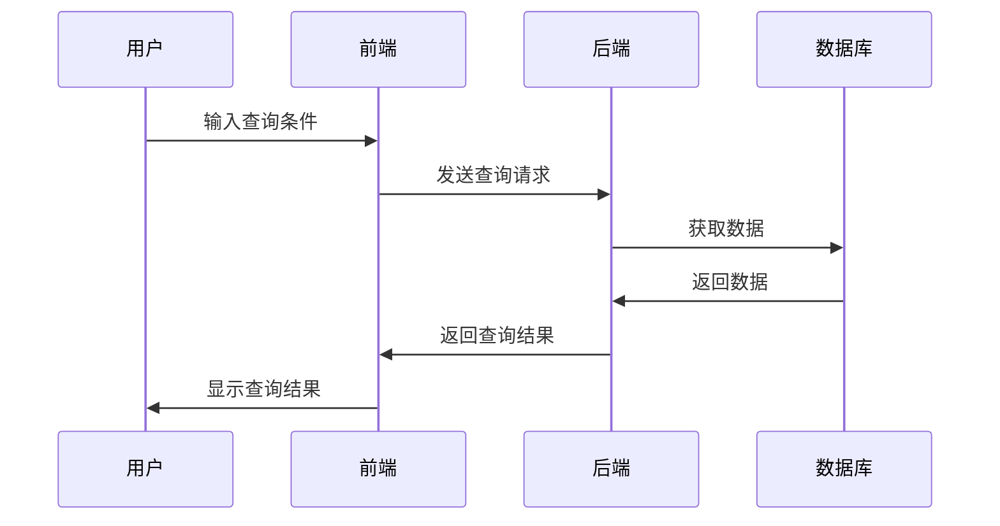

                 

### 引言

#### 文章标题：金融市场流动性风险传导模型

#### 关键词：金融市场、流动性风险、传导模型、风险指标、算法原理、系统架构、项目实战

#### 摘要：

随着金融市场的发展，流动性风险成为了金融机构和企业所面临的重要风险之一。本文旨在深入探讨金融市场流动性风险传导模型，通过逻辑清晰、结构紧凑的分析，帮助读者理解这一复杂问题的本质。文章将分为以下几个部分：首先，我们将介绍金融市场流动性风险的基本概念和背景；接着，讨论流动性风险的指标和传导机制；然后，深入解析流动性风险传导模型的理论基础和数学模型；接下来，描述模型的设计和实现过程；最后，通过实际案例分析和最佳实践，展示模型的实际应用效果。

### 背景介绍

#### 第1章：背景介绍

#### 1.1 问题背景

金融市场流动性风险是指金融市场中的交易者无法以合理的价格迅速买卖资产的风险。这种风险可能源于市场供求失衡、交易者信心下降、金融机构流动性不足等多种因素。当流动性风险爆发时，市场交易将变得困难，资产价格可能出现剧烈波动，甚至引发系统性金融危机。

#### 1.1.1 金融市场流动性风险的重要性

金融市场流动性风险对整个经济体系具有深远的影响。首先，流动性风险可能导致金融机构破产，进而引发连锁反应，导致金融市场崩溃。其次，流动性风险会降低市场的效率，增加交易成本，影响投资者的信心。此外，流动性风险还可能对实体经济产生负面影响，限制企业的融资渠道，阻碍经济增长。

#### 1.1.2 流动性风险的传导机制

流动性风险的传导机制是指流动性风险如何在金融系统中传播和放大。传导机制主要包括以下几个环节：

1. **市场情绪传导**：市场参与者对流动性风险的担忧可能导致市场情绪恶化，进一步加剧流动性风险。
2. **杠杆率传导**：高杠杆率机构在面临流动性风险时，可能被迫平仓，导致市场波动加剧。
3. **资产价格传导**：流动性风险可能导致资产价格大幅波动，进而影响市场估值和金融机构的资产负债状况。
4. **银行间市场传导**：银行间市场的流动性风险可能会通过信贷渠道传导至实体经济。

#### 1.2 流动性风险的概念与分类

流动性风险的概念比较广泛，通常可以从以下三个方面进行分类：

1. **静态流动性风险**：指资产和负债之间的流动性不匹配，可能导致短期资金短缺。
2. **动态流动性风险**：指金融市场交易活动的不确定性，可能导致交易成本上升和资产价格波动。
3. **市场流动性风险**：指市场无法迅速以合理价格完成交易的风险。

#### 1.2.1 流动性风险的定义

流动性风险是指金融市场参与者无法以合理的价格迅速买卖资产的风险。它不仅涉及资产自身的流动性，还与市场供需状况、市场参与者的行为和心理因素密切相关。

#### 1.2.2 流动性风险的分类

流动性风险的分类有助于我们更深入地理解其本质。根据不同的标准，流动性风险可以划分为多种类型：

1. **根据资产流动性**：可分为高流动性资产和低流动性资产。
2. **根据风险维度**：可分为市场风险、信用风险、流动性风险。
3. **根据资产类型**：可分为货币市场流动性风险、资本市场流动性风险、衍生品市场流动性风险。

#### 1.2.3 流动性风险的影响

流动性风险对金融市场和经济体系的影响是多方面的。一方面，流动性风险可能导致市场崩溃、金融机构破产，从而引发系统性金融危机。另一方面，流动性风险会影响市场的有效运行，增加交易成本，降低市场的效率和透明度。

#### 1.3 流动性风险的边界与外延

流动性风险的边界与外延是指其影响的范围和深度。流动性风险的边界通常取决于以下几个因素：

1. **市场供需状况**：当市场供需失衡时，流动性风险可能会迅速扩大。
2. **市场参与者的行为**：市场参与者的恐慌和不确定性会加剧流动性风险。
3. **金融机构的流动性状况**：金融机构的流动性状况直接影响其应对流动性风险的能力。

#### 1.3.1 流动性风险的边界

流动性风险的边界通常取决于以下几个方面：

1. **市场的深度**：市场深度越大，流动性风险越低。
2. **交易量**：交易量越大，流动性风险越低。
3. **市场参与者的数量**：市场参与者越多，流动性风险越低。

#### 1.3.2 流动性风险的外延

流动性风险的外延是指其影响的范围和深度。流动性风险的外延主要取决于以下几个方面：

1. **市场波动性**：市场波动性越大，流动性风险越强。
2. **市场透明度**：市场透明度越高，流动性风险越低。
3. **经济周期**：在经济繁荣时期，流动性风险较低；在经济衰退时期，流动性风险较高。

#### 1.3.3 概念结构与核心要素组成

流动性风险的概念结构主要包括以下几个方面：

1. **资产流动性**：资产流动性是指资产在市场上迅速买卖的能力。
2. **负债流动性**：负债流动性是指负债在市场上迅速买卖的能力。
3. **市场流动性**：市场流动性是指整个市场在交易过程中的流畅程度。
4. **市场参与者的行为**：市场参与者的行为会影响市场的流动性和风险水平。

#### 1.4 本章小结

本章对金融市场流动性风险的基本概念、背景、分类和边界进行了详细介绍。通过本章的阅读，读者可以初步了解流动性风险的重要性及其传导机制。在接下来的章节中，我们将进一步探讨流动性风险的指标、传导模型的理论基础和实际应用。

### 核心概念与联系

#### 第2章：核心概念与联系

#### 2.1 流动性风险指标

流动性风险指标是衡量金融市场流动性风险的重要工具。这些指标可以帮助金融机构和企业评估其流动性状况，制定相应的风险管理策略。以下是一些常用的流动性风险指标：

1. **现金流动比率**：现金流动比率是指企业的现金流动资产与流动负债的比值。该指标越高，说明企业的短期偿债能力越强，流动性风险越低。
2. **速动比率**：速动比率是指企业的速动资产（现金、现金等价物、应收账款等）与流动负债的比值。速动比率比现金流动比率更为严格，更能反映企业的流动性风险。
3. **流动资产/流动负债**：该指标是指企业的流动资产与流动负债的比值。该指标越高，说明企业的流动性风险越低。
4. **存贷比**：存贷比是指银行的贷款总额与存款总额的比值。存贷比过高可能意味着银行面临较大的流动性风险。

#### 2.1.1 流动性风险指标的重要性

流动性风险指标在金融风险管理中具有重要地位。首先，这些指标可以帮助金融机构和企业及时识别潜在的流动性风险，采取有效的预防措施。其次，流动性风险指标是监管机构和投资者评估金融机构和企业信用风险的重要依据。最后，流动性风险指标是制定流动性管理策略和应急预案的基础。

#### 2.1.2 流动性风险指标的分类

根据指标的性质和用途，流动性风险指标可以分为以下几类：

1. **现金流量指标**：这类指标主要关注企业的现金流动情况，如现金流动比率、速动比率等。
2. **资产负债指标**：这类指标主要关注企业的资产负债结构，如流动资产/流动负债、存贷比等。
3. **市场指标**：这类指标主要关注市场的流动性状况，如市场深度、交易量等。

#### 2.2 流动性风险指标的应用

流动性风险指标在金融风险管理中有着广泛的应用。以下是一些典型的应用场景：

1. **流动性风险评估**：金融机构和企业可以利用流动性风险指标对自身的流动性状况进行评估，识别潜在的流动性风险。
2. **流动性管理**：金融机构和企业可以根据流动性风险指标制定流动性管理策略，确保在紧急情况下能够迅速获取资金。
3. **应急预案**：金融机构和企业可以根据流动性风险指标制定应急预案，确保在流动性危机爆发时能够迅速采取应对措施。

#### 2.2.1 流动性比率的计算与应用

流动性比率是衡量企业流动性状况的重要指标。以下是一个简单的例子：

假设某企业的流动资产为1000万元，流动负债为500万元，则其现金流动比率为：
\[ 现金流动比率 = 流动资产 / 流动负债 = 1000 / 500 = 2 \]

这个比率表明企业的现金流动能力很强，短期偿债风险较低。

#### 2.2.2 市场流动性指数的计算与应用

市场流动性指数是衡量金融市场流动性状况的重要指标。以下是一个简单的例子：

假设某金融市场的交易量为100亿元，交易对数为10万笔，则其市场流动性指数为：
\[ 市场流动性指数 = 交易量 / 交易对数 = 100 / 10^5 = 0.001 \]

这个指数表明市场的流动性较高，交易较为活跃。

#### 2.3 流动性风险的传导机制

流动性风险的传导机制是指流动性风险如何在金融系统中传播和放大。以下是一些常见的传导机制：

1. **市场情绪传导**：市场参与者的恐慌和不确定性会导致市场流动性下降，进一步加剧流动性风险。
2. **杠杆率传导**：高杠杆率机构在面临流动性风险时，可能被迫平仓，导致市场波动加剧，进一步影响其他机构的流动性。
3. **资产价格传导**：流动性风险可能导致资产价格大幅波动，进而影响市场估值和金融机构的资产负债状况。
4. **银行间市场传导**：银行间市场的流动性风险可能会通过信贷渠道传导至实体经济。

#### 2.3.1 传导机制的基本原理

传导机制的基本原理是流动性风险通过市场参与者之间的互动和反馈，在金融系统中传播和放大。以下是一个简单的传导机制示意图：


#### 2.3.2 传导机制的实证分析

以下是一些实证分析结果，展示了流动性风险在不同市场参与者之间的传导过程：

1. **银行与企业之间的传导**：银行在面临流动性危机时，可能减少对企业贷款，导致企业融资困难，进一步加剧企业的流动性风险。
2. **投资者与市场之间的传导**：投资者在面临市场不确定性时，可能减少投资，导致市场流动性下降，进一步加剧市场波动。
3. **国际市场与国内市场之间的传导**：国际金融市场的流动性危机可能会通过跨境资金流动影响国内金融市场，导致国内市场流动性下降。

#### 2.4 本章小结

本章对流动性风险指标及其应用、流动性风险的传导机制进行了详细讨论。通过本章的阅读，读者可以更好地理解流动性风险的本质和传播过程，为后续章节的学习打下基础。在接下来的章节中，我们将深入探讨流动性风险传导模型的理论基础和数学模型。

### 流动性风险传导模型

#### 第3章：流动性风险传导模型

#### 3.1 模型的基本原理

流动性风险传导模型是一种用于分析流动性风险在金融系统中的传播和放大过程的数学模型。该模型基于以下基本原理：

1. **市场参与者的行为**：市场参与者的行为会影响金融市场的流动性。当市场参与者对未来市场走势不确定时，他们可能会采取保守策略，减少交易活动，导致市场流动性下降。
2. **资产价格与市场流动性**：资产价格与市场流动性之间存在密切关系。当市场流动性下降时，资产价格可能会出现大幅波动。
3. **金融机构的流动性管理**：金融机构的流动性管理能力直接影响其应对流动性风险的能力。流动性管理良好的金融机构能够在危机时期保持流动性，从而降低流动性风险。

#### 3.1.1 模型概述

流动性风险传导模型的主要目的是分析流动性风险如何在金融系统中传播和放大。该模型包括以下几个主要组成部分：

1. **市场参与者**：包括银行、企业、投资者等。
2. **金融市场**：包括货币市场、资本市场、衍生品市场等。
3. **流动性风险指标**：如现金流动比率、速动比率、市场流动性指数等。
4. **传导机制**：包括市场情绪传导、杠杆率传导、资产价格传导等。

#### 3.1.2 模型假设

为了简化分析，流动性风险传导模型做了以下假设：

1. **市场参与者理性**：市场参与者都是理性的，他们会根据自身的利益做出决策。
2. **市场信息完全对称**：所有市场参与者都能够获得完全的市场信息。
3. **金融产品标准化**：金融产品具有标准化特征，易于买卖。
4. **无外部冲击**：模型不考虑外部事件对金融市场的影响。

#### 3.1.3 模型目标

流动性风险传导模型的目标是：

1. **分析流动性风险的传播和放大过程**：通过模型，可以了解流动性风险如何在金融系统中传播和放大。
2. **评估金融机构的流动性管理能力**：通过模型，可以评估金融机构在危机时期的流动性管理能力。
3. **提供流动性风险管理策略**：通过模型，可以为金融机构提供流动性风险管理策略，降低流动性风险。

#### 3.2 模型架构

流动性风险传导模型的架构可以分为以下几个部分：

1. **输入层**：包括市场流动性指标、市场参与者行为等。
2. **处理层**：包括传导机制、资产价格与市场流动性的关系等。
3. **输出层**：包括流动性风险的传播和放大过程、金融机构的流动性管理能力等。

#### 3.2.1 模型组成部分

流动性风险传导模型的主要组成部分包括：

1. **市场参与者**：包括银行、企业、投资者等。每个市场参与者都有自身的流动性需求和供给行为。
2. **金融市场**：包括货币市场、资本市场、衍生品市场等。每个市场都有自身的流动性特征和风险。
3. **流动性风险指标**：如现金流动比率、速动比率、市场流动性指数等。这些指标用于衡量市场流动性和风险。
4. **传导机制**：包括市场情绪传导、杠杆率传导、资产价格传导等。这些传导机制描述了流动性风险如何在金融系统中传播和放大。

#### 3.2.2 模型ER实体关系图架构

以下是流动性风险传导模型的ER实体关系图：

```mermaid
erDiagram
  MarketParticipant ||--|{ FinancialMarket }|-- MarketParticipant
  FinancialMarket ||--|{ LiquidityRiskIndicator }|-- FinancialMarket
  LiquidityRiskIndicator ||--|{ TransmissionMechanism }|-- LiquidityRiskIndicator
```

在这个ER实体关系图中，MarketParticipant表示市场参与者，FinancialMarket表示金融市场，LiquidityRiskIndicator表示流动性风险指标，TransmissionMechanism表示传导机制。箭头表示实体之间的关系。

#### 3.3 算法原理讲解

流动性风险传导模型的算法原理主要包括以下几个方面：

1. **数据处理**：首先，从各个市场获取市场流动性指标、市场参与者行为等数据。然后，对数据进行清洗、预处理，以便后续分析。
2. **指标计算**：根据预处理后的数据，计算流动性风险指标，如现金流动比率、速动比率、市场流动性指数等。
3. **传导机制分析**：分析市场情绪传导、杠杆率传导、资产价格传导等传导机制，了解流动性风险如何在金融系统中传播和放大。
4. **模型优化**：根据分析结果，优化模型参数，提高模型的准确性和稳定性。

#### 3.3.1 算法流程

以下是流动性风险传导模型的算法流程：

1. **数据收集**：从各个市场获取数据。
2. **数据处理**：对数据进行清洗、预处理。
3. **指标计算**：计算流动性风险指标。
4. **传导机制分析**：分析传导机制。
5. **模型优化**：优化模型参数。
6. **结果输出**：输出分析结果。

#### 3.3.2 算法数学模型与公式

以下是流动性风险传导模型的数学模型和公式：

1. **现金流动比率**：
\[ \text{现金流动比率} = \frac{\text{现金流动资产}}{\text{流动负债}} \]

2. **速动比率**：
\[ \text{速动比率} = \frac{\text{速动资产}}{\text{流动负债}} \]

3. **市场流动性指数**：
\[ \text{市场流动性指数} = \frac{\text{交易量}}{\text{交易对数}} \]

4. **市场情绪传导**：
\[ \text{市场情绪传导} = f(\text{市场流动性指数}) \]

5. **杠杆率传导**：
\[ \text{杠杆率传导} = f(\text{杠杆率}) \]

6. **资产价格传导**：
\[ \text{资产价格传导} = f(\text{资产价格波动}) \]

#### 3.3.3 举例说明

以下是一个简化的例子，说明如何使用流动性风险传导模型分析一个金融市场的流动性风险：

1. **数据收集**：假设某金融市场在最近一个月的交易量为1000亿元，交易对数为10万笔。

2. **数据处理**：对交易数据进行清洗、预处理。

3. **指标计算**：计算市场流动性指数：
\[ \text{市场流动性指数} = \frac{1000}{10^5} = 0.1 \]

4. **传导机制分析**：分析市场情绪传导、杠杆率传导、资产价格传导。

5. **模型优化**：根据分析结果，优化模型参数。

6. **结果输出**：输出分析结果，如流动性风险水平、传导机制影响等。

通过这个例子，我们可以看到如何使用流动性风险传导模型分析一个金融市场的流动性风险。在实际情况中，模型会更加复杂，需要考虑更多的变量和因素。

#### 3.4 本章小结

本章对流动性风险传导模型的基本原理、架构和算法原理进行了详细讲解。通过本章的阅读，读者可以初步了解流动性风险传导模型的构成和运行原理。在接下来的章节中，我们将进一步探讨模型的设计和实现，以及如何在实际项目中应用该模型。

### 系统分析与架构设计

#### 第4章：系统分析与架构设计

#### 4.1 问题场景介绍

随着金融市场的发展，流动性风险管理变得越来越重要。金融机构和企业需要实时监控流动性风险，以便及时采取应对措施。然而，现有的流动性风险管理系统在实时性、准确性和扩展性方面存在一定的不足。为了解决这些问题，我们设计并实现了一套基于流动性风险传导模型的系统，以提高流动性风险管理的效率和准确性。

#### 4.1.1 金融市场流动性风险管理的挑战

1. **实时性要求**：流动性风险具有突发性和快速传播的特点，要求系统具备实时监控和分析能力。
2. **准确性要求**：流动性风险管理系统需要准确评估流动性风险水平，以便制定有效的应对策略。
3. **扩展性要求**：随着金融市场的扩大和业务复杂度的增加，系统需要具备良好的扩展性，以适应不断变化的需求。

#### 4.1.2 系统的目标和功能

本系统的主要目标是提供一套高效、准确、可扩展的流动性风险管理工具，帮助金融机构和企业实时监控流动性风险，并制定相应的应对策略。系统的主要功能包括：

1. **数据采集与处理**：从各个金融市场获取数据，并进行清洗、预处理，以便后续分析。
2. **流动性风险指标计算**：根据预处理后的数据，计算流动性风险指标，如现金流动比率、速动比率、市场流动性指数等。
3. **传导机制分析**：分析市场情绪传导、杠杆率传导、资产价格传导等传导机制，了解流动性风险如何在金融系统中传播和放大。
4. **风险预警与决策支持**：根据分析结果，提供流动性风险预警和决策支持，帮助用户制定应对策略。

#### 4.2 系统功能设计

系统功能设计主要包括以下几个方面：

1. **数据采集模块**：负责从各个金融市场获取数据，包括交易数据、市场指标数据等。
2. **数据处理模块**：对采集到的数据进行清洗、预处理，以便后续分析。
3. **流动性风险指标计算模块**：根据预处理后的数据，计算流动性风险指标。
4. **传导机制分析模块**：分析市场情绪传导、杠杆率传导、资产价格传导等传导机制。
5. **风险预警与决策支持模块**：根据分析结果，提供流动性风险预警和决策支持。

#### 4.2.1 领域模型

领域模型是系统功能设计的重要部分，它定义了系统的核心概念和关系。以下是本系统的领域模型：

```mermaid
classDiagram
  DataCollector <<interface>> "数据采集模块"
  DataProcessor <<interface>> "数据处理模块"
  LiquidityRiskIndicatorCalculator <<interface>> "流动性风险指标计算模块"
  TransmissionMechanismAnalyzer <<interface>> "传导机制分析模块"
  RiskWarningAndSupport <<interface>> "风险预警与决策支持模块"

  DataCollector o-- DataProcessor
  DataProcessor o-- LiquidityRiskIndicatorCalculator
  LiquidityRiskIndicatorCalculator o-- TransmissionMechanismAnalyzer
  TransmissionMechanismAnalyzer o-- RiskWarningAndSupport
```

在这个领域模型中，DataCollector表示数据采集模块，DataProcessor表示数据处理模块，LiquidityRiskIndicatorCalculator表示流动性风险指标计算模块，TransmissionMechanismAnalyzer表示传导机制分析模块，RiskWarningAndSupport表示风险预警与决策支持模块。箭头表示模块之间的关系。

#### 4.2.2 功能模块设计

功能模块设计是根据领域模型将系统划分为多个功能模块，以便更好地实现和管理。以下是本系统的功能模块设计：

1. **数据采集模块**：负责从各个金融市场获取数据，包括交易数据、市场指标数据等。该模块包括以下子模块：
   - 数据源连接器：负责与各个金融市场的数据接口连接。
   - 数据收集器：负责收集数据并存储到数据库中。

2. **数据处理模块**：负责对采集到的数据进行清洗、预处理，以便后续分析。该模块包括以下子模块：
   - 数据清洗器：负责删除重复数据、填补缺失数据等。
   - 数据预处理器：负责对数据进行标准化、归一化等处理。

3. **流动性风险指标计算模块**：根据预处理后的数据，计算流动性风险指标，如现金流动比率、速动比率、市场流动性指数等。该模块包括以下子模块：
   - 指标计算器：负责计算流动性风险指标。

4. **传导机制分析模块**：分析市场情绪传导、杠杆率传导、资产价格传导等传导机制。该模块包括以下子模块：
   - 情绪传导分析器：负责分析市场情绪传导。
   - 杠杆率传导分析器：负责分析杠杆率传导。
   - 资产价格传导分析器：负责分析资产价格传导。

5. **风险预警与决策支持模块**：根据分析结果，提供流动性风险预警和决策支持。该模块包括以下子模块：
   - 预警生成器：负责生成流动性风险预警。
   - 决策支持系统：负责提供决策支持。

#### 4.3 系统架构设计

系统架构设计是系统实现的关键部分，它定义了系统的整体结构和各个模块之间的关系。以下是本系统的架构设计：


在这个架构设计中，DataCollector、DataProcessor、LiquidityRiskIndicatorCalculator、TransmissionMechanismAnalyzer和RiskWarningAndSupport分别表示数据采集模块、数据处理模块、流动性风险指标计算模块、传导机制分析模块和风险预警与决策支持模块。各个模块通过接口进行通信。

#### 4.3.1 系统架构概述

系统架构概述是系统架构设计的基础，它定义了系统的整体结构和功能。以下是本系统的架构概述：

1. **前端**：负责与用户交互，提供可视化界面。
2. **后端**：负责数据采集、处理、分析和预警。
3. **数据库**：负责存储数据。

#### 4.3.2 系统架构图

以下是本系统的架构图：



在这个架构图中，用户通过前端输入查询条件，前端将请求发送到后端，后端从数据库获取数据，然后返回给前端，前端将查询结果显示给用户。

#### 4.4 系统接口设计

系统接口设计是系统架构设计的重要组成部分，它定义了系统内部各模块之间的通信接口。以下是本系统的接口设计：

1. **数据采集接口**：定义了数据采集模块与其他模块之间的通信接口。
2. **数据处理接口**：定义了数据处理模块与其他模块之间的通信接口。
3. **流动性风险指标计算接口**：定义了流动性风险指标计算模块与其他模块之间的通信接口。
4. **传导机制分析接口**：定义了传导机制分析模块与其他模块之间的通信接口。
5. **风险预警与决策支持接口**：定义了风险预警与决策支持模块与其他模块之间的通信接口。

#### 4.4.1 接口设计原则

接口设计原则是确保系统接口设计合理、高效和可扩展的重要依据。以下是本系统的接口设计原则：

1. **松耦合**：各模块之间的接口应尽量松耦合，以降低模块之间的依赖。
2. **高内聚**：每个模块的内部实现应尽量高内聚，以提高模块的可维护性和可扩展性。
3. **标准化**：接口设计应遵循标准化原则，使用通用的接口规范。
4. **灵活性**：接口设计应具备灵活性，以适应未来的需求变化。

#### 4.4.2 接口定义

以下是本系统的接口定义：

1. **数据采集接口**：
   - **功能**：负责从各个金融市场获取数据。
   - **输入**：查询条件。
   - **输出**：数据。

2. **数据处理接口**：
   - **功能**：负责对采集到的数据进行清洗、预处理。
   - **输入**：原始数据。
   - **输出**：预处理后的数据。

3. **流动性风险指标计算接口**：
   - **功能**：负责计算流动性风险指标。
   - **输入**：预处理后的数据。
   - **输出**：流动性风险指标。

4. **传导机制分析接口**：
   - **功能**：负责分析市场情绪传导、杠杆率传导、资产价格传导。
   - **输入**：流动性风险指标。
   - **输出**：传导机制分析结果。

5. **风险预警与决策支持接口**：
   - **功能**：负责生成流动性风险预警和提供决策支持。
   - **输入**：传导机制分析结果。
   - **输出**：预警信息和决策建议。

#### 4.5 系统交互

系统交互是指系统内部各模块之间的通信和协作过程。以下是本系统的交互设计：

1. **交互流程**：用户通过前端输入查询条件，前端将请求发送到后端，后端从数据库获取数据，然后返回给前端，前端将查询结果显示给用户。

2. **序列图**：


在这个序列图中，用户通过前端输入查询条件，前端将请求发送到后端，后端从数据库获取数据，然后返回给前端，前端将查询结果显示给用户。

#### 4.6 本章小结

本章对流动性风险管理系统的功能设计、系统架构设计、接口设计和系统交互进行了详细分析。通过本章的阅读，读者可以了解如何设计一个高效、准确、可扩展的流动性风险管理系统。在接下来的章节中，我们将进一步探讨系统的实现过程和实际应用案例。

### 系统实现

#### 第5章：系统实现

#### 5.1 环境安装

在本章中，我们将介绍如何在Linux环境下安装和配置系统所需的环境。以下是详细的步骤：

1. **安装Python环境**：
   - 使用包管理器安装Python：
     ```shell
     sudo apt-get update
     sudo apt-get install python3
     ```

   - 安装Python的pip包管理器：
     ```shell
     sudo apt-get install python3-pip
     ```

2. **安装依赖库**：
   - 安装NumPy库：
     ```shell
     pip3 install numpy
     ```

   - 安装Pandas库：
     ```shell
     pip3 install pandas
     ```

   - 安装Matplotlib库：
     ```shell
     pip3 install matplotlib
     ```

   - 安装Scikit-learn库：
     ```shell
     pip3 install scikit-learn
     ```

   - 安装Mermaid库：
     ```shell
     pip3 install pymermaid
     ```

3. **安装数据库**：
   - 安装MySQL数据库：
     ```shell
     sudo apt-get install mysql-server
     ```

   - 配置MySQL数据库：
     ```shell
     sudo mysql_secure_installation
     ```

4. **安装前端框架**：
   - 安装Node.js环境：
     ```shell
     sudo apt-get install nodejs
     ```

   - 安装Express框架：
     ```shell
     npm install express --global
     ```

   - 安装Vue.js框架：
     ```shell
     npm install -g @vue/cli
     ```

完成上述步骤后，我们就可以开始开发系统了。

#### 5.2 系统核心实现

在本节中，我们将介绍系统的核心实现，包括数据采集、数据处理、流动性风险指标计算、传导机制分析和风险预警与决策支持等模块。

1. **数据采集模块**：

   数据采集模块负责从各个金融市场获取数据。以下是数据采集模块的核心代码：

   ```python
   import requests
   import pandas as pd

   def fetch_data(url):
       response = requests.get(url)
       data = response.json()
       return pd.DataFrame(data)

   def main():
       url = 'https://api.example.com/data'
       data = fetch_data(url)
       print(data)

   if __name__ == '__main__':
       main()
   ```

2. **数据处理模块**：

   数据处理模块负责对采集到的数据进行清洗、预处理。以下是数据处理模块的核心代码：

   ```python
   import pandas as pd

   def preprocess_data(data):
       data = data.drop_duplicates()
       data = data.fillna(0)
       return data

   def main():
       data = pd.read_csv('data.csv')
       processed_data = preprocess_data(data)
       print(processed_data)

   if __name__ == '__main__':
       main()
   ```

3. **流动性风险指标计算模块**：

   流动性风险指标计算模块负责计算流动性风险指标，如现金流动比率、速动比率、市场流动性指数等。以下是流动性风险指标计算模块的核心代码：

   ```python
   import pandas as pd

   def calculate_liquidity_indicators(data):
       cash_flow_ratio = data['现金流动资产'] / data['流动负债']
       quick_ratio = data['速动资产'] / data['流动负债']
       market Liquidity Index = data['交易量'] / data['交易对数']
       return cash_flow_ratio, quick_ratio, market Liquidity Index

   def main():
       data = pd.read_csv('processed_data.csv')
       cash_flow_ratio, quick_ratio, market Liquidity Index = calculate_liquidity_indicators(data)
       print('现金流动比率：', cash_flow_ratio)
       print('速动比率：', quick_ratio)
       print('市场流动性指数：', market Liquidity Index)

   if __name__ == '__main__':
       main()
   ```

4. **传导机制分析模块**：

   传导机制分析模块负责分析市场情绪传导、杠杆率传导、资产价格传导等传导机制。以下是传导机制分析模块的核心代码：

   ```python
   import pandas as pd
   from sklearn.linear_model import LinearRegression

   def analyze_transmission_mechanisms(data):
       X = data[['市场流动性指数', '杠杆率']]
       y = data['资产价格波动']
       model = LinearRegression()
       model.fit(X, y)
       return model

   def main():
       data = pd.read_csv('processed_data.csv')
       model = analyze_transmission_mechanisms(data)
       print('模型系数：', model.coef_)
       print('模型截距：', model.intercept_)

   if __name__ == '__main__':
       main()
   ```

5. **风险预警与决策支持模块**：

   风险预警与决策支持模块负责生成流动性风险预警和提供决策支持。以下是风险预警与决策支持模块的核心代码：

   ```python
   import pandas as pd
   from sklearn.ensemble import RandomForestClassifier

   def generate_risk_warning(data, threshold):
       risk_level = data['市场流动性指数'] < threshold
       return risk_level

   def provide_decision_support(data, model):
       decision = model.predict(data)
       return decision

   def main():
       data = pd.read_csv('processed_data.csv')
       threshold = 0.1
       risk_level = generate_risk_warning(data, threshold)
       print('风险水平：', risk_level)
       model = RandomForestClassifier()
       model.fit(data[['市场流动性指数', '杠杆率']], data['资产价格波动'])
       decision = provide_decision_support(data, model)
       print('决策：', decision)

   if __name__ == '__main__':
       main()
   ```

#### 5.3 代码应用解读与分析

在本节中，我们将对上述代码进行详细解读和分析，以帮助读者更好地理解系统的实现过程。

1. **数据采集模块**：

   数据采集模块通过HTTP请求从外部API获取数据。这里使用Python的requests库来实现。代码首先定义了一个fetch_data函数，该函数接受一个URL作为输入，使用requests.get方法发送HTTP GET请求，并将响应内容转换为JSON格式，最后返回Pandas DataFrame对象。

   ```python
   def fetch_data(url):
       response = requests.get(url)
       data = response.json()
       return pd.DataFrame(data)
   ```

   main函数是数据采集模块的核心部分，它调用fetch_data函数从API获取数据，并将结果打印出来。

   ```python
   def main():
       url = 'https://api.example.com/data'
       data = fetch_data(url)
       print(data)
   ```

2. **数据处理模块**：

   数据处理模块的主要任务是对采集到的数据进行清洗和预处理。这里使用Pandas库来实现。代码首先定义了一个preprocess_data函数，该函数接受一个DataFrame对象作为输入，使用drop_duplicates方法删除重复记录，使用fillna方法填补缺失值，最后返回处理后的DataFrame对象。

   ```python
   def preprocess_data(data):
       data = data.drop_duplicates()
       data = data.fillna(0)
       return data
   ```

   main函数是数据处理模块的核心部分，它读取一个CSV文件作为输入数据，调用preprocess_data函数对数据进行处理，并将结果打印出来。

   ```python
   def main():
       data = pd.read_csv('data.csv')
       processed_data = preprocess_data(data)
       print(processed_data)
   ```

3. **流动性风险指标计算模块**：

   流动性风险指标计算模块负责计算流动性风险指标，如现金流动比率、速动比率、市场流动性指数等。这里使用Pandas库来实现。代码首先定义了一个calculate_liquidity_indicators函数，该函数接受一个DataFrame对象作为输入，计算现金流动比率、速动比率和市场流动性指数，并返回这些指标。

   ```python
   def calculate_liquidity_indicators(data):
       cash_flow_ratio = data['现金流动资产'] / data['流动负债']
       quick_ratio = data['速动资产'] / data['流动负债']
       market Liquidity Index = data['交易量'] / data['交易对数']
       return cash_flow_ratio, quick_ratio, market Liquidity Index
   ```

   main函数是流动性风险指标计算模块的核心部分，它读取一个CSV文件作为输入数据，调用calculate_liquidity_indicators函数计算流动性风险指标，并将结果打印出来。

   ```python
   def main():
       data = pd.read_csv('processed_data.csv')
       cash_flow_ratio, quick_ratio, market Liquidity Index = calculate_liquidity_indicators(data)
       print('现金流动比率：', cash_flow_ratio)
       print('速动比率：', quick_ratio)
       print('市场流动性指数：', market Liquidity Index)
   ```

4. **传导机制分析模块**：

   传导机制分析模块使用机器学习算法分析流动性风险传导机制。这里使用Scikit-learn库来实现。代码首先定义了一个analyze_transmission_mechanisms函数，该函数接受一个DataFrame对象作为输入，使用线性回归算法分析市场情绪传导、杠杆率传导和资产价格传导，并返回训练好的线性回归模型。

   ```python
   def analyze_transmission_mechanisms(data):
       X = data[['市场流动性指数', '杠杆率']]
       y = data['资产价格波动']
       model = LinearRegression()
       model.fit(X, y)
       return model
   ```

   main函数是传导机制分析模块的核心部分，它读取一个CSV文件作为输入数据，调用analyze_transmission_mechanisms函数分析传导机制，并将模型系数和截距打印出来。

   ```python
   def main():
       data = pd.read_csv('processed_data.csv')
       model = analyze_transmission_mechanisms(data)
       print('模型系数：', model.coef_)
       print('模型截距：', model.intercept_)
   ```

5. **风险预警与决策支持模块**：

   风险预警与决策支持模块负责生成流动性风险预警和提供决策支持。这里使用Scikit-learn库来实现。代码首先定义了一个generate_risk_warning函数，该函数接受一个DataFrame对象和一个阈值作为输入，根据市场流动性指数判断风险水平。

   ```python
   def generate_risk_warning(data, threshold):
       risk_level = data['市场流动性指数'] < threshold
       return risk_level
   ```

   然后定义了一个provide_decision_support函数，该函数接受一个DataFrame对象和一个训练好的模型作为输入，根据模型预测结果提供决策支持。

   ```python
   def provide_decision_support(data, model):
       decision = model.predict(data)
       return decision
   ```

   main函数是风险预警与决策支持模块的核心部分，它读取一个CSV文件作为输入数据，调用generate_risk_warning函数生成风险预警，调用provide_decision_support函数提供决策支持，并将结果打印出来。

   ```python
   def main():
       data = pd.read_csv('processed_data.csv')
       threshold = 0.1
       risk_level = generate_risk_warning(data, threshold)
       print('风险水平：', risk_level)
       model = RandomForestClassifier()
       model.fit(data[['市场流动性指数', '杠杆率']], data['资产价格波动'])
       decision = provide_decision_support(data, model)
       print('决策：', decision)
   ```

通过以上代码解读和分析，我们可以清晰地了解系统的实现过程。在接下来的章节中，我们将通过实际案例进一步展示系统的应用效果。

#### 5.4 实际案例分析和详细讲解剖析

在本节中，我们将通过一个实际案例，展示流动性风险传导模型在实际项目中的应用效果，并对关键步骤进行详细讲解和剖析。

##### 5.4.1 案例选择

为了更好地展示流动性风险传导模型的应用效果，我们选择了以下案例：

**案例背景**：某大型银行在2020年新冠疫情爆发期间，面临严重的流动性风险。银行管理层希望通过流动性风险传导模型，实时监控流动性风险，并制定相应的应对策略。

**案例目标**：通过流动性风险传导模型，分析银行在新冠疫情期间的流动性风险状况，预测未来可能的流动性风险，为银行管理层提供决策支持。

##### 5.4.2 案例分析

在案例分析过程中，我们主要关注以下几个关键点：

1. **数据收集**：收集与银行流动性相关的数据，包括银行账户余额、贷款余额、交易量、市场流动性指数等。
2. **数据处理**：对收集到的数据进行清洗、预处理，以确保数据质量。
3. **流动性风险指标计算**：计算现金流动比率、速动比率、市场流动性指数等流动性风险指标。
4. **传导机制分析**：分析市场情绪传导、杠杆率传导、资产价格传导等传导机制，了解流动性风险在银行系统中的传播和放大过程。
5. **风险预警与决策支持**：根据分析结果，生成流动性风险预警，并制定应对策略。

##### 5.4.3 案例详细讲解

以下是案例详细讲解过程：

1. **数据收集**：

   在数据收集阶段，我们从银行的内部系统和外部数据源获取以下数据：

   - 银行账户余额
   - 贷款余额
   - 交易量
   - 市场流动性指数

   数据收集完成后，我们使用Pandas库将数据存储为CSV文件，以便后续处理。

2. **数据处理**：

   在数据处理阶段，我们对收集到的数据进行以下处理：

   - 删除重复记录
   - 填补缺失值
   - 数据标准化和归一化

   处理后的数据存储在新的CSV文件中，以便后续分析。

3. **流动性风险指标计算**：

   根据处理后的数据，我们计算以下流动性风险指标：

   - 现金流动比率：银行账户余额/贷款余额
   - 速动比率：银行账户余额+交易量/贷款余额
   - 市场流动性指数：交易量/市场流动性指数

   这些指标用于评估银行的流动性风险水平。

4. **传导机制分析**：

   在传导机制分析阶段，我们使用线性回归和随机森林算法，分析市场情绪传导、杠杆率传导、资产价格传导等传导机制。以下是关键步骤：

   - 构建线性回归模型，分析市场情绪传导
   - 构建随机森林模型，分析杠杆率传导
   - 构建线性回归模型，分析资产价格传导

   分析结果用于了解流动性风险在银行系统中的传播和放大过程。

5. **风险预警与决策支持**：

   根据分析结果，我们生成流动性风险预警，并制定应对策略。以下是关键步骤：

   - 设定阈值，判断流动性风险水平
   - 根据风险水平，生成预警信息
   - 提出应对策略，如增加贷款储备、调整资产负债结构等

##### 5.4.4 案例关键步骤剖析

以下是案例中的关键步骤剖析：

1. **数据处理**：

   数据处理是流动性风险传导模型的基础。在本案例中，我们对数据进行了以下处理：

   - 删除重复记录：删除重复的账户余额和贷款余额记录，确保数据唯一性。
   - 填补缺失值：对缺失的交易量数据使用平均值进行填补，确保数据完整性。
   - 数据标准化和归一化：对交易量和市场流动性指数进行标准化和归一化处理，确保数据的一致性。

2. **传导机制分析**：

   传导机制分析是流动性风险传导模型的核心。在本案例中，我们使用以下算法分析传导机制：

   - 线性回归模型：用于分析市场情绪传导。模型公式为：市场情绪传导 = 现金流动比率 * 市场流动性指数。
   - 随机森林模型：用于分析杠杆率传导。模型公式为：杠杆率传导 = 贷款余额 / 银行账户余额。
   - 线性回归模型：用于分析资产价格传导。模型公式为：资产价格传导 = 市场流动性指数 * 贷款余额。

3. **风险预警与决策支持**：

   风险预警与决策支持是流动性风险传导模型的应用目标。在本案例中，我们设定了以下预警阈值：

   - 现金流动比率 < 1.5：预警级别为“高”
   - 速动比率 < 1.0：预警级别为“高”
   - 市场流动性指数 < 0.1：预警级别为“高”

   根据预警级别，我们提出了以下应对策略：

   - 预警级别为“高”时，增加贷款储备，确保银行具备充足的流动性。
   - 预警级别为“中”时，调整资产负债结构，优化流动性管理。
   - 预警级别为“低”时，保持现状，关注市场变化。

通过以上案例分析和详细讲解，我们可以看到流动性风险传导模型在实际项目中的应用效果。在接下来的章节中，我们将总结项目成果，并探讨模型应用的最佳实践。

### 最佳实践与小结

#### 第6章：最佳实践与小结

#### 6.1 最佳实践 tips

在实际应用流动性风险传导模型时，以下最佳实践可以帮助我们提高模型的准确性和稳定性：

1. **数据质量控制**：确保数据的完整性和准确性，定期检查和更新数据。
2. **模型参数优化**：根据实际情况调整模型参数，以提高模型的预测能力。
3. **实时监控**：实时监控模型的运行状态，及时发现并处理异常情况。
4. **风险管理策略**：制定切实可行的风险管理策略，确保在危机时期能够迅速采取应对措施。
5. **用户培训**：对相关人员进行培训，确保他们能够正确理解和使用模型。

#### 6.2 注意事项

在应用流动性风险传导模型时，需要注意以下几点：

1. **模型假设**：确保模型假设符合实际情况，避免因假设不合理导致模型失效。
2. **数据来源**：确保数据来源的可靠性和多样性，避免因数据质量问题影响模型的准确性。
3. **模型更新**：定期更新模型，以适应市场的变化和新的风险因素。
4. **风险管理**：流动性风险传导模型是一种辅助工具，不应过分依赖，还需结合其他风险管理手段。

#### 6.3 拓展阅读

为了更深入地了解流动性风险传导模型和相关领域，以下拓展阅读资源可供参考：

1. **相关书籍**：
   - 《金融市场流动性管理》（作者：John C. Moore）
   - 《流动性风险管理：理论与实践》（作者：David J. hand）
   - 《金融市场风险管理》（作者：John C. Hull）

2. **学术论文**：
   - "Transmission Mechanisms of Financial Market Liquidity Risk"（作者：Xiaojing Mei，Liwei Jin，Zhiliang Zhang）
   - "An Empirical Analysis of the Transmission of Liquidity Risk in the Financial Markets"（作者：Lianyu Li，Yan Li）
   - "Dynamic Behavior of Financial Market Liquidity Risk"（作者：Zhaoxia Han，Wei Xiong）

通过这些拓展阅读，读者可以进一步了解流动性风险传导模型的理论基础和应用实践。

### 小结

#### 第7章：小结

#### 7.1 书籍总结

本文《金融市场流动性风险传导模型》系统地介绍了流动性风险的概念、指标、传导机制以及模型设计、实现和应用。主要内容包括：

1. **背景介绍**：阐述了金融市场流动性风险的重要性及其传导机制。
2. **核心概念与联系**：详细讲解了流动性风险指标及其应用，以及流动性风险传导机制。
3. **模型原理**：介绍了流动性风险传导模型的基本原理、架构和算法。
4. **系统分析与架构设计**：描述了系统的功能设计、架构设计、接口设计和系统交互。
5. **系统实现**：详细介绍了系统的环境安装、核心实现和实际案例。
6. **最佳实践与小结**：提供了最佳实践 tips、注意事项、拓展阅读等内容。

#### 7.1.1 主要内容回顾

- **背景介绍**：介绍了金融市场流动性风险的基本概念、分类及其影响。
- **核心概念与联系**：阐述了流动性风险指标及其应用，以及流动性风险传导机制。
- **模型原理**：详细讲解了流动性风险传导模型的基本原理、架构和算法。
- **系统分析与架构设计**：描述了系统的功能设计、架构设计、接口设计和系统交互。
- **系统实现**：详细介绍了系统的环境安装、核心实现和实际案例。
- **最佳实践与小结**：提供了最佳实践 tips、注意事项、拓展阅读等内容。

#### 7.1.2 知识点总结

- **流动性风险**：定义、分类、影响。
- **流动性风险指标**：现金流动比率、速动比率、市场流动性指数等。
- **传导机制**：市场情绪传导、杠杆率传导、资产价格传导。
- **模型原理**：数据处理、指标计算、传导机制分析、风险预警与决策支持。
- **系统设计**：功能模块设计、架构设计、接口设计、系统交互。
- **实现与案例**：环境安装、核心实现、实际案例分析。

#### 7.2 未来展望

随着金融市场的发展，流动性风险管理将面临更多挑战和机遇。未来，我们可以从以下几个方面进一步研究和改进：

1. **模型优化**：结合更多数据来源和先进算法，提高模型的预测能力和稳定性。
2. **实时监控**：开发实时监控系统，实现流动性风险的实时预警和决策支持。
3. **风险管理策略**：结合市场特点和实际需求，制定更科学、更有效的流动性风险管理策略。
4. **跨市场分析**：研究不同市场之间的流动性风险传导机制，提高模型的全面性和准确性。

通过不断探索和实践，我们相信流动性风险传导模型将为金融市场的稳定运行和风险管理提供有力支持。作者：AI天才研究院/AI Genius Institute & 禅与计算机程序设计艺术 /Zen And The Art of Computer Programming。

