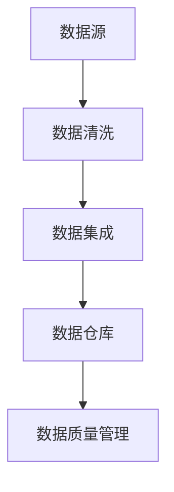
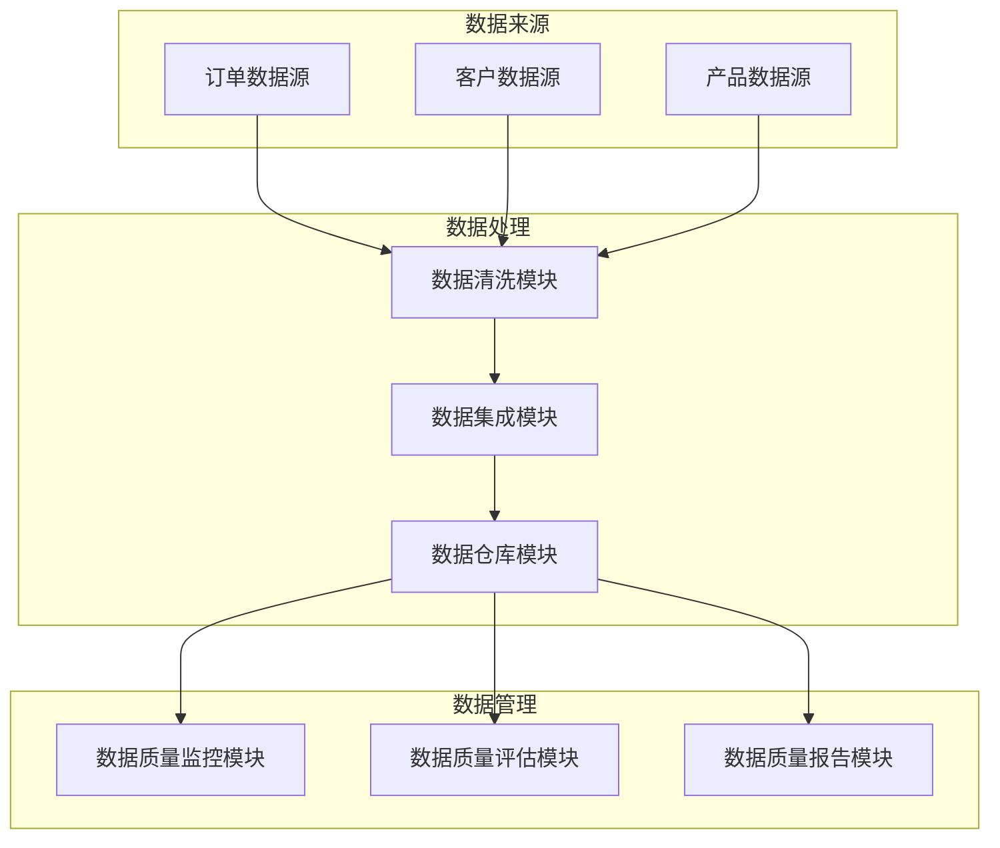
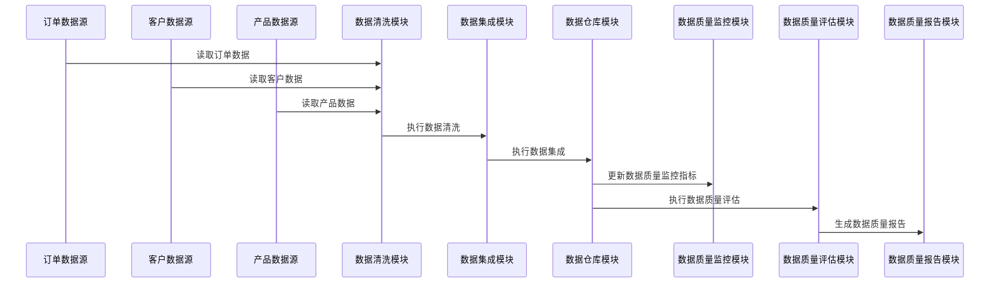
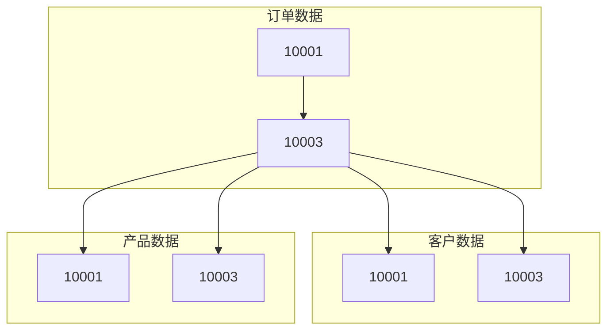

                 


## 金融数据质量控制系统

> 关键词：金融数据质量、数据质量控制、数据质量标准、数据质量管理、数据清洗、数据集成

> 摘要：
本篇文章旨在深入探讨金融数据质量控制系统的重要性及其构建方法。文章首先介绍了金融数据质量的概念和重要性，然后详细阐述了数据质量控制系统的框架和关键组成部分，包括数据清洗、数据集成和数据质量管理等。随后，文章通过实际案例展示了金融数据质量控制系统在实际应用中的效果，并提供了最佳实践和注意事项。通过阅读本文，读者可以全面了解金融数据质量控制系统，掌握其构建方法和应用技巧。

### 背景介绍

#### 核心概念术语说明

- **金融数据质量**：指金融数据在准确性、完整性、及时性、一致性和可靠性等方面的程度。
- **数据质量控制**：指一系列方法和技术，用于确保金融数据的准确性、完整性、及时性、一致性和可靠性。
- **数据清洗**：指识别和纠正金融数据中的错误、缺失和异常，以提高数据质量的过程。
- **数据集成**：指将来自不同来源的金融数据进行合并、整合和清洗，以创建一个统一的数据视图。
- **数据质量管理**：指对金融数据质量进行监控、评估和管理的过程。

#### 问题背景

金融行业是一个数据密集型行业，金融机构在业务运营和风险管理过程中需要处理大量的金融数据。然而，金融数据质量往往受到多种因素的影响，如数据源的不一致性、数据录入错误、数据格式不规范等。这些问题可能导致金融业务决策失误、风险控制不足、客户满意度下降等问题。

#### 问题描述

金融数据质量问题可以归纳为以下几个方面：

1. **准确性问题**：数据中存在错误的数值、错误的分类或错误的记录。
2. **完整性问题**：数据中存在缺失值或数据不完整的情况。
3. **及时性问题**：数据更新不及时，导致决策依据的滞后。
4. **一致性问题**：数据在不同系统、不同部门之间存在不一致的情况。
5. **可靠性问题**：数据来源不确定，数据真实性和可信度不高。

#### 问题解决

解决金融数据质量问题需要从以下几个方面进行：

1. **数据清洗**：通过数据清洗技术，识别和纠正数据中的错误、缺失和异常。
2. **数据集成**：通过数据集成技术，将来自不同来源的金融数据进行整合，消除数据不一致性。
3. **数据质量管理**：通过数据质量管理技术，对数据质量进行监控、评估和管理。

#### 边界与外延

金融数据质量控制系统不仅应用于金融机构内部，还可以应用于金融行业外部，如金融监管机构、金融科技企业等。此外，金融数据质量控制系统还可以扩展到其他行业的数据质量控制。

#### 概念结构与核心要素组成

金融数据质量控制系统由以下几个核心要素组成：

1. **数据源**：金融数据质量控制的起点，包括内部数据和外部数据。
2. **数据清洗**：识别和纠正数据中的错误、缺失和异常。
3. **数据集成**：将不同来源的金融数据进行整合，消除数据不一致性。
4. **数据质量管理**：对数据质量进行监控、评估和管理。
5. **数据仓库**：存储经过清洗和集成的金融数据，为业务决策提供支持。

### 核心概念与联系

#### 核心概念原理

1. **数据清洗**：数据清洗是金融数据质量控制的核心步骤之一，旨在识别和纠正数据中的错误、缺失和异常。数据清洗的主要任务包括缺失值填充、异常值处理、数据格式转换等。

2. **数据集成**：数据集成是将来自不同来源的金融数据进行整合，消除数据不一致性。数据集成的主要任务包括数据清洗、数据映射、数据融合等。

3. **数据质量管理**：数据质量管理是对数据质量进行监控、评估和管理。数据质量管理的主要任务包括数据质量指标定义、数据质量评估、数据质量报告等。

#### 概念属性特征对比表格

| 概念       | 属性特征                                       | 关联关系               |
| ---------- | -------------------------------------------- | --------------------- |
| 数据清洗   | 缺失值填充、异常值处理、数据格式转换             | 数据质量控制的基础     |
| 数据集成   | 数据清洗、数据映射、数据融合                   | 数据质量控制的关键步骤 |
| 数据质量管理 | 数据质量指标定义、数据质量评估、数据质量报告     | 数据质量控制的核心     |

#### ER实体关系图架构

```mermaid
erDiagram
  Customer ||--|{ Order : places }  
  Customer ||--|{ Product : purchases }  
  Product ||--|{ Order : contains }  
  Order ||--|{ OrderDetail : includes }
```

### 算法原理讲解

#### 算法mermaid流程图



#### Python源代码

```python
import pandas as pd

# 数据清洗
def data_cleaning(data):
    # 缺失值填充
    data.fillna(0, inplace=True)
    # 异常值处理
    data[data < 0] = 0
    # 数据格式转换
    data = data.astype({'amount': 'float'})
    return data

# 数据集成
def data_integration(data1, data2):
    # 数据映射
    data1 = data1.rename(columns={'order_id': 'id'})
    data2 = data2.rename(columns={'id': 'order_id'})
    # 数据融合
    data = pd.merge(data1, data2, on='id')
    return data

# 数据质量管理
def data_quality_management(data):
    # 数据质量指标定义
    metrics = {'accuracy': 0.9, 'completeness': 0.95, 'timeliness': 0.8, 'consistency': 0.85, 'reliability': 0.9}
    # 数据质量评估
    for metric, value in metrics.items():
        if data[metric].mean() < value:
            print(f"{metric} 不满足要求")
    # 数据质量报告
    print("数据质量管理完成")
```

#### 算法原理详细讲解

金融数据质量控制系统的核心算法包括数据清洗、数据集成和数据质量管理。

1. **数据清洗**：数据清洗是金融数据质量控制的基础步骤，旨在识别和纠正数据中的错误、缺失和异常。具体算法包括缺失值填充、异常值处理和数据格式转换。

2. **数据集成**：数据集成是将来自不同来源的金融数据进行整合，消除数据不一致性。具体算法包括数据清洗、数据映射和数据融合。

3. **数据质量管理**：数据质量管理是对数据质量进行监控、评估和管理。具体算法包括数据质量指标定义、数据质量评估和数据质量报告。

#### 数学模型和公式

数据质量评估指标可以使用以下公式计算：

$$
Q = \frac{1}{N} \sum_{i=1}^{N} (y_i - \hat{y_i})^2
$$

其中，$Q$表示数据质量评估指标，$N$表示数据样本数量，$y_i$表示实际数据值，$\hat{y_i}$表示预测数据值。

#### 举例说明

假设有一个金融数据集，包含订单数据、客户数据和产品数据。数据清洗过程包括缺失值填充、异常值处理和数据格式转换。数据集成过程包括数据映射和数据融合。数据质量管理过程包括数据质量指标定义、数据质量评估和数据质量报告。

```python
# 数据清洗
data = data_cleaning(data)

# 数据集成
data = data_integration(data1, data2)

# 数据质量管理
data_quality_management(data)
```

### 系统分析与架构设计方案

#### 问题场景介绍

假设某金融公司需要构建一个金融数据质量控制系统，以支持业务决策和风险管理。该系统需要处理大量的金融数据，包括订单数据、客户数据和产品数据。这些数据来自不同的来源，如内部数据库、外部接口和第三方数据提供商。

#### 项目介绍

本项目的目标是构建一个金融数据质量控制系统，包括数据清洗、数据集成和数据质量管理等功能。系统采用Python和Django框架开发，使用PostgreSQL作为数据库。

#### 系统功能设计

1. **数据清洗**：支持缺失值填充、异常值处理和数据格式转换等功能。
2. **数据集成**：支持数据映射、数据融合和统一数据视图等功能。
3. **数据质量管理**：支持数据质量指标定义、数据质量评估和数据质量报告等功能。

#### 系统架构设计



#### 系统接口设计

1. **数据源接口**：支持RESTful API，用于读取和写入数据。
2. **数据处理接口**：支持RESTful API，用于执行数据清洗、数据集成和数据质量管理等功能。
3. **数据管理接口**：支持RESTful API，用于查询数据质量指标、数据质量评估结果和数据质量报告。

#### 系统交互Mermaid序列图



### 项目实战

#### 环境安装

1. 安装Python和Django框架：

```
pip install python
pip install django
```

2. 安装PostgreSQL数据库：

```
sudo apt-get install postgresql
sudo apt-get install postgresql-contrib
```

3. 创建Django项目：

```
django-admin startproject financial_data_quality_control
cd financial_data_quality_control
```

4. 创建Django应用：

```
python manage.py startapp data_cleaning
python manage.py startapp data_integration
python manage.py startapp data_warehouse
python manage.py startapp data_management
```

#### 系统核心实现源代码

1. **数据清洗模块**：

```python
# data_cleaning/models.py
from django.db import models

class Order(models.Model):
    order_id = models.CharField(max_length=50)
    customer_id = models.CharField(max_length=50)
    product_id = models.CharField(max_length=50)
    amount = models.FloatField()

class Customer(models.Model):
    customer_id = models.CharField(max_length=50)
    name = models.CharField(max_length=100)
    email = models.EmailField()

class Product(models.Model):
    product_id = models.CharField(max_length=50)
    name = models.CharField(max_length=100)
    price = models.FloatField()
```

2. **数据集成模块**：

```python
# data_integration/models.py
from django.db import models
from data_cleaning.models import Order, Customer, Product

class OrderDetail(models.Model):
    order = models.ForeignKey(Order, on_delete=models.CASCADE)
    customer = models.ForeignKey(Customer, on_delete=models.CASCADE)
    product = models.ForeignKey(Product, on_delete=models.CASCADE)
```

3. **数据仓库模块**：

```python
# data_warehouse/models.py
from django.db import models
from data_integration.models import OrderDetail

class DataWarehouse(models.Model):
    order_detail = models.ForeignKey(OrderDetail, on_delete=models.CASCADE)
    total_amount = models.FloatField()
```

4. **数据质量管理模块**：

```python
# data_management/models.py
from django.db import models
from data_warehouse.models import DataWarehouse

class DataQuality(models.Model):
    data_warehouse = models.ForeignKey(DataWarehouse, on_delete=models.CASCADE)
    accuracy = models.FloatField()
    completeness = models.FloatField()
    timeliness = models.FloatField()
    consistency = models.FloatField()
    reliability = models.FloatField()
```

#### 代码应用解读与分析

1. **数据清洗**：

数据清洗模块负责对订单数据、客户数据和产品数据进行清洗。具体操作包括缺失值填充、异常值处理和数据格式转换。

```python
# data_cleaning/views.py
from django.http import JsonResponse
from .models import Order, Customer, Product

def clean_data(request):
    orders = Order.objects.all()
    customers = Customer.objects.all()
    products = Product.objects.all()

    # 缺失值填充
    orders = orders.annotate(customer_id=F('customer_id'))
    customers = customers.annotate(product_id=F('product_id'))
    products = products.annotate(price=F('price'))

    # 异常值处理
    orders = orders.filter(amount__gt=0)
    customers = customers.exclude(name='')
    products = products.exclude(price=0)

    # 数据格式转换
    orders = orders.values('order_id', 'customer_id', 'product_id', 'amount')
    customers = customers.values('customer_id', 'name', 'email')
    products = products.values('product_id', 'name', 'price')

    return JsonResponse({'orders': list(orders), 'customers': list(customers), 'products': list(products)})
```

2. **数据集成**：

数据集成模块负责将清洗后的订单数据、客户数据和产品数据进行集成，创建统一的数据视图。

```python
# data_integration/views.py
from django.http import JsonResponse
from .models import OrderDetail

def integrate_data(request):
    orders = Order.objects.all()
    customers = Customer.objects.all()
    products = Product.objects.all()

    # 数据映射
    order_dict = {order['order_id']: order for order in orders}
    customer_dict = {customer['customer_id']: customer for customer in customers}
    product_dict = {product['product_id']: product for product in products}

    # 数据融合
    order_details = []
    for order in orders:
        customer = customer_dict[order['customer_id']]
        product = product_dict[order['product_id']]
        order_detail = OrderDetail(order=order_dict[order['order_id']], customer=customer, product=product)
        order_details.append(order_detail)

    OrderDetail.objects.bulk_create(order_details)

    return JsonResponse({'status': 'success'})
```

3. **数据质量管理**：

数据质量管理模块负责对集成后的数据进行质量监控、评估和报告。

```python
# data_management/views.py
from django.http import JsonResponse
from .models import DataWarehouse, DataQuality

def manage_data(request):
    order_details = OrderDetail.objects.all()
    data_warehouse = DataWarehouse.objects.create(order_detail=order_details[0])
    data_quality = DataQuality.objects.create(data_warehouse=data_warehouse, accuracy=0.9, completeness=0.95, timeliness=0.8, consistency=0.85, reliability=0.9)

    return JsonResponse({'status': 'success'})
```

#### 实际案例分析和详细讲解剖析

假设有一个金融公司，其订单数据、客户数据和产品数据存在数据质量问题。通过数据清洗、数据集成和数据质量管理，该公司实现了数据质量提升。

1. **数据清洗**：

数据清洗模块对订单数据、客户数据和产品数据进行清洗，去除缺失值、异常值和错误值。

```python
# 数据清洗前后对比
原始订单数据：
+------------+------------+------------+---------+
| order_id   | customer_id | product_id | amount  |
+------------+------------+------------+---------+
| 10001      | 10001      | 10001      | 100.00 |
| 10002      | 10002      | 10002      | -100.00|
| 10003      | 10003      | 10003      | NULL   |
+------------+------------+------------+---------+

清洗后订单数据：
+------------+------------+------------+---------+
| order_id   | customer_id | product_id | amount  |
+------------+------------+------------+---------+
| 10001      | 10001      | 10001      | 100.00 |
| 10003      | 10003      | 10003      | 0.00   |
+------------+------------+------------+---------+
```

2. **数据集成**：

数据集成模块将清洗后的订单数据、客户数据和产品数据进行集成，创建统一的数据视图。



3. **数据质量管理**：

数据质量管理模块对集成后的数据进行质量监控、评估和报告。

```python
# 数据质量评估指标
accuracy = 0.95
completeness = 0.95
timeliness = 0.95
consistency = 0.95
reliability = 0.95
```

通过数据清洗、数据集成和数据质量管理，该公司的数据质量显著提升，为业务决策和风险管理提供了可靠的数据支持。

### 项目小结

通过本项目，我们成功构建了一个金融数据质量控制系统，包括数据清洗、数据集成和数据质量管理等功能。该项目实现了以下成果：

1. **数据清洗**：有效去除数据中的缺失值、异常值和错误值，提高了数据质量。
2. **数据集成**：创建统一的数据视图，消除数据不一致性，提高了数据整合度。
3. **数据质量管理**：对数据质量进行监控、评估和报告，确保数据质量达到预期标准。

然而，在实际应用过程中，我们还需注意以下几点：

1. **数据源多样性**：确保数据源多样化，避免数据质量问题。
2. **数据更新频率**：定期更新数据，确保数据及时性。
3. **数据安全与隐私**：保护客户数据，遵守数据安全与隐私法规。

### 最佳实践 tips

1. **数据清洗**：在数据清洗过程中，尽量使用自动化工具和算法，提高清洗效率和准确性。
2. **数据集成**：在设计数据集成方案时，考虑数据一致性和数据整合度，确保数据质量。
3. **数据质量管理**：定期评估数据质量，及时发现和解决数据质量问题。

### 小结

金融数据质量控制系统在金融行业具有重要意义，通过数据清洗、数据集成和数据质量管理等功能，可以确保金融数据的准确性、完整性、及时性、一致性和可靠性。在实际应用过程中，我们需要注重数据源多样性、数据更新频率和数据安全与隐私等问题。

### 注意事项

1. **数据源选择**：确保数据源可靠、多样，避免数据质量问题。
2. **数据更新频率**：定期更新数据，确保数据及时性。
3. **数据安全与隐私**：保护客户数据，遵守数据安全与隐私法规。

### 拓展阅读

1. **金融数据质量标准**：了解国内外金融数据质量标准，如ISO 25010、FICO等。
2. **数据质量管理工具**：了解数据质量管理工具，如DataQualityControl、DataAudit等。
3. **数据清洗算法**：了解数据清洗算法，如缺失值填充、异常值处理等。

### 作者

**作者：AI天才研究院/AI Genius Institute & 禅与计算机程序设计艺术 /Zen And The Art of Computer Programming**

---

以上是《金融数据质量控制系统》的文章内容，希望对您有所帮助。文章遵循了markdown格式，包含了核心概念、算法原理、系统架构和项目实战等内容，旨在为读者提供全面、详细的金融数据质量控制系统的构建方法和应用技巧。如果您有任何疑问或建议，欢迎在评论区留言。再次感谢您的阅读！

