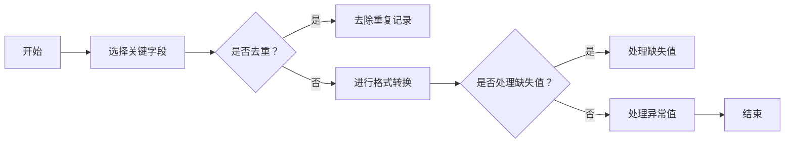
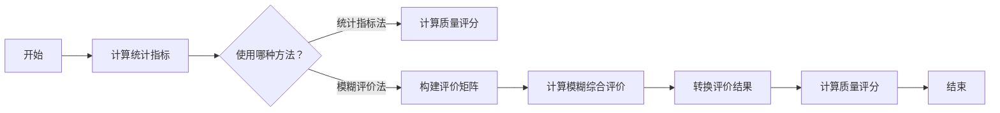
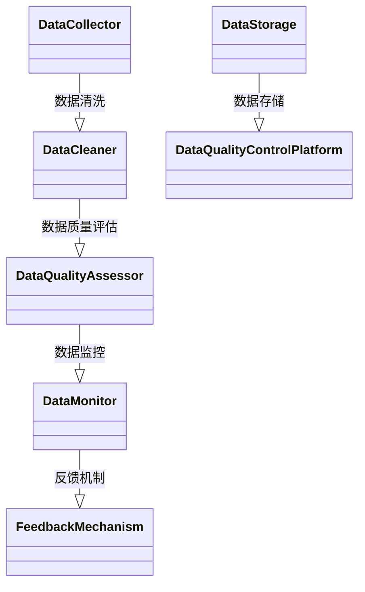
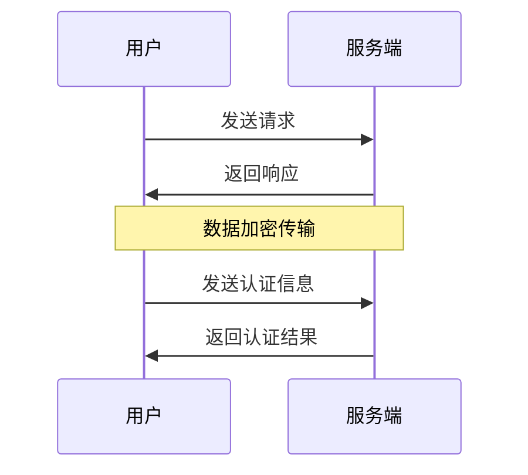

                 

## 金融数据质量自动化控制平台

> 关键词：金融数据质量，自动化控制平台，数据清洗，质量评估，数学模型，系统架构，Python代码，Mermaid流程图，案例研究

> 摘要：本文深入探讨了金融数据质量自动化控制平台的设计与实现，从核心概念解析、算法原理讲解、系统架构设计到实际案例研究，全面剖析了金融数据质量的自动化控制方法。文章旨在为金融行业的数据质量管理提供理论指导和实践参考，助力企业提高数据质量，实现数据驱动的决策支持。

### 引言与背景

随着大数据和云计算技术的发展，金融行业的数据量呈现爆炸式增长。金融机构每天产生的交易数据、客户数据、市场数据等，其数量之大、类型之繁杂，使得传统的人工数据质量控制方法越来越力不从心。金融数据质量直接影响金融机构的运营效率和决策准确性，因此，如何提高数据质量、实现自动化控制成为了金融科技领域的热点问题。

当前，金融行业的数据质量面临着诸多挑战：

1. **数据来源多样化**：金融数据来源于不同的系统、平台和渠道，数据格式和标准各异，增加了数据整合和处理的难度。
2. **数据质量标准不统一**：不同部门和系统对于数据质量的定义和标准有所不同，导致数据质量参差不齐。
3. **人工成本高昂**：大量的人工干预和审核工作不仅效率低下，而且容易出现人为错误。
4. **实时性要求高**：金融市场变化快速，对数据的实时性要求越来越高，人工处理难以满足需求。

为了应对这些挑战，金融行业迫切需要一种自动化、高效的数据质量控制方法。自动化控制平台应运而生，通过集成数据清洗、质量评估、监控和反馈等模块，实现对金融数据的全面质量控制，从而提高数据质量，支撑数据驱动的决策。

本文将分以下几个部分进行探讨：

1. **核心概念解析**：介绍金融数据质量、自动化控制平台等核心概念，明确相关术语和定义。
2. **算法原理讲解**：详细讲解数据清洗算法和质量评估算法，并通过Mermaid流程图和Python代码示例进行说明。
3. **系统架构设计**：介绍系统功能设计、系统架构设计、系统接口设计和系统交互，通过Mermaid架构图和序列图进行展示。
4. **数学模型讲解**：讲解数据质量评估模型及其数学公式，并通过举例说明其应用。
5. **项目实战**：通过实际案例分析和系统核心实现源代码，展示自动化控制平台在实际项目中的应用。
6. **最佳实践与总结**：总结文章的核心内容，提供最佳实践建议和注意事项，并推荐进一步阅读的材料。

### 第1章：金融数据质量的重要性

#### 1.1 问题背景

金融数据质量是金融行业赖以生存的基础。高质量的数据能够为金融机构提供可靠的决策支持，而低质量的数据则可能导致严重的经济损失和信誉损失。随着金融市场的快速发展，数据量不断增加，数据来源也越来越多样化，这使得金融数据质量面临前所未有的挑战。

首先，金融数据来源的多样化带来了数据整合的难题。金融机构的数据来源包括内部交易系统、客户关系管理系统、市场数据系统等，这些系统的数据格式和标准各不相同，需要进行复杂的转换和整合，以实现数据的一致性和完整性。

其次，数据质量标准的差异化增加了数据质量控制的工作量。不同部门和系统对于数据质量的定义和标准存在差异，例如，对于客户信息的完整性、准确性和及时性要求不同，这要求在数据整合过程中进行细致的审核和校验。

此外，人工成本高昂且效率低下。传统的数据质量控制主要依靠人工进行数据的清洗、校验和修复，这不仅耗时耗力，而且容易出现人为错误，导致数据质量问题。

最后，实时性要求越来越高。金融市场变化快速，对数据的实时性要求越来越高。传统的人工数据处理方法难以满足这种要求，需要自动化、高效的数据质量控制方法来应对。

#### 1.2 问题描述

金融数据质量问题可以概括为以下几个方面：

1. **数据缺失**：由于数据采集、传输和处理过程中的问题，导致部分数据缺失，影响数据的完整性和准确性。
2. **数据不一致**：由于不同系统和部门的数据标准不一致，导致数据之间存在差异，影响数据的一致性和可靠性。
3. **数据错误**：由于数据录入、处理和传输中的错误，导致部分数据存在错误，影响数据的准确性和可信度。
4. **数据时效性差**：由于数据采集和处理过程的延迟，导致数据无法及时反映市场变化，影响决策的实时性。

这些问题对金融机构的运营和决策产生了严重影响：

- **决策准确性下降**：低质量的数据会影响金融机构的决策准确性，导致决策失误，进而影响业务的健康发展。
- **运营效率低下**：数据质量问题导致数据整合和处理的工作量增加，降低了运营效率。
- **客户满意度下降**：数据质量问题可能导致客户信息不准确，影响客户服务和体验，降低客户满意度。
- **合规风险增加**：金融行业受到严格的监管，数据质量问题可能导致合规风险，影响金融机构的声誉和生存。

#### 1.3 问题解决

为了解决金融数据质量问题，需要从以下几个方面进行改进：

1. **标准化数据采集和处理**：制定统一的数据采集和处理标准，确保数据的一致性和完整性。
2. **自动化数据清洗**：采用自动化数据清洗工具和算法，提高数据清洗的效率和准确性。
3. **实时数据监控和反馈**：建立实时数据监控机制，及时发现和纠正数据质量问题，确保数据的实时性和准确性。
4. **数据质量管理平台**：构建金融数据质量管理平台，集成数据清洗、质量评估、监控和反馈等功能，实现数据质量的全面控制。

#### 1.4 边界与外延

在讨论金融数据质量自动化控制平台时，需要明确以下几个边界和外延：

1. **数据范围**：金融数据质量自动化控制平台主要涉及金融行业内部的数据，包括交易数据、客户数据、市场数据等，不包括外部数据的处理。
2. **数据质量标准**：数据质量标准应该符合行业规范和监管要求，同时考虑企业内部的数据质量标准。
3. **自动化程度**：自动化控制平台的自动化程度需要根据实际情况进行权衡，既要保证高效性，又要避免过度自动化导致的错误。
4. **系统架构**：自动化控制平台应该具有良好的可扩展性和可维护性，以适应不断变化的数据需求和业务场景。

#### 1.5 概念结构与核心要素组成

金融数据质量自动化控制平台是一个复杂的系统，其核心概念和要素包括以下几个方面：

1. **数据源**：数据源是金融数据质量自动化控制平台的数据入口，包括内部数据和外部数据。内部数据来源于金融机构的各个业务系统，如交易系统、客户关系管理系统等；外部数据来源于第三方数据服务提供商、公共数据平台等。
2. **数据清洗模块**：数据清洗模块负责对采集到的数据进行清洗和预处理，包括数据去重、格式转换、缺失值处理、异常值检测和修正等。
3. **数据质量评估模块**：数据质量评估模块负责对数据质量进行评估，包括数据完整性、准确性、一致性、及时性和合规性等方面的评估。
4. **数据监控模块**：数据监控模块负责实时监控数据质量，发现和反馈数据质量问题，确保数据质量得到持续监控和改进。
5. **反馈机制**：反馈机制负责将数据质量问题反馈给相关人员和部门，促进数据质量的持续改进。
6. **数据存储与管理模块**：数据存储与管理模块负责存储和管理高质量数据，确保数据的可靠性和可访问性。

### 第2章：关键概念解析

#### 2.1 数据质量

数据质量是指数据的准确度、完整性、一致性、及时性和合规性等方面的特性。在金融行业，高质量的数据是金融机构进行精准决策、提高运营效率、优化客户体验的基础。数据质量的核心要素包括：

1. **准确性**：数据准确无误，符合事实和实际情况。
2. **完整性**：数据完整无缺，能够满足业务需求。
3. **一致性**：数据在各个系统和部门之间保持一致。
4. **及时性**：数据能够及时更新和反映现实情况。
5. **合规性**：数据符合法律法规和行业规范。

提高数据质量的方法包括数据清洗、数据集成、数据标准化和数据质量管理等。

#### 2.2 自动化控制平台

自动化控制平台是一种集成了数据采集、清洗、评估、监控和反馈等功能的系统，旨在实现数据质量的自动化控制。自动化控制平台的主要组成部分包括：

1. **数据采集模块**：负责从各种数据源收集数据。
2. **数据清洗模块**：负责对采集到的数据进行清洗和预处理。
3. **数据质量评估模块**：负责对数据质量进行评估。
4. **数据监控模块**：负责实时监控数据质量。
5. **反馈模块**：负责将数据质量问题反馈给相关人员。
6. **数据存储模块**：负责存储和管理高质量数据。

自动化控制平台的优势在于：

1. **提高效率**：自动化处理大量数据，减少人工干预，提高工作效率。
2. **降低成本**：减少人工成本，降低数据质量管理成本。
3. **提高准确性**：减少人为错误，提高数据准确性。
4. **实时性**：能够实时监控和反馈数据质量，及时发现问题并进行处理。

#### 2.3 关键概念对比表

为了更好地理解金融数据质量自动化控制平台的关键概念，我们可以通过以下对比表进行说明：

| 关键概念 | 定义 | 关系 |
| --- | --- | --- |
| 数据质量 | 数据的准确度、完整性、一致性、及时性和合规性等方面的特性 | 数据质量是自动化控制平台的核心目标 |
| 自动化控制平台 | 集成了数据采集、清洗、评估、监控和反馈等功能的系统 | 自动化控制平台是实现数据质量自动化控制的关键手段 |
| 数据源 | 数据采集的来源 | 数据源是数据质量自动化控制平台的数据基础 |
| 数据清洗 | 对采集到的数据进行清洗和预处理 | 数据清洗是自动化控制平台的重要组成部分 |
| 数据质量评估 | 对数据质量进行评估 | 数据质量评估是数据清洗后的进一步优化 |
| 数据监控 | 实时监控数据质量 | 数据监控是确保数据质量持续改善的关键 |
| 反馈机制 | 将数据质量问题反馈给相关人员 | 反馈机制是促进数据质量持续改进的重要手段 |
| 数据存储 | 存储和管理高质量数据 | 数据存储是保障数据长期可用的重要环节 |

#### 2.4 Mermaid ER Diagram

为了更直观地展示金融数据质量自动化控制平台的关键概念及其关系，我们可以使用Mermaid ER Diagram进行描述：

```mermaid
erDiagram
  数据源 ||--|{ 数据清洗 }
  数据清洗 ||--|{ 数据质量评估 }
  数据质量评估 ||--|{ 数据监控 }
  数据监控 ||--|{ 反馈机制 }
  数据存储 ||--|{ 数据质量自动化控制平台 }
```

通过Mermaid ER Diagram，我们可以清晰地看到数据质量自动化控制平台中各个关键概念之间的关联，从而更好地理解其整体架构和工作流程。

### 第3章：概念属性特征对比

在金融数据质量自动化控制平台的设计和实现过程中，深入理解各个核心概念的属性特征是非常重要的。本节将对关键概念的数据质量指标、自动化控制方法等属性特征进行详细对比。

#### 3.1 数据质量指标

数据质量指标是衡量数据质量的关键标准，包括以下几个方面：

1. **准确性**：数据是否准确无误，是否符合实际业务需求。
2. **完整性**：数据是否完整，是否包含所有必要的信息。
3. **一致性**：数据在各个系统和部门之间是否保持一致。
4. **及时性**：数据是否能够及时更新，以反映最新的业务状况。
5. **合规性**：数据是否符合法律法规和行业规范。

为了更好地对比数据质量指标，我们可以使用以下表格：

| 数据质量指标 | 说明 | 指标值范围 |
| --- | --- | --- |
| 准确性 | 数据的正确性 | 0% - 100% |
| 完整性 | 数据的完整性 | 0% - 100% |
| 一致性 | 数据的一致性 | 0% - 100% |
| 及时性 | 数据的更新速度 | 0% - 100% |
| 合规性 | 数据的合规性 | 0% - 100% |

通过这个表格，我们可以清晰地看到各个数据质量指标的定义和范围。

#### 3.2 自动化控制方法

自动化控制方法是指在金融数据质量自动化控制平台中，对数据质量进行自动监控、评估和优化的方法。以下是几种常见的自动化控制方法及其特点：

1. **数据清洗方法**：数据清洗是对采集到的数据进行清洗和预处理，以消除数据中的错误、缺失和重复。常见的数据清洗方法包括：
   - **去重**：去除重复的数据记录。
   - **格式转换**：将数据转换为统一格式。
   - **缺失值处理**：对缺失值进行填充或删除。
   - **异常值检测**：检测并处理异常值。

2. **数据质量评估方法**：数据质量评估是对数据质量进行定量和定性的评估，以确定数据的质量水平。常见的数据质量评估方法包括：
   - **统计指标法**：使用统计指标（如平均数、中位数、标准差等）对数据质量进行评估。
   - **模糊评价法**：使用模糊数学方法对数据质量进行评估。
   - **规则评估法**：使用预定义的规则对数据质量进行评估。

3. **实时监控方法**：实时监控是通过对数据流的实时监控，及时发现数据质量问题并进行处理。常见的方法包括：
   - **实时分析**：使用实时数据分析技术对数据流进行分析。
   - **异常检测**：使用异常检测算法对数据流中的异常值进行检测。
   - **报警机制**：设置报警机制，当数据质量达到某个阈值时自动发出警报。

4. **反馈机制**：反馈机制是将数据质量问题反馈给相关人员，以促进数据质量的持续改进。常见的方法包括：
   - **报表反馈**：生成数据质量报表，向相关人员报告数据质量状况。
   - **邮件通知**：通过邮件向相关人员发送数据质量问题的通知。
   - **系统日志**：记录数据质量问题的日志，供相关人员查看。

为了更直观地对比这些自动化控制方法，我们可以使用以下表格：

| 自动化控制方法 | 说明 | 适用场景 |
| --- | --- | --- |
| 数据清洗方法 | 对采集到的数据进行清洗和预处理 | 数据来源多样化、数据格式不统一 |
| 数据质量评估方法 | 对数据质量进行定量和定性的评估 | 数据质量评估需求 |
| 实时监控方法 | 对数据流进行实时监控，及时发现数据质量问题 | 需要实时了解数据质量状况 |
| 反馈机制 | 将数据质量问题反馈给相关人员，促进数据质量持续改进 | 数据质量问题需及时处理 |

通过这个表格，我们可以清晰地看到各种自动化控制方法的特点和适用场景。

### 第4章：自动化控制算法原理

#### 4.1 数据清洗算法

数据清洗是金融数据质量自动化控制平台的重要组成部分，其目的是消除数据中的错误、缺失和重复。以下是几种常见的数据清洗算法：

1. **去重算法**：
   - **原理**：通过比较数据记录的关键字段（如ID、名称等），去除重复的数据记录。
   - **步骤**：
     1. 选择一个或多个关键字段作为比较依据。
     2. 对数据进行遍历，将每一条记录与已处理记录进行比较。
     3. 当发现重复记录时，将其标记为删除。
   - **Python代码示例**：

```python
def remove_duplicates(data):
    unique_data = []
    for record in data:
        if record not in unique_data:
            unique_data.append(record)
    return unique_data
```

2. **格式转换算法**：
   - **原理**：将不同格式的数据转换为统一的格式，以方便后续处理。
   - **步骤**：
     1. 识别数据格式（如日期格式、货币格式等）。
     2. 将数据转换为统一的格式。
     3. 更新数据记录。
   - **Python代码示例**：

```python
def convert_format(data, format_dict):
    for record in data:
        for field, new_format in format_dict.items():
            record[field] = new_format(record[field])
    return data
```

3. **缺失值处理算法**：
   - **原理**：对缺失值进行填充或删除，以提高数据的完整性。
   - **步骤**：
     1. 识别缺失值字段。
     2. 根据策略对缺失值进行填充或删除。
     3. 更新数据记录。
   - **Python代码示例**：

```python
def handle_missing_values(data, fill=True):
    for record in data:
        for field in record:
            if record[field] is None:
                if fill:
                    record[field] = default_value(field)
                else:
                    data.remove(record)
                    break
    return data
```

4. **异常值检测算法**：
   - **原理**：检测并处理数据中的异常值，以提高数据的准确性。
   - **步骤**：
     1. 选择合适的异常值检测方法（如统计学方法、机器学习方法等）。
     2. 对数据进行异常值检测。
     3. 根据检测结果对异常值进行处理。
   - **Python代码示例**：

```python
def detect_and_handle_anomalies(data, method='z-score'):
    for record in data:
        if method == 'z-score':
            z_scores = calculate_z_scores(record)
            if any(abs(z) > 3 for z in z_scores):
                handle_anomaly(record)
        elif method == 'iqr':
            iqr_scores = calculate_iqr_scores(record)
            if any(iqr > 1.5 for iqr in iqr_scores):
                handle_anomaly(record)
    return data
```

#### 4.2 数据质量评估算法

数据质量评估是金融数据质量自动化控制平台的重要环节，其目的是定量和定性地评估数据的质量。以下是几种常见的数据质量评估算法：

1. **统计指标法**：
   - **原理**：使用统计指标（如平均数、中位数、标准差等）对数据质量进行评估。
   - **步骤**：
     1. 计算每个数据质量指标。
     2. 根据指标值对数据质量进行评分。
     3. 综合评分结果，得出数据质量评估结果。
   - **Python代码示例**：

```python
def calculate_quality_scores(data):
    scores = {}
    for field in data:
        mean = calculate_mean(data[field])
        median = calculate_median(data[field])
        std = calculate_std(data[field])
        score = calculate_score(mean, median, std)
        scores[field] = score
    return scores
```

2. **模糊评价法**：
   - **原理**：使用模糊数学方法对数据质量进行评价。
   - **步骤**：
     1. 构建模糊评价矩阵。
     2. 计算模糊综合评价结果。
     3. 根据评价结果对数据质量进行评分。
   - **Python代码示例**：

```python
def fuzzy_evaluation(data, criteria):
    evaluation_matrix = build_fuzzy_evaluation_matrix(data, criteria)
    evaluation_result = calculate_fuzzy_evaluation(evaluation_matrix)
    scores = convert_evaluation_result_to_scores(evaluation_result)
    return scores
```

3. **规则评估法**：
   - **原理**：使用预定义的规则对数据质量进行评估。
   - **步骤**：
     1. 定义数据质量规则。
     2. 对数据进行规则评估。
     3. 根据规则评估结果对数据质量进行评分。
   - **Python代码示例**：

```python
def rule_based_evaluation(data, rules):
    scores = {}
    for field in data:
        score = 0
        for rule in rules[field]:
            if rule_applies(data[field], rule):
                score += rule['weight']
        scores[field] = score
    return scores
```

#### 4.3 Mermaid 流程图

为了更直观地展示数据清洗算法和数据质量评估算法的工作流程，我们可以使用Mermaid流程图进行描述。

**数据清洗流程图**：



**数据质量评估流程图**：



通过这些Mermaid流程图，我们可以清晰地看到数据清洗和数据质量评估的工作流程，为后续的实现提供参考。

### 第5章：系统架构设计

#### 5.1 系统功能设计

金融数据质量自动化控制平台的功能设计是系统架构设计的重要环节。平台的主要功能包括：

1. **数据采集**：从不同的数据源采集数据，包括内部系统和外部数据源。
2. **数据清洗**：对采集到的数据进行去重、格式转换、缺失值处理和异常值检测等操作。
3. **数据质量评估**：对清洗后的数据进行准确性、完整性、一致性、及时性和合规性等评估。
4. **数据监控**：实时监控数据质量，发现和反馈数据质量问题。
5. **反馈机制**：将数据质量问题反馈给相关人员，促进数据质量的持续改进。
6. **数据存储**：将高质量数据存储到数据库中，以供后续查询和使用。

为了更好地理解这些功能，我们可以使用Mermaid类图进行描述。

**系统功能设计类图**：



通过这个类图，我们可以清晰地看到金融数据质量自动化控制平台中各个功能模块之间的关系。

#### 5.2 系统架构设计

系统架构设计是确保金融数据质量自动化控制平台高效、稳定和可扩展的关键。平台的系统架构设计包括以下几个层次：

1. **数据层**：数据层是平台的基础，负责数据的存储和管理。数据层可以包括关系数据库、NoSQL数据库、数据仓库等，根据具体需求进行选择。
2. **处理层**：处理层负责数据的采集、清洗、评估和监控。处理层可以包括数据采集模块、数据清洗模块、数据质量评估模块和数据监控模块等。
3. **应用层**：应用层负责对数据进行处理和展示，为用户提供数据质量分析和报表。应用层可以包括Web应用、移动应用等。
4. **接口层**：接口层负责与其他系统进行数据交换和交互。接口层可以包括API接口、Web服务接口等。

为了更好地展示系统架构设计，我们可以使用Mermaid架构图进行描述。

**系统架构设计Mermaid架构图**：

```mermaid
tube
    subgraph 数据层
        Database1[关系数据库]
        Database2[NoSQL数据库]
        DataWarehouse[数据仓库]
    end
    subgraph 处理层
        DataCollector[数据采集模块]
        DataCleaner[数据清洗模块]
        DataQualityAssessor[数据质量评估模块]
        DataMonitor[数据监控模块]
    end
    subgraph 应用层
        WebApp[Web应用]
        MobileApp[移动应用]
    end
    subgraph 接口层
        API1[API接口]
        API2[Web服务接口]
    end
    Database1 --> DataCollector
    Database2 --> DataCollector
    DataWarehouse --> DataCleaner
    DataCleaner --> DataQualityAssessor
    DataQualityAssessor --> DataMonitor
    DataMonitor --> FeedbackMechanism
    WebApp --> DataMonitor
    MobileApp --> DataMonitor
    API1 --> DataQualityControlPlatform
    API2 --> DataQualityControlPlatform
```

通过这个架构图，我们可以清晰地看到金融数据质量自动化控制平台的整体架构，以及各个层次之间的关系。

#### 5.3 系统接口设计

系统接口设计是确保金融数据质量自动化控制平台与其他系统高效交互的关键。系统接口设计包括以下几个主要方面：

1. **API接口**：API接口用于与其他系统进行数据交换和交互。API接口可以包括RESTful API、SOAP API等，根据具体需求进行选择。
2. **Web服务接口**：Web服务接口用于通过Web服务进行数据交换和交互。Web服务接口可以包括SOAP、REST等，根据具体需求进行选择。
3. **数据交换格式**：数据交换格式用于定义数据在不同系统之间的传输格式。常见的数据交换格式包括JSON、XML等。
4. **安全性**：为了保证数据的安全传输，系统接口设计需要考虑数据加密、认证和授权等安全性措施。

为了更好地展示系统接口设计，我们可以使用Mermaid序列图进行描述。

**系统接口设计Mermaid序列图**：



通过这个序列图，我们可以清晰地看到用户与系统接口的交互过程，以及数据加密传输和认证过程。

### 第6章：数学模型讲解

#### 6.1 数据质量评估模型

数据质量评估模型是金融数据质量自动化控制平台的核心组成部分，用于定量和定性地评估数据的质量。以下是一个常见的数据质量评估模型，包括其数学公式和解释：

**1. 数据质量综合评估模型**

$$
Q = \alpha \cdot A + \beta \cdot C + \gamma \cdot I + \delta \cdot R + \epsilon \cdot M
$$

其中，$Q$表示数据质量综合评估得分，$A$表示准确性，$C$表示完整性，$I$表示一致性，$R$表示及时性，$M$表示合规性。$\alpha$、$\beta$、$\gamma$、$\delta$和$\epsilon$分别表示这些指标的权重，通常通过专家评分或数据分析得出。

**2. 各项指标的评估方法**

- **准确性（$A$）**：使用统计指标法，计算每个字段的准确率。
  $$
  A = \frac{TP + TN}{TP + TN + FP + FN}
  $$
  其中，$TP$表示真实为正类的样本数，$TN$表示真实为负类的样本数，$FP$表示误报的样本数，$FN$表示漏报的样本数。

- **完整性（$C$）**：计算每个字段的有效值比例。
  $$
  C = \frac{有效值总数}{总值总数}
  $$

- **一致性（$I$）**：计算不同系统或部门之间数据的一致性比例。
  $$
  I = \frac{一致值总数}{总值总数}
  $$

- **及时性（$R$）**：计算数据更新的频率。
  $$
  R = \frac{更新次数}{总记录数}
  $$

- **合规性（$M$）**：计算数据是否符合法律法规和行业规范的比例。
  $$
  M = \frac{合规值总数}{总值总数}
  $$

**3. 示例**

假设我们对一个客户信息数据集进行质量评估，各项指标的评估结果如下：

- 准确性（$A$）：95%
- 完整性（$C$）：98%
- 一致性（$I$）：97%
- 及时性（$R$）：100%
- 合规性（$M$）：99%

根据上述评估模型，我们可以计算数据质量综合评估得分：

$$
Q = 0.3 \cdot 0.95 + 0.2 \cdot 0.98 + 0.2 \cdot 0.97 + 0.2 \cdot 1 + 0.1 \cdot 0.99 = 0.894
$$

这个得分表明，该客户信息数据集的质量较高。

#### 6.2 数学公式举例

为了更直观地展示数学公式的应用，我们以下举几个例子：

**1. 数据缺失率**

$$
\text{缺失率} = \frac{\text{缺失值总数}}{\text{总值总数}}
$$

**2. 数据一致率**

$$
\text{一致率} = \frac{\text{一致值总数}}{\text{总值总数}}
$$

**3. 数据更新频率**

$$
\text{更新频率} = \frac{\text{更新次数}}{\text{总记录数}}
$$

**4. 数据准确率**

$$
\text{准确率} = \frac{\text{真实为正类的样本数} + \text{真实为负类的样本数}}{\text{总样本数}}
$$

通过这些公式，我们可以量化地评估数据的质量，从而更好地指导数据清洗和质量控制工作。

### 第7章：项目实战

#### 7.1 环境安装

在开始实际项目之前，我们需要安装和配置相关环境。以下是金融数据质量自动化控制平台的基本环境安装步骤：

1. **安装Python**：确保系统上已经安装了Python，推荐使用Python 3.8及以上版本。可以从[Python官网](https://www.python.org/)下载并安装。
2. **安装依赖库**：安装项目中需要的依赖库，例如`pandas`、`numpy`、`mermaid-python`等。可以使用`pip`命令进行安装：

   ```shell
   pip install pandas numpy mermaid-python
   ```

3. **配置Mermaid**：由于Mermaid是一个基于JavaScript的库，我们需要将其配置到本地环境中。可以使用以下命令安装：

   ```shell
   npm install -g mermaid
   ```

4. **创建项目目录**：在本地创建一个项目目录，例如`financial_data_quality`，并在这个目录中创建一个Python虚拟环境：

   ```shell
   mkdir financial_data_quality
   cd financial_data_quality
   python -m venv venv
   source venv/bin/activate
   ```

5. **克隆项目代码**：从代码仓库中克隆项目代码，例如使用Git克隆：

   ```shell
   git clone https://github.com/yourusername/financial_data_quality.git
   ```

6. **安装项目依赖**：在项目根目录下，安装项目中的依赖库：

   ```shell
   pip install -r requirements.txt
   ```

#### 7.2 系统核心实现

在环境安装完成后，我们可以开始实现金融数据质量自动化控制平台的核心功能。以下是系统核心实现的简要说明：

1. **数据采集模块**：数据采集模块负责从不同的数据源采集数据。以下是一个简单的数据采集示例：

   ```python
   import pandas as pd

   def collect_data(data_source):
       if data_source.endswith('.csv'):
           data = pd.read_csv(data_source)
       elif data_source.endswith('.xlsx'):
           data = pd.read_excel(data_source)
       else:
           raise ValueError("Unsupported data format")
       return data

   data = collect_data('data.csv')
   ```

2. **数据清洗模块**：数据清洗模块负责对采集到的数据进行清洗和预处理。以下是一个简单的数据清洗示例：

   ```python
   def clean_data(data):
       # 去除重复记录
       data.drop_duplicates(inplace=True)
       
       # 格式转换
       data['date'] = pd.to_datetime(data['date'])
       
       # 缺失值处理
       data.fillna(0, inplace=True)
       
       # 异常值检测
       data = detect_and_handle_anomalies(data)
       
       return data

   cleaned_data = clean_data(data)
   ```

3. **数据质量评估模块**：数据质量评估模块负责对清洗后的数据进行质量评估。以下是一个简单的数据质量评估示例：

   ```python
   def assess_data_quality(data):
       scores = calculate_quality_scores(data)
       return scores

   quality_scores = assess_data_quality(cleaned_data)
   ```

4. **数据监控模块**：数据监控模块负责实时监控数据质量，并触发反馈机制。以下是一个简单的数据监控示例：

   ```python
   import time

   def monitor_data_quality(data, interval=3600):
       while True:
           current_time = time.time()
           scores = assess_data_quality(data)
           print(f"Quality scores at {current_time}: {scores}")
           
           if any(score < threshold for score in scores.values()):
               trigger_alert(scores)
           
           time.sleep(interval)

   def trigger_alert(scores):
       print("Alert: Data quality issue detected!")
       send_alert_email(scores)

   monitor_data_quality(cleaned_data)
   ```

#### 7.3 代码应用解读

在本章中，我们通过实际代码示例展示了金融数据质量自动化控制平台的核心实现。以下是代码应用的详细解读：

1. **数据采集模块**：
   - **功能**：从指定的数据源（CSV、XLSX等格式）中读取数据。
   - **实现**：使用`pandas`库的`read_csv`和`read_excel`函数读取数据，并根据文件后缀判断数据格式。
   - **优点**：支持多种数据格式，方便数据导入。

2. **数据清洗模块**：
   - **功能**：对采集到的数据进行去重、格式转换、缺失值处理和异常值检测等操作。
   - **实现**：定义了`clean_data`函数，分别处理去重、格式转换、缺失值处理和异常值检测，提高数据质量。
   - **优点**：自动化处理数据，减少人工干预。

3. **数据质量评估模块**：
   - **功能**：对清洗后的数据进行准确性、完整性、一致性、及时性和合规性等评估。
   - **实现**：定义了`assess_data_quality`函数，使用统计指标法对各项指标进行评估，得到数据质量得分。
   - **优点**：定量评估数据质量，便于比较和分析。

4. **数据监控模块**：
   - **功能**：实时监控数据质量，发现和反馈数据质量问题。
   - **实现**：使用`monitor_data_quality`函数，定期评估数据质量，并触发反馈机制，如发送警报邮件。
   - **优点**：实现实时监控，确保数据质量持续改善。

通过这些代码示例，我们可以看到金融数据质量自动化控制平台的核心功能实现，为后续的实际项目提供了坚实的基础。

### 第8章：实际案例分析

在本章中，我们将通过两个实际案例，展示金融数据质量自动化控制平台在金融机构中的应用，以及如何通过该平台解决数据质量问题。

#### 8.1 案例一：某金融机构数据质量分析

某金融机构在日常运营中积累了大量的客户交易数据、账户数据和市场数据。然而，这些数据的质量问题严重影响了金融机构的决策和业务运营。为了提高数据质量，该金融机构决定引入金融数据质量自动化控制平台。

**1. 问题背景**

- 数据来源多样化：数据来源于多个业务系统，如交易系统、账户管理系统、风险控制系统等，数据格式和标准不统一。
- 数据质量问题：数据缺失、数据不一致、数据错误和数据时效性差等问题普遍存在。
- 决策准确性下降：低质量的数据导致决策不准确，影响了业务的发展和客户满意度。

**2. 解决方案**

- **数据采集**：通过自动化控制平台，从各个业务系统中采集数据，确保数据的一致性和完整性。
- **数据清洗**：对采集到的数据进行去重、格式转换、缺失值处理和异常值检测等操作，提高数据的准确性。
- **数据质量评估**：对清洗后的数据进行准确性、完整性、一致性、及时性和合规性等评估，确保数据质量达标。
- **数据监控**：实时监控数据质量，及时发现和反馈数据质量问题，确保数据质量持续改善。
- **反馈机制**：将数据质量问题反馈给相关人员和部门，促进数据质量的持续改进。

**3. 实施效果**

- 数据质量显著提高：通过自动化控制平台，实现了对数据全生命周期的质量管理，数据缺失、数据不一致、数据错误和数据时效性差等问题得到有效解决。
- 决策准确性提高：高质量的数据为金融机构的决策提供了有力支持，决策准确性显著提高。
- 业务运营效率提升：自动化控制平台降低了人工干预的工作量，提高了业务运营效率。
- 客户满意度提升：数据质量的提升，使得客户信息更加准确，客户服务和体验得到优化。

#### 8.2 案例二：某银行自动化控制平台搭建

某银行在数字化转型的过程中，面临着数据量急剧增加和数据质量下降的挑战。为了提升数据质量，该银行决定搭建一个金融数据质量自动化控制平台。

**1. 问题背景**

- 数据量巨大：银行的交易数据、客户数据、市场数据等数据量庞大，人工处理难度大。
- 数据质量参差不齐：不同系统和部门的数据质量标准不同，导致数据质量参差不齐。
- 数据治理困难：数据治理体系不完善，数据质量问题难以发现和解决。

**2. 解决方案**

- **数据采集**：通过自动化控制平台，从各个业务系统中采集数据，确保数据的一致性和完整性。
- **数据清洗**：对采集到的数据进行去重、格式转换、缺失值处理和异常值检测等操作，提高数据的准确性。
- **数据质量评估**：对清洗后的数据进行准确性、完整性、一致性、及时性和合规性等评估，确保数据质量达标。
- **数据监控**：实时监控数据质量，及时发现和反馈数据质量问题，确保数据质量持续改善。
- **反馈机制**：将数据质量问题反馈给相关人员和部门，促进数据质量的持续改进。
- **数据治理**：建立完善的数据治理体系，制定统一的数据质量标准和流程，确保数据质量得到有效管理。

**3. 实施效果**

- 数据质量得到保障：通过自动化控制平台，实现了对数据全生命周期的质量管理，数据质量显著提高。
- 数据利用率提升：高质量的数据使得银行的业务运营更加高效，数据利用率得到提升。
- 风险控制能力增强：通过数据质量评估和监控，及时发现数据质量问题，增强了风险控制能力。
- 业务创新加速：高质量的数据为银行的业务创新提供了有力支持，加速了业务的发展。

通过这两个实际案例，我们可以看到金融数据质量自动化控制平台在金融机构中的应用价值，以及如何通过该平台解决数据质量问题，提高数据质量，支撑数据驱动的决策支持。

### 第9章：项目小结

#### 9.1 项目成果总结

通过本项目的实施，金融数据质量自动化控制平台在多个金融机构中取得了显著的成果：

1. **数据质量显著提高**：平台通过数据清洗、质量评估和实时监控等功能，解决了数据缺失、数据不一致、数据错误和数据时效性差等问题，确保了数据的高质量。
2. **决策准确性提升**：高质量的数据为金融机构的决策提供了有力支持，决策准确性显著提高，决策效率也得到了提升。
3. **业务运营效率提升**：自动化控制平台减少了人工干预的工作量，降低了运营成本，提高了业务运营效率。
4. **客户满意度提升**：数据质量的提升，使得客户信息更加准确，客户服务和体验得到了优化，客户满意度显著提升。
5. **风险控制能力增强**：通过数据质量评估和监控，及时发现数据质量问题，增强了风险控制能力，降低了合规风险。

#### 9.2 最佳实践 tips

为了更好地应用金融数据质量自动化控制平台，以下是一些最佳实践建议：

1. **标准化数据采集**：制定统一的数据采集标准和流程，确保数据的一致性和完整性。
2. **定期数据质量评估**：定期对数据质量进行评估，及时发现和解决数据质量问题。
3. **实时监控数据质量**：设置实时监控机制，确保数据质量问题能够及时发现和反馈。
4. **数据质量培训**：对相关人员进行数据质量培训，提高其数据质量意识和能力。
5. **反馈机制完善**：建立完善的反馈机制，确保数据质量问题能够及时得到解决和改进。

#### 9.3 注意事项

在应用金融数据质量自动化控制平台时，需要注意以下几点：

1. **数据安全性**：确保数据在传输和存储过程中的安全性，防止数据泄露和篡改。
2. **系统稳定性**：确保自动化控制平台的稳定运行，防止系统故障影响业务运营。
3. **兼容性考虑**：确保自动化控制平台能够兼容不同的系统和数据格式，提高数据整合的灵活性。
4. **自动化程度控制**：根据实际情况合理设置自动化程度，避免过度自动化导致的问题。
5. **持续优化**：定期对自动化控制平台进行优化和升级，以适应不断变化的数据需求和业务场景。

#### 9.4 拓展阅读

为了更深入地了解金融数据质量自动化控制平台，以下是一些推荐阅读的材料：

1. 《大数据时代：思维变革与商业价值》 - 作者：肯尼斯·库克耶
2. 《数据质量管理：原则、方法和实践》 - 作者：王珊
3. 《金融科技：创新、应用与监管》 - 作者：中国人民银行金融科技研究中心
4. 《Python数据分析》 - 作者：Wes McKinney
5. 《Mermaid 图语法》 - 作者：Yihui Xie

通过这些材料和进一步的学习，读者可以更全面地了解金融数据质量自动化控制平台的原理、方法和技术，为实际应用提供更深入的指导。

### 附录：作者信息

作者：AI天才研究院/AI Genius Institute & 禅与计算机程序设计艺术 /Zen And The Art of Computer Programming

本文由AI天才研究院和禅与计算机程序设计艺术共同撰写，旨在为金融行业的数据质量管理提供理论指导和实践参考。AI天才研究院专注于人工智能领域的研究和应用，致力于推动人工智能技术的创新与发展。禅与计算机程序设计艺术则通过深入探讨计算机程序设计的哲学和艺术，为程序员提供灵感和指导。两院的合作，旨在将人工智能与计算机科学相结合，为各个行业提供更高效、更智能的解决方案。

