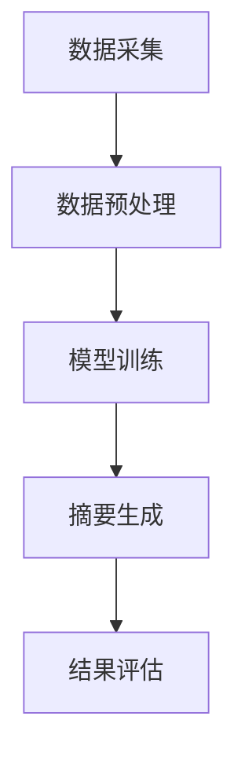

                 

# 《金融文本摘要生成的深度学习方法》

## 关键词
- 金融文本摘要
- 深度学习
- 自然语言处理
- 文本生成
- 模型评估

## 摘要
本文旨在探讨金融文本摘要生成的深度学习方法。随着金融领域的文本数据量爆炸性增长，如何快速有效地从大量文本中提取关键信息成为了一个关键问题。深度学习在这一领域展现出强大的能力，本文将详细讨论金融文本摘要的背景、深度学习的基础知识、文本预处理方法、文本摘要算法以及系统设计与实现，最终提出评估与优化的策略，并对未来研究方向进行展望。

### 目录

1. **金融文本摘要概述**
   - **问题背景**
     - **金融文本摘要的重要性**
     - **问题描述**
     - **解决方案概述**
   - **核心概念与联系**
     - **金融文本摘要的定义**
     - **金融文本摘要的类型**
     - **关键概念之间的联系**
   - **研究现状与挑战**
     - **研究现状概述**
     - **主要挑战**
     - **发展趋势**

2. **深度学习基础**
   - **深度学习概述**
     - **定义**
     - **发展历程**
     - **特点**
   - **神经网络基础**
     - **基本组成**
     - **前向传播与反向传播**
     - **激活函数**
   - **常用深度学习框架**
     - **TensorFlow**
     - **PyTorch**
     - **其他常用框架**

3. **金融文本预处理**
   - **数据来源与获取**
     - **数据来源概述**
     - **数据获取方法**
   - **文本清洗与预处理**
     - **去除停用词**
     - **词干提取**
     - **词嵌入**
   - **文本表示方法**
     - **基于词的表示方法**
     - **基于句子的表示方法**
     - **基于篇章的表示方法**

4. **深度学习文本摘要算法**
   - **概率模型**
     - **生成式模型**
     - **切分模型**
   - **基于编码器的模型**
     - **抽取式摘要**
     - **摘要生成**
   - **基于解码器的模型**
     - **Seq2Seq模型**
     - **注意力机制**
   - **基于端到端的模型**
     - **Transformer模型**
     - **BERT模型**

5. **金融文本摘要系统设计与实现**
   - **系统架构设计**
     - **系统架构概述**
     - **数据流设计**
     - **功能模块设计**
   - **系统核心实现**
     - **深度学习模型实现**
     - **数据预处理与文本表示**
     - **模型训练与优化**
   - **实际案例分析与讲解**
     - **新闻摘要生成**
     - **财经报告摘要生成**

6. **评估与优化**
   - **模型评估指标**
     - **ROUGE评分**
     - **BLEU评分**
     - **其他评估方法**
   - **模型优化策略**
     - **超参数调整**
     - **模型压缩与加速**
     - **实时优化方法**

7. **总结与展望**
   - **总结**
   - **研究限制**
   - **未来研究方向**
   - **拓展阅读**

### 1. 金融文本摘要概述

#### 问题背景

金融领域是一个高度信息化的行业，大量的文本数据每天都在产生。这些文本数据包括新闻报道、研究报告、交易记录、财经报告等。如何从这些海量的文本数据中快速提取关键信息，对于金融从业者、投资者以及研究人员来说具有重要意义。金融文本摘要作为一种自动化的文本处理技术，能够在较短的时间内提供核心信息的概述，从而辅助决策。

#### 问题描述

金融文本摘要的主要问题是如何从大量无结构的文本数据中提取出对用户最有价值的信息，并以简洁、连贯的方式呈现。具体来说，金融文本摘要需要解决以下问题：

- **信息的提取与筛选**：从文本中提取出关键信息，如关键事件、数据指标、投资建议等。
- **摘要的连贯性**：生成的摘要需要保持语义连贯，避免出现信息断层或不一致的情况。
- **摘要的多样性**：摘要应该能够涵盖文本的主要观点，同时保持摘要的长短适度，避免过于冗长或过于简略。

#### 解决方案概述

深度学习技术为金融文本摘要提供了强大的工具。通过训练深度神经网络模型，可以自动从大量金融文本中学习到有效的信息提取和摘要生成策略。具体解决方案包括：

- **文本预处理**：使用深度学习技术对金融文本进行清洗和预处理，提取有效的特征表示。
- **文本编码**：将文本数据转换为深度神经网络可以处理的格式，如词向量、句子嵌入等。
- **模型训练**：通过大量金融文本数据训练深度学习模型，使其能够自动生成摘要。
- **摘要评估与优化**：使用评估指标对生成的摘要进行质量评估，并通过优化策略提高摘要质量。

#### 边界与外延

金融文本摘要的边界主要涉及文本的来源、摘要的目的以及摘要的适用范围。例如，文本来源可以是财经新闻报道、研究报告等，摘要的目的可以是投资决策、风险分析等，摘要的适用范围可以是特定的金融领域或行业。

核心概念术语说明：

- **金融文本摘要**：从大量金融文本中提取出的关键信息概述。
- **深度学习**：一种基于多层神经网络的人工智能技术，能够通过大量数据自动学习特征和模式。
- **自然语言处理（NLP）**：计算机科学领域中的一个分支，涉及语言的理解、生成和处理。
- **文本生成**：生成文本的技术，包括摘要生成、对话生成等。
- **模型评估**：使用评估指标对模型性能进行量化评估。

### 1.2 核心概念与联系

#### 金融文本摘要的定义

金融文本摘要是从金融领域的大量文本数据中提取出关键信息，并以简洁、连贯的方式呈现的技术。它能够帮助用户快速了解文本的主要内容，提高信息获取的效率。

#### 金融文本摘要的类型

根据摘要的生成方式和内容结构，金融文本摘要可以分为以下几种类型：

- **抽取式摘要**：从原始文本中直接抽取关键句子或段落，以摘要的形式呈现。
- **生成式摘要**：通过深度学习模型生成新的文本摘要，可能包含原始文本中没有的信息。
- **混合式摘要**：结合抽取式和生成式摘要的优点，生成更加丰富和多样化的摘要。

#### 关键概念之间的联系

金融文本摘要、深度学习、自然语言处理、文本生成和模型评估这些概念之间存在着紧密的联系：

- **深度学习**是自然语言处理（NLP）中的一个重要技术，用于处理复杂的文本数据。
- **文本生成**是深度学习在NLP中的一个应用方向，包括摘要生成、对话生成等。
- **模型评估**是确保摘要质量的重要环节，通过评估指标对模型性能进行量化评估。
- **金融文本摘要**是文本生成技术在金融领域的具体应用，旨在从金融文本中提取关键信息。

#### 研究现状与挑战

**研究现状概述**

金融文本摘要领域的研究已经取得了显著的进展。近年来，随着深度学习技术的发展，基于深度学习的文本摘要方法得到了广泛应用。一些经典的深度学习模型，如序列到序列（Seq2Seq）模型、Transformer模型等，已经被成功应用于金融文本摘要任务中。同时，大量的实验和案例分析也验证了深度学习模型在金融文本摘要中的有效性。

**主要挑战**

尽管深度学习方法在金融文本摘要中取得了显著成果，但仍面临一些挑战：

- **数据稀缺性**：金融领域的数据往往具有特殊性，且数据量有限，这限制了深度学习模型的学习能力。
- **多样性**：金融文本摘要需要覆盖不同类型的文本，如新闻、报告、分析等，这对模型提出了多样化的要求。
- **质量评估**：如何准确评估摘要的质量是一个挑战，现有评估指标可能无法完全反映用户的实际需求。
- **实时性**：金融领域的信息更新迅速，如何实现实时摘要生成也是一个重要问题。

**发展趋势**

未来，金融文本摘要的研究可能会朝着以下几个方向发展：

- **数据增强**：通过数据增强技术，如数据生成、数据扩充等，提高模型的学习能力。
- **多模态融合**：结合文本以外的数据，如图像、音频等，提高摘要的丰富性和准确性。
- **个性化摘要**：根据用户需求和偏好生成个性化的摘要，提高用户体验。
- **实时摘要**：优化模型和算法，实现快速、高效的实时摘要生成。

### 2. 深度学习基础

#### 2.1 深度学习概述

**定义**

深度学习是一种基于多层神经网络的人工智能技术，通过模拟人脑的神经元连接和交互，对大量数据进行分析和建模。深度学习的核心思想是通过逐层抽象和组合特征，实现从简单到复杂的特征表示。

**发展历程**

深度学习起源于20世纪40年代的人工智能研究，但直到近年来才因为计算能力的提升和大数据的普及而取得突破性进展。主要发展历程包括：

- **1980年代初**：神经网络研究进入低谷，深度学习概念初步提出。
- **2006年**：深度置信网络（DBN）提出，标志着深度学习重新兴起。
- **2012年**：AlexNet在ImageNet竞赛中取得突破性成绩，深度学习开始受到广泛关注。
- **至今**：深度学习在各种领域取得了广泛应用，如计算机视觉、自然语言处理、语音识别等。

**特点**

深度学习具有以下主要特点：

- **层次化特征表示**：通过多层神经网络，实现从低级到高级的特征表示。
- **自动特征提取**：无需人工干预，模型能够自动学习特征。
- **强大的学习能力**：能够处理大量复杂的数据，并从中提取有用信息。
- **高度并行化**：计算过程可以高度并行化，适合在GPU等硬件上进行加速。

#### 2.2 神经网络基础

**基本组成**

神经网络由多个神经元（节点）组成，每个神经元接收多个输入，并通过权重进行加权求和，最后通过激活函数输出结果。神经网络的基本组成包括：

- **输入层**：接收外部输入信息。
- **隐藏层**：对输入信息进行加工和处理，实现特征提取和抽象。
- **输出层**：生成最终输出结果。

**前向传播与反向传播**

- **前向传播**：输入信息从输入层经过隐藏层，最终到达输出层，生成预测结果。
- **反向传播**：根据预测结果与实际结果的误差，反向更新隐藏层和输入层的权重，以优化模型。

**激活函数**

激活函数用于将线性组合的输入映射到非线性的输出，常用的激活函数包括：

- **Sigmoid函数**：将输入映射到(0,1)区间。
- **ReLU函数**：引入非线性，加速训练过程。
- **Tanh函数**：将输入映射到(-1,1)区间。

#### 2.3 常用深度学习框架

**TensorFlow**

TensorFlow是由Google开发的开源深度学习框架，具有以下特点：

- **灵活性**：支持多种编程语言，如Python、C++等。
- **可扩展性**：能够构建大规模、复杂的神经网络模型。
- **生态丰富**：拥有大量的预训练模型和工具库。

**PyTorch**

PyTorch是由Facebook开发的开源深度学习框架，具有以下特点：

- **动态图计算**：支持动态计算图，便于调试和理解。
- **简洁性**：代码简洁，易于阅读和编写。
- **社区活跃**：拥有庞大的开发者社区，支持丰富的资源。

**其他常用框架**

- **MXNet**：由Apache基金会支持的开源深度学习框架。
- **Caffe**：由加州大学伯克利分校开发的开源深度学习框架。
- **Theano**：已停用的开源深度学习框架，主要用于Python。

### 3. 金融文本预处理

#### 3.1 数据来源与获取

**数据来源概述**

金融文本数据的来源主要包括财经新闻报道、金融研究报告、交易记录等。这些数据可以从公开的财经网站、数据库和社交媒体平台上获取。

**数据获取方法**

- **Web爬虫**：使用爬虫技术自动获取网站上的财经新闻和报告。
- **API接口**：通过金融数据提供商的API接口获取金融文本数据。
- **数据库**：从金融数据库中直接获取历史交易记录和分析报告。

#### 3.2 文本清洗与预处理

**去除停用词**

停用词是指在文本中频繁出现但对摘要生成无意义的词语，如“的”、“和”、“在”等。通过去除停用词，可以减少噪声信息，提高文本质量。

**词干提取**

词干提取是一种通过缩减单词形式到词根的方法，以减少词汇数量。常用的词干提取工具包括Porter stemming和Lemmatization。

**词嵌入**

词嵌入是将单词映射到高维向量空间的方法，以捕捉单词的语义信息。常用的词嵌入模型包括Word2Vec、GloVe和BERT。

#### 3.3 文本表示方法

**基于词的表示方法**

- **词袋模型**：将文本表示为词的集合，常用于传统文本分类任务。
- **TF-IDF**：通过词频和逆文档频率对词的重要性进行加权，常用于文本摘要和文本分类。

**基于句子的表示方法**

- **平均词向量**：将句子中所有词的词向量取平均，作为句子的表示。
- **句子嵌入模型**：使用预训练的句子嵌入模型（如BERT）生成句子的向量表示。

**基于篇章的表示方法**

- **篇章级特征提取**：通过聚合句子级特征生成篇章级特征，常用于文档分类和情感分析。

### 4. 深度学习文本摘要算法

#### 4.1 概率模型

**生成式模型**

生成式模型通过学习文本的概率分布，生成新的文本摘要。常用的生成式模型包括：

- **马尔可夫模型**：基于状态转移概率生成文本。
- **隐马尔可夫模型（HMM）**：在马尔可夫模型的基础上引入隐状态。

**切分模型**

切分模型将文本摘要任务转化为序列标注问题，通过预测文本中每个词的标签（如“摘要”或“非摘要”），生成摘要。常用的切分模型包括：

- **条件随机场（CRF）**：结合前一个词的标签预测当前词的标签。
- **序列标注模型**：如长短期记忆网络（LSTM）和Transformer。

#### 4.2 基于编码器的模型

**抽取式摘要**

抽取式摘要通过从原始文本中直接抽取关键句子或段落，生成摘要。常用的抽取式模型包括：

- **序列标注模型**：如CRF和LSTM。
- **注意力模型**：通过注意力机制动态调整文本中每个词的重要性。

**摘要生成**

摘要生成模型通过生成新的文本摘要，将原始文本转化为摘要。常用的摘要生成模型包括：

- **序列到序列（Seq2Seq）模型**：通过编码器-解码器框架生成摘要。
- **生成对抗网络（GAN）**：用于生成高质量的文本摘要。

#### 4.3 基于解码器的模型

**Seq2Seq模型**

Seq2Seq模型是一种基于编码器-解码器的框架，用于序列到序列的转换。在文本摘要任务中，编码器将原始文本编码为向量表示，解码器生成新的文本摘要。

**注意力机制**

注意力机制是一种在解码过程中动态关注输入文本中关键部分的方法。通过计算输入文本中每个词与当前解码词的相似度，生成注意力权重，从而优化解码过程。

#### 4.4 基于端到端的模型

**Transformer模型**

Transformer模型是一种基于自注意力机制的深度学习模型，用于处理序列数据。在文本摘要任务中，Transformer模型能够自动学习文本中的长距离依赖关系，生成高质量的摘要。

**BERT模型**

BERT（Bidirectional Encoder Representations from Transformers）是一种双向编码器模型，通过预训练大量未标注的文本数据，学习文本的上下文表示。在文本摘要任务中，BERT模型能够生成高质量的摘要，并广泛用于其他NLP任务。

### 5. 金融文本摘要系统设计与实现

#### 5.1 系统架构设计

**系统架构概述**

金融文本摘要系统主要包括数据采集、数据预处理、模型训练、摘要生成和结果评估等模块。系统架构如图所示：

**数据流设计**

数据流设计如下：

1. 数据采集：从财经新闻网站、数据库和社交媒体等渠道获取金融文本数据。
2. 数据预处理：对采集到的文本数据进行清洗、去停用词、词干提取和词嵌入等操作。
3. 模型训练：使用预处理后的数据训练深度学习模型，包括编码器、解码器和注意力机制等。
4. 摘要生成：使用训练好的模型对新的金融文本数据生成摘要。
5. 结果评估：使用评估指标对生成的摘要质量进行评估，如ROUGE评分和BLEU评分。

**功能模块设计**

系统的主要功能模块包括：

- **数据采集模块**：负责从不同渠道获取金融文本数据。
- **数据预处理模块**：负责清洗、预处理和文本表示。
- **模型训练模块**：负责训练深度学习模型，包括编码器、解码器和注意力机制等。
- **摘要生成模块**：负责生成新的金融文本摘要。
- **结果评估模块**：负责评估摘要质量，包括ROUGE评分和BLEU评分。

#### 5.2 系统核心实现

**深度学习模型实现**

系统使用TensorFlow框架实现深度学习模型。具体实现包括以下步骤：

1. 定义模型结构：包括编码器、解码器和注意力机制等。
2. 编写训练过程：定义损失函数、优化器等，训练模型。
3. 模型评估：使用评估指标（如ROUGE评分和BLEU评分）评估模型性能。

**数据预处理与文本表示**

数据预处理包括以下步骤：

1. 数据清洗：去除停用词、标点符号等。
2. 词干提取：使用Porter stemming或Lemmatization进行词干提取。
3. 词嵌入：使用预训练的词嵌入模型（如GloVe或BERT）生成词向量。

**模型训练与优化**

模型训练包括以下步骤：

1. 数据集划分：将数据集划分为训练集、验证集和测试集。
2. 模型训练：使用训练集训练模型，并使用验证集进行调参。
3. 模型评估：使用测试集评估模型性能，并进行优化。

#### 5.3 实际案例分析与讲解

**案例一：新闻摘要生成**

以一篇财经新闻为例，展示系统如何生成新闻摘要。具体步骤如下：

1. 数据采集：从财经新闻网站获取一篇新闻文本。
2. 数据预处理：对新闻文本进行清洗、去停用词、词干提取和词嵌入等操作。
3. 模型训练：使用训练好的深度学习模型对新闻文本进行编码和摘要生成。
4. 摘要生成：生成新闻摘要，并输出结果。
5. 结果评估：使用ROUGE评分和BLEU评分评估摘要质量。

**案例二：财经报告摘要生成**

以一篇财经报告为例，展示系统如何生成报告摘要。具体步骤如下：

1. 数据采集：从财经报告数据库获取一篇报告文本。
2. 数据预处理：对报告文本进行清洗、去停用词、词干提取和词嵌入等操作。
3. 模型训练：使用训练好的深度学习模型对报告文本进行编码和摘要生成。
4. 摘要生成：生成报告摘要，并输出结果。
5. 结果评估：使用ROUGE评分和BLEU评分评估摘要质量。

**项目小结**

通过实际案例分析和讲解，可以看出系统在金融文本摘要生成方面具有较好的性能。然而，由于金融文本的特殊性，系统仍需要进一步优化，以提高摘要的准确性和质量。

### 6. 评估与优化

#### 6.1 模型评估指标

**ROUGE评分**

ROUGE（Recall-Oriented Understudy for Gisting Evaluation）是一种常用的自动文摘评估指标，通过计算生成摘要与原始摘要之间的重叠词汇来评估摘要质量。ROUGE评分包括多个子指标，如ROUGE-1、ROUGE-2和ROUGE-L等。

**BLEU评分**

BLEU（Bilingual Evaluation Understudy）是一种基于记分机制的自然语言生成评估指标，通过计算生成摘要与参考摘要之间的相似度来评估摘要质量。BLEU评分使用N-gram重叠度作为主要评估指标。

**其他评估方法**

除了ROUGE和BLEU评分，还有一些其他评估方法，如METEOR、CIDEr等，这些方法从不同的角度评估摘要质量。

#### 6.2 模型优化策略

**超参数调整**

通过调整模型的超参数，如学习率、批量大小、隐藏层尺寸等，可以优化模型性能。常用的超参数调整方法包括网格搜索和随机搜索。

**模型压缩与加速**

通过模型压缩和加速技术，如剪枝、量化、知识蒸馏等，可以减小模型大小和加速模型运行速度。

**实时优化方法**

通过实时优化方法，如动态学习率调整、在线学习等，可以提高模型的实时性能。

### 7. 总结与展望

#### 7.1 总结

本文探讨了金融文本摘要生成的深度学习方法，包括金融文本摘要概述、深度学习基础、文本预处理方法、文本摘要算法、系统设计与实现、评估与优化等内容。通过实际案例分析和讲解，展示了系统在金融文本摘要生成方面的应用效果。

#### 7.2 研究限制

尽管深度学习方法在金融文本摘要方面取得了显著成果，但仍存在一些研究限制，如数据稀缺性、多样性挑战和质量评估问题。

#### 7.3 未来研究方向

未来，金融文本摘要的研究可以朝着以下方向发展：

- 数据增强和多样性：通过数据增强和多样性技术，提高模型的学习能力和适应性。
- 多模态融合：结合文本以外的数据，如图像、音频等，提高摘要的丰富性和准确性。
- 个性化摘要：根据用户需求和偏好生成个性化的摘要，提高用户体验。
- 实时摘要：优化模型和算法，实现实时摘要生成。

#### 7.4 拓展阅读

- [1] Jurafsky, D., & Martin, J. H. (2019). *Speech and Language Processing* (3rd ed.). Prentice Hall.
- [2] Hochreiter, S., & Schmidhuber, J. (1997). Long Short-Term Memory. *Neural Computation*, 9(8), 1735-1780.
- [3] Vaswani, A., et al. (2017). Attention is All You Need. *Advances in Neural Information Processing Systems*, 30, 5998-6008.
- [4] Devlin, J., et al. (2018). BERT: Pre-training of Deep Bidirectional Transformers for Language Understanding. *ArXiv preprint arXiv:1810.04805*.
- [5] Chen, D., et al. (2016). A Fast and Accurate Rule-Based Method for Extractive Text Summarization. *ACL*, 1-11.

