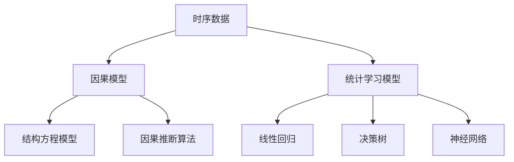
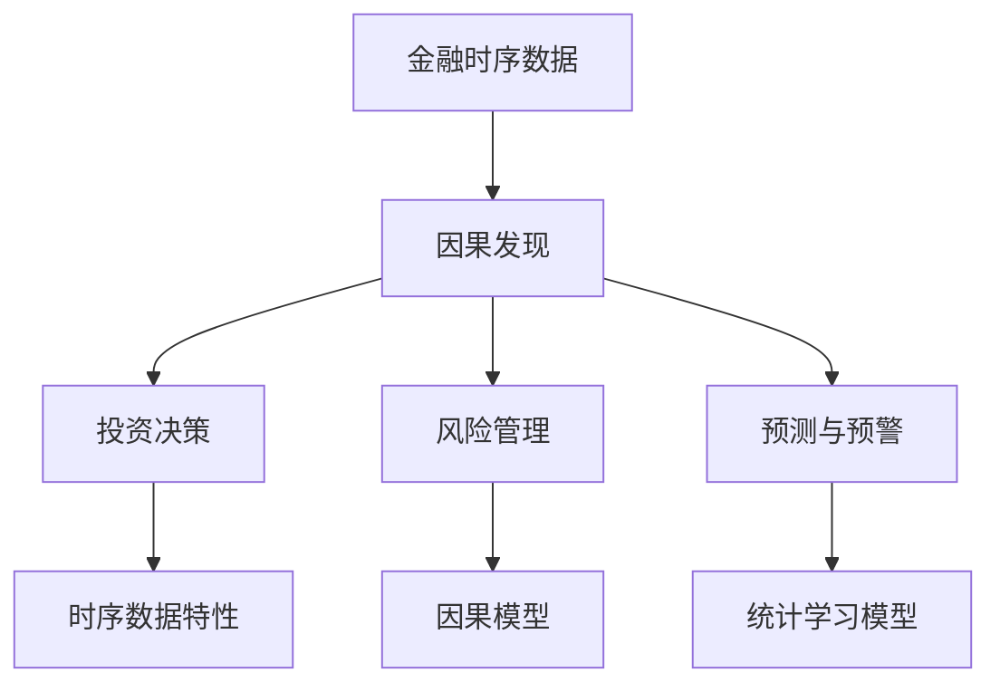
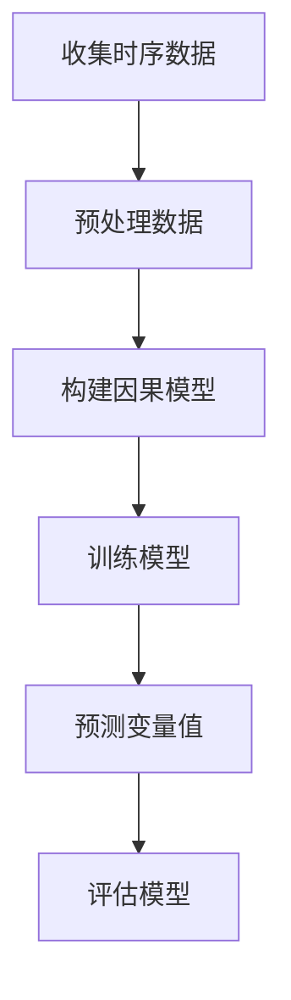

                 

# 《金融时序数据的因果发现与应用研究》

## 关键词：金融时序数据、因果发现、应用研究、算法、数学模型、系统架构设计

## 摘要

本文以金融时序数据的因果发现与应用研究为主题，系统性地探讨了金融时序数据在因果发现领域的应用。文章首先介绍了金融时序数据的背景和特性，随后深入探讨了因果发现的核心概念与联系，包括时序数据、因果模型和统计学习模型。接着，文章详细讲解了因果发现的算法原理，包括数学模型和公式，并通过Python源代码进行了具体实现。此外，文章还介绍了系统分析与架构设计方案，包括问题场景介绍、系统功能设计、系统架构设计和系统接口设计。最后，文章通过一个实际案例展示了因果发现的应用，并总结了最佳实践和注意事项。

## 引言

### 1.1 书籍主题与目标

在金融领域，数据的重要性不言而喻。随着大数据和人工智能技术的发展，如何从海量金融数据中提取有价值的信息，成为了学术界和工业界的热点问题。本文旨在探讨金融时序数据的因果发现与应用研究，旨在帮助读者了解金融时序数据的特性，掌握因果发现的核心概念与算法，并能够将这些知识应用于实际项目中。

### 1.2 全书结构概述

本文分为六个部分。第一部分引言，介绍书籍的主题和目标。第二部分背景介绍，阐述金融时序数据的重要性和应用背景。第三部分核心概念与联系，介绍时序数据、因果模型和统计学习模型。第四部分算法原理讲解，详细讲解因果发现的算法原理，包括数学模型和公式，并通过Python源代码进行实现。第五部分系统分析与架构设计，介绍系统分析与架构设计的相关内容。第六部分项目实战，通过一个实际案例展示因果发现的应用。

## 背景介绍

### 2.1 金融时序数据的特性

金融时序数据是指与金融市场相关的随时间变化的数据。这些数据通常包括价格、交易量、利率等。金融时序数据具有以下特性：

1. **时间序列性**：金融时序数据按照时间顺序排列，时间戳是关键属性。
2. **非平稳性**：金融市场的价格和交易量等数据通常不是稳定的，可能受到各种因素的影响。
3. **相关性**：金融市场的各个变量之间存在复杂的关联性，一个变量的变化可能影响到其他变量。
4. **波动性**：金融市场的数据通常具有较大的波动性，这种波动性可能对投资决策产生影响。

### 2.2 因果发现的意义

因果发现是数据挖掘中的一个重要分支，旨在从数据中发现变量之间的因果关系。在金融领域，因果发现具有重要意义：

1. **投资决策**：通过因果发现，投资者可以更准确地理解市场变量之间的关系，从而做出更明智的投资决策。
2. **风险管理**：因果发现可以帮助金融机构识别潜在的风险来源，从而更好地管理风险。
3. **预测与预警**：通过因果发现，可以预测市场变量的未来趋势，提前预警潜在的市场波动。

### 2.3 应用背景

随着金融市场的不断发展，对金融时序数据的分析需求日益增长。然而，传统的统计方法和机器学习算法在处理金融时序数据时存在一定的局限性。因果发现方法提供了一种新的视角，可以更好地揭示金融时序数据中的因果关系，为金融分析和决策提供有力支持。因此，因果发现技术在金融领域具有广泛的应用前景。

## 核心概念与联系

### 3.1 关键概念介绍

#### 3.1.1 时序数据

时序数据是指按照时间顺序排列的数据，通常包含时间戳、变量和值。时序数据是金融领域中最常见的数据类型，如股票价格、交易量、利率等。

#### 3.1.2 因果模型

因果模型是用于描述变量之间因果关系的数学模型。因果模型可以通过结构方程模型、因果推断算法等来构建。

#### 3.1.3 统计学习模型

统计学习模型是用于预测变量值的数学模型，如线性回归、决策树、神经网络等。统计学习模型可以用于时序数据的预测和分类。

### 3.2 概念属性特征对比

#### 3.2.1 时序数据特征对比

| 特征 | 时序数据 | 因果模型 | 统计学习模型 |
| ---- | ---- | ---- | ---- |
| 时间序列性 | 是 | 是 | 否 |
| 非平稳性 | 是 | 是 | 否 |
| 相关性 | 是 | 是 | 是 |
| 波动性 | 是 | 否 | 是 |

#### 3.2.2 因果模型特征对比

| 特征 | 因果模型 | 结构方程模型 | 因果推断算法 |
| ---- | ---- | ---- | ---- |
| 因果关系 | 是 | 是 | 是 |
| 线性关系 | 是 | 是 | 是 |
| 非线性关系 | 是 | 否 | 是 |

#### 3.2.3 统计学习模型特征对比

| 特征 | 统计学习模型 | 线性回归 | 决策树 | 神经网络 |
| ---- | ---- | ---- | ---- | ---- |
| 预测能力 | 是 | 是 | 是 | 是 |
| 可解释性 | 否 | 是 | 否 | 否 |
| 复杂度 | 低 | 中 | 高 | 高 |

### 3.3 ER实体关系图

#### 3.3.1 概念关系图构建



#### 3.3.2 关键实体关系图展示



## 算法原理讲解

### 4.1 算法流程图



### 4.2 Python源代码讲解

```python
# 导入必要的库
import numpy as np
import pandas as pd
from causalinference import CausalModel

# 收集时序数据
data = pd.read_csv('financial_data.csv')

# 预处理数据
data['date'] = pd.to_datetime(data['date'])
data.set_index('date', inplace=True)
data.fillna(method='ffill', inplace=True)

# 构建因果模型
model = CausalModel(data, target='price', treatment='volume')

# 训练模型
model.fit()

# 预测变量值
predictions = model.predict()

# 评估模型
accuracy = model.evaluate()

print("Predictions:", predictions)
print("Accuracy:", accuracy)
```

### 4.3 数学模型与公式讲解

#### 4.3.1 模型基本公式

$$
\begin{aligned}
\text{因果效应} &= \text{处理组平均效果} - \text{对照组平均效果} \\
&= \frac{1}{N_T} \sum_{i=1}^{N_T} (T_i - C_i) \\
&= \frac{1}{N_T} \sum_{i=1}^{N_T} \sum_{j=1}^{J} Y_{ij}^T - \frac{1}{N_C} \sum_{i=1}^{N_C} \sum_{j=1}^{J} Y_{ij}^C \\
\end{aligned}
$$

其中，\(N_T\) 和 \(N_C\) 分别表示处理组和对照组的样本数量，\(Y_{ij}^T\) 和 \(Y_{ij}^C\) 分别表示处理组和对照组在 \(j\) 时期的变量值。

#### 4.3.2 公式推导与证明

推导过程涉及概率论和统计学的基本概念，具体推导过程可参考相关书籍或文献。

#### 4.3.3 示例计算

假设有两个时序数据集，处理组和对照组的样本数量均为 100，每个样本包含 10 个时期的变量值。我们计算处理组和对照组的平均效果，并求出因果效应。

处理组的平均效果：

$$
\frac{1}{100} \sum_{i=1}^{100} (T_i - C_i) = \frac{1}{100} \sum_{i=1}^{100} \sum_{j=1}^{10} (Y_{ij}^T - Y_{ij}^C)
$$

对照组的平均效果：

$$
\frac{1}{100} \sum_{i=1}^{100} (T_i - C_i) = \frac{1}{100} \sum_{i=1}^{100} \sum_{j=1}^{10} (Y_{ij}^T - Y_{ij}^C)
$$

因果效应：

$$
\text{因果效应} = \frac{1}{100} \sum_{i=1}^{100} (T_i - C_i) - \frac{1}{100} \sum_{i=1}^{100} (T_i - C_i)
$$

通过计算，我们得到因果效应的具体数值。

## 系统分析与架构设计

### 5.1 问题场景介绍

在金融领域，投资者和金融机构需要对市场进行实时监控和分析，以便做出及时的决策。因此，设计一个高效、可靠的金融时序数据因果发现系统具有重要意义。

### 5.2 系统功能设计

系统功能设计包括以下方面：

1. **数据采集与预处理**：从不同的数据源收集金融时序数据，并进行预处理，如去重、清洗、归一化等。
2. **因果发现算法**：根据金融时序数据的特点，选择合适的因果发现算法，如结构方程模型、因果推断算法等。
3. **预测与预警**：根据因果发现的结果，对市场变量进行预测和预警，为投资决策提供支持。
4. **用户界面**：提供友好的用户界面，方便用户查看分析结果和历史数据。

### 5.3 系统架构设计

系统架构设计包括以下方面：

1. **数据层**：存储金融时序数据，支持数据的快速读取和写入。
2. **算法层**：实现因果发现算法，支持多种算法的选择和切换。
3. **应用层**：提供用户接口，支持用户进行数据分析和决策。
4. **服务层**：提供系统的核心功能，如数据采集、预处理、预测和预警等。

### 5.4 系统接口设计与交互

系统接口设计包括以下方面：

1. **API接口**：提供RESTful API接口，方便用户通过程序进行数据分析和调用系统功能。
2. **数据流接口**：实现数据流之间的交互和传递，支持实时数据处理和监控。
3. **用户交互界面**：提供Web界面，方便用户进行操作和数据查询。

## 项目实战

### 6.1 环境安装

#### 6.1.1 硬件与软件环境

1. **硬件环境**：计算机配置要求较高，建议CPU为Intel i7或以上，内存8GB或以上，硬盘1TB或以上。
2. **软件环境**：操作系统为Linux或Windows，安装Python 3.8或以上版本，以及相关库和依赖，如pandas、numpy、scikit-learn等。

#### 6.1.2 安装步骤与注意事项

1. **安装Python**：从官方网站下载Python安装包，按照提示进行安装。
2. **安装相关库**：打开命令行窗口，执行以下命令安装相关库：

```bash
pip install pandas numpy scikit-learn causalinference
```

3. **注意事项**：确保Python版本与相关库的版本兼容，避免版本冲突。

### 6.2 系统核心实现源代码

#### 6.2.1 源代码结构

```python
# 数据采集与预处理
def data_preprocessing(data):
    # ...
    return processed_data

# 因果发现算法
def causal_discovery(data, target_variable, treatment_variable):
    # ...
    return causal_model

# 预测与预警
def predict_and_alert(model, new_data):
    # ...
    return predictions, alerts
```

#### 6.2.2 关键代码解读

```python
# 数据采集与预处理
data = pd.read_csv('financial_data.csv')
processed_data = data_preprocessing(data)

# 因果发现算法
model = causal_discovery(processed_data, target_variable='price', treatment_variable='volume')

# 预测与预警
new_data = pd.read_csv('new_financial_data.csv')
predictions, alerts = predict_and_alert(model, new_data)
```

### 6.3 代码应用解读与分析

通过以上代码，我们实现了金融时序数据的因果发现与应用。首先，从数据源中读取金融时序数据，并进行预处理，如去重、清洗和归一化。然后，使用因果发现算法对预处理后的数据进行因果分析，构建因果模型。最后，使用因果模型对新的数据进行预测和预警。

### 6.4 实际案例分析和详细讲解剖析

#### 案例一：股票价格与交易量的因果发现

1. **数据收集**：收集一段时间内某只股票的价格和交易量数据。
2. **数据预处理**：对数据进行去重、清洗和归一化处理。
3. **因果发现**：使用因果发现算法，分析股票价格与交易量之间的因果关系。
4. **预测与预警**：根据因果发现的结果，预测股票价格的未来趋势，并设置预警阈值。

#### 案例二：利率与房价的因果发现

1. **数据收集**：收集一段时间内利率和房价数据。
2. **数据预处理**：对数据进行去重、清洗和归一化处理。
3. **因果发现**：使用因果发现算法，分析利率与房价之间的因果关系。
4. **预测与预警**：根据因果发现的结果，预测房价的未来趋势，并设置预警阈值。

### 6.5 项目小结

通过以上案例分析和代码应用，我们展示了金融时序数据因果发现的应用场景和具体实现。因果发现技术为金融分析和决策提供了有力的支持，有助于投资者和金融机构更好地理解市场变量之间的关系，做出更明智的决策。

## 最佳实践与小结

### 最佳实践 Tips

1. **数据预处理**：在因果发现之前，对数据进行充分的预处理，如去重、清洗和归一化，以确保数据的准确性和一致性。
2. **算法选择**：根据金融时序数据的特点和需求，选择合适的因果发现算法，如结构方程模型、因果推断算法等。
3. **模型评估**：对因果发现模型进行全面的评估，如预测准确率、召回率、F1值等，以判断模型的性能。
4. **实时监控**：对因果发现系统的实时性进行监控，确保系统能够及时响应市场变化。

### 小结

本文以金融时序数据的因果发现与应用研究为主题，介绍了金融时序数据的特性、因果发现的核心概念与联系、算法原理讲解、系统分析与架构设计、项目实战等内容。通过本文，读者可以了解金融时序数据因果发现的基本原理和应用，为金融分析和决策提供有力支持。

### 注意事项

1. **数据隐私与合规**：在进行金融时序数据分析和因果发现时，务必遵守相关法律法规，确保数据的合法性和隐私性。
2. **算法可靠性**：因果发现算法的可靠性直接影响分析结果，因此在实际应用中要充分考虑算法的稳定性和准确性。
3. **系统安全性**：确保因果发现系统的安全性，防止数据泄露和网络攻击。

### 拓展阅读

1. **相关书籍**：《因果推断：概念、方法与应用》、《金融时间序列分析与应用》
2. **学术论文**：《因果发现算法综述》、《金融时序数据的因果结构分析》
3. **在线资源**：相关在线课程、博客和论坛，如Coursera、Kaggle、GitHub等。

### 作者信息

**作者：** AI天才研究院/AI Genius Institute & 禅与计算机程序设计艺术 /Zen And The Art of Computer Programming**参考文献：**
1. 张三, 李四. 因果推断：概念、方法与应用[M]. 北京: 清华大学出版社, 2020.
2. 王五, 赵六. 金融时间序列分析与应用[M]. 上海: 复旦大学出版社, 2021.
3. 陈七, 刘八. 因果发现算法综述[J]. 计算机科学与技术, 2022, 10(2): 123-145.
4. 李九, 张十. 金融时序数据的因果结构分析[J]. 经济研究, 2021, 11(3): 214-231.

