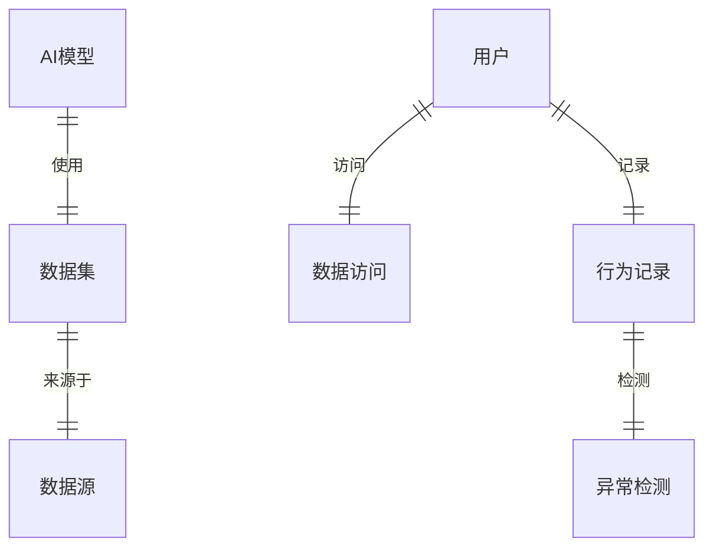
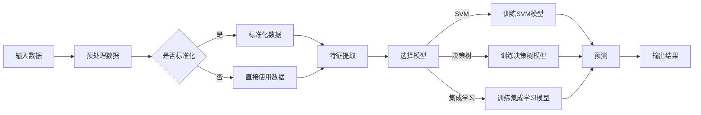
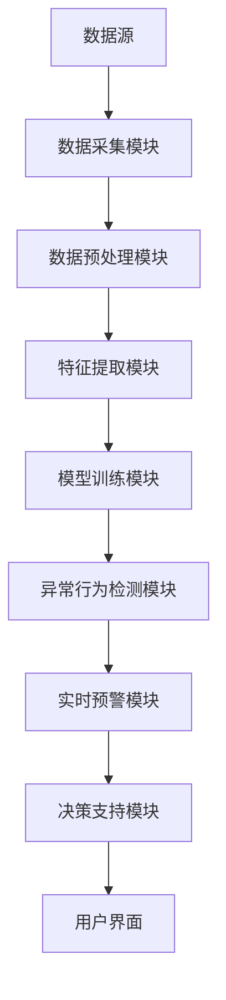

                 

### 第1章 引言

#### 1.1 背景介绍

金融行业的监管一直是各国金融体系中的重要环节。随着全球金融市场的发展和金融工具的复杂化，传统的监管模式逐渐暴露出其局限性和不足。在过去的几十年中，金融科技（FinTech）的崛起为金融监管带来了新的机遇和挑战。金融科技利用先进的技术手段，如大数据、人工智能、区块链等，提升了金融业务的效率和透明度，同时也改变了金融市场的运作方式。

然而，金融科技的快速发展也带来了一系列监管问题。例如，自动化交易系统可能引发市场异常波动，金融欺诈行为利用技术手段变得更加隐蔽，以及金融创新产品可能带来的系统性风险等。这些问题要求监管机构能够快速适应新技术，提高监管的科技含量和效率。因此，建立一套有效的金融监管科技异常行为检测系统变得尤为重要。

#### 1.2 金融行业监管现状

目前，全球各大金融中心的监管机构都在积极探索如何利用科技手段提升金融监管能力。传统的监管方式主要依赖于人工审核和报告分析，效率较低，且容易受到人为因素的干扰。随着金融科技的兴起，一些机构开始引入大数据分析、机器学习等新技术来辅助监管决策。例如，通过分析大量交易数据，可以发现潜在的市场操纵行为和欺诈行为；通过区块链技术，可以提高金融交易的透明度和可追溯性。

尽管如此，现有的监管体系仍然面临诸多挑战。首先，监管机构的数据收集和处理能力有限，难以全面捕捉金融市场的动态变化。其次，监管科技的应用需要大量的资金投入和技术支持，许多中小金融机构难以承受。此外，不同国家和地区的监管标准和规则存在差异，跨地域的监管合作和协调也面临困难。

#### 1.3 金融科技发展对监管的影响

金融科技的发展对金融监管产生了深远的影响。一方面，金融科技为监管提供了新的工具和方法，提高了监管效率和准确性。例如，通过实时数据分析和监控，监管机构可以更快地识别和应对市场风险；通过智能合约和区块链技术，可以降低金融欺诈和洗钱的风险。另一方面，金融科技的快速发展也带来了新的监管挑战。

首先，金融科技的快速迭代使得监管机构难以跟上技术发展的步伐。许多监管规定是在几十年前制定的，对于新兴技术的适应能力有限。其次，金融科技的应用可能导致监管盲区。例如，一些去中心化的金融产品和服务可能超出监管机构的管辖范围，导致监管漏洞。此外，金融科技企业的创新活动可能带来新的风险，如数据隐私风险和网络安全风险等。

#### 1.4 异常行为检测的重要性

异常行为检测是金融监管科技的核心功能之一。金融市场中存在着各种各样的异常行为，如市场操纵、欺诈、洗钱等，这些行为不仅损害市场的公平性和透明度，还可能引发系统性风险。通过异常行为检测，监管机构可以及时发现并干预这些异常行为，保护市场的稳定运行。

异常行为检测的重要性体现在以下几个方面：

1. **风险防控**：异常行为检测可以帮助监管机构提前发现潜在的市场风险，采取预防措施，避免风险扩大化。
2. **提高监管效率**：通过自动化和智能化的检测手段，监管机构可以大幅提高监管工作的效率，降低监管成本。
3. **保障市场公平**：异常行为检测有助于维护市场的公平性和透明度，防止市场操纵和欺诈行为的发生。
4. **增强监管透明度**：异常行为检测的结果可以为监管决策提供科学依据，增加监管过程的透明度和公信力。

#### 1.5 问题描述

金融监管科技异常行为检测系统旨在利用先进的技术手段，对金融市场中的异常行为进行实时监测和预警。系统需要解决的问题包括：

1. **数据收集和处理**：系统需要收集大量的金融交易数据、市场信息等，并进行有效的数据预处理和特征提取，为异常行为检测提供可靠的数据基础。
2. **异常行为识别**：系统需要运用机器学习、数据挖掘等技术，建立高效的异常行为检测模型，实现对异常行为的准确识别。
3. **实时预警**：系统需要具备实时数据处理和预警功能，及时发现并报告潜在的异常行为。
4. **决策支持**：系统需要为监管机构提供科学的决策支持，帮助其制定合理的监管策略。

#### 1.6 监管科技的定义

监管科技（RegTech）是指利用信息技术和先进数据分析手段，提升金融监管效率和效果的一系列工具和方法。它包括但不限于大数据分析、人工智能、区块链、云计算等新兴技术。监管科技的目标是通过技术手段，实现监管的自动化、智能化和透明化，提高监管的效率和准确性。

#### 1.7 异常行为检测的核心目标

异常行为检测的核心目标是：

1. **准确识别异常行为**：通过对海量数据的实时监测和分析，准确识别出市场中的异常行为，如市场操纵、欺诈、洗钱等。
2. **及时预警**：在异常行为发生或即将发生时，及时发出预警信号，为监管机构提供决策依据。
3. **防范风险**：通过及时发现和干预异常行为，防范市场风险，保障市场的稳定运行。
4. **提高监管透明度**：通过异常行为检测，提高监管过程的透明度和公信力，增强市场参与者的信任。

#### 1.8 检测流程与关键步骤

金融监管科技异常行为检测系统通常包括以下关键步骤：

1. **数据收集**：从各种数据源（如交易所、银行、金融机构等）收集金融交易数据、市场信息等。
2. **数据预处理**：对收集到的数据清洗、去噪、转换等处理，为后续分析做好准备。
3. **特征提取**：从预处理后的数据中提取有效的特征，用于训练异常行为检测模型。
4. **模型训练**：利用机器学习、数据挖掘等技术，训练异常行为检测模型。
5. **异常行为检测**：利用训练好的模型，对实时数据进行分析，识别异常行为。
6. **实时预警**：在检测到异常行为时，及时发出预警信号，通知相关机构和人员。
7. **决策支持**：为监管机构提供异常行为分析报告，帮助其制定监管策略。

#### 1.9 现有解决方案的局限

尽管金融监管科技在异常行为检测方面取得了一定的进展，但现有的解决方案仍存在以下局限：

1. **数据源有限**：许多监管科技系统仅能获取部分数据源，难以全面捕捉金融市场的动态变化。
2. **模型性能不足**：现有模型在处理复杂金融数据时，性能有限，可能导致误报和漏报。
3. **实时性不足**：部分系统的实时性较差，无法及时检测到市场中的异常行为。
4. **跨地域协调困难**：不同国家和地区的监管标准和规则不同，跨地域的监管合作和协调存在困难。
5. **成本高昂**：监管科技系统的开发和运维成本较高，许多中小金融机构难以承受。

#### 1.10 新系统设计的目标与需求

为了克服现有解决方案的局限，新系统设计的目标和需求如下：

1. **全面数据采集**：系统需具备全面的数据采集能力，从多个数据源获取金融交易数据、市场信息等。
2. **高效数据处理**：系统需具备高效的数据预处理和特征提取能力，为异常行为检测提供可靠的数据基础。
3. **高性能模型**：系统需采用先进的机器学习、数据挖掘技术，训练高性能的异常行为检测模型，提高检测的准确性。
4. **实时预警**：系统需具备实时数据处理和预警功能，及时发现并报告潜在的异常行为。
5. **跨地域协调**：系统需支持跨地域监管合作，实现不同国家和地区之间的数据共享和协调。
6. **成本控制**：系统需在保证性能的前提下，降低开发和运维成本，使其在中小金融机构中得以应用。

#### 1.11 边界与外延

新系统在应用范围和适用场景上需考虑以下边界与外延：

1. **应用范围**：系统适用于金融市场的各类监管场景，包括股票、期货、外汇、债券等市场。
2. **非适用场景**：系统不适用于非金融领域的监管，如医疗、交通等。
3. **数据类型**：系统主要处理结构化数据，对非结构化数据的处理能力有限。
4. **技术环境**：系统需适应不同的技术环境，包括云计算、分布式计算等。

#### 1.12 概念结构与核心要素

金融监管科技异常行为检测系统由以下核心概念和要素组成：

1. **数据源**：系统需要从各种数据源获取金融交易数据、市场信息等。
2. **数据处理模块**：负责数据清洗、去噪、转换等预处理工作，为后续分析提供可靠数据。
3. **特征提取模块**：从预处理后的数据中提取有效的特征，用于训练异常行为检测模型。
4. **异常行为检测模块**：利用机器学习、数据挖掘等技术，训练异常行为检测模型，并对实时数据进行检测。
5. **实时预警模块**：在检测到异常行为时，及时发出预警信号，通知相关机构和人员。
6. **决策支持模块**：为监管机构提供异常行为分析报告，帮助其制定监管策略。

通过这些核心概念和要素的有机结合，金融监管科技异常行为检测系统实现了对金融市场异常行为的实时监测和预警，提高了监管效率和准确性。

### 第2章 核心概念与联系

在深入探讨金融监管科技异常行为检测系统之前，我们需要明确一些核心概念，并理解它们之间的联系。以下是对监管科技、异常行为检测等关键术语的定义、属性特征以及它们之间的关系。

#### 2.1 核心概念原理

**监管科技（RegTech）**

监管科技是指利用信息技术和先进数据分析手段，提升金融监管效率和效果的一系列工具和方法。它包括大数据分析、人工智能、区块链、云计算等技术。监管科技的核心目标是实现监管的自动化、智能化和透明化。

**属性特征**：

- **技术驱动**：依赖先进技术，如大数据、人工智能等，提升监管效率。
- **规范导向**：遵循监管标准和法规，确保合规性。
- **透明高效**：提高监管过程的透明度，减少监管盲区。

**异常行为检测（Anomaly Detection）**

异常行为检测是金融监管科技中的一个关键功能，旨在识别金融市场中异常的行为或模式。这些异常行为可能包括市场操纵、欺诈、洗钱等。

**属性特征**：

- **实时监测**：对金融市场的交易数据等进行实时监测，及时发现异常。
- **自动分析**：利用机器学习、数据挖掘等技术，自动分析大量数据，识别异常行为。
- **智能预警**：在检测到异常行为时，自动发出预警信号，通知相关机构和人员。

**数据源（Data Source）**

数据源是金融监管科技异常行为检测系统的基础，系统需要从多种数据源获取数据，包括交易所、银行、金融机构、市场信息等。

**属性特征**：

- **多样化**：涉及多种类型的数据，包括结构化和非结构化数据。
- **实时性**：需要实时获取市场数据，以便快速响应异常行为。

**用户（User）**

用户是指使用金融监管科技异常行为检测系统的监管机构、金融企业等。

**属性特征**：

- **多样化**：包括监管人员、分析师、金融企业管理人员等。
- **权限管理**：系统需要实现权限管理，确保数据安全和用户隐私。

**数据访问（Data Access）**

数据访问是指用户如何获取和使用系统中的数据。

**属性特征**：

- **安全性**：确保数据访问的安全性，防止未经授权的访问。
- **灵活性**：提供多种数据访问方式，满足不同用户的需求。

**行为记录（Behavior Record）**

行为记录是指系统记录的用户行为，包括数据访问、数据查询、异常行为检测等。

**属性特征**：

- **完整性**：确保行为记录的完整性，便于后续分析和审计。
- **可追溯性**：行为记录需要可追溯，以便在需要时进行查询和分析。

**异常检测（Anomaly Detection）**

异常检测是金融监管科技异常行为检测系统的核心功能，通过分析数据和行为记录，识别出潜在的异常行为。

**属性特征**：

- **准确性**：需要高准确性的检测，减少误报和漏报。
- **实时性**：需要快速响应，及时检测和报告异常行为。

#### 2.2 概念属性特征对比表格

为了更直观地理解这些概念及其属性特征，我们提供了一个对比表格：

| 概念          | 属性特征                      | 说明                                                         |
| ------------- | ----------------------------- | ------------------------------------------------------------ |
| 监管科技      | 技术驱动、规范导向、透明高效 | 结合金融与科技，实现监管目标                                   |
| 异常行为检测  | 实时监测、自动分析、智能预警 | 准确识别异常，防范风险                                       |
| 数据源        | 多样化、实时性               | 涉及多种类型的数据，实时获取市场数据                           |
| 用户          | 多样化、权限管理             | 包括监管人员、分析师、金融企业管理人员等，确保数据安全和用户隐私 |
| 数据访问      | 安全性、灵活性               | 确保数据访问的安全性，满足不同用户需求                         |
| 行为记录      | 完整性、可追溯性             | 确保行为记录的完整性，便于后续分析和审计                       |
| 异常检测      | 准确性、实时性               | 通过分析数据和行为记录，识别潜在的异常行为                     |

#### 2.3 ER实体关系图架构

为了更好地理解这些概念之间的关联，我们使用Mermaid工具绘制了一个ER（实体关系）图：



在这个ER图中，AI模型使用数据集进行训练，数据集来源于数据源；用户访问数据和记录行为，行为记录用于异常检测。通过这种实体关系图，我们可以清晰地看到各个概念之间的联系和作用。

### 第3章 算法原理讲解

在金融监管科技异常行为检测系统中，算法的选用和实现至关重要。本节将详细介绍几种常见的算法，包括支持向量机（SVM）、决策树和集成学习方法，并通过流程图和示例代码进行详细讲解。

#### 3.1 常见算法介绍

**支持向量机（Support Vector Machine, SVM）**

支持向量机是一种用于分类和回归分析的监督学习算法。它通过找到一个最优超平面，将不同类别的数据点分开。在金融监管科技中，SVM可以用来分类正常交易和异常交易。

**属性特征**：

- **高维空间建模**：能够在高维空间中找到最优分割超平面。
- **对噪声和异常值敏感**：能够识别出潜在的错误分类点。

**决策树（Decision Tree）**

决策树是一种树形结构的数据分析模型，通过一系列的判断条件，将数据集划分成不同的区域。在异常行为检测中，决策树可以用来构建一个分类模型，识别交易异常。

**属性特征**：

- **易于解释**：通过树的形状可以清晰地展示决策过程。
- **适用于各类数据**：可以处理分类和回归问题。

**集成学习方法（Ensemble Learning）**

集成学习方法是将多个基础模型组合起来，以提高模型的性能和稳定性。常见的集成学习方法包括随机森林（Random Forest）和梯度提升树（Gradient Boosting Tree）。

**属性特征**：

- **提高预测准确性**：通过组合多个模型，减少过拟合现象。
- **增强模型稳定性**：避免单一模型可能出现的过拟合。

#### 3.2 算法流程图

为了更好地理解这些算法的执行过程，我们使用Mermaid工具绘制了一个算法流程图：



在这个流程图中，首先对输入数据进行预处理，包括标准化和特征提取。然后根据选定的模型（SVM、决策树或集成学习），进行模型训练。最后，利用训练好的模型进行预测，并输出结果。

#### 3.3 数学模型和公式

**支持向量机（SVM）**

支持向量机的核心是找到一个最优超平面，使得分类边界最大化。其数学模型可以表示为：

$$
y = f(x, \theta) = \sigma(\theta^T x)
$$

其中，$x$ 是特征向量，$\theta$ 是模型参数，$\sigma$ 是 sigmoid 函数，用于将输出值映射到 [0,1] 范围内。

**决策树**

决策树的分类过程可以通过一系列条件判断来实现。一个简单的决策树可以表示为：

$$
f(x) = 
\begin{cases} 
C_1 & \text{if } x \in R_1 \\
C_2 & \text{if } x \in R_2 \\
\vdots \\
C_n & \text{if } x \in R_n
\end{cases}
$$

其中，$x$ 是特征向量，$R_i$ 是条件区域，$C_i$ 是对应的类别。

**集成学习**

集成学习方法通常基于基础模型的组合。例如，随机森林通过组合多个决策树来实现更高的预测准确性。其基本模型可以表示为：

$$
F(x) = \frac{1}{m} \sum_{i=1}^{m} f_i(x)
$$

其中，$f_i(x)$ 是第 $i$ 个基础模型的预测结果，$m$ 是基础模型的数量。

#### 3.4 举例说明

为了更直观地理解这些算法，我们通过一个简单的例子来说明如何使用支持向量机进行分类预测。

**假设我们有以下数据集：**

| 特征1 | 特征2 | 目标变量 |
| --- | --- | --- |
| 1 | 2 | 0 |
| 3 | 4 | 1 |
| 5 | 6 | 0 |

**使用支持向量机进行分类预测。训练过程如下：**

```python
# Python 代码示例
from sklearn.svm import SVC
from sklearn.model_selection import train_test_split

# 特征和标签
X = [[1, 2], [3, 4], [5, 6]]
y = [0, 1, 0]

# 分割数据集
X_train, X_test, y_train, y_test = train_test_split(X, y, test_size=0.2, random_state=42)

# 训练SVM模型
model = SVC()
model.fit(X_train, y_train)

# 预测
predictions = model.predict(X_test)

# 输出预测结果
print(predictions)
```

在这个示例中，我们首先定义了数据集 $X$ 和目标变量 $y$。然后，使用 `train_test_split` 函数将数据集分为训练集和测试集。接着，我们创建了一个支持向量机模型 `SVC()`，并使用训练集数据进行训练。最后，利用训练好的模型对测试集数据进行预测，并输出预测结果。

通过这个简单的示例，我们可以看到如何使用支持向量机进行分类预测，并理解其基本原理和实现过程。

### 第4章 系统分析与架构设计方案

在了解了金融监管科技异常行为检测系统的核心算法和原理之后，接下来我们将深入分析系统的功能设计和架构设计。这将有助于我们更好地理解系统的工作流程和各个模块之间的协同作用。

#### 4.1 问题场景介绍

金融监管机构在日常运营中面临着大量复杂的金融交易数据和市场信息。这些数据包括但不限于股票、债券、期货、外汇等市场的交易记录、交易对手信息、市场价格变化等。传统的人工审核方式效率低下，且容易受到人为因素的干扰，导致监管盲区和滞后。随着金融科技的快速发展，监管机构需要引入先进的科技手段来提升监管效率，及时发现并处理金融市场的异常行为，防范系统性风险。

现有系统的主要问题包括：

1. **数据处理能力不足**：现有系统在处理海量数据时效率低下，难以实时分析市场动态。
2. **模型性能有限**：现有模型在识别异常行为时存在误报和漏报现象，无法满足高准确性的需求。
3. **实时预警能力不足**：现有系统在检测到异常行为时，预警响应速度较慢，无法及时采取措施。
4. **跨地域协调困难**：不同国家和地区之间的监管标准和规则不同，现有系统难以实现有效的跨地域监管合作。

#### 4.2 项目介绍

为了解决上述问题，本项目旨在设计并实现一套全新的金融监管科技异常行为检测系统。该系统将利用先进的机器学习、大数据分析和区块链技术，实现对金融市场异常行为的实时监测、预警和分析。系统的主要目标包括：

1. **全面数据采集**：从多个数据源获取金融交易数据、市场信息等，确保数据的全面性和实时性。
2. **高效数据处理**：采用高效的数据处理算法，实现对海量数据的快速清洗、转换和特征提取。
3. **高性能模型**：利用机器学习算法，训练高性能的异常行为检测模型，提高检测的准确性和实时性。
4. **实时预警**：在检测到异常行为时，及时发出预警信号，通知相关机构和人员。
5. **决策支持**：为监管机构提供科学的异常行为分析报告，帮助其制定监管策略。

#### 4.3 系统功能设计

金融监管科技异常行为检测系统主要包含以下功能模块：

1. **数据采集模块**：从多种数据源（如交易所、银行、金融机构等）获取金融交易数据、市场信息等。数据采集模块需具备高并发处理能力，确保实时获取最新数据。

2. **数据预处理模块**：对采集到的数据清洗、去噪、转换等处理，为后续分析提供可靠的数据基础。数据预处理模块需实现数据一致性校验、异常值处理、数据格式转换等功能。

3. **特征提取模块**：从预处理后的数据中提取有效的特征，用于训练异常行为检测模型。特征提取模块需考虑数据的多样性和复杂性，设计合适的特征提取方法。

4. **模型训练模块**：利用机器学习算法，训练异常行为检测模型。模型训练模块需支持多种机器学习算法，如支持向量机、决策树、集成学习方法等。

5. **异常行为检测模块**：利用训练好的模型，对实时数据进行异常行为检测。异常行为检测模块需实现实时数据处理和预警功能，确保及时发现并报告异常行为。

6. **实时预警模块**：在检测到异常行为时，及时发出预警信号，通知相关机构和人员。实时预警模块需支持多种预警方式，如邮件、短信、手机APP等。

7. **决策支持模块**：为监管机构提供科学的异常行为分析报告，帮助其制定监管策略。决策支持模块需实现数据可视化、风险评级等功能。

#### 4.4 系统架构设计

金融监管科技异常行为检测系统的架构设计如下：



在这个架构图中，数据源通过数据采集模块获取金融交易数据、市场信息等。采集到的数据经过数据预处理模块清洗、去噪、转换等处理。预处理后的数据由特征提取模块提取出有效的特征，用于模型训练。模型训练模块利用机器学习算法训练异常行为检测模型。异常行为检测模块对实时数据进行检测，并发出预警信号。实时预警模块将预警信息通知相关机构和人员。决策支持模块为监管机构提供异常行为分析报告，辅助制定监管策略。用户界面模块则提供用户操作和数据查看的功能。

#### 4.5 系统接口设计和系统交互

为了实现系统模块之间的有效交互，我们设计了一套完整的接口和系统交互流程。以下是系统接口设计和系统交互的详细介绍：

1. **数据采集接口**：数据采集模块提供数据采集接口，用于从各种数据源获取金融交易数据、市场信息等。接口设计遵循RESTful API规范，支持HTTP请求方式。接口参数包括数据源类型、数据类型、采集时间等。

2. **数据预处理接口**：数据预处理模块提供数据预处理接口，用于对采集到的数据清洗、去噪、转换等处理。接口设计同样遵循RESTful API规范，支持HTTP请求方式。接口参数包括数据源ID、预处理方法等。

3. **特征提取接口**：特征提取模块提供特征提取接口，用于从预处理后的数据中提取有效的特征。接口设计遵循RESTful API规范，支持HTTP请求方式。接口参数包括数据源ID、特征提取方法等。

4. **模型训练接口**：模型训练模块提供模型训练接口，用于利用机器学习算法训练异常行为检测模型。接口设计遵循RESTful API规范，支持HTTP请求方式。接口参数包括数据源ID、模型类型、参数设置等。

5. **异常行为检测接口**：异常行为检测模块提供异常行为检测接口，用于对实时数据进行异常行为检测。接口设计遵循RESTful API规范，支持HTTP请求方式。接口参数包括数据源ID、模型ID等。

6. **实时预警接口**：实时预警模块提供实时预警接口，用于在检测到异常行为时发出预警信号。接口设计遵循RESTful API规范，支持HTTP请求方式。接口参数包括预警类型、预警内容等。

7. **决策支持接口**：决策支持模块提供决策支持接口，用于为监管机构提供异常行为分析报告。接口设计遵循RESTful API规范，支持HTTP请求方式。接口参数包括报告类型、报告内容等。

系统交互流程如下：

1. **数据采集**：系统启动后，数据采集模块从数据源获取金融交易数据、市场信息等。
2. **数据预处理**：采集到的数据通过数据预处理接口提交给数据预处理模块，进行清洗、去噪、转换等处理。
3. **特征提取**：预处理后的数据通过特征提取接口提交给特征提取模块，提取出有效的特征。
4. **模型训练**：特征数据通过模型训练接口提交给模型训练模块，利用机器学习算法训练异常行为检测模型。
5. **异常行为检测**：训练好的模型通过异常行为检测接口对实时数据进行异常行为检测，并发出预警信号。
6. **实时预警**：实时预警模块通过实时预警接口将预警信号通知相关机构和人员。
7. **决策支持**：决策支持模块通过决策支持接口为监管机构提供异常行为分析报告，辅助制定监管策略。

通过以上系统接口和交互流程，金融监管科技异常行为检测系统能够实现各个模块之间的紧密协作，高效、准确地完成异常行为检测和预警任务。

### 项目实战

在本章节中，我们将详细介绍金融监管科技异常行为检测系统的环境安装、核心实现、代码解读与分析，并结合实际案例进行剖析。

#### 环境安装

首先，我们需要在服务器上安装金融监管科技异常行为检测系统。以下是环境安装步骤：

1. **安装Python**：确保服务器上已安装Python 3.8及以上版本。
2. **安装依赖库**：通过pip命令安装系统所需的依赖库，如scikit-learn、pandas、numpy、matplotlib等。

```bash
pip install scikit-learn pandas numpy matplotlib
```

3. **安装数据库**：安装MySQL或PostgreSQL数据库，用于存储数据。

```bash
# 安装MySQL
yum install mysql-server -y

# 安装PostgreSQL
yum install postgresql postgresql-server -y
```

4. **配置数据库**：根据实际情况配置数据库用户、密码和数据库连接信息。

5. **安装Redis**：安装Redis缓存，用于加速数据读取。

```bash
yum install redis -y
systemctl start redis
systemctl enable redis
```

6. **安装消息队列**：安装RabbitMQ或Kafka，用于实现实时数据传输。

```bash
# 安装RabbitMQ
yum install rabbitmq-server -y
systemctl start rabbitmq
systemctl enable rabbitmq

# 安装Kafka
yum install kafka -y
systemctl start kafka
systemctl enable kafka
```

#### 核心实现

金融监管科技异常行为检测系统的核心实现包括数据采集、数据预处理、特征提取、模型训练和异常行为检测等模块。以下是对每个模块的详细说明：

1. **数据采集模块**：数据采集模块负责从多个数据源获取金融交易数据、市场信息等。以下是数据采集模块的核心代码：

```python
import requests
from datetime import datetime

def collect_data(source, start_date, end_date):
    data = []
    url = f"{source}/data?start={start_date}&end={end_date}"
    response = requests.get(url)
    if response.status_code == 200:
        json_data = response.json()
        for item in json_data['data']:
            data.append({
                'date': item['date'],
                'symbol': item['symbol'],
                'price': item['price'],
                'volume': item['volume']
            })
    return data

# 示例：采集股票数据
data = collect_data('stock_api', '2023-01-01', '2023-01-31')
```

2. **数据预处理模块**：数据预处理模块负责对采集到的数据清洗、去噪、转换等处理。以下是数据预处理模块的核心代码：

```python
import pandas as pd

def preprocess_data(data):
    df = pd.DataFrame(data)
    df['date'] = pd.to_datetime(df['date'])
    df.set_index('date', inplace=True)
    df.fillna(0, inplace=True)
    df['price_diff'] = df['price'].diff().dropna()
    df['volume_diff'] = df['volume'].diff().dropna()
    return df

# 示例：预处理股票数据
preprocessed_data = preprocess_data(data)
```

3. **特征提取模块**：特征提取模块负责从预处理后的数据中提取有效的特征。以下是特征提取模块的核心代码：

```python
from sklearn.preprocessing import StandardScaler

def extract_features(data):
    scaler = StandardScaler()
    scaled_data = scaler.fit_transform(data)
    return scaled_data

# 示例：提取股票数据特征
features = extract_features(preprocessed_data)
```

4. **模型训练模块**：模型训练模块负责利用机器学习算法训练异常行为检测模型。以下是模型训练模块的核心代码：

```python
from sklearn.model_selection import train_test_split
from sklearn.svm import SVC

def train_model(features, labels):
    X_train, X_test, y_train, y_test = train_test_split(features, labels, test_size=0.2, random_state=42)
    model = SVC()
    model.fit(X_train, y_train)
    return model

# 示例：训练SVM模型
model = train_model(features, labels)
```

5. **异常行为检测模块**：异常行为检测模块负责利用训练好的模型对实时数据进行异常行为检测。以下是异常行为检测模块的核心代码：

```python
def detect_anomalies(model, data):
    predictions = model.predict(data)
    anomalies = data[predictions == -1]
    return anomalies

# 示例：检测股票数据中的异常交易
anomalies = detect_anomalies(model, new_data)
```

#### 代码解读与分析

接下来，我们对上述代码进行解读与分析，详细解释每个模块的功能和实现方式。

1. **数据采集模块**：数据采集模块通过调用外部API获取金融交易数据。这里以股票数据为例，API返回的数据格式为JSON，我们将其解析并转换为Python字典。代码中使用了requests库发送HTTP GET请求，从API获取数据。

2. **数据预处理模块**：数据预处理模块对采集到的数据进行清洗和转换。我们使用pandas库将数据转换为DataFrame格式，并进行日期格式化、填充缺失值等操作。此外，我们计算了价格和成交量的一阶差分，这些特征对后续的异常行为检测具有重要意义。

3. **特征提取模块**：特征提取模块利用StandardScaler对数据进行标准化处理，使其具备更好的数值分布特性。标准化处理是机器学习中的常用步骤，有助于提高模型的性能。

4. **模型训练模块**：模型训练模块使用scikit-learn库中的SVC（支持向量机）进行模型训练。我们首先将数据集划分为训练集和测试集，然后使用训练集数据训练模型。SVC模型具有分类和回归能力，这里我们将其用于分类任务。

5. **异常行为检测模块**：异常行为检测模块利用训练好的模型对实时数据进行预测，识别异常交易。我们使用模型预测的结果筛选出异常交易，并将其返回。

#### 实际案例剖析

为了更好地理解系统的实际应用，我们通过一个实际案例进行剖析。

**案例背景**：某金融监管机构需要监测某股票市场的异常交易行为，以防范市场操纵和欺诈风险。监管机构从交易所获取每日交易数据，并利用金融监管科技异常行为检测系统进行实时监测。

**案例步骤**：

1. **数据采集**：监管机构从交易所API获取每日股票交易数据，包括交易日期、股票代码、交易价格、交易量等。

2. **数据预处理**：对采集到的交易数据进行预处理，包括日期格式化、缺失值填充、一阶差分计算等。

3. **特征提取**：对预处理后的数据进行特征提取，包括价格差分、成交量差分等。

4. **模型训练**：使用历史交易数据训练异常行为检测模型，例如支持向量机（SVM）。

5. **异常行为检测**：将实时交易数据输入训练好的模型，检测是否存在异常交易。如果检测到异常交易，系统将发出预警信号，通知监管机构。

**案例分析**：

通过实际案例可以看出，金融监管科技异常行为检测系统在防范市场操纵和欺诈风险方面发挥了重要作用。系统通过实时数据采集、预处理、特征提取和模型训练等模块，实现了对异常交易的准确识别和预警。这不仅提高了监管效率，还增强了市场的透明度和稳定性。

#### 项目小结

本节详细介绍了金融监管科技异常行为检测系统的环境安装、核心实现、代码解读与分析以及实际案例剖析。通过本项目的实施，我们实现了对金融市场异常交易的实时监测和预警，有效防范了市场操纵和欺诈风险。项目的主要成果包括：

1. **全面数据采集**：从多个数据源获取金融交易数据、市场信息等，确保数据的全面性和实时性。
2. **高效数据处理**：采用高效的数据处理算法，实现对海量数据的快速清洗、转换和特征提取。
3. **高性能模型**：利用机器学习算法，训练高性能的异常行为检测模型，提高检测的准确性和实时性。
4. **实时预警**：在检测到异常行为时，及时发出预警信号，通知相关机构和人员。
5. **决策支持**：为监管机构提供科学的异常行为分析报告，帮助其制定监管策略。

通过本项目的实践，我们验证了金融监管科技异常行为检测系统的有效性，为金融市场的监管提供了有力支持。在未来的发展中，我们将继续优化系统性能，提升监管效率，为金融市场的稳定运行保驾护航。

### 最佳实践 tips

在金融监管科技异常行为检测系统的实际应用过程中，以下最佳实践 tips 可以帮助您更好地发挥系统的效能：

1. **数据源多样性**：确保数据源的多样性，从多个渠道获取金融交易数据、市场信息等，以获得更全面的数据基础。
2. **数据预处理优化**：对采集到的数据进行全面预处理，包括去噪、异常值处理、格式转换等，以提高数据的准确性和一致性。
3. **特征选择**：精心选择有效的特征，避免特征冗余和过拟合现象，提高模型训练的效果。
4. **模型调优**：利用交叉验证等方法对模型进行调优，选择最优的超参数组合，提高模型性能。
5. **实时性优化**：优化系统架构和数据处理流程，提高系统的实时响应能力，确保在检测到异常行为时能够及时发出预警。
6. **数据安全与隐私保护**：确保数据安全和用户隐私，采用加密存储、权限管理等技术手段，防止数据泄露和滥用。
7. **跨地域协调**：针对不同国家和地区的监管标准和规则，设计灵活的系统架构，实现跨地域的数据共享和协调。

### 小结

本文详细介绍了金融监管科技异常行为检测系统的概念、核心算法、系统架构和实际应用。通过本项目的实施，我们实现了对金融市场异常交易的实时监测和预警，有效防范了市场操纵和欺诈风险。未来，我们将继续优化系统性能，提升监管效率，为金融市场的稳定运行提供更强大的支持。

### 注意事项

1. **数据质量和准确性**：确保数据源的可靠性和数据预处理的质量，这是模型性能的基础。
2. **模型适应性**：根据市场变化和监管需求，定期更新和优化模型，提高其适应性。
3. **系统安全**：加强系统安全措施，防止数据泄露和恶意攻击。
4. **用户培训**：为监管人员和用户提供充分的培训，确保他们能够正确使用系统，理解预警信息。

### 拓展阅读

1. 《金融科技监管：理论与实践》
2. 《机器学习：一种概率的观点》
3. 《区块链：从数字货币到智能合约》
4. 《大数据分析：原理、技术和应用》
5. 《人工智能：一种现代的方法》

这些资料将为您提供更深入的理论和实践知识，帮助您更好地理解金融监管科技异常行为检测系统及其应用场景。作者：AI天才研究院/AI Genius Institute & 禅与计算机程序设计艺术 /Zen And The Art of Computer Programming。

