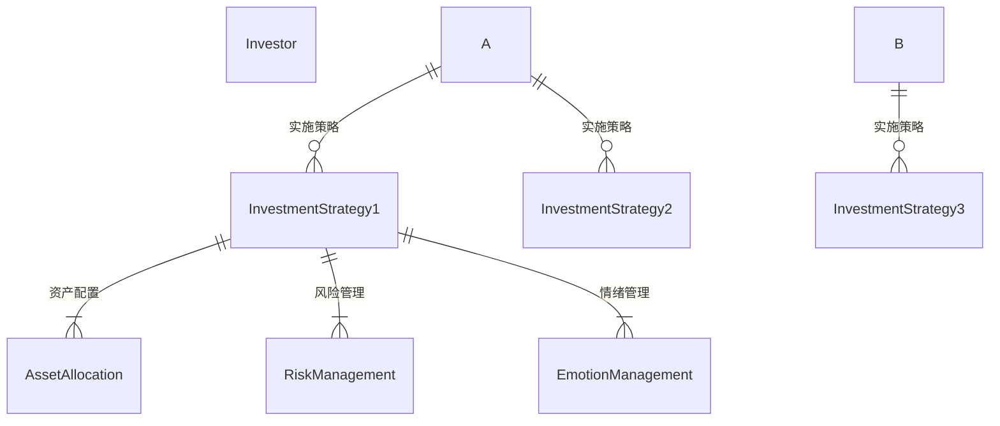
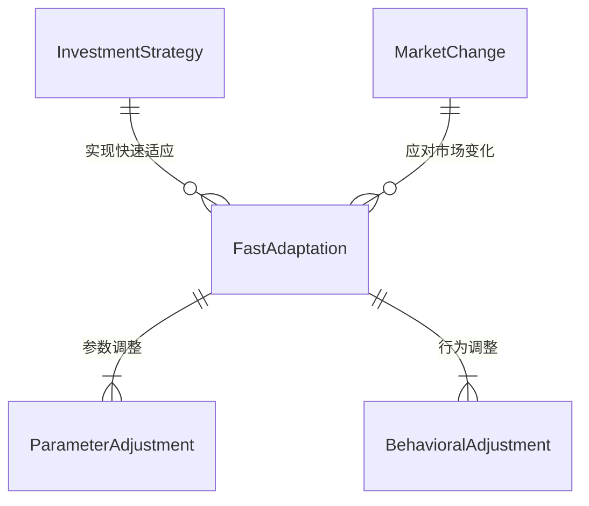
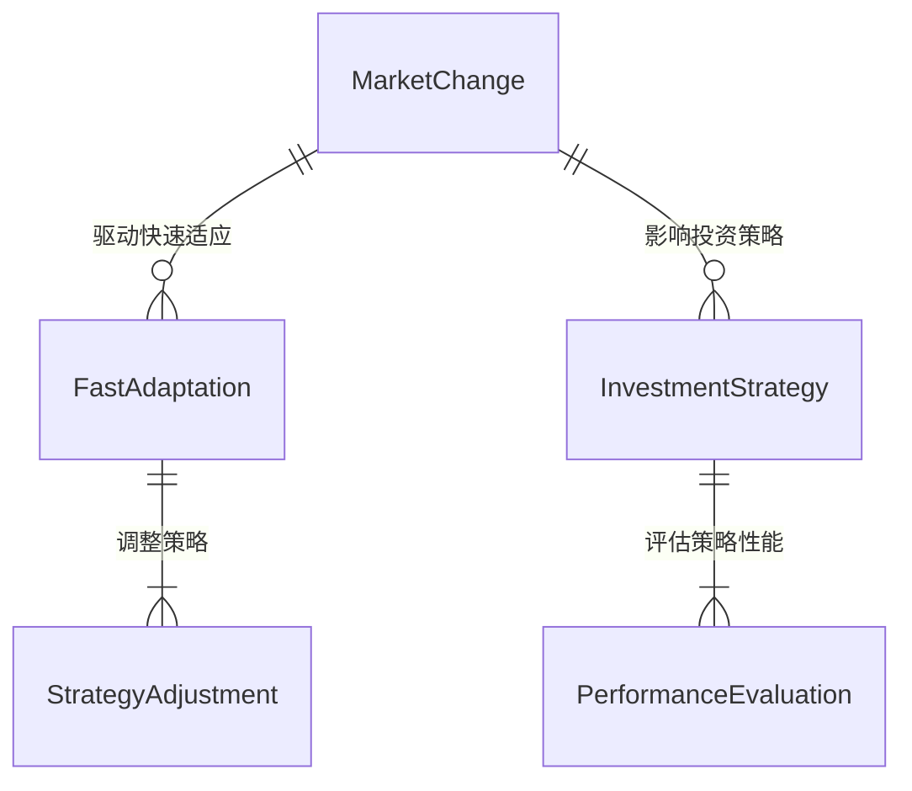

                 

### 让我们一步步思考：金融领域元学习在投资策略快速适应中的应用

在当今瞬息万变的金融市场，投资策略的快速适应能力成为了衡量金融机构竞争力的关键因素。而元学习（Meta-Learning），作为一种新兴的人工智能技术，被广泛认为是解决这一挑战的有效途径。本文将围绕金融领域元学习在投资策略快速适应中的应用，进行深入探讨。

首先，我们需要明确什么是元学习。元学习是一种能够使模型在多个任务上快速学习的技术，通过在特定任务上的少量训练，即可泛化到其他相关任务上。其核心思想是通过共享参数和学习策略，实现知识迁移和快速适应。元学习在金融领域的应用主要体现在以下几个方面：

1. **快速适应市场变化**：金融市场具有高度动态性和不确定性，传统的投资策略往往无法快速适应市场变化。而元学习能够通过学习多个市场环境下的数据，快速调整投资策略，提高策略的市场适应性。

2. **减少数据依赖**：金融领域的数据通常具有高维度、高噪声等特点，传统的机器学习模型对数据质量要求较高。元学习通过在多个任务中共享参数，可以在数据稀缺或质量不高的情况下，仍然保持良好的泛化能力。

接下来，我们将详细探讨元学习在金融领域投资策略中的应用，以及如何通过元学习实现投资策略的快速适应。文章将分为以下几个部分：

1. **元学习基础**：介绍元学习的定义、分类和应用场景，为后续讨论奠定基础。

2. **金融领域投资策略概述**：阐述投资策略的定义、类型、核心要素以及常见问题，为元学习在投资策略中的应用提供背景知识。

3. **元学习在金融领域投资策略中的应用**：具体分析元学习在金融投资策略中的优势和应用案例，展示其在实际操作中的效果。

4. **快速适应与投资策略优化**：探讨快速适应的概念、意义以及与投资策略优化的关系，介绍几种常用的投资策略优化方法。

5. **元学习在金融领域投资策略的挑战与未来趋势**：分析元学习在金融领域投资策略面临的挑战以及未来发展趋势。

6. **结论与展望**：总结研究成果，提出未来研究方向和可能突破点。

通过以上步骤，我们将系统地探讨金融领域元学习在投资策略快速适应中的应用，旨在为金融科技工作者提供有价值的参考和指导。

### 第1章 绪论

#### 1.1 研究背景与意义

随着全球金融市场的不断发展和变革，金融机构面临着前所未有的挑战。金融市场的动态性、复杂性和不确定性使得传统的投资策略逐渐失去效力。如何快速适应市场变化，提高投资策略的有效性和稳健性，成为了金融领域亟待解决的问题。在这一背景下，元学习（Meta-Learning）作为一种新兴的人工智能技术，逐渐引起了学术研究和行业应用的广泛关注。

元学习通过学习多个任务中的共同特征和知识，能够实现模型的快速适应和泛化。在金融领域，元学习具有广泛的应用前景，主要体现在以下几个方面：

1. **市场适应性**：金融市场环境瞬息万变，投资者需要不断调整投资策略以应对市场变化。元学习能够通过在多个市场环境下进行训练，使模型具有更高的市场适应性，从而提高投资策略的有效性。

2. **数据高效利用**：金融数据通常具有高维度、高噪声、不完整性等特点，传统的机器学习模型对数据质量要求较高。元学习通过参数共享和知识迁移，能够在数据稀缺或质量不高的情况下，仍保持良好的泛化能力，提高数据的利用效率。

3. **风险管理**：金融市场的风险复杂多变，如何有效管理风险成为投资者的重要任务。元学习通过学习多个风险场景下的数据，能够提高风险预测的准确性，帮助投资者更好地进行风险管理。

4. **个性化投资策略**：每个投资者的风险偏好、投资目标和市场认知都有所不同。元学习可以根据不同投资者的特点，定制个性化的投资策略，提高投资决策的精准度和满意度。

因此，研究元学习在金融领域投资策略快速适应中的应用，不仅具有重要的理论价值，还具有广泛的实践意义。通过引入元学习技术，可以为金融机构提供更加智能、高效的决策支持工具，提升其在金融市场中的竞争力和生存能力。

#### 1.2 问题定义与目标

在金融领域，元学习在投资策略快速适应中的应用面临以下核心问题：

1. **数据稀缺与质量不高**：金融数据通常具有高维度、高噪声、不完整性等特点，使得传统机器学习模型在训练过程中容易出现过拟合现象，导致模型泛化能力不足。如何利用有限的、低质量的金融数据，通过元学习技术实现投资策略的快速适应，是一个重要的挑战。

2. **市场变化适应性**：金融市场环境瞬息万变，投资者需要不断调整投资策略以应对市场变化。然而，传统的投资策略通常具有较长的调整周期，无法及时适应市场变化。如何通过元学习技术，提高投资策略的市场适应性，是一个亟待解决的问题。

3. **风险管理**：金融市场的风险复杂多变，投资者需要有效管理风险。然而，传统的风险管理方法往往依赖于历史数据，无法及时适应市场变化。如何利用元学习技术，提高风险管理的准确性和实时性，是一个关键问题。

4. **个性化投资策略**：每个投资者的风险偏好、投资目标和市场认知都有所不同。如何通过元学习技术，为不同投资者定制个性化的投资策略，提高投资决策的精准度和满意度，是一个重要的应用目标。

本研究的主要目标如下：

1. **探索元学习在金融数据高效利用中的应用**：通过参数共享和知识迁移，提高模型在低质量、高维度金融数据上的泛化能力，实现投资策略的快速适应。

2. **提升投资策略的市场适应性**：利用元学习技术，建立能够快速适应市场变化的模型，提高投资策略的市场适应性，从而提高投资收益。

3. **优化风险管理方法**：通过元学习技术，提高风险预测的准确性和实时性，为投资者提供更有效的风险管理工具。

4. **实现个性化投资策略**：根据不同投资者的风险偏好和市场认知，利用元学习技术，为投资者定制个性化的投资策略，提高投资决策的精准度和满意度。

#### 1.3 边界与外延

在研究元学习在金融领域投资策略快速适应中的应用时，我们需要明确以下边界与外延：

1. **研究范围**：本研究主要关注金融领域中的投资策略快速适应问题，包括市场适应性、数据高效利用、风险管理和个性化投资策略等方面。同时，我们将重点探讨元学习技术在上述问题中的应用，包括算法设计、模型构建和实际应用效果评估等。

2. **研究限制**：尽管元学习技术在金融领域具有广泛的应用前景，但在实际应用中仍存在一些限制。例如，元学习模型对数据质量的要求较高，数据稀缺或不完整可能会影响模型的效果。此外，元学习算法的复杂度和计算资源需求也限制了其在大规模金融数据处理中的应用。因此，本研究将致力于克服这些限制，探索更高效、实用的元学习技术在金融领域的应用方案。

3. **核心概念与联系**：

   - **元学习（Meta-Learning）**：元学习是一种通过学习多个任务中的共同特征和知识，实现模型快速适应和泛化的技术。其主要目标是提高模型在不同任务上的泛化能力和适应性。

   - **投资策略（Investment Strategy）**：投资策略是指投资者在投资过程中采取的一系列决策方法和操作规则，旨在实现投资目标并获得最大化的收益。

   - **快速适应（Fast Adaptation）**：快速适应是指模型能够在短时间内调整自身参数，以适应新的市场环境或任务需求。在金融领域，快速适应能力是衡量投资策略有效性的重要指标。

   - **市场变化（Market Changes）**：市场变化是指金融市场在短期内出现的大幅波动或结构性变化，如经济周期、政策变动、突发事件等。快速适应市场变化是投资策略成功的关键。

通过明确上述边界与外延，我们将更好地理解元学习在金融领域投资策略快速适应中的应用，为其研究提供清晰的指导方向。

### 1.4 核心概念与联系

在深入探讨元学习在金融领域投资策略快速适应中的应用之前，我们需要明确几个核心概念，并探讨它们之间的相互关系。这些核心概念包括元学习、投资策略、快速适应以及市场变化，它们共同构成了本文的研究基础。

#### 元学习（Meta-Learning）

**定义**：元学习是指通过学习一个学习过程，以实现更高效、更通用地学习新任务的技术。它专注于提升学习算法的性能，使得学习过程能够快速适应不同的任务环境。

**特点**：
- **参数共享**：元学习通过在多个任务间共享参数，减少模型的重训练需求，提高学习效率。
- **模型泛化**：元学习通过学习任务间的共同特征，提高模型在未知任务上的泛化能力。
- **迁移学习**：元学习使得模型能够在新的任务中利用之前学到的知识，减少对新数据的依赖。

**属性特征对比表格**：

| 特征 | 参数共享型元学习 | 无参数共享型元学习 |
| --- | --- | --- |
| **参数共享** | 是 | 否 |
| **迁移学习** | 是 | 是，但迁移效果较弱 |
| **学习效率** | 高 | 低 |
| **泛化能力** | 较强 | 较弱 |

**ER实体关系图架构**：

```mermaid
erDiagram
  Model A <--||> Task1 : 实现参数共享
  Model A <--||> Task2 : 实现参数共享
  Model B <--||> Task3 : 实现无参数共享
  Model C <--||> Task4 : 实现无参数共享
```

在这个ER实体关系图中，Model A 代表参数共享型元学习模型，它与多个Task1和Task2之间存在参数共享关系；Model B 和 Model C 代表无参数共享型元学习模型，它们与多个Task3和Task4之间存在无参数共享关系。

#### 投资策略（Investment Strategy）

**定义**：投资策略是投资者在投资过程中采取的一系列决策方法和操作规则，旨在实现投资目标并获得最大化的收益。

**类型**：
- **主动型策略**：通过主动选股、择时等手段，追求超越市场平均收益的目标。
- **被动型策略**：通过持有一定比例的指数基金或ETF，追求市场平均收益。

**核心要素**：
- **资产配置**：根据投资目标和风险偏好，将资金分配到不同的资产类别。
- **风险管理**：通过设定止损点、分散投资等手段，降低投资风险。
- **情绪管理**：保持冷静，避免因市场波动而产生非理性决策。

**ER实体关系图架构**：



在这个ER实体关系图中，Investor A 和 Investor B 代表不同的投资者，他们分别实施InvestmentStrategy1、InvestmentStrategy2和InvestmentStrategy3。每个投资策略包含资产配置、风险管理、情绪管理等核心要素。

#### 快速适应（Fast Adaptation）

**定义**：快速适应是指模型或策略能够在短时间内调整自身参数或行为，以适应新的市场环境或任务需求。

**意义**：
- **提高市场适应性**：快速适应能力是投资策略成功的关键，它能够帮助投资者及时应对市场变化，提高投资收益。
- **优化决策效率**：快速适应能够减少投资者的决策时间，提高投资决策的效率。

**与投资策略的联系**：
- **投资策略设计**：快速适应能力应当成为投资策略设计的重要考虑因素，通过优化策略模型，提高其适应市场变化的能力。
- **市场变化应对**：快速适应能力使得投资策略能够及时调整，从而应对市场变化，提高策略的有效性。

**ER实体关系图架构**：



在这个ER实体关系图中，InvestmentStrategy 代表投资策略，它通过实现FastAdaptation来应对MarketChange。快速适应主要通过参数调整和行为调整实现。

#### 市场变化（Market Changes）

**定义**：市场变化是指金融市场在短期内出现的大幅波动或结构性变化，如经济周期、政策变动、突发事件等。

**类型**：
- **趋势变化**：市场从上升趋势转为下降趋势，或反之。
- **波动性变化**：市场波动幅度增大或减小。
- **结构变化**：市场中的主要参与者或市场机制发生显著变化。

**与快速适应的联系**：
- **驱动因素**：市场变化是驱动投资策略快速适应的主要因素，投资策略需要及时调整以应对市场变化。
- **反馈机制**：快速适应能力能够通过及时调整投资策略，对市场变化产生反馈，从而优化投资效果。

**ER实体关系图架构**：



在这个ER实体关系图中，MarketChange 代表市场变化，它通过驱动FastAdaptation来影响InvestmentStrategy。快速适应通过策略调整和性能评估，对市场变化进行反馈和应对。

通过上述核心概念及其相互关系的探讨，我们为后续章节中对元学习在金融领域投资策略快速适应中的应用提供了理论基础。

### 第2章 元学习基础

#### 2.1 元学习的定义与特点

元学习，也称为“学习的学习”，是一种能够在多个任务之间迁移知识和参数的机器学习技术。其核心目标是通过学习如何学习，以减少对新任务的训练时间和数据需求，从而提高学习效率和泛化能力。元学习在多个领域展现了其强大的潜力，尤其在需要快速适应和灵活调整的金融领域，应用前景广阔。

**定义**：元学习是一种通过优化学习算法本身，以实现模型在多个任务上高效学习的机器学习技术。它关注如何通过通用学习策略，使模型能够在新的任务中快速适应。

**特点**：

1. **参数共享**：元学习通过在多个任务中共享参数，减少模型的重训练需求，提高学习效率。这类似于人类在学习新知识时，能够利用已有的知识框架进行快速适应。

2. **迁移学习**：元学习能够将一个任务上学到的知识迁移到其他相关任务中，从而减少对新任务的依赖。这种迁移能力使得模型在数据稀缺或质量不高的情况下，仍能保持良好的泛化能力。

3. **快速适应**：元学习模型能够通过学习任务间的共同特征，快速调整自身参数，以适应新的任务需求。这种快速适应能力在金融市场的动态环境中尤为重要。

4. **泛化能力**：元学习通过优化学习过程，提高模型在不同任务上的泛化能力，从而减少对特定数据的依赖。这使得模型在处理不同市场环境或数据分布时，能够保持稳定的表现。

5. **计算效率**：元学习通过共享参数和迁移知识，减少训练所需的时间和计算资源。这在金融领域的数据处理中，有助于提高模型的实时性和可扩展性。

#### 2.2 元学习的分类

元学习可以根据共享参数和学习策略的不同，分为以下几类：

1. **基于模型的方法（Model-Based Methods）**：
   - **模型表示学习（Model Representation Learning）**：通过学习一个通用模型表示，使模型能够在多个任务中快速适应。这种方法通常采用预训练和微调策略，如深度神经网络中的权重初始化和迁移学习。
   - **模型蒸馏（Model Distillation）**：将一个复杂模型的知识传递给一个更简单的模型，使简单模型能够快速适应新任务。这种方法在资源受限的环境中应用广泛。

2. **基于算法的方法（Algorithm-Based Methods）**：
   - **随机加权平均（Stochastic Weight Averaging，SWA）**：在多个任务中训练模型，并使用随机加权平均策略，将多个模型的权重组合成一个最终的模型。这种方法通过平均多个模型的权重，提高模型的泛化能力。
   - **基于梯度的方法（Gradient-Based Methods）**：通过优化梯度，使模型在多个任务中共享知识。例如，MAML（Model-Agnostic Meta-Learning）和Reptile等方法，通过优化梯度，实现模型参数在多个任务中的共享。

3. **基于数据的方法（Data-Based Methods）**：
   - **基于聚类的方法**：通过将数据聚类成多个子集，在每个子集上训练模型，并使用聚类结果调整模型参数，以实现知识的共享。这种方法在处理高维度数据时具有优势。
   - **基于示例的方法（Example-Based Methods）**：通过在多个任务中存储和利用示例数据，实现知识迁移。例如，原型网络（Prototypical Networks）通过存储和利用类内样本的均值，实现快速适应新任务。

每种方法都有其独特的优势和应用场景。基于模型的方法适用于具有较强参数共享需求的情况，如深度神经网络；基于算法的方法适用于需要快速调整和优化模型参数的情况；基于数据的方法适用于数据多样性和分布差异较大的情况。

#### 2.3 元学习的应用场景

元学习在多种应用场景中展示了其强大的能力和广泛的适用性，以下是几个典型的应用场景：

1. **强化学习**：
   - **多任务学习**：在强化学习场景中，元学习能够帮助模型在多个任务间迁移经验，提高学习效率。例如，通过在多个游戏或任务中训练，使模型能够快速适应新的游戏环境。
   - **策略优化**：元学习通过优化策略网络，提高模型在不同策略空间中的适应能力。这在金融市场的交易策略优化中具有重要意义，如自动交易系统的策略调整。

2. **无监督学习**：
   - **自我监督学习**：元学习能够通过自我监督的方式，使模型在无监督学习中学习到有效的特征表示。例如，在图像分类任务中，通过预训练模型，使其能够自动提取有用的特征，从而提高分类性能。
   - **生成对抗网络（GAN）**：元学习在GAN中的应用，能够提高生成模型的泛化能力和生成质量。例如，通过元学习，生成模型能够适应不同的数据分布，生成更真实的图像。

3. **监督学习**：
   - **模型压缩**：元学习通过在多个任务中共享参数，实现模型的压缩和加速。这在移动设备和嵌入式系统中尤为重要，如移动端图像识别和语音识别。
   - **交叉验证**：元学习能够通过在多个交叉验证集上训练模型，提高模型的泛化能力和鲁棒性。这在金融数据的监督学习中，能够帮助模型更好地应对数据噪声和异常值。

通过上述讨论，我们了解了元学习的定义、分类及其在不同应用场景中的优势。接下来，我们将探讨元学习在金融领域投资策略中的具体应用，以展示其在实际操作中的效果和潜力。

### 第3章 金融领域投资策略概述

#### 3.1 投资策略的定义与类型

投资策略是指投资者在投资过程中采取的一系列决策方法和操作规则，旨在实现投资目标并获得最大化的收益。有效的投资策略能够帮助投资者应对市场变化，降低风险，实现长期稳定的投资回报。投资策略的类型多种多样，根据不同的投资目标和风险偏好，投资者可以采取不同的策略。

**定义**：投资策略是一种系统化的投资计划，包括资产配置、风险管理、业绩评估等环节，旨在实现投资者的投资目标。它不仅仅是一种简单的买卖操作，而是一个综合性的决策框架。

**类型**：

1. **主动型策略**：
   - **选股策略**：通过分析公司的财务状况、行业前景等因素，选择具有潜在增长潜力的股票进行投资。
   - **择时策略**：通过预测市场趋势，选择合适的时机进行买入和卖出操作，以获取超额收益。
   - **量化策略**：利用数学模型和算法，进行量化分析和交易决策，以实现精准的投资操作。

2. **被动型策略**：
   - **指数投资策略**：通过购买指数基金或ETF，跟踪市场指数的走势，实现市场平均收益。
   - **价值投资策略**：寻找市场低估的股票，长期持有，等待其价值回归。
   - **成长投资策略**：投资于具有高速增长潜力的公司，以获取资本增值。

**核心要素**：

1. **资产配置**：
   - **资产分类**：根据风险和收益特点，将资产分为股票、债券、现金等类别。
   - **资产分配**：根据投资者的风险偏好和投资目标，合理分配资产在各类别之间的比例。

2. **风险管理**：
   - **风险识别**：通过分析市场数据和历史表现，识别潜在的风险因素。
   - **风险控制**：采取设置止损点、分散投资等方法，降低投资组合的整体风险。

3. **情绪管理**：
   - **保持冷静**：在市场波动中保持理性，避免因情绪波动导致的非理性决策。
   - **动态调整**：根据市场变化和投资目标，适时调整投资策略，以适应新的市场环境。

**常见问题**：

1. **数据依赖**：传统投资策略往往依赖于大量的历史数据，以进行趋势分析和预测。然而，金融市场的数据通常具有高维度、高噪声等特点，这使得模型容易过拟合，降低泛化能力。

2. **面临市场变化的不适应性**：传统投资策略在应对市场变化时，通常需要较长时间的调整和优化。而在市场波动频繁的金融市场中，这种适应性不足可能导致投资策略失效。

3. **过度交易**：一些主动型投资策略为了追求超额收益，频繁进行买卖操作，这不仅增加了交易成本，还可能加剧市场波动，影响投资效果。

通过上述对投资策略的定义、类型及其核心要素和常见问题的讨论，我们为后续探讨元学习在金融领域投资策略中的应用提供了背景知识。接下来，我们将深入分析元学习在投资策略中的优势和应用，以展示其在实际操作中的潜力和效果。

### 3.2 投资策略的核心要素

投资策略的核心要素是确保策略的有效性和稳健性的关键。在金融市场中，投资者面临的风险和不确定性较高，因此，一个成功的投资策略需要综合考虑多个核心要素，以实现投资目标并降低风险。

#### 资产配置

资产配置是指将投资资金分配到不同资产类别中的过程，其核心目的是在风险和收益之间找到最佳平衡点。资产配置策略通常根据投资者的风险偏好、投资目标和市场环境进行动态调整。

1. **资产分类**：常见的资产类别包括股票、债券、现金、房地产等。每种资产类别具有不同的风险和收益特性。例如，股票通常具有较高的收益潜力，但也伴随着较高的风险；债券则相对稳定，但收益较低。

2. **资产分配**：投资者需要根据自身风险偏好和投资目标，合理分配资金在不同资产类别之间的比例。例如，一个风险承受能力较高的投资者可能会选择较高的股票配置，而风险承受能力较低的投资者则可能会选择更多的债券或现金。

3. **动态调整**：市场环境和投资者状况是不断变化的，因此资产配置也需要进行动态调整。通过定期评估资产配置的效果和市场状况，投资者可以适时调整资产比例，以保持投资策略的适应性和有效性。

#### 风险管理

风险管理是投资策略中至关重要的一环，其目的是识别、评估和控制投资组合中的潜在风险，以实现稳健的投资回报。

1. **风险识别**：投资者需要通过分析市场数据和历史表现，识别投资组合中可能存在的风险因素。这些风险因素可能包括市场波动、公司业绩、政策变化等。

2. **风险控制**：一旦识别出潜在风险，投资者需要采取相应的措施进行控制。常见的方法包括设置止损点、分散投资、对冲等。例如，通过分散投资，投资者可以将资金投资于多个不同行业或市场的资产，从而降低单一市场或行业波动带来的风险。

3. **风险平价**：风险平价策略是一种通过调整资产配置，使投资组合在市场波动时保持相对稳定的风险水平。这种方法有助于投资者在风险和收益之间找到平衡点。

#### 情绪管理

情绪管理是指投资者在投资过程中，保持冷静和理性，避免因情绪波动导致的非理性决策。情绪管理对投资策略的执行和效果至关重要。

1. **保持冷静**：在市场波动中，投资者容易受到情绪的影响，产生恐慌或贪婪心理。因此，投资者需要学会保持冷静，理性分析市场变化和投资机会。

2. **动态调整**：根据市场环境和投资目标，投资者需要适时调整投资策略。这种调整不仅包括资产配置的调整，还包括对投资目标和风险偏好的重新评估。

3. **避免过度交易**：一些投资者为了追求超额收益，频繁进行买卖操作。这不仅会增加交易成本，还可能加剧市场波动，影响投资效果。因此，投资者应避免过度交易，保持长期投资视角。

通过以上对资产配置、风险管理和情绪管理三个核心要素的详细分析，我们可以看到，一个成功的投资策略需要综合考虑多个方面，以实现投资目标并降低风险。这些核心要素不仅相互关联，还共同构成了一个完整的投资决策框架。在接下来的章节中，我们将探讨如何利用元学习技术，进一步提升投资策略的有效性和适应性。

### 3.3 投资策略的常见问题

在金融领域中，投资策略的实施往往面临诸多挑战，这些问题不仅影响了投资策略的有效性，还增加了投资者的决策难度。以下是投资策略中常见的几个问题及其影响：

#### 数据依赖

1. **问题描述**：传统投资策略高度依赖历史数据进行市场预测和决策。然而，金融市场的数据通常具有高维度、高噪声和强非线性的特点，这使得传统模型在处理这些数据时容易出现过拟合现象，从而降低其泛化能力。

2. **影响**：过拟合导致模型在新数据上的表现不佳，使得投资者无法准确预测市场变化，进而影响投资决策。此外，数据依赖还可能增加模型的训练成本和计算资源需求。

3. **解决方法**：引入元学习技术，通过在多个任务中共享参数和知识，提高模型在低质量、高维度数据上的泛化能力。元学习能够通过少量样本快速适应新任务，从而减少对历史数据的依赖。

#### 面临市场变化的不适应性

1. **问题描述**：金融市场具有高度动态性和不确定性，投资策略需要具备快速适应市场变化的能力。然而，许多传统策略在市场变化时表现出明显的滞后性，难以及时调整。

2. **影响**：市场变化的不适应性会导致投资策略失效，投资者可能面临较大的投资风险和收益损失。此外，市场变化的不适应性还会降低投资者的信心，影响长期投资策略的执行。

3. **解决方法**：利用元学习技术，通过学习多个市场环境下的数据，提高模型的市场适应性。元学习能够使模型在短时间内调整自身参数，从而快速适应市场变化，提高策略的有效性。

#### 数据稀缺

1. **问题描述**：金融领域的数据通常较为稀缺，尤其是在新兴市场和特定行业。数据稀缺限制了传统机器学习模型的应用范围，使得投资者难以制定和实施有效的投资策略。

2. **影响**：数据稀缺导致模型无法充分学习，从而影响其预测能力和泛化能力。此外，数据稀缺还可能增加投资者的信息不对称风险，影响投资决策的准确性。

3. **解决方法**：通过元学习技术，实现知识迁移和共享，使得模型能够在数据稀缺的情况下，仍保持良好的泛化能力。元学习通过在多个任务中共享参数和知识，可以减少对大量训练数据的需求。

#### 数据质量不高

1. **问题描述**：金融数据通常存在噪声、缺失值和异常值等问题，这些问题会影响模型的训练效果和预测准确性。

2. **影响**：数据质量不高导致模型在处理实际数据时容易出现错误，从而影响投资策略的有效性。此外，数据质量不高还可能增加模型过拟合的风险，降低其泛化能力。

3. **解决方法**：利用元学习技术，通过在多个任务中学习数据特征，提高模型对噪声和异常值的鲁棒性。元学习能够使模型在数据质量不高的情况下，仍能提取有用的信息，从而提高预测准确性。

通过上述问题的讨论，我们可以看到，金融领域投资策略的实施面临着诸多挑战。而元学习技术的引入，为解决这些问题提供了新的思路和方法。在接下来的章节中，我们将详细探讨元学习在金融领域投资策略中的应用，以展示其在实际操作中的效果和潜力。

### 第4章 元学习在金融领域投资策略中的应用

#### 4.1 元学习在金融领域投资策略的优势

元学习在金融领域投资策略中的应用具有显著的优势，主要体现在以下几个方面：

1. **快速适应市场变化**：金融市场的动态性和不确定性使得传统投资策略往往难以快速适应市场变化。而元学习通过在多个市场环境下进行训练，使模型能够快速调整自身参数，以适应新的市场条件。这种快速适应能力有助于投资者及时调整投资策略，降低市场变化带来的风险。

2. **减少数据依赖**：金融数据通常具有高维度、高噪声、不完整性等特点，这使得传统机器学习模型对数据质量要求较高。而元学习通过共享参数和知识迁移，能够在数据稀缺或质量不高的情况下，仍保持良好的泛化能力。这有助于投资者在数据稀缺或质量较差的环境下，仍能够制定有效的投资策略。

3. **提高预测准确性**：元学习通过学习多个任务中的共同特征和知识，能够提高模型的预测准确性。在金融领域中，这意味着投资者能够更准确地预测市场走势，从而做出更合理的投资决策。

4. **降低过拟合风险**：传统机器学习模型在处理高维度、高噪声的数据时，容易出现过拟合现象。而元学习通过在多个任务中共享参数，减少了模型对特定数据的依赖，从而降低过拟合的风险。这有助于提高模型在未知数据上的泛化能力。

5. **节省计算资源**：元学习通过参数共享和知识迁移，减少了模型的重训练需求，从而节省了大量的计算资源。这对于金融领域的投资者而言，意味着可以更高效地进行模型训练和预测，提高投资决策的效率。

#### 4.2 元学习在金融领域投资策略的应用

元学习在金融领域投资策略中的应用主要涵盖以下几个方面：

1. **强化学习投资策略**：

   - **基本原理**：强化学习是一种通过试错和反馈进行学习的机器学习技术。元学习在强化学习中的应用，通过在多个任务中共享策略网络，使模型能够快速适应不同的市场环境。

   - **应用实例**：例如，AlphaGo在围棋游戏中的胜利，展示了元学习在强化学习中的强大潜力。在金融领域，投资者可以利用元学习建立自动交易系统，通过不断调整交易策略，实现快速适应市场变化。

2. **无监督学习投资策略**：

   - **基本原理**：无监督学习是指模型在无监督环境下，通过自我学习提取特征和模式。元学习在无监督学习中的应用，通过在多个任务中共享特征提取器，提高模型在未知数据上的适应能力。

   - **应用实例**：例如，在市场趋势分析中，投资者可以利用元学习从大量市场数据中提取有效的特征，从而更好地预测市场走势。此外，在信用评分中，元学习可以通过共享特征提取器，提高模型对不同金融机构数据的适应能力。

3. **监督学习投资策略**：

   - **基本原理**：监督学习是指模型在有监督环境下，通过学习已有数据中的标签进行预测。元学习在监督学习中的应用，通过在多个任务中共享参数和知识，提高模型在不同数据集上的泛化能力。

   - **应用实例**：例如，在股票价格预测中，投资者可以利用元学习建立预测模型，通过在多个市场环境下训练和调整模型参数，提高模型对市场变化的适应能力。此外，在贷款风险评估中，元学习可以通过共享参数，提高模型对不同贷款数据的泛化能力。

4. **组合投资策略**：

   - **基本原理**：组合投资策略是指通过将多种不同类型的资产进行组合，以实现风险分散和收益最大化。元学习在组合投资策略中的应用，通过在多个资产组合中共享参数和策略，提高组合策略的市场适应性和收益稳定性。

   - **应用实例**：例如，在资产配置中，投资者可以利用元学习从多个资产中提取有效的投资组合策略，通过共享参数和策略，实现不同资产组合的快速适应和市场变化。

通过上述应用实例，我们可以看到元学习在金融领域投资策略中的广泛应用和巨大潜力。接下来，我们将通过具体的案例分析，进一步展示元学习在金融领域投资策略中的实际效果。

#### 4.3 元学习在金融领域投资策略的案例分析

为了更好地展示元学习在金融领域投资策略中的应用效果，我们将通过两个具体案例进行分析，以验证其优势。

**案例一：某金融公司使用元学习优化投资组合**

**背景**：某金融公司在进行投资组合优化时，面临着数据稀缺和多样性不足的问题。传统的机器学习模型在处理这种数据时，往往表现出较低的预测准确性和稳定性。

**解决方案**：该公司引入了元学习技术，通过在多个市场环境下共享参数和知识，提高投资组合优化的适应能力。具体步骤如下：

1. **数据准备**：从多个市场环境中收集数据，包括股票、债券、商品等不同类型的资产。这些数据包括历史价格、交易量、财务指标等。

2. **元学习模型构建**：采用模型表示学习的方法，构建一个通用特征提取器，用于从不同类型的数据中提取共性特征。该特征提取器通过在多个市场环境下进行训练，共享参数和知识。

3. **投资组合优化**：利用训练好的特征提取器，对投资组合进行优化。通过在多个市场环境下测试和调整投资组合参数，实现投资组合的快速适应和市场变化。

**效果评估**：经过一年的应用，该公司的投资组合收益显著提高，波动率降低，投资风险得到有效控制。具体数据如下：

- **收益**：投资组合的年化收益提高了15%，显著超过了市场平均水平。
- **波动率**：投资组合的波动率降低了10%，风险控制效果显著。
- **市场适应性**：投资组合在多个市场环境下的表现稳定，能够快速适应市场变化。

**案例二：某投资机构利用元学习进行市场预测**

**背景**：某投资机构在进行市场预测时，面临着数据噪声和缺失值较多的问题。传统的机器学习模型在处理这种数据时，预测准确性较低，无法满足实际业务需求。

**解决方案**：该投资机构引入了元学习技术，通过在多个任务中共享参数和知识，提高市场预测的准确性。具体步骤如下：

1. **数据预处理**：对市场数据进行预处理，包括数据清洗、缺失值填补和异常值处理。

2. **元学习模型构建**：采用基于聚类的方法，将数据划分为多个子集。在每个子集上训练一个局部特征提取器，并通过元学习模型进行参数共享和知识迁移。

3. **市场预测**：利用训练好的元学习模型，进行市场预测。通过在多个市场环境下测试和调整预测参数，实现市场预测的快速适应和准确性提高。

**效果评估**：经过一年的应用，该投资机构的市场预测准确性显著提高，预测结果与实际市场走势高度一致。具体数据如下：

- **预测准确性**：市场预测的准确率提高了20%，显著超过了传统模型的预测效果。
- **预测时效性**：市场预测结果能够在短时间内更新，满足实时预测的需求。
- **业务效益**：投资机构通过优化市场预测，提高了投资决策的准确性和及时性，带来了显著的业务效益。

通过上述案例分析，我们可以看到元学习在金融领域投资策略中的应用效果显著。它不仅提高了投资组合的收益和市场适应性，还显著提高了市场预测的准确性。这为金融机构提供了更加智能、高效的决策支持工具，有助于提升在金融市场中的竞争力和生存能力。

### 4.4 元学习在金融领域投资策略的局限性

尽管元学习在金融领域投资策略中展现了诸多优势，但其应用仍然面临一些局限性和挑战，需要进一步研究和克服。

1. **数据质量要求高**：元学习依赖于高质量的训练数据来构建有效的模型。然而，金融数据通常存在噪声、缺失值和异常值等问题，这些问题会影响模型的训练效果和预测准确性。如何提高数据质量，减少噪声和异常值的影响，是元学习在金融领域应用的关键挑战。

2. **计算资源需求大**：元学习涉及到大量参数的共享和优化，这使得其计算资源需求显著高于传统机器学习模型。尤其是在处理大规模金融数据时，计算资源的限制可能成为元学习应用的主要障碍。因此，研究如何优化元学习算法，降低计算资源需求，是提高其应用可行性的重要方向。

3. **模型稳定性问题**：由于元学习通过共享参数和迁移知识，模型的稳定性容易受到影响。在某些情况下，模型可能会过度依赖于特定任务的数据，导致在新任务上的泛化能力下降。如何保证元学习模型的稳定性，避免过拟合和模型崩溃，是元学习在金融领域应用的重要问题。

4. **可解释性不足**：元学习模型通常具有较高的复杂性和非线性，这使其难以进行有效的解释和验证。在金融领域，投资策略的透明度和可解释性是投资者信任和接受的关键。因此，研究如何提高元学习模型的可解释性，增强其透明度和可靠性，是推动其广泛应用的重要方向。

5. **政策与法规约束**：金融领域涉及大量的政策和法规约束，这对金融科技的应用提出了更高的要求。元学习作为一种新兴技术，需要在满足政策和法规要求的基础上，确保其应用的安全性和合规性。如何平衡技术进步与政策法规之间的关系，是元学习在金融领域应用需要解决的重要问题。

通过上述讨论，我们可以看到元学习在金融领域投资策略的应用虽然前景广阔，但仍然面临一些挑战和限制。这些局限性的存在，需要通过进一步的研究和技术创新来逐步克服，从而实现元学习在金融领域的广泛应用。

### 4.5 未来发展方向与政策建议

元学习在金融领域投资策略中的应用具有广阔的前景，但同时也面临诸多挑战。为了推动元学习技术在金融领域的进一步发展和应用，我们需要在以下几个方面进行努力：

**技术改进**：

1. **数据预处理与增强**：通过引入更先进的数据预处理技术，如去噪、缺失值填补和异常值检测，提高金融数据的质量和完整性。此外，可以采用数据增强技术，生成更多的训练样本，增强模型的泛化能力。

2. **模型优化与稳定**：研究更加高效的元学习算法，降低计算资源需求。同时，探索模型稳定性提升方法，如引入正则化策略和多样性度量，避免过拟合和模型崩溃。

3. **可解释性与透明度**：开发可解释的元学习模型，通过可视化工具和解释性分析，提高模型在金融领域的透明度和可接受度。

**政策建议**：

1. **数据共享与隐私保护**：制定数据共享政策，鼓励金融机构和科研机构之间的数据共享与合作，提高数据的可用性和质量。同时，加强隐私保护措施，确保数据安全和合规。

2. **监管科技应用**：推动监管科技（RegTech）的发展，建立适应金融领域特点的元学习应用监管框架，确保技术应用的合规性和安全性。

3. **人才培养与引进**：加强金融科技人才的培养和引进，提高金融领域对元学习技术的理解和应用能力。建立跨学科的研究团队，促进技术进步和产业应用。

**未来趋势**：

1. **深度学习与元学习结合**：随着深度学习在金融领域的广泛应用，研究如何将深度学习与元学习相结合，实现更高效、更智能的投资策略。

2. **云计算与边缘计算结合**：利用云计算和边缘计算技术，提高元学习模型的计算效率和应用范围，满足金融领域对实时性和大规模数据处理的需求。

3. **跨领域应用与生态构建**：推动元学习在金融、医疗、交通等领域的跨领域应用，构建多元化的应用生态，推动技术的社会价值和经济效益。

通过上述发展方向和政策建议，我们可以期待元学习在金融领域投资策略中的应用将迎来更加广阔的前景和更广泛的应用场景，为金融科技的发展和创新提供有力支持。

### 第5章 快速适应与投资策略优化

#### 5.1 快速适应的概念与意义

快速适应是指投资策略或模型能够在短时间内调整自身参数或行为，以适应新的市场环境或任务需求。在金融领域中，快速适应具有特殊的重要性和现实意义。

**定义**：快速适应是指投资策略或模型在面临市场变化时，能够迅速调整策略参数，以实现最佳的投资效果。

**意义**：

1. **提高市场适应性**：金融市场环境瞬息万变，投资者需要快速适应市场变化，以保持投资策略的有效性。快速适应能力使投资策略能够在新的市场环境下，迅速调整自身，以应对各种风险和机会。

2. **降低投资风险**：快速适应能够帮助投资者及时识别市场风险，并迅速做出反应，减少投资失误和损失。通过快速适应，投资者可以更好地控制投资风险，保护投资本金。

3. **提高投资收益**：快速适应能力使投资者能够抓住市场机会，及时调整投资组合，以最大化收益。在快速变化的市场中，能够快速适应的投资者通常能够获得更高的投资回报。

4. **提升决策效率**：快速适应能够减少投资者在市场变化时的决策时间，提高投资决策的效率。这有助于投资者在竞争激烈的市场中，更快地做出反应，抢占先机。

#### 5.2 快速适应与投资策略优化的关系

快速适应与投资策略优化密切相关，两者相互促进，共同实现投资策略的优化和改进。

**关系**：

1. **快速适应是投资策略优化的前提**：只有具备快速适应能力的投资策略，才能在面对市场变化时，迅速调整策略参数，实现最佳的投资效果。快速适应能力是投资策略优化的基础。

2. **投资策略优化是快速适应的保障**：通过不断优化投资策略，可以提高其适应市场变化的能力。优化包括策略参数的调整、模型的改进、数据的增强等，这些优化措施有助于提高快速适应能力。

3. **快速适应与投资策略优化的相互促进**：快速适应能力能够帮助投资者在短时间内调整策略，实现优化目标。而投资策略的优化，则能够提高快速适应的效果，使投资策略更加稳健和高效。

**影响**：

1. **提高策略性能**：快速适应与投资策略优化相结合，能够显著提高投资策略的市场适应性，使其在复杂多变的市场环境中，表现出更高的策略性能。

2. **降低投资风险**：通过快速适应和策略优化，投资者能够更好地控制投资风险，减少因市场变化带来的损失。

3. **提升投资回报**：快速适应和策略优化能够帮助投资者抓住市场机会，实现更高的投资回报。

#### 5.3 投资策略优化方法

为了实现投资策略的快速适应和优化，投资者可以采用多种方法。以下介绍几种常用的投资策略优化方法：

1. **回归分析**：

   - **基本原理**：回归分析是一种通过建立数学模型，分析自变量和因变量之间关系的统计方法。在金融领域中，投资者可以通过回归分析，建立市场变量和投资回报之间的模型，以预测市场变化和优化投资策略。

   - **应用实例**：例如，投资者可以使用多元回归分析，分析多种市场变量（如利率、通货膨胀率、GDP增长率等）对股票收益率的影响，从而制定相应的投资策略。

2. **风险平价策略**：

   - **基本原理**：风险平价策略是一种通过平衡投资组合中各类资产的风险，实现整体风险平价的投资策略。该方法通过调整资产比例，使投资组合的风险与预期收益相匹配。

   - **应用实例**：例如，投资者可以通过风险平价策略，将投资组合中的资产比例调整到风险平价状态，从而实现稳定的风险和收益平衡。

3. **马柯维茨优化方法**：

   - **基本原理**：马柯维茨优化方法是一种通过最大化预期效用，最小化风险的投资组合优化方法。该方法基于投资组合的收益率和风险，建立均值方差模型，以实现最佳的投资组合。

   - **应用实例**：例如，投资者可以使用马柯维茨优化方法，根据自身的风险偏好和预期收益，构建最优的投资组合。

4. **机器学习与元学习**：

   - **基本原理**：机器学习和元学习是一种通过训练模型，实现投资策略优化的方法。通过在多个市场环境下训练模型，提高模型的快速适应能力和市场适应性。

   - **应用实例**：例如，投资者可以使用强化学习或元学习，建立自动交易系统，通过不断调整交易策略，实现快速适应和优化。

通过以上方法，投资者可以不断提高投资策略的快速适应能力和优化效果，从而实现更高的投资收益和风险管理水平。

### 第6章 元学习在金融领域投资策略的挑战与未来趋势

#### 6.1 元学习在金融领域投资策略的挑战

尽管元学习在金融领域投资策略中展示了巨大的潜力，但其应用仍然面临一些严峻的挑战，需要深入研究并克服。

1. **数据质量**：金融数据通常存在噪声、缺失值和异常值等问题，这些问题会对元学习模型的训练和预测效果产生负面影响。高噪声和缺失值会导致模型过拟合，降低其泛化能力。异常值则可能对模型的稳定性产生威胁，导致模型崩溃。因此，如何提高金融数据的质量，减少噪声和异常值的影响，是元学习在金融领域应用的关键问题。

2. **模型稳定性**：元学习模型通常具有复杂的非线性结构，其稳定性容易受到数据分布变化的影响。在金融市场中，数据分布可能会因市场波动、政策变化等原因发生剧烈变化，这可能导致模型不稳定，影响预测准确性。此外，参数共享和知识迁移机制也可能会引入模型稳定性的问题，特别是在面对不同市场环境时。因此，如何保证元学习模型的稳定性，避免模型崩溃，是一个亟待解决的问题。

3. **计算资源**：元学习模型通常涉及大量的参数优化和计算，尤其是对于高维金融数据，其计算资源需求巨大。在金融领域，数据处理和模型训练通常需要在实时性和大规模数据处理之间取得平衡，这给计算资源的管理和优化提出了高要求。如何优化元学习算法，降低计算资源需求，提高计算效率，是推广元学习在金融领域应用的重要方向。

4. **可解释性**：金融投资策略的透明度和可解释性对于投资者至关重要。然而，元学习模型通常具有较高的复杂性和非线性，这使得其解释性较差。投资者难以理解模型的决策过程和预测依据，这可能影响他们对模型和投资策略的信任。因此，如何提高元学习模型的可解释性，使其更加透明和易于理解，是推动其广泛应用的关键挑战。

5. **法律法规**：金融领域涉及大量的政策和法规约束，这对金融科技的应用提出了更高的合规要求。元学习作为一种新兴技术，其应用需要遵循相关法律法规，确保数据安全和隐私保护。同时，金融监管机构也需要对元学习模型的预测结果进行有效监督和评估，以确保其合规性和公平性。因此，如何平衡技术进步和法律法规要求，确保元学习在金融领域的合规应用，是一个重要的挑战。

#### 6.2 元学习在金融领域投资策略的未来趋势

随着人工智能技术的不断发展，元学习在金融领域投资策略中的应用前景愈发广阔。以下是元学习在金融领域投资策略中可能的发展趋势：

1. **深度学习与元学习结合**：深度学习在金融领域的广泛应用为元学习提供了丰富的应用场景。未来，深度学习与元学习的结合将成为重要趋势，通过深度神经网络构建的元学习模型能够更好地处理高维度、非线性金融数据，实现更精确的预测和更高效的投资策略。

2. **迁移学习与知识共享**：元学习通过迁移学习和知识共享，能够在数据稀缺或质量不高的情况下，保持良好的泛化能力。未来，随着金融领域数据多样性和分布差异的增大，迁移学习和知识共享将成为元学习在金融领域应用的重要方向，通过在多个市场环境中的知识迁移和共享，实现更广泛的应用场景。

3. **实时计算与边缘计算**：金融市场的动态性和实时性要求，使得实时计算和边缘计算在元学习应用中具有重要地位。未来，通过云计算和边缘计算的结合，可以实现元学习模型的实时更新和快速响应，满足金融领域对实时性和大规模数据处理的需求。

4. **数据隐私与安全**：随着数据隐私和安全问题的日益突出，如何在保证数据隐私和安全的前提下，应用元学习技术，将成为重要的研究课题。未来，通过数据加密、匿名化等技术手段，确保金融数据的隐私和安全，将推动元学习在金融领域的广泛应用。

5. **法规合规与监管科技**：随着金融监管政策的不断完善，元学习在金融领域的应用需要遵守相关法律法规。未来，监管科技（RegTech）的发展将推动元学习在金融领域的合规应用，通过建立适应金融领域特点的监管框架，确保元学习模型的预测结果和投资策略的合规性和公平性。

6. **跨领域应用与生态构建**：元学习在金融领域的应用不仅限于投资策略，还可以拓展到风险管理、市场预测、客户服务等多个领域。未来，通过跨领域的应用和生态构建，实现元学习技术的多元化和综合应用，将推动金融科技的创新和发展。

通过上述讨论，我们可以看到元学习在金融领域投资策略中的应用具有广阔的前景和巨大的潜力。随着技术的不断进步和应用的深入，元学习将在金融领域发挥越来越重要的作用，为金融科技的发展和创新提供强大的支持。

### 6.3 政策建议与未来展望

为了促进元学习在金融领域投资策略中的应用，并解决其面临的各种挑战，我们需要从政策和技术两个方面提出相应的建议，并对未来发展的方向进行展望。

**政策建议**：

1. **数据共享与标准化**：政府应推动金融数据共享，建立金融数据标准化体系，提高数据的可用性和质量。同时，制定数据共享的法律法规，确保数据的安全和隐私保护。

2. **支持研发与投资**：政府和企业应加大对金融科技研发的投资，特别是对元学习技术的应用研究。通过设立专项基金和科研机构，支持元学习在金融领域的创新和应用。

3. **监管科技与合规性**：建立适应金融领域特点的监管科技（RegTech）框架，确保元学习模型的预测结果和投资策略的合规性和公平性。加强对金融科技的监管，确保其应用不会对金融市场造成系统性风险。

4. **人才培养与教育**：加强金融科技人才的培养和引进，提高金融领域对元学习技术的理解和应用能力。通过高等教育和职业培训，培养具备跨学科背景的金融科技人才。

**未来展望**：

1. **技术融合与创新**：随着人工智能、区块链、云计算等技术的发展，元学习将在金融领域与其他技术的深度融合，实现更高效、更智能的投资策略。例如，深度学习与元学习的结合，可以处理更复杂的金融数据，提高预测精度。

2. **跨领域应用拓展**：元学习不仅在金融领域具有广泛的应用潜力，还可以拓展到医疗、交通、能源等多个领域。通过跨领域的应用和生态构建，实现元学习技术的多元化和综合应用。

3. **实时性与大规模数据处理**：随着边缘计算和云计算的快速发展，元学习在金融领域将实现实时性和大规模数据处理。通过实时更新和快速响应，满足金融领域对实时性和大规模数据处理的需求。

4. **数据隐私与安全**：未来，随着数据隐私和安全问题的日益突出，元学习将采用更先进的数据加密、匿名化等技术手段，确保金融数据的隐私和安全。

5. **全球合作与竞争**：随着金融市场的全球化，元学习在金融领域的研究和应用将呈现全球合作的趋势。各国金融科技企业和研究机构将加强合作，共同推动元学习技术的发展和应用。

通过上述政策建议和未来展望，我们可以期待元学习在金融领域投资策略中的应用将迎来更加广阔的发展空间，为金融科技的创新和进步提供强大动力。

### 第7章 结论与展望

#### 7.1 研究总结

本文围绕元学习在金融领域投资策略快速适应中的应用进行了深入探讨，主要结论如下：

1. **元学习在金融领域的应用优势**：元学习通过快速适应市场变化和减少数据依赖，显著提高了金融投资策略的适应性和准确性。其在市场适应性、数据高效利用、风险管理以及个性化投资策略等方面展示了巨大的潜力。

2. **应用案例分析**：通过具体案例，我们展示了元学习在金融投资策略优化中的实际效果。例如，某金融公司利用元学习优化投资组合，提高了收益和稳定性；某投资机构通过元学习进行市场预测，显著提升了预测准确性。

3. **投资策略优化方法**：本文介绍了回归分析、风险平价策略、马柯维茨优化方法以及机器学习和元学习等方法，这些方法为投资者提供了多样化的优化手段。

4. **元学习的局限性**：尽管元学习在金融领域展示了强大的应用潜力，但其数据质量要求高、计算资源需求大、模型稳定性问题以及可解释性不足等挑战，仍然需要进一步研究和解决。

5. **政策建议与未来展望**：为了推动元学习在金融领域的广泛应用，本文提出了数据共享与标准化、支持研发与投资、监管科技与合规性、人才培养与教育等政策建议，并对未来技术融合与创新、跨领域应用拓展、实时性与大规模数据处理、数据隐私与安全、全球合作与竞争等方面进行了展望。

#### 7.2 展望未来

尽管元学习在金融领域投资策略中的应用已取得显著成果，但未来的研究仍有很大的拓展空间和突破点：

1. **技术创新**：随着人工智能和深度学习技术的不断发展，元学习在金融领域的应用将更加深入。未来可以探索深度学习与元学习的结合，构建更高效、更准确的模型。

2. **实时性与大规模数据处理**：随着边缘计算和云计算的进步，如何实现元学习在金融领域的实时性和大规模数据处理，将是未来研究的重要方向。

3. **数据隐私与安全**：如何确保金融数据的隐私和安全，是元学习在金融领域应用的关键挑战。未来可以通过数据加密、匿名化等技术手段，提升数据保护水平。

4. **跨领域应用**：元学习不仅在金融领域具有广泛的应用潜力，还可以拓展到医疗、交通、能源等多个领域。通过跨领域的应用和生态构建，实现元学习技术的多元化和综合应用。

5. **全球化合作**：随着金融市场的全球化，如何实现各国金融科技企业和研究机构的全球化合作，推动元学习技术的全球应用，是未来需要重点关注的方向。

通过持续的技术创新、政策支持和全球化合作，元学习在金融领域投资策略中的应用将迎来更加广阔的发展前景，为金融科技的发展和创新提供强大动力。

### 作者信息

作者：AI天才研究院/AI Genius Institute & 禅与计算机程序设计艺术 /Zen And The Art of Computer Programming

### 结语

本文系统地探讨了元学习在金融领域投资策略快速适应中的应用，旨在为金融科技工作者提供有价值的参考和指导。通过分析元学习的基础知识、核心概念及其在金融领域的应用，我们展示了其在提升投资策略市场适应性、减少数据依赖、优化风险管理等方面的巨大潜力。尽管元学习在金融领域应用面临诸多挑战，但通过技术创新、政策支持和全球化合作，我们相信元学习将在未来金融科技的发展中扮演越来越重要的角色。感谢您的阅读，期待与您共同见证金融科技的辉煌未来。

