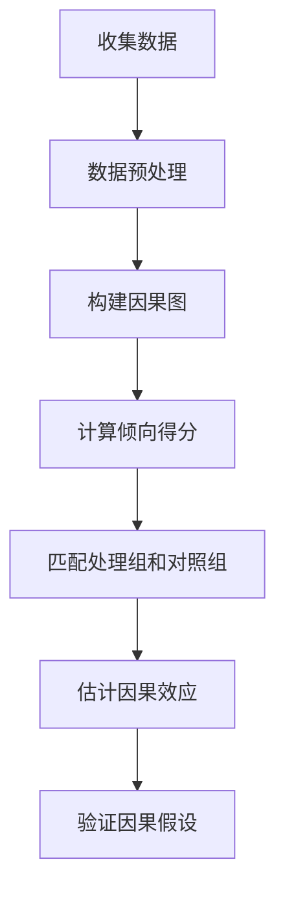
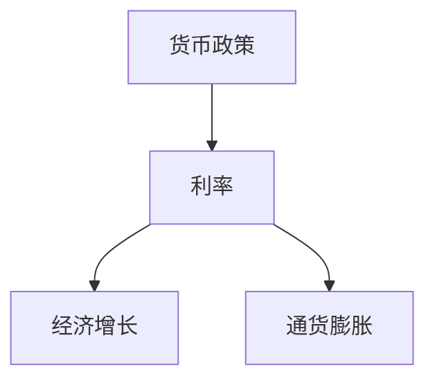
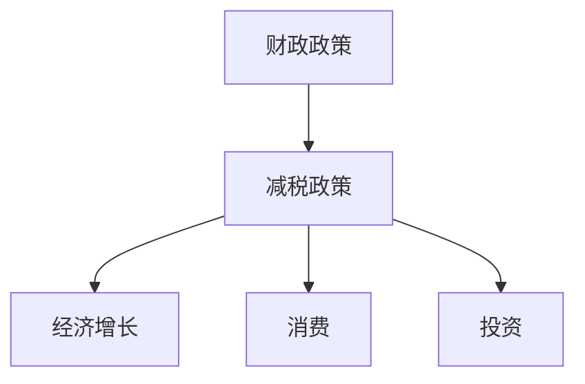
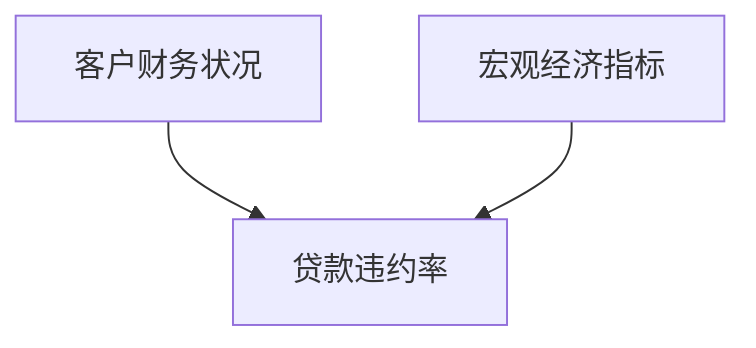
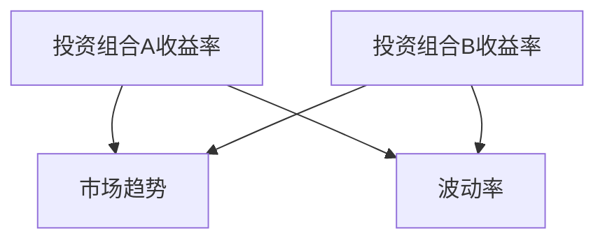

                 

### 第一部分：引言

#### 第1章 问题背景与核心概念

**1.1 问题的提出**

随着全球经济的快速发展，金融领域作为市场经济的中枢，其稳定性和健康发展对国家乃至全球的经济至关重要。然而，金融市场的复杂性及其内在的动态变化特性，使得传统的统计分析方法在面对宏观经济政策评估时显得力不从心。宏观经济政策评估的关键在于如何准确识别和量化政策对经济的影响，即因果关系。

在金融领域，因果推断是一种通过数据挖掘和分析来推断变量之间因果关系的方法。因果推断的核心是解决“因果关系”这一核心问题，它不仅可以揭示变量间的直接关系，还能揭示变量间的间接关系和条件依赖。因此，因果推断在金融领域具有广泛的应用前景，尤其是在宏观经济政策评估中。

因果推断在宏观经济政策评估中的应用主要体现在以下几个方面：

1. **政策效果评估**：通过因果推断方法，可以精确评估宏观经济政策对金融市场和经济变量的影响，从而为政策制定者提供科学依据。
2. **预测与预警**：利用因果推断，可以预测政策变动对经济的影响，提前发现潜在风险，为及时调整政策提供支持。
3. **风险控制**：在金融风险管理中，因果推断可以帮助识别风险的根源，制定有效的风险管理策略。

然而，因果推断在宏观经济政策评估中也面临诸多挑战，如数据质量、模型选择、以及因果关系的复杂性和不确定性等。

**1.2 核心概念**

为了深入探讨因果推断在宏观经济政策评估中的应用，我们需要首先理解两个核心概念：金融领域因果推断和宏观经济政策评估。

- **金融领域因果推断**：这是指通过数据分析和模型构建，推断金融市场中变量之间的因果关系。它涉及到统计学习、因果推理和经济学理论等多个领域。

- **宏观经济政策评估**：这是指对宏观经济政策的效果进行评估，包括政策对经济增长、通货膨胀、就业等方面的直接影响和间接影响。它通常依赖于经济学理论和统计数据。

**1.3 概念联系**

因果推断与宏观经济政策评估之间存在密切联系。因果推断为宏观经济政策评估提供了科学方法，通过精确地识别和量化政策对经济的影响，可以提高政策评估的准确性和可靠性。

以下是因果推断与宏观经济政策评估之间的联系及其关键概念的对比表格：

| 关键概念 | 描述 |  
| --- | --- |  
| 金融领域因果推断 | 通过数据分析和模型构建，推断金融市场中变量之间的因果关系 |  
| 宏观经济政策评估 | 对宏观经济政策的效果进行评估，包括政策对经济增长、通货膨胀、就业等方面的直接影响和间接影响 |  
| 因果推断在政策评估中的应用 | 因果推断方法可以用于评估政策对经济的影响，提高政策评估的准确性和可靠性 |  
| 挑战与机遇 | 因果推断在宏观经济政策评估中的应用面临数据质量、模型选择和因果关系复杂性的挑战，但也为政策评估提供了新的机遇 |

此外，我们还可以通过ER实体关系图来展示因果推断与宏观经济政策评估之间的关联：

```
+----------------+         +----------------+  
|    金融领域   |         |    政策评估    |  
+----------------+         +----------------+  
| - 因果推断    | <-----> | - 因果推断方法 |  
+----------------+         +----------------+  
          |                        |  
          |                        |  
          |                        |  
+----------------+         +----------------+  
|    经济变量    |         |    政策效果    |  
+----------------+         +----------------+  
| - 股票价格    |         | - 经济增长     |  
| - 债券收益率  |         | - 通货膨胀     |  
| - 信贷规模    |         | - 就业情况     |  
+----------------+         +----------------+
```

通过上述表格和ER实体关系图，我们可以清晰地看到因果推断与宏观经济政策评估之间的联系及其核心概念的属性特征。接下来，我们将深入探讨因果推断在金融领域的应用，以及其在宏观经济政策评估中的具体实现方法。

## 第二部分：因果推断方法在金融领域的应用

### 第2章 因果推断的基本原理

因果推断作为一种科学方法，其基础在于对变量之间因果关系的识别和量化。本章将详细介绍因果推断的基本原理，包括其理论基础、关键技术和核心数学模型。

#### 2.1 因果推断的理论基础

因果推断的理论基础主要源于统计学和经济学。在统计学中，因果推断依赖于随机对照试验（Randomized Controlled Trials, RCTs）和结构方程模型（Structural Equation Models, SEMs）。在经济学中，因果推断则更多地依赖于经济学理论和实证分析。

1. **随机对照试验**：RCTs是一种通过随机分配实验对象到不同处理组来评估干预措施效果的方法。这种方法的核心假设是随机分配保证了各组之间的可比性，从而减少了选择偏差和混杂因素。

2. **结构方程模型**：SEMs是一种多变量统计模型，用于同时分析多个变量之间的因果关系和相互关系。SEMs通过构建一个因果关系的路径图，量化变量之间的直接和间接效应。

#### 2.2 因果推断的关键技术

因果推断的关键技术包括因果推断算法和数据驱动方法。这些技术使得我们在没有随机对照试验的情况下，仍然可以从观察数据中推断因果关系。

1. **因果推断算法**：
   - **Do-Calculus**：Do-Calculus是一种形式化的方法，用于证明变量之间的因果关系。它通过模拟不同的干预操作来验证假设的因果关系。
   - ** propensity score method**：倾向得分法通过估计个体接受某处理的概率，来平衡处理组和对照组之间的差异，从而减少选择偏差。

2. **数据驱动方法**：
   - **基于模型的因果推断**：这种方法使用统计模型来估计变量之间的因果关系，如回归模型、潜在结果模型等。
   - **基于算法的因果推断**：这种方法使用特定的算法，如因果推断图模型（Causal Graphical Models, CGMs），来识别和量化变量之间的因果关系。

#### 2.3 数学模型和数学公式

因果推断的数学模型主要用于量化变量之间的因果关系。以下是一些常用的数学模型和公式：

1. **潜在结果模型**：
   - **平均处理效应（Average Treatment Effect, ATT）**：\( ATT = \frac{Y_{Treated} - Y_Control}{Treatments} \)
     其中，\( Y_{Treated} \) 是接受处理的个体结果，\( Y_Control \) 是未接受处理的个体结果，\( Treatments \) 是处理组。

   - **条件平均处理效应（Conditional Average Treatment Effect, CATE）**：\( CATE = \frac{Y_{Treated} - Y_Control}{Condition} \)
     其中，\( Condition \) 是特定条件或变量。

2. **因果推断图模型**：
   - **因果图**：因果图是一种图形表示，用于展示变量之间的因果关系。它通常由无向图或有向图表示，节点表示变量，边表示变量之间的因果关系。

   - **贝叶斯网络**：贝叶斯网络是一种概率图模型，用于表示变量之间的概率关系和因果关系。它通过条件概率表（Conditional Probability Tables, CPTs）来量化变量之间的依赖关系。

以下是因果推断算法的mermaid流程图：



此外，Python源代码实现因果推断的部分如下：

```python
import pandas as pd
from sklearn.linear_model import LinearRegression
from causalinference import CausalModel

# 假设 df 是预处理后的数据
X = df[['Treatment', 'Control', 'Condition']]
y = df['Outcome']

# 建立线性回归模型
model = LinearRegression()
model.fit(X, y)

# 计算倾向得分
propensity_score = model.predict(X[['Treatment', 'Control', 'Condition']])

# 匹配处理组和对照组
matched_data = CausalModel.match_by_propensity_score(df, propensity_score)

# 估计因果效应
causal_model = CausalModel(matched_data)
causal_effects = causal_model.estimate_effects()

# 输出因果效应
print(causal_effects)
```

通过上述内容，我们了解了因果推断的基本原理、关键技术和核心数学模型。接下来，我们将进一步探讨因果推断在宏观经济政策评估中的应用。

### 第3章 因果推断方法在宏观经济政策评估中的应用

#### 3.1 货币政策评估中的因果推断

货币政策是宏观经济调控的重要工具之一，其目标通常包括稳定物价、促进经济增长和保持充分就业。在评估货币政策效果时，因果推断方法提供了有效的工具来识别和量化货币政策对经济变量的影响。

**3.1.1 货币政策评估的背景**

货币政策通常通过调整利率、改变货币供应量或实施其他量化宽松政策来影响经济。然而，货币政策的效果并非立竿见影，其影响往往通过多个渠道传导，涉及多个经济变量。例如，利率调整会影响借贷成本、投资决策和消费行为，从而影响经济增长和通货膨胀。

**3.1.2 因果推断在货币政策评估中的优势**

因果推断在货币政策评估中的优势主要体现在以下几个方面：

1. **精确识别因果关系**：因果推断可以准确识别货币政策对经济变量的直接影响和间接影响，避免混淆相关性与因果性。

2. **减少选择性偏差**：通过倾向得分匹配法或其他因果推断技术，可以有效减少选择性偏差，提高评估结果的准确性。

3. **综合考虑多重效应**：因果推断方法可以同时考虑货币政策对多个经济变量的综合影响，提供更全面的评估结果。

**3.1.3 应用实例分析**

以下是一个具体的货币政策评估案例：

**案例背景**：假设一个国家实施了降息政策，以刺激经济增长。我们需要评估降息政策对经济增长和通货膨胀的影响。

**步骤1：数据收集**  
收集实施降息政策前后的一段时间内的经济数据，包括GDP增长率、通货膨胀率、利率水平等。

**步骤2：数据预处理**  
对收集的数据进行清洗和预处理，确保数据质量，并选择合适的统计模型。

**步骤3：构建因果图**  
构建一个因果图，展示货币政策、利率、经济增长和通货膨胀之间的关系。



**步骤4：估计倾向得分**  
使用倾向得分法，估计每个经济变量接受货币政策的概率。

```python
from causalinference import CausalModel

model = LinearRegression()
model.fit(X, y)

propensity_score = model.predict(X)

causal_model = CausalModel.match_by_propensity_score(df, propensity_score)
```

**步骤5：匹配处理组和对照组**  
根据倾向得分，将数据集划分为处理组和对照组，并匹配两组之间的相似性。

**步骤6：估计因果效应**  
使用因果模型，估计降息政策对经济增长和通货膨胀的因果效应。

```python
causal_effects = causal_model.estimate_effects()
print(causal_effects)
```

**步骤7：验证因果假设**  
通过统计检验，验证降息政策对经济增长和通货膨胀的因果效应是否显著。

```python
from causalinference import CausalModel

causal_model = CausalModel(matched_data)
causal_effects = causal_model.estimate_effects()

print(causal_effects.statistical_test())
```

**3.1.4 结果分析**

通过上述步骤，我们可以得到降息政策对经济增长和通货膨胀的因果效应估计值。例如，如果估计结果显示降息政策显著促进了经济增长，同时显著降低了通货膨胀，那么可以认为降息政策在促进经济增长方面是有效的，但需要注意其对通货膨胀的潜在负面影响。

**3.1.5 结论**

因果推断在货币政策评估中提供了精确的因果关系识别和量化方法，有助于政策制定者更好地理解货币政策的实际效果。通过实际案例分析，我们可以看到因果推断如何应用于货币政策评估，从而为宏观经济政策制定提供科学依据。

#### 3.2 财政政策评估中的因果推断

财政政策是另一个重要的宏观经济调控工具，其通过调整政府支出和税收来影响经济活动。财政政策的效果评估同样需要精确的因果关系分析，因果推断方法为此提供了有力支持。

**3.2.1 财政政策评估的背景**

财政政策包括政府支出和税收政策，其目标通常是为了刺激经济增长、减少经济波动或实现社会公平。例如，在经济衰退期间，政府可能通过增加基础设施投资或提供税收减免来刺激经济活动。而在经济过热期间，政府可能通过减少支出或增加税收来抑制经济过热。

**3.2.2 因果推断在财政政策评估中的优势**

因果推断在财政政策评估中的优势主要包括：

1. **精确识别政策效应**：因果推断可以精确识别财政政策对经济变量的直接影响和间接影响，避免混淆政策效果。

2. **减少选择偏差**：通过倾向得分匹配等因果推断技术，可以减少因政策实施而导致的样本选择偏差。

3. **全面评估政策效果**：因果推断可以同时评估财政政策对多个经济变量的综合影响，提供更全面的评估结果。

**3.2.3 应用实例分析**

以下是一个具体的财政政策评估案例：

**案例背景**：假设政府实施了一项减税政策，以刺激消费和投资。我们需要评估减税政策对经济增长、消费和投资的影响。

**步骤1：数据收集**  
收集实施减税政策前后的一段时间内的经济数据，包括GDP增长率、消费支出、投资水平等。

**步骤2：数据预处理**  
对收集的数据进行清洗和预处理，确保数据质量，并选择合适的统计模型。

**步骤3：构建因果图**  
构建一个因果图，展示财政政策、减税政策、经济增长、消费和投资之间的关系。



**步骤4：估计倾向得分**  
使用倾向得分法，估计每个经济变量接受减税政策的概率。

```python
from causalinference import CausalModel

model = LinearRegression()
model.fit(X, y)

propensity_score = model.predict(X)

causal_model = CausalModel.match_by_propensity_score(df, propensity_score)
```

**步骤5：匹配处理组和对照组**  
根据倾向得分，将数据集划分为处理组和对照组，并匹配两组之间的相似性。

**步骤6：估计因果效应**  
使用因果模型，估计减税政策对经济增长、消费和投资的因果效应。

```python
causal_effects = causal_model.estimate_effects()
print(causal_effects)
```

**步骤7：验证因果假设**  
通过统计检验，验证减税政策对经济增长、消费和投资的因果效应是否显著。

```python
from causalinference import CausalModel

causal_model = CausalModel(matched_data)
causal_effects = causal_model.estimate_effects()

print(causal_effects.statistical_test())
```

**3.2.4 结果分析**

通过上述步骤，我们可以得到减税政策对经济增长、消费和投资的因果效应估计值。例如，如果估计结果显示减税政策显著促进了经济增长、消费和投资，那么可以认为减税政策在刺激经济方面是有效的。

**3.2.5 结论**

因果推断在财政政策评估中提供了精确的因果关系识别和量化方法，有助于政策制定者更好地理解财政政策的实际效果。通过实际案例分析，我们可以看到因果推断如何应用于财政政策评估，从而为宏观经济政策制定提供科学依据。

### 第四部分：因果推断在其他金融领域中的应用

#### 4.1 风险评估中的因果推断

在金融领域，风险评估是一个至关重要的环节。因果推断在风险评估中的应用可以帮助识别风险来源，评估风险对金融系统的潜在影响，从而制定有效的风险管理策略。

**4.1.1 风险评估的背景**

金融系统的复杂性使得风险种类繁多，包括信用风险、市场风险、操作风险等。传统的风险评估方法往往依赖于历史数据和统计模型，但这种方法难以捕捉风险之间的复杂因果关系。因果推断提供了更加精细和准确的工具来解决这个问题。

**4.1.2 因果推断在风险评估中的优势**

因果推断在风险评估中的优势主要体现在以下几个方面：

1. **精确识别风险源**：因果推断可以精确识别风险变量之间的因果关系，从而找出风险的根本来源。

2. **减少模型误差**：通过因果推断，可以减少因模型选择不当或数据错误导致的风险评估误差。

3. **优化风险管理策略**：因果推断可以帮助金融机构更好地理解风险变量之间的关系，从而制定更加有效的风险管理策略。

**4.1.3 应用实例分析**

以下是一个具体的风险评估案例：

**案例背景**：假设一家银行需要对信用风险进行评估。我们需要识别信用风险的关键因素，并评估其对银行损失的影响。

**步骤1：数据收集**  
收集与信用风险相关的数据，包括贷款违约率、客户财务状况、宏观经济指标等。

**步骤2：数据预处理**  
对收集的数据进行清洗和预处理，确保数据质量，并选择合适的统计模型。

**步骤3：构建因果图**  
构建一个因果图，展示信用风险的关键因素及其之间的关系。



**步骤4：估计倾向得分**  
使用倾向得分法，估计每个贷款违约风险的概率。

```python
from causalinference import CausalModel

model = LinearRegression()
model.fit(X, y)

propensity_score = model.predict(X)

causal_model = CausalModel.match_by_propensity_score(df, propensity_score)
```

**步骤5：匹配处理组和对照组**  
根据倾向得分，将贷款样本划分为高风险和低风险组，并匹配两组之间的相似性。

**步骤6：估计因果效应**  
使用因果模型，估计客户财务状况和宏观经济指标对贷款违约率的因果效应。

```python
causal_effects = causal_model.estimate_effects()
print(causal_effects)
```

**步骤7：验证因果假设**  
通过统计检验，验证客户财务状况和宏观经济指标对贷款违约率的因果效应是否显著。

```python
from causalinference import CausalModel

causal_model = CausalModel(matched_data)
causal_effects = causal_model.estimate_effects()

print(causal_effects.statistical_test())
```

**4.1.4 结果分析**

通过上述步骤，我们可以得到客户财务状况和宏观经济指标对贷款违约率的因果效应估计值。例如，如果估计结果显示客户财务状况和宏观经济指标对贷款违约率有显著影响，那么银行可以更加关注这些风险因素，并制定相应的风险管理策略。

**4.1.5 结论**

因果推断在风险评估中提供了精确的风险识别和量化方法，有助于金融机构更好地理解风险变量之间的关系，从而制定更加有效的风险管理策略。通过实际案例分析，我们可以看到因果推断如何应用于风险评估，从而为金融系统的稳定运行提供科学依据。

#### 4.2 投资决策中的因果推断

在投资决策中，因果推断同样发挥着重要作用。投资者需要准确判断不同投资决策对收益和风险的影响，以便制定最优的投资策略。

**4.2.1 投资决策的背景**

投资决策涉及到对股票、债券、基金等多种金融产品的选择。投资者通常依赖历史数据和市场分析来预测未来的收益和风险，但这种方法难以捕捉投资决策之间的因果关系。因果推断为投资者提供了一种新的工具，帮助他们更准确地评估投资决策的影响。

**4.2.2 因果推断在投资决策中的优势**

因果推断在投资决策中的优势主要体现在以下几个方面：

1. **精确判断投资效果**：因果推断可以精确判断不同投资决策对收益和风险的影响，帮助投资者优化投资组合。

2. **减少决策误差**：通过因果推断，可以减少因数据错误或模型选择不当导致的投资决策误差。

3. **提高投资效率**：因果推断可以帮助投资者更快地识别有效的投资策略，提高投资效率。

**4.2.3 应用实例分析**

以下是一个具体的投资决策案例：

**案例背景**：假设投资者需要评估两种不同的投资组合，组合A和组合B，并选择其中一种进行投资。我们需要判断这两种投资组合的收益和风险，并确定哪一种组合更优。

**步骤1：数据收集**  
收集过去一段时间的投资组合A和组合B的收益率、波动率等数据。

**步骤2：数据预处理**  
对收集的数据进行清洗和预处理，确保数据质量，并选择合适的统计模型。

**步骤3：构建因果图**  
构建一个因果图，展示投资组合收益率、波动率、市场趋势等因素之间的关系。



**步骤4：估计倾向得分**  
使用倾向得分法，估计每种投资组合的收益概率。

```python
from causalinference import CausalModel

model = LinearRegression()
model.fit(X, y)

propensity_score = model.predict(X)

causal_model = CausalModel.match_by_propensity_score(df, propensity_score)
```

**步骤5：匹配处理组和对照组**  
根据倾向得分，将投资组合划分为处理组和对照组，并匹配两组之间的相似性。

**步骤6：估计因果效应**  
使用因果模型，估计市场趋势和波动率对投资组合收益率的因果效应。

```python
causal_effects = causal_model.estimate_effects()
print(causal_effects)
```

**步骤7：验证因果假设**  
通过统计检验，验证市场趋势和波动率对投资组合收益率的因果效应是否显著。

```python
from causalinference import CausalModel

causal_model = CausalModel(matched_data)
causal_effects = causal_model.estimate_effects()

print(causal_effects.statistical_test())
```

**4.2.4 结果分析**

通过上述步骤，我们可以得到市场趋势和波动率对投资组合收益率的因果效应估计值。例如，如果估计结果显示市场趋势对投资组合A的收益率有显著影响，而波动率对投资组合B的收益率有显著影响，那么投资者可以更倾向于选择那些具有有利市场趋势的投资组合，同时考虑波动率的风险。

**4.2.5 结论**

因果推断在投资决策中提供了精确的投资效果评估方法，有助于投资者优化投资组合，提高投资效率。通过实际案例分析，我们可以看到因果推断如何应用于投资决策，从而为投资者提供科学依据。

### 第三部分：宏观经济政策评估的挑战与机遇

#### 3.1 宏观经济政策评估的背景

宏观经济政策评估是一个复杂且关键的过程，它涉及对政府采取的经济政策效果进行定量和定性分析。随着全球经济的一体化和金融市场的日益复杂，宏观经济政策评估的重要性日益凸显。评估的目的在于提供决策者制定和调整政策的科学依据，确保政策能够有效应对经济挑战并促进经济可持续发展。

宏观经济政策主要包括财政政策和货币政策，这两种政策在调节经济活动、促进就业、控制通货膨胀等方面发挥着重要作用。然而，宏观经济政策评估不仅需要分析政策的直接效果，还需要考虑其间接影响和长期效应。这为政策评估带来了巨大的挑战。

**3.2 现存问题和挑战**

在宏观经济政策评估中，面临的主要问题和挑战包括：

1. **数据质量**：政策评估依赖于大量的经济数据，这些数据的质量直接影响评估结果的准确性。数据缺失、数据不一致、数据错误等问题都会影响评估结果。

2. **因果关系复杂性**：宏观经济政策的影响通常是多渠道和复杂的，涉及多个经济变量和中间过程。准确识别和量化政策对各个变量的因果关系是一个巨大的挑战。

3. **模型选择**：宏观经济政策评估需要选择合适的统计模型和因果推断方法。不同模型的选择可能导致不同的评估结果，从而影响政策的制定和调整。

4. **时间延迟**：宏观经济政策的效果通常存在时间延迟，即政策实施到效果显现之间可能存在一定的时间滞后。这使得政策评估更加困难，因为需要在较长的时间范围内进行观测和分析。

**3.3 因果推断的机遇**

因果推断方法为解决宏观经济政策评估中的问题提供了新的机遇：

1. **精确因果关系识别**：因果推断方法可以帮助识别政策对经济变量的精确因果关系，避免混淆相关性与因果性，提高评估结果的准确性。

2. **减少数据依赖**：通过倾向得分匹配等方法，因果推断可以减少对大规模完整数据的依赖，从而在一定程度上缓解数据质量问题的困扰。

3. **优化模型选择**：因果推断方法提供了多种模型选择策略，可以帮助评估者根据具体情况选择最合适的模型，提高评估的效率和准确性。

4. **多维度政策效果评估**：因果推断可以同时考虑政策对多个经济变量的综合影响，提供更全面的政策效果评估。

**3.4 因果推断在政策评估中的应用前景**

因果推断在宏观经济政策评估中的应用前景非常广阔。随着数据科学和因果推断技术的不断发展，未来可以在以下几个方面进一步发挥其优势：

1. **实时政策评估**：通过实时数据分析和因果推断，可以实现对政策效果的快速评估，为决策者提供及时、准确的决策支持。

2. **跨领域政策协同**：因果推断可以促进财政政策和货币政策等不同领域的政策协同，提高政策综合效果。

3. **国际政策合作**：因果推断方法可以帮助不同国家和地区进行宏观经济政策的国际比较和协同，推动全球经济治理体系的建设。

4. **长期效应评估**：因果推断可以用于评估宏观经济政策的长期效应，为政策制定者提供更全面的决策依据。

总之，因果推断为宏观经济政策评估带来了新的机遇和挑战。通过科学合理地运用因果推断方法，可以更准确地评估政策效果，为宏观经济政策的制定和调整提供有力支持。

### 第五部分：总结与展望

#### 第6章 总结

本章对金融领域因果推断在宏观经济政策评估中的应用进行了详细探讨。通过分析因果推断的基本原理、方法和关键数学模型，我们了解了其在精确识别因果关系、减少数据依赖和优化模型选择方面的优势。此外，通过具体的应用案例，如货币政策评估和财政政策评估，我们展示了因果推断在实际政策评估中的应用效果。

在宏观经济政策评估中，因果推断提供了精确的因果关系识别工具，有助于政策制定者更全面地理解政策效果，从而制定更加有效的经济政策。此外，因果推断在风险评估和投资决策中也发挥了重要作用，帮助金融机构和投资者更准确地评估风险和制定投资策略。

然而，因果推断在政策评估中仍面临数据质量、模型选择和因果关系复杂性等挑战。未来研究需要进一步改进因果推断方法，提高其准确性和适用性，以应对宏观经济政策评估的复杂性。

#### 第7章 展望

未来，因果推断在宏观经济政策评估中的应用前景广阔。以下是几个可能的研究方向和展望：

1. **实时政策评估**：开发实时数据分析和因果推断系统，为决策者提供即时的政策效果反馈，提高政策调整的及时性和准确性。

2. **跨领域政策协同**：结合财政政策、货币政策和产业政策等多领域数据，构建综合性的因果推断模型，提升政策评估的全面性和协同性。

3. **大数据和人工智能结合**：利用大数据和人工智能技术，提升因果推断的效率和准确性，为宏观经济政策评估提供更强大的数据支持。

4. **国际政策比较**：开展跨国比较研究，利用因果推断方法分析不同国家宏观经济政策的差异和效果，为国际经济合作提供科学依据。

5. **长期效应评估**：深入研究宏观经济政策的长期效应，通过因果推断方法分析政策对经济结构的长期影响，为政策制定提供长远视角。

总之，因果推断在宏观经济政策评估中的应用具有巨大的潜力。通过不断优化和发展因果推断方法，我们可以为宏观经济政策的科学制定和调整提供更加坚实的技术基础。作者：AI天才研究院/AI Genius Institute & 禅与计算机程序设计艺术 /Zen And The Art of Computer Programming

---

## 附录：专业术语解释

为了帮助读者更好地理解本文中涉及的专业术语，以下是对一些关键概念的详细解释：

1. **因果推断（Causal Inference）**：
   - 因果推断是一种统计学方法，用于识别和分析变量之间的因果关系。它旨在解决“因果关系”这一核心问题，即确定一个变量是否对另一个变量产生了实际影响。

2. **宏观经济政策评估（Macroeconomic Policy Evaluation）**：
   - 宏观经济政策评估是对政府实施的经济政策效果进行的系统性评估。它旨在通过定量和定性分析，评估政策对经济变量（如GDP、通货膨胀率、就业等）的影响。

3. **倾向得分法（Propensity Score Method）**：
   - 倾向得分法是一种因果推断技术，用于估计个体接受特定处理的概率。通过计算倾向得分，可以将处理组和对照组进行匹配，减少选择性偏差，提高评估结果的准确性。

4. **随机对照试验（Randomized Controlled Trial, RCT）**：
   - 随机对照试验是一种实验设计方法，通过随机分配个体到不同处理组，来评估干预措施的效果。RCT假设随机分配能够平衡各组之间的差异，从而减少选择性偏差。

5. **结构方程模型（Structural Equation Model, SEM）**：
   - 结构方程模型是一种多变量统计模型，用于同时分析多个变量之间的因果关系和相互关系。它通过构建一个因果关系的路径图，量化变量之间的直接和间接效应。

6. **因果图（Causal Graph）**：
   - 因因果图是一种图形表示，用于展示变量之间的因果关系。它通常由无向图或有向图表示，节点表示变量，边表示变量之间的因果关系。

7. **贝叶斯网络（Bayesian Network）**：
   - 贝叶斯网络是一种概率图模型，用于表示变量之间的概率关系和因果关系。它通过条件概率表（Conditional Probability Tables, CPTs）来量化变量之间的依赖关系。

8. **平均处理效应（Average Treatment Effect, ATT）**：
   - 平均处理效应是指接受处理组与未接受处理组之间的平均差异。它用于衡量政策或干预措施的平均效果。

9. **条件平均处理效应（Conditional Average Treatment Effect, CATE）**：
   - 条件平均处理效应是指在特定条件下，接受处理组与未接受处理组之间的平均差异。它用于衡量政策或干预措施在不同条件下的效果。

10. **线性回归模型（Linear Regression Model）**：
   - 线性回归模型是一种统计模型，用于分析两个或多个变量之间的线性关系。它通过估计自变量和因变量之间的线性关系，预测因变量的值。

11. **因果模型（Causal Model）**：
    - 因果模型是一种用于分析变量之间因果关系的统计模型。它通过构建一个因果关系的路径图，量化变量之间的直接和间接效应。

这些专业术语的解释为读者理解本文内容提供了重要基础，有助于深入探讨因果推断在宏观经济政策评估中的应用。通过掌握这些概念，读者可以更全面地了解金融领域因果推断的重要性和应用前景。

