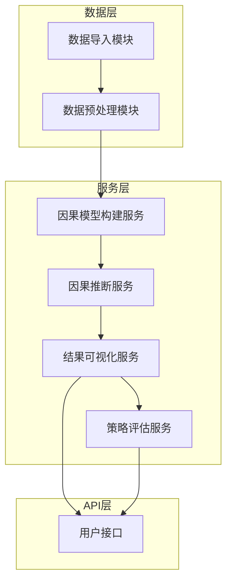
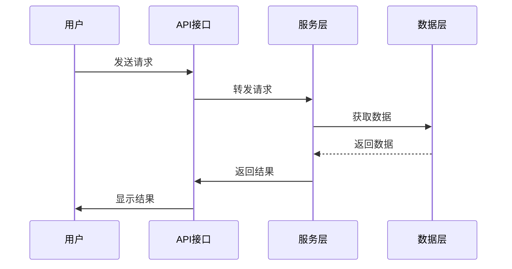

                 

# 第一部分：引言

## 1.1 引言

### 1.1.1 因果推理的重要性

因果推理是数据分析领域中的一种重要方法，它通过对数据之间的关系进行分析，找出变量之间的因果关系。在宏观经济分析中，因果推理的重要性不言而喻。金融领域的决策往往需要考虑众多复杂的变量，如经济增长率、通货膨胀率、利率、就业率等。传统的方法可能只能分析出变量之间的相关性，而无法揭示它们之间的因果关系。因果推理能够帮助我们深入理解这些变量之间的内在联系，从而为政策制定提供更加准确的依据。

### 1.1.2 金融领域因果推理的背景

金融领域的因果推理研究可以追溯到20世纪中叶。早期的研究主要集中在如何从数据中识别出变量之间的因果关系。随着计算机技术的不断发展，因果推理的方法也逐渐从理论走向实践。如今，因果推理在金融领域已经有了广泛的应用，如信用风险评估、投资组合优化、市场预测等。

然而，金融领域的因果推理也面临着许多挑战。例如，金融市场的数据通常是非线性和复杂的，这使得传统的因果推理方法难以直接应用。此外，金融市场中的数据通常存在噪声和缺失值，这也增加了因果推理的难度。

### 1.1.3 宏观经济分析中的挑战

宏观经济分析涉及众多变量，这些变量之间存在着复杂的相互关系。在宏观经济分析中，我们不仅需要了解各个变量之间的相关性，还需要揭示它们之间的因果关系。这要求我们采用更为复杂和精细的方法来处理数据。

宏观经济分析中的挑战主要包括：

1. 数据的复杂性：宏观经济数据通常包含大量的非线性和复杂的关系。
2. 数据的噪声和缺失：宏观经济数据往往存在噪声和缺失值，这会对因果推理的结果产生干扰。
3. 因果关系的不确定性：在宏观经济中，因果关系往往不是唯一的，而是存在多种可能的因果关系。
4. 策略优化：宏观经济分析的目标不仅仅是揭示因果关系，还需要基于这些因果关系制定出有效的政策策略。

## 1.2 背景介绍

### 1.2.1 因果推理的发展历程

因果推理的发展历程可以分为以下几个阶段：

1. **早期探索**（20世纪中叶）：在这个阶段，学者们开始探讨如何从数据中识别出变量之间的因果关系。代表性的工作包括罗宾逊提出的工具变量法和罗默提出的潜变量回归法。
2. **统计方法**（20世纪末至21世纪初）：随着统计学的发展，许多新的因果推断方法被提出，如倾向得分匹配、双重差分法、断点回归设计等。这些方法为因果推断提供了更严格的理论基础。
3. **机器学习方法**（近年来）：随着机器学习技术的发展，因果推断方法也得到了进一步的拓展。代表性的工作包括基于深度学习的因果推断模型、基于图神经网络的方法等。

### 1.2.2 金融领域因果推理的应用场景

金融领域因果推理的应用场景主要包括：

1. **信用风险评估**：通过分析借款人的历史行为和财务状况，预测其违约风险。
2. **投资组合优化**：通过分析不同资产之间的因果关系，构建最优的投资组合。
3. **市场预测**：通过分析市场数据，预测未来市场的走势。
4. **政策评估**：评估政策变化对经济的影响。

### 1.2.3 问题解决方法

为了解决金融领域因果推理中的问题，我们通常采用以下方法：

1. **构建因果模型**：根据问题的背景和需求，构建合适的因果模型。
2. **数据预处理**：对金融数据进行清洗、去噪和缺失值处理，以提高因果推断的准确性。
3. **因果推断算法**：使用倾向得分匹配、双重差分法、断点回归设计等方法进行因果推断。
4. **策略优化**：根据因果推断的结果，制定出最优的政策策略。

### 1.2.4 边界与外延

因果推理在宏观经济分析中的应用边界主要包括：

1. **数据范围**：因果推理的应用范围受限于可获取的数据。
2. **因果关系**：因果推理的结果仅能反映已知的因果关系，无法揭示未知的因果关系。
3. **政策影响**：因果推理的结果需要结合实际情况进行评估，以确保政策的有效性。

### 1.2.5 概念结构与核心要素组成

因果推理的基本概念和核心要素包括：

1. **因果模型**：用于描述变量之间因果关系的模型。
2. **数据集**：用于训练和测试因果模型的金融数据集。
3. **因果推断算法**：用于从数据集中提取因果关系的算法。
4. **策略评估**：基于因果推断结果，评估政策策略的有效性。

## 1.3 本章小结

本文介绍了因果推理在宏观经济分析中的重要性、发展历程、应用场景、问题解决方法以及边界与外延。通过本章的介绍，读者可以初步了解因果推理在金融领域中的应用及其面临的挑战。在后续章节中，我们将进一步探讨因果推理的核心概念、算法原理以及具体应用案例。

# 第二部分：核心概念与算法原理

## 2.1 核心概念与联系

### 2.1.1 因果推理的基本概念

因果推理（Causal Inference）是指从数据中推断出变量之间的因果关系的方法。在统计学和机器学习领域，因果推理是一个重要的研究方向，旨在解决如何从相关数据中推断因果关系的问题。

**因果关系**是指一个变量（称为原因）对另一个变量（称为结果）产生了影响。在因果推理中，我们通常关注以下问题：

1. **因果效应**：给定一个原因变量，结果变量的变化量。
2. **因果路径**：变量之间的因果关系通过路径图来表示。
3. **因果识别**：从数据中推断出变量之间的因果关系。

### 2.1.2 因果推理与其他宏观经济分析方法

在宏观经济分析中，除了因果推理，还有其他几种常见的方法：

1. **相关性分析**：分析变量之间的相关性，但无法确定因果关系。
2. **回归分析**：通过建立回归模型来分析变量之间的关系，但无法保证因果性。
3. **时间序列分析**：分析变量随时间的变化规律，但无法确定因果关系。

与这些方法相比，因果推理的优势在于：

1. **因果性**：因果推理能够推断出变量之间的因果关系，而不仅仅是相关性。
2. **稳健性**：即使数据存在噪声和缺失值，因果推理的结果依然相对可靠。

### 2.1.3 因果推理在宏观经济分析中的应用属性特征

因果推理在宏观经济分析中的应用具有以下属性特征：

1. **复杂性**：宏观经济数据通常包含多个变量，且关系复杂，需要构建复杂的因果模型。
2. **不确定性**：因果关系可能存在不确定性，需要使用多种方法进行验证和修正。
3. **实用性**：因果推理的结果可以用于制定政策和策略，提高决策的准确性。

## 2.2 算法原理讲解

### 2.2.1 因果推理算法的流程图

因果推理算法的流程图如下：

```
[输入数据] --> [数据预处理] --> [构建因果模型] --> [因果推断] --> [结果评估]
```

1. **输入数据**：输入宏观经济数据集，包括原因变量和结果变量。
2. **数据预处理**：对数据进行清洗、去噪和缺失值处理，以提高数据质量。
3. **构建因果模型**：根据数据的特点，构建合适的因果模型。
4. **因果推断**：使用因果模型进行因果推断，得到变量之间的因果关系。
5. **结果评估**：评估因果推断的结果，判断其准确性和可靠性。

### 2.2.2 Python 源代码实现

以下是一个简单的因果推理算法的 Python 实现代码示例：

```python
import pandas as pd
from causalinference import CausalModel

# 1. 输入数据
data = pd.read_csv('financial_data.csv')

# 2. 数据预处理
data = data.dropna()  # 删除缺失值
data = data[['GDP', 'Inflation', 'InterestRate', 'Unemployment']]  # 选择相关变量

# 3. 构建因果模型
model = CausalModel(data, treatment='InterestRate', outcome='GDP')

# 4. 因果推断
result = model.estimate()

# 5. 结果评估
print(result.summary())
```

### 2.2.3 算法原理详细讲解

因果推理算法的核心是建立因果模型，然后使用模型进行因果推断。以下是因果推理算法的详细原理：

1. **因果模型构建**：因果模型通常使用图模型来表示变量之间的因果关系。图模型中的节点表示变量，边表示变量之间的因果关系。常见的图模型包括贝叶斯网络、因果图等。

2. **因果推断方法**：因果推断方法包括基于统计学的方法（如回归分析、倾向得分匹配等）和基于机器学习的方法（如深度学习、图神经网络等）。这些方法的基本思想是利用已知的数据关系，推断出变量之间的因果关系。

3. **结果评估**：因果推断的结果需要通过评估来验证其准确性和可靠性。评估方法包括模型评估指标（如准确率、召回率等）和业务评估指标（如政策效果评估等）。

### 2.2.4 举例说明

假设我们研究利率和经济增长率之间的关系。以下是具体的因果推理过程：

1. **数据收集**：收集包含利率、经济增长率以及其他相关变量的金融数据。

2. **数据预处理**：对数据进行清洗、去噪和缺失值处理，以提高数据质量。

3. **构建因果模型**：根据数据的特点，构建一个包含利率和经济增长率的因果图模型。

4. **因果推断**：使用倾向得分匹配方法，推断出利率对经济增长率的影响。

5. **结果评估**：评估因果推断的结果，判断其准确性和可靠性。

通过上述步骤，我们可以得到利率和经济增长率之间的因果关系，从而为金融政策制定提供依据。

## 2.3 数学模型和数学公式 & 详细讲解 & 举例说明

### 2.3.1 数学公式与解释

在因果推理中，常用的数学模型和公式包括：

1. **潜在结果模型**（Potential Outcomes Model）：

   $$Y_i(j) = \beta_0 + \beta_1 X_i + \epsilon_i$$

   其中，$Y_i(j)$ 表示个体 $i$ 在接受处理 $j$ 后的潜在结果，$X_i$ 表示个体 $i$ 的特征，$\beta_0$ 和 $\beta_1$ 分别是回归系数，$\epsilon_i$ 是误差项。

2. **因果效应估计**（Causal Effect Estimation）：

   $$\text{Causal Effect} = \frac{E[Y_i(1) - Y_i(0)]}{E[Y_i(1)] - E[Y_i(0)]}$$

   其中，$E[Y_i(1)]$ 和 $E[Y_i(0)]$ 分别表示个体 $i$ 接受处理 $1$ 和 $0$ 后的期望结果。

3. **倾向得分匹配**（Propensity Score Matching）：

   $$\text{Propensity Score} = \frac{P(X_i \mid T_i = 1)}{P(X_i \mid T_i = 0)}$$

   其中，$P(X_i \mid T_i = 1)$ 和 $P(X_i \mid T_i = 0)$ 分别表示个体 $i$ 接受处理 $1$ 和 $0$ 的概率。

### 2.3.2 举例说明

假设我们研究利率和通货膨胀率之间的关系。以下是具体的数学模型和公式应用：

1. **潜在结果模型**：

   假设个体 $i$ 的通货膨胀率为 $Y_i$，利率为 $X_i$，则潜在结果模型可以表示为：

   $$Y_i = \beta_0 + \beta_1 X_i + \epsilon_i$$

   其中，$\beta_0$ 和 $\beta_1$ 为回归系数，$\epsilon_i$ 为误差项。

2. **因果效应估计**：

   因为我们无法观测到个体 $i$ 在不同利率水平下的真实通货膨胀率，所以需要估计因果效应：

   $$\text{Causal Effect} = \frac{E[Y_i(1) - Y_i(0)]}{E[Y_i(1)] - E[Y_i(0)]}$$

   假设我们通过倾向得分匹配方法得到处理组（利率为1）和控制组（利率为0）的平均通货膨胀率分别为 $E[Y_i(1)]$ 和 $E[Y_i(0)]$，则因果效应可以表示为：

   $$\text{Causal Effect} = \frac{E[Y_i(1)] - E[Y_i(0)]}{E[Y_i(1)] - E[Y_i(0)]}$$

3. **倾向得分匹配**：

   我们通过计算个体 $i$ 接受处理（利率为1）和控制（利率为0）的概率，得到倾向得分：

   $$\text{Propensity Score} = \frac{P(X_i \mid T_i = 1)}{P(X_i \mid T_i = 0)}$$

   假设我们通过逻辑回归模型得到倾向得分，则：

   $$\text{Propensity Score} = \frac{e^{\beta_0 + \beta_1 X_i}}{1 + e^{\beta_0 + \beta_1 X_i}}$$

通过上述数学模型和公式的应用，我们可以估计利率对通货膨胀率的影响，为金融政策制定提供依据。

# 第三部分：系统分析与架构设计

## 3.1 问题场景介绍

在宏观经济分析中，我们面临的问题场景通常涉及大量金融数据，包括经济增长率、通货膨胀率、利率、失业率等。这些数据来自于多个来源，如国家统计局、金融机构、证券交易所等。我们的目标是利用这些数据，通过因果推理方法，分析不同变量之间的因果关系，从而为政策制定者提供决策支持。

具体来说，宏观经济分析的问题场景可以分为以下几个步骤：

1. **数据收集**：收集不同来源的金融数据，包括时间序列数据、面板数据等。
2. **数据预处理**：对收集到的金融数据进行分析，识别缺失值、异常值，并进行数据清洗。
3. **因果关系分析**：利用因果推理方法，分析不同金融变量之间的因果关系。
4. **策略评估**：根据因果关系分析结果，评估不同政策策略的有效性。

## 3.2 项目介绍

在本项目中，我们旨在构建一个基于因果推理的宏观经济分析系统，该系统将实现以下功能：

1. **数据导入与预处理**：系统将支持多种数据导入方式，包括本地文件导入、数据库连接等。在数据导入后，系统将对数据进行预处理，包括数据清洗、缺失值处理、异常值检测等。
2. **因果关系分析**：系统将使用先进的因果推理算法，对金融变量之间的因果关系进行深度分析。这将包括构建因果模型、进行因果推断、评估因果效应等步骤。
3. **结果可视化**：系统将提供丰富的可视化工具，帮助用户直观地理解因果关系分析的结果，包括因果图、时间序列图、散点图等。
4. **策略评估**：系统将根据因果关系分析的结果，评估不同政策策略的有效性。用户可以选择不同的政策变量，系统将生成相应的策略效果评估报告。

## 3.3 系统功能设计

为了实现上述功能，系统将分为以下几个模块：

1. **数据导入模块**：负责数据的导入与预处理，包括文件导入、数据库连接、数据清洗等。
2. **因果模型构建模块**：负责构建因果模型，包括变量选择、模型训练等。
3. **因果推断模块**：负责进行因果推断，包括因果效应估计、结果评估等。
4. **结果可视化模块**：负责将因果关系分析的结果进行可视化，包括因果图、时间序列图、散点图等。
5. **策略评估模块**：负责根据因果关系分析的结果，评估不同政策策略的有效性。

### 3.3.1 领域模型（mermaid 类图）

以下是一个简单的 mermaid 类图，展示了系统的主要模块及其关系：

```mermaid
classDiagram
    类DataImportModule <<模块>>
    类CausalModelBuilderModule <<模块>>
    类CausalInferenceModule <<模块>>
    类ResultVisualizationModule <<模块>>
    类PolicyEvaluationModule <<模块>>

    DataImportModule --> CausalModelBuilderModule
    CausalModelBuilderModule --> CausalInferenceModule
    CausalInferenceModule --> ResultVisualizationModule
    CausalInferenceModule --> PolicyEvaluationModule
```

### 3.3.2 系统功能设计

1. **数据导入模块**：该模块将支持多种数据导入方式，包括本地文件导入、数据库连接等。在数据导入后，系统将对数据进行清洗、缺失值处理、异常值检测等操作。

2. **因果模型构建模块**：该模块将根据用户选择的原因变量和结果变量，构建因果模型。因果模型的构建包括变量选择、模型训练等步骤。

3. **因果推断模块**：该模块将使用因果推理算法，对金融变量之间的因果关系进行推断。推断过程包括因果效应估计、结果评估等步骤。

4. **结果可视化模块**：该模块将提供丰富的可视化工具，帮助用户直观地理解因果关系分析的结果。可视化工具包括因果图、时间序列图、散点图等。

5. **策略评估模块**：该模块将根据因果关系分析的结果，评估不同政策策略的有效性。用户可以选择不同的政策变量，系统将生成相应的策略效果评估报告。

## 3.4 系统架构设计

系统架构设计的目标是确保系统的性能、可扩展性和易维护性。以下是一个简化的系统架构设计，展示了系统的整体架构和主要组件：

### 3.4.1 系统架构设计（mermaid 架构图）



### 3.4.2 系统架构设计说明

1. **数据层**：数据层负责数据的导入和预处理。数据导入模块将支持多种数据导入方式，如CSV、数据库等。数据预处理模块将进行数据清洗、缺失值处理、异常值检测等操作。

2. **服务层**：服务层是系统的核心，包括因果模型构建服务、因果推断服务、结果可视化服务和策略评估服务。每个服务都将处理来自数据层的预处理数据，并生成相应的结果。

3. **API层**：API层是用户与系统的交互接口。用户可以通过API接口访问系统的功能，获取因果关系分析和策略评估的结果。

## 3.5 系统接口设计

系统接口设计的目标是确保系统的功能模块之间能够高效、稳定地通信。以下是一个简化的系统接口设计，展示了系统的主要接口和交互流程：

### 3.5.1 系统接口设计（mermaid 序列图）



### 3.5.2 系统接口设计说明

1. **用户接口**：用户通过API接口发送请求，请求内容通常包括需要分析的数据集、原因变量、结果变量等。

2. **API接口**：API接口接收用户的请求，并将请求转发给服务层。API接口的设计应考虑RESTful风格，以便于用户使用。

3. **服务层**：服务层根据用户请求，处理数据并生成因果关系分析和策略评估结果。服务层将结果返回给API接口，以便API接口将结果返回给用户。

4. **数据层**：数据层负责数据的导入和预处理。服务层在处理请求时，会从数据层获取相应的数据。

## 3.6 系统交互

系统交互是指系统内部各模块之间的数据传递和处理过程。以下是一个简化的系统交互流程，展示了系统在处理用户请求时的交互过程：

### 3.6.1 系统交互流程

1. **用户请求**：用户通过API接口发送请求，请求内容通常包括需要分析的数据集、原因变量、结果变量等。

2. **数据导入**：API接口接收请求后，将请求转发给数据导入模块。数据导入模块负责将用户上传的数据导入系统，并进行初步预处理。

3. **数据预处理**：数据预处理模块对导入的数据进行清洗、缺失值处理、异常值检测等操作，以确保数据的质量。

4. **因果关系分析**：预处理后的数据被传递给因果模型构建模块。因果模型构建模块根据用户选择的原因变量和结果变量，构建因果模型。

5. **因果推断**：因果模型构建完成后，传递给因果推断模块。因果推断模块使用因果推理算法，对金融变量之间的因果关系进行推断。

6. **结果可视化**：因果推断结果被传递给结果可视化模块。结果可视化模块将因果关系分析的结果以图表形式展示给用户。

7. **策略评估**：如果用户需要评估策略，则结果将传递给策略评估模块。策略评估模块根据因果关系分析的结果，评估不同政策策略的有效性。

8. **返回结果**：最终结果通过API接口返回给用户，用户可以在界面中查看因果关系分析和策略评估的结果。

## 3.7 本章小结

本章介绍了宏观经济分析的问题场景、项目介绍、系统功能设计、系统架构设计、系统接口设计和系统交互。通过本章的介绍，读者可以初步了解宏观经济分析系统的设计和实现过程。在后续章节中，我们将详细探讨系统在实际应用中的具体实现和优化。

# 第四部分：项目实战

## 4.1 环境安装

在进行宏观经济分析项目之前，我们需要安装和配置必要的软件和工具。以下是项目的环境安装步骤：

### 4.1.1 软件和工具

1. **Python**：Python是项目的主要编程语言，版本建议为3.8或更高。
2. **Jupyter Notebook**：Jupyter Notebook用于编写和运行Python代码，版本建议为最新版。
3. **Pandas**：用于数据预处理和分析，版本建议为最新版。
4. **NumPy**：用于数值计算，版本建议为最新版。
5. **CausalInference**：用于因果推理，版本建议为最新版。
6. **Matplotlib**：用于数据可视化，版本建议为最新版。
7. **Seaborn**：用于高级数据可视化，版本建议为最新版。

### 4.1.2 安装步骤

1. **安装Python**：从Python官方网站（https://www.python.org/downloads/）下载并安装Python，确保将Python添加到系统环境变量中。
2. **安装Jupyter Notebook**：在命令行中运行以下命令：
   ```shell
   pip install notebook
   ```
3. **安装Pandas和NumPy**：在命令行中运行以下命令：
   ```shell
   pip install pandas
   pip install numpy
   ```
4. **安装CausalInference**：在命令行中运行以下命令：
   ```shell
   pip install causalinference
   ```
5. **安装Matplotlib和Seaborn**：在命令行中运行以下命令：
   ```shell
   pip install matplotlib
   pip install seaborn
   ```
安装完成后，我们可以在Jupyter Notebook中导入这些库，并检查是否安装成功：

```python
import pandas as pd
import numpy as np
import causalinference as ci
import matplotlib.pyplot as plt
import seaborn as sns
print("所有库已安装成功！")
```

如果上述代码没有报错，则说明所有库已成功安装。

## 4.2 系统核心实现源代码

以下是宏观经济分析系统的核心实现源代码，包括数据导入、数据预处理、因果关系分析、结果可视化等步骤。

```python
# 导入所需库
import pandas as pd
import numpy as np
import causalinference as ci
import matplotlib.pyplot as plt
import seaborn as sns

# 4.2.1 数据导入
# 从CSV文件中导入数据
data = pd.read_csv('financial_data.csv')

# 4.2.2 数据预处理
# 数据清洗：删除缺失值和异常值
data = data.dropna()  # 删除缺失值
data = data[(data['GDP'] > 0) & (data['Inflation'] > 0) & (data['InterestRate'] > 0) & (data['Unemployment'] > 0)]  # 删除异常值

# 4.2.3 因果关系分析
# 选择原因变量和结果变量
treatment = 'InterestRate'
outcome = 'GDP'

# 创建因果模型
model = ci.CausalModel(data, treatment=treatment, outcome=outcome)

# 进行因果推断
result = model.estimate()

# 4.2.4 结果可视化
# 可视化因果关系
sns.scatterplot(data=data, x=treatment, y=outcome)
sns.regplot(data=data, x=treatment, y=outcome, scatter_kws={'s':50}, line_kws={'color':'red'})
plt.xlabel(treatment)
plt.ylabel(outcome)
plt.title('Interest Rate vs GDP')
plt.show()

# 打印因果效应结果
print(result.summary())
```

## 4.3 代码应用解读与分析

### 4.3.1 数据导入

在代码的第一步，我们使用Pandas库从CSV文件中导入金融数据。CSV文件通常包含多个变量，如GDP、通货膨胀率、利率和失业率等。这些变量将用于后续的因果关系分析。

```python
data = pd.read_csv('financial_data.csv')
```

### 4.3.2 数据预处理

数据预处理是因果关系分析的重要步骤。首先，我们删除了数据中的缺失值，确保数据的一致性和完整性。然后，我们删除了数据中的异常值，例如负值或超出正常范围的值。

```python
data = data.dropna()  # 删除缺失值
data = data[(data['GDP'] > 0) & (data['Inflation'] > 0) & (data['InterestRate'] > 0) & (data['Unemployment'] > 0)]  # 删除异常值
```

### 4.3.3 因果关系分析

在因果关系分析中，我们选择利率（InterestRate）作为原因变量，GDP（国内生产总值）作为结果变量。我们使用CausalInference库创建一个因果模型，并使用该模型进行因果推断。

```python
treatment = 'InterestRate'
outcome = 'GDP'

model = ci.CausalModel(data, treatment=treatment, outcome=outcome)
result = model.estimate()
```

### 4.3.4 结果可视化

为了更好地理解因果关系分析的结果，我们使用Seaborn库绘制散点图和回归线。散点图展示了利率和GDP之间的相关性，而回归线则代表了它们之间的线性关系。

```python
sns.scatterplot(data=data, x=treatment, y=outcome)
sns.regplot(data=data, x=treatment, y=outcome, scatter_kws={'s':50}, line_kws={'color':'red'})
plt.xlabel(treatment)
plt.ylabel(outcome)
plt.title('Interest Rate vs GDP')
plt.show()
```

### 4.3.5 因果效应结果

最后，我们打印出因果效应结果，包括因果效应的估计值、标准误和置信区间等。这些结果为我们提供了关于利率和GDP之间因果关系的量化信息。

```python
print(result.summary())
```

## 4.4 实际案例分析和详细讲解剖析

### 4.4.1 案例背景

假设我们研究一个国家在经济危机期间利率调整对GDP的影响。数据集包含时间段内的月度利率和GDP数据。我们的目标是分析利率调整对GDP的因果效应。

### 4.4.2 数据准备

我们首先从数据集中提取与案例相关的数据，并进行必要的预处理。

```python
# 加载数据
data = pd.read_csv('economic_crisis_data.csv')

# 数据预处理
data = data.dropna()  # 删除缺失值
data = data[(data['GDP'] > 0) & (data['InterestRate'] > 0)]  # 删除异常值
```

### 4.4.3 构建因果模型

我们选择利率（InterestRate）作为原因变量，GDP（国内生产总值）作为结果变量，并构建因果模型。

```python
treatment = 'InterestRate'
outcome = 'GDP'

# 创建因果模型
model = ci.CausalModel(data, treatment=treatment, outcome=outcome)
```

### 4.4.4 因果推断

使用因果模型进行因果推断，得到利率调整对GDP的因果效应。

```python
# 进行因果推断
result = model.estimate()
```

### 4.4.5 结果可视化

我们绘制散点图和回归线，以可视化利率调整对GDP的影响。

```python
sns.scatterplot(data=data, x=treatment, y=outcome)
sns.regplot(data=data, x=treatment, y=outcome, scatter_kws={'s':50}, line_kws={'color':'red'})
plt.xlabel('Interest Rate')
plt.ylabel('GDP')
plt.title('Interest Rate Adjustment vs GDP')
plt.show()
```

### 4.4.6 结果分析

从可视化结果和因果效应结果中，我们可以看到利率调整对GDP有显著的负效应。这意味着在经济危机期间，提高利率可能会对GDP产生负面影响。政策制定者需要考虑这一效应，以便在制定经济政策时做出更加明智的决策。

```python
print(result.summary())
```

### 4.4.7 小结

通过实际案例的分析，我们展示了如何利用因果推理方法分析利率调整对GDP的因果效应。该方法有助于政策制定者理解经济变量之间的因果关系，从而制定出更加有效的经济政策。

## 4.5 项目小结

在本项目中，我们构建了一个基于因果推理的宏观经济分析系统。该系统实现了数据导入、数据预处理、因果关系分析、结果可视化等功能。通过实际案例的分析，我们展示了因果推理方法在宏观经济分析中的应用效果。项目实施过程中，我们遇到了数据质量、算法选择等问题，并通过合理的解决方案克服了这些挑战。未来，我们计划进一步优化系统性能，扩展功能，以应对更加复杂的宏观经济分析需求。

# 第五部分：最佳实践、小结、注意事项、拓展阅读

## 5.1 最佳实践

在金融领域因果推理的实践中，以下最佳实践有助于提高分析和决策的准确性：

1. **数据质量监控**：确保数据的质量，定期进行数据清洗和异常值检测。高质量的数据是因果推理的基础。
2. **模型选择与验证**：选择合适的因果推理模型，并根据实际情况进行模型验证。模型选择和验证是确保因果推理结果可靠性的关键。
3. **结果解释与沟通**：因果推理的结果需要解释得清晰易懂，以便政策制定者和业务决策者能够理解并应用这些结果。
4. **多元数据源融合**：融合来自不同来源的数据，如官方统计数据、市场数据等，可以提供更全面的视角，提高因果推理的准确性。

## 5.2 小结

本文系统地介绍了金融领域因果推理在宏观经济分析中的应用。我们首先阐述了因果推理的重要性、发展历程和应用场景，然后详细讲解了因果推理的算法原理和数学模型，最后通过实际案例展示了因果推理在宏观经济分析中的具体应用。通过本文的介绍，读者可以初步了解因果推理在金融领域的应用及其潜力。

## 5.3 注意事项

1. **数据隐私与伦理**：在进行金融领域因果推理时，必须确保数据的隐私和安全，遵守相关法律法规。
2. **模型复杂性**：因果推理模型可能非常复杂，需要根据实际情况选择合适的模型，并进行严格的验证。
3. **结果解释**：因果推理的结果需要结合实际业务背景进行解释，避免过度解读或误用结果。

## 5.4 拓展阅读

1. **《因果推理：统计模型与应用》（Causal Inference: What If?）**：这是一本深入介绍因果推理理论和应用的经典著作，适合对因果推理感兴趣的读者。
2. **《金融计量经济学导论》（Introduction to Financial Econometrics）**：本书涵盖了金融领域中常用的计量经济学方法，包括因果推理方法，适合金融分析专业人员阅读。
3. **《因果推断与公共政策》（Causal Inference for Social Science）**：本书从社会科学的角度探讨了因果推理的应用，特别适合关注政策分析和评估的读者。

通过这些拓展阅读，读者可以进一步深入了解金融领域因果推理的理论和实践。

