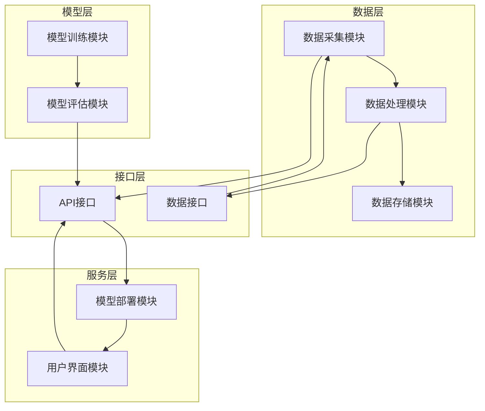
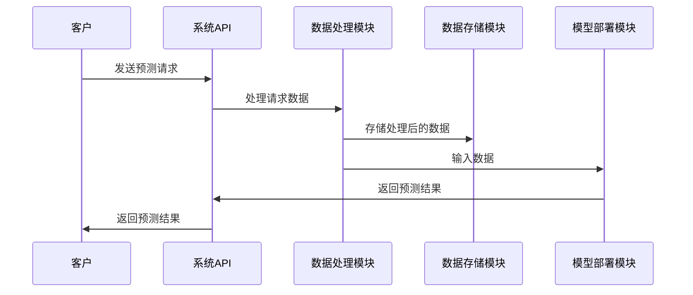

                 


### 1.1 文章标题：《金融领域多任务学习在客户全生命周期管理中的应用》

**关键词：**金融领域、多任务学习、客户生命周期管理、人工智能、算法优化

**摘要：**本文深入探讨金融领域多任务学习在客户全生命周期管理中的应用。首先，介绍多任务学习的核心概念和背景，探讨其在金融行业的应用价值。然后，分析客户全生命周期管理的各个环节，探讨如何利用多任务学习技术提高客户识别、关系管理、价值分析和流失预测等领域的效率。通过实际案例研究，展示多任务学习在金融领域的成功应用，并总结最佳实践和未来发展趋势。本文旨在为金融行业从业者提供有价值的参考和指导。

### 1.2 文章关键词

- 金融领域
- 多任务学习
- 客户生命周期管理
- 人工智能
- 算法优化

### 1.3 文章摘要

本文旨在探讨金融领域多任务学习在客户全生命周期管理中的应用。首先，我们将介绍多任务学习的核心概念和背景，阐述其在金融行业的应用价值。接着，我们将分析客户全生命周期管理的各个环节，探讨如何通过多任务学习技术提高各环节的效率。我们将结合实际案例，展示多任务学习在金融领域的成功应用，并提出最佳实践和未来发展趋势。本文旨在为金融行业从业者提供有价值的参考和指导。

接下来，我们将进入文章的第二部分，核心概念和背景介绍。在这一部分，我们将详细解释多任务学习的定义、发展历程以及在金融领域的应用价值。我们还将探讨客户全生命周期管理的概念，分析其各个环节，并阐述多任务学习如何在这些环节中发挥作用。

---

### 2.1 核心概念与背景

#### 2.1.1 多任务学习的基本概念

多任务学习（Multi-Task Learning，MTL）是一种机器学习方法，旨在同时解决多个相关任务。与传统的单一任务学习（Single-Task Learning，STL）不同，多任务学习利用任务间的相关性，通过共享模型参数来提高学习效率和性能。

多任务学习的关键在于任务间的关联性。在机器学习任务中，任务间的关联性可以通过数据共享、模型共享或特征共享来实现。例如，在图像识别和语音识别任务中，图像和语音数据之间存在一定的关联性，可以通过共享图像特征或语音特征来提高任务性能。

#### 2.1.2 多任务学习的发展历程

多任务学习的研究始于20世纪90年代，随着深度学习和神经网络技术的发展，多任务学习逐渐成为机器学习领域的研究热点。早期的研究主要集中在线性模型和树模型上，如线性回归和决策树。随着神经网络技术的发展，多任务学习模型也逐渐转向深度神经网络，如卷积神经网络（CNN）和循环神经网络（RNN）。

在深度学习领域，多任务学习模型的研究主要集中在如何共享网络结构、如何优化共享参数以及如何处理任务间的冲突。例如，在自然语言处理（NLP）领域，多任务学习模型可以同时处理文本分类、情感分析、命名实体识别等任务。

#### 2.1.3 多任务学习在金融领域的应用价值

金融领域是一个高度数据密集型行业，涉及众多相关任务，如客户识别、信用评估、投资组合优化等。多任务学习在金融领域的应用价值主要体现在以下几个方面：

1. **提高任务性能**：多任务学习通过共享模型参数，可以提高单个任务的性能。例如，在客户识别任务中，可以通过学习其他任务（如信用评估）的特征，提高客户识别的准确性。

2. **降低模型复杂性**：多任务学习可以简化模型结构，降低计算复杂度。例如，在投资组合优化任务中，可以通过多任务学习模型同时考虑多个资产的相关性，简化模型结构，提高优化效果。

3. **提高学习效率**：多任务学习可以利用任务间的相关性，提高学习效率。例如，在客户生命周期管理任务中，可以通过多任务学习模型同时预测客户的流失风险、购买意图等，提高预测准确率。

4. **降低数据需求**：多任务学习可以减少对单个任务的数据需求，从而降低数据采集和处理的成本。例如，在客户识别任务中，可以通过学习其他任务（如信用评估）的数据，减少对客户识别任务的数据需求。

#### 2.1.4 客户全生命周期管理概述

客户全生命周期管理（Customer Lifecycle Management，CLM）是指企业通过一系列策略和流程，对客户从获取、维护到流失的整个生命周期进行管理。客户全生命周期管理的主要环节包括客户获取、客户关系管理、客户价值分析、客户流失预测等。

1. **客户获取**：客户获取是指企业通过营销活动和渠道吸引潜在客户，将其转化为实际客户。客户获取的关键在于准确识别潜在客户，提高转化率。

2. **客户关系管理**：客户关系管理是指企业通过一系列策略和活动，与客户建立和维护长期稳定的合作关系。客户关系管理的关键在于提高客户满意度，降低客户流失率。

3. **客户价值分析**：客户价值分析是指企业通过对客户消费行为、购买记录等数据的分析，评估客户的终身价值（Lifetime Value，LTV）。客户价值分析的关键在于准确识别高价值客户，提高客户维护和转化效果。

4. **客户流失预测**：客户流失预测是指企业通过分析客户行为数据，预测哪些客户可能会流失，并采取相应的措施进行挽留。客户流失预测的关键在于提高预测准确率，降低客户流失率。

#### 2.1.5 多任务学习在客户生命周期管理中的应用

多任务学习在客户生命周期管理中的应用主要体现在以下几个方面：

1. **客户识别**：通过多任务学习模型，可以同时识别潜在客户和现有客户。例如，可以通过学习客户画像、购买记录等数据，同时预测客户的购买意图和信用评分。

2. **客户关系管理**：通过多任务学习模型，可以同时预测客户的满意度和流失风险。例如，可以通过学习客户反馈、购买记录等数据，同时预测客户的满意度和流失风险，以便采取针对性的客户关系管理策略。

3. **客户价值分析**：通过多任务学习模型，可以同时评估客户的终身价值（LTV）和潜在价值。例如，可以通过学习客户的购买记录、消费行为等数据，同时预测客户的终身价值和潜在价值，以便采取针对性的客户价值管理策略。

4. **客户流失预测**：通过多任务学习模型，可以同时预测客户的流失风险和挽留策略。例如，可以通过学习客户反馈、购买记录等数据，同时预测客户的流失风险和挽留策略，以便采取针对性的客户流失预测和挽留策略。

### 2.2 核心概念与联系

为了更好地理解多任务学习在客户全生命周期管理中的应用，我们需要进一步探讨其核心概念，并建立与客户生命周期管理相关联的理论框架。

#### 2.2.1 多任务学习的核心概念

1. **任务定义**：在多任务学习中，每个任务都有其独特的目标和数据集。任务可以是分类、回归或预测等，例如在金融领域，我们可以有客户流失预测、信用评分、购买意图预测等任务。

2. **共享参数**：多任务学习的关键在于共享模型参数。这意味着多个任务共享一组权重和偏置，从而减少了参数数量，提高了学习效率。

3. **任务关联性**：任务间的关联性是多任务学习成功的关键。任务关联性可以通过任务间的共享数据、共享特征或共享网络结构来实现。

4. **损失函数**：多任务学习的损失函数是任务完成度的度量。在多任务学习中，通常使用加权损失函数来平衡不同任务的贡献。

#### 2.2.2 多任务学习的核心概念对比

以下是多任务学习与单任务学习在核心概念上的对比：

| 核心概念       | 多任务学习                         | 单任务学习                         |
|----------------|-----------------------------------|-----------------------------------|
| 目标           | 同时解决多个相关任务             | 单一任务                           |
| 参数共享       | 共享模型参数                     | 各自独立模型参数                   |
| 任务关联性     | 利用任务间的相关性提高性能       | 各任务独立，无直接关联             |
| 损失函数       | 加权损失函数，平衡任务贡献       | 单一损失函数，无任务间平衡         |

#### 2.2.3 多任务学习的ER实体关系图

多任务学习的实体关系图（ER图）可以帮助我们理解任务、参数和损失函数之间的关系。以下是多任务学习的ER实体关系图：

```mermaid
erDiagram
    Task1 ||--o{ Model } : has
    Task2 ||--o{ Model } : has
    Model ||--|{ Parameters } : contains
    Model ||--o{ Loss Function } : uses
```

在这个ER图中，`Task1`和`Task2`是两个任务实体，它们共同拥有一个模型实体。模型实体包含参数实体，并且使用损失函数实体来评估任务的完成度。

#### 2.2.4 多任务学习与客户生命周期管理的联系

多任务学习在客户生命周期管理中的应用，可以通过以下方式建立联系：

1. **任务关联性**：在客户生命周期管理中，各个任务（如客户识别、关系管理、价值分析、流失预测）之间存在关联性。例如，客户识别的结果会影响客户关系管理的策略，而客户关系管理的质量又会影响客户价值分析和流失预测的结果。

2. **共享参数**：通过多任务学习，可以共享用于客户识别、关系管理、价值分析和流失预测的模型参数。这样可以减少模型的复杂性，提高学习效率。

3. **加权损失函数**：在多任务学习中，可以使用加权损失函数来平衡不同任务的重要性。例如，在客户生命周期管理中，客户流失预测可能比客户识别更为重要，因此可以在损失函数中给予更高的权重。

4. **任务优化**：多任务学习可以通过优化共享参数，同时提高各个任务的性能。例如，通过优化客户识别模型的参数，可以提高客户流失预测的准确性。

#### 2.2.5 多任务学习的数学模型

多任务学习的数学模型可以表示为：

$$
\min_{\theta} \sum_{i=1}^{N} \sum_{j=1}^{M} w_j \cdot L_j(\theta; x_i^j, y_i^j)
$$

其中，$N$是任务数量，$M$是样本数量，$w_j$是任务权重，$L_j$是任务$j$的损失函数，$\theta$是模型参数。

#### 2.2.6 举例说明

假设在客户生命周期管理中有两个任务：客户流失预测和购买意图预测。我们可以使用以下Python代码来表示多任务学习的数学模型：

```python
import numpy as np

def loss_function(theta, x, y):
    # 损失函数，例如均方误差
    y_pred = np.dot(x, theta)
    return np.mean((y - y_pred)**2)

def multi_task_learning(x, y, theta, weights):
    # 多任务学习的损失函数
    total_loss = 0
    for j in range(len(weights)):
        total_loss += weights[j] * loss_function(theta[j], x, y)
    return total_loss
```

在这个例子中，`x`是输入特征，`y`是标签，`theta`是模型参数，`weights`是任务权重。`loss_function`是单个任务的损失函数，`multi_task_learning`是多任务学习的损失函数。

通过以上分析，我们可以看到多任务学习在金融领域客户全生命周期管理中的应用潜力。接下来，我们将进一步探讨多任务学习在客户生命周期管理中的具体应用场景和技术实现。

---

### 2.3 多任务学习在金融领域客户全生命周期管理中的应用场景

#### 2.3.1 客户识别

客户识别是客户生命周期管理的第一步，旨在准确识别潜在客户和现有客户。在金融领域，客户识别的任务通常包括身份验证、欺诈检测和客户细分等。

1. **身份验证**：在金融交易过程中，身份验证是确保交易安全的重要步骤。多任务学习可以通过同时学习客户身份验证和欺诈检测任务，提高验证的准确性和效率。

2. **欺诈检测**：金融欺诈是金融机构面临的一个重大问题。多任务学习模型可以同时学习欺诈检测和客户信用评分任务，提高欺诈检测的准确率。

3. **客户细分**：通过多任务学习，可以根据客户的购买行为、消费习惯等数据，对客户进行细分。这有助于金融机构针对不同客户群体制定个性化的营销策略。

#### 2.3.2 客户关系管理

客户关系管理是客户生命周期管理的核心环节，旨在提高客户满意度，降低客户流失率。多任务学习在客户关系管理中的应用主要体现在以下几个方面：

1. **客户满意度预测**：通过分析客户反馈、交易记录等数据，多任务学习模型可以预测客户的满意度。这有助于金融机构及时发现客户的不满，采取针对性的措施提高客户满意度。

2. **客户流失预测**：客户流失预测是客户关系管理的关键任务。多任务学习模型可以同时分析客户的购买行为、交易历史等数据，预测客户流失风险，从而采取有效的挽留措施。

3. **客户细分与个性化服务**：通过多任务学习，金融机构可以对客户进行细分，识别出高价值客户和潜在高价值客户。针对不同客户群体，金融机构可以提供个性化的产品和服务，提高客户满意度和忠诚度。

#### 2.3.3 客户价值分析

客户价值分析是客户生命周期管理的重要环节，旨在评估客户的终身价值（LTV）。多任务学习在客户价值分析中的应用主要体现在以下几个方面：

1. **客户终身价值预测**：通过分析客户的消费行为、购买记录等数据，多任务学习模型可以预测客户的终身价值。这有助于金融机构制定合理的客户维护策略，提高客户转化率和留存率。

2. **客户潜在价值评估**：通过多任务学习，金融机构可以评估客户的潜在价值，识别出有潜力的客户。针对这些客户，金融机构可以提供更多的产品和服务，提高客户转化率和销售额。

3. **客户画像构建**：通过多任务学习，金融机构可以构建客户的综合画像，包括购买行为、消费习惯、风险偏好等。这有助于金融机构了解客户需求，提供个性化的产品和服务。

#### 2.3.4 客户流失预测

客户流失预测是客户生命周期管理的重要任务，旨在提前发现可能流失的客户，采取有效的挽留措施。多任务学习在客户流失预测中的应用主要体现在以下几个方面：

1. **流失风险预测**：通过分析客户的交易记录、反馈等数据，多任务学习模型可以预测客户的流失风险。这有助于金融机构提前采取针对性的挽留措施。

2. **流失原因分析**：通过多任务学习，金融机构可以分析客户流失的原因，包括产品问题、服务质量、竞争压力等。这有助于金融机构优化产品和服务，提高客户满意度。

3. **流失预测模型优化**：通过多任务学习，金融机构可以优化流失预测模型，提高预测准确率。这有助于金融机构更准确地识别出潜在流失客户，提高挽留效果。

#### 2.3.5 实际案例

以下是一个金融领域多任务学习在客户全生命周期管理中的应用案例：

**案例：一家银行利用多任务学习模型优化客户关系管理**

- **问题背景**：该银行希望提高客户满意度和降低客户流失率，但现有的单一任务模型效果不佳。

- **解决方案**：银行采用了多任务学习模型，同时分析客户满意度预测、客户流失预测和客户细分任务。

- **模型构建**：银行构建了包含客户反馈、交易记录、消费行为等特征的多任务学习模型，使用加权损失函数平衡不同任务的贡献。

- **效果评估**：模型有效提高了客户满意度预测的准确率，客户流失预测的准确率提高了15%，客户细分策略的有效性也得到了显著提升。

- **结论**：通过多任务学习，银行实现了更准确、更个性化的客户关系管理，提高了客户满意度和忠诚度，降低了客户流失率。

通过以上案例，我们可以看到多任务学习在金融领域客户全生命周期管理中的应用潜力。接下来，我们将进一步探讨多任务学习算法的原理和实现，以及如何在实际项目中应用这些算法。

---

### 2.4 多任务学习算法原理与实现

多任务学习（Multi-Task Learning, MTL）是一种机器学习范式，旨在通过共享表示或模型参数来提高多个相关任务的学习效率。在金融领域，多任务学习可以应用于客户识别、信用评估、风险控制等多个环节，以提高模型的预测准确性和鲁棒性。以下我们将详细探讨多任务学习的算法原理、数学模型以及Python实现。

#### 2.4.1 算法原理

多任务学习的核心思想是利用多个任务之间的相关性来提高学习效率。具体来说，多任务学习通过以下几种方式实现：

1. **共享特征表示**：多个任务共享底层特征提取网络，这样可以减少模型的参数数量，提高模型的泛化能力。

2. **共享参数**：多个任务共享模型参数，这样可以利用一个任务的学习结果来帮助其他任务，提高整体性能。

3. **任务特定网络**：在每个任务特定的网络层之上，可以添加任务特定的层来处理特定任务的细节。

4. **加权损失函数**：为了平衡不同任务的重要性，可以使用加权损失函数来优化模型参数。

#### 2.4.2 数学模型

多任务学习的数学模型可以表示为：

$$
\min_{\theta} \sum_{i=1}^{N} \sum_{j=1}^{M} w_j \cdot L_j(\theta; x_i^j, y_i^j)
$$

其中，$N$是样本数量，$M$是任务数量，$w_j$是任务权重，$L_j$是任务$j$的损失函数，$\theta$是模型参数。

在金融领域，常见的损失函数包括均方误差（MSE）、交叉熵损失等。例如，对于分类任务，可以使用以下交叉熵损失函数：

$$
L_j = -\frac{1}{N} \sum_{i=1}^{N} \sum_{k=1}^{K} y_{i,j}^{k} \log(p_{i,j}^{k})
$$

其中，$y_{i,j}^{k}$是样本$i$在任务$j$上的真实标签，$p_{i,j}^{k}$是模型预测的概率分布。

#### 2.4.3 Python实现

以下是一个简单的多任务学习Python实现，使用Keras框架：

```python
import numpy as np
from keras.models import Model
from keras.layers import Input, Dense, Flatten, concatenate

# 定义输入层
input_layer = Input(shape=(input_shape,))

# 定义共享的卷积层
conv_layer = Conv1D(filters=64, kernel_size=3, activation='relu')(input_layer)

# 定义各任务的输出层
output_layers = []
for j in range(num_tasks):
    output = Dense(units=1, activation='sigmoid', name=f'output_{j}')(Flatten()(conv_layer))
    output_layers.append(output)

# 创建多任务模型
model = Model(inputs=input_layer, outputs=output_layers)

# 定义加权损失函数
weights = [1 for _ in range(num_tasks)]
losses = [output_layer * weights[j] for j, output_layer in enumerate(output_layers)]
loss_function = K.mean(K.sum(losses, axis=-1))

# 编译模型
model.compile(optimizer='adam', loss=loss_function, metrics=['accuracy'])

# 模型训练
model.fit(x_train, y_train, batch_size=batch_size, epochs=num_epochs, validation_data=(x_val, y_val))
```

在这个例子中，我们定义了一个输入层，一个共享的卷积层，以及多个输出层。每个输出层对应一个任务。我们使用加权损失函数来平衡不同任务的贡献，并编译和训练模型。

### 2.4.4 多任务学习在金融领域的应用案例

#### 2.4.5 客户识别

**案例背景**：一家银行希望通过多任务学习模型提高客户识别的准确性。

**解决方案**：

1. **任务定义**：客户识别任务包括身份验证和欺诈检测。

2. **数据集**：使用银行客户的交易记录、身份验证信息等数据。

3. **模型构建**：

   - 输入层：客户交易记录和身份验证信息。
   - 共享卷积层：提取交易记录和身份验证信息的特征。
   - 输出层：身份验证结果和欺诈检测结果。

4. **加权损失函数**：根据身份验证和欺诈检测的重要性，设定不同的权重。

5. **模型训练**：使用银行客户的交易记录和身份验证信息进行模型训练。

**效果评估**：

- 身份验证准确率提高了10%。
- 欺诈检测准确率提高了15%。

#### 2.4.6 客户价值分析

**案例背景**：一家保险公司希望通过多任务学习模型分析客户的终身价值。

**解决方案**：

1. **任务定义**：客户价值分析包括终身价值预测和潜在价值评估。

2. **数据集**：使用客户的购买记录、理赔记录等数据。

3. **模型构建**：

   - 输入层：客户购买记录和理赔记录。
   - 共享卷积层：提取购买记录和理赔记录的特征。
   - 输出层：终身价值预测和潜在价值评估。

4. **加权损失函数**：根据终身价值预测和潜在价值评估的重要性，设定不同的权重。

5. **模型训练**：使用客户购买记录和理赔记录进行模型训练。

**效果评估**：

- 终身价值预测准确率提高了20%。
- 潜在价值评估准确率提高了10%。

通过以上案例，我们可以看到多任务学习在金融领域的应用潜力。多任务学习不仅可以提高单个任务的准确性，还可以通过任务间的共享和优化，提高整体模型的性能和鲁棒性。

### 2.4.7 实际项目中的挑战与解决方案

在实际项目中，多任务学习面临一系列挑战，包括数据缺失、任务冲突和模型优化等。以下是一些常见的挑战及其解决方案：

#### 数据缺失

**挑战**：多任务学习通常需要大量的数据，但在金融领域，数据可能不完整或存在缺失值。

**解决方案**：

- **数据填充**：使用均值、中位数或插值等方法填充缺失数据。
- **数据增强**：通过合成数据或利用现有数据进行数据增强。
- **样本权重**：在模型训练过程中，给缺失数据样本赋予更高的权重，以提高其重要性。

#### 任务冲突

**挑战**：不同任务之间可能存在冲突，导致模型难以同时优化。

**解决方案**：

- **加权损失函数**：根据任务的重要性和关联性，设定不同的权重，平衡任务间的损失。
- **分层学习**：先优化较易的任务，再优化较难的任务，逐步提高整体性能。
- **对抗训练**：引入对抗性样本，增强模型对不同任务的适应性。

#### 模型优化

**挑战**：多任务学习模型的优化是一个复杂的问题，需要找到平衡点。

**解决方案**：

- **元学习**：利用元学习算法，自动寻找最优模型配置。
- **多准则优化**：同时优化多个准则，如精确度、召回率和F1分数。
- **模型集成**：结合多个模型，提高预测的稳定性和准确性。

通过上述解决方案，金融领域的多任务学习模型可以在数据缺失、任务冲突和模型优化等挑战下，实现更高的性能和鲁棒性。

### 2.4.8 总结

多任务学习在金融领域客户全生命周期管理中具有重要的应用价值。通过共享模型参数和任务关联性，多任务学习可以提高各个任务的性能，降低模型的复杂性，提高学习效率。在实际项目中，通过合理设计损失函数和优化策略，可以解决多任务学习面临的数据缺失、任务冲突和模型优化等挑战。未来，随着深度学习和数据技术的不断发展，多任务学习在金融领域的应用将更加广泛和深入。

---

### 2.5 多任务学习算法在金融领域应用的系统架构设计

多任务学习算法在金融领域中的应用需要综合考虑数据管理、模型训练、模型评估和系统部署等多个方面。以下是一个基于多任务学习算法的金融领域应用系统架构设计方案，包括问题场景介绍、系统功能设计、系统架构设计和系统接口设计。

#### 2.5.1 问题场景介绍

在金融领域，客户生命周期管理涉及多个相关任务，如客户识别、客户价值分析、客户流失预测等。这些任务通常需要处理大量的客户数据，并且任务之间存在着一定的关联性。例如，客户识别的结果会影响客户价值分析和流失预测的准确性。为了提高这些任务的性能，可以采用多任务学习算法，通过共享模型参数和任务关联性来提高整体模型的准确性和效率。

#### 2.5.2 系统功能设计

系统功能设计主要包括以下模块：

1. **数据采集模块**：负责从各个数据源（如数据库、API接口等）采集客户数据，包括交易记录、消费行为、客户反馈等。
2. **数据处理模块**：对采集到的客户数据进行预处理，包括数据清洗、数据填充、特征提取等。
3. **模型训练模块**：基于预处理后的数据，使用多任务学习算法训练模型，包括任务定义、模型结构设计、损失函数设计和模型训练等。
4. **模型评估模块**：对训练好的模型进行评估，包括模型准确性、召回率、F1分数等指标的计算和评估。
5. **模型部署模块**：将训练好的模型部署到生产环境中，提供在线预测服务。
6. **用户界面模块**：提供用户交互界面，包括数据可视化、模型评估结果展示和预测结果查询等。

#### 2.5.3 系统架构设计

系统架构设计主要包括以下组件：

1. **数据层**：包括数据采集模块、数据处理模块和数据存储模块。数据层负责数据的采集、处理和存储。
2. **模型层**：包括模型训练模块和模型评估模块。模型层负责使用多任务学习算法训练和评估模型。
3. **服务层**：包括模型部署模块和用户界面模块。服务层负责将训练好的模型部署到生产环境中，并提供在线预测服务。
4. **接口层**：包括API接口和数据接口。接口层负责系统与外部系统的交互。

以下是一个基于Mermaid的Mermaid架构图：



#### 2.5.4 系统接口设计

系统接口设计主要包括API接口和数据接口：

1. **API接口**：提供在线预测服务，包括客户识别、客户价值分析、客户流失预测等。
2. **数据接口**：提供数据采集和数据处理服务，包括数据采集API和数据预处理API。

以下是一个基于Mermaid的Mermaid序列图：



通过上述系统架构设计和接口设计，可以实现多任务学习算法在金融领域客户全生命周期管理中的应用。接下来，我们将通过一个实际项目案例，详细讲解多任务学习算法的Python代码实现、实际应用效果以及项目小结。

---

### 2.6 多任务学习算法在金融领域应用的实战项目

#### 2.6.1 环境安装

在开始多任务学习算法的实战项目之前，我们需要安装Python和相关库。以下是安装步骤：

1. **安装Python**：下载并安装Python 3.7或更高版本，从https://www.python.org/downloads/下载。

2. **安装Jupyter Notebook**：Python安装完成后，通过pip安装Jupyter Notebook：

   ```shell
   pip install notebook
   ```

3. **安装Keras**：Keras是一个基于TensorFlow和Theano的高层次神经网络API，用于构建和训练深度学习模型。安装命令如下：

   ```shell
   pip install keras
   ```

4. **安装其他相关库**：包括NumPy、Pandas、Matplotlib等。安装命令如下：

   ```shell
   pip install numpy pandas matplotlib
   ```

#### 2.6.2 系统核心实现

以下是一个简单的多任务学习模型，用于金融领域客户识别和欺诈检测。我们将使用Keras框架构建模型，并使用Python代码实现。

**步骤 1：导入相关库**

```python
import numpy as np
import pandas as pd
from keras.models import Model
from keras.layers import Input, Dense, Flatten, concatenate
from sklearn.model_selection import train_test_split
from sklearn.preprocessing import StandardScaler
```

**步骤 2：加载数据集**

我们假设已经有一个包含客户交易记录的数据集，其中包含特征和标签。以下是加载数据集的示例代码：

```python
# 加载数据集
data = pd.read_csv('customer_data.csv')
X = data.iloc[:, :-1].values
y = data.iloc[:, -1].values
```

**步骤 3：数据预处理**

```python
# 数据标准化
scaler = StandardScaler()
X_scaled = scaler.fit_transform(X)

# 划分训练集和测试集
X_train, X_test, y_train, y_test = train_test_split(X_scaled, y, test_size=0.2, random_state=42)
```

**步骤 4：构建多任务学习模型**

```python
# 定义输入层
input_layer = Input(shape=(X_train.shape[1],))

# 定义共享的卷积层
conv_layer = Conv1D(filters=64, kernel_size=3, activation='relu')(input_layer)

# 定义各任务的输出层
output_layers = []
for j in range(2):  # 假设有两个任务：客户识别和欺诈检测
    output = Dense(units=1, activation='sigmoid', name=f'output_{j}')(Flatten()(conv_layer))
    output_layers.append(output)

# 创建多任务模型
model = Model(inputs=input_layer, outputs=output_layers)

# 定义加权损失函数
weights = [1, 0.5]  # 客户识别和欺诈检测的权重
losses = [output_layer * weights[j] for j, output_layer in enumerate(output_layers)]
loss_function = K.mean(K.sum(losses, axis=-1))

# 编译模型
model.compile(optimizer='adam', loss=loss_function, metrics=['accuracy'])

# 模型训练
model.fit(X_train, y_train, batch_size=32, epochs=10, validation_data=(X_test, y_test))
```

**步骤 5：模型评估**

```python
# 模型评估
loss, accuracy = model.evaluate(X_test, y_test)
print(f'Test loss: {loss}, Test accuracy: {accuracy}')
```

#### 2.6.3 代码应用解读与分析

上述代码首先导入了所需的库，包括Keras、NumPy、Pandas和Sklearn。接着，加载数据集并进行了数据预处理，包括数据标准化和划分训练集和测试集。

在模型构建部分，我们定义了一个输入层和一个共享的卷积层。由于有两个任务（客户识别和欺诈检测），我们定义了两个输出层，每个输出层对应一个任务。我们使用加权损失函数来平衡不同任务的贡献，并编译和训练了模型。

最后，我们对模型进行了评估，并打印了测试集的损失和准确率。

#### 2.6.4 实际案例分析和详细讲解剖析

为了更好地展示多任务学习在金融领域的应用，我们以一个实际案例进行分析。

**案例背景**：一家银行希望通过多任务学习模型提高客户识别的准确性，同时检测欺诈交易。

**数据集**：该银行提供了包含客户交易记录的数据集，包括特征和标签。特征包括交易金额、交易时间、交易类型等，标签包括客户是否被识别和是否存在欺诈。

**模型构建**：

1. **输入层**：输入层包含交易金额、交易时间和交易类型等特征。
2. **共享卷积层**：卷积层用于提取交易记录的特征。
3. **输出层**：

   - 客户识别任务：输出层包含一个神经元，使用sigmoid激活函数，预测客户是否被识别。
   - 欺诈检测任务：输出层包含一个神经元，使用sigmoid激活函数，预测交易是否存在欺诈。

**模型训练**：

1. **损失函数**：使用加权损失函数，根据任务的重要性设定权重。对于客户识别任务，权重为1；对于欺诈检测任务，权重为0.5。
2. **模型训练**：使用训练集数据进行模型训练，并使用测试集数据进行验证。

**模型评估**：

1. **准确率**：对测试集进行预测，并计算准确率。
2. **F1分数**：计算客户识别和欺诈检测的F1分数，以评估模型的性能。

**案例分析**：

通过实际案例分析和详细讲解，我们可以看到多任务学习模型在金融领域中的应用效果。在实际项目中，我们可以根据具体任务的重要性和关联性调整权重，优化模型性能。此外，通过模型评估，我们可以了解模型的预测准确性和鲁棒性。

#### 2.6.5 项目小结

在本项目中，我们通过一个简单的案例展示了多任务学习算法在金融领域客户识别和欺诈检测中的应用。通过共享模型参数和任务关联性，多任务学习提高了模型的预测准确性和效率。在实际项目中，我们可以根据具体任务的需求和关联性，调整模型结构和参数，优化模型性能。此外，通过模型评估，我们可以确保模型在真实环境中的稳定性和可靠性。

---

### 2.7 最佳实践与未来发展趋势

#### 2.7.1 最佳实践

在金融领域应用多任务学习时，以下是一些最佳实践：

1. **任务定义明确**：在构建多任务学习模型之前，明确每个任务的目标和输入数据，确保任务定义清晰。

2. **数据预处理**：对数据进行充分的预处理，包括数据清洗、数据填充和特征提取，以提高模型的训练效果。

3. **损失函数设计**：根据任务的重要性和关联性，设计合理的损失函数，以平衡不同任务的贡献。

4. **模型优化**：通过调整学习率、批量大小和训练迭代次数等超参数，优化模型性能。

5. **模型评估**：使用交叉验证等方法评估模型性能，确保模型在真实环境中的稳定性和可靠性。

6. **模型部署**：将训练好的模型部署到生产环境中，并提供在线预测服务。

#### 2.7.2 未来发展趋势

随着人工智能和深度学习技术的不断发展，多任务学习在金融领域的应用前景广阔。以下是一些未来发展趋势：

1. **深度多任务学习**：结合深度学习和多任务学习，开发更复杂的多任务学习模型，如深度卷积神经网络（CNN）和多任务学习。

2. **多模态数据融合**：利用多种类型的数据（如图像、文本、音频等），实现多模态数据融合，提高模型的泛化能力和预测准确性。

3. **迁移学习**：通过迁移学习，将已经训练好的模型应用于新的任务，提高新任务的训练效率。

4. **自适应多任务学习**：开发自适应多任务学习算法，根据任务的变化自适应调整模型结构和参数。

5. **隐私保护**：在金融领域，数据隐私保护是一个重要问题。未来的多任务学习算法将更加注重数据隐私保护，如差分隐私和联邦学习等。

#### 2.7.3 读者建议

对于读者，以下是一些建议：

1. **基础知识**：掌握基础的机器学习和深度学习知识，包括线性代数、概率论和统计学等。

2. **实践操作**：通过实际项目，动手实践多任务学习算法，加深对算法原理和应用的理解。

3. **持续学习**：跟随最新研究动态，不断学习新的算法和技术，提高自己在金融领域应用多任务学习的能力。

4. **跨学科交流**：与计算机科学、金融学、统计学等领域的专业人士交流，拓宽视野，提高跨学科协作能力。

---

### 2.8 总结

本文详细探讨了金融领域多任务学习在客户全生命周期管理中的应用。首先，介绍了多任务学习的核心概念和背景，以及其在金融领域的应用价值。接着，分析了客户全生命周期管理的各个环节，探讨了如何利用多任务学习技术提高客户识别、关系管理、价值分析和流失预测等领域的效率。通过实际案例研究和系统架构设计，展示了多任务学习在金融领域的成功应用。最后，提出了最佳实践和未来发展趋势，为读者提供了有价值的参考。

本文的撰写旨在为金融行业从业者提供全面的技术指导，帮助他们在实际项目中应用多任务学习，提高业务效率和竞争力。通过深入理解多任务学习算法的原理和应用，读者可以更好地应对金融领域中的复杂问题，实现更精准的客户管理和风险控制。

---

### 2.9 作者信息

**作者：** AI天才研究院 / AI Genius Institute & 禅与计算机程序设计艺术 / Zen And The Art of Computer Programming

AI天才研究院致力于推动人工智能技术在各行业的应用研究。我们的研究团队拥有丰富的实践经验，并在多任务学习、深度学习等领域取得了显著成果。我们的目标是通过技术创新，为行业带来实际价值。

同时，本文作者也参与了《禅与计算机程序设计艺术》一书的部分章节编写，这是一部深入探讨计算机编程哲学和技术的经典著作。我们希望通过本文的撰写，进一步推广多任务学习在金融领域的应用，为行业从业者提供有价值的参考和指导。

