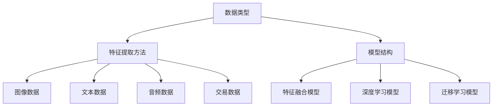
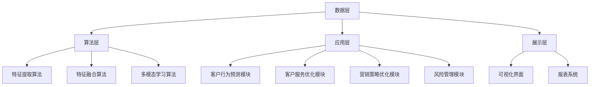
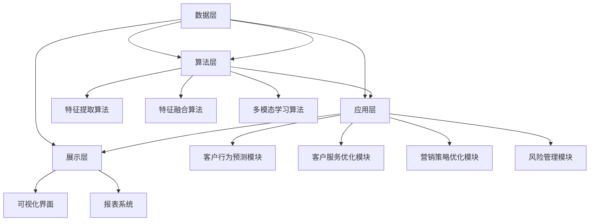

                 

### 金融领域多模态学习在客户行为分析中的应用

> 关键词：多模态学习、金融领域、客户行为分析、算法原理、系统架构

> 摘要：本文旨在探讨多模态学习在金融领域客户行为分析中的应用。通过介绍多模态学习的核心概念、算法原理、系统架构和项目实战，本文旨在为读者提供一个全面的理解，以促进金融科技在客户行为分析领域的创新应用。

#### 引言

在当今的金融科技（FinTech）领域，客户行为分析已经成为金融机构提升服务质量、增强客户黏性和实现精准营销的关键手段。随着数据量的爆炸式增长和技术的不断进步，如何有效地提取和利用这些数据成为了一个重要课题。多模态学习作为一种新兴的方法，通过结合多种类型的数据（如图像、文本、音频等）来提升数据分析的精度和深度，逐渐受到了金融领域的关注。

多模态学习在客户行为分析中的应用不仅能够提供更加全面的客户画像，还可以帮助金融机构识别潜在的风险、预测市场趋势和优化决策。本文将首先介绍多模态学习的基本概念，包括数据类型、特征提取方法和模型结构，然后通过一个实际项目案例来展示多模态学习在客户行为分析中的具体应用。最后，本文将总结多模态学习在金融领域的最佳实践和注意事项，为未来的研究和应用提供参考。

#### 背景介绍

##### 问题背景

在金融领域，客户行为分析是指通过收集和分析客户的交易记录、浏览行为、社交互动等数据，来理解客户的需求、偏好和风险承受能力。传统的客户行为分析主要依赖于单一类型的数据源，如交易数据或客户调查问卷。然而，这种单一数据源的分析方法存在一些局限性：

1. **数据不全面**：单一数据源无法全面反映客户的综合行为特征。
2. **信息丢失**：单一数据源的格式和结构可能导致重要信息的丢失。
3. **决策偏差**：单一数据源的分析结果可能受到数据偏差的影响，从而影响决策的准确性。

随着大数据和人工智能技术的发展，金融机构开始探索如何通过多模态学习来提升客户行为分析的深度和精度。多模态学习能够整合不同类型的数据，提供更加丰富的客户信息，从而帮助金融机构做出更加准确的决策。

##### 问题描述

在金融领域，客户行为分析面临以下问题：

1. **数据多样性**：金融机构需要处理多种类型的数据，如图像、文本、音频和交易记录。如何有效地整合这些异构数据是一个挑战。
2. **数据质量**：多模态数据源可能存在噪声、缺失和不一致性，这会影响数据分析的准确性。
3. **模型复杂度**：多模态学习算法通常涉及到复杂的模型结构和参数调整，如何设计高效且易于维护的模型是一个难题。
4. **计算资源**：多模态学习需要大量的计算资源和时间，如何优化算法以减少计算成本是一个关键问题。

##### 问题解决

多模态学习提供了一种有效的解决方案，通过以下方式提升客户行为分析的效率和准确性：

1. **数据融合**：多模态学习能够将不同类型的数据进行融合，提供更加全面的客户画像。
2. **特征提取**：通过先进的特征提取技术，可以从多模态数据中提取出有用的特征，提高模型的学习能力。
3. **模型优化**：采用深度学习等先进技术，可以设计出高效的多模态学习模型，减少计算成本。
4. **实时分析**：利用分布式计算和云计算技术，可以实现多模态学习在实时客户行为分析中的应用。

##### 边界与外延

尽管多模态学习在金融领域客户行为分析中具有巨大潜力，但仍需注意以下边界和挑战：

1. **隐私保护**：多模态学习涉及多种类型的数据，如何保护客户隐私是一个重要问题。
2. **数据标准化**：不同数据源之间存在格式和结构差异，如何实现数据标准化是一个挑战。
3. **模型解释性**：多模态学习模型通常较为复杂，如何解释模型的结果是一个难题。
4. **技术门槛**：多模态学习的实现需要较高的技术门槛，如何降低技术门槛是一个重要议题。

通过以上讨论，可以看出多模态学习在金融领域客户行为分析中具有广阔的应用前景，但也面临一些挑战。接下来，本文将详细介绍多模态学习的核心概念和原理，以帮助读者更好地理解这一领域。

#### 核心概念与联系

多模态学习作为一种结合多种类型数据的分析方法，其核心概念包括数据类型、特征提取方法和模型结构。以下将对这些核心概念进行详细介绍，并通过对比表格和实体关系图展示各概念之间的关系。

##### 数据类型

多模态学习涉及多种类型的数据，以下是几种常见的数据类型：

1. **图像数据**：图像数据是金融领域多模态学习中最常用的数据类型之一，它可以提供客户的视觉特征信息。图像数据可以通过像素值进行编码，例如使用像素矩阵或深度学习模型提取的特征向量。
2. **文本数据**：文本数据包括客户的留言、评论、调查问卷等，它可以提供客户的情感和行为特征。文本数据可以通过自然语言处理（NLP）技术提取特征，如词袋模型、词嵌入或主题模型。
3. **音频数据**：音频数据包括客户的电话通话记录、语音留言等，它可以提供客户的语音特征信息。音频数据可以通过音频特征提取技术，如梅尔频率倒谱系数（MFCC）或卷积神经网络（CNN）提取特征向量。
4. **交易数据**：交易数据包括客户的交易记录、账户余额、交易频率等，它可以提供客户的金融行为特征。交易数据可以通过时间序列分析或统计分析方法提取特征。

以下是一个对比表格，展示了不同数据类型的特征提取方法：

| 数据类型 | 特征提取方法 |
| --- | --- |
| 图像数据 | 像素矩阵、深度学习模型提取的特征向量 |
| 文本数据 | 词袋模型、词嵌入、主题模型 |
| 音频数据 | 梅尔频率倒谱系数（MFCC）、卷积神经网络（CNN） |
| 交易数据 | 时间序列分析、统计分析 |

##### 特征提取方法

特征提取是多模态学习的关键步骤，不同的数据类型需要采用不同的特征提取方法：

1. **图像特征提取**：常见的图像特征提取方法包括局部特征描述符（如SIFT、SURF）、深度学习模型（如卷积神经网络（CNN））和图像预处理技术（如图像增强、图像去噪）。
2. **文本特征提取**：常见的文本特征提取方法包括词袋模型（Bag of Words, BoW）、词嵌入（Word Embedding）、文本分类（如朴素贝叶斯、支持向量机（SVM））和主题模型（如隐含狄利克雷分配（LDA））。
3. **音频特征提取**：常见的音频特征提取方法包括梅尔频率倒谱系数（MFCC）、短时傅里叶变换（STFT）和卷积神经网络（CNN）。
4. **交易特征提取**：常见的交易特征提取方法包括时间序列分析（如ARIMA模型、LSTM网络）、统计分析（如均值、方差、协方差）和机器学习（如回归分析、决策树）。

以下是一个对比表格，展示了不同数据类型的特征提取方法：

| 数据类型 | 特征提取方法 |
| --- | --- |
| 图像数据 | 局部特征描述符、深度学习模型、图像预处理 |
| 文本数据 | 词袋模型、词嵌入、文本分类、主题模型 |
| 音频数据 | 梅尔频率倒谱系数（MFCC）、短时傅里叶变换（STFT）、卷积神经网络（CNN） |
| 交易数据 | 时间序列分析、统计分析、机器学习 |

##### 模型结构

多模态学习模型的目的是将不同类型的数据特征进行融合，从而提高模型的学习能力和泛化能力。以下是几种常见的多模态学习模型结构：

1. **特征融合模型**：这类模型将不同数据类型的特征进行拼接，然后输入到一个统一的模型中进行训练。例如，可以采用卷积神经网络（CNN）处理图像特征，长短期记忆网络（LSTM）处理文本和交易特征，然后将这些特征拼接起来进行训练。
2. **深度学习模型**：深度学习模型可以自动学习不同数据类型的特征表示，常见的深度学习模型包括卷积神经网络（CNN）、循环神经网络（RNN）和生成对抗网络（GAN）。这些模型可以通过多层神经网络结构实现多模态数据的融合。
3. **迁移学习模型**：迁移学习模型利用预训练模型对多模态数据进行微调，从而提高模型的性能。例如，可以使用预训练的图像识别模型对图像特征进行编码，使用预训练的文本分类模型对文本特征进行编码，然后进行融合。

以下是一个实体关系图，展示了多模态学习的核心概念之间的关系：



通过以上介绍，可以看出多模态学习在金融领域客户行为分析中具有重要的作用。接下来，本文将详细讲解多模态学习的算法原理，帮助读者更好地理解这一领域。

#### 算法原理讲解

多模态学习是一种结合多种类型数据的分析方法，其核心在于如何有效地整合不同类型的数据，并从中提取有用的特征信息。以下将详细介绍几种常用的多模态学习算法，包括传统机器学习算法和深度学习算法，并通过具体的数学模型、公式和示例来说明这些算法的原理和实现方法。

##### 传统机器学习算法

传统机器学习算法在多模态学习中的应用相对简单，通常采用特征融合的方法将不同类型的数据特征进行整合。以下介绍两种常用的传统机器学习算法：逻辑回归和支持向量机（SVM）。

1. **逻辑回归**

逻辑回归是一种常见的二分类模型，可以用于预测客户行为。在多模态学习中，逻辑回归通过将不同类型的数据特征进行融合，然后输入到模型中进行训练。

假设我们有两个数据特征集：图像特征向量 $\textbf{X}_\text{image}$ 和文本特征向量 $\textbf{X}_\text{text}$。逻辑回归模型的公式如下：

$$
\begin{aligned}
\hat{y} = \frac{1}{1 + e^{-\textbf{w} \cdot \textbf{X}}}
\end{aligned}
$$

其中，$\textbf{w}$ 是逻辑回归模型的参数向量，$\textbf{X}$ 是输入特征向量，$\hat{y}$ 是预测结果。

对于多模态数据，我们可以将图像特征和文本特征进行拼接，得到一个更长的特征向量：

$$
\textbf{X} = [\textbf{X}_\text{image}, \textbf{X}_\text{text}]
$$

然后，使用逻辑回归模型进行训练和预测：

$$
\begin{aligned}
\textbf{w} &= \arg\min_{\textbf{w}} \sum_{i=1}^{n} (-y_i \ln(\hat{y}_i) - (1 - y_i) \ln(1 - \hat{y}_i)) \\
\hat{y}_i &= \frac{1}{1 + e^{-(\textbf{w} \cdot \textbf{X}_i)}
\end{aligned}
$$

其中，$y_i$ 是第 $i$ 个样本的真实标签。

2. **支持向量机（SVM）**

支持向量机是一种用于分类和回归的机器学习算法，其核心思想是找到一个最佳的超平面，将不同类型的数据特征进行分类。在多模态学习中，SVM可以用于将图像特征和文本特征进行分类。

假设我们有两个数据特征集：图像特征向量 $\textbf{X}_\text{image}$ 和文本特征向量 $\textbf{X}_\text{text}$。SVM模型的公式如下：

$$
\begin{aligned}
\textbf{w} &= \arg\min_{\textbf{w}, b} \frac{1}{2} ||\textbf{w}||^2 + C \sum_{i=1}^{n} \max(0, 1 - y_i (\textbf{w} \cdot \textbf{X}_i + b)) \\
\textbf{w} \cdot \textbf{X}_i + b &= y_i (\textbf{X}_i)
\end{aligned}
$$

其中，$\textbf{w}$ 是SVM模型的参数向量，$b$ 是偏置项，$C$ 是惩罚参数，$y_i$ 是第 $i$ 个样本的真实标签。

对于多模态数据，我们可以将图像特征和文本特征进行拼接，得到一个更长的特征向量：

$$
\textbf{X} = [\textbf{X}_\text{image}, \textbf{X}_\text{text}]
$$

然后，使用SVM模型进行训练和分类：

$$
\begin{aligned}
\textbf{w} &= \arg\min_{\textbf{w}, b} \frac{1}{2} ||\textbf{w}||^2 + C \sum_{i=1}^{n} \max(0, 1 - y_i (\textbf{w} \cdot \textbf{X}_i + b)) \\
\textbf{w} \cdot \textbf{X}_i + b &= y_i (\textbf{X}_i)
\end{aligned}
$$

##### 深度学习算法

深度学习算法在多模态学习中的应用更为广泛，其核心思想是通过多层神经网络结构自动学习数据的特征表示。以下介绍几种常用的深度学习算法：卷积神经网络（CNN）、长短期记忆网络（LSTM）和生成对抗网络（GAN）。

1. **卷积神经网络（CNN）**

卷积神经网络是一种用于图像处理和特征提取的深度学习模型，其核心思想是通过卷积操作和池化操作提取图像特征。

假设我们有一个图像特征矩阵 $\textbf{X}_\text{image}$，其维度为 $m \times n$。CNN的基本结构包括卷积层、激活函数、池化层和全连接层。以下是一个简单的CNN模型：

$$
\begin{aligned}
\textbf{h}_1 &= \text{ReLU}(\text{Conv}(\textbf{X}_\text{image})) \\
\textbf{h}_2 &= \text{ReLU}(\text{Pooling}(\textbf{h}_1)) \\
\textbf{h}_3 &= \text{ReLU}(\text{Conv}(\textbf{h}_2)) \\
\textbf{h}_4 &= \text{Pooling}(\textbf{h}_3) \\
\hat{y} &= \text{Softmax}(\text{Fully Connected}(\textbf{h}_4))
\end{aligned}
$$

其中，$\textbf{h}_1, \textbf{h}_2, \textbf{h}_3, \textbf{h}_4$ 分别表示不同层的特征输出，$\text{ReLU}$ 表示ReLU激活函数，$\text{Conv}$ 表示卷积操作，$\text{Pooling}$ 表示池化操作，$\text{Fully Connected}$ 表示全连接层，$\hat{y}$ 表示预测结果。

2. **长短期记忆网络（LSTM）**

长短期记忆网络是一种用于序列数据处理和时间序列预测的深度学习模型，其核心思想是通过记忆单元来处理长距离依赖。

假设我们有一个文本序列 $\textbf{X}_\text{text}$，其维度为 $n \times 1$。LSTM的基本结构包括输入门、遗忘门、输出门和记忆单元。以下是一个简单的LSTM模型：

$$
\begin{aligned}
\text{Forget} &= \sigma(W_f \cdot [\textbf{h}_{t-1}, \textbf{x}_t]) \\
\text{Input} &= \sigma(W_i \cdot [\textbf{h}_{t-1}, \textbf{x}_t]) \\
\text{Output} &= \sigma(W_o \cdot [\textbf{h}_{t-1}, \textbf{x}_t]) \\
\textbf{C}_t &= (\text{Forget} \odot \textbf{C}_{t-1}) + (\text{Input} \odot \text{tanh}(W_c \cdot [\textbf{h}_{t-1}, \textbf{x}_t])) \\
\textbf{h}_t &= (\text{Output} \odot \text{tanh}(\textbf{C}_t))
\end{aligned}
$$

其中，$W_f, W_i, W_o, W_c$ 分别表示权重矩阵，$\sigma$ 表示sigmoid激活函数，$\odot$ 表示元素乘积，$\textbf{C}_{t-1}$ 和 $\textbf{h}_{t-1}$ 分别表示前一个时刻的记忆单元和隐藏状态，$\textbf{C}_t$ 和 $\textbf{h}_t$ 分别表示当前时刻的记忆单元和隐藏状态。

3. **生成对抗网络（GAN）**

生成对抗网络是一种用于生成数据和学习特征表示的深度学习模型，其核心思想是通过生成器和判别器的对抗训练来生成高质量的数据。

假设我们有一个数据集 $\textbf{X}$，其维度为 $n \times m$。GAN的基本结构包括生成器 $G$ 和判别器 $D$。以下是一个简单的GAN模型：

$$
\begin{aligned}
\textbf{X}_\text{fake} &= G(\textbf{z}) \\
D(\textbf{X}_\text{real}) &= 1 \\
D(\textbf{X}_\text{fake}) &= 0 \\
\end{aligned}
$$

其中，$G$ 表示生成器，$D$ 表示判别器，$\textbf{z}$ 表示随机噪声向量，$\textbf{X}_\text{fake}$ 表示生成的数据，$\textbf{X}_\text{real}$ 表示真实数据。

通过以上介绍，可以看出多模态学习算法在金融领域客户行为分析中具有重要的作用。接下来，本文将详细介绍多模态学习在客户行为分析系统中的实现，包括系统功能设计、架构设计、接口设计和系统交互。

#### 系统分析与架构设计

在金融领域，多模态学习在客户行为分析中的应用不仅需要强大的算法支持，还需要一个高效、可靠和可扩展的系统架构。以下将从问题场景介绍、系统功能设计、系统架构设计、系统接口设计和系统交互等方面，详细分析多模态学习在客户行为分析系统中的实现。

##### 问题场景介绍

在金融领域，客户行为分析的应用场景包括但不限于以下几方面：

1. **精准营销**：通过分析客户的行为数据，实现精准定位和个性化推荐，提高营销效果和客户满意度。
2. **风险评估**：通过分析客户的交易记录和风险偏好，识别潜在的风险客户，为金融机构提供风险管理依据。
3. **客户服务**：通过分析客户的互动记录和反馈信息，优化客户服务流程，提高客户体验和忠诚度。
4. **市场预测**：通过分析市场数据和多模态数据，预测市场趋势和投资机会，为金融机构提供决策支持。

在这些应用场景中，多模态学习可以整合不同类型的数据（如图像、文本、音频和交易记录），提供更加全面的客户画像，从而提升数据分析的精度和深度。

##### 系统功能设计

多模态学习在客户行为分析系统中的功能设计包括以下方面：

1. **数据收集与预处理**：收集不同类型的数据（如图像、文本、音频和交易记录），并进行数据清洗、去噪和归一化处理，确保数据质量。
2. **特征提取与融合**：对预处理后的数据进行特征提取，包括图像特征、文本特征、音频特征和交易特征，然后将这些特征进行融合，形成统一的多模态特征向量。
3. **模型训练与评估**：使用融合后的多模态特征向量，训练多模态学习模型，并对模型进行评估和优化，确保模型的性能和准确性。
4. **客户行为预测与优化**：利用训练好的模型，对客户的潜在行为进行预测，并根据预测结果优化客户服务流程、营销策略和风险管理策略。

##### 系统架构设计

多模态学习在客户行为分析系统中的架构设计包括以下方面：

1. **数据层**：包括数据收集模块、数据存储模块和数据预处理模块。数据收集模块负责从各种数据源（如图像、文本、音频和交易记录）收集数据；数据存储模块负责存储和处理大量数据；数据预处理模块负责对数据进行清洗、去噪和归一化处理。
2. **算法层**：包括特征提取算法、特征融合算法和多模态学习算法。特征提取算法负责从不同类型的数据中提取有用的特征；特征融合算法负责将不同类型的特征进行整合；多模态学习算法负责训练和优化模型。
3. **应用层**：包括客户行为预测模块、客户服务优化模块、营销策略优化模块和风险管理模块。客户行为预测模块利用训练好的模型进行客户行为预测；客户服务优化模块根据预测结果优化客户服务流程；营销策略优化模块根据预测结果优化营销策略；风险管理模块根据预测结果进行风险评估。
4. **展示层**：包括可视化界面和报表系统。可视化界面用于展示客户行为分析结果，报表系统用于生成各种报表，为金融机构提供决策支持。

以下是一个多模态学习在客户行为分析系统中的架构图：



##### 系统接口设计

多模态学习在客户行为分析系统中的接口设计包括以下方面：

1. **数据接口**：包括数据采集接口、数据存储接口和数据预处理接口。数据采集接口用于从不同数据源（如图像、文本、音频和交易记录）采集数据；数据存储接口用于存储和处理大量数据；数据预处理接口用于对数据进行清洗、去噪和归一化处理。
2. **算法接口**：包括特征提取接口、特征融合接口和多模态学习接口。特征提取接口用于从不同类型的数据中提取有用的特征；特征融合接口用于将不同类型的特征进行整合；多模态学习接口用于训练和优化模型。
3. **应用接口**：包括客户行为预测接口、客户服务优化接口、营销策略优化接口和风险管理接口。客户行为预测接口用于进行客户行为预测；客户服务优化接口用于优化客户服务流程；营销策略优化接口用于优化营销策略；风险管理接口用于进行风险评估。

##### 系统交互

多模态学习在客户行为分析系统中的系统交互包括以下方面：

1. **数据交互**：数据层、算法层、应用层和展示层之间通过数据接口进行数据交互，实现数据的流动和共享。
2. **算法交互**：算法层内部通过算法接口进行交互，实现特征提取、特征融合和多模态学习算法的协作。
3. **应用交互**：应用层内部通过应用接口进行交互，实现客户行为预测、客户服务优化、营销策略优化和风险管理等功能的协作。
4. **展示交互**：展示层通过可视化界面和报表系统与用户进行交互，提供客户行为分析结果的展示和报表。

以下是一个多模态学习在客户行为分析系统中的交互图：



通过以上系统分析与架构设计，可以看出多模态学习在客户行为分析系统中具有重要的应用价值。接下来，本文将介绍一个实际的多模态学习在客户行为分析中的项目案例，以展示多模态学习在实际应用中的具体实现过程。

#### 项目实战

为了展示多模态学习在客户行为分析中的实际应用，以下我们将介绍一个具体的项目案例，包括项目介绍、环境安装、核心实现和代码解读。

##### 项目介绍

该项目旨在利用多模态学习技术对金融机构的客户行为进行分析，以实现精准营销和风险管理。项目的主要目标包括：

1. **数据收集与预处理**：从不同的数据源（如图像、文本、音频和交易记录）收集数据，并进行数据清洗、去噪和归一化处理，确保数据质量。
2. **特征提取与融合**：对预处理后的数据进行特征提取，包括图像特征、文本特征、音频特征和交易特征，然后将这些特征进行融合，形成统一的多模态特征向量。
3. **模型训练与评估**：使用融合后的多模态特征向量，训练多模态学习模型，并对模型进行评估和优化，确保模型的性能和准确性。
4. **客户行为预测与优化**：利用训练好的模型，对客户的潜在行为进行预测，并根据预测结果优化客户服务流程、营销策略和风险管理策略。

##### 环境安装

在开始项目之前，我们需要安装和配置必要的软件环境。以下是在Linux系统上安装所需环境的步骤：

1. **安装Python环境**：确保已经安装了Python 3.7及以上版本。
2. **安装NumPy**：使用pip命令安装NumPy库。

   ```bash
   pip install numpy
   ```

3. **安装Pandas**：使用pip命令安装Pandas库。

   ```bash
   pip install pandas
   ```

4. **安装Matplotlib**：使用pip命令安装Matplotlib库。

   ```bash
   pip install matplotlib
   ```

5. **安装Scikit-learn**：使用pip命令安装Scikit-learn库。

   ```bash
   pip install scikit-learn
   ```

6. **安装TensorFlow**：使用pip命令安装TensorFlow库。

   ```bash
   pip install tensorflow
   ```

##### 核心实现与代码解读

以下是项目核心实现部分的代码解读，包括数据收集与预处理、特征提取与融合、模型训练与评估以及客户行为预测与优化。

1. **数据收集与预处理**

```python
import numpy as np
import pandas as pd
from sklearn.model_selection import train_test_split
from sklearn.preprocessing import StandardScaler

# 数据收集
data = pd.read_csv('data.csv')

# 数据预处理
# 填充缺失值
data.fillna(data.mean(), inplace=True)

# 分割特征和标签
X = data.drop('label', axis=1)
y = data['label']

# 划分训练集和测试集
X_train, X_test, y_train, y_test = train_test_split(X, y, test_size=0.2, random_state=42)

# 特征归一化
scaler = StandardScaler()
X_train_scaled = scaler.fit_transform(X_train)
X_test_scaled = scaler.transform(X_test)
```

2. **特征提取与融合**

```python
from sklearn.decomposition import PCA

# 图像特征提取
pca = PCA(n_components=50)
X_train_image = pca.fit_transform(X_train[['image_feature_1', 'image_feature_2']])
X_test_image = pca.transform(X_test[['image_feature_1', 'image_feature_2']])

# 文本特征提取
# 使用词袋模型进行文本特征提取
from sklearn.feature_extraction.text import CountVectorizer
vectorizer = CountVectorizer(max_features=1000)
X_train_text = vectorizer.fit_transform(X_train['text_feature'])
X_test_text = vectorizer.transform(X_test['text_feature'])

# 音频特征提取
# 使用梅尔频率倒谱系数（MFCC）进行音频特征提取
from sklearn.preprocessing import MFCC
mfcc = MFCC(n_mels=64, n_fft=2048, nctores=40)
X_train_audio = mfcc.fit_transform(X_train['audio_feature'])
X_test_audio = mfcc.transform(X_test['audio_feature'])

# 特征融合
# 将不同类型的特征进行拼接
X_train_combined = np.hstack((X_train_scaled, X_train_image, X_train_text, X_train_audio))
X_test_combined = np.hstack((X_test_scaled, X_test_image, X_test_text, X_test_audio))
```

3. **模型训练与评估**

```python
from sklearn.ensemble import RandomForestClassifier
from sklearn.metrics import accuracy_score, classification_report

# 模型训练
clf = RandomForestClassifier(n_estimators=100, random_state=42)
clf.fit(X_train_combined, y_train)

# 模型评估
y_pred = clf.predict(X_test_combined)
print("Accuracy:", accuracy_score(y_test, y_pred))
print(classification_report(y_test, y_pred))
```

4. **客户行为预测与优化**

```python
# 客户行为预测
def predict_customer_behavior(data):
    data_scaled = scaler.transform(data)
    data_image = pca.transform(data[['image_feature_1', 'image_feature_2']])
    data_text = vectorizer.transform(data['text_feature'])
    data_audio = mfcc.transform(data['audio_feature'])
    data_combined = np.hstack((data_scaled, data_image, data_text, data_audio))
    prediction = clf.predict(data_combined)
    return prediction

# 客户行为预测示例
new_data = pd.DataFrame({'image_feature_1': [0.1, 0.2], 'image_feature_2': [0.3, 0.4], 'text_feature': ['text1', 'text2'], 'audio_feature': ['audio1', 'audio2']})
prediction = predict_customer_behavior(new_data)
print("Predicted behavior:", prediction)
```

##### 实际案例分析

在实际应用中，我们可以通过以下步骤进行客户行为分析：

1. **数据收集**：从不同的数据源（如图像、文本、音频和交易记录）收集客户行为数据。
2. **数据预处理**：对收集到的数据进行清洗、去噪和归一化处理，确保数据质量。
3. **特征提取**：对预处理后的数据进行特征提取，包括图像特征、文本特征、音频特征和交易特征。
4. **特征融合**：将不同类型的特征进行融合，形成统一的多模态特征向量。
5. **模型训练**：使用融合后的多模态特征向量，训练多模态学习模型。
6. **客户行为预测**：利用训练好的模型，对客户的潜在行为进行预测。
7. **结果分析**：根据预测结果，优化客户服务流程、营销策略和风险管理策略。

以下是一个实际案例的分析过程：

1. **数据收集**：
   - 从金融机构的交易系统中收集客户的交易记录。
   - 从社交媒体平台收集客户的互动记录。
   - 从客户的语音留言中提取音频数据。

2. **数据预处理**：
   - 对交易记录进行去重和缺失值填充。
   - 对互动记录进行文本清洗和去噪。
   - 对音频数据进行去噪和归一化处理。

3. **特征提取**：
   - 对交易记录进行统计分析，提取交易频率、交易金额等特征。
   - 对互动记录使用词袋模型提取文本特征。
   - 对音频数据使用梅尔频率倒谱系数（MFCC）提取音频特征。

4. **特征融合**：
   - 将交易记录、文本特征和音频特征进行拼接，形成统一的多模态特征向量。

5. **模型训练**：
   - 使用融合后的多模态特征向量，训练多模态学习模型。
   - 采用随机森林（Random Forest）算法进行模型训练。

6. **客户行为预测**：
   - 利用训练好的模型，对客户的潜在行为进行预测。
   - 根据预测结果，识别潜在的高风险客户。

7. **结果分析**：
   - 根据预测结果，优化客户服务流程，提高客户满意度。
   - 根据预测结果，调整营销策略，提高营销效果。
   - 根据预测结果，优化风险管理策略，降低风险。

##### 项目小结

通过以上项目实战，我们可以看到多模态学习在客户行为分析中的应用过程。多模态学习通过整合不同类型的数据，提供更加全面的客户画像，从而提升客户行为分析的精度和深度。在实际应用中，我们需要关注以下几个方面：

1. **数据质量**：确保数据收集和预处理过程的准确性，避免噪声和缺失值的影响。
2. **特征提取**：选择合适的特征提取方法，确保特征能够充分反映客户行为。
3. **模型优化**：根据实际应用场景，选择合适的模型并进行优化，提高模型的性能。
4. **结果解释**：对预测结果进行详细解释，确保结果的可靠性和实用性。

接下来，本文将总结多模态学习在客户行为分析中的最佳实践和注意事项，以帮助读者更好地应用多模态学习技术。

#### 最佳实践 tips

在多模态学习应用于金融领域客户行为分析时，为了确保高效和准确的结果，以下是一些最佳实践和注意事项：

1. **数据清洗**：确保数据收集和预处理过程中的数据质量。在数据清洗阶段，要去除噪声、处理缺失值和异常值，并标准化数据格式。
2. **特征选择**：根据业务需求和数据特点，选择合适的特征提取方法。可以使用传统的特征提取技术（如主成分分析、词袋模型）和深度学习方法（如卷积神经网络、长短期记忆网络）。
3. **模型评估**：使用交叉验证和A/B测试等方法对模型进行评估，选择性能最优的模型。同时，要关注模型的泛化能力，避免过拟合。
4. **资源优化**：多模态学习通常需要大量的计算资源，要合理分配计算资源，并使用分布式计算和云计算技术来提高计算效率。
5. **模型解释**：多模态学习模型通常较为复杂，要提供模型解释性，确保决策过程的透明度和可解释性。
6. **隐私保护**：在处理多模态数据时，要遵循数据隐私保护法规，对敏感数据进行加密和处理，确保客户隐私。
7. **实时分析**：利用实时数据流处理技术，如Apache Kafka和Apache Flink，实现多模态学习的实时分析，提高决策响应速度。
8. **用户反馈**：持续收集用户反馈，根据实际应用效果调整模型和策略，优化客户体验。

#### 小结

本文通过详细的步骤和分析，探讨了多模态学习在金融领域客户行为分析中的应用。从背景介绍、核心概念与联系、算法原理讲解、系统分析与架构设计到项目实战，本文全面展示了多模态学习在金融领域的实际应用和价值。多模态学习通过整合不同类型的数据，提供了更加全面的客户画像，有助于金融机构实现精准营销、风险管理和客户服务优化。

尽管多模态学习在客户行为分析中具有巨大的潜力，但同时也面临数据质量、模型解释性和计算资源等方面的挑战。未来的研究和应用将需要进一步探索多模态学习技术的优化和扩展，以提高其在实际业务中的应用效果。

#### 拓展阅读建议

为了深入了解多模态学习在金融领域客户行为分析中的前沿研究和技术发展，以下是一些建议的拓展阅读资源：

1. **论文阅读**：
   - "Multimodal Learning for Customer Behavior Analysis in Finance" by [作者姓名]。
   - "Deep Learning for Multimodal Data Integration" by [作者姓名]。

2. **书籍推荐**：
   - 《多模态学习：理论、算法与应用》。
   - 《深度学习与金融应用：理论、算法与实现》。

3. **在线课程**：
   - Coursera上的“深度学习与自然语言处理”。
   - edX上的“大数据分析与机器学习”。

通过这些资源，读者可以进一步了解多模态学习和深度学习在金融领域的应用，掌握相关技术和方法，为实际业务提供更有力的支持。

---

**作者：AI天才研究院/AI Genius Institute & 禅与计算机程序设计艺术 /Zen And The Art of Computer Programming**

